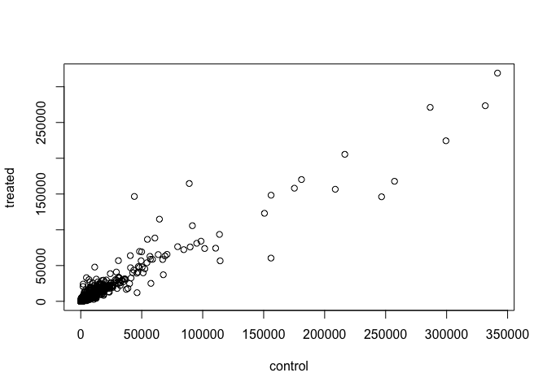
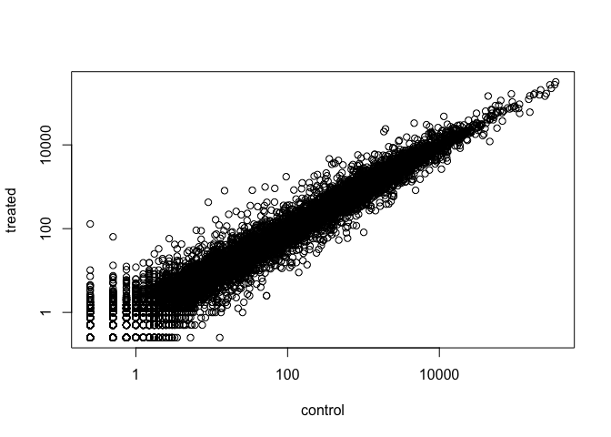

Introduction to DESeq2
================
Emily Armbruster

``` r
install.packages("BiocManager")
BiocManager::install()
# For this class, you'll also need DESeq2:
BiocManager::install("DESeq2")
```

\#Section
2

##### We have already downloaded the data for our introduction to DESeq2. These files are named “airway\_scaledcounts.csv” and “airway\_metadata.csv”.

##### Use “read.csv()” to read the count and metadata

``` r
counts <- read.csv("airway_scaledcounts.csv", stringsAsFactors = FALSE)
metadata <- read.csv("airway_metadata.csv", stringsAsFactors = FALSE)
```

##### Now take a look in each file:

``` r
head(counts)
```

    ##           ensgene SRR1039508 SRR1039509 SRR1039512 SRR1039513 SRR1039516
    ## 1 ENSG00000000003        723        486        904        445       1170
    ## 2 ENSG00000000005          0          0          0          0          0
    ## 3 ENSG00000000419        467        523        616        371        582
    ## 4 ENSG00000000457        347        258        364        237        318
    ## 5 ENSG00000000460         96         81         73         66        118
    ## 6 ENSG00000000938          0          0          1          0          2
    ##   SRR1039517 SRR1039520 SRR1039521
    ## 1       1097        806        604
    ## 2          0          0          0
    ## 3        781        417        509
    ## 4        447        330        324
    ## 5         94        102         74
    ## 6          0          0          0

``` r
head(metadata)
```

    ##           id     dex celltype     geo_id
    ## 1 SRR1039508 control   N61311 GSM1275862
    ## 2 SRR1039509 treated   N61311 GSM1275863
    ## 3 SRR1039512 control  N052611 GSM1275866
    ## 4 SRR1039513 treated  N052611 GSM1275867
    ## 5 SRR1039516 control  N080611 GSM1275870
    ## 6 SRR1039517 treated  N080611 GSM1275871

##### How many genes are in this dataset?

``` r
nrow(counts)
```

    ## [1] 38694

##### 38694 genes\!

##### How many experiments do we have?

``` r
ncol(counts) - 1
```

    ## [1] 8

##### 8 experiments total…

##### We can check the metadata to find out which ones are control experiments and which are experimental conditions. Click on it’s name in the “environment” panel. The “dex” column tells you which experiments are controls.

##### Let’s make sure that the metadata id col matches the colnames of counts

``` r
colnames(counts)[-1]
```

    ## [1] "SRR1039508" "SRR1039509" "SRR1039512" "SRR1039513" "SRR1039516"
    ## [6] "SRR1039517" "SRR1039520" "SRR1039521"

``` r
metadata$id
```

    ## [1] "SRR1039508" "SRR1039509" "SRR1039512" "SRR1039513" "SRR1039516"
    ## [6] "SRR1039517" "SRR1039520" "SRR1039521"

``` r
(colnames(counts)[-1] == metadata$id)
```

    ## [1] TRUE TRUE TRUE TRUE TRUE TRUE TRUE TRUE

##### So these two lists are identical\! The experiment names for the two tables match.

##### The all() function is useful for looking across a vector of logicals.

``` r
all(c(T, T, T))
```

    ## [1] TRUE

# Section 3: Toy with Differential Gene Expression

## NOTE: This analysis is for demonstration only. Never do differential expression analysis this way\!

##### So now our goal is to find out what effect the anti-asthma drug has on these cells.

#### First step: condense the data in the control settings into one set of values. Take the mean of the 4 control experiments’ data.

``` r
# First select the columns in the metadata file that are controls
control <- metadata[metadata[,"dex"]=="control",]
#Then take the average of the counts for each of the experiments selected in the previous step.
control.mean <- rowSums( counts[ ,control$id] )/4 
names(control.mean) <- counts$ensgene
```

##### Print out the different steps of this code to see what it’s making:

``` r
control
```

    ##           id     dex celltype     geo_id
    ## 1 SRR1039508 control   N61311 GSM1275862
    ## 3 SRR1039512 control  N052611 GSM1275866
    ## 5 SRR1039516 control  N080611 GSM1275870
    ## 7 SRR1039520 control  N061011 GSM1275874

``` r
counts[,control$id]
```

    ##       SRR1039508 SRR1039512 SRR1039516 SRR1039520
    ## 1            723        904       1170        806
    ## 2              0          0          0          0
    ## 3            467        616        582        417
    ## 4            347        364        318        330
    ## 5             96         73        118        102
    ## 6              0          1          2          0
    ## 7           3413       6000       6424       5039
    ## 8           2328       2640       2165       2175
    ## 9            670        692        917        744
    ## 10           426        531        740        414
    ## 11           191        287        256        173
    ## 12          2232       5252       2699       2495
    ## 13           556        619        666        517
    ## 14            74        212         22        134
    ## 15           560        934        706        581
    ## 16            16         14          8          7
    ## 17          1491       2438       2838       1817
    ## 18          1014       1135       1374        947
    ## 19           694       1052       1137        861
    ## 20           256        263        308        178
    ## 21             1          7          1          0
    ## 22           760        796        769        615
    ## 23          1460       1280       1428        829
    ## 24          7314       9639      11373       6885
    ## 25             2          1          1          3
    ## 26             1          4          0          0
    ## 27             5         28          2          4
    ## 28           172        104        130         94
    ## 29           391        415        424        311
    ## 30          7577       9125       7858       6996
    ## 31           230        273        247        200
    ## 32          1296        594         36         69
    ## 33          1954       1960       2096       1839
    ## 34           644        590        555        536
    ## 35           140        235         31        191
    ## 36             9          9          8         10
    ## 37            85        221        107        173
    ## 38           900        875        979        846
    ## 39           101        121         97        109
    ## 40          2065       2340       2828       1744
    ## 41          4665       6899       9138       3913
    ## 42           306        379        410        258
    ## 43          3095       3940       3701       2801
    ## 44            25         34         23         15
    ## 45            61         13         44         17
    ## 46          1589       1519       1747       1396
    ## 47           311        326        370        357
    ## 48          1501       1618       1746       1129
    ## 49          4107       3858       5515       2670
    ## 50          1349       1549       1568       1040
    ## 51             8          2          8          4
    ## 52           552        727        870        507
    ## 53          1345       1705       1796       1195
    ## 54          1246       2084       1715       1209
    ## 55            98         59         87        156
    ## 56          1376       1714       1293       1177
    ## 57           567        533        638        464
    ## 58         14175      13950      11255      15995
    ## 59           206        102         78        119
    ## 60           330        486        411        296
    ## 61            82        127        226        647
    ## 62             2          3          1          0
    ## 63            19         28         25         20
    ## 64            33         75          9         26
    ## 65             0          0          0          0
    ## 66           141        104        226        164
    ## 67           522       1077        600        548
    ## 68          1662       2114       1980       1823
    ## 69             9         12         17          8
    ## 70             0          0          0          0
    ## 71           444        541        651        361
    ## 72          1330       1146       1330        993
    ## 73             0          0          0          0
    ## 74          2288       2515       2227       1992
    ## 75           881        781        752        704
    ## 76          1581       1555       1472       1115
    ## 77           200        242        194        209
    ## 78             1          1          1          0
    ## 79           631        719        730        481
    ## 80           440        554        530        402
    ## 81             1          0          3          0
    ## 82            10          6          8         12
    ## 83           370        370        402        247
    ## 84           334        318        596        350
    ## 85            24         35         33         34
    ## 86            78         89        114        104
    ## 87           438        620        522        324
    ## 88           748        767        747        583
    ## 89           801        853        991        615
    ## 90          1171       1236        931       1037
    ## 91           227        279        284        212
    ## 92           441        488        579        381
    ## 93          2660       3240       3210       2479
    ## 94           213        120        150        157
    ## 95             3          7          0          8
    ## 96             0          0          1          0
    ## 97           313        292        343        273
    ## 98           241        267        233        171
    ## 99           503        344        629        485
    ## 100           67         61         18         49
    ## 101         1863       1921       2491       1704
    ## 102          741       1121       1113        900
    ## 103           10          5          4          3
    ## 104          543        790        657        574
    ## 105          210        298        321        206
    ## 106         3126       3159       3415       2792
    ## 107         1493       1472       1192       1305
    ## 108            5          1          9          3
    ## 109          954       1254       1413       1147
    ## 110          701       1582       1392       1253
    ## 111          792        766        852        947
    ## 112         5053       6271       5773       4612
    ## 113            9         24         11         10
    ## 114            4          4          8         16
    ## 115         2249       3008       3340       1979
    ## 116          544        416        261        429
    ## 117          154         91         92        269
    ## 118          226        229        202        179
    ## 119         3108       3486       3876       2990
    ## 120            0          1          1          1
    ## 121            0          0          0          0
    ## 122          335        333        415        252
    ## 123            0          0          0          0
    ## 124            0          1          2          0
    ## 125          528        604        832        405
    ## 126         7030       7725       7765       5601
    ## 127            0          1          0          0
    ## 128          527        612        665        477
    ## 129            9          9          9         18
    ## 130         1765       1340       1610       1418
    ## 131          100         48        124         89
    ## 132          523        708        767        645
    ## 133            0          0          0          0
    ## 134            8         12         11          2
    ## 135         1833       1094       1629       1084
    ## 136          214        260        272        247
    ## 137          381        461        459        444
    ## 138          190        167        136        352
    ## 139          251        292        444        208
    ## 140          885       1380       1439        589
    ## 141            9          6          2          7
    ## 142          946       1612       1267       1419
    ## 143            3          8          8          2
    ## 144          709        971        812        770
    ## 145            0          0          0          0
    ## 146          195        196        254        150
    ## 147          132        104         90        122
    ## 148           76        105         65         72
    ## 149          922       1022       1662       1135
    ## 150            1          0          3          3
    ## 151          184        200        220        128
    ## 152          337        380        274        272
    ## 153          985       1550       1562       1114
    ## 154         2045       2949       2865       2122
    ## 155           42         33         52         57
    ## 156          836       1008       1253        629
    ## 157           18         35         18         38
    ## 158          538        591        664        548
    ## 159          161        176        223        168
    ## 160            5          0          5          1
    ## 161         1055       1170       1174        901
    ## 162           72         90        100         76
    ## 163            2          5          3          0
    ## 164            0          2          0          1
    ## 165          641        925       1247        754
    ## 166            3          6          3          1
    ## 167          633        707        797        486
    ## 168            0          0          0          0
    ## 169         3486       4955       4943       3468
    ## 170            0          0          2          5
    ## 171            1          3          4          2
    ## 172         6595       7849       7838       5646
    ## 173            0          0          0          0
    ## 174          378        304        282       1233
    ## 175          140        124        130        109
    ## 176            3          4          2          3
    ## 177            0          0          0          0
    ## 178            1          0          5          1
    ## 179            0          2          1          1
    ## 180          274        282        302        256
    ## 181            0          0          0          0
    ## 182           29         32         29         65
    ## 183          278        222        341        221
    ## 184         2000       1951       1940       1657
    ## 185          792        766        857        632
    ## 186           21         24         12         18
    ## 187            6          6         25         14
    ## 188          655        632        602        529
    ## 189          710        694        651        528
    ## 190          615        771        663        481
    ## 191         1522       1701       1350       1069
    ## 192            0          0          0          0
    ## 193          880       1095       1375        917
    ## 194          782       2205        223        277
    ## 195          368        535        520        327
    ## 196           11          7         10          4
    ## 197            4          6          3          3
    ## 198         1674       1789       1595       1329
    ## 199            7         24         15         13
    ## 200          274        283        300        232
    ## 201          323        585        428        370
    ## 202            2         13         14         10
    ## 203          574        657        345        676
    ## 204         1345       1441       1357       1134
    ## 205            1          6          0          0
    ## 206            0          0          0          0
    ## 207            8         13          6          8
    ## 208         1746       3066       2924       2096
    ## 209           28         18         15         20
    ## 210         1959       1966       1827       1841
    ## 211          594        645        565        424
    ## 212         2688       3950       3465       3166
    ## 213           55        127        104         59
    ## 214          478        549        423        451
    ## 215            8          7         16         10
    ## 216          112         85        105        113
    ## 217          156        167        198        133
    ## 218         2589       3127       8070       2426
    ## 219          296        269        288        318
    ## 220            0          1          1          0
    ## 221        14126      13469      12014      12268
    ## 222         2256       1760       2489       1585
    ## 223           19         31         23         35
    ## 224          179        210         66        195
    ## 225         5059       5307       4361       4276
    ## 226           15         21         19         18
    ## 227         1320       1229       1355       1089
    ## 228          644        956        837        736
    ## 229          796        799        778        585
    ## 230         4233       5671       6442       5176
    ## 231        13036      13193      11543       9597
    ## 232        15086      19963      20102      13922
    ## 233         1932       2275       2561       1760
    ## 234         5320       6250       6761       5883
    ## 235           18          2          4          1
    ## 236            0          0          0          0
    ## 237           40         60         46         46
    ## 238           12          4          1          5
    ## 239          150        173        165        154
    ## 240            3          6         10          3
    ## 241          381        546        431        408
    ## 242          829       1092       1201        760
    ## 243           10          6          3          4
    ## 244         2827       3352       3688       2866
    ## 245         1510       1804       2124       1689
    ## 246           30         22         17         18
    ## 247          194        203        216        183
    ## 248          959       1177       1089        836
    ## 249          262        326        314        213
    ## 250         2884       2943       3710       1916
    ## 251         1649       1587       1940       1337
    ## 252          888        884        964        602
    ## 253         3133       3747       2633       3486
    ## 254            0          0          0          0
    ## 255         1407       1356       1409       1106
    ## 256         1471       1679        897       1194
    ## 257           27         30         22         24
    ## 258           61         81         71         85
    ## 259            1          1          0          0
    ## 260         2581       3157       3739       2585
    ## 261            0          1          0          5
    ## 262          273        312        208        205
    ## 263            0          7          0          0
    ## 264         2447       3319       3261       2668
    ## 265            7         12         19         35
    ## 266          140        166        183        121
    ## 267           37         97        122         31
    ## 268          151        210        179        159
    ## 269            0          0          3          0
    ## 270          508        674        503        487
    ## 271          770        858        995        637
    ## 272         1783       1607       2566       1353
    ## 273         1884       1633       1992       1771
    ## 274           16         70          0         16
    ## 275         1470       1388       1533       1096
    ## 276          451        518        579        399
    ## 277          879        655        719        658
    ## 278        17930      25972      17814      16783
    ## 279          307        298        274        270
    ## 280            0          1          1          0
    ## 281         3095       3524       3490       3913
    ## 282          721        606        686        528
    ## 283          198        301        258        178
    ## 284          207        226        159        161
    ## 285          586        820       1219        581
    ## 286            2          1          0          0
    ## 287          823        963       1072        685
    ## 288          473        405        464        404
    ## 289          489        369        444        321
    ## 290         1680       1932       2206       1579
    ## 291          428        466        459        370
    ## 292         3395       3193       4152       2853
    ## 293           25         18         10          6
    ## 294          174        157        217        269
    ## 295          547        448        436        389
    ## 296         1181       1462       1906       1419
    ## 297          399        489        347        380
    ## 298          265        239        346        276
    ## 299         1536       1596       1630       1356
    ## 300         1864       2363       2468       1934
    ## 301       218156     427652     302872     378108
    ## 302           95        138        143        102
    ## 303          818        963       1131        692
    ## 304          752        999       1002        679
    ## 305          851       1434       1367        813
    ## 306            6          7          3          0
    ## 307            0          4          0          3
    ## 308          975        771        837        873
    ## 309            0          1          1          0
    ## 310          332        485        411        286
    ## 311         1160       1519       1388        914
    ## 312            4          4          7          0
    ## 313         1860       2108       1281       1485
    ## 314          722        848        856        635
    ## 315          109        138        134        120
    ## 316            0          0          3          0
    ## 317         1271       1370       1652       1015
    ## 318            0          0          0          0
    ## 319         2069       2572       2236       1881
    ## 320            0          0          0          0
    ## 321          887        993       1227          8
    ## 322         4687       6913       6323       4768
    ## 323          333        451        320        363
    ## 324         1997       2569       2816       1822
    ## 325         2070       1763       1808       1165
    ## 326          503        518        503        368
    ## 327         3106       4085       3913       2297
    ## 328          222        389        424        472
    ## 329         6526       5336       5069       5341
    ## 330         1015       1095       1303        829
    ## 331         9639       9096       8309       7326
    ## 332         1208       1788       2071       1210
    ## 333         1452       1762       1874       1505
    ## 334          226        275        299        277
    ## 335         2515       2337       3115       2183
    ## 336          336        369        399        228
    ## 337          428        483        530        380
    ## 338          770       1054       1104        746
    ## 339          406        770        799        412
    ## 340          331        264        240        241
    ## 341         1258       1497       1670       1053
    ## 342          594        975        802        435
    ## 343          757       1256       1296        879
    ## 344           11          6         13          4
    ## 345           95        124         69         77
    ## 346          934       1014       1088        867
    ## 347          190        276        152        199
    ## 348          578        546        523        238
    ## 349         3114       3956       3546       2910
    ## 350           26         21         23         23
    ## 351         1613       1892       1768       1287
    ## 352         1102       1449       1672       1098
    ## 353          597        775        642        651
    ## 354          714        728        830        524
    ## 355            5          1          4          1
    ## 356          183        273        320        246
    ## 357         2042       2663       2867       2064
    ## 358            7         12          7          2
    ## 359            0          0          2          0
    ## 360          270        406        525        273
    ## 361         5543       6399       7971       4386
    ## 362           22         23         65         18
    ## 363          724        782        768        579
    ## 364          210        173        295         52
    ## 365            0          0          1          1
    ## 366         1829       1866       1773       1472
    ## 367            0          1          0          0
    ## 368          155        157         89        219
    ## 369           22          8         13         18
    ## 370            0          0          0          2
    ## 371            1          0          0          0
    ## 372         1537       1959       1508       1612
    ## 373         2792       3487       3693       3112
    ## 374         1100       1138        513        932
    ## 375          703        566        528        647
    ## 376         2930       2819       3442       2560
    ## 377         1110       1108       1404        894
    ## 378          101         27         58         55
    ## 379           23         19         17          9
    ## 380         3114       2997       3449       2097
    ## 381          850        846        788        876
    ## 382            0          0          0          1
    ## 383          315        355        350        252
    ## 384          285       3356        262        467
    ## 385          255        268        324        280
    ## 386           63         71         74         47
    ## 387            1          3         16          3
    ## 388         3326       3783       3457       2583
    ## 389            0          0          0          0
    ## 390           65          8          9         24
    ## 391          314        320        264        222
    ## 392            1          2          2          0
    ## 393         3353       2830       3797       2238
    ## 394           22        101         30         70
    ## 395         1517       1399       2590       1588
    ## 396         1356       1592       2005       1272
    ## 397         1459       1272       1423       1142
    ## 398        11137      11659      11307      11468
    ## 399            0          0          1          1
    ## 400          373        413        403        329
    ## 401          196        311        329        177
    ## 402         2269       1925       1984       1878
    ## 403          143         90          7        105
    ## 404          562        553        543        492
    ## 405           19         22         15         24
    ## 406          588        662        610        389
    ## 407            3          6          2          2
    ## 408            5          4          7          1
    ## 409          527        563        587        455
    ## 410            9         47         13         18
    ## 411         1443       1032       1363       1088
    ## 412         1228       1378       1793       1050
    ## 413          404        461        302        351
    ## 414            0          0          0          0
    ## 415         7166      11992       8451       9649
    ## 416         1947       2425       2380       1862
    ## 417            0          0          0          0
    ## 418            5          4          5          3
    ## 419          146        156        186        147
    ## 420         2564       3094       2940       2438
    ## 421          205        206        188        178
    ## 422          674        697        805        532
    ## 423           62        120        247         88
    ## 424         2903       2997       2028       2000
    ## 425         1597       2041       2123       1451
    ## 426         2603       2881       3485       2473
    ## 427         1340       1476       1576       1171
    ## 428         1025       1159       1519        856
    ## 429           78         59         66         42
    ## 430         1937       2110       2267       1858
    ## 431           96         97         91         89
    ## 432          230        430        426        254
    ## 433          460        510        569        373
    ## 434         1655       2171       2429       1574
    ## 435           23         23          9          9
    ## 436            7          5         11          2
    ## 437          654        618        863        497
    ## 438         1079       1324       1347       1135
    ## 439         1322       1558       1412       1166
    ## 440        10748      12572      13761       9077
    ## 441           22         22         28         22
    ## 442          210        287        251        168
    ## 443            3          8         19          6
    ## 444          302        300        339        232
    ## 445         1417       1516       2042       1486
    ## 446          235        605        104        236
    ## 447          403        513        399        295
    ## 448          136        110        136         74
    ## 449          426        444        357        308
    ## 450          840        933       1528        627
    ## 451         3318       4840       4059       3299
    ## 452         1962       2372       2626       1760
    ## 453        98471     119665     117016     107280
    ## 454          322        381         99        199
    ## 455          991       1425       1395       1029
    ## 456          266        288        295        218
    ## 457        19783      29627      30110      25406
    ## 458           34         16         47         32
    ## 459          556        359        600        203
    ## 460            0          2          1          0
    ## 461         1003       1098       1019        703
    ## 462          548        794        651        806
    ## 463           78         75         83         85
    ## 464            1          1          2          0
    ## 465         1353       1341       1561       1070
    ## 466          453        568        484        384
    ## 467            1          1          0          0
    ## 468          225        275        332        281
    ## 469          403        596        282        340
    ## 470          997       1720       1312       1178
    ## 471           68         38        227         20
    ## 472          524        718        721        515
    ## 473         3551       4343       4526       2721
    ## 474          490        496        682        492
    ## 475          311        422        450        307
    ## 476         3179       4444       4022       3213
    ## 477         1468       1628       1712       1449
    ## 478           69        156        127         70
    ## 479            0          5          0          0
    ## 480          129        128        105        114
    ## 481         1589       2424       2494       1746
    ## 482          495        928        898        642
    ## 483          978       1050       1006        935
    ## 484          183        193        204        159
    ## 485           35         41         19         35
    ## 486          227        239        201        188
    ## 487        10961      13343      13342      12035
    ## 488         1339       1665       1486       1502
    ## 489          464        463        496        404
    ## 490           58         83        114         91
    ## 491         3373       4016       3679       3295
    ## 492         1565       2421       2243       1789
    ## 493          701        782        800        639
    ## 494          238        314        214        139
    ## 495         1317       1821       1788       1162
    ## 496          287        344        334        253
    ## 497          521        622        625        500
    ## 498          395        464        454        345
    ## 499         1036       1257       1615        991
    ## 500         2425       2652       2793       2076
    ## 501            9          9         10         13
    ## 502         1457       2170       2306       1325
    ## 503          979       1532       1241        893
    ## 504         1158       1271       1349       1044
    ## 505          758        961        915        851
    ## 506         1118       1206       1074        887
    ## 507         2526       3813       3589       3543
    ## 508           46         21         48         18
    ## 509          886        924        671       1123
    ## 510           14         17         10          3
    ## 511        11323      17313      18277      11782
    ## 512          142        152        186        166
    ## 513          837       1106        792        728
    ## 514          345        420        614        295
    ## 515         1332       1392       1389       1101
    ## 516          339       1033         99        426
    ## 517          650        583        603        530
    ## 518          364        382        378        355
    ## 519        11492      17242       9835      12512
    ## 520           21         19         16         15
    ## 521          168        631        180        601
    ## 522         1162       1307       1407       1118
    ## 523          866       1039       1180        932
    ## 524            0          0          0          0
    ## 525        51281      66689      67911      49403
    ## 526         1042       1126       1216       1113
    ## 527         1278       1180       1433       1054
    ## 528         1672       2047       2419       1421
    ## 529            7          6          6          0
    ## 530            0          0          1          0
    ## 531           43         45         32         76
    ## 532         1008        951        903        805
    ## 533            3          1          5          3
    ## 534           20         11         23          6
    ## 535            0          0          0          0
    ## 536          440        568        519        394
    ## 537          296        297        367        187
    ## 538            9         15         15          6
    ## 539          766        806       1098        543
    ## 540          632        701        635        467
    ## 541          386        540        479        436
    ## 542          397        434        442        184
    ## 543           71        116        125        125
    ## 544            6          8         23         56
    ## 545          792        806        561        692
    ## 546          410        390        319        354
    ## 547         2660       2596       2859       1974
    ## 548         1642       1446       1562       1321
    ## 549           13         35          5          0
    ## 550         1004       1338       1245        774
    ## 551         6242       7550       6347       7010
    ## 552         9784      12674      11144      10615
    ## 553          743        796        953        613
    ## 554          112        112        328        257
    ## 555           12          8         13          7
    ## 556         1387       1806       1781       1205
    ## 557          177        306        274        231
    ## 558         1050       1441       1453       1053
    ## 559         1783       1795       1936       1675
    ## 560            2         13         16         11
    ## 561         3738       5161       5381       4333
    ## 562            2          3          7          2
    ## 563          475        375        363        281
    ## 564            1          4          2          4
    ## 565          268        311        360        340
    ## 566          235        359        269        219
    ## 567          707        978        982        592
    ## 568          227        207        266        221
    ## 569          476        592        607        579
    ## 570            3          4          1          2
    ## 571          858        921       1276        711
    ## 572          121        109         42        194
    ## 573          762        852        773        675
    ## 574           29         23        391         20
    ## 575         1326       1547       1475       1086
    ## 576            3          3          2          2
    ## 577          527        628        722        468
    ## 578          383        474        339        369
    ## 579         3271       7309       2381       6763
    ## 580          193        219        238        188
    ## 581         1517       1191       2031       1167
    ## 582          212        256        312        232
    ## 583          450        583        520        403
    ## 584            4          5          3          1
    ## 585          221        249        250        250
    ## 586          381        402        530        356
    ## 587         1401       1835       1675       1101
    ## 588          813       1109        883       1387
    ## 589         1145       1388       1171        957
    ## 590            4          3          6          6
    ## 591            0          0          0          0
    ## 592           24         56         52         17
    ## 593            4         14         13         16
    ## 594            0          1          3          1
    ## 595          686        704        948        576
    ## 596         1585       1711       1461       1214
    ## 597            0          0          0          0
    ## 598            0          0          0          0
    ## 599          213        313        295        239
    ## 600            0          1          1          2
    ## 601            0          0          0          0
    ## 602         1604       1685       1526       1232
    ## 603         7374      10501       8981       7004
    ## 604          412        394        413        460
    ## 605          498        718        778        382
    ## 606           54         38         41         72
    ## 607        16885      19883      16603      10648
    ## 608           22         73          0         70
    ## 609          306        348        356        377
    ## 610          359        518        682        781
    ## 611          100        289        662        241
    ## 612            0          1          1          1
    ## 613           56        124         27         39
    ## 614          509        566        506        484
    ## 615          771        664        680        745
    ## 616          378        292        355        341
    ## 617          873        967        953        767
    ## 618         2664       2422       2832       2304
    ## 619          830        835        871        689
    ## 620           42        156         13         50
    ## 621         4915       5486       5485       4652
    ## 622           11         25          6         26
    ## 623          875       1054       1156        620
    ## 624          245        246        265        220
    ## 625            1          1          0          1
    ## 626           10         12          6          7
    ## 627          463        567        617        411
    ## 628          357        578        442        381
    ## 629         1203       1714       1704       1285
    ## 630          616        451        432        439
    ## 631            7          8          4          6
    ## 632        15464      18872      19035      13099
    ## 633         1617       1917       1941       1454
    ## 634            0          1          6          0
    ## 635          437        579        568        566
    ## 636          317        577        590        445
    ## 637          826        923       1079        752
    ## 638          144        198        164        179
    ## 639          881       1087       1089        912
    ## 640         1635       1846       1462       1247
    ## 641          349        352        386        285
    ## 642            0          0          1          1
    ## 643         1651       2521       1792       1719
    ## 644           28         37         82         25
    ## 645          794        879        802        656
    ## 646            2         17         10          4
    ## 647         1572       1897       2089       1418
    ## 648         2111       3534       2248       2291
    ## 649         5021       4519       3850       3813
    ## 650         4149       4612       5416       3435
    ## 651          605        623        797        499
    ## 652           93        104        127         70
    ## 653         2839       3426       4709       2103
    ## 654          232        227        166        141
    ## 655          162        278        258         57
    ## 656         5872       6818       4582       5336
    ## 657         3228       3828       3786       2827
    ## 658          378        303        519        420
    ## 659            0          1          4          0
    ## 660           22         30         26         26
    ## 661           15         16         17         19
    ## 662        14366      19773      18483      13936
    ## 663         6334       6408       7725       5827
    ## 664         4716       8340       2952       6176
    ## 665          163        211        147        144
    ## 666         2039       1678       2393       1689
    ## 667         1031       1187       1345        973
    ## 668         1833       2217       2100       1812
    ## 669            2          4          2          1
    ## 670          125         87        135         71
    ## 671         3927       5167       5899       4080
    ## 672          402        486        397        326
    ## 673            0          0          0          0
    ## 674          879       1256       1345        805
    ## 675        12605      20829      19401      16298
    ## 676          240        616        254        373
    ## 677          183        230        336        168
    ## 678          459        603        666        469
    ## 679         6346      12985      12341       8046
    ## 680          939       1167       1061        915
    ## 681          102        115        155        125
    ## 682          103         36        174         51
    ## 683          337        509        406        293
    ## 684            6          9         20          4
    ## 685          906       1149       1081        833
    ## 686            0          0          0          0
    ## 687         1149       1209       1394       1034
    ## 688          416        448        511        407
    ## 689         1663       2228       2347       1389
    ## 690          969       1065       1389       1011
    ## 691           17         32         22         54
    ## 692           22         33         16         54
    ## 693          340        354        411        288
    ## 694          759        665        557        590
    ## 695          169        206        169        151
    ## 696         1116       1212        961        982
    ## 697          271        327        293        235
    ## 698         1521       1846       2290       1307
    ## 699            0          6          2          1
    ## 700          726        640        696        678
    ## 701          354        444        498        286
    ## 702          438        595        823        468
    ## 703          373        447        316        244
    ## 704         2204       2935       3417       2260
    ## 705            9          4          0         65
    ## 706            5          9          0          2
    ## 707         3743       3234       4253       3107
    ## 708           21         21          2         12
    ## 709         1011        956        964        853
    ## 710          340        381        359        328
    ## 711           45         36         23         78
    ## 712          336        385        330        279
    ## 713           35         38         63         39
    ## 714           29         69         40         44
    ## 715          749        447       1260        768
    ## 716          638        819        802        632
    ## 717          514        699        536        543
    ## 718            0          0          2          0
    ## 719          729        814        789        674
    ## 720         2977       3404       3495       2534
    ## 721         1290        996        940        719
    ## 722            1          5          2          4
    ## 723           14         39         21         57
    ## 724         1060       1449       1511       1079
    ## 725          346        304        354        281
    ## 726          263        153        275        308
    ## 727           34         29         14         30
    ## 728           52         61         67         43
    ## 729         1580       1733       1803       1446
    ## 730          470        424        612        641
    ## 731          615        753        658        564
    ## 732         1709       2043       1708       1765
    ## 733           16          6         39         40
    ## 734         2789       3446       3172       3359
    ## 735            0          0          1          0
    ## 736            0          0          0          0
    ## 737           93        137        176        140
    ## 738         1972       2452       2425       1857
    ## 739           17          9         22         21
    ## 740          653        877        731        516
    ## 741          495        560        581        442
    ## 742         3325       4271       4101       3002
    ## 743           53         22          2          9
    ## 744         1201       1280       1460       1131
    ## 745          529        650        554        480
    ## 746          492        369        424        257
    ## 747         1656       1805       2095       1389
    ## 748         1901       2794       2497       1989
    ## 749         2374       2331       2693       1722
    ## 750          981        921        768        750
    ## 751         2723       2111       2612       1789
    ## 752          155        125        108        105
    ## 753           77        103         25        183
    ## 754         2359       2371       2516       2053
    ## 755          885        819        747        565
    ## 756           16         14         18         28
    ## 757            0          0          0          0
    ## 758          358        312        435        288
    ## 759         2581       3279       3899       2581
    ## 760          170        203        241        150
    ## 761            0          0          0          2
    ## 762            0          0          0          0
    ## 763          199        263        174        197
    ## 764         1230       1541       1552       1096
    ## 765          112        106         85        125
    ## 766          507        475        654        374
    ## 767          262        289        282        196
    ## 768         2581       2784       3893       2362
    ## 769            0          0          0          0
    ## 770          924        905       1227       1072
    ## 771           15         11          9         16
    ## 772            5          2          4          7
    ## 773            2         11          4          9
    ## 774         3707       3860       3770       3016
    ## 775          150        202        203         87
    ## 776          577        532        523        493
    ## 777           35         12         23         11
    ## 778          494        570        638        471
    ## 779          816       1017       1340        823
    ## 780          363        411        649        405
    ## 781         1312       1835       1750       1771
    ## 782           54         69         65         35
    ## 783         1277       1701       1803       1185
    ## 784        11775      14219      13308      10837
    ## 785         1412       1904       2181       1529
    ## 786            2          2          9          1
    ## 787            1          7          0          9
    ## 788          696        587        772        506
    ## 789          404        637        622        418
    ## 790         9826      15544      12581      10527
    ## 791         4744       4337       4589       3983
    ## 792          386        469        565        409
    ## 793          326        502        517        349
    ## 794          276        309        283        238
    ## 795           11          8          6          2
    ## 796         1367       1653       1049       1267
    ## 797          499        739        584        472
    ## 798           14         10         29         13
    ## 799          279        267        286        211
    ## 800         1671       1767       1983       1538
    ## 801          392        537        327        401
    ## 802          400        412        467        279
    ## 803          248        194        200        191
    ## 804          961       1124       1238        814
    ## 805          254        333        384        253
    ## 806         1347       1187       1456       1058
    ## 807          171        129        255        162
    ## 808          490        441        542        388
    ## 809         4418       4396       5429       3362
    ## 810            0          4          6          0
    ## 811         5494       6432       7586       4876
    ## 812            0          0          0          0
    ## 813         1569       1569       2399       1361
    ## 814         1053        980        983        871
    ## 815            0          1          1          0
    ## 816            0          1          0          0
    ## 817          249        369        274        266
    ## 818          360        670        281        371
    ## 819          442        524        586        441
    ## 820            0          1          1          0
    ## 821           86        242         87        102
    ## 822         1119       1079       1211       1077
    ## 823          275        322        252        240
    ## 824          647        964        951        600
    ## 825         2433       2948       2712       3073
    ## 826         2798       2972       2443       2498
    ## 827           91        128         89         87
    ## 828         1143       1607        973        866
    ## 829            0          0          0          0
    ## 830           47        107         94         77
    ## 831         5306       5175       6107       5231
    ## 832          492        612        606        516
    ## 833         1760       1874       1578       1771
    ## 834          820        986        965        752
    ## 835          690        594        616        470
    ## 836         1360       1796       1547       1442
    ## 837            2         10         13          8
    ## 838            2          2          2          0
    ## 839         1118       1310       1327       1098
    ## 840           19         15         74         32
    ## 841          231        165        176        127
    ## 842         1963       2057       2451       1675
    ## 843            4          0          2          2
    ## 844          756        710        771        529
    ## 845         1200       1147       1438       1085
    ## 846         1133       1228       1174       1022
    ## 847         2671       3308       3121       2196
    ## 848         2093       1688       2329       1628
    ## 849          259        138        152        106
    ## 850            0          2          3          5
    ## 851        14380      16261      15575      11865
    ## 852           32         12         42         48
    ## 853          227        366        256        210
    ## 854          313        372        355        218
    ## 855         9590       9806       9013       6794
    ## 856           67        203        166        161
    ## 857          417        430        458        303
    ## 858         2321       2437       2389       1818
    ## 859         2500       2749       2456       1864
    ## 860         1382       1694       1814       1194
    ## 861          541        798       1116        801
    ## 862            0          0          0          0
    ## 863          584        568        642        480
    ## 864          686        868        934        639
    ## 865         5824       7024       5453       4117
    ## 866          102        128        126        127
    ## 867          316        445        385        367
    ## 868         1192       1353       1377       1065
    ## 869          347        442        472        321
    ## 870          499        420        516        283
    ## 871          360        405        577        320
    ## 872         1187       1247       1088        777
    ## 873            0          0          0          0
    ## 874          154        272        240        153
    ## 875           36         32         34         18
    ## 876         1456       4473       3262       1741
    ## 877            0          0          0          0
    ## 878           29         46         49         60
    ## 879            6          3          7         13
    ## 880            2          2          2          0
    ## 881          640        772        320        741
    ## 882          741        885        911        779
    ## 883         2260       2190       2581       1939
    ## 884         1347       1576       1662       1244
    ## 885          106        120        126         90
    ## 886          394        482        402        261
    ## 887          369        331        324        286
    ## 888           29         52         57         36
    ## 889         9407      12749      12509       9823
    ## 890         1732       2052       1810       1405
    ## 891          332        578        731        522
    ## 892          214        274        364        210
    ## 893           64        192         62         99
    ## 894         6315       9283       7806       6730
    ## 895          125        305        214        155
    ## 896          123        157         21         78
    ## 897          323        354        360        231
    ## 898         1848       2420       2626       1671
    ## 899          184        229        458        226
    ## 900            5         15          7         20
    ## 901            0          0          0          0
    ## 902         1027       1533       2124       1048
    ## 903          739        609        449        520
    ## 904          353        469        410        394
    ## 905         1168       1168       1306        979
    ## 906           54         48         59         16
    ## 907          252        354        269        237
    ## 908          603        826        800        609
    ## 909         4612       4404       5043       3498
    ## 910          408        550        606        384
    ## 911          941        893       1049        973
    ## 912          119        137        139        119
    ## 913          424        448        490        363
    ## 914         2154       1922       2055       1763
    ## 915         4410       5124       4706       5023
    ## 916         2953       3405       2870       2778
    ## 917          602        560        640        393
    ## 918         1405       1388       1847       1327
    ## 919          325        262        270        219
    ## 920         9864      10270      11157       8599
    ## 921         4762       4678       2000       3466
    ## 922            6          1         12          0
    ## 923           19         11          8          5
    ## 924          970       1213       1153        830
    ## 925           14         53         23         23
    ## 926            1          0          0          0
    ## 927          148        371        366        345
    ## 928         1929       2284       2307       1450
    ## 929          270        289        363        218
    ## 930          759        961        783        899
    ## 931          384        391        439        338
    ## 932          761        941       1058        692
    ## 933         1358       1412       1195        855
    ## 934        17517      26844      19964      15202
    ## 935          935       1081       1191        873
    ## 936          639        618        756        521
    ## 937           76        129        134        104
    ## 938            3          0          0          0
    ## 939         1499       2086       2345       1594
    ## 940          400        424        400        267
    ## 941           13          1          3          2
    ## 942           40        152        135         69
    ## 943          158        179        214        162
    ## 944            1          0          1          0
    ## 945          284        154        205        137
    ## 946         1270       1172       1168       1073
    ## 947         2480       5215       3416       2663
    ## 948          809        874       1308        619
    ## 949          574        929        892        638
    ## 950         1155       1283       1377        891
    ## 951          616        775        678        706
    ## 952          846       1828       1536       1026
    ## 953          806        831        846        726
    ## 954        11695      12584      11622       9494
    ## 955          699        697        827        630
    ## 956          670        762        778        672
    ## 957            3          5          1          0
    ## 958         1168       1201       1218        968
    ## 959            4         13          5          2
    ## 960         1316        979       1237        966
    ## 961          650        882       1171        722
    ## 962         1295       1301       1384        972
    ## 963          426        537        578        460
    ## 964           26         32         22          9
    ## 965          234        174         88        118
    ## 966            3          2          3          4
    ## 967           83        268        193        121
    ## 968            7         11          9          7
    ## 969          931       1011       1003        751
    ## 970            0          2          1          2
    ## 971           21         17         21         23
    ## 972           26         31          1         39
    ## 973           25         37         30         30
    ## 974          633        685        636        578
    ## 975          512        990       1005        461
    ## 976         1223       1734       1734       1198
    ## 977           80         46          9         75
    ## 978          374        314        376        273
    ## 979          435        286        274        264
    ## 980         2735       2797       3357       2901
    ## 981          212        299        233        247
    ## 982          817        928        825        706
    ## 983         1059        940       1346        983
    ## 984            5          5          0          6
    ## 985         1654       1839       1626       1404
    ## 986         1524       1866       1718       1489
    ## 987           29         13          6         18
    ## 988          248        259        326        194
    ## 989          300        333        325        316
    ## 990          179        231        228        182
    ## 991          415        653        716        478
    ## 992         1127       1098       1345        987
    ## 993         1385       1283       1503          1
    ## 994         2233       2148       2644       2196
    ## 995          568        477        410        275
    ## 996         1981       2653       2589       1937
    ## 997         2450       2632       2465       1762
    ## 998         2116       2267       2564       2749
    ## 999         1276       1577       1001       1292
    ## 1000        8948      15421      15521       8933
    ## 1001         227        489        474        327
    ## 1002        3791       4481       5360       3078
    ## 1003         117        162        161        193
    ## 1004         701        884        752        677
    ## 1005         376        493        397        401
    ## 1006       26386      28783      30362      19468
    ## 1007        1407       1373       1392       1097
    ## 1008         792       1029       1105        683
    ## 1009         412        401        461        235
    ## 1010        2878       2894       3221       2228
    ## 1011         890        957       1086        710
    ## 1012         152        417        377        195
    ## 1013        8178      12167      10603       8008
    ## 1014        1029       1331       1209        961
    ## 1015          16         18         12         12
    ## 1016          14         22         19         16
    ## 1017         348        351        447          0
    ## 1018        2824       2917       3293       2461
    ## 1019           5         10         33          8
    ## 1020         395        423        447        261
    ## 1021         842        885       1015        728
    ## 1022         161        244        240        194
    ## 1023          15         16         27         11
    ## 1024           5          3          5          7
    ## 1025        1913       2677       2738       2148
    ## 1026         532        558        647        509
    ## 1027          65         79         48         44
    ## 1028         703        810        899        601
    ## 1029         507        548        697        634
    ## 1030         715        704        569        708
    ## 1031          14         10          2          6
    ## 1032         396        413        377        286
    ## 1033         389        538        453        304
    ## 1034         852        908        935        708
    ## 1035         438        542        345        331
    ## 1036        1330       1753       1685       1418
    ## 1037        1367       1653       1616       1159
    ## 1038        2210       2614       2718       2065
    ## 1039         341        348        349        264
    ## 1040        4068       3486       7392       3509
    ## 1041         642       1119        611       1068
    ## 1042         350        372        399        287
    ## 1043         606        794        787        496
    ## 1044         452        446        477        304
    ## 1045         134         88        124        116
    ## 1046           1          0          0          0
    ## 1047         970       1175       1174        955
    ## 1048        1054       1251       1451       1010
    ## 1049        8944       9390      12500       8349
    ## 1050        1088       1438       1056       1018
    ## 1051         969       1200        914        730
    ## 1052          35         72        141        113
    ## 1053         362        374        392        298
    ## 1054         646        771        723        479
    ## 1055          43         66         37         38
    ## 1056        1315       1617       1758       1318
    ## 1057        1627       2379       2146       1810
    ## 1058         647        645        688        550
    ## 1059        1701       2299       2103       1703
    ## 1060         480        470        586        461
    ## 1061          35         46         28         35
    ## 1062           0          0          0          0
    ## 1063         142         97         12        198
    ## 1064           0          0          0          0
    ## 1065         989       1065       1119        990
    ## 1066           0          1         22          0
    ## 1067          44         13          5         10
    ## 1068           0          0          0          0
    ## 1069        1195       1104       1110       1031
    ## 1070        5673       7212       7676       7366
    ## 1071        3648       3447       3399       3426
    ## 1072        1320       1320       1520       1216
    ## 1073         376        583        589        307
    ## 1074         144        227        209        171
    ## 1075         608       1056        635       1000
    ## 1076           5          7         13          5
    ## 1077          89        137        154        124
    ## 1078         144        193        179        121
    ## 1079         231        373        108        309
    ## 1080         568        440        596        515
    ## 1081           4          3          6          2
    ## 1082        3830       4393       5176       3188
    ## 1083         156        229        184        140
    ## 1084           3          4          1          1
    ## 1085           5         17          5          7
    ## 1086        1505       2162       2478       1179
    ## 1087        1231       1571       1766       1379
    ## 1088         306        319        369        288
    ## 1089        1087        943       1123        926
    ## 1090         844        896        815        824
    ## 1091         571        795        832        536
    ## 1092         393        319        401        341
    ## 1093         858       1043        752        576
    ## 1094        1058       1133        982       1302
    ## 1095           2          6          5          2
    ## 1096           1          1          1          1
    ## 1097         516          0        418        278
    ## 1098        1155        964       1262       1026
    ## 1099        1739       2426       2280       1836
    ## 1100        2805       3228       3246       2665
    ## 1101          79         68        151         50
    ## 1102           0          2          7          3
    ## 1103           0          1          1          0
    ## 1104         372         80        252        108
    ## 1105        2870       3798       4380       3112
    ## 1106         632        654        569        354
    ## 1107        1564       1906       1701       1953
    ## 1108        1452       1764       1923       1551
    ## 1109         149        263        278        126
    ## 1110           2          6          4          2
    ## 1111        1043        939        608        959
    ## 1112        2885       2824       2364       1953
    ## 1113         299        292        342        264
    ## 1114         939        801        947        729
    ## 1115         349        385        341        335
    ## 1116         274        270        327        230
    ## 1117         133        146        163        115
    ## 1118           2          0          0          1
    ## 1119        3544       3263       5259       2282
    ## 1120           2          4          3          1
    ## 1121         779        773        880        645
    ## 1122        6239      10683       7309       7298
    ## 1123         563        709        607        562
    ## 1124         395        606        542        447
    ## 1125           2          3          5          4
    ## 1126         562        405        454        409
    ## 1127           0          0          0          0
    ## 1128       21327      22868      21975      17085
    ## 1129         105        147        114        122
    ## 1130         379        430        419        241
    ## 1131        1501       1493       1735       1292
    ## 1132        1480       1842       1606       1503
    ## 1133         272        376        344        269
    ## 1134          34         37         57         39
    ## 1135         761        936       1105        625
    ## 1136        3589       4092       4372       2857
    ## 1137        1477       2440       1942        974
    ## 1138           0          0          0          0
    ## 1139           0          0          5          0
    ## 1140         173        205        255        181
    ## 1141        1269       1510       1867       1205
    ## 1142           0          0          0          1
    ## 1143         526        610        605        532
    ## 1144       12848      14650      15779      11932
    ## 1145          33          9          3         14
    ## 1146       12962      13131      10778       9479
    ## 1147        7054       9807       8799       6354
    ## 1148        1208       1428       1796       1209
    ## 1149           0          0          0          0
    ## 1150         805        880        778        725
    ## 1151        7373       9602      10791       6251
    ## 1152         136        189        154        142
    ## 1153         449        387        435        287
    ## 1154        2007       3107       1643       1956
    ## 1155         803        809        962        683
    ## 1156        5101       7217       4928       5242
    ## 1157          60         58         71         68
    ## 1158        1732       2197       1805       1336
    ## 1159        1589       1606       1719       1246
    ## 1160         368        547        432        439
    ## 1161         966       1109       1119        851
    ## 1162        1574       1550       1554       1268
    ## 1163           0          0          0          0
    ## 1164        1068       1152       1098        769
    ## 1165        1220       1805       1449       1076
    ## 1166         760        804        692        641
    ## 1167        2045       1416       1687       1606
    ## 1168          32         29         12         26
    ## 1169       22813      33006      38919      28274
    ## 1170           1          4          1          3
    ## 1171         707        688        701        568
    ## 1172          81         11        124         23
    ## 1173         932        964       1104        727
    ## 1174        1721       2081       1830       1548
    ## 1175         563        412        475        558
    ## 1176          14          9         16         10
    ## 1177       10271      13252      12683      10263
    ## 1178        1306       1164       1747       1137
    ## 1179         452        304        254        300
    ## 1180        1076       1018       1353        888
    ## 1181         417        369        396        304
    ## 1182         253        755        295        385
    ## 1183           1          3          1          3
    ## 1184        1173       1622       1688       1287
    ## 1185         242        240        315        117
    ## 1186        1479       1438       1672        993
    ## 1187        4155       4350       5247       3520
    ## 1188        2823       3070       1576       1227
    ## 1189           4          4          0         11
    ## 1190        3555       3664       4672       3376
    ## 1191         582        593        663        480
    ## 1192         835       1049       1074        824
    ## 1193         626        903        781        832
    ## 1194        1288       1364       1813       1272
    ## 1195         536        510        457        390
    ## 1196         458        438        536        367
    ## 1197          28         36         16         19
    ## 1198         525        524        743        457
    ## 1199        1038       1951       2224       1311
    ## 1200        5414       4641       4860       4063
    ## 1201           2          4          1          2
    ## 1202         543        610        658        559
    ## 1203         286        379        415        227
    ## 1204        3539       3225       3468       3899
    ## 1205         676        687        801        695
    ## 1206        1781       1835       2016       1622
    ## 1207          72         90         33         66
    ## 1208         579        681        666        515
    ## 1209        3537       3773       3046       2894
    ## 1210         735        743        790        551
    ## 1211           6          8         11          5
    ## 1212         107        202        193        149
    ## 1213        3915       7638       4203       4703
    ## 1214          81         94         72         71
    ## 1215        1625       1627       1720       1150
    ## 1216        1205       4026       1824       1107
    ## 1217         588        577        473        361
    ## 1218         301        503        534        252
    ## 1219           0          2          2          2
    ## 1220         235        248        190        199
    ## 1221         109         98        163        118
    ## 1222         106         54         74         82
    ## 1223         453        421        462        349
    ## 1224           0          7          3          0
    ## 1225         543        870        847        603
    ## 1226           5          9          1          3
    ## 1227         583        743        864        676
    ## 1228         543        702        441        485
    ## 1229         506        418        417        317
    ## 1230        2510       2324       2558       1960
    ## 1231        3157       4202       4218       2551
    ## 1232           2          2          5          0
    ## 1233         195        277        223        191
    ## 1234        1643       2010       1985       1407
    ## 1235          41         62         40         30
    ## 1236         740        910       1052        916
    ## 1237        3204       3641       3609       2685
    ## 1238           0          0          0          0
    ## 1239           0          0          0          0
    ## 1240           0          0          0          1
    ## 1241          72         93        170        109
    ## 1242        1664       1679       2609       1645
    ## 1243         256        316        353        248
    ## 1244          31         30         40         24
    ## 1245           0          0          0          0
    ## 1246           0          0          0          0
    ## 1247         984       1849        993       1157
    ## 1248        3294       4293       4756       3221
    ## 1249         562        642        356        560
    ## 1250         476        433        534        390
    ## 1251        1771       1662       1907       1349
    ## 1252         650        567        624        451
    ## 1253         384        908        949        732
    ## 1254        1230       1365       1356       1092
    ## 1255           8         11          7          8
    ## 1256         688        751       1041        635
    ## 1257         257        259        230        256
    ## 1258           8          4         17          2
    ## 1259           0          1          0          0
    ## 1260         815       1267       1297        862
    ## 1261        1066       1198       1276        961
    ## 1262          75         56         40        122
    ## 1263        3393       2519       7167       3202
    ## 1264        3409       5429       3883       3010
    ## 1265        2154       5495       1323       3149
    ## 1266         426        425        248        290
    ## 1267         247        393        221        234
    ## 1268        1440       1485       1350       1193
    ## 1269         490        522        548        468
    ## 1270        2824       3978       3474       2901
    ## 1271          10         11         11         10
    ## 1272        3806       4754       4721       4248
    ## 1273        2133       2570       2768       1926
    ## 1274          60         31         31         13
    ## 1275        1971       1961       2304       1573
    ## 1276           0          0          0          0
    ## 1277       17328      14807      12814       9186
    ## 1278           2         16         59          1
    ## 1279        1557       1746       1595       1180
    ## 1280         225        211        166        173
    ## 1281         274        447        402        320
    ## 1282         808        888        827        594
    ## 1283           4          6          2          7
    ## 1284           1          0          1          0
    ## 1285           0          0          0          0
    ## 1286          11          7         13          6
    ## 1287         342        326        298        248
    ## 1288          87        176         87         81
    ## 1289        1301       1470       1463       1188
    ## 1290        3356       4006       5056       3207
    ## 1291         578        520        487        461
    ## 1292         860        955       1466       1142
    ## 1293           7         20         16         24
    ## 1294        2872       5728       2654       3472
    ## 1295         513        436        644        345
    ## 1296         943       1344       1192       1153
    ## 1297         857        723        753        865
    ## 1298           2         11         13         29
    ## 1299           1          2          2          3
    ## 1300        1848       2224       2512       1694
    ## 1301         255        292        349        204
    ## 1302         340        338        356        263
    ## 1303           1          4         21          6
    ## 1304           0          0          0          0
    ## 1305         757       1053        952        766
    ## 1306         792        659        652        540
    ## 1307         914        987       1548        753
    ## 1308        1200       1344       1518       1195
    ## 1309        6789       6985       7156       5365
    ## 1310        4285       5207       6409       3904
    ## 1311        2980       3328       3821       2173
    ## 1312           0          0          0          0
    ## 1313           0          0          0          0
    ## 1314        1137       1019       1204        863
    ## 1315        1826       2389       2450       1963
    ## 1316        3813       2596       3779       2695
    ## 1317       55989      84200      63999      53936
    ## 1318         229        319        207        196
    ## 1319         792       1364       1408        539
    ## 1320           1          0          0          0
    ## 1321          22         23         30         34
    ## 1322        1150       1430       1607       1247
    ## 1323        6188      10886      11720       7499
    ## 1324         871        971       1076        949
    ## 1325         267        372        402        473
    ## 1326         905       1041       1139        929
    ## 1327           4          8          8         15
    ## 1328          14          1          6          6
    ## 1329           0          0          0          0
    ## 1330         425        510        512        314
    ## 1331         956       1193       1255        784
    ## 1332         912        962        824        679
    ## 1333         539        646        496        609
    ## 1334        1918       2232       2196       1470
    ## 1335         561        619        856        499
    ## 1336        1341       2272       2314       1636
    ## 1337        1964       2493       2580       1654
    ## 1338        1540       1504       1480       1228
    ## 1339         671        730        697        542
    ## 1340         330        399        436        310
    ## 1341         144        169         86        121
    ## 1342         866        972       1078        753
    ## 1343         279        411        183        233
    ## 1344         153        151        180        145
    ## 1345         260        466        243        313
    ## 1346          87         65         93         46
    ## 1347        4570       7053       6065       4878
    ## 1348           3          2          2          2
    ## 1349         325        624        223        450
    ## 1350         415        404        506        310
    ## 1351         360        367        377        269
    ## 1352         180        180        177        237
    ## 1353         164        123        117        108
    ## 1354        1629       2163       1855       1794
    ## 1355          24         37        118         30
    ## 1356         347        359        224        391
    ## 1357         128        193        186        156
    ## 1358           0          0          0          0
    ## 1359           5         11         18          5
    ## 1360         816        923        778        704
    ## 1361        1180       1250       1280       1017
    ## 1362          33        155         46         60
    ## 1363         863        792        864        711
    ## 1364           0          0          0          1
    ## 1365         126        146        134         84
    ## 1366         672        545        406        377
    ## 1367           0          0          0          0
    ## 1368         357        518        289        207
    ## 1369        3477       4054       4010       3183
    ## 1370        4848       5188       5950       4657
    ## 1371         571        562        656        502
    ## 1372          63         61         54         43
    ## 1373         662       3024        751       1488
    ## 1374        4360       4413       3431       3428
    ## 1375        2472       3196       3376       2409
    ## 1376         377        538        552        389
    ## 1377        2003       2334       2545       1755
    ## 1378         166        133         42        168
    ## 1379           2          2          1          2
    ## 1380           1          1          5          4
    ## 1381         506        557        529        436
    ## 1382           0          0          0          0
    ## 1383          79         62         67         55
    ## 1384        2770       3927       4197       2446
    ## 1385         407        718        578        237
    ## 1386         680        735        674        539
    ## 1387         258        468        469        288
    ## 1388         243        218        246        153
    ## 1389           0          0          2          3
    ## 1390         402        541        508        360
    ## 1391          10          6          0          1
    ## 1392        4758       6009       4824       3841
    ## 1393         604        620        680        564
    ## 1394          52         81         23         54
    ## 1395        1122       1248       1213       1012
    ## 1396         529        482        602        500
    ## 1397        1420       1658       1898       1267
    ## 1398       15177      19353      18834      14436
    ## 1399           6          2          6          5
    ## 1400           3          3          7          3
    ## 1401      168325     204462     188138     139786
    ## 1402         282        392        174        443
    ## 1403           0          1          0          0
    ## 1404         435       3226        694       1086
    ## 1405         601        742        793        679
    ## 1406         275        323        211        183
    ## 1407         917       1019       1003        753
    ## 1408         411        639        515        419
    ## 1409          38         19          8          6
    ## 1410        2525       3439       4895       2672
    ## 1411          13         29         22          0
    ## 1412         197        300        340        173
    ## 1413        1054       1072       1215        756
    ## 1414         975       1278       1116        836
    ## 1415         406        484        449        320
    ## 1416         420        420        515        280
    ## 1417        1323       1497       1624       1212
    ## 1418        1299       1662       1543       1108
    ## 1419          17         21        102          7
    ## 1420        2325       2814       2819       2087
    ## 1421          47         65         63         52
    ## 1422           0          0          0          0
    ## 1423        6548       8751       8651       5981
    ## 1424           0          0          0          0
    ## 1425          10         28         14         20
    ## 1426         820        702        801        552
    ## 1427         166        241        185        163
    ## 1428           5          2          0          2
    ## 1429           2          1          1          0
    ## 1430           0          0          0          0
    ## 1431           1          0          3         16
    ## 1432        3143       3967       3947       2952
    ## 1433        1092       1411       1333       1059
    ## 1434        3312       3693       3845       3181
    ## 1435         514        678        557        426
    ## 1436         617        646        813        553
    ## 1437          32         58         34         50
    ## 1438        1448       1553       1729       1491
    ## 1439           4          5          9          2
    ## 1440         637        794        862        573
    ## 1441        4427       5814       5963       3888
    ## 1442          44         34         39         23
    ## 1443           0          0          0          0
    ## 1444          14         16         14          8
    ## 1445        1236       1100       1402       1038
    ## 1446         421        389        372        326
    ## 1447          23         32         17         27
    ## 1448        1249       1258       1081       1008
    ## 1449           7         16         13         12
    ## 1450         391        411        469        423
    ## 1451         889        882        832        623
    ## 1452          36         47         33         30
    ## 1453          81         67        114         48
    ## 1454        5148       5670       5794       4019
    ## 1455        3848       3136       1402       1522
    ## 1456           6          9          6         10
    ## 1457         518        612        700        544
    ## 1458        9319       9181       9908       7159
    ## 1459         387        406        416        327
    ## 1460        3338       3359       3780       2640
    ## 1461          65         91        108         58
    ## 1462         139        109        110        157
    ## 1463           0         17          8          7
    ## 1464         443        454        483        408
    ## 1465           0          0          1          0
    ## 1466        2519       2822       2636       2364
    ## 1467          28         52         39         32
    ## 1468         998       1227       1042        851
    ## 1469         118        127        148         98
    ## 1470         384        429        359        295
    ## 1471           0          0          0          0
    ## 1472         195        258        197        152
    ## 1473           0          0          0          0
    ## 1474         939       1008       1202        853
    ## 1475        1291       1928       1550       1053
    ## 1476        2012       2041       2124       1564
    ## 1477        2424       2700       2555       2050
    ## 1478        6984      10252      11032       7868
    ## 1479          14         82         22         15
    ## 1480        7407       6384       5991       7270
    ## 1481        1292       1343       1432       1276
    ## 1482         546        630        583        420
    ## 1483        1816       1623       1816       1353
    ## 1484          83         22         22         13
    ## 1485          26         95         16         30
    ## 1486           3         11          5          9
    ## 1487         742        850        814        754
    ## 1488        2054       2530       2680       1590
    ## 1489           0          0          0          0
    ## 1490           0          0          0          1
    ## 1491         127        171        199        109
    ## 1492        1152       1361       1561       1277
    ## 1493        1027       1151       1460        909
    ## 1494         346        495        490        313
    ## 1495        3031       4383       3770       3801
    ## 1496           1          2          3          0
    ## 1497         844        955        889        792
    ## 1498         140        176        204        135
    ## 1499           1          1          1          2
    ## 1500         230        275        166        317
    ## 1501        2512       2936       2860       2220
    ## 1502         357        538        621        362
    ## 1503           1          1          0          0
    ## 1504           0          1          0          1
    ## 1505          10          6          6          6
    ## 1506         561        753        744        471
    ## 1507        1376       1817       1779       1420
    ## 1508         540        491        614        510
    ## 1509         939       1037       1044        685
    ## 1510         133        219        189        133
    ## 1511       15567      20756      24017      13812
    ## 1512         186        157        127        154
    ## 1513        2358       2859       2813       2128
    ## 1514           3          0          0          0
    ## 1515           0          0          0          0
    ## 1516         175        190        259        135
    ## 1517          66         32         31         46
    ## 1518         526        711        573        401
    ## 1519         369        353        422        374
    ## 1520         371        358        389        319
    ## 1521           1          2          8          2
    ## 1522           1          5         11          6
    ## 1523          59        154         65         82
    ## 1524          61         79         57         89
    ## 1525        1068       1146       1151        923
    ## 1526           7          2         10          4
    ## 1527           9         12         11         14
    ## 1528        2761       3518       3473       2595
    ## 1529         474        601        345        418
    ## 1530          10         17         13         18
    ## 1531         153        190        175        163
    ## 1532           6         13         12         10
    ## 1533           0          0          0          0
    ## 1534           1          0          0          0
    ## 1535         975       1122       1049        900
    ## 1536         712        944       1341       1219
    ## 1537        1621       1923       1903       1800
    ## 1538         367        349        403        261
    ## 1539           2         11         13          7
    ## 1540         153        255        249        201
    ## 1541         308        349        341        312
    ## 1542         257        272        266        245
    ## 1543         451        457        409        393
    ## 1544        1038       1219       1283       1036
    ## 1545           0          1          0          0
    ## 1546         739        978        219        688
    ## 1547          22         13         27         13
    ## 1548           7          6          6          6
    ## 1549         227        367        822        208
    ## 1550         200        253        266        201
    ## 1551         230        335        230        264
    ## 1552        1318       1796       1566       1544
    ## 1553           1          6          0          1
    ## 1554         801       1016        995        681
    ## 1555         584        656        733        558
    ## 1556           1         10          8          9
    ## 1557          11         18         27          7
    ## 1558         607        998       1104        625
    ## 1559        5055       6440       6497       4720
    ## 1560          16         10          1          7
    ## 1561          12         33         23         44
    ## 1562         492        532        620        540
    ## 1563         408        508        571        321
    ## 1564         659        839        742        619
    ## 1565         288        236        256        287
    ## 1566           8          6         10          2
    ## 1567         958        270        203        882
    ## 1568         704       1133        867       1123
    ## 1569         493        578        654        460
    ## 1570          43         43         64         83
    ## 1571           7          2         16          5
    ## 1572         379        496        430        429
    ## 1573         257        275        243        202
    ## 1574         434        418        552        423
    ## 1575           0          1          1          2
    ## 1576        9858      13977      13255      10141
    ## 1577           0          1          1          0
    ## 1578        1471       1647       1915       1473
    ## 1579        6955       9059       8339       6304
    ## 1580        1222        986       1118       1005
    ## 1581        2755       3358       3601       2683
    ## 1582        1052       1056       1142        893
    ## 1583          11         29         32         11
    ## 1584         226        247        291        207
    ## 1585         591        686        752        644
    ## 1586         515        831        700        605
    ## 1587         322        353        262        297
    ## 1588        1610       1541       1664       1446
    ## 1589         868        923       1222       1000
    ## 1590         808       1235       1061        895
    ## 1591           0          1          3          0
    ## 1592        4589       5178       6223       4539
    ## 1593        6591       8122       6998       6264
    ## 1594           8         13         14          5
    ## 1595         264        258        213        232
    ## 1596         946       1268       1233        859
    ## 1597         333        317        433        295
    ## 1598         334        302        357        237
    ## 1599         130        169        154        106
    ## 1600         890       1058       1261        837
    ## 1601         602       1010        913        588
    ## 1602         537        428        598        435
    ## 1603           3          0          3          0
    ## 1604        1271       1497       1436       1094
    ## 1605         111        102        102         86
    ## 1606         281        257        243        215
    ## 1607         129        231        224        131
    ## 1608          95        138        155         96
    ## 1609          69         63         69         51
    ## 1610         229        260        218        202
    ## 1611         409        361        423        325
    ## 1612       10314      10205       8676       6795
    ## 1613        8339      10286      12617       6130
    ## 1614         562        713        722        604
    ## 1615         646        944       1019        786
    ## 1616         521        466        725        450
    ## 1617         529        679        583        518
    ## 1618        1857       2108       1882       1663
    ## 1619        2063       2598       2965       1922
    ## 1620         644        618        713        512
    ## 1621         926       1110        966        835
    ## 1622           0         21          0          1
    ## 1623        2345       3266       2983       2486
    ## 1624        4224       4239       3849       2910
    ## 1625       20770      30854      33100      24035
    ## 1626         259        232        227        205
    ## 1627           7          2          8          5
    ## 1628        1186       1318       1413       1228
    ## 1629        3027       3080       3028       2154
    ## 1630           4          5          5          1
    ## 1631        4925       3558       3525       3733
    ## 1632        3096       3967       4279       2858
    ## 1633          68        290         29        122
    ## 1634        1302       1340       1388       1102
    ## 1635         676        705        912        507
    ## 1636          48         33         33         60
    ## 1637         707        794        668        688
    ## 1638        2564       3144       3547       2198
    ## 1639           3          9          2          8
    ## 1640        4210       5109       5174       4005
    ## 1641         480        426        459        311
    ## 1642        1059       1323       1039        893
    ## 1643        9584      12371      13545      10011
    ## 1644        1186       1371       2294       1017
    ## 1645         556        505        432        373
    ## 1646        3146       3973       4409       3925
    ## 1647         102        109         82         71
    ## 1648           5         15         24         13
    ## 1649         454        422        483        432
    ## 1650        1288       1830       1572       1412
    ## 1651        1095       1254       1258       1141
    ## 1652         556        616        588        473
    ## 1653         335        383        395        371
    ## 1654         259        346        314        347
    ## 1655         583        648        594        485
    ## 1656        1872       2215       1846       1612
    ## 1657          28         32         58         36
    ## 1658         929        889        967        814
    ## 1659        1011        761       1447        693
    ## 1660           7         49         30         39
    ## 1661           8          6          6          2
    ## 1662         129        164        137        119
    ## 1663         385        368        369        382
    ## 1664        2379       2727       5752       1814
    ## 1665        2547       2425       2555       2448
    ## 1666         318        417        456        281
    ## 1667        9454      10484      11301       8569
    ## 1668           6         16          5          4
    ## 1669         517        598        584        441
    ## 1670         940       1476       1083        915
    ## 1671           8         12         13          9
    ## 1672        1874       2485       2289       1915
    ## 1673           8          9         12         14
    ## 1674         122        170        167        105
    ## 1675         844        877        967        667
    ## 1676         217        282        336        256
    ## 1677        1195       1414       1266       1179
    ## 1678         992       1334       1369        806
    ## 1679          16         10         14         10
    ## 1680        1806       2698       2323       1773
    ## 1681        3796       4657       5083       3616
    ## 1682        3844       5295       4575       3088
    ## 1683        1275       1612       1747       1128
    ## 1684        1219       1409       1477       1289
    ## 1685           5          2          0          0
    ## 1686         553        390        500        419
    ## 1687         485        747        755        429
    ## 1688           2          4          3          7
    ## 1689        2072       2313       2394       1934
    ## 1690           0          0          0          0
    ## 1691         798       2053        971        867
    ## 1692           4          2          3          3
    ## 1693         808        989       1138        667
    ## 1694         608        783        751        505
    ## 1695           0          1          1          2
    ## 1696         812        926       1004        582
    ## 1697           0          0          0          0
    ## 1698          17         19         21         13
    ## 1699         621        557        595        473
    ## 1700        4955       6943       5941       4322
    ## 1701         121         94        153        148
    ## 1702        1059       1220       1318        968
    ## 1703         126         40         55         27
    ## 1704         494        537        675        690
    ## 1705           2          2          0          0
    ## 1706          40         51         40         26
    ## 1707        7884      10505      10366       7334
    ## 1708         347        393        367        295
    ## 1709         523        564        684        483
    ## 1710           1          0          8          8
    ## 1711          33         46         60         32
    ## 1712         409        430        468        251
    ## 1713         689        740        982        647
    ## 1714        1753       1704       1659       1492
    ## 1715         249        390        395        257
    ## 1716        2259       2020       1973       1817
    ## 1717           4          9          7          7
    ## 1718      240336     236329     341599     168460
    ## 1719        1733       1658       2052       1355
    ## 1720        2089       1544       1546       1216
    ## 1721         204        235        275        161
    ## 1722         965       1453       1222        917
    ## 1723        3216       4301       3830       3520
    ## 1724           0          0          0          0
    ## 1725        1201        986       1193        959
    ## 1726         845        788        776        529
    ## 1727        1628       1543       1578       1111
    ## 1728         457        551        562        413
    ## 1729           6          6          8          5
    ## 1730      139897     146475     190552     125614
    ## 1731           1          2          1          1
    ## 1732         866        897       1178        987
    ## 1733           2         15         15          1
    ## 1734         718        805        819        520
    ## 1735         546        554        722        618
    ## 1736         787        834        990        751
    ## 1737        6923       8469       8673       6069
    ## 1738         146        205        104        132
    ## 1739         225        291        259        257
    ## 1740        1814       2360       2418       1565
    ## 1741        4389       9623       8454       4481
    ## 1742         315        285        327        216
    ## 1743        4410       4752       5319       3620
    ## 1744         722        676        946        565
    ## 1745       12759      20535      19776      14920
    ## 1746         962       1295       1285        981
    ## 1747          19         65         56         59
    ## 1748           1          9          3          3
    ## 1749        1007       1305       1607       1014
    ## 1750          10          9          3          5
    ## 1751         178        252        161        215
    ## 1752         349        555        257        350
    ## 1753         180        305        467        127
    ## 1754         243        350        304        217
    ## 1755         262        367        346        227
    ## 1756         257        291        275        255
    ## 1757          11          9          8          3
    ## 1758         156        191        239        170
    ## 1759         777        646       1001        683
    ## 1760           1          0          0          0
    ## 1761         296        394        594        270
    ## 1762        1028       1142       1288        953
    ## 1763        3160       2901       2803       2525
    ## 1764        1682       2059       1993       1494
    ## 1765         898       1151       1097        762
    ## 1766         656        851        708        525
    ## 1767          66         54         94         63
    ## 1768           0          3          0          1
    ## 1769         391        354        401        271
    ## 1770         101        181        135        132
    ## 1771         228        250        253        192
    ## 1772        1160       1700       2137       1335
    ## 1773           7          5          4          5
    ## 1774         425        328        359        542
    ## 1775        1709       1659       1471       2069
    ## 1776          99        150        110        103
    ## 1777          32         57         53         20
    ## 1778         478        653        609        421
    ## 1779         536        619        747        424
    ## 1780           4          3          4          4
    ## 1781          58         71         60         69
    ## 1782        1840       1004        997        838
    ## 1783         330        350        353        306
    ## 1784           0          0          0          0
    ## 1785         106        237        216        125
    ## 1786        2717       3555       3446       3016
    ## 1787         384        285        397        346
    ## 1788           2          3          3          3
    ## 1789        4191       4506       4329       3846
    ## 1790        1070       1323       1327        924
    ## 1791          62         61         97         37
    ## 1792        1546       1574       1598       1225
    ## 1793         287        338        356        336
    ## 1794         111         52        136         54
    ## 1795          53         68         85        114
    ## 1796        2488       2572       2639       2209
    ## 1797         262        270        302        167
    ## 1798           0          0          0          0
    ## 1799        2644       3223       3665       2436
    ## 1800         571        794        814        764
    ## 1801        2121       2860       2717       1938
    ## 1802           3          2          0          2
    ## 1803        1810       2381       2529       2079
    ## 1804       17956      18657      18343      13715
    ## 1805           0          0          0          0
    ## 1806         536        561        507        456
    ## 1807         321        220        257        192
    ## 1808         327        440        514        373
    ## 1809         451        458        420        396
    ## 1810        2140       2778       2506       1964
    ## 1811        1125       1037       1141        807
    ## 1812         684       1027        747        815
    ## 1813        3023       2950       3046       1683
    ## 1814          43         70         40         37
    ## 1815         616        647        518        526
    ## 1816           3          5          0          3
    ## 1817           0          0          0          0
    ## 1818          92        126        120         96
    ## 1819          41         41         19         17
    ## 1820        3370       2578       2842       2313
    ## 1821       57313      44124      36920      32018
    ## 1822        4578       5506       4538       4231
    ## 1823          26         25         27         34
    ## 1824           9          4         12          7
    ## 1825         423        632        596        636
    ## 1826         162        195        223        152
    ## 1827           3          7          6          4
    ## 1828        3865       4398       3888       3360
    ## 1829         841        899        936        618
    ## 1830         536        675        659        463
    ## 1831        2263       2562       2527       1885
    ## 1832          12         19         21         19
    ## 1833        2087       2610       2868       1716
    ## 1834        1098       1375       1443       1027
    ## 1835         767       1264       1331        876
    ## 1836         626        858        729        627
    ## 1837         889        867       1079        707
    ## 1838           0          1          3          0
    ## 1839        2717       3309       4586       3025
    ## 1840         447        462        657        440
    ## 1841          29         36         45         25
    ## 1842           0          0          1          1
    ## 1843        9273      11507       9625       7724
    ## 1844         142        206        168        156
    ## 1845         233        307        359        257
    ## 1846          44         32         52         57
    ## 1847           2          7          3          8
    ## 1848        2765       2837       3024       2067
    ## 1849          49         72         64         53
    ## 1850         199        120        509        175
    ## 1851         297        359        298        290
    ## 1852         454        544        575        506
    ## 1853          14         47         40         38
    ## 1854          46         82         47         69
    ## 1855         576        682        796        510
    ## 1856         491        533        640        531
    ## 1857        1332       1398       1186       1027
    ## 1858       34244      36910      33717      25506
    ## 1859         889        970        826        695
    ## 1860        1228       1385       1285       1324
    ## 1861        1653       1808       2187       1565
    ## 1862        3083       3677       4505       2903
    ## 1863         702        854        918        729
    ## 1864        1138       1159       1115        988
    ## 1865           0          0          0          0
    ## 1866         847        967       1058        761
    ## 1867         404        517        479        349
    ## 1868         663        628        584        519
    ## 1869        1041       1199       1236        907
    ## 1870        1342       1507       1406       1127
    ## 1871         273        457        211        216
    ## 1872        1410       1314       1530       1037
    ## 1873         516        323        800        364
    ## 1874           0          0          0          1
    ## 1875           0          0          0          0
    ## 1876         745        825        627        687
    ## 1877         157        198        164        144
    ## 1878         597        524        564        617
    ## 1879        1987       2073       2056       1840
    ## 1880           1          0          0          0
    ## 1881         686        992       1230        739
    ## 1882          91        128        154         91
    ## 1883          22         42         24         13
    ## 1884         235        410        214        211
    ## 1885         277        288        237        238
    ## 1886         743        951       1060        832
    ## 1887        1548       1584       1731       1223
    ## 1888         566        658        633        416
    ## 1889        2307       2693       2553       2136
    ## 1890        5067       5397       4177       3625
    ## 1891           3          1          1          2
    ## 1892         381        168         37        250
    ## 1893         615        548        637        477
    ## 1894        1609       2020       2266       1396
    ## 1895         764        924        478        634
    ## 1896        2160       1422       1713       1883
    ## 1897        3182       3902       3707       4136
    ## 1898        6384       7743       6177       5812
    ## 1899          40         36         30         36
    ## 1900        2716       3352       3462       2804
    ## 1901        1124       1143       1383       1242
    ## 1902           3          3          5          2
    ## 1903         347        310        309        278
    ## 1904         626        533        378        610
    ## 1905        1440       1696       1765       1344
    ## 1906         596        573        601        600
    ## 1907           0          0          1          0
    ## 1908        4294       7683       4717       5925
    ## 1909         193        200        176        196
    ## 1910           2         12          8         16
    ## 1911         168        120        185        133
    ## 1912           3         10          7          3
    ## 1913         513        101         76        164
    ## 1914       21690      28771      23955      22499
    ## 1915           8          4         17         13
    ## 1916           0          0          0          0
    ## 1917         845       1028        961        799
    ## 1918         421        553        700        521
    ## 1919        1418       1619       1644       1205
    ## 1920           0          2          2          4
    ## 1921         108         83         68         60
    ## 1922        1751       2080       2182       1604
    ## 1923         117        425        397        229
    ## 1924          49         63         81         36
    ## 1925        5189       5338       6432       4315
    ## 1926           0          0          0          0
    ## 1927         876        811       1086        775
    ## 1928        1440       2524       1961       2367
    ## 1929          14         45         64         28
    ## 1930        3497       4432       4697       3277
    ## 1931          55         76         46         58
    ## 1932        1607       1977       1762       1653
    ## 1933           2          0          1          2
    ## 1934        1881       2132       1777       2013
    ## 1935          32         37         54         38
    ## 1936         763       1041        787        642
    ## 1937          77         95        100        100
    ## 1938         842       1033       1230        875
    ## 1939           0          0          0          0
    ## 1940           2         18          4          1
    ## 1941         223        316        314        254
    ## 1942          68         60         24         56
    ## 1943         148         46        123        136
    ## 1944           8          4         19          7
    ## 1945         478        518        480        380
    ## 1946          23        149         59         55
    ## 1947      141919     279760     103647     198684
    ## 1948           0          4          3          2
    ## 1949        1571       1841       1771       1365
    ## 1950         351        516        539        280
    ## 1951         434        543        458        380
    ## 1952           3          3          1          0
    ## 1953           0          0          0          0
    ## 1954           0          0          0          0
    ## 1955        1734       1571       1564        998
    ## 1956         358        406        408        299
    ## 1957         524        399        482        409
    ## 1958         613        812        912        593
    ## 1959        1112       1229       1316        914
    ## 1960         340        375        350        285
    ## 1961        5730       7867       6775       7128
    ## 1962        4623       6104       6332       4624
    ## 1963           4         10          6          7
    ## 1964        2554       2846       2916       2316
    ## 1965        1568       2043       2063       1163
    ## 1966         104         97         71         82
    ## 1967          26         26         13          8
    ## 1968         820       1016        876        690
    ## 1969           3          1          0          0
    ## 1970           0          0          0          0
    ## 1971          66         96         41         18
    ## 1972        1660       2071       2282       2060
    ## 1973         583        513        561        653
    ## 1974         103        109        141         95
    ## 1975         153        170        206        192
    ## 1976        1131       1630       1653        764
    ## 1977           2          5          3          3
    ## 1978        1907       2619       1256       1890
    ## 1979           4          6          3          6
    ## 1980        1472       2383       1625       1289
    ## 1981        8044      14232      11805       8562
    ## 1982        1314       1253       1297       1076
    ## 1983           0          3          5          2
    ## 1984         107         55         54         45
    ## 1985         457        434        533        364
    ## 1986          32         28         72         27
    ## 1987         459        519        458        465
    ## 1988        4356       5357       4542       3434
    ## 1989         196        389        645        259
    ## 1990         274        288        346        287
    ## 1991        1344       1459       1703        961
    ## 1992          27          4          9          4
    ## 1993        2855       3094       3062       2199
    ## 1994         935        725        878        530
    ## 1995          22         26         19          4
    ## 1996        1178       1224       1503        965
    ## 1997        1537       1998       1972       1528
    ## 1998        1213       1298       1193       1377
    ## 1999          90        149         98        117
    ## 2000         523        589        721        490
    ## 2001           0          0          0          0
    ## 2002          17         32         47         17
    ## 2003           0          0          0          0
    ## 2004          32         29         54         32
    ## 2005         158        161        179        130
    ## 2006         632        783        653        543
    ## 2007         794        949        789        658
    ## 2008        2961       3490       2778       2554
    ## 2009        1562       4409       1075       1274
    ## 2010         848        950       1014        611
    ## 2011         545        476        476        451
    ## 2012         344        502        295        405
    ## 2013         498        525        522        440
    ## 2014         205        277        362        185
    ## 2015           1          1          4          0
    ## 2016        4351       4341       4903       3585
    ## 2017          61        112        205         68
    ## 2018         214        232        378        199
    ## 2019         942       1264       1248       1050
    ## 2020         853       1034       1833       1211
    ## 2021        1246       1090       1288       1243
    ## 2022        1535       1837       1784       1319
    ## 2023           3          1         17          0
    ## 2024         468        652        499        422
    ## 2025         183        352        257        197
    ## 2026         138        126        189        164
    ## 2027           1          0          6          6
    ## 2028         225        303        253        184
    ## 2029         166        200        251        118
    ## 2030        1744       1606       1771       1281
    ## 2031         402        414        438        326
    ## 2032          86         48         18         31
    ## 2033           4          6         11          9
    ## 2034           0          0          0          0
    ## 2035           1          1          2          2
    ## 2036          35         35         20         18
    ## 2037           0          0          0          0
    ## 2038          51        188         83        101
    ## 2039          34         44         88         58
    ## 2040           0          0          1          0
    ## 2041        2135       2714       3309       2083
    ## 2042         247        282        325        234
    ## 2043         585        493        576        439
    ## 2044           0          0          0          0
    ## 2045           1          2          0          0
    ## 2046         565        605        872        386
    ## 2047           4          0          0          4
    ## 2048           0          0          0          0
    ## 2049           0          0          0          0
    ## 2050         273        386        599        161
    ## 2051         643        862        944        653
    ## 2052         974       1083       1330        939
    ## 2053         281        304        315        267
    ## 2054           0          0          0          0
    ## 2055         446        418        319        336
    ## 2056         631        706        885        673
    ## 2057        5398       4986       3874       3398
    ## 2058         346        384         44         29
    ## 2059         176         68         78         56
    ## 2060           0          0          0          0
    ## 2061       11752      13766      13704      11013
    ## 2062           0          1          1          1
    ## 2063         987       1185       1185        833
    ## 2064        2034       3398       2427       2413
    ## 2065         195        198        230        198
    ## 2066          28         36        246        118
    ## 2067         521        500        571        479
    ## 2068        1727       2228       1845       1466
    ## 2069         257        384        359        260
    ## 2070         555        572        635        564
    ## 2071          12          8         16         13
    ## 2072        6333       7101       7948       5138
    ## 2073         526        651        560        524
    ## 2074        2828       3466       3355       2892
    ## 2075          47        101         73         22
    ## 2076          95        172        124        129
    ## 2077         401        592        638        394
    ## 2078        3649       3005       2469        891
    ## 2079         443        462        416        375
    ## 2080         434        750        458        358
    ## 2081         508        623        657        466
    ## 2082        1577       1712       2016       1604
    ## 2083        6607       8421       6947       8089
    ## 2084          24         13         30         28
    ## 2085         433        465        569        399
    ## 2086          90        170        169        222
    ## 2087           1          0          3          2
    ## 2088         570        436        503        354
    ## 2089        4148       5764       6394       4178
    ## 2090         459        480        377        320
    ## 2091         513        555        498        408
    ## 2092         131        204        204        118
    ## 2093        3165       2913       2971       2679
    ## 2094         171        421        427        243
    ## 2095          18         12         17         23
    ## 2096        1693       2053       1976       1302
    ## 2097         352        265        319        402
    ## 2098          99        125        178        108
    ## 2099         435        374        281        384
    ## 2100         587        618        673        501
    ## 2101         598        613        622        477
    ## 2102           0          0          0          0
    ## 2103           0          1          0          0
    ## 2104        2979       3859       3540       3080
    ## 2105         609        642        663        442
    ## 2106          83         72         99         52
    ## 2107           3          7          3          6
    ## 2108           0          0          0          0
    ## 2109         377        410        699         30
    ## 2110           2          3          3          3
    ## 2111        3452       2732       2849       2111
    ## 2112         388        445        345        380
    ## 2113         607        828        680        550
    ## 2114         727        807        836        637
    ## 2115         525        440        491        466
    ## 2116         640        670        841        544
    ## 2117         731        760        602        569
    ## 2118           5          3          3          1
    ## 2119        1000        958        971        914
    ## 2120        2893       3377       3343       2463
    ## 2121         498        510        452        454
    ## 2122          29         46         53         35
    ## 2123           3          3          4          2
    ## 2124          29         27         19         28
    ## 2125          19         35         19         27
    ## 2126         205        292        222        162
    ## 2127        1901       3108        774       2564
    ## 2128          12         11          5         11
    ## 2129        1480       1828       1583       1127
    ## 2130         225        341        171        244
    ## 2131         569        595        595        512
    ## 2132         594        656        678        500
    ## 2133        1141       1098       1091        877
    ## 2134         484        575        571        527
    ## 2135        1927       2152       2102       1651
    ## 2136           0          1          0          1
    ## 2137        1071       1287       1447        856
    ## 2138        1629       1565       1549       1337
    ## 2139        1806       1471       1658       1291
    ## 2140         205        167        203        125
    ## 2141           3          9          5          4
    ## 2142         447        532        763        431
    ## 2143          93        112         82         41
    ## 2144           4          1          1          1
    ## 2145          11         29          6         11
    ## 2146        1220       1895       1816       1118
    ## 2147          28         24         27         22
    ## 2148         268        278        213        179
    ## 2149           0         10         22         15
    ## 2150           0          0          0          1
    ## 2151        1359       1478       1380       1361
    ## 2152         366        411        426        228
    ## 2153           7         65        137         36
    ## 2154        2227       2088       2158       1813
    ## 2155          29        359        294        116
    ## 2156         312        408        359        280
    ## 2157         191        224        166        229
    ## 2158           1          1          4          2
    ## 2159        2051       2710       2703       1859
    ## 2160        1017       1238       1031        757
    ## 2161           4          6         22          6
    ## 2162         104         82        121         83
    ## 2163         781       1038       1079        637
    ## 2164        1085       1309       1462        991
    ## 2165        3540       3753       3303       3007
    ## 2166          43         92         31         53
    ## 2167           8         13          4          4
    ## 2168        1572       1196       1461       1146
    ## 2169          79         91         95        104
    ## 2170         473        323        413        266
    ## 2171           0          0          0          0
    ## 2172           8          7          3          1
    ## 2173         345        398        379        289
    ## 2174         234        141        268        227
    ## 2175           0          0          0          0
    ## 2176          77        132         79         74
    ## 2177          40         15         36         48
    ## 2178        1166       1282       1152        894
    ## 2179         105        107        189         72
    ## 2180           0          1          2          1
    ## 2181          12         21         12          6
    ## 2182         766        907        932        640
    ## 2183         874        949       1036        802
    ## 2184         183        182        215        211
    ## 2185           0          0          0          0
    ## 2186       19819      20961      19996      17088
    ## 2187         728        887        999        607
    ## 2188        2520       3207       2686       2364
    ## 2189           0          0          0          0
    ## 2190         315        354        267        227
    ## 2191         508        460        439        372
    ## 2192        7263       6685       7216       4831
    ## 2193         779        779        740        637
    ## 2194          94        111        103        102
    ## 2195           0          3          2          1
    ## 2196           1          0          4          0
    ## 2197         215        260        259        206
    ## 2198        8521       8454       7378       5881
    ## 2199        1284       1414       1155       1021
    ## 2200         851        737        954        589
    ## 2201         459        481        443        335
    ## 2202           1          1          2          0
    ## 2203          38         46         60         47
    ## 2204         211        244        296        328
    ## 2205          90        133         68         50
    ## 2206        2878       2807       2925       2449
    ## 2207           2          4          2          3
    ## 2208          24         11         12          6
    ## 2209          49         23         27         14
    ## 2210           0          0          6          3
    ## 2211           0          0          0          0
    ## 2212        1266       1634       1584       1296
    ## 2213           0          7         16         17
    ## 2214       13221      12872      14104      10746
    ## 2215          26         39         11         20
    ## 2216         123        152        130         98
    ## 2217         195        253        256        206
    ## 2218         477        610        551        506
    ## 2219         889        823        940        621
    ## 2220           1          2          1          0
    ## 2221        1251       1464       1221       1122
    ## 2222        1266       1282       1383        968
    ## 2223        1130       1058       1304       1118
    ## 2224        1532       2140       2033       1467
    ## 2225        1034       1112        978        798
    ## 2226        1873       1824       1965       1633
    ## 2227         174        205        147        157
    ## 2228       57712      80167      69708      63231
    ## 2229        1223       1290       1469       1040
    ## 2230        3108       3602       3275       2625
    ## 2231        1995       2349       1717       1772
    ## 2232       11846      16259      16335       9540
    ## 2233         246        360        319        212
    ## 2234           3          6          4          2
    ## 2235           0          0          2          2
    ## 2236        1678       1661       1660       1260
    ## 2237         296        366        332        309
    ## 2238         845       1098        881        710
    ## 2239         314        329        316        223
    ## 2240           0          0          1          0
    ## 2241        1375       1656       1505       1072
    ## 2242         695        691        741        614
    ## 2243         816       1216       1311        739
    ## 2244          59         22          2         44
    ## 2245         482        628        718        564
    ## 2246           0          0          0          0
    ## 2247        4430       2067       4660       3451
    ## 2248         174        207        190        159
    ## 2249         498       1265        519        887
    ## 2250         210        291        191        228
    ## 2251           3          2          2          0
    ## 2252        1011       1118       1147        693
    ## 2253        2012       1834       1668       1879
    ## 2254          48         86         39         70
    ## 2255         599        444        491        467
    ## 2256         848        926        694        755
    ## 2257           0          2          0          0
    ## 2258           1          0          0          0
    ## 2259           3          9          1          4
    ## 2260       41907      34296      32726      27613
    ## 2261         264        318        288        248
    ## 2262        6292       7130       7677       5459
    ## 2263         683       1004        744        618
    ## 2264         699        736        635        636
    ## 2265         940       1207       1044        936
    ## 2266        1575       2062       1922       1737
    ## 2267        1104       1056       1081        859
    ## 2268         270        215        160        112
    ## 2269           9          6         64          3
    ## 2270         931       1500        879       1202
    ## 2271         166         83        147         29
    ## 2272       37152      43731      52283      30143
    ## 2273           1          3          4          0
    ## 2274         921        896        888        641
    ## 2275        1216       1475       1318       1018
    ## 2276         761        601        850        723
    ## 2277           0          0          0          0
    ## 2278        3604       4375       4423       2896
    ## 2279         997       1177       1393       1014
    ## 2280         768        709        824        530
    ## 2281         647        775        739        567
    ## 2282           0          0          0          0
    ## 2283        2729       2206       2887       1700
    ## 2284           0          0          0          0
    ## 2285           0          0          0          0
    ## 2286         252        232        267        218
    ## 2287           0          0          0          0
    ## 2288         698       1790        767        564
    ## 2289         270        302        393        270
    ## 2290        7077       8204       8769       6031
    ## 2291           7         10          2          4
    ## 2292         792        612        529        521
    ## 2293        2378       2985       2662       1982
    ## 2294         495        627        615        612
    ## 2295          42         43         34         25
    ## 2296        1628       1864       2472       1534
    ## 2297        4115       4296       5300       3336
    ## 2298         276        294        282        230
    ## 2299        1773       2027       2023       1365
    ## 2300         878       1077        928       1061
    ## 2301         336        310        381        339
    ## 2302         812        836        850        599
    ## 2303         509        690        666        465
    ## 2304        1617       1536       1766       1715
    ## 2305         751        851        876        606
    ## 2306         322        309        352        227
    ## 2307          36         11          6         19
    ## 2308         385        370        304        308
    ## 2309           2          3          4          5
    ## 2310        2152       2696       2863       1991
    ## 2311        1789       1797       1923       1551
    ## 2312         759        699        847        541
    ## 2313         401        565        537        434
    ## 2314           0          0          0          0
    ## 2315           0          0          0          0
    ## 2316           0          0          0          0
    ## 2317         969       1304       1240       1036
    ## 2318         756        999       1027        606
    ## 2319           4          4          2          7
    ## 2320          81        135        100         81
    ## 2321          33         28         24         22
    ## 2322          87         62         77         76
    ## 2323         767        935        919        666
    ## 2324         186        324        195        221
    ## 2325        1565       1916       2260       1420
    ## 2326        1130       1191       1325        959
    ## 2327         142         40         30         53
    ## 2328         895       1017        980        744
    ## 2329         738        907        825        751
    ## 2330        1046       1403       1373       1149
    ## 2331          53         60         51         53
    ## 2332        1814       2648       2390       1656
    ## 2333         196        218        230        129
    ## 2334         857       1021       1024        707
    ## 2335           2          6          6          5
    ## 2336           5          8          6          6
    ## 2337         171        179        236        180
    ## 2338           0          0          0          0
    ## 2339         930        964       1073        679
    ## 2340        2164       2878       2554       2051
    ## 2341         261        360        415        221
    ## 2342         220        273        259        224
    ## 2343         296        461        399        408
    ## 2344         403        356        424        329
    ## 2345          16         25         24         12
    ## 2346         713       1463       1511        998
    ## 2347         886       1655        982        950
    ## 2348           0          5          7          1
    ## 2349         880       1000        979        787
    ## 2350         729        952        684        620
    ## 2351         803       1237       1137        891
    ## 2352         128        138        191        120
    ## 2353        1086       1217       1391       1059
    ## 2354           1          1          0          0
    ## 2355         190        333        324        294
    ## 2356         783        966        847        687
    ## 2357        1164       1413       1366       1141
    ## 2358         428        777        832        768
    ## 2359         742        825        957        511
    ## 2360          20         14         18         23
    ## 2361          47         63        104         49
    ## 2362        1054       1431       1333        910
    ## 2363        5166       8012       8715       4396
    ## 2364         633        918        714        556
    ## 2365        4719       6544       6142       4434
    ## 2366           0          0          0          0
    ## 2367        4215       5083       5011       5594
    ## 2368           0          0          0          0
    ## 2369           0          0         12          0
    ## 2370        1511       1758       1776       1437
    ## 2371        1425       1596       1172       1455
    ## 2372         837       1010       1185        943
    ## 2373           2          2          4          0
    ## 2374        1294       1364       1576       1109
    ## 2375         389        341        362        338
    ## 2376        2108       2897       3208       2897
    ## 2377         348        301        407        330
    ## 2378         518        463        485        321
    ## 2379          78        102         94         65
    ## 2380        1049       1323       1238        945
    ## 2381         182        261        155        188
    ## 2382         279        286        381        257
    ## 2383        1351       1148       1374       1029
    ## 2384         164        214        248        181
    ## 2385        1902       1942       1875       1452
    ## 2386        2628       2482       3002       2309
    ## 2387        5307       5679       6404       4417
    ## 2388         566        629        575        458
    ## 2389        1452       1881       1827       1280
    ## 2390        2175       2144       2013       1588
    ## 2391        2120       2258       2453       1879
    ## 2392         437        292        310        320
    ## 2393        1845       1827       2309       1737
    ## 2394         415        592        575        397
    ## 2395          13         20          5          8
    ## 2396         848       1009       1137        828
    ## 2397           0          0          0          0
    ## 2398        1924       2166       1952       1452
    ## 2399         343        597        412        337
    ## 2400         431        404        549        332
    ## 2401        1105       1109       1141        916
    ## 2402        1040       1177       1157        859
    ## 2403         428        435        550        331
    ## 2404          65        120        111         90
    ## 2405         807        921        874        616
    ## 2406         200        173        252        143
    ## 2407          45         49         38         31
    ## 2408        1349       1408       1330       1163
    ## 2409        4440       4325       3884       4043
    ## 2410        1112       1297       1297        801
    ## 2411        1709       1999       2241       1536
    ## 2412         310        382        362        254
    ## 2413        4771       4435       5511       3792
    ## 2414        8712       8724       9171       5235
    ## 2415         627        598        591        467
    ## 2416         737        870        787        504
    ## 2417           0          0          0          0
    ## 2418           6          2          2          2
    ## 2419        2485       2564       2826       1947
    ## 2420        2244       2828       2981       2301
    ## 2421        1151       1306       1422        922
    ## 2422         274        346        353        257
    ## 2423          32         60         28         41
    ## 2424         612        634        580        416
    ## 2425          82        103         30         95
    ## 2426         817        879        872        649
    ## 2427         638        682        774        456
    ## 2428          10         25         20         26
    ## 2429         812        899        959        776
    ## 2430           3         12         10          6
    ## 2431           0          1          2          0
    ## 2432           1          5          7          3
    ## 2433         810       1363       1144       1030
    ## 2434           0          6          2          3
    ## 2435         569        645        557        478
    ## 2436           7          6          3          6
    ## 2437          17         43         23         11
    ## 2438         472        401        472        272
    ## 2439         938        834       1135        799
    ## 2440          33         46         12         13
    ## 2441        1806       2123       2264       1716
    ## 2442         354        405        569        375
    ## 2443         484        371        314        605
    ## 2444         654        663        704        642
    ## 2445           1          0          1          0
    ## 2446         471        495        642        385
    ## 2447        3573       4337       3748       2873
    ## 2448        1880       2148       2013       1728
    ## 2449         893        940        969        825
    ## 2450        1812       2528       2829       1971
    ## 2451        2028       2185       2296       1602
    ## 2452           2          3         21          2
    ## 2453         532        771        894        627
    ## 2454           0          0          0          0
    ## 2455         404        456        527        341
    ## 2456        1657       1643       1648       1264
    ## 2457           9         10         26         17
    ## 2458           0          1          2          1
    ## 2459         396        360        402        354
    ## 2460         376        571        524        426
    ## 2461        1604       1922       1849       1333
    ## 2462         846        876        685        745
    ## 2463          88         82         56         84
    ## 2464           0          0          0          3
    ## 2465           0          1          0          0
    ## 2466        1818       1722       1959       1315
    ## 2467           0          0          0          0
    ## 2468           2          0          1          0
    ## 2469           0          0          0          0
    ## 2470          25         41          5         26
    ## 2471           6         13          9          7
    ## 2472         384        357        373        308
    ## 2473         609        538        454        462
    ## 2474           7         11          2          2
    ## 2475        3459       2932       4262       2844
    ## 2476          37         56         14         44
    ## 2477        2310       2108       3091       1834
    ## 2478         427        607        459        437
    ## 2479         109        174        141        131
    ## 2480           0          5          0          0
    ## 2481         427        415        297        487
    ## 2482        2350       3555       1006       2511
    ## 2483        1916       2204       2624       1603
    ## 2484           3          3          2          2
    ## 2485           4          4          3          2
    ## 2486           2          7          9          3
    ## 2487           1          0          1          4
    ## 2488        1469       2055       1834       1788
    ## 2489           0          0          0          0
    ## 2490        2488       3037       3006       2410
    ## 2491         332        352        384        247
    ## 2492           0          0          0          0
    ## 2493          34         54          5         20
    ## 2494         472        672        616        438
    ## 2495          97         58         74         29
    ## 2496           0          0          0          0
    ## 2497           0          0          0          0
    ## 2498           0          0          0          0
    ## 2499         517        629        641        311
    ## 2500        9957      21113      17473      11182
    ## 2501           1          0          0          2
    ## 2502        2011       2510       2328       1776
    ## 2503           8          5         10          2
    ## 2504         607        846        693        625
    ## 2505        2328       2923       2350       2171
    ## 2506        1785       2285       1803       1932
    ## 2507           0          0          0          0
    ## 2508        2228       2556       2666       2020
    ## 2509          75         91         98         37
    ## 2510        1089       1078       1385        808
    ## 2511         913       1111       1243        815
    ## 2512         850        916        838        619
    ## 2513        1751       1847       1865       1479
    ## 2514        1498       1910       1496       1477
    ## 2515         283        265        272        187
    ## 2516         358        520        376        385
    ## 2517           0          0          0          0
    ## 2518         413        424        451        351
    ## 2519          35         46         35         34
    ## 2520         624        688        769        472
    ## 2521         370        447        347        333
    ## 2522        2044       2545       2434       2250
    ## 2523          14         14         21         12
    ## 2524           0          0          0          0
    ## 2525           0          0          0          0
    ## 2526        3513       4141       3833       3651
    ## 2527           3          1          1          2
    ## 2528           0          0          0          0
    ## 2529          92         97        113         67
    ## 2530           0          0          0          0
    ## 2531        1668       1375       1456       1042
    ## 2532           0          2          0          0
    ## 2533           0          0          0          0
    ## 2534          27        102        283         22
    ## 2535           8         16         15         17
    ## 2536         285        346        418        252
    ## 2537         419        474        404        299
    ## 2538         340        433        446        399
    ## 2539           1          0          0          0
    ## 2540         264        293        302        229
    ## 2541          25         46         19         28
    ## 2542         432        501        459        403
    ## 2543        2383       2771       2885       1925
    ## 2544           6         12          9          3
    ## 2545        1298       1083       1058        815
    ## 2546           5          5          2          1
    ## 2547         476        539        783        386
    ## 2548         219        292        284        243
    ## 2549        1270       1512       1570       1054
    ## 2550        2235       2513       2787       1991
    ## 2551         190        224        145        124
    ## 2552        1524       1321       1810       1351
    ## 2553        1876       1986       2155       1972
    ## 2554          63         55        148        127
    ## 2555        3252       5048       4502       3523
    ## 2556         111         97        188         81
    ## 2557          17          4          3         17
    ## 2558         656        803        766        683
    ## 2559        1215       1340       1379       1118
    ## 2560         232        246        256        243
    ## 2561          23         23         29         26
    ## 2562         148        177        138        222
    ## 2563          17         32         17         20
    ## 2564        1468       1579       1532       1372
    ## 2565           1          1          0          0
    ## 2566         679        650        599        601
    ## 2567        1397       1725       1922       1706
    ## 2568         378        559        556        389
    ## 2569        1084       1559       1321       1139
    ## 2570         184        230        226        186
    ## 2571           9         13         13         14
    ## 2572        5186      12267       6762       5377
    ## 2573           9         10          9          2
    ## 2574         830        734        819        656
    ## 2575         272        284        220        158
    ## 2576        1398       1622       3145       2604
    ## 2577         698        773        771        860
    ## 2578           0          0          0          0
    ## 2579        3402       4730       5028       3273
    ## 2580         287        297        223        214
    ## 2581        3194       4002       4194       2420
    ## 2582         409        469        481        358
    ## 2583           0          0          0          2
    ## 2584         276        251        269        204
    ## 2585           0          0          0          0
    ## 2586           6          6          3          4
    ## 2587          15         18         18         10
    ## 2588         380        443        546        354
    ## 2589         599        535        483        355
    ## 2590           0          2          1          0
    ## 2591         833        987        877        963
    ## 2592         371        263        355        201
    ## 2593          90        235        115         99
    ## 2594        1294       1290       1068       1079
    ## 2595          67         89         58         44
    ## 2596           0          0          0          0
    ## 2597        2877       2734       3850       3248
    ## 2598           5         10          9          4
    ## 2599         955       1028       1061        907
    ## 2600        2095       2350       2459       1908
    ## 2601        1087       1345       1341       1116
    ## 2602           1          4          4          2
    ## 2603           0          0          0          0
    ## 2604         456        637        461        373
    ## 2605         264        264        276        200
    ## 2606           0          9          0          0
    ## 2607          26         23         28         31
    ## 2608         728       1083        865        922
    ## 2609           1          0          0          0
    ## 2610           0          0          1          1
    ## 2611        6041       9832       6411       6388
    ## 2612         645        662        763        604
    ## 2613          10         38         15         22
    ## 2614         662        570        537        603
    ## 2615        3030       3285       3734       2873
    ## 2616          15          8          8          8
    ## 2617           9          8          3          5
    ## 2618          88        117        114         97
    ## 2619        1974       2152       2017       1779
    ## 2620           0          0          0          0
    ## 2621         201        198        178        180
    ## 2622           0          0          0          0
    ## 2623         123        134        146        107
    ## 2624         709        891        910        642
    ## 2625          60         68         48         31
    ## 2626          52         74         66         59
    ## 2627         326        379        359        279
    ## 2628         529        514        542        433
    ## 2629           0          0          0          0
    ## 2630          28          1          0          2
    ## 2631         807        969        972        802
    ## 2632         368        283        312        313
    ## 2633           3          5          1          2
    ## 2634        7415       9231       6840       5269
    ## 2635           0          0          0          0
    ## 2636        2253       2979       2711       2465
    ## 2637        1510       1403       1465        943
    ## 2638         581        147        267        136
    ## 2639         632        610        636        477
    ## 2640        3328       3975       3595       2781
    ## 2641        2862       3690       3639       3051
    ## 2642           0          0          0          0
    ## 2643         399        410        372        324
    ## 2644         297        282        467        205
    ## 2645        1684       1962       1831       1370
    ## 2646        1612       1894       1793       1452
    ## 2647           2          7          5          2
    ## 2648           0          0          0          0
    ## 2649        1569       1677       1695       1377
    ## 2650           0          0          0          0
    ## 2651           1          2          0          1
    ## 2652       15013      19104      22733      18644
    ## 2653           2          2          1          5
    ## 2654         160        234        306        191
    ## 2655           2          4          4          3
    ## 2656         563        592        772        574
    ## 2657         197        319        336        214
    ## 2658         202        235        190        193
    ## 2659           0          0          0          0
    ## 2660        3666       4131       4473       2879
    ## 2661        2776       4151       2938       3224
    ## 2662          96        154         96         76
    ## 2663         564       1066       1397        915
    ## 2664         200        247        498        379
    ## 2665          32         23         36         17
    ## 2666          55         69         55         44
    ## 2667         108        159        215        153
    ## 2668          14         15         12         14
    ## 2669         371        411        507        361
    ## 2670         298        317        360        263
    ## 2671        3596       3562       3455       3330
    ## 2672         326        336        400        320
    ## 2673         491        419        144        599
    ## 2674          54        195         92         53
    ## 2675         309        316        343        111
    ## 2676          16          9         42         24
    ## 2677         564        740        783        470
    ## 2678          82        124         79         75
    ## 2679        2705       2607       3139       2026
    ## 2680           0          1          1          0
    ## 2681         125        234        208        211
    ## 2682         515        646        519        460
    ## 2683          22         79         46         45
    ## 2684        1247       1322       1741       1158
    ## 2685          22         92        112         27
    ## 2686        1898       2080       1936       1927
    ## 2687         851        998       1218        694
    ## 2688        1282       1799       1531       1269
    ## 2689         168        436        111         93
    ## 2690          16         15          5         35
    ## 2691        2912       3198       2835       3031
    ## 2692         784        951       1059        839
    ## 2693         166        246        251        171
    ## 2694          84         93        131         56
    ## 2695        1287       1346       1477       1100
    ## 2696          19         66         54         16
    ## 2697         199        325        165        300
    ## 2698         785        787        692        556
    ## 2699         317        481        396        375
    ## 2700         657        616        590        521
    ## 2701         696        695        866        648
    ## 2702           0          0          0          0
    ## 2703          84        128        115        130
    ## 2704         799       2344       1053       1162
    ## 2705        2785       4225       4320       3093
    ## 2706        1262       1114       1162       1117
    ## 2707           0          1          2          0
    ## 2708           0          3          1          3
    ## 2709        1358       1199       1452       1254
    ## 2710         846       1089       1109        837
    ## 2711         376        338        309        259
    ## 2712         223        287        193        165
    ## 2713          23          8         19         15
    ## 2714        2619       3291       3184       2386
    ## 2715         104         84         54         52
    ## 2716          35         21         15          6
    ## 2717           0          0          0          0
    ## 2718        1566       1794       1797       1310
    ## 2719         356        424        416        317
    ## 2720        1213       1519       1738       1034
    ## 2721         537        608        609        505
    ## 2722         753        852        681        573
    ## 2723          50         53         64         47
    ## 2724        1970       3247       3326       1887
    ## 2725        2418       2621       2519       2153
    ## 2726         988        933       1195        772
    ## 2727           0          0          0          0
    ## 2728        1439       1824       1486       1434
    ## 2729         107        136         74         88
    ## 2730          45         42         72         73
    ## 2731           9          8          7          5
    ## 2732         102        127         98        103
    ## 2733           0          0          0          0
    ## 2734         762        850        923        746
    ## 2735         266        247        240        193
    ## 2736         932        956       1078        794
    ## 2737          39         23         23         37
    ## 2738         134        149        149        130
    ## 2739         148         96         84         88
    ## 2740         595        619        692        513
    ## 2741        1090       1397       1292        845
    ## 2742         200        184        214        158
    ## 2743           0          0          0          0
    ## 2744         318        265        206        234
    ## 2745         168        194        360        181
    ## 2746        1089       1383       1399       1018
    ## 2747         204        170        206        167
    ## 2748         653        687        949        767
    ## 2749        1066       1078       1192        863
    ## 2750          14         16         18         16
    ## 2751         293        241        198        217
    ## 2752        1855       1781       1514       1230
    ## 2753          37         65         48         43
    ## 2754         648        634        591        509
    ## 2755         902       1233       1082        926
    ## 2756         740       1167        887        881
    ## 2757           2          3          5          4
    ## 2758           0          0          0          0
    ## 2759         651        793        817        550
    ## 2760        1129       1062       1008        794
    ## 2761         208        166        217        157
    ## 2762         547        462        552        462
    ## 2763        1128       1265        868       1167
    ## 2764         741       1064        790        518
    ## 2765         206        251        281        278
    ## 2766        1099       1107        989        896
    ## 2767           0          3          1          2
    ## 2768         512        462        539        427
    ## 2769         720        731        572        465
    ## 2770         446        555        406        443
    ## 2771          84        267        111        113
    ## 2772         147        123         60        108
    ## 2773        1814       2289       2364       2008
    ## 2774         921        808       1108        770
    ## 2775         789       1296        864        773
    ## 2776        2312       2531       3024       1713
    ## 2777         292        440        347        246
    ## 2778           0          0          0          0
    ## 2779        1600       1941       2213       1444
    ## 2780        4442       2691       3132       1673
    ## 2781          29         68         23         56
    ## 2782         247        326        379        254
    ## 2783        1621       1645       2235       1373
    ## 2784         348        313        344        276
    ## 2785         358        382        462        285
    ## 2786        2081       2298       2218       1861
    ## 2787          85         73         83         67
    ## 2788         104         99         92        117
    ## 2789         539        835        708        587
    ## 2790         327        227        300        356
    ## 2791        1228       1522       1311       1160
    ## 2792        1225       1406       1495       1085
    ## 2793          49         47         34         30
    ## 2794         229        216        296        210
    ## 2795        2329       2534       2906       1974
    ## 2796           0          1          0          0
    ## 2797           8          9         12         12
    ## 2798           6         13         38         24
    ## 2799        1415       1219       1248        972
    ## 2800         611        550        578        497
    ## 2801        3380       4432       3875       3790
    ## 2802        2216       2610       3105       2106
    ## 2803         156        238        239        165
    ## 2804         718        893        882        696
    ## 2805        2576       2710       2566       1903
    ## 2806           0          0          0          0
    ## 2807         470        338        472        307
    ## 2808        1955       2009       2004       1247
    ## 2809        1702       1663       1402       1572
    ## 2810           0          1          0          0
    ## 2811         549        652        699        402
    ## 2812         250        267        278        203
    ## 2813         236        265        266        222
    ## 2814         405        393        466        267
    ## 2815           9          0          0          0
    ## 2816         536        715        831        523
    ## 2817          18         10         95         12
    ## 2818           0          0          0          0
    ## 2819          23         59         35         35
    ## 2820        2445       2590       2435       2429
    ## 2821        1302       1483       1261       1095
    ## 2822         962       1255        854       1154
    ## 2823         212        170        238        167
    ## 2824         260        329        418        251
    ## 2825        1413       1585       1702       1191
    ## 2826         690        718        781        651
    ## 2827        2605       2595       2931       2154
    ## 2828         855       1010       1169        767
    ## 2829         495        516        492        423
    ## 2830          29        150       1191         45
    ## 2831          21         15         10         10
    ## 2832          10         18          6         16
    ## 2833           1          3         14          2
    ## 2834         452        464        429        324
    ## 2835        1746       1886       1780       1423
    ## 2836           0          1          0          0
    ## 2837        1836       1976       2213       1544
    ## 2838         307        326        342        303
    ## 2839           0          0          0          0
    ## 2840         730        899        975        708
    ## 2841          44         57         50         48
    ## 2842         416        418        865        356
    ## 2843         861        841        764        821
    ## 2844         462        602        716        507
    ## 2845        1938       2280       2232       1908
    ## 2846         383        446        383        251
    ## 2847         214        246        257        197
    ## 2848        1872       1325       1816       1094
    ## 2849          52         70         43         63
    ## 2850          22         43         34         22
    ## 2851         630        314       1198        375
    ## 2852        1692       2241       2611       1813
    ## 2853         938       1361        532        799
    ## 2854           0          1          1          0
    ## 2855         451        630        621        406
    ## 2856        2927       3024       3073       2969
    ## 2857         441        494        573        431
    ## 2858       42092     165118      63863      84869
    ## 2859         499        531        604        378
    ## 2860          89         92         59         60
    ## 2861         551        661        642        759
    ## 2862         859        953        961        792
    ## 2863        9233      11484      11433       8561
    ## 2864         126        233        238        123
    ## 2865         687       1027       1110       1039
    ## 2866           0          0          0          0
    ## 2867        2108       2048       2111       2000
    ## 2868           2         11          5          1
    ## 2869           0          1          0          1
    ## 2870         602        662        742        568
    ## 2871        1036       1169       1328       1440
    ## 2872         387        274        215        298
    ## 2873         859       1068        932        779
    ## 2874          10         12          7          3
    ## 2875         163        180        173        121
    ## 2876         500        600        771        456
    ## 2877        1934       2206       2102       1541
    ## 2878           1          0          1          0
    ## 2879         893        806        855        705
    ## 2880           8         17         15         12
    ## 2881         427        516        486        368
    ## 2882        1980       2406       2540       1975
    ## 2883         198        317        264        360
    ## 2884         154        294        329        288
    ## 2885         193        308        385        429
    ## 2886         428        471        606        412
    ## 2887        1180       1880       1335       1348
    ## 2888         284        454        351        277
    ## 2889         404        513        367        314
    ## 2890         306        379        338        287
    ## 2891           0          0          0          1
    ## 2892           0          0          0          0
    ## 2893          24          9          8         10
    ## 2894         235        275        301        237
    ## 2895         301        306        402        295
    ## 2896         159        131        177        114
    ## 2897         899        878       1025        804
    ## 2898         997        810       1827        737
    ## 2899        1350       1650       2088       1488
    ## 2900         832       1019       1262        817
    ## 2901           8         23         27         11
    ## 2902        2670       2861       2222       2230
    ## 2903        4691      14613      10638      17475
    ## 2904        1556       1361       1479       1091
    ## 2905         432        418        502        424
    ## 2906         235        227        235        136
    ## 2907        1033       1917       2256       1077
    ## 2908        1085       1167       1086        918
    ## 2909         995        933        886        772
    ## 2910           0          0          0          0
    ## 2911           0          0          0          0
    ## 2912         701        862       1041        762
    ## 2913         161        204        114        129
    ## 2914        2507       3098       3155       2311
    ## 2915        5768       6497       6556       5091
    ## 2916         535        670        683        542
    ## 2917           0          0          0          1
    ## 2918         802        703        667        322
    ## 2919        3108       3479       4298       2850
    ## 2920         365        356        507        364
    ## 2921          17         13         23         15
    ## 2922           0          5          1          1
    ## 2923         654        639        737        533
    ## 2924         629        636        585        342
    ## 2925          47         49         52         38
    ## 2926         488        688        570        568
    ## 2927          28         93         35         45
    ## 2928         236        187        315        183
    ## 2929           0          0          0          0
    ## 2930        3694       4373       5499       3441
    ## 2931         390        333        246        313
    ## 2932         284        288        261        203
    ## 2933          65         65         66         48
    ## 2934        3570       3551       3009       2840
    ## 2935           3          8         12          7
    ## 2936         387        400        406        370
    ## 2937         762       1774       1292        643
    ## 2938         973        783        953        807
    ## 2939         405        547        490        454
    ## 2940        1250       1306       1795        929
    ## 2941         397        524        551        344
    ## 2942         497        821        855        465
    ## 2943         382        547        475        333
    ## 2944         358        309        382        263
    ## 2945         798        784       1198        685
    ## 2946          39         53         83         48
    ## 2947         194        223        190        146
    ## 2948        1680       1853       1597       1544
    ## 2949         228        358        380        257
    ## 2950          23        102         80         15
    ## 2951        1528       1639       1479       1602
    ## 2952        1061        951       1030        934
    ## 2953         301        314        304        240
    ## 2954         591        806        607        716
    ## 2955           0          0          0          0
    ## 2956        1289       1536       1640       1215
    ## 2957           0          0          0          0
    ## 2958        2741       3821       3499       3073
    ## 2959        7046       9917      10628       6300
    ## 2960        3236       3642       3121       3104
    ## 2961           4         12          2          2
    ## 2962           8          5         29         20
    ## 2963        6728       8179       7425       7726
    ## 2964           2          2          2          1
    ## 2965        1423       1904       1484       1043
    ## 2966           9          7          5          9
    ## 2967           0          0          0          0
    ## 2968         646        746        690        627
    ## 2969        1629       1808       1837       1519
    ## 2970         179        217        228        169
    ## 2971           0          1          1          0
    ## 2972           0          1          0          0
    ## 2973           3          2          0          0
    ## 2974          71        116         95         84
    ## 2975           3         13         12         11
    ## 2976        4400       4173       4696       3285
    ## 2977        1920       2304       2375       1721
    ## 2978         116        176        172        144
    ## 2979         454        477        461        365
    ## 2980          56         54         41         30
    ## 2981         648        611        761        637
    ## 2982        3064       2980       3185       2499
    ## 2983         637        665        609        474
    ## 2984           2          1          3          1
    ## 2985         917        828        904        706
    ## 2986         126        148        146        166
    ## 2987          34         39         46         43
    ## 2988         408        480        552        376
    ## 2989         420        385        389        283
    ## 2990         472        435        470        471
    ## 2991          19         34         21         21
    ## 2992         101         93         90         74
    ## 2993          11         12          6          6
    ## 2994          27         37         40         47
    ## 2995         664        633        595        587
    ## 2996          13         12         13          7
    ## 2997           2          8          7          5
    ## 2998           4          7          3          6
    ## 2999        9664      12180      11368       8321
    ## 3000         399        370        490        396
    ## 3001         655        675        707        538
    ## 3002           0          0          0          0
    ## 3003           0          0          0          0
    ## 3004        1382       1908       1341       1422
    ## 3005           0          0          1          3
    ## 3006           0          1          0          0
    ## 3007        1227       1404       1322       1138
    ## 3008          13         12         11         13
    ## 3009           9         22          6          5
    ## 3010         389        417        414        342
    ## 3011        1931       2004       2265       1469
    ## 3012        5218       5426       5385       4562
    ## 3013           4         13          3          2
    ## 3014         999       1125       1249        869
    ## 3015           1          0          0          7
    ## 3016           0          0          0          0
    ## 3017         722        825        701        590
    ## 3018           0          0          0          0
    ## 3019         325        333        223        263
    ## 3020        1042       1095       1317        738
    ## 3021         389        430        533        356
    ## 3022          97        121        140         97
    ## 3023          26         65         80         46
    ## 3024          24         12          9          9
    ## 3025           6         39         19         23
    ## 3026         462        587        587        371
    ## 3027        1438       1789       1933       1268
    ## 3028        1469       1884       1974       1394
    ## 3029         265        243        270        269
    ## 3030         180        205        194        138
    ## 3031          35         65        139         95
    ## 3032           0          4          2          0
    ## 3033         528        619        686        526
    ## 3034           2          2          0          1
    ## 3035         931        833        769        749
    ## 3036         188        290        391        209
    ## 3037        1326       1401       1329       1005
    ## 3038           7          6          5          3
    ## 3039          23         26         21         16
    ## 3040          12        129         10         12
    ## 3041         474        549        569        342
    ## 3042          43         83        106         56
    ## 3043        1399       1770       1450       1358
    ## 3044         633        687        833        573
    ## 3045         484        570        499        420
    ## 3046       10144      10758       8376       5912
    ## 3047         685        772        703        541
    ## 3048           0          0          0          0
    ## 3049         515        494        543        386
    ## 3050         250        285        323        196
    ## 3051           0          0          0          0
    ## 3052          10          8          3          1
    ## 3053        4264       4797       3465       2846
    ## 3054        3073       3803       3424       2648
    ## 3055        5247       8188       7576       5853
    ## 3056         248        244        250        277
    ## 3057         308        248        350        144
    ## 3058        2626       2579       4464       1993
    ## 3059           0          0          3          2
    ## 3060         153        210        205        180
    ## 3061           0          0          0          0
    ## 3062         956        982        845        757
    ## 3063          65         72         94         32
    ## 3064         183        279        291        209
    ## 3065           0          0          0          0
    ## 3066        2334       3233       3843       2430
    ## 3067           7          9          8          0
    ## 3068        4422       5743       5998       4587
    ## 3069         425        516        516        556
    ## 3070           4          4         11          4
    ## 3071         102        127        140         94
    ## 3072         576        603        551        439
    ## 3073         339        493        358        326
    ## 3074        5623       6070       6457       4789
    ## 3075         810        902       1024        733
    ## 3076         510        415        367        334
    ## 3077        2168       1986       3055       1673
    ## 3078         463        607        541        410
    ## 3079         596        637        698        469
    ## 3080           0          0          0          0
    ## 3081        3126       3409       2744       2349
    ## 3082           2          4          7          1
    ## 3083         575        602        533        450
    ## 3084           6          5         10          6
    ## 3085          10          5          6          2
    ## 3086           0          0          0          0
    ## 3087          35         36         35         35
    ## 3088       20560      16951      15594      12675
    ## 3089        4316       4276       4507       3012
    ## 3090           0          0          0          0
    ## 3091          67         63        103         37
    ## 3092         746        788        715        706
    ## 3093           0          3          1          1
    ## 3094           0          5          1          3
    ## 3095           9         15         31         20
    ## 3096        1045       1305       1168        781
    ## 3097        1125       1209       1214        910
    ## 3098           3          6          6          5
    ## 3099        2487       3003       2852       2056
    ## 3100        1713       2305       1972       1468
    ## 3101        1857       1661       1699       1542
    ## 3102           5         14          4          6
    ## 3103         718        905        979        545
    ## 3104        2829       3668       3322       3270
    ## 3105           1          2          0          2
    ## 3106           0          0          0          0
    ## 3107        4320       4610       5060       3331
    ## 3108        2619       3737       3962       2795
    ## 3109        1131       1079       1200        916
    ## 3110         334        488        391        402
    ## 3111          11         20          7         16
    ## 3112           0          0          0          0
    ## 3113         728        759       1061        875
    ## 3114          10          6         19          6
    ## 3115         345        583        582        474
    ## 3116         302        219        214        242
    ## 3117           0          0          0          0
    ## 3118         248        324        366        244
    ## 3119         149        169        384        188
    ## 3120           0          0          0          0
    ## 3121           0          1          0          0
    ## 3122           0          5          5          1
    ## 3123         303        348        192        224
    ## 3124         174        169        191        136
    ## 3125         443        473        495        393
    ## 3126         254        286        160        143
    ## 3127        1073       1090       1209        814
    ## 3128           4          0          0          0
    ## 3129          37         42        129         24
    ## 3130           0          0          0          0
    ## 3131           0          0          0          0
    ## 3132         450        407        440        309
    ## 3133         324        363        404        305
    ## 3134        1441       1428       1391       1802
    ## 3135        6172       6559       6768       5412
    ## 3136        2805       2844       2492       2500
    ## 3137        1285       1392       1196        973
    ## 3138          40         11         63         99
    ## 3139         176        181        164        173
    ## 3140           5          2          3          1
    ## 3141           0          0          0          0
    ## 3142         946       1193       1069        943
    ## 3143           9         10          9          8
    ## 3144           3          7          0          0
    ## 3145         393        461        492        328
    ## 3146          47         61         36         26
    ## 3147          80        116         41         80
    ## 3148       16430      13250      12236      10151
    ## 3149           8          4          3          3
    ## 3150           2          4          7          4
    ## 3151         254        260        278        235
    ## 3152        2217       2517       3599       2000
    ## 3153          54         39         42         46
    ## 3154         179         63         57         70
    ## 3155         141        187        123        178
    ## 3156         389        349        419        299
    ## 3157         828        863        910        622
    ## 3158           1          5          6         13
    ## 3159           9         45         16         18
    ## 3160        1623       1809       1814       1265
    ## 3161         462        624        516        286
    ## 3162           6         18         14         12
    ## 3163           0          0          0          0
    ## 3164         441        436        374        317
    ## 3165         849       1016        997        812
    ## 3166          42         46         41         23
    ## 3167           0          0          0          0
    ## 3168           0          0          0          0
    ## 3169         105         56         75         66
    ## 3170           3          8         10          3
    ## 3171        1039       1476       1633        947
    ## 3172          27         30         24         12
    ## 3173        1440       1558       1617       1218
    ## 3174        5549       6588       6127       4804
    ## 3175         493        599        643        446
    ## 3176           5          3          5          4
    ## 3177          82        137        126         83
    ## 3178         149        148        258        146
    ## 3179           9         13         17         19
    ## 3180         747        497        686        531
    ## 3181         851        983       1207        738
    ## 3182         808        969        882        747
    ## 3183         339        289        344        244
    ## 3184         181        217        121        206
    ## 3185         338        370        406        230
    ## 3186          21         27         42         39
    ## 3187         722       1416        744        920
    ## 3188          22         55         72         61
    ## 3189         633        798        929        601
    ## 3190         766        835       1011        786
    ## 3191          67        108         67         71
    ## 3192         220        202        224        291
    ## 3193         293        443        495        368
    ## 3194         362        811        418        548
    ## 3195        1488       1972       2724       1532
    ## 3196         947       1062       1076        893
    ## 3197         433        417        562        396
    ## 3198          76        109       1689         96
    ## 3199         465        485        652        330
    ## 3200        1770       1893       2395       1391
    ## 3201         269        353        348        329
    ## 3202           0          1          1          0
    ## 3203           0          0          0          0
    ## 3204        1067       1498       1686        943
    ## 3205        2713       2405       2527       1797
    ## 3206        2110       2678       2960       2102
    ## 3207          82         87         67         86
    ## 3208         139        257        112        104
    ## 3209         305        341        523        329
    ## 3210          26         30         30         34
    ## 3211         384        571        532        419
    ## 3212           3         11          0          3
    ## 3213        4232       5418       4926       4285
    ## 3214          78        159         73        102
    ## 3215        5345       6706       7537       9626
    ## 3216         248        444        349        214
    ## 3217         770        837       1119        793
    ## 3218           0          0          1          0
    ## 3219        1597       1771       1544       1276
    ## 3220         194        181        215        172
    ## 3221        1247       1320       1219       1132
    ## 3222           1          1          0          1
    ## 3223           5         27          8          8
    ## 3224           1          3         16          0
    ## 3225        1647       1726       1384       1306
    ## 3226         998       1489       1595       1063
    ## 3227        8481      10703      13380       9454
    ## 3228         512       1270        717        654
    ## 3229          51         60         32         40
    ## 3230         708        894        984        887
    ## 3231           0          0          0          0
    ## 3232         549       1461         99        359
    ## 3233          21         26         25         32
    ## 3234        1739       2071       2731       1876
    ## 3235          85         70        108         65
    ## 3236         233        194        332        192
    ## 3237          24         13         46         38
    ## 3238         176        149        150        147
    ## 3239           1          0          1          1
    ## 3240         604        455        522        413
    ## 3241         715       1048       1038        813
    ## 3242          12          8          7          7
    ## 3243           4          4          5          6
    ## 3244          35         20         35         31
    ## 3245         489        640        632        447
    ## 3246           0          0          1          0
    ## 3247        1106       2432       1412       1684
    ## 3248           0          0          0          0
    ## 3249        1354       2037       1670       1329
    ## 3250        3225       4322       4301       3001
    ## 3251           0          5          2          4
    ## 3252          20         26          6         10
    ## 3253         647        637        934        503
    ## 3254          99        140         92         81
    ## 3255           4          1          1          1
    ## 3256        1161       1515       1444       1081
    ## 3257         397        328        520        303
    ## 3258         163        163        219        201
    ## 3259         283        319        277        182
    ## 3260        3032       3807       3801       3028
    ## 3261           0          0          2          3
    ## 3262         485        904        208        471
    ## 3263         147        200        183        143
    ## 3264           0          0          1          0
    ## 3265         200        204        186        156
    ## 3266         524        381        446        358
    ## 3267        2196       2296       2031       1839
    ## 3268           0          1          2          1
    ## 3269        7325       9461       7490       6126
    ## 3270           0          1          4          0
    ## 3271        1768       2399       2604       1729
    ## 3272         819        936        984        690
    ## 3273         161        199        244        172
    ## 3274          90        123         70         78
    ## 3275        3009       4053       4456       2940
    ## 3276        2426       2836       3084       2459
    ## 3277         889        804       1234        960
    ## 3278         171        176        187        174
    ## 3279           0          0          8          4
    ## 3280        1275       1352       1374        975
    ## 3281        1191       1337       1585       1274
    ## 3282           2          2          1          3
    ## 3283           0          0          0          0
    ## 3284         202        234        244        191
    ## 3285           4         10         12         13
    ## 3286           0          0          0          0
    ## 3287         321        389        394        294
    ## 3288           0          0          0          0
    ## 3289       13542      12126      11914       9014
    ## 3290          25         42         23         30
    ## 3291           0          0          0          0
    ## 3292         571        567        624        344
    ## 3293         236        293        317        249
    ## 3294         828        799        838        649
    ## 3295         190        143        157        161
    ## 3296         325        314        325        251
    ## 3297        3673       7465       5133       4689
    ## 3298         924       1045       1102        849
    ## 3299           8         10         15         10
    ## 3300         478        865        803        518
    ## 3301        1743       1913       1625       1516
    ## 3302         147        136         83        124
    ## 3303         867        859        902        740
    ## 3304         206        166        151        182
    ## 3305           0          0          0          0
    ## 3306         151        306        248        157
    ## 3307           1          2          1          0
    ## 3308         620        758        886        630
    ## 3309         214        306        382        204
    ## 3310        1623       1913       1893       1645
    ## 3311         146        125        183        106
    ## 3312         225        293        270        236
    ## 3313         877        689        929        736
    ## 3314         163       2033        302        252
    ## 3315         927       3272       1414       1018
    ## 3316           3          4         13          6
    ## 3317         498        484        451        406
    ## 3318          12         19          4          2
    ## 3319           1          2          1          0
    ## 3320          25         14         12         40
    ## 3321        3782       3970       1514       2201
    ## 3322           3          0          0          0
    ## 3323           0          0          0          0
    ## 3324        1464       2744       2485       1967
    ## 3325         689        829        954        656
    ## 3326          13         12          6          9
    ## 3327        2061       1018         26        141
    ## 3328         929        974       1173        893
    ## 3329        1080       1005        794        939
    ## 3330         540        571        635        515
    ## 3331         475        532        574        373
    ## 3332         563        467        570        383
    ## 3333         691        693        745        579
    ## 3334        3022       3569       3153       2570
    ## 3335          75        142        133         68
    ## 3336        1451       1772       1656       1490
    ## 3337         280        954        575        471
    ## 3338       10422      17647      14388      10861
    ## 3339        1129       1301       1251        752
    ## 3340           0          0          3          0
    ## 3341          45         41         32         21
    ## 3342         605        803        669        532
    ## 3343        2129       2370       2451       1993
    ## 3344         714        790        746        640
    ## 3345           0          0          0          0
    ## 3346        2092       2262       2763       1827
    ## 3347        6763       6841       6730       5576
    ## 3348        1407       1124       1653       1466
    ## 3349          13         16         24         14
    ## 3350         285       1017        281        607
    ## 3351           0          0          0          0
    ## 3352        1133       1325       1728       1122
    ## 3353          96        149        164        108
    ## 3354          13         30         21         21
    ## 3355        2171       2406       2457       2089
    ## 3356         283        288        249        181
    ## 3357        2219       2425       2425       2038
    ## 3358        3890       5149       4390       4610
    ## 3359        1299       1363       1489       1055
    ## 3360         303        316        276        187
    ## 3361          12         25         20         10
    ## 3362        3240       6278       3697       2582
    ## 3363         892        937        844        713
    ## 3364         232        273        196        318
    ## 3365        3551       3642       1218       5443
    ## 3366        1206       3522       1199       1918
    ## 3367         587       1480        932       1353
    ## 3368        1040        869       1256        737
    ## 3369           0          0          0          0
    ## 3370        1227       1648       2539        918
    ## 3371         509        559        615        349
    ## 3372           3          8          9          5
    ## 3373         649       1003        601        788
    ## 3374           0          0          1          0
    ## 3375        1653       1564       1623       1710
    ## 3376        3954       3851       4685       3846
    ## 3377        1587       1643       1444       1183
    ## 3378         338        449        411        228
    ## 3379           0          0          0          0
    ## 3380           0          0          0          0
    ## 3381         218        207        217        201
    ## 3382        1068       1187       1060       1020
    ## 3383        1440       2095       2113       1374
    ## 3384         444        435        425        485
    ## 3385          13         26         36         20
    ## 3386         648       1129        825        749
    ## 3387           6         12          3          2
    ## 3388        1451       1268       1505       1247
    ## 3389         737        637        966        488
    ## 3390           2          1          3          1
    ## 3391          22         25         63         25
    ## 3392        1154       1306       1441       1211
    ## 3393           0          0          0          0
    ## 3394        1017       1156       1076        871
    ## 3395        1544       1555       1434       1128
    ## 3396        1298       2304       2514       1716
    ## 3397           0          0          0          0
    ## 3398         381        455        429        266
    ## 3399        2468       2862       2952       2233
    ## 3400           1          1          0          0
    ## 3401         554        768        772        731
    ## 3402         578        650        621        661
    ## 3403        1670       2051       1679       1712
    ## 3404         909        802        728        856
    ## 3405         330        467        532        324
    ## 3406        3086       3313       3412       3058
    ## 3407           1          1          1          1
    ## 3408        8441       4955       4107       3921
    ## 3409        1225       1547       1509       1692
    ## 3410         479        445        562        453
    ## 3411        1640       1776       2049       1640
    ## 3412         195        166        160        158
    ## 3413         219        219        230        223
    ## 3414        3848       5340       4342       3471
    ## 3415        1183       1165        972        969
    ## 3416        2115       2455       3391       1461
    ## 3417         148        118        147        120
    ## 3418           0          0          0          0
    ## 3419           0          2          0          0
    ## 3420          19         29         30          6
    ## 3421        2056       2156       2237       1722
    ## 3422         701        831        827        711
    ## 3423         584        517       1340        468
    ## 3424        1043       1144       1115        901
    ## 3425         807        757        867        678
    ## 3426       53992      26305      58813      45649
    ## 3427        1832       2003       1938       1612
    ## 3428        8140       9034      10916       7950
    ## 3429           0          0          1          0
    ## 3430          47        134         56         73
    ## 3431         148        166        137        111
    ## 3432        1022       1007       1059        840
    ## 3433         493        538        668        485
    ## 3434        1062       1285       1782       1182
    ## 3435         495        580       1034        597
    ## 3436         151        210        183        164
    ## 3437         530        657        705        700
    ## 3438          23         12         16         33
    ## 3439         919        871        563        818
    ## 3440           6         12          8         15
    ## 3441        4488       6823       2687       4057
    ## 3442           8         10         10         10
    ## 3443        1646       1933       2104       1537
    ## 3444        1406       1788       1830       1524
    ## 3445        1303       1446       1618       1175
    ## 3446         926       1175        991       1182
    ## 3447         575        617        651        545
    ## 3448        2867       5917       4448       2834
    ## 3449        1227       1471       1231       1291
    ## 3450           0          0          0          0
    ## 3451         113        124        181        101
    ## 3452        3245       2607       2847       3139
    ## 3453        2433       1957       1555       1991
    ## 3454         556        785        444        934
    ## 3455         414        576        544        471
    ## 3456           1          1          0          1
    ## 3457         275        259        225        276
    ## 3458        2786       2458       2825       2738
    ## 3459           1          1          4          2
    ## 3460        2932       3035       2979       2240
    ## 3461        4783       6066       6310       4655
    ## 3462          34         54         41         52
    ## 3463         157        131        122        116
    ## 3464         954        980       1036        707
    ## 3465         864       1010       1092        782
    ## 3466         268        439        482        286
    ## 3467         712        811        956        641
    ## 3468         308        288        302        202
    ## 3469         989       1155       1259        972
    ## 3470         626        800        968        585
    ## 3471         316        383        409        398
    ## 3472         438        519        583        407
    ## 3473         276        285        319        218
    ## 3474           1         20          6         14
    ## 3475        8998       9825       9355       6665
    ## 3476        1294       1810       2130       1579
    ## 3477         259        333        337        231
    ## 3478         390        470        322        272
    ## 3479         278        632        641        302
    ## 3480         175        304         10        486
    ## 3481         681        698        781        665
    ## 3482           0          0          0          0
    ## 3483        1398       1306       1769       1416
    ## 3484        1087       1201       1533       1160
    ## 3485        1533       1573       1757       1450
    ## 3486        1250       1326       1360       1063
    ## 3487         446        387        588        355
    ## 3488        1596       1622       1644       1296
    ## 3489         835        916       1112        698
    ## 3490        2086       2078       2361       1603
    ## 3491         258        272        374        175
    ## 3492       13076      11067      12187       8552
    ## 3493        4324       4257       3830       4936
    ## 3494          40         16         24         18
    ## 3495         521        537        797        448
    ## 3496         181        212        220        201
    ## 3497         971        964        967        839
    ## 3498          47         73         20         47
    ## 3499         665        841        631        797
    ## 3500           0          0          0          1
    ## 3501           1          0          0          0
    ## 3502           0          1          2          1
    ## 3503        2127       3276       3145       2045
    ## 3504         982       1044       1322        838
    ## 3505       20753      22734      21019      14746
    ## 3506         599        762        668        508
    ## 3507          10         16         29         18
    ## 3508        2397       2820       3179       2176
    ## 3509           1          0          1          0
    ## 3510        1798       2160       2173       1495
    ## 3511        2036       2251       2584       1785
    ## 3512          60         79        112         59
    ## 3513          55         39         35         30
    ## 3514          23         29         30         16
    ## 3515          52         76         28          0
    ## 3516         416        379        237        302
    ## 3517         167        208        203        179
    ## 3518          27         23          9          3
    ## 3519         996       1064       1052        675
    ## 3520         855        956       1296        863
    ## 3521           0          0          0          2
    ## 3522        1579       1848       1781       1441
    ## 3523           0          0          0          0
    ## 3524          60         54         77         76
    ## 3525        4966       6206       6169       4468
    ## 3526         672        812        867        566
    ## 3527         260        389        379        290
    ## 3528           0          0          0          0
    ## 3529         739        943       1040        704
    ## 3530         172        173        246        199
    ## 3531           1          1          0          1
    ## 3532        1625       1574       1590       1276
    ## 3533        1648       1954       2024       1671
    ## 3534         387        533        440        298
    ## 3535         178        232        178        177
    ## 3536         215        206        172        177
    ## 3537         256        241        311        240
    ## 3538        1160       1691       1084       1228
    ## 3539        1500       1758       1842       1524
    ## 3540         127        162         18         93
    ## 3541          93         71         83         65
    ## 3542           0          0          0          0
    ## 3543        5887       7277       5995       5112
    ## 3544        1236       1501       1368       1071
    ## 3545         663        639        673        492
    ## 3546          43         61         19         21
    ## 3547           6         28         12          6
    ## 3548         944        958        922        821
    ## 3549         360        427        552        393
    ## 3550         617        702        759        477
    ## 3551           1          7          5          6
    ## 3552         389        478        471        440
    ## 3553        4447       8305       7951       7600
    ## 3554         671       1044       1224        742
    ## 3555        1258       1813       1910       1336
    ## 3556         143        170        180        124
    ## 3557         576        620        557        463
    ## 3558        1184       1418       1619        842
    ## 3559         806        811        863        549
    ## 3560           7         18         27         21
    ## 3561        1310       1570       1391       1160
    ## 3562          22         32         12         11
    ## 3563         207        391        331        292
    ## 3564         217        269        229        180
    ## 3565         488        724        715        483
    ## 3566       13668      16389      19662      11146
    ## 3567         192        222        196        197
    ## 3568         364        464        402        356
    ## 3569         998       1245       1240        851
    ## 3570        3331       6274       3209       3635
    ## 3571          17         12         13         14
    ## 3572          17         19         36         25
    ## 3573         469       1274       2288        558
    ## 3574          21         47         55          3
    ## 3575           0          0          0          1
    ## 3576         277        352        285        243
    ## 3577           1          1          0          0
    ## 3578         302        321        242        297
    ## 3579         723        663        641        509
    ## 3580        3280       3993       3814       2549
    ## 3581        1824       1736       1474       1393
    ## 3582          31         31         29         33
    ## 3583         424        487        495        395
    ## 3584         609        760        671        512
    ## 3585        2449       3041       2119       2176
    ## 3586           0          0          4          0
    ## 3587        1142       1352       1349       1098
    ## 3588           2          4          2          1
    ## 3589        1961       2067       2254       2095
    ## 3590      147396     156065     189593     130895
    ## 3591           6         16          6          9
    ## 3592           3         15          0          3
    ## 3593         381        418        443        358
    ## 3594       16120      18293      14682      15023
    ## 3595        1835       1785       2216       1464
    ## 3596         272        538        343        311
    ## 3597          48         69         80         93
    ## 3598        2687       2561       2191       2463
    ## 3599         211        360        378        270
    ## 3600        3114       3431       3713       3018
    ## 3601           0          0          0          0
    ## 3602         185        197        153        157
    ## 3603        2714       5847       4215       2847
    ## 3604        1889       1810       2377       1531
    ## 3605           0          0          0          0
    ## 3606         879       1287       1538        900
    ## 3607          17         34         20         52
    ## 3608          17         39         85         13
    ## 3609        8096      10547      12617       7686
    ## 3610          79        121        150         73
    ## 3611         748       1022        688        617
    ## 3612        2964       3897       3905       2586
    ## 3613           0          0          0          0
    ## 3614         860        804       1406        579
    ## 3615         266        283        288        205
    ## 3616         629        722        627        505
    ## 3617         102        183         71         65
    ## 3618         215        414        298        262
    ## 3619        3247       4717       4789       3082
    ## 3620           3          1          6          4
    ## 3621           0          0          0          0
    ## 3622         233        222        357        177
    ## 3623          49         30         40         15
    ## 3624         598        545        577        441
    ## 3625         496        616        582        381
    ## 3626          16         39         27         23
    ## 3627        1096       1229       1296        765
    ## 3628         467        548        604        406
    ## 3629         227        110        252         83
    ## 3630         576        560        787        513
    ## 3631        7942       8814       9727       6250
    ## 3632           0          0          0          0
    ## 3633         379        565        582        465
    ## 3634         501        572        557        344
    ## 3635        3788       4847       5033       3456
    ## 3636        2251       2633       2575       2154
    ## 3637         788        982       1080        812
    ## 3638           0          0          0          0
    ## 3639         737        768        931        646
    ## 3640           0          1          0          1
    ## 3641           3          7          5         10
    ## 3642         926       1204       1359        663
    ## 3643        1652       2345       2176       1631
    ## 3644           0          0          0          0
    ## 3645           0          0          0          0
    ## 3646        1158       1147       1415        863
    ## 3647         463        604        629        513
    ## 3648           2          1          1          2
    ## 3649           0          0          0          0
    ## 3650           0          0          0          0
    ## 3651         217        280        230        228
    ## 3652           0          0          0          0
    ## 3653         158        117         64        170
    ## 3654         655        650        711        562
    ## 3655           0          1          6          0
    ## 3656        1184       1300       1425       1086
    ## 3657           5          2          9          0
    ## 3658        1809       2602       1839       1853
    ## 3659        5253       6088       6698       4836
    ## 3660        1078       1016       1136        866
    ## 3661         823        858        961        708
    ## 3662         366        453        459        392
    ## 3663           0          0          1          0
    ## 3664         895       1101        984        822
    ## 3665         571        580        773        612
    ## 3666         163        282        294        312
    ## 3667        1029        984       1124       1164
    ## 3668         305        484        539        319
    ## 3669           0          0          0          0
    ## 3670       11595      12642       6577       9931
    ## 3671        6986       6083       5113       5301
    ## 3672        1601       2083       1427       1836
    ## 3673           0          1          6          1
    ## 3674         277        396        379        210
    ## 3675         158        141        168        102
    ## 3676         182        211        272        161
    ## 3677        2004       2404       2732       1517
    ## 3678         186        131        191        144
    ## 3679         380        526        529        384
    ## 3680        2724       2560       2609       2237
    ## 3681        3552       6825       3318       6013
    ## 3682         262        251        343        272
    ## 3683        1333       1580       1707       1856
    ## 3684        1833       1792       1777       1876
    ## 3685         111        164        142         97
    ## 3686         392        544        636        295
    ## 3687          76         91         85         54
    ## 3688         787       1359        756        518
    ## 3689           6          6         14          8
    ## 3690        1067       1223       1043        775
    ## 3691        4081       5399       5890       4053
    ## 3692        1479       2216       1262       1656
    ## 3693           3         18         10          5
    ## 3694         956       1035        887        820
    ## 3695         300        528        591        309
    ## 3696         214        472        554        385
    ## 3697        1277       1658       2333       1136
    ## 3698           4          3          8          0
    ## 3699         345        385        516        403
    ## 3700          53         32         57         51
    ## 3701         453        504        473        429
    ## 3702        1685       1682       1795       1467
    ## 3703        1459       1950       2080       1440
    ## 3704         208        173         64        178
    ## 3705         114         86        112         79
    ## 3706        1449       2240       2223       1166
    ## 3707         143         94        410         62
    ## 3708           6          7          2         14
    ## 3709        1193       1919       2071       1118
    ## 3710           0          0          0          0
    ## 3711         401        513       1004        186
    ## 3712        1787       3552       3945       2594
    ## 3713          98         91        132         80
    ## 3714          12         15          7         25
    ## 3715         179        178        173        126
    ## 3716         392        487        616        373
    ## 3717        1255       1225       1251       1009
    ## 3718        1169       1411       1664       1165
    ## 3719          36         45         26         55
    ## 3720         438        537        565        355
    ## 3721           0          2          2          4
    ## 3722         142        201        129        158
    ## 3723           3          0          3          6
    ## 3724       18096      26339      34436      16892
    ## 3725           1          3          0          1
    ## 3726         972       1084       1841        868
    ## 3727         505        594        473        369
    ## 3728        1766       1881       2126       1567
    ## 3729         346        364        345        254
    ## 3730         142        184        122         98
    ## 3731         820        683        730        694
    ## 3732         786        807        826        713
    ## 3733        1918       2372       1830       1682
    ## 3734        1582       1859       2086       1603
    ## 3735         248        307        385        204
    ## 3736         149        235        234        127
    ## 3737         282        281        317        224
    ## 3738         507        653        767        546
    ## 3739         245        304        322        242
    ## 3740        1403       1563       1652       1263
    ## 3741           5          2         11          5
    ## 3742           0          3          6          4
    ## 3743           0          0          0          0
    ## 3744         788        800        658        636
    ## 3745        1545       1771       2114       1946
    ## 3746       11817      20327      16747      14801
    ## 3747         317        328        373        226
    ## 3748        1469       1563       1588       1316
    ## 3749        2132       2041       1934       1891
    ## 3750           0          2          0          0
    ## 3751          16         15         22         47
    ## 3752         468        358        379        387
    ## 3753         515        580        730        446
    ## 3754           8         14          9          5
    ## 3755         285        364        286        237
    ## 3756          19         47         26         28
    ## 3757         754        600        754        607
    ## 3758        2721       2854       2772       2063
    ## 3759           1          3          0          0
    ## 3760           0          0          0          0
    ## 3761           0          0          0          0
    ## 3762         901       1051       1009        683
    ## 3763        1106       1537       1796       1273
    ## 3764         360        601        663        459
    ## 3765       31519      33759      33059      26311
    ## 3766           4          0          0          0
    ## 3767          84         71         67         72
    ## 3768        1466       1572       1581       1315
    ## 3769        1670       2024       1824       1509
    ## 3770        3346       3359       3498       2975
    ## 3771           1          1          8          5
    ## 3772         882        739       1062        722
    ## 3773         159        258        280        177
    ## 3774        2014       2327       2467       2184
    ## 3775         115        282        241        122
    ## 3776         711        920        611        726
    ## 3777         487        588        632        536
    ## 3778         340        243        334        337
    ## 3779         465        602        689        457
    ## 3780         271        317        413        300
    ## 3781           0          0          0          0
    ## 3782         374        553        666        314
    ## 3783           0          0          0          0
    ## 3784        2108       1883       2344       1466
    ## 3785         675        746        756        606
    ## 3786         815        774        868        672
    ## 3787         356        485        501        396
    ## 3788         460        492        575        478
    ## 3789        1377         28       1484        467
    ## 3790          98        123        112        129
    ## 3791       17114      19166      18292      16451
    ## 3792          61         18         79         38
    ## 3793           1          0          3          0
    ## 3794           3          5          4          0
    ## 3795           0          2          0          0
    ## 3796          18         14         11          8
    ## 3797        2447       3394       3298       2526
    ## 3798         548        625        913        598
    ## 3799        6672       6722       6052       4933
    ## 3800         662        813        678        567
    ## 3801        1932       2430       3139       1731
    ## 3802         483        681        578        392
    ## 3803         999        924       1028        700
    ## 3804         159        122        182        167
    ## 3805         369        468        393        287
    ## 3806         531        626        646        437
    ## 3807        1186       1318       1528       1046
    ## 3808          24         24         18         20
    ## 3809           0          0          0          1
    ## 3810          15         24         45         27
    ## 3811         743        797        863        558
    ## 3812        1480       1979       2120       1511
    ## 3813        1984       2225       2090       1630
    ## 3814         330        348        456        278
    ## 3815           0          0          0          0
    ## 3816         819        797        748        551
    ## 3817         221        171        227        144
    ## 3818         405        486        440        370
    ## 3819          72        176         96         77
    ## 3820        6228       9660       7743       7061
    ## 3821         368        463        311        234
    ## 3822           0          0          0          0
    ## 3823         519        888        863        752
    ## 3824         512        394        542        237
    ## 3825        2436       3469       2853       1897
    ## 3826         900        970       1059        990
    ## 3827        5971       6114       5254       4228
    ## 3828         150        145         94         83
    ## 3829         607        631        689        472
    ## 3830        1162       1232       1156       1049
    ## 3831           1          0          0          3
    ## 3832          11         18         18          8
    ## 3833        6376       7105       7378       5593
    ## 3834        2868       3267       3102       2571
    ## 3835           0          5          0          0
    ## 3836         133         92        151        125
    ## 3837        1021       1590       1702       1090
    ## 3838           6          5          2          4
    ## 3839           0          0          1          1
    ## 3840           0          0          0          0
    ## 3841         337        492        604        466
    ## 3842          12         22        112         15
    ## 3843         742        807       1007        631
    ## 3844        3630       4137       3959       3201
    ## 3845          33         17         33         23
    ## 3846          45         45         16         18
    ## 3847        1722       2030       2335       1756
    ## 3848        1481       2061       1733       1588
    ## 3849        2075       1822       2010       1783
    ## 3850           7         10          5          3
    ## 3851        1174       1578       1491       1018
    ## 3852         185        186        155        114
    ## 3853         100        140        177        127
    ## 3854         305        431        442        281
    ## 3855         225        299        230        269
    ## 3856          18          8          7         26
    ## 3857           0          2          3          5
    ## 3858         296        316        351        258
    ## 3859        2147       2643       2774       1829
    ## 3860         220        195        188        207
    ## 3861         867        935        907        706
    ## 3862           0          0          0          0
    ## 3863           0          0          0          0
    ## 3864          32         43         38         19
    ## 3865           0          0          0          0
    ## 3866         951       1304        955       1220
    ## 3867          38         32         26          9
    ## 3868         449        572        265        482
    ## 3869           3          3          1          0
    ## 3870         303        363        347        289
    ## 3871        1893       2228       1834       1764
    ## 3872         529        654        662        551
    ## 3873        2421       2567       3182       2368
    ## 3874        1141       1256       1031        853
    ## 3875           1          4          0          1
    ## 3876         403        519        619        337
    ## 3877          23         61         52         15
    ## 3878          12          7         10         16
    ## 3879        2855       3689       3637       2350
    ## 3880         277        289        284        199
    ## 3881        3077       2776       3175       2563
    ## 3882         253        298        233        289
    ## 3883         130        147        111         90
    ## 3884           1          2          0          1
    ## 3885        1086       4046       2342       3623
    ## 3886           1          3          2          1
    ## 3887           8         25         17         22
    ## 3888         508        569        503        412
    ## 3889         826        890        892        743
    ## 3890         319        282        417        241
    ## 3891        1721       2337       1835       2115
    ## 3892           0          1          1          0
    ## 3893           2          7          7         14
    ## 3894         838        772        933        793
    ## 3895        1126       1384       1119        768
    ## 3896           1          0          0          0
    ## 3897         166        179        171        110
    ## 3898         745       1326       1075        711
    ## 3899        7681      10081       4729       6123
    ## 3900        2403       2640       2542       2029
    ## 3901          33         35         16         20
    ## 3902        3271       3539       3057       3234
    ## 3903           0          1          1          0
    ## 3904           0          0          0          0
    ## 3905        3939       4354       4005       2910
    ## 3906         183        271        235        218
    ## 3907         575        613        655        542
    ## 3908        1054       1224       1413        919
    ## 3909         196        248        272        197
    ## 3910        1272       1405       1484       1147
    ## 3911         837       1155       1177        924
    ## 3912        1095       1232       1133        905
    ## 3913       51616      60213      58618      39737
    ## 3914         350        358        431        340
    ## 3915        5338       6869       8095       5379
    ## 3916           5         10          9          5
    ## 3917         802        831        891        685
    ## 3918        1953       2199       1960       1599
    ## 3919         524        732        695        468
    ## 3920          64         64         43         63
    ## 3921          64         56         58         50
    ## 3922        1076       1278        933        986
    ## 3923        1915       2109       2158       1661
    ## 3924        7655       8944       8922       5052
    ## 3925        2818       5207       3735       3485
    ## 3926         160        151        147        131
    ## 3927        1991       1184       1216       1190
    ## 3928        4454       5349       6444       4153
    ## 3929        1007        997        902        815
    ## 3930           1          7          1          2
    ## 3931         732       1030       1072        623
    ## 3932         217        408        195        146
    ## 3933           0          0          0          0
    ## 3934           0          0          0          0
    ## 3935          20         18         15         14
    ## 3936         878        885        935        607
    ## 3937        1059        726        890        732
    ## 3938           3          0          0          0
    ## 3939        6214       6656       6597       4638
    ## 3940         465        542        571        540
    ## 3941         504        542        558        435
    ## 3942         895        903       1051        748
    ## 3943         338        364        263        293
    ## 3944          11          9         14          7
    ## 3945         905        829        833        707
    ## 3946           8          6          6          3
    ## 3947        1119       1118       1079        977
    ## 3948        1243       1072       1232        800
    ## 3949        1572       1622       1625       1114
    ## 3950           4          0          5         13
    ## 3951           1          2          1          0
    ## 3952         290        310        365        231
    ## 3953        1459       1430       1448       1129
    ## 3954          23         35         42         10
    ## 3955         595        719        729        570
    ## 3956           0          1          1          0
    ## 3957       43503      64917      58727      37596
    ## 3958         940       1102       1009        879
    ## 3959         661        650       1105        600
    ## 3960         315        370        388        328
    ## 3961        4546       4813       5117       3835
    ## 3962         864       1003        905        883
    ## 3963          10         13          8          7
    ## 3964           5         12         11          5
    ## 3965        1678       1551       1528       1317
    ## 3966         206        206        278        184
    ## 3967          16         42         36         41
    ## 3968         121        150        163        115
    ## 3969         778       1368       1217        635
    ## 3970         446        528        492        319
    ## 3971          12         13          7          7
    ## 3972         333        321        387        226
    ## 3973         160        184        252        187
    ## 3974           8         12         10         14
    ## 3975         302        403        316        251
    ## 3976        4717       4547       4650       3877
    ## 3977           8          4          2          0
    ## 3978        9088      12368      10503       9704
    ## 3979         613        907        740        544
    ## 3980         123        716        233        146
    ## 3981         415        498        545        476
    ## 3982        1023       1051       1816       1089
    ## 3983         122         73         72        166
    ## 3984        3076       3593       4134       2547
    ## 3985         752        677        839        684
    ## 3986           7          6          0          0
    ## 3987          48        128         85         79
    ## 3988         116        132        111         72
    ## 3989         553        522        686        500
    ## 3990        1017       1110       1205        885
    ## 3991           1          7          7          2
    ## 3992         118        113        142        104
    ## 3993           6          7          1          1
    ## 3994           6          7          7          9
    ## 3995        1258       1444       1356       1013
    ## 3996           0          0          0          0
    ## 3997        1995       2156       2582       1660
    ## 3998        1321       1497       1673       1139
    ## 3999        1959       2604       1734       1738
    ## 4000       11453      12837      23587       7757
    ## 4001         643        748        672        475
    ## 4002           0          0          0          0
    ## 4003           0          0          0          0
    ## 4004         638        629        633        495
    ## 4005         349        444        423        289
    ## 4006          68         54         50         42
    ## 4007         965       2357       1036        975
    ## 4008         667        769        802        620
    ## 4009        1150       1659       1537       1129
    ## 4010         192        120         90         78
    ## 4011        1918       1205       1331       1103
    ## 4012           0          0          0          0
    ## 4013         339        271        261        255
    ## 4014           1          0          0          0
    ## 4015         170        151         71         77
    ## 4016          34         57         90         24
    ## 4017         290        533        522        306
    ## 4018           0          0          0          1
    ## 4019         747       1044       1028        926
    ## 4020        2067       2704       2131       1694
    ## 4021        1725       3237       2596       1740
    ## 4022           1          2          0          0
    ## 4023           0          0          0          0
    ## 4024          41         40         54         14
    ## 4025           0          0          1          0
    ## 4026         615        676        703        516
    ## 4027         675        662        646        512
    ## 4028           0          0          0          0
    ## 4029         299        380        428        306
    ## 4030        1685       1671       2383       1396
    ## 4031           0          2          3          1
    ## 4032        2204       2335       2954       1922
    ## 4033           0          0          0          0
    ## 4034         322        400        503        302
    ## 4035           0          1          3          0
    ## 4036         901        936       1009        772
    ## 4037         475        687        508        531
    ## 4038          15         13         24          5
    ## 4039          16         23         13         13
    ## 4040         313        242        371        236
    ## 4041          20         25         25         14
    ## 4042           5          5         11          1
    ## 4043         507        560        868        387
    ## 4044         743        867        927        698
    ## 4045       19762      15898      12030      12068
    ## 4046        2723       3244       2870       2381
    ## 4047           7          3          6          6
    ## 4048         132        101        213         67
    ## 4049         706        718       1053        682
    ## 4050         398        509        440        451
    ## 4051           2          3          3          1
    ## 4052        3623       4241       4327       3037
    ## 4053           0          0          0          0
    ## 4054        1100       1486       1514        916
    ## 4055        1370       1434       1594       1125
    ## 4056         105        135        120         85
    ## 4057         232        250        256        197
    ## 4058         517        731        558        439
    ## 4059        5608       7973       8855       5929
    ## 4060          14         13          8          6
    ## 4061          34         12         21         12
    ## 4062        1025        762        910        886
    ## 4063        1116        622        366        404
    ## 4064        1113       2098       1901       1596
    ## 4065         130        120        140        107
    ## 4066           0          0          0          0
    ## 4067           0          0          0          0
    ## 4068           0          0          0          0
    ## 4069         583        646        656        540
    ## 4070          14         12          9         16
    ## 4071           0          1          2          1
    ## 4072         303        900         65        327
    ## 4073           0          0          0          0
    ## 4074           0          1          0          0
    ## 4075          45         42         46         18
    ## 4076        1223       1441       1466       1182
    ## 4077           3          2          5          6
    ## 4078        2612       3352       3958       2730
    ## 4079           0          0          0          0
    ## 4080          10         14         33         20
    ## 4081          14          1          0          5
    ## 4082         114        120        163         89
    ## 4083          14          7          0          1
    ## 4084         470        474        470        363
    ## 4085         178        173        229        168
    ## 4086         541        689        683        448
    ## 4087         203        267        259        177
    ## 4088           5          8         18          3
    ## 4089         218        200        206        106
    ## 4090         536        618        602        514
    ## 4091        1293       1405       1344       1035
    ## 4092         244        238        303        224
    ## 4093        8758       9476       8480       7632
    ## 4094         978       1092        960        817
    ## 4095         739        904        957        588
    ## 4096         193        196        168        167
    ## 4097         697        755        614        648
    ## 4098        1093        823       1127        765
    ## 4099         762        837        485        565
    ## 4100        7939       6712       5876       6777
    ## 4101         486        428        490        306
    ## 4102        1707       1873       2228       1436
    ## 4103          13         13          8         10
    ## 4104        3076       3089       2987       2340
    ## 4105        1569       1784       1951       1621
    ## 4106          22         24         11         34
    ## 4107         653        911        786        715
    ## 4108           2          7         10          3
    ## 4109         519        673        613        460
    ## 4110       20606      24960      24187      15674
    ## 4111         856        811        919        584
    ## 4112           0          0          0          0
    ## 4113         447        401        495        340
    ## 4114          69         53         18        125
    ## 4115           0          0          0          0
    ## 4116           2          2          3          3
    ## 4117           0          0          0          0
    ## 4118        4282       3972       4840       4110
    ## 4119        2297       2527       3423       2116
    ## 4120         178        224        150        131
    ## 4121         593        568        549        459
    ## 4122         343        370        307        319
    ## 4123          25         31         24         31
    ## 4124        2121       2267       2209       1854
    ## 4125        4699       3560       8160       5124
    ## 4126         298        297        840        183
    ## 4127         563        575        579        440
    ## 4128         181        120         77        110
    ## 4129         379        396        412        360
    ## 4130        4151       5086       4482       3905
    ## 4131          24         73         44         30
    ## 4132        1348       1663       1694       1326
    ## 4133          54         50         43         53
    ## 4134        1628       1829       2720       1683
    ## 4135         549        527        611        491
    ## 4136        3194       3488       4518       2994
    ## 4137        1046       1324       1431       1025
    ## 4138         895        958        929        666
    ## 4139          18         16         15         11
    ## 4140           1          3          0          1
    ## 4141        9616      19455      11688      11313
    ## 4142           0          0          0          0
    ## 4143           0          1          2          1
    ## 4144         379        413        364        306
    ## 4145         141        125        133        122
    ## 4146       38656      45330      40867      35380
    ## 4147        2021       2203       2521       1610
    ## 4148         436        500        375        365
    ## 4149        1802       1655       1530       1522
    ## 4150        1649       1904       1968       1375
    ## 4151           0          0          0          0
    ## 4152          33         40         12         14
    ## 4153          55         73         16         14
    ## 4154          19         13         14         18
    ## 4155         108         74         45         74
    ## 4156          26         49         61         49
    ## 4157         650        670        652        641
    ## 4158          39         22         34         17
    ## 4159           0          1          4          3
    ## 4160           4         14          6         16
    ## 4161          19         32         12         27
    ## 4162        1465       1749        916       1262
    ## 4163         268        323        278        249
    ## 4164        1526       1629       2492       1436
    ## 4165        1714       1651       1964       1466
    ## 4166          37         72         45         39
    ## 4167         645        803        863        431
    ## 4168           3          3          5          2
    ## 4169           1          1          1          0
    ## 4170         708        867        754        565
    ## 4171         446        397        455        480
    ## 4172         493        476       1090        386
    ## 4173           0          0          0          0
    ## 4174        5863       5998       6449       4969
    ## 4175          97        213        266        164
    ## 4176        1386       1389       1211        982
    ## 4177        1319       5891       2552       4494
    ## 4178          89         62         86         59
    ## 4179        1201       1454       1189       1113
    ## 4180        2949       3019       2951       2615
    ## 4181        2788       2424       3151       2040
    ## 4182        1756       3627       4513       3355
    ## 4183        1055       1156       1064        977
    ## 4184           4          2          7         12
    ## 4185        1402       1844       2190       1421
    ## 4186           0          0          0          0
    ## 4187        1237       1148       1105       1101
    ## 4188         373        173        671        118
    ## 4189         691        921        937        725
    ## 4190         304        462        445        290
    ## 4191           0          0          0          0
    ## 4192           1         15          1          7
    ## 4193         236        396        293        260
    ## 4194           1          0          0          1
    ## 4195        1736       2137       2471       1694
    ## 4196           1          1          9          0
    ## 4197           3          6          7          2
    ## 4198        2120       1862       2262       2009
    ## 4199          13         17         73         65
    ## 4200        4764       6397       6530       4190
    ## 4201         544        519        448        466
    ## 4202        1963       1615       1898       2089
    ## 4203          93        248        105        104
    ## 4204        4402       4339       3088       3977
    ## 4205        1577       1888       1868       1406
    ## 4206         609        856        674        554
    ## 4207         603        711        707        777
    ## 4208         438        505        449        425
    ## 4209         299        417        423        283
    ## 4210           2          4          4          4
    ## 4211        1080       1024       1196        955
    ## 4212        1129       1368       1238       1346
    ## 4213         186        268        231        186
    ## 4214        1359       1734       1860       1200
    ## 4215          67        125        151         69
    ## 4216        2050       2113       2839       1583
    ## 4217         846        970       1210        734
    ## 4218        6134       7015       6677       4683
    ## 4219        2189       2493       2516       1735
    ## 4220        5833       7182       7313       5234
    ## 4221        1144       1267       1311        914
    ## 4222        4681       6934       5640       4565
    ## 4223       18233      19858      20560      17246
    ## 4224          18         23         14         12
    ## 4225        3639       3469       3495       2603
    ## 4226         124        185        148        136
    ## 4227       10869       8378       6747      18091
    ## 4228         612        589        726        597
    ## 4229           0          0         10          0
    ## 4230        3150       4888       5055       3180
    ## 4231         241        297        339        253
    ## 4232           0          0          0          0
    ## 4233         154        238        130        110
    ## 4234         339        699        527        723
    ## 4235        1134       1147       1435       1322
    ## 4236         379        379        438        260
    ## 4237         721        828        744        648
    ## 4238         179        200        170        137
    ## 4239        1080       1215       1328        920
    ## 4240         679        769        803        710
    ## 4241           1          1          0          0
    ## 4242          16          2          7          5
    ## 4243        1393       1671       1588       1117
    ## 4244           0          2          3          3
    ## 4245           0          1          1          0
    ## 4246         148        207        244        229
    ## 4247         630       1057       1105        676
    ## 4248           0          0          0          0
    ## 4249        2346       3853       3008       2104
    ## 4250         593        642        714        588
    ## 4251         746       1024        927        714
    ## 4252         440        472        451        327
    ## 4253        1267       1885       1758       1129
    ## 4254         397        530        564        323
    ## 4255        1343       1488       2038       1405
    ## 4256         607        652        762        726
    ## 4257         220        307        271        171
    ## 4258           1          2          1          0
    ## 4259          46         32         15         32
    ## 4260        1938       2335       2203       2100
    ## 4261           4          1          1          2
    ## 4262         677        689        792        710
    ## 4263        1464       1581       2034       1640
    ## 4264        1637       1664       2042       1637
    ## 4265         690        908        757        558
    ## 4266          55         59         23        158
    ## 4267           0          0          0          0
    ## 4268         387        512        532        389
    ## 4269           0          0          1          0
    ## 4270        4600       5592      10102       2359
    ## 4271         144        125        193        140
    ## 4272        1257       1021       1073        648
    ## 4273           6          0          4          4
    ## 4274        1232       1344       1579       1097
    ## 4275           1          2          0          2
    ## 4276        1311       1496       1712       1120
    ## 4277        2126       2554       3026       2184
    ## 4278         372        492        481        362
    ## 4279           0          0          0          0
    ## 4280        7145       8361       7962       6050
    ## 4281        1946       2417       2558       1794
    ## 4282        1299       1585       1679          8
    ## 4283          21         35         14          9
    ## 4284         344        350        322        281
    ## 4285         305        278        346        267
    ## 4286        7647       7509       7264       5585
    ## 4287         164        189        190        152
    ## 4288         140        101        103        118
    ## 4289        2840       3591       3942       2664
    ## 4290         691        551        729        526
    ## 4291        1919       2551       2987       2232
    ## 4292         784       1047        914        883
    ## 4293        1696       1333       1573       1344
    ## 4294           2          3          6          5
    ## 4295         238        394        262        208
    ## 4296        3993       1806       4503       3071
    ## 4297           0          0          0          0
    ## 4298         351        371        446        316
    ## 4299        1582       1639       1945       1260
    ## 4300         399        377        418        292
    ## 4301          29         17         36         26
    ## 4302          13         19         17         11
    ## 4303         900       1041       1144        758
    ## 4304           1          1          1          2
    ## 4305        3105       3554       2334       3144
    ## 4306        2301       2252       3909       1991
    ## 4307         932       1079        795        750
    ## 4308          43         40         32         40
    ## 4309           1          1          1          0
    ## 4310           6          5          2          0
    ## 4311         331        441        503        358
    ## 4312        1441       1574       1720       1295
    ## 4313           1          1          0          1
    ## 4314          14         15         25         11
    ## 4315         275        260        229        294
    ## 4316         856        993       1056        756
    ## 4317        1665       2461       2287       1764
    ## 4318         611        649        635        537
    ## 4319          69         55         58         33
    ## 4320         587        731        822        573
    ## 4321         109         98        121         86
    ## 4322        1079       1639       1654       1005
    ## 4323         473        611        557        504
    ## 4324         878       1026        874        698
    ## 4325          17         21         14         39
    ## 4326         164        145        176        113
    ## 4327        1012       1164       1186        913
    ## 4328           5          4          2          1
    ## 4329        1095       1034        885        850
    ## 4330         536        666        698        472
    ## 4331          23         11         11          6
    ## 4332          38         17         46         30
    ## 4333        1302       1168       1547       1375
    ## 4334           0          5          4          0
    ## 4335           0          0          0          0
    ## 4336         405        336        215        258
    ## 4337        2575       3128       2654       2308
    ## 4338        2157       2241       2433       2056
    ## 4339           4          4          1          2
    ## 4340        1546       1870       2163       1648
    ## 4341          51        115         94         59
    ## 4342        1768       2435       2433       1873
    ## 4343        7229       8366       8702       6300
    ## 4344        1219       1335       1332       1027
    ## 4345         563        458        647        407
    ## 4346         126        141        317        221
    ## 4347         332        486        435        374
    ## 4348        6326       6920       6541       4848
    ## 4349          81       1067        285        718
    ## 4350         476        550        532        506
    ## 4351        2777       2772       3168       2603
    ## 4352        1913       2422       2077       1819
    ## 4353         488        567        429        354
    ## 4354         296        305        288        255
    ## 4355        1340       1491       1424       1300
    ## 4356           0          2          1          0
    ## 4357           0          0          2          0
    ## 4358        1265       1367       1515       1215
    ## 4359         185        112        145        112
    ## 4360         390        474        442        339
    ## 4361        8634      10291      11900       7494
    ## 4362         851       1041        842        784
    ## 4363        1449       1538       1498       1318
    ## 4364           0          2          4          0
    ## 4365        3121       3458       3537       2783
    ## 4366         211        304        711        361
    ## 4367         662        825        949        610
    ## 4368           1          1          1          1
    ## 4369         652        858        889        533
    ## 4370         998        961       1033        798
    ## 4371         135        275        191        140
    ## 4372           3          3          3          1
    ## 4373         929       1090       1244        905
    ## 4374           1          1          0          0
    ## 4375         576        581        994        706
    ## 4376          11         11          4         10
    ## 4377           0          0          2          0
    ## 4378        1773       1708       1919       1545
    ## 4379        1646       1372       1582       1115
    ## 4380          13          9          9         10
    ## 4381        1244       1290       1302       1101
    ## 4382         879        867       1087        758
    ## 4383         632        617        697        578
    ## 4384        2165       2517       2602       1979
    ## 4385           3          8          0         10
    ## 4386         542        530        577        410
    ## 4387        3598       1454       1428       1943
    ## 4388         718        830        840        622
    ## 4389        2249       2283       2253       1828
    ## 4390         448        638        612        458
    ## 4391        1287       1396       1535       1088
    ## 4392         155        624        267        401
    ## 4393          46         59         46         51
    ## 4394          55         88         72         35
    ## 4395           0          0          0          0
    ## 4396         102        132        127        104
    ## 4397         274        242        265        129
    ## 4398        5342       5535       5242       4231
    ## 4399         110         80        133        111
    ## 4400         241        280        199        200
    ## 4401         978        863        811        669
    ## 4402         426        523        482        303
    ## 4403         637        634        607        385
    ## 4404         192        252        291        168
    ## 4405          30         62         24         33
    ## 4406        1485       1689       1994       1629
    ## 4407           0          0          0          0
    ## 4408       10927      15588      12096      10457
    ## 4409        1323       1394       1371       1075
    ## 4410       13717      20412      18140      14330
    ## 4411         372        331        363        282
    ## 4412         509        664        765        520
    ## 4413         364        402        460        320
    ## 4414          16         33         23         18
    ## 4415         252        290        266        230
    ## 4416           4          0          0          1
    ## 4417        1065       1597       1994       1364
    ## 4418          12         22          7         13
    ## 4419          64        135        101         69
    ## 4420         531        672        611        476
    ## 4421        1493       1905       1640       1533
    ## 4422         670        740        748        547
    ## 4423       15920      36392      27695      15849
    ## 4424           0          0          0          0
    ## 4425         164        222        229        122
    ## 4426      251407     510107     261520     343896
    ## 4427        5858       7026      10265       5108
    ## 4428        2465       3364       3042       3146
    ## 4429         406        447        344        353
    ## 4430          12          5         14          3
    ## 4431         127        155        137        134
    ## 4432         659        707        677        496
    ## 4433         118       1775        976        463
    ## 4434         366        497        425        397
    ## 4435       80440     347012     250646     156711
    ## 4436        3051       3631       4679       3543
    ## 4437           2          2         11          0
    ## 4438           0          0          1          1
    ## 4439        2073       2092       2188       1793
    ## 4440        1212       1305       1347       1003
    ## 4441           0          0          0          0
    ## 4442        4716       7848       6474       4772
    ## 4443           7         84          2          4
    ## 4444         374        494        503        380
    ## 4445         540        632        562        409
    ## 4446           2          2          3          1
    ## 4447        7519       9582       9763       7099
    ## 4448         317        456        518        365
    ## 4449         166        240        187        187
    ## 4450          92        130        114        100
    ## 4451         588        583        578        339
    ## 4452         635        834        894        507
    ## 4453        1392       1116       1402       1068
    ## 4454         173        200        250        139
    ## 4455        3061       4007       3955       2806
    ## 4456         532        534        535        391
    ## 4457           1          1          6          0
    ## 4458           2          5          1          2
    ## 4459           0          0          0          0
    ## 4460       11936      10722      16329       8537
    ## 4461           0          0          0          0
    ## 4462          29         31         56         20
    ## 4463           2         12         10          7
    ## 4464          59         25         53          7
    ## 4465           0          0          0          0
    ## 4466           0          0          1          0
    ## 4467        4255       5879       4344       3192
    ## 4468          57         95        182         37
    ## 4469        1095       1045        798       1012
    ## 4470         534        793        695        601
    ## 4471         562        474        376        317
    ## 4472         473        610        519        463
    ## 4473           0          2          0          0
    ## 4474       25204      28369      30251      21844
    ## 4475         990       1101       1046        811
    ## 4476          58         73         63         52
    ## 4477        1768       1748       1698       1266
    ## 4478           2          2          2          1
    ## 4479           1          1          0          0
    ## 4480        1605       1788       1135       1162
    ## 4481         307        397        527        297
    ## 4482         270        300        331        314
    ## 4483         398        584        514        330
    ## 4484        2629       3335       3689       2646
    ## 4485         542        539        540        471
    ## 4486        1250       1687       1709       1205
    ## 4487        2147       2499       2696       2040
    ## 4488         863        997        877        835
    ## 4489         823        820        908        713
    ## 4490        2079       2226       2286       1650
    ## 4491         363        439        535        484
    ## 4492         136        206        383        215
    ## 4493        2768       3384       3091       2607
    ## 4494         441        450        483        394
    ## 4495         120        157        184        122
    ## 4496           0          0          2          1
    ## 4497           0          0          0          0
    ## 4498        1967       1754       1792       1495
    ## 4499         788       1120        884        764
    ## 4500         474        803        822        400
    ## 4501         358        408        464        276
    ## 4502         166        243        116        228
    ## 4503        2886       3320       4723       2617
    ## 4504         168         88        123         81
    ## 4505        1324       1804       1874       1359
    ## 4506         249        398        405        342
    ## 4507        1733       1659       1673       1366
    ## 4508         135        215        297        147
    ## 4509         519        660        642        494
    ## 4510           0          4          2          3
    ## 4511       22462      21852      26592      22862
    ## 4512         977       1176       1126        910
    ## 4513         613        834        608        963
    ## 4514        1179       1472       1354       1253
    ## 4515        3399       4562       4815       3289
    ## 4516         252        243        267        165
    ## 4517        1622       2040       2136       1602
    ## 4518        5547       9636       9084       6652
    ## 4519           0          0          1          0
    ## 4520       27622      29371      38944      23414
    ## 4521         470        402        623        310
    ## 4522        1694       1773       1981       1391
    ## 4523           0          0          0          0
    ## 4524          55         75         70         68
    ## 4525          10         10         18         11
    ## 4526          17         16         11         21
    ## 4527        6079       6914      10380       4633
    ## 4528         981       1166       1127       1016
    ## 4529         285        591        428        314
    ## 4530         308        379        310        286
    ## 4531         158        140        173        221
    ## 4532        1427       2634       2148       1665
    ## 4533         445        538        463        380
    ## 4534         496        406        401        334
    ## 4535         654        746        555        588
    ## 4536        6930       8686       8649       5921
    ## 4537        4564       5978       3994       1470
    ## 4538         506        614        914        486
    ## 4539          54         23         26         69
    ## 4540           4         15         10         10
    ## 4541          91         95         95         71
    ## 4542         140        316        412        157
    ## 4543         759       1123        941        761
    ## 4544        3340       3923       4077       2900
    ## 4545           0          1          0          0
    ## 4546         126         65         17         55
    ## 4547        2387       2878       4309       2883
    ## 4548          74        166         57         96
    ## 4549         452        612        718        598
    ## 4550        1550       2220       1849       1453
    ## 4551         413        562        475        485
    ## 4552        3902       5350       4815       3871
    ## 4553         513        576        641        475
    ## 4554         344        338        402        198
    ## 4555           0          0          0          0
    ## 4556         872       1029       1108        755
    ## 4557        2704       3277       2900       2026
    ## 4558        9454      10938      10510       6885
    ## 4559           9         10          4         12
    ## 4560      238629     233945     208598     184960
    ## 4561         916        877        874        925
    ## 4562         650        606        659        633
    ## 4563         874       1253       1528        775
    ## 4564        2507       2571       2618       1928
    ## 4565         114         41         77         40
    ## 4566          20         18         23         19
    ## 4567        1346       1297       1250       1007
    ## 4568        1474       1553       2023       1355
    ## 4569         234        274        286        202
    ## 4570         119        157        202        173
    ## 4571        1563       1737       1772       1380
    ## 4572         439        471        549        333
    ## 4573        1893       2198       2159       1525
    ## 4574        1018       1074       1186       1000
    ## 4575        1318       1676       1656       1332
    ## 4576        2976       3718       3692       2476
    ## 4577         605        673        727        571
    ## 4578         203        250        262        164
    ## 4579         505        595        662        438
    ## 4580         181        216        228        165
    ## 4581        2487       3214       3667       2539
    ## 4582           4          8          5          2
    ## 4583        3412       3386       4373       2943
    ## 4584         387        447         56        373
    ## 4585         992       1304       1353       1010
    ## 4586        3120       3663       3640       2732
    ## 4587         395        474        518        384
    ## 4588        1550       1685       1711       1462
    ## 4589        2838       3164       3809       2471
    ## 4590        1012       1142       1060        754
    ## 4591          25         58         43         45
    ## 4592         114        135        112        150
    ## 4593        2003       3106       1355       1991
    ## 4594         156        287        198        169
    ## 4595         341        349        367        277
    ## 4596           6         43         54         14
    ## 4597         630        678       1309        654
    ## 4598         699       1162       1138        922
    ## 4599        1206       1314       1192       1065
    ## 4600        2966       3462       3425       2455
    ## 4601           1         14         20         17
    ## 4602         235        194        204        130
    ## 4603        1090       1230       1349        901
    ## 4604           5          2          7          5
    ## 4605           0          3          1          2
    ## 4606         489        539        535        369
    ## 4607         173        146        143        316
    ## 4608        1389       1555       2137       1130
    ## 4609           0          0          0          0
    ## 4610           1          0          0          0
    ## 4611        3615       4528       6408       3466
    ## 4612        1192       1388       1161       1005
    ## 4613         133        244        296        161
    ## 4614           0          0          0          0
    ## 4615         778        840        883        856
    ## 4616           0          0          0          0
    ## 4617         307        392        400        314
    ## 4618         414        429        499        345
    ## 4619        4266       4538       5283       4961
    ## 4620          36         59         47         31
    ## 4621           6         15         27         13
    ## 4622        3823       4557       3765       3346
    ## 4623          21         18          7          2
    ## 4624           5          5          5          5
    ## 4625        3571       4076       4230       3260
    ## 4626         548        496        548        594
    ## 4627         510        467        636        590
    ## 4628         531        431        457        362
    ## 4629          73         74         63         77
    ## 4630          22         14         29         19
    ## 4631           1          0          0          1
    ## 4632         412        289        497        374
    ## 4633           3          7          1          1
    ## 4634           2          1          1          2
    ## 4635        1195       1080        924        721
    ## 4636         406        403        424        337
    ## 4637        2569       3610       4747       2438
    ## 4638         317        456        371        456
    ## 4639           1          1          1          0
    ## 4640          99        162        137        125
    ## 4641         633        734        798        532
    ## 4642         411        421        407        357
    ## 4643        1012        936        890        596
    ## 4644         845        963       1083        618
    ## 4645         279        366        385        301
    ## 4646        1466       1402       1511       1271
    ## 4647         213        310        245        187
    ## 4648        5023       5553       4963       5065
    ## 4649        1282       1515       1708       1023
    ## 4650           0          0          0          0
    ## 4651           0          0          1          0
    ## 4652        1665       1857       2339       2108
    ## 4653          14         18          8         11
    ## 4654           2          9          7          2
    ## 4655         343        227         57        334
    ## 4656           0          0          0          0
    ## 4657         708        588        668        539
    ## 4658           9         18         14          3
    ## 4659          58         79         72         50
    ## 4660           0          2          8          1
    ## 4661         135         74         33         43
    ## 4662         879       1338       1580        960
    ## 4663         572        555        588        460
    ## 4664         486        522        388        399
    ## 4665          17         17         14         14
    ## 4666           0          0          0          0
    ## 4667           0          0          0          0
    ## 4668        2730       3092       1511       2356
    ## 4669           2         13          9          1
    ## 4670         642        925       1115        610
    ## 4671         799        934       1129        891
    ## 4672         387        378        464        292
    ## 4673        2157       2192       2886       1813
    ## 4674        1222       1582       1527       1070
    ## 4675           2          0         41          3
    ## 4676         588        791        662        760
    ## 4677         101        340        108        146
    ## 4678         917       1031        958        724
    ## 4679           0          0          0          0
    ## 4680         514        929        609        991
    ## 4681         586        769        923        624
    ## 4682           0          3          2          2
    ## 4683         568        704        636        456
    ## 4684         174        281       1293        706
    ## 4685        1087       1589        922        859
    ## 4686          31         31         54         18
    ## 4687         379        376        487        377
    ## 4688         201         70         95         67
    ## 4689         930       1042       1109       1095
    ## 4690          20         13         41         16
    ## 4691        7208       8034       8551       5496
    ## 4692         699        788        793        614
    ## 4693         115        116         80         62
    ## 4694          65         56         81         39
    ## 4695           4         14          4          9
    ## 4696        4144       6476       7163       4363
    ## 4697         557        634        745        476
    ## 4698        2450       2225       2030       2076
    ## 4699        1712       2038       1573       1496
    ## 4700        2081       3143       2515       1722
    ## 4701         520        631        678        454
    ## 4702          53         36         25         32
    ## 4703           0          2          0          0
    ## 4704           3          2         13          9
    ## 4705         796        835        864        605
    ## 4706         650        564        601        569
    ## 4707        1234       1425       1394       1041
    ## 4708         706        829        710        610
    ## 4709          27         53         77         37
    ## 4710        1035       1058        827        756
    ## 4711        3837       5437       4805       3341
    ## 4712         255        439        519        226
    ## 4713           2          8          9          2
    ## 4714         444        649        614        346
    ## 4715          13          6         13          4
    ## 4716         175        148        191        204
    ## 4717          28         16         33         35
    ## 4718         313        328        355        310
    ## 4719        2048       2001       2508       1841
    ## 4720           0          0          0          0
    ## 4721        1178       1226       1151       1025
    ## 4722           4          7          6          9
    ## 4723        4007       7678       6238       6610
    ## 4724        5258       7374       7538       6136
    ## 4725         376        425        810        303
    ## 4726        1187       1037       1278        941
    ## 4727        1417       1572       1377       1217
    ## 4728         456        459        446        354
    ## 4729           0          2          3          0
    ## 4730         305        368        429        311
    ## 4731          43         39         41         37
    ## 4732        3136       3570       3790       2884
    ## 4733         317        339        407        293
    ## 4734         174        460       1406        117
    ## 4735          30        107         14         88
    ## 4736         601        646        653        624
    ## 4737           2          4          3          0
    ## 4738          58         66        108         45
    ## 4739           2          0          4          2
    ## 4740         190        425        267        211
    ## 4741        1146       1163       1427       1097
    ## 4742        1436       1568       1807       1107
    ## 4743         428        526        479        395
    ## 4744         771        949        969        838
    ## 4745        1021       1406       2092       1003
    ## 4746        1336       1538       1541       1147
    ## 4747        1177       1729        843       1053
    ## 4748          22         12         19         10
    ## 4749           5          5          9          7
    ## 4750         615        828        722        614
    ## 4751         854        834        794        739
    ## 4752         438        439        493        355
    ## 4753          23          8         12         23
    ## 4754        1719       1888       2010       1271
    ## 4755         151        132        223        147
    ## 4756         416        887        825        445
    ## 4757         728        842        893        640
    ## 4758        1150       1584       1443       1208
    ## 4759         230        393        326        251
    ## 4760          18         24         16         19
    ## 4761        1259       1706       1666       1359
    ## 4762         991       1161       1237        983
    ## 4763        3936       5591       4045       4191
    ## 4764          54         82         69         75
    ## 4765        1440       1858       1750       1465
    ## 4766        1320       1939       2091       1247
    ## 4767           1          6          3         14
    ## 4768           2          0          0         24
    ## 4769        9654      10893      10794       8413
    ## 4770           3          5          9          4
    ## 4771        2005       1830       2273       1979
    ## 4772           3         12          0         15
    ## 4773        1210       1265       1341        975
    ## 4774        3413       3305       3359       2844
    ## 4775           1          4          1          3
    ## 4776         417        579        496        374
    ## 4777           0          9          1          1
    ## 4778           0          0          2          1
    ## 4779           9         13          1          4
    ## 4780           0          1          3          0
    ## 4781         197        199        176        130
    ## 4782        4629       4769       4676       3443
    ## 4783          27         17         19         24
    ## 4784           1          3          2          4
    ## 4785         200        226        262        210
    ## 4786        1544       1820       2281       1465
    ## 4787        1180       1614       1565       1244
    ## 4788           0          0          0          0
    ## 4789         109        101         72        110
    ## 4790           0          0          0          0
    ## 4791         469        562        508        423
    ## 4792        1805       1398       1596       1093
    ## 4793        1096       1043       1211        670
    ## 4794         477        626        511        558
    ## 4795           0          0          0          0
    ## 4796          68         47         22         99
    ## 4797         133        309        263        193
    ## 4798          12         15          9          7
    ## 4799           9         15          6         12
    ## 4800           2          4          4          0
    ## 4801           9         20         17          8
    ## 4802        1220       1401       1196       1029
    ## 4803         547        534        544        382
    ## 4804         113        124        127        114
    ## 4805         297        252        261        165
    ## 4806         403        487        532        355
    ## 4807         682        810        657        565
    ## 4808          76         71         59         40
    ## 4809           0          0          0          0
    ## 4810           0          0          0          0
    ## 4811         749        784        945        655
    ## 4812         595        725       1693        565
    ## 4813        1822       2249       2255       1904
    ## 4814           0          1          0          0
    ## 4815           8         10         29         11
    ## 4816        1766       1614       1543       1498
    ## 4817         810       1014       1077        734
    ## 4818         289        390        357        243
    ## 4819          68         86        106         70
    ## 4820         981        909        788        680
    ## 4821           1          3          1          0
    ## 4822           7         11          9         18
    ## 4823        1805       2219       2936       2761
    ## 4824        1129       1206       1142       1111
    ## 4825           0          0          0          0
    ## 4826        2977       7703       9960       8216
    ## 4827        7337       5999       6453       6763
    ## 4828           3         10          9          6
    ## 4829         999       1031       1030        891
    ## 4830        1377       1311       1469        994
    ## 4831        1179       1344       1528        925
    ## 4832         313        265        298        274
    ## 4833         101        124        129        104
    ## 4834          23         41         11         39
    ## 4835         118        149        158        108
    ## 4836        4434       6573       5193       4422
    ## 4837        3407       3245       3769       2950
    ## 4838          36         70         85         41
    ## 4839           0          0          0          0
    ## 4840        4901       6785       6338       4413
    ## 4841         295        313        421        243
    ## 4842          75         19          6          2
    ## 4843           0          0          0          0
    ## 4844        1939       4588       3136       2419
    ## 4845          32         31         38         34
    ## 4846           0          0          2          1
    ## 4847         338        370        170        350
    ## 4848        4605       5463       5999       4637
    ## 4849        2819       6112        476       2219
    ## 4850        3291       3142       1850       2227
    ## 4851        1441       1567       1582       1350
    ## 4852         148        160        190         95
    ## 4853        5781       6461       3199       5281
    ## 4854        1550       1184       1678       1119
    ## 4855           0          0          0          0
    ## 4856         812       1037       1049        809
    ## 4857         339        395        492        317
    ## 4858           0          2          2          0
    ## 4859        1056       1034        941        878
    ## 4860         372        439        450        281
    ## 4861         476        461        574        516
    ## 4862        4679       4527       3684       3017
    ## 4863          14         18         22          5
    ## 4864           0          0          1          0
    ## 4865        5402       6540       8977       4165
    ## 4866           0          0          0          0
    ## 4867          70        114        134        200
    ## 4868         702        925        694        592
    ## 4869         497        446        410        340
    ## 4870         727        964        780        609
    ## 4871         326        222        414        423
    ## 4872        1356       1266       1384       1159
    ## 4873          15         20         15          2
    ## 4874          14         10         11         13
    ## 4875         749        772        743        490
    ## 4876        1918       3541       2398       1922
    ## 4877           0          1          3          0
    ## 4878        2171       1364       1959       1562
    ## 4879         650        756        761        513
    ## 4880         226        150        126        135
    ## 4881         569        693        913        791
    ## 4882         261        316        365        231
    ## 4883        1754       3644       2403       2254
    ## 4884           6         10          3          7
    ## 4885        1405       1572       1619       1165
    ## 4886         666        785        877        603
    ## 4887        6024      12380       9466       5136
    ## 4888        1266       1525       1522       1058
    ## 4889        1072       2720       1606       1080
    ## 4890         284        299        370        308
    ## 4891         415        482        352        327
    ## 4892        3718       4975       5543       3802
    ## 4893        2168       2511       2228       1508
    ## 4894         656        732        598        503
    ## 4895        1833       2234       2187       1553
    ## 4896         276        282        336        248
    ## 4897         768        753        879        642
    ## 4898        2108       2574       2176       1828
    ## 4899         893        837        594        639
    ## 4900        3116       3060       3972       2532
    ## 4901           1          3          3          2
    ## 4902        1047       1277       1241        845
    ## 4903         382        475        461        319
    ## 4904         199        151         68        113
    ## 4905           0          0          0          0
    ## 4906         368        554        624        390
    ## 4907           0          2          2          3
    ## 4908        1523       1893       1874       1616
    ## 4909        3017       3678       2663       2584
    ## 4910         103         63        100         87
    ## 4911         365        380        449        276
    ## 4912         731        925        304        571
    ## 4913         396        576        566        473
    ## 4914         693        830        833        627
    ## 4915           2         11          8         20
    ## 4916        2365       2344       2263       2273
    ## 4917        1224       1453       1426       1183
    ## 4918           2          3          4          0
    ## 4919         518        506        455        419
    ## 4920         319        381        257        248
    ## 4921        2318       2600       2783       2094
    ## 4922         172        245        249        244
    ## 4923          15         26         14         12
    ## 4924           0          0          0          0
    ## 4925         936       1101       1061        845
    ## 4926         926        994       2101        427
    ## 4927         426        379        313        308
    ## 4928         179        237        168        184
    ## 4929        4320       4117       4453       3206
    ## 4930         148        161        259        131
    ## 4931         311        337        315        248
    ## 4932        3422       5171       5853       3975
    ## 4933           0          0          0          0
    ## 4934         306        277        378        226
    ## 4935        1401       1662       1804       1226
    ## 4936         295        330        383        288
    ## 4937       39428      41015      29511      29662
    ## 4938        1132       1534       1376        847
    ## 4939         350        461        395        372
    ## 4940         445        580        609        354
    ## 4941          40        103         75         24
    ## 4942         718        754        567        672
    ## 4943        3822       5599       5869       3122
    ## 4944          38         36         94         32
    ## 4945         202        296        253        243
    ## 4946          35         44         51         28
    ## 4947         310        311        315        249
    ## 4948        2469       3386       3521       2552
    ## 4949         469        524        465        361
    ## 4950         146         75         74        158
    ## 4951           0          3          3          1
    ## 4952         502        686        982        453
    ## 4953         377        461        444        367
    ## 4954         260        269        294        192
    ## 4955         732        714        793        588
    ## 4956        4464       5900       6895       4361
    ## 4957           6         21         24         13
    ## 4958         949       1034       1046        725
    ## 4959         690       1081       1128        686
    ## 4960         528        489        575        428
    ## 4961        2164       2178       2484       1763
    ## 4962         276        268        326        258
    ## 4963          36         74         56         43
    ## 4964         367        447        364        366
    ## 4965        2113       2473       2577       1996
    ## 4966        1252        929       1244        759
    ## 4967        1371       1186       1233       1201
    ## 4968         453        583        674        546
    ## 4969          53         24         53         39
    ## 4970         609        715        688        552
    ## 4971           2          4          5          5
    ## 4972         358        302        365        216
    ## 4973           0          1          1          0
    ## 4974         947       1689       1467       1158
    ## 4975         811        698        859        803
    ## 4976         961        994       1264       1006
    ## 4977        1010       1075       1223       1099
    ## 4978           0          0          0          0
    ## 4979          25         32         53         10
    ## 4980        1069        901        819        717
    ## 4981           0          0          0          0
    ## 4982         561        552        422        433
    ## 4983         423        437        393        334
    ## 4984         171        185        193        136
    ## 4985        4789       5646       4067       3356
    ## 4986         274        399        230        191
    ## 4987          66         53         67         39
    ## 4988        1653       1751       1710       1401
    ## 4989         530        636        719        604
    ## 4990         204        299        228        155
    ## 4991          90        130         97        110
    ## 4992           1          3          0          1
    ## 4993        2862       2958       2193       2527
    ## 4994        1313       1533       1812       1262
    ## 4995         653        887        853        475
    ## 4996        1972       2444       2157       1713
    ## 4997         641        672        677        561
    ## 4998          31         55         31         44
    ## 4999          12         15         18         17
    ## 5000         339        374        510        287
    ## 5001           0          0          0          0
    ## 5002           0          0          0          0
    ## 5003        1322       1213       1213       1076
    ## 5004          10          9          0         15
    ## 5005          77        209        114         31
    ## 5006         117        174         38        104
    ## 5007           0          0          0          0
    ## 5008        1135       1402       1415       1067
    ## 5009           0          0          0          0
    ## 5010         675       1203        798        698
    ## 5011        2244       1199       1273       1070
    ## 5012         221         94        132        408
    ## 5013         165        377        290        210
    ## 5014         116        122        121         87
    ## 5015         247        316        383        238
    ## 5016           0          0          0          0
    ## 5017          18         33         17         28
    ## 5018           3          3          2          4
    ## 5019           1          1          3          1
    ## 5020           4         13         12          9
    ## 5021         155        167        112        160
    ## 5022           0          0          0          0
    ## 5023           1          0          0          0
    ## 5024           0          0          0          5
    ## 5025         484        570        508        448
    ## 5026        1445       1963       2220       1670
    ## 5027        1079       1544       1208       1173
    ## 5028          69         98        142        118
    ## 5029        1041       1137       1066        736
    ## 5030         700        648        427        559
    ## 5031           7          5          4          2
    ## 5032           1          0          3          1
    ## 5033           0          0          0          0
    ## 5034         499        586        422        483
    ## 5035         595        619        736        541
    ## 5036         325        372        404        435
    ## 5037          30         54         70         19
    ## 5038          77         73        155         57
    ## 5039          90        114        228        103
    ## 5040          16         26         26         12
    ## 5041           0          0          0          0
    ## 5042           1          0          0          2
    ## 5043         465        483        411        394
    ## 5044         125        106        106        126
    ## 5045           2          3          0          2
    ## 5046         369        423        224        294
    ## 5047         326        417        561        416
    ## 5048           0          0          0          0
    ## 5049         198        216        211        171
    ## 5050        2945       3027       3119       2329
    ## 5051           1          1          0          1
    ## 5052        4130       3021       4116       2620
    ## 5053          11         14         14         15
    ## 5054         182        219        288        195
    ## 5055           0          0          0          0
    ## 5056           0          1          0          2
    ## 5057           1         13         19          7
    ## 5058         596        742        726        438
    ## 5059         130        111        166        150
    ## 5060         203        225        215        176
    ## 5061         668        819        802        570
    ## 5062         184        287        280        204
    ## 5063          46         86         90         50
    ## 5064           2          2          1          1
    ## 5065           0          0          0          0
    ## 5066         806        954        640        696
    ## 5067         549        596        625        473
    ## 5068           7         16         11         27
    ## 5069         122        202        166        151
    ## 5070         449        582        685        415
    ## 5071         277        243        352        168
    ## 5072           0          1          0          0
    ## 5073         137        155        153        108
    ## 5074          51         31          9         28
    ## 5075         689        647        602        576
    ## 5076         478        686        562        433
    ## 5077        1887       2085       2295       1742
    ## 5078         323        410        447        308
    ## 5079        1106       1203       1086        963
    ## 5080         296        520        651        568
    ## 5081        1175       1384       1831       1351
    ## 5082         191        241        197        163
    ## 5083         404        478        562        378
    ## 5084         304        183        244        256
    ## 5085        2576       3077       3659       2504
    ## 5086        6433      13589      23193      12058
    ## 5087        1463       1391       1522       1189
    ## 5088        1066       1300       1374       1035
    ## 5089        1071       1340       1393        928
    ## 5090           4          1          7          0
    ## 5091        1897       2291       2308       1525
    ## 5092         923        790        878       1059
    ## 5093        2076       2191       1862       2249
    ## 5094          13         20         18         15
    ## 5095         242        243        198        177
    ## 5096         431        576        630        481
    ## 5097         730        710        831        625
    ## 5098         654        747        803        517
    ## 5099        2340       3065       2943       2326
    ## 5100         976       1441       1332        988
    ## 5101         248        348        228        255
    ## 5102          85        115        169         88
    ## 5103         816       2382       1096       1165
    ## 5104         894       1076       1079        696
    ## 5105         621        558        602        519
    ## 5106          12          5          6          1
    ## 5107       14445      23515      16649      12972
    ## 5108        3315       2973       3364       2279
    ## 5109        3145       3845       2850       3012
    ## 5110         232        381        286        197
    ## 5111           1          1          1          0
    ## 5112           1          3          5          6
    ## 5113         338        359        435        291
    ## 5114        3041       3286       2463       2486
    ## 5115          68         99         30         42
    ## 5116         640        669        749        538
    ## 5117           0          0          0          0
    ## 5118         225        231        282        222
    ## 5119        2712       3408       3750       2285
    ## 5120           1          4          0          0
    ## 5121           0          0          0          0
    ## 5122         803        973        786        728
    ## 5123         441        556        470        404
    ## 5124          22          7          0         12
    ## 5125         870       1052       1140        867
    ## 5126        6798      14610       8541       5506
    ## 5127           1          4          2          1
    ## 5128         363        450        439        467
    ## 5129         311        257        310        251
    ## 5130        1678       1928       2137       1966
    ## 5131        2645       3372       3108       2633
    ## 5132         977       1119        938        916
    ## 5133        3256       3022       2972       2939
    ## 5134         535        511        581        394
    ## 5135         607       1114        403        691
    ## 5136           8          0          8          1
    ## 5137           2          5         10          5
    ## 5138         205        263        214        166
    ## 5139          15         12          8         11
    ## 5140          18         16          7         75
    ## 5141         429        793        677        452
    ## 5142           3          9          2          6
    ## 5143         180        253        222        187
    ## 5144           9          2         16          5
    ## 5145         336        348        380        273
    ## 5146         261        287        166        261
    ## 5147         685        573        738        461
    ## 5148        1197       1026       1084        783
    ## 5149         791       1385       1140        892
    ## 5150           0          0          0          0
    ## 5151          55         49         42         47
    ## 5152           1          3          1          2
    ## 5153           1          0          3          2
    ## 5154         289        338        385        315
    ## 5155           0          3          2          2
    ## 5156         131        250        135        192
    ## 5157           0          0          0          0
    ## 5158           3          2          2          0
    ## 5159           0          0          0          0
    ## 5160           0          0          0          0
    ## 5161         689        680        698        612
    ## 5162         193        206        175        170
    ## 5163         263        169         93        160
    ## 5164         669       1006        849        637
    ## 5165         171        306        324        190
    ## 5166        2919       3028       2554       3283
    ## 5167           9          1          1          1
    ## 5168          98        116        135         85
    ## 5169         364        394        495        364
    ## 5170         574        737        652        551
    ## 5171         307        406        373        334
    ## 5172          93        177         19         43
    ## 5173          18         20         21         12
    ## 5174           8         24         25         24
    ## 5175         421        619        595        423
    ## 5176        2690       2396       3674       2135
    ## 5177           0          2          0          3
    ## 5178          55         48         62         39
    ## 5179           0          0          0          0
    ## 5180        1345       1432       1772       1127
    ## 5181         349        338        299        301
    ## 5182         569        764        774        545
    ## 5183         248        321        264        196
    ## 5184         125        137        109        100
    ## 5185        1692       1565       1778       1578
    ## 5186         335        348        336        302
    ## 5187        1580       1628       2243       1293
    ## 5188           0          0          0          0
    ## 5189         135         37         44        394
    ## 5190        1002       1182       1245       1007
    ## 5191         595        622        737        737
    ## 5192           0          0          0          0
    ## 5193         573        711        668        467
    ## 5194          72        100        121        141
    ## 5195        2595       2234       2092       2001
    ## 5196         332        294        287        212
    ## 5197           0          0          0          0
    ## 5198           0          0          0          0
    ## 5199         477        642        591        485
    ## 5200           0          0          0          0
    ## 5201         258        519        327        273
    ## 5202         475        418        518        383
    ## 5203           0          0          0          0
    ## 5204        1068        883       1077        961
    ## 5205        2374       2671       2669       2293
    ## 5206          10          2         10          5
    ## 5207         147        129        161        120
    ## 5208        1707       4668       2131       3260
    ## 5209         538        504        433        281
    ## 5210         140        162        150        132
    ## 5211         925        730        950        627
    ## 5212           2          4          7          2
    ## 5213         245        348        191        242
    ## 5214           3          0          1          1
    ## 5215         729       1135       1224        831
    ## 5216         601        392        763        321
    ## 5217         426        365        526        284
    ## 5218           0          0          0          0
    ## 5219         137        168        138        113
    ## 5220         189        324        255        289
    ## 5221         623        744        778        624
    ## 5222           9          1          5          2
    ## 5223           0          0          0          1
    ## 5224        8865      11116      10928       7662
    ## 5225         422        617        576        392
    ## 5226         713        838        868        594
    ## 5227         349        509        193        312
    ## 5228        1121       1200       1239       1183
    ## 5229        1346       1535       1697       1245
    ## 5230         521        698        705        518
    ## 5231         417        482        117        437
    ## 5232           0          0          1          0
    ## 5233        1207       1508       1504       1127
    ## 5234           0          0          0          3
    ## 5235           0          0          0          0
    ## 5236         511        507        630        436
    ## 5237           0          0          0          0
    ## 5238       16233      22555      12598      14975
    ## 5239           0          0          0          0
    ## 5240           9          5          1          5
    ## 5241          16         25         22          8
    ## 5242        2333       2948       3209       1950
    ## 5243        7314       8974       8361       6263
    ## 5244           0          0          0          0
    ## 5245           7          6         12          5
    ## 5246           1          1          2          1
    ## 5247        1332       1219       1408       1282
    ## 5248        1397       1514       1404        953
    ## 5249           0          0          0          0
    ## 5250         888       1349       1360       1040
    ## 5251        7105       8532       7819       6378
    ## 5252           8         13         11         11
    ## 5253           0          0          0          0
    ## 5254         391        397        389        317
    ## 5255         184         82         84         71
    ## 5256         239        223        212        164
    ## 5257         644        810        837        691
    ## 5258       14285      14179      14958      10595
    ## 5259         751        687        647        552
    ## 5260        2598       1850       3584       1473
    ## 5261          15          9         12         14
    ## 5262         314        283        339        272
    ## 5263          20         21         24         16
    ## 5264         177        195        190        167
    ## 5265         664        732        775        594
    ## 5266         128        115         89         99
    ## 5267        1063        931        983        703
    ## 5268         685        670        710        651
    ## 5269         624        709        820        518
    ## 5270         314        316        315        258
    ## 5271        1062       1397       1225        859
    ## 5272           3          1          1          3
    ## 5273        7499      11555       7861       7603
    ## 5274         205        174        304        263
    ## 5275         894        811        883        722
    ## 5276         774       1038        868        646
    ## 5277        2245       2131       2540       1849
    ## 5278        8480       8947       7813       6402
    ## 5279           8          3          2          5
    ## 5280           0          0          0          0
    ## 5281           0          0          0          0
    ## 5282        4082       3476       4120       3633
    ## 5283           1          0          0          2
    ## 5284         543        725        838        464
    ## 5285        5776       9646       6857       6724
    ## 5286         239        248        237        292
    ## 5287         173        306        230        177
    ## 5288         808       1623       1163        631
    ## 5289         418        477        331        316
    ## 5290          41         11          2         10
    ## 5291         290        455        402        297
    ## 5292         579        505        523        409
    ## 5293        1310       1437       1461       1097
    ## 5294        1470       1304       1447       1375
    ## 5295         311        265        321        227
    ## 5296        2435       2616       2728       2315
    ## 5297       11099      16294      10925      14926
    ## 5298           0          1          0          0
    ## 5299           0          0          0          0
    ## 5300           1          3          0          0
    ## 5301        2800       3471       4375       2478
    ## 5302           2         22          6         41
    ## 5303           1          3          1          3
    ## 5304         946       1364       1185        832
    ## 5305           0          0          0          3
    ## 5306         323        282        507        200
    ## 5307         306        357        414        241
    ## 5308         495        705        843        618
    ## 5309       15994      22515      22148      14035
    ## 5310           2          2          5          2
    ## 5311          15          6          7          3
    ## 5312           0          0          0          0
    ## 5313           0          0          0          0
    ## 5314         991       1785        838        699
    ## 5315         201        334        275         69
    ## 5316         773        777        805        830
    ## 5317        3735       5100       4655       3708
    ## 5318           0          1          0          0
    ## 5319         263        276        358        176
    ## 5320          35         30         29         32
    ## 5321         467        576        544        441
    ## 5322        3536       3569       3038       2668
    ## 5323         265        454        391        343
    ## 5324          76         98         82         61
    ## 5325        1422       1409       1636       1129
    ## 5326         640        652        816        571
    ## 5327         461        501        692        342
    ## 5328         428        575        590        407
    ## 5329         292        457        306        449
    ## 5330          76         85        153         78
    ## 5331           0          0          0          0
    ## 5332         760        901       1004        749
    ## 5333        3214       3237       3354       3417
    ## 5334         527        634        577        396
    ## 5335        2272       2997       3059       2360
    ## 5336         770        996       1402       1041
    ## 5337          88         77        119        158
    ## 5338         594        903        721        720
    ## 5339         193        178        181        130
    ## 5340         401        481        503        444
    ## 5341          82         96         60         91
    ## 5342         876        949       1179        781
    ## 5343         820        989        832        758
    ## 5344        1734       1519       1906       1342
    ## 5345         421        327        339        323
    ## 5346        2782       3294       2314       2861
    ## 5347        1489       1664       1585       1348
    ## 5348         519        684        370        967
    ## 5349         131        139        123        125
    ## 5350        1245       1282       1228        991
    ## 5351           0          0          0          0
    ## 5352           0          0          0          0
    ## 5353         170        144        185        154
    ## 5354         329        316        318        281
    ## 5355         124        143         97         66
    ## 5356        3149       3299       3728       2603
    ## 5357           0          0          0          0
    ## 5358         398        401        493        425
    ## 5359          59         52         43         55
    ## 5360        4725       7416       5941       4570
    ## 5361       24435      29495       1216      19845
    ## 5362         440        556        582        404
    ## 5363         282        365        292        220
    ## 5364           0          0          0          0
    ## 5365           3          1          0          3
    ## 5366          25         55         35          1
    ## 5367         640        561        650        521
    ## 5368        3991       5639       5072       3131
    ## 5369         747        877       1040        628
    ## 5370         150        292        232        145
    ## 5371         162        139        139        152
    ## 5372           4          5          5          9
    ## 5373           0          0          0          0
    ## 5374         465        258        366        226
    ## 5375       92319     108951      91557      87569
    ## 5376           0          0          0          0
    ## 5377         611        601        636        475
    ## 5378          13         34         25         21
    ## 5379           0          0          0          0
    ## 5380         293        344        316        289
    ## 5381         271        358        318        205
    ## 5382       13781      13278       9772       7759
    ## 5383         210        119        183        175
    ## 5384         435        555        422        425
    ## 5385           0          0          0          0
    ## 5386          33         52         22         56
    ## 5387           2          2          3          2
    ## 5388         747        947       1033        715
    ## 5389         103        139        148         91
    ## 5390          28         18         18         24
    ## 5391         150        394        173        325
    ## 5392           4         16        106          8
    ## 5393         551        679        570        416
    ## 5394         165        104        159        136
    ## 5395         274        293        286        220
    ## 5396          20          6         11         12
    ## 5397           0          0          0          0
    ## 5398        3535       3676       4080       2997
    ## 5399           0          0          0          0
    ## 5400          46        107         71         64
    ## 5401          54         82         38         80
    ## 5402         691        744        696        536
    ## 5403           0          0          0          0
    ## 5404           0          0          0          0
    ## 5405           0          0          0          0
    ## 5406         579        588        627        526
    ## 5407         530        586        836        533
    ## 5408         369        484        510        369
    ## 5409         294        284        316        228
    ## 5410         432        316       1130        463
    ## 5411          43         31         21         46
    ## 5412         726        946       1125        715
    ## 5413         579        595        652        591
    ## 5414         917       1235       1238        851
    ## 5415          14         23         24         14
    ## 5416          35        126         91         69
    ## 5417         884        752       1351        936
    ## 5418         529        665        742        612
    ## 5419         349        407        591        285
    ## 5420         586        772        920        700
    ## 5421          63         53         58         62
    ## 5422         493        482        403        403
    ## 5423         340        422        366        314
    ## 5424           5          8          6          0
    ## 5425          19         36         43         32
    ## 5426          30         21         95         16
    ## 5427          27         66         44         14
    ## 5428           5         11         10          4
    ## 5429        1485       1487       2081       1103
    ## 5430        4724       4095       4282       3263
    ## 5431           4          4         36          6
    ## 5432         246        264        361        183
    ## 5433           0          6          7          3
    ## 5434        3382       4254       2956       2510
    ## 5435        2220       3880       3245       2439
    ## 5436        2100       1923       1994       1521
    ## 5437          10         16         18         14
    ## 5438           1          0          0          1
    ## 5439        1506       1488       1443       1538
    ## 5440           5          1          2          3
    ## 5441        2120       1987       1910       1648
    ## 5442         244        324        265        243
    ## 5443           0          0          0          0
    ## 5444           7          9          7          5
    ## 5445          10         10         15         13
    ## 5446           2          1          1          0
    ## 5447        3384       2775       2804       2901
    ## 5448           0          0          1          0
    ## 5449           5          4          2          4
    ## 5450        1706       1736       1110       1296
    ## 5451          27         15          6         10
    ## 5452          23         36          5          3
    ## 5453         806       1005       1035        744
    ## 5454         153        270        356        325
    ## 5455          49         24        109         20
    ## 5456          11          9         11          4
    ## 5457           0          0          0          0
    ## 5458        6224       9376       5481       5756
    ## 5459         868       1093       1133        824
    ## 5460        5142       5965       6346       4056
    ## 5461           0          0          0          0
    ## 5462           2          6          2          4
    ## 5463         768        671        794        667
    ## 5464        1255       1186       1533        940
    ## 5465          22         31         15         15
    ## 5466        2723       3006       2377       1911
    ## 5467        1305       1750       2251       1762
    ## 5468        1613       1820       2071       1344
    ## 5469         305        124        384        216
    ## 5470        2788       3442       3860       2515
    ## 5471           7          1          2          0
    ## 5472           0          0          0          0
    ## 5473        1517       1636       1561       1492
    ## 5474        3186       3744       3556       2748
    ## 5475           0          0          0          0
    ## 5476           0          0          0          0
    ## 5477        1354       1566       1509       1155
    ## 5478         260        321        115        186
    ## 5479        1115       1455       1418       1153
    ## 5480       11274      19950       6128      14411
    ## 5481        2861       3594       3566       2971
    ## 5482           4          6          1          7
    ## 5483          84         73        107         74
    ## 5484         218        231        196        198
    ## 5485        1826       2145       2362       1695
    ## 5486         267        294        332        251
    ## 5487         225        154        382         85
    ## 5488        1793       2175       2200       1878
    ## 5489           0          0          0          0
    ## 5490         870        996       1063        743
    ## 5491           0          0          0          0
    ## 5492           0          0          0          0
    ## 5493           0          0          0          0
    ## 5494         382        520        413        387
    ## 5495         117        570        472        178
    ## 5496          15          9         21          6
    ## 5497           1          3          0          2
    ## 5498           5          8          9          8
    ## 5499          92         88         72         67
    ## 5500           5          5          4          5
    ## 5501         674        450        705        513
    ## 5502         122        101        146        121
    ## 5503        1694       1806       2109       1626
    ## 5504           0          0          0          0
    ## 5505         307        390        324        260
    ## 5506         942       1197       1051        835
    ## 5507           0          4          0          0
    ## 5508        1184       1219       1434        910
    ## 5509         691        731        816        496
    ## 5510        1594       1607       1372       1358
    ## 5511         178        199        189        183
    ## 5512          20         23         29         17
    ## 5513         518        583        674        440
    ## 5514         490        617        704        483
    ## 5515           0          0          1          0
    ## 5516           0          0          0          0
    ## 5517          45         27         68         23
    ## 5518        5791       6331       7284       5602
    ## 5519           0          1          1          0
    ## 5520          61        138         43        134
    ## 5521         198        188        202        185
    ## 5522           0          0          1          0
    ## 5523         302        380        329        233
    ## 5524          18         48         33         28
    ## 5525           0         28          1          4
    ## 5526           5          4          4         10
    ## 5527          11          5          1          1
    ## 5528        4398       6099       5084       4806
    ## 5529           0          0          0          0
    ## 5530           0          0          0          0
    ## 5531           2         25          2          0
    ## 5532         633        774        674        549
    ## 5533           4          7          0          1
    ## 5534         244        394        265        240
    ## 5535         199        239        237        211
    ## 5536         334        404        408        271
    ## 5537         804        841        777        689
    ## 5538         510        508        618        415
    ## 5539         133        204        175        142
    ## 5540           1          0          0          0
    ## 5541         785        774        802        553
    ## 5542           0          0          0          0
    ## 5543           0          0          0          0
    ## 5544        1833       1924       2247       1445
    ## 5545         670        713        696        470
    ## 5546         544        763        450        520
    ## 5547           1          1          0          2
    ## 5548         945        499        603        648
    ## 5549         462        393        450        328
    ## 5550         114        112        121         92
    ## 5551         336        399        401        311
    ## 5552           4          3          2         12
    ## 5553         618        561        525        345
    ## 5554           0          0          0          0
    ## 5555         117        122        236        122
    ## 5556       11595       9586       8802       6977
    ## 5557         532        459        604        294
    ## 5558          41         37         27         38
    ## 5559         403        442        424        275
    ## 5560           0          0          1          0
    ## 5561         492        549        493        362
    ## 5562           0          0          0          0
    ## 5563           0          3          4          3
    ## 5564         266        312        301        242
    ## 5565           1          0          2          0
    ## 5566         929        903        911        754
    ## 5567           4          7          8          4
    ## 5568           0          1          0          2
    ## 5569           2          0          0          0
    ## 5570         816       1040       1049        656
    ## 5571           4          2          3          2
    ## 5572         137        148        119        139
    ## 5573       14836      10065      13006       8035
    ## 5574        2536       2053       2771       1869
    ## 5575        1467       1924       1832       1238
    ## 5576          12         11          5         10
    ## 5577           1          0          0          2
    ## 5578         650        697        718        597
    ## 5579        3228       3745       3266       2570
    ## 5580         341        316        407        286
    ## 5581           6         26         11         12
    ## 5582         672        650        690        649
    ## 5583          61         55         95         71
    ## 5584        1666       1880       1396       1535
    ## 5585        1265       1210       1250       1034
    ## 5586        2237       3205       3456       2508
    ## 5587         148        142        184         98
    ## 5588           0          0          0          0
    ## 5589         119        107        253        148
    ## 5590           0          0          0          0
    ## 5591           1          0          1          1
    ## 5592        1597       2054       1866       2004
    ## 5593           3          3         15          1
    ## 5594          10          5         87          2
    ## 5595           4          9         32         12
    ## 5596           0          0          0          0
    ## 5597          20         14         20         16
    ## 5598           0          0          0          0
    ## 5599           0          0          0          0
    ## 5600       89888     106013      87621      82619
    ## 5601        1066       1347       1458        946
    ## 5602          27         32         17         15
    ## 5603           0          0          0          0
    ## 5604           4         18          9          2
    ## 5605        3853       4410       4677       3671
    ## 5606          45         60         30         55
    ## 5607        1257       1411       1423       1067
    ## 5608           0         20          4          1
    ## 5609        1745       1351       1345       1180
    ## 5610         334        364        466        304
    ## 5611         946        848       1123        611
    ## 5612         397        619        366        454
    ## 5613           0          0          0          0
    ## 5614           0          0          0          1
    ## 5615          18         35         40         28
    ## 5616         470        242        398        322
    ## 5617         906        672        931        699
    ## 5618           0          0          1          0
    ## 5619        1257        906       1832        716
    ## 5620         969       1681        411       1400
    ## 5621           0          0          0          0
    ## 5622        3159       3153       3041       2906
    ## 5623          34         24         17         39
    ## 5624           1          1          2          1
    ## 5625         612        789        604        548
    ## 5626         259        308        413        221
    ## 5627         178        176        190        143
    ## 5628         232        251        328        273
    ## 5629          10         10          6          5
    ## 5630         642        759        775        569
    ## 5631           0          0          0          0
    ## 5632         385        553        611        349
    ## 5633        3022       3818       2174       2094
    ## 5634         322        283        299        189
    ## 5635           0          0          0          0
    ## 5636         670        780        788        712
    ## 5637         123        170        197        130
    ## 5638         860       1045        548        933
    ## 5639          19         14          2         15
    ## 5640           0          0          0          1
    ## 5641         202        281        274        219
    ## 5642         112        104        111         99
    ## 5643         439        515        512        336
    ## 5644         581        738        623        469
    ## 5645         154        177        213        160
    ## 5646         424        406        435        424
    ## 5647          78         94         59         67
    ## 5648         140        185        142        175
    ## 5649         316        359        322        225
    ## 5650         363        425        427        269
    ## 5651           6          4          9          7
    ## 5652         251        422        333        296
    ## 5653        1129       1107       1077        978
    ## 5654         160        190        222        203
    ## 5655           1          0          0          0
    ## 5656           0          0          0          0
    ## 5657        1966       2582       2304       1872
    ## 5658         735        796       1326        693
    ## 5659           2          0          1          3
    ## 5660          47         73         80         67
    ## 5661        1449       1363       1326        879
    ## 5662           0          0          0          0
    ## 5663          14         25         13         16
    ## 5664           0          0          0          0
    ## 5665        2237       2872       2479       1871
    ## 5666           0          0          5          1
    ## 5667          30         27         25         14
    ## 5668           0          0          0          0
    ## 5669         207        205        179        149
    ## 5670           6         49        119          4
    ## 5671         524        381        359        376
    ## 5672         267        275        341        323
    ## 5673           1          2          2          0
    ## 5674        1863       1999       2203       1723
    ## 5675         118        164        124         71
    ## 5676        1531       1911       2120       1294
    ## 5677          63         51         56         43
    ## 5678        1646       1799       1719       1363
    ## 5679         304        275        217        231
    ## 5680         454        539        586        382
    ## 5681          20         24         21         24
    ## 5682         441        557        577        619
    ## 5683        1263       1838       2076       1435
    ## 5684        1380       1556       1545       1226
    ## 5685       13208      14096      13151       9566
    ## 5686           0          0          8          0
    ## 5687         283        292        282        186
    ## 5688           0          0          0          0
    ## 5689        7242      14772       6080       8141
    ## 5690          44         41         60         36
    ## 5691        1624       1699       1750       1354
    ## 5692        1077       1195       1789       1164
    ## 5693          15         28          7          6
    ## 5694          17         18         24         29
    ## 5695         595        621        539        477
    ## 5696        1934       2241       2041       1493
    ## 5697         336        402        442        367
    ## 5698         529        554        588        423
    ## 5699         952       1076        755        686
    ## 5700        1623       1343       1316       1008
    ## 5701         223        402        555        451
    ## 5702          29         25         63         40
    ## 5703         694        800        653        581
    ## 5704           0          0          0          1
    ## 5705           2          1          2          1
    ## 5706           0          0          0          0
    ## 5707           0          0          0          0
    ## 5708           0          7          5          3
    ## 5709         295        297        441        267
    ## 5710           0          0          0          0
    ## 5711         195        254        240        192
    ## 5712           0          0          0          0
    ## 5713           0          0          0          0
    ## 5714        2095       1979       1969       1672
    ## 5715        1878       2255       1929       1203
    ## 5716           0          0          0          0
    ## 5717         491        638        580        429
    ## 5718           2          0          2          1
    ## 5719        1526       1623       1686       1246
    ## 5720        1931       2158       1962       1974
    ## 5721           0          0          0          0
    ## 5722         503        571        689        463
    ## 5723         895        769        698        666
    ## 5724        1181       1566       1486       1118
    ## 5725         328        400        320        305
    ## 5726       12250      14352      14797       9418
    ## 5727         148         78        149        118
    ## 5728         283        354        339        195
    ## 5729         285        317        461        287
    ## 5730           0          0          0          0
    ## 5731        2056       1581       1563        380
    ## 5732           0          0          0          0
    ## 5733         519        622        667        544
    ## 5734          29         95         54         53
    ## 5735        8618      17015      12902       9708
    ## 5736           1          1          0          1
    ## 5737         597        651        708        470
    ## 5738         275        340        280        279
    ## 5739           1          1          0          1
    ## 5740        2023       1860       1950       1476
    ## 5741         452        383        331        367
    ## 5742           0          0          0          0
    ## 5743           0          0          0          0
    ## 5744         147        183        186        161
    ## 5745           0          0          0          0
    ## 5746           1          1          3          3
    ## 5747          94         80         47         78
    ## 5748           0          0          0          0
    ## 5749         244        292        270        209
    ## 5750           0          0          0          0
    ## 5751           0          1          0          1
    ## 5752        1322       1410       1231        970
    ## 5753           0          0          2          1
    ## 5754        1000       1023       1185        803
    ## 5755         420        555        436        486
    ## 5756        1202       1218       1282        982
    ## 5757          79         40         61         67
    ## 5758         241        268        280        157
    ## 5759         747       1013        519        487
    ## 5760          38         86         93         32
    ## 5761         270        247        234        261
    ## 5762          34         51         51         33
    ## 5763        2380       2940       2462       2463
    ## 5764        1167       1701       1848       1197
    ## 5765           0          0          0          0
    ## 5766        1937       2465       2531       1930
    ## 5767        4423       4351       4304       3322
    ## 5768         440        398        386        318
    ## 5769           0          1          0          0
    ## 5770           8          1          4          7
    ## 5771           3          4          5          3
    ## 5772        1046       1052       1210        785
    ## 5773         372        348        430        278
    ## 5774         835       1326       1028       1031
    ## 5775           9          9          6          3
    ## 5776        1633       1973       1917       2142
    ## 5777         928        492        923        583
    ## 5778        1132       1487       1324       1072
    ## 5779        1203       1538       1633       1067
    ## 5780         714        456        781        383
    ## 5781        1134       1868       1422       1151
    ## 5782         267        249        283        206
    ## 5783         137        132         72         94
    ## 5784        1266       1312       1537       1016
    ## 5785        2400       2648       2585       2162
    ## 5786         129        152        173        164
    ## 5787         548        537        532        507
    ## 5788           9          7         11          0
    ## 5789         196        339        270        154
    ## 5790         803       1072       1158        735
    ## 5791           2          2          4          2
    ## 5792           0          1          1          0
    ## 5793         295        318        303        281
    ## 5794          28         43         12         30
    ## 5795        6352       7766       7711       5347
    ## 5796          51         66         59         45
    ## 5797           0          0          0          0
    ## 5798         958       1000        941        722
    ## 5799           0          0          0          0
    ## 5800        1393       1657       1983       1502
    ## 5801           6          3          1          3
    ## 5802           7         12          8         11
    ## 5803           1          2          3          3
    ## 5804        1402       1952       1766       1238
    ## 5805           0          1          1          0
    ## 5806        1834       1631       1823       1377
    ## 5807          29         25         31         14
    ## 5808         578        425        607        342
    ## 5809         607        538        485        561
    ## 5810        2447       3021       2496       2057
    ## 5811         126        123        138         95
    ## 5812         555        678        591        544
    ## 5813        1280       1444       1582        985
    ## 5814        1508       2170       1709       1593
    ## 5815           5         13          8          3
    ## 5816        1413       1387       1279       1122
    ## 5817         779        796        748        572
    ## 5818           8          9          9          7
    ## 5819          11          8          6          5
    ## 5820         463        490        299        362
    ## 5821        1925       3012       2588       1739
    ## 5822           1          0          0          0
    ## 5823           0          0          0          0
    ## 5824          12         20         16          9
    ## 5825         663        697        709        581
    ## 5826          31         12         43         54
    ## 5827        1349       1756       1592       1217
    ## 5828           3          3          0          0
    ## 5829         669        722        952        632
    ## 5830         298        422        387        221
    ## 5831         600        868       1001        670
    ## 5832        1900       2153       2332       1571
    ## 5833         768        750        756        729
    ## 5834         687        633        576        416
    ## 5835           1          4          0          0
    ## 5836        1064       1001       1100        844
    ## 5837         439        234        282        278
    ## 5838           0          0          0          0
    ## 5839         766        764        694        608
    ## 5840          11          7          6          7
    ## 5841         598        599        690        505
    ## 5842         229        235        224        182
    ## 5843        1956       1887       1964       1442
    ## 5844         884       1078        987        877
    ## 5845        5529       7484       8146       6155
    ## 5846         369        740        640        500
    ## 5847        1162       1585        620        945
    ## 5848          16         17         16         33
    ## 5849         489        587        487        420
    ## 5850          73        202        266         70
    ## 5851         782        824        779        607
    ## 5852         369        655        654        405
    ## 5853         532        646        602        467
    ## 5854         304        314        200        260
    ## 5855           0         14          0          0
    ## 5856           9         13         20          9
    ## 5857         586        593        601        494
    ## 5858          62         95         64         85
    ## 5859         464        599        697        320
    ## 5860         433        683        638        617
    ## 5861         116        308         94        127
    ## 5862          33         31         22         23
    ## 5863        1163       1390       1440       1016
    ## 5864           0          0          0          0
    ## 5865           0          0          0          1
    ## 5866         856        878        666        735
    ## 5867        2541       2921       3148       2340
    ## 5868        2162       2339       2427       1796
    ## 5869        1513       1240       1413       1300
    ## 5870        1251       1241       1037       1466
    ## 5871           0          0          0          0
    ## 5872          78         85        102         79
    ## 5873         191        258        292        191
    ## 5874       13539      16886      18527      12527
    ## 5875        1128       1221       1290        892
    ## 5876           0          2         10          2
    ## 5877         127        195        253        172
    ## 5878          73        110        102         70
    ## 5879          90        174         61        237
    ## 5880           0          2          0          0
    ## 5881          20         23         22         14
    ## 5882         500        606        572        487
    ## 5883           0          0          0          1
    ## 5884           0          1          0          0
    ## 5885        2828       2499       2080       1820
    ## 5886         183        197        173        144
    ## 5887         315        379        355        333
    ## 5888        6566       9645       9911      10830
    ## 5889          10          2          3         19
    ## 5890           0          2          0          1
    ## 5891         101        152        157        111
    ## 5892        2718       3730       4401       2667
    ## 5893           0          0          0          0
    ## 5894           5          3          0          5
    ## 5895           2          4          7          2
    ## 5896          67         39         75         49
    ## 5897          37         26         11         37
    ## 5898         820        638        929        829
    ## 5899         134        128        144        142
    ## 5900           1          3          2          0
    ## 5901          14         18         21          9
    ## 5902           5         12          9          8
    ## 5903           3         20          3         17
    ## 5904           8         11          7         13
    ## 5905           0          0          0          0
    ## 5906         695        543        514        449
    ## 5907         543        737        798        633
    ## 5908         459        446        588        369
    ## 5909          11         13         10          8
    ## 5910         633        753        673        558
    ## 5911         559        503        466        398
    ## 5912        1493       2264       1508       1251
    ## 5913           4         23          3         35
    ## 5914        8439       9282      10111       8430
    ## 5915        5197       5897       5890       4550
    ## 5916          13         11         14         10
    ## 5917        1273       1469       1644       1257
    ## 5918           0          0          0          0
    ## 5919        1348       1559       1502        959
    ## 5920         615        742        719        529
    ## 5921         110        236        108         69
    ## 5922           0          0          0          0
    ## 5923           0          0          0          0
    ## 5924          10         27         23         11
    ## 5925        1265       1013       1038        701
    ## 5926         385        351        342        312
    ## 5927          22         19         26         30
    ## 5928          21          6          7          9
    ## 5929           2          4          6          0
    ## 5930         320        375        329        311
    ## 5931           8          7         15          7
    ## 5932          83        129        103        119
    ## 5933           0          0          0          0
    ## 5934           6          5          3          1
    ## 5935       10932      14337      13001       9948
    ## 5936        1708       1731       2232       1253
    ## 5937        1422       1321       1492       1274
    ## 5938         246        301        235        201
    ## 5939         102        112        123         79
    ## 5940           0          1          2          0
    ## 5941         220        229        251        179
    ## 5942           0          0          0          0
    ## 5943         714        707        758        889
    ## 5944         430        348        494        362
    ## 5945           0          1          0          0
    ## 5946        1342       1674       1573       1115
    ## 5947         505        423        358        366
    ## 5948        1898       2213       3129       3250
    ## 5949         669        847       1031        624
    ## 5950        1252       1242       1346        968
    ## 5951           8         12         15          8
    ## 5952        1225       1872       1668       1310
    ## 5953         637        807       1220        619
    ## 5954         703        917        830        643
    ## 5955           0          3         11          0
    ## 5956        1287       1281       1241       1258
    ## 5957        1708       1642       1736       1222
    ## 5958         994        769        853        733
    ## 5959          76        318        124        660
    ## 5960         431        455        477        349
    ## 5961          37         44         12         44
    ## 5962         361        470        766        315
    ## 5963          57         87         69         62
    ## 5964         446        535        484        460
    ## 5965         177        205        151        119
    ## 5966        1569       2513       1789       1921
    ## 5967         236        253        252        198
    ## 5968         343        373        376        325
    ## 5969         172        143        145        117
    ## 5970          17         17         20         14
    ## 5971        1701       1510       1642       1334
    ## 5972         207        148        167        154
    ## 5973           0          0          0          0
    ## 5974           0         43         18          6
    ## 5975        1214       1268       1458        957
    ## 5976           1          1          3          0
    ## 5977         220        210        226        173
    ## 5978        1240       1236       1053        897
    ## 5979         139        165         56         92
    ## 5980         735        683        746        610
    ## 5981         737        752        780        685
    ## 5982          33         46         91         26
    ## 5983           0          0          3          0
    ## 5984         129        123        109         91
    ## 5985           6          2          5          6
    ## 5986        1347       1889       1410       1187
    ## 5987           2          0          0          5
    ## 5988           0          0          0          0
    ## 5989          33        105        126        101
    ## 5990          16         10          4         16
    ## 5991           0         16         23         16
    ## 5992           4          2          7          4
    ## 5993        5658       6990       7814       6452
    ## 5994         841       1323       1286        941
    ## 5995           0          0          0          0
    ## 5996        1745       1793       1729       1509
    ## 5997         373        584        318        411
    ## 5998          13         13         14         11
    ## 5999         255        340        542        318
    ## 6000          35         25         15         17
    ## 6001         455        400        489        405
    ## 6002           0          0          0          0
    ## 6003         193        188        211        187
    ## 6004           0          0          0          0
    ## 6005           2          0          0          0
    ## 6006         901       1243       1069        977
    ## 6007          75         49        121         78
    ## 6008         248        217        333        295
    ## 6009         180        189        195        191
    ## 6010           2          4          3          1
    ## 6011          85        124        122        105
    ## 6012           7          4         14          5
    ## 6013           3          7          3          0
    ## 6014           5          5         15          1
    ## 6015        1091       1127       1120        842
    ## 6016          12         36         38         25
    ## 6017         185        126        331        112
    ## 6018          99        480        452        171
    ## 6019         853       1109       1399        913
    ## 6020         322        410        471        316
    ## 6021           0          0          0          0
    ## 6022        1401       1351       1368       1042
    ## 6023         319        350        414        370
    ## 6024          85         51        144         91
    ## 6025         544        704        640        485
    ## 6026           0          1          2          2
    ## 6027           8         13          9         23
    ## 6028         389        568        609        487
    ## 6029          48         71        180         74
    ## 6030         437        546        508        398
    ## 6031        1971       2149       2578       1582
    ## 6032         542        590        647        514
    ## 6033       13411      16107      14925      11642
    ## 6034          35         30         27         54
    ## 6035       19775      34642      31262      21611
    ## 6036         233        385        280        359
    ## 6037         601        402        135        469
    ## 6038           5          0          0          2
    ## 6039        2330       2626       1008       2642
    ## 6040         984        997       1018        730
    ## 6041         877       1102        923        794
    ## 6042           0          0          0          0
    ## 6043          43         94         60         46
    ## 6044         140        121        116        102
    ## 6045        2135       2786       4244       1876
    ## 6046           0          0          0          0
    ## 6047           0          0          0          3
    ## 6048         361        455        662        340
    ## 6049           2         14         13          4
    ## 6050        2232       3578       3393       1465
    ## 6051           4          4          0          2
    ## 6052           0          0          0          0
    ## 6053         132        119        161        117
    ## 6054        1156       1428       1276       1259
    ## 6055         465        590        616        450
    ## 6056           0          0          0          0
    ## 6057           0          0          0          0
    ## 6058           0          0          0          0
    ## 6059           0          0          0          0
    ## 6060        1620       1508       2641       1386
    ## 6061        1238       1633       1705       1253
    ## 6062         798        748        795        672
    ## 6063       12192       9023      13666       9052
    ## 6064         474        454        576        397
    ## 6065          16         66         15         17
    ## 6066        2337       2766       3872       2026
    ## 6067           3         11          6          9
    ## 6068          62        122         30         67
    ## 6069         785        819        872        718
    ## 6070         679        713        904        740
    ## 6071          52         31         24         37
    ## 6072         299        382        303        250
    ## 6073        1072       1285       1213        908
    ## 6074         659        714       1038        689
    ## 6075           2         33          6          4
    ## 6076           4          4         11          8
    ## 6077         902       1271       1036        916
    ## 6078        1056       1338       1243       1062
    ## 6079          63        169        102         95
    ## 6080         904        826        700        758
    ## 6081          61        210        118         77
    ## 6082         199        182        240        211
    ## 6083        2275       2124       2679       1732
    ## 6084        2742       2513       2892       2912
    ## 6085          20         28         28         10
    ## 6086        3979       4941       3242       5867
    ## 6087          72        100         80         96
    ## 6088        4896       5649       6111       4880
    ## 6089        1469       2241       2082       3063
    ## 6090        1120       1115       1236        927
    ## 6091         553        576        767        510
    ## 6092        4122       4740       5168       3464
    ## 6093        1516       2026       1689       1198
    ## 6094        3082       3155       2781       2254
    ## 6095       13157      22772      19676      14321
    ## 6096        2268       3434       3069       2664
    ## 6097           2          8          3          4
    ## 6098           0          0          0          0
    ## 6099         198        207        161        191
    ## 6100           2          0          2         13
    ## 6101          13         12          8          8
    ## 6102           1          0          0          0
    ## 6103           4          2          9          2
    ## 6104        2034       2255       2565       1768
    ## 6105          26         13         13         37
    ## 6106          11         17         13         16
    ## 6107         430        520        543        401
    ## 6108         120        132        141         99
    ## 6109          19         34         31         55
    ## 6110         732        772        779        655
    ## 6111           0          0          1          1
    ## 6112        1341       2019       2274       1681
    ## 6113         373        363        372        243
    ## 6114          12          6          6          3
    ## 6115         782        777        863        629
    ## 6116        5398       9493       8242       6154
    ## 6117         679        819        924        569
    ## 6118        1407       1638       2108       1125
    ## 6119          36         74         61         58
    ## 6120         662        783        769        671
    ## 6121         466        695        618        690
    ## 6122         495        496        591        474
    ## 6123        3299       3176       3466       2359
    ## 6124        2843       4560       4337       2418
    ## 6125           1          3          0          0
    ## 6126          83         75         60         51
    ## 6127         510        470        714        499
    ## 6128           2          2          1          1
    ## 6129           0          0          0          0
    ## 6130           6          3          5          4
    ## 6131           0          0          0          0
    ## 6132         254        274        284        239
    ## 6133          16         30         27         44
    ## 6134         162        219        170        151
    ## 6135         369        448        424        298
    ## 6136        1786       1762       1563       1432
    ## 6137         527        729        887        570
    ## 6138         189        269        248        196
    ## 6139         266        397        314        267
    ## 6140        1201       2048       1780       1329
    ## 6141          10          8         10         21
    ## 6142        2597       2935       3258       2299
    ## 6143         607        848        842        554
    ## 6144         194         98         18        106
    ## 6145         374        465        519        515
    ## 6146          15         13         12          5
    ## 6147           0          0          0          0
    ## 6148        1618       1815       2020       1315
    ## 6149        1638       1933       1543       1315
    ## 6150         648       1309       1118        688
    ## 6151          75         90        117        123
    ## 6152          53        107         24         69
    ## 6153        3207       3437       3760       2209
    ## 6154        1839       2502       2271       1696
    ## 6155          70         38        108         64
    ## 6156           0          0          0          0
    ## 6157        1268       1426       1731       1256
    ## 6158          64         79         97         58
    ## 6159           0          3          2          1
    ## 6160         710       1069        894        757
    ## 6161         716       1033        960        668
    ## 6162         585        657        159        907
    ## 6163         712        927        796        651
    ## 6164         167        161        204        159
    ## 6165           0          0          0          0
    ## 6166           7          7         10          4
    ## 6167         239        269        213        197
    ## 6168           5          7          5          6
    ## 6169        4938       4592       4998          0
    ## 6170           0          0          0          0
    ## 6171           0          0          0          0
    ## 6172           0          0          0          0
    ## 6173          11         11          8          8
    ## 6174         205        192        219        225
    ## 6175        1983       1720       2018       1580
    ## 6176         171        175        133        130
    ## 6177        1253       1307       1168        945
    ## 6178         318        407        424        286
    ## 6179          15         22         23         46
    ## 6180           1          5          2          0
    ## 6181        1212       1242        939        996
    ## 6182           2         13         22          4
    ## 6183          43         18          6         18
    ## 6184           1          0          0          1
    ## 6185           2          2          3         14
    ## 6186         517        476        453        355
    ## 6187         280        265        296        456
    ## 6188         197        260        262        160
    ## 6189        1155       1465       1822       1104
    ## 6190         211         63          6         94
    ## 6191           0          7          0          5
    ## 6192          11         55          2         29
    ## 6193          57         61         40         67
    ## 6194          26         59         28         29
    ## 6195         145        153        280        238
    ## 6196           0          0          0          0
    ## 6197           3          2          3          4
    ## 6198        2166       2885       3226       1877
    ## 6199         198        194        207        154
    ## 6200        3165       3910       4289       2451
    ## 6201         579       1131        811        472
    ## 6202         657        714        836        779
    ## 6203         431        380        370        217
    ## 6204        1142       1459        608        376
    ## 6205         580        674        575        521
    ## 6206           0          0          0          2
    ## 6207           3          1          7          0
    ## 6208        5476       6390       6012       4637
    ## 6209         423       1597        703        986
    ## 6210        1407       1614       1717       1328
    ## 6211           0          0          0          0
    ## 6212         130        121        139         93
    ## 6213           6          6          8         10
    ## 6214        1017       1353       1336        989
    ## 6215        2627       2184       4980       1486
    ## 6216         371        399        449        324
    ## 6217          28         54        127         24
    ## 6218          28         11         10         30
    ## 6219         269        289        412        224
    ## 6220           0          0          2          2
    ## 6221        1901       2124       2583       1768
    ## 6222           0          0          0          0
    ## 6223         235        187        212        179
    ## 6224        1118       1456       1290        864
    ## 6225        5806       5542       4810       3578
    ## 6226         101         58        102         55
    ## 6227           5          6          4         17
    ## 6228           1          1          0         11
    ## 6229           0          0          1          0
    ## 6230         134        157        144        108
    ## 6231           0          0          1          0
    ## 6232          83        148         84         43
    ## 6233         670        609        615        607
    ## 6234         253        210        195        166
    ## 6235           8          9         11          4
    ## 6236        1761       1808       1882       1518
    ## 6237         500        711        727        470
    ## 6238         417        457        483        377
    ## 6239        1059       1134       1165        924
    ## 6240         385        396        337        299
    ## 6241         516        723        636        769
    ## 6242        5707       4760       7253       5178
    ## 6243          79         90         53         59
    ## 6244         286        288        450        259
    ## 6245         198        212        233        186
    ## 6246         291        484        486        265
    ## 6247          11          5          8          6
    ## 6248           4          5         15          5
    ## 6249        1789       1769       1780       1293
    ## 6250           0          0          0          0
    ## 6251           0          0          0          0
    ## 6252         603        764        774        736
    ## 6253        5116       6967       5915       4454
    ## 6254          51        106        174         81
    ## 6255         682        821        892        478
    ## 6256           2          2          1          1
    ## 6257        1847       2804       1894       2145
    ## 6258           0          2          2          1
    ## 6259         606        775        982        458
    ## 6260          29         28         25          9
    ## 6261           3          3          7          5
    ## 6262         508        604        742        486
    ## 6263          20         24          3          8
    ## 6264         205        209        235        154
    ## 6265        8362      13975      15595       9327
    ## 6266         792        731        883        778
    ## 6267         984        510        973        742
    ## 6268        1386       1297       1586       1468
    ## 6269         127        202         61        112
    ## 6270         608        709        679        531
    ## 6271        1567       2134       1449       1377
    ## 6272           0          2          1          0
    ## 6273         498        698        460        366
    ## 6274           0          0          0          0
    ## 6275          53         48         35          3
    ## 6276         169        194        159        125
    ## 6277           4          1          0          3
    ## 6278         299        299        141         94
    ## 6279         528        597        952        482
    ## 6280         537        537        586        433
    ## 6281          12         15         10         11
    ## 6282         238        362        255        307
    ## 6283         937        838        889        628
    ## 6284          56         49         51         66
    ## 6285          38         36          9         18
    ## 6286           1          0          0          3
    ## 6287           0          0          0          0
    ## 6288           1          7          4          1
    ## 6289       12723      13727      11120       9963
    ## 6290        1935       2571       2282       2133
    ## 6291        1396       1406       1479       1150
    ## 6292           1          3          4          7
    ## 6293          24         55         38         21
    ## 6294         120        152        113        175
    ## 6295           0          0          0          0
    ## 6296         372        595        449        444
    ## 6297           0          0          0          0
    ## 6298         504        569        601        427
    ## 6299          84        128        105         62
    ## 6300          89        199        112         85
    ## 6301           0          0          0          0
    ## 6302           0          0          0          0
    ## 6303        1239       1936       1276        877
    ## 6304         708        809        892        660
    ## 6305        1313       1551       1562       1126
    ## 6306         977       1187       2330       1228
    ## 6307           0          0          0          0
    ## 6308         203        257        239        196
    ## 6309         698        784        650        672
    ## 6310         637        652        664        561
    ## 6311         123         97        849        104
    ## 6312        5246       6383       5682       4661
    ## 6313        1141       1584       1681       1123
    ## 6314         641        797        849        584
    ## 6315        3202       3482       3593       2710
    ## 6316         492        534        419        411
    ## 6317         786        958        915        617
    ## 6318         100        108        123        113
    ## 6319        2553       2534       2708       2625
    ## 6320          45         30         26         45
    ## 6321         689        741        741        612
    ## 6322          11         19         14         12
    ## 6323           7          6          5          5
    ## 6324         254        227        186        138
    ## 6325           1          2          2          4
    ## 6326         874        797        811        606
    ## 6327        1312       1230       1143       1030
    ## 6328           2          2          3          0
    ## 6329         702        900        836        639
    ## 6330         233        246        266        198
    ## 6331         108         78        162         85
    ## 6332        4696       6664       5280       4731
    ## 6333           7         15          9         10
    ## 6334         349        273        473        393
    ## 6335         565        674        647        469
    ## 6336         190        256        249        171
    ## 6337        1979       2200       2428       1618
    ## 6338           3         15          7          8
    ## 6339         785        744        787        564
    ## 6340        1937       2145       2029       1576
    ## 6341         581        632        710        544
    ## 6342        1055        937       1216        910
    ## 6343          10         12         16         16
    ## 6344         496        571        691        370
    ## 6345        1659       1626       2027       1259
    ## 6346           0          1          1          0
    ## 6347         304        348        382        257
    ## 6348         262        306        437        224
    ## 6349         367        387        380        398
    ## 6350           0          0          0          0
    ## 6351        1218       1174       1183        964
    ## 6352         419        443        496        348
    ## 6353         470        484        642        477
    ## 6354        2348       2714       2734       2001
    ## 6355           3          9         32          2
    ## 6356          30         48         28         26
    ## 6357           2          4          2          4
    ## 6358           0          1          0          0
    ## 6359         922       1392       1004       1213
    ## 6360           0          2          0          0
    ## 6361         499        533        462        378
    ## 6362         706        701       1300        632
    ## 6363        6848       6793       6681       5744
    ## 6364         116        183        115        131
    ## 6365          80         38         79         67
    ## 6366         883       1055       1290          0
    ## 6367         621        842        942        602
    ## 6368          13         25         19         15
    ## 6369       37684     103693      37498      51251
    ## 6370        3451       3850       3298       2911
    ## 6371          42         59         33         49
    ## 6372         703        875        860        682
    ## 6373           6          7         17          4
    ## 6374           0          0          0          0
    ## 6375         720        746        722        554
    ## 6376           6          8          7          1
    ## 6377           4          0          0          1
    ## 6378        4183       5284       6704       3892
    ## 6379           0          0          0          0
    ## 6380           0          0          0          0
    ## 6381          89        100         92         65
    ## 6382         699        774        744        491
    ## 6383           0          0          0          0
    ## 6384         653        724        870        411
    ## 6385        1475       1696       2039       1134
    ## 6386         581        759        724        721
    ## 6387          25         27         77         20
    ## 6388          11          0          0         18
    ## 6389           2          3          3          5
    ## 6390           2          1          1          0
    ## 6391        1812       2604       2510       1667
    ## 6392         282        321        378        318
    ## 6393         551        643        525        445
    ## 6394           0          2          5          2
    ## 6395         113        153        182        159
    ## 6396           1          0          1          0
    ## 6397        3495       4539       4694       3114
    ## 6398         299        413        410        286
    ## 6399         908       1036       1175       1158
    ## 6400          16          5          3         18
    ## 6401          44         24         20         26
    ## 6402        1644       1637       1347       1397
    ## 6403        2829       3529       3568       2721
    ## 6404         823       1276       1250        694
    ## 6405           0          0          0          0
    ## 6406           4         11         15         11
    ## 6407          25         31         43         42
    ## 6408         126        194        131        129
    ## 6409           2          0          0          0
    ## 6410           4         10         10          8
    ## 6411        6192       7376       6609       4909
    ## 6412         723        857        791        652
    ## 6413         110         54        131         74
    ## 6414        1130       1284       1300       1020
    ## 6415           0          0          0          0
    ## 6416         297        350        389        275
    ## 6417         669        881        859        594
    ## 6418          57         31         47         38
    ## 6419           0          0          0          0
    ## 6420         510        648        583        468
    ## 6421        1889       2157       1884       1918
    ## 6422         212        252        252        205
    ## 6423        3725       3772       4418       3413
    ## 6424         700        860        894        643
    ## 6425        1483       1294       2540       1206
    ## 6426           4          8          3          4
    ## 6427         970       1113       1166        889
    ## 6428        6948       9443      11608       3259
    ## 6429        1179       1750       1142        999
    ## 6430           2          0          3          0
    ## 6431           8         12          9         12
    ## 6432           0          0          0          0
    ## 6433        1606       1696       1429       1258
    ## 6434          24         18         14         24
    ## 6435         358        509        350        419
    ## 6436         361        686        593        413
    ## 6437        3759       5147       3878       4117
    ## 6438         671        640        650        528
    ## 6439         611        619        689        344
    ## 6440        1507       1645       1896       1380
    ## 6441        9702       9228       8751       6159
    ## 6442          72         65         99         48
    ## 6443         212        298         87        572
    ## 6444        3981       3795       4267       2998
    ## 6445         529        578        616        444
    ## 6446          10          6          9          7
    ## 6447          16         27         27         11
    ## 6448           1          0          4          0
    ## 6449         559        566        543        433
    ## 6450        1378       1481       1395       1228
    ## 6451        1370       1855       1699       1656
    ## 6452        2463       2999       2737       2664
    ## 6453        1075       1205       1252       1060
    ## 6454        2315       2724       3028       2178
    ## 6455        1533       1411       1311       1266
    ## 6456         111        145        150        146
    ## 6457         548       2078        699       1625
    ## 6458        1241       1373       1989       1198
    ## 6459         372        328        204        324
    ## 6460           0          3          2          4
    ## 6461         276        225        221        231
    ## 6462        2893       3076       3712       2299
    ## 6463           1          0          0          0
    ## 6464         505        589        862        551
    ## 6465          13         12         11          8
    ## 6466         291        220        224        227
    ## 6467        7013       7493       7932       9563
    ## 6468           0          0          0          0
    ## 6469        1213       2193       2505       1571
    ## 6470         528        618        635        397
    ## 6471          17         27         26         18
    ## 6472         760        709        890        585
    ## 6473           0          0          0          0
    ## 6474           0          0          0          0
    ## 6475           5         10          2          7
    ## 6476         366        249        428        363
    ## 6477         725        843       1074        733
    ## 6478         967        951       1055        879
    ## 6479         152        100         55        329
    ## 6480         191        167        164        219
    ## 6481         770        948        972        652
    ## 6482         512        601        569        437
    ## 6483          91        113        116         89
    ## 6484         976       1037        803        727
    ## 6485         999       1173       1167        724
    ## 6486         116        138        121        110
    ## 6487           0          0          0          0
    ## 6488         666        814        953        615
    ## 6489         500        821         72        865
    ## 6490         499        520        562        516
    ## 6491         303        385        349        290
    ## 6492          46         75         89         59
    ## 6493         158        224        212        158
    ## 6494           0          0          1          0
    ## 6495         615        756        715        594
    ## 6496         906        797        890        630
    ## 6497         327        342        238        255
    ## 6498           0          0          0          0
    ## 6499        1635       1571       1574       1342
    ## 6500           0          1          1          0
    ## 6501           3         12          7          4
    ## 6502         158        193        213        143
    ## 6503         129        117         99         88
    ## 6504         716        612        649        630
    ## 6505          83        122         84         70
    ## 6506           0          5          0          0
    ## 6507        1366       1444       1639       1155
    ## 6508          20         23         34         18
    ## 6509          45         58         36         43
    ## 6510        6845       5856       5478       4678
    ## 6511           0          0          0          0
    ## 6512         130        459        523        246
    ## 6513        1870       2072       1927       1746
    ## 6514          99        122        189         97
    ## 6515          97        103         96         76
    ## 6516         145        187        155        248
    ## 6517          34         41         48         28
    ## 6518          25         11         20         12
    ## 6519         192        290        218        164
    ## 6520         518        643        739        507
    ## 6521           2          6          0          1
    ## 6522          30         77         48         31
    ## 6523         526        586        480        397
    ## 6524         251        286        412        220
    ## 6525        1886       2143       2363       1796
    ## 6526          13         40         35         34
    ## 6527        1172       1160       1440        936
    ## 6528        2320       2397       2217       1979
    ## 6529           0          2          2          1
    ## 6530         317        297        598        250
    ## 6531           5         20          7         10
    ## 6532           1          4          2          2
    ## 6533         103        124         90        114
    ## 6534         510        498        408        566
    ## 6535         576        570        677        657
    ## 6536         373        281        335        283
    ## 6537         776        804        993        617
    ## 6538         641        646        892        626
    ## 6539           5          2          2          4
    ## 6540        3197       3724       4222       2925
    ## 6541         306        291        261        252
    ## 6542         523        549        475        355
    ## 6543        2902       3089       3636       2905
    ## 6544          20         39         54         20
    ## 6545        1048       1195       1043       1001
    ## 6546        1190       1350       1427        904
    ## 6547         483        609        572        323
    ## 6548          24         79         44         42
    ## 6549         410        405        410        331
    ## 6550         113        169        121        161
    ## 6551          71        205        183        240
    ## 6552         129        146        164        103
    ## 6553          45         42         52         51
    ## 6554        2846       3388       3421       2167
    ## 6555        1878       1980       2026       1719
    ## 6556         657        643        738        563
    ## 6557          20         30         91         32
    ## 6558         698        902       1008        692
    ## 6559         625        750        702        588
    ## 6560         723        865        888        724
    ## 6561        1439       1289       1478       1598
    ## 6562       11329       9865      12047      10126
    ## 6563         915       1026       1286        975
    ## 6564         216        202        202        171
    ## 6565        1381       1433       1625       1177
    ## 6566         337        391        328        321
    ## 6567          44         50         51         31
    ## 6568        3536       3970       4763       3583
    ## 6569          72        116        241         82
    ## 6570         564        537        451        385
    ## 6571         302        410        461        327
    ## 6572         246        242        175        183
    ## 6573           0          0          0          0
    ## 6574           0          0          0          0
    ## 6575        1622       1737       1725       1475
    ## 6576          32         40         26          3
    ## 6577          14         95         50         50
    ## 6578        2627       2894       3423       2245
    ## 6579         510        668        632        464
    ## 6580          12         16         26          7
    ## 6581        1527       1916       1800       1281
    ## 6582        4025       4514       4323       3341
    ## 6583         594        440        437        355
    ## 6584          99        105        107         66
    ## 6585        1859       2364       2746       1818
    ## 6586        3533       3669       3702       2893
    ## 6587         902        777       1103        783
    ## 6588           0          0          0          0
    ## 6589           4          8         10          6
    ## 6590           6          0          0          0
    ## 6591         649        791        881        556
    ## 6592         833        873        853        578
    ## 6593         552        594        628        577
    ## 6594         747        534        482        487
    ## 6595        3012       4000       4226       2717
    ## 6596          43         70         96         70
    ## 6597        2900       3643       2501       5720
    ## 6598         291        467        380        450
    ## 6599          80        111         87        107
    ## 6600         816        799        935        621
    ## 6601        1676       1946       2067       1423
    ## 6602         480        519        710        442
    ## 6603         603        586        547        465
    ## 6604         237        267        340        185
    ## 6605         456        584        684        362
    ## 6606        1129       1237       1306       1049
    ## 6607        2379       2412       3439       2683
    ## 6608         184         98         84        101
    ## 6609          61        163        155         72
    ## 6610           0          0          0          0
    ## 6611         681        669        698        631
    ## 6612         145         91        384        150
    ## 6613        1523       1783       1282       1967
    ## 6614        1286       1178       1388        828
    ## 6615          89         86         71         63
    ## 6616         115        192        180        167
    ## 6617        1016       1226       1225       1068
    ## 6618        2077       2830       2820       2145
    ## 6619           0          0          0          0
    ## 6620        1319       1598       1371       1004
    ## 6621           7          3          3          1
    ## 6622         651        746        830        671
    ## 6623           3          1         10          3
    ## 6624        1182        779        657       1282
    ## 6625           7          8          1          5
    ## 6626           1          0          0          0
    ## 6627        1289       1428       1586       1160
    ## 6628           1          0          0          0
    ## 6629           1          0          1          1
    ## 6630           0          0          0          0
    ## 6631          12         19         14          9
    ## 6632        2605       3294       3801       2654
    ## 6633        2053       2875       2394       2099
    ## 6634         172        219        290        197
    ## 6635           0          0          0          0
    ## 6636           1          0          0          0
    ## 6637          16          4         10         18
    ## 6638         125        174        127        114
    ## 6639         156        186        135        161
    ## 6640         102        122        131         98
    ## 6641        1043       1042       1232       1000
    ## 6642         125        130        145        130
    ## 6643         570        623        534        419
    ## 6644         156        215        135        171
    ## 6645         136        167        121        123
    ## 6646         165        195        186        155
    ## 6647          21         28         10         37
    ## 6648         849        719        961        693
    ## 6649        5565       7032       7063       6140
    ## 6650         144        150        126        146
    ## 6651         129        148        217        105
    ## 6652         424        444       1098        255
    ## 6653        1646       2059       2320       1525
    ## 6654         427        554        382        384
    ## 6655         196        310        242        228
    ## 6656          10         23          2          6
    ## 6657           0          1          1          0
    ## 6658           0          0          0          0
    ## 6659          10         24         14         15
    ## 6660         499        434        454        388
    ## 6661          55         68         37         65
    ## 6662         185        183        183        173
    ## 6663           0          0          0          1
    ## 6664        1586       1831       1907       1239
    ## 6665           7         12         21         10
    ## 6666           0          4          5          5
    ## 6667           3          1          0          1
    ## 6668         311        341        357        280
    ## 6669         311        328        359        321
    ## 6670         639        692        810        645
    ## 6671           2          3          1          1
    ## 6672        1060       1066        906        764
    ## 6673         295        247        423        228
    ## 6674           4         12          6          3
    ## 6675         175        214        351        219
    ## 6676         768        963       1193        727
    ## 6677           1          0          0          1
    ## 6678           1          1          5          0
    ## 6679           4          1          0          0
    ## 6680           0          0          0          0
    ## 6681        9368      18998       9883      13695
    ## 6682         223        285        211        152
    ## 6683         740        918        895        673
    ## 6684        4792       5539       6245       4505
    ## 6685          67        646        200        425
    ## 6686           1          3          3          6
    ## 6687         230        509        121        182
    ## 6688        1765       2227       2034       1929
    ## 6689           1          1          4         17
    ## 6690         952       1334       1735       1146
    ## 6691           1          0          1         10
    ## 6692         252        233        169        189
    ## 6693         785        714        167        739
    ## 6694           0          4          2          3
    ## 6695         816        745        833        806
    ## 6696        2101       2179       2826       1954
    ## 6697           0          1          0          0
    ## 6698         132        210        225        151
    ## 6699          11          9         59         14
    ## 6700        1757      13506       5245       5469
    ## 6701         105         85         54         89
    ## 6702       70876      84266      68970      58904
    ## 6703         443        584        586        348
    ## 6704           0          0          0          0
    ## 6705           4         18          5          5
    ## 6706          73         97         75         82
    ## 6707         755       1113        988        564
    ## 6708           0          0          0          0
    ## 6709        1109       1301       1506       1153
    ## 6710           3          3          2          2
    ## 6711          27         30         30         60
    ## 6712           0          0          0          0
    ## 6713         812        903        912        894
    ## 6714        1344       2011       2279       1428
    ## 6715           1          0          6          1
    ## 6716         576        820        737        451
    ## 6717         242        430        343        201
    ## 6718         537        384       1108        602
    ## 6719        1671       1780       1982       1378
    ## 6720        2540       2312       2385       1815
    ## 6721           4         20          6          7
    ## 6722          99        102        116        102
    ## 6723         157        208        110        118
    ## 6724          24         33         52         23
    ## 6725         436        454        376        333
    ## 6726         978       1272       1423        801
    ## 6727         183        118        119        131
    ## 6728         957       1040       1169        851
    ## 6729         110        149        189        160
    ## 6730         279        270        376        214
    ## 6731           1          2          1          0
    ## 6732        3470       3899       3374       3410
    ## 6733         532        686        460        458
    ## 6734           0          0          0          2
    ## 6735          24         85        204         26
    ## 6736         647        391        399        547
    ## 6737         448        495        460        441
    ## 6738          65         54        119         49
    ## 6739         785        924       1025        655
    ## 6740        1001       1229        853       1127
    ## 6741         144         55        277        360
    ## 6742           0          1          0          3
    ## 6743         123        160        119        112
    ## 6744         364        416        440        366
    ## 6745           0          0          0          0
    ## 6746          12         18         13         13
    ## 6747           2          6          6         13
    ## 6748           9          6          1          3
    ## 6749           0          0          0          1
    ## 6750           0          0          0          0
    ## 6751         242        307        233        277
    ## 6752        1784       2448       2417       1871
    ## 6753        1330       1217       1135        891
    ## 6754         263        246        259        277
    ## 6755         290        272        365        239
    ## 6756          83        134         73         68
    ## 6757           0          0          0          0
    ## 6758        1264       1370       1449       1044
    ## 6759           3          7         15          8
    ## 6760         244        305        348        226
    ## 6761        4195       4752       4425       4997
    ## 6762           3         13         11          4
    ## 6763           6          1         10          2
    ## 6764         255        400        333        315
    ## 6765        2766       6826       8031       3375
    ## 6766         726       1074        844        699
    ## 6767        1342       1795       1713       1275
    ## 6768        1649       2161       2576       1731
    ## 6769           1          0          0          0
    ## 6770         224        321        353        249
    ## 6771         214        183        183        165
    ## 6772         100         79        130         90
    ## 6773           0          2          6          0
    ## 6774         254        281        373        265
    ## 6775        3090       3609       2602       3267
    ## 6776         248        203        315        230
    ## 6777           3          6          8          6
    ## 6778         553       1078        410        636
    ## 6779           1          6          2          1
    ## 6780        2199       3742       3194       3153
    ## 6781        1142       1374       1735       1442
    ## 6782        1905       3560       2881       2037
    ## 6783        2789       2758       3245       1724
    ## 6784        1742       2677       2528       1579
    ## 6785           0          5          0         13
    ## 6786        2929       4031       3571       2586
    ## 6787         203        132        126        130
    ## 6788           2          2          3          4
    ## 6789        1212       1348       1381        998
    ## 6790         727        756        715        558
    ## 6791         396        496        472        314
    ## 6792           6          4          0          2
    ## 6793         830        769        685        727
    ## 6794           3          8         14         12
    ## 6795        1473       1870       2029       1402
    ## 6796           1          1          9          7
    ## 6797           0          1          0          1
    ## 6798         453        430        446        279
    ## 6799           2          6          6          4
    ## 6800         342        398        353        307
    ## 6801         943       1126       1288        763
    ## 6802           0          1          0          0
    ## 6803        3594       4158       5967       3214
    ## 6804         547        688        759        428
    ## 6805           5         15         11         13
    ## 6806           7          3          3          7
    ## 6807         855       1303       1042        953
    ## 6808          18          6          6          5
    ## 6809         997       1357       1342       1218
    ## 6810         555        546        703        448
    ## 6811         254        266        235        223
    ## 6812          97        139        102        105
    ## 6813          26        132         17         35
    ## 6814           4          4          0          3
    ## 6815          57         71        100         51
    ## 6816         354        471        331        352
    ## 6817         670        757        926        631
    ## 6818         654        690        724        662
    ## 6819         620        298        627        273
    ## 6820        2046       2628       2710       1994
    ## 6821        1208       1228       1273       1060
    ## 6822           0          2          0          2
    ## 6823         179         71         54         34
    ## 6824         763       1251        783       1154
    ## 6825          68        115        120         74
    ## 6826         387        391        385        265
    ## 6827         793       1216       1246        790
    ## 6828           0          1          1          0
    ## 6829           4          0          2          2
    ## 6830           0          3          6          2
    ## 6831        1036       1150       1443       1038
    ## 6832           0          0          0          0
    ## 6833          12         28          2         38
    ## 6834           0          0          0          0
    ## 6835         657        306        439        659
    ## 6836        1015       1674       1384        801
    ## 6837           0          0          1          0
    ## 6838           5          1          4          0
    ## 6839           0          1          1          1
    ## 6840          48         99         93         85
    ## 6841           0          0          0          0
    ## 6842           6          5          4          3
    ## 6843        1450       2956       2569       1639
    ## 6844         223        381        474        192
    ## 6845        2369       1641       1358       1553
    ## 6846         819       1043       1018        647
    ## 6847           0          0          0          0
    ## 6848        8865      12863      11202       8861
    ## 6849         280        270        195        235
    ## 6850        1102       1395       1194       1082
    ## 6851           5          2          8         12
    ## 6852           3          4          0          8
    ## 6853          39        130         49         62
    ## 6854         209        275        223        175
    ## 6855         457        477        517        331
    ## 6856         717        936       1196        959
    ## 6857         844       1008       1075        704
    ## 6858         309        362        265        334
    ## 6859        3225       3472       3147       2799
    ## 6860         528        688        712        618
    ## 6861       13610      13610      16797      12132
    ## 6862          37         47         30         28
    ## 6863        6890       7657       8208       6386
    ## 6864        3532       4020       3908       3563
    ## 6865          49        111         89         44
    ## 6866        3140       4044       3764       3315
    ## 6867          31         23          1         11
    ## 6868           0          0          0          0
    ## 6869        4978       3995       3782       3346
    ## 6870           9          3          3          3
    ## 6871         630        785        833        554
    ## 6872       10405      12895      12267       6468
    ## 6873           7          2          1          0
    ## 6874          30         62         12        119
    ## 6875       45147      57013      42668      47377
    ## 6876        2876       6874       5302       3002
    ## 6877           0          1          0          0
    ## 6878        3639       5844       4884       4415
    ## 6879         909        980       1011        758
    ## 6880         613        843        801        562
    ## 6881          14         24         27         21
    ## 6882           0          0          0          0
    ## 6883           5          8          9         10
    ## 6884        9808      10228       9816       6733
    ## 6885           0          0          0          0
    ## 6886        2350       3162       3726       2603
    ## 6887           0          0          0          0
    ## 6888         534        655        668        565
    ## 6889        1861       2155       2024       1674
    ## 6890        1302       1540       1492       1273
    ## 6891           4          6          6          0
    ## 6892         144        128        146        119
    ## 6893          60         24         38         76
    ## 6894         536        474        501        533
    ## 6895         346        380        567        250
    ## 6896           5          5          5          8
    ## 6897         113        120        127        126
    ## 6898         204        253        212        124
    ## 6899         809       1151       1242       1154
    ## 6900         201        240        194        137
    ## 6901        4077       4884       4366       4115
    ## 6902         105        148        180        115
    ## 6903           3          6         14          8
    ## 6904           0          0          0          0
    ## 6905          46        262         58        154
    ## 6906           2          2          1          2
    ## 6907          24         21         22         15
    ## 6908           0          0          0          1
    ## 6909          82         82        197         80
    ## 6910           1          2          0          0
    ## 6911        1862       1455       1251        941
    ## 6912         411        672        607        407
    ## 6913           7          1          1          7
    ## 6914        4024       5044       4219       3664
    ## 6915          15         17         15         19
    ## 6916           3          4          1          6
    ## 6917         275        357        359        320
    ## 6918          51         37        103         63
    ## 6919           0          0          0          0
    ## 6920         102        131         85        102
    ## 6921           0          0          0          0
    ## 6922        2693       2447       2656       2190
    ## 6923         631        666        549        777
    ## 6924        1316       1920       1962       1562
    ## 6925        1685       1757       2077       1291
    ## 6926          30         32         20         28
    ## 6927         798        911       1179        716
    ## 6928         449        580        862        629
    ## 6929           0          1          0          2
    ## 6930          49         31         24          8
    ## 6931         755        780        808        656
    ## 6932         901       1064       1166        784
    ## 6933         467        609        631        382
    ## 6934           2         22         16          6
    ## 6935           2          3          3          5
    ## 6936         121        256        193        112
    ## 6937        2150       2175       2636       2007
    ## 6938           0          1          0          0
    ## 6939          47        183        306        148
    ## 6940           0          0          0          0
    ## 6941         406        391        554        430
    ## 6942        2274       4338       3495       2111
    ## 6943        2226       3815       3106       2368
    ## 6944         163        233        159        201
    ## 6945        1790       1575       1556       1336
    ## 6946         141        220        273        112
    ## 6947           0          0          0          0
    ## 6948         224        225        297        205
    ## 6949           0          0          0          0
    ## 6950        2165       2350       1880       1438
    ## 6951         949        887        801        810
    ## 6952           0          0          0          0
    ## 6953          27         28         27         22
    ## 6954        1702       1827       1795       1264
    ## 6955         947       1265       1025        772
    ## 6956       17547      24594      19100      18690
    ## 6957          81        122         97         52
    ## 6958        3120       3428       4492       2452
    ## 6959           1          0          1          0
    ## 6960        1644       1920       2293       2134
    ## 6961        1134       1627       1504       1072
    ## 6962        2083       2389       2608       2422
    ## 6963         779        950        841        691
    ## 6964        1229       1390       1495       1287
    ## 6965        1760       1785       2062       1406
    ## 6966         259        351        343        225
    ## 6967         836        772        951        686
    ## 6968         414        655        611        469
    ## 6969        3500       4032       3876       2727
    ## 6970        4938       6827       9349       2858
    ## 6971           3          1          0          1
    ## 6972        1204        955       1196        836
    ## 6973          15         55         38         33
    ## 6974           5          7          7          9
    ## 6975        2403       2930       2487       2262
    ## 6976        1312       1263       1333       1102
    ## 6977        1216       1303        949        769
    ## 6978        1281       1279       1629       1605
    ## 6979         420        415        377        322
    ## 6980         488        851        766        640
    ## 6981        2133       2714       2527       1829
    ## 6982         444        503        507        339
    ## 6983          84         70        100        104
    ## 6984        7967      10453       8150       8173
    ## 6985        4394       5537       7136       4566
    ## 6986         634        698        933        657
    ## 6987         212        291        318        181
    ## 6988        1912       2593       2995       2162
    ## 6989           0          0          0          0
    ## 6990        1169       1463        818        845
    ## 6991         620        752        662        558
    ## 6992         617        763        750        516
    ## 6993          23         25         28         17
    ## 6994           5         10         19          5
    ## 6995        1120       1459       1606       1110
    ## 6996         432        448        550        349
    ## 6997           2          5          3          1
    ## 6998           3          0          1          1
    ## 6999           3          0          4          2
    ## 7000        1328       1282       1162        995
    ## 7001        2522       2218       2632       1615
    ## 7002          12          6          9          2
    ## 7003           1         23         12          6
    ## 7004          19         25         30         21
    ## 7005         454        597        388        317
    ## 7006           6          6          2          2
    ## 7007           0          0          0          0
    ## 7008        1030       1175       1264        815
    ## 7009         920       1515       1170       1058
    ## 7010           0          0          0          0
    ## 7011         347        282        271        305
    ## 7012          95         93        109        100
    ## 7013         325        265        207        269
    ## 7014          26         61         57         35
    ## 7015           0          0          0          0
    ## 7016           0          0          0          0
    ## 7017           0          0          0          0
    ## 7018         818        899        952        676
    ## 7019         247        174        275        172
    ## 7020           0          7          3          0
    ## 7021         484        400        511        385
    ## 7022         949       1116       1206       1011
    ## 7023          17         11         15          7
    ## 7024        1054       1872       1999        912
    ## 7025        1115       1355       1867       1157
    ## 7026         470        530        644        308
    ## 7027           3          2          0          1
    ## 7028         119        184        127        146
    ## 7029           0          0          5          1
    ## 7030         115        122        101        106
    ## 7031         424        361        470        328
    ## 7032        2646       3303       4024       2441
    ## 7033        1120       1750       1878       1184
    ## 7034        5275       5301       5348       6960
    ## 7035           2          0          1          7
    ## 7036           2          0          0          0
    ## 7037         764        930       1013        700
    ## 7038         641        840        771        596
    ## 7039         250        268        286        223
    ## 7040        1380       1708       2033       1312
    ## 7041           0          8          1          0
    ## 7042           0          0          0          0
    ## 7043          66         80         83         59
    ## 7044           4          5          0          6
    ## 7045        1396       1516       1703       1254
    ## 7046         735        878        800        705
    ## 7047           2          0          0          1
    ## 7048           1          2          2          2
    ## 7049          18         16         21         29
    ## 7050        6472       7729       7855       5089
    ## 7051        1839       2345       2225       1687
    ## 7052         992       1104       1212        845
    ## 7053       22768      26883      32202      21631
    ## 7054           3          7         15          6
    ## 7055          84        122        105         60
    ## 7056           0          0          0          0
    ## 7057           0          0          0          0
    ## 7058         952        822        829        731
    ## 7059           6          4          5          4
    ## 7060        2729       3490       2091       2770
    ## 7061           4          4          9          4
    ## 7062          15         12         15         11
    ## 7063         372        465        290        235
    ## 7064         266        242        234        195
    ## 7065         763        809        703        509
    ## 7066           0          0          0          0
    ## 7067        2887       2528       2493       2266
    ## 7068           0          0          0          2
    ## 7069          13         11          5          5
    ## 7070         539        547        598        391
    ## 7071          11         12         20         15
    ## 7072         535        650        728        498
    ## 7073         168        159        135        136
    ## 7074         257        218        489        156
    ## 7075         407        537        553        389
    ## 7076          70         49         50         27
    ## 7077           0          3          1          2
    ## 7078          56        379        130        134
    ## 7079         318        263        259        219
    ## 7080       13382      13239      11011       9729
    ## 7081          31         51         33         17
    ## 7082         712        775        708        594
    ## 7083        7851      10199      10321       6784
    ## 7084           4          1          2          0
    ## 7085           2          3          6         11
    ## 7086         289        405        474        312
    ## 7087          51         67         26         52
    ## 7088        7166       8210       8420       6532
    ## 7089          90         81         93         79
    ## 7090         563        584        756        376
    ## 7091         395        606        773        533
    ## 7092           1          0          2          0
    ## 7093           5         13          8          4
    ## 7094           0          0          0          0
    ## 7095           2          5          3          8
    ## 7096          98        134        140         86
    ## 7097        1206       1349       1243       1094
    ## 7098         382        471        542        370
    ## 7099           4         12          6          6
    ## 7100          32         26         21         37
    ## 7101         234        170        212        157
    ## 7102         364        291        413        260
    ## 7103        2404       2813       2975       2098
    ## 7104           0          0          0          0
    ## 7105        2076       1958       2110       1931
    ## 7106         450        562        496        457
    ## 7107           1          1         16          5
    ## 7108         179        103        195         90
    ## 7109           0          0          2          0
    ## 7110          14         22         15         22
    ## 7111         636        771       1019        840
    ## 7112        8717      13069      13417       8773
    ## 7113         509        379        608        457
    ## 7114        4341       4994       4448       3521
    ## 7115        1723       1589       1559       1628
    ## 7116           6          4          5          3
    ## 7117         291        318        399        158
    ## 7118           3          9         12          2
    ## 7119        1603       1458       1746       1723
    ## 7120        4823       4791       5073       4179
    ## 7121         178        138        149        136
    ## 7122         433        395        727        505
    ## 7123         295        317        344        277
    ## 7124         106        132        155        127
    ## 7125         277       1799       1882        466
    ## 7126          30         43         48         34
    ## 7127         609        880        684        679
    ## 7128          56         15         84         70
    ## 7129         152        191        163        119
    ## 7130        1505       1556       1649       1531
    ## 7131           3          7          1          7
    ## 7132         430        513        659        435
    ## 7133         273        303        268        244
    ## 7134        1086        813        679        733
    ## 7135         281        306        378        220
    ## 7136        4934       4907       5342       3441
    ## 7137         898        983        938        777
    ## 7138           1          0          0          0
    ## 7139         409        578        214        353
    ## 7140        3842       3882       4177       2932
    ## 7141         606        559        428        577
    ## 7142        2183       2902       3221       2563
    ## 7143          42         46         89         29
    ## 7144        2679       3278       1746       3180
    ## 7145         263        330        375        294
    ## 7146       20381      36943      37213      22336
    ## 7147         610        759        789        526
    ## 7148           0          0          0          0
    ## 7149         470        543        484        444
    ## 7150         354        425        401        277
    ## 7151           0          0          0          0
    ## 7152           0          0          0          0
    ## 7153         578        373        560        684
    ## 7154         168        192        276        238
    ## 7155         162        232        244        187
    ## 7156          19         43         15         22
    ## 7157        3745       4015       4973       3599
    ## 7158          43         46         33         24
    ## 7159        8531      22415      11012       8728
    ## 7160        2283       2199       2386       1944
    ## 7161           0          1          0          2
    ## 7162        4934       4740       4724       4131
    ## 7163        1001       1216       1285       1231
    ## 7164        1131       1533       1644       1001
    ## 7165         589       1240        977        960
    ## 7166        1764       1810       1860       1356
    ## 7167         981       1293       1212        904
    ## 7168         398        432        546        430
    ## 7169          45         15         44         57
    ## 7170         235        260        164        199
    ## 7171        2018       2581       2665       1967
    ## 7172           0          0          0          0
    ## 7173         720        687        758        667
    ## 7174        1441       1702       2153       1089
    ## 7175         309        379        435        254
    ## 7176           1          1          0          0
    ## 7177         491        658        659        470
    ## 7178         396        328        345        312
    ## 7179         636        774        708        636
    ## 7180          32         39         37         52
    ## 7181        3030       3196       3260       2235
    ## 7182        2248       2996       2304       2602
    ## 7183           1          9          9         16
    ## 7184         212        195        216        217
    ## 7185        1156       1419       1485       1166
    ## 7186        4565       5192       5933       3873
    ## 7187        4001       5756       7508       3105
    ## 7188        2297       3131       2516       2878
    ## 7189         854       1072       1083        742
    ## 7190        5351       9543       6832       6138
    ## 7191        1872       2014       2515       1790
    ## 7192         309        566        420        576
    ## 7193         179        217        145        143
    ## 7194        1840       2312       1579       1714
    ## 7195         137        348        295        159
    ## 7196           0          0          0          0
    ## 7197         621       1012        802        713
    ## 7198         358        321        477        298
    ## 7199         460        435        539        350
    ## 7200           0          0          0          0
    ## 7201         626        655        807        458
    ## 7202          62        198         74        119
    ## 7203          67         67         68         45
    ## 7204         742        612        692        604
    ## 7205         725        754        841        688
    ## 7206         938        927       1363        959
    ## 7207         634        827        726        522
    ## 7208         456        557        575        383
    ## 7209          13         12         17         15
    ## 7210         663        696        631        498
    ## 7211        2235       5637       3573       3058
    ## 7212           0          0          0          0
    ## 7213       11498      16011      13814      12828
    ## 7214         203        208        199        212
    ## 7215         240        264        248        206
    ## 7216         534        220       1100        317
    ## 7217         296        303        333        291
    ## 7218          12          4          0         13
    ## 7219         439        559        510        423
    ## 7220        4383       4685       4531       4341
    ## 7221          60         43         65         73
    ## 7222        8726      13294       8581       7674
    ## 7223           8         20          8         11
    ## 7224         523        597        528        476
    ## 7225         177        253        699        267
    ## 7226       33284      34745      35333      26209
    ## 7227          16         11         32         39
    ## 7228        4284       5612       5609       3955
    ## 7229        5231       5425       5346       4870
    ## 7230         274        280        306        232
    ## 7231         190        245        272        154
    ## 7232         720        809        829        595
    ## 7233           0          0          0          0
    ## 7234         531        497        623        404
    ## 7235           2         37         47         44
    ## 7236         582        493        499        444
    ## 7237         761        724        861        594
    ## 7238         234        239        300        189
    ## 7239         414        515        438        327
    ## 7240        2179       2500       2309       1651
    ## 7241         677        692        716        611
    ## 7242           0          3          1          1
    ## 7243        3185       2520       3766       2482
    ## 7244           0          0          0          0
    ## 7245          14         29         20         18
    ## 7246         347        306        370        228
    ## 7247           0          0          0          0
    ## 7248           0          0          0          0
    ## 7249          80         53         45         86
    ## 7250         106        128        124         69
    ## 7251        1057       1859       1115       1193
    ## 7252         337        457        536        467
    ## 7253        1065       1310       1260       1024
    ## 7254          24         24         12         48
    ## 7255          17         37         32         13
    ## 7256          74         81         65         70
    ## 7257        1617       2588       2686       1813
    ## 7258         559        522        462        495
    ## 7259        2928       3854       3610       3016
    ## 7260          51         56         38         28
    ## 7261        2453       2613       2952       2226
    ## 7262        1628       1868       2005       1312
    ## 7263          16         24         14         22
    ## 7264         241        297        323        206
    ## 7265        1602       2412       2160       2123
    ## 7266        1875       1807       1932       1485
    ## 7267           0          0          0          0
    ## 7268           0          0          0          1
    ## 7269          65         68         86         76
    ## 7270          82         86        115         88
    ## 7271         796        928        922        755
    ## 7272          86         92         34         56
    ## 7273         515        555        628        374
    ## 7274         864        965       1236        679
    ## 7275         335        354        355        288
    ## 7276        1382       1652       1573       1122
    ## 7277         508        571        231        187
    ## 7278           0          0          2          1
    ## 7279        1949       2155       2726       1606
    ## 7280           4          4          0          5
    ## 7281        2209       2829       4062       2902
    ## 7282        2681       3222       1710       3937
    ## 7283         954       1197       1212        769
    ## 7284           2          3          3          2
    ## 7285           0          0          0          0
    ## 7286         722       1077       1119        911
    ## 7287        3006       3526       3226       3079
    ## 7288         356        377        408        359
    ## 7289         666        912        809        785
    ## 7290           0          3          1          3
    ## 7291        1793       1845       2329       1523
    ## 7292         785        881        926        749
    ## 7293         378        396        337        291
    ## 7294           0          0          0          0
    ## 7295           3          3          4          1
    ## 7296           0          0          0          0
    ## 7297           0          0          0          0
    ## 7298           0          0          0          0
    ## 7299           0          0          0          0
    ## 7300           0          0          0          0
    ## 7301        1312       1353       1452        987
    ## 7302        1027       1250       1482       1052
    ## 7303         653        717        866        612
    ## 7304         758        797        808        622
    ## 7305        1037        813        919        775
    ## 7306         534        543        518        413
    ## 7307        1141       1614       1426       1038
    ## 7308        3180       3566       2592       2377
    ## 7309        1378       1677       1808       1170
    ## 7310         846       1125       1214        980
    ## 7311           0          0          1          0
    ## 7312        1173       1211       1153       1036
    ## 7313        3073       3822       4253       2972
    ## 7314         502        653        707        559
    ## 7315         248        290        251        213
    ## 7316        1435       1537       1560       1390
    ## 7317         894        958        852        703
    ## 7318        2930       3439       3630       2058
    ## 7319         556        631        703        591
    ## 7320        2721       2595       3172       2523
    ## 7321         747        916        911        670
    ## 7322         899       1084       1248        836
    ## 7323         558        672        609        583
    ## 7324        1844       2149       1263       1529
    ## 7325         902       1040       1052        812
    ## 7326         137        157        144        161
    ## 7327       14126      16551      17953      11695
    ## 7328           0          0          0          0
    ## 7329           0          0          0          0
    ## 7330         422        341        377        331
    ## 7331         247        173         91        197
    ## 7332        1794       1884       1845       1690
    ## 7333        1248       1827       1946       1180
    ## 7334         172        134        141        161
    ## 7335        8468       9222      11387       7341
    ## 7336        1701       2476       2314       1517
    ## 7337          73         67         71         83
    ## 7338         111        164        141        140
    ## 7339         831        995       1218        836
    ## 7340         211        353        219        147
    ## 7341         378        413        411        360
    ## 7342           3          3          3          3
    ## 7343         313        474        439        346
    ## 7344         482        579        644        438
    ## 7345         775        988       1049        665
    ## 7346         566        704        626        571
    ## 7347           1          0          0          1
    ## 7348           1          0          0          3
    ## 7349        1177       1188       1434       1060
    ## 7350         705        687        730        560
    ## 7351          66         51         65         68
    ## 7352         263        262        308        227
    ## 7353         408        431        405        331
    ## 7354           1          1          1          2
    ## 7355         477        651        620        499
    ## 7356          41        291         49        106
    ## 7357           0          5          5          2
    ## 7358        1972       2118       2065       1558
    ## 7359           0          0          0          0
    ## 7360         157        176        220        137
    ## 7361         447        360        385        342
    ## 7362         708        847        825        784
    ## 7363         192        265        254        220
    ## 7364         889       1049        985        775
    ## 7365        2119       2776       2835       2206
    ## 7366           0          0          0          0
    ## 7367         552        534        540        454
    ## 7368        5855       5717       5808       3917
    ## 7369           1          4          7          5
    ## 7370           3          3          4          2
    ## 7371         376        395        431        339
    ## 7372         232        826        700        894
    ## 7373         127         51         75         86
    ## 7374        1562       1533       1797       1152
    ## 7375         596        608        651        435
    ## 7376         648       1037        526       1014
    ## 7377         864       1056        738       1256
    ## 7378         361        375        385        301
    ## 7379         580        564        518        457
    ## 7380         529        477        466        433
    ## 7381         652        788        810        573
    ## 7382         485        568        512        544
    ## 7383         615       1030        959        628
    ## 7384         428        547        498        393
    ## 7385         896       1006        998        762
    ## 7386       16499      19374      18068      13526
    ## 7387           0          0          0          0
    ## 7388           1          3          0          4
    ## 7389           0          0          0          0
    ## 7390           0          2          0          1
    ## 7391         425        360        523        284
    ## 7392          41         46         50         30
    ## 7393         880        949        960        661
    ## 7394          44         78         71         56
    ## 7395         463        662        688        466
    ## 7396        1088       1386       1380        971
    ## 7397         421        702        462        363
    ## 7398         178        191        106        168
    ## 7399          27         45         56         23
    ## 7400           0          0          0          1
    ## 7401        1499       1541       1538       1426
    ## 7402       29396      29371      27026      20119
    ## 7403         625        628        618        484
    ## 7404         352        387        416        325
    ## 7405         280        328        352        230
    ## 7406         410        500        476        392
    ## 7407        3730       4942       4361       4991
    ## 7408         125        134        141        154
    ## 7409        1227       1140       1296        580
    ## 7410           0          0          0          0
    ## 7411         179        253        238        132
    ## 7412        1319       1353       1422       1106
    ## 7413          23         79        207        157
    ## 7414           1          0          0          0
    ## 7415        2262       2461       2677       1996
    ## 7416         663        723        706        566
    ## 7417         926       1005       1269        812
    ## 7418          84         97         78         59
    ## 7419         621        778        669        550
    ## 7420           5          0          0          1
    ## 7421           0          0          0          0
    ## 7422           0          0          0          0
    ## 7423          11         12         20          6
    ## 7424         157         94         65        280
    ## 7425         388        303        400        222
    ## 7426         401        525        431        251
    ## 7427          95        126        131         90
    ## 7428           3          3          4          3
    ## 7429        3042       3211       3128       2722
    ## 7430         194        224        302        159
    ## 7431        1007       1114       1228        795
    ## 7432          46         74         45         29
    ## 7433         529        497        478        366
    ## 7434        3732       4006       3647       4113
    ## 7435          68          0          0          0
    ## 7436         463        491        482        313
    ## 7437         146        184        252         38
    ## 7438           0          0          0          0
    ## 7439           0          0          0          0
    ## 7440           0          0          1          0
    ## 7441          15         14         27         15
    ## 7442         151        165        206        166
    ## 7443          23         44         48         13
    ## 7444           0          0          0          0
    ## 7445         396        437        440        388
    ## 7446           0          0          0          0
    ## 7447           0          0          0          0
    ## 7448          61         69         55        100
    ## 7449           0          0          0          0
    ## 7450           0          0          0          0
    ## 7451           4          4         24          6
    ## 7452          24         32         20         16
    ## 7453        4327       5077       5019       3799
    ## 7454         121        148         32          1
    ## 7455         444        555        459        362
    ## 7456        1698       1850       1977       1617
    ## 7457           9          2          5         13
    ## 7458           0          0          0          0
    ## 7459           0          0          0          0
    ## 7460         190        332        332        156
    ## 7461          20         25         31         15
    ## 7462          52         19         29         39
    ## 7463         153        355        252        163
    ## 7464           0          3          1          0
    ## 7465           5          2          2          2
    ## 7466         608        854        949        622
    ## 7467         357        447        155        271
    ## 7468           1          4          4          2
    ## 7469         915       1005        933        789
    ## 7470         268        453        399        321
    ## 7471          69        137         92        105
    ## 7472        9280      10098      10332       7604
    ## 7473        1010       1191       1314        959
    ## 7474         844       1346       1750        828
    ## 7475         866       1272        904        726
    ## 7476        1394       1208       1528       1047
    ## 7477        3838       2521       3720       4299
    ## 7478        2399       3493       4402       2414
    ## 7479         206        238        238        172
    ## 7480         353        453        374        347
    ## 7481         381        349        349        244
    ## 7482           0          0          0          0
    ## 7483           8          3          1          2
    ## 7484         222        346        237        149
    ## 7485           5          6          7          6
    ## 7486        7963      36909       7758      15057
    ## 7487         380        396        394        353
    ## 7488        6784       7180       8718       6459
    ## 7489         753        875       1008        720
    ## 7490         477        456        658        429
    ## 7491           0          1          1          0
    ## 7492          32         20         19         20
    ## 7493           8         15         14          6
    ## 7494         195        237        249        165
    ## 7495         179        376        340        341
    ## 7496           0          1          0          0
    ## 7497           0          0          0          0
    ## 7498           5          2          3          3
    ## 7499          64         96         66         95
    ## 7500         290        321        357        287
    ## 7501        4439       5294       5677       4891
    ## 7502           2         10          3          0
    ## 7503         205        174        175        145
    ## 7504           1          0          1          0
    ## 7505           5          8          5          5
    ## 7506        1912       2498       3132       1751
    ## 7507        1060       1064        861        996
    ## 7508         238        249        241        245
    ## 7509         162        188        209        105
    ## 7510          12          2          0          7
    ## 7511        1246       1387       1744       1210
    ## 7512           2          0          0          0
    ## 7513           0          1          1          3
    ## 7514           6         10         10          6
    ## 7515         302        274        479        235
    ## 7516           0          0          0          0
    ## 7517         219        201        168        196
    ## 7518         571        517        534        565
    ## 7519          15         18         39         12
    ## 7520        1444       1722       2187       1430
    ## 7521         555        651        579        509
    ## 7522        1236       1447       1768       1145
    ## 7523       39038      61094      41460      34187
    ## 7524         677        812        775        582
    ## 7525         101        156        143        115
    ## 7526         201        198        269        153
    ## 7527          85        161        131         88
    ## 7528        3381       2518        588       1403
    ## 7529          35         90         29         43
    ## 7530         430        521        567        465
    ## 7531        1534       2043       2193       1358
    ## 7532         786        869        952        659
    ## 7533       21644      24519      18977      15821
    ## 7534          90        368        335        223
    ## 7535         301        447        355        297
    ## 7536         627        523        594        466
    ## 7537         617        694        670        461
    ## 7538          12         13         30          6
    ## 7539        2630       3743       4061       3262
    ## 7540         394        493        341        287
    ## 7541           5          8          5          4
    ## 7542         141        172        195        182
    ## 7543           1          1          3          3
    ## 7544        3749       4487       4363       3195
    ## 7545          43         27         17         47
    ## 7546           4         27         18         16
    ## 7547           2          8          7         11
    ## 7548          28         57         79         40
    ## 7549         649        886        927        680
    ## 7550         426        498        416        303
    ## 7551           0          0          1          2
    ## 7552        1128       1311       1413       1019
    ## 7553           6         11         24         14
    ## 7554           0          0          0          0
    ## 7555          29         40         40         45
    ## 7556         629        751        766        544
    ## 7557         532        558        666        400
    ## 7558         508        640        328        638
    ## 7559         385        928        526        613
    ## 7560         327        387        387        262
    ## 7561           1          0          4          1
    ## 7562         467        523        590        417
    ## 7563          63         71         80         23
    ## 7564          18         17         23          6
    ## 7565        2121       3905       2630       3081
    ## 7566         365        265        267        258
    ## 7567           7          7          6          9
    ## 7568           0          7          7          0
    ## 7569         839        620        399       1015
    ## 7570           1          0          0          0
    ## 7571         771        786        750        610
    ## 7572         559        613        557        444
    ## 7573         592        721        825        501
    ## 7574         301        347        406        282
    ## 7575         286        451        144         87
    ## 7576        2369       2402       2671       2377
    ## 7577          27         49         25         19
    ## 7578        1171       1689       1573       1660
    ## 7579         737        716        709        623
    ## 7580         349        439        477        354
    ## 7581         280        488        410        351
    ## 7582           1         18         24          1
    ## 7583         192        145        175        142
    ## 7584        1356       2075       3009       1244
    ## 7585           1          0          0          0
    ## 7586        3400       3416       3956       2773
    ## 7587        5296       5725       4849       4612
    ## 7588        1333       1403       1130        827
    ## 7589         269        320        361        259
    ## 7590           0          0          0          1
    ## 7591        2030       2582       2489       2041
    ## 7592           8         13          9          7
    ## 7593       14717      12610      10834      11069
    ## 7594        1384       1521       1788       1126
    ## 7595           0          3          0          0
    ## 7596        1818       1925       2086       1615
    ## 7597         240        280        280        215
    ## 7598        2193       2215       2653       2097
    ## 7599           1          0          1          4
    ## 7600         104        131        148         95
    ## 7601        3312       3520       3499       2576
    ## 7602           4          1          2          0
    ## 7603          94         81        103         80
    ## 7604           3          2          0          1
    ## 7605       11717      15642      19423      15180
    ## 7606         712       1340        869        950
    ## 7607         192        265        443        265
    ## 7608          54         70         80         48
    ## 7609           0          0          0          0
    ## 7610         534        564        594        445
    ## 7611           0          0          0          1
    ## 7612         244        285        164        172
    ## 7613          36         38         14         17
    ## 7614         126        175        195        222
    ## 7615         206        287        302        194
    ## 7616        1304       1427       1054       1074
    ## 7617         522        644        656        436
    ## 7618          44         43         53         54
    ## 7619         219        189        305        181
    ## 7620        1057       1199       1147        965
    ## 7621         302        352        347        414
    ## 7622         231        419        213        327
    ## 7623           9          5          3         10
    ## 7624         277        316        245        250
    ## 7625        3660       5242       5030       3927
    ## 7626           1          2          0          0
    ## 7627        2267       3041       2562       2200
    ## 7628         713       1023        840        687
    ## 7629         463        553        554        428
    ## 7630           0          2          0          0
    ## 7631         196        279        276        210
    ## 7632           0          0          1          0
    ## 7633        1334       1484       1908       1030
    ## 7634       11101      13609      13663       9722
    ## 7635          74        116         97         82
    ## 7636          74         67        114         41
    ## 7637          11         27         34         13
    ## 7638        1389       2630       4466       1922
    ## 7639        1096       1311       1396        907
    ## 7640         638        824        794        627
    ## 7641          75        139        146         88
    ## 7642           2         13         28         25
    ## 7643           8        128        127         47
    ## 7644         334        420        321        264
    ## 7645         765       1197       1349        969
    ## 7646         392        335        438        252
    ## 7647        1589       2042       2485       1362
    ## 7648         813        797        808        615
    ## 7649          71        150        230         86
    ## 7650        1188       1555       1803       1242
    ## 7651         173        190        276        135
    ## 7652          48         34         36         29
    ## 7653          47         34         97         56
    ## 7654        1930       1921       1495       1391
    ## 7655        1106       1205       1174        900
    ## 7656         717       1024       1106        753
    ## 7657        3813       3402       4444       3706
    ## 7658           5          6          4          0
    ## 7659         172        198        185        150
    ## 7660         448        399        492        404
    ## 7661        1228       1583       1848       1208
    ## 7662        4680       6511       7528       5554
    ## 7663        5137       7578       7774       6269
    ## 7664         826       1042        924        679
    ## 7665         319        342        441        293
    ## 7666         375        571        479        379
    ## 7667           0          0          0          0
    ## 7668           1          1          0          1
    ## 7669         122        174        168        123
    ## 7670        1330       1244        992        825
    ## 7671          77        121         89         70
    ## 7672        1438       1761       1919       1354
    ## 7673        2060       2486       2846       1820
    ## 7674        1753       2049       2113       1650
    ## 7675        1573       2529       1729       1281
    ## 7676         898       1148       1480        946
    ## 7677         195        145         83        133
    ## 7678         603        740        953        604
    ## 7679         557        681        538        439
    ## 7680         294        690        463        573
    ## 7681         215        261        214        220
    ## 7682          81         96        114         57
    ## 7683           0          1          0          0
    ## 7684         196        334        323        242
    ## 7685         689        832        888        606
    ## 7686         596        412        707        516
    ## 7687        1032        971       1336        947
    ## 7688        1064       1226       1220        891
    ## 7689         225        371        198        251
    ## 7690         157         91         48        128
    ## 7691         322        317         39        133
    ## 7692           2          0          0          0
    ## 7693         108         94         84         69
    ## 7694         289        253        268        201
    ## 7695         663        832        768        632
    ## 7696        1631       2089       1961       1579
    ## 7697         410        290        596        457
    ## 7698           7         16         13         10
    ## 7699        9665      10953      12276       8577
    ## 7700        1814       1402       2396       1521
    ## 7701          84         96         55        102
    ## 7702           0          0          2          0
    ## 7703        1715       2134       2167       1451
    ## 7704         451        704        691        515
    ## 7705        3770       4570       5153       4395
    ## 7706          37         50         49         39
    ## 7707         922       1401       1420       1011
    ## 7708         196        219        267        197
    ## 7709           1          1          0          1
    ## 7710        8795      15758       9715      10100
    ## 7711         270        374        285        376
    ## 7712          11          9         35         12
    ## 7713         108        229        165        191
    ## 7714         583        696        796        591
    ## 7715           1          0          0          0
    ## 7716        1962       3267       2648       1398
    ## 7717        2917       3249       3792       2634
    ## 7718       17096      26015      32507      23039
    ## 7719           7         44          8         12
    ## 7720        8849      11652      11743       9720
    ## 7721        1702       1414       1624       1319
    ## 7722         512        461        566        561
    ## 7723        2687       2747       2832       2198
    ## 7724           8          9         18         10
    ## 7725         967        962        984       1085
    ## 7726          41        167         54         49
    ## 7727         482        534        543        413
    ## 7728         159        252        193        187
    ## 7729         176        172        233        198
    ## 7730         279        358        380        219
    ## 7731           8          9         41         35
    ## 7732         204        192        211        158
    ## 7733         254        136         28         96
    ## 7734         627        585        580        495
    ## 7735           0         16          1          6
    ## 7736        1430       1363       1200       1031
    ## 7737        1098       1154       1332        876
    ## 7738           6          9          9          2
    ## 7739        1515       1378       1505       1208
    ## 7740         347        557        316        266
    ## 7741           1          2          1          2
    ## 7742        6867       4495      12342       3377
    ## 7743        1422       1686       1796       1361
    ## 7744         979       1057       1018        940
    ## 7745        1817       2174       2037       1436
    ## 7746           0          0          0          0
    ## 7747        1321       1401       1273       1201
    ## 7748         403        273        647        195
    ## 7749           1          0          0          0
    ## 7750           4          0          0          1
    ## 7751           0          0          0          0
    ## 7752           3          6          9          8
    ## 7753         441        707        635        417
    ## 7754        4089       8249       7327       4492
    ## 7755         130         84         93         56
    ## 7756         195        305        212        173
    ## 7757         192        271        290        140
    ## 7758         383        555        487        524
    ## 7759          73         52         56         47
    ## 7760           2          1          1          0
    ## 7761          47         60         59         56
    ## 7762           0          0          0          0
    ## 7763         680        888       1021        766
    ## 7764           0          1          3          0
    ## 7765         146        159        113        116
    ## 7766         650        776        779        611
    ## 7767         704        866        908        781
    ## 7768         215        272        221        200
    ## 7769         722        880        627        585
    ## 7770        1763       2530       1851       1492
    ## 7771         593        601        676        526
    ## 7772         522        841        624        571
    ## 7773          23         17         12         17
    ## 7774         394        554        634        468
    ## 7775         310        272        362        226
    ## 7776          84        102         80         64
    ## 7777          77        136         77         63
    ## 7778        1002        784        870        731
    ## 7779         287        549        624        324
    ## 7780         133        242        342        161
    ## 7781         182        194        181        271
    ## 7782        2169       2496       2747       2008
    ## 7783           0          0          0          0
    ## 7784          51         15         39         20
    ## 7785           0          0          0          0
    ## 7786         620        697        867        486
    ## 7787           0          6          6          6
    ## 7788        2280       2373       3107       1844
    ## 7789         189        174        218        153
    ## 7790          37         37         33         18
    ## 7791        2093       3685       3153       3001
    ## 7792          29         39         40         32
    ## 7793        4208       4295       4567       3709
    ## 7794         632        658        601        473
    ## 7795           1          6          0          2
    ## 7796          85        502        120        139
    ## 7797         150        180        205        198
    ## 7798         297        321        321        208
    ## 7799        1021       1229       1423        884
    ## 7800       11683      20816      22556      19909
    ## 7801           1          1          1          1
    ## 7802         300        278        246        233
    ## 7803          38         35         53         41
    ## 7804         462        525        599        450
    ## 7805           6         11          9         10
    ## 7806           0          0          0          0
    ## 7807         202        134        260        150
    ## 7808          37         97         79        121
    ## 7809         481        492        707        501
    ## 7810         350        360        414        332
    ## 7811         210        206        221        198
    ## 7812          95        123         93         56
    ## 7813         163        182        133        113
    ## 7814         814       1193       1252        892
    ## 7815        2014       2840       2611       1811
    ## 7816         403        456        390        333
    ## 7817           4         15          2          6
    ## 7818           0          0          0          0
    ## 7819         623        626        850        630
    ## 7820         856        839        989        752
    ## 7821         237        296        252        212
    ## 7822         594        752        596        609
    ## 7823           0          0          0          0
    ## 7824         149        175        150        116
    ## 7825         407        502        406        295
    ## 7826          16         26         26         26
    ## 7827           1          0          0          1
    ## 7828         373        372        328        252
    ## 7829          18         25         20         13
    ## 7830           0          0          0          0
    ## 7831         794        782        642        555
    ## 7832           0          0          0          0
    ## 7833           0          0          0          0
    ## 7834         371        406        433        335
    ## 7835         158        254        221        171
    ## 7836           0          6          3          1
    ## 7837        2639       2861       3411       2202
    ## 7838          90         81        120        122
    ## 7839         317        408        427        325
    ## 7840         581        780        674        556
    ## 7841        1672       2169       1989       1896
    ## 7842           7          7          7          7
    ## 7843          94        355        299        134
    ## 7844         408        453        451        360
    ## 7845         587        726        723        578
    ## 7846         563        621        564        442
    ## 7847        3736       3759       3712       2726
    ## 7848        9677      13483      12582       8755
    ## 7849        1472       1612       1955       1413
    ## 7850           0          0          0          0
    ## 7851         937        965       1081        639
    ## 7852           0          5          1          0
    ## 7853         271        317        371        279
    ## 7854         102        140        121         84
    ## 7855         210        192        194        157
    ## 7856        1887       2218       2305       1773
    ## 7857        1046       1327       1342       1025
    ## 7858        1326       1517       1490       1200
    ## 7859          33        125         77         50
    ## 7860         970       1076        998        830
    ## 7861         561        592        649        447
    ## 7862         628        556        638        488
    ## 7863         162        172        156        149
    ## 7864        1079       1286       1504       1095
    ## 7865         102        218        146        170
    ## 7866           7          0          3          0
    ## 7867         887       1072       1218        829
    ## 7868           2          4          7          2
    ## 7869           3          3          0          3
    ## 7870        1563       1496       1721       1466
    ## 7871           0          0          0          0
    ## 7872           1          0          0          0
    ## 7873         346        358        333        309
    ## 7874         102         83         97         54
    ## 7875          86         77         62         34
    ## 7876        1908       2388       2496       1936
    ## 7877           7         10          9          2
    ## 7878         312        286        234        251
    ## 7879         183        208        310        149
    ## 7880           2          7          6         11
    ## 7881         362        257        215        429
    ## 7882          30         59         47         31
    ## 7883         251        403        546        392
    ## 7884           5          1          0          0
    ## 7885           2          6          3          0
    ## 7886        1445       1071       1013        975
    ## 7887        6318       6989       8066       5813
    ## 7888         472        443        681        492
    ## 7889          15        177         60         25
    ## 7890         161        213        214        105
    ## 7891          16         32         28         14
    ## 7892         442        523        593        506
    ## 7893         611        674        630        502
    ## 7894          18         18         13         16
    ## 7895           5          5         10          0
    ## 7896        1301       1558       1596       1269
    ## 7897         215        317        369        248
    ## 7898          85        101        113         95
    ## 7899           9         11         10          5
    ## 7900           7         51          7         24
    ## 7901         723        507        135        227
    ## 7902         174        137        130        119
    ## 7903           5          1          2          1
    ## 7904         208        295        172        204
    ## 7905        1518       1951       1445       1490
    ## 7906          12         26          8          8
    ## 7907           0          0          0          0
    ## 7908          14         16         13         13
    ## 7909        8127      10054      10640       7290
    ## 7910          10          3         11          6
    ## 7911         183        251        213        207
    ## 7912        3713       5524       3040       5099
    ## 7913           0          0          0          0
    ## 7914         379        339        388        317
    ## 7915         848        956        895        736
    ## 7916        1230       1464       1211       1235
    ## 7917           0          1          1          1
    ## 7918         852       1058       1084        744
    ## 7919        2774       4084       3782       2792
    ## 7920         312        278        385        214
    ## 7921        7477       7105       6533       6457
    ## 7922         601        717        725        462
    ## 7923           0          0          0          0
    ## 7924           0          4          1          1
    ## 7925          75         53         55         67
    ## 7926           1          4          2          1
    ## 7927        9489      10682      12808      10440
    ## 7928           1          0          1          0
    ## 7929          22         12         28          9
    ## 7930        1623       2043       2248       1415
    ## 7931         633        614        605        374
    ## 7932        3896       4858       5460       2943
    ## 7933         727        630        615        540
    ## 7934          92        195         69        161
    ## 7935         381        374        470        343
    ## 7936         501        534        743        524
    ## 7937         795       1012       1101        683
    ## 7938         798        810        777        642
    ## 7939        1193       1169       1383        974
    ## 7940           8         23         25          9
    ## 7941        1075       1325       1391       1133
    ## 7942          15         16         43         24
    ## 7943         618        930        941        719
    ## 7944         336        429        254        243
    ## 7945        3733       6025       6127       4032
    ## 7946         546        670        583        496
    ## 7947        1460       2200       1678       1438
    ## 7948         189        174        115        223
    ## 7949        2172       1982       1428       1699
    ## 7950          78        133         35         92
    ## 7951         230        216        217        193
    ## 7952        3046       5337       4322       4192
    ## 7953        4320       4188       3806       3742
    ## 7954        1700       1839       1644       1585
    ## 7955         104        164        193        105
    ## 7956         484        601        646        440
    ## 7957          23         34         41         32
    ## 7958         635        829        792        647
    ## 7959        1540       1561       1361       1255
    ## 7960           0          0          2          0
    ## 7961           7          7          4          0
    ## 7962         124        157        131        143
    ## 7963         348        297        364        306
    ## 7964           0          0          2          4
    ## 7965          29        271         35        115
    ## 7966           0          0          0          0
    ## 7967          28         59         39         27
    ## 7968        1180       1411       1431       1058
    ## 7969           6         21         15          6
    ## 7970           0          0          0          1
    ## 7971          47        190         46        100
    ## 7972           0          0          2          0
    ## 7973         898        898       1166        670
    ## 7974           0          0          1          0
    ## 7975         213        274        322        285
    ## 7976        1647       1628       1582       2054
    ## 7977           7          7          0         13
    ## 7978          37         61         58         48
    ## 7979          48          9         24         11
    ## 7980         177        243        151        171
    ## 7981        4499       6867       8318       5702
    ## 7982         302        385        545        342
    ## 7983        1943       2123       1908       1485
    ## 7984           0          0          0          0
    ## 7985         167        277        124        172
    ## 7986        2120       2172       2840       1805
    ## 7987        5988       8059       9057       6563
    ## 7988        1392       1421       1897       1098
    ## 7989         564        593        511        501
    ## 7990          33         10         13         23
    ## 7991        2419       2694       2627       1996
    ## 7992           0          0          0          0
    ## 7993        1831       2166       2293       1545
    ## 7994         438        531        657        425
    ## 7995           7          8          7          4
    ## 7996           4          4          7          5
    ## 7997        1568       1886       1376       1372
    ## 7998        1638       1808       1833       1378
    ## 7999         223        274        203        268
    ## 8000         416        506        548        409
    ## 8001        1171       1442       1611       1108
    ## 8002        1967       2219       2320       1489
    ## 8003         642        698       1014        590
    ## 8004          21         24         15          7
    ## 8005        1355       1465       1316       1177
    ## 8006          38         74         63         52
    ## 8007           0          0          0          0
    ## 8008          54         82         35         73
    ## 8009        1239       1429       1465        977
    ## 8010         234        180        173        132
    ## 8011          10         16         14          7
    ## 8012           0          0          0          1
    ## 8013        1295       1612       1494       1315
    ## 8014           1          0          1          0
    ## 8015         414        393        400        465
    ## 8016         321        585        464        299
    ## 8017         391        394        341        326
    ## 8018         723        631        899        552
    ## 8019           0          1          0          0
    ## 8020          96         79         58         92
    ## 8021         227        224        272        212
    ## 8022         759        704        567        701
    ## 8023           0          1          1          2
    ## 8024       11253      13420       8259      10903
    ## 8025         240        384        324        249
    ## 8026        3468       3960       4004       3162
    ## 8027        3939       4486       4669       4112
    ## 8028         695        544       1062        355
    ## 8029        1726       1427       1419       1718
    ## 8030         431        465        521        398
    ## 8031           0          0          1          0
    ## 8032         249        142        257        150
    ## 8033           1          0          0          0
    ## 8034        1123       1037       1006        739
    ## 8035          11         14         11         10
    ## 8036         247        288        347        248
    ## 8037       25970      24075      25379      16224
    ## 8038         859       1080       1261        768
    ## 8039        1398       1467       1512       1463
    ## 8040          53         72         64         67
    ## 8041         940       1221       1028        737
    ## 8042        2916       2963       3016       2229
    ## 8043         655        606        876        469
    ## 8044         210        428        276        231
    ## 8045         279        348        331        279
    ## 8046        2592       2850       3722       2637
    ## 8047           1          2          2          0
    ## 8048         737        801        816        603
    ## 8049         485        517        611        433
    ## 8050         185        186        169        171
    ## 8051          59         73        187        163
    ## 8052         575        524       1150        408
    ## 8053         451        468        550        418
    ## 8054         532        704        639        475
    ## 8055           0          1          1          0
    ## 8056           0          0          0          2
    ## 8057         378        327        343        331
    ## 8058         728        790        936        623
    ## 8059         227        216        247        215
    ## 8060           1          1          2          1
    ## 8061         202        240        273        141
    ## 8062           0          0          0          0
    ## 8063         144        182        288         98
    ## 8064           0          0          0          0
    ## 8065         503        574        710        419
    ## 8066         846       1046        900        973
    ## 8067        1049       1335       1012       1029
    ## 8068           2          0         14          0
    ## 8069        1907       2043       1976       1694
    ## 8070        5344       6201       5048       4280
    ## 8071           2          0          0          0
    ## 8072          25          9         23          8
    ## 8073         505        398        378        378
    ## 8074        1026       1623       1947       1019
    ## 8075          13          4          3         11
    ## 8076           1          2          2          2
    ## 8077         391        576        882        370
    ## 8078        3938       5005       5655       3646
    ## 8079         563        735        823        646
    ## 8080       11806      13224      13102      10828
    ## 8081           2          2          1          1
    ## 8082         559        728        859        615
    ## 8083         190        219        230        163
    ## 8084        1483       1795       1917       1350
    ## 8085          79         47         51         63
    ## 8086         828        791        889        731
    ## 8087          78        157        134        129
    ## 8088         215        330        214        197
    ## 8089          87         80        143         58
    ## 8090        2331       2981       4152       2287
    ## 8091         661        700        749        494
    ## 8092         176        220        244        173
    ## 8093        1949       2297       1811       1858
    ## 8094         157         46         19         43
    ## 8095           0          0          0          1
    ## 8096           1          0          3          4
    ## 8097           0          0          0          0
    ## 8098         149        118        247        103
    ## 8099         254        397        388        257
    ## 8100        1750       2572       2389       2179
    ## 8101         165        314        176        167
    ## 8102           0          2          9          0
    ## 8103         321        293        418        294
    ## 8104         971        981        958        758
    ## 8105         629        779       1004        857
    ## 8106         111        167         24        219
    ## 8107         161        204        154        161
    ## 8108          10         11          5          7
    ## 8109          14          7          5         18
    ## 8110         118         93        119         84
    ## 8111        2040       2223       1817       1771
    ## 8112         839        770        775        722
    ## 8113          18         21         17         11
    ## 8114           0          0          1          0
    ## 8115        1168        992       1388        724
    ## 8116         130        103        164         84
    ## 8117        3964       4722       4399       3380
    ## 8118           7          2          3          4
    ## 8119        1697       1450       2148       1213
    ## 8120          80        109         74         83
    ## 8121         103        119         51         56
    ## 8122         400        371        271        290
    ## 8123        1067        956       1205        896
    ## 8124        3355       3795       4207       2876
    ## 8125         810        636        652        548
    ## 8126        1515       1970       2000       1368
    ## 8127         505        582        549        449
    ## 8128         776        818        963        692
    ## 8129         648        827        750        567
    ## 8130         942       1028       1178        718
    ## 8131         367        351        402        310
    ## 8132         178        153        166        117
    ## 8133         792       1017        758        894
    ## 8134         220        107        188        118
    ## 8135         223        212        254        181
    ## 8136           0          2          4          1
    ## 8137        1937       2402       2243       1753
    ## 8138         353        370        410        304
    ## 8139           3          2          3          3
    ## 8140        1060       1436       1402       1026
    ## 8141           0          0          0          1
    ## 8142         169        192        158        119
    ## 8143        1219       1180       1314       1108
    ## 8144        1736       1764       1601       1433
    ## 8145          14         30          4         17
    ## 8146         333        262        497        289
    ## 8147          40         59         59         49
    ## 8148           0          0          0          0
    ## 8149          72         90        153         87
    ## 8150         443        575        609        535
    ## 8151         593        819        772        600
    ## 8152         979       1207       1142        830
    ## 8153        1731       2313       1928       1721
    ## 8154           3          6          1          5
    ## 8155         498        495        568        386
    ## 8156           0          0          0          0
    ## 8157           5          1          8          1
    ## 8158           6          3          6          3
    ## 8159       62065      69116     171084      56649
    ## 8160        7285       6592       7934       6183
    ## 8161         500        581        501        408
    ## 8162         126        140        634        284
    ## 8163          26         38         18         32
    ## 8164         374        337        320        350
    ## 8165        1366       1688       1413       1245
    ## 8166         332        310        386        342
    ## 8167        4289       4651       4799       4131
    ## 8168         195        153        168        181
    ## 8169         167        120         40         87
    ## 8170           4          7          4          2
    ## 8171         237        219        348        194
    ## 8172        3694       3654       3369       2902
    ## 8173         434        476        498        374
    ## 8174           0          4          0          5
    ## 8175         432        422        402        312
    ## 8176           0          0          0          0
    ## 8177           0          0          0          0
    ## 8178        2190       2040       2057       1796
    ## 8179         233        278        229        213
    ## 8180        1386       1494       1567       1135
    ## 8181           0          1          1          1
    ## 8182         608        834        573        610
    ## 8183         234        162        216        160
    ## 8184         201        210        132        224
    ## 8185         302        464        350        339
    ## 8186        8824       9854      10749       8240
    ## 8187         561        574        667        407
    ## 8188         105         91         28         68
    ## 8189       68377      91845      98387      79378
    ## 8190           0          0          0          0
    ## 8191        2301       2524       2596       2181
    ## 8192        2694       3996       3944       2610
    ## 8193       86620     113502     100698      93653
    ## 8194          26         26          5          6
    ## 8195           0          0          0          0
    ## 8196           4          0          1          0
    ## 8197        1790       2327       2506       1651
    ## 8198         516        370        371        305
    ## 8199       28619      36667      30242      26208
    ## 8200         329        333        340        398
    ## 8201         897        891       1018        740
    ## 8202        2867       3000       2829       2255
    ## 8203           0          0          2          2
    ## 8204        3012       3233       2953       2479
    ## 8205        1712       1838       1876       1604
    ## 8206          12         14         13          7
    ## 8207           7          9         18         12
    ## 8208         147        154        171        144
    ## 8209           0          0          0          0
    ## 8210         485        495        629        510
    ## 8211         512        462        454        375
    ## 8212           0          0          0          1
    ## 8213         878        928        891        896
    ## 8214         281        291        245        187
    ## 8215          24         35         42         16
    ## 8216         649        670        789        524
    ## 8217          10          6         12          7
    ## 8218          23         29        304         71
    ## 8219         342        298        282        249
    ## 8220         164        186        209        182
    ## 8221           0          0          0          0
    ## 8222        1300       1332       1573       1265
    ## 8223         722        795        736        650
    ## 8224           0          0          0          0
    ## 8225          44         73         30         11
    ## 8226        1183       1198       1116        786
    ## 8227           0          0          0          1
    ## 8228           0         11          6          9
    ## 8229           0          2          0          2
    ## 8230           0          0          0          0
    ## 8231         142        147        191        189
    ## 8232           7          7          6          2
    ## 8233       18842      18203      17074      13174
    ## 8234           0          0          0          0
    ## 8235           0          0          0          0
    ## 8236       40931      38855      36269      28105
    ## 8237          32         32         29         31
    ## 8238         494        534        497        406
    ## 8239           1          1          2          1
    ## 8240        1856       2168       1979       1803
    ## 8241         193        271        240        199
    ## 8242         161        298        103         67
    ## 8243        2659       3754       2885       3082
    ## 8244           0          2          0          1
    ## 8245          12         15         29         11
    ## 8246          72         76         49         61
    ## 8247           1          4          0          3
    ## 8248           0          0          0          0
    ## 8249           1          0          4          5
    ## 8250           0          1          0          0
    ## 8251          29        107         92        102
    ## 8252          33        117         88         43
    ## 8253         508        476        590        521
    ## 8254         351        397        370        274
    ## 8255        3056       3612       4238       2039
    ## 8256          31          7         54          3
    ## 8257        2404       3518       2935       2415
    ## 8258           2          5          4          2
    ## 8259       13832      15372      14190      10528
    ## 8260          11         12          5          8
    ## 8261         134        149        149         93
    ## 8262         695        762        713        642
    ## 8263        1767       2304       2487       1598
    ## 8264        1051       1049        887       1227
    ## 8265           6          1          5          3
    ## 8266           2         38          3         23
    ## 8267          21         61         25         36
    ## 8268         815        844        706        794
    ## 8269           1          0          2          2
    ## 8270         518        653        799        629
    ## 8271           4          4          9          4
    ## 8272        1528       1825       1706       1403
    ## 8273           0          0          0          0
    ## 8274         911       1206        972        717
    ## 8275       13448      24326      12607      16445
    ## 8276         217        241        149        217
    ## 8277        4662       5477       5803       4307
    ## 8278         533        499        476        348
    ## 8279        1689       4036       2526       2010
    ## 8280        1188       1368       1515       1247
    ## 8281        1212       1630       1594       1014
    ## 8282           7        200        182         42
    ## 8283          71         46         79         32
    ## 8284       20248      20988      17766      14073
    ## 8285          56         30         29         23
    ## 8286        1927       3069       2930       2049
    ## 8287           7         14          8          3
    ## 8288         389        420        422        374
    ## 8289           0          1          2          4
    ## 8290           0          4          2          0
    ## 8291           0          0          0          0
    ## 8292        2007       2118       1839       1514
    ## 8293          34        100         23         85
    ## 8294           0          0          0          0
    ## 8295         173        176        255        167
    ## 8296          83        144         68         87
    ## 8297          41          7          2          4
    ## 8298         316        293        359        214
    ## 8299        1225       1581       1996       1152
    ## 8300        1158       1172       1180        898
    ## 8301           0          0          0          0
    ## 8302         943       1165        964        757
    ## 8303           0          1          0          0
    ## 8304           6          8          7          7
    ## 8305           0          0          0          0
    ## 8306           0          0          0          0
    ## 8307          45        108         60         65
    ## 8308          40         28         38        107
    ## 8309        1372       1426       1169       1169
    ## 8310        2725       3131       3199       1906
    ## 8311          79        370        125        402
    ## 8312         768       1096       1125        745
    ## 8313         304        437        363        217
    ## 8314         879        780        868        724
    ## 8315         636        793        965        614
    ## 8316        3723       3316       4275       2535
    ## 8317        2297       2887       3449       2121
    ## 8318           0          0          0          1
    ## 8319           2          0          0          3
    ## 8320          78         97         76         75
    ## 8321         718        884        887        634
    ## 8322        1244       1637       1817       1109
    ## 8323           0          1          0          0
    ## 8324           0          0          0          0
    ## 8325         362        553        422        278
    ## 8326           0          0          1          1
    ## 8327           3          4          4          4
    ## 8328         648       1887        204       2319
    ## 8329        1520       1625       1792       1176
    ## 8330           1          7          3          0
    ## 8331         547        633        639        476
    ## 8332           4          5          9          4
    ## 8333         993       1252       1201        909
    ## 8334         176        156        154        159
    ## 8335          18         68         58         45
    ## 8336          12         10         13         19
    ## 8337         143        199        149        111
    ## 8338        2635       2364       2157       1750
    ## 8339         305        304        413        213
    ## 8340           5          3          8          9
    ## 8341         503        456        408        345
    ## 8342           0          0          0          0
    ## 8343         632        861       1126        607
    ## 8344           9         22         46         26
    ## 8345         256        336        281        298
    ## 8346         512        485        469        365
    ## 8347         323        327        321        264
    ## 8348           0          9          4          3
    ## 8349         419        496        515        368
    ## 8350        2179       3680       2047       2080
    ## 8351        3362       4132       4175       3297
    ## 8352        1035        993       1017        871
    ## 8353        1032       1226       1599        877
    ## 8354          13         11         18         12
    ## 8355        3161       5025       4393       3679
    ## 8356           0          3          4          2
    ## 8357        1383       2850       1951       2519
    ## 8358        1327       1991       1703       1299
    ## 8359         214        277        230        167
    ## 8360           0          0          0          0
    ## 8361         323        317        387        248
    ## 8362           0          2          0          1
    ## 8363         137        526        225        181
    ## 8364         980        958       1120        779
    ## 8365        3631       6167       4319       5930
    ## 8366         630        614        815        544
    ## 8367         357        369        316        275
    ## 8368           2          0          7          3
    ## 8369         805        802        983        765
    ## 8370         540        776        835        541
    ## 8371        2220       3551       1886       3149
    ## 8372        5229       5256       5470       4431
    ## 8373       22932      45903      46919      29812
    ## 8374         899        729        986        672
    ## 8375        1979       2430       2492       1778
    ## 8376        1046       1519       1352        791
    ## 8377         535        705        842        578
    ## 8378         550        685        547        524
    ## 8379          70         76         69         75
    ## 8380        1846       2091       1661       1481
    ## 8381        3416       4113       4065       3182
    ## 8382        1659       1817       1628       1325
    ## 8383         965       1071        778        515
    ## 8384         210        124        202        128
    ## 8385         478        561        576        398
    ## 8386        2300       2037       2252       1977
    ## 8387        1189       1593       1711       1347
    ## 8388         146        151        232        108
    ## 8389          18         23         24         16
    ## 8390           1          0          2          0
    ## 8391         564        674        666        609
    ## 8392         386        405        436        319
    ## 8393         167        337        247        374
    ## 8394           4          4          9          2
    ## 8395          15         23         26         27
    ## 8396         243        274        312        192
    ## 8397        1548       1748       1499       1150
    ## 8398         419        442        453        291
    ## 8399          27         28         29         30
    ## 8400         125        118        135        110
    ## 8401         336        297        386        279
    ## 8402           0          0          0          0
    ## 8403         528        418        570        452
    ## 8404          10          6         29         15
    ## 8405        1065       1045       1341        948
    ## 8406        9940       8748       7934       9237
    ## 8407           4          9          5          4
    ## 8408           0          0          0          0
    ## 8409        1596       1711       1516       1340
    ## 8410        1600       1397       1172       1267
    ## 8411        4493       4996       5812       4578
    ## 8412           0          0          0          0
    ## 8413        3423       4922       4390       3159
    ## 8414           1          5          1          1
    ## 8415         520        628        628        449
    ## 8416         283        295        174        251
    ## 8417           0          0          0          3
    ## 8418        3809       4460       4851       3405
    ## 8419        2136       2377       2209       1795
    ## 8420         855       1112        991        705
    ## 8421         127        147        146        114
    ## 8422          31         35         25         21
    ## 8423           0          1          0          0
    ## 8424           2          5          8          4
    ## 8425        2601       2773       3405       2105
    ## 8426         317        340        269        250
    ## 8427        1637       1860       1902       1285
    ## 8428         367        500        512        315
    ## 8429        1364       1528       1435       1082
    ## 8430           0          0          0          0
    ## 8431          71         57         57         43
    ## 8432         445        238         51        207
    ## 8433           0          2          1          0
    ## 8434         106        154        156        114
    ## 8435        5731       5353       6484       4969
    ## 8436         172        206        190        199
    ## 8437         916       1258       1050        766
    ## 8438         979       1040       1148        873
    ## 8439           7          2          2          5
    ## 8440        1495       1962       2415       1787
    ## 8441         974       1113       1184        763
    ## 8442         641        695        710        553
    ## 8443        2618       2351       2751       2315
    ## 8444         280        398        447        320
    ## 8445         254        274        292        246
    ## 8446        2210       2380       2724       1931
    ## 8447         865       1077       1073        751
    ## 8448        5514       6122       5854       4529
    ## 8449           0          0          1          1
    ## 8450        1021        922        867        676
    ## 8451        1974       1573       1500       1787
    ## 8452        2211       2453       2326       1868
    ## 8453        2164       2941       3214       2185
    ## 8454         111        101        133        112
    ## 8455         166        147        138        139
    ## 8456         836       1065       1033        903
    ## 8457        1696       2026       1819       1419
    ## 8458         180        282        302        220
    ## 8459         689        722        666        532
    ## 8460         801        363        714        459
    ## 8461         134        153        105        144
    ## 8462        2233       2673       4146       2077
    ## 8463           0          5          5          2
    ## 8464         179        211        177        222
    ## 8465         244        317        269        299
    ## 8466         484        584        645        672
    ## 8467         458        895       1576        683
    ## 8468           9          9         11          7
    ## 8469           2          5         12          5
    ## 8470         477        526        588        453
    ## 8471         853       1341        573        927
    ## 8472          93        250        145        131
    ## 8473        6414       5918       5578       4394
    ## 8474        1951       2808       2660       1407
    ## 8475          17         25         14         18
    ## 8476         915        851        882        625
    ## 8477         811        766        765        707
    ## 8478          97        121        117         80
    ## 8479           0          0          1          0
    ## 8480        1049       1298       1264        900
    ## 8481        5140       8095       7972       5427
    ## 8482           8         11         15          6
    ## 8483       10228       8536       7441       6483
    ## 8484         195        296        288        224
    ## 8485         557        635        863        599
    ## 8486           0          0          0          0
    ## 8487        1356       1924       1961       1629
    ## 8488         392        497        507        366
    ## 8489         397        434        503        379
    ## 8490          11         41         16         20
    ## 8491        2215       2473       2359       1518
    ## 8492           0          0          0          1
    ## 8493           0          0          0          0
    ## 8494        1157       1560       1533       1056
    ## 8495         311        337        374        324
    ## 8496        4744       5559       5952       4103
    ## 8497         654        657        847        485
    ## 8498          58         60         56         72
    ## 8499         184        162        175        143
    ## 8500           0          1          1          0
    ## 8501        1626       1825       1855       1749
    ## 8502         287        408        328        237
    ## 8503        3487       3685       4114       3050
    ## 8504           0          1          0          0
    ## 8505         435        390        493        365
    ## 8506           9          2         12          7
    ## 8507         225        187        205        178
    ## 8508          81        181         70        227
    ## 8509         840        569        269        327
    ## 8510        1028       1162       1174       1061
    ## 8511           0          0          0          0
    ## 8512          80         88         87         74
    ## 8513           0          0          0          0
    ## 8514         288        396        415        292
    ## 8515         797       1080        820        796
    ## 8516          52         60         31         48
    ## 8517           0          0          0          0
    ## 8518         157        141        306        103
    ## 8519          51         98         82         55
    ## 8520           1          0          0          0
    ## 8521           2        176          0          6
    ## 8522         207        158        129        138
    ## 8523           8         10         11          6
    ## 8524          22         14         35         16
    ## 8525        3244       3285       3797       2925
    ## 8526           0          0          0          0
    ## 8527         359        469        512        421
    ## 8528           0          0          0          0
    ## 8529          16         11          7          3
    ## 8530         350        414        448        404
    ## 8531         629        726        744        564
    ## 8532           8          8          0          2
    ## 8533        1139       1900       1624       1210
    ## 8534          65          7        236         68
    ## 8535           2          2          1          2
    ## 8536         517        632        725        440
    ## 8537        2184       2317       2058       1570
    ## 8538           0          3          1          2
    ## 8539          16         44         50         17
    ## 8540          53         49         37         22
    ## 8541           0          5          6          4
    ## 8542         995       1156       1637        949
    ## 8543          48         60         78         46
    ## 8544        1182       1270       1020       1778
    ## 8545        1890       1809       2280       1821
    ## 8546        2385       2812       3257       2135
    ## 8547          48         29         33         33
    ## 8548         291        449        375        342
    ## 8549          72        134        129        100
    ## 8550           3          8          6          1
    ## 8551           3          9          8          4
    ## 8552         701        686        674        566
    ## 8553         406        487        422        362
    ## 8554         255        239        288        195
    ## 8555           7          8          6          4
    ## 8556        1808       2077       1674       1759
    ## 8557           3          4          2          1
    ## 8558         720        804        869        647
    ## 8559        1762       1776       1263       1731
    ## 8560           3          2         14         11
    ## 8561          23         28         16         27
    ## 8562         137        102          4         47
    ## 8563         156        162        167        156
    ## 8564         524        791        630        566
    ## 8565         266        259        291        209
    ## 8566           2          6          2          0
    ## 8567          61         42         98         41
    ## 8568         113        101        130         70
    ## 8569         897       1038       1254        785
    ## 8570         929       1338       1443       1018
    ## 8571        2685       2893       2819       2599
    ## 8572        2066       2080       2000       1722
    ## 8573         599        675        548        454
    ## 8574         105        323        119        117
    ## 8575         339        364        308        279
    ## 8576         827        787        802        583
    ## 8577           7         11          5          1
    ## 8578         266        310        450        286
    ## 8579           2          2          2          0
    ## 8580         643        625        830        574
    ## 8581        1206       1485       1899       1286
    ## 8582          62         62         35         66
    ## 8583         150        182        244        118
    ## 8584         780        684        514        513
    ## 8585          21         11         26         19
    ## 8586         213        141         21         64
    ## 8587         131         83         96        105
    ## 8588         492        487        520        411
    ## 8589          30         42         25         23
    ## 8590           0          1          0          0
    ## 8591        2931       3132       4646       3216
    ## 8592        1017        981       1026        814
    ## 8593         290        255        104        281
    ## 8594        1303       1769       1141       1240
    ## 8595         219        363        262        296
    ## 8596       14553      15886      13921       9844
    ## 8597        2040       2706       3581       1965
    ## 8598        1129       1572        349       1295
    ## 8599         309        527        673        403
    ## 8600         137        161        135        130
    ## 8601        1031       1528       1307        929
    ## 8602        5046       5697       5509       4223
    ## 8603        1275       1400       1803       1163
    ## 8604        1262       1343       2061       1416
    ## 8605           0          2          4          0
    ## 8606          74        156        131         84
    ## 8607         691        815        807        760
    ## 8608          19         37         54         16
    ## 8609         233        414        505        240
    ## 8610        2462       4131       4015        802
    ## 8611        1015       1080       1151        838
    ## 8612           0          1          0          0
    ## 8613          10         11          3          7
    ## 8614        1969       2798       2522       1602
    ## 8615         421        471        462        432
    ## 8616           1          0          0          2
    ## 8617          18         55         32         60
    ## 8618         416        421        483        360
    ## 8619          84        110         75         93
    ## 8620           1          2          0          2
    ## 8621         649        797       1049        640
    ## 8622           0          1          0          0
    ## 8623        1149       1748        818       1528
    ## 8624         526        683        725        617
    ## 8625           2          4         12          3
    ## 8626         110         56         99         34
    ## 8627          40         23         31         29
    ## 8628        1295       1526       1529       1243
    ## 8629           5          4          3         11
    ## 8630         339        374        417        254
    ## 8631         488        610        486        518
    ## 8632         157        311        302        189
    ## 8633           0          0          0          0
    ## 8634          12          7         14          0
    ## 8635        4333       4934       5069       4047
    ## 8636         319        347        420        317
    ## 8637         364        457        479        331
    ## 8638         266        234        235        237
    ## 8639         568        635        551        426
    ## 8640         426        556        397        353
    ## 8641          15         11         11          7
    ## 8642         580        581        729        464
    ## 8643         784        774        655        469
    ## 8644         316        461        348        370
    ## 8645           0          0          0          0
    ## 8646           8          4          6          4
    ## 8647           1          3          1          4
    ## 8648           7          7          3          3
    ## 8649           0          0          0          1
    ## 8650         750       1509       1307       1273
    ## 8651         564        599        751        435
    ## 8652           0          0          0          1
    ## 8653          22         11         20         19
    ## 8654           1          1          0          0
    ## 8655         526        399        426        427
    ## 8656         684       1103       1264        804
    ## 8657         104        103        137        105
    ## 8658         124        160        168        122
    ## 8659         258        452        416        367
    ## 8660          31         84         32         45
    ## 8661          58        116         86         96
    ## 8662         787       1245       1049       1139
    ## 8663         136        189        240         75
    ## 8664           0          1          2          0
    ## 8665           9         18          2          5
    ## 8666         522        709        527        562
    ## 8667           5          8         14          3
    ## 8668         495        446        434        422
    ## 8669           0          0          0          0
    ## 8670           0          0          0          0
    ## 8671          65        115         90         51
    ## 8672         268        254        310        404
    ## 8673          91         36         25         59
    ## 8674         444        265        149        440
    ## 8675        1336       1782       1492       1458
    ## 8676        3825       3997       4580       3940
    ## 8677         357        382        386        293
    ## 8678          79         53         39         49
    ## 8679        2728       2326       3562       2967
    ## 8680         172        124        152         99
    ## 8681          80         98        111         88
    ## 8682           1          4          3          3
    ## 8683         116        154        175        112
    ## 8684         527        697        605        443
    ## 8685        1911       4339       1525       4084
    ## 8686        4156       4773       4932       3521
    ## 8687         189        145        172        152
    ## 8688          54         73         36         53
    ## 8689          65         54          8        183
    ## 8690       20516      20715      18068      14374
    ## 8691          22         14          6         39
    ## 8692        1565       1160       1765       1149
    ## 8693         230        310        308        219
    ## 8694           3          7          3          3
    ## 8695         456        882        789        511
    ## 8696           2          9          5          6
    ## 8697         530        507        601        433
    ## 8698        2878       2733       2942       2447
    ## 8699          42         27         24         86
    ## 8700          20         13         20         12
    ## 8701           5          5          4          6
    ## 8702         543        493        561        418
    ## 8703        6108       8365      10248       6942
    ## 8704          15          5         10          2
    ## 8705       14070      14881      13940      10091
    ## 8706         339        658        554        357
    ## 8707        4984       6522       7439       4180
    ## 8708           0          0          0          2
    ## 8709         566        980        926        464
    ## 8710           1          0          0          0
    ## 8711           0          0          0          0
    ## 8712        1672       2476       1745       1910
    ## 8713         124       2022        618       1034
    ## 8714        3596       2858       3035       2457
    ## 8715         959        954       1178        811
    ## 8716           5          6          9          6
    ## 8717           8         13          4         15
    ## 8718         172         76         90         82
    ## 8719           0          1          2          0
    ## 8720        1600       1659       1954       1318
    ## 8721           0          1          8          2
    ## 8722          86         87        141         56
    ## 8723         925       1184       1814       1257
    ## 8724        9609      14440      13304      12130
    ## 8725          42         61        111         45
    ## 8726          36        187        114         89
    ## 8727        1170       1285       1440        933
    ## 8728        5540       6653       6176       4492
    ## 8729         492        765        522        450
    ## 8730          11         33         21         10
    ## 8731         232        204        328        347
    ## 8732        1063       1749       1281       1051
    ## 8733         733        673        690        542
    ## 8734         227        276        249        179
    ## 8735        1541       1523       1749       1118
    ## 8736           7          7          0          8
    ## 8737          16          5          6          4
    ## 8738        1897       2719       3024       1840
    ## 8739         441        539        665        491
    ## 8740           7          6          1          5
    ## 8741           7          9          6          5
    ## 8742           2          2          2          1
    ## 8743        1292       1301       1178       1104
    ## 8744           0          0          0          0
    ## 8745           0          0          0          0
    ## 8746           0          0          0          0
    ## 8747         941       1253       1366        679
    ## 8748         158        181         78        115
    ## 8749           0          0          0          0
    ## 8750           0          0          0          0
    ## 8751         793        968       1117        777
    ## 8752           0          1          0          4
    ## 8753         174        227        141        138
    ## 8754           1          1          2          0
    ## 8755        1768       2514       2414       2045
    ## 8756        3076       3173       3217       2335
    ## 8757         198        227         81        144
    ## 8758         112        128         69         90
    ## 8759         559        679        691        478
    ## 8760         499        660        525        555
    ## 8761        1368       1006       1346       1251
    ## 8762           1          0          1          0
    ## 8763           2          2         15         27
    ## 8764           7         10         18         11
    ## 8765         131        141        105        106
    ## 8766          50         44         32         55
    ## 8767           2          2          0          0
    ## 8768         146        175        106        144
    ## 8769         145        179        169        128
    ## 8770         163        146        234         89
    ## 8771         243        248        272        183
    ## 8772          12         20         23          7
    ## 8773           4          1          3          1
    ## 8774         220        150         74        117
    ## 8775        1187       1632       1559       1089
    ## 8776           0          0          0          0
    ## 8777          97        118         95         60
    ## 8778           2         16         16         16
    ## 8779           0          0          1          1
    ## 8780           0          0          0          0
    ## 8781           0          0          0          0
    ## 8782          34         23         31         28
    ## 8783         875       1070        988        762
    ## 8784         746        815        836        536
    ## 8785        1133       1204       1173        871
    ## 8786           0          2          1          2
    ## 8787        1773       1674       2506       1971
    ## 8788         409        466        524        313
    ## 8789         980        943        857        912
    ## 8790           0          0          0          3
    ## 8791          36         51         64         24
    ## 8792         259        294        260        211
    ## 8793         973       1026       1119        794
    ## 8794        1747       1846       1038        860
    ## 8795         442        650        514        399
    ## 8796           0          3          2          1
    ## 8797           3          0          1          6
    ## 8798           5          6          6          1
    ## 8799          10         13          4          5
    ## 8800          39        129        293        193
    ## 8801           9         22         34         31
    ## 8802           0          0          1          1
    ## 8803           1          0          0          0
    ## 8804           9         16         11          9
    ## 8805        2342       2722       2886       1853
    ## 8806         101         91        105        129
    ## 8807          87        137         21        160
    ## 8808        1260       1034       1057       1009
    ## 8809         121        169        131        230
    ## 8810        1816       2046       2189       1906
    ## 8811         336        900        706        439
    ## 8812         292        330        297        228
    ## 8813           6          7         11          4
    ## 8814           0          0          1          0
    ## 8815        1961       2118       2292       1699
    ## 8816         336        372        366        352
    ## 8817         879       1240       1153        838
    ## 8818           2          1          5          4
    ## 8819         164        219        202        143
    ## 8820           1          1          3          2
    ## 8821           0          0          0          0
    ## 8822         665        861        943        517
    ## 8823         124        123         64         88
    ## 8824         453        397        461        400
    ## 8825           0          0          0          0
    ## 8826           0          0          0          0
    ## 8827           0          0          0          0
    ## 8828         172         97        162        141
    ## 8829           0          0          0          0
    ## 8830         248        197        222        224
    ## 8831          17         12          7         17
    ## 8832        1145       1714       1940       1042
    ## 8833         613        626        953        541
    ## 8834         738        811        819        596
    ## 8835         857        887        932        719
    ## 8836         254        277        369        162
    ## 8837        1565       1580       1654       1370
    ## 8838           3          1          0          0
    ## 8839        1450       1808       2024       1157
    ## 8840        1448       1924       2168       1322
    ## 8841           0          0          0          0
    ## 8842         633        635        641        527
    ## 8843           5          1         12          1
    ## 8844           0          0          0          0
    ## 8845        3066       2823       2877       2222
    ## 8846         239        445        398        317
    ## 8847        1186        712        867       1649
    ## 8848         429        670        441        422
    ## 8849         334        416        522        347
    ## 8850         363        332        332        266
    ## 8851         312        432        504        342
    ## 8852        1162       1363       1195       1070
    ## 8853           0          0          0          0
    ## 8854        4701       6757       5915       5420
    ## 8855          55         45         33         40
    ## 8856        2520       4366       3176       4136
    ## 8857        1047       1075       1122        847
    ## 8858           2          1          1          1
    ## 8859           0          0          0          0
    ## 8860           6         13         11          5
    ## 8861        1839       2044       2238       1415
    ## 8862          99        144        115        110
    ## 8863           4          8          5          3
    ## 8864         655        744        805        673
    ## 8865        1866       1776       2115       1562
    ## 8866         233        302        184        194
    ## 8867           0          0          0          0
    ## 8868          94        115        114         88
    ## 8869         277        319        355        253
    ## 8870         654        886        955        625
    ## 8871           1          0          0          0
    ## 8872         264        234        298        149
    ## 8873         524        589        452        440
    ## 8874        1943       1643       1620       1264
    ## 8875         924       1227       1053        887
    ## 8876        1068       1205       1009        898
    ## 8877           0          0          0          0
    ## 8878         239        420        473        278
    ## 8879          18         46         46         52
    ## 8880           0          0          0          0
    ## 8881         129        119        142        108
    ## 8882        1022       1246       1338       1070
    ## 8883         767        960        987        760
    ## 8884          19         28         19         26
    ## 8885         299        435        450        380
    ## 8886           0          0          0          0
    ## 8887         277        304        301        320
    ## 8888           0          0          0          0
    ## 8889           8         21        341        140
    ## 8890          34         59         52         31
    ## 8891           0          0          0          0
    ## 8892        1127       1671       1660       1069
    ## 8893        2180       2636       2699       2149
    ## 8894           2          9          9         11
    ## 8895        1769       1645       1933       1503
    ## 8896        5172      12990       8567       7372
    ## 8897           1          3         27          9
    ## 8898           6         15         37         19
    ## 8899        1345       1172       1084       1070
    ## 8900         363        571        536        504
    ## 8901          40         81         53         28
    ## 8902       10172      11957      13497       8666
    ## 8903           0          0          0          0
    ## 8904           6          4         19          4
    ## 8905         261        291        294        232
    ## 8906        1495       1893       1614       1475
    ## 8907           3          8          5          4
    ## 8908           7          6          6          3
    ## 8909         135        184        206        154
    ## 8910         241        327        254        174
    ## 8911         248        298        262        191
    ## 8912         749        864        827        510
    ## 8913         239        301        268        217
    ## 8914           4          3          9          7
    ## 8915        1273       1480       1360       1051
    ## 8916        1093       1406       1281       1198
    ## 8917           0          0          0          0
    ## 8918        5185       6836       8025       5344
    ## 8919         136        141         66        132
    ## 8920          27         53         34         48
    ## 8921         114        136        134         89
    ## 8922           1          0          0          0
    ## 8923        5810       6830       6518       5045
    ## 8924        1504       1966       1855       1317
    ## 8925           3          3          5          3
    ## 8926           1          3          7          4
    ## 8927          47         29         32         19
    ## 8928          42         15         24         18
    ## 8929           0          0          0          0
    ## 8930         913       1283       1079       1039
    ## 8931           2          0          2          0
    ## 8932           0          0          3          2
    ## 8933         634        998        590        762
    ## 8934          49         18         61         87
    ## 8935          55         38          7         67
    ## 8936           0          0          0          0
    ## 8937        1482       2426       1969       1792
    ## 8938           1          1         15          1
    ## 8939           0          0          0          0
    ## 8940         723       1844        221       2017
    ## 8941           0          0          0          0
    ## 8942        3670       4029       3674       3395
    ## 8943         350        322        374        271
    ## 8944         467        527        385        261
    ## 8945         656        618        615        458
    ## 8946           0          0          0          1
    ## 8947           0          0          0          0
    ## 8948         277        260        305        186
    ## 8949         177        148        135        130
    ## 8950         864        900       1075        641
    ## 8951       28804      21466      20542      19650
    ## 8952         431        646        656        817
    ## 8953        2239       2357       2195       2085
    ## 8954         838       1068       1065       1119
    ## 8955         345        311        372        334
    ## 8956           0          0          0          0
    ## 8957           0          0          0          0
    ## 8958          96         83        119         57
    ## 8959         460        449        554        409
    ## 8960           1          0          0          2
    ## 8961         989       1123       1094        899
    ## 8962         656        769        810        589
    ## 8963         715       1308       1030        779
    ## 8964          19         16          6          9
    ## 8965         453        627        542        537
    ## 8966        1810       2545       2264       1863
    ## 8967           1          1          2          1
    ## 8968           0          1          1          1
    ## 8969           3          2          2          3
    ## 8970         114         87        145         94
    ## 8971        6025       7201       6654       6155
    ## 8972        1140       1216       1311        906
    ## 8973         519        705        562        565
    ## 8974         116        171        177        136
    ## 8975        1877       2140       2426       1808
    ## 8976           1          5          4          5
    ## 8977           0          0          0          0
    ## 8978           3         10          2          3
    ## 8979         140        254        135        200
    ## 8980         176        169        230        110
    ## 8981           0          3          0          1
    ## 8982         326        440        261        278
    ## 8983           1          4          4          5
    ## 8984         717        855        808        627
    ## 8985       19909      21566      19663      14616
    ## 8986           8         16          3          6
    ## 8987           0          0          0          0
    ## 8988           7          5          4          7
    ## 8989         389        596        400        334
    ## 8990           4          3         11          5
    ## 8991        2780       3618       4224       3000
    ## 8992         690        559        792        579
    ## 8993         178        256        286        201
    ## 8994         418        192        107        273
    ## 8995         532        520        594        400
    ## 8996           1          2          1          6
    ## 8997        3364       4237       4259       2771
    ## 8998         356        367        617        340
    ## 8999         759        958       1021        657
    ## 9000         315        339        317        235
    ## 9001          12          2          2          8
    ## 9002           0          1          7          1
    ## 9003           2          2          1          3
    ## 9004         332        414        415        271
    ## 9005          77         78        132        101
    ## 9006          77        122        115         93
    ## 9007         257        176        150        103
    ## 9008        1735       3272       1270       1830
    ## 9009        2169       2842       2759       2649
    ## 9010        1333       1218       1547       1157
    ## 9011        1061       1211       1087       1243
    ## 9012           0          0          0          0
    ## 9013        2299       2695       5008       2799
    ## 9014           0          0          0          0
    ## 9015         640        626        680        411
    ## 9016         768       1037       1070        342
    ## 9017           0          0          0          0
    ## 9018         885       1330       1058        947
    ## 9019          53         59        108         49
    ## 9020           0          0          0          0
    ## 9021         366        527        655        436
    ## 9022         281        353        420        292
    ## 9023        1248       1273       1525        928
    ## 9024         280        224        356        263
    ## 9025         331        418        374        322
    ## 9026          23         78         35         58
    ## 9027          50         91         92         87
    ## 9028        2365       2432       4132       2383
    ## 9029         254        291        275        284
    ## 9030        1357       1529       1431       1228
    ## 9031         402        534        485        322
    ## 9032           0          0          0          0
    ## 9033           1          0          0          0
    ## 9034         226        341        399        284
    ## 9035         413        549        726        315
    ## 9036        1129       1869       2020        875
    ## 9037           0          0          1          0
    ## 9038         996        858       1066       1067
    ## 9039        7003       8751       8806       6849
    ## 9040       13090      11845      13432      11212
    ## 9041         453        506        448        372
    ## 9042           8          5         25          8
    ## 9043           0          0          1          0
    ## 9044           0          0          0          0
    ## 9045        2100       1899       1770       1555
    ## 9046         305        348        310        231
    ## 9047         167        252        261        173
    ## 9048         435        594        525        424
    ## 9049        2564       2906       3134       2327
    ## 9050          63         67         38         45
    ## 9051         211        308        210        188
    ## 9052          55         83         74         62
    ## 9053         301        321        376        275
    ## 9054         469        423        408        371
    ## 9055         327        289        319        246
    ## 9056       11330      13076      13291       8455
    ## 9057         730        814        826        502
    ## 9058         476        594        584        460
    ## 9059         525        474        580        376
    ## 9060         342        406        389        325
    ## 9061        2941       3161       3402       2418
    ## 9062         354        364        325        240
    ## 9063        1402       1502       1281       1485
    ## 9064         684        526        521        432
    ## 9065         697        576        719        435
    ## 9066           0          0          0          0
    ## 9067         447        465        398        367
    ## 9068           6          5          7          1
    ## 9069        2809       3991       3433       2862
    ## 9070         238        212        164        205
    ## 9071           0          0          0          0
    ## 9072         353        367        343        323
    ## 9073           0          0          0          0
    ## 9074        2513       2713       2960       2196
    ## 9075         345        394        331        287
    ## 9076         279        298        439        314
    ## 9077           1         23          3          2
    ## 9078        1204       1087       1344       1067
    ## 9079          87        129         58        100
    ## 9080         424        424        459        362
    ## 9081         517        492        487        332
    ## 9082         406        476        378        340
    ## 9083          46         26         50         32
    ## 9084         590        816        733        748
    ## 9085         473        664        668        529
    ## 9086           0          0          0          0
    ## 9087          14         12         18         12
    ## 9088        2132       3311       2587       2244
    ## 9089           4          5          5          8
    ## 9090        1050        854       1296        854
    ## 9091           0          1          0          1
    ## 9092        7707      11645      12507       8816
    ## 9093         226        178        375        130
    ## 9094         589        777        884        585
    ## 9095           2          2          1          0
    ## 9096           0          0          0          0
    ## 9097           0          0          0          0
    ## 9098           2          2          1          5
    ## 9099         668        670        704        575
    ## 9100        1568       1661       1870       1347
    ## 9101          18         36         86         68
    ## 9102         893       1126        915        781
    ## 9103         169        430        239        382
    ## 9104        2748       2983       3168       2477
    ## 9105           0          0          2          1
    ## 9106          10          1          9          2
    ## 9107         360        347        398        307
    ## 9108         309        469        432        420
    ## 9109        5500       7002       6144       5140
    ## 9110           0          1          0          0
    ## 9111           0          0          0          0
    ## 9112        1005       1033       1224        903
    ## 9113        3061       2492       2764       2429
    ## 9114          10         11         20         17
    ## 9115           3          9          9          5
    ## 9116         652        983        967        606
    ## 9117         122        155         71        116
    ## 9118           3         31         16         13
    ## 9119           5         11         12          6
    ## 9120         115        135        165        110
    ## 9121         213        295        285        297
    ## 9122         309        264        324        291
    ## 9123           0          0          0          0
    ## 9124          79         73         83         81
    ## 9125         802       1414       1256       1013
    ## 9126         118         91        103         71
    ## 9127         687        725        809        544
    ## 9128         450        663        550        425
    ## 9129         390        518        557        420
    ## 9130         977        903        979        634
    ## 9131        2254       3145       2847       1262
    ## 9132         465        579        533        527
    ## 9133         543        692        801        473
    ## 9134       13310      18466      11358      14714
    ## 9135           6         12          5          7
    ## 9136           4          9          5          5
    ## 9137         355        474        505        384
    ## 9138           6          4          0         11
    ## 9139          45         79         89         57
    ## 9140           0          0          0          0
    ## 9141         341        354        336        299
    ## 9142         251        428        283        242
    ## 9143           0          0          0          0
    ## 9144           0          0          1          0
    ## 9145          90         79         98         68
    ## 9146          39         69         85         53
    ## 9147        1000       1256       1995       1263
    ## 9148         254        271        310        209
    ## 9149        6993       9434       8238       6680
    ## 9150        1142       1434       1289       1195
    ## 9151        2063       2434       2357       1672
    ## 9152        8330       8494       9304       5869
    ## 9153           2          2          1          5
    ## 9154       15831      25987      12577      19537
    ## 9155           0          0          0          0
    ## 9156        1652       2047       2736       1570
    ## 9157         546        532        552        586
    ## 9158         353        416        414        349
    ## 9159         448        586        491        290
    ## 9160        1252       1364       1332        949
    ## 9161        1501       1660       1742       1455
    ## 9162         377        476        402        380
    ## 9163           8         13         15          7
    ## 9164        3555       4153       3584       3010
    ## 9165         651       1175        893        850
    ## 9166         474        579        689        599
    ## 9167          25         20          7         27
    ## 9168        1570       1002        683        902
    ## 9169        9394       9198       9186       7704
    ## 9170        1594       1593       2232       1421
    ## 9171         529        548        751        464
    ## 9172        1192       1352       1457       1073
    ## 9173       18837      14960      13118      10410
    ## 9174         311        334        444        297
    ## 9175         228        286        212        235
    ## 9176           1          0          1          0
    ## 9177           0          0          1          0
    ## 9178           7         37         12         15
    ## 9179           2          4          3          4
    ## 9180         391        515        643        414
    ## 9181        2100       2868       2416       2328
    ## 9182         608        760        821        743
    ## 9183           8          1          3          2
    ## 9184         121        128        146        106
    ## 9185        1451       1738       1720       1302
    ## 9186         185        207        441        197
    ## 9187         165         34         51         78
    ## 9188           0          4          2          0
    ## 9189        1083       1149        923        800
    ## 9190           0          0          0          0
    ## 9191        9384       8202       6677       5240
    ## 9192           0          0          0          0
    ## 9193         350        391        386        296
    ## 9194         403        518        341        337
    ## 9195        1459       1374       1487        949
    ## 9196         419        572        732        365
    ## 9197        1677       1335       1442        822
    ## 9198          44         71         91         43
    ## 9199         146        180        141        152
    ## 9200        1034       1225       1202       1026
    ## 9201         351        243        309        182
    ## 9202           6          3          5          3
    ## 9203           0          0          0          0
    ## 9204           0          1          0          0
    ## 9205           2          3          1         11
    ## 9206         126        173        118         89
    ## 9207        1326       1473       1634       1015
    ## 9208           4          8          3          7
    ## 9209         453        475        376        375
    ## 9210        1861       2206       2432       1733
    ## 9211          22         30         30         25
    ## 9212         259        379        452        315
    ## 9213        1823       1867       1763       1588
    ## 9214           4          6          5         12
    ## 9215         356        593        540        295
    ## 9216           1          1          1          4
    ## 9217         245        135         49        273
    ## 9218         928       1289       1323        867
    ## 9219         189        331        199        185
    ## 9220        4364      12283       8297       7182
    ## 9221           9         50         27         25
    ## 9222           3          0          0          0
    ## 9223         624        791        847        637
    ## 9224           5         15         11          8
    ## 9225         388        449        326        442
    ## 9226          32         26         27         18
    ## 9227           0          0          0          0
    ## 9228         228        263        197        213
    ## 9229        1722       1686       1628       1411
    ## 9230           2          2         28          3
    ## 9231           0          0          0          0
    ## 9232           2          1          0          0
    ## 9233         880        939       1060        832
    ## 9234         793        982        915        704
    ## 9235         190        183        226        173
    ## 9236         393        519        502        351
    ## 9237           0          0          0          0
    ## 9238           0          0          1          2
    ## 9239         330        305        248        289
    ## 9240         369        391        366        325
    ## 9241          19         18          5         25
    ## 9242         723        817        688        651
    ## 9243         990       1003       1043        772
    ## 9244         867       1082        773        782
    ## 9245        4292       3967       3634       2935
    ## 9246          58        110        109         68
    ## 9247        1478       1695       1545       1177
    ## 9248          17         27         11         23
    ## 9249        1094       1222       1128        861
    ## 9250       18491      23405      22308      14564
    ## 9251          13          4          6          2
    ## 9252           8          4         11         25
    ## 9253         248        223        149        194
    ## 9254        1819       1754       1804       1368
    ## 9255        1128       1284       1116        952
    ## 9256         503        561        773        570
    ## 9257          44         65        148         36
    ## 9258           8         14          4          2
    ## 9259           0          0          0          1
    ## 9260           3          2          0          2
    ## 9261           1          3          2          0
    ## 9262          40         54         37          6
    ## 9263          11         33         19         34
    ## 9264          13         16         30         13
    ## 9265       37378      60547      53531      46480
    ## 9266           0          0          4          0
    ## 9267           0          0          0          0
    ## 9268           0          0          0          0
    ## 9269           0          0          0          0
    ## 9270           0          0          0          0
    ## 9271           4          3          1          4
    ## 9272           0          0          0          0
    ## 9273         293        388        253        259
    ## 9274         691        912        909        631
    ## 9275           9          8         19          4
    ## 9276        9688      10804      11927       9546
    ## 9277           0          0          0          0
    ## 9278           0         30         21         14
    ## 9279         251        305        279        265
    ## 9280        3354       4010       3920       3016
    ## 9281         249        294        276        227
    ## 9282         172        144        206        165
    ## 9283         133        130        180         99
    ## 9284        2125       2458       2755       2427
    ## 9285        1905       2616       2380       1685
    ## 9286           1          3         30          6
    ## 9287         335        568        459        377
    ## 9288         256        261        472        195
    ## 9289           3          8          0          5
    ## 9290         257        303        386        271
    ## 9291         850        955       1284        409
    ## 9292           0          0          0          4
    ## 9293           0          3          2          1
    ## 9294        3584       3782       3738       3289
    ## 9295          44         77         20        137
    ## 9296          10         22         16         10
    ## 9297          67         87         20        114
    ## 9298           6          6          2          3
    ## 9299        1511       1538       2175       1170
    ## 9300         112         75        176         98
    ## 9301          36          9         18          5
    ## 9302           2         14          9          3
    ## 9303          14         18         45         11
    ## 9304          59         45         50         34
    ## 9305           3          3          1          4
    ## 9306           0          0          4          0
    ## 9307       10067      16561       7121       7408
    ## 9308         632        798        717        690
    ## 9309          16         31         16         12
    ## 9310           0          0          0          0
    ## 9311           0          0          0          0
    ## 9312        1717       1980       2463       1542
    ## 9313         214        237        248        132
    ## 9314        4147       2992       3045       3052
    ## 9315        1004       1300       1087       1280
    ## 9316         389        447        538        350
    ## 9317          19         38         42         25
    ## 9318         525        706        855        640
    ## 9319         255        320        303        247
    ## 9320           3          4          4          3
    ## 9321           0          4          0          0
    ## 9322         334        349        550        233
    ## 9323         782        588        794        720
    ## 9324           5          6          4          6
    ## 9325           1          4          2          3
    ## 9326         255        232        235        257
    ## 9327        6323      12594       6552       7325
    ## 9328        2796       2926       3371       2609
    ## 9329          97        120         88        116
    ## 9330         609        860        736        649
    ## 9331         317        338        368        236
    ## 9332       27038      30902      37145      28934
    ## 9333        2920       2638       1714       2155
    ## 9334           0          0          0          0
    ## 9335          59         62         56         54
    ## 9336         823        905       2830        705
    ## 9337          37         73         55         27
    ## 9338           4          9          1          3
    ## 9339           1          1          0          8
    ## 9340           0          0          0          0
    ## 9341          28         54         14         38
    ## 9342         451        465        590        448
    ## 9343        2091       2724       3400       2109
    ## 9344           0          0          0          0
    ## 9345         325        482        389        468
    ## 9346         405        425        523        392
    ## 9347         111        121        120         93
    ## 9348         690        698        801        623
    ## 9349         147         61         73        120
    ## 9350          82         51         53         49
    ## 9351        2679       2725       2498       2127
    ## 9352          33         17         11         17
    ## 9353        1726       1958       1823       1314
    ## 9354          13         22         31         10
    ## 9355         328        238        367        211
    ## 9356          26         37         43         35
    ## 9357        4816       5873       6013       4799
    ## 9358        1672       1712       1809       1635
    ## 9359           0          0          1          0
    ## 9360         336        354        435        395
    ## 9361         664        670        985        482
    ## 9362        2896       3493       4172       2604
    ## 9363        1155       1279       1127       1276
    ## 9364         727        992       1066        727
    ## 9365         266        287        293        217
    ## 9366         131        111        137         97
    ## 9367         827        866       1015        812
    ## 9368         133        145        193        140
    ## 9369          73         91         86        104
    ## 9370           5          1          3          8
    ## 9371         517        786        812        614
    ## 9372         400        419        490        375
    ## 9373         314        385        378        360
    ## 9374        2740       3016       2561       2580
    ## 9375         392        566        687        375
    ## 9376           0          0          0          0
    ## 9377          25         52         38         24
    ## 9378           0          5          0          6
    ## 9379        1463       1851       1688       1320
    ## 9380         496        627        430        328
    ## 9381           0          0          0          0
    ## 9382         660       1667        919        722
    ## 9383         272        279        257        191
    ## 9384        2291       3688       3158       2036
    ## 9385           0          0          0          0
    ## 9386         781       1035       1096        822
    ## 9387         517        605        548        434
    ## 9388         985       1121       1360        843
    ## 9389        1132       1396       1442       1081
    ## 9390        1058       1132       1122        796
    ## 9391         183        184        225        149
    ## 9392          34         30         33        252
    ## 9393          84        135        134         96
    ## 9394         436        460        743        407
    ## 9395           0          0          0          0
    ## 9396          59         98         81         87
    ## 9397        1448       1347       2172       1223
    ## 9398         438        401        480        394
    ## 9399         427        588        564        409
    ## 9400        1526       1442       1567       1275
    ## 9401         353        347        376        311
    ## 9402         525        633        756        455
    ## 9403         451        516        450        346
    ## 9404        1306       1310       1419       1294
    ## 9405          47         23         51         63
    ## 9406         106        140        148         97
    ## 9407         210        202        253        222
    ## 9408           0          0          0          0
    ## 9409         219        268        276        176
    ## 9410         634        835        897        532
    ## 9411           0          0          0          0
    ## 9412         222        121        269        212
    ## 9413          79        112        103        166
    ## 9414           0          1          0          0
    ## 9415        2341       2408       1922       1781
    ## 9416         368         33         37        196
    ## 9417           8          5          8          3
    ## 9418          23         29         26         37
    ## 9419           3          4          3          6
    ## 9420         252        252        231        180
    ## 9421         352        409        427        362
    ## 9422          68         94         97         65
    ## 9423         379        458        439        346
    ## 9424         468        793        762        649
    ## 9425          13          8         17         17
    ## 9426        1012       1214       1464       1274
    ## 9427        1129       1226       1436       1212
    ## 9428          31         54         28         54
    ## 9429           3          3          1          6
    ## 9430           1          3          3          2
    ## 9431         917       1107       1323        997
    ## 9432          32         23         38         25
    ## 9433         622        787        956        781
    ## 9434         282        395        188        301
    ## 9435          75         94         88         77
    ## 9436         312        345        387        340
    ## 9437        1335       1283       2008       1228
    ## 9438         138        155        312        189
    ## 9439         154        143        151        105
    ## 9440        1637       1818       1810       1518
    ## 9441          76        475        120        172
    ## 9442          17         23         25         11
    ## 9443         452        475        601        471
    ## 9444           0          6          6         13
    ## 9445           1          4          2          0
    ## 9446        3388       3652       5055       5190
    ## 9447           0          0          1          0
    ## 9448           1          0          1          1
    ## 9449         160        157        127        127
    ## 9450         139        165        137        141
    ## 9451         222        238        242        209
    ## 9452          87        142        126         90
    ## 9453         408        358        530        277
    ## 9454        2400       3912        500       1397
    ## 9455         710       1028       1130        842
    ## 9456       20044      17780      21023      15291
    ## 9457         350        409        438        383
    ## 9458        1230       1336       1510       1167
    ## 9459        1075       1138       1296        907
    ## 9460           4          1          2          2
    ## 9461           0          0          0          0
    ## 9462           1          0          0          1
    ## 9463           0          0          0          0
    ## 9464          42         63         93         53
    ## 9465           1          3          3          1
    ## 9466         257        373        479        213
    ## 9467          19         48         40         29
    ## 9468         613        719        682        556
    ## 9469          99        155        164        161
    ## 9470          39         82        111         62
    ## 9471         970        901        748        757
    ## 9472           0          0          0          0
    ## 9473           1          1          1          1
    ## 9474           0          0          0          0
    ## 9475        3555       3613       3831       3254
    ## 9476        2798       3746       3557       2665
    ## 9477         415        344        229        166
    ## 9478        3876       4966       3549       2310
    ## 9479           1          1          4          3
    ## 9480         324        408        420        251
    ## 9481         767        926        823        626
    ## 9482         148        167        172        167
    ## 9483          59        153        105         91
    ## 9484           0          0          0          0
    ## 9485         317        353        372        294
    ## 9486           2         17          2          2
    ## 9487           0          2          0          0
    ## 9488           2          7          2          5
    ## 9489           0          0          0          0
    ## 9490        1612       1904       1449       1321
    ## 9491         587        654        648        510
    ## 9492        2348       4058       2912       2861
    ## 9493         119        227        214        117
    ## 9494        5392       5767       6348       4561
    ## 9495         312        335        301        235
    ## 9496         426        407        416        357
    ## 9497          10          8          9          0
    ## 9498           0          1          0          0
    ## 9499         988       1131        864        722
    ## 9500           0          0          0          0
    ## 9501         570        471        598        406
    ## 9502         530        513        542        484
    ## 9503        7597      10009       8361       8044
    ## 9504           5         12          5         14
    ## 9505           1          0          0          0
    ## 9506        2519       2810       2731       1922
    ## 9507          98        133        175         74
    ## 9508         126        105         86         90
    ## 9509        3057       4686       9634       4286
    ## 9510          47         38         44         33
    ## 9511         125        127        129         99
    ## 9512          86        235         34         87
    ## 9513         247        310        338        230
    ## 9514        1009       1094       1027        920
    ## 9515          89        137        262         85
    ## 9516          99        126        148         92
    ## 9517           0          1          4          0
    ## 9518          75        109         93         78
    ## 9519         174        295        220        199
    ## 9520         348        468        480        375
    ## 9521          71         80         74         65
    ## 9522         142        119        153        125
    ## 9523         276        303        273        257
    ## 9524           5          0          2          1
    ## 9525         142        167        208        127
    ## 9526         636        928        853        609
    ## 9527           2          4          2          2
    ## 9528          42         48         34         37
    ## 9529         696        812        745        688
    ## 9530        2999       3682       3875       2145
    ## 9531          91        123         99        171
    ## 9532           0          0          6          0
    ## 9533        6862       6138       7019       7153
    ## 9534         675        760        717        624
    ## 9535         416       1133        602       1063
    ## 9536        1614       1840       1588       1385
    ## 9537        3716       5524       6056       4237
    ## 9538           0          2          9          2
    ## 9539       11106      10955       4444      10261
    ## 9540          81        266        158        143
    ## 9541          57        133        115         78
    ## 9542           0          0          0          0
    ## 9543           1          0          0          0
    ## 9544           0          0          0          0
    ## 9545        4098       5442       4655       5561
    ## 9546           0          1          1          0
    ## 9547         330        316        441        376
    ## 9548         197        242        149        227
    ## 9549        2351       3343       3166       2560
    ## 9550           0          0          0          1
    ## 9551           0          0          0          0
    ## 9552           0          0          0          0
    ## 9553         717        901        777        658
    ## 9554         517        543        691        434
    ## 9555          17         23         23         44
    ## 9556         868       1259       1418        792
    ## 9557           1          3          4          2
    ## 9558         294        267        355        231
    ## 9559           2          0          1          1
    ## 9560         118        164        103        108
    ## 9561           0          1          0          0
    ## 9562        2414       3462       3485       1981
    ## 9563         537        598        538        432
    ## 9564           9         31         12          6
    ## 9565         111        106        146        110
    ## 9566         624       1021       1672        658
    ## 9567           5          9         12         17
    ## 9568        3106       3601       3075       2952
    ## 9569         263        391        276        273
    ## 9570        3367       4584       3511       4359
    ## 9571           1          1          5          3
    ## 9572        1319       1520       1891       1434
    ## 9573         551        651        551        481
    ## 9574           0          0          0          0
    ## 9575         410        608        653        506
    ## 9576           0          2          2          0
    ## 9577           0          5          6          2
    ## 9578          20         23          9         12
    ## 9579         336        418          6        323
    ## 9580         425        525        468        378
    ## 9581        2324       2890       3944       1875
    ## 9582          31        111        106         24
    ## 9583         109          3          7          0
    ## 9584           0          2          1          0
    ## 9585           0          0          0          6
    ## 9586         818        664       1259        804
    ## 9587           2          4          9          0
    ## 9588         422        617        647        357
    ## 9589           8         46          0          0
    ## 9590         456        524        671        397
    ## 9591        1435       2104       1707       1548
    ## 9592         306        444        593        284
    ## 9593          71         64         46         66
    ## 9594         471        565        839        549
    ## 9595        1762       2108       1881       1544
    ## 9596           0          4          1          1
    ## 9597          58         43         48         24
    ## 9598         564        753        616        567
    ## 9599       10875      13111      15519      10949
    ## 9600          12         10         13          5
    ## 9601           9         15         24         18
    ## 9602         671        637        567        569
    ## 9603         934        978        741       1194
    ## 9604        6656       8880      10158       6485
    ## 9605         902        942        826        828
    ## 9606         263         84        239        239
    ## 9607         223        327        321        259
    ## 9608        3611       2628       3259       2735
    ## 9609           3          8          6          5
    ## 9610          36         82        102        166
    ## 9611           0         10          7         11
    ## 9612        1192       1315       1168        923
    ## 9613        6633       7514       8858       5911
    ## 9614        3101       3695       3943       3030
    ## 9615        1191       1055       1467        937
    ## 9616         173        111         54        143
    ## 9617         955       1210        912        807
    ## 9618           0          0          0          0
    ## 9619           4          5          3          2
    ## 9620          70         58         63         39
    ## 9621          28         63         41         46
    ## 9622         942       1471       1136       1259
    ## 9623        3771       3874       4735       2857
    ## 9624         181        780         65        639
    ## 9625           0          0          0          0
    ## 9626           2         10         10          1
    ## 9627         387        538        355        608
    ## 9628          13         19         18          9
    ## 9629           0          0          0          0
    ## 9630           1          4          5          0
    ## 9631         238        247        249        193
    ## 9632        3157       4700       4695       2924
    ## 9633        1230       1347       1384        887
    ## 9634           0          0          0          0
    ## 9635         132        151        156        131
    ## 9636         503        298        409        369
    ## 9637           1          8          9          4
    ## 9638         202        242        166        161
    ## 9639         301        291        284        243
    ## 9640          30          9         31          7
    ## 9641          48         50         45         36
    ## 9642         219        238        227        176
    ## 9643          15         22         25         13
    ## 9644           0          0          2          2
    ## 9645          58         43         69         78
    ## 9646         128        157        217        113
    ## 9647         207        345        297        217
    ## 9648        1288       1483       1530       1049
    ## 9649         476        457        539        492
    ## 9650           0          0          1          0
    ## 9651         162        155        175        168
    ## 9652           0          0          0          0
    ## 9653         486        661        343       1062
    ## 9654         758       1051        824        890
    ## 9655         581        887        589        540
    ## 9656         210        222        288        168
    ## 9657         905       1087       1214        903
    ## 9658           0          0          0          0
    ## 9659        4162       4626       4832       3873
    ## 9660           0          2         16          3
    ## 9661          97        122         85        106
    ## 9662           1          0          1          0
    ## 9663         878       1196       1084       1212
    ## 9664         662        462        409        503
    ## 9665           0          0          1          0
    ## 9666           2          5          3          5
    ## 9667        1000       1224       1344       1165
    ## 9668        4703       6090       6301       4644
    ## 9669         111        130        124         90
    ## 9670         458        650        419        458
    ## 9671         357        126         60        116
    ## 9672         134        131        130        142
    ## 9673          69         71        108         21
    ## 9674          20         47         54         34
    ## 9675        1247       2606       2057       1629
    ## 9676        1578       1865       2182       1812
    ## 9677         703        728        854        508
    ## 9678           0          0          0          0
    ## 9679           8         10          3          5
    ## 9680         139         95        169        108
    ## 9681        1414       1540       1456       1570
    ## 9682         674        647        898        760
    ## 9683        1481       1716       2024       1134
    ## 9684         130        114        136        138
    ## 9685         129        137        197         96
    ## 9686          19         18         29         15
    ## 9687        1137       1131       1162        835
    ## 9688         607       1532       1050        532
    ## 9689        1136       1093       1189        944
    ## 9690           0          0          0          0
    ## 9691           2          1          0          3
    ## 9692           2          3          1          0
    ## 9693         470        602        909        471
    ## 9694          79        156        200         88
    ## 9695         948        952        942        837
    ## 9696         406        308        942        343
    ## 9697         107        142        135         92
    ## 9698           2          3          5          2
    ## 9699        7502      15948      21606       9664
    ## 9700           6         13         12         12
    ## 9701         103        120         91         94
    ## 9702         625        628        730        597
    ## 9703           1          1          1          1
    ## 9704         719        891        876        704
    ## 9705         422        393        437        372
    ## 9706         355        291        348        203
    ## 9707          12         12          6          8
    ## 9708         186        252        237        255
    ## 9709           0          0          0          0
    ## 9710        1039       1442       1297       1126
    ## 9711           6         10         65         16
    ## 9712          21         27         34         14
    ## 9713           1          6          1          1
    ## 9714           0          0          0          0
    ## 9715        1425       1723       1822       1385
    ## 9716        8438       7584       6105       6261
    ## 9717        1414       2585       4277       1631
    ## 9718           0          0          0          0
    ## 9719         100        179        201         98
    ## 9720         653        904        843        642
    ## 9721           1          1          0          0
    ## 9722        3020       4144       4567       2923
    ## 9723        1769       1607       1539       1423
    ## 9724         178        346        247        261
    ## 9725           0          0          0          0
    ## 9726        1147       2577       1906       2337
    ## 9727        1438       1849       1856       1636
    ## 9728         228        311        207        205
    ## 9729         339        613        403        523
    ## 9730           6          3          3          5
    ## 9731           4          6          5          2
    ## 9732        5967       6119       6300       2580
    ## 9733        2386       2779       3271       2092
    ## 9734         358        744        552        437
    ## 9735        1076       1188       1083       1139
    ## 9736           0          1          0          2
    ## 9737          60         81         70         50
    ## 9738         190        224        228        217
    ## 9739        2227       3529       2356       3212
    ## 9740           0          0          0          0
    ## 9741         464        242        652        230
    ## 9742         315        265        428        301
    ## 9743         350        354        361        337
    ## 9744        4044       5068       6846       4212
    ## 9745           0          0          0          0
    ## 9746         140        204        190        145
    ## 9747           3          4          4          5
    ## 9748         473        795        517        604
    ## 9749          19         21         21         25
    ## 9750        1404       1706       1671       1162
    ## 9751           2          6          0          2
    ## 9752          19         25         21          9
    ## 9753           0          1          1          2
    ## 9754           0          4          1          5
    ## 9755        1708       2177       2029       1579
    ## 9756        1465       1580       1514       1168
    ## 9757          73        142         11        195
    ## 9758         648        505        570        440
    ## 9759           9          5          4         21
    ## 9760         264        186         62        226
    ## 9761           4          9         87         18
    ## 9762         646        747        806        565
    ## 9763         145        196        168        132
    ## 9764          16         29         40         16
    ## 9765           0          0          0          0
    ## 9766           2          5          5          0
    ## 9767          30          5         17         11
    ## 9768         509        532        602        404
    ## 9769         280        274        318        246
    ## 9770           3          3          4          0
    ## 9771           0          0          0          0
    ## 9772        1543       2554       1534       1961
    ## 9773          16          3          4          6
    ## 9774         668       1073       1525        696
    ## 9775        1083       1413       1264        969
    ## 9776         193        232        241        170
    ## 9777         204        853        762        527
    ## 9778         934       1060        960        743
    ## 9779         865       1006       1147        808
    ## 9780        6515      13863      12088      13361
    ## 9781         589       2975       1928        798
    ## 9782         120        190        171        124
    ## 9783          54         40         39         22
    ## 9784           1          1          1          0
    ## 9785        2450       2676       2555       1910
    ## 9786         339        564        576        388
    ## 9787          35         37         18         64
    ## 9788        2078       1376       1880       1613
    ## 9789         677        855        974        649
    ## 9790         116        111        103         99
    ## 9791         315        363        305        338
    ## 9792         922        825        869        605
    ## 9793          20         17         18         25
    ## 9794        1564       1460       1948       1435
    ## 9795         895        806       1026        215
    ## 9796         285        256        240        109
    ## 9797         246        278        393        416
    ## 9798         708        674        700        633
    ## 9799          10         11         10          9
    ## 9800           6          2         11          3
    ## 9801          45         95         66         35
    ## 9802          28         21         13         23
    ## 9803           8         27          8          8
    ## 9804         280        361        197        374
    ## 9805        1111       1194       1235        992
    ## 9806         197        202        203        173
    ## 9807           0          0          0          0
    ## 9808        2068       1812       1805       1680
    ## 9809          16         25         24         19
    ## 9810         462        619        482        425
    ## 9811          16         31         12         22
    ## 9812        1125       1613       1396       1024
    ## 9813           5          4         10          7
    ## 9814         243        305        315        240
    ## 9815           6          1          1          2
    ## 9816          15         22         26         20
    ## 9817           0          0          1          1
    ## 9818         161        247        192        114
    ## 9819           0          1          0          0
    ## 9820         782        867       1086        807
    ## 9821          27         11          9         25
    ## 9822        2323       2539       2765       2571
    ## 9823        1594       1621       1978       1532
    ## 9824         360        363        531        411
    ## 9825         211        229        193        159
    ## 9826         929        918        943        962
    ## 9827         371        500        526        296
    ## 9828         394        356        468        432
    ## 9829         236        220        261        142
    ## 9830        1154       1420       1216       1115
    ## 9831           0          0          0          0
    ## 9832        1383       1439       1600       1097
    ## 9833        2338       2779       2609       2425
    ## 9834         494        482        487        379
    ## 9835           0          1          0          0
    ## 9836          28         47         28         46
    ## 9837         160        216        209        197
    ## 9838         493        614        684        409
    ## 9839         758        817        869        701
    ## 9840           1          1          0          1
    ## 9841        1455       2393       2299       1581
    ## 9842         245        582        612        388
    ## 9843         172        172        206        142
    ## 9844         112         96        188         87
    ## 9845        1061        977       1297        651
    ## 9846        4326       4429       5283       3263
    ## 9847          14         17         15         10
    ## 9848         713        852        923        526
    ## 9849         415        479        467        413
    ## 9850         329        172        170        156
    ## 9851           7         11          9          0
    ## 9852         388        430        627        243
    ## 9853        2048       2300       2513       1709
    ## 9854         128        144        218        105
    ## 9855           0          0          2          0
    ## 9856        3901       3759       5464       3567
    ## 9857         579        758        871        598
    ## 9858        2087       3143       1221       2197
    ## 9859           2          4          3          3
    ## 9860          49         63         89         70
    ## 9861         413        554        661        331
    ## 9862         863       1213       1025        939
    ## 9863         212        245        314        224
    ## 9864         199        324        317        205
    ## 9865           0          0          0          0
    ## 9866          25         42        165         33
    ## 9867         219        224        234        180
    ## 9868         123        138        176        104
    ## 9869         568        565        331        520
    ## 9870           0          0          0          0
    ## 9871        5216       5289       4501       3348
    ## 9872          45        104        122         45
    ## 9873           2          0          0          2
    ## 9874           0          2          2          1
    ## 9875         478        609        484        408
    ## 9876         369        395        382        346
    ## 9877          15         13         16          8
    ## 9878          26         42         49         15
    ## 9879         868       1075       1534        803
    ## 9880        1640       2722       2170       2014
    ## 9881           0          0          1          2
    ## 9882          26         55         52         37
    ## 9883         246        342        534        227
    ## 9884        1586       1651       1656       1377
    ## 9885           0          2          3          1
    ## 9886          26         16         18         15
    ## 9887          32         24          6         16
    ## 9888         605        654        649        680
    ## 9889         136        121        141        123
    ## 9890         210        207        168        145
    ## 9891           2          2         11          2
    ## 9892        2042       2255       1923       1872
    ## 9893           6          8          8          8
    ## 9894           0          0          0          0
    ## 9895         596        551        875        406
    ## 9896          46         10         39         82
    ## 9897         775        797       1156        586
    ## 9898         365        529        557        411
    ## 9899           0          2          1          2
    ## 9900           1          5          2          0
    ## 9901         843        925        831        851
    ## 9902         530        627        571        499
    ## 9903          14         19          3         17
    ## 9904         522        662        605        550
    ## 9905          10          8          0          3
    ## 9906         211        267        313        364
    ## 9907           2          3          7          3
    ## 9908         746       1059        930        687
    ## 9909          64         45         64         45
    ## 9910           0          0          0          1
    ## 9911           1          1          0          1
    ## 9912        2380       2750       3429       1902
    ## 9913         523        334        488        476
    ## 9914         570       1205       1107        738
    ## 9915         930        964        787        923
    ## 9916         144        177        127        144
    ## 9917          88        169         55         60
    ## 9918         255        307        321        186
    ## 9919        1346       1758       1972       1361
    ## 9920           0          2          0          0
    ## 9921           0          0          1          0
    ## 9922           4          4          3          4
    ## 9923          67         28         18         33
    ## 9924         405        532        498        388
    ## 9925        1525       1107        975        837
    ## 9926           0          0          5          0
    ## 9927         220        232        258        165
    ## 9928         116        407        122        185
    ## 9929         110        108        105         99
    ## 9930        1209       1510       1146       1136
    ## 9931         148        193        153        161
    ## 9932        1367       1481       1755       1342
    ## 9933          43        108         41         37
    ## 9934          96        103         84         12
    ## 9935           0          0          0          3
    ## 9936          84        112        110         91
    ## 9937          11          4         10          4
    ## 9938           0          0          0          0
    ## 9939         242        268        340        275
    ## 9940           0          0          0          0
    ## 9941         348        413        477        280
    ## 9942         417        489        404        371
    ## 9943         975       1168       1249        838
    ## 9944        2402       2349       2380       2120
    ## 9945         399        645        558        453
    ## 9946           1          0          1          3
    ## 9947        1461       1320       1984       1280
    ## 9948           0          0          0          0
    ## 9949           0          0          0          0
    ## 9950           2          0          1          0
    ## 9951           0          9          6          8
    ## 9952         804       1390       1091        853
    ## 9953          73        125        180         76
    ## 9954         198        192        227        157
    ## 9955         191        185        193        143
    ## 9956         212        308        257        144
    ## 9957          90         99         67         76
    ## 9958           0          0          0          0
    ## 9959         126         83         38         21
    ## 9960         727        807        899        573
    ## 9961           1          0          0          0
    ## 9962          12          5          4         31
    ## 9963          33         70          8         43
    ## 9964          15          7         43         21
    ## 9965           7          9         16          8
    ## 9966          14         18         10          7
    ## 9967        2368       3002       3709       2229
    ## 9968         214        263        277        213
    ## 9969        1963       3292       3370       2734
    ## 9970           7         24          6         17
    ## 9971       10309      11077      10340       7076
    ## 9972         175        244        192        252
    ## 9973          71         93         84         70
    ## 9974         283        404        433        370
    ## 9975         397        476        488        448
    ## 9976      287372     346235     313766     250481
    ## 9977           4          7          5          5
    ## 9978           5          1          0          1
    ## 9979        2415       2654       2794       1961
    ## 9980         302        231        264        251
    ## 9981         632        749        696        543
    ## 9982        3938       3174       5071       3866
    ## 9983           0          0          0          0
    ## 9984           2          4          2          1
    ## 9985           0          0          0          0
    ## 9986        1543       1597       1609       1167
    ## 9987        2314       2633       2935       2050
    ## 9988         225        262        268        170
    ## 9989        1848       2653       2837       1825
    ## 9990        2225       3238       2610       2478
    ## 9991         948       1095       1214        858
    ## 9992        1363       1567       1338       1147
    ## 9993         475       1423       1339        633
    ## 9994           0          0          0          0
    ## 9995          28         66         29         45
    ## 9996         369        352        498        277
    ## 9997         434        517        587        353
    ## 9998         159        218        589        239
    ## 9999         478        586        634        474
    ## 10000          0          0          0          0
    ## 10001          0          0          0          0
    ## 10002        138        151        169        133
    ## 10003         78         86        104         55
    ## 10004        463        592        493        398
    ## 10005       2269       2227       2610       2908
    ## 10006        276        293        324        249
    ## 10007        222        232        220        194
    ## 10008        494        447        491        348
    ## 10009        899       1332       1215        903
    ## 10010        248        236        321        348
    ## 10011        308        333        298        247
    ## 10012       1048       1153       1114        870
    ## 10013         68         78         90         71
    ## 10014          0          0          0          0
    ## 10015          6          8          1          8
    ## 10016          0          0          1          0
    ## 10017          0          0          4          1
    ## 10018        298        300        351        230
    ## 10019       1000        991       1103        925
    ## 10020        283        313        283        299
    ## 10021          2          3          1          0
    ## 10022          7         12         14          9
    ## 10023         75         59         99         41
    ## 10024         40         26         30         17
    ## 10025        320        335        377        246
    ## 10026       6672       7849       7830       6232
    ## 10027        408        446        438        350
    ## 10028        301        358        306        226
    ## 10029          5         22          4          0
    ## 10030       1011        661        867        768
    ## 10031          3          7         15          2
    ## 10032       1676       1943       1979       1307
    ## 10033          0          0          0          0
    ## 10034        233        275        273        189
    ## 10035        391        588        609        457
    ## 10036          0          0          0          0
    ## 10037          1          8         24          8
    ## 10038        756       1076       1030        943
    ## 10039          0          0          0          1
    ## 10040          0          0          0          0
    ## 10041          0          0          0          0
    ## 10042       3178       3545       3634       3442
    ## 10043        711        839        879        701
    ## 10044       2284       2898       3228       2300
    ## 10045         21         52         28         53
    ## 10046          0          0          0          0
    ## 10047          0          0          0          0
    ## 10048         42         45         74         37
    ## 10049          6         11         18          9
    ## 10050        109         87        256         47
    ## 10051        433        568        613        406
    ## 10052        226        355        350        243
    ## 10053       1186       1567       1417       1085
    ## 10054         80        136         83         97
    ## 10055          0          0          0          0
    ## 10056        384        436        407        310
    ## 10057       1498       1569       1014       1109
    ## 10058       1312       1420       1458        919
    ## 10059          0          0          0          0
    ## 10060        640        840        705        591
    ## 10061      29433      33084      41192      25760
    ## 10062       2112       1962       1757       2140
    ## 10063       1036       1188       1391        975
    ## 10064          2         16          0         14
    ## 10065          6          7         18         13
    ## 10066          8          7          6          4
    ## 10067        487        491        542        346
    ## 10068          6         10          8         14
    ## 10069          0          0          2          0
    ## 10070         11         20          7         13
    ## 10071        436        474        512        469
    ## 10072        443        771        840        382
    ## 10073        303        242        240        161
    ## 10074         78        121        107         74
    ## 10075        424        306        403        252
    ## 10076          7         15         11         12
    ## 10077         79         40        183         20
    ## 10078        536        885        538        447
    ## 10079         21         52         38         25
    ## 10080        291        335        297        282
    ## 10081         86        127         96         71
    ## 10082        215        156         90        147
    ## 10083        803       1115        855        628
    ## 10084         31         43         45         44
    ## 10085          2         27          0          2
    ## 10086       1114       2420       1623       1959
    ## 10087       1257       1354       1386       1296
    ## 10088          2          3          0          0
    ## 10089        231        254        308        165
    ## 10090        384        520        354        438
    ## 10091       1708       1596       1807       1434
    ## 10092        950       1105       1095        986
    ## 10093         28         34         37         39
    ## 10094          5         35         11          4
    ## 10095          6          6          3          6
    ## 10096       1236       1049       1611        930
    ## 10097         75         57         33         49
    ## 10098         23         42         32         31
    ## 10099       1956       1963       2050       1470
    ## 10100        285        234        328        209
    ## 10101        318        304        331        337
    ## 10102       3665       4151       4360       3775
    ## 10103        530        504        918        690
    ## 10104        649        816        759        618
    ## 10105       2644       2791       2455       2463
    ## 10106         14         17         15          1
    ## 10107         91        229        279         64
    ## 10108        785        823       1024        786
    ## 10109        406        460        851        813
    ## 10110        233        391        367        198
    ## 10111          1          0          0          0
    ## 10112         51         44         44         41
    ## 10113        579        831        677        716
    ## 10114        655        850        750        680
    ## 10115          7          7          4          2
    ## 10116         15        442        132        141
    ## 10117        150        170        153        127
    ## 10118         18          6         10         14
    ## 10119       1381       1815       1729       1465
    ## 10120        945       1148        924        998
    ## 10121        850       1109       1057        954
    ## 10122       1214       1391       1624       1464
    ## 10123        260        221        182        176
    ## 10124       1148       1260       1377       1029
    ## 10125          1          9          4          2
    ## 10126          0          0          2          0
    ## 10127        354        286        309        207
    ## 10128        203        201        202        167
    ## 10129        387        295        270        340
    ## 10130         20         10          6          5
    ## 10131          0          0          0          0
    ## 10132          5          1         10          0
    ## 10133        328        412        341        275
    ## 10134        299        394        426        323
    ## 10135       2275       2736       2889       2066
    ## 10136         21         87         62         56
    ## 10137       2131       2307       2381       2517
    ## 10138       1683       2427       2373       1618
    ## 10139          0          0          0          0
    ## 10140        473        719        588        460
    ## 10141       1144       1115       1399       1021
    ## 10142         12         11          5          6
    ## 10143          6         10         20          8
    ## 10144        228        318        299        242
    ## 10145         49         69         30         52
    ## 10146          9         15         14         17
    ## 10147        758        968        941        657
    ## 10148          0          0          2          1
    ## 10149         86        142        146         82
    ## 10150        565        758        732        495
    ## 10151          0          2          2          2
    ## 10152          2          1          4          5
    ## 10153        180        287        213        202
    ## 10154          2          2          5          4
    ## 10155        196        264        239        203
    ## 10156         20         44         38         47
    ## 10157        645        707       1008        457
    ## 10158         33         51         56         43
    ## 10159          7         14          9          5
    ## 10160       1866       2099       2123       1594
    ## 10161         21         49         41         27
    ## 10162        615        773        538        671
    ## 10163         11         50         13          9
    ## 10164        182        160        165        132
    ## 10165        239        269        230        147
    ## 10166        567        751        707        573
    ## 10167        155        215        164         99
    ## 10168         15          9          3          7
    ## 10169        268        248        329        220
    ## 10170       1031       1396       1575       1076
    ## 10171       4105       4917       4629       3805
    ## 10172         68        109         81         41
    ## 10173          8          6          6          3
    ## 10174         84        166        128        101
    ## 10175         18         35         29         19
    ## 10176         22         38        135         11
    ## 10177       4917       5952       3779       4735
    ## 10178         66        169        140         70
    ## 10179       2429       2969       3118       2224
    ## 10180        953        834        837        853
    ## 10181         55         96         98         95
    ## 10182        423        664        473        499
    ## 10183         43         55         30         27
    ## 10184        594        598        412        449
    ## 10185         90         40         60         62
    ## 10186        100        182        202        118
    ## 10187          6         10          2          6
    ## 10188         53         84         96         71
    ## 10189        323        346        436        343
    ## 10190       3125       3884       4073       3294
    ## 10191         19         23         19         11
    ## 10192         65         52         46         95
    ## 10193          2          5          4          8
    ## 10194        530        735        966        498
    ## 10195         57        242         58        113
    ## 10196          6          3          3          3
    ## 10197          4          1          4          1
    ## 10198        648        711        723        856
    ## 10199       1272       1964       1413       1012
    ## 10200          8          2          6          1
    ## 10201          0          0          0          0
    ## 10202        278        383        327        266
    ## 10203          0          0          0          0
    ## 10204          3          2          2          2
    ## 10205        124        172        132         99
    ## 10206          0          0          0          0
    ## 10207          4          8          3          3
    ## 10208          0          0          0          0
    ## 10209          0          0          0          0
    ## 10210          0          0          1          1
    ## 10211          7          9          4          2
    ## 10212          1          4          3          0
    ## 10213        721        841        794        682
    ## 10214         42        146         10         89
    ## 10215        909        947       1084        735
    ## 10216        425        486        490        369
    ## 10217          0          0          0          0
    ## 10218        372        736        370        475
    ## 10219          7         22          4          6
    ## 10220          0          3          1          1
    ## 10221          0          0          0          1
    ## 10222       1385       1401       1388       1047
    ## 10223        652        715        701        572
    ## 10224        828       1042        818        620
    ## 10225        531        492        633        407
    ## 10226          0          0          0          0
    ## 10227       1944       2007       2160       1719
    ## 10228          6          4          6          1
    ## 10229        175        218        198        138
    ## 10230      11095      11255      12343       8524
    ## 10231        943        954       1254        900
    ## 10232         13          6         17         14
    ## 10233          9          9         22         18
    ## 10234        106         83        111         92
    ## 10235        159        204        169        217
    ## 10236          0          0          0          0
    ## 10237       9797      11673      11456       6880
    ## 10238          0          1          0          0
    ## 10239          0          0          0          0
    ## 10240         77        104         14         46
    ## 10241        622        654        575        450
    ## 10242          0          0          0          0
    ## 10243        100         80         97        116
    ## 10244        363        471        511        340
    ## 10245        599        700        889        550
    ## 10246        317        380        323        277
    ## 10247         59         32         69         40
    ## 10248         74         41         38         31
    ## 10249          8         13         10          5
    ## 10250          3         12          7          4
    ## 10251          8         43         21         16
    ## 10252       3090       3299       3789       2866
    ## 10253        284        300        342        258
    ## 10254         46         47         46         53
    ## 10255         45        114         65        106
    ## 10256       1514       1569       1586       1132
    ## 10257       1327       1640       1547       1217
    ## 10258          4          0          0          1
    ## 10259          2          6          1          4
    ## 10260          0          3          7          0
    ## 10261        227        241        262        192
    ## 10262         13         17         27         17
    ## 10263          1          0          2          1
    ## 10264       1646       1827       1866       1467
    ## 10265          1          0          3          4
    ## 10266        326        393        328        443
    ## 10267        319        345        384        310
    ## 10268       1441       1433       1065       1037
    ## 10269        535        670        470        438
    ## 10270        109         74         87         80
    ## 10271        401        473        426        394
    ## 10272       1971       2220       2513       1510
    ## 10273        253        304        303        346
    ## 10274        492        701        740        375
    ## 10275        747        620        905        793
    ## 10276        398        482        427        264
    ## 10277        870        784        733        627
    ## 10278        198        180        107        150
    ## 10279        851       1194       1284        961
    ## 10280       6474       7069       7983       6172
    ## 10281        186        210        257        197
    ## 10282        478        487        726        433
    ## 10283          0          0          0          0
    ## 10284        262        262        606        192
    ## 10285          0         10          0          2
    ## 10286       2325       3670       3226       3526
    ## 10287          0          0          0          0
    ## 10288          2          3          0          1
    ## 10289          0          0          0          0
    ## 10290          0          0          0          0
    ## 10291          1          5          0          2
    ## 10292        473        374        339        235
    ## 10293        801       4186       1011       1770
    ## 10294       3145       3257       3550       2668
    ## 10295        107         80        114         57
    ## 10296        967        973        889        641
    ## 10297        446        635        430        560
    ## 10298         82         88         88         44
    ## 10299       2771       3805       3726       2552
    ## 10300        102        150        198        141
    ## 10301          1          2          2          3
    ## 10302       1313       1481       1674       1087
    ## 10303        253        318        263        285
    ## 10304        129        149         97        118
    ## 10305          0          0          0          0
    ## 10306          0          1          0          0
    ## 10307          1          1         17          0
    ## 10308        697        951        789        712
    ## 10309         69        129        119        114
    ## 10310          0          1          2          2
    ## 10311         27         22         26         19
    ## 10312        621        904        838        775
    ## 10313          0          3          2          0
    ## 10314        175         48        332         45
    ## 10315         42         42         37         47
    ## 10316       1248       1272       1274       1043
    ## 10317       2802       5307       4764       3528
    ## 10318          1          4          1          3
    ## 10319          1          0          1          0
    ## 10320       1342       1836       1934       1206
    ## 10321        728       1011       1040        675
    ## 10322       1665       1984       1926       1344
    ## 10323        243        411        505        295
    ## 10324          1          5          4          0
    ## 10325       2838       3041       2878       2098
    ## 10326          1          4          0          0
    ## 10327       1197       1122       1157        991
    ## 10328          0          0          0          0
    ## 10329        815        615        992        874
    ## 10330      50049      55449      40766      42639
    ## 10331          0          0          0          0
    ## 10332        342        396        480        236
    ## 10333       1027        770        831        731
    ## 10334        242        333        392        248
    ## 10335          0          1          1          2
    ## 10336          0          3          0          0
    ## 10337        821       1129       1183        779
    ## 10338       2094       2934       2794       1881
    ## 10339        453        595        637        423
    ## 10340          0          0          1          0
    ## 10341        104        142        131        119
    ## 10342          0          0          0          0
    ## 10343          0          0          0          0
    ## 10344         36         20         33         40
    ## 10345       1036       1051       1247        764
    ## 10346          5          9          5          7
    ## 10347       1254       1458       1530       1012
    ## 10348        629        780        789        599
    ## 10349        462        514        568        413
    ## 10350          0          1          0          0
    ## 10351          1          3          0          2
    ## 10352        130        170        249        166
    ## 10353          1          2          2         11
    ## 10354          0          0          0          0
    ## 10355       2859       3545       3603       3041
    ## 10356      14003       8138      18200       9436
    ## 10357        105        166        147        105
    ## 10358       2747       2475       2513       2079
    ## 10359          7         16         10         13
    ## 10360          1          1          2          1
    ## 10361         20         17         28         26
    ## 10362        435        392        506        402
    ## 10363       1662       1937       1994       1667
    ## 10364          1          0          1          0
    ## 10365        226        236        217        180
    ## 10366          5          4          2          1
    ## 10367         63         83         82         54
    ## 10368          0          4          0          0
    ## 10369        260        316        231        262
    ## 10370        476        428        599        527
    ## 10371       1111       1100       1205        872
    ## 10372       7532       9198       7694       6270
    ## 10373         45         33         76         48
    ## 10374          4         18         11         10
    ## 10375         16         23         57         20
    ## 10376        556        559        811        524
    ## 10377         98        120         97        104
    ## 10378        337        409        452        349
    ## 10379         71         79        101         67
    ## 10380       1409       1878       1574       1497
    ## 10381          6          0         11          3
    ## 10382         57         70         77         82
    ## 10383         47         81         75         46
    ## 10384         63         89         71         79
    ## 10385        510        547        548        357
    ## 10386          9         15         16         13
    ## 10387          0          0          1          0
    ## 10388       3124       3388       3656       2907
    ## 10389         81        142         74        114
    ## 10390       5871       7547       7229       6639
    ## 10391       1028       1111       1311        917
    ## 10392         90        113         94         86
    ## 10393         46         93         82         67
    ## 10394        224        281        275        221
    ## 10395       1957       2184       2192       1666
    ## 10396        238        279        221        233
    ## 10397        253        262        270        202
    ## 10398       1726       2062       2049       1506
    ## 10399        582        683        752        554
    ## 10400        699        910        809        631
    ## 10401         19         20         22         22
    ## 10402         58         52         50         50
    ## 10403        427        402        350        399
    ## 10404         15         18         36         21
    ## 10405        118        156        153         84
    ## 10406        725        899        818        641
    ## 10407        104         40         74         33
    ## 10408          0          3          9          9
    ## 10409         70        113        108         81
    ## 10410        132        200        100        251
    ## 10411          0          0          0          0
    ## 10412          0          1          0          0
    ## 10413          0          0          0          0
    ## 10414          0          0          0          1
    ## 10415          0          0          0          0
    ## 10416          3          4          2          2
    ## 10417         48         53         12         82
    ## 10418         17         14          9          2
    ## 10419         98         99         82         75
    ## 10420        662        763        785        529
    ## 10421        421        471        542        301
    ## 10422        132        239         51        131
    ## 10423        537        456        612        268
    ## 10424          0          0          0          0
    ## 10425         12         18         27         22
    ## 10426        650        743        795        592
    ## 10427       1612       2213       2298       2342
    ## 10428       5257       4223       4514       3183
    ## 10429       1133       2259       1989       1537
    ## 10430        334        313        427        211
    ## 10431       1779       2334       2525       1969
    ## 10432        873        764        771        692
    ## 10433         54         41         55         51
    ## 10434        452        303         64        308
    ## 10435         20         19         37         26
    ## 10436          1          2          0          2
    ## 10437        609        851        696        515
    ## 10438          6          8          7         11
    ## 10439         31        118         26         63
    ## 10440          2         11          6          7
    ## 10441         85        124        157         76
    ## 10442        728        846        739        746
    ## 10443         43         11          6          5
    ## 10444         39        160        198        109
    ## 10445       4833       4300       4127       3416
    ## 10446        620        697        618        647
    ## 10447       2347       2236       1921       1628
    ## 10448         87         67         85         54
    ## 10449        879       1184       1464       1096
    ## 10450       1028       1098        939        943
    ## 10451         15         46          2          5
    ## 10452       2423       3051       2623       2016
    ## 10453          6          3          1          9
    ## 10454         13          2         15          3
    ## 10455        106        141         65         71
    ## 10456         96        168        124        110
    ## 10457         38         46         63         39
    ## 10458        262        313        338        289
    ## 10459          0          0          0          0
    ## 10460         61         69         49         54
    ## 10461          0          0          0          0
    ## 10462         49        122         79         63
    ## 10463       2558       2550       2170       2197
    ## 10464        167        159        167        121
    ## 10465          6         10         14          9
    ## 10466         20         25         42         16
    ## 10467        121         99        135        101
    ## 10468       3296       3737       3642       3182
    ## 10469        988       1291       1316        776
    ## 10470         68         51         74         55
    ## 10471       2037       2420       2267       1959
    ## 10472        197        266        197        206
    ## 10473         41         64         46         66
    ## 10474        157        387        479        179
    ## 10475        189        190        256        157
    ## 10476          1         11          8          2
    ## 10477          0          2          4          4
    ## 10478          0          0          0          0
    ## 10479        208         99        286        157
    ## 10480       3760       3701       4838       4040
    ## 10481        302        308        348        239
    ## 10482        280        314        307        239
    ## 10483       1178       1452       1445       1007
    ## 10484          4          8          6          5
    ## 10485          1          0          0          0
    ## 10486        117        133         98        132
    ## 10487         56         61         46         50
    ## 10488       1301       1980       2246       1341
    ## 10489       2011       2131       2000       1761
    ## 10490         15         37          8         57
    ## 10491         47         57         44         35
    ## 10492        794        832        819        676
    ## 10493          0          0          0          0
    ## 10494        518        631        494        341
    ## 10495        280        298        378        234
    ## 10496       6201       7779       9045       4768
    ## 10497        646        633        708        609
    ## 10498        385        642        458        337
    ## 10499       5645       5654       6037       4701
    ## 10500        543        682        963        532
    ## 10501       1411       1504       1505       1105
    ## 10502          1          0          5          2
    ## 10503        600        572        667        447
    ## 10504       1116       1533       1585       1022
    ## 10505        892        994        863        707
    ## 10506        603        700        574        484
    ## 10507        226        220        156        171
    ## 10508        532        605        583        507
    ## 10509          7         19         27         13
    ## 10510        344        425        408        361
    ## 10511        455        539        606        448
    ## 10512      13250      18210      13939      14349
    ## 10513          1          8          0          3
    ## 10514        149        117        139        163
    ## 10515        204        308        262        230
    ## 10516         77         73         65         32
    ## 10517        646        663        872        646
    ## 10518         14         13          6         11
    ## 10519        138        117        119        123
    ## 10520        226        383        377        223
    ## 10521          0          0          1          1
    ## 10522          3          5          1          2
    ## 10523          0          0          1          0
    ## 10524        429        527        304        375
    ## 10525         18          0          3          5
    ## 10526        633        202        174        107
    ## 10527       1211       1273       1263        855
    ## 10528          0          0          0          0
    ## 10529          0          1          0          0
    ## 10530         11         23         32         30
    ## 10531        649        564        660        624
    ## 10532        236        266        193        191
    ## 10533        408        493        423        357
    ## 10534       1931       1726       2060       2057
    ## 10535       1347       1368       1429       1340
    ## 10536        179        237        217        208
    ## 10537         14         15          4         15
    ## 10538       1079        937       1084        900
    ## 10539        104         80         76        101
    ## 10540        640        588        652        538
    ## 10541        342        419        485        341
    ## 10542          0          0          1          4
    ## 10543        434        467        373        403
    ## 10544         12          3          7          2
    ## 10545        880       1112       1218        977
    ## 10546        204        220        213        155
    ## 10547          0          0          0          0
    ## 10548         19         14         24         21
    ## 10549        889        894        952        765
    ## 10550      26779      20345      24627      20053
    ## 10551       5765       6138       9247       5028
    ## 10552      18774      17583      16294      11623
    ## 10553        755       1130       1188        787
    ## 10554          0          0          0          0
    ## 10555        230        225        291        188
    ## 10556          8         17         23         15
    ## 10557        160        260        222        169
    ## 10558          0          0          0          0
    ## 10559       1282       1495       1565       1157
    ## 10560          3          8          4          5
    ## 10561        727        820        952        656
    ## 10562         31         17         13         11
    ## 10563          4          3          3          4
    ## 10564          9          0          0         23
    ## 10565         29         35         32         29
    ## 10566         83        106         78        114
    ## 10567          6          4          8          2
    ## 10568       2388       3058       3965       2420
    ## 10569       7966       9334      10813       6597
    ## 10570        711        961       1028        662
    ## 10571       2036       2885       2523       2032
    ## 10572         80        135        108         67
    ## 10573        959       3228       2056       1330
    ## 10574        106        171        109        146
    ## 10575         22         27         32         13
    ## 10576          0          1          0          1
    ## 10577        226        192        227        169
    ## 10578        297        315        320        325
    ## 10579         85        137        149        127
    ## 10580         18          0         22          4
    ## 10581        852        940       1301        801
    ## 10582        503        509        409        357
    ## 10583         30         35         19         37
    ## 10584          3          3          5          4
    ## 10585       1179        736        863        566
    ## 10586        605        886        817        548
    ## 10587        882       1034       1130        833
    ## 10588        633        418        722        609
    ## 10589       2026       1470       1742       1533
    ## 10590       2132       2359       2014       1592
    ## 10591        190        219        156        182
    ## 10592        175        181        150        130
    ## 10593         14          5          1          7
    ## 10594          1          8          8          4
    ## 10595          0          0          0          0
    ## 10596        285        297        281        288
    ## 10597          0          1          1          1
    ## 10598       4976       5517       5687       4061
    ## 10599          1          4          5          6
    ## 10600        785        682        623        603
    ## 10601          1          2          0          0
    ## 10602         91         82        103         42
    ## 10603          0          0          2          3
    ## 10604          5          4          3          4
    ## 10605         57         58         61         49
    ## 10606        735        809        959        709
    ## 10607         95        115        103         83
    ## 10608       1705       1884       1384       1244
    ## 10609        548        364        410        345
    ## 10610        140        141        178        114
    ## 10611        374        485        388        446
    ## 10612        113        136        103         99
    ## 10613       2588       2299       2644       2231
    ## 10614        782        729        855        529
    ## 10615          0          0          1          1
    ## 10616        394        393        430        326
    ## 10617          0          0          0          0
    ## 10618        736        782        973        749
    ## 10619        282        207        235        181
    ## 10620        525        680        738        466
    ## 10621          0          0          0          0
    ## 10622          0          0          0          0
    ## 10623          4          8          5          3
    ## 10624         62         81         73        103
    ## 10625         33         29         75          6
    ## 10626        886       1015       1152        741
    ## 10627          4          0          0          0
    ## 10628          0          0          0          0
    ## 10629         59         30         72         22
    ## 10630         53         68         81         38
    ## 10631        175        201        211        156
    ## 10632        188        263        272        255
    ## 10633         21         42         38         28
    ## 10634         17         12         15          0
    ## 10635          1          6          6          0
    ## 10636          1          0          0          0
    ## 10637        135        103        130         94
    ## 10638        695        825        981        579
    ## 10639        435        433        280        343
    ## 10640       7396       7246       8577       5246
    ## 10641      14461      17203      17946      10796
    ## 10642          3          3          0          1
    ## 10643         72         85         80         68
    ## 10644        276        342        278        201
    ## 10645          0          0          0          0
    ## 10646        435        370        260        271
    ## 10647       1299       1150       1344        993
    ## 10648         38         33         30         37
    ## 10649          0          0          0          0
    ## 10650          0          0          0          0
    ## 10651        591        553        500        426
    ## 10652          3          2          0          1
    ## 10653          0          0          0          0
    ## 10654         24         19          8          7
    ## 10655         91         83         94         61
    ## 10656        326        321        313        408
    ## 10657        827        515        603        647
    ## 10658         18         12          7         19
    ## 10659          2          3          3          1
    ## 10660         95         55         34         84
    ## 10661        339        415        331        308
    ## 10662          0          0          3          0
    ## 10663        247        360        398        216
    ## 10664       1708       1985       1982       2022
    ## 10665        216        187        175        271
    ## 10666        171        128        182        104
    ## 10667        197        362        268        184
    ## 10668       1601       1861       2359       1320
    ## 10669         41         79         49         44
    ## 10670         15         15         15         12
    ## 10671          5          2          4          2
    ## 10672       1679       1785       2037       1295
    ## 10673        103        106         70         83
    ## 10674        347        440        373        310
    ## 10675        305        185        231        166
    ## 10676       1837       1779       1813       1330
    ## 10677        903        891        955        708
    ## 10678        103        151        116        132
    ## 10679      14533      13058      13077       8807
    ## 10680          1          0         10          0
    ## 10681        881       1082       1131        804
    ## 10682        536        625        570        386
    ## 10683       1057        827        721        828
    ## 10684        570        852        359        969
    ## 10685        356        348        407        339
    ## 10686          0          0          0          0
    ## 10687          1          0          2          0
    ## 10688          0          5          2          0
    ## 10689          2          1          3          5
    ## 10690       2314       2993       3100       2291
    ## 10691         11          6          7         10
    ## 10692          0          0          1          0
    ## 10693        348        332        448        324
    ## 10694       1191       1407       1275       1248
    ## 10695        391        553        356        348
    ## 10696        799        923        994        807
    ## 10697        217        254        269        216
    ## 10698        205        320        271        228
    ## 10699          2          7          0          3
    ## 10700        115        112         85         74
    ## 10701          0          0          1          0
    ## 10702          0          4          3          5
    ## 10703       2612       2755       2808       3730
    ## 10704      28821      46925      32342      41115
    ## 10705        328        388        418        270
    ## 10706        228        339        301        217
    ## 10707       2263       1936       2387       1719
    ## 10708        109        186        149        118
    ## 10709        257        330        325        224
    ## 10710        112         91        110         87
    ## 10711       4325       3888       5418       4190
    ## 10712       1585       2023       1726       1627
    ## 10713       7777       8553       8979       7655
    ## 10714        266        369        192        358
    ## 10715         11          5          6          4
    ## 10716        423        445        483        373
    ## 10717          4          6          4          1
    ## 10718          0          0          0          0
    ## 10719       1638       1861       1843       1154
    ## 10720          0          0          0          0
    ## 10721         51         13         26         39
    ## 10722          9          9         10          8
    ## 10723          9         19         13          6
    ## 10724        896        540        225        387
    ## 10725          0          0          0          0
    ## 10726       1996       4046       1578       2414
    ## 10727         26         22         12         11
    ## 10728          5          3          2          0
    ## 10729       4566       3799       3452       3554
    ## 10730        911       1124       1128        805
    ## 10731       1397       2062       1923       1566
    ## 10732       2160       2652       2663       2048
    ## 10733        889        927        810        915
    ## 10734         44         45         56         34
    ## 10735        380        368        393        308
    ## 10736          2         21          0         14
    ## 10737       4756       6107       3245       5319
    ## 10738        576       1464       1950        455
    ## 10739          2         12          3          1
    ## 10740          0          1          1          0
    ## 10741        155        124        251        135
    ## 10742      11299      12735      10697       9064
    ## 10743        824        899        647        623
    ## 10744        416        915        443        978
    ## 10745          1          3          1          1
    ## 10746          1          0          1          0
    ## 10747         77         47        231         31
    ## 10748          2          4          4          0
    ## 10749        678        629        434        536
    ## 10750        227        288        404        294
    ## 10751        912       1103       1136       1257
    ## 10752        612        904        693        621
    ## 10753        627        584        677        517
    ## 10754       1449       1435       1971       1235
    ## 10755       2003       2992       2397       2416
    ## 10756        671       1054       1153        702
    ## 10757        167        185        544        164
    ## 10758          5          1         21          3
    ## 10759          0          0          0          0
    ## 10760        495        644        728        443
    ## 10761          0          0          0          0
    ## 10762        762        892        814        710
    ## 10763          5         26          9          6
    ## 10764         18         14          9         60
    ## 10765        919        821        774        968
    ## 10766         43         45         43         36
    ## 10767         11         13          6         12
    ## 10768        289        378        375        253
    ## 10769        148        104        146        199
    ## 10770       1152       1821       1966       1263
    ## 10771         97        134         98         91
    ## 10772         90        100        117         72
    ## 10773       1174       1223       1291        956
    ## 10774          5         25          2          0
    ## 10775          0          0          0          1
    ## 10776          2          6          2          0
    ## 10777          0          0          0          0
    ## 10778         94        120        111        113
    ## 10779        879        906        773        803
    ## 10780        917       1185       1309        620
    ## 10781       1115       1223       1208        991
    ## 10782        801        951        924        745
    ## 10783          0          0          0          0
    ## 10784        631        851        858        683
    ## 10785       2022       2032       1924       1887
    ## 10786         10          1          3          1
    ## 10787          7          7          4          7
    ## 10788        895        769        917        818
    ## 10789         92         39         85         38
    ## 10790          0          2          0          0
    ## 10791          0          0          0          0
    ## 10792          0          4          0          3
    ## 10793        331        552        242        344
    ## 10794      19328      21682      21447      18309
    ## 10795       8245      16184      10294       9298
    ## 10796       1784       1990       2016       1450
    ## 10797       3798       5982       5187       3964
    ## 10798         47          6          4          5
    ## 10799          2          4          6          5
    ## 10800        149        284        152        272
    ## 10801         19         18          6          9
    ## 10802          0          0          0          0
    ## 10803          0          0          0          0
    ## 10804          8         22          3         19
    ## 10805         55         57         54         41
    ## 10806          0          0          0          0
    ## 10807          0          0          0          0
    ## 10808         50        167         77         86
    ## 10809          0          0          0          0
    ## 10810        107        259        209        149
    ## 10811        163        168        192        128
    ## 10812        274        289         87        202
    ## 10813          1          1          1          7
    ## 10814          0          0          0          0
    ## 10815        929        790        860        727
    ## 10816       3714       4831       3169       3470
    ## 10817        306        498        418        334
    ## 10818         38         38         56         46
    ## 10819         60        110       1686         75
    ## 10820       1014       1220       1319        895
    ## 10821        471        589        690        593
    ## 10822        249        128        294        188
    ## 10823          0          0          0          0
    ## 10824          0          3          1          1
    ## 10825        264        188        133        139
    ## 10826        162        183        189        143
    ## 10827        498        853        957        607
    ## 10828        464        655        521        425
    ## 10829          0          0          1          0
    ## 10830          1          5          0          2
    ## 10831        578       1514        695        779
    ## 10832          9         10         13         11
    ## 10833         70         51         75         43
    ## 10834        156        243        192        188
    ## 10835       2465       2404       2908       2026
    ## 10836          0          0          0          0
    ## 10837          0          1         11          1
    ## 10838          5         11         31          5
    ## 10839          6          5          4          7
    ## 10840          0          0          0          0
    ## 10841      13543      12748      14062      11836
    ## 10842        243        337        236        301
    ## 10843         18          4         10         15
    ## 10844       3227       4319       5102       3268
    ## 10845        306        457        446        349
    ## 10846        138        163        140        154
    ## 10847        331        364        415        238
    ## 10848        191        291        388        265
    ## 10849         48         42         53         37
    ## 10850        388        387        378        277
    ## 10851        134        147        154         69
    ## 10852          0          0          1          0
    ## 10853          0          0          0          0
    ## 10854        530        602        625        399
    ## 10855        328        419        423        276
    ## 10856        203        245        254        185
    ## 10857        154        195        188        166
    ## 10858          8          5         12          6
    ## 10859        604        549        524        586
    ## 10860        648        636        630        617
    ## 10861          6         12          9          4
    ## 10862          4          6          5          5
    ## 10863          0          3          0          0
    ## 10864        125         58         92         38
    ## 10865          9         18         21         10
    ## 10866         37         67         35         37
    ## 10867         79         94         92         60
    ## 10868        703        903        870        620
    ## 10869         74         82        122         65
    ## 10870         36         27         24         22
    ## 10871          2          5          9          1
    ## 10872        231        168        212        218
    ## 10873          1          2          1          0
    ## 10874        262        555        863        403
    ## 10875        241        274        231        182
    ## 10876        735        837        872        674
    ## 10877          2          2          2          0
    ## 10878        172        207        178         97
    ## 10879       3004       3453       3439       2833
    ## 10880          1          2          2          2
    ## 10881        583        638        588        536
    ## 10882         59         55         74         81
    ## 10883         27          6          8         15
    ## 10884          2          1          1          1
    ## 10885       2484       3063       3785       1957
    ## 10886       1043       1300        744        950
    ## 10887         10         11         14         11
    ## 10888         15         27         18         15
    ## 10889          0          0          0          0
    ## 10890          2          5          4          8
    ## 10891         29         63        122         57
    ## 10892          2          2          0          6
    ## 10893        328        358        363        323
    ## 10894          0          0          0          0
    ## 10895        814        848        944        769
    ## 10896          1          0          0          0
    ## 10897        596        800        736        792
    ## 10898          0          0          0          0
    ## 10899          2          6          1          4
    ## 10900          0          0          0          1
    ## 10901       1101       1359       1346       1030
    ## 10902         26         30         53         27
    ## 10903         68        116        247        132
    ## 10904         25        106         78         77
    ## 10905        182        217        170        162
    ## 10906          2          9          7          7
    ## 10907        145        242        205        178
    ## 10908          1          2          2          2
    ## 10909        106        137        142         81
    ## 10910        264        336        333        224
    ## 10911          8          3          0          6
    ## 10912        512        598        527        450
    ## 10913        897       1194       1192        968
    ## 10914        710        729        847        702
    ## 10915        936       1168       1437        909
    ## 10916        137        170        138         81
    ## 10917        608       1511        957        703
    ## 10918       3482       5041       4329       3459
    ## 10919          0          0          0          0
    ## 10920          1          1          1          1
    ## 10921          0          0          0          0
    ## 10922          0          0          0          0
    ## 10923        576        676        716        444
    ## 10924          0          0          0          0
    ## 10925          0          0          0          0
    ## 10926          0          0          0          0
    ## 10927         23         35         21         10
    ## 10928          0          0          0          0
    ## 10929          0          0          0          0
    ## 10930          0          1          0          0
    ## 10931          0          0          0          0
    ## 10932        438        553        552        358
    ## 10933         24         21         19         11
    ## 10934          0          0          0          0
    ## 10935        645        694        666        490
    ## 10936          0          0          0          0
    ## 10937          3          0          0          0
    ## 10938        492        713        657        412
    ## 10939          0          0          1          0
    ## 10940          0          0          0          0
    ## 10941          0          0          0          0
    ## 10942          0          0          1          0
    ## 10943        257        450        375        254
    ## 10944          4         22          2         19
    ## 10945          0          0          0          0
    ## 10946       4331       6150       5677       4975
    ## 10947        190        326        320        223
    ## 10948        316        341        344        280
    ## 10949       2104       2273       2233       1831
    ## 10950        477        548        502        425
    ## 10951        268        414        365        254
    ## 10952          1          1          6          0
    ## 10953        359        384        305        322
    ## 10954       2810       3591       3307       2800
    ## 10955          3          5         11          2
    ## 10956        740        748        724        617
    ## 10957       1286       1545       1595       1324
    ## 10958          0          2          0          2
    ## 10959         12         13         38         13
    ## 10960          3          2          1          3
    ## 10961     111444      97176     109301      88516
    ## 10962          6          3          5          6
    ## 10963       1030       1216       1195        920
    ## 10964         12         16         35         18
    ## 10965          0          0          0          0
    ## 10966        889       1151       1440        944
    ## 10967          9          3          6          8
    ## 10968        484        488        572        434
    ## 10969        246        268        293        263
    ## 10970        143        178        119        137
    ## 10971        851       2383        497       4266
    ## 10972          2          1          1          0
    ## 10973       5449       6648       6769       5452
    ## 10974         32         19         10         29
    ## 10975        361        411        183        310
    ## 10976          0          0          0          0
    ## 10977          0          0          0          0
    ## 10978       1047        932       1077        970
    ## 10979      43448      72328      50110      52788
    ## 10980       2949       6740       4289       4329
    ## 10981          4          6          4          6
    ## 10982          0          0          0          0
    ## 10983       1056       1084       1246        918
    ## 10984         16         21         20          8
    ## 10985        728       2279       6610       1550
    ## 10986        150        189        124        123
    ## 10987        665        901        858        640
    ## 10988          0          0          0          0
    ## 10989       4548       5345       5109       3907
    ## 10990          3          6          7          7
    ## 10991       3102       3280       3806       2038
    ## 10992        152        251        247        180
    ## 10993       3339       3570       3604       2762
    ## 10994        280        402        356        256
    ## 10995        795       1124        862        669
    ## 10996         46        100         51         93
    ## 10997        212        251        376        221
    ## 10998          3         29          4          7
    ## 10999          0          0          0          0
    ## 11000          0          0          0          0
    ## 11001          0          0          0          0
    ## 11002        134        154        133        112
    ## 11003          0          1          2          1
    ## 11004        528        624        705        483
    ## 11005       1808       2391       2489       1743
    ## 11006       5746       8256       9924       6611
    ## 11007          0          0          0          0
    ## 11008        632        603        683        427
    ## 11009        331        422        415        358
    ## 11010          0          0          0          0
    ## 11011          0          0          0          0
    ## 11012      22194      26880      17114      21851
    ## 11013        254        333        224        289
    ## 11014       3176       4730       4428       3064
    ## 11015         98        139        173        119
    ## 11016          0          0          0          1
    ## 11017       2094       3995       3128       2878
    ## 11018          2          5          1          5
    ## 11019        188        223        303        111
    ## 11020         33         85         46         73
    ## 11021        616        792       1091        689
    ## 11022        774        990        971        672
    ## 11023         39         74         68         58
    ## 11024         36         31         10         41
    ## 11025       1279       1570       1870       1228
    ## 11026          0          0          0          0
    ## 11027          0          2          6          2
    ## 11028       5709       4849       6129       4054
    ## 11029          1          1          3          0
    ## 11030         53         85         47        109
    ## 11031        452        313        693        442
    ## 11032          0          0          1          0
    ## 11033        319        274        449        246
    ## 11034          0          0          0          1
    ## 11035        110         89        112         64
    ## 11036        123        167        199        170
    ## 11037          0          0          0          0
    ## 11038          0          0          0          0
    ## 11039         39         78         71         65
    ## 11040       1193       1295       1282        942
    ## 11041          0          8          1          6
    ## 11042        369        457        370        339
    ## 11043        977       1186       1008       1044
    ## 11044        281        312        261        221
    ## 11045          1          0          1          1
    ## 11046        211        222        204        179
    ## 11047         28          2          5          7
    ## 11048        929        885        824        573
    ## 11049          3         20         10          9
    ## 11050       2310       2571       2645       1941
    ## 11051        279        287        304        245
    ## 11052       2466       3399       3785       2267
    ## 11053          2          1          2          3
    ## 11054          3          3          0          4
    ## 11055          1          3          7          6
    ## 11056        176        169        152        131
    ## 11057        535        633        768        566
    ## 11058        485        556        744        515
    ## 11059        989       1125       1211        808
    ## 11060        567        599        775        502
    ## 11061         41         37         26         50
    ## 11062        682        851        720        694
    ## 11063          0          9          0          2
    ## 11064          3          0          0          1
    ## 11065       1273       1379       1321       1005
    ## 11066        382        396        361        269
    ## 11067       1420       1562       1874       1541
    ## 11068       2558       5890       2416       3976
    ## 11069         13         17         20         18
    ## 11070          1          0          0          0
    ## 11071        954       1238       1247       1033
    ## 11072        436        373       6128        249
    ## 11073       2202       2100       1996       1828
    ## 11074        374        397        481        335
    ## 11075        106         95        115         66
    ## 11076          0          8          4          0
    ## 11077         68         65         70         42
    ## 11078         17         32         70         20
    ## 11079       1738       1928       2042       1477
    ## 11080         37         37         31         21
    ## 11081        650        668        702        593
    ## 11082        458       1201        732        274
    ## 11083        223        255        265        164
    ## 11084          0          1          2          0
    ## 11085        473       1770        424       1470
    ## 11086       1743       1927       1998       1587
    ## 11087        521        563        592        426
    ## 11088       1221       1256       1499       1037
    ## 11089          1          4         10          0
    ## 11090          2          7         24          3
    ## 11091          0          0          0          0
    ## 11092          0          0          0          0
    ## 11093         52         59         67         33
    ## 11094         10          9         65          5
    ## 11095        327        338        269        254
    ## 11096          2          2          2          0
    ## 11097         68         81         34         43
    ## 11098          0          0          1          0
    ## 11099        993       1129       1344        884
    ## 11100        931        893        951        831
    ## 11101          1          0          0          0
    ## 11102        752        769        797        756
    ## 11103       1783       1824       2038       1497
    ## 11104        438        405        473        407
    ## 11105          6          7          8          8
    ## 11106          0          0          0          0
    ## 11107         17         14          9         10
    ## 11108        279        350        308        224
    ## 11109        584        666        717        459
    ## 11110         38         66         55         54
    ## 11111         23         17         11         13
    ## 11112        553        672        733        496
    ## 11113         22         27         30          7
    ## 11114          0          0          0          1
    ## 11115        742        798       1072        789
    ## 11116        830       1087       1053        843
    ## 11117        192        200         83        106
    ## 11118        270       1526        410        617
    ## 11119          7         16         33          9
    ## 11120        548        691        731        458
    ## 11121       5412       4566       4639       4583
    ## 11122         15         31          8         16
    ## 11123          0          1          1          0
    ## 11124        109        164        290         59
    ## 11125        292        366        320        257
    ## 11126          3          2          5          3
    ## 11127       1423       1353       1304       1063
    ## 11128       1379       1529       1571       1309
    ## 11129         41         32         12          9
    ## 11130        395        432        460        288
    ## 11131        418        475        429        356
    ## 11132        640        642        663        557
    ## 11133       1829       1557       1876       1351
    ## 11134          0          0          1          0
    ## 11135        153        164        165        110
    ## 11136       1102       1075       1454       1239
    ## 11137        324        514        459        303
    ## 11138        326        469        404        331
    ## 11139        452        455        405        274
    ## 11140         77         56         36         33
    ## 11141          0          5          0          0
    ## 11142          6          6         16          7
    ## 11143          4         10          5          9
    ## 11144        240        343        256        277
    ## 11145       3423       3931       3902       2777
    ## 11146        847        950       1286        836
    ## 11147          1          0          3          1
    ## 11148        507        790        745        598
    ## 11149          0          0          0          0
    ## 11150        149        132        137         92
    ## 11151        119        136        114        100
    ## 11152       1505       1474       1676       1259
    ## 11153       8686       5279       6884       5070
    ## 11154        325        470        423        393
    ## 11155        316        349        347        267
    ## 11156        122        158        100         89
    ## 11157       1181       1242       1505        967
    ## 11158       1986       1818       2197       1709
    ## 11159        485        295        217        179
    ## 11160       1578       1948       1953       1679
    ## 11161        760       1097        610        720
    ## 11162        698        747        844        600
    ## 11163       1924       2907       2463       1951
    ## 11164          0          0          2          0
    ## 11165         57         86         76         55
    ## 11166       1671       2021       1980       1597
    ## 11167        387        388        413        410
    ## 11168        168        178        203        166
    ## 11169        283        381        179        307
    ## 11170          0          1          0          0
    ## 11171          0          0          0          3
    ## 11172          1          0          2          1
    ## 11173         80        109        107         80
    ## 11174          2          0          3          0
    ## 11175        124        149        151        120
    ## 11176        781       1206       1012        996
    ## 11177        145        185        151        138
    ## 11178        724       1089        947        809
    ## 11179       1641       1932       1421       1267
    ## 11180        746        806        922        618
    ## 11181       1024       1219       1276        926
    ## 11182        899        656        842        746
    ## 11183          9          4          4          7
    ## 11184         32         23         24         16
    ## 11185        326        508        410        315
    ## 11186       1257       1608       1744       1383
    ## 11187       2858       3541       4726       2505
    ## 11188         17         21         21         15
    ## 11189          0          0          0          0
    ## 11190        242        297        257        220
    ## 11191         10         13         18         13
    ## 11192       2666       3389       3078       2233
    ## 11193        255        341        217        223
    ## 11194        119         98        139        112
    ## 11195       3378       4066       3676       3000
    ## 11196        834        698        507        806
    ## 11197         16         18         31         31
    ## 11198       1429       1421       1250       1031
    ## 11199        444        944        831        475
    ## 11200        753        763       1009        606
    ## 11201       1209        954       1079        690
    ## 11202        280        319        291        245
    ## 11203        129        170        193        143
    ## 11204          0          0          0          0
    ## 11205        185        247        227        199
    ## 11206         21         23          6          9
    ## 11207        670        672        880        546
    ## 11208        763        850       1055        720
    ## 11209          2          1          2          2
    ## 11210        393        319        379        289
    ## 11211         50         58         57         28
    ## 11212        699        729        726        660
    ## 11213          0          0          1          0
    ## 11214       2595       2792       2714       2293
    ## 11215         18          3          3         13
    ## 11216       3201       3155       2785       2484
    ## 11217       6219       7603       9354       6744
    ## 11218          2          3         11          2
    ## 11219        508        846        897        502
    ## 11220        280        367        398        344
    ## 11221         16         30         14         21
    ## 11222          1          7         14         13
    ## 11223         58         96         88         60
    ## 11224      21572      26023      32950      18518
    ## 11225        234        236        603        206
    ## 11226          0          0          0          0
    ## 11227        597        776        863        612
    ## 11228        374        477        209        286
    ## 11229        381        409        432        323
    ## 11230        365        259        300        234
    ## 11231          0          0          1          0
    ## 11232          1         10          6         13
    ## 11233          0          2          1          1
    ## 11234        148        112        257        117
    ## 11235       4617       5816       6035       4149
    ## 11236          0          0          0          0
    ## 11237          0          0          0          0
    ## 11238        812        924        970        621
    ## 11239        191        164        189         85
    ## 11240          1          4          3          1
    ## 11241        789        877        981        652
    ## 11242       1247       1223       1547       1039
    ## 11243          2         14         31         13
    ## 11244         98        114        141        103
    ## 11245       1193       1172       1476        945
    ## 11246       1483       1457       1530       1428
    ## 11247        169        146        159        110
    ## 11248       1144       1420       1290       1002
    ## 11249        188        254        275        210
    ## 11250       1244        814       1570       1127
    ## 11251       1033       1309       1500        952
    ## 11252          0          0          1          0
    ## 11253       1721       2698       3501       3232
    ## 11254        298        357        358        266
    ## 11255          2         12          7          0
    ## 11256        275        313        377        238
    ## 11257         17          7          3         12
    ## 11258        410        602        717        472
    ## 11259          0          3         12          2
    ## 11260       1498       2019       2283       1558
    ## 11261         24         35         21         20
    ## 11262          4         20         22          2
    ## 11263       1738       1735       1807       1376
    ## 11264        448        403        334        240
    ## 11265        434        579        562        343
    ## 11266       2685       3019       4103       1823
    ## 11267        157        191        219        158
    ## 11268       2641       4045       3024       2349
    ## 11269        906        803        888        597
    ## 11270        103         67         67         55
    ## 11271       1849       1746       2318       1551
    ## 11272         40         84         50         47
    ## 11273        856        896       1015        762
    ## 11274        558        785        563        638
    ## 11275          0          1          1          0
    ## 11276        704        841        760        560
    ## 11277         13         11          4          7
    ## 11278          0          6          0          0
    ## 11279          0          0          1          0
    ## 11280         20         57         17         32
    ## 11281        213        271        271        221
    ## 11282          7          9          5          1
    ## 11283        367        436        432        323
    ## 11284       7896      14022      14033       7272
    ## 11285       4100       4907       4828       3751
    ## 11286        128        229        212        152
    ## 11287          0          0          0          0
    ## 11288        713        702        749        626
    ## 11289         12         24          9         17
    ## 11290          0          2          1          2
    ## 11291        428        358        538        330
    ## 11292        268        312        276        194
    ## 11293       1277       2037       1945       1483
    ## 11294       1161        127       1154       1319
    ## 11295        402        661        329        844
    ## 11296         11         14          8         24
    ## 11297       1122       1206       1469       1070
    ## 11298          0          0          0          0
    ## 11299          0          0          0          0
    ## 11300        859       1168       1183        890
    ## 11301        810       1081       1083        950
    ## 11302        429        826        880        484
    ## 11303        464        511        489        448
    ## 11304        759        683        790        629
    ## 11305          0          0          0          0
    ## 11306        170        206        194        163
    ## 11307        323        228        199        244
    ## 11308          7         16          5          1
    ## 11309       1361       2251       1970       1717
    ## 11310        385        529        642        349
    ## 11311          0          0          0          0
    ## 11312          0          0          0          0
    ## 11313        957       1133       1429        921
    ## 11314        101        114        163        105
    ## 11315          1          2          0          0
    ## 11316         28         14         22         14
    ## 11317          0          0          0          0
    ## 11318          0          2          0          2
    ## 11319       2407       2645       2567       2038
    ## 11320        288        244        390        210
    ## 11321          1         10          3          3
    ## 11322       1084       1030       1023        689
    ## 11323          7         16         22          9
    ## 11324          3          1          1          0
    ## 11325        437        602        474        498
    ## 11326         15         21         62         38
    ## 11327         72         64         56         69
    ## 11328         19          8          8         20
    ## 11329          0          0          0          0
    ## 11330        324        200        418        230
    ## 11331       3389       4817       3759       4225
    ## 11332          0          0          0          0
    ## 11333          0          0          0          0
    ## 11334       1319       1516       1776       1213
    ## 11335        744        909       1162        561
    ## 11336        751        752        985        745
    ## 11337         33         18         20         28
    ## 11338       1212       1244       1137       1204
    ## 11339          0          0          0          0
    ## 11340          0          0          0          0
    ## 11341        388        434        393        335
    ## 11342          0          0          0          0
    ## 11343       1734       1641       1914       1477
    ## 11344          0          0          0          0
    ## 11345        159         65         45         20
    ## 11346         15         11         11         10
    ## 11347         13         37         18          8
    ## 11348         20        405         22        270
    ## 11349          0          0          0          0
    ## 11350        376        401        324        291
    ## 11351         62         76         27         77
    ## 11352       1553       1241       1738        910
    ## 11353        844       1198       1110        608
    ## 11354          0          0          0          0
    ## 11355       2591       3756       3521       2582
    ## 11356       1634       1713       1850       1602
    ## 11357      10533       8343      10343       7067
    ## 11358          4          5          3          6
    ## 11359         16         23         17         40
    ## 11360       1121       1229       1248       1075
    ## 11361          0          0          0          0
    ## 11362        546        460        407        320
    ## 11363         55         46         60         34
    ## 11364       1118       1573       1623       1273
    ## 11365        124        188        175        153
    ## 11366        102         91        124         78
    ## 11367       1130       1095       1026       1042
    ## 11368          0          1          0          1
    ## 11369        724        820       1305        614
    ## 11370         35         46         65         39
    ## 11371          0          0          0          0
    ## 11372         68         39         29         17
    ## 11373        652        815        861        821
    ## 11374        158        119         82        121
    ## 11375          0          0          0          0
    ## 11376        905       1061       1007       1102
    ## 11377        421        690        629        550
    ## 11378          0          0          0          0
    ## 11379        248        259        302        232
    ## 11380         76        147         54        176
    ## 11381        316        311        362        369
    ## 11382         58          3         15         17
    ## 11383         92        120         65         80
    ## 11384         45         67         18         47
    ## 11385          0          1          3          3
    ## 11386        157        283         33        312
    ## 11387         26         31         24         37
    ## 11388          1          1          1          2
    ## 11389          3          5          5          3
    ## 11390     239088     266746     279832     243506
    ## 11391        457        555        248        643
    ## 11392          2          1          1          1
    ## 11393         55         98         67         58
    ## 11394          0          0          2          0
    ## 11395       1928       2190       1955       1786
    ## 11396        291        421        413        344
    ## 11397          0          0          0          0
    ## 11398      23956      29637      41722      18112
    ## 11399          0          0          0          0
    ## 11400          0          0          0          0
    ## 11401       3693       4868       4610       3244
    ## 11402       1588        320        197        367
    ## 11403         64         77         52         42
    ## 11404          0          1          4          0
    ## 11405          1          1          0          1
    ## 11406          4          1          3          0
    ## 11407        799        877        977        747
    ## 11408       2725       2622       3091       2204
    ## 11409          0          0          4          0
    ## 11410        126        104         83         86
    ## 11411       7244      18108      14360      11193
    ## 11412         13         27         25         18
    ## 11413         44         55         32         27
    ## 11414          1          0          0          0
    ## 11415         14         26         18         19
    ## 11416          4          5          8          7
    ## 11417       1056       1272       1503       1267
    ## 11418        235        273        297        248
    ## 11419          0          0          0          0
    ## 11420        538        678        744        510
    ## 11421          0          0          0          0
    ## 11422          0          0          0          0
    ## 11423        308        458        587        285
    ## 11424          0          0          0          0
    ## 11425       2883       3466       2591       3233
    ## 11426        927       1128        948        983
    ## 11427          2          3          1          0
    ## 11428         35         57         40         73
    ## 11429         22         25         35         27
    ## 11430        126        184        133         98
    ## 11431          0          0          0          0
    ## 11432          5         26          5          7
    ## 11433          7         17         24          3
    ## 11434          0          0          0          0
    ## 11435       1013       1313       1085        639
    ## 11436          1          0          0          0
    ## 11437       2366       2514       3079       1880
    ## 11438        245        209        245        139
    ## 11439       1645       2295       2210       1856
    ## 11440          0          0          0          0
    ## 11441       1320       1385       1054       1038
    ## 11442        387        396        421        319
    ## 11443         62         34         47         51
    ## 11444          0          0          0          0
    ## 11445        895       1099       1341        887
    ## 11446        958       1540       1108        965
    ## 11447        946        978        912        747
    ## 11448       1407       1303       1576       1054
    ## 11449       6000       6418       6598       5760
    ## 11450      10525      11571      12858       8249
    ## 11451         51        134        254        120
    ## 11452        624       1010       1575        858
    ## 11453        809       1071       3508       1383
    ## 11454        386        448        365        449
    ## 11455        552        459        696        456
    ## 11456          0          0          0          0
    ## 11457       2540       2228       2519       2001
    ## 11458        712        767        816        520
    ## 11459       1714       1896       1988       1484
    ## 11460          8          5          0         15
    ## 11461       1942       1926       1530       1645
    ## 11462       1215       1190       1021        980
    ## 11463        208        311        316        282
    ## 11464       1996       2350       3188       2014
    ## 11465        192        221        198        130
    ## 11466        440        459        454        383
    ## 11467          1          6          2          7
    ## 11468        861       1067       1157        600
    ## 11469         81         86         71         77
    ## 11470        315        308        295        324
    ## 11471        612        527        845        476
    ## 11472       1845       2188       2127       1922
    ## 11473        120         78        112        105
    ## 11474       1050       1405       1494        979
    ## 11475         27         21         17         10
    ## 11476          2          2          3          1
    ## 11477         23         24         24         32
    ## 11478       5738       8777      10901       8276
    ## 11479        947        985       1174        728
    ## 11480         73        100         73         84
    ## 11481        412        564        555        344
    ## 11482          0          0          0          0
    ## 11483         72        125        120         76
    ## 11484          1          3          3          4
    ## 11485          0          0          0          0
    ## 11486          6         14         15          4
    ## 11487        213        634        318         36
    ## 11488          1          1          1          0
    ## 11489         34         71         54         44
    ## 11490         98        255         64         89
    ## 11491          4          6          4          4
    ## 11492        492       1218         96        853
    ## 11493        677        732        714        630
    ## 11494       2883       3372       4234       2342
    ## 11495        137        165        166        116
    ## 11496         26         35         40         52
    ## 11497        112        133        155        203
    ## 11498        330        415        378        291
    ## 11499       9447       9528      11224       8018
    ## 11500          1          1          0          0
    ## 11501         24         26         25         24
    ## 11502      40035      65445      35467      51929
    ## 11503         16         26          0          6
    ## 11504          0          1          0          0
    ## 11505        772        815        778        756
    ## 11506          2          0          0          0
    ## 11507        263        324        421        405
    ## 11508       1243       1518       1487       1367
    ## 11509          0          0          0          0
    ## 11510          0          1          1          0
    ## 11511       1045       1347       1864       1044
    ## 11512         43         44        112        137
    ## 11513       1243       1277       1115        775
    ## 11514          0          0          0          0
    ## 11515          3          2          3          1
    ## 11516          1          0          0          0
    ## 11517         84         94        100         73
    ## 11518          8          9          7          4
    ## 11519          0          2          2          1
    ## 11520          2          0          1          1
    ## 11521          3         13          6          9
    ## 11522        114        209         81        100
    ## 11523        172        435        229        262
    ## 11524         11          0         10          8
    ## 11525          0          2          1          0
    ## 11526        125        149        127        111
    ## 11527          0          0          0          0
    ## 11528       1030        976       1236        963
    ## 11529        309        333        363        232
    ## 11530          0          0          0          0
    ## 11531        797        781        731        678
    ## 11532         22         30         20         35
    ## 11533        817        668        865          1
    ## 11534         89         72        142         68
    ## 11535        436        379        383        339
    ## 11536          5         11         20         30
    ## 11537        636        699       1037        644
    ## 11538        122        212        268        427
    ## 11539        162        212        229        189
    ## 11540       6324       6871       6735       5081
    ## 11541        297        409        454        287
    ## 11542       1022       1107       1073        854
    ## 11543        476        536        586        518
    ## 11544          9         10         10          7
    ## 11545        183        165        155        112
    ## 11546          8          5          9          1
    ## 11547        200        174        166        155
    ## 11548       1432       1507       1688       1328
    ## 11549         14         14         24         14
    ## 11550          0          0          0          0
    ## 11551        587        784        726        676
    ## 11552          1          9          3          2
    ## 11553        336        457        316        295
    ## 11554        200        231        198        192
    ## 11555          0          0          0          0
    ## 11556          1          4          1          2
    ## 11557          6         10          1         23
    ## 11558         34         46         13         13
    ## 11559       2945       1509       2309       1193
    ## 11560        376        338        389        370
    ## 11561       1143       1398       1204       1264
    ## 11562          1          0          0          1
    ## 11563       1862       2692       2745       2066
    ## 11564       1090        970       1167        746
    ## 11565        977       1333       1431        968
    ## 11566       6828       7508       6253       5661
    ## 11567        315        355        675        252
    ## 11568          1          0          0          0
    ## 11569         10          3          2          3
    ## 11570          0          0          0          0
    ## 11571       2454       2454       2961       2072
    ## 11572          0          0          0          0
    ## 11573          0          0          0          0
    ## 11574          0          0          0          1
    ## 11575        427        444        414        419
    ## 11576       1536       2446       2587       1311
    ## 11577          1          7          0          1
    ## 11578         13         11          9         11
    ## 11579        728        809        904        634
    ## 11580         27         13         15         17
    ## 11581       1097       1105       1209        731
    ## 11582         18         36         31         46
    ## 11583          0          0          0          0
    ## 11584         93        120        100        108
    ## 11585       1759       2020       2370       1440
    ## 11586        204        187        220        162
    ## 11587       9479      11284       7845       9891
    ## 11588          4          2          4          2
    ## 11589        336        420        438        301
    ## 11590       1287       1434       1298       1075
    ## 11591        189        140        202        151
    ## 11592        914       1377       1658       1053
    ## 11593        473        497        522        387
    ## 11594       1573       1840       1830       1143
    ## 11595        830        939       1185        832
    ## 11596          0          0          0          0
    ## 11597          0          0          0          0
    ## 11598         12         14         16         15
    ## 11599          0          0          0          0
    ## 11600          2          2          5          3
    ## 11601         19         33         31         23
    ## 11602        329        342        373        285
    ## 11603          0          0          2          2
    ## 11604          0          1          1          0
    ## 11605          0          0          0          0
    ## 11606         15          1          6          6
    ## 11607          0          0          1          0
    ## 11608       1237       1402       1885        984
    ## 11609        413        617        529        546
    ## 11610          0          2          0          0
    ## 11611          0          0          0          0
    ## 11612        225        239        199        196
    ## 11613       1190       1332       1386       1118
    ## 11614        273        288        298        182
    ## 11615        303        401        416        305
    ## 11616       1619       2496       2009       1727
    ## 11617       2041       2204       1987       1490
    ## 11618          0          0          0          0
    ## 11619         50         56         41         56
    ## 11620          4          6          4          9
    ## 11621        982       1165       1570        999
    ## 11622       1393       1160       1193       1393
    ## 11623        390        532        498        362
    ## 11624        315        361        384        298
    ## 11625        740        716        727        643
    ## 11626       1429       1843       2060       1366
    ## 11627       1951       1919       2076       1524
    ## 11628        243        411        345        214
    ## 11629       2533       2862       2877       2192
    ## 11630          0          0          0          0
    ## 11631        334        346        349        291
    ## 11632          7         32          5         12
    ## 11633        778        728        844        589
    ## 11634        514        542        491        439
    ## 11635          3          0          0          3
    ## 11636         16         28         19         25
    ## 11637        141        210        196        148
    ## 11638       1455       2078       1770       1405
    ## 11639          3          3          0          3
    ## 11640        258        338        284        228
    ## 11641        160        212        189        157
    ## 11642         23         24         18         30
    ## 11643        227        220        246        184
    ## 11644          1          1          1          0
    ## 11645         26          8          9         12
    ## 11646       1027       1146       1459        932
    ## 11647        880       1156       1173        787
    ## 11648        137        111        125        121
    ## 11649       3892       5413       4105       2952
    ## 11650          0          0          0          0
    ## 11651        799        876        859        628
    ## 11652        492        482        700        419
    ## 11653        519        546        634        454
    ## 11654          1          2          0          2
    ## 11655         57         43         36         74
    ## 11656          1          1          1          1
    ## 11657       2905       2783       3451       2206
    ## 11658       1084       1224       1240       1083
    ## 11659       1128        884        693        680
    ## 11660         47         56         71         51
    ## 11661        533        414        480        548
    ## 11662         19         17         10         11
    ## 11663          9         13         12          7
    ## 11664        461        601        650        590
    ## 11665          9         10          2          9
    ## 11666        769        785        805        592
    ## 11667        530        517        599        406
    ## 11668          6         27         20         19
    ## 11669        476        449        375        335
    ## 11670          2          3          2          0
    ## 11671          0          0          0          0
    ## 11672       1169       1115       1179        962
    ## 11673          2          6          4          3
    ## 11674        413        393        595        611
    ## 11675         14         25         12         24
    ## 11676         88         70         76         54
    ## 11677        431        403        478        374
    ## 11678          3         16          6         18
    ## 11679         53         63        101         51
    ## 11680        143        144        260        123
    ## 11681        304        297        211        186
    ## 11682          8         14         14         17
    ## 11683          0          0          0          0
    ## 11684        616        585        619        452
    ## 11685        595        618        626        493
    ## 11686       2545       2855       2427       2369
    ## 11687       1426       1577       1580       1176
    ## 11688          1          5          3          0
    ## 11689         34         63         41         27
    ## 11690         11         24         12          3
    ## 11691       1617       1705       1782       1463
    ## 11692          4          1          0          1
    ## 11693        153        163        178        148
    ## 11694         80         82        109         79
    ## 11695         30         61         13         46
    ## 11696          0          0          0          0
    ## 11697         24         32         16         16
    ## 11698          2          9          2          1
    ## 11699          0          0          0          0
    ## 11700          8         11          4         11
    ## 11701          0          0          0          0
    ## 11702        183        133        207        204
    ## 11703         17         12         13          8
    ## 11704         76        158        113        137
    ## 11705        181        231        239        160
    ## 11706        462        410        572        398
    ## 11707         65         31         49         29
    ## 11708        371        357        448        305
    ## 11709          1          0          0          0
    ## 11710          0          0          0          0
    ## 11711       1032       1310       1440       1011
    ## 11712          0          0          0          0
    ## 11713        257        307        177        230
    ## 11714        312        366        450        364
    ## 11715       1968       2327       2353       2370
    ## 11716       2593       2963       4710       2536
    ## 11717         45         47         60         37
    ## 11718        987       1025       1150        852
    ## 11719        384        321        402        231
    ## 11720          0          0          0          0
    ## 11721       1064       1065       1134       1149
    ## 11722          0          0          0          0
    ## 11723       4688       4990       7335       3840
    ## 11724       2267       2311       1958       2151
    ## 11725          0          0          0          0
    ## 11726          1          0          1          7
    ## 11727          0          0          0          0
    ## 11728         10         25         11         14
    ## 11729       1070       1743       1320       1022
    ## 11730          2          7          2          5
    ## 11731          0          0          0          0
    ## 11732        384        437        412        370
    ## 11733         10          0          1          1
    ## 11734       2987       2790       3179       2198
    ## 11735       1432       1333       1396        943
    ## 11736        158        139        150         97
    ## 11737       1996       2301       2339       1253
    ## 11738        978       1118       1127        732
    ## 11739        463        389        438        293
    ## 11740          0          0          0          0
    ## 11741          0          4          2          0
    ## 11742      55377      84178      78202      58603
    ## 11743          1          1         18          3
    ## 11744          0          0          0          0
    ## 11745         17         12          7         27
    ## 11746          1          0          0          0
    ## 11747          0          0          0          0
    ## 11748        988       1257       1334        944
    ## 11749        316        613        269        313
    ## 11750        342        348        334        294
    ## 11751        534        652        695        532
    ## 11752        492        630        507        419
    ## 11753        624        766        736        595
    ## 11754        279        290        309        201
    ## 11755       1394       1691       1421       1130
    ## 11756       2081       2198       2519       1723
    ## 11757          0          0          1          0
    ## 11758        267        273        305        308
    ## 11759        358        379        295        315
    ## 11760         69        100        101         78
    ## 11761       1105       1153       1377        881
    ## 11762        196        300        271        186
    ## 11763       1770       2174       2325       1726
    ## 11764        131         48         21         99
    ## 11765          0          0          0          0
    ## 11766          0          1          0          0
    ## 11767        753       1019       1045        725
    ## 11768       1290       1259       1421       1133
    ## 11769       1617       1597       2023       1245
    ## 11770        478        631        461        433
    ## 11771       1779       2073       2487       1816
    ## 11772         15         27         21         12
    ## 11773       6378       8032      11392       7058
    ## 11774         16         20         15         11
    ## 11775        705        696        835        495
    ## 11776        170        188        168        128
    ## 11777         68         69         54         57
    ## 11778        438        420        369        347
    ## 11779          6          4          0          0
    ## 11780        892        966       1011        764
    ## 11781          0          0          0          0
    ## 11782       1872       2609       2200       1761
    ## 11783        416        522        413        323
    ## 11784        282        466        108        373
    ## 11785        591        523        379        410
    ## 11786         29         24         26         12
    ## 11787        967       1097        954        664
    ## 11788       3459       4085       4691       3344
    ## 11789       1377       1640       1668       1194
    ## 11790         11         15         33          8
    ## 11791         94         81         59         61
    ## 11792          4         21         29         15
    ## 11793       2236       3308       3881       2930
    ## 11794          0          0          0          0
    ## 11795       3273       4326       3364       2636
    ## 11796       1047       1241       1183        757
    ## 11797       7227       7171       7641       5904
    ## 11798       2821       3402       2503       2289
    ## 11799         34          1        172         19
    ## 11800         38         40         54         34
    ## 11801        845       1088        929        630
    ## 11802        333        474        412        249
    ## 11803         31         42         36         28
    ## 11804          0          0          0          0
    ## 11805        277        341        266        199
    ## 11806         10         20          7         10
    ## 11807          0          0          0          0
    ## 11808          0          0          0          0
    ## 11809        649        738        724        626
    ## 11810        333        623        438        450
    ## 11811          0          0          0          0
    ## 11812        210        247        181        181
    ## 11813          5          6          7          4
    ## 11814        672        855        863        662
    ## 11815        334        352        402        315
    ## 11816        744        895        947        882
    ## 11817          1          6         17          1
    ## 11818          1          0          1          0
    ## 11819          0          0          0          0
    ## 11820        446        523        610        400
    ## 11821         15         21         11          4
    ## 11822          0          0          0          0
    ## 11823          8         12          5          8
    ## 11824         81        126         38        120
    ## 11825        225        535        257        346
    ## 11826        209        415        333        274
    ## 11827       1010        881       1003        961
    ## 11828      12046      16666      16148      10109
    ## 11829       1867       2827       3510       1879
    ## 11830        188        128         74         51
    ## 11831        164        345        267        379
    ## 11832         36         86        120         48
    ## 11833        113         74        101         63
    ## 11834        474        621        596        418
    ## 11835       1656       2139       2060       1628
    ## 11836         20         31         24         35
    ## 11837        459        506        466        428
    ## 11838        249        408        225        124
    ## 11839        411        527        526        400
    ## 11840        235        323        274        259
    ## 11841       2121       2861       3038       2064
    ## 11842      38895      40802      41996      32959
    ## 11843       1779       3068       2042       3031
    ## 11844        902        808        982        680
    ## 11845         17         13         11          8
    ## 11846          6          3          2          0
    ## 11847       1203       1484       2102       1135
    ## 11848        443        789        567        622
    ## 11849       1009        913        854        845
    ## 11850          6          0          6          0
    ## 11851         35         70         55        182
    ## 11852          1          4          4          2
    ## 11853        564        606        491        472
    ## 11854          0          0          1          0
    ## 11855        194        210        242        170
    ## 11856          0          0          0          0
    ## 11857        773        991       1077        773
    ## 11858          6          5          7         11
    ## 11859          8          6          5          6
    ## 11860       1234       1472       1365       1206
    ## 11861       1526       1991       2018       1387
    ## 11862          0          0          0          0
    ## 11863        113        103        104         71
    ## 11864          2          1          5          4
    ## 11865          9         11         19         11
    ## 11866        376        376        453        401
    ## 11867         20         39         33         29
    ## 11868       1147       1448       1618       1011
    ## 11869         84        101        143         89
    ## 11870          0          0          0          0
    ## 11871        157        249        115        145
    ## 11872        675        769        745        548
    ## 11873          6          9          8          4
    ## 11874      20494      24400      20715      14338
    ## 11875          0          0          0          0
    ## 11876       1189       1310       1873       1189
    ## 11877          0          0          0          0
    ## 11878         10         29          2          9
    ## 11879         19         18         10         12
    ## 11880         21          4         22         15
    ## 11881         13         10          9          6
    ## 11882       2459       2935       3363       2266
    ## 11883          1         10          6          3
    ## 11884        672        792        814        691
    ## 11885          1         13         15         19
    ## 11886          0          0          0          0
    ## 11887        201        233        246        159
    ## 11888         30         29         17         16
    ## 11889      18523      24816      26811      19736
    ## 11890        855        994       1096        770
    ## 11891       2783       4190       4007       3126
    ## 11892          0          0          0          0
    ## 11893       2613       3530       3689       1799
    ## 11894          0          0          0          0
    ## 11895       1922       2367       2511       1729
    ## 11896          0          0          0          0
    ## 11897       6051       5835       5950       3699
    ## 11898         19         66         15         36
    ## 11899          1          0          2          2
    ## 11900       1109       1366       1008       1186
    ## 11901       1131       1179       1198        739
    ## 11902          0          0          0          0
    ## 11903        133        147        158         88
    ## 11904        330        318        226        218
    ## 11905       7963       8430       8558       6444
    ## 11906          2          4         29         12
    ## 11907        356        351        426        337
    ## 11908          2         11          7          6
    ## 11909        873        929        817        874
    ## 11910         47         42         37         36
    ## 11911        342        318        337        295
    ## 11912          7          7          7          3
    ## 11913          4          3          9          2
    ## 11914        146        132        222        137
    ## 11915        182        172        153        184
    ## 11916          1          7          4          4
    ## 11917       2926       2803       2959       2824
    ## 11918          2          3          6          2
    ## 11919         44         26         51         28
    ## 11920       4292       3527       2801       3889
    ## 11921        385        625        615        602
    ## 11922          9          6         12          3
    ## 11923        118        110        110        113
    ## 11924       2287       2505       2314       1688
    ## 11925       1239       1614       1727       1111
    ## 11926         39         35         52         58
    ## 11927        903       1011       1207        596
    ## 11928          1          1          0          0
    ## 11929        242        225        219        177
    ## 11930          1          0          2          2
    ## 11931         10          8         19          6
    ## 11932          0          0          0          0
    ## 11933         17         20         19         28
    ## 11934        625        555        652        633
    ## 11935          0          0          0          0
    ## 11936       1351       1066       1339        959
    ## 11937       2931       3262       3362       2455
    ## 11938       6237       6429       7312       5294
    ## 11939       1043       1189       1445       1079
    ## 11940         83         51         65         64
    ## 11941          2         15         24          5
    ## 11942        346        330        301        261
    ## 11943        410        518        577        333
    ## 11944        457        466        514        325
    ## 11945        444        539        615        505
    ## 11946       5268       5956       6003       4564
    ## 11947          2         19         24          4
    ## 11948        365        424        117        403
    ## 11949      19179      24219      37231      12467
    ## 11950         13         36         18         38
    ## 11951        761        796        823        723
    ## 11952          0          0          0          0
    ## 11953          4          1          3          1
    ## 11954          0          0          0          0
    ## 11955          0          1          0          0
    ## 11956        447        809        810        586
    ## 11957        813       1148        864        857
    ## 11958          0          4          3          3
    ## 11959          0          0          0          0
    ## 11960       5543       7754       6523       5132
    ## 11961          0          0          0          0
    ## 11962         19          6          1         16
    ## 11963          0          0          0          0
    ## 11964      10876      10506      10108       6877
    ## 11965        240        195        175        172
    ## 11966        461        502        488        426
    ## 11967        873       1105        822        806
    ## 11968         50        113         81         70
    ## 11969          0          0          0          0
    ## 11970       1966       2132       2180       1976
    ## 11971        693        749        728        595
    ## 11972        646        793        636        533
    ## 11973      11357      12727      11665       9891
    ## 11974       1910       2016       2411       1887
    ## 11975          1          0          0          1
    ## 11976          1          3          5          2
    ## 11977         22         32         26         26
    ## 11978          3          2          3          2
    ## 11979        160        161        138        103
    ## 11980        514        533        589        464
    ## 11981          4         16          9          9
    ## 11982        152        168        190        152
    ## 11983       2268       2988       1626       2754
    ## 11984          0          1          1          0
    ## 11985       1283       1416       1278       1019
    ## 11986        375        378        373        289
    ## 11987          4         10         11         10
    ## 11988          0          0          0          0
    ## 11989         78        114         70        126
    ## 11990         22         27         30         25
    ## 11991          0          0          0          0
    ## 11992         28         13         28         20
    ## 11993       1557       1131       1364       1287
    ## 11994        413        408        551        299
    ## 11995       2408       2746       2631       2085
    ## 11996        381        501        576        345
    ## 11997        439        521        531        321
    ## 11998        331        323        444        331
    ## 11999       1037       1054        875        740
    ## 12000       3649       5002       4489       4424
    ## 12001        180        187        157        140
    ## 12002          5         40         23         40
    ## 12003        119        125         92        138
    ## 12004          2          1          0          0
    ## 12005        520        771        510        570
    ## 12006          0          0          0          0
    ## 12007        365        269        414        274
    ## 12008          1          8         15          6
    ## 12009        304        459        438        319
    ## 12010          3          1          0          3
    ## 12011        356        365        359        283
    ## 12012       1234       1321       1301       1521
    ## 12013       2380       2484       2239       1935
    ## 12014          0          0          0          0
    ## 12015          0          0          0          0
    ## 12016        965        955        971        679
    ## 12017       8478       9112       9424       7158
    ## 12018          1          0          2          0
    ## 12019          0          2          1          1
    ## 12020          0          0          0          0
    ## 12021        140        243        178        242
    ## 12022        383        564        429        291
    ## 12023        319        397        485        306
    ## 12024       4307      12819       8340       2705
    ## 12025        378        480        555        300
    ## 12026       1211       1570       1465       1200
    ## 12027          1          0          4          1
    ## 12028        160        133        107        139
    ## 12029        288        284        265        183
    ## 12030        458        564        508        275
    ## 12031          6          7         10          7
    ## 12032       1728       1958       1851       1113
    ## 12033          0          0          0          0
    ## 12034       2649       2425       3101       2112
    ## 12035        366        336        392        322
    ## 12036         11         12         12         18
    ## 12037         10         43         70         33
    ## 12038       1048       1196       1324       1208
    ## 12039       1104       1672       1501       1125
    ## 12040       1028       1118       1290        705
    ## 12041          5          6          3          2
    ## 12042        495        403        474        302
    ## 12043          0          0          0          0
    ## 12044          0          0          0          0
    ## 12045          0          0          0          0
    ## 12046         86        121         95        120
    ## 12047        363        452        279        482
    ## 12048        355        517        475        398
    ## 12049        473        472        578        518
    ## 12050        367        510        543        301
    ## 12051        131        190        131        164
    ## 12052          0          0          0          0
    ## 12053         77        132         82        127
    ## 12054        285        346        265        228
    ## 12055        666        608        670        443
    ## 12056       2020       2578       2584       2027
    ## 12057          2          1          1          0
    ## 12058          8          8          2         12
    ## 12059          0          0          1          0
    ## 12060        431        445        502        383
    ## 12061      34115      46842      47001      34651
    ## 12062       1018       1173       1005        724
    ## 12063       6500       7973       8525       5469
    ## 12064       1139       1148       1290        894
    ## 12065          3         10         11          4
    ## 12066         41         43         53         35
    ## 12067        137        158        153        136
    ## 12068       1218       1094       1138       1024
    ## 12069          0          0          0          0
    ## 12070        440        346        365        257
    ## 12071         23         41         20         25
    ## 12072        768        940       1027        551
    ## 12073       4332       5539       5589       3647
    ## 12074         68        104         86         62
    ## 12075         50         62         58         37
    ## 12076         42         66         47         29
    ## 12077      21358      22780      17414      16402
    ## 12078        243        306        340        278
    ## 12079          0          0          0          0
    ## 12080       1354       1413       1543       1194
    ## 12081         70         67         60         74
    ## 12082        451        467        412        415
    ## 12083       2031       2628       2266       1644
    ## 12084        682        741        769        588
    ## 12085         10         13          8         11
    ## 12086      13665      14643      14008       7824
    ## 12087       2894       3258       2565       1815
    ## 12088         79        176        142         98
    ## 12089        702       1010        981        616
    ## 12090        142        214        121        147
    ## 12091        329        387        392        216
    ## 12092        759        979        838        662
    ## 12093        240        277        185        207
    ## 12094          0          0          1          0
    ## 12095          0          7          1          8
    ## 12096        177        188        186        179
    ## 12097         63         63         48         76
    ## 12098       4652       5511       5265       4193
    ## 12099         36         67         49         31
    ## 12100          0          0          4          0
    ## 12101          1          4          4          2
    ## 12102          0          2          6          5
    ## 12103          0          5          0          0
    ## 12104       2122       3330       2178       1550
    ## 12105         50         25         44         36
    ## 12106          0          0          0          0
    ## 12107          7         19          9         12
    ## 12108        307        285        283        184
    ## 12109        447        622        572        388
    ## 12110          0          0          0          0
    ## 12111          0          0          0          0
    ## 12112        975       1428       1460       1060
    ## 12113        201        152        166        108
    ## 12114         36        123         80         30
    ## 12115         10         79         42         71
    ## 12116          0          0          0          0
    ## 12117        409        567        415        315
    ## 12118          4          7          7          7
    ## 12119         11          9        116          4
    ## 12120          4          6          5         11
    ## 12121          0          0          0          0
    ## 12122       1308       1158       1294       1159
    ## 12123      68854      76342      68871      54599
    ## 12124          0          4          0          1
    ## 12125        122        189        180        130
    ## 12126       2978       3182       3250       2247
    ## 12127       1390       1616       1569       1159
    ## 12128         45         34        121         86
    ## 12129         15         66         74         48
    ## 12130        441        489        540        432
    ## 12131       1957       1952       2544       1025
    ## 12132        315        408        632        506
    ## 12133        688        759        876        606
    ## 12134        119        145        142        116
    ## 12135         32         33         29         23
    ## 12136        334        292        346        226
    ## 12137         91        176        189         55
    ## 12138         70         82         66         55
    ## 12139          5          4          3          6
    ## 12140       1098        763        744        876
    ## 12141        381        348        347        321
    ## 12142       1083       1393       1432       1089
    ## 12143         25         55         45         51
    ## 12144        234        198        188        162
    ## 12145        454        792        733        553
    ## 12146          4          3          1          2
    ## 12147        395        350        280        260
    ## 12148          0          1          0          0
    ## 12149          1          3          2          2
    ## 12150          2          3          1          1
    ## 12151          0          0          0          0
    ## 12152          0          0          0          0
    ## 12153          7          4          4          7
    ## 12154          0          0          0          1
    ## 12155        766       1043       1003        952
    ## 12156          5         21          6          8
    ## 12157          0          0          0          0
    ## 12158          0          1          0          0
    ## 12159        961       1137       1111        847
    ## 12160         69         64         86         67
    ## 12161        369        289        830       1440
    ## 12162          0         61         23          0
    ## 12163        402        271        378        274
    ## 12164        784        789        707        639
    ## 12165       2412       5639       2365       4859
    ## 12166          1          1          1          3
    ## 12167        522        575        509        358
    ## 12168          0          0          0          0
    ## 12169       1496       1637       1342       1167
    ## 12170        279        294        216        165
    ## 12171          0          0          0          0
    ## 12172         20         22         14         19
    ## 12173          0          0          0          1
    ## 12174         12         12         16         14
    ## 12175       1165       1495       1685       1105
    ## 12176          0          0          0          0
    ## 12177          0          0          0          0
    ## 12178         73        103         84         78
    ## 12179        331        335        189        257
    ## 12180          0          0          0          0
    ## 12181          0          0          0          0
    ## 12182          0          0          1          0
    ## 12183          8         12         12          5
    ## 12184        228        249        289        142
    ## 12185       1526       1708       1739       1153
    ## 12186          5          3          8          6
    ## 12187          9          0          0          0
    ## 12188       1331       1601       1710       1195
    ## 12189          9          5          6          5
    ## 12190          1          0          2          1
    ## 12191         79        110         72         73
    ## 12192        244        344        363        267
    ## 12193          0          1          0          2
    ## 12194          7          7          5          3
    ## 12195          0          0          0          0
    ## 12196        136        161        120        168
    ## 12197        452        441        295        286
    ## 12198       2312       2961       2457       2025
    ## 12199          0          0          0          0
    ## 12200          2          3          2          2
    ## 12201        808        682        714        726
    ## 12202         16         13         12         15
    ## 12203        633        748        809        524
    ## 12204        450        434        413        312
    ## 12205         13         16         10          6
    ## 12206        331        418        268        370
    ## 12207          2          6          1          4
    ## 12208        119        237         57        141
    ## 12209        357        425        425        261
    ## 12210      10998      13481      12775       9008
    ## 12211         84         89        110         66
    ## 12212         32         60         39         22
    ## 12213        174        193        179        179
    ## 12214       8336      10367      10780       7417
    ## 12215        356        420        400        304
    ## 12216        500        306        344        393
    ## 12217       1103       1036       1145        747
    ## 12218        425        556        418        555
    ## 12219     143102     161324     199127     120693
    ## 12220        283        275        257        237
    ## 12221        625        685        668        570
    ## 12222       1809       1727       2155       1570
    ## 12223         53         46          2         13
    ## 12224        391        447        430        327
    ## 12225        230        328        324        277
    ## 12226        497        599        728        489
    ## 12227       1654       1732       1871       1721
    ## 12228        106         92         97        106
    ## 12229      15113      14679      16125      13265
    ## 12230         76         36         65         97
    ## 12231       5493       5611       5678       4748
    ## 12232        102        118         91         47
    ## 12233        417        438        383        357
    ## 12234       4814       7087       6011       5464
    ## 12235        157        164        176        176
    ## 12236        114         95        103         91
    ## 12237         69         27         38         27
    ## 12238          0          2          3          2
    ## 12239       2494       3159       3614       2303
    ## 12240        170        271        338        208
    ## 12241          0          0          0          0
    ## 12242         31         49         54         31
    ## 12243       2807       2987       3111       2154
    ## 12244         34         37         22         30
    ## 12245         58        404         54        302
    ## 12246          0          1          0          0
    ## 12247       1599       1831       1557       1144
    ## 12248       1649       1623       1483       1163
    ## 12249        354        401        341        272
    ## 12250        229        271        226        166
    ## 12251        185        302        254        128
    ## 12252        805        777        739        676
    ## 12253          0          0          0          0
    ## 12254          0          1          2          0
    ## 12255          0          0          0          0
    ## 12256          0          0          0          0
    ## 12257          0          0          0          0
    ## 12258          2          0          2          0
    ## 12259       2403       2599       3231       2445
    ## 12260       2433       2621       1814       2282
    ## 12261          1          1          1          0
    ## 12262          2          0          2          0
    ## 12263         82        107         83        106
    ## 12264          0          5          4          5
    ## 12265       1979       2396       1933       1659
    ## 12266        980       1810       1529       1508
    ## 12267       1136       1613       1672        910
    ## 12268       1870       1620       1368       1322
    ## 12269       7666      10594       6880       7176
    ## 12270        921       1167       1169        868
    ## 12271        201        241        213        157
    ## 12272          0          1          1          0
    ## 12273        432        476        494        420
    ## 12274         50         41         60         38
    ## 12275          1          3          3          5
    ## 12276        771        878        897        715
    ## 12277        607       1394        790        798
    ## 12278        587        675        730        495
    ## 12279       1108       1396       1563       1074
    ## 12280          1          1          0          0
    ## 12281       2005       1548       1786       1810
    ## 12282          0          0          0          0
    ## 12283       1010       1051       1523        977
    ## 12284          0          0          0          0
    ## 12285         75        107         78         93
    ## 12286        166        128        203         93
    ## 12287          1          3          0         10
    ## 12288       1187       1315       1081        940
    ## 12289       1218       1272       1263       1148
    ## 12290        498        482        500        388
    ## 12291       1365       1621       2212       1203
    ## 12292        759        970        961        699
    ## 12293       1673       1922       2649       1552
    ## 12294          0          0          5          2
    ## 12295       2343       2058       2790       1814
    ## 12296        123        158        140        115
    ## 12297        321        289        338        214
    ## 12298        513        579        513        456
    ## 12299         22         41         10         11
    ## 12300        707        663        724        568
    ## 12301         11         12          8         11
    ## 12302          0          1          0          4
    ## 12303          0          0          0          0
    ## 12304          3          1          0          6
    ## 12305          0          0          0          0
    ## 12306         13          8          4         27
    ## 12307          5          9          9          3
    ## 12308       4604       5616       5490       4546
    ## 12309          0          0          0          0
    ## 12310          0          6          9          7
    ## 12311      15758      16116      16757      12644
    ## 12312       2429       4470       2847       1635
    ## 12313          4          8         11          7
    ## 12314        276        206        274        218
    ## 12315        133        133        131         74
    ## 12316        326        322        376        336
    ## 12317        810       1097        956        678
    ## 12318       9463      10249      15142       7748
    ## 12319         56         56         90         81
    ## 12320        127        111        109        109
    ## 12321        449        369        416        321
    ## 12322          1          0          0          0
    ## 12323          4          7         10          4
    ## 12324         14         12         10         10
    ## 12325          6         18         15         10
    ## 12326        364        443        525        333
    ## 12327        599        681        728        542
    ## 12328       1712       1753       2094       1402
    ## 12329          0          0          1          0
    ## 12330          8        139         89         34
    ## 12331       1418        903       1247        696
    ## 12332          3          3          0          0
    ## 12333       2231       3433       3804       2234
    ## 12334        324         56         54         43
    ## 12335        258        183        193        178
    ## 12336       2540      11102       2174       3544
    ## 12337          0          5          2          1
    ## 12338          0          0          0          0
    ## 12339       2434       2827       2739       2330
    ## 12340       1700       1960       2480       1632
    ## 12341         47         75         51         65
    ## 12342         20         18         14         11
    ## 12343        611        616        732        470
    ## 12344        152        143        153         95
    ## 12345        777       1504       1104        487
    ## 12346       2205       2589       3717       2374
    ## 12347          0          0          0          1
    ## 12348          0          0          0          0
    ## 12349          0          0          0          0
    ## 12350        107        172        110        103
    ## 12351       1287       1312       1361       1178
    ## 12352       1407       2539       1607       1135
    ## 12353          0          0          0          0
    ## 12354        931       1349       1335        987
    ## 12355          0          0          1          0
    ## 12356     110869     127981     109453     108876
    ## 12357          1          2          3          3
    ## 12358        201        316        239        239
    ## 12359        363        448        357        333
    ## 12360        346        309        310        264
    ## 12361        170        184        219        153
    ## 12362        842       1606        981       1020
    ## 12363          0          0          0          0
    ## 12364          3          9          4         12
    ## 12365        892       1072       1069        749
    ## 12366          7          5          3          6
    ## 12367       6608       6835       7928       5601
    ## 12368        250        291        263        216
    ## 12369      15192      20778      19012      15333
    ## 12370          0          0          0          0
    ## 12371         73         91        166         91
    ## 12372          0          0          0          0
    ## 12373          0          0          0          0
    ## 12374          2          1          4          0
    ## 12375        271        349        277        321
    ## 12376       1448       1141       1753       1008
    ## 12377          2          6          5          2
    ## 12378         44         86         49         66
    ## 12379          0          0          0          0
    ## 12380         54         14         18         15
    ## 12381          3          8          3          6
    ## 12382         52          5         12         10
    ## 12383        326        832        372        449
    ## 12384         66        101         89         47
    ## 12385        278        270        307        221
    ## 12386          1          0          3          1
    ## 12387          2          4          0          2
    ## 12388       2572       3144       3848       2130
    ## 12389       1159       1411       1575       1173
    ## 12390       1631       2062       2119       1915
    ## 12391         52         52         34         30
    ## 12392          0          0          0          0
    ## 12393          0          1          0          2
    ## 12394          3          3          4          0
    ## 12395          0          0          0          0
    ## 12396        783        819        719        558
    ## 12397        370        385        525        460
    ## 12398        392        296        383        316
    ## 12399        450        517        526        357
    ## 12400          0          0          0          0
    ## 12401        287        415        308        336
    ## 12402        185         97        521        133
    ## 12403        407        605        421        512
    ## 12404       3178       3389       4205       3085
    ## 12405          0          0          0          0
    ## 12406        342        423        342        340
    ## 12407        239        279        278        202
    ## 12408       1777       1959       2169       1647
    ## 12409        192        320        252        201
    ## 12410        155        217        173        135
    ## 12411       2377       2380       2652       2161
    ## 12412         81         51        118         30
    ## 12413        498        608        676        465
    ## 12414        433        634        516        402
    ## 12415         21         23         14         31
    ## 12416         67         95        140         61
    ## 12417        793        863        805        665
    ## 12418          0          0          0          0
    ## 12419          0          0          0          0
    ## 12420        121        257          3        186
    ## 12421          3          7          7          3
    ## 12422        808       1061       1348        846
    ## 12423        432        395        425        510
    ## 12424          0          0          0          0
    ## 12425        220        212        220        212
    ## 12426         15         16         18         15
    ## 12427        940       1036        984        823
    ## 12428        616        616        617        445
    ## 12429        452        494        401        372
    ## 12430        341        432        403        313
    ## 12431        700       1010        927        688
    ## 12432       1035       1190        793        898
    ## 12433          0          0          0          0
    ## 12434        305        298        307        263
    ## 12435       4422       4577       4395       4077
    ## 12436          2          2          4          2
    ## 12437          6          2          0          1
    ## 12438        657        336        661        663
    ## 12439        187        209        225        161
    ## 12440         25         13          9          9
    ## 12441        572        610        732        528
    ## 12442          1          0          1          0
    ## 12443          0          1          1          3
    ## 12444          0          0          0          0
    ## 12445       1489       1565       1354       1192
    ## 12446       1265       1545       1325       1208
    ## 12447         55         57         46         61
    ## 12448        460        605        623        522
    ## 12449        125        116         28        175
    ## 12450          2         79         69          5
    ## 12451       1651       2202       2446       1569
    ## 12452          1          7          2          0
    ## 12453         29         46         26         31
    ## 12454          2          1          4          1
    ## 12455        199        235        176        192
    ## 12456          4          5          8          5
    ## 12457          3          4          2          2
    ## 12458        803       1063       1176        682
    ## 12459          0          0          0          0
    ## 12460          0          0          0          0
    ## 12461        226        223        329        182
    ## 12462       1392       1600       1531       1372
    ## 12463        357        351        367        285
    ## 12464        607        920        858        520
    ## 12465        767        811        888        649
    ## 12466         55         88         66         57
    ## 12467         10         46         29         22
    ## 12468       1165       1301       1270       1131
    ## 12469          1          1          2          1
    ## 12470          1          0          0          0
    ## 12471       4110       4356       3790       3082
    ## 12472       2897       2652       4364       1964
    ## 12473       1522       2078       1774       1667
    ## 12474          0          0          0          0
    ## 12475       1250       1176       1319       1103
    ## 12476          0          0          0          0
    ## 12477          0          0          0          0
    ## 12478       1737       1543       1770       1151
    ## 12479          2          2          2          1
    ## 12480       1517       1071       1875       1184
    ## 12481        548        488        499        452
    ## 12482         22         40         31         21
    ## 12483        121        148        153        115
    ## 12484        711        740        677        596
    ## 12485       9412       8153       8638       5675
    ## 12486        962       1031        736        745
    ## 12487         25          7         21         19
    ## 12488        543        592        799        419
    ## 12489        399        490        605        508
    ## 12490          5          6          1          6
    ## 12491         32          6         12         15
    ## 12492        213        217        276        223
    ## 12493       1291       2546        528       3089
    ## 12494        686        838       1005        630
    ## 12495          0          0          0          0
    ## 12496        286        423        493        285
    ## 12497          0          0          0          0
    ## 12498        547        791        730        591
    ## 12499          7          9          3          2
    ## 12500       2087       3069       2661       2162
    ## 12501          7          4          7          3
    ## 12502       1569       3290       1172       2370
    ## 12503        258        305        323        217
    ## 12504        645        666        707        553
    ## 12505        103        106        128        113
    ## 12506          1          0          1          1
    ## 12507        343        246        297        223
    ## 12508          0          0          0          0
    ## 12509       1623       3562       3671       2372
    ## 12510          0          0          0          0
    ## 12511       1209       1199       1264       1039
    ## 12512        262        602        235        328
    ## 12513         77        109        105         74
    ## 12514       1009       1093       1125        916
    ## 12515       2346       2576       2678       1633
    ## 12516          2         12          4          5
    ## 12517        513        660        575        424
    ## 12518        884        990        996        696
    ## 12519       1408       2055       1444       1323
    ## 12520        327        342        404        471
    ## 12521        314        327        373        328
    ## 12522         25          6         15          4
    ## 12523          6          2          3          0
    ## 12524        324        423        575        324
    ## 12525         13         46         13         14
    ## 12526          1          0          0          1
    ## 12527        137        248        197        371
    ## 12528        976        918       1238        892
    ## 12529         11         21         22         11
    ## 12530          0          0          0          0
    ## 12531        247        268        216        245
    ## 12532        108         99        122         77
    ## 12533          3         26          0          0
    ## 12534         29         33         41         14
    ## 12535         45         63         46         25
    ## 12536        256        207        273        166
    ## 12537          9         13         16          7
    ## 12538         45          6          8          4
    ## 12539        310        331        292        214
    ## 12540         66         68         13         56
    ## 12541          1          4          2          3
    ## 12542          4          7          4          6
    ## 12543         19         32          8         22
    ## 12544          0          0          0          0
    ## 12545          0          0          0          0
    ## 12546         29         49         76         49
    ## 12547          0          0          1          1
    ## 12548          0          0          0          0
    ## 12549          1          3          4          2
    ## 12550        834        896        792        765
    ## 12551        553        503        571        493
    ## 12552        191        196        148        145
    ## 12553       1460       1429       1549       1094
    ## 12554        176        218        195        159
    ## 12555          0          0          0          0
    ## 12556          0          0          0          0
    ## 12557          0          0          0          0
    ## 12558       2025       1915       2404       1533
    ## 12559          5          3          9          6
    ## 12560          2          6          8          7
    ## 12561        953       1087       1225        958
    ## 12562          0          0          0          0
    ## 12563         34        116         24        109
    ## 12564          0          0          0          0
    ## 12565          3         30         27          3
    ## 12566       1374       3797       3543       2703
    ## 12567          4          7         16          3
    ## 12568          0          0          4          0
    ## 12569        980       1686       1566       1515
    ## 12570          0          0          1          1
    ## 12571        642        756        662        636
    ## 12572          0          0          0          0
    ## 12573          0          0          0          0
    ## 12574          0          0          0          0
    ## 12575          0          0          0          0
    ## 12576       1177       1315       1073        912
    ## 12577         17         23         19         23
    ## 12578       1238       1160        974        870
    ## 12579      13540      16261      11947      12983
    ## 12580         22        116         21         42
    ## 12581          0          0          0          0
    ## 12582          0          0          0          0
    ## 12583        532        324        141        612
    ## 12584        399        326        446        332
    ## 12585          0          0          0          0
    ## 12586          1          2          0          0
    ## 12587          0          3          0          1
    ## 12588       4882       4083       4996       3575
    ## 12589          0          0          0          0
    ## 12590       3600       3613       3654       3061
    ## 12591       1807       1664       1514       1266
    ## 12592        103        140         95        103
    ## 12593          0          0          0          0
    ## 12594         29         58         12         50
    ## 12595        718        811        758        551
    ## 12596        272        170        215        210
    ## 12597         95        132        101         70
    ## 12598        389        460        503        377
    ## 12599      11147      16506      24559      10379
    ## 12600          0          0          0          0
    ## 12601         33         33          6         18
    ## 12602        518        682        588        498
    ## 12603        316        292        259        230
    ## 12604          1          0          0          1
    ## 12605        108        154        193        118
    ## 12606        174        109        115        111
    ## 12607        120        195        266        209
    ## 12608        115        112         89         81
    ## 12609       1709       1644       1970       1324
    ## 12610        231        243        241        194
    ## 12611          1          0          0          0
    ## 12612         14         19         11          8
    ## 12613          0          0          1          0
    ## 12614         56         72         39         34
    ## 12615       1091       1178       1036        957
    ## 12616        181        183        208        161
    ## 12617          8          9          7         14
    ## 12618          0          0          0          0
    ## 12619        163        201        205        132
    ## 12620        464        531        585        448
    ## 12621        265        361        349        239
    ## 12622          0          0          0          0
    ## 12623       2134       1626       1290        942
    ## 12624       3518       3622       3735       3269
    ## 12625        247        312        202        118
    ## 12626          0          0          0          0
    ## 12627        605        653        593        484
    ## 12628       1478       1660       1647       1199
    ## 12629        754        901        926        683
    ## 12630        290        285        271        208
    ## 12631        444        430        564        335
    ## 12632       1090        984       1267       1062
    ## 12633         49         35         52         38
    ## 12634         38         18         13          1
    ## 12635       1837       1976       2186       1897
    ## 12636         27         40         31         16
    ## 12637         65         38         10        124
    ## 12638        333        381        320        295
    ## 12639          0          0          0          0
    ## 12640       2312       2761       2198       2330
    ## 12641          0          2          1          2
    ## 12642          1          1          3          1
    ## 12643          0          0          0          0
    ## 12644          0          0          0          0
    ## 12645          0          0          0          0
    ## 12646          0          0          0          0
    ## 12647       3248       2692       2667       2502
    ## 12648        371        381        425        281
    ## 12649       1302       1414       1587       1074
    ## 12650          3          1          1          1
    ## 12651          0          0          0          0
    ## 12652          0          0          0          0
    ## 12653         33        301         28        626
    ## 12654       2027       2726       4793       1765
    ## 12655          1          0          1          0
    ## 12656        273        249        234        169
    ## 12657        359        370         94        222
    ## 12658          2          0          0          0
    ## 12659       2398       2782       3095       2706
    ## 12660          0          2          1          0
    ## 12661          0          0          0          0
    ## 12662          0          5          2          5
    ## 12663         18         23          5         21
    ## 12664         90        219        161        149
    ## 12665          1          0          0          0
    ## 12666       1054       1218       1366       1217
    ## 12667          0          0          0          0
    ## 12668          0          0          0          0
    ## 12669       2583       2641       2662       2012
    ## 12670          0          2          2          0
    ## 12671       1274       2055       1643       1369
    ## 12672          0          0          0          0
    ## 12673        492        870        706        488
    ## 12674        208        232        271        112
    ## 12675         11         43         10         20
    ## 12676        802        777        954        695
    ## 12677        977       1078        876       1001
    ## 12678        294       1068         74        190
    ## 12679         24         81         17         49
    ## 12680        554        649        729        685
    ## 12681         98        132        110         83
    ## 12682          4          7          5          0
    ## 12683        188        199        207        222
    ## 12684        527        512        542        393
    ## 12685         11          9         12          7
    ## 12686        208        216        176        191
    ## 12687       1435       1372       1395       1000
    ## 12688        230        227        235        166
    ## 12689       1072       1140       1045        787
    ## 12690         50         56         61         54
    ## 12691          3          4          1          5
    ## 12692        279        257        165        190
    ## 12693       2169       2665       2307       1953
    ## 12694          0          1         71          1
    ## 12695       9318      11142      10585       8474
    ## 12696        114         65         15         97
    ## 12697         10          3          6          1
    ## 12698       3914       4298       6592       4315
    ## 12699       3291       3056       3345       2667
    ## 12700       1802       1899       2250       1593
    ## 12701        657        617        646        560
    ## 12702       1162       1653       1704       1093
    ## 12703          0          1          2          2
    ## 12704         26         45         24         36
    ## 12705          0          0          0          0
    ## 12706          3          4          0          0
    ## 12707          4          6          5          3
    ## 12708        208        260        225        185
    ## 12709        503        594        632        515
    ## 12710         46         74         27         46
    ## 12711          0          0          1          0
    ## 12712         14         24         13          7
    ## 12713          0          0          0          0
    ## 12714        173        224        168        128
    ## 12715        337        366        369        295
    ## 12716          4          6          3          9
    ## 12717          0          0          0          0
    ## 12718       1773       1839       2098       1391
    ## 12719       4815       4163       4038       3101
    ## 12720       3233       3755       3471       2543
    ## 12721          0          0          0          0
    ## 12722        138        415        605        204
    ## 12723         43        467        839        552
    ## 12724          0          0          1          0
    ## 12725          0          1          1          0
    ## 12726          3          0          0          1
    ## 12727         98        111         89        130
    ## 12728          0          0          0          0
    ## 12729          2          0          4          0
    ## 12730        548        607        550        485
    ## 12731        141        241        226        203
    ## 12732        227        229        235        203
    ## 12733          5          1          1          0
    ## 12734         15         81         12         21
    ## 12735        139        187        165        127
    ## 12736          0          0          0          0
    ## 12737        304        297        433        286
    ## 12738          4          0          2          4
    ## 12739       2230       2814       3143       2039
    ## 12740       4778       5804       5189       4536
    ## 12741          0          0          0          0
    ## 12742        202        198        207        164
    ## 12743          6          3         15          0
    ## 12744         77        103        105         88
    ## 12745        495        592        582        512
    ## 12746       2160       2624       2585       1915
    ## 12747         39         47         41         28
    ## 12748       2040       2349       2074       1803
    ## 12749       9349       9277       9636       7538
    ## 12750        149        132         90        123
    ## 12751          0          0          0          0
    ## 12752          1          0          0          0
    ## 12753          0          0          0          0
    ## 12754        444        409        427        319
    ## 12755         12         15          9         17
    ## 12756       5696       5630       6162       4768
    ## 12757          0          0          0          0
    ## 12758        500        541        579        429
    ## 12759         85         67         70         54
    ## 12760       9957      11830      12590       9041
    ## 12761        579        600        632        554
    ## 12762          0          0          5          4
    ## 12763          1          2         13          1
    ## 12764        273        243        278        276
    ## 12765        216        317        184        199
    ## 12766         54         77         47         43
    ## 12767       5443       7719       6850       5188
    ## 12768         74        180        103         39
    ## 12769        463        472        517        399
    ## 12770        590        749        628        556
    ## 12771          0          0          0          0
    ## 12772          0          0          0          0
    ## 12773          0          1         11          1
    ## 12774          1          3          0          0
    ## 12775          0          0          0          0
    ## 12776        232        186        153        145
    ## 12777         77        124        249        222
    ## 12778          3          8          6          2
    ## 12779       1303       1295       1862       1100
    ## 12780        122        187        176        217
    ## 12781        124        107        212         79
    ## 12782          1          0          1          0
    ## 12783         71          9         15         43
    ## 12784        188        235        224        162
    ## 12785          0          2          0          0
    ## 12786         26         52        137         37
    ## 12787          0          0          0          0
    ## 12788        117         85        152        108
    ## 12789          0          1          2          1
    ## 12790        302        333        302        338
    ## 12791         16         40         21         27
    ## 12792          0          6          0          2
    ## 12793       1070       1143       1078        994
    ## 12794        193        247        253        192
    ## 12795          0          0          0          0
    ## 12796        499        544        671        530
    ## 12797         18         23         17         13
    ## 12798        545        544        622        450
    ## 12799          0          0          0          0
    ## 12800        205        211        185        171
    ## 12801         26         33         26         26
    ## 12802       2170       2167       2446       1729
    ## 12803        250        286        253        226
    ## 12804          0          6          3          3
    ## 12805          0          6          0          0
    ## 12806          6         12         16          5
    ## 12807          0          0          0          0
    ## 12808        221        262        375        214
    ## 12809          0          0          1          0
    ## 12810          1          4          3          1
    ## 12811          5          2          3          7
    ## 12812        535        603        763        418
    ## 12813          7         15         18         15
    ## 12814       1557       1672       1794       1176
    ## 12815          0          0          0          0
    ## 12816        169        184        193        202
    ## 12817          0          0          0          0
    ## 12818       3123       1947       3404       1588
    ## 12819         19         31         54         30
    ## 12820       1505       1541       1448       1387
    ## 12821        138        196        178        122
    ## 12822        164        274        228        204
    ## 12823          0          0          0          0
    ## 12824        250        366        267        637
    ## 12825         44         56         11         98
    ## 12826         98        148        703         53
    ## 12827          0          4         14          0
    ## 12828          9         19         36          8
    ## 12829       7583       8050       8317       6028
    ## 12830        410        323        296        391
    ## 12831        375        351        385        340
    ## 12832          0          0          0          0
    ## 12833       2764       3898       3949       2909
    ## 12834          2          0          0          0
    ## 12835          0          0          0          0
    ## 12836          0          4          3          2
    ## 12837        280        297        269        213
    ## 12838       3110       4952       2184       2480
    ## 12839          1          0          2          0
    ## 12840        110        152        103        107
    ## 12841        173        176        193        134
    ## 12842        406        523        476        521
    ## 12843        476        416        521        333
    ## 12844        117        193        179        133
    ## 12845        438        457        368        333
    ## 12846         41         44         59         27
    ## 12847       1425       1529       1400       1348
    ## 12848        214        237        188        234
    ## 12849        542        596        555        502
    ## 12850         40         68         47         34
    ## 12851          0          0          0          0
    ## 12852          5          5          2          4
    ## 12853          0          0          0          0
    ## 12854          0          1          0          1
    ## 12855         11         11          9          1
    ## 12856        941       1076        900        902
    ## 12857          1          4          1          1
    ## 12858         54        104         43         34
    ## 12859          0          0          1          1
    ## 12860       3171       4700       4375       3421
    ## 12861        125        135         34        166
    ## 12862       2556       2600       2538       2360
    ## 12863          0          0          0          0
    ## 12864        131         87        105         95
    ## 12865          0          0          0          0
    ## 12866          0          0          0          0
    ## 12867          1          2          2          0
    ## 12868          0          0          0          0
    ## 12869        323        326        345        294
    ## 12870       1385       1221       1245       1056
    ## 12871        205        237        182        227
    ## 12872          0          0          0          0
    ## 12873          0          0          0          0
    ## 12874          0          0          0          0
    ## 12875          0          0          0          0
    ## 12876          4          5          6          6
    ## 12877       1479       1542       1702       1296
    ## 12878         30         33         19         18
    ## 12879        508        524        693        458
    ## 12880          1          1          0          0
    ## 12881          6         48          4          6
    ## 12882        578        605        729        565
    ## 12883        666        649        636        517
    ## 12884        414        424        385        309
    ## 12885          0          0          0          0
    ## 12886        494        539        482        385
    ## 12887       1249       1526       1692       1206
    ## 12888        625        705        486       1128
    ## 12889       3439       4348       3231       3169
    ## 12890        862        893        765        769
    ## 12891        981        538        404        335
    ## 12892          3          1          0          2
    ## 12893          2         37        111          6
    ## 12894        124        142         72        128
    ## 12895          1          0          1          0
    ## 12896        525        565        639        550
    ## 12897        515        548        525        453
    ## 12898         74         56         66         30
    ## 12899         15         12         26          8
    ## 12900        233        206        235        187
    ## 12901        127        127        238         96
    ## 12902          0          0          0          0
    ## 12903       1587       1636       1601       1800
    ## 12904          0          0          0          0
    ## 12905          0          0          0          0
    ## 12906          1          1          1          2
    ## 12907          0          0          0          0
    ## 12908          0          0          0          0
    ## 12909        206        257        261        157
    ## 12910          0          0          0          0
    ## 12911        684        946        858        753
    ## 12912          0          0          0          0
    ## 12913          0          0          0          0
    ## 12914        193        213        207        147
    ## 12915       1117       1261        624        874
    ## 12916          0          0          0          0
    ## 12917          9         12          7          8
    ## 12918        340        601        353        508
    ## 12919       2040       2674        908       3267
    ## 12920          1         35          4          2
    ## 12921          0          1          0          0
    ## 12922        308        408        576        286
    ## 12923          0          0          0          0
    ## 12924          0          0          0          0
    ## 12925        550        518        512        525
    ## 12926         66        115         77         68
    ## 12927        410        256        722        204
    ## 12928         25         10          8         18
    ## 12929        247        165        191        144
    ## 12930          0          3          2          2
    ## 12931          0          0          0          3
    ## 12932          0          0          0          0
    ## 12933          0          0          0          0
    ## 12934       1079       1393       1746       1223
    ## 12935          7          5          8          8
    ## 12936          1          0          0          0
    ## 12937        880       1125       1030        915
    ## 12938         24         41         61         25
    ## 12939          1          9          2          2
    ## 12940         92         94        101         61
    ## 12941        181        238        276        233
    ## 12942          0          0          1          0
    ## 12943          0          0          0          0
    ## 12944        158        187        167        127
    ## 12945        704        666        450        565
    ## 12946        737       1047       1171        793
    ## 12947          0          0          1          0
    ## 12948         13         27         18         18
    ## 12949          4          9          2         12
    ## 12950         37         35         87         45
    ## 12951          2          0          3          2
    ## 12952          1          0          0          0
    ## 12953        416        435        306        251
    ## 12954        663        487        696        538
    ## 12955          0          0          0          0
    ## 12956        423        495        478        355
    ## 12957          0          0          0          0
    ## 12958       1795       2019       1810       1548
    ## 12959       1691       1543       1564       1794
    ## 12960        421        594        545        361
    ## 12961        587        507        511        470
    ## 12962        166        251        162        175
    ## 12963        280        294        369        282
    ## 12964        354        356        348        237
    ## 12965        150        192        209        173
    ## 12966         47         52         38         39
    ## 12967          0          0          1          0
    ## 12968          3         76         29         13
    ## 12969          0          0          0          0
    ## 12970          0          0          0          0
    ## 12971          0          0          0          0
    ## 12972        231        211        199        133
    ## 12973        618        638        553        494
    ## 12974       2658       3515       2898       2259
    ## 12975        161         61          6         82
    ## 12976          0          0          0          0
    ## 12977          4          9          7          2
    ## 12978         18         18          2          0
    ## 12979        483        401        417        378
    ## 12980        960        952       1055        734
    ## 12981         26         16          8          5
    ## 12982         40         22          8         16
    ## 12983          3          1          0          3
    ## 12984          7          6          4          4
    ## 12985         51         99         40         86
    ## 12986          3          7          2          4
    ## 12987         10         42         31         20
    ## 12988        629        565        688        308
    ## 12989         65        110        128         86
    ## 12990        139        241        207        163
    ## 12991       2780       3308       4547       2384
    ## 12992       1507       1644       1566       1391
    ## 12993          2          7         10          3
    ## 12994        709        954        988        582
    ## 12995        109        140        117        101
    ## 12996        303        377        432        312
    ## 12997       7100       7782       6927       4941
    ## 12998         14          5         10          6
    ## 12999         20         14         17          8
    ## 13000         17         24          7         39
    ## 13001          4          8          7          2
    ## 13002         58         68         71         49
    ## 13003          0          0          0          0
    ## 13004        244        327        387        303
    ## 13005          2          3          2          3
    ## 13006         87        105         73         25
    ## 13007        291        252        105        233
    ## 13008          0          0          0          0
    ## 13009          0          0          0          0
    ## 13010          0          0          0          0
    ## 13011          0          0          0          0
    ## 13012          1          2          0          1
    ## 13013       1163        947       1407       1046
    ## 13014        227        280        354        179
    ## 13015        364        417        392        285
    ## 13016         87        103         81         78
    ## 13017          0          0          0          0
    ## 13018          0          0          0          0
    ## 13019          1          0          2          3
    ## 13020        148        137        159        119
    ## 13021       1548        959       1656        894
    ## 13022          0          0          0          0
    ## 13023        204        271        307        168
    ## 13024          1          1          2          0
    ## 13025       2290       2382       3812       1768
    ## 13026        246        236        255        179
    ## 13027       2203       2236       2084       1830
    ## 13028          0          0          0          0
    ## 13029         12         19         18         18
    ## 13030        597        510        581        301
    ## 13031       1060        896       1018        735
    ## 13032        835        950        755        714
    ## 13033       1052       1103       1323        870
    ## 13034         10         28         13         17
    ## 13035          0          0          0          0
    ## 13036          0          0          0          0
    ## 13037          0          0          0          1
    ## 13038          0          0          0          0
    ## 13039          0          0          0          0
    ## 13040        327        307        349        236
    ## 13041          0          2          0          0
    ## 13042       1939       2826       2936       1736
    ## 13043        665        904        698        552
    ## 13044          0          0          0          0
    ## 13045          4          4          3          2
    ## 13046        502        832        987        586
    ## 13047          0          0          0          0
    ## 13048        102         90        204         65
    ## 13049        774       1124       1644       1072
    ## 13050          1          0          0          0
    ## 13051         84         80         21         54
    ## 13052          6          5         29         11
    ## 13053        335        286        511        409
    ## 13054        831       1115       1219        863
    ## 13055          1          1          1          0
    ## 13056         29         57         44         45
    ## 13057          0          0          0          0
    ## 13058          0          0          0          0
    ## 13059       1994       2048       2027       1828
    ## 13060          0          0          0          0
    ## 13061          0          0          0          0
    ## 13062          0          0          0          0
    ## 13063          0          0          0          0
    ## 13064       1401       1286       1328       1017
    ## 13065         18          8        160         23
    ## 13066        136        287        202        166
    ## 13067          0          0          0          0
    ## 13068          0          0          0          0
    ## 13069          5         13          7          6
    ## 13070       5878       7708       7004       5498
    ## 13071        840        886        955        862
    ## 13072        321        471        485        263
    ## 13073        256        458        359        253
    ## 13074          0          0          0          0
    ## 13075         77         62         62         56
    ## 13076       1110       1539       1017        849
    ## 13077        980        732        910        703
    ## 13078          2         12          4          3
    ## 13079       1820       2362       2467       1888
    ## 13080          0          0          0          0
    ## 13081        121        164        165        154
    ## 13082          1          5          3         21
    ## 13083         60         52        185         35
    ## 13084          0          0          0          1
    ## 13085        135        165        279        208
    ## 13086       1202       1702       1390        932
    ## 13087          1          1          0          3
    ## 13088        129         97        134        108
    ## 13089        624        632        665        581
    ## 13090          0          0          0          0
    ## 13091          4          1          0          2
    ## 13092        972       1126       1099        784
    ## 13093          0          0          0          0
    ## 13094        373        185        229        158
    ## 13095         24         39          4         25
    ## 13096        249        162        212        211
    ## 13097        290        304        323        279
    ## 13098          3          1          3          4
    ## 13099         57         76         54         44
    ## 13100          0          0          0          0
    ## 13101        115        109        156         85
    ## 13102          1          1          3          0
    ## 13103          1          2          2          3
    ## 13104          3          4          1          2
    ## 13105          2          7          4          0
    ## 13106          0          2          1          2
    ## 13107         11         14         13          8
    ## 13108        235        193        204        229
    ## 13109        408        581        565        338
    ## 13110        319        422        403        315
    ## 13111          0          0          0          0
    ## 13112         51         99         49         76
    ## 13113          1          0          3          2
    ## 13114         93         97         90         70
    ## 13115         10         15         22         13
    ## 13116        337       1120        290        573
    ## 13117        137        104        147        171
    ## 13118         17         15         20         13
    ## 13119         37         93         46         91
    ## 13120          4         18          1         13
    ## 13121        132        161        109        116
    ## 13122       1147       1599       1362       1131
    ## 13123        203        247        281        182
    ## 13124         27         40         42         35
    ## 13125        657        494        575        392
    ## 13126          8         26         25         14
    ## 13127        111         36         81         62
    ## 13128        665        747        783        626
    ## 13129          0          0          0          0
    ## 13130       3231       2683       2262       2073
    ## 13131          0          1          0          3
    ## 13132        124        175        146        142
    ## 13133        452        483        526        439
    ## 13134       8068       8653       9309       6047
    ## 13135          7          6          7          3
    ## 13136        415        526        528        392
    ## 13137       9074      10701      12759       8259
    ## 13138          2          2          6          2
    ## 13139         20         21         42         10
    ## 13140        112        105        162        125
    ## 13141          0          0          0          0
    ## 13142          4          2          1          5
    ## 13143       1573       1895       1103       1492
    ## 13144          1          0          0          0
    ## 13145        471        836        696        364
    ## 13146          6          3          5          2
    ## 13147          0          0          0          0
    ## 13148        679        737        723        650
    ## 13149          0          0          0          0
    ## 13150        465       2016       1191        746
    ## 13151          0          0          0          0
    ## 13152         26        101         78         47
    ## 13153        176        199        220        128
    ## 13154          1          1          0          0
    ## 13155          0          0          0          0
    ## 13156        198        205        222        180
    ## 13157         80         94         68        115
    ## 13158         51         87         64         42
    ## 13159         17         31         25         19
    ## 13160          0          0          0          0
    ## 13161       1627       1675       2252       1276
    ## 13162          0          3          2          0
    ## 13163       5961       6402       4156       5981
    ## 13164          0          0          0          0
    ## 13165         12         15         30         11
    ## 13166          0          4          0          2
    ## 13167         96        121        137         95
    ## 13168        272        259        261        187
    ## 13169        470        486        487        315
    ## 13170          2          8          2          2
    ## 13171          0          0          0          0
    ## 13172          9         14          7          9
    ## 13173          0          0          0          0
    ## 13174         11          9         25          9
    ## 13175      10865      17231      16444      11056
    ## 13176       1409       1659       1565       1184
    ## 13177       3501       3969       4401       3076
    ## 13178       1579       2086       1648       1504
    ## 13179         15         11         26          2
    ## 13180        423        464        469        556
    ## 13181        500         55        334        637
    ## 13182         32         34         90         41
    ## 13183        555        619        650        404
    ## 13184          0          1          0          0
    ## 13185        858        967        895        625
    ## 13186        880        950       1022        715
    ## 13187        296        290        299        249
    ## 13188        753        715        792        486
    ## 13189          0          0          0          0
    ## 13190        320        484        307        212
    ## 13191         16         18         31         11
    ## 13192          0          2          7          1
    ## 13193          0          0          0          0
    ## 13194          0          0          0          0
    ## 13195          0          0          0          0
    ## 13196          0          0          0          0
    ## 13197          0          0          0          0
    ## 13198        352        478       1571        271
    ## 13199         56         57         10         65
    ## 13200        492        790        669        545
    ## 13201         63         55         69         45
    ## 13202        146        126        134        121
    ## 13203        317        360        343        274
    ## 13204        650        948       1294        750
    ## 13205          0          0          1          1
    ## 13206         41         63         65         40
    ## 13207          0          0          0          0
    ## 13208          0          0          0          0
    ## 13209         32         67         47         37
    ## 13210          0          0          0          0
    ## 13211         45         90         62         39
    ## 13212          0          0          0          0
    ## 13213          0          1          0          0
    ## 13214         11          4          3          9
    ## 13215        976        715       1179        952
    ## 13216          3          2          1          2
    ## 13217          0          0          0          0
    ## 13218          0          0          0          0
    ## 13219       1540       1431       2154       1408
    ## 13220         12         16         20          8
    ## 13221         35         58         32         48
    ## 13222          1          3          3          4
    ## 13223        423       1297        720       1015
    ## 13224        440        525        590        447
    ## 13225         64         55         74         67
    ## 13226        492        540        646        459
    ## 13227       7611       8482       9060       6043
    ## 13228        298        320        406        265
    ## 13229          0          0          0          0
    ## 13230          0          0          0          0
    ## 13231          0          0          0          0
    ## 13232        503        785        708        533
    ## 13233          0          0          0          0
    ## 13234        217        326        288        239
    ## 13235          2          7          0          9
    ## 13236        861       1108       1347        832
    ## 13237        379        419        515        339
    ## 13238         31         36         15         44
    ## 13239          0          0          0          0
    ## 13240          0          1          0          0
    ## 13241          0          0          0          0
    ## 13242        553        879       1187        494
    ## 13243        213        235        223        182
    ## 13244        178        218        184         96
    ## 13245       1462       1639       1434       1358
    ## 13246          0          0          0          0
    ## 13247        832        914        828        579
    ## 13248        912        973        543       1093
    ## 13249        740       1140         60       1503
    ## 13250        601        668        716        543
    ## 13251          7         18         24          6
    ## 13252          0          0          0          0
    ## 13253       2510       2284       2621       2050
    ## 13254         20         30         17         19
    ## 13255          0          0          0          1
    ## 13256          0          2          1          1
    ## 13257        111        151        120         98
    ## 13258          0          0          0          0
    ## 13259        140        180        224        130
    ## 13260          0          0          0          0
    ## 13261       1066       1912       1623       1166
    ## 13262       7565       9780      10915       7541
    ## 13263          0          0          0          0
    ## 13264         35         40         52         30
    ## 13265          1         20          1          5
    ## 13266       3616       6489       6405       2480
    ## 13267          1          2          7          2
    ## 13268        218        226        223        160
    ## 13269          0          0          2          0
    ## 13270          0          1          2          2
    ## 13271          4          4          1          5
    ## 13272         24         20         29         22
    ## 13273        399        356        379        310
    ## 13274        940       1072       1055        857
    ## 13275        146        314        325        257
    ## 13276          0          0          0          0
    ## 13277        172        144        150        173
    ## 13278          0          0          0          0
    ## 13279          3          7          5          1
    ## 13280          2          1          3          1
    ## 13281          0          0          0          0
    ## 13282        319        341        322        294
    ## 13283       1023       1085       1298       1038
    ## 13284          0          1          0          1
    ## 13285        499        511        580        428
    ## 13286         28         52         58         47
    ## 13287          0          3          1          0
    ## 13288          3          1          2          2
    ## 13289          0          0          0          0
    ## 13290          0          0          0          0
    ## 13291       1123       1702       1885        936
    ## 13292         29         37         57         31
    ## 13293        928       1131       1043        630
    ## 13294         23         15         29         34
    ## 13295          0          0          0          0
    ## 13296          0          0          0          0
    ## 13297        219        292        316        173
    ## 13298       1071       1257       1245        923
    ## 13299       1742       1718       1780       1623
    ## 13300          0          0          0          0
    ## 13301          6          3          9          5
    ## 13302          2          5          3          2
    ## 13303          0          0          4          0
    ## 13304          2          0          0          2
    ## 13305          0          0          0          0
    ## 13306         57        221        280        253
    ## 13307          3         10          4          1
    ## 13308         21         17         34         14
    ## 13309        257        231        226        200
    ## 13310        366        459        438        295
    ## 13311       2102       1732       2530       2030
    ## 13312          5         11         11          2
    ## 13313        147        152        187        112
    ## 13314       4558       7904       7725       5939
    ## 13315          0          2          0          1
    ## 13316         92        134        115        100
    ## 13317       2308       3453       3746       2610
    ## 13318        266        296        320        249
    ## 13319       5225       5477       6050       4526
    ## 13320        112        120        111         83
    ## 13321          0          1          1          0
    ## 13322          0          0          0          0
    ## 13323         78         69         75         56
    ## 13324          2          2          1          0
    ## 13325       1526       1296       1090        904
    ## 13326          0          0          1          4
    ## 13327          0          1          2          0
    ## 13328       1951       2035       2024       1595
    ## 13329        209        373        312        305
    ## 13330        255        292        268        196
    ## 13331        505        486        451        387
    ## 13332         71         41         29         35
    ## 13333         80         67        144         48
    ## 13334          0          0          0          0
    ## 13335          1          0          0          0
    ## 13336        143        178        142        113
    ## 13337         16          3          0          7
    ## 13338       8503      11729       9761       7136
    ## 13339        457        624        652        469
    ## 13340        258        310        373        297
    ## 13341          0          0          0          0
    ## 13342         18         23         25         30
    ## 13343          0          0          0          0
    ## 13344          0          0          0          0
    ## 13345        942       1352       1161        797
    ## 13346        167        186        162        114
    ## 13347          9         10         11          5
    ## 13348        336        279        358        333
    ## 13349          4          0          2          8
    ## 13350          5          8         10          9
    ## 13351        369        400        460        473
    ## 13352          0          3          0          0
    ## 13353         52         56         77         72
    ## 13354       3932       4555       4844       3129
    ## 13355         31          8          8          7
    ## 13356          0          1          1          0
    ## 13357       1412       2034       1572       1242
    ## 13358         64        121         49        100
    ## 13359         18         36         36         22
    ## 13360        808        864        854        872
    ## 13361       1523       2014       1852       1390
    ## 13362        285        450        350        287
    ## 13363       2238       2049       2081       1880
    ## 13364         44         40         43         29
    ## 13365          0          0          0          0
    ## 13366       1262       1393       1325       1260
    ## 13367        150        220        214        114
    ## 13368       1048       1122       1043        975
    ## 13369         39         87        139        105
    ## 13370       1550       1691       1676       1087
    ## 13371        296        421        310        173
    ## 13372          1          8         13          4
    ## 13373          6         37         70          9
    ## 13374          0          0          0          0
    ## 13375        426        328        366        303
    ## 13376        562        557        410        456
    ## 13377          6          4         15          3
    ## 13378        388        377        353        308
    ## 13379       2921       2737       3076       2182
    ## 13380       1009        827        989        697
    ## 13381          0          0          2          0
    ## 13382       1062       1164       1226        973
    ## 13383          1          0          0          0
    ## 13384        531        581        635        714
    ## 13385        544       1095        534        648
    ## 13386         26         28         53         26
    ## 13387          0          0          2          1
    ## 13388          0          1          1          1
    ## 13389          1          2          6          2
    ## 13390          0          3          3          3
    ## 13391        566        586        524        472
    ## 13392        487        683        821        454
    ## 13393       1255       1431       1313        991
    ## 13394          1          3          0          0
    ## 13395        575        605        795        502
    ## 13396          0          0          0          0
    ## 13397        472        593        483        496
    ## 13398         37         38         28         39
    ## 13399        794        700        773        539
    ## 13400       1364       1462       1629       1102
    ## 13401        431        460        488        385
    ## 13402         97         86         94         79
    ## 13403       1465       1725       1613       1407
    ## 13404        323        343        407        238
    ## 13405       3925       4815       3463       3807
    ## 13406         20         11         10         12
    ## 13407          0          0          0          1
    ## 13408         24         50         14         51
    ## 13409        131        145        144        100
    ## 13410         22         29         12         40
    ## 13411          0          0          0          0
    ## 13412         21         24         21         31
    ## 13413       1145       1222       1079        761
    ## 13414        113         80        128         54
    ## 13415       2892       2804       2953       2387
    ## 13416          1          1          3          1
    ## 13417        101        141        129        106
    ## 13418        333        387        427        263
    ## 13419        318        343        441        373
    ## 13420        353        330        338        267
    ## 13421        277        333        203        265
    ## 13422          0          0          0          0
    ## 13423        733        521        324        272
    ## 13424       1426       2920       1370       1355
    ## 13425       1268       1528       1462       1100
    ## 13426         26         78         49         37
    ## 13427       1514       1726       1842       1564
    ## 13428         62         94         81         81
    ## 13429         64         92         90         66
    ## 13430        280        267        206        200
    ## 13431          2          2          0          0
    ## 13432       1482       2025       1867       1302
    ## 13433       2392       2976       3759       1490
    ## 13434          5         21         11          6
    ## 13435          0          0          0          0
    ## 13436         89        103        111         89
    ## 13437        790        835        776        630
    ## 13438        977       1689       1550       1043
    ## 13439        262        339        252        144
    ## 13440          7         13         24         14
    ## 13441       4585       6310       5636       4431
    ## 13442          0          0          0          0
    ## 13443          0          0          0          0
    ## 13444          0          0          0          0
    ## 13445          0          0          0          0
    ## 13446          0          0          0          2
    ## 13447         31         50         33         38
    ## 13448          2          3          2          1
    ## 13449          4          2         14          1
    ## 13450        594        647        609        528
    ## 13451          4         27         29         31
    ## 13452         54         78         49         62
    ## 13453        434        417        357        402
    ## 13454       1972       2350       2459       1829
    ## 13455        314        397        432        390
    ## 13456        217        210        418        240
    ## 13457        834        685        767        753
    ## 13458          0          0          0          0
    ## 13459         85        102         80         80
    ## 13460          0          0          0          0
    ## 13461         90        181         41        134
    ## 13462        636        531        574        418
    ## 13463        164        124        317        151
    ## 13464          0          0          0          0
    ## 13465          1          4          4          4
    ## 13466          0          0          0          0
    ## 13467          0          0          0          0
    ## 13468          0          5          5          0
    ## 13469          0          0          0          0
    ## 13470          0          0          0          0
    ## 13471        164         33        104        109
    ## 13472          1          0          0          1
    ## 13473         26        136         46         44
    ## 13474          6         10          9          8
    ## 13475       2383       3717       2395       2455
    ## 13476          0          0          0          0
    ## 13477          6         43          9        140
    ## 13478        240        264        299        175
    ## 13479        569        595        597        490
    ## 13480         19         40        105         50
    ## 13481          0          0          0          0
    ## 13482          0          0          0          1
    ## 13483        847        604        471        546
    ## 13484       1285       1566       1324       1289
    ## 13485        113        164        200        139
    ## 13486          1          1          1          0
    ## 13487        997       1169        933        779
    ## 13488        811        728        673        592
    ## 13489          0          0          1          0
    ## 13490        378        439        416        323
    ## 13491          0          0          0          0
    ## 13492       1677       1552       2160       1625
    ## 13493        168        229        271        226
    ## 13494       2592       3567       3372       2593
    ## 13495        610        682        631        425
    ## 13496          0          0          0          0
    ## 13497       1762       2134       1782       1595
    ## 13498       5648       6640       5481       5325
    ## 13499       1579       1584       2312       1349
    ## 13500        294        365        397        317
    ## 13501        105        127        262        103
    ## 13502        467        459        420        360
    ## 13503        786        935       1037        815
    ## 13504        436        550        564        438
    ## 13505       1317       1577       1088       1259
    ## 13506       2813       3018       2890       2446
    ## 13507          0          0          0          0
    ## 13508       2173       4059       4303       1769
    ## 13509         27         31          9         22
    ## 13510          0          0          0          0
    ## 13511       2729       3041       3191       2892
    ## 13512          2          4          4          2
    ## 13513        238        330        257        251
    ## 13514          0          0          0          0
    ## 13515        179        288        241        222
    ## 13516        151        186        171        106
    ## 13517       2178       2128       2651       2256
    ## 13518        666        532        630        406
    ## 13519          3          0          3          2
    ## 13520        718        779       1127        690
    ## 13521          0          0          0          0
    ## 13522        347        429        443        351
    ## 13523        292        230        309        181
    ## 13524         27         19         27         29
    ## 13525          0          0          0          0
    ## 13526        119         85        120         85
    ## 13527        276       1078        269        495
    ## 13528        136        140        182         96
    ## 13529       1495       1538       1648       1017
    ## 13530          4          7          7          1
    ## 13531          0          0          0          0
    ## 13532       1476       1498       1588       1917
    ## 13533          5          4          2          9
    ## 13534          0          0          0          0
    ## 13535        357        423        386        311
    ## 13536       2342       3018       2869       2130
    ## 13537         10         20         21         24
    ## 13538          0          0          0          1
    ## 13539          5          0          1          0
    ## 13540         56         70        121         39
    ## 13541       8510      15776       8628       7971
    ## 13542         10          7          1          5
    ## 13543         60         93        124         34
    ## 13544       2752       3698       2806       3048
    ## 13545          0          0          2          0
    ## 13546       1266       1993       2341       1309
    ## 13547       1341       1534       1506       1192
    ## 13548         13          5         10          5
    ## 13549          0          0          0          0
    ## 13550       2769       2304       2835       2107
    ## 13551        215        225        289        248
    ## 13552          6         12          7          9
    ## 13553          6         12         11          3
    ## 13554          0          0          0          0
    ## 13555       5980       7136       6981       6148
    ## 13556        461        432        472        397
    ## 13557       5839       7284       6729       5505
    ## 13558          1          4          2          1
    ## 13559          5          5          5          3
    ## 13560         16         13         12          9
    ## 13561        225        227        258        226
    ## 13562        542        442        605        423
    ## 13563       1567       1957       1660       1442
    ## 13564          0          0          1          0
    ## 13565        478        603        602        413
    ## 13566          0          0          0          0
    ## 13567       1743       2178       1939       1306
    ## 13568         28         30         37         12
    ## 13569         42         70         26         20
    ## 13570         11         28         37         20
    ## 13571       2557       3168       3845       2906
    ## 13572          0          0          0          0
    ## 13573        428        429        441        365
    ## 13574        647        635        659        497
    ## 13575        217        228        225        232
    ## 13576        467        587        957        562
    ## 13577         52         58        106         38
    ## 13578         25         28         32         27
    ## 13579         11         10         11          7
    ## 13580       1440       1591       1632       1229
    ## 13581        140        124         97        113
    ## 13582        472        509        477        426
    ## 13583          0          0          0          0
    ## 13584        526        630        750        636
    ## 13585          0          0          0          0
    ## 13586          0          2          1          0
    ## 13587          3          1          1          4
    ## 13588         11          4         11          7
    ## 13589        626        661        685        539
    ## 13590         10         16          4          7
    ## 13591         97        104        106         94
    ## 13592        257        264        301        227
    ## 13593        156        202        204        155
    ## 13594          0          0          0          0
    ## 13595          0          0          0          0
    ## 13596        845       1224       1300       1007
    ## 13597        109        307        262        155
    ## 13598        371        390        451        185
    ## 13599          1          1         13          4
    ## 13600         52        193         86        102
    ## 13601       1757       2616       2728       1614
    ## 13602       2070       3128       2551       2256
    ## 13603        662        596        670        448
    ## 13604         60         95         78         47
    ## 13605          1          4          6          4
    ## 13606         84        119         66         54
    ## 13607         63         59         55         19
    ## 13608        117        186        161        105
    ## 13609       3812       4081       3991       2784
    ## 13610         30         39         23         32
    ## 13611          0          0          0          0
    ## 13612        400        462        453        488
    ## 13613          0          0          0          0
    ## 13614        384        451        456        434
    ## 13615        200        230        277        222
    ## 13616          0          0          0          0
    ## 13617        229        203        181        158
    ## 13618        927        789       1012        841
    ## 13619         76        113         83        119
    ## 13620          2          2          1          0
    ## 13621          2          0          1          0
    ## 13622       1146       1118       1084        962
    ## 13623       4039       4382       4529       3175
    ## 13624       1881       2407       2557       1814
    ## 13625         16          8         10          3
    ## 13626       1237       1838       2230       1430
    ## 13627       1598       1702       1838       1300
    ## 13628          4          4          2          4
    ## 13629         83         84         91         95
    ## 13630          0          0          0          0
    ## 13631       4115       4937       4715       3839
    ## 13632         70        203         56         61
    ## 13633       2052       2684       2618       2053
    ## 13634       2461       2473       2162       2340
    ## 13635         16         26         33         26
    ## 13636          2         14         15          8
    ## 13637         36         42         41         44
    ## 13638         90         67        229         86
    ## 13639          0          0          0          0
    ## 13640          0          1          0          0
    ## 13641      12222      16307      12217      10543
    ## 13642        266        361        306        250
    ## 13643          0          0          0          0
    ## 13644         63         93         76         76
    ## 13645         25         19          8         10
    ## 13646        647        675        807        548
    ## 13647         47         36         55         37
    ## 13648        343        333        452        267
    ## 13649          0          0          0          0
    ## 13650          0          1          0          0
    ## 13651          0          0          0          0
    ## 13652        729       1136        920        682
    ## 13653          0          3          2          0
    ## 13654       6719       7512       6550       4917
    ## 13655        261        413        326        355
    ## 13656      35603      37842      34289      25733
    ## 13657        227        310        314        187
    ## 13658          4          7          4          6
    ## 13659          0          0          0          0
    ## 13660          1          0          1          0
    ## 13661        228        295        334        233
    ## 13662          0          0          0          0
    ## 13663          2          0          0          1
    ## 13664          8          3          1          1
    ## 13665          0          0          0          0
    ## 13666       1266       1430       1406        975
    ## 13667       1094       1195       1449        972
    ## 13668          0          0          0          0
    ## 13669          2          3          4          2
    ## 13670          2          5          7          0
    ## 13671        153        223        180        152
    ## 13672          0          0          1          0
    ## 13673         46         41         12         19
    ## 13674        261        273        307        267
    ## 13675          2          0          0          0
    ## 13676          4         10         10          8
    ## 13677         17         23         29         22
    ## 13678        527        553        465        463
    ## 13679          0          0          0          0
    ## 13680         82         71         60         61
    ## 13681          1          1          0          1
    ## 13682          0          0          0          0
    ## 13683        711       1033       1281        620
    ## 13684          0          2          1          1
    ## 13685        325        370        368        297
    ## 13686        166        221         96        165
    ## 13687         88        113         94         55
    ## 13688          1          1         10          2
    ## 13689        516        635        605        427
    ## 13690         14         17         23         18
    ## 13691          2          6          0          5
    ## 13692        164        250        223        169
    ## 13693          0          1          1          0
    ## 13694        479        912        650        798
    ## 13695          0          0          0          0
    ## 13696         24         35         20         29
    ## 13697          9         13         18          6
    ## 13698          0          0          0          0
    ## 13699          0          0          0          0
    ## 13700        826        892        789        804
    ## 13701       2367       2471       2061       1739
    ## 13702         27         43         37         11
    ## 13703       3836       2703       3659       2772
    ## 13704          0          0          0          0
    ## 13705        423        452        463        452
    ## 13706       1018       1042       1254       1045
    ## 13707         18         23         13         23
    ## 13708       1624       1442       1600       1196
    ## 13709        118        106        116         94
    ## 13710        473        523        576        378
    ## 13711      21615      23839      22387      16609
    ## 13712        374        488        539        410
    ## 13713        205        169        159        144
    ## 13714          0          0          0          0
    ## 13715       2556       2541       2724       2146
    ## 13716          0          0          0          3
    ## 13717        352        335        259        265
    ## 13718          0         13          1          1
    ## 13719        288        407        339        287
    ## 13720        206        190        294        189
    ## 13721       1132       1447       1149       1544
    ## 13722      18561      20239      15860      14193
    ## 13723         20         40         13         54
    ## 13724         24         31         35         35
    ## 13725          2          7         11          1
    ## 13726        254        321        230        285
    ## 13727        543        460        529        378
    ## 13728        144        134        159        112
    ## 13729          2         14         13         13
    ## 13730        827        800        902        648
    ## 13731          2          1          6          7
    ## 13732          1          1          0          1
    ## 13733          0          1          1          0
    ## 13734       1612       1913       1674       1336
    ## 13735        401        431        713        355
    ## 13736          1          1          0          0
    ## 13737        271        234        171        198
    ## 13738       2920       3336       3257       2391
    ## 13739          0          9          8          8
    ## 13740          0          0          0          0
    ## 13741        454        373        436        332
    ## 13742        525        498        508        319
    ## 13743         36         75         68         41
    ## 13744          0          0          0          0
    ## 13745          0          0          0          0
    ## 13746        431        548        932        543
    ## 13747         50         75         96         53
    ## 13748          0          0          0          0
    ## 13749        151        162        215        125
    ## 13750         16         11          7         12
    ## 13751          9         12         38         14
    ## 13752          0          0          0          0
    ## 13753          0          0          0          0
    ## 13754          0          0          0          0
    ## 13755         13          3         22         10
    ## 13756        936       1114       1063       1005
    ## 13757          0          0          0          0
    ## 13758          0          0          1          0
    ## 13759          0          0          0          0
    ## 13760          0          0          2          0
    ## 13761          0          0          0          0
    ## 13762        504        580        737        651
    ## 13763         10         23         15         12
    ## 13764          1          1          2          3
    ## 13765        437        511        690        366
    ## 13766         14          2          1          6
    ## 13767          0          0          1          0
    ## 13768       1801       1724       1821       1470
    ## 13769        376        324        315        374
    ## 13770        269        268        339        259
    ## 13771        572        667        646        508
    ## 13772         21         11          9          8
    ## 13773          0          0          0          0
    ## 13774        725        563        768       1015
    ## 13775        677        780        777        573
    ## 13776          0          1          0          2
    ## 13777         91        128        123        222
    ## 13778         81         90         58         72
    ## 13779          0          0          0          0
    ## 13780          0          0          0          1
    ## 13781        268        329        313        213
    ## 13782        474        532        502        418
    ## 13783        126         99        156        126
    ## 13784        437        563        555        383
    ## 13785       2238       2547       2868       1990
    ## 13786          0          0          0          0
    ## 13787       1011        751       1175        739
    ## 13788        774        730        748        573
    ## 13789          0          0          0          0
    ## 13790        585        714        597        501
    ## 13791          2          2          6          2
    ## 13792          4         11         12          4
    ## 13793       4892       4751       5042       3728
    ## 13794          5         11          5          4
    ## 13795          5          4          4          3
    ## 13796        279        271        226        229
    ## 13797        273        694        347        429
    ## 13798          1          2          0          1
    ## 13799        457        461        483        415
    ## 13800        863        991        820        993
    ## 13801        351        317        369        260
    ## 13802          0          0          0          0
    ## 13803       2670       3494       3873       2286
    ## 13804          3         10          3          8
    ## 13805        200        225        214        212
    ## 13806       7369       9009       9663       6571
    ## 13807       3143       3642       3686       2918
    ## 13808       4850       5059       4433       3849
    ## 13809        930        776        970        654
    ## 13810       1945       2025       2072       1649
    ## 13811          0          1          0          0
    ## 13812          1         11          1          1
    ## 13813          0          0          1          2
    ## 13814       1510        934       1196       1888
    ## 13815         17          5         13          9
    ## 13816       5187       5101       4477       2814
    ## 13817        121        230        172        154
    ## 13818        406        443        468        416
    ## 13819        535        629        515        426
    ## 13820          0          0          0          1
    ## 13821          0          0          0          0
    ## 13822         20          9         25         18
    ## 13823        626        835        630        488
    ## 13824          4          8          4          6
    ## 13825          3          0          3          1
    ## 13826          5         21          5          5
    ## 13827          0          0          0          0
    ## 13828        109        125        134         98
    ## 13829        473        472        568        371
    ## 13830          0          0          0          0
    ## 13831          0          0          0          0
    ## 13832       1196       1244       1190        931
    ## 13833          1          0          1          5
    ## 13834          7         16          0         16
    ## 13835       1125       1476       1225       1033
    ## 13836        137        214        165        132
    ## 13837        283        367        387        257
    ## 13838         38        185         70         70
    ## 13839        319        357        316        266
    ## 13840       1579       2010       1872       1497
    ## 13841       2209       2784       2797       1829
    ## 13842          0          0          0          0
    ## 13843        326        432        608        332
    ## 13844          0          0          0          0
    ## 13845        751        572        582        659
    ## 13846        724       1090        903        764
    ## 13847         13          4         30         15
    ## 13848          2          0         69          1
    ## 13849         16         45         31         23
    ## 13850       1687       2486       2411       2165
    ## 13851         29         28         17         21
    ## 13852       1133       1060       1373        954
    ## 13853        507        564        690        447
    ## 13854         78         35         70        105
    ## 13855        486        614        506        481
    ## 13856          0          1          0          0
    ## 13857          6         25         32         15
    ## 13858          0          1          3          1
    ## 13859        121        139        188        116
    ## 13860          0          0          1          0
    ## 13861         15         12         18         10
    ## 13862          0          0          0          0
    ## 13863         12         11         14          6
    ## 13864          0          0          0          0
    ## 13865          0          0          0          0
    ## 13866         17         14          8          9
    ## 13867        240        279        242        190
    ## 13868          6         14          9          0
    ## 13869        224        251        263        246
    ## 13870       1343       1633       1813       1298
    ## 13871          3          2          0          4
    ## 13872         13         10         12          7
    ## 13873         43         75         45         39
    ## 13874       1257       1279       1220       1063
    ## 13875        332        417        426        337
    ## 13876        212        303        238        178
    ## 13877       2512       2854       2980       2384
    ## 13878          0          0          3          2
    ## 13879        316        356        366        380
    ## 13880        352        621        529        325
    ## 13881        224        236        246        102
    ## 13882       1017        858        587       1073
    ## 13883        326        332        335        266
    ## 13884          0          0          0          0
    ## 13885        548        547        502        467
    ## 13886         92        104         85        109
    ## 13887          0          0          0          0
    ## 13888          0          0          0          0
    ## 13889       1486       1964       1642       1178
    ## 13890          6          1          3          0
    ## 13891          0          0          0          0
    ## 13892         50         71         54         22
    ## 13893          8          5         11          5
    ## 13894        166        185        122        117
    ## 13895          0          0          0          0
    ## 13896         66         93         28         20
    ## 13897          0          0          0          0
    ## 13898        917       1520        985       1095
    ## 13899          1          0          1          0
    ## 13900          0          0          0          0
    ## 13901       4922       4386       6697       3728
    ## 13902          1          0          1          1
    ## 13903        699        729        718        574
    ## 13904        146        177        119        140
    ## 13905          0          0          0          0
    ## 13906        526        659        606        454
    ## 13907          0          0          0          0
    ## 13908        543        531        578        483
    ## 13909          1          0          0          0
    ## 13910         44         46         47         47
    ## 13911        638        699        698        485
    ## 13912          3          6          0          1
    ## 13913          0          0          1          0
    ## 13914        148        277        310        176
    ## 13915          0          0          0          0
    ## 13916          2          7          2          2
    ## 13917       1796       2121       2195       1507
    ## 13918         32         67         50         67
    ## 13919          0          0          0          0
    ## 13920        348        368        371        274
    ## 13921          2          0          0          0
    ## 13922        314        319        238        380
    ## 13923          2          2          0          1
    ## 13924          8          6          6          5
    ## 13925          1          0          0          0
    ## 13926         13          1          1          9
    ## 13927          2          1          3          0
    ## 13928        344        451        360        356
    ## 13929          0         12         18          4
    ## 13930        154        172        194        145
    ## 13931      20606      32032       2514      32565
    ## 13932        162        322        198        170
    ## 13933          1          2          1          0
    ## 13934          9         33         38         16
    ## 13935        482        421        558        480
    ## 13936       1001       1242        946       1066
    ## 13937         28         36         33         28
    ## 13938       1649       2338       1850       1965
    ## 13939        104        110         78         99
    ## 13940         16         16         18          8
    ## 13941          0          0          0          0
    ## 13942          1          1          1          2
    ## 13943       3708       3743       3462       2697
    ## 13944        556        651        690        491
    ## 13945          6          0          3         20
    ## 13946        442        451        514        344
    ## 13947         56        105         94         98
    ## 13948          2          3          5          2
    ## 13949          1          1          0          0
    ## 13950          0          0          0          0
    ## 13951       2379       4541       4120       2746
    ## 13952          6          2          2          1
    ## 13953          5          8         10          7
    ## 13954        124        152        155        117
    ## 13955        149        369        120        124
    ## 13956          5          2         15          6
    ## 13957          0          0          1          1
    ## 13958       1202       1098       1064        860
    ## 13959          0          1          0          0
    ## 13960       1489       1672       1591       1119
    ## 13961        481        492        475        371
    ## 13962        497        482        551        385
    ## 13963       1319       1414       1601       1278
    ## 13964        291        434        416        345
    ## 13965          0          0          0          0
    ## 13966         72         92         89         59
    ## 13967         14         11         10         10
    ## 13968          0          3          3          1
    ## 13969          0          0          2          0
    ## 13970        899       1059        949        764
    ## 13971        460        515        481        336
    ## 13972          1          5          1          4
    ## 13973        537        475        598        398
    ## 13974          0          1          0          0
    ## 13975          6          4          7          1
    ## 13976        154         70        198        159
    ## 13977       2359       2858       2793       1877
    ## 13978          0          0          0          0
    ## 13979        114        132        150        102
    ## 13980          0          0          0          0
    ## 13981          0          0          0          0
    ## 13982          0          0          0          0
    ## 13983          0          0          0          0
    ## 13984         10         16          7          8
    ## 13985         40         27         38         48
    ## 13986        402        396        374        326
    ## 13987          0          0          0          0
    ## 13988        145        120        157         81
    ## 13989        258        326        217        194
    ## 13990          0          0          0          0
    ## 13991          0          0          0          0
    ## 13992          0          0          0          0
    ## 13993          0          0          0          0
    ## 13994          0          0          0          0
    ## 13995          3         26         15         14
    ## 13996          0          0          0          0
    ## 13997        666        680        620        575
    ## 13998          0          0          0          0
    ## 13999          0          0          0          0
    ## 14000        253        263        304        173
    ## 14001          2          0          3          0
    ## 14002          0          0          0          0
    ## 14003        178        301        215        187
    ## 14004          0          0          0          0
    ## 14005          2         15         10          2
    ## 14006          0          0          0          0
    ## 14007        170        305        299        164
    ## 14008          0          0          0          0
    ## 14009          0          0          0          0
    ## 14010          1          0          0          0
    ## 14011          0          0          0          0
    ## 14012          0          0          0          0
    ## 14013       1130       1065        956        871
    ## 14014          0          1          0          0
    ## 14015          4         11         13          4
    ## 14016        155        165        216        125
    ## 14017          1          3          0          2
    ## 14018          0          0          0          0
    ## 14019          5          3          5          9
    ## 14020        313        341        373        283
    ## 14021         46         24         21         21
    ## 14022        202        286        239        231
    ## 14023       1784       1495       2032       1566
    ## 14024        167        186        216        165
    ## 14025         33         25          8         31
    ## 14026         39         46         40         54
    ## 14027          0          3          3          2
    ## 14028          5          6          7          3
    ## 14029        865        922       1102        828
    ## 14030        230        340        330        233
    ## 14031        159        218        182        123
    ## 14032        101         85        103         95
    ## 14033         46         21          0         99
    ## 14034       1644       1454       1593       1630
    ## 14035        335        412        359        279
    ## 14036        423        452        405        385
    ## 14037        912       1320       1341        758
    ## 14038         77         88         58         47
    ## 14039        166        199        181        155
    ## 14040         80        128        120        117
    ## 14041        477        536        207        377
    ## 14042        356        426        101        344
    ## 14043          0          0          0          0
    ## 14044          1          1          0          0
    ## 14045        182        322        265        217
    ## 14046          1          4          1          1
    ## 14047         71         73         78         41
    ## 14048          0          0          0          0
    ## 14049        851        849       1267        776
    ## 14050          0          0          0          0
    ## 14051          0          0          0          0
    ## 14052         12         24         21         29
    ## 14053          0          0          0          0
    ## 14054          0          0          0          0
    ## 14055          0          0          0          0
    ## 14056          2          1          3          2
    ## 14057         28          6          4          6
    ## 14058        182         77        163        168
    ## 14059          0          0          0          0
    ## 14060          0          0          0          0
    ## 14061       1151       1128       1328        950
    ## 14062       1823       1401       1375       1193
    ## 14063        892        931       1165        865
    ## 14064          2          2          0          0
    ## 14065        131        250        175         92
    ## 14066          0          2          0          3
    ## 14067       8689      11254       9590       7866
    ## 14068        745        452        553        379
    ## 14069          0          0          0          0
    ## 14070          2          0         11         11
    ## 14071         31         59         47         28
    ## 14072          0          0          0          0
    ## 14073        505        691        922        412
    ## 14074        202        291        285        175
    ## 14075         71         94         64         66
    ## 14076        363        346        536        313
    ## 14077          0          4          1          0
    ## 14078        807        820        655        698
    ## 14079         53         65         37         57
    ## 14080        385        428        472        307
    ## 14081         18         13         24          9
    ## 14082          0          0          0          0
    ## 14083          0          0          0          0
    ## 14084          0          0          0          0
    ## 14085         21         25         21         28
    ## 14086          0          0          0          0
    ## 14087         12          1         11          2
    ## 14088          0          0          1          2
    ## 14089        177        226        162        224
    ## 14090          0          0          0          0
    ## 14091          0          0          0          0
    ## 14092       1077       1185       1298       1066
    ## 14093          0          0          0          0
    ## 14094       5519       5302       7930       4582
    ## 14095          0          0          0          0
    ## 14096          0          0          0          0
    ## 14097        208        254        254        171
    ## 14098          0          0          0          0
    ## 14099         45        178         46         77
    ## 14100        386        777        585        508
    ## 14101          0          0          0          1
    ## 14102       1081       1518       1424        220
    ## 14103       1416       1589       1816       1293
    ## 14104          0          0          0          0
    ## 14105          0          0          1          1
    ## 14106       1396       1567       1497        949
    ## 14107          0          0          0          0
    ## 14108          0          0          0          1
    ## 14109          1          4          0          0
    ## 14110          7         14          5          8
    ## 14111        762        480        660        432
    ## 14112          0          0          0          0
    ## 14113         72        102         93         83
    ## 14114          0          0          0          0
    ## 14115         50         83         59         71
    ## 14116          0          0          0          0
    ## 14117        951       1005       1102        895
    ## 14118          0          0          0          0
    ## 14119          2          2          7          4
    ## 14120         81         55         72         95
    ## 14121       1388       1603       1544       1218
    ## 14122          7         12         11          4
    ## 14123         20         15         28          7
    ## 14124          0          0          0          0
    ## 14125          0          0          0          0
    ## 14126          0          0          0          0
    ## 14127         35         33         44          6
    ## 14128         91        283        274        131
    ## 14129         13         25         25         14
    ## 14130          0          0          0          0
    ## 14131          6         11          6          5
    ## 14132        857        946        797        712
    ## 14133          0          0          0          0
    ## 14134        829       1060       1011        780
    ## 14135          0          0          0          0
    ## 14136          0          0          0          0
    ## 14137       1425       2187       1394       1178
    ## 14138        593        460        402        391
    ## 14139         94        137        113         84
    ## 14140       1929       1980       2379       1583
    ## 14141          0          1          0          0
    ## 14142       2226       2487       2608       1759
    ## 14143          0          0          0          0
    ## 14144       1176       1141       1280       1052
    ## 14145          0          1          0          0
    ## 14146       1570       1662       1333       1327
    ## 14147          0          0          0          0
    ## 14148          4         13         13          8
    ## 14149        911        935       1093        773
    ## 14150        615        752        650        685
    ## 14151        860        824        927        663
    ## 14152        612        539        539        465
    ## 14153          0          1          0          1
    ## 14154        157        208        170        146
    ## 14155        210        216        159        146
    ## 14156        401        343        415        272
    ## 14157         48         42         38         32
    ## 14158        441        574        460        457
    ## 14159        415        504        391        535
    ## 14160        579        528        508        363
    ## 14161        550        197        132        407
    ## 14162          0          0          0          0
    ## 14163        638        662        611        560
    ## 14164       1410       1489       1145        993
    ## 14165          1          0          3          3
    ## 14166       3254       3832       3568       3071
    ## 14167        406        400        386        352
    ## 14168          0          7          3          5
    ## 14169          0          0          0          0
    ## 14170         83        111        121        116
    ## 14171        277        287        311        227
    ## 14172          0          0          0          0
    ## 14173       2072       2268       2524       1473
    ## 14174       1320       1482       1631       1246
    ## 14175          2          2          1          0
    ## 14176          0          0          0          0
    ## 14177          6          2          4          4
    ## 14178          3         11          9          5
    ## 14179          0          0          0          0
    ## 14180       1495       2083       2076       1809
    ## 14181         83        105         75         53
    ## 14182        119        165        132         84
    ## 14183          0          0          0          0
    ## 14184       1368       1602       2140       1204
    ## 14185          0          0          0          0
    ## 14186          0          0          0          0
    ## 14187          0          0          1          0
    ## 14188       1376       1277       1607       1256
    ## 14189          0          0          0          0
    ## 14190         35         42         51         38
    ## 14191       2084       2430       2372       1961
    ## 14192          0          0          0          0
    ## 14193          0          0          0          0
    ## 14194          0          0          0          0
    ## 14195         23         57         48         60
    ## 14196          0          0          0          0
    ## 14197         35         70         60         33
    ## 14198          5          6          4          3
    ## 14199          1          3          3          4
    ## 14200          0          0          0          0
    ## 14201          6          7          1         19
    ## 14202        364        375        365        353
    ## 14203        344        331        419        309
    ## 14204         14          0          4          2
    ## 14205       4392       3701       4775       3126
    ## 14206          1          0          2          1
    ## 14207          1          0          2          0
    ## 14208        344        412        398        295
    ## 14209          2          6          6          1
    ## 14210          5          1          1          0
    ## 14211       3445       4077       3560       3575
    ## 14212        115        135        155         85
    ## 14213        820       1096        731       1100
    ## 14214         53         34         31         40
    ## 14215        531        584        506        457
    ## 14216          0          0          0          0
    ## 14217          0          0          0          0
    ## 14218        888       1372       1271        787
    ## 14219          0          0          0          0
    ## 14220          0          0          0          0
    ## 14221        398        286        663        334
    ## 14222        790        865        939        562
    ## 14223        194        193        163        203
    ## 14224        133        193        224        144
    ## 14225          0          0          0          0
    ## 14226          0          0          0          0
    ## 14227         70        115         89         71
    ## 14228          2          7          1          3
    ## 14229         20         37         19         24
    ## 14230          1          0          0          1
    ## 14231       1668       1561       1823       1329
    ## 14232         21         46         46         31
    ## 14233          5          8          3          6
    ## 14234          0          0          0          0
    ## 14235      14296      20015      14362      15901
    ## 14236          0          0          0          0
    ## 14237       1378       1860       1793       1404
    ## 14238         15         22         13         16
    ## 14239        556        460        541        432
    ## 14240          0          0          0          0
    ## 14241          3          1          3          3
    ## 14242          0          0          0          0
    ## 14243         16          8          9          0
    ## 14244          0          0          0          0
    ## 14245          0          0          0          2
    ## 14246          0          0          0          0
    ## 14247        270        264        212        295
    ## 14248        431        478        459        484
    ## 14249          0          1          2          0
    ## 14250        612        860        880        610
    ## 14251          0          0          0          0
    ## 14252       2137       3052       3431       2714
    ## 14253        128        220        123        190
    ## 14254         19         21         33         10
    ## 14255        555        401        307        437
    ## 14256          0          0          0          0
    ## 14257          0          0          0          0
    ## 14258        983        617        658        489
    ## 14259         60         50         21         32
    ## 14260       9067       6572       5553       5339
    ## 14261         14         12         12         15
    ## 14262       5145       3828       5604       3973
    ## 14263        856        928        676        678
    ## 14264        307        249        371        218
    ## 14265          0          1          0          1
    ## 14266       2888       3527       3366       2655
    ## 14267        611        679        622        514
    ## 14268        670        937        915        666
    ## 14269       1713       2082       1836       1450
    ## 14270          1          1          4          2
    ## 14271          0          0          0          0
    ## 14272        495        656        457        440
    ## 14273          1          1         17          1
    ## 14274         51         52         27         77
    ## 14275        334        429        516        405
    ## 14276          0          0          0          0
    ## 14277         11         31         13         29
    ## 14278          2          1          1          0
    ## 14279          1          7          2          0
    ## 14280         15         14         17         15
    ## 14281          0          0          0          0
    ## 14282        447        352        438        478
    ## 14283       8531      11662      12292       8611
    ## 14284       2332       2781       2579       1813
    ## 14285       1077       1424       1491       1367
    ## 14286        820       1117       1697        770
    ## 14287          2          6          4          2
    ## 14288         23         31         21         29
    ## 14289       1018       1208       1848       1099
    ## 14290       3364       4537       4412       3519
    ## 14291        930        687        872        638
    ## 14292       2869       2725       2490       2425
    ## 14293          0          0          1          1
    ## 14294          0          0          2          0
    ## 14295          0          0          0          0
    ## 14296          0          0          0          1
    ## 14297          1          4          0          0
    ## 14298          4          5          5          2
    ## 14299          0          0          0          0
    ## 14300          1          1          5          3
    ## 14301       1800       1965       2203       1492
    ## 14302         86        124        119         32
    ## 14303         26         28         12         13
    ## 14304        368        576        414        343
    ## 14305         84        116        136        114
    ## 14306          0          0          0          0
    ## 14307        371        443        417        309
    ## 14308        103        148        151        102
    ## 14309         24         17         15         12
    ## 14310       2468       2573       2532       2060
    ## 14311       1803       2259       2367       1559
    ## 14312        586        602        647        546
    ## 14313        944        959        998        647
    ## 14314          0          0          0          0
    ## 14315        312        315        317        283
    ## 14316        272        389        383        301
    ## 14317          0          0          0          0
    ## 14318         60         81         77         31
    ## 14319        330        312        335        249
    ## 14320          0          0          0          0
    ## 14321       1581       1645       1509       1278
    ## 14322      13932      16792      15356      11473
    ## 14323       2229       2561       2050       1474
    ## 14324        561        499        459        498
    ## 14325        598        744        661        584
    ## 14326          9         13         10          9
    ## 14327         36         32         44         26
    ## 14328        112         81        119        113
    ## 14329          0          1          0          0
    ## 14330          1          5          1          2
    ## 14331          4          8         10          5
    ## 14332          0          1          2          0
    ## 14333        165        234        207        155
    ## 14334        461        579        643        420
    ## 14335       1117       3432       1446       2128
    ## 14336        697        696        812        696
    ## 14337       4247       3631       3676       2727
    ## 14338         42         47         58         53
    ## 14339        218        264        136        200
    ## 14340          0          1          0          0
    ## 14341        800       1029       1003        707
    ## 14342        465        479        387        432
    ## 14343         24         31         43         17
    ## 14344         38         76         57         38
    ## 14345          6          6          0          2
    ## 14346          0          0          3          0
    ## 14347          0          0          0          0
    ## 14348         41         54         31         31
    ## 14349        140        171        107        153
    ## 14350       6011       7415       7173       7186
    ## 14351        240        310        330        213
    ## 14352          2         19         29          3
    ## 14353          4          4          6          7
    ## 14354        803        869       1002        626
    ## 14355          0          0          0          0
    ## 14356        505        517        501        383
    ## 14357          7         15          9         12
    ## 14358         26         13         20          9
    ## 14359        495        609        417        590
    ## 14360          1          0          1          2
    ## 14361          0          0          0          0
    ## 14362          3          4          1          0
    ## 14363        206        258        283        194
    ## 14364        183         91         85         87
    ## 14365         16         24         21         16
    ## 14366       1032       1046       1068        876
    ## 14367         11         15         29         13
    ## 14368         12         29         33         10
    ## 14369       3221       3007       1422       2254
    ## 14370      14142      21758      10813      15280
    ## 14371          0          0          0          1
    ## 14372         25         83        123         18
    ## 14373          5          4          4          1
    ## 14374         70         79         72         52
    ## 14375          1          3          2          3
    ## 14376       1063       1309       1344        966
    ## 14377          0          9          2          2
    ## 14378       3522       3327       3662       2793
    ## 14379          0          0          0          1
    ## 14380          0          0          0          0
    ## 14381          0          0          0          0
    ## 14382        137        226        179        146
    ## 14383         29         24         21         24
    ## 14384        141         97        101        125
    ## 14385        303        409        418        335
    ## 14386        142        168        170        187
    ## 14387         16          9          4         10
    ## 14388         18         47         33         43
    ## 14389          0          0          0          0
    ## 14390          0          0          0          0
    ## 14391          0          0          0          0
    ## 14392        155        234        187        166
    ## 14393        133        182        153        121
    ## 14394         77         88        102         76
    ## 14395          0          0          0          0
    ## 14396          0          0          0          0
    ## 14397        278        308        335        288
    ## 14398         60        112         83         52
    ## 14399          0          0          0          0
    ## 14400         12         13         10          7
    ## 14401         49         65         76         53
    ## 14402        665        764        887        505
    ## 14403          2          2          6          0
    ## 14404          0          3          7          3
    ## 14405        284        325        320        271
    ## 14406          0          0          0          0
    ## 14407        138        177        155        112
    ## 14408          0          0          0          0
    ## 14409         13          5          3          4
    ## 14410        478        608        472        519
    ## 14411          0          0          0          0
    ## 14412        513        483        481        393
    ## 14413         69         65         81         74
    ## 14414          0          0          0          0
    ## 14415          0          0          0          0
    ## 14416         64         78         67         94
    ## 14417        317        373        491        348
    ## 14418          0          0          0          0
    ## 14419          0          0          0          0
    ## 14420          3          2          7          1
    ## 14421        805        822       1235        733
    ## 14422          3          3          0          3
    ## 14423       1948       2124       1406       1822
    ## 14424        223        263        361        308
    ## 14425          0          0          0          0
    ## 14426          0          0          0          0
    ## 14427          0          0          0          0
    ## 14428          0          0          0          0
    ## 14429          0          0          0          0
    ## 14430        548        536        536        415
    ## 14431        442        521        420        361
    ## 14432         12         26         25         16
    ## 14433          1          6          4          3
    ## 14434         10         21         17         12
    ## 14435          2          2          3          0
    ## 14436          0          2          0          0
    ## 14437          0          0          0          0
    ## 14438         52         69         52         61
    ## 14439         45         78         55         40
    ## 14440        647        545        402        547
    ## 14441         10         15         14          8
    ## 14442        782        932        981        703
    ## 14443        148        151        131        120
    ## 14444       4871       4818       5277       4475
    ## 14445        357        390        428        357
    ## 14446          1          0          1          0
    ## 14447         35         39         28         24
    ## 14448       3172       3807       4608       3180
    ## 14449          0          1          0          0
    ## 14450         10         17         29         25
    ## 14451          5          2          1          2
    ## 14452         29         37         17         13
    ## 14453        504        671        672        473
    ## 14454          3          1          4          0
    ## 14455         94        133        176        131
    ## 14456       1177       1090       1278        959
    ## 14457          0          0          0          0
    ## 14458        978       1292       1067       1060
    ## 14459         11         13         14         13
    ## 14460         19         56        126         68
    ## 14461          0          1          0          0
    ## 14462          0          0          0          0
    ## 14463          9          7          3          0
    ## 14464          1          2          2          1
    ## 14465        572        814        861        562
    ## 14466          0          0          0          0
    ## 14467         77         72         68         45
    ## 14468        189        193        162        133
    ## 14469          2          3          2          4
    ## 14470          1          9          4          3
    ## 14471          0          0          0          0
    ## 14472          0          0          0          0
    ## 14473         68         54         55         54
    ## 14474        952        754        930        764
    ## 14475         80         64        143         57
    ## 14476          3          3          0          3
    ## 14477        132        166        174        121
    ## 14478        790        975       1272        737
    ## 14479       1694       2109       2135       1512
    ## 14480         31         24         28         16
    ## 14481          4          0        287         10
    ## 14482        316        235        323        201
    ## 14483        212        224        291        180
    ## 14484       1218       1350       1389        897
    ## 14485          1          3          1          0
    ## 14486          0          0          0          0
    ## 14487         53         47         56         39
    ## 14488         17          7          4         12
    ## 14489       1397       1421       1497       1315
    ## 14490       1168       1340       1271       1037
    ## 14491       2216       2104       2149       1501
    ## 14492          3          3          0          0
    ## 14493        160        178        156        139
    ## 14494        284        326        179        247
    ## 14495        401        433        432        344
    ## 14496        634        880        858        688
    ## 14497        802        922        978        534
    ## 14498        982       1144       1173        940
    ## 14499       4162       4393       4505       3970
    ## 14500          3          0          4          1
    ## 14501          8         16         13         18
    ## 14502          0          0          0          0
    ## 14503          1          1          4          6
    ## 14504       4109       4503       4609       3927
    ## 14505        456        500        525        397
    ## 14506          0          0          0          0
    ## 14507        128        130        107        153
    ## 14508          0          2          0          1
    ## 14509          1          0          2          2
    ## 14510        140        146        187        138
    ## 14511         35         22         19         14
    ## 14512          1          2          2          1
    ## 14513        702        826        825        590
    ## 14514          0          0          0          0
    ## 14515         18          4          2          4
    ## 14516          6         10         15          9
    ## 14517          9          4         10          8
    ## 14518         33         53         27         27
    ## 14519          0          0          0          0
    ## 14520          0          2          1          1
    ## 14521        134        127        125        116
    ## 14522          0          0          0          0
    ## 14523        815        713        887        555
    ## 14524        169        181        260        162
    ## 14525          0          0          9          0
    ## 14526          0          0          0          1
    ## 14527        223        349        446        274
    ## 14528          2          0          2          4
    ## 14529        550        605        631        463
    ## 14530        509        852        774        556
    ## 14531          0          1          0          0
    ## 14532          5         10          3          7
    ## 14533       2444       2407       2553       2491
    ## 14534          0          0          0          0
    ## 14535          0          0          0          0
    ## 14536          1          1          0          0
    ## 14537        647        626        651        477
    ## 14538        601        680        633        452
    ## 14539          0          0          0          0
    ## 14540         75        145         93         99
    ## 14541          1          0          0          0
    ## 14542         27         53         26         45
    ## 14543          0          0          0          0
    ## 14544          0          0          0          0
    ## 14545          0          0          0          0
    ## 14546       2170       2397       2680       1943
    ## 14547          0          0          0          0
    ## 14548      28977      25579      22920      15962
    ## 14549       6435       7113       7943       4882
    ## 14550         47         53         79         41
    ## 14551        243        220        310        235
    ## 14552         45         19         59         19
    ## 14553          3         17         13         10
    ## 14554       1164       1534       1467       1035
    ## 14555          0         12          0          1
    ## 14556        592        774        643        532
    ## 14557        178        187        176        125
    ## 14558          2          2          4          4
    ## 14559          4          2          2          0
    ## 14560       5872       7139       9336       5660
    ## 14561          5          2          1          0
    ## 14562          4         35          2         22
    ## 14563         76        158         64        121
    ## 14564         25          4         14         21
    ## 14565          2          1          1          0
    ## 14566        927        973        984        656
    ## 14567          0          0          1          1
    ## 14568          0          0          0          0
    ## 14569        234        176        133        347
    ## 14570         61         89         83         51
    ## 14571          6         22         14         10
    ## 14572          5          2          0          2
    ## 14573       1540       1673       1780       1425
    ## 14574          0          0          0          0
    ## 14575        697        977        905        739
    ## 14576         98         84         44        142
    ## 14577         23         28         41         27
    ## 14578          0          0          1          0
    ## 14579        183        111         78        156
    ## 14580          0          0          0          0
    ## 14581        632        483        514        553
    ## 14582          0          0          0          0
    ## 14583          0          0          0          0
    ## 14584        124        177         95        153
    ## 14585          0          0          0          0
    ## 14586        354        409        380        363
    ## 14587          8         13          7          4
    ## 14588        209        237        289        165
    ## 14589          0          0          0          0
    ## 14590          0          0          0          0
    ## 14591        175        210        214        149
    ## 14592          0          2          0          0
    ## 14593          0          0          0          0
    ## 14594        828        760        741        631
    ## 14595         42         42         33         44
    ## 14596        231        324        266        216
    ## 14597         14          1          3          4
    ## 14598          3          4          6          4
    ## 14599        639        711        614        581
    ## 14600          1          2          1          0
    ## 14601          0          0          1          0
    ## 14602          0          0          0          0
    ## 14603         53         30         83         29
    ## 14604        153        115        123         69
    ## 14605          0          0          0          1
    ## 14606         48         60         45         39
    ## 14607          0          0          0          0
    ## 14608          0          0          0          0
    ## 14609       1570       1743       1298       1321
    ## 14610          0          0          0          0
    ## 14611          0          0          0          0
    ## 14612          0          0          0          0
    ## 14613         77         78         54         50
    ## 14614        572        761        968        564
    ## 14615       1970       2392       2326       1744
    ## 14616          0          0          0          0
    ## 14617          0          0          0          0
    ## 14618          0          0          0          0
    ## 14619          0          0          0          0
    ## 14620          0          0          0          0
    ## 14621          7         15         19         13
    ## 14622          1          2          3          1
    ## 14623         19         22         17         30
    ## 14624         20         26         14         26
    ## 14625          0          0          0          0
    ## 14626         25         18         13         19
    ## 14627          2          2          0          3
    ## 14628          0          0          0          0
    ## 14629          0          0          0          0
    ## 14630          0          0          0          0
    ## 14631          0          0          0          0
    ## 14632          0          0          0          0
    ## 14633         10          8          8          4
    ## 14634          0          0          0          0
    ## 14635       2643       3732       2556       3220
    ## 14636          8          3          4          3
    ## 14637        695        771        755        631
    ## 14638       1109       1108       1114       1003
    ## 14639          6         21         29         13
    ## 14640          2          0          3          1
    ## 14641          6          7          4         12
    ## 14642         30         46         24         31
    ## 14643         29         57         93         29
    ## 14644          4          2          4          3
    ## 14645         98         87        104         90
    ## 14646        550        515       1491       1003
    ## 14647        145        210        196        127
    ## 14648          0          1          2          2
    ## 14649        250        321        438        220
    ## 14650       1251       1713       1868       1300
    ## 14651          0          0          0          0
    ## 14652          0          0          0          0
    ## 14653          0          0          0          0
    ## 14654        630        657        662        617
    ## 14655          0          0          0          0
    ## 14656          6          4          3          3
    ## 14657         85        139         92         75
    ## 14658          0          0          0          0
    ## 14659       1174       1299       1434       1065
    ## 14660          0          0          0          0
    ## 14661          7         14         11         11
    ## 14662        598        740        595        552
    ## 14663        188        201        193        185
    ## 14664        369        354        499        290
    ## 14665        855       1548       1594       2262
    ## 14666        155        123        176        133
    ## 14667        136        112        119        131
    ## 14668          3          0          9          0
    ## 14669         13         34         33          4
    ## 14670        324        149        166        147
    ## 14671        751       1016        522        976
    ## 14672         52         89         81         48
    ## 14673          0          0          0          0
    ## 14674          0          0          0          0
    ## 14675        747        723        702        515
    ## 14676        894        775        677        751
    ## 14677         18         13          8         11
    ## 14678          0          1          0          0
    ## 14679          1          0          0          0
    ## 14680        133        109        145        135
    ## 14681          0          0          0          0
    ## 14682          0          0          0          0
    ## 14683          2          1          0          1
    ## 14684          0          0          0          0
    ## 14685          0          2          0          1
    ## 14686          0          0          0          0
    ## 14687          0          7          7          0
    ## 14688          3          3          6          4
    ## 14689         43         42         44         37
    ## 14690          0          0          2          1
    ## 14691         35         38         47         32
    ## 14692        253        320        415        258
    ## 14693       1120       1301       1421       1120
    ## 14694          0          0          0          0
    ## 14695         46        106          9         56
    ## 14696          6          5          6          2
    ## 14697          1          1          0          0
    ## 14698          0          0          0          0
    ## 14699          4          4          6          3
    ## 14700       1833       1853        880       1184
    ## 14701          1          0          0          0
    ## 14702          0          0          1          0
    ## 14703          2          1          4         13
    ## 14704        826        907       1059        726
    ## 14705        431        460        481        361
    ## 14706          1          5          2          4
    ## 14707        160        145        172        166
    ## 14708        477        500        693        364
    ## 14709          0          0          0          0
    ## 14710          0          1          3          0
    ## 14711          1          0          1          0
    ## 14712          0          0          1          0
    ## 14713          0          0          0          0
    ## 14714          0          1          0          0
    ## 14715        671        695        801        446
    ## 14716        355        411        259        276
    ## 14717          0          0          0          0
    ## 14718         98        152        142        109
    ## 14719          2          2          2          1
    ## 14720         30         22         37         28
    ## 14721        111        109        108         94
    ## 14722          0          0          0          0
    ## 14723        221        457        292        207
    ## 14724         12         10         15          9
    ## 14725          0          0          0          0
    ## 14726          0          0          0          0
    ## 14727          1          8          7         56
    ## 14728       2299       2577       2553       1763
    ## 14729          0          0          0          0
    ## 14730          1          4          2          1
    ## 14731          0          0          0          0
    ## 14732        263        388        377        248
    ## 14733          1          1          0          1
    ## 14734         14         47         32         22
    ## 14735       1128       1371       1303       1113
    ## 14736        102        185        235        119
    ## 14737          2          1          1          1
    ## 14738          9          1          6          6
    ## 14739       1293       1341       1678       1311
    ## 14740       1208       1381       1683       1080
    ## 14741       1712       1939       1907       1861
    ## 14742        228        303        362        305
    ## 14743          0          0          0          1
    ## 14744         17         30         26         27
    ## 14745          0          0          0          0
    ## 14746          0          1          0          0
    ## 14747       5906       6784       8040       5173
    ## 14748          0          0          0          0
    ## 14749         51         69         73         53
    ## 14750          0          0          0          0
    ## 14751         49         84         66         50
    ## 14752          1          3          4          5
    ## 14753          0          0          0          0
    ## 14754          0          0          0          0
    ## 14755         10          9         10          4
    ## 14756          0          0          0          0
    ## 14757       1182       2221       1395       1430
    ## 14758        298        458        322        230
    ## 14759          0          2          0          0
    ## 14760         96        106        145        104
    ## 14761         10         37         25         23
    ## 14762          0          0          0          0
    ## 14763        424        580        499        438
    ## 14764          8         36         18         16
    ## 14765         21         33         15          7
    ## 14766       1198       1164       1502       1086
    ## 14767          0          3          0          2
    ## 14768          0          0          0          0
    ## 14769         82         52        249        158
    ## 14770        685        663        597        498
    ## 14771          0          0          0          0
    ## 14772        553       1089       1048        815
    ## 14773          0          0          1          0
    ## 14774         48         76        114         44
    ## 14775         76         43         22         20
    ## 14776         19         57         61         50
    ## 14777          1          1          1          3
    ## 14778         82        116        107         90
    ## 14779          0          1          0          0
    ## 14780         37         49         56         28
    ## 14781        151        194        224        160
    ## 14782        791        825        903        917
    ## 14783          6          4          0          4
    ## 14784          0          0          2          0
    ## 14785          0          0          0          0
    ## 14786         68        112         72         64
    ## 14787          0          0          0          0
    ## 14788          0          0          0          0
    ## 14789        241        243        193        174
    ## 14790          0          0          0          0
    ## 14791        741        636        940        557
    ## 14792          0          0          0          0
    ## 14793          0          0          0          0
    ## 14794          0          0          0          0
    ## 14795          0          2          2          0
    ## 14796          0          0          0          0
    ## 14797          2          1          0          4
    ## 14798          0          1          3          1
    ## 14799          0          1          0          2
    ## 14800         80        250        132        161
    ## 14801         71         78         73        169
    ## 14802          8          8         10          7
    ## 14803          0          0          0          0
    ## 14804          0          0          2          0
    ## 14805          0          0          0          0
    ## 14806        500        449        485        372
    ## 14807       1525       1793       2411       1539
    ## 14808          8         21          8          1
    ## 14809          0          0          0          0
    ## 14810        120        148        112        121
    ## 14811       1014       1837       2033       1129
    ## 14812          0          0          0          0
    ## 14813          0          5         12         12
    ## 14814         19          9         11          6
    ## 14815       1792       1772       2146       1331
    ## 14816          0          0          2          2
    ## 14817        143        174        143        116
    ## 14818          0          0          0          0
    ## 14819         42         38         22         22
    ## 14820         36         51         37         28
    ## 14821         36         44         54         24
    ## 14822          2          0          2          1
    ## 14823          0          0          0          0
    ## 14824        285        706        283        665
    ## 14825          3          3          2          4
    ## 14826       1711       1813       1863       1388
    ## 14827        164        210        173        117
    ## 14828         47         52         60         53
    ## 14829        980        970        950        781
    ## 14830        545        638        638        428
    ## 14831        999       1183       1164        877
    ## 14832        497        441        443        382
    ## 14833          0          0          1          0
    ## 14834          0          0          0          0
    ## 14835         57        667        251         73
    ## 14836        495        471        485        372
    ## 14837          0          0          1          0
    ## 14838         74        111        123         62
    ## 14839          0          0          0          0
    ## 14840          1          2          0          1
    ## 14841          0          0          0          0
    ## 14842         45         59         44         53
    ## 14843         54         59         89         49
    ## 14844       1065       1194       1162        938
    ## 14845       1148       1197       1128        913
    ## 14846          0          0          0          0
    ## 14847        359        557        582        403
    ## 14848          0          0          0          0
    ## 14849        445        381        506        357
    ## 14850         44         66         72         57
    ## 14851          0          1          1          0
    ## 14852          0          0          0          0
    ## 14853        137        135        146        157
    ## 14854        150        179        153        146
    ## 14855          0          0          0          0
    ## 14856          1          1          2          0
    ## 14857         11         22         25         16
    ## 14858          0          2          0          0
    ## 14859       3849       4049       6287       2544
    ## 14860          0          0          0          0
    ## 14861        841        734        890        670
    ## 14862        480        523        529        456
    ## 14863        500        404        478        400
    ## 14864          7         11          0          8
    ## 14865        248        321        241        237
    ## 14866          0          3          5          2
    ## 14867        265        262        288        225
    ## 14868        378        362        420        355
    ## 14869       1411       1793       1751       1334
    ## 14870       4383       3253       3664       4281
    ## 14871          2          4          2          1
    ## 14872          1          1          1          3
    ## 14873       1035       1114       1094        766
    ## 14874          1          5         10          3
    ## 14875          0          0          0          0
    ## 14876       7192       6987       8954       5386
    ## 14877          3          1          0          0
    ## 14878          1          5          5          0
    ## 14879        112        147        117         95
    ## 14880          0          0          0          0
    ## 14881       9792      12892      12588       9951
    ## 14882        558        471        528        390
    ## 14883        440        536        532        430
    ## 14884        138        282        367        186
    ## 14885          0          0          0          0
    ## 14886          0          0          0          0
    ## 14887          0          0          0          0
    ## 14888        116         90         76        107
    ## 14889        390        522        522        323
    ## 14890       5845       8361       8151       5768
    ## 14891         14         15         15         10
    ## 14892          0          0          0          0
    ## 14893          5          2          3          5
    ## 14894          0          1          2          0
    ## 14895        438        474        354        398
    ## 14896          0          0          0          0
    ## 14897         78         56         67         49
    ## 14898          0          0          0          0
    ## 14899         39         45         23         28
    ## 14900          1          0          1          0
    ## 14901          0          0          0          0
    ## 14902        651        719        884        649
    ## 14903         11         12          7          3
    ## 14904          0          0          0          0
    ## 14905          0          0          0          0
    ## 14906          1          7          4          3
    ## 14907       5853       4293       3867       3027
    ## 14908          2          0          0          1
    ## 14909          0          0          0          0
    ## 14910          8          2          0          3
    ## 14911          0          0          0          0
    ## 14912         10         36         47         12
    ## 14913          0          0          0          1
    ## 14914        504        663        846        551
    ## 14915          9         10          5          3
    ## 14916          0          0          0          0
    ## 14917        657        727        754        580
    ## 14918        197        245        259        231
    ## 14919          0          0          0          0
    ## 14920          4          4          1          9
    ## 14921          3          1          3          2
    ## 14922          0          0          0          0
    ## 14923         17          8         13         13
    ## 14924          1          2          1          0
    ## 14925        149        110        143        124
    ## 14926       1743       1725       1328       1143
    ## 14927        915        878       1112        808
    ## 14928        609        852        682        768
    ## 14929        356        392        400        342
    ## 14930          0          1          0          0
    ## 14931          0          0          0          0
    ## 14932        204        366        224        236
    ## 14933          0          0          0          0
    ## 14934          0          0          0          0
    ## 14935       1499       1795       1630       1257
    ## 14936          2          2          1          0
    ## 14937          3          5          0          0
    ## 14938         24         26         26          9
    ## 14939          0          0          0          0
    ## 14940       1593       1795       2092       1385
    ## 14941          0          0          0          0
    ## 14942          0          3          1          1
    ## 14943          0          2          8          6
    ## 14944        526        420        443        402
    ## 14945          0          0          0          0
    ## 14946        406        502        488        327
    ## 14947          2          1          1          0
    ## 14948          0          0          0          0
    ## 14949        102         84        113         79
    ## 14950         65         89         49         62
    ## 14951          2          1          7          0
    ## 14952          0          0          0          0
    ## 14953         31         52         41         63
    ## 14954        376        371        329        374
    ## 14955         31         36         49         24
    ## 14956          4          5         10          4
    ## 14957          0          5          0          2
    ## 14958        381        562        590        363
    ## 14959          0          0          0          0
    ## 14960        396        554        513        469
    ## 14961          0          0          0          0
    ## 14962          0          0          0          0
    ## 14963        947       1015        953        839
    ## 14964          0          0          0          0
    ## 14965          0          0          0          0
    ## 14966        126        116        100         87
    ## 14967          0          0          0          0
    ## 14968          1          0          0          0
    ## 14969        741        738        984        696
    ## 14970        154        235        193        152
    ## 14971          0          0          0          0
    ## 14972        285        390        238        402
    ## 14973          0          0          0          0
    ## 14974          0          0          0          0
    ## 14975          4          2          1          7
    ## 14976          9         33         15         26
    ## 14977          0          0          0          0
    ## 14978          1          0          0          0
    ## 14979          0          0          0          0
    ## 14980          0          0          0          0
    ## 14981        414        486        507        487
    ## 14982       4017       4512       4626       3403
    ## 14983          3          1          1          5
    ## 14984          0          0          0          0
    ## 14985        881        878        940        642
    ## 14986        383        404        364        324
    ## 14987          0          0          0          0
    ## 14988        115         98        126         97
    ## 14989       1025       1094       1273        845
    ## 14990        667        587        560        556
    ## 14991          0          0          0          0
    ## 14992          0          0          3          0
    ## 14993       1132       1580       1500       1167
    ## 14994          4          5          9          3
    ## 14995          0          0          0          0
    ## 14996        288        172        165        151
    ## 14997         21         42         32         21
    ## 14998        286        303        354        260
    ## 14999         66        165        147         71
    ## 15000          0          0          0          0
    ## 15001       1296       1499       1638       1236
    ## 15002        426        456        423        361
    ## 15003        338        409        451        302
    ## 15004          0          0          0          0
    ## 15005       1429       1630       1513       1149
    ## 15006          0          0          0          0
    ## 15007         67         48         69         37
    ## 15008          0          0          0          0
    ## 15009          0          0          0          0
    ## 15010          0          0          0          0
    ## 15011          0          0          0          0
    ## 15012          0          0          0          0
    ## 15013          0          0          0          0
    ## 15014          0          0          0          0
    ## 15015          0          0          0          0
    ## 15016        516        616        508        468
    ## 15017          8          0          3          0
    ## 15018        459        500        515        328
    ## 15019          0          0          0          0
    ## 15020          0          1          0          0
    ## 15021        547        492        481        398
    ## 15022        151        241        169        226
    ## 15023        478        181         68        215
    ## 15024       1160       1449        414       1149
    ## 15025          0          0          0          0
    ## 15026          0          1          3          3
    ## 15027          0          0          0          1
    ## 15028         16         21         42          8
    ## 15029          0          0          0          0
    ## 15030        770        854        833        571
    ## 15031          0          0          0          0
    ## 15032          0          0          0          0
    ## 15033          0          0          0          0
    ## 15034       2358       2809       2747       1994
    ## 15035        735        810        731        555
    ## 15036       3903       4698       4837       3514
    ## 15037          1          2          0          1
    ## 15038         72        204        163        195
    ## 15039        529        628        662        556
    ## 15040          8          5          7          3
    ## 15041        751        823        908        627
    ## 15042         85        124        138         88
    ## 15043          0          0          0          0
    ## 15044         38         66         29         37
    ## 15045         81        116         97        128
    ## 15046       2248       2336       2686       2084
    ## 15047        506        853        747        481
    ## 15048        407        333        277        352
    ## 15049          0          0          0          0
    ## 15050       2600       2776       3331       1861
    ## 15051         25          7         23         16
    ## 15052         10         10         18         53
    ## 15053          0          0          0          0
    ## 15054         74         84        127        107
    ## 15055        505        564        484        411
    ## 15056         13          7          5          6
    ## 15057       1159       1198        836        747
    ## 15058        986        959        993        676
    ## 15059         12         30         36         14
    ## 15060         96         80         75         97
    ## 15061          0          0          0          0
    ## 15062        752        836        905        646
    ## 15063       1655       1595       1654       1292
    ## 15064       6529       8100       7241       6945
    ## 15065       1777       1955       1768       1560
    ## 15066        389        424        387        394
    ## 15067        323        452        198        423
    ## 15068       4527       5849       4988       4361
    ## 15069          0          0          0          0
    ## 15070        436        525        480        450
    ## 15071         13          3         12          8
    ## 15072       1116        713       1453        915
    ## 15073        680       1102        764        784
    ## 15074         76        264         80        191
    ## 15075          0          0          0          2
    ## 15076          3          2          4          1
    ## 15077         18         39         32         20
    ## 15078          2          5          3          3
    ## 15079        202        234        368        188
    ## 15080          2          5          7          2
    ## 15081          0          0          0          0
    ## 15082         67        128         66         53
    ## 15083        565        555        579        650
    ## 15084       1030       1007       1104        867
    ## 15085          5          2          3          3
    ## 15086          0          0          0          0
    ## 15087        134        132        127        103
    ## 15088         19         18         32         25
    ## 15089        226        192        184        150
    ## 15090      51223      54188      52018      44080
    ## 15091         12         15         13         15
    ## 15092         16         44         49         33
    ## 15093          0          0          0          0
    ## 15094          0          0          1          0
    ## 15095          0          0          0          0
    ## 15096          0          0          1          0
    ## 15097          0          3          1          1
    ## 15098          0          0          0          0
    ## 15099          0          0          0          0
    ## 15100         89         95         34         58
    ## 15101        210        201        249        161
    ## 15102          0          0          0          0
    ## 15103        234        245        347        386
    ## 15104        182        164        310        187
    ## 15105         31         41         22         29
    ## 15106          0          0          0          0
    ## 15107         53        132         67         78
    ## 15108          0          0          0          0
    ## 15109         54         92         67         91
    ## 15110        507        642        546        562
    ## 15111         94         93        111        110
    ## 15112          0          0          0          0
    ## 15113       1771       2034       2877       1618
    ## 15114          0          0          0          0
    ## 15115          1          2          2          4
    ## 15116          0          2          0          0
    ## 15117        129         27         13         81
    ## 15118          3         10          3          8
    ## 15119       3835       4766       5211       3555
    ## 15120          0          0          0          0
    ## 15121       1243       1746       1645       1095
    ## 15122        758        933        770        414
    ## 15123          0          0          0          0
    ## 15124          1          3          1          3
    ## 15125       8623       9759      13041      10809
    ## 15126        234        190        268        214
    ## 15127          8          3          1          5
    ## 15128        429        167        250        329
    ## 15129        420        466        483        376
    ## 15130        130        129        122        116
    ## 15131          5          5          4          2
    ## 15132          0          0          0          0
    ## 15133          0          0          0          0
    ## 15134       7548       7733       8540       6415
    ## 15135        564        686        603        485
    ## 15136        707        716        580        688
    ## 15137         35         30         10         16
    ## 15138       1263       1722       1283        974
    ## 15139        557        894        794        708
    ## 15140          0          0          0          0
    ## 15141          0          0          0          0
    ## 15142          0          0          0          0
    ## 15143        880       1069       1191        800
    ## 15144          3          1          0          1
    ## 15145        133        187        165        219
    ## 15146          6          1          6         10
    ## 15147        828        629        626        556
    ## 15148          0          0          0          0
    ## 15149         13         18         14          8
    ## 15150          0          0          1          1
    ## 15151          0          0          0          0
    ## 15152         13          7         12          7
    ## 15153          0          0          0          0
    ## 15154       1240       1777       1778       1146
    ## 15155         57         81        198         28
    ## 15156          0          0          0          0
    ## 15157        400        267        494        351
    ## 15158          0          0          0          0
    ## 15159        446        633        601        402
    ## 15160          0          0          0          0
    ## 15161          1          3          4          3
    ## 15162          0          0          0          0
    ## 15163       1978       1487       1455       1653
    ## 15164          0          1          0          1
    ## 15165          0          0          0          0
    ## 15166        129        259        256        180
    ## 15167       8241      10273       9334       8251
    ## 15168         22         17          4          4
    ## 15169          2          0          0          0
    ## 15170         24         39         23         23
    ## 15171          0          1          2          1
    ## 15172          0          0          0          0
    ## 15173        300        387        420        337
    ## 15174        748        692        937        698
    ## 15175          0          0          0          0
    ## 15176        116        108        115        108
    ## 15177      19431      25913      21401      17239
    ## 15178          0          0          0          0
    ## 15179         15         15          7          5
    ## 15180        306        398        279        282
    ## 15181          0          0          0          0
    ## 15182        491        634        644        491
    ## 15183       6622       6179      14340       2920
    ## 15184          0          0          0          0
    ## 15185       2438       2823       2309       1900
    ## 15186         94         14          3          7
    ## 15187       7399       6787       6195       4670
    ## 15188          0          1          1          0
    ## 15189          0          0          0          0
    ## 15190          7          3          9          8
    ## 15191          0          0          0          0
    ## 15192          0          3          0          0
    ## 15193        912        938        895        711
    ## 15194          0          1          2          1
    ## 15195        668        755        613        584
    ## 15196        119        100        109        106
    ## 15197          0          0          0          0
    ## 15198          0          0          0          0
    ## 15199       1531       1556       1773       1367
    ## 15200       1626       1689       1831       1445
    ## 15201          4          6          5         14
    ## 15202        189        206        169        105
    ## 15203          8         12          2         14
    ## 15204          0          0          0          0
    ## 15205        761        531        560        517
    ## 15206          3          4          0          0
    ## 15207          1          1          4          0
    ## 15208       3197       2455       4018       2775
    ## 15209        664        857        919        559
    ## 15210          0          0          0          0
    ## 15211          0          0          0          0
    ## 15212         25          9          7         13
    ## 15213          0          2          0          0
    ## 15214          0          0          0          0
    ## 15215       6628       6292       5654       4580
    ## 15216         28         17        139         45
    ## 15217          9          7         12          7
    ## 15218        261        358        345        298
    ## 15219        492        478        605        453
    ## 15220        399        514        609        397
    ## 15221          0          0          0          0
    ## 15222        535        680        841        440
    ## 15223          5          2          6          3
    ## 15224       2992       3708       3707       2533
    ## 15225          0          0          0          0
    ## 15226       3677       4627       4544       2822
    ## 15227          7         15          9          8
    ## 15228        799       1027        813        716
    ## 15229        784       1036       1272        910
    ## 15230        476        453        422        466
    ## 15231          1          0          0          0
    ## 15232          0          0          0          0
    ## 15233        332        415        365        285
    ## 15234          0          0          0          0
    ## 15235       1242       1276       1436       1052
    ## 15236         71        217         85        167
    ## 15237        332        148         78        152
    ## 15238        308        396        422        217
    ## 15239         31         38         32         44
    ## 15240        500        534        465        425
    ## 15241        367        461        371        284
    ## 15242          3         12          7         15
    ## 15243          0          0          0          0
    ## 15244        405        820       1177        648
    ## 15245          0          0          1          0
    ## 15246       1214       1787       1353       1516
    ## 15247          0          0          0          0
    ## 15248         24         51         37         35
    ## 15249          0          0          0          0
    ## 15250          0          0          0          0
    ## 15251          0          0          0          0
    ## 15252        356        409        404        349
    ## 15253         76         69         93         65
    ## 15254        411        495        502        341
    ## 15255        807        682       1013        829
    ## 15256          0          0          0          0
    ## 15257        105        171        142        142
    ## 15258          9         15         16          8
    ## 15259          7         29          8         14
    ## 15260          0          0          0          0
    ## 15261        209        317        295        199
    ## 15262       7011      16392      24423       8502
    ## 15263          0          1          0         17
    ## 15264         15         20         30         14
    ## 15265         25          8          6         11
    ## 15266       3149       5865       3496       4978
    ## 15267        156        377        178        318
    ## 15268          1          1          0          0
    ## 15269          9          5          9         17
    ## 15270          0          0          0          0
    ## 15271          0          0          0          0
    ## 15272          0          0          0          0
    ## 15273         36         44          3         12
    ## 15274        251        292        284        257
    ## 15275          2          1          5          2
    ## 15276          0          0          1          1
    ## 15277          1          0          1          2
    ## 15278          1          3          0          3
    ## 15279         49         63         67         72
    ## 15280        167        187        186        153
    ## 15281       4362       5480       4267       3406
    ## 15282        146        193        141        125
    ## 15283          0          1          3          3
    ## 15284          1          1          3          1
    ## 15285          8          6         10          2
    ## 15286         61         60         52         53
    ## 15287          0          2          0          0
    ## 15288          0          1          1          0
    ## 15289         16         12         15          8
    ## 15290          0          0          1          1
    ## 15291         17         15         33         18
    ## 15292        748        795        819        576
    ## 15293         70         89         76         34
    ## 15294          4          1        133         16
    ## 15295          0         11          5          0
    ## 15296          0          0          0          0
    ## 15297         12         20          0          8
    ## 15298          0          4          1          3
    ## 15299          0          0          0          0
    ## 15300          0          1          0          0
    ## 15301       5719       7956       8145       5600
    ## 15302       1046       1138       1219       1011
    ## 15303         41         70         47         60
    ## 15304          0          0          0          0
    ## 15305          2          9          0          0
    ## 15306         37         87         69         65
    ## 15307       3214       3846       4111       2926
    ## 15308       5416       6745       5330       5680
    ## 15309       3142       3112       3248       2740
    ## 15310          3          6          5          3
    ## 15311          1          0          2          0
    ## 15312          0          0          0          0
    ## 15313          1          1          1          1
    ## 15314          0          0          0          0
    ## 15315         11          5         11          8
    ## 15316        282        178         25        335
    ## 15317          0          0          0          0
    ## 15318        140       9776         42          0
    ## 15319          0          0          0          0
    ## 15320          0         11          2          2
    ## 15321          0          0          1          0
    ## 15322        167        213         95        156
    ## 15323          0          0          0          0
    ## 15324        115        158        134         90
    ## 15325        552        592        690        482
    ## 15326        405        420        401        349
    ## 15327         22         74         37         72
    ## 15328          1          3          1          2
    ## 15329        822        940        987        595
    ## 15330          2          0          4          4
    ## 15331          1          2          0          0
    ## 15332        422        397        451        410
    ## 15333          0          0          0          0
    ## 15334          7          3          7          4
    ## 15335          1          1          0          0
    ## 15336         62         57         45         39
    ## 15337        202        253        233        217
    ## 15338          0          0          1          0
    ## 15339          0          3          0          5
    ## 15340        756       1438       1760       1634
    ## 15341       1134       1486       1545       1135
    ## 15342          0          0          0          0
    ## 15343          0          1          0          0
    ## 15344         39         31         21         24
    ## 15345         31         67         86         38
    ## 15346         17         15         23         51
    ## 15347        439        589        952       1029
    ## 15348          0          0          0          0
    ## 15349        113        231        205         98
    ## 15350        399        481        432        351
    ## 15351          5         14          3          2
    ## 15352         24         25         25         26
    ## 15353         12          6         12         18
    ## 15354         99        128        149        131
    ## 15355       1427       1600       1695       1301
    ## 15356        450        233        308        236
    ## 15357        527        525        429        249
    ## 15358        179        202        181        106
    ## 15359        419        413        392        346
    ## 15360          0          0          0          0
    ## 15361        452        496        681        397
    ## 15362        276        320        403        300
    ## 15363        540        680        829        509
    ## 15364          0          0          0          0
    ## 15365          0          2          2          0
    ## 15366          0          0          0          0
    ## 15367          0          0          0          1
    ## 15368          0          0          0          0
    ## 15369         76         98        120         72
    ## 15370        117        146         42         77
    ## 15371          0          1          1          1
    ## 15372         42         69         73         63
    ## 15373        955        924        941        830
    ## 15374        628        520        298        607
    ## 15375        139        194        156        127
    ## 15376        624        610        695        400
    ## 15377          0          0          0          0
    ## 15378        349        518        629        503
    ## 15379          4          3          3          0
    ## 15380         97        130        121        131
    ## 15381         64         88        133         99
    ## 15382          0          0          0          0
    ## 15383         44         81         45         31
    ## 15384        189        240        222        171
    ## 15385        335        486        442        354
    ## 15386        354        386        323        310
    ## 15387          3          5          6          4
    ## 15388         44         29         42         35
    ## 15389          1          0          3          2
    ## 15390          0          0          0          0
    ## 15391          0          0          0          0
    ## 15392         45         37         42         18
    ## 15393          0          0          0          0
    ## 15394          5         27          6          4
    ## 15395         41         52         61         56
    ## 15396        501        548        477        391
    ## 15397          0          0          0          0
    ## 15398        138        120        144         75
    ## 15399          2          2          1          3
    ## 15400          0          0          0          0
    ## 15401        128        128        159        107
    ## 15402        238        190        263        158
    ## 15403         17        113         42          4
    ## 15404        337        512        303        209
    ## 15405          9          7          7          9
    ## 15406        453        457        461        320
    ## 15407        864        711       1065        998
    ## 15408         25         30         29         14
    ## 15409          3          8          2          2
    ## 15410          0          0          0          0
    ## 15411        165         98        198        173
    ## 15412          0          0          0          0
    ## 15413          0          0          0          0
    ## 15414          0          0          0          0
    ## 15415          0          0          2          0
    ## 15416        289        297        340        264
    ## 15417       2217       2717       2807       2149
    ## 15418        378        488        453        335
    ## 15419       1857       2170       2554       1748
    ## 15420          0          0          0          0
    ## 15421          0          0          0          0
    ## 15422          0          0          1          0
    ## 15423        716        757        847        558
    ## 15424       4219       3974       3412       4262
    ## 15425         34         53         72         34
    ## 15426          8         37         27         26
    ## 15427        581        563        543        410
    ## 15428          0          0          0          0
    ## 15429         10          6          6          6
    ## 15430       2751       3545       2707       2116
    ## 15431         38         44         29         37
    ## 15432        245        273        359        158
    ## 15433          1          2          0          2
    ## 15434         11          7          7         18
    ## 15435        114        103        113         93
    ## 15436          3          8         11          3
    ## 15437       1116       1308        927       1173
    ## 15438          0          0          1          0
    ## 15439          0          0          1          0
    ## 15440          7          4         12         12
    ## 15441         11         24         25         15
    ## 15442          0          0          0          0
    ## 15443         27         25         42         50
    ## 15444          0          0          0          0
    ## 15445          1          8          3          8
    ## 15446       1569       2408       1669       2076
    ## 15447          2          1         11          6
    ## 15448        400        504        542        487
    ## 15449         11         14         13         11
    ## 15450         57         52         57         59
    ## 15451        499        630        613        453
    ## 15452        110        130         73        107
    ## 15453         29         35         52         39
    ## 15454         17          3          9         20
    ## 15455         19         15         14         13
    ## 15456          8         31         17          6
    ## 15457          0          2          0          0
    ## 15458         10          6          9          1
    ## 15459       6698       7382       9622       6991
    ## 15460         69         40         29         40
    ## 15461          0          0          0          0
    ## 15462       2359       2268       2235       2015
    ## 15463         60        187         49        216
    ## 15464        293        432        629        132
    ## 15465        305        364        392          1
    ## 15466          8          8          6          9
    ## 15467        819        951       1081       1235
    ## 15468         78         62         51         58
    ## 15469          1          0          1          0
    ## 15470          0          0          0          0
    ## 15471          0          0          0          0
    ## 15472         14         24         18          7
    ## 15473          1          2          0          0
    ## 15474          1          1          4          0
    ## 15475          3         10          4          3
    ## 15476        226        339        336        158
    ## 15477          0          0          0          0
    ## 15478        227        317        413        218
    ## 15479       1163       1832       1584       1110
    ## 15480          8          4         34          0
    ## 15481       2433       2236       1849       1439
    ## 15482          6          1          6          4
    ## 15483          4          4          5          6
    ## 15484        391        489        510        372
    ## 15485          2          8          0          2
    ## 15486          0          0          0          0
    ## 15487         18          6         12         15
    ## 15488       3592       4039       4783       3136
    ## 15489      41551      63098      48515      46634
    ## 15490          3          2          4          1
    ## 15491       3264       3813       4035       2960
    ## 15492          0          0          0          0
    ## 15493          0          0          0          0
    ## 15494          0          0          0          0
    ## 15495          0          0          0          0
    ## 15496        702        849        916        569
    ## 15497          0          0          0          0
    ## 15498        227        403        356        228
    ## 15499          9          1          5          9
    ## 15500         27         54         19         27
    ## 15501        727        695        720        520
    ## 15502        399        446        374        401
    ## 15503          0          1          0          0
    ## 15504          0          0          0          0
    ## 15505          3          2         19          0
    ## 15506          0          0          0          0
    ## 15507       9739       9065       8709       5697
    ## 15508          0          0          0          0
    ## 15509          0          2          0          2
    ## 15510        934       1006       1080        622
    ## 15511         26         14         62         23
    ## 15512          0          0          0          0
    ## 15513          1          2          0          0
    ## 15514          0          0          0          0
    ## 15515        145        222        163        150
    ## 15516          0          0          0          0
    ## 15517          7          7          7          2
    ## 15518          1          2          3          0
    ## 15519         63         62         78         75
    ## 15520         10         20          6         17
    ## 15521       1208        939        782        503
    ## 15522          0          0          0          0
    ## 15523        342        352        271        335
    ## 15524        509        977        748        559
    ## 15525         39         42         25         23
    ## 15526          0          0          0          0
    ## 15527        108        158        205        143
    ## 15528        726        981        957        616
    ## 15529        740       1299       1166        816
    ## 15530        198        267        209        215
    ## 15531        163        191        180        119
    ## 15532        997       1266        997        870
    ## 15533        221        216        231        148
    ## 15534          0          0          0          1
    ## 15535       3235       2128       2556       1930
    ## 15536        155        150        187        142
    ## 15537          0          0          0          0
    ## 15538         39         69         67         54
    ## 15539         71         70         16         59
    ## 15540       1830       1245       1217       1136
    ## 15541       1974       3745        982       2711
    ## 15542         25         68         99         42
    ## 15543          1          3          1          1
    ## 15544          2          1          2          7
    ## 15545          0          0          0          0
    ## 15546        254        331        311        312
    ## 15547          1          1          1          2
    ## 15548        581        738        580        478
    ## 15549        415        362        331        271
    ## 15550          9         24         26         28
    ## 15551          0          0          0          2
    ## 15552          0          0          0          0
    ## 15553          0          0          0          0
    ## 15554        631        738        562        630
    ## 15555          2          2          2          1
    ## 15556         30         45         97         64
    ## 15557         18         24         19         23
    ## 15558        688       1101       1327        615
    ## 15559          0          0          0          0
    ## 15560          0          0          0          0
    ## 15561         43         48        141         18
    ## 15562          0          0          0          0
    ## 15563          0          0          0          0
    ## 15564      18648      24475      11667      17114
    ## 15565        273        300        241        185
    ## 15566          0          1          3          0
    ## 15567          0          0          0          0
    ## 15568          0          1          0          0
    ## 15569          0          2          1          1
    ## 15570          3         12          8         10
    ## 15571          5          7          0          5
    ## 15572       3138       2978       2931       2487
    ## 15573         18         36         32         15
    ## 15574         51        113         80         92
    ## 15575        278        297        265        305
    ## 15576       1049       1296       1413        893
    ## 15577          0          0          0          0
    ## 15578          0          0          1          0
    ## 15579          0          0          0          0
    ## 15580        221        267        273        201
    ## 15581         21         31        292         52
    ## 15582          0          1          1          0
    ## 15583          0          0          0          0
    ## 15584        304        302        246        251
    ## 15585       5023       5179       5176       3997
    ## 15586          8          6          5          5
    ## 15587        275        313        354        290
    ## 15588        281        306        245        219
    ## 15589         44         76         47         73
    ## 15590          9         15          8          7
    ## 15591          2          0          0          1
    ## 15592        474        536        455        305
    ## 15593        321        358        408        241
    ## 15594          0          0          0          0
    ## 15595          0          0          0          0
    ## 15596        593        553        780        477
    ## 15597          1          0          1          0
    ## 15598         19         34         26         12
    ## 15599          3          3          5          3
    ## 15600        206        182        199        179
    ## 15601         38         96        101         45
    ## 15602       1388       1250        816       1367
    ## 15603          0          0          0          0
    ## 15604          1          0          0          0
    ## 15605        126        171        135        101
    ## 15606          0          0          0          0
    ## 15607        216        264        244        149
    ## 15608          0          1          0          0
    ## 15609         42         47         60         40
    ## 15610         15          7         10          7
    ## 15611          0          0          0          0
    ## 15612          0         13         13          3
    ## 15613       1499       1426       1490        825
    ## 15614          0          1          0          0
    ## 15615         61         41        180         54
    ## 15616          2          0          1          1
    ## 15617          0          0          2          0
    ## 15618       4460       4560       4329       3951
    ## 15619        984       1476        951        999
    ## 15620        296        189        577         76
    ## 15621          2          2          4          2
    ## 15622          0          0          0          0
    ## 15623        767        638        859        590
    ## 15624          0          4          2          1
    ## 15625          2          2          0          1
    ## 15626          0          0          3          0
    ## 15627          1          3          7          5
    ## 15628          0          1          0          0
    ## 15629         92         64         75         63
    ## 15630          0          0          0          0
    ## 15631       1808       1581       1675       1362
    ## 15632         63         55         57         38
    ## 15633      12129      11228      11214       7590
    ## 15634          0          0          0          1
    ## 15635          0          0          0          0
    ## 15636          0          0          0          0
    ## 15637         60         42         43         45
    ## 15638          0          0          0          0
    ## 15639          3          5          2          1
    ## 15640        174        161        179        165
    ## 15641        915        987       1083        774
    ## 15642        123        209        335        156
    ## 15643          2          3          0          5
    ## 15644          2          2          8          2
    ## 15645          0          0          0          0
    ## 15646        478        456        472        495
    ## 15647        556        711        642        480
    ## 15648          0          0          0          0
    ## 15649          2          4          9          2
    ## 15650        161        183        246        110
    ## 15651          0          0          0          0
    ## 15652          3          3          1          3
    ## 15653          3          7          2          0
    ## 15654          0          0          3          0
    ## 15655          0          0          0          0
    ## 15656       2719       3132       2707       3073
    ## 15657        354        370        366        254
    ## 15658          0          0          0          0
    ## 15659          3          4          1          2
    ## 15660        192        283        270        214
    ## 15661         24         31         26         23
    ## 15662       1372       1750       1784       1245
    ## 15663          0          0          0          0
    ## 15664          0          0          0          0
    ## 15665         26         26         20         29
    ## 15666          0          0          0          0
    ## 15667          0          0          0          0
    ## 15668          0          0          0          0
    ## 15669         11          1          1          1
    ## 15670        100         88         68         62
    ## 15671        210        247        414        173
    ## 15672       3340       3707       3379       2647
    ## 15673          0          0          0          0
    ## 15674          0          3          3          0
    ## 15675        114        138        105         84
    ## 15676          2         27         11         33
    ## 15677       1092       1194       1012        974
    ## 15678       1758       2065       1976       1348
    ## 15679          0          0          0          0
    ## 15680        690        796        716        649
    ## 15681          1          8          0          0
    ## 15682        709        672        703        653
    ## 15683        792       1179       1040        972
    ## 15684       1644       1862       1831       1325
    ## 15685         84        137        144         97
    ## 15686          9         13          2          3
    ## 15687          3          7          9          5
    ## 15688          0          0          0          0
    ## 15689         47         56         56         57
    ## 15690        527        480        840        530
    ## 15691         61        148         12         97
    ## 15692        222        315        296        209
    ## 15693          0          1          1          0
    ## 15694          0          0          0          0
    ## 15695          0          0          1          1
    ## 15696        804       1244        868        764
    ## 15697          0          0          0          0
    ## 15698         45        109        133         92
    ## 15699          0          0          0          0
    ## 15700          0          0          0          0
    ## 15701         13          0          0          0
    ## 15702        174        159        182        138
    ## 15703         92         89         90         59
    ## 15704         21        101        206        161
    ## 15705          9         15          5          2
    ## 15706         46         33         18         53
    ## 15707         42         25         31         47
    ## 15708         74        118        131         65
    ## 15709        681        589        496        588
    ## 15710        143        127        106        122
    ## 15711         15         17         23         17
    ## 15712          0          0          0          0
    ## 15713        303        280        365        260
    ## 15714          0          0          0          0
    ## 15715        125        146         24         60
    ## 15716       1196       1407       1479       1063
    ## 15717        241        293        241        248
    ## 15718         13         39         23         32
    ## 15719         24         26         22         17
    ## 15720        262        298        246        221
    ## 15721        376        413        457        361
    ## 15722        529        652        623        462
    ## 15723          0          0          0          0
    ## 15724          2          0          2          3
    ## 15725        607        712        637        582
    ## 15726          0          0          0          0
    ## 15727          0          0          1          0
    ## 15728         12         16          7         20
    ## 15729          0          0          0          0
    ## 15730        833        861        772        710
    ## 15731         15         27         12         22
    ## 15732        447        452        419        401
    ## 15733         57          8         13          6
    ## 15734          4          0          1          0
    ## 15735         11          7         12          7
    ## 15736          0          0          0          0
    ## 15737          0          0          0          0
    ## 15738       1447       1289       1836        934
    ## 15739          0          0          0          0
    ## 15740          0          0          0          0
    ## 15741        539        491        496        482
    ## 15742         10         14         16         15
    ## 15743       3502       3134       3684       2506
    ## 15744         36         46         87         30
    ## 15745        224        168        157        215
    ## 15746         31          1          5          1
    ## 15747        839        770        793        641
    ## 15748          3          1          4          1
    ## 15749        439        344        356        326
    ## 15750        191        224        237        198
    ## 15751        940       1054       1257       1036
    ## 15752       1344       1555       1651       1287
    ## 15753       1329       1345       1421       1279
    ## 15754          1          0          2          2
    ## 15755          5          4          4          6
    ## 15756          0          0          0          0
    ## 15757          4          5          6          0
    ## 15758          0          0          0          0
    ## 15759        230        295        235        224
    ## 15760        305        248        242        126
    ## 15761       2584       3801       3047       2174
    ## 15762          0          0          0          0
    ## 15763          0          0          0          0
    ## 15764          0          2          0          0
    ## 15765        118        200        159        198
    ## 15766       1011       1506       1572       1080
    ## 15767          0          0          0          2
    ## 15768       2337       2809       2524       1919
    ## 15769        868       1406       1638        799
    ## 15770        464        486        399        368
    ## 15771         90         95         80         79
    ## 15772          0          0          0          0
    ## 15773       1961       2347       2908       2038
    ## 15774          0          0          1          4
    ## 15775       1708       1879       2047       1605
    ## 15776        220        239        277        196
    ## 15777         19         17         23         19
    ## 15778        663        640        751        530
    ## 15779          0          0          0          0
    ## 15780         49         51        101         46
    ## 15781        213        166        239        169
    ## 15782         88         76        102         72
    ## 15783        286        241        376        233
    ## 15784          0          0          0          0
    ## 15785         38         88         66         60
    ## 15786          1          0          2          4
    ## 15787          2          8          2          6
    ## 15788          2          0          1          0
    ## 15789         21         45          2         12
    ## 15790          0          0          0          0
    ## 15791        598        531        479        460
    ## 15792          2          2          4          5
    ## 15793         36         51         56         37
    ## 15794          0          0          0          0
    ## 15795          1          0          0          0
    ## 15796        330        491        368        361
    ## 15797          0          0          0          0
    ## 15798         19         90        231         93
    ## 15799        591        945        745        576
    ## 15800          7          9         21         11
    ## 15801          0          1          0          0
    ## 15802          0          0          0          0
    ## 15803        479        800        495        477
    ## 15804          4         10          4          2
    ## 15805        379        237        443        265
    ## 15806        383        524        220        339
    ## 15807        373        331        368        318
    ## 15808        425        556        477        424
    ## 15809         92         64         52         65
    ## 15810         20         34         21         40
    ## 15811          0          2          0          0
    ## 15812       1911       1909       2277       1437
    ## 15813        113        122        142         97
    ## 15814          0          0          0          0
    ## 15815        519        472        397        332
    ## 15816          0          1          4          0
    ## 15817        293        287        227        227
    ## 15818          0          0          0          0
    ## 15819        394        458        495        383
    ## 15820        523        378        439        312
    ## 15821        207        273        382        155
    ## 15822        324        354        320        266
    ## 15823       1436       1608       1259       1315
    ## 15824          0          0          1          0
    ## 15825         77         92        100         65
    ## 15826         82         72         20         88
    ## 15827          0          0          0          0
    ## 15828        318        396        360        279
    ## 15829          1          0          1          0
    ## 15830        548        591        681        453
    ## 15831          6          3          9          5
    ## 15832          0          0          0          0
    ## 15833        220        281        243        234
    ## 15834         17         19         28         12
    ## 15835       1167       1435       1056       1056
    ## 15836        309        330        367        284
    ## 15837         77        121         87        148
    ## 15838        278        568        236        201
    ## 15839        693        665        565        525
    ## 15840         91         29         73         37
    ## 15841        107        177        209        146
    ## 15842        449        446        458        343
    ## 15843          1          5          7          1
    ## 15844          3          2          5          2
    ## 15845          0          0          3          4
    ## 15846          2          6          1          2
    ## 15847          2          6          8          1
    ## 15848       1613       2153       2270       1758
    ## 15849       2074       2508       3300       2233
    ## 15850          0          1          2          4
    ## 15851        237        678        446        427
    ## 15852       2743       4358       3178       3589
    ## 15853       5072       5571       1623       7194
    ## 15854       1431       1394       3548       2564
    ## 15855       2034       2441       2471       1949
    ## 15856          0          0          0          0
    ## 15857        396        474        329        263
    ## 15858          1          3          0          0
    ## 15859        492        488        487        376
    ## 15860          0          0          0          0
    ## 15861         56         47         49         65
    ## 15862          0          0          1          3
    ## 15863       1176       1097       1339        825
    ## 15864        377        461        503        379
    ## 15865      18036      21690      22378      15446
    ## 15866       1335       1445       1214       1108
    ## 15867       5132       4686       3829       4030
    ## 15868          0          1          0          0
    ## 15869        302        344        144        480
    ## 15870        108        119        197         91
    ## 15871          0          0          0          0
    ## 15872          0          0          0          0
    ## 15873          5          2          0          2
    ## 15874       4999       4373       7426       4405
    ## 15875       1599       1928       1934       1355
    ## 15876        277        571        316        205
    ## 15877       1473       1561       1472       1290
    ## 15878          0          0          0          0
    ## 15879         30         28          5         22
    ## 15880         15          5          6          6
    ## 15881          0          1          0          1
    ## 15882          5         14         12          6
    ## 15883         71        130         68         65
    ## 15884          0          2          2          0
    ## 15885          1          1          2          2
    ## 15886        248        422        391        279
    ## 15887          0          0          0          0
    ## 15888          9         21         18         18
    ## 15889         47        173        116         90
    ## 15890          0          0          0          0
    ## 15891        101         82         23         45
    ## 15892        423        359        424        331
    ## 15893        635        713        695        529
    ## 15894       2390       2637       2505       2122
    ## 15895       2223       2650       3002       1953
    ## 15896        111        102        112        120
    ## 15897          2          1          4          4
    ## 15898          1          0          0          0
    ## 15899          3         12         11          9
    ## 15900         13         10          2         12
    ## 15901        606        535        286        380
    ## 15902        232        311        288        225
    ## 15903          0          1          0          0
    ## 15904         30         53         11         89
    ## 15905        386        559        265        524
    ## 15906         19         27         19         14
    ## 15907          0          0          0          0
    ## 15908       6668       9617       9109       6577
    ## 15909          0          1          0          1
    ## 15910         84        105        102         82
    ## 15911        700        884        823        732
    ## 15912        501        524        603        496
    ## 15913        173        234        317        167
    ## 15914          0          0          0          0
    ## 15915        370        462        354        316
    ## 15916          1          3          2          4
    ## 15917          0          0          0          0
    ## 15918          6          4          5          5
    ## 15919       1773       2319       2331       1510
    ## 15920        143        166        161        169
    ## 15921          3          1          2          0
    ## 15922         86         63        100         66
    ## 15923          2          2          1          0
    ## 15924         66         87         91         69
    ## 15925          1          3          8          1
    ## 15926         15         24         83         13
    ## 15927          0          0          1          0
    ## 15928        162        258        257        139
    ## 15929         94        154        140        111
    ## 15930          0          4          3          3
    ## 15931         88         94         94         94
    ## 15932        216        220        228        189
    ## 15933       1325       1741       1908       1397
    ## 15934        766        805        810        539
    ## 15935          0          0          0          0
    ## 15936          0          0          0          0
    ## 15937      11752      13631      12599       9392
    ## 15938          0          0          0          0
    ## 15939          0          0          0          0
    ## 15940         53         49         48         45
    ## 15941          0          0          0          0
    ## 15942          2          3          5          1
    ## 15943        482        531        478        471
    ## 15944          0          0          1          0
    ## 15945        259        421        374        323
    ## 15946       1366       1649       1104        497
    ## 15947          2          0          1          3
    ## 15948          0          0          0          0
    ## 15949          0          4          7          5
    ## 15950          0          0          0          0
    ## 15951          0          0          0          1
    ## 15952        577        485        510        374
    ## 15953        158        124        161        115
    ## 15954        904        925        848        847
    ## 15955          8          1          6          9
    ## 15956          5          5          3          4
    ## 15957          5          7          7          8
    ## 15958          0          0          0          0
    ## 15959        960       1147       1175        822
    ## 15960          0          0          0          0
    ## 15961         16         17         28         24
    ## 15962        291        376        315        219
    ## 15963          0          0          0          0
    ## 15964          0          0          0          0
    ## 15965          2          3          3          4
    ## 15966         68        120         58         77
    ## 15967          4          2          2          1
    ## 15968        560        535        725        447
    ## 15969       1464       2161       1817       1052
    ## 15970          0          0          0          2
    ## 15971          0          0          0          0
    ## 15972          0          0          0          1
    ## 15973       1592       1670       1499       1042
    ## 15974        206        184        152        194
    ## 15975        309        319        268        260
    ## 15976        119        108        118        116
    ## 15977          0          0          0          0
    ## 15978          0          1          0          0
    ## 15979          0          0          0          0
    ## 15980          1          1          1          1
    ## 15981       3634       3774       3727       3251
    ## 15982        376        443        430        407
    ## 15983          0          0          0          0
    ## 15984          6          5          2          1
    ## 15985          0          0          0          0
    ## 15986          0          1          0          0
    ## 15987          0          0          1          0
    ## 15988          0          0          0          0
    ## 15989         94        184        168        112
    ## 15990          0          0          0          0
    ## 15991          0          0          0          0
    ## 15992          5          3          3          2
    ## 15993          0          2          1          0
    ## 15994        176        166        187        185
    ## 15995          3          1          1          3
    ## 15996         89        127        168        104
    ## 15997       2440       2610       2607       2210
    ## 15998          0          0          0          0
    ## 15999          0          0          0          0
    ## 16000          0          0          0          0
    ## 16001          2          1          2          0
    ## 16002          0          0          0          0
    ## 16003          0          0          0          0
    ## 16004        276        284        243        206
    ## 16005         91         88         93         71
    ## 16006          1          0          0          0
    ## 16007        576        692        795        618
    ## 16008          0          0          0          0
    ## 16009          0          0          0          0
    ## 16010          1          2          0          1
    ## 16011          0          0          0          0
    ## 16012        212        227        281        180
    ## 16013          0          0          0          0
    ## 16014        155        204        253        174
    ## 16015          0          0          0          0
    ## 16016         91         94         99         84
    ## 16017       2881       2921       3776       2897
    ## 16018        929        932        982        888
    ## 16019         19         25         14         24
    ## 16020        684        758        749        594
    ## 16021          3          6          6          7
    ## 16022          0          0          0          0
    ## 16023          1          0          0          0
    ## 16024          2          5          8          5
    ## 16025          0          2          0          0
    ## 16026        105         50         77         38
    ## 16027          0          0          3          0
    ## 16028        178        108        124         67
    ## 16029          0          1          0          0
    ## 16030          1          5          6          1
    ## 16031        191        193        197        163
    ## 16032          0          0          0          0
    ## 16033          1          0          0          0
    ## 16034         78         36         51         45
    ## 16035          0          0          0          0
    ## 16036          0          0          0          0
    ## 16037          8          5          4          3
    ## 16038          0          0          0          0
    ## 16039        937       1172        747        738
    ## 16040          1          9          0          0
    ## 16041          0          0          0          0
    ## 16042         97        121        127         93
    ## 16043         23         25         17         20
    ## 16044         36         86        198         43
    ## 16045        638        665        505        633
    ## 16046          3          7          8          2
    ## 16047          1          1          0          1
    ## 16048       2061       2302       2204       1740
    ## 16049        170        165        152        135
    ## 16050         38         41         43         21
    ## 16051          0          0          0          0
    ## 16052        100        161        112         92
    ## 16053        126        134        135        150
    ## 16054         28         32         17         48
    ## 16055       3686       4220       5014       3213
    ## 16056          5          5          4          1
    ## 16057          0          0          0          0
    ## 16058         56         93         87         61
    ## 16059          3          4          1          5
    ## 16060          9          9         13          5
    ## 16061      21343      20110      13551      17464
    ## 16062       1876       1862       1657       1891
    ## 16063        149         91         96         88
    ## 16064         55         21         59         28
    ## 16065         72         98         61         74
    ## 16066          2          3          6          2
    ## 16067        420        494        395        403
    ## 16068         15         71          1         64
    ## 16069          0          1          1          1
    ## 16070        206        188        177        183
    ## 16071        102        155        112         76
    ## 16072          0          0          0          0
    ## 16073          1          7          3          0
    ## 16074         79        133         85         93
    ## 16075        144        163        138        129
    ## 16076        988        738       2416        414
    ## 16077          0          0          1          0
    ## 16078       2012       2056       3015       1688
    ## 16079          0          0          0          0
    ## 16080          0          0          0          0
    ## 16081          0          0          0          0
    ## 16082         49         37         41         52
    ## 16083        287        309        327        248
    ## 16084          1          1          0          2
    ## 16085          2          4          1          0
    ## 16086          0          5          7          5
    ## 16087          0          0          0          0
    ## 16088         23         41         13         93
    ## 16089          0          2          0          0
    ## 16090      14531      14462      11908       9627
    ## 16091        668        512        880        339
    ## 16092        442        789        756        679
    ## 16093          0          0          0          0
    ## 16094          0          8          0          1
    ## 16095          0          0          0          0
    ## 16096          0          0          9          0
    ## 16097        653        493        230        251
    ## 16098          2          8         12          3
    ## 16099          1          7          6          5
    ## 16100         74        108         25        213
    ## 16101         82        103         95         87
    ## 16102        596        814        803        582
    ## 16103          0          0          0          0
    ## 16104          0          0          0          0
    ## 16105          3          8         10          1
    ## 16106          0          0          0          0
    ## 16107          9          6          7          6
    ## 16108       2545       2755       3665       2515
    ## 16109        178        184        155        147
    ## 16110          2          5          8          7
    ## 16111          3         30          6          3
    ## 16112        226        328        312        249
    ## 16113          1          1          0          0
    ## 16114          0          0          0          0
    ## 16115         10         30         13         20
    ## 16116       1410       1980       1744       1447
    ## 16117        326        450        561        397
    ## 16118          0          0          0          0
    ## 16119       1409       2652       1705       1852
    ## 16120        363        331        358        334
    ## 16121          0          0          0          0
    ## 16122          0          0          0          0
    ## 16123       5352       7233       7871       5738
    ## 16124          0          0          0          0
    ## 16125          7          1          4          4
    ## 16126        398        424        489        327
    ## 16127         40         47         52         42
    ## 16128       3407       4177       3496       2841
    ## 16129         28         31         30         21
    ## 16130          0          5          8          4
    ## 16131          4          3          6          4
    ## 16132          1          1          1          7
    ## 16133          9          0          0          0
    ## 16134        433        538        263        431
    ## 16135       2339       2608       3086       2311
    ## 16136        331        390        338        310
    ## 16137        152        192        188        144
    ## 16138          1          0          0          0
    ## 16139          8         11          0          6
    ## 16140          0          0          0          0
    ## 16141         16         10         19          9
    ## 16142        395        391        625        385
    ## 16143         25         20         24         31
    ## 16144          1          0          0          1
    ## 16145         72          5          0          0
    ## 16146         36         41         33         30
    ## 16147        784        942        895        845
    ## 16148          0          0          0          0
    ## 16149          0          0          0          0
    ## 16150          0          0          0          0
    ## 16151          5         29         17         31
    ## 16152          0          0          0          0
    ## 16153         77         87         90         66
    ## 16154          2          3          2          1
    ## 16155        104         91         94         99
    ## 16156          0          0          0          0
    ## 16157          0          1          0          0
    ## 16158         39         74         39         38
    ## 16159          0          0          0          0
    ## 16160          0          0          0          0
    ## 16161         25         25         39         23
    ## 16162          0          0          0          0
    ## 16163        608        776        723        586
    ## 16164        480        717        767        478
    ## 16165       1372       1913       1831       1702
    ## 16166          0          0          0          0
    ## 16167          3          3          2          1
    ## 16168          0          1          0          0
    ## 16169          0          0          0          0
    ## 16170       1127       1259       1331        894
    ## 16171          1          3          3          0
    ## 16172          0          0          0          0
    ## 16173          0          1          0          0
    ## 16174         89         92        375         87
    ## 16175          0          0          0          0
    ## 16176         34         37         30         29
    ## 16177       1670       1993       2218       1553
    ## 16178          0          0          0          0
    ## 16179         51         11         23         15
    ## 16180         10          9          7          5
    ## 16181          0          0          0          0
    ## 16182          0          0          0          0
    ## 16183         96        115        103         76
    ## 16184          1          1          3          0
    ## 16185          0          0          0          0
    ## 16186          0          2          2          0
    ## 16187        162        120         78         65
    ## 16188        932       1065       1056        958
    ## 16189          0          0          0          0
    ## 16190          0          1          1          1
    ## 16191       2694       2369       2292       2383
    ## 16192          3          3          1          0
    ## 16193          0          0          0          0
    ## 16194          0          0          0          0
    ## 16195          0          0          0          0
    ## 16196          0          0          0          1
    ## 16197          0          0          0          0
    ## 16198        894        941        957        790
    ## 16199         74         86         52        102
    ## 16200          0          0          0          0
    ## 16201          0          0          0          0
    ## 16202          0          0          0          0
    ## 16203          0          0          0          0
    ## 16204          2          1          1          1
    ## 16205        109         93        121         73
    ## 16206          0          0          0          0
    ## 16207          0          0          0          0
    ## 16208         30         36          6         13
    ## 16209         10          9          8          5
    ## 16210          0          0          0          0
    ## 16211          0          0          0          2
    ## 16212         30         30         24          8
    ## 16213          0          0          1          3
    ## 16214          0          4          3          3
    ## 16215         95        110         92        112
    ## 16216          0          0          0          0
    ## 16217          1          1          1          0
    ## 16218          0          2          6          4
    ## 16219          2          3          0          5
    ## 16220          2          2          4          2
    ## 16221        167        205        242        158
    ## 16222        699        643        646        523
    ## 16223          0          0          0          0
    ## 16224         46         44         42         38
    ## 16225         14         20          9         13
    ## 16226       5851       7699       8561       5127
    ## 16227          0          0          0          0
    ## 16228          0          0          0          0
    ## 16229        698        841        538        492
    ## 16230          9         26          7         20
    ## 16231        375        416        412        338
    ## 16232       1189       1386       1663       1263
    ## 16233          0          0          0          0
    ## 16234          3         11         19         14
    ## 16235      11040      11619      11812       8930
    ## 16236          0          0          1          0
    ## 16237        152        149        225        142
    ## 16238         15          8          3          8
    ## 16239          4          9         16          6
    ## 16240       7422       9198      14221       6494
    ## 16241          0          0          0          0
    ## 16242          0          0          0          1
    ## 16243          3          3          4          4
    ## 16244       1112       1234       1240        881
    ## 16245          4          7         26          7
    ## 16246        157        187        201        191
    ## 16247          0          0          1          0
    ## 16248          0          1          0          0
    ## 16249          1          3          3          4
    ## 16250          2          7          3          2
    ## 16251          0          0          0          0
    ## 16252          1          2          1          0
    ## 16253         71         46         55         56
    ## 16254         60         61         77         84
    ## 16255        661        642        605        515
    ## 16256          0          0          0          0
    ## 16257         33         46         41         41
    ## 16258       1172       2149        760       1646
    ## 16259          0          0          0          0
    ## 16260       1555       1334       1796       1446
    ## 16261          0          0          0          0
    ## 16262        962       1810       1427       1670
    ## 16263       1733       2471       2055       1625
    ## 16264          0          0          0          0
    ## 16265        749        642        871        589
    ## 16266        586        876        538        649
    ## 16267        381        452        540        376
    ## 16268          0          0          0          0
    ## 16269          6         16         10          9
    ## 16270        192        156        153        137
    ## 16271          2         11         15         17
    ## 16272          0          0          0          0
    ## 16273          3          3          4          4
    ## 16274         12          7          5          5
    ## 16275        473        522        568        324
    ## 16276         70        101        183         61
    ## 16277        456        720        604        505
    ## 16278          2          5          7          1
    ## 16279          0          0          0          0
    ## 16280       2452       2337       2229       1885
    ## 16281          0          0          0          0
    ## 16282          1          0          1          0
    ## 16283          0          0          1          0
    ## 16284         16         49         44         45
    ## 16285          0          0          0          0
    ## 16286          0          0          0          0
    ## 16287          1          1          0          4
    ## 16288          5         12          8         11
    ## 16289       1087       1354       1992       1169
    ## 16290          0          1          0          0
    ## 16291          0          1          0          0
    ## 16292          0          0          0          0
    ## 16293       6798       9522      13677       7114
    ## 16294          0          0          0          0
    ## 16295        425        449        448        461
    ## 16296          0          0          0          0
    ## 16297        214        270        204        179
    ## 16298          2          1          2          0
    ## 16299          0          0          1          0
    ## 16300        835        998        870        810
    ## 16301          0          0          0          0
    ## 16302          0          0          0          0
    ## 16303          0          0          0          0
    ## 16304          3          7          2          4
    ## 16305          0          1          0          0
    ## 16306          3          5          3          4
    ## 16307          5          7          1         10
    ## 16308       1591       1988       2025       1625
    ## 16309          9          7         10          4
    ## 16310          1          0          0          0
    ## 16311         38         25         15         32
    ## 16312          0          0          0          0
    ## 16313          0          0          0          0
    ## 16314         14         12         14         13
    ## 16315          0          0          0          0
    ## 16316          6          9         10          6
    ## 16317          0          1          0          0
    ## 16318        456        509        445        417
    ## 16319        364        236        322        244
    ## 16320        306        291        372        271
    ## 16321        321        213        197        141
    ## 16322        186        181        177        167
    ## 16323          0          0          0          0
    ## 16324          0          0          0          0
    ## 16325         91         74        134         42
    ## 16326        151        149        172        122
    ## 16327          0         34        226         15
    ## 16328        263        266        301        265
    ## 16329        183        138        132         98
    ## 16330          1          3         10          5
    ## 16331         88        135         68         98
    ## 16332          0          4          2          5
    ## 16333          0          0          0          0
    ## 16334          0          0          0          0
    ## 16335         10         14         15         15
    ## 16336          2          4          1          0
    ## 16337        152        308        315        264
    ## 16338        108        101        104        137
    ## 16339          0          1          0          1
    ## 16340          2          5          3          2
    ## 16341        404        428        531        316
    ## 16342          0          0          0          0
    ## 16343          0          0          0          0
    ## 16344          0          0          1          3
    ## 16345         83         83        102         78
    ## 16346          0          0          0          0
    ## 16347        630        583        538        476
    ## 16348          0          0          0          0
    ## 16349          0          5          2          3
    ## 16350       3960       6439       3559       2572
    ## 16351          0          0          0          0
    ## 16352          6          9          3          6
    ## 16353          0          0          0          0
    ## 16354          0          0          0          0
    ## 16355       2909       3133       2701       2755
    ## 16356        206        257        212        197
    ## 16357         50         93        100        131
    ## 16358        625        745        822        572
    ## 16359          0          0          1          0
    ## 16360          0          4          3          2
    ## 16361          0          1          3          1
    ## 16362         43        235        232        197
    ## 16363          0          1          0          0
    ## 16364          0          0          0          0
    ## 16365        249        344        149        201
    ## 16366          0          0          0          0
    ## 16367          0          0          1          1
    ## 16368          0          0          0          0
    ## 16369         82         88         38         24
    ## 16370        700        837        890        650
    ## 16371          0          0          0          0
    ## 16372        160        221        203        110
    ## 16373          0          2          1          2
    ## 16374        192        186        183        173
    ## 16375         22         41         28         20
    ## 16376         54        104        126        223
    ## 16377         20         43         42         32
    ## 16378          0          0          0          0
    ## 16379          3         12         16          2
    ## 16380          0          0          0          0
    ## 16381         47         81         64         79
    ## 16382          0          0          0          0
    ## 16383          0          0          0          0
    ## 16384        146        202        126        199
    ## 16385          0          0          0          0
    ## 16386         88        299        289        171
    ## 16387       1469       1728       1630       1269
    ## 16388        343        357        393        275
    ## 16389          0          0          0          0
    ## 16390          6          6          0          3
    ## 16391          0          0          0          0
    ## 16392          0          0          0          0
    ## 16393         57         60         64         46
    ## 16394          0          0          0          0
    ## 16395        496        459        512        416
    ## 16396          4         14          5          3
    ## 16397          0          0          1          0
    ## 16398          0          0          0          3
    ## 16399         11         18         16         14
    ## 16400          1          0          3          0
    ## 16401          0          0          0          0
    ## 16402          2          2          2          1
    ## 16403         14         21         17         24
    ## 16404          0          1          1          0
    ## 16405          3          2          3          4
    ## 16406          0          0          0          0
    ## 16407          0          0          1          0
    ## 16408         23         45         22         36
    ## 16409          4          5          4          2
    ## 16410         10         21          8          3
    ## 16411        133        179         93        133
    ## 16412          2          8          0          6
    ## 16413        164        198        252        172
    ## 16414       1171       1020       1062        934
    ## 16415      10911       7459       5139      11089
    ## 16416          1         12          5          2
    ## 16417          1          0          1          0
    ## 16418        246        180        275        158
    ## 16419          0          0          0          0
    ## 16420          6          4          4          9
    ## 16421          9          6         10          3
    ## 16422         81        107         82         55
    ## 16423          0          0          0          0
    ## 16424         24         19         27         34
    ## 16425          2          7          1          8
    ## 16426          0          0          0          0
    ## 16427          9         16          7          7
    ## 16428          5         17          3          5
    ## 16429        113        156        188        156
    ## 16430         45         85         31         65
    ## 16431        180        213        200        153
    ## 16432          0          0          0          0
    ## 16433         18         20         24          6
    ## 16434        110        175        104        113
    ## 16435       1196       1391       1468       1116
    ## 16436        480        549        551        461
    ## 16437          0          0          0          0
    ## 16438          1          2          4          1
    ## 16439         46         72         65         45
    ## 16440          0          1          0          0
    ## 16441          2          6          4          2
    ## 16442          5          3          4          5
    ## 16443       1767       1854       1943       1181
    ## 16444          0          0          0          0
    ## 16445          9         10         13         10
    ## 16446          2          1          1          0
    ## 16447         65         79         91         72
    ## 16448          1          1          1          0
    ## 16449          0          0          0          0
    ## 16450       1418       1414       1501       1361
    ## 16451          0          0          0          0
    ## 16452          0          0          0          0
    ## 16453          0          0          0          0
    ## 16454          1          2          1          2
    ## 16455        209        230        252        180
    ## 16456          8         11          3          4
    ## 16457          0          1          0          0
    ## 16458          0          0          0          0
    ## 16459         19         21         33         25
    ## 16460        214        336        396        199
    ## 16461          0          0          0          0
    ## 16462          1          1          1          1
    ## 16463        484        543        465        433
    ## 16464          0          0          0          0
    ## 16465          9          9         12          8
    ## 16466        835        627        375        553
    ## 16467          0          0          0          0
    ## 16468       2403       2388       2835       1701
    ## 16469        586        491        609        482
    ## 16470          1          0          2          0
    ## 16471          4          0          2          4
    ## 16472         23         22         21         15
    ## 16473        151        214        213        171
    ## 16474          0          0          0          0
    ## 16475        209        113         32         73
    ## 16476        297        472        589        305
    ## 16477        752        690        647        569
    ## 16478        261        465        562        480
    ## 16479         30         96         25         29
    ## 16480         74         91        126         92
    ## 16481        457        534        538        392
    ## 16482          0          0          0          0
    ## 16483        120         98         63         75
    ## 16484         56        145        143         99
    ## 16485       2676       3105       2363       1327
    ## 16486        149        238        154        130
    ## 16487       1135       1093       1112        773
    ## 16488         51        174         27         34
    ## 16489          1          0          0          0
    ## 16490         72         79         70         72
    ## 16491          1          4          7          1
    ## 16492         40         39         37         46
    ## 16493          0          0          0          0
    ## 16494        290        283        263        275
    ## 16495         15          9          3          3
    ## 16496          0          0          0          0
    ## 16497         82         71        108         79
    ## 16498          4          1          3          2
    ## 16499          0          0          0          1
    ## 16500        209        208        189        257
    ## 16501        986        957       1275        884
    ## 16502          0          0          0          0
    ## 16503        190        196        192        149
    ## 16504         56         15         32         20
    ## 16505        224        249        287        166
    ## 16506         17         23         12         28
    ## 16507          0          0          0          0
    ## 16508          0          0          0          0
    ## 16509          4          2          2          5
    ## 16510          0          0          0          0
    ## 16511        324        375        506        274
    ## 16512        890        981       1329        875
    ## 16513        935        902        915        928
    ## 16514         21         24         24         12
    ## 16515         15        100         58         63
    ## 16516          0          0          0          0
    ## 16517          1          0          0          0
    ## 16518          0          0          0          0
    ## 16519          0          0          0          0
    ## 16520         18         25         40          4
    ## 16521          0          0          0          1
    ## 16522         13          0         11         16
    ## 16523          0          0          0          0
    ## 16524          0          0          0          0
    ## 16525          0          0          1          0
    ## 16526          6          3          4          9
    ## 16527          0          0          0          0
    ## 16528          0          0          0          0
    ## 16529          9          3          2          5
    ## 16530          0          0          0          0
    ## 16531        728        749        780        707
    ## 16532          0          0          0          0
    ## 16533        332        315        472        298
    ## 16534          0          0          0          0
    ## 16535          0          0          0          0
    ## 16536          0          1          0          0
    ## 16537        745        364        315        465
    ## 16538          0          0          1          1
    ## 16539          0          0          1          2
    ## 16540          0          0          1          0
    ## 16541        888        684        864        715
    ## 16542        225        249        218        217
    ## 16543          1          6          6          1
    ## 16544          6          1          4         12
    ## 16545        264        317        250        218
    ## 16546         14        106         34         33
    ## 16547          7          3         11         16
    ## 16548          0          1          1          1
    ## 16549          0          0          0          0
    ## 16550          2          3         15         10
    ## 16551        265        267        277        241
    ## 16552          0          1          1          0
    ## 16553       1492       1635       1705       1532
    ## 16554          0          0          0          0
    ## 16555         89         67         51         55
    ## 16556       1004       1336       1149        947
    ## 16557       5258       6496       6262       4718
    ## 16558          0          0          0          0
    ## 16559        368        307        366        248
    ## 16560        270        222        235        191
    ## 16561         21         33          3         11
    ## 16562          0          6         10          0
    ## 16563          0          0          0          0
    ## 16564          0          5          3          4
    ## 16565        101        138        174         97
    ## 16566         98        148        268        107
    ## 16567        546        544        595        489
    ## 16568         44         54         33         19
    ## 16569        106         74         47         28
    ## 16570       3036       3334       3342       2731
    ## 16571         32         50         18         32
    ## 16572          0          0          0          0
    ## 16573          0          1          1          0
    ## 16574         16         20         10         22
    ## 16575         14         39         63         25
    ## 16576       1318       1198       1147        942
    ## 16577       2155       2668       2789       2441
    ## 16578       1156       1359        918       1389
    ## 16579          0          0          0          0
    ## 16580       1390       1661       1874       1369
    ## 16581          6          9          7          7
    ## 16582          0          0          0          0
    ## 16583          0          0          0          0
    ## 16584         19         40         30         22
    ## 16585          0          1          0          1
    ## 16586          0          0          0          0
    ## 16587          7         27          6          9
    ## 16588          2          3          2          5
    ## 16589          2          3          5          8
    ## 16590        511        622        725        407
    ## 16591        227        120         67        221
    ## 16592         52         38         25         29
    ## 16593        831       1064       1124        689
    ## 16594          0          0          0          0
    ## 16595          0          0          0          0
    ## 16596       1104       1523       1363       1121
    ## 16597          3         12          5         10
    ## 16598         14          6          9          3
    ## 16599          0          0          0          0
    ## 16600          0          0          0          0
    ## 16601        891       1024       1020        905
    ## 16602          5         11          5          2
    ## 16603          0          2          5          3
    ## 16604         32         40         89         34
    ## 16605        506        558        524        507
    ## 16606        140        258        240        173
    ## 16607        461        642        518        410
    ## 16608         27         26         24         26
    ## 16609          0          0          1          0
    ## 16610        116        129        145        115
    ## 16611          6         12         12          3
    ## 16612          4         10         12          9
    ## 16613          0          1          0          3
    ## 16614         51        107         95        100
    ## 16615          3          1          4          2
    ## 16616          0          1          2          0
    ## 16617          1          0          2          3
    ## 16618          4          6          4          5
    ## 16619          0          0          0          0
    ## 16620      11366      21068      11909      14096
    ## 16621          0          0          0          0
    ## 16622        248        294        226        205
    ## 16623        517        539        629        435
    ## 16624          0          2          0          0
    ## 16625          0          0          0          0
    ## 16626          0          0          0          0
    ## 16627        147        147        145        121
    ## 16628        602        813        625        682
    ## 16629          0          0          1          0
    ## 16630          9         10          2          0
    ## 16631         23         37         47         28
    ## 16632          6         14          3         11
    ## 16633          4          3          4          7
    ## 16634        299        382        422        267
    ## 16635          0          1          0          0
    ## 16636          0          1          0          0
    ## 16637          2          5          0          1
    ## 16638      10472      11308      11214       7886
    ## 16639          0          0          0          4
    ## 16640          1          0          0          0
    ## 16641          1          0          0          0
    ## 16642         14          2          5          5
    ## 16643         60         65         63         48
    ## 16644         56         38         34         36
    ## 16645          1          0          0          0
    ## 16646          0          0          0          0
    ## 16647        216        248        232        194
    ## 16648          0          1          0          0
    ## 16649          0          0          0          0
    ## 16650       2294       2722       3190       1808
    ## 16651         20         27         17         19
    ## 16652        707        919       1032        998
    ## 16653          0          0          0          0
    ## 16654          0          0          0          0
    ## 16655         20         19         19         14
    ## 16656        322        277        174        201
    ## 16657        573        951        852        687
    ## 16658          0          0          0          0
    ## 16659        121        760       1082        749
    ## 16660          0          0          0          0
    ## 16661        651        771        725        629
    ## 16662         40         64         59         53
    ## 16663          1          0          4          1
    ## 16664       1061       1198       1381        770
    ## 16665          6          1         11          4
    ## 16666          1          1          1          0
    ## 16667         14          1          5         11
    ## 16668       1354       1308       1244       1070
    ## 16669          0          0          1          0
    ## 16670          0          3          1          2
    ## 16671         32         18         49         23
    ## 16672       1226       1437       1512       1122
    ## 16673          0          0          0          0
    ## 16674        661        528        594        444
    ## 16675        150        367        435        412
    ## 16676          0          0          0          0
    ## 16677        169        345        289        233
    ## 16678          0          0          0          0
    ## 16679         10         16         10          6
    ## 16680          0          0          0          0
    ## 16681          0          0          0          0
    ## 16682          0          0          0          0
    ## 16683         84        153        212        102
    ## 16684       1611       1852       1867       1228
    ## 16685         16         10         13         15
    ## 16686        174        166        156        118
    ## 16687        188        198        218        204
    ## 16688          4          2          4          4
    ## 16689          0          0          0          0
    ## 16690         49        146        206         84
    ## 16691         38         22         30         19
    ## 16692        429        374        162        331
    ## 16693       1686       3440       2030       1707
    ## 16694          0          0          0          0
    ## 16695       5590       6732       8280       6001
    ## 16696          0          0          0          0
    ## 16697        424        469        437        295
    ## 16698        830        781        921        522
    ## 16699          1          1          2          0
    ## 16700          0          0          0          0
    ## 16701       3242       3066       3169       2400
    ## 16702          0          0          0          0
    ## 16703          0          2          0          2
    ## 16704        243        247        268        202
    ## 16705          5          0          4          5
    ## 16706          0          0          0          0
    ## 16707        527        903        327        571
    ## 16708          0          0          0          0
    ## 16709         13         40          6         30
    ## 16710        119        187        170        108
    ## 16711          0          0          0          0
    ## 16712         17         26         30         31
    ## 16713         51         75         86         71
    ## 16714          0          0          0          0
    ## 16715          0          4          0          2
    ## 16716         42         80         44         63
    ## 16717        491        544        578        331
    ## 16718        111        144        164        107
    ## 16719          0          1          0          0
    ## 16720          0          0          0          1
    ## 16721          0          0          0          0
    ## 16722       1218       2326       2106       2043
    ## 16723        561        731        785        494
    ## 16724          0          0          0          0
    ## 16725          0          0          0          0
    ## 16726       9192       9904       7939       9134
    ## 16727          0          0          0          0
    ## 16728         72        169        131         75
    ## 16729         47         38         23         28
    ## 16730         51         38         47         47
    ## 16731        494        532        606        237
    ## 16732        125        185        115        122
    ## 16733         12         20         18         13
    ## 16734       2049       2301       2306       1941
    ## 16735          0          0          0          0
    ## 16736          0          0          0          0
    ## 16737       1425       1591       1582       1666
    ## 16738          8          5          3          6
    ## 16739          2          0          1          1
    ## 16740         39         38         44         47
    ## 16741          1          6          2          1
    ## 16742        165        237        194        148
    ## 16743          0          0          0          0
    ## 16744        644        648        789        879
    ## 16745        335        442        445        362
    ## 16746        503        502        431        344
    ## 16747        983       1127        955       1039
    ## 16748          0          0          0          0
    ## 16749          0          0          0          0
    ## 16750        117         91         89         79
    ## 16751          2          5          1          3
    ## 16752        783        938        904        743
    ## 16753       4084       4222       3876       3014
    ## 16754         85         38         64          7
    ## 16755          0          0          0          0
    ## 16756         16         57         37         30
    ## 16757          0          0          0          0
    ## 16758        183        124        210        128
    ## 16759          0          0          0          2
    ## 16760        108        178        256        103
    ## 16761        325        378        388        330
    ## 16762          0          0          0          0
    ## 16763          0          0          0          0
    ## 16764        252        291        344        189
    ## 16765          0          0          0          0
    ## 16766          1          0          0          1
    ## 16767         78        104        146         72
    ## 16768          2          1          1          0
    ## 16769       3846       4504       5470       3430
    ## 16770        118         78        104        101
    ## 16771         35         57         44         78
    ## 16772         23          5         23         20
    ## 16773          3          9          2          0
    ## 16774          0          0          0          0
    ## 16775          0          0          0          0
    ## 16776          0          0          0          0
    ## 16777          1          0          7          0
    ## 16778        636        730        555        597
    ## 16779         24         43         39         29
    ## 16780         10         19         22         11
    ## 16781        195        212        249        218
    ## 16782          0          0          0          0
    ## 16783          0          0          0          0
    ## 16784          0          1          0          4
    ## 16785          1          5          3          0
    ## 16786          0          0          0          0
    ## 16787          0          1          0          0
    ## 16788          0          0          0          0
    ## 16789          3          0          2          7
    ## 16790          0          0          0          2
    ## 16791         62         49         78         86
    ## 16792          1          1          1          0
    ## 16793          0          0          0          0
    ## 16794        310        330        339        246
    ## 16795         66         53         26         43
    ## 16796          0          0          0          0
    ## 16797        555        578        326        280
    ## 16798          2          1          0          0
    ## 16799          7          7         10          9
    ## 16800          0          0          0          0
    ## 16801        238        161        137         87
    ## 16802       1193        882        803        892
    ## 16803       4096       4948       5571       3653
    ## 16804          0          0          0          0
    ## 16805        197        232        204        176
    ## 16806        101        104        166        164
    ## 16807        175        189        194        173
    ## 16808       4131       5797       3007       4522
    ## 16809        390        312        340        394
    ## 16810          0          0          0          0
    ## 16811       2612       2791       2797       2400
    ## 16812          4          2          8          9
    ## 16813          2          4          2          2
    ## 16814          0          0          0          0
    ## 16815         47         43         41         29
    ## 16816        440        680        801        541
    ## 16817        749        758        992        553
    ## 16818          1          0          2          5
    ## 16819          0          0          0          0
    ## 16820        829        798        991        596
    ## 16821          0          1          0          0
    ## 16822         31         85         31         33
    ## 16823         33         18         10          7
    ## 16824       1176       1556       1709       1282
    ## 16825        274        301        285        214
    ## 16826        237        191        220        176
    ## 16827         15         35         26         22
    ## 16828          2          3          4          0
    ## 16829        314        388        331        347
    ## 16830          1          2         45         16
    ## 16831        137        206        190        108
    ## 16832          0          0          0          0
    ## 16833        280        487        451        363
    ## 16834          0          0          0          0
    ## 16835       3795       2076       3121       1003
    ## 16836          0          0          0          0
    ## 16837        375        367        430        336
    ## 16838       2261       3424       4069       2534
    ## 16839        281        447        431        263
    ## 16840          0          0          0          0
    ## 16841        149        200        152        177
    ## 16842         93        112        173        150
    ## 16843          0          0          0          0
    ## 16844          0          1          2          1
    ## 16845       9093      11158      10228       7291
    ## 16846        282        576        605        284
    ## 16847          0          0          0          0
    ## 16848        123        145        160        113
    ## 16849        177        201        188        204
    ## 16850        411        468        578        379
    ## 16851          3          3          5          3
    ## 16852         85         93        153         82
    ## 16853          0          0          0          0
    ## 16854        273        359        350        244
    ## 16855         18         19         22         11
    ## 16856          0          0          0          0
    ## 16857          0          0          0          0
    ## 16858       3370       4737       3953       3788
    ## 16859         48         52         50         39
    ## 16860        928       1123       1114        934
    ## 16861       2266       2491       2995       1741
    ## 16862          0          0          0          0
    ## 16863          3          5         16          9
    ## 16864          4          4          4          2
    ## 16865         48         43         58         59
    ## 16866          0          0          0          0
    ## 16867          0          2         68          1
    ## 16868         59         57        114         45
    ## 16869          0          0          0          0
    ## 16870       1096       1508       1924        993
    ## 16871          1          0          1          1
    ## 16872         51         77         82         41
    ## 16873         58         99         84         64
    ## 16874          0          0          0          1
    ## 16875        626        630        647        502
    ## 16876          0          0          0          0
    ## 16877       1479       1482       1407       1215
    ## 16878       2300       2353       2621       2116
    ## 16879        223        230        230        253
    ## 16880       1275        876        759        797
    ## 16881        293        247        207        219
    ## 16882        210        247        199        206
    ## 16883          2          5          3          0
    ## 16884         81         79         54         52
    ## 16885          8         33         24         14
    ## 16886          0          0          0          0
    ## 16887        259        254        289        181
    ## 16888         79        106         76         81
    ## 16889          0          0          0          0
    ## 16890         37        110         79        110
    ## 16891          0          0          0          0
    ## 16892        752        882       1069        697
    ## 16893          1          0          1          0
    ## 16894       1016       1235       1095        970
    ## 16895          0          0          0          0
    ## 16896         12         37         12         25
    ## 16897          0          3          2          2
    ## 16898       1933       1519       1911       1290
    ## 16899          0          0          0          0
    ## 16900        169        215        215        152
    ## 16901         41         61         57         28
    ## 16902       5054       5710       5426       4060
    ## 16903          0          4          3          1
    ## 16904        238        254        303        226
    ## 16905          0          0          0          0
    ## 16906        774       1297       1331        671
    ## 16907          0          0          0          0
    ## 16908          0          2          1          0
    ## 16909          4          2          1         42
    ## 16910         99        161        160        108
    ## 16911        351        326        398        250
    ## 16912         99         97        100         72
    ## 16913        347        406        433        322
    ## 16914        759        763        788        554
    ## 16915        132         89        144         88
    ## 16916        479        642        786        508
    ## 16917        285        313        237        376
    ## 16918        201        243        165        184
    ## 16919        942       1256       1289        838
    ## 16920         59         63         64         42
    ## 16921          0          1          0          0
    ## 16922        423        479        504        352
    ## 16923          0          0          0          0
    ## 16924          0          0          0          0
    ## 16925        170        193        151        132
    ## 16926          6          6          4          3
    ## 16927        656        604        599        509
    ## 16928       4148       5154       4835       4210
    ## 16929         63         95         96         58
    ## 16930          7          6          8          8
    ## 16931       1991       2116       2614       1831
    ## 16932        258        276        373        193
    ## 16933        544        823        920        554
    ## 16934        632        836        844        599
    ## 16935         70        127         71         77
    ## 16936        368        495        443        424
    ## 16937       2338       3189       2939       2504
    ## 16938       7969      10241      10158       6856
    ## 16939          0          0          0          0
    ## 16940       2403       2693       1872       2949
    ## 16941          0          0          0          0
    ## 16942          0          0          0          1
    ## 16943        118        137        110         92
    ## 16944       1072       1219       1380       1054
    ## 16945       9377      14313      13730       8938
    ## 16946         32         53         27         32
    ## 16947        211          2         41         14
    ## 16948       5975       3930       2525       1758
    ## 16949          0          0          5          0
    ## 16950          3          6         13          3
    ## 16951       6122      10249       5454       7844
    ## 16952          0          0          0          0
    ## 16953      14895      12189      13431      10438
    ## 16954          0          0          0          0
    ## 16955          0          0          2          1
    ## 16956         43         49         43         49
    ## 16957       1403       1344       1845       1590
    ## 16958        907       1012       1154        802
    ## 16959       1505       1573       1968       1302
    ## 16960         15         20         27         24
    ## 16961         46         51         47         51
    ## 16962          3          9          6          5
    ## 16963          2          0          0          0
    ## 16964        151        196        247        169
    ## 16965          0          0          0          0
    ## 16966        335        980       1975        644
    ## 16967      28228      33946      34834      26503
    ## 16968          0          1          2          2
    ## 16969       1997       2049       2323       2055
    ## 16970         36         32         22         35
    ## 16971        127        113         65         68
    ## 16972        894        962        955        761
    ## 16973       1287       1274       1161       1099
    ## 16974        141        198        185        126
    ## 16975        425        594        482        358
    ## 16976         42         52         64         47
    ## 16977        232        267        262        212
    ## 16978       3054       2916       1211        741
    ## 16979        116        126        129         97
    ## 16980          3          3          2          2
    ## 16981          0          0          0          0
    ## 16982       1417       1482       1474       1118
    ## 16983          1          1          4          0
    ## 16984          4         11          7          9
    ## 16985        392        546        531        384
    ## 16986        294        414        267        350
    ## 16987       2917       2735       2058       1819
    ## 16988          5          4          6          3
    ## 16989        116        164        131        108
    ## 16990        261        439        367        260
    ## 16991       1104       1051       1253        906
    ## 16992       1007       1397       1133        949
    ## 16993        193        260        359        220
    ## 16994         17         19         26          6
    ## 16995       2258       2886       3581       2429
    ## 16996        784        916        980        723
    ## 16997         66         86         89        107
    ## 16998       2405       2762       1112       1848
    ## 16999          0          1          0          0
    ## 17000         11         15         15         23
    ## 17001        646        634        927        458
    ## 17002       1306       1493       1500       1192
    ## 17003          4          5          3          5
    ## 17004          0          0          0          0
    ## 17005         23         16         28         21
    ## 17006        130        162        167        137
    ## 17007          0          0          0          0
    ## 17008          0          0          0          0
    ## 17009       2294       2792       3082       2432
    ## 17010          0          0          1          0
    ## 17011        674        880        772        814
    ## 17012        124        167        247        119
    ## 17013         44         36         49         39
    ## 17014        839        805        880        686
    ## 17015         49         61         91         45
    ## 17016          1          4          5          0
    ## 17017          0          0          0          0
    ## 17018          0          0          0          0
    ## 17019          0          3          2          0
    ## 17020         29         29         37         26
    ## 17021        230        210        273        151
    ## 17022       1913       2298       2387       1956
    ## 17023          0          0          0         22
    ## 17024          0          0          0          0
    ## 17025          3          3          9          7
    ## 17026         91        137        318        104
    ## 17027        438        382        352        368
    ## 17028          6          6          8          6
    ## 17029        362        327        428        247
    ## 17030          0          0          0          0
    ## 17031          0          3          1          1
    ## 17032          7          0          0          0
    ## 17033        654        657        617        563
    ## 17034          2          0          0          0
    ## 17035        289        307        332        254
    ## 17036          0          1          0          1
    ## 17037        184        225        167         82
    ## 17038        714       1220        785        686
    ## 17039        240        370        462        206
    ## 17040          5         11         12          9
    ## 17041          0          0          0          0
    ## 17042        228        221        371        186
    ## 17043        172        162        205        185
    ## 17044       5734       6262       6767       4973
    ## 17045         19         35         27         25
    ## 17046        485        684        258        382
    ## 17047       2441       4285       3171       2556
    ## 17048      61392      76376      56648      48713
    ## 17049         98        121        158        146
    ## 17050          1          1          0          0
    ## 17051       2130       1935       2567       1260
    ## 17052          0          0          0          0
    ## 17053        826       1396       1061       1274
    ## 17054       1003       1021        999        817
    ## 17055          0          0          0          0
    ## 17056          5          1          6          9
    ## 17057        873       1306       1053       1318
    ## 17058        774        907        927        703
    ## 17059       3743       4392       4746       3330
    ## 17060        288        395        299        287
    ## 17061        639        787        718        660
    ## 17062          0          0          0          0
    ## 17063         21         41         22         23
    ## 17064       3369       3550       3566       2774
    ## 17065        226        187        172        151
    ## 17066        181        183        182        161
    ## 17067          0          0          0          0
    ## 17068          0         13         20         12
    ## 17069       1170       1260       1259        911
    ## 17070       2017       2280       2512       1760
    ## 17071        118         94         98         65
    ## 17072        125        156        119        119
    ## 17073        299        313        423        219
    ## 17074        252        270        240        200
    ## 17075         37         40         48         23
    ## 17076        262        345        218        277
    ## 17077          0          0          0          0
    ## 17078        290        334        330        257
    ## 17079        199        259        223        261
    ## 17080          0          0          0          0
    ## 17081      10368      12288      10622       8361
    ## 17082        229        285        217        221
    ## 17083       1543       1651       1664       1545
    ## 17084          9         26         13         14
    ## 17085         99        163        125        113
    ## 17086         32         81         92         33
    ## 17087        192        269        293        276
    ## 17088          0          0          0          0
    ## 17089          0          0          2          0
    ## 17090        390        533        559        387
    ## 17091        965        884        865        764
    ## 17092          0          0          0          1
    ## 17093        271        316        262        243
    ## 17094         15         15         22         26
    ## 17095          0          0          0          0
    ## 17096      14551      12788      15734      11597
    ## 17097         45         56         35         26
    ## 17098          0          0          0          0
    ## 17099          0          0          0          0
    ## 17100        714        534        527        389
    ## 17101      20231      18168      22862      15240
    ## 17102          1         15          5          3
    ## 17103          0          0          0          0
    ## 17104       7978      10253      10466       7236
    ## 17105        331        323        355        297
    ## 17106        572        637        598        519
    ## 17107        374        492        468        423
    ## 17108       1099       1349       1419       1156
    ## 17109          0          0          0          0
    ## 17110         44         55         72         64
    ## 17111          0          0          0          0
    ## 17112         99        210        193        123
    ## 17113          7         27          5         15
    ## 17114       1312       1394       1470        986
    ## 17115         82        146        128         90
    ## 17116        129        134        124        139
    ## 17117         34         25         39         25
    ## 17118          2          1          8          1
    ## 17119        616        667        626        524
    ## 17120          0          1          0          0
    ## 17121       4458       5436       5652       4155
    ## 17122          0          0          0          0
    ## 17123        184        216        251        206
    ## 17124         10         13         13          9
    ## 17125         19         23         19         21
    ## 17126        818        820       1006        585
    ## 17127          0          0          0          0
    ## 17128          0          0          0          0
    ## 17129          0          0          0          0
    ## 17130          7         21          5          5
    ## 17131        196        218        278        173
    ## 17132          0          0          0          0
    ## 17133         14         22         28         11
    ## 17134         37         28         41         32
    ## 17135          0          0          0          1
    ## 17136          0          0          0          0
    ## 17137       1423       1714       1793       1131
    ## 17138        247        196        259        225
    ## 17139       5372       5176       5633       4169
    ## 17140          1          0          0          0
    ## 17141          4         21         28          8
    ## 17142          0          1          0          0
    ## 17143          4          2          4          5
    ## 17144          1          0          1          0
    ## 17145          1          1          2          0
    ## 17146          0          0          0          0
    ## 17147      16053      19876      18329      15683
    ## 17148          3          1         15          1
    ## 17149          2          7          3          5
    ## 17150          0          0          0          0
    ## 17151        466        531        609        432
    ## 17152          0          0          0          0
    ## 17153          0          0          0          0
    ## 17154         58         66         52         78
    ## 17155          7         22         16         12
    ## 17156        558        702        555        495
    ## 17157        309        325        355        240
    ## 17158          9         24         10          7
    ## 17159        275        296        279        250
    ## 17160          0          0          0          0
    ## 17161        389        457        493        444
    ## 17162          0          0          0          0
    ## 17163      11216      13897      12896      10395
    ## 17164        832       1136       1290        794
    ## 17165      11128      14477      15003      10440
    ## 17166        123        134         89         80
    ## 17167       1376       1429       1478       1165
    ## 17168        410        284        338        235
    ## 17169          0          0          0          0
    ## 17170        995        627        774        746
    ## 17171          5          0          3          5
    ## 17172          0          0          1          0
    ## 17173         13         35         20         10
    ## 17174         88         87        102         95
    ## 17175        208        237        189        175
    ## 17176          0          0          0          0
    ## 17177         93        113        118         64
    ## 17178        108        164        184        186
    ## 17179          3          1          2          0
    ## 17180        407        373        437        375
    ## 17181        268       1107        889        636
    ## 17182          3         13          5          7
    ## 17183       2113       2420       1840       1525
    ## 17184          0          0          0          0
    ## 17185         28         27         27         24
    ## 17186         29         41         13         45
    ## 17187          2          1          4          2
    ## 17188          0          2          3          1
    ## 17189         11          7          6          5
    ## 17190        219        811        699        477
    ## 17191          0          0          0          0
    ## 17192        229        208        224        287
    ## 17193          0          0          0          0
    ## 17194          0          0          0          0
    ## 17195        260        324        308        273
    ## 17196          0          0          0          0
    ## 17197          0          0          0          0
    ## 17198       1129       1330       1681       1022
    ## 17199          1          0          1          1
    ## 17200          4          1         10          4
    ## 17201       1941       2368       2439       1651
    ## 17202       1017        962       1286        873
    ## 17203          0          0          0          0
    ## 17204        525        780        396        569
    ## 17205         64         62         52         33
    ## 17206         45         42         50         31
    ## 17207        146        102        160        154
    ## 17208          0          0          0          0
    ## 17209         28         19         16         20
    ## 17210          2         13         24          4
    ## 17211          1          0          3          3
    ## 17212          0          0          0          0
    ## 17213         21         26         38         21
    ## 17214        110         96        120         56
    ## 17215          0          0          0          0
    ## 17216       1754       2143       2512       1377
    ## 17217        112        110        106        102
    ## 17218        491        440        489        383
    ## 17219         10          8         19         11
    ## 17220          0          2          1          0
    ## 17221       1140        983       1041        920
    ## 17222          0          0          0          0
    ## 17223       1682       2300       2134       1511
    ## 17224        242        260        229        236
    ## 17225          2          2          1          1
    ## 17226        608        654        628        638
    ## 17227          0          0          0          1
    ## 17228          4          1          3          2
    ## 17229       2442       2831       3412       2585
    ## 17230        257        352        224        213
    ## 17231         49         76          7         14
    ## 17232         28         21         27          8
    ## 17233        217        269        241        177
    ## 17234        983        940        710        609
    ## 17235         36         16          3         12
    ## 17236        130        108        165         94
    ## 17237        128        198        246        121
    ## 17238          1          0          0          0
    ## 17239         93         80        105         64
    ## 17240        531        614        744        476
    ## 17241         19         54         81         21
    ## 17242          1          0          3          2
    ## 17243          2          0          2          0
    ## 17244        808       1091        928        820
    ## 17245          2          2          1          0
    ## 17246          0          1          0          0
    ## 17247          0          0          0          0
    ## 17248        230        508        703        324
    ## 17249         16         19          8         10
    ## 17250       1143       1468       1251       1057
    ## 17251        672        948       1072        660
    ## 17252        248        390        398        227
    ## 17253        549       2971        428       1143
    ## 17254          0          0          0          0
    ## 17255          0          0          1          0
    ## 17256        176        181        228        169
    ## 17257        225        235        269        181
    ## 17258       1034       1020       1387        890
    ## 17259          1          3          0          0
    ## 17260          1          1          1          1
    ## 17261          8          7         18          4
    ## 17262       1074       2530       2711       2610
    ## 17263          0          0          0          1
    ## 17264        472        604        397        437
    ## 17265         61         93         74         67
    ## 17266          0          0          0          0
    ## 17267         29         10         14         21
    ## 17268          0          0          0          0
    ## 17269          0          0          0          0
    ## 17270          0          0          0          0
    ## 17271          0          0          0          0
    ## 17272      10325      13347      11156       9805
    ## 17273         61         75        169         55
    ## 17274       4918       5898       5836       4254
    ## 17275          0          0          0          0
    ## 17276          0          0          0          0
    ## 17277       4292       4966       5476       4120
    ## 17278        792        998        952        666
    ## 17279         32         26         17         16
    ## 17280          0          0          1          0
    ## 17281       1028       1081       1044        907
    ## 17282       1548       1523        694        378
    ## 17283          1          6          0          0
    ## 17284          0          4          3          2
    ## 17285          0          0          0          0
    ## 17286      47973      52441      45068      38583
    ## 17287       3169       3469       2686       2354
    ## 17288          2          9          2         10
    ## 17289         14         28         48         33
    ## 17290      12101      11701      10215       8043
    ## 17291         10         36         50         52
    ## 17292        200        242        211        190
    ## 17293        482        256         73        144
    ## 17294          7          5          3          9
    ## 17295         36         73          8         61
    ## 17296       1040        982       1049        924
    ## 17297        182        256        290        190
    ## 17298         83        109         89         97
    ## 17299        212        142        150         86
    ## 17300        319        389        486        317
    ## 17301        215        260        208        217
    ## 17302        396        415        421        283
    ## 17303          0          0          0          0
    ## 17304          0          0          0          0
    ## 17305          0          0          0          0
    ## 17306        335        390        531        272
    ## 17307        103        130        116         82
    ## 17308        145        225        180        141
    ## 17309        619        877        670        483
    ## 17310         14         36         55         32
    ## 17311         18         37         42         35
    ## 17312         12         19         11         16
    ## 17313          0          0          0          0
    ## 17314        238        370        283        236
    ## 17315         40         44         47         35
    ## 17316          0          0          0          0
    ## 17317        225        271        315        162
    ## 17318        127        186        147        142
    ## 17319       2031       1877       1933       1572
    ## 17320          2          1          5          0
    ## 17321        427        547        485        350
    ## 17322        112        142        159         86
    ## 17323          0          0          0          0
    ## 17324          0          1          0          1
    ## 17325        453        445        434        394
    ## 17326       6300       8310       7488       6917
    ## 17327          1          0          5          2
    ## 17328          1          3          4          5
    ## 17329        293        300        305        275
    ## 17330          0          0          0          0
    ## 17331          0          0          0          0
    ## 17332          8          6         13          4
    ## 17333          0          0          0          0
    ## 17334        830        839        865        782
    ## 17335          0          0          0          1
    ## 17336       7268       8426       9332       6632
    ## 17337          0          0          0          0
    ## 17338        283        413        489        333
    ## 17339        104         95         99         62
    ## 17340       1436       1337       1403       1059
    ## 17341         32         14         54         26
    ## 17342          1          2          2          0
    ## 17343          0          0          0          0
    ## 17344         37         45         74         35
    ## 17345        309        320        397        216
    ## 17346       3094       3492       2827       2693
    ## 17347         53         63         46         48
    ## 17348          6          4          2          0
    ## 17349        222        455        413        298
    ## 17350          0          0          0          0
    ## 17351         29         39         37         10
    ## 17352        675        831        647        567
    ## 17353        265        312        259        158
    ## 17354          1          1          1          1
    ## 17355      27078      28765      22247      22400
    ## 17356      17216      16383      18451      10720
    ## 17357        117        120         71         49
    ## 17358        261        287        193        243
    ## 17359       4666       5884       6556       4556
    ## 17360       2081       2513       2993       2791
    ## 17361        299        756        624        954
    ## 17362        997        999       1002        794
    ## 17363          7         13         10          1
    ## 17364        126         34         90         88
    ## 17365          5          8          5         13
    ## 17366        848        658        606        606
    ## 17367          0          0          0          0
    ## 17368          0          0          0          0
    ## 17369          0          0          0          0
    ## 17370          0          0          0          0
    ## 17371          6         10          5          6
    ## 17372        677       1074       1206        722
    ## 17373        537        556        571        647
    ## 17374          5         25         17         16
    ## 17375          0          0          0          0
    ## 17376        584        637        739        491
    ## 17377        327        324        522        291
    ## 17378          0          2          5          3
    ## 17379          0          0          0          0
    ## 17380          0          0          0          0
    ## 17381        485        580        534        444
    ## 17382          6         12         49          2
    ## 17383          0          0          0          0
    ## 17384      16054      17219      15092      17242
    ## 17385         58         65         50         67
    ## 17386        646        721        805        654
    ## 17387        229        411        382        301
    ## 17388        367        310        344        283
    ## 17389          0          0          0          0
    ## 17390       2189       3224       2372       2024
    ## 17391          0          1          0          0
    ## 17392        228        277        301        246
    ## 17393         70         54         35         43
    ## 17394        649        771        787        764
    ## 17395          2          2          3          0
    ## 17396         12         20         12          9
    ## 17397         24         14         34         17
    ## 17398          8          9         12          5
    ## 17399          2          2         16          0
    ## 17400        290        331        289        278
    ## 17401          0          0          0          0
    ## 17402        583        664        700        505
    ## 17403          0          2          0          0
    ## 17404        221        260        255        161
    ## 17405          0          0          0          0
    ## 17406          0          0          0          0
    ## 17407        142        147        130        109
    ## 17408         14         16         17         12
    ## 17409          0          0          0          0
    ## 17410        466        382        362        304
    ## 17411         45         11         51         17
    ## 17412        684        656        674        819
    ## 17413       5680       6118       8583       5766
    ## 17414          0          0          2          0
    ## 17415          0          0          0          0
    ## 17416          0          0          0          0
    ## 17417        468        460        470        365
    ## 17418        265        317        518        242
    ## 17419         29         66         30         58
    ## 17420          0          0          0          1
    ## 17421        241        276        243        242
    ## 17422       1210       1323       1217       1094
    ## 17423          0          2          0          1
    ## 17424         21         23         20          6
    ## 17425         15          8         23         12
    ## 17426         73        149        130        122
    ## 17427       1230       1237       1421       1142
    ## 17428       2601       2891       2847       2454
    ## 17429        102        128        158         91
    ## 17430        256        470        584        340
    ## 17431        429        758        752        445
    ## 17432          0          0          0          0
    ## 17433       1793       1743       1633       1427
    ## 17434          1          5          1          2
    ## 17435        200        190        156        146
    ## 17436          0          0          0          0
    ## 17437         97        128        182        115
    ## 17438       1268       1226       1525        980
    ## 17439       1196       1269       1366       1098
    ## 17440         23         22         15         23
    ## 17441         98        124        129        110
    ## 17442         16         19         14         21
    ## 17443          0         56          0          3
    ## 17444          2          0          1          0
    ## 17445          0          0          0          0
    ## 17446       1604       1826       1731       1377
    ## 17447         12         10          9          3
    ## 17448          2          1          1          0
    ## 17449       2929       3336       4057       2704
    ## 17450         24         19         41         25
    ## 17451       9718       7285       6738       5168
    ## 17452        174        190        214        143
    ## 17453          0          1          0          1
    ## 17454        548        611        636        468
    ## 17455       1268       1250       1176        939
    ## 17456          0          0          0          0
    ## 17457       1052       1282       1490       1123
    ## 17458        186        177        205        212
    ## 17459          0          0          0          1
    ## 17460        425        443        495        340
    ## 17461          0          0          0          0
    ## 17462          0          0          0          0
    ## 17463          0          0          0          0
    ## 17464          1          0          1          0
    ## 17465         32         29         23         22
    ## 17466        174        180        311         89
    ## 17467        731        936       1155        770
    ## 17468          0          0          0          0
    ## 17469       1330       1721       1830       1448
    ## 17470        328        341        351        278
    ## 17471          8          3          4          1
    ## 17472        108        111        123         99
    ## 17473          1          5         12          3
    ## 17474         30         49         20         18
    ## 17475         86        119        192        129
    ## 17476         16         21          7         30
    ## 17477          1          0          0          0
    ## 17478        308        237        244        192
    ## 17479       1380       1397       1464        930
    ## 17480      14834      18301      22031      14589
    ## 17481          0          0          0          0
    ## 17482        711        823        847        651
    ## 17483        551        639        644        461
    ## 17484       1993       2435       2721       1539
    ## 17485        451        433        447        456
    ## 17486          0          0          0          0
    ## 17487          0          0          0          0
    ## 17488        218        194        210        252
    ## 17489          0          0          0          0
    ## 17490       1215       1387       1616       1293
    ## 17491          1          4          1          1
    ## 17492        294        479        579        231
    ## 17493       3149       3581       3215       2410
    ## 17494          0          0          0          0
    ## 17495         78         43         35         69
    ## 17496          2          3          0          1
    ## 17497       3476       3749       3882       2734
    ## 17498         65         69         83         61
    ## 17499      12319      14179      13666      10911
    ## 17500          2          2          1          0
    ## 17501        106        171        139        126
    ## 17502          0          0          0          0
    ## 17503          1          0          1          0
    ## 17504          0          0          0          0
    ## 17505        182        246        244        187
    ## 17506        287        291        289        279
    ## 17507          0          1          0          0
    ## 17508        342        384        448        214
    ## 17509        339        496        521        339
    ## 17510      10348      20671      17671      12914
    ## 17511          1          0          0          0
    ## 17512        208        262        257        218
    ## 17513         87        103        101         85
    ## 17514        192        222        117        208
    ## 17515          0          2          2          0
    ## 17516       1336       1643       1516       1198
    ## 17517         96        106         71         66
    ## 17518        206        262        261        175
    ## 17519          0          0          0          0
    ## 17520        143        211        154        114
    ## 17521          1          3          5          1
    ## 17522        617        771        653        548
    ## 17523         34         64         51         62
    ## 17524        104        211        154        141
    ## 17525        555        674        705        474
    ## 17526          2          2         10          4
    ## 17527          0          0          0          0
    ## 17528          6          9          3          4
    ## 17529         99        325        235        162
    ## 17530       1357       4853       3534       3190
    ## 17531        258        255        218        254
    ## 17532        197        241        240        194
    ## 17533         16         10         10         21
    ## 17534        215        163        127        146
    ## 17535          2          6          1          2
    ## 17536        126        156        117         92
    ## 17537       3894       4605       4997       3289
    ## 17538        391        205         40         65
    ## 17539         21          4         10          8
    ## 17540          6          6          4          5
    ## 17541          0          0          0          0
    ## 17542          0          0          0          0
    ## 17543          2          1         18          1
    ## 17544         14         24         13         10
    ## 17545       1011       1201       1076       1054
    ## 17546       1542       1771       3140       1495
    ## 17547       1245       1387       1176       1014
    ## 17548         27         13         15         18
    ## 17549        294        200        161        205
    ## 17550          0          0          0          0
    ## 17551        492        437        790        651
    ## 17552          1          3          0          0
    ## 17553       1247       1454       1544       1222
    ## 17554        162        317        449         26
    ## 17555        404        739        435        567
    ## 17556        486        515        672        356
    ## 17557          1          8          0          0
    ## 17558          1          1          1          1
    ## 17559       1350       1314       1317       1134
    ## 17560          0          0          0          0
    ## 17561       1220       1216       1540       1033
    ## 17562        638        621        787        552
    ## 17563          1          3          1          2
    ## 17564          0          0          0          0
    ## 17565          2          0          3          1
    ## 17566       4993       6370       6269       4660
    ## 17567       3676       4527       3756       3514
    ## 17568          0          0          0          1
    ## 17569         17         12         26         23
    ## 17570          0          0          0          0
    ## 17571       2881       3366       3730       2465
    ## 17572          0          0          0          0
    ## 17573        191        186        179        169
    ## 17574          0          0          0          0
    ## 17575       2684       5604       3920       3802
    ## 17576        620        852        708        600
    ## 17577        125        318        296        279
    ## 17578         15         30         15         16
    ## 17579        290        342        389          3
    ## 17580      16379      28993      33983      17396
    ## 17581       2974       2760       2814       2240
    ## 17582          0          0          0          0
    ## 17583          0          0          0          0
    ## 17584        462        689        875        508
    ## 17585      33883      70902      85513      38271
    ## 17586       2438       2534       2652       2116
    ## 17587        620        838        696        683
    ## 17588        228         61        170         59
    ## 17589        298        295        361        239
    ## 17590       1163       1261       1427        950
    ## 17591       1116       1667       1259       1056
    ## 17592          2          7          3          0
    ## 17593      44632      63233      78824      40328
    ## 17594       2196       2893       3270       2221
    ## 17595         15         12          5          6
    ## 17596       2341       3150       2998       2082
    ## 17597         17          8        139          0
    ## 17598          1         22          1          0
    ## 17599        277        304        275        220
    ## 17600          0          0          0          0
    ## 17601          0          0          0          0
    ## 17602        342        334        344        260
    ## 17603        851        971       1076        664
    ## 17604        660        978        768        916
    ## 17605         10          9          6          2
    ## 17606        225        256        240        200
    ## 17607       3665       4084       4541       3492
    ## 17608        131        170        225        114
    ## 17609          8         12         12          7
    ## 17610      11366      11626      11900       8232
    ## 17611        107        425        308        323
    ## 17612          0          1          8          1
    ## 17613       1915       4359        306       1224
    ## 17614      24793      33334      37209      21903
    ## 17615          0          6          5          6
    ## 17616        139         95        172        148
    ## 17617          5          5          8         11
    ## 17618         30         55         70         55
    ## 17619          2          8          2          6
    ## 17620        235        237        241        219
    ## 17621          5          5          8          4
    ## 17622      44819      77407      89645      42248
    ## 17623          0          0          0          0
    ## 17624       1155       1454       1675       1147
    ## 17625       1552       2226       2506       1726
    ## 17626       1502       1756       2010       1280
    ## 17627         72         36         67         37
    ## 17628       1114       1573       1259       1224
    ## 17629        387        350       1575        100
    ## 17630          0          0          0          2
    ## 17631          0          1          0          0
    ## 17632        546        594        476        429
    ## 17633     223962     266504     410979     244640
    ## 17634         98         89         84         99
    ## 17635          0          0         12          0
    ## 17636          1          1          1          2
    ## 17637        299        263        503        184
    ## 17638        944       1095       1175        754
    ## 17639       1347       1351       1718       1209
    ## 17640        430        516        416        379
    ## 17641          0          2          0          0
    ## 17642          0          0          0          0
    ## 17643        553        732        863        589
    ## 17644        681        941        272        526
    ## 17645        290        558        607        455
    ## 17646          0          5          0          1
    ## 17647       1864       2198       1951       1833
    ## 17648       1931       2349       2112       1789
    ## 17649       1267       1359       1318       1168
    ## 17650        106        119         45        103
    ## 17651       1343       1535       1610       1365
    ## 17652        704        670        748        621
    ## 17653         16         11         31         16
    ## 17654        445        490        512        421
    ## 17655       5951       7064       5715       6052
    ## 17656        157        164        178        143
    ## 17657          0          0          0          0
    ## 17658       1162       1466       1373       1038
    ## 17659          2          2          1          0
    ## 17660        208        295        251        278
    ## 17661       4593       3257       2002       1509
    ## 17662          0          0          0          0
    ## 17663       1169       1339       1344       1042
    ## 17664          0          0          0          0
    ## 17665        198        232        203        175
    ## 17666       1501       1782       1543       1350
    ## 17667          4          3          2          1
    ## 17668        680        649        711        547
    ## 17669        440        508        359        382
    ## 17670        733        658        997        883
    ## 17671        258        334        362        244
    ## 17672        458        400        304        351
    ## 17673          0          4          0          0
    ## 17674          8         11         13         11
    ## 17675       2249       3469       3135       2317
    ## 17676        343        499        462        297
    ## 17677        628        724        613        556
    ## 17678          0          0          0          0
    ## 17679         75         50         31         77
    ## 17680          1          3          4          1
    ## 17681          0          0          1          0
    ## 17682         63         38         92         43
    ## 17683      59583      98364      97197      62652
    ## 17684        823        824        926        765
    ## 17685      25401      35352      38369      27936
    ## 17686          0          0          0          0
    ## 17687        248        288        258        259
    ## 17688        492        783        815        554
    ## 17689        387        327        353        258
    ## 17690       2399       3093       2834       2535
    ## 17691      41832      51926      45122      35028
    ## 17692       1522       1734       2130       1304
    ## 17693        182        241        199        225
    ## 17694        179        231        239        224
    ## 17695       1191       1690       1583       1002
    ## 17696          6         12          8          5
    ## 17697       2944       2823       2280       1493
    ## 17698        351        406        380        271
    ## 17699          0          0          0          0
    ## 17700         68         60         22         55
    ## 17701        555        446        469        355
    ## 17702       8207       9112       8762       5889
    ## 17703        823        982        891        726
    ## 17704        446        530        756        458
    ## 17705          0          0          0          0
    ## 17706        136        183        185        145
    ## 17707       1901       2186       2087       1512
    ## 17708          9         11          6          4
    ## 17709          0          0          0          0
    ## 17710        750        965        780        676
    ## 17711        197        256        397        240
    ## 17712        391        457        438        416
    ## 17713        109        100         97         92
    ## 17714        109         87         96         66
    ## 17715      55258      68223      49473      44059
    ## 17716         23         50         35         42
    ## 17717         11         30         32         16
    ## 17718        251        256        405        222
    ## 17719        591       1194       1224       1086
    ## 17720         47         24         62         15
    ## 17721        974       1242       1036        920
    ## 17722       2414       2406       2732       1935
    ## 17723        674        777        810        633
    ## 17724       6336      13408       7311      10314
    ## 17725        772        819        827        767
    ## 17726       3679       4014       3810       3356
    ## 17727         59         14          5         72
    ## 17728       1421       2177       1318       1364
    ## 17729          0          0          0          0
    ## 17730          0          0          0          0
    ## 17731          1          7          1          0
    ## 17732         82        133        155         77
    ## 17733          1          1          0          0
    ## 17734          2          0          5          0
    ## 17735          0          0          0          2
    ## 17736          0          0          0          0
    ## 17737          0          0          0          0
    ## 17738          1          0          0          0
    ## 17739          1          6          3          4
    ## 17740          0          0          0          0
    ## 17741          1          3          3          3
    ## 17742          1          6          0          1
    ## 17743          0          0          0          0
    ## 17744       2836       2437       2592       2235
    ## 17745          2          0          3          4
    ## 17746          0          0          0          0
    ## 17747          0          0          0          0
    ## 17748          4          2          5          4
    ## 17749         32         30         32         25
    ## 17750          0          0          0          0
    ## 17751          0          1          0          1
    ## 17752          0          0          0          0
    ## 17753          0          0         45          0
    ## 17754         32         27          0          8
    ## 17755         94         97        105         72
    ## 17756          0          0          0          0
    ## 17757          0          0          0          0
    ## 17758          0          0          0          0
    ## 17759          0          0          0          0
    ## 17760          0          0          0          0
    ## 17761        110        186        133        117
    ## 17762        806        983        976        617
    ## 17763        329        211        304        261
    ## 17764         43          2          1          1
    ## 17765          0          0          1          1
    ## 17766          1          5          6          3
    ## 17767        325        241        236        246
    ## 17768          1          5          0          2
    ## 17769        116        129        163         90
    ## 17770         22         34         38         17
    ## 17771        515        552        302        419
    ## 17772          1          1          0          0
    ## 17773          0          0          0          0
    ## 17774          4          7          8          1
    ## 17775          0          0          0          0
    ## 17776          0          1          0          0
    ## 17777          0          0          0          1
    ## 17778          0          0          0          0
    ## 17779          0          0          0          0
    ## 17780          0          0          0          0
    ## 17781         74         70         60         63
    ## 17782         47         63         37         51
    ## 17783         87         64         81         73
    ## 17784        348        372        340        258
    ## 17785         64        136        123         67
    ## 17786          0          0          0          0
    ## 17787          0          0          0          0
    ## 17788          0          0          0          0
    ## 17789          0          0          0          0
    ## 17790          0          0          0          0
    ## 17791          4          3          0          0
    ## 17792        246        287        211        188
    ## 17793          0          0          0          0
    ## 17794         24         20         57         19
    ## 17795          5          4          6          8
    ## 17796         35         24         13         38
    ## 17797          5          8         10          6
    ## 17798         73        105        251        126
    ## 17799        126        211        181        147
    ## 17800          8         19         12         21
    ## 17801         26         23         27         19
    ## 17802          0          0          0          0
    ## 17803          0          1          2          0
    ## 17804          5          8         10          6
    ## 17805          1          0          0          0
    ## 17806          1          0          0          0
    ## 17807          0          0          0          0
    ## 17808          0          2          0          0
    ## 17809          3          8         13         10
    ## 17810          0          0          0          0
    ## 17811         24         23         14          9
    ## 17812          0          0          0          0
    ## 17813          0          0          0          0
    ## 17814       2107       2516       2453       1692
    ## 17815        683        819        814        598
    ## 17816          0          0          0          0
    ## 17817        105         72         79         64
    ## 17818          0          0          0          0
    ## 17819          1          1          0          0
    ## 17820          0          0          0          0
    ## 17821          1          0          1          1
    ## 17822          1          0          1          0
    ## 17823          0          0          0          0
    ## 17824          0          0          0          0
    ## 17825          0          0          0          0
    ## 17826          0          0          1          0
    ## 17827         38         38         26         15
    ## 17828        695        759        741        588
    ## 17829          0          4          3          1
    ## 17830          0          2          1          2
    ## 17831        204        325        299        199
    ## 17832          0          0          0          0
    ## 17833          0          0          0          0
    ## 17834          2          4          4          1
    ## 17835          1          0          1          6
    ## 17836         29         27          6         29
    ## 17837          0          0          0          0
    ## 17838          0          0          0          0
    ## 17839          0          0          0          1
    ## 17840          0          0          0          0
    ## 17841          3          1          0          0
    ## 17842          0          0          0          0
    ## 17843          0          0          0          0
    ## 17844          0          0          0          0
    ## 17845          1          0          1          0
    ## 17846          0          0          0          0
    ## 17847          0          0          0          0
    ## 17848          8          6          8         11
    ## 17849          0          0          0          0
    ## 17850         20         12          0          5
    ## 17851          0          0          0          0
    ## 17852        753        736        615        599
    ## 17853          1          0          0          0
    ## 17854          0          0          0          0
    ## 17855        587        627        533        411
    ## 17856          0          1          6          0
    ## 17857          0          0          1          0
    ## 17858        442         79        123        143
    ## 17859        464        719       1000        663
    ## 17860          0          0          0          0
    ## 17861        465        576        655        405
    ## 17862          0          3          3          6
    ## 17863       2141       2241       2512       1804
    ## 17864          0          0          0          0
    ## 17865          2          6          8          1
    ## 17866        511        619        767        487
    ## 17867        390        704        205        838
    ## 17868          5          3          3          4
    ## 17869        450        671        693        456
    ## 17870          0          0          0          0
    ## 17871        129        133        159         88
    ## 17872        264        341        293        219
    ## 17873        185        227        221        187
    ## 17874        436        540        484        352
    ## 17875          0          0          0          0
    ## 17876          0          0          0          0
    ## 17877        163        203        190        192
    ## 17878          4          9          8          6
    ## 17879          4          9          8         17
    ## 17880          0          0          0          1
    ## 17881        116        305        182        149
    ## 17882        197        293        213        197
    ## 17883        482        537        576        564
    ## 17884         69         75         97         53
    ## 17885         13          5          3          6
    ## 17886        500        551        507        418
    ## 17887          4          4          1          1
    ## 17888          2          0          0          0
    ## 17889          0          0          0          0
    ## 17890          0          0          0          0
    ## 17891         15         12          8          8
    ## 17892         27         24         29         16
    ## 17893          2          0        186         32
    ## 17894       3032       3783       3923       3095
    ## 17895        395        309        343        142
    ## 17896         46         53         51         39
    ## 17897        162        326         79         98
    ## 17898        252        252        118        112
    ## 17899         14         12          9         16
    ## 17900         46        240        460        213
    ## 17901        275        249        238        203
    ## 17902          0          0          1          0
    ## 17903         14          9         12          0
    ## 17904          1          3          1          0
    ## 17905          0          1          1          1
    ## 17906       1351       1138       2605       1076
    ## 17907          2          6        212          1
    ## 17908      12975      16174      17868      12957
    ## 17909         76         75         80         43
    ## 17910         14        112         70          2
    ## 17911        106        112        120         84
    ## 17912        412        469        549        254
    ## 17913          0          0          0          0
    ## 17914          0          0          0          0
    ## 17915          0          0          0          0
    ## 17916          0          0          2          0
    ## 17917       2994       1736       1347       1370
    ## 17918          0          0          0          0
    ## 17919          0          0          0          0
    ## 17920          0          0          0          0
    ## 17921          2          2          2          3
    ## 17922        275        680        299        222
    ## 17923          5         26          4          4
    ## 17924         42         69         73         63
    ## 17925          2        821        921        582
    ## 17926         58         69         60         47
    ## 17927         16         26         22         17
    ## 17928          0         48         42         39
    ## 17929        388        442        414        276
    ## 17930          4         15          2          1
    ## 17931         53         35          2         33
    ## 17932         14          9          2         28
    ## 17933          3          1          0          4
    ## 17934         64         78         57         58
    ## 17935          0          2          0          2
    ## 17936          0          0          0          0
    ## 17937         43        162         89         64
    ## 17938         37        322         62         24
    ## 17939          0          0          0          0
    ## 17940        326        340        244        271
    ## 17941          1        250        199          1
    ## 17942          3          2          3          2
    ## 17943          0          0          0          0
    ## 17944          2        263        309          6
    ## 17945          0         55         62         30
    ## 17946          0          0          0          1
    ## 17947       1429       1480       1555       1237
    ## 17948         46        159         61         29
    ## 17949          0          0          0          0
    ## 17950       1903       3236       2558       2198
    ## 17951          0          0          0          0
    ## 17952          0          0          0          0
    ## 17953        206        182        199        179
    ## 17954       1381        779        581        533
    ## 17955        468        535          0          0
    ## 17956        846       1484          0          0
    ## 17957          0         29          0          0
    ## 17958         43         39         42         36
    ## 17959        176         68         78         56
    ## 17960          3          8          4          7
    ## 17961         88        130        179         86
    ## 17962          0          0          0          0
    ## 17963          3          2          5          5
    ## 17964        892        732        885        592
    ## 17965         33         30         23         40
    ## 17966          0          0          0          0
    ## 17967          0          3          0          0
    ## 17968          0          0          0          0
    ## 17969          4          5          0          0
    ## 17970          0          0          0          0
    ## 17971         90        125        113         23
    ## 17972          0         11          1         30
    ## 17973          0          0          0          0
    ## 17974          0          0          0          0
    ## 17975        157        175        408        151
    ## 17976          0          0          0          0
    ## 17977         44         40         64         56
    ## 17978         98         69          1          0
    ## 17979        210         99        178        274
    ## 17980         19         15         11         13
    ## 17981          0          0          0          0
    ## 17982          0          0          0          0
    ## 17983          0          0          0          0
    ## 17984          0          0          0          0
    ## 17985       1034        377        160        116
    ## 17986        322         20         25         14
    ## 17987          0          0          0          0
    ## 17988          0          0          0          0
    ## 17989          0          0          0          0
    ## 17990          0          0          0          0
    ## 17991          0          0          0          0
    ## 17992          0          0          0          0
    ## 17993          0          0          0          0
    ## 17994          0          0          0          0
    ## 17995          0          0          0          0
    ## 17996          0          0          0          0
    ## 17997          1          0          2          0
    ## 17998          1          0          0          0
    ## 17999          0          0          0          0
    ## 18000          0          0          0          0
    ## 18001          0          0          0          0
    ## 18002        133        222        316        166
    ## 18003         39         17         18         17
    ## 18004          3          8          0          4
    ## 18005         80        114        135        112
    ## 18006        160          0          9          0
    ## 18007         41         62         56         51
    ## 18008       3151          0         58         43
    ## 18009          0          0          0          0
    ## 18010          7          6          7         10
    ## 18011          0          0          1          0
    ## 18012         95          4         30         55
    ## 18013          0          0          0          0
    ## 18014          5          0          0          0
    ## 18015          8         24         45         18
    ## 18016          0          0          0          0
    ## 18017          0          1          0          0
    ## 18018          0          0          1          0
    ## 18019          0          0          0          0
    ## 18020          0          0          0          0
    ## 18021         10          9          2         17
    ## 18022        121        141        133        103
    ## 18023         45         23         49         11
    ## 18024         92         97        105         72
    ## 18025        144        223        149        135
    ## 18026         16          8         16          8
    ## 18027          1          2          3          0
    ## 18028         85        356        519        481
    ## 18029          2         30         25         11
    ## 18030          3          0         10          0
    ## 18031         95        150        240        186
    ## 18032          0          0          0          0
    ## 18033        247        290        326        277
    ## 18034        367       1862       2870       1348
    ## 18035          0          0          0          0
    ## 18036          5         29         23         21
    ## 18037        111        205        199        160
    ## 18038          0          0          0          0
    ## 18039        222        330        333        262
    ## 18040          0          0          0          0
    ## 18041          0          0          0          0
    ## 18042          0          0          0          0
    ## 18043          0          0          0          0
    ## 18044          0          2          7          5
    ## 18045          0        502          0          0
    ## 18046         12          5          1          7
    ## 18047          0          4          1          4
    ## 18048      22313      24162      23383      16299
    ## 18049          0          1          0          0
    ## 18050        203        265        333        219
    ## 18051          0          0          0          0
    ## 18052          0          0          0          0
    ## 18053          3         18          3          1
    ## 18054          0          0          0          0
    ## 18055          0          0          0          0
    ## 18056          0          0          1          0
    ## 18057          8         13          1          3
    ## 18058          0          0          2          0
    ## 18059          0          0          0          0
    ## 18060          0          0          0          0
    ## 18061          2          7          5          7
    ## 18062          0          0          0          0
    ## 18063          0          0          0          0
    ## 18064          0          0          0          0
    ## 18065          0          0          0          0
    ## 18066          0          0          0          0
    ## 18067       1468       1769       1631       1238
    ## 18068          1         10          3          3
    ## 18069        464        595        579        327
    ## 18070         54         43         29         42
    ## 18071          0          0          0          0
    ## 18072          0          0          0          0
    ## 18073          0          0          0          0
    ## 18074          0          0          0          0
    ## 18075          0          0          0          0
    ## 18076          0          0          0          0
    ## 18077          0          0          0          0
    ## 18078          0          0          0          0
    ## 18079          0          0          0          0
    ## 18080          0          0          0          0
    ## 18081          0          0          0          0
    ## 18082          0          0          0          0
    ## 18083          0          0          0          0
    ## 18084          0          0          0          0
    ## 18085          0          0          0          0
    ## 18086          0          0          0          0
    ## 18087          2          0          0          0
    ## 18088          0          0          1          0
    ## 18089        295        270        357        289
    ## 18090          0          0          0          0
    ## 18091          0          0          0          0
    ## 18092          5          5          5         17
    ## 18093         34         43        107         46
    ## 18094         37         14          8         31
    ## 18095         79        108         26         65
    ## 18096          0          0          0          0
    ## 18097          0          4          0          0
    ## 18098          1          7         12          3
    ## 18099          0          0          0          0
    ## 18100          0          0          0          0
    ## 18101         32         40         55         37
    ## 18102          0          0          2          2
    ## 18103          0          0          0          0
    ## 18104          0          0          0          0
    ## 18105         30         45         37         16
    ## 18106          0          0          0          0
    ## 18107          0          0          0          0
    ## 18108        310        375        416        278
    ## 18109          2          0          1          0
    ## 18110         37         41         31         62
    ## 18111       1097       1541       1451        902
    ## 18112       7019      10164       9611       6649
    ## 18113          0          0          0          0
    ## 18114        202        164         45        125
    ## 18115        877       1186       1147        852
    ## 18116        135        168        188        134
    ## 18117        197        250        219        178
    ## 18118          1          2          0          1
    ## 18119         12         21         30          9
    ## 18120          0          0          0          0
    ## 18121          0          0          0          0
    ## 18122          0          0          0          0
    ## 18123          3          4          4          3
    ## 18124          0          0          0          0
    ## 18125          0          0          0          0
    ## 18126          0          0          0          0
    ## 18127          0          0          0          0
    ## 18128        160        141        134        129
    ## 18129         11         16         21         15
    ## 18130          1          0          1          0
    ## 18131          0          0          0          0
    ## 18132          0          0          0          0
    ## 18133          0          0          0          0
    ## 18134        118        138        220        146
    ## 18135        157        139        163        119
    ## 18136         74         81         69         73
    ## 18137          0          0          0          0
    ## 18138          9          6          4          1
    ## 18139          0          4          0          1
    ## 18140         21         31         24         25
    ## 18141        323       6226       1067        159
    ## 18142        268        270        299        317
    ## 18143        128        174        201        157
    ## 18144          0          0          0          0
    ## 18145          0          1          0          0
    ## 18146         96         92        147         72
    ## 18147         74        124        200         93
    ## 18148        110        327        186        219
    ## 18149          0          1          0          0
    ## 18150          6         12          5          4
    ## 18151          0          3          6          0
    ## 18152         18          3          2          3
    ## 18153          2          0          0          1
    ## 18154         63         47         67         41
    ## 18155          4          0          1          0
    ## 18156          0          2          3          0
    ## 18157        566        678        615        489
    ## 18158          0          0          0          0
    ## 18159          0          0          0          0
    ## 18160          0          0          0          0
    ## 18161          0          0          0          0
    ## 18162          0          0          0          0
    ## 18163        121        170        208        126
    ## 18164          0          0          0          0
    ## 18165          4          4          5          1
    ## 18166          0          0          0          0
    ## 18167          0          0          0          0
    ## 18168          0          0          0          0
    ## 18169          0          0          0          0
    ## 18170          0          0          0          0
    ## 18171          0          1          0          0
    ## 18172          0          0          0          0
    ## 18173         15         19         22         19
    ## 18174          0          0          1          2
    ## 18175        581        694        852        485
    ## 18176          0          0          0          0
    ## 18177          5         16          4          6
    ## 18178        262        344        258        298
    ## 18179         89        107         81         66
    ## 18180          3         13         11         10
    ## 18181          3          2          5          1
    ## 18182         58         79         66         59
    ## 18183          0          0          1          1
    ## 18184          0          0          0          0
    ## 18185          0          0          0          0
    ## 18186          4          6          5          4
    ## 18187          1          7          6          7
    ## 18188          1          1          2          0
    ## 18189          0          0          0          0
    ## 18190         13         14         14          9
    ## 18191        705        698        772        614
    ## 18192        152        115        117        124
    ## 18193          5          2          5          1
    ## 18194        389        466        425        367
    ## 18195          4         16         17          8
    ## 18196          2          0          0          2
    ## 18197          0          0          0          0
    ## 18198          0          0          0          0
    ## 18199        418        478        395        325
    ## 18200        885        682       1210        895
    ## 18201         14         20         12          5
    ## 18202          1          1          0          0
    ## 18203        381        710        799        455
    ## 18204          2          1          0          0
    ## 18205        421        395        364        360
    ## 18206         55        221        143        327
    ## 18207        124        240         86        238
    ## 18208         21         34          2         38
    ## 18209          0          2          0          0
    ## 18210        987        930       1009        718
    ## 18211          0          1          1          0
    ## 18212          0          0          1          0
    ## 18213        297        262        307        269
    ## 18214        127        100        122        106
    ## 18215          1          0          0          0
    ## 18216         25         31         13         13
    ## 18217          0          0          0          0
    ## 18218          0          0          0          0
    ## 18219       2032       2092       2107       1671
    ## 18220         16         11         18          8
    ## 18221         41         45         31         23
    ## 18222          0          3          0          2
    ## 18223          0          0          0          1
    ## 18224        654        826        946        550
    ## 18225          0          0          0          0
    ## 18226          0          0          0          0
    ## 18227          0          0          0          0
    ## 18228          0          0          0          0
    ## 18229          0          0          0          0
    ## 18230          1          1          0          0
    ## 18231         50         71        119         40
    ## 18232       3301       4086       3637       3074
    ## 18233       1407       1927       1962       1435
    ## 18234        859        763        803        607
    ## 18235          0          1          0          0
    ## 18236          0          0          0          0
    ## 18237          0          0          0          0
    ## 18238          0          0          0          0
    ## 18239          5          2          3          3
    ## 18240         51         98         77         88
    ## 18241         16         20         12          7
    ## 18242         55        141         32        113
    ## 18243          0          0          0          0
    ## 18244          0          0          1          0
    ## 18245        593        726        377        419
    ## 18246          0          0          0          0
    ## 18247        352        357        339        308
    ## 18248          0          0          2          1
    ## 18249          0          0          0          0
    ## 18250          1         13         25          8
    ## 18251          0          0          0          0
    ## 18252          0          0          0          0
    ## 18253          0          0          0          0
    ## 18254          0          0          0          0
    ## 18255          8          0         49          3
    ## 18256          0          0          0          0
    ## 18257         92        146        160        113
    ## 18258        247        511        236        373
    ## 18259          3          0          0          4
    ## 18260         20         34         39         32
    ## 18261          0          0          0          0
    ## 18262          0          0          0          0
    ## 18263          0          0          0          0
    ## 18264          0          0          0          0
    ## 18265          0          0          0          0
    ## 18266        115         98        115         64
    ## 18267       1406        411       1717        793
    ## 18268        106         69         71         50
    ## 18269      30425      56415      37372      40717
    ## 18270        291        324        308        213
    ## 18271          2          1          3          1
    ## 18272         32         59         79         85
    ## 18273         28         39        424         18
    ## 18274         16         26         81         10
    ## 18275         22         15         30         12
    ## 18276          0          0          0          1
    ## 18277       2413       2859       3156       1818
    ## 18278         85        109        115         70
    ## 18279          0          1          0          0
    ## 18280        149        173        126        121
    ## 18281          0          0          1          0
    ## 18282       1548          2        599        337
    ## 18283          5          5          5          8
    ## 18284        363        442        494        305
    ## 18285          2         12          7         24
    ## 18286          0          0          0          0
    ## 18287        158        117        163        132
    ## 18288          0          1          0          1
    ## 18289          2          6          4          2
    ## 18290        109        188        182         91
    ## 18291          0          0          0          0
    ## 18292          0          0          0          1
    ## 18293         22         65         64        149
    ## 18294          0          0          0          0
    ## 18295         10         15         10          5
    ## 18296        104        315        184         83
    ## 18297          1          1          6          0
    ## 18298          0          0          0          0
    ## 18299          0          3          2         12
    ## 18300          1          0          0          0
    ## 18301        209        328        306        266
    ## 18302         13         25         14         28
    ## 18303          0          0          1          0
    ## 18304          0          0          0          0
    ## 18305       1308       1556       1647       1317
    ## 18306       2302       2007       2352       1746
    ## 18307          0          1          3          0
    ## 18308       1281        820        823        789
    ## 18309          0          1          1          0
    ## 18310          0          1          1          3
    ## 18311        422        509        481        369
    ## 18312         90        118         93        107
    ## 18313       1120       1113       1103        938
    ## 18314          0          0          0          0
    ## 18315         43         40         20         33
    ## 18316          0          1          0          3
    ## 18317          1          0          1          0
    ## 18318          2          4          1          3
    ## 18319         64        116        114        195
    ## 18320        177        216        203        145
    ## 18321          0          0          0          0
    ## 18322          0          0          0          0
    ## 18323         10         25         16         11
    ## 18324          1          1          4          1
    ## 18325          0          4          7          7
    ## 18326          5         10         19         10
    ## 18327          0          0          0          0
    ## 18328          0          0          0          1
    ## 18329          7          3          4          2
    ## 18330          3          3          0          1
    ## 18331          0          1          0          0
    ## 18332          0          0          0          0
    ## 18333        172        227        239        338
    ## 18334          0          0          0          0
    ## 18335          0          0          0          0
    ## 18336          0          0          0          0
    ## 18337          2          0          3          0
    ## 18338         13         19         17          5
    ## 18339          0          0          0          0
    ## 18340          0          0          0          0
    ## 18341          0          0          0          0
    ## 18342          0          0          0          0
    ## 18343          1          7          5          3
    ## 18344          0          0          0          0
    ## 18345        515        597        522        542
    ## 18346          0          0          0          0
    ## 18347        106        196        146        221
    ## 18348          6          8          8          9
    ## 18349        165         96        100        147
    ## 18350          1          0          0          0
    ## 18351          3          7          2          3
    ## 18352          0          0          0          0
    ## 18353       1388       1522       1602       1127
    ## 18354         17         35         19          0
    ## 18355          0          0          0          0
    ## 18356          0          1          0          0
    ## 18357          0          1          2          0
    ## 18358          0          0          0          0
    ## 18359       2708       2773       2220       1861
    ## 18360        319        436        451        316
    ## 18361          0          0          0          0
    ## 18362          0          0          0          0
    ## 18363          0          0          0          0
    ## 18364          0          0          0          0
    ## 18365          0          0          0          0
    ## 18366          0          0          0          0
    ## 18367          0          0          0          0
    ## 18368          0          0          0          0
    ## 18369        227        356        291        367
    ## 18370        543        645        858        439
    ## 18371          0          0          0          0
    ## 18372          0          0          0          0
    ## 18373          0          2          5          0
    ## 18374          0          0          0          0
    ## 18375          1          0          1          0
    ## 18376          1          3          0          0
    ## 18377          0          0          0          0
    ## 18378          0          0          0          0
    ## 18379          0          0          0          0
    ## 18380          0          0          0          0
    ## 18381          0          0          0          0
    ## 18382          0          0          0          0
    ## 18383          2          1          2          0
    ## 18384          0          7          1          0
    ## 18385          8         85         45         53
    ## 18386          0          0          0          0
    ## 18387          2          6          5          0
    ## 18388          1          0          0          0
    ## 18389        303        438        347        247
    ## 18390          0          1          0          0
    ## 18391          9         15         11          9
    ## 18392          1          1          3          0
    ## 18393         16         28          9         21
    ## 18394          0          0          0          0
    ## 18395          0          0          0          0
    ## 18396          1          2          2          0
    ## 18397         99        281        180        143
    ## 18398          0          3          2          0
    ## 18399          3          1          4          6
    ## 18400          0         11          6          6
    ## 18401        177        343         21        139
    ## 18402        403          0        691        458
    ## 18403          3          0          0          0
    ## 18404          6          1         28          1
    ## 18405          0          0          0          0
    ## 18406          0          0          0          0
    ## 18407          0          0          0          0
    ## 18408        132          0          1          1
    ## 18409       1115          3        267       1669
    ## 18410          0          0          0          0
    ## 18411          5         10         13         14
    ## 18412        130        151        177        102
    ## 18413          1          0         67         10
    ## 18414          7          3        111          0
    ## 18415        180        454       1097         77
    ## 18416        418        438        432        294
    ## 18417         49         72         61         46
    ## 18418          6          4         96          3
    ## 18419          0          0         43          0
    ## 18420         18         30        195          5
    ## 18421          0          0          0        211
    ## 18422        583        646        656        540
    ## 18423         32         32         27         37
    ## 18424          1          0          2          5
    ## 18425          0          4          3          2
    ## 18426          1          0          1          0
    ## 18427        149        144        133         76
    ## 18428         76         75         80         43
    ## 18429         17         16        180         84
    ## 18430          0          0          0          0
    ## 18431          0          0          0          0
    ## 18432          0          0          0          0
    ## 18433          0          0          0          0
    ## 18434          0          0          0          0
    ## 18435          1          0          0          0
    ## 18436          2          2          2          3
    ## 18437          8         23         29         10
    ## 18438         25         22         32         21
    ## 18439          9          6         10          4
    ## 18440        295          5          0         15
    ## 18441         16         13         62         61
    ## 18442         14         17         19         23
    ## 18443          0          0          0          1
    ## 18444         21         41        138        131
    ## 18445         13          8          2         23
    ## 18446          3          5         11         21
    ## 18447          9         25         16         25
    ## 18448         15         38        101         53
    ## 18449        356        238        378        214
    ## 18450          0          1         31         36
    ## 18451          1          0          5          1
    ## 18452        130        151        177        102
    ## 18453          7          0          0         14
    ## 18454         96         73         15         76
    ## 18455        550        494       1338        734
    ## 18456          0          0          0          0
    ## 18457        463        491        482        313
    ## 18458       1367        840        620        560
    ## 18459         33         20         30         24
    ## 18460       3434       1465        616       2037
    ## 18461        465        573        528        472
    ## 18462        252        189        265        297
    ## 18463          0          0          1          1
    ## 18464          0          0          2          0
    ## 18465          0          0          0          0
    ## 18466          0          1          0          0
    ## 18467        107         92          1          5
    ## 18468          7          6          0          0
    ## 18469        236        422         10          7
    ## 18470        107        117          0          0
    ## 18471          8          7          8          7
    ## 18472         73        225        370        333
    ## 18473        846        802        892        637
    ## 18474          0          0          0          0
    ## 18475        461        529         11          6
    ## 18476          0          0          0          0
    ## 18477          0          0          0          0
    ## 18478          9          0          1          1
    ## 18479          0          0          0          0
    ## 18480          1         47        133         64
    ## 18481          0          0          0          0
    ## 18482          0          0          0          0
    ## 18483         65         78         73         19
    ## 18484          9          0          0          0
    ## 18485         14         19          8          9
    ## 18486          0          0          0          0
    ## 18487          0          0          0          0
    ## 18488          0         15         14          5
    ## 18489         27          2        531        183
    ## 18490         31       3118        121         58
    ## 18491          0          0          0          1
    ## 18492          0         48         21         25
    ## 18493          1        103         48         12
    ## 18494          0          0          0          0
    ## 18495          0          0          2          0
    ## 18496          0          0          0          0
    ## 18497          0          0          0          0
    ## 18498          2          0          2          1
    ## 18499          0          0          0          0
    ## 18500         25         28         27         20
    ## 18501          0          0          0          0
    ## 18502          0          0          0          0
    ## 18503          0          0          0          0
    ## 18504          0          0          0          0
    ## 18505          0          0          0          0
    ## 18506          0          0          0          0
    ## 18507          0          0        119        198
    ## 18508          0        108          0          0
    ## 18509        463        491        482        313
    ## 18510          3          3          7          3
    ## 18511          0          1          2          1
    ## 18512         24         32         20         16
    ## 18513         47         46         33         33
    ## 18514          2          8          4          1
    ## 18515         14         34         17         32
    ## 18516         42         16         24         24
    ## 18517        188        268        135        133
    ## 18518        322        203        296        221
    ## 18519         51         38         40         36
    ## 18520         49         42         43         43
    ## 18521       1571       1413        947       1000
    ## 18522          0          0          0          1
    ## 18523          0          0          0          0
    ## 18524          0          0          0         45
    ## 18525          0          0          0          0
    ## 18526       1671      10193       1055       2933
    ## 18527         43          9         52         59
    ## 18528          0          0          0          0
    ## 18529          0          0          0          0
    ## 18530         10          7          5         12
    ## 18531          0          0          0          0
    ## 18532         16         18         18         16
    ## 18533          0          0          0          0
    ## 18534          0          0          0          0
    ## 18535          0          0          0          0
    ## 18536          0          0          0          0
    ## 18537          0          0          0          0
    ## 18538          0          0          0          0
    ## 18539          0          0          0          0
    ## 18540          0          0          0          0
    ## 18541          0          0          0          0
    ## 18542          0          0          0          0
    ## 18543          0          0          0          0
    ## 18544        508        536        592        431
    ## 18545        325        295        400        176
    ## 18546          0          0          0          1
    ## 18547         50         76         85         68
    ## 18548          0          0          0          0
    ## 18549       6669      12446       6205       7365
    ## 18550          4          0          1          1
    ## 18551          1          3          0          0
    ## 18552         28         35         32         23
    ## 18553       3720       5242       5057       3943
    ## 18554         51         45         68         85
    ## 18555        260        325        283        217
    ## 18556          1         10         12          9
    ## 18557        919       3164       1592       1749
    ## 18558        257        467        239        508
    ## 18559        539        615        605        418
    ## 18560         49         50         56         40
    ## 18561          2          5          4          3
    ## 18562          9          5         22          9
    ## 18563        369        506        658        341
    ## 18564        920        868       1081        804
    ## 18565       1256       1074       1257       1029
    ## 18566        481        615        614        546
    ## 18567          0          0          0          0
    ## 18568          0          0          0          0
    ## 18569          0          0          0          0
    ## 18570          0          0          0          0
    ## 18571          0          0          0          0
    ## 18572          0          0          0          0
    ## 18573          0          0          0          0
    ## 18574          0          0          0          0
    ## 18575          0          0          0          0
    ## 18576          0          0          0          0
    ## 18577          0          0          0          0
    ## 18578          0          0          0          0
    ## 18579          0          0          0          0
    ## 18580          0          0          0          0
    ## 18581          0          0          0          0
    ## 18582          0          0          0          0
    ## 18583          0          0          0          0
    ## 18584          0          0          0          0
    ## 18585          0          0          0          0
    ## 18586          0          0          0          0
    ## 18587         17         23         35         15
    ## 18588          2          1          4          0
    ## 18589          0          0          0          0
    ## 18590          0          0          0          0
    ## 18591          0          0          0          0
    ## 18592          0          0          0          0
    ## 18593          0          0          0          0
    ## 18594          0          0          0          0
    ## 18595          0          0          0          0
    ## 18596          0          0          0          0
    ## 18597          0          0          0          0
    ## 18598          0          0          0          0
    ## 18599          0          0          0          0
    ## 18600          0          0          0          0
    ## 18601          0          0          0          0
    ## 18602          0          0          0          0
    ## 18603          0          0          0          0
    ## 18604          0          0          0          0
    ## 18605          0          0          0          0
    ## 18606          0          0          0          0
    ## 18607          0          0          0          0
    ## 18608          0          0          0          0
    ## 18609          0          0          0          0
    ## 18610          0          0          0          0
    ## 18611          0          0          0          0
    ## 18612          0          0          0          0
    ## 18613          0          0          0          0
    ## 18614          0          0          0          0
    ## 18615          0          0          0          0
    ## 18616          0          0          0          0
    ## 18617          0          0          0          0
    ## 18618          0          0          0          0
    ## 18619          0          0          0          0
    ## 18620          0          0          0          0
    ## 18621          0          0          0          0
    ## 18622          0          0          0          0
    ## 18623          0          0          0          0
    ## 18624          0          0          0          0
    ## 18625          0          0          0          0
    ## 18626          0          0          0          0
    ## 18627          0          0          0          0
    ## 18628          0          0          0          0
    ## 18629          0          0          0          0
    ## 18630          0          0          0          0
    ## 18631          0          0          0          0
    ## 18632          0          0          0          0
    ## 18633          0          0          0          0
    ## 18634          0          0          0          0
    ## 18635          0          0          0          0
    ## 18636          1          2          0          1
    ## 18637          5          1          2          1
    ## 18638          0          0          0          0
    ## 18639          0          0          0          0
    ## 18640          0          0          0          0
    ## 18641          0          0          0          0
    ## 18642          0          0          0          0
    ## 18643          0          0          0          0
    ## 18644          0          0          0          0
    ## 18645          0          0          0          0
    ## 18646          0          0          0          0
    ## 18647          0          0          0          0
    ## 18648          0          0          0          0
    ## 18649          0          0          0          0
    ## 18650          0          0          0          0
    ## 18651          0          0          0          0
    ## 18652          0          0          0          0
    ## 18653          0          0          0          0
    ## 18654          0          0          0          0
    ## 18655          0          0          0          0
    ## 18656          0          0          0          0
    ## 18657          0          0          0          0
    ## 18658          0          0          0          0
    ## 18659          0          0          0          0
    ## 18660          0          0          0          0
    ## 18661          0          0          0          0
    ## 18662          0          0          0          0
    ## 18663          0          1          0          0
    ## 18664          0          0          0          0
    ## 18665          0          0          0          0
    ## 18666          0          0          0          0
    ## 18667          0          0          0          0
    ## 18668          0          0          0          0
    ## 18669          0          1          0          2
    ## 18670          0          0          0          0
    ## 18671          0          0          0          0
    ## 18672          0          0          0          0
    ## 18673          0          0          0          0
    ## 18674          0          0          0          0
    ## 18675          0          0          0          0
    ## 18676          0          0          0          0
    ## 18677          0          0          0          0
    ## 18678          0          0          0          0
    ## 18679          0          0          0          0
    ## 18680          0          0          0          0
    ## 18681          0          0          0          0
    ## 18682          0          0          0          0
    ## 18683          0          0          0          0
    ## 18684          0          0          0          0
    ## 18685          0          0          0          0
    ## 18686          0          0          0          0
    ## 18687          0          0          0          0
    ## 18688          0          0          0          0
    ## 18689          0          0          0          0
    ## 18690          0          0          0          0
    ## 18691          0          0          0          0
    ## 18692          0          0          0          0
    ## 18693          0          0          0          0
    ## 18694          0          0          0          0
    ## 18695          0          0          0          0
    ## 18696          0          0          0          0
    ## 18697          0          0          0          0
    ## 18698          0          0          0          0
    ## 18699          0          0          0          0
    ## 18700          0          0          0          0
    ## 18701          0          0          0          0
    ## 18702          0          0          0          0
    ## 18703          0          0          0          0
    ## 18704          0          0          0          0
    ## 18705          0          0          0          0
    ## 18706          0          0          0          0
    ## 18707          0          0          0          0
    ## 18708          0          0          0          0
    ## 18709          0          0          0          0
    ## 18710          0          0          0          0
    ## 18711          0          0          0          0
    ## 18712          0          0          0          0
    ## 18713          0          0          0          0
    ## 18714          0          0          0          0
    ## 18715          0          0          0          0
    ## 18716          0          0          0          0
    ## 18717          0          0          0          0
    ## 18718          0          0          0          0
    ## 18719          0          0          0          0
    ## 18720          0          0          0          0
    ## 18721          0          0          0          0
    ## 18722          0          0          0          0
    ## 18723          0          0          0          0
    ## 18724          0          0          0          0
    ## 18725          0          0          0          0
    ## 18726          0          0          0          0
    ## 18727          0          0          0          0
    ## 18728          0          0          0          0
    ## 18729          0          0          0          0
    ## 18730          0          0          0          0
    ## 18731          0          0          0          0
    ## 18732          0          0          0          0
    ## 18733          0          0          0          0
    ## 18734          0          0          0          0
    ## 18735          0          0          0          0
    ## 18736          0          0          0          0
    ## 18737          0          0          0          0
    ## 18738          0          0          0          0
    ## 18739          0          0          0          0
    ## 18740          0          0          0          0
    ## 18741          0          0          0          0
    ## 18742          0          0          0          0
    ## 18743          0          0          0          0
    ## 18744          0          0          0          0
    ## 18745          0          0          0          0
    ## 18746          0          0          0          0
    ## 18747          0          0          0          0
    ## 18748          0          0          0          0
    ## 18749          0          0          0          0
    ## 18750          0          0          0          0
    ## 18751          0          0          0          0
    ## 18752          0          0          0          0
    ## 18753          0          0          0          0
    ## 18754          0          0          0          0
    ## 18755          0          0          0          0
    ## 18756          0          0          0          0
    ## 18757          0          0          0          0
    ## 18758          0          0          0          0
    ## 18759          0          0          0          0
    ## 18760          0          0          0          0
    ## 18761          0          0          0          0
    ## 18762          0          0          0          0
    ## 18763          0          0          0          0
    ## 18764          0          0          0          0
    ## 18765          0          0          0          0
    ## 18766          0          0          0          0
    ## 18767          0          0          0          0
    ## 18768          0          0          0          0
    ## 18769          0          0          0          0
    ## 18770          0          0          0          0
    ## 18771          0          0          0          0
    ## 18772          0          0          0          0
    ## 18773          0          0          0          0
    ## 18774          0          0          0          0
    ## 18775          0          0          0          0
    ## 18776          0          0          0          0
    ## 18777          0          0          0          0
    ## 18778          0          0          0          0
    ## 18779          0          0          0          0
    ## 18780          0          0          0          0
    ## 18781          0          0          0          0
    ## 18782          0          0          0          0
    ## 18783          0          0          0          0
    ## 18784          0          0          0          0
    ## 18785          0          0          0          0
    ## 18786          0          0          0          0
    ## 18787          0          0          0          0
    ## 18788          0          0          0          0
    ## 18789          0          0          0          0
    ## 18790          0          0          0          0
    ## 18791          0          0          0          0
    ## 18792          0          0          0          0
    ## 18793          0          0          0          0
    ## 18794          0          0          0          0
    ## 18795          0          0          0          0
    ## 18796          0          0          0          0
    ## 18797          0          0          0          0
    ## 18798          0          0          0          0
    ## 18799          0          0          0          0
    ## 18800          0          0          0          0
    ## 18801          0          0          0          0
    ## 18802          0          0          0          0
    ## 18803          0          0          0          0
    ## 18804          0          0          0          0
    ## 18805          0          0          0          0
    ## 18806          0          0          0          0
    ## 18807          0          0          0          0
    ## 18808          0          0          0          0
    ## 18809          0          0          0          0
    ## 18810          0          0          0          0
    ## 18811          0          0          0          0
    ## 18812          0          0          0          0
    ## 18813          0          0          0          0
    ## 18814          0          0          0          0
    ## 18815          0          0          0          0
    ## 18816          0          0          0          0
    ## 18817          0          0          0          0
    ## 18818          0          0          0          0
    ## 18819          0          0          0          0
    ## 18820          0          0          0          0
    ## 18821          0          0          0          0
    ## 18822          0          0          0          0
    ## 18823          0          0          0          0
    ## 18824          0          0          0          0
    ## 18825          0          0          0          0
    ## 18826          0          0          0          0
    ## 18827          0          0          0          0
    ## 18828          0          0          0          0
    ## 18829          0          0          0          0
    ## 18830          0          0          0          0
    ## 18831          0          0          0          0
    ## 18832          0          0          0          0
    ## 18833          0          0          0          0
    ## 18834          0          0          0          0
    ## 18835          0          0          0          0
    ## 18836          0          0          0          0
    ## 18837          0          0          0          0
    ## 18838          0          0          0          0
    ## 18839          0          0          0          0
    ## 18840          0          0          0          0
    ## 18841          0          0          0          0
    ## 18842          0          0          0          0
    ## 18843          0          0          1          0
    ## 18844         11         12         12          9
    ## 18845          0          2          1          1
    ## 18846          1          1          2          1
    ## 18847          0          0          0          0
    ## 18848          1         13          3          7
    ## 18849          0          0          1          0
    ## 18850         11          0         29          0
    ## 18851          0          0          0          0
    ## 18852          0          0          0          0
    ## 18853          0          0          0          1
    ## 18854         10          1          3          3
    ## 18855          0          0          1          0
    ## 18856          0          0          1          0
    ## 18857          0          0          0          0
    ## 18858          0          0          0          0
    ## 18859        532        477        829        463
    ## 18860          0          0          0          0
    ## 18861          0          0          0          0
    ## 18862          0          0          0          1
    ## 18863          0          0          0          0
    ## 18864        635        693        820        573
    ## 18865          0          0          0          0
    ## 18866          0          3          1          1
    ## 18867         12          3          9          6
    ## 18868          4          0          3          0
    ## 18869          1          1          0          1
    ## 18870         47         54         70         53
    ## 18871        163        206       1144       1170
    ## 18872          0          0          0          0
    ## 18873          0          0          0          0
    ## 18874          0          0          0          0
    ## 18875       6282       7691       8631       6092
    ## 18876         36         39         37         37
    ## 18877          0          0         18          0
    ## 18878          0          0          0          0
    ## 18879          0          0          0          0
    ## 18880          0          0          0          0
    ## 18881          0          0          0          0
    ## 18882          8          6          2          7
    ## 18883          1          0          1          1
    ## 18884          0          0          0          0
    ## 18885          2          5          4          8
    ## 18886          0          3          0          0
    ## 18887          0          0          0          0
    ## 18888          0          0          0          0
    ## 18889          0          1          3          5
    ## 18890          0          0          0          1
    ## 18891        344        363        447        357
    ## 18892          0          0          0          0
    ## 18893          1          0          0          0
    ## 18894        190        237        204        165
    ## 18895          0          0          0          0
    ## 18896          0          1          4          3
    ## 18897        950        910        984        727
    ## 18898          0          0          4          0
    ## 18899          0          0          0          0
    ## 18900          0          0          0          0
    ## 18901          0          0          0          0
    ## 18902          0          0          0          0
    ## 18903          0          0          0          0
    ## 18904          0          0          1          1
    ## 18905          0          2          0          0
    ## 18906          0          1          0          0
    ## 18907          1          0          1          1
    ## 18908          0          0          1          0
    ## 18909          0          0          0          0
    ## 18910        159        200        198        219
    ## 18911          0          0          0          0
    ## 18912          0          0          0          0
    ## 18913          0          0          0          0
    ## 18914          0          0          0          0
    ## 18915          0          0          0          0
    ## 18916          1          4          0          0
    ## 18917          0          0          0          1
    ## 18918          0          0          2          0
    ## 18919          0          0          0          0
    ## 18920       1284       1860       1495       1439
    ## 18921          0          0          0          0
    ## 18922        351        378        432        243
    ## 18923          0          0          0          0
    ## 18924          0          0          0          1
    ## 18925          0          0          0          0
    ## 18926          0          0          0          0
    ## 18927          4          5          8          9
    ## 18928         92         91        158         86
    ## 18929          0          0          1          0
    ## 18930          0          1          0          0
    ## 18931         36         46         29         13
    ## 18932          0          0          0          0
    ## 18933       1163       1391       1363       1076
    ## 18934          1          0          0          0
    ## 18935          0          1          0          0
    ## 18936          0          0          0          0
    ## 18937          0          0          0          0
    ## 18938         23         18         31         17
    ## 18939          0          1          0          1
    ## 18940          0          0          0          0
    ## 18941          3          4          2          5
    ## 18942          1          3          1          1
    ## 18943          0          0          0          0
    ## 18944        150        233        243        194
    ## 18945          0          0          0          0
    ## 18946          0          1          0          0
    ## 18947          0          0          0          0
    ## 18948          0          0          0          0
    ## 18949          0          0          0          0
    ## 18950          0          0          0          0
    ## 18951          0          2          0          0
    ## 18952          0          0          0          0
    ## 18953          0          0          0          0
    ## 18954          0          0          0          0
    ## 18955          0          0          0          0
    ## 18956          0          0          0          0
    ## 18957          0          0          0          0
    ## 18958         69         71         76         68
    ## 18959          0          0          0          0
    ## 18960          0          0          0          0
    ## 18961          0          0          0          0
    ## 18962          0          5          6          2
    ## 18963          0          0          0          0
    ## 18964          0          0          0          0
    ## 18965         27         45         49         34
    ## 18966          0          0          0          0
    ## 18967          8          2          4          5
    ## 18968          5         25         13         16
    ## 18969          0          0          0          0
    ## 18970          0          0          0          0
    ## 18971          0          4          0          8
    ## 18972          0          0          0          0
    ## 18973          1          0          0          0
    ## 18974          0          0          0          0
    ## 18975          0          0          0          0
    ## 18976          0          0          0          0
    ## 18977          0          0          0          0
    ## 18978          0          0          0          0
    ## 18979         96         94        176         91
    ## 18980          0          1          1          0
    ## 18981          0          0          0          0
    ## 18982          0          0          0          0
    ## 18983          0          0          0          0
    ## 18984          1          1          1          2
    ## 18985          0          0          0          0
    ## 18986          0          0          0          0
    ## 18987        129          0         26         38
    ## 18988          0          0          1          0
    ## 18989          0          0          0          0
    ## 18990          0          0          0          0
    ## 18991          0          0          0          0
    ## 18992          0          0          0          0
    ## 18993          0          0          1          0
    ## 18994         39         64         41         42
    ## 18995        298        544        358        275
    ## 18996          0          0          0          0
    ## 18997          0          0          0          0
    ## 18998         58        128         93         69
    ## 18999        207        248        345        214
    ## 19000          0          0          0          0
    ## 19001          0          0          0          0
    ## 19002         46         36         43         32
    ## 19003          0          0          0          0
    ## 19004          6         10         12          7
    ## 19005         27         42         19         38
    ## 19006          0          0          1          0
    ## 19007          0          0          0          0
    ## 19008          0          0          0          0
    ## 19009          0          0          0          2
    ## 19010          5          6          2          1
    ## 19011         43         72         46         37
    ## 19012         89        188         40         69
    ## 19013          0          0          0          0
    ## 19014          0          0          0          1
    ## 19015          0          0          0          0
    ## 19016         83         86        102         59
    ## 19017         29         33         38         16
    ## 19018          3          2         46          2
    ## 19019          0          0          0          0
    ## 19020         10          0          0          0
    ## 19021          0          0          0          0
    ## 19022          0          0          0          0
    ## 19023          0          0          0          0
    ## 19024          0          0          0          0
    ## 19025          2          1          3          1
    ## 19026          0          0          0          0
    ## 19027          0          0          0          0
    ## 19028          0          0          0          0
    ## 19029          1          2          0          0
    ## 19030         80         74         22        109
    ## 19031          2          5          6          2
    ## 19032        797       1114       1055        681
    ## 19033          0          0          0          0
    ## 19034          0          0          0          4
    ## 19035          0          0          0          0
    ## 19036          2          0          0          0
    ## 19037          0          0          0          0
    ## 19038          1          1          0          1
    ## 19039          0          0          0          0
    ## 19040          0          0          0          0
    ## 19041          0          3          0          0
    ## 19042          0          1          1          1
    ## 19043          0          0          2          0
    ## 19044          0          1          0          0
    ## 19045          1          1          0          0
    ## 19046          1          3          5          1
    ## 19047          0          2          1          0
    ## 19048        770        785        803        610
    ## 19049         11         11          0          9
    ## 19050          0          0          0          0
    ## 19051          1          2          1          0
    ## 19052          0          0          0          0
    ## 19053          0          0          0          0
    ## 19054          0          0          0          0
    ## 19055          0          0          0          0
    ## 19056         48         99         70         81
    ## 19057         11         41         28         12
    ## 19058          0          0          0          0
    ## 19059          0          0          0          0
    ## 19060          1          2          3          0
    ## 19061          1          3          3          1
    ## 19062          0          1          0          0
    ## 19063          0          0          0          0
    ## 19064          0          0          0          0
    ## 19065          0          0          0          0
    ## 19066          0          0          0          2
    ## 19067          1          1          1          1
    ## 19068          9          9          8         11
    ## 19069          0          0          0          0
    ## 19070          3          5          0          2
    ## 19071          0          0          1          0
    ## 19072          0          0          0          0
    ## 19073          0          0          0          0
    ## 19074          0          0          0          0
    ## 19075          0          0          0          0
    ## 19076        111        144         89         93
    ## 19077          1          2          1          0
    ## 19078        510        487        479        477
    ## 19079        528        502        643        421
    ## 19080          2          1          0          0
    ## 19081          0          0          1          0
    ## 19082         52         85         76         40
    ## 19083          0          1          0          1
    ## 19084          0          0          0          0
    ## 19085          6          7          4          6
    ## 19086          0          0          0          0
    ## 19087          5          4         13          3
    ## 19088          0          0          1          1
    ## 19089          0          0          0          0
    ## 19090       1328       1572       1721       1479
    ## 19091          0          0          0          0
    ## 19092          0          0          0          0
    ## 19093          0          1          0          0
    ## 19094          1          0          0          0
    ## 19095        654        707        644        615
    ## 19096          0          0          0          0
    ## 19097          0          0          1          0
    ## 19098          1          0          3          0
    ## 19099          0          0          0          0
    ## 19100        227        265        210        179
    ## 19101          0          0          1          0
    ## 19102          0          0          0          0
    ## 19103          1          1          0          0
    ## 19104        548        369        419        418
    ## 19105        193        238        198        179
    ## 19106          1          1          1          0
    ## 19107          0          0          0          0
    ## 19108          0          0          0          0
    ## 19109          1          0          5          0
    ## 19110          0          0          0          0
    ## 19111          0          2          2          3
    ## 19112          0          0          0          0
    ## 19113          4          6          6          3
    ## 19114          0          2          1          5
    ## 19115         22         19         18         22
    ## 19116          0          0          0          1
    ## 19117          0          0          0          0
    ## 19118          0          0          0          0
    ## 19119         46         28         34         11
    ## 19120          0          0          0          1
    ## 19121          0          0          0          0
    ## 19122          0          0          0          1
    ## 19123          1          0          0          0
    ## 19124          0          0          0          0
    ## 19125          0          0          1          0
    ## 19126          3         12          9         12
    ## 19127          0          4          0          0
    ## 19128         13         21         13          7
    ## 19129          0          0          0          0
    ## 19130          0          0          0          0
    ## 19131          0          0          1          0
    ## 19132         19          0         12          4
    ## 19133         22         34         25         29
    ## 19134        476        670        524        445
    ## 19135          0          1          0          0
    ## 19136          0          0          0          0
    ## 19137          0          0          0          0
    ## 19138          0          0          0          0
    ## 19139          0          0          0          0
    ## 19140         10         13         14          7
    ## 19141          0          0          0          0
    ## 19142          0          0          0          0
    ## 19143        271        351        289        229
    ## 19144        940        979        956        745
    ## 19145       1613       1362       1387       1094
    ## 19146          0          0          0          0
    ## 19147          0          0          0          0
    ## 19148          4          4          2          9
    ## 19149          1          1          2          0
    ## 19150          0          1          0          0
    ## 19151          0          0          0          0
    ## 19152          0          1          0          0
    ## 19153          0          0          0          0
    ## 19154          0          0          0          0
    ## 19155          0          0          0          0
    ## 19156          0          0          0          0
    ## 19157          1          1          0          0
    ## 19158          0          2          0          0
    ## 19159          0          0          0          0
    ## 19160          0          0          0          0
    ## 19161          0          1          2          0
    ## 19162          0          0          0          0
    ## 19163          1          1          1          0
    ## 19164          1          0          0          1
    ## 19165          0          0          2          0
    ## 19166        176        271        279        205
    ## 19167          0          0          0          3
    ## 19168          0          0          0          0
    ## 19169        524        510        689        366
    ## 19170          0          0          0          0
    ## 19171          0          0          0          0
    ## 19172          1          0          0          0
    ## 19173          0          0          0          1
    ## 19174          0          0          0          0
    ## 19175        651        705        864        619
    ## 19176          0          0          0          0
    ## 19177          0          0          1          1
    ## 19178          0          0          0          0
    ## 19179          0          0          1          0
    ## 19180          0          5          0          5
    ## 19181          0          0          0          0
    ## 19182          0          0          0          0
    ## 19183          0          0          0          0
    ## 19184          0          0          0          0
    ## 19185        246        333        357        255
    ## 19186          8         14          6          3
    ## 19187          0          0          0          0
    ## 19188          1          1          0          0
    ## 19189          0          0          0          0
    ## 19190          0          0          0          0
    ## 19191          0          0          0          0
    ## 19192          0          0          0          1
    ## 19193        324        301        278        276
    ## 19194          1          0          0          0
    ## 19195          0          1          1          0
    ## 19196          0          0          0          0
    ## 19197          0          0          0          0
    ## 19198          0          0          0          0
    ## 19199       2495       2957       2949       2143
    ## 19200          0          0          0          0
    ## 19201          0         10         12          0
    ## 19202         13         23         24         20
    ## 19203          0          0          0          2
    ## 19204        830       1089       1175        752
    ## 19205          1          0          0          0
    ## 19206          0          0          1          0
    ## 19207          0          2          0          0
    ## 19208          0          0          0          0
    ## 19209          0          0          3          1
    ## 19210          0          0          0          0
    ## 19211          0          0          0          0
    ## 19212          0          0          1          0
    ## 19213          0          1          2          1
    ## 19214          0          1          0          0
    ## 19215          1          1          1          2
    ## 19216       4412       5328       5071       3286
    ## 19217        658        672        651        442
    ## 19218          0          1          0          0
    ## 19219         30         52         60         30
    ## 19220       4240       4714       4337       3341
    ## 19221       6109      16296       3869       5518
    ## 19222          0          0          0          0
    ## 19223         35         26         20         17
    ## 19224       3358       4223       3631       3034
    ## 19225          1          0          0          0
    ## 19226          1          1          0          0
    ## 19227          0          0          0          0
    ## 19228          0          0          0          0
    ## 19229          0          0          0          0
    ## 19230          0          0          0          0
    ## 19231        107         38        182         10
    ## 19232          0          0          0          0
    ## 19233          0          0          0          0
    ## 19234          0          0          0          0
    ## 19235          8         23         29         10
    ## 19236          0          0          0          0
    ## 19237          0          0          0          0
    ## 19238        164        195         94        124
    ## 19239          0          0          0          0
    ## 19240          0          0          0          0
    ## 19241          0          1          0          0
    ## 19242          0          0          0          0
    ## 19243          0          1          0          0
    ## 19244          0          0          0          0
    ## 19245          0          1          4          0
    ## 19246        438        660        443        348
    ## 19247          0          0          0          0
    ## 19248         74        665        697        257
    ## 19249          0          0          0          1
    ## 19250          0          0          0          0
    ## 19251        150        196        102        129
    ## 19252          0          1          0          0
    ## 19253         12         36         22         11
    ## 19254       3052       4172       3712       3603
    ## 19255          2          0          0          0
    ## 19256          1          0          0          0
    ## 19257          0          0          0          0
    ## 19258        903       1125       1105        838
    ## 19259          4          7         15          5
    ## 19260          0          0          0          0
    ## 19261          1          0          0          0
    ## 19262          0          0          0          0
    ## 19263          2          1          0          0
    ## 19264          0          0          0          0
    ## 19265          0          0          0          0
    ## 19266          0          0          0          0
    ## 19267        117        131        143        101
    ## 19268          1          1          0          3
    ## 19269          0          0          0          0
    ## 19270          0          0          0          0
    ## 19271        465        573        528        472
    ## 19272          0          0          0          0
    ## 19273        749        942         13         22
    ## 19274          0          0          0          0
    ## 19275          0          0          0          0
    ## 19276          1          0          0          0
    ## 19277          0          0          0          0
    ## 19278          1          3          0          0
    ## 19279          0          0          0          0
    ## 19280          0          0          0          0
    ## 19281          0          0          0          0
    ## 19282          0          0          0          0
    ## 19283          0          0          0          0
    ## 19284       4598       3745       3141       2684
    ## 19285          0          0          0          0
    ## 19286          0          0          0          0
    ## 19287          0          0          0          0
    ## 19288          1          0          0          0
    ## 19289       1121       1028        753        766
    ## 19290          0          0          1          2
    ## 19291          0          0          0          0
    ## 19292          5          1          6          1
    ## 19293          0          0          0          0
    ## 19294         10          9         14          6
    ## 19295          0          0          0          0
    ## 19296        404        588        526        322
    ## 19297          0          2          0          1
    ## 19298          0          0          0          1
    ## 19299          0          0          0          0
    ## 19300          0          0          0          0
    ## 19301          0          0          0          0
    ## 19302          3          4          4          5
    ## 19303          0          0          0          0
    ## 19304          0          0          0          0
    ## 19305         30         74         42         19
    ## 19306          0          0          0          0
    ## 19307        745        784        807        651
    ## 19308          0          0          0          0
    ## 19309          0          0          1          0
    ## 19310          0          0          0          0
    ## 19311          0          0          0          0
    ## 19312          0          0          0          0
    ## 19313          0          0          0          0
    ## 19314          0          0          0          0
    ## 19315        153        198        182        165
    ## 19316         36         43         26         32
    ## 19317          5          5          8          7
    ## 19318          0          0          0          0
    ## 19319          0          0          0          0
    ## 19320          0          0          0          0
    ## 19321          0          2          2          1
    ## 19322         93         87         60         56
    ## 19323          0          0          0          1
    ## 19324        154        210        318        204
    ## 19325          0          0          0          1
    ## 19326          0          0          0          0
    ## 19327       1069       1552       1007       1095
    ## 19328          0          0          0          0
    ## 19329          0          0          0          0
    ## 19330          0          0          2          0
    ## 19331        744        995        741        594
    ## 19332          0          0          9          0
    ## 19333          0          1          0          2
    ## 19334          0          0          0          0
    ## 19335         73         76        106         57
    ## 19336          3          2          5          0
    ## 19337          0          0          0          0
    ## 19338          0          4          0          0
    ## 19339          0          1          0          2
    ## 19340          0          0          0          0
    ## 19341          0          0          0          0
    ## 19342          0          0          0          0
    ## 19343          0          1          0          0
    ## 19344          0          0          0          0
    ## 19345          0          0          1          0
    ## 19346          0          0          0          0
    ## 19347          7          8         12         10
    ## 19348          0          0          0          0
    ## 19349         21         18          9         21
    ## 19350          0          0          0          0
    ## 19351          0          0          0          0
    ## 19352          0          0          0          0
    ## 19353          0          0          0          0
    ## 19354         49         29         30         33
    ## 19355         85         68         72         54
    ## 19356         25         23         21         22
    ## 19357          0          0          0          0
    ## 19358          0          0          0          0
    ## 19359          0          0          0          0
    ## 19360          0          0          1          0
    ## 19361        763        799        844        886
    ## 19362        110         94         68         97
    ## 19363          0          0          0          0
    ## 19364       2601       2910       2519       1816
    ## 19365          0          0          0          0
    ## 19366          0          0          1          0
    ## 19367          0          0          0          0
    ## 19368          7          8         14          4
    ## 19369        880       1094        999        729
    ## 19370        324        451        359        281
    ## 19371          2          1          1          0
    ## 19372          0          0          0          0
    ## 19373          0          0          0          0
    ## 19374          3          0          0          1
    ## 19375          0          2          0          0
    ## 19376          2          1          1          1
    ## 19377          0          0          0          0
    ## 19378          0          0          1          0
    ## 19379          0          1          0          1
    ## 19380          0          0          0          0
    ## 19381        866       1453       1639        783
    ## 19382          1          0          0          1
    ## 19383          0          0          0          0
    ## 19384          0          0          0          0
    ## 19385          0          0          0          0
    ## 19386          0          0          0          0
    ## 19387          0          0          0          0
    ## 19388          0          0          0          0
    ## 19389        123        165        144        120
    ## 19390         16         25         19         15
    ## 19391          1          2          1          0
    ## 19392          1          0          0          0
    ## 19393          8          4          9          1
    ## 19394          3          5          7          1
    ## 19395       2986       3400       2860       2913
    ## 19396          0          1          2          0
    ## 19397        570        687        653        485
    ## 19398          1          0          0          0
    ## 19399          0          0          0          0
    ## 19400         33         28         34         36
    ## 19401        884       1037        867        750
    ## 19402         39         74         54         35
    ## 19403          2          2          0          1
    ## 19404         26          4         35         33
    ## 19405          0          0          0          0
    ## 19406          0          0          0          0
    ## 19407          0          0          0          0
    ## 19408        564        549        453        440
    ## 19409          0          0          0          0
    ## 19410          1          1          1          1
    ## 19411          1          4          3          1
    ## 19412          0          0          0          0
    ## 19413          0          0          1          0
    ## 19414       1510       2052       1529       1377
    ## 19415       1055       1036        933        842
    ## 19416          0          0          0          0
    ## 19417          0          0          0          0
    ## 19418        507        459        507        348
    ## 19419          0          0          0          0
    ## 19420        139        195        179        119
    ## 19421          6          3          6          8
    ## 19422          0          0          0          0
    ## 19423          0          0          0          0
    ## 19424          0          0          0          0
    ## 19425          0          0          0          0
    ## 19426        794        861        815        683
    ## 19427          0          0          0          0
    ## 19428          2          2          2          2
    ## 19429          0          0          0          0
    ## 19430          2          1          0          0
    ## 19431       1808       2293       1857       1809
    ## 19432          0          0          0          0
    ## 19433          0          0          0          0
    ## 19434          1          1          0          0
    ## 19435          0          0          0          0
    ## 19436          1          0          0          0
    ## 19437          0          1          0          0
    ## 19438          0          2          1          0
    ## 19439          0          0          0          0
    ## 19440       1966       2214       2060       1846
    ## 19441          0          0          0          3
    ## 19442        375        411        522        376
    ## 19443          0          1          0          1
    ## 19444          0          0          0          0
    ## 19445          0          1          0          0
    ## 19446          2          1          1          0
    ## 19447          2          3          8          7
    ## 19448          0          0          0          0
    ## 19449          0          0          0          1
    ## 19450         55         33         23          3
    ## 19451          0          0          0          0
    ## 19452        460        496        410        461
    ## 19453        113        198        167        146
    ## 19454          2          2          3          5
    ## 19455          0          0          0          0
    ## 19456          0          0          0          0
    ## 19457          9         13         30         10
    ## 19458          0          0          0          0
    ## 19459        266        324        373        228
    ## 19460         67         73         49         71
    ## 19461          1          0          0          0
    ## 19462          0          0          1          1
    ## 19463          0          0          0          0
    ## 19464          0          1          0          0
    ## 19465        395        384        617        297
    ## 19466          0          0          0          0
    ## 19467        267        416        272        255
    ## 19468        577        596        503        491
    ## 19469          0          0          0          0
    ## 19470          4          1         13          4
    ## 19471          0          2          1          1
    ## 19472        155        279        209        144
    ## 19473          0          0          0          0
    ## 19474          1          0          0          0
    ## 19475        242        285        198        187
    ## 19476          0          0          0          0
    ## 19477         26          9         10          7
    ## 19478         14         21         27         22
    ## 19479          0          0          0          0
    ## 19480          2          0          0          1
    ## 19481          0          0          0          0
    ## 19482          0          0          0          0
    ## 19483          0          1          1          4
    ## 19484          0          0          0          0
    ## 19485         21         16         32         20
    ## 19486          0          0          0          0
    ## 19487          0          0          0          0
    ## 19488          1          0          1          0
    ## 19489          0          2          8          8
    ## 19490         27         32         41         37
    ## 19491          0          0          0          0
    ## 19492          1          1          1          1
    ## 19493          0          0          1          0
    ## 19494          0          0          0          0
    ## 19495          1          0          1          0
    ## 19496          0          0          0          0
    ## 19497       1105       1459       1153       1116
    ## 19498          0          0          0          0
    ## 19499          0          0          0          0
    ## 19500          0          0          0          0
    ## 19501          0          0          0          0
    ## 19502          9          3          0          0
    ## 19503          1          0          0          0
    ## 19504         14         43         31         20
    ## 19505          0          0          0          0
    ## 19506          0          0          0          0
    ## 19507          0          1          2          2
    ## 19508          3          0          0          0
    ## 19509        159        149        111        104
    ## 19510          0          0          0          0
    ## 19511         86         59         66         38
    ## 19512          2          1          4          0
    ## 19513          0          0          0          0
    ## 19514          1          7          2          0
    ## 19515          0          0          0          0
    ## 19516          0          0          0          0
    ## 19517          0          0          0          0
    ## 19518          0          0          0          0
    ## 19519          0          0          0          0
    ## 19520         22         16          5         11
    ## 19521          0          0          0          0
    ## 19522          1          0          0          0
    ## 19523          0          0          0          0
    ## 19524         58         77        106         64
    ## 19525          0          0          0          0
    ## 19526         21         29         21         51
    ## 19527          0          0          0          0
    ## 19528          0          0          0          0
    ## 19529          0          0          0          1
    ## 19530          0          1          0          0
    ## 19531          0          0          0          0
    ## 19532          0          0          0          0
    ## 19533          0          0          0          0
    ## 19534          0          0          0          0
    ## 19535        128         88        132         90
    ## 19536          0          0          0          0
    ## 19537          1          1          1          3
    ## 19538         80         90         90         56
    ## 19539          0          0          0          0
    ## 19540          0          0          2          0
    ## 19541          0          0          0          0
    ## 19542          0          0          0          0
    ## 19543        247        264         87        175
    ## 19544          0          1          0          0
    ## 19545          1          0          0          0
    ## 19546          0          0          2          0
    ## 19547          0          0          0          0
    ## 19548        213        289        251        206
    ## 19549          1          1          0          1
    ## 19550          0          0          0          0
    ## 19551         11         14         24         17
    ## 19552          0          0          0          0
    ## 19553         11          9         10          2
    ## 19554          2          1          2          2
    ## 19555        264        180        138        145
    ## 19556          0          0          0          0
    ## 19557        218        299        293        179
    ## 19558          0          0          0          0
    ## 19559          0          0          0          0
    ## 19560          0          0          2          0
    ## 19561          0          0          0          0
    ## 19562        449        576        318        429
    ## 19563          0          0          0          0
    ## 19564          0          0          0          0
    ## 19565          5          0          2          3
    ## 19566          0          0          0          0
    ## 19567         69        106        105         42
    ## 19568         12          6          3          7
    ## 19569         62         73         41         38
    ## 19570        144        342         83        168
    ## 19571          6          7          9          4
    ## 19572          0          0          0          0
    ## 19573          0          0          0          0
    ## 19574          0          0          0          1
    ## 19575          0          0          0          0
    ## 19576         19          5         16          3
    ## 19577          0          1          0          0
    ## 19578         10         13         14         41
    ## 19579          4          6          3          1
    ## 19580          0          0          0          1
    ## 19581          4          4          2          2
    ## 19582          0          8          9          0
    ## 19583        832        762        950        747
    ## 19584          0          0          0          0
    ## 19585          2          4          4          4
    ## 19586          0          0          0          0
    ## 19587        116        170        126        120
    ## 19588          0          0          0          0
    ## 19589          1          0          4          3
    ## 19590          2          1          0          0
    ## 19591          0          0          0          1
    ## 19592         11         14          0         21
    ## 19593          0          0          0          0
    ## 19594          0          0          0          0
    ## 19595          1          4          2          5
    ## 19596          0          1          0          0
    ## 19597          0          0          0          0
    ## 19598          0          0          0          0
    ## 19599        193        158        209        169
    ## 19600          0          1          1          0
    ## 19601        797        647        521        595
    ## 19602          1          0          0          0
    ## 19603          0          0          0          0
    ## 19604          0          0          0          0
    ## 19605          0          0          1          0
    ## 19606         24         16         41         22
    ## 19607          0          0          0          0
    ## 19608          0          0          0          0
    ## 19609          0          0          0          0
    ## 19610          1          0          0          1
    ## 19611          4          1          1          0
    ## 19612          0          0          0          0
    ## 19613          0          0          0          0
    ## 19614          0          0          1          1
    ## 19615          0          0          1          0
    ## 19616          0          0          0          0
    ## 19617          0          0          0          0
    ## 19618          0          1          1          1
    ## 19619          0          0          1          1
    ## 19620          1          1          0          0
    ## 19621          0          0          0          0
    ## 19622         21         37         16         23
    ## 19623       2356       2575       3224       1750
    ## 19624          1          1          0          0
    ## 19625          1         12          5          1
    ## 19626          0          0          0          0
    ## 19627          0          0          0          0
    ## 19628          0          0          0          0
    ## 19629          0          2          0          0
    ## 19630          1          0          0          0
    ## 19631          0          0          0          0
    ## 19632          0          0          0          0
    ## 19633          0          0          0          0
    ## 19634         24         81         21         38
    ## 19635         33         24         12         42
    ## 19636          0          0          1          2
    ## 19637          0          0          0          1
    ## 19638          0          0          0          0
    ## 19639        321        380        362        303
    ## 19640         11         13          8         10
    ## 19641        679        672        761        499
    ## 19642          0          0          0          0
    ## 19643          0          0          1          0
    ## 19644          0          0          0          0
    ## 19645        774        852        869        576
    ## 19646          0          0          0          0
    ## 19647          0          0          0          0
    ## 19648          0          0          0          0
    ## 19649       2057       2018       2174       1577
    ## 19650          0          0          0          0
    ## 19651         83         77        108         67
    ## 19652          0          0          0          0
    ## 19653          0          0          0          0
    ## 19654          0          0          0          0
    ## 19655        195        267        159        263
    ## 19656         83         78         70         71
    ## 19657          0          0          0          0
    ## 19658          0          1          2          2
    ## 19659         18         12         14         17
    ## 19660          0          0          0          0
    ## 19661          0          0          0          0
    ## 19662          4          5          3          1
    ## 19663          0          1          0          0
    ## 19664          0          0          0          0
    ## 19665          0          0          0          0
    ## 19666        341        196        519        835
    ## 19667          0          0          0          0
    ## 19668          0          0          0          1
    ## 19669          2          3          7          4
    ## 19670          0          0          0          0
    ## 19671          0          0          0          0
    ## 19672          0          0          0          0
    ## 19673          0          0          0          0
    ## 19674         11         11         16          8
    ## 19675         89         72         52         61
    ## 19676          4          4          9          2
    ## 19677          0          0          0          0
    ## 19678         28        108         55         40
    ## 19679          0          0          0          0
    ## 19680          0          0          0          0
    ## 19681          5          1          9          4
    ## 19682          0          0          0          0
    ## 19683          3          3          3          1
    ## 19684          0          0          0          0
    ## 19685          0          0          0          0
    ## 19686          0          0          0          0
    ## 19687          0          0          0          0
    ## 19688          3          0          1          2
    ## 19689          2          0          0          0
    ## 19690          5          1          1          8
    ## 19691          0          0          0          1
    ## 19692          0          0          0          0
    ## 19693          0          0          0          0
    ## 19694          0          0          0          0
    ## 19695          0          0          0          0
    ## 19696          0          0          0          0
    ## 19697          9         24          6         20
    ## 19698          0          0          0          0
    ## 19699          0          0          0          0
    ## 19700          0          0          0          0
    ## 19701          0          1          0          0
    ## 19702          0          0          0          0
    ## 19703          0          0          0          0
    ## 19704          0          0          0          0
    ## 19705          0          0          1          0
    ## 19706          7          8          5          4
    ## 19707          0          0          0          0
    ## 19708          0          0          0          2
    ## 19709          0          0          0          0
    ## 19710          0          0          0          0
    ## 19711         28         11        445          8
    ## 19712        188        185        253        217
    ## 19713          0          0          0          0
    ## 19714        354        472        552        374
    ## 19715          1          0          0          1
    ## 19716         11         14         17         18
    ## 19717         41         48         36         21
    ## 19718          0          0          0          0
    ## 19719         51        123        127         37
    ## 19720          0          0          0          0
    ## 19721          2          0          2          0
    ## 19722          0          0          0          0
    ## 19723          0          0          0          0
    ## 19724          0          0          0          0
    ## 19725          0          0          0          0
    ## 19726          0          0          0          0
    ## 19727          0          0          0          1
    ## 19728          0          0          0          0
    ## 19729          0          0          0          0
    ## 19730          1          0          0          0
    ## 19731          0          0          0          0
    ## 19732          1          0          0          0
    ## 19733          0          0          0          0
    ## 19734          2          0          2          0
    ## 19735          1          0          1          0
    ## 19736        311        396        381        280
    ## 19737          0          0          0          0
    ## 19738          4         25          5          6
    ## 19739       2600       2768       2921       1916
    ## 19740          0          0          0          0
    ## 19741        723         13        463         14
    ## 19742          0         13         11          3
    ## 19743          0          0          0          0
    ## 19744          0          0          0          0
    ## 19745          0          0          0          0
    ## 19746        441        510        462        344
    ## 19747          0          0          0          0
    ## 19748          0          0          1          0
    ## 19749          0          0          8          0
    ## 19750          0          1          0          0
    ## 19751          0          0          0          0
    ## 19752          0          0          0          0
    ## 19753          0          0          0          0
    ## 19754          0          0          0          0
    ## 19755          0          0          0          0
    ## 19756        620        360       1475       1187
    ## 19757          0          0          0          0
    ## 19758          0          1          1          0
    ## 19759          0          0          0          0
    ## 19760          0          0          0          0
    ## 19761          4          0          4          2
    ## 19762          0          0          0          0
    ## 19763          0          0          0          0
    ## 19764          5          2          2          1
    ## 19765          0          0          0          0
    ## 19766        175        127        307        184
    ## 19767          0          0          0          0
    ## 19768          0          1          0          0
    ## 19769        444        660        486        595
    ## 19770          0          1          0          0
    ## 19771          0          0          0          0
    ## 19772          3         10          7          6
    ## 19773         28        106        225         84
    ## 19774          0          0          0          1
    ## 19775          0          0          0          0
    ## 19776         13         28         41         30
    ## 19777          0          0          0          0
    ## 19778          0          0          0          0
    ## 19779          0          0          0          0
    ## 19780         93        117        105        155
    ## 19781          0          3          1          1
    ## 19782        275        443        298        296
    ## 19783          0          0          0          0
    ## 19784          0          0          0          0
    ## 19785          0          0          0          0
    ## 19786          0          1          0          0
    ## 19787          0          0          0          0
    ## 19788          0          0          0          0
    ## 19789          0          0          0          0
    ## 19790          0          0          0          0
    ## 19791          0          0          0          0
    ## 19792          0          6          0          4
    ## 19793          1          1          2          1
    ## 19794       1073       1278       1264       1064
    ## 19795          0          0          0          0
    ## 19796          0          0          0          0
    ## 19797          0          0          0          0
    ## 19798          0          0          0          0
    ## 19799          0          0          0          0
    ## 19800          1          0          1          0
    ## 19801          0          0          1          1
    ## 19802          1          1          0          0
    ## 19803          0          0          0          1
    ## 19804          2          3          4          1
    ## 19805          0          0          0          0
    ## 19806          0          0          0          0
    ## 19807          0          0          0          0
    ## 19808          7          8          2          4
    ## 19809        198        169        248        127
    ## 19810       1831       1936       1611       1050
    ## 19811          4         15         15          2
    ## 19812          0          0          0          0
    ## 19813          0          0          0          0
    ## 19814          0          0          0          0
    ## 19815          0          0          0          0
    ## 19816          0          0          0          0
    ## 19817         19          2         11          2
    ## 19818        170        242        210        161
    ## 19819          0          0          0          0
    ## 19820          2          5          5          2
    ## 19821          0          0          0          0
    ## 19822          2          3          0          0
    ## 19823          0          1          0          0
    ## 19824          0          0          0          0
    ## 19825          0          2          2          0
    ## 19826          0          1          0          1
    ## 19827          1          0          0          0
    ## 19828       5485       5863       7248       7145
    ## 19829         42         68         53         29
    ## 19830        925        751        863        598
    ## 19831          0          0          0          0
    ## 19832          0          0          0          0
    ## 19833          0          0          1          0
    ## 19834          1          0          0          0
    ## 19835          0          0          0          0
    ## 19836          0          0          0          0
    ## 19837          0          0          0          0
    ## 19838       1578          0          0          0
    ## 19839          0          0          0          0
    ## 19840          0          0          0          0
    ## 19841          0          0          0          0
    ## 19842          0          6          2          2
    ## 19843          0          0          0          0
    ## 19844          0          0          0          0
    ## 19845          0          0          0          0
    ## 19846          5          6         22         12
    ## 19847          0          0          0          0
    ## 19848          0          0          0          0
    ## 19849          0          0          0          0
    ## 19850          0          1          3          0
    ## 19851          0          0          0          0
    ## 19852          0          0          0          0
    ## 19853          0          0          0          0
    ## 19854          0          0          0          0
    ## 19855          0          0          0          0
    ## 19856        353        373        373        334
    ## 19857          0          0          0          0
    ## 19858          0          0          0          0
    ## 19859          0          0          0          0
    ## 19860          2          6          6          7
    ## 19861          0          0          0          1
    ## 19862          0          0          0          0
    ## 19863          1          1          2          2
    ## 19864          0          0          0          0
    ## 19865          2          1          0          0
    ## 19866          0          0          0          0
    ## 19867        478        469        537        336
    ## 19868        218        165        283        360
    ## 19869        664        680        539        567
    ## 19870          0          0          0          0
    ## 19871          0          0          0          0
    ## 19872          0          1          0          0
    ## 19873          0          0          1          0
    ## 19874          0          1          0          3
    ## 19875          0          0          0          0
    ## 19876          0          0          0          0
    ## 19877          0          0          0          0
    ## 19878          0          0          0          0
    ## 19879          0          1          0          0
    ## 19880          0          0          0          0
    ## 19881        481        647        739        264
    ## 19882          0          0          0          0
    ## 19883          2          0          2          2
    ## 19884          0          1          0          0
    ## 19885          0          0          0          0
    ## 19886          1          0          1          0
    ## 19887          3          3          5          0
    ## 19888          0          0          0          1
    ## 19889          0          0          0          0
    ## 19890          3          0          2          0
    ## 19891         22         29         53         34
    ## 19892          0          0          2          0
    ## 19893          0          0          0          0
    ## 19894          3          3          2          4
    ## 19895          0          0          0          0
    ## 19896          0          0          0          0
    ## 19897         98        260        123        212
    ## 19898          6          0          0          3
    ## 19899          0          0          0          0
    ## 19900          0          0          0          0
    ## 19901          0          0          0          0
    ## 19902          0          0          0          0
    ## 19903          0          0          0          0
    ## 19904          0          0          0          0
    ## 19905         36         37         27          9
    ## 19906          0          0          0          0
    ## 19907          2          4          3          0
    ## 19908          0          0          0          0
    ## 19909          0          0          0          0
    ## 19910          0          0          0          0
    ## 19911          2          6          1          0
    ## 19912          0          0          0          0
    ## 19913          3          2          1          3
    ## 19914          0          0          0          0
    ## 19915          0          0          0          0
    ## 19916          0          0          0          0
    ## 19917          0          1          0          1
    ## 19918          0          0          0          0
    ## 19919          0          0          0          0
    ## 19920          0          1          0          1
    ## 19921          0          0          0          0
    ## 19922          0          0          0          0
    ## 19923         27         16         32         17
    ## 19924        300        270        361        294
    ## 19925          0          0          0          0
    ## 19926         27         45         44         43
    ## 19927          0          2          0          0
    ## 19928        362        423        455        356
    ## 19929       1183       1254       1491       1149
    ## 19930          0          0          0          0
    ## 19931          0          0          0          0
    ## 19932          0          1          0          0
    ## 19933          0          0          0          3
    ## 19934         10         10          9         12
    ## 19935          0          1          0          0
    ## 19936         53         40         46         64
    ## 19937        270        324        108        317
    ## 19938          4          5          1          4
    ## 19939          0          0          1          0
    ## 19940          0          0          0          0
    ## 19941          0          0          0          0
    ## 19942          0          0          0          0
    ## 19943          0          0          0          0
    ## 19944          1          2          0          2
    ## 19945          0          0          0          0
    ## 19946          0          0          0          0
    ## 19947          0          0          0          0
    ## 19948          0          0          0          0
    ## 19949          1          0          2          0
    ## 19950          0          0          0          0
    ## 19951         22         19         18         15
    ## 19952          2          4          3          1
    ## 19953          1          0          3          0
    ## 19954         22         74          6         23
    ## 19955          0          0          0          0
    ## 19956          0          0          0          0
    ## 19957        106        443        286        394
    ## 19958          0          0          0          0
    ## 19959          0          0          0          0
    ## 19960          0          0          0          1
    ## 19961          0          0          0          0
    ## 19962          0          0          0          0
    ## 19963          0          0          0          0
    ## 19964          0          1          0          0
    ## 19965          2          3          4          1
    ## 19966        286        330        300        246
    ## 19967          0          0          0          0
    ## 19968          0          2          0          0
    ## 19969          0          0          2          0
    ## 19970          0          0          0          1
    ## 19971          0          0          0          0
    ## 19972          0          0          0          0
    ## 19973          0          0          0          0
    ## 19974        227        187        268        173
    ## 19975          0          0          0          0
    ## 19976         11         40          3          5
    ## 19977         12         16          2          4
    ## 19978        164        159        246        145
    ## 19979         14         16         14         19
    ## 19980          0          0          0          0
    ## 19981          0          6          5          0
    ## 19982          0          0          0          0
    ## 19983          0          0          0          0
    ## 19984          2          0          3          0
    ## 19985          0          0          0          0
    ## 19986          1          0          1          1
    ## 19987          0          0          0          0
    ## 19988          0          0          0          0
    ## 19989          0          0          0          0
    ## 19990          4          1          1          1
    ## 19991          0          0          0          0
    ## 19992          0          0          0          0
    ## 19993          0          0          0          0
    ## 19994          0          0          0          0
    ## 19995          1          0          0          0
    ## 19996          0          0          0          0
    ## 19997          0          0          0          0
    ## 19998          0          0          0          0
    ## 19999          0          0          0          0
    ## 20000          0          0          0          0
    ## 20001          0          0          0          1
    ## 20002          0          0          0          0
    ## 20003         43         74         81         48
    ## 20004          0          0          0          0
    ## 20005          0          0          0          0
    ## 20006          0          0          0          0
    ## 20007          0          0          0          0
    ## 20008          0          0          0          0
    ## 20009          4         19          5          2
    ## 20010          0          0          0          0
    ## 20011          0          0          0          0
    ## 20012          0          0          0          2
    ## 20013          1          0          0          0
    ## 20014          0          0          0          0
    ## 20015          0          0          1          0
    ## 20016          1          3          2          0
    ## 20017          0          0          0          0
    ## 20018          0          0          0          0
    ## 20019          0          0          0          0
    ## 20020          0          0          0          0
    ## 20021          0          0          0          0
    ## 20022          0          0          0          0
    ## 20023          1          0          2          0
    ## 20024          0          0          0          0
    ## 20025          0          0          0          0
    ## 20026          0          0          0          0
    ## 20027          0          0          1          0
    ## 20028          0          0          1          0
    ## 20029          0          0          1          0
    ## 20030          0          0          1          0
    ## 20031          0          0          0          0
    ## 20032          2          0          2          1
    ## 20033          0          0          0          0
    ## 20034        247        407        559        179
    ## 20035          0          0          0          0
    ## 20036          0          0          0          0
    ## 20037          0          0          0          0
    ## 20038         18         14         18          9
    ## 20039          0          0          0          0
    ## 20040          0          0          0          0
    ## 20041          0          0          1          0
    ## 20042          0          0          2          0
    ## 20043          0          0          0          0
    ## 20044          0          0          0          0
    ## 20045          0          0          0          0
    ## 20046          0          0          0          0
    ## 20047          0          0          0          0
    ## 20048          0          0          0          0
    ## 20049          0          0          0          0
    ## 20050          3          3          1          0
    ## 20051          0          0          0          0
    ## 20052          0          0          2          2
    ## 20053          0          1          0          0
    ## 20054          0          0          0          0
    ## 20055          8          6          9          5
    ## 20056          0          0          0          0
    ## 20057          2          1          1          0
    ## 20058          0          0          0          0
    ## 20059         23         31         28         19
    ## 20060          0          0          0          0
    ## 20061          0          0          0          0
    ## 20062          0          0          0          1
    ## 20063          0          0          0          2
    ## 20064          0          0          0          0
    ## 20065          0          0          0          0
    ## 20066          1          0          0          1
    ## 20067          3          5          9          5
    ## 20068          0          0          1          0
    ## 20069          0          0          0          0
    ## 20070          0          0          0          0
    ## 20071          0          0          0          0
    ## 20072          0          0          0          0
    ## 20073          0          0          0          0
    ## 20074          0          0          0          0
    ## 20075          0          0          0          0
    ## 20076          0          0          0          0
    ## 20077          0          0          0          0
    ## 20078          4          9          9          3
    ## 20079       1923       1603       1832       1647
    ## 20080          0          1          1          0
    ## 20081          0          0          0          0
    ## 20082          0          0          0          0
    ## 20083          0          2          1          1
    ## 20084          0          0          0          0
    ## 20085         68         53         60         75
    ## 20086          0          0          0          0
    ## 20087          0          0          0          0
    ## 20088          0          0          0          0
    ## 20089          0          0          0          0
    ## 20090          0          0          0          0
    ## 20091          0          0          0          0
    ## 20092          0          0          0          0
    ## 20093          0          0          0          0
    ## 20094          0          0          0          0
    ## 20095          0          0          0          0
    ## 20096          0          0          0          0
    ## 20097          0          0          0          0
    ## 20098          0          0          0          0
    ## 20099          0          0          0          0
    ## 20100          1          0          0          0
    ## 20101          0          0          0          0
    ## 20102          0          0          0          0
    ## 20103          0          0          0          0
    ## 20104          0          0          0          0
    ## 20105          7          6          8          4
    ## 20106          0          0          0          0
    ## 20107          0          0          0          0
    ## 20108          0          0          0          0
    ## 20109          0          0          0          0
    ## 20110          0          0          0          0
    ## 20111          0          0          0          0
    ## 20112          0          0          0          0
    ## 20113          0          0          0          0
    ## 20114          1          0          0          0
    ## 20115          0          0          0          0
    ## 20116          0          0          0          0
    ## 20117         13         40         40         25
    ## 20118          1          0          1          0
    ## 20119          0          0          0          0
    ## 20120          0          0          0          0
    ## 20121          0          0          0          0
    ## 20122          0          0          0          0
    ## 20123          0          0          0          0
    ## 20124          0          0          1          1
    ## 20125          0          0          1          1
    ## 20126          0          0          0          0
    ## 20127          0          0          0          0
    ## 20128          0          0          0          0
    ## 20129        151        169        214        156
    ## 20130          0          0          0          0
    ## 20131          0          0          0          0
    ## 20132          0          0          0          0
    ## 20133          0          0          0          0
    ## 20134          0          0          0          3
    ## 20135          0          0          0          0
    ## 20136          1          1          0          0
    ## 20137          1          0          0          1
    ## 20138          0          0          0          0
    ## 20139         19         27         25         18
    ## 20140          0          0          0          0
    ## 20141          0          0          0          0
    ## 20142          1          1          1          0
    ## 20143          0          0          0          0
    ## 20144          0          0          0          0
    ## 20145          1          2          1          0
    ## 20146          0          0          0          0
    ## 20147          1          2          0          1
    ## 20148          0          0          0          0
    ## 20149          0          0          0          0
    ## 20150          0          0          0          0
    ## 20151          0          0          0          0
    ## 20152          0          0          0          0
    ## 20153          0          0          0          1
    ## 20154          0          0          0          0
    ## 20155          0          0          0          0
    ## 20156         13         27         23         18
    ## 20157          0          0          0          0
    ## 20158          0          0          0          0
    ## 20159          0          0          0          0
    ## 20160          0          0          0          0
    ## 20161          0          0          0          0
    ## 20162          0          0          0          0
    ## 20163          0          0          0          0
    ## 20164          0          0          0          0
    ## 20165          0          0          2          0
    ## 20166          0          0          0          0
    ## 20167          0          0          0          0
    ## 20168          2          1          0          1
    ## 20169         32         48         55         42
    ## 20170          0          0          0          0
    ## 20171          0          0          0          0
    ## 20172          1          0          1          0
    ## 20173          0          0          0          0
    ## 20174          3         19         13          5
    ## 20175          0          0          0          0
    ## 20176          0          0          0          0
    ## 20177          0          0          0          0
    ## 20178         23         22         25         13
    ## 20179          0          0          0          0
    ## 20180          1          1          2          0
    ## 20181          0          0          0          0
    ## 20182          0          0          0          0
    ## 20183          0          0          0          0
    ## 20184          0          0          0          0
    ## 20185          0          0          0          0
    ## 20186          0          0          0          0
    ## 20187          3          2          5          2
    ## 20188          0          0          0          0
    ## 20189          0          0          0          1
    ## 20190          0          0          0          0
    ## 20191          0          0          2          0
    ## 20192          0          0          0          0
    ## 20193          0          0          0          0
    ## 20194          0          0          1          0
    ## 20195          0          0          0          0
    ## 20196         23         36         24         26
    ## 20197          3          0          3          2
    ## 20198          0          1          1          0
    ## 20199          0          0          0          0
    ## 20200          0          0          0          0
    ## 20201          0          0          0          0
    ## 20202          0          0          0          0
    ## 20203          4          3          3          2
    ## 20204          0          0          0          0
    ## 20205          0          0          0          0
    ## 20206          0          0          0          0
    ## 20207          0          0          0          0
    ## 20208        257        141        256        157
    ## 20209          0          0          0          0
    ## 20210          0          0          0          0
    ## 20211          0          0          0          1
    ## 20212          0          0          0          0
    ## 20213          4          7          3          5
    ## 20214          0          0          0          0
    ## 20215          0          0          0          0
    ## 20216          0          0          0          0
    ## 20217          3          2          1          1
    ## 20218          0          0          0          0
    ## 20219          0         10         13          5
    ## 20220          0          0          1          0
    ## 20221          0          0          0          0
    ## 20222          0          0          0          0
    ## 20223          0          0          0          0
    ## 20224          0          0          0          0
    ## 20225          0          0          0          0
    ## 20226          0          1          0          0
    ## 20227          0          0          0          0
    ## 20228          0          0          0          0
    ## 20229          0          0          0          0
    ## 20230          0          0          0          0
    ## 20231          0          0          0          0
    ## 20232          0          0          0          0
    ## 20233          0          0          0          0
    ## 20234          0          0          0          0
    ## 20235          0          0          0          0
    ## 20236          1          1          1          0
    ## 20237          0          1          0          0
    ## 20238          0          0          0          0
    ## 20239          0          0          0          1
    ## 20240          0          0          0          0
    ## 20241          0          0          1          0
    ## 20242          0          0          0          0
    ## 20243          3          2          5          7
    ## 20244          0          0          1          0
    ## 20245          0          0          0          0
    ## 20246          0          0          0          0
    ## 20247          0          0          0          0
    ## 20248          0          0          0          0
    ## 20249          0          0          0          0
    ## 20250          0          0          0          0
    ## 20251          0          4          0          0
    ## 20252          0          0          0          0
    ## 20253          0          0          0          0
    ## 20254          0          0          0          0
    ## 20255          0          0          0          0
    ## 20256          0          0          0          0
    ## 20257        748        987        959        701
    ## 20258          0          0          0          0
    ## 20259          0          0          0          0
    ## 20260          0          0          0          0
    ## 20261          0          0          0          0
    ## 20262          0          0          0          0
    ## 20263          0          0          0          0
    ## 20264          0          0          0          0
    ## 20265          0          0          0          0
    ## 20266          0          0          0          0
    ## 20267          0          0          0          0
    ## 20268          0          0          0          0
    ## 20269          0          0          0          0
    ## 20270          0          0          0          0
    ## 20271          0          0          0          0
    ## 20272          0          0          0          0
    ## 20273          0          0          0          0
    ## 20274          0          1          0          0
    ## 20275          0          0          0          0
    ## 20276          0          0          0          0
    ## 20277          0          0          0          0
    ## 20278          0          0          0          0
    ## 20279        183        205        216        203
    ## 20280          0          0          0          0
    ## 20281          1          2          4          1
    ## 20282          0          0          0          0
    ## 20283          0          0          0          0
    ## 20284          0          0          1          0
    ## 20285         62         54         59         46
    ## 20286          0          0          0          0
    ## 20287          0          0          0          0
    ## 20288          2          3          0          2
    ## 20289          2          0          0          0
    ## 20290          0          0          0          1
    ## 20291          1          1          1          0
    ## 20292          0          0          0          0
    ## 20293          4          5          2          4
    ## 20294          0          0          0          0
    ## 20295          0          1          4          0
    ## 20296          0          0          0          0
    ## 20297          0          0          1          0
    ## 20298          0          0          0          0
    ## 20299          4          0          2          4
    ## 20300          2          1          1          1
    ## 20301          0          0          0          0
    ## 20302          0          0          0          0
    ## 20303          0          0          1          0
    ## 20304          0          0          0          0
    ## 20305          0          0          0          0
    ## 20306          1          1          0          0
    ## 20307          1          0          1          0
    ## 20308          0          0          2          0
    ## 20309          0          0          0          0
    ## 20310       1353       1755       2080       1376
    ## 20311          0          3          0          0
    ## 20312          0          0          0          0
    ## 20313          0          0          0          0
    ## 20314          0          0          0          0
    ## 20315          0          0          0          0
    ## 20316          0          0          0          0
    ## 20317          0          0          0          0
    ## 20318         22         32         32         35
    ## 20319          0          0          0          0
    ## 20320          0          0          0          1
    ## 20321          0          0          0          0
    ## 20322          1          0          0          0
    ## 20323          0          0          0          0
    ## 20324          0          0          0          0
    ## 20325          0          0          0          0
    ## 20326          0          0          0          0
    ## 20327          0          0          0          0
    ## 20328          0          0          1          1
    ## 20329          0          0          0          0
    ## 20330          0          0          0          0
    ## 20331          0          0          0          0
    ## 20332          0          0          0          0
    ## 20333          0          0          0          0
    ## 20334          0          0          0          0
    ## 20335          0          2          1          1
    ## 20336          2          2          1          1
    ## 20337          1          0          0          0
    ## 20338          0          0          0          0
    ## 20339          0          0          0          0
    ## 20340          0          0          0          1
    ## 20341          2          5          4          1
    ## 20342          0          0          5          0
    ## 20343          0          0          0          0
    ## 20344          0          0          0          0
    ## 20345          0          0          0          0
    ## 20346          2          4          1          0
    ## 20347       1130       1331       1335       1207
    ## 20348          0          0          0          0
    ## 20349          0          0          0          0
    ## 20350          0          0          0          0
    ## 20351          0          0          0          0
    ## 20352         19         13         21          6
    ## 20353          0          5          4          0
    ## 20354          0          0          0          0
    ## 20355          0          1          0          0
    ## 20356          0          0          0          0
    ## 20357          0          0          0          0
    ## 20358          0          0          0          0
    ## 20359          0          1          3          2
    ## 20360          0          0          0          0
    ## 20361          0          0          0          0
    ## 20362          0          0          0          0
    ## 20363          2          1          1          3
    ## 20364        103         78         67         75
    ## 20365          0          0          2          0
    ## 20366          0          0          0          0
    ## 20367          0          0          0          0
    ## 20368        183        243        221        198
    ## 20369          0          0          0          0
    ## 20370          0          0          2          0
    ## 20371          0          0          0          0
    ## 20372          0          0          0          0
    ## 20373          1          0          0          0
    ## 20374          0          0          0          0
    ## 20375          1          1          0          1
    ## 20376          2          3          0          0
    ## 20377          0          0          0          0
    ## 20378          0          0          0          0
    ## 20379          0          0          1          0
    ## 20380          0          0          1          0
    ## 20381          0          0          1          0
    ## 20382          0          0          0          0
    ## 20383          0          0          0          0
    ## 20384          0          0          0          0
    ## 20385          2          3          4          0
    ## 20386          9         27         14         18
    ## 20387          0          0          0          0
    ## 20388          0          1          0          0
    ## 20389          0          0          0          0
    ## 20390          0          0          0          0
    ## 20391          0          0          1          0
    ## 20392          0          0          0          0
    ## 20393          0          0          0          0
    ## 20394          0          0          1          0
    ## 20395          0          0          0          0
    ## 20396          0          0          0          0
    ## 20397          0          0          0          0
    ## 20398          0          0          0          0
    ## 20399          0          0          0          0
    ## 20400          0          0          0          0
    ## 20401          1          1          1          2
    ## 20402         48         36         54         48
    ## 20403          1          0          1          2
    ## 20404          1          1          0          0
    ## 20405          0          1          0          0
    ## 20406          1          0          1          0
    ## 20407          0          0          0          0
    ## 20408          0          0          0          0
    ## 20409          3          2          0          0
    ## 20410          0          0          0          0
    ## 20411          7          8          4          2
    ## 20412          0          0          0          0
    ## 20413          0          0          0          0
    ## 20414          0          0          0          0
    ## 20415          0          0          0          0
    ## 20416          0          0          0          0
    ## 20417          0          0          0          0
    ## 20418          0          0          0          0
    ## 20419          0          0          0          0
    ## 20420          0          0          0          0
    ## 20421          0          0          0          0
    ## 20422          0          1          0          0
    ## 20423          0          0          0          0
    ## 20424          0          0          0          0
    ## 20425          0          0          0          0
    ## 20426          0          0          0          0
    ## 20427          1          0          2          0
    ## 20428          0          0          0          0
    ## 20429          0          0          0          0
    ## 20430         10         27         18         15
    ## 20431          0          0          0          0
    ## 20432        712        870        951        722
    ## 20433          0          0          0          0
    ## 20434          0          0          0          0
    ## 20435          0          0          0          0
    ## 20436          0          0          0          0
    ## 20437          0          1          0          1
    ## 20438          0          1          0          0
    ## 20439          2          4          3          6
    ## 20440          0          0          0          0
    ## 20441          0          7         12          4
    ## 20442          0          0          0          0
    ## 20443          0          0          0          0
    ## 20444          2          2          2          1
    ## 20445          0          0          0          0
    ## 20446          0          0          0          0
    ## 20447          0          0          0          0
    ## 20448          0          0          0          0
    ## 20449          0          0          0          1
    ## 20450          0          0          0          0
    ## 20451          0          0          0          2
    ## 20452          1          0          0          1
    ## 20453          0          0          0          0
    ## 20454          0          0          0          1
    ## 20455          0          0          0          0
    ## 20456          0          0          0          0
    ## 20457          2          0          1          0
    ## 20458          0          0          0          0
    ## 20459          3          1          1          1
    ## 20460          0          0          0          0
    ## 20461          1          2          2          0
    ## 20462          0          0          0          0
    ## 20463          0          0          0          0
    ## 20464          0          0          0          0
    ## 20465          0          0          0          0
    ## 20466          0          0          0          0
    ## 20467          0          0          0          0
    ## 20468          0          0          0          0
    ## 20469          0          0          0          1
    ## 20470          0          0          0          0
    ## 20471          0          0          0          0
    ## 20472          0          0          0          0
    ## 20473          0          0          0          0
    ## 20474         11         11         14         13
    ## 20475          0          0          0          0
    ## 20476          2          2          0          6
    ## 20477          0          0          0          0
    ## 20478          0          0          0          0
    ## 20479          0          0          0          0
    ## 20480          0          0          0          0
    ## 20481          0          3          2          0
    ## 20482          0          0          0          0
    ## 20483          0          0          0          0
    ## 20484          0          0          0          0
    ## 20485          0          0          0          0
    ## 20486          5          0          6          1
    ## 20487          0          1          0          0
    ## 20488          0          1          0          0
    ## 20489          0          0          0          0
    ## 20490          0          0          0          0
    ## 20491          0          0          0          0
    ## 20492          0          0          0          0
    ## 20493          0          0          0          0
    ## 20494          0          0          0          0
    ## 20495          2          3          2          4
    ## 20496          0          0          0          0
    ## 20497          0          0          0          0
    ## 20498          2          6          5          3
    ## 20499          0          0          0          0
    ## 20500          0          0          0          0
    ## 20501          6          2          0          7
    ## 20502        437        649        364        389
    ## 20503          0          0          6          5
    ## 20504         60         71         51         36
    ## 20505          0          0          0          0
    ## 20506       2808       2972       2297       1558
    ## 20507         25         44         59         23
    ## 20508          5          4          3          1
    ## 20509          0          0          0          0
    ## 20510          0          0          0          0
    ## 20511          1          0          0          0
    ## 20512          0          0          0          0
    ## 20513          0          0          0          0
    ## 20514          0          0          0          0
    ## 20515          3          4          4          3
    ## 20516          0          0          0          0
    ## 20517          0          0          1          0
    ## 20518          0          0          0          0
    ## 20519          0          0          0          0
    ## 20520          0          0          0          0
    ## 20521          0          0          0          0
    ## 20522          1          8         42          0
    ## 20523         81         61         56         59
    ## 20524        918       1192       1150        746
    ## 20525         39         38          8         15
    ## 20526        241        235        208        165
    ## 20527          0          0          0          0
    ## 20528          0          0          0          0
    ## 20529        452        520        379        463
    ## 20530          0          0          0          0
    ## 20531         51         71         70         32
    ## 20532          0          0          0          0
    ## 20533          0          0          0          0
    ## 20534          0          0          2          1
    ## 20535          0          0          0          0
    ## 20536          0          0          0          0
    ## 20537          0          0          0          0
    ## 20538          0          0          0          0
    ## 20539        161        155        504         75
    ## 20540          0          0          0          0
    ## 20541       1238       1133       1302        783
    ## 20542          0          0          0          0
    ## 20543          0          0          0          0
    ## 20544         30         19         11         20
    ## 20545          0          0          0          0
    ## 20546          0          0          0          0
    ## 20547          0          0          0          0
    ## 20548         27         33         28         31
    ## 20549        100         89         59         79
    ## 20550          0          4          1          1
    ## 20551          0          0          0          0
    ## 20552        123         68        155         92
    ## 20553          0          0          0          0
    ## 20554          0          0          0          0
    ## 20555        179        218        207        174
    ## 20556          0          0          0          0
    ## 20557        724        844       1029        553
    ## 20558          1          4          5          3
    ## 20559        177        188        241        162
    ## 20560        242        330        544        289
    ## 20561          0          0          0          0
    ## 20562          0          0          0          0
    ## 20563          0          0          1          0
    ## 20564          0          0          0          0
    ## 20565          0          0          0          0
    ## 20566          0          0          0          0
    ## 20567        121        177        186        144
    ## 20568          5          1          0          3
    ## 20569          6         16         22         20
    ## 20570          0          0          0          0
    ## 20571        104        130        164         62
    ## 20572          0          0          0          0
    ## 20573          0          0          0          0
    ## 20574          0          0          0          0
    ## 20575       1185       1510       1180        985
    ## 20576       1346       1503       1940        926
    ## 20577          4         17          8          9
    ## 20578          0          0          0          0
    ## 20579          0          0          0          0
    ## 20580         30         74         42         19
    ## 20581          0          0          0          0
    ## 20582       4038       3869       4301       3498
    ## 20583       8312       8036       7988       5571
    ## 20584          1          1          1          0
    ## 20585          0         64         20         14
    ## 20586          0          0          0          1
    ## 20587         42         52         48         29
    ## 20588         67         88         80         55
    ## 20589          0          0          0          0
    ## 20590        296        493        400        379
    ## 20591         83         95         81         75
    ## 20592          1          0          0          0
    ## 20593         15         35         32         26
    ## 20594         18         30         30         24
    ## 20595          0          1          0          0
    ## 20596          0          1          0          0
    ## 20597          0          0          0          0
    ## 20598          0          0          0          0
    ## 20599          0          0          0          0
    ## 20600          7         14         11          9
    ## 20601         20         18          6         12
    ## 20602          3         15         12          9
    ## 20603          0          0          0          0
    ## 20604          0          0          0          0
    ## 20605          1          0          0          0
    ## 20606          0          0          0          0
    ## 20607          2          2          2          2
    ## 20608          0          0          0          0
    ## 20609         33         12         29          4
    ## 20610          0          0          0          0
    ## 20611       5487       5020       3891       3419
    ## 20612          0          0          0          0
    ## 20613          0          0          0          0
    ## 20614          1          0          1          0
    ## 20615          0          0          0          0
    ## 20616          0          0          0          0
    ## 20617          0          0          0          0
    ## 20618          0          0          0          0
    ## 20619          0          0          0          0
    ## 20620          0          0          0          0
    ## 20621          0          0          0          0
    ## 20622          0          0          0          0
    ## 20623          0          0          0          0
    ## 20624          0          0          0          0
    ## 20625          0          0          0          0
    ## 20626          0          0          0          0
    ## 20627          0          0          0          0
    ## 20628          1          0          1          0
    ## 20629          0          0          0          0
    ## 20630          0          0          0          0
    ## 20631          0          0          0          0
    ## 20632          0          0          0          0
    ## 20633          0          0          0          0
    ## 20634          0          0          0          0
    ## 20635          0          0          0          0
    ## 20636          0          0          1          0
    ## 20637          1          0          0          0
    ## 20638          0          0          0          0
    ## 20639          0          0          0          0
    ## 20640          1          0          3          2
    ## 20641          0          0          0          0
    ## 20642          1          1          4          4
    ## 20643          0          0          0          0
    ## 20644          1          0          0          0
    ## 20645          0          0          0          0
    ## 20646          1          2          2          2
    ## 20647          0          0          0          0
    ## 20648          0          0          0          0
    ## 20649          0          0          0          0
    ## 20650        261        264        249        262
    ## 20651          2          1          0          0
    ## 20652         98          0          5          0
    ## 20653          0          0          0          0
    ## 20654          0          0          0          0
    ## 20655          0          1          0          1
    ## 20656        146          4         83         14
    ## 20657          0          0          1          0
    ## 20658          0          0          0          0
    ## 20659          0          0          0          0
    ## 20660          0          0          0          0
    ## 20661         22         24         21         13
    ## 20662         35         76         22          5
    ## 20663          1          0          0          0
    ## 20664        345        372        391        359
    ## 20665          0          0          0          0
    ## 20666          0          0          0          0
    ## 20667          0          0          0          0
    ## 20668        144        267         49         72
    ## 20669          0          1          0          0
    ## 20670          0          0          1          3
    ## 20671          0          0          0          0
    ## 20672         60         64         50         36
    ## 20673        236        206        301        228
    ## 20674          0          1          5          1
    ## 20675          0          0          0          0
    ## 20676          0          0          0          0
    ## 20677         18          3          0          4
    ## 20678         65         74         77         60
    ## 20679          3          3          3          3
    ## 20680          0          0          1          1
    ## 20681        326          0        713        317
    ## 20682         98         94         84         74
    ## 20683          0          0          0          1
    ## 20684          0          0          0          0
    ## 20685          0          0          0          0
    ## 20686          0          0          0          0
    ## 20687          0          0          0          0
    ## 20688          0          0          0          0
    ## 20689        256        385        343        264
    ## 20690          0          0          2          2
    ## 20691          0          0          0          0
    ## 20692          3          1          1          5
    ## 20693          0          0          0          1
    ## 20694          0          0          0          0
    ## 20695          0          0          0          0
    ## 20696          0          0          0          0
    ## 20697          0          0          0          0
    ## 20698          0          0          0          0
    ## 20699          0          0          0          0
    ## 20700          0          0          0          0
    ## 20701          0          0          0          0
    ## 20702          0          0          0          0
    ## 20703          0          0          0          0
    ## 20704          0          0          0          0
    ## 20705          0          0          0          0
    ## 20706          0          0          0          0
    ## 20707          0          1          1          1
    ## 20708          0          0          0          0
    ## 20709          0          0          0          0
    ## 20710          0          0          0          0
    ## 20711          0          0          0          0
    ## 20712          0          0          0          0
    ## 20713          0          0          0          0
    ## 20714          0          0          0          0
    ## 20715          0          0          0          0
    ## 20716          0          0          0          0
    ## 20717          0          1          0          0
    ## 20718          0          1          1          0
    ## 20719          0          0          0          0
    ## 20720          0          0          0          0
    ## 20721          0          0          0          0
    ## 20722          0          1          0          2
    ## 20723          0         13          7          4
    ## 20724          0          0          0          0
    ## 20725          0          0          0          0
    ## 20726          0          0          0          0
    ## 20727          0          0          0          0
    ## 20728         58         71        101         56
    ## 20729          0          0          0          0
    ## 20730          0          0          0          0
    ## 20731          1          1          0          0
    ## 20732          0          0          0          0
    ## 20733          0          1          0          0
    ## 20734          0          1          0          0
    ## 20735          0          0          0          0
    ## 20736          0          0          0          0
    ## 20737          0          0          0          0
    ## 20738          0          0          0          0
    ## 20739          0          0          2          0
    ## 20740        465        573        528        472
    ## 20741          0          0          0          0
    ## 20742          0          0          0          0
    ## 20743          0          0          0          0
    ## 20744          0          0          0          0
    ## 20745          0          0         55          0
    ## 20746          0          0          0          0
    ## 20747          0          1          0          0
    ## 20748          0          0          0          0
    ## 20749          8          6          8          7
    ## 20750          0          1          1          1
    ## 20751         50          0          0          0
    ## 20752          1          1          3          1
    ## 20753          0          0          0          0
    ## 20754          0          0          0          0
    ## 20755          0          0          0          0
    ## 20756          0          0          0          0
    ## 20757          0          0          0          0
    ## 20758          9          0          3          5
    ## 20759          0          0          0          0
    ## 20760          0          0          0          0
    ## 20761         26          9         27         27
    ## 20762          0          0          0          0
    ## 20763          0          0          1          0
    ## 20764          0          0          0          0
    ## 20765          0          0          0          0
    ## 20766          0          0          0          0
    ## 20767          0          1          0          0
    ## 20768          1          0          2          5
    ## 20769          0          0          0          0
    ## 20770          0          0          0          0
    ## 20771        929        978       1042        935
    ## 20772          0          0          0          0
    ## 20773          0          0          0          0
    ## 20774          0          0          0          0
    ## 20775          0          0          0          0
    ## 20776          0          0          0          0
    ## 20777          0          0          1          0
    ## 20778          0          0          0          0
    ## 20779          0          0          0          0
    ## 20780          0          0         46          0
    ## 20781          0          0          1          3
    ## 20782          0          0          0          0
    ## 20783          0          0          0          0
    ## 20784          0          0          0          0
    ## 20785          1          0          0          3
    ## 20786          0          0          0          0
    ## 20787          0          0          0          0
    ## 20788          0          0          0          0
    ## 20789          0          0          0          0
    ## 20790          0          0          0          0
    ## 20791          0          1          0          0
    ## 20792          0          0          0          0
    ## 20793          0          0          0          0
    ## 20794          0          0          0          0
    ## 20795         15         11         16          7
    ## 20796          0          0          0          0
    ## 20797        486        563        705        382
    ## 20798          3          8          4          7
    ## 20799          0          3          0          0
    ## 20800          3         62         32         36
    ## 20801         42         69         73         63
    ## 20802          0          0          0          0
    ## 20803          0          0          0          0
    ## 20804          0          0          0          0
    ## 20805         69         80        131         87
    ## 20806         94         97        105         72
    ## 20807          0          0          0          0
    ## 20808          3          8         14         13
    ## 20809          0          0          0          0
    ## 20810          0          1          1          0
    ## 20811          0          0          0          0
    ## 20812          0          0          0          0
    ## 20813          0          0          0          0
    ## 20814         10          1          0          0
    ## 20815         24         51         44         54
    ## 20816          1          2          0          0
    ## 20817        119         52        150         85
    ## 20818          0          0          0          0
    ## 20819          0          1          0          0
    ## 20820          0          0          0          0
    ## 20821          0          0          1          0
    ## 20822         17         29         15         12
    ## 20823          1          0          0          0
    ## 20824          0          0          0          0
    ## 20825          1          1          1          0
    ## 20826          0          0          0          0
    ## 20827          0          0          0          0
    ## 20828          1          0          0          0
    ## 20829          0          0          3          0
    ## 20830          0          0          0          0
    ## 20831          0          0          0          0
    ## 20832          0          0          0          0
    ## 20833          0          0          0          0
    ## 20834          0          1          2          1
    ## 20835          0          0          0          0
    ## 20836          0          0          0          0
    ## 20837          0          0          0          0
    ## 20838          0          0          0          0
    ## 20839          0          0          0          0
    ## 20840          0          0          0          0
    ## 20841          0          0          0          0
    ## 20842          0          0          0          0
    ## 20843          0         45         14         13
    ## 20844          0          0          0          0
    ## 20845          0          0          0          0
    ## 20846          0          0          0          0
    ## 20847          0          0          0          0
    ## 20848         13          5         27          9
    ## 20849          0          0          0          0
    ## 20850          0          0          0          0
    ## 20851          8          8         18          8
    ## 20852          1          0          0          0
    ## 20853          5          5          3          2
    ## 20854         51         38         40         36
    ## 20855          0          0          0          0
    ## 20856          0          0          0          0
    ## 20857          0          1          0          3
    ## 20858          0          0          0          0
    ## 20859          0          0          0          0
    ## 20860          0          0          0          0
    ## 20861          0          0          0          0
    ## 20862          0          0          0          0
    ## 20863          1          1          2          0
    ## 20864          0          0          0          0
    ## 20865          1          0          0          0
    ## 20866          0          0          0          0
    ## 20867          0          0          0          0
    ## 20868          1          0          1          0
    ## 20869          1          0          0          0
    ## 20870          0          0          0          0
    ## 20871          4          0          0          0
    ## 20872          0          0          1          0
    ## 20873          0          0          0          0
    ## 20874          0          0          1          0
    ## 20875          0          0          0          0
    ## 20876          1          2          7          2
    ## 20877          1          0          0          1
    ## 20878          0          0          0          0
    ## 20879          0          0          0          0
    ## 20880         44         40         64         56
    ## 20881          0          0          0          0
    ## 20882          0          0          0          0
    ## 20883          0          0          0          0
    ## 20884          1          0          0          0
    ## 20885          0          0          0          0
    ## 20886          0          0          0          0
    ## 20887          0          0          0          0
    ## 20888        349        409        548        365
    ## 20889          0          0          0          0
    ## 20890        206        182        199        179
    ## 20891          0          0          0          0
    ## 20892        174        254        198        140
    ## 20893          0          0          0          0
    ## 20894          0          1          0          0
    ## 20895          0          0          0          0
    ## 20896          0          0          0          0
    ## 20897          0          0          0          0
    ## 20898          0          0          0          0
    ## 20899          0          0          0          0
    ## 20900         14         22         16          0
    ## 20901          0          0          0          0
    ## 20902          0          1          0          0
    ## 20903          0          0          0          0
    ## 20904          0          0          0          0
    ## 20905          0          0          0          0
    ## 20906        327          7        211        208
    ## 20907          0          0          0          0
    ## 20908          0          0          0          0
    ## 20909          0          0          0          0
    ## 20910          0          0          0          0
    ## 20911          0          0          0          0
    ## 20912          0          0          0          0
    ## 20913          0          0          0          0
    ## 20914          0          0          0          0
    ## 20915          0          0          0          0
    ## 20916          0          0          0          0
    ## 20917          0          0          0          0
    ## 20918          0          0         19          0
    ## 20919          0          0          0          0
    ## 20920          0          0          0          0
    ## 20921          0          0          0          0
    ## 20922          1          3          0          3
    ## 20923          0          0          0          0
    ## 20924          0          0          0          0
    ## 20925          0          0          0          0
    ## 20926          0          0          0          0
    ## 20927          0          0          0          0
    ## 20928          1          0          2          1
    ## 20929          0          0          0          0
    ## 20930          0          0          0          0
    ## 20931          0          0          0          1
    ## 20932          0          0          0          0
    ## 20933          0          0          0          0
    ## 20934        325        373        365        297
    ## 20935          0          0          0          0
    ## 20936          0          0          0          0
    ## 20937          0          0          0          0
    ## 20938          0          0          0          0
    ## 20939          1          9          9          7
    ## 20940          0          0          0          0
    ## 20941          0          1          0          0
    ## 20942          0          0          0          0
    ## 20943          0          0          0          0
    ## 20944          0          0          0          0
    ## 20945          0          0          0          0
    ## 20946          0          0          2          0
    ## 20947          0          0          0          0
    ## 20948          0          0          0          0
    ## 20949          0          0          0          1
    ## 20950          3          4          2          1
    ## 20951          2          2          6          3
    ## 20952         42        113         51         58
    ## 20953          0          0          0          0
    ## 20954          0          0          0          0
    ## 20955          0          0          0          0
    ## 20956          0          0          0          0
    ## 20957          0          0          0          0
    ## 20958          1          2          1          1
    ## 20959          5          4          3          4
    ## 20960          0          0          0          0
    ## 20961          1         31          0         19
    ## 20962          0          0          0          0
    ## 20963          0          0          0          0
    ## 20964          0          2          0          1
    ## 20965          0          0          0          0
    ## 20966          0          0          0          0
    ## 20967          0          0          0          0
    ## 20968         26         12          0          0
    ## 20969          1          1          0          0
    ## 20970          0          0          0          0
    ## 20971         15         18         20         16
    ## 20972          0          0          0          0
    ## 20973          0          0          0          0
    ## 20974          1         16         15          4
    ## 20975          0          0          0          0
    ## 20976          0          0          0          0
    ## 20977          0          0          0          0
    ## 20978          1          0          0          0
    ## 20979          0          0          0          0
    ## 20980         62         69         43         50
    ## 20981          0          0          0          0
    ## 20982          0          0          0          0
    ## 20983          0          0          0          0
    ## 20984          0          0          0          0
    ## 20985          0          0          0          0
    ## 20986       3795       2076       3121       1003
    ## 20987          0          0          0          0
    ## 20988          0          0          0          0
    ## 20989          0          0          0          0
    ## 20990          0          0          0          0
    ## 20991          0          0          0          0
    ## 20992          0          0          0          0
    ## 20993          0          0          0          0
    ## 20994          0          0          1          1
    ## 20995          0          0          0          0
    ## 20996          0          1          0          0
    ## 20997         98         94         84         74
    ## 20998          6          8          8          0
    ## 20999          0          0          0          0
    ## 21000          0          0          0          0
    ## 21001          0          0          0          0
    ## 21002          0          0          0          0
    ## 21003         50          0          0          0
    ## 21004          0          0          2          1
    ## 21005          0          0          0          0
    ## 21006          0          0          0          0
    ## 21007          0          0          1          0
    ## 21008          0          0          0          0
    ## 21009          2          3          6        153
    ## 21010          0          0          0          0
    ## 21011          0          0          0          0
    ## 21012          0          0          0          0
    ## 21013          0          0          0          0
    ## 21014          0          1          0          0
    ## 21015          0          0          0          0
    ## 21016          0          3          1          0
    ## 21017          0          0          0          0
    ## 21018          0          0          0          0
    ## 21019          0          0          0          0
    ## 21020          0          0          0          0
    ## 21021          0          0          0          0
    ## 21022          0          0          0          0
    ## 21023          0          0          0          0
    ## 21024          0          0          0          0
    ## 21025          0          0          0          0
    ## 21026          0          0          0          0
    ## 21027          0          0          0          0
    ## 21028          3          3          1          2
    ## 21029          0          0          0          0
    ## 21030          0          0          0          0
    ## 21031          0          0          0          0
    ## 21032          2          5          5          4
    ## 21033          0          0          0          0
    ## 21034         31        137         92         77
    ## 21035          0          0          0          1
    ## 21036          0          0          0          0
    ## 21037          0          0          0          0
    ## 21038          0          0          0          0
    ## 21039          0          2          1          0
    ## 21040          1          0          0          0
    ## 21041         77         71         51         73
    ## 21042          0          0          0          0
    ## 21043          0          0          0          0
    ## 21044          8          7          8          7
    ## 21045          0          0          0          0
    ## 21046          0          0          0          0
    ## 21047          6          7         14         13
    ## 21048          0          1          0          0
    ## 21049          0          0          0          0
    ## 21050          1          0          0          0
    ## 21051          0          0          0          0
    ## 21052          0          1          0          0
    ## 21053          0          0          0          0
    ## 21054          0          0          1          4
    ## 21055          0          0          0          0
    ## 21056         46         38         43         35
    ## 21057          0          0          0          0
    ## 21058          0          0          1          0
    ## 21059          2          2          2          1
    ## 21060          0          0          0          0
    ## 21061        652          3        287        855
    ## 21062          2          0          1          1
    ## 21063          0          0          0          0
    ## 21064          1          0          0          0
    ## 21065          0          3          3          3
    ## 21066          1          0          0          0
    ## 21067          1          0          0          0
    ## 21068          0          0          1          0
    ## 21069          0          0          0          0
    ## 21070          0          0          0          0
    ## 21071          0          0          0          0
    ## 21072          0          0          0          0
    ## 21073          0          0          0          0
    ## 21074          0          1          0          0
    ## 21075          0          0          0          0
    ## 21076          0          1          0          0
    ## 21077          0          0          1          0
    ## 21078          0          0          0          0
    ## 21079          0          0          0          0
    ## 21080          0          0          0          0
    ## 21081          1          0          0          0
    ## 21082          0          0          0          0
    ## 21083          0          0          0          0
    ## 21084          0          1          1          0
    ## 21085          0          0          0          0
    ## 21086          0          0          0          0
    ## 21087          0          0          0          0
    ## 21088          0          0          0          0
    ## 21089          2          4          4          1
    ## 21090          0          0          0          0
    ## 21091          0          0          0          0
    ## 21092          0          0          0          0
    ## 21093          0          0          0          0
    ## 21094         12         11         11          8
    ## 21095        103        270         97         69
    ## 21096          0          0          0          0
    ## 21097          0          0          1          1
    ## 21098          0          0          0          0
    ## 21099          0          0          0          0
    ## 21100          6         17          9        421
    ## 21101        583        646        656        540
    ## 21102          0          0          1          1
    ## 21103          0          0          0          0
    ## 21104          0          0          0          0
    ## 21105          0          0          0          0
    ## 21106          0          0          0          0
    ## 21107          0          3          2          1
    ## 21108          0          0          0          0
    ## 21109          2          5          8          5
    ## 21110          0          0          0          0
    ## 21111          0          0          0          0
    ## 21112          0          0          0          0
    ## 21113          3          1          3          2
    ## 21114          0          0          0          0
    ## 21115          0          0          0          0
    ## 21116          0          0          0          0
    ## 21117          1          1          0          0
    ## 21118          0          1          2          3
    ## 21119         42         29         37         27
    ## 21120          0          0          0          0
    ## 21121          0          0          0          0
    ## 21122          0          0          0          0
    ## 21123          0          2          0          0
    ## 21124          0          0          0          0
    ## 21125          0          0          0          0
    ## 21126          0          0          0          0
    ## 21127          0          0          0          0
    ## 21128          0          0          0          0
    ## 21129          0          1          2          0
    ## 21130          0          0          0          0
    ## 21131          1          4          3          3
    ## 21132        140          5        177        186
    ## 21133          0          0          0          0
    ## 21134          0          1          0          0
    ## 21135          0          0          0          0
    ## 21136          0          0          0          0
    ## 21137          0          0          0          0
    ## 21138          0          0          0          0
    ## 21139          0          0          0          0
    ## 21140       1184       1075       1213        892
    ## 21141          0          0          0          0
    ## 21142          2          0         42         40
    ## 21143          0          0          2          0
    ## 21144          0          0          1          1
    ## 21145          0          0          0          0
    ## 21146         10          9          5          6
    ## 21147          0          0          0          0
    ## 21148          1          0          1          0
    ## 21149          0          0          0          0
    ## 21150          0          0          0          0
    ## 21151          0          0          0          0
    ## 21152          0          1          0          1
    ## 21153          0          0          0          0
    ## 21154          0          0          0          0
    ## 21155          0          0          0          0
    ## 21156          2          2          0          2
    ## 21157          0          0          0          0
    ## 21158        890         40        130          0
    ## 21159          0          0          0          0
    ## 21160          0          0          0          0
    ## 21161          0          0          0          0
    ## 21162          2          1          3          0
    ## 21163          1          0          0          0
    ## 21164          0          0          0          0
    ## 21165          2          1          4          4
    ## 21166          0          0          0          0
    ## 21167          0          0          0          0
    ## 21168        209        275        297        204
    ## 21169          0          0          0          0
    ## 21170          0          0          0          0
    ## 21171          0          0          0          0
    ## 21172          0          0          0          0
    ## 21173          0          0          2          0
    ## 21174          2          8          9          3
    ## 21175          1          0          0          0
    ## 21176          0          0          0          0
    ## 21177          0          2          3          1
    ## 21178          0          0          0          0
    ## 21179          0          0          0          0
    ## 21180          0          0          0          0
    ## 21181          0          0          0          0
    ## 21182        178         66        121         10
    ## 21183          0          0          0          0
    ## 21184          0          0          0          0
    ## 21185          0          0          0          0
    ## 21186          0          0          0          0
    ## 21187          0          0          0          0
    ## 21188          0          0          0          0
    ## 21189          0          1          0          0
    ## 21190          0          4          1          2
    ## 21191          0          0          0          0
    ## 21192          0          0          0          0
    ## 21193          0          1          0          0
    ## 21194          0          0          0          0
    ## 21195          0          0          0          0
    ## 21196        142         52         40         35
    ## 21197          0          0          0          0
    ## 21198          0          0          0          0
    ## 21199          0          0          0          0
    ## 21200          0          0          0          0
    ## 21201        169        178        207        138
    ## 21202          0          0          0          0
    ## 21203          0          0          0          0
    ## 21204          0          0          0          0
    ## 21205         14         32         38         19
    ## 21206          0          0          0          0
    ## 21207          0          0          0          0
    ## 21208          0          0          0          0
    ## 21209          0          0          0          0
    ## 21210          0          0          0          0
    ## 21211          0          0          0          0
    ## 21212          0          0          0          0
    ## 21213        128       3570       4846        243
    ## 21214          0          0          0          0
    ## 21215          0          0          0          0
    ## 21216          0          0          0          0
    ## 21217          0          0          0          0
    ## 21218          0          0          0          0
    ## 21219          0          0          0          0
    ## 21220          0          0          0          0
    ## 21221          0          0          0          0
    ## 21222          5          6          2          1
    ## 21223          0          0          0          0
    ## 21224          1          3          3          0
    ## 21225          0          0          0          0
    ## 21226          0          0          0          0
    ## 21227          0          0          0          0
    ## 21228          0          0          0          0
    ## 21229          0          0          0          0
    ## 21230          0          1          2          2
    ## 21231          1          0          0          1
    ## 21232          0          1          0          0
    ## 21233          0          0          0          0
    ## 21234          0          0          0          0
    ## 21235          0          0          0          0
    ## 21236          0          0          0          0
    ## 21237          0          0          0          0
    ## 21238          0          0          0          0
    ## 21239          0          0          0          0
    ## 21240          0          0          0          0
    ## 21241          0          0          0          2
    ## 21242          0          0          0          0
    ## 21243          0          0          0          0
    ## 21244          0          3          1          0
    ## 21245          1          1          1          1
    ## 21246          0          0          0          0
    ## 21247          0          2          0          0
    ## 21248          0          0          0          0
    ## 21249          1          2          0          2
    ## 21250          0          0          0          0
    ## 21251          0          0          0          0
    ## 21252          0          0          0          0
    ## 21253          0          0          0          0
    ## 21254          0          0          0          0
    ## 21255          0          0          0          0
    ## 21256          2          0          5          2
    ## 21257          5          7          5          5
    ## 21258          0          0          0          0
    ## 21259          0          0          0          0
    ## 21260          0          0          0          0
    ## 21261          0          0          0          0
    ## 21262          0          0          0          0
    ## 21263          0          0          0          0
    ## 21264          0          0          0          0
    ## 21265          0          0          0          0
    ## 21266          0          0          0          0
    ## 21267          3          0          0          3
    ## 21268          0          0          0          0
    ## 21269          1          0          1          0
    ## 21270          0          0          0          0
    ## 21271          0          0          0          0
    ## 21272          0          1          0          2
    ## 21273          6         11          3          9
    ## 21274          0          0          0          0
    ## 21275          0          0          0          0
    ## 21276          7          9          5          7
    ## 21277        798       1159       1085        669
    ## 21278          2          3          2          0
    ## 21279          2          3          5          5
    ## 21280          0          0          0          0
    ## 21281          0          0          0          0
    ## 21282          0          0          0          0
    ## 21283          0          0          0          0
    ## 21284          0          0          0          0
    ## 21285          1          0          0          0
    ## 21286          7          6          9         15
    ## 21287          0          0          0          0
    ## 21288          0          0          1          1
    ## 21289        259        483         23         14
    ## 21290          0          1          1          1
    ## 21291          0          0          0          0
    ## 21292          0          0          0          0
    ## 21293          0          0          0          0
    ## 21294          1          1          0          0
    ## 21295         46         65         53         42
    ## 21296          0          0          0          0
    ## 21297          0          0          0          0
    ## 21298          0          1          0          0
    ## 21299          0          2          2          0
    ## 21300          0          0          0          0
    ## 21301          0          0          0          0
    ## 21302          0          0          0          0
    ## 21303          0          0          0          0
    ## 21304          0          0          0          0
    ## 21305          2          1          2          0
    ## 21306          0          0          0          0
    ## 21307          0          0          0          1
    ## 21308          0          0          1          0
    ## 21309          1          0          1          0
    ## 21310          1          0          0          0
    ## 21311          0          0          0          0
    ## 21312          0          0          0          0
    ## 21313          0          0          0          0
    ## 21314          0          0          0          0
    ## 21315          2          2          4          3
    ## 21316          0          2          1          1
    ## 21317          0          0          0          0
    ## 21318          0          0          0          0
    ## 21319          0         70         67         45
    ## 21320          0          0          0          0
    ## 21321          0          0          0          0
    ## 21322         53         73         60         62
    ## 21323          0          1          1          1
    ## 21324        191        158        140        147
    ## 21325          0          0          0          0
    ## 21326          0          0          1          0
    ## 21327          7          2          1          2
    ## 21328          0          6          0          0
    ## 21329          0          0          0          0
    ## 21330          0          4          3          0
    ## 21331          3          5          6          0
    ## 21332          0          0          0          0
    ## 21333          0          0          0          0
    ## 21334          0          0          0          0
    ## 21335          0          0          0          0
    ## 21336        350        288        272        214
    ## 21337          0          0          0          0
    ## 21338         16         18         39         18
    ## 21339          0          0          2          0
    ## 21340          0          0          0          0
    ## 21341          0          0          0          0
    ## 21342          0          2          0          2
    ## 21343         22         31         28         32
    ## 21344          0          0          0          0
    ## 21345          0          0          0          0
    ## 21346          0          0          0          0
    ## 21347          0          0          0          0
    ## 21348          0          0          0          0
    ## 21349          0          0          0          0
    ## 21350          0          0          0          0
    ## 21351          0          0          0          0
    ## 21352          0          0          1          0
    ## 21353          0          0          0          0
    ## 21354          0          0          0          0
    ## 21355          0          0          0          0
    ## 21356          0          0          0          0
    ## 21357          0          0          0          0
    ## 21358          0          1          0          0
    ## 21359          0          0          0          0
    ## 21360          0          0          0          0
    ## 21361          0          0          0          0
    ## 21362          4          2          1          2
    ## 21363          2          0         42         40
    ## 21364          0          0          0          0
    ## 21365          0          0          0          0
    ## 21366          0          0          0          0
    ## 21367          0          0          1          0
    ## 21368          0          0          0          0
    ## 21369        140        124        131         81
    ## 21370          0          0          0          0
    ## 21371          0          0          1          1
    ## 21372          0          0          0          0
    ## 21373          0          0          0          0
    ## 21374          0          0          0          0
    ## 21375          0          0          0          0
    ## 21376          0          0          0          0
    ## 21377          1          2          1          0
    ## 21378          0          0          0          0
    ## 21379          3          0          2          0
    ## 21380          0          0          0          0
    ## 21381         44         40         43         29
    ## 21382          0          0          0          0
    ## 21383          4          8          5          7
    ## 21384          2          0          2          0
    ## 21385          0          0          0          0
    ## 21386          0          0          0          0
    ## 21387          0          0          0          0
    ## 21388          0          0          0          0
    ## 21389          1          0          2          1
    ## 21390          5         29         23         33
    ## 21391          0          0          0          0
    ## 21392          0          0          0          0
    ## 21393          1          7          1          7
    ## 21394          0          0          1          0
    ## 21395          0          0          0          0
    ## 21396          0          0          0          1
    ## 21397          0          0          1          0
    ## 21398          0          0          0          0
    ## 21399          0          0          0          0
    ## 21400          0          0          0          0
    ## 21401          0          0          0          0
    ## 21402          0          0          0          0
    ## 21403          0          0          0          0
    ## 21404          0          0          0          0
    ## 21405          0          0          0          0
    ## 21406          0          0          0          0
    ## 21407         29         29         61         19
    ## 21408          0          0          0          0
    ## 21409          0          0          2          0
    ## 21410          1          0          0          1
    ## 21411          0          0          0          0
    ## 21412          0          0          0          0
    ## 21413          0          0          0          0
    ## 21414          4          2          7          5
    ## 21415          0          0          0          0
    ## 21416          0          0          0          0
    ## 21417        650        652        661        519
    ## 21418          1          1          0          1
    ## 21419          1          4          0          0
    ## 21420          0          0          0          0
    ## 21421          0          0          2          0
    ## 21422          0          0          0          0
    ## 21423        189        215        685        559
    ## 21424          0          0          0          0
    ## 21425          0          0          0          0
    ## 21426          8         13          9          9
    ## 21427          0          0          0          0
    ## 21428          0          1          0          3
    ## 21429          1          1          1          1
    ## 21430          4          4          0          2
    ## 21431          0          0          0          0
    ## 21432          0          0          0          0
    ## 21433          5          5          2          5
    ## 21434          4          4          0          1
    ## 21435          0          0          0          0
    ## 21436         14         16         12         12
    ## 21437          0          0          1          0
    ## 21438          0          0          0          0
    ## 21439          0          0          0          0
    ## 21440          0          0          0          0
    ## 21441          0          0          0          0
    ## 21442          0          0          0          0
    ## 21443          0          1          2          4
    ## 21444          0          0          0          0
    ## 21445          0          0          0          0
    ## 21446          0          0          0          1
    ## 21447          0          0          0          0
    ## 21448          5         11          8         13
    ## 21449          0          0          0          0
    ## 21450          2          0          0          0
    ## 21451          0          0          0          0
    ## 21452          0          0          0          0
    ## 21453          0          0          0          0
    ## 21454          0          0          0          0
    ## 21455         16         19         21         17
    ## 21456          0          0          0          0
    ## 21457          0          0          0          0
    ## 21458          0          0          0          0
    ## 21459          0          0          0          0
    ## 21460        695        583        485        468
    ## 21461          0          1          0          0
    ## 21462          0          0          0          0
    ## 21463          0          0          0          0
    ## 21464          1          0          2          1
    ## 21465        463        531         11          8
    ## 21466          0          0          0          0
    ## 21467          0          0          0          0
    ## 21468          0          0          0          0
    ## 21469          0          0          1          0
    ## 21470          0          1          1          1
    ## 21471          0          0          0          0
    ## 21472          0          0          0          0
    ## 21473         17          3          0          7
    ## 21474          0          0          0          0
    ## 21475          0          0          0          0
    ## 21476          0          0          0          0
    ## 21477          0          0          0          0
    ## 21478        728        699        395        657
    ## 21479          0          0          0          0
    ## 21480          0          1          0          1
    ## 21481          1          2          0          1
    ## 21482          0          0          0          0
    ## 21483          0          1          0          0
    ## 21484          1          3          0          1
    ## 21485        367       1862       2870       1348
    ## 21486        110        130        330         81
    ## 21487          0          0          0          0
    ## 21488          0          0          0          0
    ## 21489          0          0          0          0
    ## 21490          2          3          1          5
    ## 21491          0          0          0          0
    ## 21492          0          0          0          0
    ## 21493          0          0          1          1
    ## 21494          0          0          0          0
    ## 21495          0          0          0          0
    ## 21496          0          0          0          0
    ## 21497          0          0          0          0
    ## 21498          0          0          0          0
    ## 21499          0          0          0          0
    ## 21500          0          0          0          0
    ## 21501          0          0          0          0
    ## 21502          0          0          0          0
    ## 21503          0          1          0          0
    ## 21504          0          0          0          0
    ## 21505          0          0          0          0
    ## 21506          0          0          0          0
    ## 21507          0          0          0          0
    ## 21508          0          0          0          0
    ## 21509          0          0          0          0
    ## 21510          0          3          7          5
    ## 21511         14         13         14         10
    ## 21512          0          0          0          0
    ## 21513          0          0          0          0
    ## 21514          0          0          0          0
    ## 21515          0          0          0          0
    ## 21516          0          0          0          0
    ## 21517          0          0          0          0
    ## 21518          0          0          0          0
    ## 21519          1          0          1          0
    ## 21520          0          1          0          0
    ## 21521          0          0          0          0
    ## 21522          0          0          0          0
    ## 21523          0          0          0          0
    ## 21524          0          0          0          0
    ## 21525          0          0          0          0
    ## 21526          0          0          0          0
    ## 21527          0          0          0          0
    ## 21528          0          0          0          0
    ## 21529          0          0          0          0
    ## 21530          0          0          0          0
    ## 21531          0          0          0          0
    ## 21532         14         12          9         16
    ## 21533          0          0          0          0
    ## 21534          0          0          1          0
    ## 21535          0          0          0          0
    ## 21536          0          0          0          0
    ## 21537          0          0          0          0
    ## 21538          0          0          0          0
    ## 21539          0          0          0          0
    ## 21540          1          0          0          0
    ## 21541          0          0          0          0
    ## 21542          0          0          0          0
    ## 21543         20         26         24         10
    ## 21544          0          0          0          0
    ## 21545          0          0          0          0
    ## 21546          0          0          0          1
    ## 21547          6          4          2          0
    ## 21548          0          0          0          0
    ## 21549          0          0          0          0
    ## 21550          0          0          0          0
    ## 21551          0          0          0          0
    ## 21552          0          0          0          0
    ## 21553          0          0          0          0
    ## 21554          0          0          0          0
    ## 21555          3         10          2          4
    ## 21556          0          0          0          0
    ## 21557          0          2          5          3
    ## 21558          0          0          0          0
    ## 21559          0          0          0          0
    ## 21560          0          0          0          0
    ## 21561          0          0          0          0
    ## 21562          0          0          0          0
    ## 21563          0          0          0          0
    ## 21564          0          0          0          0
    ## 21565          0          0          0          0
    ## 21566          0          0          0          0
    ## 21567          0          0          0          0
    ## 21568         32         21         15         28
    ## 21569          5         12          9         14
    ## 21570          0          0          0          0
    ## 21571          0          0          0          0
    ## 21572          0          0          0          0
    ## 21573          0          0          0          0
    ## 21574          0          0          0          0
    ## 21575          0          0          0          0
    ## 21576          0          0          0          0
    ## 21577          0          0          0          2
    ## 21578          0          0          0          0
    ## 21579          1          0          0          0
    ## 21580          0          0          1          0
    ## 21581          2          9         13          2
    ## 21582          0          0          0          0
    ## 21583          0          0          0          0
    ## 21584          0          0          0          0
    ## 21585          0          0          0          0
    ## 21586          0          0          0          0
    ## 21587          0          0          0          0
    ## 21588          0          0          0          0
    ## 21589          4          1          8          2
    ## 21590          0          0          0          0
    ## 21591          0          3          0          0
    ## 21592          0          0          0          0
    ## 21593         42         69         73         63
    ## 21594          0          0          0          0
    ## 21595          0          0          0          0
    ## 21596          0          0          0          0
    ## 21597          0          0          0          0
    ## 21598          0          0          0          0
    ## 21599          0          0          1          0
    ## 21600          0          0          0          0
    ## 21601          0          0          0          0
    ## 21602          0          0          0          1
    ## 21603          0          0          0          0
    ## 21604          0          0          0          0
    ## 21605          0          0          0          0
    ## 21606          0          0          0          0
    ## 21607          0          0          0          0
    ## 21608          1          0          0          0
    ## 21609          0          0          0          0
    ## 21610          0          0          0          0
    ## 21611          0          0          0          0
    ## 21612          0          0          0          0
    ## 21613          0          0          0          0
    ## 21614         27         22         14         10
    ## 21615          0          0          0          0
    ## 21616          0          0          0          0
    ## 21617          0          0          0          0
    ## 21618          0          0          0          0
    ## 21619          0          1          0          0
    ## 21620         20         12         16         17
    ## 21621          0          0          0          0
    ## 21622          0          0          0          0
    ## 21623          0          0          0          0
    ## 21624          0          0          0          0
    ## 21625          0          0          0          0
    ## 21626          0          0          0          0
    ## 21627          0          0          0          0
    ## 21628          5          2          2          6
    ## 21629          0          0          0          0
    ## 21630          0          0          0          0
    ## 21631          0          0          2          0
    ## 21632          0          0          0          0
    ## 21633          0          0          0          0
    ## 21634          0          0          0          0
    ## 21635          0          0          0          0
    ## 21636          0          0          0          0
    ## 21637          1          0          0          0
    ## 21638          0          0          0          0
    ## 21639          0          0          0          0
    ## 21640       1469       1369       1495       1139
    ## 21641          5          6          2          9
    ## 21642          0          0          0          0
    ## 21643          0          0          0          0
    ## 21644          0          0          0          0
    ## 21645          0          0          0          0
    ## 21646          0          0          0          0
    ## 21647          0          1          0          0
    ## 21648          0          0          0          0
    ## 21649          0          1          2          2
    ## 21650          0          0          0          0
    ## 21651          0          0          0          0
    ## 21652          0          0          0          0
    ## 21653          0          0          0          0
    ## 21654          0          0          0          0
    ## 21655          7          6         12          7
    ## 21656        144        267         49         72
    ## 21657          0          0          1          0
    ## 21658          0          0          0          0
    ## 21659          0          0          0          0
    ## 21660          0          0          0          0
    ## 21661          0          0          0          0
    ## 21662        749        759        948        724
    ## 21663          0          0          0          0
    ## 21664          0          0          0          0
    ## 21665          0          0          0          0
    ## 21666          0          0          0          0
    ## 21667          0          0          0          0
    ## 21668        888       1935       1169        589
    ## 21669        161        182        254        260
    ## 21670          1          0          1          1
    ## 21671          0          0          0          0
    ## 21672          0          1          0          0
    ## 21673          0          0          0          0
    ## 21674          0          0          0          0
    ## 21675        325        555        479        383
    ## 21676          0          0          0          0
    ## 21677          0          0          0          0
    ## 21678          0          1          0          1
    ## 21679          0          0          0          0
    ## 21680          0          0          0          0
    ## 21681          0          0          0          0
    ## 21682          0          0          0          0
    ## 21683       1518       1516       1430       1163
    ## 21684          0          0          0          0
    ## 21685          0          0          0          0
    ## 21686          0          0          0          0
    ## 21687          0          0          0          0
    ## 21688          0          0          0          0
    ## 21689          0          0          0          0
    ## 21690          1          0          0          1
    ## 21691          0          1          1          0
    ## 21692          0          0          0          0
    ## 21693         46         38         43         35
    ## 21694          0          0          0          0
    ## 21695          0          0          0          0
    ## 21696          0        128       1829       3909
    ## 21697          5          1          6          1
    ## 21698          0          1          0          1
    ## 21699          0          0          0          0
    ## 21700        306        297        324        233
    ## 21701          0          0          0          0
    ## 21702          0          0          0          0
    ## 21703          3          4          4          3
    ## 21704          0          0          0          0
    ## 21705          0          0          0          0
    ## 21706          0          0          0          0
    ## 21707          0          1          0          0
    ## 21708          0          0          0          0
    ## 21709          0          0          0          0
    ## 21710          2          0          0          0
    ## 21711          0          0          0          0
    ## 21712          0          0          0          0
    ## 21713          0          0          0          0
    ## 21714          0          0          0          0
    ## 21715          0          0          0          0
    ## 21716          0          0          0          0
    ## 21717          2          0          3          0
    ## 21718          0          0          0          0
    ## 21719          0          0          0          0
    ## 21720          0          0          0          0
    ## 21721          0          0          0          0
    ## 21722         14         32         16          7
    ## 21723          0          0          0          1
    ## 21724          0          0          0          0
    ## 21725          0          0          0          0
    ## 21726          9          9         37        604
    ## 21727          0          0          0          0
    ## 21728          0          0          0          0
    ## 21729          0          0          0          0
    ## 21730          6          3          1          5
    ## 21731          0          0          0          0
    ## 21732          0          0          1          0
    ## 21733          1          0          1          1
    ## 21734          0          0          0          0
    ## 21735          0          0          0          0
    ## 21736          0          0          0          0
    ## 21737          0          0          0          0
    ## 21738          0          0          0          0
    ## 21739          0          0          0          0
    ## 21740          0          0          0          0
    ## 21741          0          0          0          0
    ## 21742          0          0          0          0
    ## 21743          0          0          0          0
    ## 21744          1          1          2          1
    ## 21745          5          3          6          2
    ## 21746          0          0          0          0
    ## 21747          0          0          1          5
    ## 21748          0          0          0          0
    ## 21749          0          0          0          0
    ## 21750          0          0          0          0
    ## 21751          0          0          3          1
    ## 21752          0          0          0          0
    ## 21753          0          0          0          0
    ## 21754         92         98         85         97
    ## 21755        266        528        350        385
    ## 21756          0          0          0          0
    ## 21757          0          0          0          0
    ## 21758          0          0          0          0
    ## 21759       5847       4320       5612       3169
    ## 21760          0          0          0          0
    ## 21761          0          1          2          0
    ## 21762          0          0          0          0
    ## 21763          0          0          0          0
    ## 21764          0          1          1          4
    ## 21765          0          0          0          0
    ## 21766          0          0          0          0
    ## 21767          0          0          0          0
    ## 21768          0          0          0          0
    ## 21769       1026       1035       1219        467
    ## 21770          0          0          0          0
    ## 21771          0          0          0          0
    ## 21772          3          5         13          5
    ## 21773          1          0          0          1
    ## 21774          0          0          0          0
    ## 21775          0          0          0          0
    ## 21776          2          3          2          2
    ## 21777         10         24         22         15
    ## 21778          0          0          0          0
    ## 21779          0          0          0          0
    ## 21780          0          0          0          0
    ## 21781          0          0          0          0
    ## 21782          0          0          0          0
    ## 21783          0          1          0          0
    ## 21784          0          0          0          0
    ## 21785          0          0          0          0
    ## 21786          0          0          0          0
    ## 21787          1          0          1          0
    ## 21788          0          0          0          0
    ## 21789          0          0          0          0
    ## 21790          0          0          0          0
    ## 21791          4         16         20          9
    ## 21792        634        707        729        489
    ## 21793          0          0          0          0
    ## 21794          0          0          0          0
    ## 21795          0          0          0          0
    ## 21796          0          0          0          0
    ## 21797          0          0          0          0
    ## 21798          0          0          0          0
    ## 21799          8         23         13         35
    ## 21800          0          0          0          0
    ## 21801          0          0          0          0
    ## 21802          0          0          0          0
    ## 21803          0          0          0          0
    ## 21804          0          0          0          1
    ## 21805          0          0          0          0
    ## 21806          0          0          0          0
    ## 21807          0          0          0          0
    ## 21808          0          0          0          0
    ## 21809          1          6          0          0
    ## 21810          0          0          0          0
    ## 21811          0          0          0          0
    ## 21812          0          0          0          0
    ## 21813          0          0          0          0
    ## 21814          0          0          0          0
    ## 21815        146          4         83         14
    ## 21816         10          7         38          7
    ## 21817          0          0          0          0
    ## 21818         34         44         67         32
    ## 21819         78         97         73         79
    ## 21820          0          0          0          0
    ## 21821          0          0          0          0
    ## 21822          0          0          0          0
    ## 21823         37         39         53         43
    ## 21824        330        200        275        223
    ## 21825          0          0          0          0
    ## 21826          0          1          3          0
    ## 21827          0          0          0          0
    ## 21828          0          0          0          0
    ## 21829          0          0          0          0
    ## 21830         44         40         43         29
    ## 21831          0          0          0          0
    ## 21832          0          0          0          0
    ## 21833          5          4          6          1
    ## 21834          0          0          0          0
    ## 21835          0          0          0          0
    ## 21836          0          0          0          0
    ## 21837          0          0          3          0
    ## 21838          0          0          0          0
    ## 21839          0          0          0          0
    ## 21840         17         26         22         11
    ## 21841          0          0          0          0
    ## 21842          0          0          0          0
    ## 21843          0          0          0          0
    ## 21844          0          1          1          0
    ## 21845          0          1          0          1
    ## 21846          0          0          0          0
    ## 21847          0          0          1          0
    ## 21848          0          0          0          0
    ## 21849         53         57         68         39
    ## 21850          0          0          0          0
    ## 21851          0          0          0          0
    ## 21852          0          0          0          0
    ## 21853          0          1          1          0
    ## 21854          0          0          0          0
    ## 21855          0          0          0          0
    ## 21856          0          0          1          0
    ## 21857          0          0          0          0
    ## 21858          0          0          0          0
    ## 21859          0          0          0          0
    ## 21860          0          0          0          0
    ## 21861          3          7          5          4
    ## 21862          6         11          2          6
    ## 21863          0          0          0          1
    ## 21864          0          0          0          0
    ## 21865          1          0          0          0
    ## 21866          2          2          4          2
    ## 21867        146        150        203         19
    ## 21868          1          0          0          0
    ## 21869          0          0          0          0
    ## 21870          0          9         19         22
    ## 21871          0          0          0          0
    ## 21872          0          0          0          0
    ## 21873          0          0          0          0
    ## 21874          2          1          0          0
    ## 21875          0          0          0          0
    ## 21876          0          0          0          0
    ## 21877          0          0          0          0
    ## 21878          0          0          0          0
    ## 21879          0          0          0          0
    ## 21880          7          3          4          5
    ## 21881         49          5          5         50
    ## 21882          0          0          1          1
    ## 21883          0          0          0          0
    ## 21884          0          0          0          0
    ## 21885          0          0          0          0
    ## 21886          0          0          0          0
    ## 21887          0          0          0          1
    ## 21888          0          0          1          0
    ## 21889         32         27          0          8
    ## 21890          2          1          2          1
    ## 21891          0          0          0          0
    ## 21892          6          0          0          0
    ## 21893          0          0          0          0
    ## 21894         94         97        105         72
    ## 21895          0          0          0          0
    ## 21896          0          0          0          0
    ## 21897          0          0          0          0
    ## 21898          0          0          0          0
    ## 21899          0          0          0          0
    ## 21900          0          0          0          0
    ## 21901         12          2          0          2
    ## 21902         36         34         16         29
    ## 21903          0          0          0          0
    ## 21904          0          0          0          0
    ## 21905          0          0          0          0
    ## 21906          0          0          1          0
    ## 21907          1          0          0          0
    ## 21908          0          0          0          1
    ## 21909          0          0          0          0
    ## 21910          0          0          0          0
    ## 21911          0          0          0          0
    ## 21912          0          0          0          0
    ## 21913          3          0         12          1
    ## 21914          2          1          0          0
    ## 21915          0          0          0          0
    ## 21916          4          1          0          1
    ## 21917          0          0          0          0
    ## 21918          0          0          0          0
    ## 21919          0          1          0          0
    ## 21920          0          0          0          0
    ## 21921          0          0          4          0
    ## 21922          0          0          0          0
    ## 21923          0          0          0          0
    ## 21924          0          0          0          0
    ## 21925          0          0          0          0
    ## 21926        121        141        133        103
    ## 21927        149        144        133         76
    ## 21928         47         24         12         32
    ## 21929          0          0          1          1
    ## 21930          0          0          0          0
    ## 21931          0          0          0          0
    ## 21932          0          0          1          1
    ## 21933          0          0          0          0
    ## 21934          0          0          0          0
    ## 21935          1          0          1          0
    ## 21936          1          0          1          0
    ## 21937          0          0          0          0
    ## 21938          0          0          0          0
    ## 21939          0          0          0          0
    ## 21940         76         75         80         43
    ## 21941          0          0          1          0
    ## 21942          0          0          1          0
    ## 21943        308        174        132         56
    ## 21944          0          0          0          0
    ## 21945          0          0          0          0
    ## 21946          0          0          0          0
    ## 21947          8          7          8          7
    ## 21948          0          0          0          0
    ## 21949          0          0          0          0
    ## 21950          0          2          1          1
    ## 21951          5          3          1          1
    ## 21952          0          0          0          0
    ## 21953          0          0          0          0
    ## 21954       5487       5020       3891       3419
    ## 21955          0          0          0          0
    ## 21956          0          0          0          0
    ## 21957          0          0          0          0
    ## 21958          0          0          0          0
    ## 21959        114         74        105         80
    ## 21960          0          0          0          0
    ## 21961          0          0          0          0
    ## 21962          0          1          0          0
    ## 21963          0          0          0          0
    ## 21964          0          0          1          0
    ## 21965          0          0          2          0
    ## 21966          0          0          0          0
    ## 21967        465        573        528        472
    ## 21968          0          0          0          0
    ## 21969          0          1          1          1
    ## 21970          0          0          0          0
    ## 21971         53         60         70         43
    ## 21972         74        119        222        133
    ## 21973          0          0          0          0
    ## 21974          0          0          0          0
    ## 21975          0          0          0          0
    ## 21976          0          2          1          2
    ## 21977          3          3          1          2
    ## 21978         13          0         13          4
    ## 21979          0          0          0          0
    ## 21980          0          0          0          0
    ## 21981          0          0          0          0
    ## 21982          0          0          0          0
    ## 21983          0         33          0          0
    ## 21984          6          1          0          0
    ## 21985          0          0          0          0
    ## 21986          1          1          1          0
    ## 21987          1          0          0          0
    ## 21988          0          0          0          0
    ## 21989          0          0          0          0
    ## 21990          0          0          0          0
    ## 21991          0          0          0          0
    ## 21992          1          0          0          0
    ## 21993          0          0          0          0
    ## 21994          0          1          0          0
    ## 21995          0          0          0          0
    ## 21996          0          0          2          0
    ## 21997          0          0          0          0
    ## 21998          0          0          1          0
    ## 21999          0          0          0          0
    ## 22000         35         42         38         33
    ## 22001          5         20         20         11
    ## 22002          7          6         13          9
    ## 22003          0          0          0          0
    ## 22004          0          1          0          0
    ## 22005         21         25         18         13
    ## 22006          0          0          0          0
    ## 22007          0          0          0          0
    ## 22008          0          0          0          0
    ## 22009          0          0          0          0
    ## 22010          0          1          0          0
    ## 22011          0          0          0          0
    ## 22012          0          1          0          1
    ## 22013          0          0          0          0
    ## 22014          0          0          0          0
    ## 22015          0          0          0          0
    ## 22016          0          0          0          0
    ## 22017          0          0          0          0
    ## 22018          0          0          0          0
    ## 22019          1          0          0          0
    ## 22020          3          3          2          3
    ## 22021          0          0          0          0
    ## 22022          3          0          1          0
    ## 22023          1          3          0          1
    ## 22024          2          0          0          0
    ## 22025          0          0          0          0
    ## 22026          0          0          0          0
    ## 22027          0          0          0          0
    ## 22028          0          0          0          0
    ## 22029          0          1          0          0
    ## 22030        121          3        123          2
    ## 22031          0          0          0          0
    ## 22032          0          0          0          0
    ## 22033          0          0          0          0
    ## 22034          1          4          3          4
    ## 22035          0          0          0          0
    ## 22036          0          0          0          0
    ## 22037          1          2          2          0
    ## 22038          0          0          0          0
    ## 22039          0          0          0          0
    ## 22040          0          0          0          0
    ## 22041          5          0         10          1
    ## 22042          0          0          0          0
    ## 22043          1          0          1          1
    ## 22044          0          0          0          0
    ## 22045          0          0          1          0
    ## 22046          0          0          0          0
    ## 22047          1          2          0          1
    ## 22048          0          0          0          0
    ## 22049          1          1          1          0
    ## 22050        465        573        528        472
    ## 22051          0          0          0          0
    ## 22052          0          0          0          0
    ## 22053          0          0          0          0
    ## 22054          0          0          0          0
    ## 22055          0          0          0          0
    ## 22056          0          2          4          7
    ## 22057          0          0          0          0
    ## 22058          0          0          0          0
    ## 22059          0          0          0          0
    ## 22060        305        281        199        254
    ## 22061          0          0          0          0
    ## 22062          0          0          0          0
    ## 22063          0          0          0          0
    ## 22064          0          0          0          0
    ## 22065          0          0          0          0
    ## 22066          0          0          0          0
    ## 22067          0          0          0          0
    ## 22068          1          0          1          1
    ## 22069          0          0          0          0
    ## 22070          0          0          0          0
    ## 22071          0          0          0          0
    ## 22072          0          0          0          0
    ## 22073        295          5          0         15
    ## 22074          0          0          0          0
    ## 22075         10          4          4          5
    ## 22076          0          0          0          0
    ## 22077          0          0          0          0
    ## 22078          0          0          0          0
    ## 22079          0          0          0          0
    ## 22080          0          2          0          0
    ## 22081        485        541        526        452
    ## 22082          0          0          0          0
    ## 22083          0          0          0          0
    ## 22084          0          0          0          0
    ## 22085          0          0          0          0
    ## 22086          0          0          0          0
    ## 22087          2          3          2          1
    ## 22088         64         74        110         59
    ## 22089          0          0          1          1
    ## 22090          0          0          0          0
    ## 22091          0         11          1          0
    ## 22092          0          0          2          0
    ## 22093          0          0          0          0
    ## 22094          0          0          0          0
    ## 22095          0          0          0          0
    ## 22096          0          0          0          0
    ## 22097          0          0          0          0
    ## 22098          0          0          0          0
    ## 22099          0          0          0          0
    ## 22100          0          0          0          0
    ## 22101          0          1          2          4
    ## 22102          0          0          0          0
    ## 22103          0          0          0          0
    ## 22104          0          2          0          2
    ## 22105          0          0          0          0
    ## 22106         32         27          0          8
    ## 22107          0          0          0          0
    ## 22108          0          0          0          0
    ## 22109          0          1          0          0
    ## 22110          0          0          0          0
    ## 22111          0          0          0          0
    ## 22112          0          0          0          0
    ## 22113          1          0          1          0
    ## 22114          0          1          0          0
    ## 22115          0          0          0          0
    ## 22116          0          0          0          1
    ## 22117          0          0          0          0
    ## 22118          0          0          0          0
    ## 22119          0          0          0          0
    ## 22120          0          0          0          0
    ## 22121          0          0          0          0
    ## 22122          1          0          2          0
    ## 22123          0          0          0          0
    ## 22124          0          1          0          0
    ## 22125          0          0          0          0
    ## 22126          0          0          0          0
    ## 22127          0          0          0          0
    ## 22128         96         67         15         76
    ## 22129          0          2          0          0
    ## 22130         16         10         26          4
    ## 22131          0          0          0          0
    ## 22132          0          1          0          0
    ## 22133          0          0          0          0
    ## 22134          0          0          0          0
    ## 22135          0          0          0          0
    ## 22136          0          0          0          0
    ## 22137          0          0          0          0
    ## 22138          0          0          0          0
    ## 22139          1          0          3          2
    ## 22140        176         68         78         56
    ## 22141          0          0          0          0
    ## 22142          0          0          0          0
    ## 22143          0          0          0          0
    ## 22144          0          0          0          0
    ## 22145          0          0          0          0
    ## 22146          0          0          0          0
    ## 22147          0          1          0          0
    ## 22148         24         10         29         13
    ## 22149          0          0          0          0
    ## 22150          1          0          0          0
    ## 22151        583        646        656        540
    ## 22152          0          0          0          0
    ## 22153          0          0          1          0
    ## 22154       1142       1985       2174         75
    ## 22155          0          1          0          0
    ## 22156          1          1          1          4
    ## 22157          0          0          0          0
    ## 22158          0          0          0          0
    ## 22159          3          0          2          0
    ## 22160          1          1          1          0
    ## 22161          0          0          0          0
    ## 22162        199        145        267        286
    ## 22163          0          0          0          0
    ## 22164          0          1          0          0
    ## 22165          0          0          0          0
    ## 22166          0          0          0          0
    ## 22167          0          1          0          0
    ## 22168        465        573        528        472
    ## 22169          2          7          4          4
    ## 22170          0          0          0          0
    ## 22171          0          0          0          0
    ## 22172          0          0          0          0
    ## 22173          0          0          0          0
    ## 22174          0          0          0          0
    ## 22175          1          0          0          0
    ## 22176          0          0          0          0
    ## 22177          0          0          0          0
    ## 22178          0          0          0          0
    ## 22179          0          0          0          0
    ## 22180          1          0          0          0
    ## 22181          1          0          1          1
    ## 22182          0          0          0          0
    ## 22183          0          0          0          0
    ## 22184          0          0          0          0
    ## 22185          0          0          0          0
    ## 22186          0          0          0          2
    ## 22187          0          0          0          0
    ## 22188          1          0          0          1
    ## 22189          0          0          0          1
    ## 22190          0          0          0         24
    ## 22191          0          0          0          0
    ## 22192       1367        840        620        560
    ## 22193          0          0          0          0
    ## 22194          0          0          0          0
    ## 22195          0          0          0          0
    ## 22196          2          0          1          0
    ## 22197          0          0          0          0
    ## 22198          0          0          0          0
    ## 22199          0          0          0          0
    ## 22200          0          0          0          0
    ## 22201          0          0          0          0
    ## 22202          0          0          0          0
    ## 22203          0          0          0          0
    ## 22204          0          0          0          0
    ## 22205         75         88        164        109
    ## 22206          0          0          0          0
    ## 22207          0          0          0          0
    ## 22208          0          0          0          0
    ## 22209          0          0          0          0
    ## 22210          0          0          0          0
    ## 22211          0          0          0          0
    ## 22212         15         14         14         12
    ## 22213          0          0          0          0
    ## 22214          0          0          0          0
    ## 22215          0          0          0          0
    ## 22216          0          0          0          0
    ## 22217          0          0          0          0
    ## 22218          0          0          0          0
    ## 22219          0          0          0          0
    ## 22220          0          0          0          0
    ## 22221          0          0          0          0
    ## 22222          1          1          1          4
    ## 22223        217        239        695         98
    ## 22224          6         13          8          5
    ## 22225          1          0          3          0
    ## 22226          0          0          0          0
    ## 22227          0          0          0          0
    ## 22228          0          0          0          0
    ## 22229          0          0          0          0
    ## 22230          0          0          0          0
    ## 22231          0          0          0          0
    ## 22232          0          0          0          0
    ## 22233          0          0          0          0
    ## 22234          0          0          0          0
    ## 22235          0          0          0          0
    ## 22236          0          0          0          0
    ## 22237          6         12          9          4
    ## 22238          0         45         14         13
    ## 22239          0          0          0          0
    ## 22240          0          0          0          0
    ## 22241          0          0          0          0
    ## 22242          0          0          0          0
    ## 22243          0          0          0          0
    ## 22244          0          0          0          0
    ## 22245          0          0          0          0
    ## 22246          0          0          0          0
    ## 22247          0          0          0          0
    ## 22248          0          0          0          0
    ## 22249          0          0          0          0
    ## 22250          0          0          0          0
    ## 22251          0          0          0          1
    ## 22252          0          0          0          0
    ## 22253         14         19          8          9
    ## 22254          0          0          0          0
    ## 22255          0          0          0          0
    ## 22256          0          0          0          0
    ## 22257          0          0          0          0
    ## 22258          0          2          1          0
    ## 22259          0          0          0          0
    ## 22260          0          0          0          0
    ## 22261          0          0          0          0
    ## 22262          1          2          5          2
    ## 22263          0          0          0          0
    ## 22264          0          0          0          0
    ## 22265          0          0          0          0
    ## 22266          0          0          0          0
    ## 22267       1334        895        801        811
    ## 22268          0          0          0          0
    ## 22269          0          0          0          0
    ## 22270          0          0          0          0
    ## 22271          6         18         10         12
    ## 22272          0          0          0          0
    ## 22273          1          0          0          0
    ## 22274          0          0          0          0
    ## 22275          0          0          0          0
    ## 22276          0          0          0          0
    ## 22277          0          0          0          0
    ## 22278          0          0          0          0
    ## 22279          0          0          0          0
    ## 22280          0          0          0          0
    ## 22281          0          0          0          0
    ## 22282          0          1          0          0
    ## 22283        162        326         79         98
    ## 22284          0          0          0          0
    ## 22285          0          0          0          0
    ## 22286          0          0          0          0
    ## 22287          0          0          0          0
    ## 22288          0          0          0          0
    ## 22289          0          0          0          0
    ## 22290          0          0          0          0
    ## 22291          0          0          0          0
    ## 22292          0          1          1          1
    ## 22293         37         38         22         38
    ## 22294          6         16          7          8
    ## 22295          0          0          0          0
    ## 22296          0          0          0          0
    ## 22297          0          2          0          0
    ## 22298          0          0          0          0
    ## 22299          2          0          1          0
    ## 22300          0          0          0          0
    ## 22301          0          0          0          0
    ## 22302          0          0          0          0
    ## 22303          0          0          0          0
    ## 22304          0          0          0          0
    ## 22305          0          0          0          0
    ## 22306          0          0          0          0
    ## 22307          0          0          0          0
    ## 22308          0          0          0          0
    ## 22309         28          0          9         19
    ## 22310          0          0          0          0
    ## 22311          0          0          0          0
    ## 22312          1          0          0          2
    ## 22313          0          0          0          0
    ## 22314          0          0          0          0
    ## 22315          1          1          3          1
    ## 22316          0          0          2          0
    ## 22317          0          0          2          0
    ## 22318          0          0          0          0
    ## 22319          0          0          0          0
    ## 22320          1          2          0          0
    ## 22321          0          0          0          0
    ## 22322          0          0          0          0
    ## 22323          0          0          1          1
    ## 22324          0          0          0          0
    ## 22325          0          0          0          0
    ## 22326          0          0          0          0
    ## 22327          0          0          0          0
    ## 22328          0          0          0          0
    ## 22329          0          0          0          0
    ## 22330          7         17         24         26
    ## 22331          0          0          0          0
    ## 22332          0          0          0          0
    ## 22333          0          0          2          0
    ## 22334          0          0          0          0
    ## 22335          0          0          0          0
    ## 22336          0          1          0          1
    ## 22337          0          0          0          0
    ## 22338          1          0          1          3
    ## 22339          0          0          0          0
    ## 22340         10          1          0          0
    ## 22341          0          0          0          0
    ## 22342          1          0          0          0
    ## 22343          0          0          0          0
    ## 22344          0          0          0          0
    ## 22345          0          0          0          0
    ## 22346         12         21         16         18
    ## 22347          0          0          0          0
    ## 22348          0          0          0          0
    ## 22349        177        343         21        139
    ## 22350          0          0          0          0
    ## 22351          0          0          0          0
    ## 22352          0          0          0          0
    ## 22353          0          0          1          2
    ## 22354         13         16         10         10
    ## 22355          0          0          0          0
    ## 22356          0          0          0          0
    ## 22357          0          0          0          0
    ## 22358          0          0          0          0
    ## 22359          0          0          0          0
    ## 22360          0          0          0          0
    ## 22361          0          0          0          0
    ## 22362          0          0          0          0
    ## 22363          0          0          0          0
    ## 22364          1          3          2          0
    ## 22365          0          0          0          0
    ## 22366         11         18         16         13
    ## 22367          3          0          2          2
    ## 22368          0          0          0          0
    ## 22369          0          0          0          0
    ## 22370       1876       1099        934        915
    ## 22371          0          0          0          0
    ## 22372          0          0          0          0
    ## 22373          0          0          0          0
    ## 22374          0          0          0          0
    ## 22375          0          0          0          0
    ## 22376          0          0          0          0
    ## 22377          0          0          0          0
    ## 22378          0          2          0          0
    ## 22379          1          0          0          0
    ## 22380          3          3          4          4
    ## 22381         16         19         21         17
    ## 22382          0          0          1          0
    ## 22383        109        105        120        155
    ## 22384        197        179        189        176
    ## 22385          0          0          0          0
    ## 22386          0          0          0          0
    ## 22387          0          0          0          0
    ## 22388          0          0          0          0
    ## 22389          0          0          0          0
    ## 22390          0          1          0          1
    ## 22391          2          2          1          1
    ## 22392          0          0          0          0
    ## 22393          0          0          0          0
    ## 22394          0          0          0          0
    ## 22395          0          0          0          0
    ## 22396          0          0          0          0
    ## 22397          0          0          0          0
    ## 22398          0          0          0          0
    ## 22399          0          0          0          0
    ## 22400          1          9          8          8
    ## 22401          0          0          0          0
    ## 22402          0          0          0          0
    ## 22403          2          0          0          0
    ## 22404          0          0          1          0
    ## 22405          2          1          1          1
    ## 22406          0          0          0          0
    ## 22407          0          0          0          0
    ## 22408          0          0          0          0
    ## 22409          0          0          0          0
    ## 22410          0          0          0          0
    ## 22411          0          0          3          4
    ## 22412          0          0          0          0
    ## 22413          1          0          0          0
    ## 22414          0          0          0          0
    ## 22415          0          1          0          0
    ## 22416          2          0          1          0
    ## 22417          0          0          0          0
    ## 22418          0          0          0          0
    ## 22419          0          0          0          0
    ## 22420          0          0          0          0
    ## 22421          0          0          0          0
    ## 22422         22         27         25         21
    ## 22423          4          8          4          2
    ## 22424          0          0          0          0
    ## 22425          0          0          0          0
    ## 22426          0          0          0          0
    ## 22427         52         25        124         53
    ## 22428         89        218        114         57
    ## 22429          0          0          0          0
    ## 22430          0          0          0          0
    ## 22431          0          0          0          0
    ## 22432          0          0          1          1
    ## 22433          0          0          0          0
    ## 22434         12         10          8         11
    ## 22435          0          0          0          0
    ## 22436          1          1          0          1
    ## 22437          0          0          0          0
    ## 22438          0          0          0          0
    ## 22439          0          0          0          0
    ## 22440          0          0          0          0
    ## 22441          0          0          0          0
    ## 22442          0          0          0          0
    ## 22443          0          0          0          0
    ## 22444          0          0          0          0
    ## 22445          0          0          0          2
    ## 22446          0          0          0          0
    ## 22447          0          0          0          0
    ## 22448          0          0          0          0
    ## 22449         35         18         15          0
    ## 22450          0          0          0          0
    ## 22451          0          0          0          0
    ## 22452          0          0          0          0
    ## 22453         42         69         73         63
    ## 22454          0          0          0          0
    ## 22455          0          0          0          0
    ## 22456          0          0          0          0
    ## 22457          0          0          0          0
    ## 22458          1          1          2          0
    ## 22459          0          0          0          0
    ## 22460          3          0          1          1
    ## 22461          0          0          0         14
    ## 22462          0          0          0          0
    ## 22463          0          0          0          0
    ## 22464          0          0          0          0
    ## 22465          0          3          1          1
    ## 22466          0          0          0          0
    ## 22467          0          0          1          1
    ## 22468          0          0          0          0
    ## 22469          8         10         14         10
    ## 22470          0         60         13         11
    ## 22471        161        182        254        260
    ## 22472          0          0          0          0
    ## 22473        845        501        116        196
    ## 22474          0          0          0          0
    ## 22475          6          3         10          3
    ## 22476          0          0          1          1
    ## 22477         43        149         57         27
    ## 22478          0          0          0          0
    ## 22479          0          0          0          0
    ## 22480          0          0          1          1
    ## 22481          0          0          0          0
    ## 22482          0          0          0          0
    ## 22483          0          0          0          0
    ## 22484        556        618        555        415
    ## 22485          0          1          0          0
    ## 22486          0          0          0          0
    ## 22487          0          0          0          0
    ## 22488          0          0          0          0
    ## 22489          0          0          0          0
    ## 22490          0          0          0          0
    ## 22491          0          0          0          0
    ## 22492          0          0          0          0
    ## 22493          0          0          0          0
    ## 22494          1          0          0          0
    ## 22495          0          0          0          0
    ## 22496          0          0          0          0
    ## 22497          0          0          0          0
    ## 22498          0          0          0          0
    ## 22499          8         12         21          7
    ## 22500          0          0          0          0
    ## 22501          0          0          1          2
    ## 22502          0          0          0          0
    ## 22503          0          0          0          0
    ## 22504          0          1          1          0
    ## 22505          0          0          0          0
    ## 22506          0          0          0          0
    ## 22507          0          1          0          0
    ## 22508          0          0          0          0
    ## 22509          0          0          0          0
    ## 22510          0          0          0          0
    ## 22511          0          0          2          2
    ## 22512        583        646        656        540
    ## 22513          0          0          0          0
    ## 22514          0          0          0          0
    ## 22515          0          0          0          0
    ## 22516          0          0          0          0
    ## 22517          0          0          0          0
    ## 22518          0          0          0          0
    ## 22519          1          0          1          0
    ## 22520          0          0          0          0
    ## 22521          0          0          0          0
    ## 22522         94         97        105         72
    ## 22523          0          0          0          0
    ## 22524          0          0          0          0
    ## 22525          0          0          0          0
    ## 22526          0          0          0          0
    ## 22527          0          0          0          0
    ## 22528          0          0          1          0
    ## 22529          0          0          0          0
    ## 22530          0          0          0          0
    ## 22531          1          2          0          0
    ## 22532          0          0          1          0
    ## 22533          0          1          2          2
    ## 22534          0          0          0          0
    ## 22535          0          0          0          0
    ## 22536          0          0          0          0
    ## 22537          0          0          0          0
    ## 22538          0          0          0          0
    ## 22539          0          0          0          0
    ## 22540         61         80         58         91
    ## 22541          0          0          0          0
    ## 22542          2          3          0          1
    ## 22543          0          0          0          0
    ## 22544        121        188        308        204
    ## 22545          0          1          1          0
    ## 22546          0          0          0          0
    ## 22547          0          0          0          0
    ## 22548         50         89         78         62
    ## 22549          0          0          0          0
    ## 22550         19         33         21         24
    ## 22551          0          0          0          0
    ## 22552          0          0          0          0
    ## 22553          0          0          0          0
    ## 22554          0          0          0          0
    ## 22555          1          3          2          0
    ## 22556          0          0          0          0
    ## 22557          0          0          0          0
    ## 22558       1500       1437       1391       1138
    ## 22559          0          0          0          0
    ## 22560          0          1          0          0
    ## 22561          0          3          0          3
    ## 22562          0          0          0          0
    ## 22563          0          0          0          0
    ## 22564          0          0          0          0
    ## 22565          0          0          0          0
    ## 22566          0          0          0          0
    ## 22567          0          0          0          0
    ## 22568          0          1          0          1
    ## 22569          0          0          0          0
    ## 22570          0          0          0          0
    ## 22571          0          0          0          0
    ## 22572          0          0          0          0
    ## 22573          2          2          3          1
    ## 22574          0          0          0          0
    ## 22575          0          0          0          0
    ## 22576          0          0          1          0
    ## 22577          0          0          0          0
    ## 22578          0          0          0          0
    ## 22579          0          0          0          0
    ## 22580          0          0          0          0
    ## 22581          0          0          0          0
    ## 22582          0          0          0          0
    ## 22583          1          0          0          0
    ## 22584          0          0          0          0
    ## 22585         65         78         73         19
    ## 22586          8          7          8          7
    ## 22587          1          0          0          0
    ## 22588          0          0          0          0
    ## 22589          0          0          0          0
    ## 22590          0          0          0          0
    ## 22591          0          0          0          1
    ## 22592          0          0          0          0
    ## 22593          7          0          2          4
    ## 22594          0          0          0          0
    ## 22595          0          0          0          0
    ## 22596          0          0          0          0
    ## 22597          2          0          0          0
    ## 22598          2          1         24         10
    ## 22599          0          0          0          0
    ## 22600          0          0          0          0
    ## 22601          0          0          0          0
    ## 22602          0          0          0          0
    ## 22603         44         37         55         73
    ## 22604          0          0          0          0
    ## 22605          0          0          0          0
    ## 22606          0          0          0          0
    ## 22607          0          0          0          0
    ## 22608          5          1          1          1
    ## 22609          0          0          0          0
    ## 22610          0          1          0          0
    ## 22611          0          0          0          0
    ## 22612          0          0          0          0
    ## 22613          0          0          0          0
    ## 22614          0          0          1          1
    ## 22615          0          0          0          0
    ## 22616          0          0          8          1
    ## 22617          0          4          6          8
    ## 22618          0          0          0          0
    ## 22619          1          0          0          0
    ## 22620          0          4          3          0
    ## 22621          0          0          0          0
    ## 22622          1        782        676          0
    ## 22623          2          0          0          3
    ## 22624          0          0          0          0
    ## 22625          0          0          0          0
    ## 22626          0          0          0          0
    ## 22627          0          0          0          0
    ## 22628          0          0          0          0
    ## 22629          0          0          0          0
    ## 22630          0         28         27         19
    ## 22631          0          0          0          0
    ## 22632          0          0          0          0
    ## 22633          0          0          0          0
    ## 22634          1          2          2          1
    ## 22635          0          0          0          0
    ## 22636          0          0          0          0
    ## 22637          6          9         18          6
    ## 22638        342        301        342        297
    ## 22639          1          0          0          1
    ## 22640          0          0          0          0
    ## 22641          0          0          0          0
    ## 22642          3          5          4          0
    ## 22643          7         21         60         20
    ## 22644          0          0          0          0
    ## 22645          0          1          0          0
    ## 22646          0          3          1          1
    ## 22647          0          2          2          0
    ## 22648          0          1          1          0
    ## 22649         12          7         19         11
    ## 22650          0          0          0          0
    ## 22651          0          0          0          0
    ## 22652          0          0          0          0
    ## 22653          0          0          0          0
    ## 22654          0          0          0          0
    ## 22655          0          0          0          0
    ## 22656       2374       6656       9354       6211
    ## 22657          0          0          0          0
    ## 22658        168         93        100        157
    ## 22659          0          0          0          0
    ## 22660          0          0          0          0
    ## 22661          1          1          0          0
    ## 22662          0          0          0          0
    ## 22663          0          0          0          0
    ## 22664          0          0          0          0
    ## 22665          0          0          1          0
    ## 22666          0          0          0          0
    ## 22667          0          0          0          0
    ## 22668          0          0          0          0
    ## 22669          0          0         33       5694
    ## 22670          1          0          1          0
    ## 22671          0          0          0          0
    ## 22672        793         34        103        516
    ## 22673          0          0          0          0
    ## 22674          0          0          0          0
    ## 22675          0          0          0          0
    ## 22676          0          0          0          0
    ## 22677          0          0          0          0
    ## 22678          3          3          1          2
    ## 22679          0          0          0          0
    ## 22680          0          0          0          0
    ## 22681         92        292        433        306
    ## 22682          1          0          0          0
    ## 22683          1          0          0          0
    ## 22684          0          1          0          1
    ## 22685          0          0          0          1
    ## 22686         34         81         37          0
    ## 22687        263        188        234        266
    ## 22688          0          0          0          0
    ## 22689          0          0          0          0
    ## 22690          0          0          0          0
    ## 22691        161        293         27         96
    ## 22692          0          0          0          0
    ## 22693          0          0          0          0
    ## 22694          1          0          0          2
    ## 22695          0          0          1          0
    ## 22696          0          0          0          0
    ## 22697          0          0          1          1
    ## 22698          8          9         15         10
    ## 22699          1          0          0          0
    ## 22700          8         10          7          7
    ## 22701          0          0          0          0
    ## 22702          1          0          1          0
    ## 22703          0          0          0          0
    ## 22704        143        221        148        134
    ## 22705          0          0          0          1
    ## 22706          0          0          0          0
    ## 22707          0          1          0          0
    ## 22708          0          0          0          0
    ## 22709          0          0          0          0
    ## 22710        133        135        137         79
    ## 22711          0          0          0          0
    ## 22712          7         12         11          5
    ## 22713          0          0          0          0
    ## 22714        157         23         57          9
    ## 22715          0          0          0          0
    ## 22716          0          0          0          0
    ## 22717          0          0          0          1
    ## 22718          0          6          3          1
    ## 22719          0          0          0          0
    ## 22720          0          0          0          0
    ## 22721          0          0          0          0
    ## 22722          0          0          0          0
    ## 22723          0          0          1          0
    ## 22724          0          0          0          0
    ## 22725          0          1          0          0
    ## 22726          0          0          0          0
    ## 22727          0          0          0          0
    ## 22728          0          0          0          0
    ## 22729          0          0          0          0
    ## 22730          1          0          0          0
    ## 22731         27         48         25         24
    ## 22732          0          0          0          0
    ## 22733          0          0          0          0
    ## 22734          0          0          0          0
    ## 22735          1          3          2          0
    ## 22736          0          0          0          0
    ## 22737          0          0          0          0
    ## 22738          0          0          0          0
    ## 22739          1          0          3          1
    ## 22740          0          0          0          0
    ## 22741          0          0          0          0
    ## 22742          0          0          0          0
    ## 22743          0          0          0          0
    ## 22744          4          2          2          6
    ## 22745          0          0          0          0
    ## 22746          0          0          0          0
    ## 22747          1          0          1          0
    ## 22748          0          0          0          0
    ## 22749          0          0          0          0
    ## 22750          0          0          0          0
    ## 22751          0          0          1          0
    ## 22752          0          0          0          0
    ## 22753          0          0          0          0
    ## 22754          3          0          0          1
    ## 22755          1          0          0          0
    ## 22756          0          0          0          0
    ## 22757          0          0          0          0
    ## 22758          0          0          0          0
    ## 22759          0          0          0          0
    ## 22760          0          0          1          0
    ## 22761          0          2          0          1
    ## 22762          0          0          0          0
    ## 22763          0          0          0          0
    ## 22764          1          0          0          0
    ## 22765          0          0          0          0
    ## 22766          0          0          0          0
    ## 22767          0          0          0          0
    ## 22768          0          0          0          0
    ## 22769          0          1          0          0
    ## 22770          0          0          0          0
    ## 22771          0          0          2          2
    ## 22772          0          0          0          0
    ## 22773          0          0          3          0
    ## 22774          0          0          0          0
    ## 22775          0          0          0          0
    ## 22776          0          0          0          1
    ## 22777          0          0          0          0
    ## 22778          0          0          0          0
    ## 22779          0          0          0          0
    ## 22780          0          0          0          0
    ## 22781          0          1          4          0
    ## 22782          0          0          0          0
    ## 22783          0          0          0          0
    ## 22784          0          0          0          0
    ## 22785          5          1          7          2
    ## 22786          0          0          0          0
    ## 22787          0          0          0          0
    ## 22788         27         41         49         13
    ## 22789          0          0          0          0
    ## 22790          0          0          0          0
    ## 22791          0          0          0          0
    ## 22792          0          2          0          2
    ## 22793          1          0          0          0
    ## 22794          0          0          0          0
    ## 22795          0          0          0          0
    ## 22796          0          0          0          0
    ## 22797          0          0          0          0
    ## 22798          0          0          0          1
    ## 22799          0          0          0          0
    ## 22800          1          2          3          0
    ## 22801          0          0          0          0
    ## 22802          0          1          0          0
    ## 22803          0          0          0          0
    ## 22804          1          0          2          2
    ## 22805          0          0          0          0
    ## 22806          0          0          0          0
    ## 22807          0          2          0          0
    ## 22808          0          0          1          0
    ## 22809          0          0          0          0
    ## 22810          0          0          0          0
    ## 22811          0          0          0          0
    ## 22812          0          0          0          0
    ## 22813          0          0          0          0
    ## 22814          0          0          0          0
    ## 22815         17         29         16         35
    ## 22816          4          0          0          0
    ## 22817          0          0          0          0
    ## 22818          1          0          0          0
    ## 22819          0          0          0          0
    ## 22820          0          0          0          0
    ## 22821          1          2          0          2
    ## 22822          1          1          0          0
    ## 22823          0          2          0          2
    ## 22824          0          0          0          0
    ## 22825          0          0          0          0
    ## 22826          0          0          0          0
    ## 22827          0          1          0          0
    ## 22828          0          0          0          0
    ## 22829          0          0          0          0
    ## 22830          0          0          0          0
    ## 22831          0          0          0          1
    ## 22832          0          0          0          0
    ## 22833          0          0          1          1
    ## 22834          0          0          0          0
    ## 22835          0          0          0          0
    ## 22836          0          0          1          0
    ## 22837          0          0          0          0
    ## 22838          0          0          0          0
    ## 22839          0          0          0          0
    ## 22840          0          0          0          0
    ## 22841          0          0          0          0
    ## 22842          0          0          0          0
    ## 22843         57          6          1          1
    ## 22844          0          0          0          0
    ## 22845          0          0          0          0
    ## 22846          0          0          0          0
    ## 22847          0          0          0          0
    ## 22848          0          0          0          0
    ## 22849        161        182        254        260
    ## 22850          0          0          0          0
    ## 22851          0          0          0          0
    ## 22852          0          0          0          0
    ## 22853          0          0          0          0
    ## 22854          0          0          0          0
    ## 22855         16          0          0          0
    ## 22856          5         13         12          9
    ## 22857          0          1          0          0
    ## 22858          0          0          0          0
    ## 22859          4          9          5          9
    ## 22860          0          0          0          0
    ## 22861          0          3          7          5
    ## 22862          0          0          0          0
    ## 22863          0          0          0          0
    ## 22864          0          0          0          0
    ## 22865          0          0          0          0
    ## 22866          2          2          2          0
    ## 22867          0          0          0          0
    ## 22868          4          7          2          2
    ## 22869         76         90        137          0
    ## 22870          0          0          0          0
    ## 22871          0          1          0          0
    ## 22872          0          0          0          0
    ## 22873          0          0          0          0
    ## 22874         51         38         40         36
    ## 22875          0          0          0          0
    ## 22876          0          0          0          0
    ## 22877          0          0          0          0
    ## 22878          0          0          0          0
    ## 22879          0          0          0          0
    ## 22880          0          0          0          0
    ## 22881          0          0          0          0
    ## 22882          0          0          0          0
    ## 22883          0          0          0          0
    ## 22884          0          0          1          1
    ## 22885          3          3          1          2
    ## 22886          2          2          3          1
    ## 22887          0          0          0          0
    ## 22888          0          0          0          0
    ## 22889          0          0          0          0
    ## 22890          0          0          0          0
    ## 22891          0          0          0          0
    ## 22892          0          0          0          2
    ## 22893          0          0          0          0
    ## 22894          1          0          3          0
    ## 22895          0          0          0          0
    ## 22896          1          0          3          2
    ## 22897          3          5          3          5
    ## 22898          0          0          0          0
    ## 22899          0          0          1          0
    ## 22900          3          2          2          1
    ## 22901          0          0          0          0
    ## 22902          0          0          0          0
    ## 22903          2          1          0          1
    ## 22904          0          0          0          0
    ## 22905          0          0          0          0
    ## 22906          0          0          0          0
    ## 22907          0          0          0          0
    ## 22908          2          0          0          4
    ## 22909       4890       9166       9491       6493
    ## 22910          0          0          0          0
    ## 22911          0          0          0          0
    ## 22912          0          0          0          0
    ## 22913          0          0          0          0
    ## 22914          0          0          0          0
    ## 22915          0          0          0          0
    ## 22916         11        218         17         10
    ## 22917          2          1          0          1
    ## 22918          0          0          0          0
    ## 22919        113        157        119        132
    ## 22920          0          0          0          0
    ## 22921          0          0          0          0
    ## 22922          3          1          0          3
    ## 22923          0          0          0          0
    ## 22924          2          0          0          1
    ## 22925          0          0          0          0
    ## 22926       3356          8        801        526
    ## 22927        317        315        322        271
    ## 22928          0          0          0          0
    ## 22929          0          0          0          0
    ## 22930          0          0          0          0
    ## 22931          0          0          0          0
    ## 22932          3          0          1          1
    ## 22933          1          0          0          0
    ## 22934          1          0          1          0
    ## 22935          0          0          1          0
    ## 22936          1          3          2          4
    ## 22937          0          0          0          0
    ## 22938          0          0          0          0
    ## 22939        498        963        427        478
    ## 22940          0          0          0          0
    ## 22941          9         11         16         12
    ## 22942          1          1          2          0
    ## 22943         51        238        455        211
    ## 22944          4          3          5          1
    ## 22945          0          0          0          0
    ## 22946          0          0          0          0
    ## 22947          0          0          0          0
    ## 22948          0          0          0          0
    ## 22949          0          0          0          0
    ## 22950          0          0          0          0
    ## 22951          0          0          0          0
    ## 22952          0          0          0          0
    ## 22953          0          0          0          0
    ## 22954         14         12          9         16
    ## 22955          2          0          1          1
    ## 22956          0          0          0          0
    ## 22957          0          2          0          0
    ## 22958          0          0          0          0
    ## 22959          0          0          0          0
    ## 22960          0          0          0          0
    ## 22961          0          0          0          0
    ## 22962          0          0          0          0
    ## 22963          0          2          0          0
    ## 22964          0          0          0          0
    ## 22965          0          1          0          0
    ## 22966          0          0          1          0
    ## 22967          0          0          0          0
    ## 22968          0          0          0          0
    ## 22969        257          2          0          0
    ## 22970          0          0          0          3
    ## 22971         25         30         44         38
    ## 22972          0          0          0          0
    ## 22973          1          0          0          0
    ## 22974          0          0          0          0
    ## 22975          1          1          0          0
    ## 22976        144        267         49         72
    ## 22977          1          1          2          2
    ## 22978          0          0          1          1
    ## 22979          0          0          0          0
    ## 22980          0          0          0          0
    ## 22981          0          0         93        175
    ## 22982          0          0          0          0
    ## 22983          0          0          0          0
    ## 22984          0          0          0          0
    ## 22985          2          1          6          0
    ## 22986          0          0          0          0
    ## 22987         88        138        110         83
    ## 22988          0          0          0          0
    ## 22989          6          6          4          7
    ## 22990          0          0          0          0
    ## 22991          0          0          0          0
    ## 22992          0          0          0          0
    ## 22993          0          0          0          0
    ## 22994          0          0          0          0
    ## 22995          0          0          0          0
    ## 22996          0          0          0          0
    ## 22997          0          0          0          0
    ## 22998          0          0          0          0
    ## 22999       2649       3111       3123       2188
    ## 23000          0          0          0          0
    ## 23001          0          0          0          0
    ## 23002          0          0          0          0
    ## 23003          0          0          0          0
    ## 23004          0          0          0          0
    ## 23005          0          0          0          0
    ## 23006          0          0         19         27
    ## 23007        110        110        165         87
    ## 23008          0          0          0          0
    ## 23009          0          1          2          0
    ## 23010          1          0          1          0
    ## 23011         10         11         19         12
    ## 23012          0          2          1          2
    ## 23013          1          6          4          5
    ## 23014          1          0          0          0
    ## 23015          0          0          0          0
    ## 23016          0          0          0          0
    ## 23017          0          0          0          0
    ## 23018          0          0          0          0
    ## 23019        252        252        118        112
    ## 23020          0          0          0          0
    ## 23021          0          0          0          0
    ## 23022          1          0          3          2
    ## 23023          0          0          0          0
    ## 23024          0          0          0          0
    ## 23025          0          0          2          0
    ## 23026          3          1          3          1
    ## 23027          0          0          2          0
    ## 23028          0          0          0          0
    ## 23029          0          0          0          0
    ## 23030          0          0          0          0
    ## 23031          0          0          0          0
    ## 23032          0          0          0          0
    ## 23033          0          0         20          0
    ## 23034          0          0          0          0
    ## 23035          0          0          0          0
    ## 23036        170        179        208        138
    ## 23037          0          0          0          0
    ## 23038          0          0          0          0
    ## 23039        247        290        326        277
    ## 23040        146          2         30          1
    ## 23041          0          0          0          0
    ## 23042         53          9          0         15
    ## 23043          0          0          0          0
    ## 23044        161        114         64         82
    ## 23045          0          0          0          0
    ## 23046          0          0          0          0
    ## 23047          0          0          1          0
    ## 23048          0          0          0          0
    ## 23049          2          0          0          2
    ## 23050        107        117          0          0
    ## 23051          0          0          0          0
    ## 23052          0          0          0          0
    ## 23053          0          0          0          0
    ## 23054          0          0          1          0
    ## 23055          0          0          0          0
    ## 23056          1          3          5          0
    ## 23057        781         60         53        612
    ## 23058          0          0          0          0
    ## 23059         48         56         82         49
    ## 23060          0          0          0          0
    ## 23061          0          0          0          0
    ## 23062          0          0          0          0
    ## 23063          3          2          7          3
    ## 23064          0          0          0          0
    ## 23065          0          0          0          0
    ## 23066          0          0          0          0
    ## 23067          0          0          0          0
    ## 23068          1          2          4          3
    ## 23069          0          0          0          0
    ## 23070          0          0          3          2
    ## 23071          0          0          0          0
    ## 23072          0          0          0          0
    ## 23073          0          0          0          0
    ## 23074          0          0          0          0
    ## 23075         33         49         71         50
    ## 23076          1          1          1          2
    ## 23077          7          7         14          9
    ## 23078          0          0          0          0
    ## 23079          0          0          0          0
    ## 23080          0          0          0          0
    ## 23081          0          0          0          0
    ## 23082        197        179        189        176
    ## 23083          0          0          0          0
    ## 23084         21         12          2         25
    ## 23085         14          7         12          7
    ## 23086          0          0          0          0
    ## 23087          0          0          0          1
    ## 23088          3          1          0          1
    ## 23089          0          1          0          0
    ## 23090          0          0          0          0
    ## 23091         14         12          9         16
    ## 23092          0          0          0          0
    ## 23093        397        283        294        194
    ## 23094          0          0          0          0
    ## 23095          0          0          0          0
    ## 23096          0          0          1          0
    ## 23097          1          3          3          0
    ## 23098          0          0          5          2
    ## 23099          0          0          0          0
    ## 23100        191        158        140        147
    ## 23101          0          0          0          0
    ## 23102          0          0          0          0
    ## 23103          0          0          0          1
    ## 23104          0          0          0          0
    ## 23105          0          0          0          0
    ## 23106          0          0          0          0
    ## 23107          0          0          0          0
    ## 23108         97        391        461        350
    ## 23109          0          0          0          0
    ## 23110          0          0          0          0
    ## 23111          0          0          0          0
    ## 23112          0          0          0          0
    ## 23113          0          0          0          0
    ## 23114          0          0          0          0
    ## 23115          0          0          0          0
    ## 23116          0          0          0          0
    ## 23117          0          0          0          0
    ## 23118          0          0          0          0
    ## 23119         39         54         40         43
    ## 23120          0          0          0          0
    ## 23121          0          0          0          0
    ## 23122          0          0          0          0
    ## 23123          0          0          0          0
    ## 23124          0          0          0          0
    ## 23125          0          0          0          0
    ## 23126          0          0          0          0
    ## 23127          0          1          5          0
    ## 23128          2          4          6          5
    ## 23129          0          0          0          0
    ## 23130          0          0          0          0
    ## 23131          0          0          0          0
    ## 23132          3          2          2          2
    ## 23133          0          1          1          0
    ## 23134          0          0          0          0
    ## 23135          0          0          1          0
    ## 23136          0          0          0          0
    ## 23137          0          0          0          0
    ## 23138          0          0          0          0
    ## 23139          2          2          1          1
    ## 23140          0          0          0          0
    ## 23141          0          0          0          0
    ## 23142          1          0          0          1
    ## 23143          0          0          0          0
    ## 23144          0          0          0          0
    ## 23145          0          0          0          0
    ## 23146          0          0          0          0
    ## 23147          0          0          0          0
    ## 23148          0          0          0          0
    ## 23149          0          0          0          0
    ## 23150          0          0          0          0
    ## 23151          0          0          0          0
    ## 23152          0          0          0          0
    ## 23153          0          0          0          0
    ## 23154         24         32         20         16
    ## 23155          0          0          0          0
    ## 23156          0          0          0          0
    ## 23157          0          0          0          0
    ## 23158          0          0          0          0
    ## 23159          0          0          0          0
    ## 23160         24         32         20         16
    ## 23161          2          0          1          2
    ## 23162          4          3          3          9
    ## 23163          0          0          0          0
    ## 23164          0          0          0          0
    ## 23165        157        174        399        148
    ## 23166          0          0          1          0
    ## 23167        146        150        203         19
    ## 23168          0          0          0          1
    ## 23169          5          0         10          1
    ## 23170          0          0          0          0
    ## 23171          0          1          0          0
    ## 23172          0          0          0          0
    ## 23173        352          4          0        279
    ## 23174        356        238        378        214
    ## 23175          0          3          2          2
    ## 23176          0          0          0          0
    ## 23177          3          3          1          2
    ## 23178          0          0          0          0
    ## 23179          0          0          0          0
    ## 23180         13         24         15         23
    ## 23181          0          0          0          0
    ## 23182         42         69         73         63
    ## 23183          0          0          2          0
    ## 23184          0          0          0          0
    ## 23185         15          2         11         10
    ## 23186          0          4          2          1
    ## 23187          0          1          0          4
    ## 23188          0          0          0          0
    ## 23189          0          0          0          0
    ## 23190          0          0          0          0
    ## 23191          0          0          0          0
    ## 23192          0          0          0          0
    ## 23193          0          0          0          0
    ## 23194          0          0          0          0
    ## 23195          0          0          0          0
    ## 23196          0          0          0          0
    ## 23197          0          0          0          0
    ## 23198          0          0          0          0
    ## 23199          0          0          0          0
    ## 23200          0          0          0          0
    ## 23201          0          0          0          0
    ## 23202          0          0          0          0
    ## 23203          0          0          0          0
    ## 23204          0          0          0          0
    ## 23205          0          2          1          0
    ## 23206          0          0          0          0
    ## 23207          0          0          0          0
    ## 23208         91        284        108        185
    ## 23209          0          0          0          0
    ## 23210        140       4241         18        127
    ## 23211          0          0          0          0
    ## 23212          0          0          0          0
    ## 23213          0          0          0          0
    ## 23214          0          1          0          0
    ## 23215          0          0          1          0
    ## 23216          0          0          0          0
    ## 23217          0          0          0          0
    ## 23218          3          0          0          1
    ## 23219          1          3          0          5
    ## 23220          0          0          0          0
    ## 23221          0          0          0          0
    ## 23222          0          0          0          0
    ## 23223          0          0          0          0
    ## 23224          0          0          0          0
    ## 23225          0          0          0          0
    ## 23226          0          0          0          0
    ## 23227          0          0          0          0
    ## 23228          0          0          0          0
    ## 23229          0          0          0          0
    ## 23230          1          0          0          1
    ## 23231          2          6         10          0
    ## 23232          0          0          0          0
    ## 23233          0          0          0          0
    ## 23234          0          0          0          0
    ## 23235          1          2          1          0
    ## 23236          3          3          2          2
    ## 23237          0          0          0          0
    ## 23238          0          0          0          0
    ## 23239          0          0          0          0
    ## 23240          0          0          0          0
    ## 23241          0          0          0          0
    ## 23242          0         20          6         11
    ## 23243          0          0          1          2
    ## 23244          0          0          1          0
    ## 23245          0          0          0          0
    ## 23246          0          0          0          0
    ## 23247          0          0          0          0
    ## 23248          1          1          0          1
    ## 23249          0          0          0          0
    ## 23250          1          2          1          0
    ## 23251          0          0          0          0
    ## 23252          0          0          0          0
    ## 23253          0          0          0          0
    ## 23254        104         89        110         95
    ## 23255          0          0          0          0
    ## 23256          0          0          0          0
    ## 23257          0          0          0          0
    ## 23258          0          0          0          0
    ## 23259          0          2          1          0
    ## 23260          0          0          0          0
    ## 23261          8          6          3          5
    ## 23262          0          0          0          0
    ## 23263          0          0          0          0
    ## 23264          9          6         10          4
    ## 23265          0          0          1          0
    ## 23266         42         16         24         24
    ## 23267          0          0          0          0
    ## 23268          0          0          0          0
    ## 23269          0          0          0          0
    ## 23270          0          0          0          0
    ## 23271          0          0          0          0
    ## 23272         14         17         43         15
    ## 23273          0          0          0          0
    ## 23274          0          0          0          0
    ## 23275          0          0          0          0
    ## 23276          0          0          0          0
    ## 23277          0          0          0          0
    ## 23278          0          0          0          0
    ## 23279          0          0          0          0
    ## 23280          0          0          0          0
    ## 23281          0          1          1          0
    ## 23282          3          2          2          7
    ## 23283          0          0          0          0
    ## 23284          0          1          7          3
    ## 23285          0          0          0          0
    ## 23286          0          0          0          0
    ## 23287          0          0          0          0
    ## 23288         11         12         13          9
    ## 23289          0          0          0          0
    ## 23290          0          0          0          0
    ## 23291          0          0          0          0
    ## 23292          0          0          0          0
    ## 23293          0          0          0          0
    ## 23294          0          0          0          0
    ## 23295          0          0          0          0
    ## 23296          0          1          1          0
    ## 23297          0          0          0          0
    ## 23298          0          0          0          0
    ## 23299      23462      25081      22719      17627
    ## 23300          6          0          4          2
    ## 23301          0          0          0          0
    ## 23302          0          0          0          0
    ## 23303          0          0          0          0
    ## 23304          6          0          2          0
    ## 23305          1          0          1          0
    ## 23306          0          0          0          0
    ## 23307          0          0          0          0
    ## 23308          0          0          0          0
    ## 23309          0          0          0          0
    ## 23310          0          1          0          0
    ## 23311          0          0          0          0
    ## 23312          0          0          0          0
    ## 23313          0          0          0          0
    ## 23314          0          0          0          0
    ## 23315          0          1          0          2
    ## 23316          0          0          0          0
    ## 23317          0          0          0          0
    ## 23318          0          0          0          0
    ## 23319          0          0          0          0
    ## 23320          1          1          0          1
    ## 23321          0          0          0          0
    ## 23322          6         11          9          2
    ## 23323          0          0          0          0
    ## 23324          0          1          0          8
    ## 23325          0          0          0          0
    ## 23326          0          0          0          0
    ## 23327          8         29         12         13
    ## 23328          0          0          0          0
    ## 23329          0          0          0          0
    ## 23330          0          0          0          0
    ## 23331          0          0          0          0
    ## 23332          0          0          0          0
    ## 23333          0          2          0          2
    ## 23334          0          0          0          0
    ## 23335         51         38         40         36
    ## 23336          0          0          0          0
    ## 23337          1          1          4          0
    ## 23338          0          0          0          0
    ## 23339          0          0          0          0
    ## 23340          0          0          0          0
    ## 23341          5         10          5          5
    ## 23342          0          0          0          0
    ## 23343        652          3        287        855
    ## 23344          0          0          1          0
    ## 23345          0          0          0          0
    ## 23346          0          0          0          0
    ## 23347          0          0          1          0
    ## 23348          0          2          6          4
    ## 23349          0          0          0          0
    ## 23350          0          0          0          0
    ## 23351          0          0          0          0
    ## 23352          0          0          0          0
    ## 23353          0          0          0          0
    ## 23354          0          0          0          0
    ## 23355          0          0          0          0
    ## 23356          0          0          0          0
    ## 23357          0          0          0          0
    ## 23358          0          0          0          0
    ## 23359          0          0          0          0
    ## 23360          0          0          0          0
    ## 23361          0          0          0          0
    ## 23362          0          1          1          0
    ## 23363       1571       1413        947       1000
    ## 23364        161        293         27         96
    ## 23365          0          0          0          0
    ## 23366          0          0          0          0
    ## 23367          0          0          1          0
    ## 23368          0          0          0          0
    ## 23369          0          0          0          0
    ## 23370          0          0          0          2
    ## 23371         23         41         25         19
    ## 23372          0          0          0          0
    ## 23373          0          0          0          0
    ## 23374          0          0          0          0
    ## 23375          0          0          0          0
    ## 23376          0          0          0          0
    ## 23377          0          0          0          0
    ## 23378          0          1          0          0
    ## 23379          0          0          0          0
    ## 23380          0          0          3         15
    ## 23381          1          2          1          4
    ## 23382       1356        829        611        551
    ## 23383          0          0          0          0
    ## 23384          0          0          0          0
    ## 23385          0          0          0          0
    ## 23386          0          0          0          0
    ## 23387          0          0          0          0
    ## 23388          0          0          0          0
    ## 23389         38         47         49         49
    ## 23390          0          0          0          0
    ## 23391          0          0          1          0
    ## 23392          1          0          1          1
    ## 23393          0          0          0          0
    ## 23394          0          0          1          0
    ## 23395          1          0          0          0
    ## 23396          0          0          0          0
    ## 23397          0          0          0          0
    ## 23398         33          0          0        111
    ## 23399          0          0          0          0
    ## 23400          0          0          0          0
    ## 23401          3          9         17          1
    ## 23402          0          0          0          0
    ## 23403          0          0          0          0
    ## 23404          5          5          8         12
    ## 23405          0          0          0          0
    ## 23406          0       1136        357        532
    ## 23407          0          1          0          0
    ## 23408         22         31         36         44
    ## 23409          0          0          0          1
    ## 23410          0          0          0          0
    ## 23411          0          0          0          0
    ## 23412        130        151        177        102
    ## 23413          0          0          0          0
    ## 23414          0          0          0          0
    ## 23415          0          0          0          0
    ## 23416          0          0          0          0
    ## 23417          0          0          0          0
    ## 23418          0          1          5          0
    ## 23419          0          0          0          0
    ## 23420          0          0          0          0
    ## 23421          0          0          0          0
    ## 23422          0          0          0          0
    ## 23423          1          0          1          0
    ## 23424          0          0          0          0
    ## 23425          0          0          0          0
    ## 23426          0          1          0          0
    ## 23427          0          0          0          0
    ## 23428          0          0          0          0
    ## 23429          0          0          0          0
    ## 23430          0          0          0          1
    ## 23431          0          0          0          0
    ## 23432          0          0          0          0
    ## 23433         25         17         11         18
    ## 23434          0          0          0          0
    ## 23435          0          0          0          0
    ## 23436          3          3          3          1
    ## 23437          6          5          7          6
    ## 23438          0          0          0          0
    ## 23439          1          2          0          1
    ## 23440          0          0          0          0
    ## 23441          1          2          0          0
    ## 23442          0          0          0          0
    ## 23443          1          0          0          0
    ## 23444          0          0          0          0
    ## 23445          0          0          0          0
    ## 23446          0          0          0          0
    ## 23447          0          0          0          0
    ## 23448          0          0          0          0
    ## 23449          0          0          0          0
    ## 23450          0          0          0          0
    ## 23451          4          5          9          4
    ## 23452          0          0          0          0
    ## 23453          1          0          0          0
    ## 23454          0          0          0          0
    ## 23455          0          0          0          0
    ## 23456          0          0          0          0
    ## 23457          0          0          0          0
    ## 23458          0          0          0          0
    ## 23459          2          0          0          0
    ## 23460          0          0          0          0
    ## 23461         89         79         84         76
    ## 23462          0          0          0          0
    ## 23463         20         39         35         44
    ## 23464          0          0          0          0
    ## 23465          0          0          0          0
    ## 23466          0          0          0          0
    ## 23467          0          0          0          0
    ## 23468         15         18         28         16
    ## 23469          0          0          0          0
    ## 23470          0          0          0          0
    ## 23471        216        164        283        409
    ## 23472          0          0          0          0
    ## 23473          0          0          0          0
    ## 23474          0          0          0          0
    ## 23475          2          1          1          2
    ## 23476          0          0          0          0
    ## 23477          0          0          0          0
    ## 23478          0          0          0          0
    ## 23479          0          0          0          0
    ## 23480          0          0          0          0
    ## 23481          0          0          0          0
    ## 23482          0          0          1          3
    ## 23483        660        510        299        223
    ## 23484          0          0          0          0
    ## 23485          0          0          2          1
    ## 23486          0          0          0          0
    ## 23487          0          0          0          0
    ## 23488          0          0          0          1
    ## 23489          0          0          0          0
    ## 23490          0          0          0          0
    ## 23491          0          0          0          0
    ## 23492          0          0          0          0
    ## 23493          0          0          0          0
    ## 23494          0          0          0          0
    ## 23495          0          0          0          0
    ## 23496          0          0          1          1
    ## 23497          0          0          0          0
    ## 23498          0          0          0          0
    ## 23499          0          0          0          0
    ## 23500          0          0          2          1
    ## 23501          0          0          0          0
    ## 23502          0          0          0          0
    ## 23503          0          0          0          0
    ## 23504          0          0          0          1
    ## 23505          0          0          0          0
    ## 23506          0          0          0          0
    ## 23507          0          0          0          0
    ## 23508          0          0          0          0
    ## 23509          0          0          0          0
    ## 23510          0          1          0          1
    ## 23511          0          0          0          0
    ## 23512          0          0          0          0
    ## 23513          0          0          0          0
    ## 23514          0          0          0          0
    ## 23515          0          0          0          0
    ## 23516          0          0          0          0
    ## 23517          0          0          0          0
    ## 23518          1          3          2          4
    ## 23519          0          1          1          0
    ## 23520          0          0          0          0
    ## 23521          0          0          0          0
    ## 23522          1          1          0          1
    ## 23523          0          0          0          0
    ## 23524          0          0          0          0
    ## 23525          0          0          0          0
    ## 23526          0          0          0          1
    ## 23527          0          0          0          0
    ## 23528          0          0          0          0
    ## 23529          0          0          0          0
    ## 23530          1          1          1          0
    ## 23531          0          0          0          0
    ## 23532          0          0          0          0
    ## 23533          7         14         11          8
    ## 23534          0          0          0          0
    ## 23535         44          0        151         86
    ## 23536          0          0          0          0
    ## 23537          0          0          0          0
    ## 23538          0          0          0          0
    ## 23539         10         16         14         16
    ## 23540          0          0          0          0
    ## 23541          2          7          5          6
    ## 23542          0          0          0          0
    ## 23543          0          0          0          0
    ## 23544          0          0          0          0
    ## 23545          0          0          0          0
    ## 23546          0          0          0          0
    ## 23547          0          0          0          0
    ## 23548          0          0          1          0
    ## 23549          0          0          0          0
    ## 23550          6          2          6         12
    ## 23551          0          0          1          0
    ## 23552          0          0          0          0
    ## 23553          0          0          0          0
    ## 23554       3795       2076       3121       1003
    ## 23555          0         10          3          3
    ## 23556          0          0          0          0
    ## 23557        112        142        159        122
    ## 23558          0          0          0          0
    ## 23559          0          0          0          0
    ## 23560          0          1          0          0
    ## 23561          0          0          0          0
    ## 23562          1          9         14          3
    ## 23563          0          0          0          0
    ## 23564          0          0          0          0
    ## 23565          0          0          0          0
    ## 23566          0          0          1          0
    ## 23567          0          0          0          0
    ## 23568          0          0          0          0
    ## 23569          0          0          0          0
    ## 23570          0          0          0          0
    ## 23571          0          0          0          0
    ## 23572          0          0          0          0
    ## 23573          2         17          3          5
    ## 23574          0          0          0          0
    ## 23575          1          0          0          0
    ## 23576          0          0          0          0
    ## 23577          0          0          0          0
    ## 23578          0          0          0          0
    ## 23579          0          0          0          0
    ## 23580          0          0          0          0
    ## 23581          0          0          0          0
    ## 23582          0          0          0          0
    ## 23583          0          0          0          0
    ## 23584          0          0          0          0
    ## 23585          0          1          0          0
    ## 23586          0          0          0          0
    ## 23587          0          0          0          0
    ## 23588          0          0          0          0
    ## 23589          0          0          0          0
    ## 23590          0          0          0          0
    ## 23591          0          0          0          0
    ## 23592          0          0          0          0
    ## 23593          0          0          0          0
    ## 23594          0          0          0          0
    ## 23595          0          0          0          1
    ## 23596          0          1          1          0
    ## 23597          0          0          0          0
    ## 23598          0          0          0          0
    ## 23599          0          0          0          0
    ## 23600          0          0          0          0
    ## 23601         10         13         13          2
    ## 23602          0          0          0          0
    ## 23603          0          0          0          0
    ## 23604          0          0          0          0
    ## 23605          0          0          0          0
    ## 23606          0          0          0          0
    ## 23607          0          0          0          0
    ## 23608          0          0          0          0
    ## 23609          0          1          1          3
    ## 23610        583        646        656        540
    ## 23611          0          0          0          2
    ## 23612          1          7          1          1
    ## 23613        165        203        220        141
    ## 23614          0          0          0          0
    ## 23615          0          0          0          0
    ## 23616          4          8         12          6
    ## 23617          0          1          2          0
    ## 23618          0          0          0          0
    ## 23619          0          0          0          0
    ## 23620          0          0          0          0
    ## 23621          0          0          0          0
    ## 23622          2          1          0          1
    ## 23623          0          0          0          1
    ## 23624          0          0          0          0
    ## 23625          0          0          0          0
    ## 23626          0          0          0          0
    ## 23627        282        301        326        249
    ## 23628          0          0          0          0
    ## 23629          0          0          0          0
    ## 23630          0          0          0          0
    ## 23631          0          0          0          0
    ## 23632          0          0          0          0
    ## 23633          0          0          0          0
    ## 23634          0          1          2          0
    ## 23635          0          0          0          0
    ## 23636          0          0          0          0
    ## 23637          0          0          0          0
    ## 23638          3         53         17          4
    ## 23639         94         97        105         72
    ## 23640          0          0          0          0
    ## 23641          0          0          0          0
    ## 23642          0          0          0          0
    ## 23643          1          1          1          0
    ## 23644          0          0          0          1
    ## 23645          0          0          0          0
    ## 23646          0          0          0          0
    ## 23647          0          0          0          0
    ## 23648          0          0          0          0
    ## 23649          0          0          0          0
    ## 23650          1          3          0          4
    ## 23651          0          1          0          0
    ## 23652          0          0          0          0
    ## 23653          0          0          0          0
    ## 23654          0          0          0          0
    ## 23655          0          0          0          0
    ## 23656          0          0          0          0
    ## 23657          0          0          0          0
    ## 23658          0          0          0          0
    ## 23659          0          0          0          0
    ## 23660          0          0          0          0
    ## 23661          0          0          0          0
    ## 23662          0          0          0          0
    ## 23663          0          0          0          0
    ## 23664          0          0          0          0
    ## 23665          1          0          0          0
    ## 23666          0          0          0          0
    ## 23667          0          0          0          0
    ## 23668          2          1          3          2
    ## 23669          3          2          2          3
    ## 23670          0          0          0          0
    ## 23671          0         23          4          1
    ## 23672          5         29         23         21
    ## 23673          0          0          1          0
    ## 23674          1          1          1          0
    ## 23675          0          0          0          0
    ## 23676          0          0          0          0
    ## 23677          0          0          0          2
    ## 23678          0          0          0          0
    ## 23679          0          0          0          0
    ## 23680          9          4         29          9
    ## 23681          0          0          0          0
    ## 23682          0          0          0          0
    ## 23683          0          0          0          0
    ## 23684          0          0          0          0
    ## 23685          0          0          0          0
    ## 23686          0          0          0          0
    ## 23687          1          0          0          0
    ## 23688          1          0          0          2
    ## 23689          1          0          5          2
    ## 23690          0          0          0          0
    ## 23691          0          0          0          0
    ## 23692          0          0          0          0
    ## 23693          0          0          0          0
    ## 23694          0          0          0          0
    ## 23695          0          0          0          0
    ## 23696          0          1          0          0
    ## 23697          0          0          0          0
    ## 23698          0          1          0          0
    ## 23699          1          1          0          1
    ## 23700          0          0          0          0
    ## 23701        650        652        661        519
    ## 23702          0          0          0          0
    ## 23703          9         16         10         13
    ## 23704          0          0          0          0
    ## 23705          0          0          0          0
    ## 23706          0          0          0          0
    ## 23707          0          0          0          0
    ## 23708         11         21          8         12
    ## 23709          0          0          0          0
    ## 23710          0          1          0          0
    ## 23711          0          0          0          0
    ## 23712          2          4          1          1
    ## 23713          0          0          0          0
    ## 23714          0          0          0          0
    ## 23715         12         11         10        225
    ## 23716          1          0          0          1
    ## 23717          0          0          0          0
    ## 23718          2          5          6          3
    ## 23719          0          0          2          3
    ## 23720          0          0          0          0
    ## 23721          1          2          0          1
    ## 23722          0          0          0          0
    ## 23723          3          8          4          7
    ## 23724          0          0          0          0
    ## 23725          0          0          0          0
    ## 23726          0          0          0          0
    ## 23727          0          0          1          1
    ## 23728          0          0          0          0
    ## 23729          0          0          0          0
    ## 23730          2          3          1          0
    ## 23731          1          0          0          0
    ## 23732          1         11         13         18
    ## 23733          2          3          4          0
    ## 23734          0          0          0          0
    ## 23735          0          0          0          0
    ## 23736          1         25          1          0
    ## 23737          0          0          0          1
    ## 23738          0          0          0          0
    ## 23739          0          0          0          0
    ## 23740          0          0          0          0
    ## 23741          0          0          0          0
    ## 23742          0          0          0          0
    ## 23743          0          0          0          0
    ## 23744          0          0          0          0
    ## 23745          6         28          6          4
    ## 23746          0          0          0          0
    ## 23747          0          1          0          0
    ## 23748          0          0          0          0
    ## 23749          0          1          0          0
    ## 23750          0          0          0          0
    ## 23751          0          0          0          0
    ## 23752          0          0          0          0
    ## 23753          0          1          0          0
    ## 23754          0          0          0          0
    ## 23755          0          0          0          0
    ## 23756          0          0          0          0
    ## 23757          1          0          0          0
    ## 23758          0          0          0          0
    ## 23759        899        975       1076        758
    ## 23760          0          0          0          0
    ## 23761         52         25        124         53
    ## 23762          0          0          0          0
    ## 23763          0          0          0          0
    ## 23764          0          0          0          0
    ## 23765          0          0          0          0
    ## 23766          1          3          1          0
    ## 23767        517        519        550        350
    ## 23768          0          0          0          0
    ## 23769          0          0          0          0
    ## 23770          0          0          0          0
    ## 23771          0          0          0          0
    ## 23772          0          0          0          0
    ## 23773          0          2          0          1
    ## 23774          0          0          0          0
    ## 23775          0          0          0          1
    ## 23776          0          0          0          0
    ## 23777          0          0          0          0
    ## 23778          0          0          0          0
    ## 23779          0          0          0          0
    ## 23780          0          0          0          0
    ## 23781          0          0          0          0
    ## 23782          0          2          1          1
    ## 23783          0          0          0          0
    ## 23784          0          0          0          0
    ## 23785          0          0          0          0
    ## 23786          0          0          0          0
    ## 23787          8          3          1         10
    ## 23788          0          0          0          0
    ## 23789          1          2          1          0
    ## 23790         15         22         27         22
    ## 23791          0          0          0          1
    ## 23792          0          0          0          0
    ## 23793          0          0          0          0
    ## 23794          0          0          0          0
    ## 23795          0          1          0          0
    ## 23796          0          0          0          0
    ## 23797          0          0          0          1
    ## 23798          0          1          0          0
    ## 23799          2          0          0          0
    ## 23800          0          0          0          0
    ## 23801          4          6         14          6
    ## 23802          2          1          2          0
    ## 23803          0          0          0          0
    ## 23804          0          0          0          0
    ## 23805          0          0          0          0
    ## 23806          0          0          0          0
    ## 23807          0          0          0          0
    ## 23808          3          0          1          0
    ## 23809          2          2          3          1
    ## 23810          0          0          0          0
    ## 23811         11          8         18          7
    ## 23812          1          0          3          0
    ## 23813          0          0          0          0
    ## 23814          0          0          0          0
    ## 23815          0          0          0          0
    ## 23816          0          0          0          0
    ## 23817          0          0          0          0
    ## 23818          0          1          2          2
    ## 23819          0          0          0          0
    ## 23820          0          0          0          0
    ## 23821          0          0          0          0
    ## 23822          0          0          0          0
    ## 23823          0          0          1          0
    ## 23824          2          0          1          0
    ## 23825          0          0          0          0
    ## 23826          0          0          0          0
    ## 23827          0          0          0          0
    ## 23828          0          0          0          0
    ## 23829       1571       1413        947       1000
    ## 23830          0          0          0          0
    ## 23831          0          0          0          0
    ## 23832          0          0          0          0
    ## 23833         12          9         65          7
    ## 23834          0          0          0          0
    ## 23835          0          0          0          0
    ## 23836          0          0          0          0
    ## 23837          0          0          0          0
    ## 23838          0          0          0          0
    ## 23839          0          0          0          0
    ## 23840          0          0          0          0
    ## 23841          7         11          8          2
    ## 23842          0          0          0          0
    ## 23843          0          0          0          0
    ## 23844          0          0          0          0
    ## 23845          1          1          1          0
    ## 23846          1          0          0          1
    ## 23847          8         10         14         10
    ## 23848          5          5          4          4
    ## 23849          0          0          0          0
    ## 23850          0          0          0          0
    ## 23851          0          0          0          0
    ## 23852          0          0          0          0
    ## 23853          0          0          5          0
    ## 23854          2          4          0          0
    ## 23855          0          0          0          0
    ## 23856          5         29         23         21
    ## 23857          0          1          0          0
    ## 23858          0          2          0          0
    ## 23859          0          0          0          0
    ## 23860          0          0          0          0
    ## 23861          0          0          0          0
    ## 23862          0          0          0          0
    ## 23863          0          0          0          0
    ## 23864          0          0          0          0
    ## 23865          0          0          1          0
    ## 23866          0          0          0          0
    ## 23867          0          2          7          5
    ## 23868          0          0          0          0
    ## 23869          0          0          0          1
    ## 23870          0          0          0          0
    ## 23871          0          0          0          0
    ## 23872          0          0          0          1
    ## 23873          0          0          0          0
    ## 23874          0          0          0          0
    ## 23875          0          0          0          0
    ## 23876          0          0          0          0
    ## 23877          0          0          0          0
    ## 23878          0          0          0          0
    ## 23879          0          1          0          0
    ## 23880          0          0          0          0
    ## 23881          0          0          0          0
    ## 23882          0          1          2          0
    ## 23883          8         10         12          7
    ## 23884          0          0          0          0
    ## 23885          0          0          0          0
    ## 23886          0          0          1          1
    ## 23887          1          0          0          0
    ## 23888          0          0          0          0
    ## 23889          0          0          0          0
    ## 23890        201        496        425        282
    ## 23891          0          0          0          0
    ## 23892          0          0          0          0
    ## 23893          0          0          0          0
    ## 23894          1          3          1          1
    ## 23895          0          0          0          0
    ## 23896          0          0          0          0
    ## 23897          0          0          0          0
    ## 23898          0          0          2          0
    ## 23899          0          3          2          3
    ## 23900          0          0          0          0
    ## 23901          0          1          1          0
    ## 23902          0          0          0          0
    ## 23903          0          0          0          0
    ## 23904          0          0          0          0
    ## 23905          5          0          7          8
    ## 23906          0          0          0          0
    ## 23907          0          0          0          0
    ## 23908          0          0          0          0
    ## 23909          0          0          0          0
    ## 23910          0          0          0          0
    ## 23911          0          0          0          0
    ## 23912          0          0          0          0
    ## 23913          1          0          0          0
    ## 23914          0          0          0          0
    ## 23915          0          0          0          0
    ## 23916          0          0          0          0
    ## 23917          0          0          0          0
    ## 23918         31         61         42         29
    ## 23919          0          3          0          2
    ## 23920          0          0          0          0
    ## 23921          0          0          0          0
    ## 23922          0          0          0          0
    ## 23923          8          7         16          6
    ## 23924        292          0        553          0
    ## 23925          0          0          2          1
    ## 23926          0          0          0          0
    ## 23927          0          1          0          0
    ## 23928          0          0          0          0
    ## 23929          3          3          6          1
    ## 23930          0          2          7          5
    ## 23931          1          0          0          0
    ## 23932          0          0          0          0
    ## 23933          0          2          2          0
    ## 23934         96        118          1          5
    ## 23935          0          0          0          0
    ## 23936          0          0          0          0
    ## 23937          0          0          0          0
    ## 23938          0          0          0          0
    ## 23939          0          0          0          0
    ## 23940          0          0          0          0
    ## 23941          0          0          0          0
    ## 23942          0          0          0          0
    ## 23943          0          1          0          0
    ## 23944          0          1          0          2
    ## 23945          0          0          0          0
    ## 23946          0          0          0          0
    ## 23947          0          0          0          0
    ## 23948          0          0          0          0
    ## 23949          0          0          0          0
    ## 23950          0          0          0          0
    ## 23951          1          0          0          0
    ## 23952          1          2          0          0
    ## 23953          0          0          0          0
    ## 23954         40         30         34         27
    ## 23955          0          0          0          0
    ## 23956          1          2          2          3
    ## 23957          0          0          0          0
    ## 23958          0          0          0          0
    ## 23959          0          4          0          0
    ## 23960          0          0          0          0
    ## 23961          0          0          1          0
    ## 23962          1          1          2          3
    ## 23963          0          0          0          0
    ## 23964          0          0          0          0
    ## 23965          0          0          1          0
    ## 23966          0          0          0          0
    ## 23967          0          0          0          0
    ## 23968          0          0          0          0
    ## 23969          0          0          1          1
    ## 23970          0          0          0          0
    ## 23971          0          0          0          0
    ## 23972          0          0          0          0
    ## 23973          0          0          0          0
    ## 23974          0          0          0          0
    ## 23975          0          0          0          0
    ## 23976          0          0          0          0
    ## 23977          0          0          0          0
    ## 23978          0          0          0          0
    ## 23979          0          0          0          0
    ## 23980          1          1          0          0
    ## 23981          0          0          0          0
    ## 23982          0          0          0          0
    ## 23983          7          6          1          1
    ## 23984          0          0          1          0
    ## 23985          0          0          0          1
    ## 23986          2          1          7          4
    ## 23987          0          0          0          0
    ## 23988          0          1          0          1
    ## 23989          0          0          0          0
    ## 23990          1          0          1          1
    ## 23991          0          2          0          4
    ## 23992          0          0          0          0
    ## 23993          1          0          0          0
    ## 23994         16         24         97         14
    ## 23995          0          0          0          0
    ## 23996          0          0          0          0
    ## 23997          0          0          0          0
    ## 23998          0          0          0          0
    ## 23999          0          0          0          0
    ## 24000          0          0          0          0
    ## 24001          0          0          0          2
    ## 24002          0          0          0          0
    ## 24003          0          0          1          0
    ## 24004          0          0          0          0
    ## 24005          0          0          1          0
    ## 24006          0          0          0          0
    ## 24007          0          0          0          0
    ## 24008        221        172        270        370
    ## 24009          0          1          0          1
    ## 24010          2          2          2          2
    ## 24011          0          0          0          0
    ## 24012          0          0          0          0
    ## 24013          0          0          0          0
    ## 24014          0          0          0          1
    ## 24015          0          0          0          0
    ## 24016          0          0          0          0
    ## 24017          0          0          0          0
    ## 24018          0          0          0          1
    ## 24019          2          0          4          0
    ## 24020          0          0          0          0
    ## 24021          0          0          0          0
    ## 24022          0          0          0          0
    ## 24023          0          0          0          0
    ## 24024          0          0          0          0
    ## 24025          0          0          0          0
    ## 24026          0          1          0          1
    ## 24027          4          9          4          7
    ## 24028          0          0          0          0
    ## 24029         76         75         80         43
    ## 24030          0          0          0          0
    ## 24031          1          0          2          1
    ## 24032          0          0          0          0
    ## 24033         94         51        133         77
    ## 24034          0          0          0          0
    ## 24035          0          0          0          0
    ## 24036          1          0          0          2
    ## 24037        446        408        354        244
    ## 24038          0          0          0          0
    ## 24039          0          0          0          0
    ## 24040        165        182        419        159
    ## 24041          0          0          2          0
    ## 24042          0          0          0          0
    ## 24043        133        135        137         79
    ## 24044          0          0          0          0
    ## 24045          0          1          0          0
    ## 24046          2          4         21          4
    ## 24047          0          0          0          0
    ## 24048          1          3          3          4
    ## 24049         46         54         50         26
    ## 24050          0          0          0          0
    ## 24051          0          0          0          0
    ## 24052          0          0          0          0
    ## 24053          0          0          0          0
    ## 24054          0          0          0          0
    ## 24055          0          0          0          0
    ## 24056          1          0          0          0
    ## 24057          0          0          0          0
    ## 24058          0          0          0          0
    ## 24059          0          0          0          0
    ## 24060          0          0          0          0
    ## 24061          0          0          0          0
    ## 24062          0          0          0          0
    ## 24063          0          0          0          0
    ## 24064          0          0          0          0
    ## 24065          0          0          0          0
    ## 24066          0          0          0          0
    ## 24067          3          0          3          0
    ## 24068          0          0          0          0
    ## 24069          2          1          1          0
    ## 24070          1          4          6          2
    ## 24071          0          0          0          0
    ## 24072          0          0          0          0
    ## 24073          0          0          0          0
    ## 24074          0          0          0          0
    ## 24075          0          0          0          0
    ## 24076          0          0          0          1
    ## 24077          0          0          0          0
    ## 24078          0          0          0          0
    ## 24079          0          0          0          0
    ## 24080          0          1          0          3
    ## 24081          0          3          0          1
    ## 24082          0         16          0         41
    ## 24083          1          0          0          0
    ## 24084         36         67         60         61
    ## 24085          1          1          1          0
    ## 24086          0          0          0          0
    ## 24087          0          0          3          4
    ## 24088          0          0          1          1
    ## 24089          0          0          0          0
    ## 24090          0          0          0          0
    ## 24091          0          0          0          0
    ## 24092          0          0          0          0
    ## 24093          0          0          0          0
    ## 24094          0          0          0          0
    ## 24095          0          0          0          0
    ## 24096          0          0          0          0
    ## 24097          0          0          0          0
    ## 24098          1          0          0          1
    ## 24099          0          0          0          0
    ## 24100          0          0          0          0
    ## 24101          0          0          0          0
    ## 24102          0          0          0          0
    ## 24103          0          0          0          0
    ## 24104          0          0          0          0
    ## 24105          1          0          0          1
    ## 24106          0          1          0          1
    ## 24107          0          0          5          2
    ## 24108          0          1          0          0
    ## 24109          0          0          0          0
    ## 24110          0          0          0          0
    ## 24111          0          0          0          0
    ## 24112          0          0          0          0
    ## 24113          0          0          0          0
    ## 24114          0          0          0          0
    ## 24115          0          0          0          0
    ## 24116          0          0          0          0
    ## 24117          3          2          1          1
    ## 24118         14         22         11         24
    ## 24119          5          4          6          6
    ## 24120          0          0          0          0
    ## 24121          2          3          2          1
    ## 24122          3          0          5          2
    ## 24123          0          0          0          0
    ## 24124          0          0          0          0
    ## 24125          0          0          0          0
    ## 24126          5         11          8          6
    ## 24127          0          0          0          1
    ## 24128          0          0          0          0
    ## 24129          0          0          0          0
    ## 24130          0          0          0          0
    ## 24131          0          0          0          0
    ## 24132          2          0          0          0
    ## 24133         14         19          8          9
    ## 24134          0          0          0          0
    ## 24135          0          0          0          0
    ## 24136          0         48         42         39
    ## 24137          0          0          1          0
    ## 24138          0          0          0          0
    ## 24139          1          0          0          0
    ## 24140          0          0          1          0
    ## 24141          0          0          0          0
    ## 24142          0          0          0          0
    ## 24143          2          0          0          3
    ## 24144         14          9         12          0
    ## 24145          0          0          0          0
    ## 24146          0          0          0          0
    ## 24147          0          0          0          0
    ## 24148          0          0          0          0
    ## 24149          0          0          0          0
    ## 24150          0          0          0          0
    ## 24151          0          1          0          0
    ## 24152          0          0          0          0
    ## 24153          0          0          0          0
    ## 24154          0          0          0          0
    ## 24155          0          1          0          0
    ## 24156          4         24         14         12
    ## 24157          0          0          0          0
    ## 24158          0          0          0          0
    ## 24159          0          0          0          0
    ## 24160          4         14          2          4
    ## 24161          0          0          0          0
    ## 24162          0          0          0          0
    ## 24163          0          0          0          0
    ## 24164          0          0          0          0
    ## 24165          2          1          4          1
    ## 24166          0          0          0          0
    ## 24167         34         46         23         25
    ## 24168        115          9        110          1
    ## 24169          0          0          0          0
    ## 24170          5         14          9         11
    ## 24171          0          0          0          0
    ## 24172       1616       1615       1774       1218
    ## 24173          0          0          0          0
    ## 24174          0          0          0          1
    ## 24175          0          0          0          0
    ## 24176        143        221        148        134
    ## 24177          0          0          0          0
    ## 24178          0          0          0          0
    ## 24179          0          0          0          0
    ## 24180          0          0          0          0
    ## 24181          0          0          0          0
    ## 24182          0          0          1          1
    ## 24183          0          0          0          0
    ## 24184          3          1          3          1
    ## 24185          8         27         22         24
    ## 24186          0          0          0          0
    ## 24187          0          0          0          0
    ## 24188          0          0          0          0
    ## 24189          0          0          0          0
    ## 24190          0          0          0          0
    ## 24191          0          0          2          0
    ## 24192          0          0          0          0
    ## 24193          0          0          0          0
    ## 24194          0          0          0          0
    ## 24195          0          0          0          0
    ## 24196          0          0          0          0
    ## 24197          0          0          0          0
    ## 24198          0          0          0          0
    ## 24199          0          0          0          0
    ## 24200          0          0          0          0
    ## 24201          1          0          0          0
    ## 24202        130        151        177        102
    ## 24203          0          1          0          0
    ## 24204          0          1          0          3
    ## 24205          0          1          0          0
    ## 24206          0          0          0          0
    ## 24207          0          0          0          0
    ## 24208          0          0          0          0
    ## 24209          0          0          0          0
    ## 24210          1          0          1          1
    ## 24211          1          0          1          0
    ## 24212          0          0          0          8
    ## 24213          0          0          0          0
    ## 24214          0          0          1          0
    ## 24215          0          0          0          0
    ## 24216          0          0          0          0
    ## 24217          0          0          0          0
    ## 24218          4          7         14          8
    ## 24219          1          1          1          0
    ## 24220          0          0          0          2
    ## 24221          0          0          0          0
    ## 24222          3         16          1          1
    ## 24223          0          0          0          0
    ## 24224          0          0          0          0
    ## 24225          0          0          0          0
    ## 24226          0          0          0          0
    ## 24227          0          0          0          0
    ## 24228          0          0          0          0
    ## 24229          0          0          0          0
    ## 24230        252        252        118        112
    ## 24231         31        137         92         77
    ## 24232          0          0          1          0
    ## 24233          1          0          0          0
    ## 24234          0          0          0          0
    ## 24235          0          0          1          0
    ## 24236          0          0          0          0
    ## 24237         29        184        207        120
    ## 24238          0          0          0          0
    ## 24239          7          7         12          7
    ## 24240          0          0          0          0
    ## 24241          0          0          0          1
    ## 24242          0          0          0          0
    ## 24243          0          0          0          0
    ## 24244          0          1          0          0
    ## 24245          0          0          1          0
    ## 24246          0          0          0          0
    ## 24247          0          0          0          0
    ## 24248          0          0          0          0
    ## 24249          0          0          0          0
    ## 24250          0          0          0          0
    ## 24251          0          0          0          0
    ## 24252          0          0          0          1
    ## 24253          0          0          0          0
    ## 24254          0          0          0          0
    ## 24255          1          0          0          1
    ## 24256          0          0          1          0
    ## 24257         39         17         18         17
    ## 24258          2          1          0          2
    ## 24259          0          0          0          0
    ## 24260          0          0          0          0
    ## 24261          0          0          0          0
    ## 24262          1          0          0          0
    ## 24263          0          0          0          0
    ## 24264          0          0          0          0
    ## 24265          0          0          0          0
    ## 24266          0          0          0          0
    ## 24267          0          0          0          0
    ## 24268         49         78         64         45
    ## 24269          0          0          0          0
    ## 24270          0          1          0          0
    ## 24271          0          0          0          0
    ## 24272          0          0          0          0
    ## 24273          0          0          0          0
    ## 24274          0          0          0          0
    ## 24275        252        200          9        124
    ## 24276          0          0          0          0
    ## 24277          1          0          0          0
    ## 24278          2          5          7          4
    ## 24279          0          0          0          0
    ## 24280          1          0          1          0
    ## 24281          0          0          0          0
    ## 24282          0          0          0          0
    ## 24283          0          0          0          0
    ## 24284         39         22         27         13
    ## 24285         27         36         26         18
    ## 24286          0          0          0          0
    ## 24287          0          0          0          0
    ## 24288          9         14          7          6
    ## 24289         24         42         54         14
    ## 24290          4         14         11          6
    ## 24291        156        117        174        157
    ## 24292          0          0          0          0
    ## 24293          0          0          0          0
    ## 24294          1          2          2          3
    ## 24295          0          0          0          0
    ## 24296          0          0          0          0
    ## 24297          0          1          0          1
    ## 24298          0          0          0          0
    ## 24299          0          0          0          0
    ## 24300          0          0          0          0
    ## 24301          0          0          0          0
    ## 24302          0          0          0          0
    ## 24303          0          0          0          0
    ## 24304          0          0          0          0
    ## 24305          0          0          0          0
    ## 24306          0          0          0          0
    ## 24307          0          0          0          0
    ## 24308          1          1          4          1
    ## 24309          0          0          0          0
    ## 24310          0          0          0          0
    ## 24311          0          0          0          0
    ## 24312          0          0          0          2
    ## 24313          0          3          0          1
    ## 24314          0          0          0          0
    ## 24315          0          0          0          0
    ## 24316          0          0          0          0
    ## 24317          0          0          0          0
    ## 24318          0          0          0          0
    ## 24319          0          3          0          0
    ## 24320          0          0          0          0
    ## 24321          0          0          0          0
    ## 24322         41         41         33        192
    ## 24323          0          0          1          1
    ## 24324          5          0         10          1
    ## 24325          0          0          0          0
    ## 24326          0          0          0          0
    ## 24327          0          0          0          0
    ## 24328          8         11         12          9
    ## 24329          0          0          0          0
    ## 24330          0          0          0          0
    ## 24331         63         77         22         31
    ## 24332          0          0          0          0
    ## 24333          0          1          0          0
    ## 24334          0          0          0          0
    ## 24335          0          0          0          0
    ## 24336          0          0          0          0
    ## 24337          0          0          0          0
    ## 24338          0          1          0          0
    ## 24339          0          0          0          0
    ## 24340          0          0          0          0
    ## 24341          0          0          1          0
    ## 24342          0          0          0          0
    ## 24343          1          1          2          4
    ## 24344         14         55       1592       1325
    ## 24345          0          0          0          0
    ## 24346         48         77        112         57
    ## 24347          0          0          0          0
    ## 24348          0          0          0          0
    ## 24349        120        154        136        102
    ## 24350          0          0          0          1
    ## 24351          0          0          0          0
    ## 24352          0          0          0          0
    ## 24353          0          0          0          0
    ## 24354          0          1          0          0
    ## 24355          0          0          0          0
    ## 24356          0          0          0          0
    ## 24357          0         11          3          3
    ## 24358          1          0          0          0
    ## 24359          0          0          0          0
    ## 24360          1          3          2          1
    ## 24361          0          0          0          0
    ## 24362          0          0          0          0
    ## 24363          0          0          0          0
    ## 24364          0          0          0          0
    ## 24365          0          0          0          0
    ## 24366          0          0          0          0
    ## 24367          0          0          0          0
    ## 24368          1          2          2          0
    ## 24369          0          0          0          0
    ## 24370          0          0          1          0
    ## 24371          0          0          0          0
    ## 24372          0          0          0          0
    ## 24373          0          0          0          0
    ## 24374          0          0          0          0
    ## 24375          0          0          0          1
    ## 24376          0          0          0          0
    ## 24377          0          1          1          0
    ## 24378          0          0          0          0
    ## 24379          0          0          0          0
    ## 24380          0         11          8          8
    ## 24381          4         12          8         12
    ## 24382          0          0          1          0
    ## 24383          0          0          0          0
    ## 24384          0          0          0          0
    ## 24385          0          0          0          0
    ## 24386          0          2          1          1
    ## 24387          5          4          9          7
    ## 24388          1          1          2          2
    ## 24389          0          0          0          0
    ## 24390          0          0          0          0
    ## 24391          0          0          0          0
    ## 24392          0          0          0          0
    ## 24393          0          0          0          0
    ## 24394          0          0          0          0
    ## 24395          0          0          0          0
    ## 24396         18         25         88        123
    ## 24397          0          0          0          0
    ## 24398          0          0          0          0
    ## 24399          0          0          0          0
    ## 24400          0          2          1          2
    ## 24401       5487       5020       3891       3419
    ## 24402          0          0          0          0
    ## 24403         44         40         43         29
    ## 24404          0          0          0          1
    ## 24405          0          0          0          0
    ## 24406          0          0          0          0
    ## 24407          0          0          0          0
    ## 24408          0          0          0          0
    ## 24409          0          0          0          0
    ## 24410          0          0          0          0
    ## 24411          0          0          0          0
    ## 24412          0          0          0          0
    ## 24413          0          0          0          0
    ## 24414          0          0          0          0
    ## 24415          0          0          0          0
    ## 24416          0          0          0          0
    ## 24417        107         67         15         75
    ## 24418          1          0          2          0
    ## 24419          1          0          0          0
    ## 24420          0          0          0          0
    ## 24421          0          0          0          0
    ## 24422          0          0          0          0
    ## 24423          0          0          0          1
    ## 24424          0          0          0          0
    ## 24425          0          0          0          0
    ## 24426        459       1584        889          0
    ## 24427          0          0          0          0
    ## 24428          2          0          2          2
    ## 24429          0          0          0          0
    ## 24430          2          3          3          1
    ## 24431          0          0          0          1
    ## 24432          0          0          0          0
    ## 24433          0          0          0          0
    ## 24434          0          0          0          0
    ## 24435          0          0          0          0
    ## 24436          0          0          0          0
    ## 24437          0          0          0          0
    ## 24438          0          0          0          0
    ## 24439          0          0          0          0
    ## 24440          0          0          0          0
    ## 24441          0          0          0          0
    ## 24442          0          0          0          0
    ## 24443         60         65         61         51
    ## 24444          0          0          0          0
    ## 24445         36         82         32         40
    ## 24446          0          0          0          0
    ## 24447          0          0          0          0
    ## 24448          0          0          0          0
    ## 24449          0          0          0          0
    ## 24450          0          0          0          0
    ## 24451          0          0          0          0
    ## 24452          0          0          0          0
    ## 24453       2059         20        153          5
    ## 24454          0          0          0          0
    ## 24455          1          0          0          0
    ## 24456        632          0       1390        578
    ## 24457         15         21         72         60
    ## 24458          0          0          0          0
    ## 24459          0          0          0          0
    ## 24460          0          0          0          0
    ## 24461          0          0          0          0
    ## 24462          1          1          2          0
    ## 24463         70         97        108         34
    ## 24464          0          0          0          0
    ## 24465          0          0          0          0
    ## 24466         43         38          0        203
    ## 24467          0          0          1          0
    ## 24468          0          0          0          0
    ## 24469          0          0          0          1
    ## 24470          0          0          0          0
    ## 24471          0          0          0          0
    ## 24472          0          0          0          0
    ## 24473          0          0          0          0
    ## 24474          0          0          0          0
    ## 24475          2          1          3          2
    ## 24476          0          0          0          0
    ## 24477          0          0          0          1
    ## 24478          0          0          0          0
    ## 24479         13         74         21         19
    ## 24480          0          0          0          0
    ## 24481          0          0          0          0
    ## 24482          0          0          0          0
    ## 24483          0          0          0          0
    ## 24484          0          0          0          0
    ## 24485          0          0          0          0
    ## 24486          0          0          0          0
    ## 24487          0          1          0          0
    ## 24488          0          0          0          0
    ## 24489          0          0          0          0
    ## 24490          0          2          0          0
    ## 24491          1          0          0          0
    ## 24492          0          0          0          0
    ## 24493          0          0          0          0
    ## 24494          0          0          0          0
    ## 24495          0          0          0          0
    ## 24496          1          0          0          0
    ## 24497          0          0          0          0
    ## 24498          0          0          0          0
    ## 24499          0          0          0          0
    ## 24500          0          0          0          0
    ## 24501          0          0          0          0
    ## 24502          0          0          0          0
    ## 24503          0          0          0          0
    ## 24504        144        223        149        135
    ## 24505         14         13          1         12
    ## 24506          0          0          0          0
    ## 24507          0          0          0          0
    ## 24508          0          0          0          0
    ## 24509          0          1          0          0
    ## 24510          0          0          0          0
    ## 24511          0          0          0          0
    ## 24512          0          1          2          0
    ## 24513          0          0          0          0
    ## 24514          0          0          0          0
    ## 24515          6          5          0          0
    ## 24516          4          1          2          2
    ## 24517          0          0          0          0
    ## 24518          0          0          0          0
    ## 24519          0          0          0          0
    ## 24520          0          1          1          0
    ## 24521          0          0          0          0
    ## 24522          0          0          0          0
    ## 24523          0          0          0          0
    ## 24524          7          7         10          9
    ## 24525          0          0          0          0
    ## 24526          0          0          0          1
    ## 24527          0          0          0          0
    ## 24528          2          3          2          4
    ## 24529          0          0          1          1
    ## 24530          0          0          0          0
    ## 24531          0          0          0          0
    ## 24532          0          0          1          0
    ## 24533          0          0          0          0
    ## 24534          0          0          0          0
    ## 24535          3          2          0          2
    ## 24536          0          0          0          0
    ## 24537          1          3          2          1
    ## 24538          0          0          0          0
    ## 24539          0          0          0          0
    ## 24540        461        529         11          6
    ## 24541          0          1          0          1
    ## 24542          0          0          0          0
    ## 24543        145          0         67         31
    ## 24544          0          0          0          0
    ## 24545          0          2          0          0
    ## 24546          0          0          0          1
    ## 24547          1          3          0          0
    ## 24548          0          0          1          0
    ## 24549          0          0          0          0
    ## 24550          1          1          2          0
    ## 24551          0          0          0          0
    ## 24552          0          0          1          0
    ## 24553          2          1          2          1
    ## 24554          0          0          0          0
    ## 24555          0          0          0          1
    ## 24556          0          0          0          0
    ## 24557          0          0          0          0
    ## 24558          1          0          0          0
    ## 24559          0          0          0          0
    ## 24560          0          0          0          0
    ## 24561          0          0          0          0
    ## 24562          0          6          0          7
    ## 24563          0          0          0          0
    ## 24564          0          0          0          0
    ## 24565          1          0          0          0
    ## 24566          0          0          0          0
    ## 24567          0          0          0          0
    ## 24568          0          0          0          0
    ## 24569          0          0          0          0
    ## 24570          0          0          2          0
    ## 24571          0          0          0          0
    ## 24572          1          0          0          1
    ## 24573          0          0          0          0
    ## 24574          0          0          0          0
    ## 24575          0          0          0          0
    ## 24576          0          0          0          0
    ## 24577          1          0          1          0
    ## 24578          0          0          0          0
    ## 24579          2          1          1          2
    ## 24580          0          0          0          0
    ## 24581         75        171         55        421
    ## 24582        438         17        539        330
    ## 24583          0          0          0          0
    ## 24584          0          0          0          0
    ## 24585          0          0          0          1
    ## 24586          0          0          0          0
    ## 24587          0          0          0          1
    ## 24588          0          0          0          0
    ## 24589          0          0          0          0
    ## 24590          0          0          4          5
    ## 24591          0          3          1          0
    ## 24592        563        583        646        487
    ## 24593          0          0          0          0
    ## 24594          1          1          4          0
    ## 24595          0          0          0          0
    ## 24596          0          0          0          0
    ## 24597          0          0          0          0
    ## 24598          0          0          0          0
    ## 24599          0          0          0          1
    ## 24600          0          1          0          0
    ## 24601          0          0          0          0
    ## 24602          0          0          0          0
    ## 24603          8          7          8          7
    ## 24604          0          0          0          0
    ## 24605          0          0          0          0
    ## 24606          0          0          0          0
    ## 24607          5          2          2          3
    ## 24608          0          0          0          0
    ## 24609          0          0          0          0
    ## 24610          0          0          0          0
    ## 24611          0          0          1          3
    ## 24612         15         28         52         13
    ## 24613          0          0          0          0
    ## 24614          0          0          0          0
    ## 24615          7          8          2          4
    ## 24616          0          0          0          0
    ## 24617          0          0          1          0
    ## 24618        716        636       1212        774
    ## 24619          0          0          0          0
    ## 24620          0          0          0          0
    ## 24621          0          0          0          0
    ## 24622          0          0          0          0
    ## 24623          0          0          0          0
    ## 24624          3          4          1          3
    ## 24625         65         82         91         47
    ## 24626          1          0          2          0
    ## 24627          0          0          0          0
    ## 24628          0          0          0          0
    ## 24629          1          1          0          0
    ## 24630          0          0          0          0
    ## 24631          0          0          0          0
    ## 24632          0          0          0          0
    ## 24633          2         11         17          5
    ## 24634          0          0          0          0
    ## 24635          0          0          0          0
    ## 24636        342         60         63        162
    ## 24637          0          0          0          0
    ## 24638          0          0          0          0
    ## 24639          0          0          0          0
    ## 24640          0          0          0          0
    ## 24641          1          0          2          0
    ## 24642          0          0          0          0
    ## 24643          0          0          0          0
    ## 24644          0          0          0          0
    ## 24645          0          0          0          0
    ## 24646          0          0          0          0
    ## 24647         44         19          9          9
    ## 24648          1          4          0          1
    ## 24649          1          0          0          0
    ## 24650          0          0          0          0
    ## 24651          0          0          0          0
    ## 24652          0          0          0          0
    ## 24653          0          0          1          1
    ## 24654          0          0          0          0
    ## 24655          0          0          0          0
    ## 24656          0          1          0          0
    ## 24657          0          0          0          0
    ## 24658          0          0          0          0
    ## 24659          0          0          0          0
    ## 24660          0          0          0          0
    ## 24661          0          0          0          0
    ## 24662          0          0          0          0
    ## 24663          0         15          0          0
    ## 24664       1170       1447       1573       1015
    ## 24665          1          0          0          0
    ## 24666          0          0          0          0
    ## 24667        360        446        480        271
    ## 24668          0          0          0          0
    ## 24669          0          0          0          0
    ## 24670        485          1        502       1824
    ## 24671          0          0          0          0
    ## 24672          0          0          0          0
    ## 24673          0          0          0          7
    ## 24674          0          0          2          1
    ## 24675          0          0          0          0
    ## 24676          2          1          7          2
    ## 24677          0          0          0          0
    ## 24678          0          0          0          0
    ## 24679          0          0          0          0
    ## 24680        247        290        326        277
    ## 24681          0          1          0          0
    ## 24682          0          0          0          0
    ## 24683          0          0          0          0
    ## 24684          0          0          0          0
    ## 24685          9         10         26          0
    ## 24686          0          0          0          1
    ## 24687          0          0          0          0
    ## 24688          0          0          0          0
    ## 24689          0          0          0          0
    ## 24690          0          0          0          0
    ## 24691          0          0          0          0
    ## 24692          0          0          0          0
    ## 24693          0          3          1          1
    ## 24694          0          0          0          0
    ## 24695          0          0          0          0
    ## 24696          0          0          0          0
    ## 24697          0          0          0          0
    ## 24698        322        203        296        221
    ## 24699          0          0          0          0
    ## 24700          0          0          0          0
    ## 24701          0          0          0          0
    ## 24702          0          0          0          0
    ## 24703          0          0          0          1
    ## 24704          0          0          1          0
    ## 24705          0          0          0          0
    ## 24706          0          0          0          0
    ## 24707          0          0          0          0
    ## 24708          0          0          0          0
    ## 24709          2          4          1          1
    ## 24710         19         34         46         24
    ## 24711          0          0          0          0
    ## 24712          0          0          0          0
    ## 24713        759       1665       2324        869
    ## 24714          0          0          0          0
    ## 24715          0          0          0          0
    ## 24716          0          2          1          7
    ## 24717          0          1          0          0
    ## 24718          1          0          0          0
    ## 24719          0          0          0          0
    ## 24720          0          0          0          0
    ## 24721          0          0          0          0
    ## 24722          0          0          0          0
    ## 24723          0          0          0          0
    ## 24724          1          1          1          1
    ## 24725          0          0          0          0
    ## 24726          0          0          0          0
    ## 24727          0          0          0          0
    ## 24728          1          0          0          1
    ## 24729          0          0          0          0
    ## 24730          0          0          0          0
    ## 24731          1          1          1          0
    ## 24732          0          0          0          0
    ## 24733          0          0          0          0
    ## 24734          0          0          0          0
    ## 24735          0          0          0          0
    ## 24736          0          0          0          0
    ## 24737          0          0          0          0
    ## 24738          0          0          0          0
    ## 24739          0          0          0          0
    ## 24740          0          0          0          0
    ## 24741          0          0          0          0
    ## 24742          0          0          0          0
    ## 24743          0          0          0          0
    ## 24744          0          0          0          0
    ## 24745          0          0          0          0
    ## 24746          0          0          0          0
    ## 24747          0          0          0          0
    ## 24748          1          0          1          0
    ## 24749          1          0          3          0
    ## 24750          0          0          0          0
    ## 24751          0          0          0          0
    ## 24752        442        460        443        320
    ## 24753          0          0          0          0
    ## 24754          0          0          0          0
    ## 24755          0          0          0          0
    ## 24756          0          0          0          0
    ## 24757          0          0          0          0
    ## 24758          0          0          0          0
    ## 24759          0          0          0          0
    ## 24760          0          0          0          0
    ## 24761          9         16         11         11
    ## 24762          0          0          0          0
    ## 24763          0          0          0          0
    ## 24764         43         39         60         55
    ## 24765          0          0          0          0
    ## 24766          0          0          0          0
    ## 24767         65          2         32         10
    ## 24768          2          0          0          0
    ## 24769          0          0          0          0
    ## 24770          0          0          0          0
    ## 24771          0          1          0          0
    ## 24772          3          1          1          2
    ## 24773          0          0          0          0
    ## 24774          6          2          7          2
    ## 24775          0          1          0          0
    ## 24776          5          2          3          3
    ## 24777          0          0          0          0
    ## 24778          1          0          0          1
    ## 24779          0          0          0          0
    ## 24780          0          0          0          0
    ## 24781          0          0          0          0
    ## 24782         14         12          9         16
    ## 24783          1          0          0          0
    ## 24784          0          0          0          0
    ## 24785          0          0          0          0
    ## 24786        133        133        131         74
    ## 24787          5          2          7          2
    ## 24788          0          0          0          1
    ## 24789          0          0          0          0
    ## 24790          0          0          0          0
    ## 24791          3          1          1          1
    ## 24792          0          0          0          0
    ## 24793          0          0          0          0
    ## 24794          0          0          0          0
    ## 24795          0          0          0          0
    ## 24796          0          0          0          0
    ## 24797          0          0          0          0
    ## 24798          0          0          0          0
    ## 24799          0          0          0          0
    ## 24800          0          2          1          0
    ## 24801          0          0          0          0
    ## 24802        260        296        303        255
    ## 24803          0          0          0          0
    ## 24804          0          0          0          0
    ## 24805          0          0          0          0
    ## 24806          0          1          0          0
    ## 24807          0          0          0          0
    ## 24808          0          0          0          0
    ## 24809          0          2          0          1
    ## 24810          0          0          0          0
    ## 24811          0          0          0          0
    ## 24812          0          0          0          0
    ## 24813          0          1          1          0
    ## 24814          0          0          0          0
    ## 24815          2          6          0          2
    ## 24816          0          0          0          0
    ## 24817          0          0          0          0
    ## 24818       3795       2076       3121       1003
    ## 24819          0          0          0          0
    ## 24820          0          0          0          0
    ## 24821          0          0          0          0
    ## 24822          0          0          0          0
    ## 24823          0          0          0          0
    ## 24824          0          0          1          0
    ## 24825          0          0          0          0
    ## 24826        106         99         68         46
    ## 24827          0          0          0          0
    ## 24828          0          0          0          0
    ## 24829          4          4          6          5
    ## 24830          0          0          0          0
    ## 24831          0          0          0          0
    ## 24832          0          0          0          0
    ## 24833          9         10          7          6
    ## 24834          0          0          0          1
    ## 24835          0          0          0          1
    ## 24836          2          0          0          0
    ## 24837          0          0          0          0
    ## 24838         34         31         32         21
    ## 24839          0          0          0          0
    ## 24840          0          0          0          0
    ## 24841          0          0          0          0
    ## 24842          0          0          0          0
    ## 24843          2          0          0          0
    ## 24844          3          3          3          3
    ## 24845          0          0          0          0
    ## 24846          0          0          0          0
    ## 24847          0          1          0          0
    ## 24848          0          0          0          0
    ## 24849          0          0          0          0
    ## 24850          0          3          1          0
    ## 24851          0          0          1          0
    ## 24852          1          2          3          1
    ## 24853          0          0          1          0
    ## 24854          0          0          0          0
    ## 24855          0          0          0          0
    ## 24856          0          0          1          0
    ## 24857          0          0          0          0
    ## 24858          0          0          0          0
    ## 24859          0          0          0          0
    ## 24860          0          0          0          0
    ## 24861          0          0          0          0
    ## 24862          0          0          0          0
    ## 24863          0          0          1          0
    ## 24864         12         12         25         13
    ## 24865          0          0          0          0
    ## 24866          0          0          0          0
    ## 24867          0          0          0          0
    ## 24868          3          2          5          6
    ## 24869          0          0          0          0
    ## 24870          0          0          0          0
    ## 24871          0          0          0          0
    ## 24872          2          6         12          0
    ## 24873          0          0          0          0
    ## 24874          1          1          1          0
    ## 24875          0          0          0          0
    ## 24876          0          0          0          0
    ## 24877          0          0          0          0
    ## 24878          1          0          1          0
    ## 24879          0          0          0          1
    ## 24880         43         82         59         58
    ## 24881          0          0          0          0
    ## 24882          0          0          0          0
    ## 24883          2          2          3          1
    ## 24884         42         51         59         87
    ## 24885          0          0          0          0
    ## 24886          0          0          0          4
    ## 24887       3795       2076       3121       1003
    ## 24888          0          0          0          0
    ## 24889          0          0          0          0
    ## 24890          0          0          0          0
    ## 24891          0          0          0          0
    ## 24892          0          0          0          0
    ## 24893          0          0          0          0
    ## 24894          1          0          1          2
    ## 24895          0          0          0          0
    ## 24896          0          0          0          0
    ## 24897          1          1          0          0
    ## 24898          0          0          0          0
    ## 24899          0          0          0          0
    ## 24900          0          0          0          0
    ## 24901          0          1          1          0
    ## 24902          0          0          0          0
    ## 24903          0          1          0          0
    ## 24904          0          0          0          0
    ## 24905          2          2          2          1
    ## 24906        356        238        378        214
    ## 24907          0          0          0          0
    ## 24908          0          0          0          0
    ## 24909          0          0          0          0
    ## 24910          1          0          0          0
    ## 24911          0          1          0          0
    ## 24912          0          0          0          1
    ## 24913          0          0          0          0
    ## 24914          0          0          0          0
    ## 24915         17         16         18         10
    ## 24916          0          0          0          0
    ## 24917         26         29         28         21
    ## 24918          0          0          0          0
    ## 24919          0          0          0          0
    ## 24920          0          2          0          1
    ## 24921          0          0          0          0
    ## 24922          1          0          1          0
    ## 24923          0          0          0          0
    ## 24924          0          0          0          0
    ## 24925        645        706        537        306
    ## 24926          0          0          1          0
    ## 24927          0          0          0          0
    ## 24928          0          0          0          0
    ## 24929          0          0          0          0
    ## 24930          0          0          0          0
    ## 24931          0          0          0          0
    ## 24932          0          0          0          0
    ## 24933          0          0          0          0
    ## 24934          0          0          0          0
    ## 24935          0          1          0          0
    ## 24936          0          0          0          0
    ## 24937          0          0          0          0
    ## 24938          1          2          0          0
    ## 24939          0          0          0          0
    ## 24940          0          0          0          0
    ## 24941          0          0          1          0
    ## 24942          0          0          0          0
    ## 24943          0          0          0          0
    ## 24944          0          0          0          0
    ## 24945          2          1          1          0
    ## 24946          0          0          0          0
    ## 24947          0         36         29         24
    ## 24948          1          0          2          1
    ## 24949          2          4          2          2
    ## 24950          0          0          0          0
    ## 24951          0          0          0          0
    ## 24952          0          1          0          1
    ## 24953          0          0          0          0
    ## 24954          0          0          0          0
    ## 24955          1          1          0          0
    ## 24956          0          0          0          1
    ## 24957          0          0          1          0
    ## 24958          0          0          0          0
    ## 24959          0          0          0          0
    ## 24960          0          0          0          0
    ## 24961          0          0          0          0
    ## 24962          0          0          0          0
    ## 24963          0          0          0          0
    ## 24964          4          1          1          0
    ## 24965          0          0          0          0
    ## 24966          0          0          0          0
    ## 24967          0          0          0          0
    ## 24968          1          0          0          0
    ## 24969          0          0          0          1
    ## 24970          2          1          4          0
    ## 24971          0          0          0          0
    ## 24972          0          0          0          0
    ## 24973          0          0          0          0
    ## 24974          0          0          0          0
    ## 24975          0          0          0          0
    ## 24976          0          0          0          0
    ## 24977          0          0          0          0
    ## 24978          0          0          0          0
    ## 24979          0          0          0          0
    ## 24980          1          3         16          3
    ## 24981          0          0          0          0
    ## 24982          0          1          1          0
    ## 24983          0          0          0          0
    ## 24984          0          0          0          0
    ## 24985          0          0          0          0
    ## 24986          0          0          0          0
    ## 24987          0          0          0          0
    ## 24988          0          0          0          0
    ## 24989          0          0          0          0
    ## 24990          0          0          0          0
    ## 24991          0          0          0          0
    ## 24992          0          1          0          0
    ## 24993          0          0          0          0
    ## 24994          0          0          0          0
    ## 24995          0          0          2          0
    ## 24996          0          0          0          0
    ## 24997          0          0          0          0
    ## 24998          0          0          0          1
    ## 24999          0          0          0          0
    ##  [ reached 'max' / getOption("max.print") -- omitted 13695 rows ]

``` r
control.mean
```

    ## ENSG00000000003 ENSG00000000005 ENSG00000000419 ENSG00000000457 
    ##          900.75            0.00          520.50          339.75 
    ## ENSG00000000460 ENSG00000000938 ENSG00000000971 ENSG00000001036 
    ##           97.25            0.75         5219.00         2327.00 
    ## ENSG00000001084 ENSG00000001167 ENSG00000001460 ENSG00000001461 
    ##          755.75          527.75          226.75         3169.50 
    ## ENSG00000001497 ENSG00000001561 ENSG00000001617 ENSG00000001626 
    ##          589.50          110.50          695.25           11.25 
    ## ENSG00000001629 ENSG00000001630 ENSG00000001631 ENSG00000002016 
    ##         2146.00         1117.50          936.00          251.25 
    ## ENSG00000002079 ENSG00000002330 ENSG00000002549 ENSG00000002586 
    ##            2.25          735.00         1249.25         8802.75 
    ## ENSG00000002587 ENSG00000002726 ENSG00000002745 ENSG00000002746 
    ##            1.75            1.25            9.75          125.00 
    ## ENSG00000002822 ENSG00000002834 ENSG00000002919 ENSG00000002933 
    ##          385.25         7889.00          237.50          498.75 
    ## ENSG00000003056 ENSG00000003096 ENSG00000003137 ENSG00000003147 
    ##         1962.25          581.25          149.25            9.00 
    ## ENSG00000003249 ENSG00000003393 ENSG00000003400 ENSG00000003402 
    ##          146.50          900.00          107.00         2244.25 
    ## ENSG00000003436 ENSG00000003509 ENSG00000003756 ENSG00000003987 
    ##         6153.75          338.25         3384.25           24.25 
    ## ENSG00000003989 ENSG00000004059 ENSG00000004139 ENSG00000004142 
    ##           33.75         1562.75          341.00         1498.50 
    ## ENSG00000004399 ENSG00000004455 ENSG00000004468 ENSG00000004478 
    ##         4037.50         1376.50            5.50          664.00 
    ## ENSG00000004487 ENSG00000004534 ENSG00000004660 ENSG00000004700 
    ##         1510.25         1563.50          100.00         1390.00 
    ## ENSG00000004766 ENSG00000004776 ENSG00000004777 ENSG00000004779 
    ##          550.50        13843.75          126.25          380.75 
    ## ENSG00000004799 ENSG00000004809 ENSG00000004838 ENSG00000004846 
    ##          270.50            1.50           23.00           35.75 
    ## ENSG00000004848 ENSG00000004864 ENSG00000004866 ENSG00000004897 
    ##            0.00          158.75          686.75         1894.75 
    ## ENSG00000004939 ENSG00000004948 ENSG00000004961 ENSG00000004975 
    ##           11.50            0.00          499.25         1199.75 
    ## ENSG00000005001 ENSG00000005007 ENSG00000005020 ENSG00000005022 
    ##            0.00         2255.50          779.50         1430.75 
    ## ENSG00000005059 ENSG00000005073 ENSG00000005075 ENSG00000005100 
    ##          211.25            0.75          640.25          481.50 
    ## ENSG00000005102 ENSG00000005108 ENSG00000005156 ENSG00000005175 
    ##            1.00            9.00          347.25          399.50 
    ## ENSG00000005187 ENSG00000005189 ENSG00000005194 ENSG00000005206 
    ##           31.50           96.25          476.00          711.25 
    ## ENSG00000005238 ENSG00000005243 ENSG00000005249 ENSG00000005302 
    ##          815.00         1093.75          250.50          472.25 
    ## ENSG00000005339 ENSG00000005379 ENSG00000005381 ENSG00000005421 
    ##         2897.25          160.00            4.50            0.25 
    ## ENSG00000005436 ENSG00000005448 ENSG00000005469 ENSG00000005471 
    ##          305.25          228.00          490.25           48.75 
    ## ENSG00000005483 ENSG00000005486 ENSG00000005513 ENSG00000005700 
    ##         1994.75          968.75            5.50          641.00 
    ## ENSG00000005801 ENSG00000005810 ENSG00000005812 ENSG00000005844 
    ##          258.75         3123.00         1365.50            4.50 
    ## ENSG00000005882 ENSG00000005884 ENSG00000005889 ENSG00000005893 
    ##         1192.00         1232.00          839.25         5427.25 
    ## ENSG00000005961 ENSG00000005981 ENSG00000006007 ENSG00000006015 
    ##           13.50            8.00         2644.00          412.50 
    ## ENSG00000006016 ENSG00000006025 ENSG00000006042 ENSG00000006047 
    ##          151.50          209.00         3365.00            0.75 
    ## ENSG00000006059 ENSG00000006062 ENSG00000006071 ENSG00000006116 
    ##            0.00          333.75            0.00            0.75 
    ## ENSG00000006118 ENSG00000006125 ENSG00000006128 ENSG00000006194 
    ##          592.25         7030.25            0.25          570.25 
    ## ENSG00000006210 ENSG00000006282 ENSG00000006283 ENSG00000006327 
    ##           11.25         1533.25           90.25          660.75 
    ## ENSG00000006377 ENSG00000006432 ENSG00000006451 ENSG00000006453 
    ##            0.00            8.25         1410.00          248.25 
    ## ENSG00000006459 ENSG00000006468 ENSG00000006530 ENSG00000006534 
    ##          436.25          211.25          298.75         1073.25 
    ## ENSG00000006555 ENSG00000006576 ENSG00000006606 ENSG00000006607 
    ##            6.00         1311.00            5.25          815.50 
    ## ENSG00000006611 ENSG00000006625 ENSG00000006634 ENSG00000006638 
    ##            0.00          198.75          112.00           79.50 
    ## ENSG00000006652 ENSG00000006659 ENSG00000006695 ENSG00000006704 
    ##         1185.25            1.75          183.00          315.75 
    ## ENSG00000006712 ENSG00000006715 ENSG00000006740 ENSG00000006744 
    ##         1302.75         2495.25           46.00          931.50 
    ## ENSG00000006747 ENSG00000006756 ENSG00000006757 ENSG00000006788 
    ##           27.25          585.25          182.00            2.75 
    ## ENSG00000006831 ENSG00000006837 ENSG00000007001 ENSG00000007038 
    ##         1075.00           84.50            2.50            0.75 
    ## ENSG00000007047 ENSG00000007062 ENSG00000007080 ENSG00000007129 
    ##          891.75            3.25          655.75            0.00 
    ## ENSG00000007168 ENSG00000007171 ENSG00000007174 ENSG00000007202 
    ##         4213.00            1.75            2.50         6982.00 
    ## ENSG00000007216 ENSG00000007237 ENSG00000007255 ENSG00000007264 
    ##            0.00          549.25          125.75            3.00 
    ## ENSG00000007306 ENSG00000007312 ENSG00000007314 ENSG00000007341 
    ##            0.00            1.75            1.00          278.50 
    ## ENSG00000007350 ENSG00000007372 ENSG00000007376 ENSG00000007384 
    ##            0.00           38.75          265.50         1887.00 
    ## ENSG00000007392 ENSG00000007402 ENSG00000007516 ENSG00000007520 
    ##          761.75           18.75           12.75          604.50 
    ## ENSG00000007541 ENSG00000007545 ENSG00000007866 ENSG00000007908 
    ##          645.75          632.50         1410.50            0.00 
    ## ENSG00000007923 ENSG00000007933 ENSG00000007944 ENSG00000007952 
    ##         1066.75          871.75          437.50            8.00 
    ## ENSG00000007968 ENSG00000008018 ENSG00000008056 ENSG00000008083 
    ##            4.00         1596.75           14.75          272.25 
    ## ENSG00000008086 ENSG00000008118 ENSG00000008128 ENSG00000008130 
    ##          426.50            9.75          563.00         1319.25 
    ## ENSG00000008196 ENSG00000008197 ENSG00000008226 ENSG00000008256 
    ##            1.75            0.00            8.75         2458.00 
    ## ENSG00000008277 ENSG00000008282 ENSG00000008283 ENSG00000008294 
    ##           20.25         1898.25          557.00         3317.25 
    ## ENSG00000008300 ENSG00000008311 ENSG00000008323 ENSG00000008324 
    ##           86.25          475.25           10.25          103.75 
    ## ENSG00000008382 ENSG00000008394 ENSG00000008405 ENSG00000008438 
    ##          163.50         4053.00          292.75            0.50 
    ## ENSG00000008441 ENSG00000008513 ENSG00000008516 ENSG00000008517 
    ##        12969.25         2022.50           27.00          162.50 
    ## ENSG00000008710 ENSG00000008735 ENSG00000008838 ENSG00000008853 
    ##         4750.75           18.25         1248.25          793.25 
    ## ENSG00000008869 ENSG00000008952 ENSG00000008988 ENSG00000009307 
    ##          739.50         5380.50        11842.25        17268.25 
    ## ENSG00000009335 ENSG00000009413 ENSG00000009694 ENSG00000009709 
    ##         2132.00         6053.50            6.25            0.00 
    ## ENSG00000009724 ENSG00000009765 ENSG00000009780 ENSG00000009790 
    ##           48.00            5.50          160.50            5.50 
    ## ENSG00000009830 ENSG00000009844 ENSG00000009950 ENSG00000009954 
    ##          441.50          970.50            5.75         3183.25 
    ## ENSG00000010017 ENSG00000010030 ENSG00000010072 ENSG00000010165 
    ##         1781.75           21.75          199.00         1015.25 
    ## ENSG00000010219 ENSG00000010244 ENSG00000010256 ENSG00000010270 
    ##          278.75         2863.25         1628.25          834.50 
    ## ENSG00000010278 ENSG00000010282 ENSG00000010292 ENSG00000010295 
    ##         3249.75            0.00         1319.50         1310.25 
    ## ENSG00000010310 ENSG00000010318 ENSG00000010319 ENSG00000010322 
    ##           25.75           74.50            0.50         3015.50 
    ## ENSG00000010327 ENSG00000010361 ENSG00000010379 ENSG00000010404 
    ##            1.50          249.50            1.75         2923.75 
    ## ENSG00000010438 ENSG00000010539 ENSG00000010610 ENSG00000010626 
    ##           18.25          152.50           71.75          174.75 
    ## ENSG00000010671 ENSG00000010704 ENSG00000010803 ENSG00000010810 
    ##            0.75          543.00          815.00         1827.25 
    ## ENSG00000010818 ENSG00000010932 ENSG00000011007 ENSG00000011009 
    ##         1820.00           25.50         1371.75          486.75 
    ## ENSG00000011021 ENSG00000011028 ENSG00000011052 ENSG00000011083 
    ##          727.75        19624.75          287.25            0.50 
    ## ENSG00000011105 ENSG00000011114 ENSG00000011132 ENSG00000011143 
    ##         3505.50          635.25          233.75          188.25 
    ## ENSG00000011198 ENSG00000011201 ENSG00000011243 ENSG00000011258 
    ##          801.50            0.75          885.75          436.50 
    ## ENSG00000011260 ENSG00000011275 ENSG00000011295 ENSG00000011304 
    ##          405.75         1849.25          430.75         3398.25 
    ## ENSG00000011332 ENSG00000011347 ENSG00000011376 ENSG00000011405 
    ##           14.75          204.25          455.00         1492.00 
    ## ENSG00000011422 ENSG00000011426 ENSG00000011451 ENSG00000011454 
    ##          403.75          281.50         1529.50         2157.25 
    ## ENSG00000011465 ENSG00000011478 ENSG00000011485 ENSG00000011523 
    ##       331697.00          119.50          901.00          858.00 
    ## ENSG00000011566 ENSG00000011590 ENSG00000011600 ENSG00000011638 
    ##         1116.25            4.00            1.75          864.00 
    ## ENSG00000011677 ENSG00000012048 ENSG00000012061 ENSG00000012124 
    ##            0.50          378.50         1245.25            3.75 
    ## ENSG00000012171 ENSG00000012174 ENSG00000012211 ENSG00000012223 
    ##         1683.50          765.25          125.25            0.75 
    ## ENSG00000012232 ENSG00000012504 ENSG00000012660 ENSG00000012779 
    ##         1327.00            0.00         2189.50            0.00 
    ## ENSG00000012817 ENSG00000012822 ENSG00000012963 ENSG00000012983 
    ##          778.75         5672.75          366.75         2301.00 
    ## ENSG00000013016 ENSG00000013275 ENSG00000013288 ENSG00000013293 
    ##         1701.50          473.00         3350.25          376.75 
    ## ENSG00000013297 ENSG00000013306 ENSG00000013364 ENSG00000013374 
    ##         5568.00         1060.50         8592.50         1569.25 
    ## ENSG00000013375 ENSG00000013392 ENSG00000013441 ENSG00000013503 
    ##         1648.25          269.25         2537.50          333.00 
    ## ENSG00000013523 ENSG00000013561 ENSG00000013563 ENSG00000013573 
    ##          455.25          918.50          596.75          269.00 
    ## ENSG00000013583 ENSG00000013588 ENSG00000013619 ENSG00000013725 
    ##         1369.50          701.50         1047.00            8.50 
    ## ENSG00000013810 ENSG00000014123 ENSG00000014138 ENSG00000014164 
    ##           91.25          975.75          204.25          471.25 
    ## ENSG00000014216 ENSG00000014257 ENSG00000014641 ENSG00000014824 
    ##         3381.50           23.25         1640.00         1330.25 
    ## ENSG00000014914 ENSG00000014919 ENSG00000015133 ENSG00000015153 
    ##          666.25          699.00            2.75          255.50 
    ## ENSG00000015171 ENSG00000015285 ENSG00000015413 ENSG00000015475 
    ##         2409.00            7.00            0.50          368.50 
    ## ENSG00000015479 ENSG00000015520 ENSG00000015532 ENSG00000015568 
    ##         6074.75           32.00          713.25          182.50 
    ## ENSG00000015592 ENSG00000015676 ENSG00000016082 ENSG00000016391 
    ##            0.50         1735.00            0.25          155.00 
    ## ENSG00000016402 ENSG00000016490 ENSG00000016602 ENSG00000016864 
    ##           15.25            0.50            0.25         1654.00 
    ## ENSG00000017260 ENSG00000017427 ENSG00000017483 ENSG00000017797 
    ##         3271.00          920.75          611.00         2937.75 
    ## ENSG00000018189 ENSG00000018236 ENSG00000018280 ENSG00000018408 
    ##         1129.00           60.25           17.00         2914.25 
    ## ENSG00000018510 ENSG00000018607 ENSG00000018610 ENSG00000018625 
    ##          840.00            0.25          318.00         1092.50 
    ## ENSG00000018699 ENSG00000018869 ENSG00000019102 ENSG00000019144 
    ##          281.75           63.75            5.75         3287.25 
    ## ENSG00000019169 ENSG00000019186 ENSG00000019485 ENSG00000019505 
    ##            0.00           26.50          280.00            1.25 
    ## ENSG00000019549 ENSG00000019582 ENSG00000019991 ENSG00000019995 
    ##         3054.50           55.75         1773.50         1556.25 
    ## ENSG00000020129 ENSG00000020181 ENSG00000020219 ENSG00000020256 
    ##         1324.00        11392.75            0.50          379.50 
    ## ENSG00000020426 ENSG00000020577 ENSG00000020633 ENSG00000020922 
    ##          253.25         2014.00           86.25          537.50 
    ## ENSG00000021300 ENSG00000021355 ENSG00000021461 ENSG00000021488 
    ##           20.00          562.25            3.25            4.25 
    ## ENSG00000021574 ENSG00000021645 ENSG00000021762 ENSG00000021776 
    ##          533.00           21.75         1231.50         1362.25 
    ## ENSG00000021826 ENSG00000021852 ENSG00000022267 ENSG00000022277 
    ##          379.50            0.00         9314.50         2153.50 
    ## ENSG00000022355 ENSG00000022556 ENSG00000022567 ENSG00000022840 
    ##            0.00            4.25          158.75         2759.00 
    ## ENSG00000022976 ENSG00000023041 ENSG00000023171 ENSG00000023191 
    ##          194.25          677.00          129.25         2482.00 
    ## ENSG00000023228 ENSG00000023287 ENSG00000023318 ENSG00000023330 
    ##         1803.00         2860.50         1390.75         1139.75 
    ## ENSG00000023445 ENSG00000023516 ENSG00000023572 ENSG00000023608 
    ##           61.25         2043.00           93.25          335.00 
    ## ENSG00000023697 ENSG00000023734 ENSG00000023839 ENSG00000023892 
    ##          478.00         1957.25           16.00            6.25 
    ## ENSG00000023902 ENSG00000023909 ENSG00000024048 ENSG00000024422 
    ##          658.00         1221.25         1364.50        11539.50 
    ## ENSG00000024526 ENSG00000024862 ENSG00000025039 ENSG00000025156 
    ##           23.50          229.00            9.00          293.25 
    ## ENSG00000025293 ENSG00000025423 ENSG00000025434 ENSG00000025708 
    ##         1615.25          295.00          402.50          114.00 
    ## ENSG00000025770 ENSG00000025772 ENSG00000025796 ENSG00000025800 
    ##          383.75          982.00         3879.00         2180.00 
    ## ENSG00000026025 ENSG00000026036 ENSG00000026103 ENSG00000026297 
    ##       110608.00          250.25         1210.00          266.75 
    ## ENSG00000026508 ENSG00000026559 ENSG00000026652 ENSG00000026751 
    ##        26231.50           32.25          429.50            0.75 
    ## ENSG00000026950 ENSG00000027001 ENSG00000027075 ENSG00000027644 
    ##          955.75          699.75           80.25            1.00 
    ## ENSG00000027697 ENSG00000027847 ENSG00000027869 ENSG00000028116 
    ##         1331.25          472.25            0.50          278.25 
    ## ENSG00000028137 ENSG00000028203 ENSG00000028277 ENSG00000028310 
    ##          405.25         1301.75           88.25          619.50 
    ## ENSG00000028528 ENSG00000028839 ENSG00000029153 ENSG00000029363 
    ##         3785.25          540.00          372.50         3714.50 
    ## ENSG00000029364 ENSG00000029534 ENSG00000029559 ENSG00000029639 
    ##         1564.25          105.50            1.25          119.00 
    ## ENSG00000029725 ENSG00000029993 ENSG00000030066 ENSG00000030110 
    ##         2063.25          740.75          992.25          184.75 
    ## ENSG00000030304 ENSG00000030419 ENSG00000030582 ENSG00000031003 
    ##           32.50          213.75        12420.25         1498.00 
    ## ENSG00000031081 ENSG00000031691 ENSG00000031698 ENSG00000031823 
    ##          456.75           86.50         3590.75         2004.50 
    ## ENSG00000032219 ENSG00000032389 ENSG00000032444 ENSG00000032742 
    ##          730.50          226.25         1522.00          304.50 
    ## ENSG00000033011 ENSG00000033030 ENSG00000033050 ENSG00000033100 
    ##          567.00          414.50         1224.75         2486.50 
    ## ENSG00000033122 ENSG00000033170 ENSG00000033178 ENSG00000033327 
    ##           10.25         1814.50         1161.25         1205.50 
    ## ENSG00000033627 ENSG00000033800 ENSG00000033867 ENSG00000034053 
    ##          871.25         1071.25         3367.75           33.25 
    ## ENSG00000034152 ENSG00000034239 ENSG00000034510 ENSG00000034533 
    ##          901.00           11.00        14673.75          161.50 
    ## ENSG00000034677 ENSG00000034693 ENSG00000034713 ENSG00000034971 
    ##          865.75          418.50         1303.50          474.25 
    ## ENSG00000035115 ENSG00000035141 ENSG00000035403 ENSG00000035499 
    ##          591.50          369.75        12770.25           17.75 
    ## ENSG00000035664 ENSG00000035681 ENSG00000035687 ENSG00000035720 
    ##          395.00         1248.50         1004.25            0.00 
    ## ENSG00000035862 ENSG00000035928 ENSG00000036054 ENSG00000036257 
    ##        58821.00         1124.25         1236.25         1889.75 
    ## ENSG00000036448 ENSG00000036473 ENSG00000036530 ENSG00000036549 
    ##            4.75            0.25           49.00          916.75 
    ## ENSG00000036565 ENSG00000036672 ENSG00000036828 ENSG00000037042 
    ##            3.00           15.00            0.00          480.25 
    ## ENSG00000037241 ENSG00000037280 ENSG00000037474 ENSG00000037637 
    ##          286.75           11.25          803.25          608.75 
    ## ENSG00000037749 ENSG00000037757 ENSG00000037897 ENSG00000037965 
    ##          460.25          364.25          109.25           23.25 
    ## ENSG00000038002 ENSG00000038210 ENSG00000038219 ENSG00000038274 
    ##          712.75          368.25         2522.25         1492.75 
    ## ENSG00000038295 ENSG00000038358 ENSG00000038382 ENSG00000038427 
    ##           13.25         1090.25         6787.25        11054.25 
    ## ENSG00000038532 ENSG00000038945 ENSG00000039068 ENSG00000039123 
    ##          776.25          202.25           10.00         1544.75 
    ## ENSG00000039139 ENSG00000039319 ENSG00000039523 ENSG00000039537 
    ##          247.00         1249.25         1797.25           10.50 
    ## ENSG00000039560 ENSG00000039600 ENSG00000039650 ENSG00000039987 
    ##         4653.25            3.50          373.50            2.75 
    ## ENSG00000040199 ENSG00000040275 ENSG00000040341 ENSG00000040487 
    ##          319.75          270.50          814.75          230.25 
    ## ENSG00000040531 ENSG00000040608 ENSG00000040633 ENSG00000040731 
    ##          563.50            2.50          941.50          116.50 
    ## ENSG00000040933 ENSG00000041353 ENSG00000041357 ENSG00000041515 
    ##          765.50          115.75         1358.50            2.50 
    ## ENSG00000041802 ENSG00000041880 ENSG00000041982 ENSG00000041988 
    ##          586.25          391.25         4931.00          209.50 
    ## ENSG00000042062 ENSG00000042088 ENSG00000042286 ENSG00000042304 
    ##         1476.50          253.00          489.00            3.25 
    ## ENSG00000042317 ENSG00000042429 ENSG00000042445 ENSG00000042493 
    ##          242.50          417.25         1503.00         1048.00 
    ## ENSG00000042753 ENSG00000042781 ENSG00000042813 ENSG00000042832 
    ##         1165.25            4.75            0.00           37.25 
    ## ENSG00000042980 ENSG00000043039 ENSG00000043093 ENSG00000043143 
    ##           11.75            1.25          728.50         1492.75 
    ## ENSG00000043355 ENSG00000043462 ENSG00000043514 ENSG00000043591 
    ##            0.00            0.00          265.00            1.00 
    ## ENSG00000044012 ENSG00000044090 ENSG00000044115 ENSG00000044446 
    ##            0.00         1511.75         8465.00          419.75 
    ## ENSG00000044459 ENSG00000044524 ENSG00000044574 ENSG00000046604 
    ##          594.00           51.25        16004.75           41.25 
    ## ENSG00000046647 ENSG00000046651 ENSG00000046653 ENSG00000046774 
    ##          346.75          585.00          323.00            0.75 
    ## ENSG00000046889 ENSG00000047056 ENSG00000047188 ENSG00000047230 
    ##           61.50          516.25          715.00          341.50 
    ## ENSG00000047249 ENSG00000047315 ENSG00000047346 ENSG00000047365 
    ##          890.00         2555.50          806.25           65.25 
    ## ENSG00000047410 ENSG00000047457 ENSG00000047578 ENSG00000047579 
    ##         5134.50           17.00          926.25          244.00 
    ## ENSG00000047597 ENSG00000047617 ENSG00000047621 ENSG00000047634 
    ##            0.75            8.75          514.50          439.50 
    ## ENSG00000047644 ENSG00000047648 ENSG00000047662 ENSG00000047849 
    ##         1476.50          484.50            6.25        16617.50 
    ## ENSG00000047932 ENSG00000047936 ENSG00000048028 ENSG00000048052 
    ##         1732.25            1.75          537.50          482.25 
    ## ENSG00000048140 ENSG00000048162 ENSG00000048342 ENSG00000048392 
    ##          895.00          171.25          992.25         1547.50 
    ## ENSG00000048405 ENSG00000048462 ENSG00000048471 ENSG00000048540 
    ##          343.00            0.50         1920.75           43.00 
    ## ENSG00000048544 ENSG00000048545 ENSG00000048649 ENSG00000048707 
    ##          782.75            8.25         1744.00         2546.00 
    ## ENSG00000048740 ENSG00000048828 ENSG00000048991 ENSG00000049089 
    ##         4300.75         4403.00          631.00           98.50 
    ## ENSG00000049130 ENSG00000049167 ENSG00000049192 ENSG00000049239 
    ##         3269.25          191.50          188.75         5652.00 
    ## ENSG00000049245 ENSG00000049246 ENSG00000049247 ENSG00000049249 
    ##         3417.25          405.00            1.25           26.00 
    ## ENSG00000049283 ENSG00000049323 ENSG00000049449 ENSG00000049540 
    ##           16.75        16639.50         6573.50         5546.00 
    ## ENSG00000049541 ENSG00000049618 ENSG00000049656 ENSG00000049759 
    ##          166.25         1949.75         1134.00         1990.50 
    ## ENSG00000049768 ENSG00000049769 ENSG00000049860 ENSG00000049883 
    ##            2.25          104.50         4768.25          402.75 
    ## ENSG00000050030 ENSG00000050130 ENSG00000050165 ENSG00000050327 
    ##            0.00         1071.25        17283.25          370.75 
    ## ENSG00000050344 ENSG00000050393 ENSG00000050405 ENSG00000050426 
    ##          229.25          549.25         9929.50         1020.50 
    ## ENSG00000050438 ENSG00000050555 ENSG00000050628 ENSG00000050730 
    ##          124.25           91.00          386.25            9.75 
    ## ENSG00000050748 ENSG00000050767 ENSG00000050820 ENSG00000051009 
    ##          992.25            0.00         1196.50          445.50 
    ## ENSG00000051108 ENSG00000051128 ENSG00000051180 ENSG00000051341 
    ##         1906.75         1108.50           31.25           31.25 
    ## ENSG00000051382 ENSG00000051523 ENSG00000051596 ENSG00000051620 
    ##          348.25          642.75          173.75         1067.75 
    ## ENSG00000051825 ENSG00000052126 ENSG00000052344 ENSG00000052723 
    ##          281.50         1741.00            2.25          685.00 
    ## ENSG00000052749 ENSG00000052795 ENSG00000052802 ENSG00000052841 
    ##          395.50          581.00          345.00         2704.00 
    ## ENSG00000052850 ENSG00000053108 ENSG00000053254 ENSG00000053328 
    ##           19.50            4.00         3584.25           14.00 
    ## ENSG00000053371 ENSG00000053372 ENSG00000053438 ENSG00000053501 
    ##          946.00          352.00           45.50          332.50 
    ## ENSG00000053524 ENSG00000053702 ENSG00000053747 ENSG00000053770 
    ##           43.75           45.50          806.00          722.75 
    ## ENSG00000053900 ENSG00000053918 ENSG00000054116 ENSG00000054118 
    ##          573.00            0.50          751.50         3102.50 
    ## ENSG00000054148 ENSG00000054179 ENSG00000054219 ENSG00000054267 
    ##          986.25            3.00           32.75         1274.75 
    ## ENSG00000054277 ENSG00000054282 ENSG00000054356 ENSG00000054392 
    ##          321.25          249.75           26.75           55.75 
    ## ENSG00000054523 ENSG00000054598 ENSG00000054611 ENSG00000054654 
    ##         1640.50          536.75          647.50         1806.25 
    ## ENSG00000054690 ENSG00000054793 ENSG00000054796 ENSG00000054803 
    ##           25.25         3191.50            0.25            0.00 
    ## ENSG00000054938 ENSG00000054965 ENSG00000054967 ENSG00000054983 
    ##          136.50         2176.50           17.25          694.25 
    ## ENSG00000055044 ENSG00000055070 ENSG00000055118 ENSG00000055130 
    ##          519.50         3674.75           21.50         1268.00 
    ## ENSG00000055147 ENSG00000055163 ENSG00000055208 ENSG00000055211 
    ##          553.25          385.50         1736.25         2295.25 
    ## ENSG00000055332 ENSG00000055483 ENSG00000055609 ENSG00000055732 
    ##         2280.00          855.00         2308.75          123.25 
    ## ENSG00000055813 ENSG00000055917 ENSG00000055950 ENSG00000055955 
    ##           97.00         2324.75          754.00           19.00 
    ## ENSG00000055957 ENSG00000056050 ENSG00000056097 ENSG00000056277 
    ##            0.00          348.25         3085.00          191.00 
    ## ENSG00000056291 ENSG00000056487 ENSG00000056558 ENSG00000056586 
    ##            0.50            0.00          208.25         1354.75 
    ## ENSG00000056736 ENSG00000056972 ENSG00000056998 ENSG00000057019 
    ##          107.00          502.50          257.25         2905.00 
    ## ENSG00000057149 ENSG00000057252 ENSG00000057294 ENSG00000057468 
    ##            0.00         1032.00           12.75            4.50 
    ## ENSG00000057593 ENSG00000057608 ENSG00000057657 ENSG00000057663 
    ##            6.50         3588.25          160.50          531.25 
    ## ENSG00000057704 ENSG00000057757 ENSG00000057935 ENSG00000058056 
    ##           20.25          543.25          999.00          457.00 
    ## ENSG00000058063 ENSG00000058085 ENSG00000058091 ENSG00000058262 
    ##         1667.00           55.75         1491.50        12534.75 
    ## ENSG00000058272 ENSG00000058335 ENSG00000058404 ENSG00000058453 
    ##         1756.50            3.50            4.25          640.25 
    ## ENSG00000058600 ENSG00000058668 ENSG00000058673 ENSG00000058729 
    ##          520.25        12119.50         4413.25          457.25 
    ## ENSG00000058799 ENSG00000058804 ENSG00000058866 ENSG00000059122 
    ##          423.50          276.50            6.75         1334.00 
    ## ENSG00000059145 ENSG00000059377 ENSG00000059378 ENSG00000059573 
    ##          573.50           16.50          260.75         1739.75 
    ## ENSG00000059588 ENSG00000059691 ENSG00000059728 ENSG00000059758 
    ##          414.25          389.50          208.25         1034.25 
    ## ENSG00000059769 ENSG00000059804 ENSG00000059915 ENSG00000060069 
    ##          306.00         1262.00          179.25          465.25 
    ## ENSG00000060138 ENSG00000060140 ENSG00000060237 ENSG00000060303 
    ##         4401.25            2.50         6097.00            0.00 
    ## ENSG00000060339 ENSG00000060491 ENSG00000060558 ENSG00000060566 
    ##         1724.50          971.75            0.50            0.25 
    ## ENSG00000060642 ENSG00000060656 ENSG00000060688 ENSG00000060709 
    ##          289.50          420.50          498.25            0.50 
    ## ENSG00000060718 ENSG00000060749 ENSG00000060762 ENSG00000060971 
    ##          129.25         1121.50          272.25          790.50 
    ## ENSG00000060982 ENSG00000061273 ENSG00000061337 ENSG00000061455 
    ##         2791.50         2677.75           98.75         1147.25 
    ## ENSG00000061492 ENSG00000061656 ENSG00000061676 ENSG00000061794 
    ##            0.00           81.25         5454.75          556.50 
    ## ENSG00000061918 ENSG00000061936 ENSG00000061938 ENSG00000061987 
    ##         1745.75          880.75          592.50         1536.25 
    ## ENSG00000062038 ENSG00000062096 ENSG00000062194 ENSG00000062282 
    ##            8.25            1.50         1213.25           35.00 
    ## ENSG00000062370 ENSG00000062485 ENSG00000062524 ENSG00000062582 
    ##          174.75         2036.50            2.00          691.50 
    ## ENSG00000062598 ENSG00000062650 ENSG00000062716 ENSG00000062725 
    ##         1217.50         1139.25         2824.00         1934.50 
    ## ENSG00000062822 ENSG00000063015 ENSG00000063046 ENSG00000063127 
    ##          163.75            2.50        14520.25           33.50 
    ## ENSG00000063169 ENSG00000063176 ENSG00000063177 ENSG00000063180 
    ##          264.75          314.50         8800.75          149.25 
    ## ENSG00000063241 ENSG00000063244 ENSG00000063245 ENSG00000063322 
    ##          402.00         2241.25         2392.25         1521.00 
    ## ENSG00000063438 ENSG00000063515 ENSG00000063587 ENSG00000063601 
    ##          814.00            0.00          568.50          781.75 
    ## ENSG00000063660 ENSG00000063761 ENSG00000063854 ENSG00000063978 
    ##         5604.50          120.75          378.25         1246.75 
    ## ENSG00000064012 ENSG00000064042 ENSG00000064102 ENSG00000064115 
    ##          395.50          429.50          415.50         1074.75 
    ## ENSG00000064195 ENSG00000064199 ENSG00000064201 ENSG00000064205 
    ##            0.00          204.75           30.00         2733.00 
    ## ENSG00000064218 ENSG00000064225 ENSG00000064270 ENSG00000064300 
    ##            0.00           46.00            7.25            1.50 
    ## ENSG00000064309 ENSG00000064313 ENSG00000064393 ENSG00000064419 
    ##          618.25          829.00         2242.50         1457.25 
    ## ENSG00000064489 ENSG00000064490 ENSG00000064545 ENSG00000064547 
    ##          110.50          384.75          327.50           43.50 
    ## ENSG00000064601 ENSG00000064607 ENSG00000064651 ENSG00000064652 
    ##        11122.00         1749.75          540.75          265.50 
    ## ENSG00000064655 ENSG00000064666 ENSG00000064687 ENSG00000064692 
    ##          104.25         7533.50          199.75           94.75 
    ## ENSG00000064703 ENSG00000064726 ENSG00000064763 ENSG00000064787 
    ##          317.00         2141.25          274.25           11.75 
    ## ENSG00000064835 ENSG00000064886 ENSG00000064932 ENSG00000064933 
    ##            0.00         1433.00          579.25          406.50 
    ## ENSG00000064961 ENSG00000064989 ENSG00000064995 ENSG00000064999 
    ##         1155.25           44.25          278.00          709.50 
    ## ENSG00000065000 ENSG00000065029 ENSG00000065054 ENSG00000065057 
    ##         4389.25          487.00          964.00          128.50 
    ## ENSG00000065060 ENSG00000065135 ENSG00000065150 ENSG00000065154 
    ##          431.25         1973.50         4815.75         3001.50 
    ## ENSG00000065183 ENSG00000065243 ENSG00000065268 ENSG00000065308 
    ##          548.75         1491.75          269.00         9972.50 
    ## ENSG00000065320 ENSG00000065325 ENSG00000065328 ENSG00000065357 
    ##         3726.50            4.75           10.75         1041.50 
    ## ENSG00000065361 ENSG00000065371 ENSG00000065413 ENSG00000065427 
    ##           28.25            0.25          307.50         1992.50 
    ## ENSG00000065457 ENSG00000065485 ENSG00000065491 ENSG00000065518 
    ##          285.00          850.50          388.00          863.00 
    ## ENSG00000065526 ENSG00000065534 ENSG00000065548 ENSG00000065559 
    ##         1205.00        19881.75         1020.00          633.50 
    ## ENSG00000065600 ENSG00000065609 ENSG00000065613 ENSG00000065615 
    ##          110.75            0.75         1881.00          372.75 
    ## ENSG00000065618 ENSG00000065621 ENSG00000065665 ENSG00000065675 
    ##            4.75           99.00          178.25            0.50 
    ## ENSG00000065717 ENSG00000065802 ENSG00000065809 ENSG00000065833 
    ##          195.00         1170.75         3443.50          902.50 
    ## ENSG00000065882 ENSG00000065883 ENSG00000065911 ENSG00000065923 
    ##          758.25         1176.50          693.75         1309.00 
    ## ENSG00000065970 ENSG00000065978 ENSG00000065989 ENSG00000066027 
    ##          802.25        11348.75          713.25          720.50 
    ## ENSG00000066032 ENSG00000066044 ENSG00000066056 ENSG00000066084 
    ##            2.25         1138.75            6.00         1124.50 
    ## ENSG00000066117 ENSG00000066135 ENSG00000066136 ENSG00000066185 
    ##          856.25         1238.00          500.25           22.25 
    ## ENSG00000066230 ENSG00000066248 ENSG00000066279 ENSG00000066294 
    ##          153.50            3.00          166.25            8.50 
    ## ENSG00000066322 ENSG00000066336 ENSG00000066379 ENSG00000066382 
    ##          924.00            1.25           20.50           24.25 
    ## ENSG00000066405 ENSG00000066422 ENSG00000066427 ENSG00000066455 
    ##           30.50          633.00          742.00         1472.25 
    ## ENSG00000066468 ENSG00000066557 ENSG00000066583 ENSG00000066629 
    ##           52.50          334.25          314.75         2947.50 
    ## ENSG00000066651 ENSG00000066654 ENSG00000066697 ENSG00000066735 
    ##          247.75          819.00         1082.00            4.00 
    ## ENSG00000066739 ENSG00000066777 ENSG00000066813 ENSG00000066827 
    ##         1630.75         1649.25           16.50          256.75 
    ## ENSG00000066855 ENSG00000066923 ENSG00000066926 ENSG00000066933 
    ##          318.50          205.00          565.50         1139.25 
    ## ENSG00000067048 ENSG00000067057 ENSG00000067064 ENSG00000067066 
    ##         1043.00         2305.25          432.50         2290.00 
    ## ENSG00000067082 ENSG00000067113 ENSG00000067141 ENSG00000067167 
    ##         2327.25         2424.00         1286.50        12205.75 
    ## ENSG00000067177 ENSG00000067182 ENSG00000067191 ENSG00000067208 
    ##          379.25         4177.50          158.25          753.50 
    ## ENSG00000067221 ENSG00000067225 ENSG00000067248 ENSG00000067334 
    ##          416.75        26249.75         1317.25          902.25 
    ## ENSG00000067365 ENSG00000067369 ENSG00000067445 ENSG00000067533 
    ##          377.25         2805.25          910.75          285.25 
    ## ENSG00000067560 ENSG00000067596 ENSG00000067601 ENSG00000067606 
    ##         9739.00         1132.50           14.50           17.75 
    ## ENSG00000067646 ENSG00000067704 ENSG00000067715 ENSG00000067798 
    ##          286.50         2873.75           14.00          381.50 
    ## ENSG00000067829 ENSG00000067836 ENSG00000067840 ENSG00000067842 
    ##          867.50          209.75           17.25            5.00 
    ## ENSG00000067900 ENSG00000067955 ENSG00000067992 ENSG00000068001 
    ##         2369.00          561.50           59.00          753.25 
    ## ENSG00000068024 ENSG00000068028 ENSG00000068078 ENSG00000068079 
    ##          596.50          674.00            8.00          368.00 
    ## ENSG00000068097 ENSG00000068120 ENSG00000068137 ENSG00000068305 
    ##          421.00          850.75          414.00         1546.50 
    ## ENSG00000068308 ENSG00000068323 ENSG00000068354 ENSG00000068366 
    ##         1448.75         2401.75          325.50         4613.75 
    ## ENSG00000068383 ENSG00000068394 ENSG00000068400 ENSG00000068438 
    ##          860.00          352.00          670.75          419.75 
    ## ENSG00000068489 ENSG00000068615 ENSG00000068650 ENSG00000068654 
    ##          115.50            0.25         1068.50         1191.50 
    ## ENSG00000068697 ENSG00000068724 ENSG00000068745 ENSG00000068781 
    ##         9795.75         1150.00          953.25           90.25 
    ## ENSG00000068784 ENSG00000068796 ENSG00000068831 ENSG00000068878 
    ##          356.50          654.75           46.00         1502.00 
    ## ENSG00000068885 ENSG00000068903 ENSG00000068912 ENSG00000068971 
    ##         1990.50          632.50         1951.50          499.25 
    ## ENSG00000068976 ENSG00000068985 ENSG00000069011 ENSG00000069018 
    ##           36.00            0.00          112.25            0.00 
    ## ENSG00000069020 ENSG00000069122 ENSG00000069188 ENSG00000069206 
    ##         1040.75            5.75           18.00            0.00 
    ## ENSG00000069248 ENSG00000069275 ENSG00000069329 ENSG00000069345 
    ##         1110.00         6981.75         3480.00         1344.00 
    ## ENSG00000069399 ENSG00000069424 ENSG00000069431 ENSG00000069482 
    ##          463.75          187.75          824.75            7.50 
    ## ENSG00000069493 ENSG00000069509 ENSG00000069535 ENSG00000069667 
    ##          126.00          159.25          255.25          529.75 
    ## ENSG00000069696 ENSG00000069702 ENSG00000069712 ENSG00000069764 
    ##            3.75         4146.75          177.25            2.25 
    ## ENSG00000069812 ENSG00000069849 ENSG00000069869 ENSG00000069943 
    ##            8.50         1831.00         1486.75          320.50 
    ## ENSG00000069956 ENSG00000069966 ENSG00000069974 ENSG00000069998 
    ##         1019.75          844.75          683.50          363.50 
    ## ENSG00000070010 ENSG00000070018 ENSG00000070019 ENSG00000070031 
    ##          807.25         1118.75            3.75            1.00 
    ## ENSG00000070047 ENSG00000070061 ENSG00000070081 ENSG00000070087 
    ##          303.00         1101.75         2070.25         2986.00 
    ## ENSG00000070159 ENSG00000070182 ENSG00000070190 ENSG00000070193 
    ##           87.00            3.00            0.50          203.00 
    ## ENSG00000070214 ENSG00000070269 ENSG00000070366 ENSG00000070367 
    ##         3540.00          552.25         1781.00         1672.50 
    ## ENSG00000070371 ENSG00000070388 ENSG00000070404 ENSG00000070413 
    ##          204.00            3.50          887.25         2506.50 
    ## ENSG00000070423 ENSG00000070444 ENSG00000070476 ENSG00000070495 
    ##          299.25          854.00          352.50          275.25 
    ## ENSG00000070501 ENSG00000070526 ENSG00000070540 ENSG00000070601 
    ##          139.25            0.75         3587.00            2.50 
    ## ENSG00000070610 ENSG00000070614 ENSG00000070669 ENSG00000070718 
    ##          769.25         7882.25          610.25          497.50 
    ## ENSG00000070729 ENSG00000070731 ENSG00000070748 ENSG00000070756 
    ##            3.50          457.50            0.00        20813.75 
    ## ENSG00000070759 ENSG00000070761 ENSG00000070770 ENSG00000070778 
    ##          122.00          367.25         1505.25         1607.75 
    ## ENSG00000070785 ENSG00000070808 ENSG00000070814 ENSG00000070831 
    ##          315.25           41.75          856.75         3727.50 
    ## ENSG00000070882 ENSG00000070886 ENSG00000070915 ENSG00000070950 
    ##         1708.25            0.00            1.25          203.50 
    ## ENSG00000070961 ENSG00000070985 ENSG00000071051 ENSG00000071054 
    ##         1462.75            0.25          568.25        13802.25 
    ## ENSG00000071073 ENSG00000071082 ENSG00000071127 ENSG00000071189 
    ##           14.75        11587.50         8003.50         1410.25 
    ## ENSG00000071203 ENSG00000071205 ENSG00000071242 ENSG00000071243 
    ##            0.00          797.00         8504.25          155.25 
    ## ENSG00000071246 ENSG00000071282 ENSG00000071462 ENSG00000071537 
    ##          389.50         2178.25          814.25         5622.00 
    ## ENSG00000071539 ENSG00000071553 ENSG00000071564 ENSG00000071575 
    ##           64.25         1767.50         1540.00          446.50 
    ## ENSG00000071626 ENSG00000071655 ENSG00000071677 ENSG00000071794 
    ##         1011.25         1486.50            0.00         1021.75 
    ## ENSG00000071859 ENSG00000071889 ENSG00000071894 ENSG00000071909 
    ##         1387.50          724.25         1688.50           24.75 
    ## ENSG00000071967 ENSG00000071991 ENSG00000071994 ENSG00000072041 
    ##        30753.00            2.25          666.00           59.75 
    ## ENSG00000072042 ENSG00000072062 ENSG00000072071 ENSG00000072080 
    ##          931.75         1795.00          502.00           12.25 
    ## ENSG00000072110 ENSG00000072121 ENSG00000072133 ENSG00000072134 
    ##        11617.25         1338.50          327.50         1083.75 
    ## ENSG00000072135 ENSG00000072163 ENSG00000072182 ENSG00000072195 
    ##          371.50          422.00            2.00         1442.50 
    ## ENSG00000072201 ENSG00000072210 ENSG00000072274 ENSG00000072310 
    ##          228.50         1395.50         4318.00         2174.00 
    ## ENSG00000072315 ENSG00000072364 ENSG00000072401 ENSG00000072415 
    ##            4.75         3816.75          579.50          945.50 
    ## ENSG00000072422 ENSG00000072501 ENSG00000072506 ENSG00000072518 
    ##          785.50         1434.25          473.25          449.75 
    ## ENSG00000072571 ENSG00000072609 ENSG00000072657 ENSG00000072682 
    ##           24.75          562.25         1631.00         4744.50 
    ## ENSG00000072694 ENSG00000072736 ENSG00000072756 ENSG00000072778 
    ##            2.25          592.50          326.75         3532.75 
    ## ENSG00000072786 ENSG00000072803 ENSG00000072818 ENSG00000072832 
    ##          714.75         1813.50           65.25          610.25 
    ## ENSG00000072840 ENSG00000072849 ENSG00000072858 ENSG00000072864 
    ##         3312.50          704.75            7.50          162.75 
    ## ENSG00000072952 ENSG00000072954 ENSG00000072958 ENSG00000073008 
    ##         5114.75           79.50         1530.50         2040.50 
    ## ENSG00000073050 ENSG00000073060 ENSG00000073067 ENSG00000073111 
    ##          499.75          397.50            1.50          218.00 
    ## ENSG00000073146 ENSG00000073150 ENSG00000073169 ENSG00000073282 
    ##          122.00           79.00          421.25            2.50 
    ## ENSG00000073331 ENSG00000073350 ENSG00000073417 ENSG00000073464 
    ##          715.75            4.50          716.50          542.75 
    ## ENSG00000073536 ENSG00000073578 ENSG00000073584 ENSG00000073598 
    ##          414.50         2338.00         3532.00            2.25 
    ## ENSG00000073605 ENSG00000073614 ENSG00000073670 ENSG00000073711 
    ##          221.50         1761.25           43.25          904.50 
    ## ENSG00000073712 ENSG00000073734 ENSG00000073737 ENSG00000073754 
    ##         3284.75            0.00            0.00            0.25 
    ## ENSG00000073756 ENSG00000073792 ENSG00000073803 ENSG00000073849 
    ##          111.00         1899.25          293.25           31.25 
    ## ENSG00000073861 ENSG00000073905 ENSG00000073910 ENSG00000073921 
    ##            0.00            0.00         1245.75         3891.00 
    ## ENSG00000073969 ENSG00000074047 ENSG00000074054 ENSG00000074071 
    ##          530.00          458.25         1672.25          573.00 
    ## ENSG00000074181 ENSG00000074201 ENSG00000074211 ENSG00000074219 
    ##          743.25         1260.75            8.50          778.75 
    ## ENSG00000074266 ENSG00000074276 ENSG00000074317 ENSG00000074319 
    ##          250.50            7.75            0.25         1060.25 
    ## ENSG00000074356 ENSG00000074370 ENSG00000074410 ENSG00000074416 
    ##         1125.25           73.25         4070.25         3932.75 
    ## ENSG00000074527 ENSG00000074582 ENSG00000074590 ENSG00000074603 
    ##         3030.25          347.25          273.75         1367.00 
    ## ENSG00000074621 ENSG00000074657 ENSG00000074660 ENSG00000074695 
    ##          507.00         3294.25           10.50         4382.25 
    ## ENSG00000074696 ENSG00000074706 ENSG00000074755 ENSG00000074771 
    ##         2349.25           33.75         1952.25            0.00 
    ## ENSG00000074800 ENSG00000074803 ENSG00000074842 ENSG00000074855 
    ##        13533.75           19.50         1519.50          193.75 
    ## ENSG00000074935 ENSG00000074964 ENSG00000074966 ENSG00000075035 
    ##          360.75          779.25            4.75            0.50 
    ## ENSG00000075043 ENSG00000075073 ENSG00000075089 ENSG00000075131 
    ##            0.00            9.25          303.50          107.75 
    ## ENSG00000075142 ENSG00000075151 ENSG00000075188 ENSG00000075213 
    ##         1355.50         3906.25          511.50         1105.75 
    ## ENSG00000075218 ENSG00000075223 ENSG00000075234 ENSG00000075239 
    ##           16.75         3681.50          484.50         1158.00 
    ## ENSG00000075240 ENSG00000075275 ENSG00000075290 ENSG00000075292 
    ##          799.50           13.75            2.00         2069.50 
    ## ENSG00000075303 ENSG00000075336 ENSG00000075340 ENSG00000075388 
    ##          275.00          324.25            8.00            0.00 
    ## ENSG00000075391 ENSG00000075399 ENSG00000075407 ENSG00000075413 
    ##          882.00          660.75         1050.50         1314.25 
    ## ENSG00000075415 ENSG00000075420 ENSG00000075426 ENSG00000075429 
    ##         6573.75         4951.25         3075.50            0.00 
    ## ENSG00000075461 ENSG00000075539 ENSG00000075568 ENSG00000075618 
    ##            0.00         1055.75         2157.00         3220.75 
    ## ENSG00000075624 ENSG00000075643 ENSG00000075651 ENSG00000075673 
    ##        64531.00          237.75         1025.75            0.25 
    ## ENSG00000075702 ENSG00000075711 ENSG00000075785 ENSG00000075790 
    ##           27.25         1358.50         9073.25          966.75 
    ## ENSG00000075826 ENSG00000075856 ENSG00000075884 ENSG00000075886 
    ##          378.50         1003.50            8.75            6.75 
    ## ENSG00000075891 ENSG00000075914 ENSG00000075945 ENSG00000075975 
    ##            0.00          440.25         1047.00          844.25 
    ## ENSG00000076003 ENSG00000076043 ENSG00000076053 ENSG00000076067 
    ##          572.50         1954.00          633.75         1890.75 
    ## ENSG00000076108 ENSG00000076201 ENSG00000076242 ENSG00000076248 
    ##         2172.75         1438.00          660.00          368.75 
    ## ENSG00000076258 ENSG00000076321 ENSG00000076344 ENSG00000076351 
    ##          130.00          917.25          276.50          157.25 
    ## ENSG00000076356 ENSG00000076382 ENSG00000076513 ENSG00000076554 
    ##          320.50           72.75         5641.50            2.25 
    ## ENSG00000076555 ENSG00000076604 ENSG00000076641 ENSG00000076650 
    ##          405.50          408.75          343.25          193.50 
    ## ENSG00000076662 ENSG00000076685 ENSG00000076706 ENSG00000076716 
    ##          128.00         1860.25           52.25          330.25 
    ## ENSG00000076770 ENSG00000076826 ENSG00000076864 ENSG00000076924 
    ##          165.75            0.00            9.75          805.25 
    ## ENSG00000076928 ENSG00000076944 ENSG00000076984 ENSG00000077009 
    ##         1181.75           73.50          807.50            0.25 
    ## ENSG00000077044 ENSG00000077063 ENSG00000077080 ENSG00000077092 
    ##          122.50          500.00            0.00          342.75 
    ## ENSG00000077097 ENSG00000077147 ENSG00000077150 ENSG00000077152 
    ##         3681.00         5160.75          572.75           55.25 
    ## ENSG00000077157 ENSG00000077232 ENSG00000077235 ENSG00000077238 
    ##         1481.25         3908.00         2863.25          464.00 
    ## ENSG00000077254 ENSG00000077264 ENSG00000077274 ENSG00000077279 
    ##         2159.25          127.25            1.75            2.75 
    ## ENSG00000077312 ENSG00000077327 ENSG00000077348 ENSG00000077380 
    ##          507.00            0.00           65.75         3335.00 
    ## ENSG00000077420 ENSG00000077454 ENSG00000077458 ENSG00000077463 
    ##          485.00          657.00          370.75          215.00 
    ## ENSG00000077498 ENSG00000077514 ENSG00000077522 ENSG00000077549 
    ##            1.25          452.75            4.25         4858.00 
    ## ENSG00000077585 ENSG00000077616 ENSG00000077684 ENSG00000077713 
    ##          617.00           52.50         1148.75          528.25 
    ## ENSG00000077721 ENSG00000077782 ENSG00000077800 ENSG00000077935 
    ##         1560.75        16950.00            4.75            4.00 
    ## ENSG00000077942 ENSG00000077943 ENSG00000077984 ENSG00000078018 
    ##       175177.75          322.75            0.25         1360.25 
    ## ENSG00000078043 ENSG00000078053 ENSG00000078061 ENSG00000078070 
    ##          703.75          248.00          923.00          496.00 
    ## ENSG00000078081 ENSG00000078098 ENSG00000078114 ENSG00000078124 
    ##           17.75         3382.75           16.00          252.50 
    ## ENSG00000078140 ENSG00000078142 ENSG00000078177 ENSG00000078237 
    ##         1024.25         1051.25          414.75          408.75 
    ## ENSG00000078246 ENSG00000078269 ENSG00000078295 ENSG00000078304 
    ##         1414.00         1403.00           36.75         2511.25 
    ## ENSG00000078319 ENSG00000078328 ENSG00000078369 ENSG00000078399 
    ##           56.75            0.00         7482.75            0.00 
    ## ENSG00000078401 ENSG00000078403 ENSG00000078487 ENSG00000078549 
    ##           18.00          718.75          188.75            2.25 
    ## ENSG00000078579 ENSG00000078589 ENSG00000078596 ENSG00000078618 
    ##            1.00            0.00            5.00         3502.25 
    ## ENSG00000078668 ENSG00000078674 ENSG00000078687 ENSG00000078699 
    ##         1223.75         3507.75          543.75          657.25 
    ## ENSG00000078725 ENSG00000078747 ENSG00000078795 ENSG00000078804 
    ##           43.50         1555.25            5.00          716.50 
    ## ENSG00000078808 ENSG00000078814 ENSG00000078898 ENSG00000078900 
    ##         5023.00           35.00            0.00           13.00 
    ## ENSG00000078902 ENSG00000078967 ENSG00000079101 ENSG00000079102 
    ##         1194.00          377.00           24.75         1149.00 
    ## ENSG00000079112 ENSG00000079134 ENSG00000079150 ENSG00000079156 
    ##           12.00          423.50          806.50           36.50 
    ## ENSG00000079215 ENSG00000079246 ENSG00000079257 ENSG00000079263 
    ##           77.50         5157.75         2477.00            7.75 
    ## ENSG00000079277 ENSG00000079308 ENSG00000079313 ENSG00000079332 
    ##          593.50         8891.75          384.00         3279.25 
    ## ENSG00000079335 ENSG00000079337 ENSG00000079385 ENSG00000079387 
    ##           80.50          128.75            8.00          447.00 
    ## ENSG00000079393 ENSG00000079432 ENSG00000079435 ENSG00000079459 
    ##            0.25         2585.25           37.75         1029.50 
    ## ENSG00000079462 ENSG00000079482 ENSG00000079557 ENSG00000079616 
    ##          122.75          366.75            0.00          200.50 
    ## ENSG00000079689 ENSG00000079691 ENSG00000079739 ENSG00000079785 
    ##            0.00         1000.50         1455.50         1935.25 
    ## ENSG00000079805 ENSG00000079819 ENSG00000079841 ENSG00000079931 
    ##         2432.25         9034.00           33.25         6763.00 
    ## ENSG00000079950 ENSG00000079974 ENSG00000079999 ENSG00000080007 
    ##         1335.75          544.75         1652.00           35.00 
    ## ENSG00000080031 ENSG00000080166 ENSG00000080189 ENSG00000080200 
    ##           41.75            7.00          790.00         2213.50 
    ## ENSG00000080224 ENSG00000080293 ENSG00000080298 ENSG00000080345 
    ##            0.00            0.25          151.50         1337.75 
    ## ENSG00000080371 ENSG00000080493 ENSG00000080503 ENSG00000080511 
    ##         1136.75          411.00         3746.25            1.50 
    ## ENSG00000080546 ENSG00000080561 ENSG00000080572 ENSG00000080573 
    ##          870.00          163.75            1.25          247.00 
    ## ENSG00000080603 ENSG00000080608 ENSG00000080618 ENSG00000080644 
    ##         2632.00          469.50            0.50            0.50 
    ## ENSG00000080709 ENSG00000080802 ENSG00000080815 ENSG00000080819 
    ##            7.00          632.25         1598.00          538.75 
    ## ENSG00000080822 ENSG00000080823 ENSG00000080824 ENSG00000080839 
    ##          926.25          168.50        18538.00          156.00 
    ## ENSG00000080845 ENSG00000080854 ENSG00000080910 ENSG00000080947 
    ##         2539.50            0.75            0.00          189.75 
    ## ENSG00000080986 ENSG00000081014 ENSG00000081019 ENSG00000081026 
    ##           43.75          552.75          379.50          359.25 
    ## ENSG00000081041 ENSG00000081051 ENSG00000081052 ENSG00000081059 
    ##            3.25            5.75           90.00           71.50 
    ## ENSG00000081087 ENSG00000081138 ENSG00000081148 ENSG00000081154 
    ##         1072.00            5.75           11.50         3086.75 
    ## ENSG00000081177 ENSG00000081181 ENSG00000081189 ENSG00000081237 
    ##          459.50           14.50          170.25           10.25 
    ## ENSG00000081248 ENSG00000081277 ENSG00000081307 ENSG00000081320 
    ##            0.00            0.25         1011.50         1054.00 
    ## ENSG00000081377 ENSG00000081386 ENSG00000081479 ENSG00000081665 
    ##         1811.75          345.00            8.25          214.50 
    ## ENSG00000081692 ENSG00000081721 ENSG00000081760 ENSG00000081791 
    ##          327.50          260.00          427.50         1144.00 
    ## ENSG00000081800 ENSG00000081803 ENSG00000081818 ENSG00000081842 
    ##            0.25          656.00           18.75            6.25 
    ## ENSG00000081853 ENSG00000081870 ENSG00000081913 ENSG00000081923 
    ##          406.00          230.00          264.75         1556.00 
    ## ENSG00000081985 ENSG00000082014 ENSG00000082068 ENSG00000082074 
    ##            2.00          873.25          632.75            7.00 
    ## ENSG00000082126 ENSG00000082146 ENSG00000082153 ENSG00000082175 
    ##           15.75          833.50         5678.00            8.50 
    ## ENSG00000082196 ENSG00000082212 ENSG00000082213 ENSG00000082258 
    ##           28.00          546.00          452.00          714.75 
    ## ENSG00000082269 ENSG00000082293 ENSG00000082397 ENSG00000082438 
    ##          266.75            6.50          578.25          956.75 
    ## ENSG00000082458 ENSG00000082482 ENSG00000082497 ENSG00000082512 
    ##          546.25           58.25            7.50          433.50 
    ## ENSG00000082515 ENSG00000082516 ENSG00000082556 ENSG00000082641 
    ##          244.25          456.75            1.00        11807.75 
    ## ENSG00000082684 ENSG00000082701 ENSG00000082781 ENSG00000082805 
    ##            0.50         1626.50         7664.25         1082.75 
    ## ENSG00000082898 ENSG00000082996 ENSG00000083067 ENSG00000083093 
    ##         3099.25         1035.75           20.75          242.75 
    ## ENSG00000083097 ENSG00000083099 ENSG00000083123 ENSG00000083168 
    ##          668.25          662.75          308.50         1565.25 
    ## ENSG00000083223 ENSG00000083290 ENSG00000083307 ENSG00000083312 
    ##         1003.25          999.75            1.00         5132.25 
    ## ENSG00000083444 ENSG00000083454 ENSG00000083457 ENSG00000083520 
    ##         6993.75           10.00          241.75         1076.50 
    ## ENSG00000083535 ENSG00000083544 ENSG00000083635 ENSG00000083642 
    ##          344.50          307.50          139.75         1011.50 
    ## ENSG00000083720 ENSG00000083750 ENSG00000083782 ENSG00000083799 
    ##          778.25          499.50            1.50         1324.50 
    ## ENSG00000083807 ENSG00000083812 ENSG00000083814 ENSG00000083817 
    ##          100.25          249.00          178.75          121.00 
    ## ENSG00000083828 ENSG00000083838 ENSG00000083844 ENSG00000083845 
    ##           63.00          227.25          379.50         8997.50 
    ## ENSG00000083857 ENSG00000083896 ENSG00000083937 ENSG00000084070 
    ##         9343.00          650.25          848.75          540.50 
    ## ENSG00000084072 ENSG00000084073 ENSG00000084090 ENSG00000084092 
    ##          577.25         1877.50         2387.00          621.75 
    ## ENSG00000084093 ENSG00000084110 ENSG00000084112 ENSG00000084207 
    ##          959.25            5.50         2770.00         3805.50 
    ## ENSG00000084234 ENSG00000084444 ENSG00000084453 ENSG00000084463 
    ##        27189.75          230.75            5.50         1286.25 
    ## ENSG00000084623 ENSG00000084628 ENSG00000084636 ENSG00000084652 
    ##         2822.25            3.75         3935.25         3550.00 
    ## ENSG00000084674 ENSG00000084676 ENSG00000084693 ENSG00000084710 
    ##          127.25         1283.00          700.00           43.50 
    ## ENSG00000084731 ENSG00000084733 ENSG00000084734 ENSG00000084754 
    ##          714.25         2863.25            5.50         4624.50 
    ## ENSG00000084764 ENSG00000084774 ENSG00000085063 ENSG00000085117 
    ##          419.00         1078.50        11377.75         1467.00 
    ## ENSG00000085185 ENSG00000085224 ENSG00000085231 ENSG00000085265 
    ##          466.50         3863.25           91.00           14.25 
    ## ENSG00000085274 ENSG00000085276 ENSG00000085365 ENSG00000085377 
    ##          447.75         1525.50         1187.00          558.25 
    ## ENSG00000085382 ENSG00000085415 ENSG00000085433 ENSG00000085449 
    ##          371.00          316.50          577.50         1886.25 
    ## ENSG00000085465 ENSG00000085491 ENSG00000085511 ENSG00000085514 
    ##           38.50          899.75          978.00           31.25 
    ## ENSG00000085552 ENSG00000085563 ENSG00000085644 ENSG00000085662 
    ##            5.50          137.25          376.00         3168.00 
    ## ENSG00000085719 ENSG00000085721 ENSG00000085733 ENSG00000085741 
    ##         2493.75          368.00         9952.00            7.75 
    ## ENSG00000085760 ENSG00000085788 ENSG00000085831 ENSG00000085832 
    ##          535.00         1103.50           10.50         2140.75 
    ## ENSG00000085840 ENSG00000085871 ENSG00000085872 ENSG00000085978 
    ##           10.75          141.00          838.75          272.75 
    ## ENSG00000085982 ENSG00000085998 ENSG00000085999 ENSG00000086015 
    ##         1263.50         1125.25           12.50         2150.00 
    ## ENSG00000086061 ENSG00000086062 ENSG00000086065 ENSG00000086102 
    ##         4288.00         4200.50         1440.50         1348.50 
    ## ENSG00000086159 ENSG00000086189 ENSG00000086200 ENSG00000086205 
    ##            1.75          465.50          604.00            4.00 
    ## ENSG00000086232 ENSG00000086288 ENSG00000086289 ENSG00000086300 
    ##         2178.25            0.00         1172.25            3.00 
    ## ENSG00000086475 ENSG00000086504 ENSG00000086506 ENSG00000086544 
    ##          900.50          661.75            1.00          831.00 
    ## ENSG00000086548 ENSG00000086570 ENSG00000086589 ENSG00000086598 
    ##            0.00           17.50          561.50         5540.25 
    ## ENSG00000086619 ENSG00000086666 ENSG00000086696 ENSG00000086712 
    ##          129.00         1141.25           62.00          599.00 
    ## ENSG00000086717 ENSG00000086730 ENSG00000086758 ENSG00000086827 
    ##            1.00           39.25         9022.25          350.50 
    ## ENSG00000086848 ENSG00000086967 ENSG00000086991 ENSG00000087008 
    ##          563.50            4.25           42.75          389.50 
    ## ENSG00000087053 ENSG00000087074 ENSG00000087076 ENSG00000087077 
    ##          764.50         1652.00          322.75         2017.25 
    ## ENSG00000087085 ENSG00000087086 ENSG00000087087 ENSG00000087088 
    ##            6.75       246681.00         1699.50         1598.75 
    ## ENSG00000087095 ENSG00000087111 ENSG00000087116 ENSG00000087128 
    ##          218.75         1139.25         3716.75            0.00 
    ## ENSG00000087152 ENSG00000087157 ENSG00000087191 ENSG00000087206 
    ##         1084.75          734.50         1465.00          495.75 
    ## ENSG00000087237 ENSG00000087245 ENSG00000087250 ENSG00000087253 
    ##            6.25       150634.50            1.25          982.00 
    ## ENSG00000087258 ENSG00000087263 ENSG00000087266 ENSG00000087269 
    ##            8.25          715.50          610.00          840.50 
    ## ENSG00000087274 ENSG00000087299 ENSG00000087301 ENSG00000087302 
    ##         7533.50          146.75          258.00         2039.25 
    ## ENSG00000087303 ENSG00000087338 ENSG00000087365 ENSG00000087448 
    ##         6736.75          285.75         4525.25          727.25 
    ## ENSG00000087460 ENSG00000087470 ENSG00000087494 ENSG00000087495 
    ##        16997.50         1130.75           49.75            4.00 
    ## ENSG00000087502 ENSG00000087510 ENSG00000087586 ENSG00000087589 
    ##         1233.25            6.75          201.50          377.75 
    ## ENSG00000087842 ENSG00000087884 ENSG00000087903 ENSG00000087995 
    ##          269.75          278.50          300.50          269.50 
    ## ENSG00000088002 ENSG00000088035 ENSG00000088038 ENSG00000088053 
    ##            7.75          189.00          776.75            0.25 
    ## ENSG00000088179 ENSG00000088205 ENSG00000088247 ENSG00000088256 
    ##          388.50         1102.75         2847.25         1807.00 
    ## ENSG00000088280 ENSG00000088298 ENSG00000088305 ENSG00000088320 
    ##          977.00          685.00           69.25            1.00 
    ## ENSG00000088325 ENSG00000088340 ENSG00000088356 ENSG00000088367 
    ##          354.25          137.25          230.75         1583.00 
    ## ENSG00000088386 ENSG00000088387 ENSG00000088448 ENSG00000088451 
    ##            5.25          413.50         1727.00          115.50 
    ## ENSG00000088538 ENSG00000088543 ENSG00000088682 ENSG00000088726 
    ##           40.50          540.25          581.50            3.75 
    ## ENSG00000088727 ENSG00000088756 ENSG00000088766 ENSG00000088782 
    ##           64.50         1169.75          334.75            0.00 
    ## ENSG00000088808 ENSG00000088812 ENSG00000088826 ENSG00000088827 
    ##          171.00         3183.50          353.00            2.75 
    ## ENSG00000088832 ENSG00000088833 ENSG00000088836 ENSG00000088854 
    ##         4218.00         1161.00           64.25         1485.75 
    ## ENSG00000088876 ENSG00000088881 ENSG00000088882 ENSG00000088888 
    ##          329.25           88.25           80.00         2477.00 
    ## ENSG00000088899 ENSG00000088926 ENSG00000088930 ENSG00000088970 
    ##          250.25            0.00         2992.00          735.75 
    ## ENSG00000088986 ENSG00000088992 ENSG00000089006 ENSG00000089009 
    ##         2409.00            1.75         2199.75        17167.75 
    ## ENSG00000089012 ENSG00000089022 ENSG00000089041 ENSG00000089048 
    ##            0.00          515.00          247.50          413.50 
    ## ENSG00000089050 ENSG00000089053 ENSG00000089057 ENSG00000089060 
    ##          431.25         2347.00         1027.50          818.25 
    ## ENSG00000089063 ENSG00000089091 ENSG00000089094 ENSG00000089101 
    ##         2675.50           47.50          576.75            2.75 
    ## ENSG00000089116 ENSG00000089123 ENSG00000089127 ENSG00000089154 
    ##            0.00          108.50           29.50         2775.75 
    ## ENSG00000089157 ENSG00000089159 ENSG00000089163 ENSG00000089169 
    ##        42593.75         4713.25           28.00            8.00 
    ## ENSG00000089177 ENSG00000089195 ENSG00000089199 ENSG00000089220 
    ##          571.75          183.00            5.00         3877.75 
    ## ENSG00000089225 ENSG00000089234 ENSG00000089248 ENSG00000089250 
    ##          823.50          583.25         2309.25           17.75 
    ## ENSG00000089280 ENSG00000089289 ENSG00000089327 ENSG00000089335 
    ##         2320.25         1235.75         1059.50          710.00 
    ## ENSG00000089351 ENSG00000089356 ENSG00000089472 ENSG00000089486 
    ##          885.50            1.00         3409.25          501.50 
    ## ENSG00000089505 ENSG00000089558 ENSG00000089597 ENSG00000089639 
    ##           33.75            0.50         9532.25          168.00 
    ## ENSG00000089682 ENSG00000089685 ENSG00000089692 ENSG00000089693 
    ##          289.00           46.25            5.00         2673.25 
    ## ENSG00000089723 ENSG00000089737 ENSG00000089775 ENSG00000089818 
    ##           59.50          250.75          311.00          519.75 
    ## ENSG00000089820 ENSG00000089847 ENSG00000089876 ENSG00000089902 
    ##           34.75           61.00          641.00          548.75 
    ## ENSG00000089916 ENSG00000090006 ENSG00000090013 ENSG00000090020 
    ##         1235.75        32594.25          845.00         1305.50 
    ## ENSG00000090054 ENSG00000090060 ENSG00000090061 ENSG00000090097 
    ##         1803.25         3542.00          800.75         1100.00 
    ## ENSG00000090104 ENSG00000090238 ENSG00000090263 ENSG00000090266 
    ##            0.00          908.25          437.25          598.50 
    ## ENSG00000090273 ENSG00000090316 ENSG00000090339 ENSG00000090372 
    ##         1095.75         1345.50          289.25         1322.75 
    ## ENSG00000090376 ENSG00000090382 ENSG00000090402 ENSG00000090432 
    ##          500.75            0.25            0.00          721.00 
    ## ENSG00000090447 ENSG00000090470 ENSG00000090487 ENSG00000090512 
    ##          165.75          575.50         1989.00            0.25 
    ## ENSG00000090520 ENSG00000090530 ENSG00000090534 ENSG00000090539 
    ##          911.75          116.00           25.25          267.50 
    ## ENSG00000090554 ENSG00000090565 ENSG00000090581 ENSG00000090612 
    ##          260.00          896.50         1521.50          568.25 
    ## ENSG00000090615 ENSG00000090621 ENSG00000090659 ENSG00000090661 
    ##         2422.25         4566.50            1.75          209.00 
    ## ENSG00000090674 ENSG00000090686 ENSG00000090776 ENSG00000090857 
    ##          569.25         1822.75          700.00         1794.50 
    ## ENSG00000090861 ENSG00000090863 ENSG00000090889 ENSG00000090905 
    ##         3731.75         6529.00           35.50         3083.50 
    ## ENSG00000090924 ENSG00000090932 ENSG00000090971 ENSG00000090975 
    ##         1223.00            3.25          311.00          536.75 
    ## ENSG00000090989 ENSG00000091009 ENSG00000091010 ENSG00000091039 
    ##         1561.25          592.50            0.25         5654.75 
    ## ENSG00000091073 ENSG00000091106 ENSG00000091127 ENSG00000091128 
    ##          191.25            9.50          151.50            5.75 
    ## ENSG00000091129 ENSG00000091136 ENSG00000091137 ENSG00000091138 
    ##          213.50        24228.75           10.50            0.00 
    ## ENSG00000091140 ENSG00000091157 ENSG00000091164 ENSG00000091181 
    ##          908.25          548.75         1471.50            2.00 
    ## ENSG00000091262 ENSG00000091317 ENSG00000091409 ENSG00000091428 
    ##           79.75         1904.25          292.00           57.25 
    ## ENSG00000091436 ENSG00000091482 ENSG00000091483 ENSG00000091490 
    ##         5318.50            0.00          887.00         2073.00 
    ## ENSG00000091513 ENSG00000091527 ENSG00000091536 ENSG00000091542 
    ##           37.75         3975.75           58.75         1749.75 
    ## ENSG00000091583 ENSG00000091592 ENSG00000091622 ENSG00000091640 
    ##            1.25         1950.75           40.25          808.25 
    ## ENSG00000091651 ENSG00000091656 ENSG00000091664 ENSG00000091704 
    ##           93.00          995.00            0.00            6.25 
    ## ENSG00000091732 ENSG00000091831 ENSG00000091844 ENSG00000091879 
    ##          276.75           52.00          113.25            9.50 
    ## ENSG00000091947 ENSG00000091972 ENSG00000091986 ENSG00000092009 
    ##          464.00           71.50       181002.50            2.25 
    ## ENSG00000092010 ENSG00000092020 ENSG00000092036 ENSG00000092051 
    ##         1637.00          421.50          453.75            1.75 
    ## ENSG00000092054 ENSG00000092067 ENSG00000092068 ENSG00000092094 
    ##            0.00            0.00         1466.75          367.75 
    ## ENSG00000092096 ENSG00000092098 ENSG00000092108 ENSG00000092140 
    ##          453.50          732.50         1142.75          337.50 
    ## ENSG00000092148 ENSG00000092199 ENSG00000092200 ENSG00000092201 
    ##         6875.00         5420.75            6.75         2658.00 
    ## ENSG00000092203 ENSG00000092208 ENSG00000092295 ENSG00000092330 
    ##         1709.25           88.50           18.25          850.50 
    ## ENSG00000092345 ENSG00000092377 ENSG00000092421 ENSG00000092439 
    ##            1.00            0.00           55.25         2018.25 
    ## ENSG00000092445 ENSG00000092470 ENSG00000092529 ENSG00000092531 
    ##          577.50          112.00          180.25         1294.50 
    ## ENSG00000092607 ENSG00000092621 ENSG00000092758 ENSG00000092820 
    ##            3.25         1918.00            4.75         1692.25 
    ## ENSG00000092841 ENSG00000092847 ENSG00000092850 ENSG00000092853 
    ##        10660.75         1235.00            2.50           65.25 
    ## ENSG00000092871 ENSG00000092929 ENSG00000092931 ENSG00000092964 
    ##          447.00           39.75          475.25         4422.25 
    ## ENSG00000092969 ENSG00000092978 ENSG00000093000 ENSG00000093009 
    ##          372.25          298.75         1366.75           11.00 
    ## ENSG00000093010 ENSG00000093072 ENSG00000093134 ENSG00000093144 
    ##         2802.50          767.00           17.75         1217.50 
    ## ENSG00000093167 ENSG00000093183 ENSG00000093217 ENSG00000094631 
    ##         1758.75         1270.25          113.50          580.75 
    ## ENSG00000094661 ENSG00000094755 ENSG00000094796 ENSG00000094804 
    ##            0.00           28.25            0.00           36.75 
    ## ENSG00000094841 ENSG00000094880 ENSG00000094914 ENSG00000094916 
    ##          157.00          652.75          797.50         2945.75 
    ## ENSG00000094963 ENSG00000094975 ENSG00000095002 ENSG00000095015 
    ##         2080.00          855.75          487.00          386.50 
    ## ENSG00000095059 ENSG00000095066 ENSG00000095110 ENSG00000095139 
    ##          496.25          257.25            1.50         4295.00 
    ## ENSG00000095203 ENSG00000095209 ENSG00000095261 ENSG00000095303 
    ##          111.50          255.75         1126.00         1232.75 
    ## ENSG00000095319 ENSG00000095321 ENSG00000095370 ENSG00000095380 
    ##         1216.75         1618.75            5.25          510.25 
    ## ENSG00000095383 ENSG00000095397 ENSG00000095464 ENSG00000095485 
    ##          247.25          154.25            3.25          241.25 
    ## ENSG00000095539 ENSG00000095564 ENSG00000095574 ENSG00000095585 
    ##          183.75         1600.50          395.00           45.75 
    ## ENSG00000095587 ENSG00000095596 ENSG00000095627 ENSG00000095637 
    ##            7.50            0.00            1.50           27.00 
    ## ENSG00000095713 ENSG00000095739 ENSG00000095752 ENSG00000095777 
    ##            0.00          105.75           56.00            0.25 
    ## ENSG00000095787 ENSG00000095794 ENSG00000095906 ENSG00000095917 
    ##         2560.25          272.00          523.25            0.00 
    ## ENSG00000095932 ENSG00000095951 ENSG00000095970 ENSG00000095981 
    ##            0.75          607.00            2.00            0.00 
    ## ENSG00000096006 ENSG00000096060 ENSG00000096063 ENSG00000096070 
    ##            0.00          354.75          775.50         1081.50 
    ## ENSG00000096080 ENSG00000096088 ENSG00000096092 ENSG00000096093 
    ##          291.75            0.00          379.75          723.75 
    ## ENSG00000096150 ENSG00000096155 ENSG00000096171 ENSG00000096264 
    ##         4414.00          200.75           94.50            0.00 
    ## ENSG00000096384 ENSG00000096395 ENSG00000096401 ENSG00000096433 
    ##        12558.75            0.75         1047.50         2568.00 
    ## ENSG00000096654 ENSG00000096696 ENSG00000096717 ENSG00000096746 
    ##          205.25          107.00          517.75         1816.50 
    ## ENSG00000096872 ENSG00000096968 ENSG00000096996 ENSG00000097007 
    ##          315.00          581.50           12.25         6630.00 
    ## ENSG00000097021 ENSG00000097033 ENSG00000097046 ENSG00000097096 
    ##          565.25         3135.25           60.75          130.00 
    ## ENSG00000099139 ENSG00000099194 ENSG00000099203 ENSG00000099204 
    ##          506.25         2503.50          424.00          500.00 
    ## ENSG00000099219 ENSG00000099246 ENSG00000099250 ENSG00000099251 
    ##          563.50         1727.25         7516.00           23.75 
    ## ENSG00000099256 ENSG00000099260 ENSG00000099282 ENSG00000099284 
    ##          466.50          162.75            1.50          465.75 
    ## ENSG00000099290 ENSG00000099308 ENSG00000099326 ENSG00000099330 
    ##         5121.00          409.00          493.50          164.25 
    ## ENSG00000099331 ENSG00000099337 ENSG00000099338 ENSG00000099341 
    ##         2932.00          315.50           17.50         1756.00 
    ## ENSG00000099364 ENSG00000099365 ENSG00000099377 ENSG00000099381 
    ##          334.50          127.50          368.50          594.75 
    ## ENSG00000099385 ENSG00000099399 ENSG00000099617 ENSG00000099622 
    ##          577.50            0.00            0.25         3364.50 
    ## ENSG00000099624 ENSG00000099625 ENSG00000099715 ENSG00000099721 
    ##          589.00           76.50            4.75            0.00 
    ## ENSG00000099725 ENSG00000099769 ENSG00000099783 ENSG00000099785 
    ##          379.00            2.75         2786.00          389.50 
    ## ENSG00000099795 ENSG00000099797 ENSG00000099800 ENSG00000099804 
    ##          666.25          751.75          480.50          673.75 
    ## ENSG00000099810 ENSG00000099812 ENSG00000099814 ENSG00000099817 
    ##          665.50            3.00          960.75         3019.00 
    ## ENSG00000099821 ENSG00000099822 ENSG00000099834 ENSG00000099840 
    ##          478.50           40.75            3.00           25.75 
    ## ENSG00000099849 ENSG00000099860 ENSG00000099864 ENSG00000099866 
    ##           25.00          220.25         2086.75            9.75 
    ## ENSG00000099875 ENSG00000099889 ENSG00000099899 ENSG00000099901 
    ##         1504.50          245.25          567.75          607.00 
    ## ENSG00000099904 ENSG00000099910 ENSG00000099917 ENSG00000099937 
    ##         1051.75          539.25         1958.00            0.50 
    ## ENSG00000099940 ENSG00000099942 ENSG00000099949 ENSG00000099953 
    ##         1165.25         1520.00         1556.50          175.00 
    ## ENSG00000099954 ENSG00000099956 ENSG00000099957 ENSG00000099958 
    ##            5.25          543.25           82.00            1.75 
    ## ENSG00000099960 ENSG00000099968 ENSG00000099974 ENSG00000099977 
    ##           14.25         1512.25           25.25          234.50 
    ## ENSG00000099984 ENSG00000099985 ENSG00000099991 ENSG00000099992 
    ##           11.75            0.25         1394.50          357.75 
    ## ENSG00000099994 ENSG00000099995 ENSG00000099998 ENSG00000099999 
    ##           61.25         2071.50          199.50          339.75 
    ## ENSG00000100003 ENSG00000100012 ENSG00000100014 ENSG00000100023 
    ##          202.50            2.00         2330.75         1010.75 
    ## ENSG00000100024 ENSG00000100027 ENSG00000100028 ENSG00000100029 
    ##            9.50           97.50          883.75         1211.75 
    ## ENSG00000100030 ENSG00000100031 ENSG00000100033 ENSG00000100034 
    ##         3400.75           54.75            7.25         1343.75 
    ## ENSG00000100036 ENSG00000100038 ENSG00000100053 ENSG00000100055 
    ##           92.25          368.75            0.00            4.75 
    ## ENSG00000100056 ENSG00000100058 ENSG00000100060 ENSG00000100065 
    ##          352.75          217.50            0.00           90.50 
    ## ENSG00000100068 ENSG00000100075 ENSG00000100077 ENSG00000100078 
    ##           34.75         1123.50          118.25            1.00 
    ## ENSG00000100079 ENSG00000100083 ENSG00000100084 ENSG00000100092 
    ##           12.75          811.25          915.25          197.75 
    ## ENSG00000100095 ENSG00000100097 ENSG00000100099 ENSG00000100100 
    ##            0.00        19466.00          805.25         2694.25 
    ## ENSG00000100101 ENSG00000100104 ENSG00000100105 ENSG00000100106 
    ##            0.00          290.75          444.75         6498.75 
    ## ENSG00000100109 ENSG00000100116 ENSG00000100121 ENSG00000100122 
    ##          733.75          102.50            1.50            1.25 
    ## ENSG00000100124 ENSG00000100129 ENSG00000100138 ENSG00000100139 
    ##          235.00         7558.50         1218.50          782.75 
    ## ENSG00000100142 ENSG00000100146 ENSG00000100147 ENSG00000100150 
    ##          429.50            1.00           47.75          269.75 
    ## ENSG00000100151 ENSG00000100154 ENSG00000100156 ENSG00000100162 
    ##           85.25         2764.75            2.75           13.25 
    ## ENSG00000100167 ENSG00000100170 ENSG00000100191 ENSG00000100196 
    ##           28.25            2.25            0.00         1445.00 
    ## ENSG00000100197 ENSG00000100201 ENSG00000100206 ENSG00000100207 
    ##           10.00        12735.75           24.00          125.75 
    ## ENSG00000100209 ENSG00000100211 ENSG00000100216 ENSG00000100218 
    ##          227.50          536.00          818.25            1.00 
    ## ENSG00000100219 ENSG00000100220 ENSG00000100221 ENSG00000100225 
    ##         1264.50         1224.75         1152.50         1793.00 
    ## ENSG00000100226 ENSG00000100227 ENSG00000100228 ENSG00000100234 
    ##          980.50         1823.75          170.75        67704.50 
    ## ENSG00000100239 ENSG00000100241 ENSG00000100242 ENSG00000100243 
    ##         1255.50         3152.50         1958.25        13495.00 
    ## ENSG00000100246 ENSG00000100249 ENSG00000100253 ENSG00000100258 
    ##          284.25            3.75            1.00         1564.75 
    ## ENSG00000100263 ENSG00000100266 ENSG00000100271 ENSG00000100276 
    ##          325.75          883.50          295.50            0.25 
    ## ENSG00000100280 ENSG00000100281 ENSG00000100284 ENSG00000100285 
    ##         1402.00          685.25         1020.50           31.75 
    ## ENSG00000100288 ENSG00000100290 ENSG00000100292 ENSG00000100294 
    ##          598.00            0.00         3652.00          182.50 
    ## ENSG00000100296 ENSG00000100297 ENSG00000100298 ENSG00000100299 
    ##          792.25          230.00            1.75          992.25 
    ## ENSG00000100300 ENSG00000100302 ENSG00000100304 ENSG00000100307 
    ##         1848.25           60.75          500.25          805.75 
    ## ENSG00000100311 ENSG00000100312 ENSG00000100314 ENSG00000100316 
    ##            0.50            0.25            4.25        34135.50 
    ## ENSG00000100319 ENSG00000100320 ENSG00000100321 ENSG00000100324 
    ##          279.50         6639.50          762.25          676.50 
    ## ENSG00000100325 ENSG00000100330 ENSG00000100335 ENSG00000100336 
    ##         1031.75         1824.00         1025.00          189.25 
    ## ENSG00000100341 ENSG00000100342 ENSG00000100344 ENSG00000100345 
    ##           20.50         1128.00          106.25        40827.25 
    ## ENSG00000100346 ENSG00000100347 ENSG00000100348 ENSG00000100350 
    ##            2.00          836.50         1256.75          733.75 
    ## ENSG00000100351 ENSG00000100353 ENSG00000100354 ENSG00000100359 
    ##            0.00         3824.50         1145.25          707.75 
    ## ENSG00000100360 ENSG00000100362 ENSG00000100364 ENSG00000100365 
    ##          682.00            0.00         2380.50            0.00 
    ## ENSG00000100368 ENSG00000100372 ENSG00000100373 ENSG00000100376 
    ##            0.00          242.25            0.00          954.75 
    ## ENSG00000100379 ENSG00000100380 ENSG00000100385 ENSG00000100387 
    ##          308.75         7520.25            5.75          613.50 
    ## ENSG00000100393 ENSG00000100395 ENSG00000100399 ENSG00000100401 
    ##         2501.75          587.25           36.00         1874.50 
    ## ENSG00000100403 ENSG00000100410 ENSG00000100412 ENSG00000100413 
    ##         4261.75          270.50         1797.00          986.00 
    ## ENSG00000100416 ENSG00000100417 ENSG00000100418 ENSG00000100422 
    ##          341.50          774.25          582.50         1658.50 
    ## ENSG00000100425 ENSG00000100426 ENSG00000100427 ENSG00000100429 
    ##          771.00          302.50           18.00          341.75 
    ## ENSG00000100433 ENSG00000100439 ENSG00000100441 ENSG00000100442 
    ##            3.50         2425.50         1765.00          711.50 
    ## ENSG00000100445 ENSG00000100448 ENSG00000100450 ENSG00000100453 
    ##          484.25            0.00            0.00            0.00 
    ## ENSG00000100461 ENSG00000100462 ENSG00000100473 ENSG00000100478 
    ##         1137.25          847.00            4.25           99.25 
    ## ENSG00000100479 ENSG00000100483 ENSG00000100485 ENSG00000100490 
    ##           26.75           75.50          821.75          231.50 
    ## ENSG00000100503 ENSG00000100504 ENSG00000100505 ENSG00000100519 
    ##         1790.25         1151.25           66.25          909.00 
    ## ENSG00000100522 ENSG00000100523 ENSG00000100526 ENSG00000100528 
    ##          805.25         1242.75           54.25         2127.00 
    ## ENSG00000100532 ENSG00000100554 ENSG00000100557 ENSG00000100558 
    ##          193.25          902.25            4.75            6.25 
    ## ENSG00000100564 ENSG00000100565 ENSG00000100567 ENSG00000100568 
    ##          191.50            0.00          911.50         2411.75 
    ## ENSG00000100575 ENSG00000100577 ENSG00000100578 ENSG00000100580 
    ##          314.25          244.00          391.00          378.00 
    ## ENSG00000100583 ENSG00000100591 ENSG00000100592 ENSG00000100593 
    ##           19.25         1171.25         1118.25            3.25 
    ## ENSG00000100596 ENSG00000100599 ENSG00000100600 ENSG00000100601 
    ##          911.50          746.25         1017.00          144.25 
    ## ENSG00000100603 ENSG00000100604 ENSG00000100605 ENSG00000100612 
    ##         1188.25            0.50          285.25          820.75 
    ## ENSG00000100614 ENSG00000100625 ENSG00000100626 ENSG00000100628 
    ##         1271.00          701.25          758.75           18.75 
    ## ENSG00000100629 ENSG00000100632 ENSG00000100644 ENSG00000100647 
    ##           65.75         1182.00         6572.25          705.25 
    ## ENSG00000100650 ENSG00000100652 ENSG00000100664 ENSG00000100665 
    ##         5459.75            0.00         4975.75            0.00 
    ## ENSG00000100678 ENSG00000100697 ENSG00000100711 ENSG00000100714 
    ##            3.00         1620.50         1412.00          993.75 
    ## ENSG00000100721 ENSG00000100722 ENSG00000100726 ENSG00000100731 
    ##            2.00         1335.75          357.50         2777.50 
    ## ENSG00000100739 ENSG00000100744 ENSG00000100749 ENSG00000100764 
    ##          346.50          446.75           84.75         1138.75 
    ## ENSG00000100767 ENSG00000100784 ENSG00000100796 ENSG00000100802 
    ##          196.50          300.75         1225.50          201.75 
    ## ENSG00000100804 ENSG00000100811 ENSG00000100813 ENSG00000100814 
    ##         1792.75         2605.25         5451.75          557.00 
    ## ENSG00000100815 ENSG00000100823 ENSG00000100836 ENSG00000100842 
    ##         1610.00         1980.00         2177.50          339.75 
    ## ENSG00000100852 ENSG00000100865 ENSG00000100867 ENSG00000100883 
    ##         1929.50          494.75           11.50          955.50 
    ## ENSG00000100884 ENSG00000100888 ENSG00000100889 ENSG00000100890 
    ##            0.00         1873.50          422.25          429.00 
    ## ENSG00000100897 ENSG00000100902 ENSG00000100906 ENSG00000100908 
    ##         1067.75         1058.25          436.00           96.50 
    ## ENSG00000100911 ENSG00000100916 ENSG00000100918 ENSG00000100926 
    ##          804.50          192.00           40.75         1312.50 
    ## ENSG00000100934 ENSG00000100938 ENSG00000100941 ENSG00000100949 
    ##         4173.00         1126.75         1871.25          327.00 
    ## ENSG00000100968 ENSG00000100979 ENSG00000100982 ENSG00000100983 
    ##         4627.25         7960.50          570.75          724.50 
    ## ENSG00000100985 ENSG00000100987 ENSG00000100991 ENSG00000100994 
    ##            0.00            3.00         2455.50         2588.50 
    ## ENSG00000100997 ENSG00000101000 ENSG00000101003 ENSG00000101004 
    ##         1200.25          307.50           40.25          560.50 
    ## ENSG00000101017 ENSG00000101019 ENSG00000101040 ENSG00000101049 
    ##           77.50          804.25          637.50           20.25 
    ## ENSG00000101052 ENSG00000101057 ENSG00000101074 ENSG00000101076 
    ##          861.50            7.75            0.75            4.00 
    ## ENSG00000101079 ENSG00000101082 ENSG00000101084 ENSG00000101096 
    ##         1086.75            2.75          562.25            5.50 
    ## ENSG00000101098 ENSG00000101104 ENSG00000101109 ENSG00000101115 
    ##           23.50          404.25          926.50           26.00 
    ## ENSG00000101126 ENSG00000101132 ENSG00000101134 ENSG00000101138 
    ##         1977.25          425.75          443.50          665.75 
    ## ENSG00000101144 ENSG00000101146 ENSG00000101150 ENSG00000101152 
    ##            0.50          498.25         3632.75         1942.25 
    ## ENSG00000101158 ENSG00000101160 ENSG00000101161 ENSG00000101162 
    ##          906.75         2285.00         2027.75            7.00 
    ## ENSG00000101166 ENSG00000101180 ENSG00000101181 ENSG00000101182 
    ##          706.00            0.00          432.00         1553.00 
    ## ENSG00000101187 ENSG00000101188 ENSG00000101189 ENSG00000101190 
    ##           15.50            1.00          378.00          474.25 
    ## ENSG00000101191 ENSG00000101193 ENSG00000101194 ENSG00000101197 
    ##         1677.00          788.00           77.50            0.75 
    ## ENSG00000101198 ENSG00000101199 ENSG00000101200 ENSG00000101203 
    ##            0.25         1703.50            0.00            0.75 
    ## ENSG00000101204 ENSG00000101210 ENSG00000101213 ENSG00000101216 
    ##            0.00           24.25            8.75          355.50 
    ## ENSG00000101220 ENSG00000101222 ENSG00000101224 ENSG00000101230 
    ##          515.75            5.50         3374.25           37.75 
    ## ENSG00000101236 ENSG00000101246 ENSG00000101247 ENSG00000101251 
    ##         2335.75          482.50          138.75            1.25 
    ## ENSG00000101255 ENSG00000101265 ENSG00000101266 ENSG00000101276 
    ##          406.50         2355.50         2086.75            2.50 
    ## ENSG00000101278 ENSG00000101280 ENSG00000101282 ENSG00000101290 
    ##            3.25            5.25            1.50         1786.50 
    ## ENSG00000101292 ENSG00000101294 ENSG00000101298 ENSG00000101306 
    ##            0.00         2735.25          328.75            0.00 
    ## ENSG00000101307 ENSG00000101310 ENSG00000101311 ENSG00000101323 
    ##           28.25          549.50           64.50            0.00 
    ## ENSG00000101327 ENSG00000101331 ENSG00000101333 ENSG00000101335 
    ##            0.00            0.00          524.50        14931.25 
    ## ENSG00000101336 ENSG00000101337 ENSG00000101342 ENSG00000101343 
    ##            0.75         2156.25            6.25          692.75 
    ## ENSG00000101346 ENSG00000101347 ENSG00000101349 ENSG00000101350 
    ##         2443.00         1951.25            0.00         2367.50 
    ## ENSG00000101353 ENSG00000101361 ENSG00000101363 ENSG00000101365 
    ##           75.25         1090.00         1020.50          805.75 
    ## ENSG00000101367 ENSG00000101384 ENSG00000101391 ENSG00000101400 
    ##         1735.50         1595.25          251.75          409.75 
    ## ENSG00000101405 ENSG00000101407 ENSG00000101412 ENSG00000101413 
    ##            0.00          409.75           37.50          638.25 
    ## ENSG00000101417 ENSG00000101421 ENSG00000101425 ENSG00000101435 
    ##          374.25         2318.25           15.25            0.00 
    ## ENSG00000101438 ENSG00000101439 ENSG00000101440 ENSG00000101441 
    ##            0.00         3784.50            1.75            0.00 
    ## ENSG00000101442 ENSG00000101443 ENSG00000101444 ENSG00000101445 
    ##           92.25            0.00         1385.25            0.50 
    ## ENSG00000101446 ENSG00000101447 ENSG00000101448 ENSG00000101452 
    ##            0.00          108.50           14.00          325.25 
    ## ENSG00000101457 ENSG00000101460 ENSG00000101463 ENSG00000101464 
    ##          399.00          404.50            0.25          272.00 
    ## ENSG00000101470 ENSG00000101473 ENSG00000101474 ENSG00000101489 
    ##           29.50          448.75         2491.00            7.50 
    ## ENSG00000101493 ENSG00000101542 ENSG00000101544 ENSG00000101546 
    ##         1063.50            3.25          546.00          259.50 
    ## ENSG00000101557 ENSG00000101558 ENSG00000101574 ENSG00000101577 
    ##         1351.50         2381.50          170.75         1501.50 
    ## ENSG00000101596 ENSG00000101605 ENSG00000101608 ENSG00000101624 
    ##         1997.25           98.25         4081.25          119.25 
    ## ENSG00000101638 ENSG00000101639 ENSG00000101654 ENSG00000101665 
    ##           10.25          727.00         1263.00          244.25 
    ## ENSG00000101670 ENSG00000101680 ENSG00000101695 ENSG00000101745 
    ##           25.25          171.25           21.50         1487.75 
    ## ENSG00000101746 ENSG00000101751 ENSG00000101752 ENSG00000101773 
    ##            0.50          632.25         1687.50          470.50 
    ## ENSG00000101782 ENSG00000101811 ENSG00000101812 ENSG00000101825 
    ##         1275.75          206.50           12.25         7398.00 
    ## ENSG00000101842 ENSG00000101843 ENSG00000101844 ENSG00000101846 
    ##            7.50          759.75          233.50         2192.25 
    ## ENSG00000101849 ENSG00000101850 ENSG00000101856 ENSG00000101868 
    ##          775.50            0.00         4108.25          255.25 
    ## ENSG00000101871 ENSG00000101882 ENSG00000101883 ENSG00000101888 
    ##         3452.50          429.25            0.50          250.00 
    ## ENSG00000101890 ENSG00000101892 ENSG00000101898 ENSG00000101901 
    ##            0.00            4.75           15.25          430.75 
    ## ENSG00000101911 ENSG00000101916 ENSG00000101928 ENSG00000101935 
    ##          493.00            0.75          915.00          297.50 
    ## ENSG00000101938 ENSG00000101940 ENSG00000101945 ENSG00000101951 
    ##          134.75         1182.75           64.50            0.00 
    ## ENSG00000101955 ENSG00000101958 ENSG00000101966 ENSG00000101972 
    ##         3177.25            7.00          987.75         2203.00 
    ## ENSG00000101974 ENSG00000101977 ENSG00000101981 ENSG00000101986 
    ##         1222.25            2.75            0.00          481.75 
    ## ENSG00000101997 ENSG00000102001 ENSG00000102003 ENSG00000102007 
    ##          251.00            2.25           27.00          899.50 
    ## ENSG00000102010 ENSG00000102021 ENSG00000102024 ENSG00000102030 
    ##            0.25            0.50         7168.00          668.50 
    ## ENSG00000102032 ENSG00000102034 ENSG00000102038 ENSG00000102043 
    ##           21.25          593.00         3230.50            9.75 
    ## ENSG00000102048 ENSG00000102053 ENSG00000102054 ENSG00000102055 
    ##            6.25          104.00         1980.50            0.00 
    ## ENSG00000102057 ENSG00000102076 ENSG00000102078 ENSG00000102081 
    ##          189.25            0.00          127.50          788.00 
    ## ENSG00000102096 ENSG00000102098 ENSG00000102100 ENSG00000102103 
    ##           51.75           62.75          335.75          504.50 
    ## ENSG00000102104 ENSG00000102109 ENSG00000102119 ENSG00000102125 
    ##            0.00            7.75          887.50          319.00 
    ## ENSG00000102128 ENSG00000102144 ENSG00000102145 ENSG00000102158 
    ##            2.75         7188.75            0.00         2602.00 
    ## ENSG00000102172 ENSG00000102174 ENSG00000102178 ENSG00000102181 
    ##         1330.25          282.75          588.75         3419.75 
    ## ENSG00000102189 ENSG00000102195 ENSG00000102218 ENSG00000102221 
    ##         3310.50            0.00          376.25          312.75 
    ## ENSG00000102225 ENSG00000102226 ENSG00000102230 ENSG00000102239 
    ##         1711.75         1687.75            4.00            0.00 
    ## ENSG00000102241 ENSG00000102243 ENSG00000102245 ENSG00000102265 
    ##         1579.50            0.00            1.00        18873.50 
    ## ENSG00000102271 ENSG00000102287 ENSG00000102290 ENSG00000102302 
    ##            2.50          222.75            3.25          625.25 
    ## ENSG00000102309 ENSG00000102312 ENSG00000102313 ENSG00000102316 
    ##          266.50          205.00            0.00         3787.25 
    ## ENSG00000102317 ENSG00000102349 ENSG00000102359 ENSG00000102362 
    ##         3272.25          105.50          985.50          331.00 
    ## ENSG00000102383 ENSG00000102384 ENSG00000102385 ENSG00000102387 
    ##           27.00           55.75          158.75           13.75 
    ## ENSG00000102390 ENSG00000102393 ENSG00000102401 ENSG00000102409 
    ##          412.50          309.50         3485.75          345.50 
    ## ENSG00000102445 ENSG00000102452 ENSG00000102466 ENSG00000102468 
    ##          413.25           98.50          269.75           22.75 
    ## ENSG00000102471 ENSG00000102524 ENSG00000102531 ENSG00000102539 
    ##          639.25           90.00         2619.25            0.50 
    ## ENSG00000102543 ENSG00000102547 ENSG00000102554 ENSG00000102572 
    ##          194.50          535.00           48.00         1367.00 
    ## ENSG00000102575 ENSG00000102580 ENSG00000102595 ENSG00000102606 
    ##           63.25         1960.25          940.25         1470.25 
    ## ENSG00000102678 ENSG00000102683 ENSG00000102699 ENSG00000102710 
    ##          202.00           17.75         2994.00          908.25 
    ## ENSG00000102738 ENSG00000102743 ENSG00000102753 ENSG00000102755 
    ##          208.50           91.00         1302.50           38.75 
    ## ENSG00000102760 ENSG00000102763 ENSG00000102780 ENSG00000102781 
    ##          247.25          705.00          392.25          596.00 
    ## ENSG00000102786 ENSG00000102794 ENSG00000102796 ENSG00000102802 
    ##          726.25            0.00          114.25         1339.50 
    ## ENSG00000102804 ENSG00000102805 ENSG00000102837 ENSG00000102854 
    ##         3605.75         1163.75            0.75            1.75 
    ## ENSG00000102858 ENSG00000102870 ENSG00000102871 ENSG00000102878 
    ##         1315.75          970.25          320.50          217.00 
    ## ENSG00000102879 ENSG00000102882 ENSG00000102886 ENSG00000102890 
    ##           16.25         2870.00           73.50           19.25 
    ## ENSG00000102891 ENSG00000102893 ENSG00000102897 ENSG00000102898 
    ##            0.00         1616.75          378.25         1376.00 
    ## ENSG00000102900 ENSG00000102901 ENSG00000102904 ENSG00000102908 
    ##          564.75          714.75           53.50         2607.50 
    ## ENSG00000102910 ENSG00000102921 ENSG00000102924 ENSG00000102931 
    ##         2427.75          972.00            0.00         1545.75 
    ## ENSG00000102934 ENSG00000102935 ENSG00000102962 ENSG00000102967 
    ##          101.25           58.00            7.25          107.50 
    ## ENSG00000102970 ENSG00000102974 ENSG00000102977 ENSG00000102978 
    ##            0.00          820.25          236.50          940.00 
    ## ENSG00000102981 ENSG00000102984 ENSG00000102996 ENSG00000103005 
    ##           30.50          140.50          104.00          604.75 
    ## ENSG00000103018 ENSG00000103021 ENSG00000103023 ENSG00000103024 
    ##         1156.00          189.00            0.00          255.75 
    ## ENSG00000103034 ENSG00000103035 ENSG00000103037 ENSG00000103042 
    ##          225.75         1222.25          186.75          764.00 
    ## ENSG00000103043 ENSG00000103044 ENSG00000103047 ENSG00000103051 
    ##         1049.75           16.00          237.25         1595.00 
    ## ENSG00000103056 ENSG00000103061 ENSG00000103064 ENSG00000103066 
    ##           48.25          595.50         1035.75          918.75 
    ## ENSG00000103067 ENSG00000103089 ENSG00000103091 ENSG00000103111 
    ##            3.50            0.00          702.75          998.25 
    ## ENSG00000103121 ENSG00000103126 ENSG00000103145 ENSG00000103148 
    ##          187.00          505.75         1107.00          778.25 
    ## ENSG00000103150 ENSG00000103152 ENSG00000103154 ENSG00000103160 
    ##          254.00         1022.75            1.50          485.00 
    ## ENSG00000103168 ENSG00000103174 ENSG00000103175 ENSG00000103184 
    ##          622.00          462.50          143.75          109.50 
    ## ENSG00000103187 ENSG00000103194 ENSG00000103196 ENSG00000103197 
    ##         2118.75          901.75          930.50         2395.00 
    ## ENSG00000103199 ENSG00000103200 ENSG00000103202 ENSG00000103222 
    ##          331.25            0.00         1799.50         2984.50 
    ## ENSG00000103226 ENSG00000103227 ENSG00000103241 ENSG00000103245 
    ##           44.00          301.50         1718.50          320.25 
    ## ENSG00000103248 ENSG00000103249 ENSG00000103253 ENSG00000103254 
    ##          371.75         2114.50           77.00          103.00 
    ## ENSG00000103257 ENSG00000103260 ENSG00000103264 ENSG00000103266 
    ##          667.25          302.50         1305.25         1302.75 
    ## ENSG00000103269 ENSG00000103274 ENSG00000103275 ENSG00000103310 
    ##           40.00          237.75         2435.75            0.25 
    ## ENSG00000103313 ENSG00000103316 ENSG00000103319 ENSG00000103326 
    ##           10.25           20.25         1213.50          559.00 
    ## ENSG00000103335 ENSG00000103342 ENSG00000103343 ENSG00000103351 
    ##         3869.25         2509.25          199.50          797.25 
    ## ENSG00000103353 ENSG00000103355 ENSG00000103356 ENSG00000103363 
    ##         2438.75            0.00          396.75         1803.75 
    ## ENSG00000103365 ENSG00000103375 ENSG00000103381 ENSG00000103404 
    ##         1584.75            0.25          575.50          249.50 
    ## ENSG00000103415 ENSG00000103423 ENSG00000103426 ENSG00000103429 
    ##          247.25          382.75            2.25          651.25 
    ## ENSG00000103449 ENSG00000103460 ENSG00000103472 ENSG00000103479 
    ##           33.75            0.00           38.00         2474.75 
    ## ENSG00000103485 ENSG00000103489 ENSG00000103490 ENSG00000103494 
    ##         1285.25         1056.25          196.75          314.50 
    ## ENSG00000103495 ENSG00000103496 ENSG00000103502 ENSG00000103507 
    ##         1472.75          710.00         2571.25          950.25 
    ## ENSG00000103510 ENSG00000103512 ENSG00000103522 ENSG00000103528 
    ##          481.50          353.75           14.00           12.50 
    ## ENSG00000103534 ENSG00000103540 ENSG00000103544 ENSG00000103546 
    ##            5.00          417.25         1708.75            0.25 
    ## ENSG00000103549 ENSG00000103550 ENSG00000103569 ENSG00000103591 
    ##         1892.25          319.50            0.00          828.00 
    ## ENSG00000103599 ENSG00000103642 ENSG00000103647 ENSG00000103653 
    ##           49.75          513.75          821.75          571.75 
    ## ENSG00000103657 ENSG00000103671 ENSG00000103707 ENSG00000103710 
    ##         2089.50          365.75          228.50         1526.75 
    ## ENSG00000103723 ENSG00000103740 ENSG00000103742 ENSG00000103769 
    ##           57.00           30.25          629.25         2089.25 
    ## ENSG00000103811 ENSG00000103832 ENSG00000103852 ENSG00000103855 
    ##          907.50            0.50          527.00         2998.25 
    ## ENSG00000103876 ENSG00000103888 ENSG00000103932 ENSG00000103942 
    ##          484.75        88985.50          503.00           75.00 
    ## ENSG00000103966 ENSG00000103978 ENSG00000103994 ENSG00000103995 
    ##          653.25          891.25        10177.75          180.00 
    ## ENSG00000104043 ENSG00000104044 ENSG00000104047 ENSG00000104055 
    ##          965.75            0.00         2066.75            4.75 
    ## ENSG00000104059 ENSG00000104064 ENSG00000104067 ENSG00000104081 
    ##            0.50          643.50         1243.25          293.50 
    ## ENSG00000104093 ENSG00000104112 ENSG00000104129 ENSG00000104131 
    ##          909.50            8.00          159.25          581.75 
    ## ENSG00000104133 ENSG00000104140 ENSG00000104142 ENSG00000104147 
    ##         1945.75            0.50          814.75           13.00 
    ## ENSG00000104154 ENSG00000104164 ENSG00000104177 ENSG00000104205 
    ##          449.25         2225.25          284.75          266.25 
    ## ENSG00000104213 ENSG00000104218 ENSG00000104219 ENSG00000104221 
    ##          328.75          479.25         1435.75          341.50 
    ## ENSG00000104228 ENSG00000104231 ENSG00000104237 ENSG00000104267 
    ##          399.50          327.50            0.25            0.00 
    ## ENSG00000104290 ENSG00000104299 ENSG00000104312 ENSG00000104313 
    ##           12.75          262.00          326.00          145.25 
    ## ENSG00000104320 ENSG00000104321 ENSG00000104324 ENSG00000104325 
    ##          901.50         1092.75         1644.00          982.50 
    ## ENSG00000104327 ENSG00000104331 ENSG00000104332 ENSG00000104341 
    ##           17.25         2495.75        11854.25         1371.75 
    ## ENSG00000104343 ENSG00000104356 ENSG00000104361 ENSG00000104365 
    ##          444.00          208.25         1570.75         1064.00 
    ## ENSG00000104368 ENSG00000104369 ENSG00000104371 ENSG00000104375 
    ##          896.50            0.00            0.00          841.50 
    ## ENSG00000104381 ENSG00000104388 ENSG00000104408 ENSG00000104412 
    ##          152.00         2767.75         5978.00          607.50 
    ## ENSG00000104413 ENSG00000104415 ENSG00000104419 ENSG00000104427 
    ##            0.25          623.50         3433.75          398.00 
    ## ENSG00000104432 ENSG00000104435 ENSG00000104442 ENSG00000104447 
    ##           17.00            1.75          640.75          548.00 
    ## ENSG00000104450 ENSG00000104472 ENSG00000104490 ENSG00000104497 
    ##           46.50          578.50           50.25          230.25 
    ## ENSG00000104499 ENSG00000104517 ENSG00000104518 ENSG00000104522 
    ##            0.00         4251.75          320.50          259.00 
    ## ENSG00000104524 ENSG00000104529 ENSG00000104537 ENSG00000104549 
    ##           61.00         3242.50            7.50          390.75 
    ## ENSG00000104611 ENSG00000104613 ENSG00000104626 ENSG00000104635 
    ##         1117.75          879.00          474.00         1320.00 
    ## ENSG00000104643 ENSG00000104660 ENSG00000104671 ENSG00000104679 
    ##          454.00          659.50          434.25          328.00 
    ## ENSG00000104687 ENSG00000104689 ENSG00000104691 ENSG00000104695 
    ##          866.25           55.75          188.25         1668.50 
    ## ENSG00000104714 ENSG00000104722 ENSG00000104723 ENSG00000104728 
    ##          305.75           55.00         1562.00          994.00 
    ## ENSG00000104731 ENSG00000104738 ENSG00000104755 ENSG00000104756 
    ##          289.75          680.00            0.00         1420.00 
    ## ENSG00000104760 ENSG00000104763 ENSG00000104765 ENSG00000104774 
    ##            0.00         3283.50         8472.75         3275.75 
    ## ENSG00000104783 ENSG00000104804 ENSG00000104805 ENSG00000104808 
    ##            5.00           15.50         7514.50            1.75 
    ## ENSG00000104812 ENSG00000104814 ENSG00000104818 ENSG00000104823 
    ##         1463.50            7.50            0.00          677.25 
    ## ENSG00000104824 ENSG00000104825 ENSG00000104826 ENSG00000104827 
    ##         1698.25          198.25            0.50            0.25 
    ## ENSG00000104833 ENSG00000104835 ENSG00000104848 ENSG00000104852 
    ##            1.25           91.50            9.75         4138.50 
    ## ENSG00000104853 ENSG00000104856 ENSG00000104859 ENSG00000104863 
    ##         2080.00          152.00          439.25           45.25 
    ## ENSG00000104866 ENSG00000104870 ENSG00000104872 ENSG00000104879 
    ##          664.25         2932.00          596.25            1.75 
    ## ENSG00000104880 ENSG00000104881 ENSG00000104883 ENSG00000104884 
    ##          838.75          146.50           40.50          454.00 
    ## ENSG00000104885 ENSG00000104886 ENSG00000104888 ENSG00000104889 
    ##          369.25          462.00           23.75           89.50 
    ## ENSG00000104892 ENSG00000104894 ENSG00000104897 ENSG00000104899 
    ##            8.75           37.75          619.75           11.25 
    ## ENSG00000104901 ENSG00000104903 ENSG00000104904 ENSG00000104907 
    ##            5.50            5.00        10383.25          413.75 
    ## ENSG00000104915 ENSG00000104918 ENSG00000104921 ENSG00000104936 
    ##          643.75            0.00            0.00         1513.25 
    ## ENSG00000104938 ENSG00000104941 ENSG00000104946 ENSG00000104951 
    ##            1.00            0.25         1272.75           12.25 
    ## ENSG00000104953 ENSG00000104957 ENSG00000104960 ENSG00000104964 
    ##           10.50          390.50         1917.25         5147.75 
    ## ENSG00000104967 ENSG00000104969 ENSG00000104970 ENSG00000104972 
    ##            5.50         1060.50            2.00            0.00 
    ## ENSG00000104973 ENSG00000104974 ENSG00000104976 ENSG00000104979 
    ##          709.50            0.00          286.00         1048.00 
    ## ENSG00000104980 ENSG00000104983 ENSG00000104998 ENSG00000105011 
    ##          427.00          113.75           54.25           13.50 
    ## ENSG00000105048 ENSG00000105053 ENSG00000105058 ENSG00000105063 
    ##           21.75          501.75         1607.00         1680.25 
    ## ENSG00000105072 ENSG00000105085 ENSG00000105088 ENSG00000105122 
    ##          261.75          179.25           83.50            1.50 
    ## ENSG00000105127 ENSG00000105131 ENSG00000105135 ENSG00000105136 
    ##          589.75            1.25          820.50          269.50 
    ## ENSG00000105137 ENSG00000105141 ENSG00000105143 ENSG00000105146 
    ##         1265.25            5.25           21.50           40.75 
    ## ENSG00000105171 ENSG00000105173 ENSG00000105176 ENSG00000105185 
    ##          483.50           72.00         1494.25          681.50 
    ## ENSG00000105186 ENSG00000105193 ENSG00000105197 ENSG00000105198 
    ##          493.25         8797.50          675.25            0.00 
    ## ENSG00000105202 ENSG00000105204 ENSG00000105205 ENSG00000105219 
    ##          484.50          263.50            0.00            5.50 
    ## ENSG00000105220 ENSG00000105221 ENSG00000105223 ENSG00000105227 
    ##         3843.00         3237.00         6716.00          254.75 
    ## ENSG00000105229 ENSG00000105245 ENSG00000105246 ENSG00000105248 
    ##          262.50         2915.50            1.25          187.00 
    ## ENSG00000105251 ENSG00000105254 ENSG00000105255 ENSG00000105258 
    ##            0.00          885.00           65.75          240.50 
    ## ENSG00000105261 ENSG00000105270 ENSG00000105278 ENSG00000105281 
    ##            0.00         2960.00            6.00         5187.50 
    ## ENSG00000105287 ENSG00000105289 ENSG00000105290 ENSG00000105298 
    ##          503.25            5.75          115.75          542.25 
    ## ENSG00000105321 ENSG00000105323 ENSG00000105325 ENSG00000105327 
    ##          379.00         5734.75          867.25          406.50 
    ## ENSG00000105329 ENSG00000105339 ENSG00000105341 ENSG00000105352 
    ##         2220.50          505.25          600.00            0.00 
    ## ENSG00000105355 ENSG00000105357 ENSG00000105364 ENSG00000105366 
    ##         2907.00            3.50          540.00            6.75 
    ## ENSG00000105369 ENSG00000105370 ENSG00000105371 ENSG00000105372 
    ##            5.75            0.00           35.25        16445.00 
    ## ENSG00000105373 ENSG00000105374 ENSG00000105376 ENSG00000105379 
    ##         4027.75            0.00           67.50          738.75 
    ## ENSG00000105383 ENSG00000105388 ENSG00000105392 ENSG00000105393 
    ##            1.25            2.25           18.75         1074.75 
    ## ENSG00000105397 ENSG00000105398 ENSG00000105401 ENSG00000105402 
    ##         1114.50            5.00         2599.50         1864.50 
    ## ENSG00000105404 ENSG00000105409 ENSG00000105419 ENSG00000105426 
    ##         1689.75            7.25          786.75         3272.25 
    ## ENSG00000105427 ENSG00000105428 ENSG00000105429 ENSG00000105438 
    ##            1.25            0.00         4330.25         3278.25 
    ## ENSG00000105443 ENSG00000105447 ENSG00000105464 ENSG00000105467 
    ##         1081.50          403.75           13.50            0.00 
    ## ENSG00000105472 ENSG00000105479 ENSG00000105483 ENSG00000105486 
    ##          855.75           10.25          496.00          244.25 
    ## ENSG00000105492 ENSG00000105497 ENSG00000105499 ENSG00000105501 
    ##            0.00          295.50          222.50            0.00 
    ## ENSG00000105507 ENSG00000105509 ENSG00000105514 ENSG00000105516 
    ##            0.25            2.75          266.75          167.50 
    ## ENSG00000105518 ENSG00000105519 ENSG00000105520 ENSG00000105523 
    ##          451.00          210.75         1046.50            1.00 
    ## ENSG00000105538 ENSG00000105549 ENSG00000105550 ENSG00000105552 
    ##           58.00            0.00            0.00          401.50 
    ## ENSG00000105556 ENSG00000105559 ENSG00000105568 ENSG00000105576 
    ##          349.00         1515.50         6227.75         2660.25 
    ## ENSG00000105583 ENSG00000105605 ENSG00000105607 ENSG00000105609 
    ##         1211.50           53.25          173.50            2.75 
    ## ENSG00000105610 ENSG00000105612 ENSG00000105613 ENSG00000105617 
    ##            0.00         1037.75            9.00            2.50 
    ## ENSG00000105618 ENSG00000105619 ENSG00000105639 ENSG00000105640 
    ##          418.50           42.50           79.25        13016.75 
    ## ENSG00000105641 ENSG00000105642 ENSG00000105643 ENSG00000105647 
    ##            4.50            4.25          256.75         2583.25 
    ## ENSG00000105649 ENSG00000105650 ENSG00000105655 ENSG00000105656 
    ##           45.25           92.25          157.25          364.00 
    ## ENSG00000105662 ENSG00000105664 ENSG00000105668 ENSG00000105669 
    ##          805.75            6.25           22.00         1627.75 
    ## ENSG00000105671 ENSG00000105672 ENSG00000105675 ENSG00000105676 
    ##          472.00           12.50            0.00          392.00 
    ## ENSG00000105677 ENSG00000105679 ENSG00000105694 ENSG00000105695 
    ##          918.50           38.00            0.00            0.00 
    ## ENSG00000105696 ENSG00000105697 ENSG00000105698 ENSG00000105699 
    ##           75.50            6.00         1273.75           23.25 
    ## ENSG00000105700 ENSG00000105701 ENSG00000105705 ENSG00000105707 
    ##         1458.25         5767.00          545.25            4.25 
    ## ENSG00000105708 ENSG00000105711 ENSG00000105717 ENSG00000105722 
    ##          107.00          175.25           14.50          615.25 
    ## ENSG00000105723 ENSG00000105726 ENSG00000105732 ENSG00000105737 
    ##          944.75          851.50          304.00          181.25 
    ## ENSG00000105738 ENSG00000105750 ENSG00000105755 ENSG00000105767 
    ##          336.00           32.25          950.50           52.50 
    ## ENSG00000105771 ENSG00000105778 ENSG00000105784 ENSG00000105792 
    ##          740.25          849.50           78.25          234.25 
    ## ENSG00000105793 ENSG00000105808 ENSG00000105810 ENSG00000105819 
    ##          399.75          534.75         1929.00          994.50 
    ## ENSG00000105821 ENSG00000105825 ENSG00000105829 ENSG00000105835 
    ##          452.00          492.50          483.00         1862.25 
    ## ENSG00000105849 ENSG00000105851 ENSG00000105852 ENSG00000105854 
    ##          324.75            0.50            0.00         1298.50 
    ## ENSG00000105855 ENSG00000105856 ENSG00000105865 ENSG00000105866 
    ##         2360.50         2462.50           80.50          153.00 
    ## ENSG00000105875 ENSG00000105877 ENSG00000105879 ENSG00000105880 
    ##          374.50           30.00          476.50            4.25 
    ## ENSG00000105887 ENSG00000105889 ENSG00000105894 ENSG00000105926 
    ##         4715.25          103.00         7303.50          313.75 
    ## ENSG00000105928 ENSG00000105929 ENSG00000105939 ENSG00000105948 
    ##          879.75            0.25         1547.00          190.50 
    ## ENSG00000105953 ENSG00000105954 ENSG00000105963 ENSG00000105967 
    ##         1229.50            0.75           12.00            5.00 
    ## ENSG00000105968 ENSG00000105971 ENSG00000105974 ENSG00000105976 
    ##         1515.75         1286.25        10504.50          788.25 
    ## ENSG00000105982 ENSG00000105983 ENSG00000105988 ENSG00000105989 
    ##           45.75          868.25            0.00          617.00 
    ## ENSG00000105991 ENSG00000105993 ENSG00000105996 ENSG00000105997 
    ##           26.00         2104.25           82.00          237.75 
    ## ENSG00000106003 ENSG00000106004 ENSG00000106006 ENSG00000106009 
    ##           30.25          155.50            0.75          498.50 
    ## ENSG00000106012 ENSG00000106013 ENSG00000106018 ENSG00000106025 
    ##          903.50            8.50            4.75           30.25 
    ## ENSG00000106028 ENSG00000106031 ENSG00000106034 ENSG00000106038 
    ##          552.00            0.25         1658.50            0.00 
    ## ENSG00000106049 ENSG00000106052 ENSG00000106066 ENSG00000106069 
    ##         1597.50         3712.25            2.75           15.50 
    ## ENSG00000106070 ENSG00000106077 ENSG00000106078 ENSG00000106080 
    ##          680.25          103.00            1.75         1300.25 
    ## ENSG00000106086 ENSG00000106089 ENSG00000106100 ENSG00000106105 
    ##          387.00          186.50          265.25         3417.00 
    ## ENSG00000106113 ENSG00000106123 ENSG00000106125 ENSG00000106128 
    ##            1.25          517.00          168.25            0.25 
    ## ENSG00000106133 ENSG00000106144 ENSG00000106153 ENSG00000106178 
    ##          186.50          427.25         2090.50            1.00 
    ## ENSG00000106211 ENSG00000106236 ENSG00000106244 ENSG00000106245 
    ##         7600.50            1.25         2125.00          857.25 
    ## ENSG00000106246 ENSG00000106258 ENSG00000106261 ENSG00000106263 
    ##          194.00           90.25         3614.50         2701.25 
    ## ENSG00000106266 ENSG00000106268 ENSG00000106278 ENSG00000106290 
    ##          971.75          177.00            3.00         1244.00 
    ## ENSG00000106299 ENSG00000106302 ENSG00000106304 ENSG00000106305 
    ##         1346.75            2.00            0.00          217.75 
    ## ENSG00000106327 ENSG00000106328 ENSG00000106330 ENSG00000106331 
    ##            9.75            0.00          349.50            0.00 
    ## ENSG00000106333 ENSG00000106336 ENSG00000106341 ENSG00000106344 
    ##        11649.00           30.00            0.00          526.50 
    ## ENSG00000106346 ENSG00000106348 ENSG00000106351 ENSG00000106355 
    ##          273.75          778.50          162.75          303.75 
    ## ENSG00000106366 ENSG00000106367 ENSG00000106384 ENSG00000106392 
    ##         5240.00          980.00           10.75          666.00 
    ## ENSG00000106397 ENSG00000106399 ENSG00000106400 ENSG00000106404 
    ##         1699.25          122.50          842.00          176.25 
    ## ENSG00000106410 ENSG00000106415 ENSG00000106436 ENSG00000106443 
    ##            0.00          215.50            1.00          723.50 
    ## ENSG00000106459 ENSG00000106460 ENSG00000106462 ENSG00000106477 
    ##          276.50         1768.50          140.00          256.00 
    ## ENSG00000106479 ENSG00000106483 ENSG00000106484 ENSG00000106511 
    ##          807.75          687.50         1657.75            6.50 
    ## ENSG00000106524 ENSG00000106526 ENSG00000106536 ENSG00000106537 
    ##          459.75            9.25            1.00           22.75 
    ## ENSG00000106538 ENSG00000106540 ENSG00000106541 ENSG00000106546 
    ##         2866.75            0.75            0.00         2165.00 
    ## ENSG00000106554 ENSG00000106560 ENSG00000106565 ENSG00000106571 
    ##          782.00           10.00          811.50          992.25 
    ## ENSG00000106588 ENSG00000106591 ENSG00000106603 ENSG00000106605 
    ##          954.50          565.25          488.50          495.75 
    ## ENSG00000106608 ENSG00000106609 ENSG00000106610 ENSG00000106615 
    ##          677.00         3078.50          104.50         1592.25 
    ## ENSG00000106617 ENSG00000106624 ENSG00000106628 ENSG00000106631 
    ##          570.00        13329.50         1108.25            0.75 
    ## ENSG00000106633 ENSG00000106635 ENSG00000106636 ENSG00000106638 
    ##           34.75          652.25         2235.75          722.50 
    ## ENSG00000106648 ENSG00000106665 ENSG00000106682 ENSG00000106683 
    ##            0.00         2236.00         6477.50         1412.50 
    ## ENSG00000106686 ENSG00000106688 ENSG00000106689 ENSG00000106692 
    ##           16.75          547.50            0.00         1327.00 
    ## ENSG00000106701 ENSG00000106714 ENSG00000106723 ENSG00000106733 
    ##          129.25           21.25         2280.75          250.25 
    ## ENSG00000106771 ENSG00000106772 ENSG00000106780 ENSG00000106785 
    ##         2276.75         4509.75         1301.50          270.50 
    ## ENSG00000106789 ENSG00000106799 ENSG00000106803 ENSG00000106804 
    ##           16.75         3949.25          846.50          254.75 
    ## ENSG00000106809 ENSG00000106819 ENSG00000106823 ENSG00000106829 
    ##         3463.50         1961.25         1088.00          975.50 
    ## ENSG00000106852 ENSG00000106853 ENSG00000106868 ENSG00000106927 
    ##            0.00         1583.00          508.00            6.25 
    ## ENSG00000106948 ENSG00000106952 ENSG00000106976 ENSG00000106991 
    ##          760.25            0.25         1637.50         4084.00 
    ## ENSG00000106992 ENSG00000106993 ENSG00000107014 ENSG00000107018 
    ##         1464.25          356.50            0.00            0.00 
    ## ENSG00000107020 ENSG00000107021 ENSG00000107036 ENSG00000107077 
    ##          210.75         1083.75         1755.50          447.25 
    ## ENSG00000107099 ENSG00000107104 ENSG00000107105 ENSG00000107130 
    ##           23.75          837.75            5.75         1367.75 
    ## ENSG00000107140 ENSG00000107147 ENSG00000107159 ENSG00000107164 
    ##          707.00            1.75           33.75         1278.00 
    ## ENSG00000107165 ENSG00000107175 ENSG00000107185 ENSG00000107186 
    ##            0.00         1030.00         1415.25         1958.00 
    ## ENSG00000107187 ENSG00000107201 ENSG00000107223 ENSG00000107242 
    ##            0.00          382.75         2628.75            0.50 
    ## ENSG00000107249 ENSG00000107262 ENSG00000107263 ENSG00000107281 
    ##          706.25          627.50         1778.00          823.75 
    ## ENSG00000107282 ENSG00000107290 ENSG00000107295 ENSG00000107317 
    ##          413.25         3217.25            1.00         5356.00 
    ## ENSG00000107331 ENSG00000107338 ENSG00000107341 ENSG00000107362 
    ##         1493.25          484.75         1776.25          169.75 
    ## ENSG00000107371 ENSG00000107372 ENSG00000107404 ENSG00000107438 
    ##          222.75         4250.25         1072.25         2355.50 
    ## ENSG00000107443 ENSG00000107447 ENSG00000107485 ENSG00000107518 
    ##          133.25            0.00            0.50           21.00 
    ## ENSG00000107521 ENSG00000107537 ENSG00000107551 ENSG00000107554 
    ##         2042.75          767.50          727.25         1050.75 
    ## ENSG00000107560 ENSG00000107562 ENSG00000107566 ENSG00000107581 
    ##          777.25        46189.75         1846.25         9010.00 
    ## ENSG00000107593 ENSG00000107611 ENSG00000107614 ENSG00000107625 
    ##            0.25           77.50          140.50          982.00 
    ## ENSG00000107643 ENSG00000107651 ENSG00000107669 ENSG00000107672 
    ##          546.00         1327.75          676.50          177.00 
    ## ENSG00000107679 ENSG00000107719 ENSG00000107731 ENSG00000107736 
    ##          648.00           21.00          792.75           10.25 
    ## ENSG00000107738 ENSG00000107742 ENSG00000107745 ENSG00000107758 
    ##         4513.75            9.50         1805.00         1637.00 
    ## ENSG00000107771 ENSG00000107779 ENSG00000107789 ENSG00000107796 
    ##         1385.50         1068.50          597.00         4016.50 
    ## ENSG00000107798 ENSG00000107807 ENSG00000107815 ENSG00000107816 
    ##         1305.00            0.00          129.75         2959.50 
    ## ENSG00000107819 ENSG00000107821 ENSG00000107829 ENSG00000107831 
    ##         1984.00          679.75          501.25            0.75 
    ## ENSG00000107833 ENSG00000107854 ENSG00000107859 ENSG00000107862 
    ##          258.75         2701.75            2.00         2796.50 
    ## ENSG00000107863 ENSG00000107864 ENSG00000107872 ENSG00000107874 
    ##         5453.50           45.25          131.50          919.25 
    ## ENSG00000107882 ENSG00000107890 ENSG00000107897 ENSG00000107902 
    ##          937.00          368.75          780.00          275.00 
    ## ENSG00000107929 ENSG00000107937 ENSG00000107938 ENSG00000107949 
    ##         1093.75          744.75          376.50          486.75 
    ## ENSG00000107951 ENSG00000107954 ENSG00000107957 ENSG00000107959 
    ##          274.50           10.25         8710.75         1703.25 
    ## ENSG00000107960 ENSG00000107968 ENSG00000107984 ENSG00000108001 
    ##          290.00          363.50          463.25          243.75 
    ## ENSG00000108010 ENSG00000108018 ENSG00000108021 ENSG00000108039 
    ##          706.25            0.00         1472.25         1245.25 
    ## ENSG00000108055 ENSG00000108061 ENSG00000108064 ENSG00000108091 
    ##         1578.25         1249.75          444.00         1539.50 
    ## ENSG00000108094 ENSG00000108100 ENSG00000108106 ENSG00000108107 
    ##          890.25         2032.00          269.75        11220.50 
    ## ENSG00000108175 ENSG00000108176 ENSG00000108179 ENSG00000108187 
    ##         4336.75           24.50          575.75          203.50 
    ## ENSG00000108219 ENSG00000108231 ENSG00000108239 ENSG00000108242 
    ##          935.25           46.75          733.50            0.25 
    ## ENSG00000108244 ENSG00000108255 ENSG00000108256 ENSG00000108262 
    ##            0.25            1.00         2648.25         1046.50 
    ## ENSG00000108298 ENSG00000108306 ENSG00000108309 ENSG00000108312 
    ##        19813.00          634.25           18.25         2643.00 
    ## ENSG00000108342 ENSG00000108344 ENSG00000108349 ENSG00000108352 
    ##            0.50         1906.50         2164.00           77.50 
    ## ENSG00000108370 ENSG00000108375 ENSG00000108379 ENSG00000108381 
    ##           39.75           24.50           39.00          333.50 
    ## ENSG00000108384 ENSG00000108387 ENSG00000108389 ENSG00000108395 
    ##          189.25           15.50          946.75          992.50 
    ## ENSG00000108405 ENSG00000108406 ENSG00000108417 ENSG00000108423 
    ##            0.50         1662.25            0.00           66.75 
    ## ENSG00000108424 ENSG00000108433 ENSG00000108439 ENSG00000108442 
    ##         5452.25          729.25          329.50            0.00 
    ## ENSG00000108443 ENSG00000108448 ENSG00000108452 ENSG00000108465 
    ##          856.50          197.50            0.75         1516.25 
    ## ENSG00000108468 ENSG00000108469 ENSG00000108474 ENSG00000108479 
    ##         1824.25          414.50          191.25          192.50 
    ## ENSG00000108506 ENSG00000108509 ENSG00000108510 ENSG00000108511 
    ##          262.00         1290.75         1656.00          100.00 
    ## ENSG00000108515 ENSG00000108516 ENSG00000108518 ENSG00000108523 
    ##           78.00            0.00         6067.75         1294.00 
    ## ENSG00000108528 ENSG00000108551 ENSG00000108556 ENSG00000108557 
    ##          616.75           36.00           13.00          911.25 
    ## ENSG00000108559 ENSG00000108561 ENSG00000108576 ENSG00000108578 
    ##          433.00          638.75            4.75          444.50 
    ## ENSG00000108582 ENSG00000108587 ENSG00000108588 ENSG00000108590 
    ##         7075.75          920.25         1579.25          154.25 
    ## ENSG00000108591 ENSG00000108592 ENSG00000108599 ENSG00000108602 
    ##          554.00         1265.75          757.25           18.25 
    ## ENSG00000108604 ENSG00000108622 ENSG00000108639 ENSG00000108641 
    ##         1357.75           19.25          305.25          223.75 
    ## ENSG00000108651 ENSG00000108654 ENSG00000108666 ENSG00000108669 
    ##          602.50        15216.25          201.75          396.50 
    ## ENSG00000108671 ENSG00000108679 ENSG00000108684 ENSG00000108688 
    ##         1083.50         4112.25           14.00           24.25 
    ## ENSG00000108691 ENSG00000108700 ENSG00000108702 ENSG00000108733 
    ##         1147.25           31.50            0.25          289.25 
    ## ENSG00000108759 ENSG00000108771 ENSG00000108773 ENSG00000108774 
    ##            0.50          290.50          634.00         3409.00 
    ## ENSG00000108784 ENSG00000108785 ENSG00000108786 ENSG00000108788 
    ##         1606.75           31.00          450.25          638.00 
    ## ENSG00000108797 ENSG00000108798 ENSG00000108799 ENSG00000108813 
    ##         2446.25            1.00         1235.25            2.25 
    ## ENSG00000108819 ENSG00000108821 ENSG00000108823 ENSG00000108825 
    ##         2094.25       155987.25            9.25            5.25 
    ## ENSG00000108826 ENSG00000108828 ENSG00000108829 ENSG00000108830 
    ##          400.00        16029.50         1825.00          366.00 
    ## ENSG00000108839 ENSG00000108840 ENSG00000108846 ENSG00000108848 
    ##           72.50         2475.50          304.75         3319.00 
    ## ENSG00000108849 ENSG00000108852 ENSG00000108854 ENSG00000108861 
    ##            0.00          173.00         3905.75         1901.75 
    ## ENSG00000108878 ENSG00000108883 ENSG00000108924 ENSG00000108932 
    ##            0.00         1151.00           30.75           38.50 
    ## ENSG00000108946 ENSG00000108947 ENSG00000108950 ENSG00000108953 
    ##         9736.50          105.75          768.75         3338.00 
    ## ENSG00000108958 ENSG00000108960 ENSG00000108961 ENSG00000108963 
    ##            0.00          912.25          260.50          620.75 
    ## ENSG00000108984 ENSG00000109016 ENSG00000109046 ENSG00000109047 
    ##          105.25          297.25         3958.75            3.50 
    ## ENSG00000109061 ENSG00000109062 ENSG00000109063 ENSG00000109065 
    ##            0.00          247.25           33.50          540.25 
    ## ENSG00000109066 ENSG00000109072 ENSG00000109079 ENSG00000109083 
    ##          518.75           26.25         1096.50          506.25 
    ## ENSG00000109084 ENSG00000109089 ENSG00000109099 ENSG00000109101 
    ##          168.00          609.00         8183.25            0.00 
    ## ENSG00000109103 ENSG00000109107 ENSG00000109111 ENSG00000109113 
    ##          497.75          493.50         4281.00         2403.25 
    ## ENSG00000109118 ENSG00000109132 ENSG00000109133 ENSG00000109158 
    ##          915.50            0.00          770.50            0.50 
    ## ENSG00000109163 ENSG00000109171 ENSG00000109180 ENSG00000109181 
    ##            6.25         1038.00         1951.00            0.00 
    ## ENSG00000109182 ENSG00000109184 ENSG00000109189 ENSG00000109193 
    ##            0.00         1145.75          552.25            1.50 
    ## ENSG00000109205 ENSG00000109208 ENSG00000109220 ENSG00000109255 
    ##            0.00            0.00          238.75            0.00 
    ## ENSG00000109265 ENSG00000109270 ENSG00000109272 ENSG00000109320 
    ##          127.25          644.50            1.75         1248.75 
    ## ENSG00000109321 ENSG00000109323 ENSG00000109332 ENSG00000109339 
    ##            4.00         2025.75         5718.75         1024.00 
    ## ENSG00000109381 ENSG00000109390 ENSG00000109424 ENSG00000109436 
    ##          837.50          417.50            0.25          950.50 
    ## ENSG00000109445 ENSG00000109452 ENSG00000109458 ENSG00000109466 
    ##          634.00          262.75         1075.25          411.75 
    ## ENSG00000109471 ENSG00000109472 ENSG00000109475 ENSG00000109501 
    ##            0.00        10186.25         5870.75         1736.75 
    ## ENSG00000109511 ENSG00000109519 ENSG00000109534 ENSG00000109536 
    ##            2.00          315.50          142.25          206.50 
    ## ENSG00000109572 ENSG00000109576 ENSG00000109586 ENSG00000109606 
    ##         2164.25          163.00          454.75         2532.50 
    ## ENSG00000109610 ENSG00000109618 ENSG00000109625 ENSG00000109654 
    ##         4927.00          282.00         1619.00         1819.50 
    ## ENSG00000109667 ENSG00000109670 ENSG00000109674 ENSG00000109680 
    ##          128.50          466.75           76.50          855.00 
    ## ENSG00000109684 ENSG00000109685 ENSG00000109686 ENSG00000109689 
    ##            8.50         1027.00         4855.75         1653.25 
    ## ENSG00000109705 ENSG00000109736 ENSG00000109738 ENSG00000109743 
    ##            9.00          924.50          432.00          406.25 
    ## ENSG00000109756 ENSG00000109758 ENSG00000109762 ENSG00000109771 
    ##         1601.00            3.75          412.25           48.25 
    ## ENSG00000109775 ENSG00000109787 ENSG00000109790 ENSG00000109794 
    ##          464.75         1657.25         1732.25          155.75 
    ## ENSG00000109805 ENSG00000109814 ENSG00000109819 ENSG00000109832 
    ##           97.75         1769.50          177.25            7.25 
    ## ENSG00000109846 ENSG00000109851 ENSG00000109854 ENSG00000109861 
    ##         1575.25            0.00          526.00         2969.50 
    ## ENSG00000109881 ENSG00000109906 ENSG00000109911 ENSG00000109917 
    ##          100.25           14.75          164.00          467.00 
    ## ENSG00000109919 ENSG00000109920 ENSG00000109927 ENSG00000109929 
    ##         1185.00         1352.25           40.50          473.75 
    ## ENSG00000109943 ENSG00000109944 ENSG00000109956 ENSG00000109971 
    ##            2.00          157.50            3.00        23940.75 
    ## ENSG00000109991 ENSG00000110002 ENSG00000110011 ENSG00000110013 
    ##            1.25         1191.25          485.25         1835.00 
    ## ENSG00000110025 ENSG00000110031 ENSG00000110042 ENSG00000110046 
    ##          327.25          136.50          731.75          783.00 
    ## ENSG00000110047 ENSG00000110048 ENSG00000110057 ENSG00000110060 
    ##         1950.50         1782.50          286.00          186.25 
    ## ENSG00000110063 ENSG00000110066 ENSG00000110074 ENSG00000110075 
    ##          276.00          618.25          278.25         1470.25 
    ## ENSG00000110076 ENSG00000110077 ENSG00000110079 ENSG00000110080 
    ##            5.75            3.25            0.00          720.50 
    ## ENSG00000110090 ENSG00000110092 ENSG00000110104 ENSG00000110107 
    ##         1844.00        15923.00          311.00         1484.00 
    ## ENSG00000110108 ENSG00000110148 ENSG00000110169 ENSG00000110171 
    ##         1999.50            0.50           25.00          398.00 
    ## ENSG00000110172 ENSG00000110195 ENSG00000110200 ENSG00000110203 
    ##          567.75            9.00          293.00           30.00 
    ## ENSG00000110218 ENSG00000110237 ENSG00000110243 ENSG00000110244 
    ##          678.75         2602.50            1.00            0.00 
    ## ENSG00000110245 ENSG00000110274 ENSG00000110315 ENSG00000110318 
    ##            0.00          911.00         1428.00          520.75 
    ## ENSG00000110321 ENSG00000110324 ENSG00000110328 ENSG00000110330 
    ##        31162.00            1.00           73.50         1483.50 
    ## ENSG00000110344 ENSG00000110367 ENSG00000110375 ENSG00000110395 
    ##         1756.75         3294.50            3.75          851.25 
    ## ENSG00000110400 ENSG00000110422 ENSG00000110427 ENSG00000110429 
    ##          218.50         2248.00          190.00          742.00 
    ## ENSG00000110435 ENSG00000110436 ENSG00000110442 ENSG00000110446 
    ##          560.75          313.50          553.25          325.25 
    ## ENSG00000110448 ENSG00000110455 ENSG00000110484 ENSG00000110492 
    ##            0.00          476.75            0.00         1950.25 
    ## ENSG00000110497 ENSG00000110514 ENSG00000110536 ENSG00000110583 
    ##          695.75          782.25          434.50          501.25 
    ## ENSG00000110619 ENSG00000110628 ENSG00000110651 ENSG00000110660 
    ##          839.00          115.50        17755.75           49.00 
    ## ENSG00000110665 ENSG00000110675 ENSG00000110680 ENSG00000110693 
    ##            1.00            3.00            0.50           12.75 
    ## ENSG00000110696 ENSG00000110697 ENSG00000110700 ENSG00000110711 
    ##         2916.25          671.00         6094.75          680.00 
    ## ENSG00000110713 ENSG00000110717 ENSG00000110719 ENSG00000110721 
    ##         2308.00          533.50          912.75          157.50 
    ## ENSG00000110723 ENSG00000110756 ENSG00000110768 ENSG00000110777 
    ##          379.25          560.00         1269.50           21.50 
    ## ENSG00000110786 ENSG00000110799 ENSG00000110801 ENSG00000110811 
    ##            0.25           27.75          740.25         1772.50 
    ## ENSG00000110841 ENSG00000110844 ENSG00000110848 ENSG00000110851 
    ##         1982.25          353.00            0.00          728.75 
    ## ENSG00000110852 ENSG00000110871 ENSG00000110876 ENSG00000110880 
    ##          190.75          425.25          105.25         7673.00 
    ## ENSG00000110881 ENSG00000110887 ENSG00000110888 ENSG00000110900 
    ##          344.00            0.00          755.50          421.25 
    ## ENSG00000110906 ENSG00000110911 ENSG00000110917 ENSG00000110921 
    ##         2663.75          979.75         5391.75          118.00 
    ## ENSG00000110925 ENSG00000110931 ENSG00000110934 ENSG00000110944 
    ##          599.75         1149.75            1.00           13.75 
    ## ENSG00000110955 ENSG00000110958 ENSG00000110975 ENSG00000110987 
    ##         6613.00         2952.00            1.25          125.25 
    ## ENSG00000111011 ENSG00000111012 ENSG00000111046 ENSG00000111049 
    ##         1350.75            4.25            0.50            0.00 
    ## ENSG00000111052 ENSG00000111057 ENSG00000111058 ENSG00000111077 
    ##          474.75           40.25          796.75         3731.75 
    ## ENSG00000111087 ENSG00000111110 ENSG00000111142 ENSG00000111144 
    ##           26.50           31.00         1960.75         1715.75 
    ## ENSG00000111145 ENSG00000111181 ENSG00000111186 ENSG00000111196 
    ##         1922.50            6.25         1315.25          160.00 
    ## ENSG00000111199 ENSG00000111203 ENSG00000111206 ENSG00000111215 
    ##          136.00          364.75          255.75           14.75 
    ## ENSG00000111218 ENSG00000111224 ENSG00000111229 ENSG00000111231 
    ##            2.50          305.25         2348.25          202.50 
    ## ENSG00000111237 ENSG00000111241 ENSG00000111245 ENSG00000111247 
    ##          853.75            0.00            0.00           33.00 
    ## ENSG00000111249 ENSG00000111252 ENSG00000111254 ENSG00000111261 
    ##            0.00         1107.50           26.25          442.00 
    ## ENSG00000111262 ENSG00000111266 ENSG00000111269 ENSG00000111271 
    ##            1.75          325.50         1929.75          599.00 
    ## ENSG00000111275 ENSG00000111276 ENSG00000111291 ENSG00000111300 
    ##         2634.50         1070.25            1.50          469.50 
    ## ENSG00000111305 ENSG00000111319 ENSG00000111321 ENSG00000111325 
    ##           37.75           11.25         3132.75          262.25 
    ## ENSG00000111328 ENSG00000111331 ENSG00000111335 ENSG00000111339 
    ##         2897.75          268.25          119.50            1.00 
    ## ENSG00000111341 ENSG00000111344 ENSG00000111348 ENSG00000111358 
    ##         2774.25            1.75           18.00          498.00 
    ## ENSG00000111361 ENSG00000111364 ENSG00000111371 ENSG00000111404 
    ##          837.75          314.75         2002.00            0.50 
    ## ENSG00000111405 ENSG00000111412 ENSG00000111424 ENSG00000111432 
    ##            7.50          834.00         1099.25            0.25 
    ## ENSG00000111445 ENSG00000111450 ENSG00000111452 ENSG00000111481 
    ##          156.50          964.25         7153.50         2403.50 
    ## ENSG00000111490 ENSG00000111530 ENSG00000111536 ENSG00000111537 
    ##           26.00         3275.25            0.50            0.00 
    ## ENSG00000111540 ENSG00000111554 ENSG00000111581 ENSG00000111596 
    ##         3802.00          226.75          596.25         1152.50 
    ## ENSG00000111602 ENSG00000111605 ENSG00000111615 ENSG00000111639 
    ##          228.25         1327.00         1023.25         1091.25 
    ## ENSG00000111640 ENSG00000111641 ENSG00000111642 ENSG00000111644 
    ##        52546.00          369.75         6420.25            7.25 
    ## ENSG00000111647 ENSG00000111652 ENSG00000111653 ENSG00000111664 
    ##          802.25         1927.75          604.75           58.50 
    ## ENSG00000111665 ENSG00000111666 ENSG00000111667 ENSG00000111669 
    ##           57.00         1068.25         1960.75         7643.25 
    ## ENSG00000111670 ENSG00000111671 ENSG00000111674 ENSG00000111676 
    ##         3811.25          147.25         1395.25         5100.00 
    ## ENSG00000111678 ENSG00000111679 ENSG00000111684 ENSG00000111696 
    ##          930.25            2.75          864.25          241.50 
    ## ENSG00000111700 ENSG00000111701 ENSG00000111704 ENSG00000111707 
    ##            0.00            0.00           16.75          826.25 
    ## ENSG00000111711 ENSG00000111713 ENSG00000111716 ENSG00000111725 
    ##          851.75            0.75         6026.25          529.50 
    ## ENSG00000111726 ENSG00000111727 ENSG00000111728 ENSG00000111729 
    ##          509.75          899.25          314.50           10.25 
    ## ENSG00000111731 ENSG00000111732 ENSG00000111737 ENSG00000111752 
    ##          818.50            5.75         1073.25         1086.75 
    ## ENSG00000111775 ENSG00000111780 ENSG00000111783 ENSG00000111785 
    ##         1483.25            5.50            1.00          299.00 
    ## ENSG00000111786 ENSG00000111788 ENSG00000111790 ENSG00000111796 
    ##         1366.50           27.50          653.25            0.50 
    ## ENSG00000111799 ENSG00000111801 ENSG00000111802 ENSG00000111816 
    ##        51185.75          982.50          754.00          350.25 
    ## ENSG00000111817 ENSG00000111832 ENSG00000111834 ENSG00000111837 
    ##         4577.75          913.75            9.50            8.25 
    ## ENSG00000111843 ENSG00000111845 ENSG00000111846 ENSG00000111850 
    ##         1518.50          218.50           33.75          137.25 
    ## ENSG00000111859 ENSG00000111860 ENSG00000111863 ENSG00000111875 
    ##          999.50          446.25            9.75          316.75 
    ## ENSG00000111877 ENSG00000111879 ENSG00000111880 ENSG00000111885 
    ##          195.75           11.00          318.00         4447.75 
    ## ENSG00000111886 ENSG00000111897 ENSG00000111906 ENSG00000111907 
    ##            3.50        10415.75          701.00          304.50 
    ## ENSG00000111911 ENSG00000111912 ENSG00000111913 ENSG00000111961 
    ##          483.50         1244.75          108.25         3337.50 
    ## ENSG00000111962 ENSG00000111971 ENSG00000111981 ENSG00000112029 
    ##          738.00            3.25           85.00          107.75 
    ## ENSG00000112031 ENSG00000112033 ENSG00000112038 ENSG00000112039 
    ##          565.25         1054.25            4.25          119.25 
    ## ENSG00000112041 ENSG00000112053 ENSG00000112062 ENSG00000112077 
    ##            3.75            7.25         1267.75            0.00 
    ## ENSG00000112078 ENSG00000112079 ENSG00000112081 ENSG00000112096 
    ##         2098.25         1407.50         2008.75        13908.50 
    ## ENSG00000112110 ENSG00000112115 ENSG00000112116 ENSG00000112118 
    ##          634.50            0.00            0.00          598.75 
    ## ENSG00000112130 ENSG00000112137 ENSG00000112139 ENSG00000112144 
    ##          376.25           53.50         1333.25          714.50 
    ## ENSG00000112146 ENSG00000112149 ENSG00000112159 ENSG00000112164 
    ##         1368.75          120.00         1389.25            0.00 
    ## ENSG00000112167 ENSG00000112175 ENSG00000112182 ENSG00000112183 
    ##          281.50            0.25          117.25           51.25 
    ## ENSG00000112186 ENSG00000112195 ENSG00000112200 ENSG00000112208 
    ##          412.75            0.25          936.25         2149.00 
    ## ENSG00000112210 ENSG00000112212 ENSG00000112214 ENSG00000112218 
    ##         2324.50            0.75            0.00           37.25 
    ## ENSG00000112232 ENSG00000112234 ENSG00000112237 ENSG00000112238 
    ##            0.25          627.50          623.75            0.00 
    ## ENSG00000112242 ENSG00000112245 ENSG00000112246 ENSG00000112249 
    ##          353.25         1783.75            1.50         2353.75 
    ## ENSG00000112273 ENSG00000112276 ENSG00000112280 ENSG00000112282 
    ##            0.00          381.75            1.00          904.50 
    ## ENSG00000112290 ENSG00000112293 ENSG00000112294 ENSG00000112297 
    ##          550.25           14.25           16.25          290.50 
    ## ENSG00000112299 ENSG00000112303 ENSG00000112304 ENSG00000112305 
    ##           21.00            5.50          580.50          808.75 
    ## ENSG00000112306 ENSG00000112308 ENSG00000112309 ENSG00000112312 
    ##        14939.50         2804.50            5.50          128.25 
    ## ENSG00000112319 ENSG00000112320 ENSG00000112333 ENSG00000112335 
    ##          789.75          449.50            2.25         3807.00 
    ## ENSG00000112337 ENSG00000112339 ENSG00000112343 ENSG00000112357 
    ##            0.00         1254.00         1380.75          111.25 
    ## ENSG00000112365 ENSG00000112367 ENSG00000112378 ENSG00000112379 
    ##          233.75          561.25         7091.25           10.25 
    ## ENSG00000112394 ENSG00000112406 ENSG00000112414 ENSG00000112419 
    ##           19.75          895.75          627.00         1677.00 
    ## ENSG00000112425 ENSG00000112459 ENSG00000112461 ENSG00000112462 
    ##          124.25            0.00            0.00            0.00 
    ## ENSG00000112473 ENSG00000112474 ENSG00000112486 ENSG00000112493 
    ##          606.25           12.75            1.00          398.75 
    ## ENSG00000112494 ENSG00000112499 ENSG00000112511 ENSG00000112514 
    ##            0.00            0.25           37.75         1328.00 
    ## ENSG00000112530 ENSG00000112531 ENSG00000112539 ENSG00000112541 
    ##            4.00         3163.00            0.00           19.25 
    ## ENSG00000112559 ENSG00000112561 ENSG00000112562 ENSG00000112576 
    ##            5.00          121.50            5.50          444.25 
    ## ENSG00000112578 ENSG00000112584 ENSG00000112592 ENSG00000112599 
    ##          187.00          590.25          226.50            8.50 
    ## ENSG00000112619 ENSG00000112624 ENSG00000112640 ENSG00000112651 
    ##          182.50          567.50         1269.25          252.25 
    ## ENSG00000112655 ENSG00000112658 ENSG00000112659 ENSG00000112667 
    ##         8586.50          961.75          797.00          181.00 
    ## ENSG00000112679 ENSG00000112685 ENSG00000112695 ENSG00000112697 
    ##          678.50          952.00          662.25         6826.00 
    ## ENSG00000112699 ENSG00000112701 ENSG00000112706 ENSG00000112715 
    ##          427.50         1811.00           11.00         2873.00 
    ## ENSG00000112739 ENSG00000112742 ENSG00000112759 ENSG00000112761 
    ##         1731.25           22.75          766.25            5.50 
    ## ENSG00000112763 ENSG00000112769 ENSG00000112773 ENSG00000112782 
    ##          566.25        21356.75          792.50            0.00 
    ## ENSG00000112787 ENSG00000112796 ENSG00000112799 ENSG00000112812 
    ##          420.75           66.25            0.00            2.50 
    ## ENSG00000112818 ENSG00000112837 ENSG00000112851 ENSG00000112852 
    ##            0.00         4301.00         2590.75          170.75 
    ## ENSG00000112855 ENSG00000112874 ENSG00000112877 ENSG00000112893 
    ##          542.25          334.75           27.75         2112.75 
    ## ENSG00000112902 ENSG00000112936 ENSG00000112941 ENSG00000112964 
    ##         5385.75          404.50          539.25          122.00 
    ## ENSG00000112972 ENSG00000112977 ENSG00000112981 ENSG00000112983 
    ##          386.75         4406.00           42.75         1507.75 
    ## ENSG00000112984 ENSG00000112992 ENSG00000112996 ENSG00000113013 
    ##           50.00         1965.00          544.50         3548.50 
    ## ENSG00000113048 ENSG00000113068 ENSG00000113070 ENSG00000113073 
    ##         1206.50          862.00           15.00            1.25 
    ## ENSG00000113083 ENSG00000113088 ENSG00000113100 ENSG00000113108 
    ##        13018.00            0.00            1.00          365.50 
    ## ENSG00000113119 ENSG00000113140 ENSG00000113141 ENSG00000113161 
    ##          130.25        40058.25         2088.75          419.00 
    ## ENSG00000113163 ENSG00000113194 ENSG00000113196 ENSG00000113205 
    ##         1627.25         1724.00            0.00           24.75 
    ## ENSG00000113209 ENSG00000113211 ENSG00000113212 ENSG00000113231 
    ##           39.50           16.00           75.25           46.25 
    ## ENSG00000113240 ENSG00000113248 ENSG00000113249 ENSG00000113262 
    ##          653.25           28.00            2.00           10.00 
    ## ENSG00000113263 ENSG00000113269 ENSG00000113272 ENSG00000113273 
    ##           22.50         1348.00          279.50         1770.75 
    ## ENSG00000113282 ENSG00000113296 ENSG00000113300 ENSG00000113302 
    ##         1698.75           48.25          685.50            3.25 
    ## ENSG00000113303 ENSG00000113312 ENSG00000113318 ENSG00000113319 
    ##            0.75          723.50          444.50          611.25 
    ## ENSG00000113327 ENSG00000113328 ENSG00000113356 ENSG00000113360 
    ##            0.00         5819.75          185.00         1242.00 
    ## ENSG00000113361 ENSG00000113368 ENSG00000113369 ENSG00000113384 
    ##         3564.00           74.00         1239.25         2883.50 
    ## ENSG00000113387 ENSG00000113389 ENSG00000113391 ENSG00000113396 
    ##         2600.75         3312.75         1063.00            6.25 
    ## ENSG00000113407 ENSG00000113430 ENSG00000113441 ENSG00000113448 
    ##         1714.25            0.00         1147.75          333.75 
    ## ENSG00000113456 ENSG00000113460 ENSG00000113492 ENSG00000113494 
    ##          818.50          375.25            0.00            6.00 
    ## ENSG00000113504 ENSG00000113520 ENSG00000113522 ENSG00000113525 
    ##          296.25            0.50         2009.50            2.75 
    ## ENSG00000113532 ENSG00000113552 ENSG00000113555 ENSG00000113558 
    ##            4.50         2063.25           42.00         5470.25 
    ## ENSG00000113569 ENSG00000113575 ENSG00000113578 ENSG00000113580 
    ##          494.25         1891.25          137.50         3951.50 
    ## ENSG00000113583 ENSG00000113593 ENSG00000113594 ENSG00000113595 
    ##         1684.75          673.25          699.50          454.25 
    ## ENSG00000113597 ENSG00000113600 ENSG00000113615 ENSG00000113621 
    ##          355.50            3.50         1063.75         1270.25 
    ## ENSG00000113638 ENSG00000113643 ENSG00000113645 ENSG00000113648 
    ##          217.75         1538.25          103.00         2146.25 
    ## ENSG00000113649 ENSG00000113657 ENSG00000113658 ENSG00000113712 
    ##          940.00         6127.25         2233.25         6390.50 
    ## ENSG00000113716 ENSG00000113719 ENSG00000113721 ENSG00000113722 
    ##         1159.00         5455.00        18974.25           16.75 
    ## ENSG00000113732 ENSG00000113734 ENSG00000113739 ENSG00000113742 
    ##         3301.50          148.25        11021.25          631.00 
    ## ENSG00000113749 ENSG00000113758 ENSG00000113761 ENSG00000113763 
    ##            2.50         4068.25          282.50            0.00 
    ## ENSG00000113790 ENSG00000113805 ENSG00000113810 ENSG00000113811 
    ##          158.00          572.00         1259.50          364.00 
    ## ENSG00000113812 ENSG00000113838 ENSG00000113845 ENSG00000113851 
    ##          735.25          171.50         1135.75          740.25 
    ## ENSG00000113889 ENSG00000113905 ENSG00000113916 ENSG00000113924 
    ##            0.50            7.50         1442.25            2.00 
    ## ENSG00000113946 ENSG00000113966 ENSG00000113971 ENSG00000114013 
    ##            0.50          207.00          867.00            0.00 
    ## ENSG00000114019 ENSG00000114021 ENSG00000114023 ENSG00000114026 
    ##         2827.75          634.25          852.75          422.50 
    ## ENSG00000114030 ENSG00000114054 ENSG00000114062 ENSG00000114098 
    ##         1509.75          453.50         1568.50          686.75 
    ## ENSG00000114107 ENSG00000114113 ENSG00000114115 ENSG00000114120 
    ##          242.25            1.00           31.25         2144.00 
    ## ENSG00000114124 ENSG00000114125 ENSG00000114126 ENSG00000114127 
    ##            2.00          717.00         1679.75         1745.00 
    ## ENSG00000114166 ENSG00000114200 ENSG00000114204 ENSG00000114209 
    ##          728.25           73.75            0.00          455.00 
    ## ENSG00000114248 ENSG00000114251 ENSG00000114268 ENSG00000114270 
    ##            0.25         5663.25          150.50          999.75 
    ## ENSG00000114279 ENSG00000114302 ENSG00000114315 ENSG00000114316 
    ##            3.50         1313.00            1.25         1409.75 
    ## ENSG00000114331 ENSG00000114346 ENSG00000114349 ENSG00000114353 
    ##         2472.50          426.75            0.00         7379.50 
    ## ENSG00000114354 ENSG00000114374 ENSG00000114378 ENSG00000114383 
    ##         2178.75         1142.75           19.75          324.25 
    ## ENSG00000114388 ENSG00000114391 ENSG00000114395 ENSG00000114405 
    ##          299.00         7001.25          173.75          115.50 
    ## ENSG00000114416 ENSG00000114423 ENSG00000114439 ENSG00000114446 
    ##         3259.25          624.25         2422.25          907.00 
    ## ENSG00000114450 ENSG00000114455 ENSG00000114473 ENSG00000114480 
    ##         1486.50            4.00          275.50         3343.25 
    ## ENSG00000114487 ENSG00000114491 ENSG00000114503 ENSG00000114520 
    ##            0.00          371.00         1606.50          371.50 
    ## ENSG00000114529 ENSG00000114541 ENSG00000114544 ENSG00000114547 
    ##           27.00           15.00          960.75            1.25 
    ## ENSG00000114554 ENSG00000114573 ENSG00000114626 ENSG00000114631 
    ##         3034.25         2613.25          889.00           38.75 
    ## ENSG00000114638 ENSG00000114646 ENSG00000114648 ENSG00000114650 
    ##            0.75            3.25          408.25         1507.50 
    ## ENSG00000114654 ENSG00000114656 ENSG00000114670 ENSG00000114686 
    ##            0.75           16.25          264.50          915.25 
    ## ENSG00000114698 ENSG00000114735 ENSG00000114737 ENSG00000114738 
    ##         2044.25          608.00           53.75          678.25 
    ## ENSG00000114739 ENSG00000114742 ENSG00000114744 ENSG00000114745 
    ##          103.50         1344.25          536.25          869.00 
    ## ENSG00000114757 ENSG00000114767 ENSG00000114770 ENSG00000114771 
    ##           22.75          149.50         1068.75            3.00 
    ## ENSG00000114779 ENSG00000114784 ENSG00000114786 ENSG00000114790 
    ##          966.00          593.00           12.75           32.75 
    ## ENSG00000114796 ENSG00000114805 ENSG00000114812 ENSG00000114841 
    ##         1348.00            2.25            0.00          303.50 
    ## ENSG00000114850 ENSG00000114853 ENSG00000114854 ENSG00000114857 
    ##         2666.25         2221.75            2.75         1806.75 
    ## ENSG00000114859 ENSG00000114861 ENSG00000114867 ENSG00000114902 
    ##           79.75         2127.25         7649.25         1228.25 
    ## ENSG00000114904 ENSG00000114923 ENSG00000114933 ENSG00000114942 
    ##          518.75          201.25          406.75         6158.75 
    ## ENSG00000114948 ENSG00000114956 ENSG00000114978 ENSG00000114982 
    ##          537.75          516.00         2830.00         2057.75 
    ## ENSG00000114988 ENSG00000114993 ENSG00000114999 ENSG00000115008 
    ##          459.50          286.00         1388.75            0.75 
    ## ENSG00000115009 ENSG00000115020 ENSG00000115041 ENSG00000115042 
    ##            0.50         1340.50          138.50          411.25 
    ## ENSG00000115053 ENSG00000115073 ENSG00000115084 ENSG00000115085 
    ##         9579.75          879.50         1450.75            1.50 
    ## ENSG00000115091 ENSG00000115107 ENSG00000115109 ENSG00000115112 
    ##         3224.75          396.75          761.50            1.00 
    ## ENSG00000115128 ENSG00000115129 ENSG00000115137 ENSG00000115138 
    ##          733.00          947.50          185.25            2.50 
    ## ENSG00000115145 ENSG00000115155 ENSG00000115159 ENSG00000115163 
    ##         1042.00            0.50          714.25            9.00 
    ## ENSG00000115165 ENSG00000115170 ENSG00000115183 ENSG00000115194 
    ##            0.50         1736.25         1428.75           10.25 
    ## ENSG00000115204 ENSG00000115207 ENSG00000115211 ENSG00000115216 
    ##         1234.25          897.75          631.00         2315.75 
    ## ENSG00000115221 ENSG00000115226 ENSG00000115232 ENSG00000115233 
    ##            5.25          514.75         2105.75          752.50 
    ## ENSG00000115234 ENSG00000115239 ENSG00000115241 ENSG00000115252 
    ##         2153.25          539.00         1326.50          361.75 
    ## ENSG00000115255 ENSG00000115257 ENSG00000115263 ENSG00000115266 
    ##           50.50           62.50            0.00          116.25 
    ## ENSG00000115267 ENSG00000115268 ENSG00000115271 ENSG00000115274 
    ##          227.50         5087.50          108.50          230.00 
    ## ENSG00000115275 ENSG00000115282 ENSG00000115286 ENSG00000115289 
    ##          830.25          433.50          565.75          225.75 
    ## ENSG00000115290 ENSG00000115295 ENSG00000115297 ENSG00000115306 
    ##           37.25         1699.25            0.00        12267.00 
    ## ENSG00000115307 ENSG00000115310 ENSG00000115317 ENSG00000115318 
    ##         1290.75        16649.75          337.00          614.50 
    ## ENSG00000115325 ENSG00000115339 ENSG00000115350 ENSG00000115353 
    ##          386.50           22.50          259.50            1.25 
    ## ENSG00000115355 ENSG00000115361 ENSG00000115363 ENSG00000115364 
    ##         1505.00           13.50           92.25          572.50 
    ## ENSG00000115365 ENSG00000115368 ENSG00000115380 ENSG00000115386 
    ##         1642.75          676.25        23964.00            0.00 
    ## ENSG00000115392 ENSG00000115414 ENSG00000115415 ENSG00000115419 
    ##          184.25       341732.50         7064.25         3004.25 
    ## ENSG00000115421 ENSG00000115423 ENSG00000115425 ENSG00000115446 
    ##          387.50            8.50          138.25          634.75 
    ## ENSG00000115457 ENSG00000115459 ENSG00000115461 ENSG00000115464 
    ##          833.00          421.25       208702.25         3726.00 
    ## ENSG00000115468 ENSG00000115474 ENSG00000115484 ENSG00000115486 
    ##            3.75            0.50         2036.50         1216.75 
    ## ENSG00000115488 ENSG00000115504 ENSG00000115507 ENSG00000115514 
    ##            0.00         5952.50           24.25          437.75 
    ## ENSG00000115520 ENSG00000115523 ENSG00000115524 ENSG00000115525 
    ##          535.75            2.00         8490.75          414.00 
    ## ENSG00000115526 ENSG00000115539 ENSG00000115540 ENSG00000115541 
    ##          195.00          109.00          522.00          717.50 
    ## ENSG00000115548 ENSG00000115556 ENSG00000115561 ENSG00000115568 
    ##         1244.50          190.50         3457.25          498.00 
    ## ENSG00000115590 ENSG00000115592 ENSG00000115593 ENSG00000115594 
    ##            2.00            2.50            0.00        11881.00 
    ## ENSG00000115596 ENSG00000115598 ENSG00000115602 ENSG00000115604 
    ##            0.00           34.00            7.75           36.00 
    ## ENSG00000115607 ENSG00000115616 ENSG00000115641 ENSG00000115648 
    ##            0.00            0.25         4417.50           92.75 
    ## ENSG00000115649 ENSG00000115652 ENSG00000115657 ENSG00000115661 
    ##          987.50          655.75          432.25          516.25 
    ## ENSG00000115665 ENSG00000115677 ENSG00000115685 ENSG00000115687 
    ##            0.50        26417.00          987.00           61.50 
    ## ENSG00000115694 ENSG00000115705 ENSG00000115718 ENSG00000115738 
    ##         1620.00            1.75            0.50         1422.50 
    ## ENSG00000115750 ENSG00000115756 ENSG00000115758 ENSG00000115760 
    ##          382.00          303.75          456.50         3074.75 
    ## ENSG00000115761 ENSG00000115762 ENSG00000115806 ENSG00000115808 
    ##          523.00         1462.75         2345.50          893.00 
    ## ENSG00000115816 ENSG00000115825 ENSG00000115827 ENSG00000115828 
    ##          816.00         2060.25          455.25          235.00 
    ## ENSG00000115839 ENSG00000115840 ENSG00000115841 ENSG00000115844 
    ##         2962.50          442.00          145.75            0.75 
    ## ENSG00000115850 ENSG00000115866 ENSG00000115875 ENSG00000115884 
    ##            0.00         1752.00          889.00          624.75 
    ## ENSG00000115896 ENSG00000115902 ENSG00000115904 ENSG00000115919 
    ##          376.50          188.25         3386.50          115.00 
    ## ENSG00000115935 ENSG00000115942 ENSG00000115944 ENSG00000115946 
    ##         1590.25          348.50         1607.75          198.50 
    ## ENSG00000115947 ENSG00000115956 ENSG00000115963 ENSG00000115966 
    ##          578.75            2.25        23442.00         1047.25 
    ## ENSG00000115970 ENSG00000115977 ENSG00000115993 ENSG00000115998 
    ##          754.50         1314.50         4016.25          231.75 
    ## ENSG00000116001 ENSG00000116005 ENSG00000116014 ENSG00000116016 
    ##         1850.00         7729.75            0.25        29837.75 
    ## ENSG00000116017 ENSG00000116030 ENSG00000116031 ENSG00000116032 
    ##          451.25         1709.75            0.00           67.00 
    ## ENSG00000116035 ENSG00000116039 ENSG00000116044 ENSG00000116062 
    ##           12.25           16.25         7001.50         1072.50 
    ## ENSG00000116095 ENSG00000116096 ENSG00000116106 ENSG00000116117 
    ##          404.50          320.75          173.00         1968.50 
    ## ENSG00000116120 ENSG00000116127 ENSG00000116128 ENSG00000116132 
    ##          456.50          409.25          635.75         7546.50 
    ## ENSG00000116133 ENSG00000116138 ENSG00000116141 ENSG00000116147 
    ##         4001.50          630.00           43.00            9.75 
    ## ENSG00000116151 ENSG00000116157 ENSG00000116161 ENSG00000116171 
    ##           88.00          256.25          896.00         3560.00 
    ## ENSG00000116176 ENSG00000116183 ENSG00000116191 ENSG00000116194 
    ##            0.25           65.75         3114.25           98.25 
    ## ENSG00000116198 ENSG00000116199 ENSG00000116205 ENSG00000116209 
    ##          595.00         1768.00          483.75         4484.50 
    ## ENSG00000116212 ENSG00000116213 ENSG00000116218 ENSG00000116221 
    ##          551.25          320.50            0.00          941.00 
    ## ENSG00000116237 ENSG00000116251 ENSG00000116254 ENSG00000116260 
    ##         2726.75         9446.75            8.75       216533.00 
    ## ENSG00000116266 ENSG00000116273 ENSG00000116285 ENSG00000116288 
    ##          898.00          637.00         1107.50         2406.00 
    ## ENSG00000116299 ENSG00000116329 ENSG00000116337 ENSG00000116350 
    ##           68.00           20.00         1225.00         1601.25 
    ## ENSG00000116353 ENSG00000116396 ENSG00000116406 ENSG00000116455 
    ##          249.00          162.75         1613.00          448.00 
    ## ENSG00000116459 ENSG00000116473 ENSG00000116478 ENSG00000116489 
    ##         1943.75         1069.50         1495.50         3215.50 
    ## ENSG00000116497 ENSG00000116514 ENSG00000116521 ENSG00000116525 
    ##          644.00          219.75          550.00          197.50 
    ## ENSG00000116539 ENSG00000116544 ENSG00000116560 ENSG00000116574 
    ##         2976.75            4.75         3528.50          315.75 
    ## ENSG00000116580 ENSG00000116584 ENSG00000116586 ENSG00000116604 
    ##         1164.75         3288.75          442.75         1602.00 
    ## ENSG00000116641 ENSG00000116649 ENSG00000116661 ENSG00000116663 
    ##         3070.50          992.00           42.75          127.75 
    ## ENSG00000116667 ENSG00000116668 ENSG00000116670 ENSG00000116675 
    ##         2113.75          202.50          333.50           29.25 
    ## ENSG00000116678 ENSG00000116679 ENSG00000116685 ENSG00000116688 
    ##          817.75          980.25         1194.25         3077.00 
    ## ENSG00000116690 ENSG00000116691 ENSG00000116698 ENSG00000116701 
    ##           13.00          190.75         1142.50            4.75 
    ## ENSG00000116703 ENSG00000116704 ENSG00000116711 ENSG00000116717 
    ##            1.50          483.00          194.50         1552.75 
    ## ENSG00000116721 ENSG00000116726 ENSG00000116729 ENSG00000116731 
    ##            0.00            0.25         4504.25         1186.50 
    ## ENSG00000116741 ENSG00000116745 ENSG00000116747 ENSG00000116748 
    ##          208.50            0.00          839.25            0.00 
    ## ENSG00000116750 ENSG00000116752 ENSG00000116754 ENSG00000116761 
    ##          353.25          421.75         4762.00           43.25 
    ## ENSG00000116771 ENSG00000116774 ENSG00000116783 ENSG00000116785 
    ##           15.25         3872.75           12.00            5.00 
    ## ENSG00000116786 ENSG00000116791 ENSG00000116793 ENSG00000116809 
    ##         3784.25          546.50          550.75          445.25 
    ## ENSG00000116815 ENSG00000116819 ENSG00000116824 ENSG00000116830 
    ##           71.75           21.00            0.50          393.00 
    ## ENSG00000116833 ENSG00000116852 ENSG00000116857 ENSG00000116863 
    ##            3.00            1.50          980.00          392.50 
    ## ENSG00000116871 ENSG00000116874 ENSG00000116882 ENSG00000116885 
    ##         3341.00          400.00            0.75          130.75 
    ## ENSG00000116898 ENSG00000116903 ENSG00000116906 ENSG00000116918 
    ##          674.25          399.00          858.50          877.25 
    ## ENSG00000116922 ENSG00000116954 ENSG00000116957 ENSG00000116962 
    ##          332.75         1412.50          238.75         5151.00 
    ## ENSG00000116977 ENSG00000116981 ENSG00000116983 ENSG00000116984 
    ##         1382.00            0.00            0.25         1992.25 
    ## ENSG00000116985 ENSG00000116990 ENSG00000116991 ENSG00000116996 
    ##           12.75            5.00          240.25            0.00 
    ## ENSG00000117000 ENSG00000117009 ENSG00000117010 ENSG00000117013 
    ##          625.75           11.00           64.75            2.75 
    ## ENSG00000117016 ENSG00000117020 ENSG00000117036 ENSG00000117054 
    ##           71.25         1189.25          543.75          448.75 
    ## ENSG00000117069 ENSG00000117090 ENSG00000117091 ENSG00000117114 
    ##           15.50            0.00            0.00         2422.25 
    ## ENSG00000117115 ENSG00000117118 ENSG00000117122 ENSG00000117133 
    ##            6.25          823.00          938.25          380.25 
    ## ENSG00000117139 ENSG00000117143 ENSG00000117148 ENSG00000117151 
    ##         2262.00         1350.25           11.50          700.25 
    ## ENSG00000117152 ENSG00000117153 ENSG00000117154 ENSG00000117155 
    ##          173.75          907.50            0.00          760.75 
    ## ENSG00000117174 ENSG00000117215 ENSG00000117222 ENSG00000117226 
    ##          725.50            1.75          591.00          613.50 
    ## ENSG00000117228 ENSG00000117245 ENSG00000117262 ENSG00000117266 
    ##         1114.25           33.50          404.75          108.25 
    ## ENSG00000117280 ENSG00000117281 ENSG00000117298 ENSG00000117305 
    ##         1044.00           22.50         7322.25          723.50 
    ## ENSG00000117308 ENSG00000117318 ENSG00000117322 ENSG00000117335 
    ##           93.25           60.25            7.75         5536.50 
    ## ENSG00000117360 ENSG00000117362 ENSG00000117385 ENSG00000117394 
    ##          603.00         2195.25         1704.75         2365.25 
    ## ENSG00000117395 ENSG00000117399 ENSG00000117400 ENSG00000117407 
    ##          570.75           36.50            0.50            6.75 
    ## ENSG00000117408 ENSG00000117410 ENSG00000117411 ENSG00000117419 
    ##          775.00          596.00         1273.50          713.75 
    ## ENSG00000117425 ENSG00000117448 ENSG00000117450 ENSG00000117461 
    ##           48.50          919.00         4355.00          359.75 
    ## ENSG00000117472 ENSG00000117475 ENSG00000117477 ENSG00000117479 
    ##            5.25          513.25            9.00          179.50 
    ## ENSG00000117480 ENSG00000117481 ENSG00000117500 ENSG00000117501 
    ##           28.00          326.50         2099.50            0.00 
    ## ENSG00000117505 ENSG00000117507 ENSG00000117519 ENSG00000117523 
    ##         1145.00            6.50         6133.25         6576.50 
    ## ENSG00000117525 ENSG00000117528 ENSG00000117533 ENSG00000117543 
    ##          478.50         1110.75         1395.75          428.75 
    ## ENSG00000117560 ENSG00000117569 ENSG00000117586 ENSG00000117592 
    ##            1.25          353.25           40.00         3345.00 
    ## ENSG00000117593 ENSG00000117594 ENSG00000117595 ENSG00000117597 
    ##          339.00          539.25           59.75          631.00 
    ## ENSG00000117598 ENSG00000117600 ENSG00000117601 ENSG00000117602 
    ##            2.25           69.25            2.00          273.25 
    ## ENSG00000117614 ENSG00000117616 ENSG00000117620 ENSG00000117625 
    ##         1208.25         1479.50          457.00          881.75 
    ## ENSG00000117632 ENSG00000117640 ENSG00000117643 ENSG00000117650 
    ##         1380.50         1390.50         1200.50           15.75 
    ## ENSG00000117676 ENSG00000117682 ENSG00000117691 ENSG00000117697 
    ##            6.50          694.75          805.25          431.25 
    ## ENSG00000117707 ENSG00000117713 ENSG00000117724 ENSG00000117748 
    ##           16.50         1722.00          163.25          643.25 
    ## ENSG00000117751 ENSG00000117758 ENSG00000117791 ENSG00000117834 
    ##          775.75         1346.25          300.00           19.25 
    ## ENSG00000117859 ENSG00000117862 ENSG00000117868 ENSG00000117877 
    ##         1497.50         1093.00         4440.75           70.00 
    ## ENSG00000117899 ENSG00000117906 ENSG00000117971 ENSG00000117983 
    ##         1628.25         1649.25            6.00            6.50 
    ## ENSG00000117984 ENSG00000118004 ENSG00000118007 ENSG00000118017 
    ##         9938.50            5.25         2021.75            7.50 
    ## ENSG00000118046 ENSG00000118058 ENSG00000118094 ENSG00000118096 
    ##         1197.75         3230.25            2.25          466.50 
    ## ENSG00000118113 ENSG00000118137 ENSG00000118156 ENSG00000118160 
    ##            2.75            0.75            6.75            1.00 
    ## ENSG00000118162 ENSG00000118181 ENSG00000118193 ENSG00000118194 
    ##          175.50         4379.25           21.75            2.50 
    ## ENSG00000118197 ENSG00000118200 ENSG00000118217 ENSG00000118231 
    ##          224.50         1777.50         1400.75            0.00 
    ## ENSG00000118242 ENSG00000118245 ENSG00000118246 ENSG00000118257 
    ##           98.00            0.00          490.50         1473.00 
    ## ENSG00000118260 ENSG00000118263 ENSG00000118271 ENSG00000118276 
    ##         1005.00          543.00            0.00           59.00 
    ## ENSG00000118292 ENSG00000118298 ENSG00000118307 ENSG00000118308 
    ##          224.50           10.75           10.50            2.50 
    ## ENSG00000118322 ENSG00000118363 ENSG00000118369 ENSG00000118402 
    ##           13.50         1211.50          501.75          119.50 
    ## ENSG00000118407 ENSG00000118412 ENSG00000118418 ENSG00000118420 
    ##          243.75          444.25          678.50           61.50 
    ## ENSG00000118432 ENSG00000118434 ENSG00000118454 ENSG00000118473 
    ##            0.00            0.00          783.25          894.50 
    ## ENSG00000118482 ENSG00000118491 ENSG00000118492 ENSG00000118495 
    ##         2057.50            0.25           14.50         1605.25 
    ## ENSG00000118496 ENSG00000118503 ENSG00000118507 ENSG00000118508 
    ##          908.75          319.75           82.50          839.50 
    ## ENSG00000118513 ENSG00000118514 ENSG00000118515 ENSG00000118518 
    ##            1.25           11.25         2430.25         1147.00 
    ## ENSG00000118520 ENSG00000118523 ENSG00000118526 ENSG00000118557 
    ##            0.00         7214.00         6638.00            7.00 
    ## ENSG00000118564 ENSG00000118579 ENSG00000118596 ENSG00000118600 
    ##          987.75         1287.75         1244.00          287.50 
    ## ENSG00000118620 ENSG00000118640 ENSG00000118655 ENSG00000118680 
    ##          114.50           28.50          133.25         5155.50 
    ## ENSG00000118689 ENSG00000118690 ENSG00000118702 ENSG00000118705 
    ##         3342.75           58.00            0.00         5609.25 
    ## ENSG00000118707 ENSG00000118729 ENSG00000118733 ENSG00000118762 
    ##          318.00           25.50            0.00         3020.50 
    ## ENSG00000118777 ENSG00000118785 ENSG00000118804 ENSG00000118816 
    ##           33.75            0.75          307.00         5176.00 
    ## ENSG00000118849 ENSG00000118855 ENSG00000118873 ENSG00000118894 
    ##         2906.50         2627.50         1485.00          148.25 
    ## ENSG00000118898 ENSG00000118900 ENSG00000118903 ENSG00000118922 
    ##         5180.50         1382.75            0.00          926.75 
    ## ENSG00000118939 ENSG00000118946 ENSG00000118960 ENSG00000118961 
    ##          385.75            1.00          977.25          385.50 
    ## ENSG00000118965 ENSG00000118971 ENSG00000118972 ENSG00000118976 
    ##          506.75         3976.75           14.75            0.25 
    ## ENSG00000118985 ENSG00000118990 ENSG00000118997 ENSG00000119004 
    ##         6271.00            0.00          129.50          728.25 
    ## ENSG00000119013 ENSG00000119041 ENSG00000119042 ENSG00000119048 
    ##          423.25          770.00          346.25         1291.25 
    ## ENSG00000119121 ENSG00000119125 ENSG00000119138 ENSG00000119139 
    ##           13.00           12.00          688.50         2444.75 
    ## ENSG00000119147 ENSG00000119185 ENSG00000119203 ENSG00000119227 
    ##            1.00         1764.00          670.00          159.25 
    ## ENSG00000119231 ENSG00000119242 ENSG00000119280 ENSG00000119283 
    ##          741.50          293.25         2513.75            6.50 
    ## ENSG00000119285 ENSG00000119314 ENSG00000119318 ENSG00000119321 
    ##         1440.25          732.75         8251.50         1342.75 
    ## ENSG00000119326 ENSG00000119328 ENSG00000119333 ENSG00000119335 
    ##         1619.50          315.25          394.00         4509.50 
    ## ENSG00000119383 ENSG00000119392 ENSG00000119396 ENSG00000119397 
    ##         2103.75          622.25         1951.75          285.50 
    ## ENSG00000119401 ENSG00000119402 ENSG00000119403 ENSG00000119408 
    ##          760.50         2171.50          740.75         3170.00 
    ## ENSG00000119411 ENSG00000119414 ENSG00000119421 ENSG00000119431 
    ##            2.25         1102.50          409.25          132.75 
    ## ENSG00000119440 ENSG00000119446 ENSG00000119457 ENSG00000119471 
    ##            0.00          484.00            1.75         1726.50 
    ## ENSG00000119487 ENSG00000119508 ENSG00000119509 ENSG00000119514 
    ##         2985.50           88.25          367.50          632.75 
    ## ENSG00000119522 ENSG00000119523 ENSG00000119535 ENSG00000119537 
    ##          502.75          745.75           10.25         2311.25 
    ## ENSG00000119541 ENSG00000119547 ENSG00000119559 ENSG00000119574 
    ##         1321.50            2.25          474.50          301.25 
    ## ENSG00000119596 ENSG00000119599 ENSG00000119608 ENSG00000119614 
    ##         2448.75          227.50           16.75            0.00 
    ## ENSG00000119616 ENSG00000119630 ENSG00000119632 ENSG00000119636 
    ##          985.75         1112.00          356.50          192.00 
    ## ENSG00000119638 ENSG00000119640 ENSG00000119650 ENSG00000119655 
    ##         4024.00          174.75          302.75         4605.25 
    ## ENSG00000119660 ENSG00000119661 ENSG00000119669 ENSG00000119673 
    ##            0.00          296.75         1523.25          324.00 
    ## ENSG00000119681 ENSG00000119682 ENSG00000119684 ENSG00000119685 
    ##        34904.00         1222.25          394.50          497.00 
    ## ENSG00000119686 ENSG00000119688 ENSG00000119689 ENSG00000119698 
    ##           60.50          677.75         4603.00           50.00 
    ## ENSG00000119699 ENSG00000119703 ENSG00000119705 ENSG00000119707 
    ##          248.50           39.50          296.25         2982.00 
    ## ENSG00000119711 ENSG00000119714 ENSG00000119715 ENSG00000119718 
    ##          454.75          113.25            1.75          655.75 
    ## ENSG00000119720 ENSG00000119723 ENSG00000119725 ENSG00000119729 
    ##          412.25          253.75          706.75         5405.00 
    ## ENSG00000119737 ENSG00000119760 ENSG00000119771 ENSG00000119772 
    ##           16.00          938.50          896.25          505.00 
    ## ENSG00000119777 ENSG00000119778 ENSG00000119782 ENSG00000119787 
    ##         2147.25          282.00           52.25          386.00 
    ## ENSG00000119801 ENSG00000119812 ENSG00000119820 ENSG00000119844 
    ##         2289.75         1046.00         1247.75          564.00 
    ## ENSG00000119862 ENSG00000119865 ENSG00000119866 ENSG00000119878 
    ##           42.25          641.00            4.00          310.25 
    ## ENSG00000119888 ENSG00000119899 ENSG00000119900 ENSG00000119906 
    ##            0.50         1315.25          792.75         1056.25 
    ## ENSG00000119912 ENSG00000119913 ENSG00000119915 ENSG00000119917 
    ##         1101.75            0.00           30.00          876.50 
    ## ENSG00000119919 ENSG00000119922 ENSG00000119927 ENSG00000119929 
    ##            0.00          492.00          396.75          171.25 
    ## ENSG00000119938 ENSG00000119943 ENSG00000119946 ENSG00000119950 
    ##         4464.50          273.50           56.25         1628.75 
    ## ENSG00000119953 ENSG00000119965 ENSG00000119969 ENSG00000119973 
    ##          622.25          221.50          106.75            1.25 
    ## ENSG00000119977 ENSG00000119979 ENSG00000119986 ENSG00000120008 
    ##         2635.00         1480.00          717.00         2071.50 
    ## ENSG00000120029 ENSG00000120049 ENSG00000120051 ENSG00000120053 
    ##          637.75           40.25           15.50          377.50 
    ## ENSG00000120054 ENSG00000120057 ENSG00000120063 ENSG00000120068 
    ##            0.00            0.00         1206.00            8.50 
    ## ENSG00000120071 ENSG00000120075 ENSG00000120088 ENSG00000120093 
    ##          107.75          108.25            0.00         1254.75 
    ## ENSG00000120094 ENSG00000120129 ENSG00000120137 ENSG00000120149 
    ##            0.00          843.50         1446.50          213.75 
    ## ENSG00000120156 ENSG00000120158 ENSG00000120159 ENSG00000120160 
    ##          260.50          111.50          296.00            0.00 
    ## ENSG00000120162 ENSG00000120210 ENSG00000120211 ENSG00000120215 
    ##           24.00            3.00            1.50            9.50 
    ## ENSG00000120217 ENSG00000120235 ENSG00000120242 ENSG00000120251 
    ##          148.50            0.00            0.25            1.25 
    ## ENSG00000120253 ENSG00000120254 ENSG00000120256 ENSG00000120262 
    ##          502.50         1824.50         1251.00          106.75 
    ## ENSG00000120265 ENSG00000120278 ENSG00000120279 ENSG00000120280 
    ##          995.00          583.50            4.50            1.25 
    ## ENSG00000120289 ENSG00000120306 ENSG00000120314 ENSG00000120318 
    ##            0.00          497.50          622.75          384.00 
    ## ENSG00000120322 ENSG00000120324 ENSG00000120327 ENSG00000120328 
    ##           43.25           90.50          133.75           20.00 
    ## ENSG00000120329 ENSG00000120332 ENSG00000120333 ENSG00000120334 
    ##            0.00            0.75          438.25          115.75 
    ## ENSG00000120337 ENSG00000120341 ENSG00000120370 ENSG00000120436 
    ##            1.75          327.50          430.00            0.00 
    ## ENSG00000120437 ENSG00000120438 ENSG00000120440 ENSG00000120451 
    ##          199.00         2855.00            0.75         3471.75 
    ## ENSG00000120457 ENSG00000120458 ENSG00000120471 ENSG00000120498 
    ##           13.50          221.00            0.00            0.75 
    ## ENSG00000120500 ENSG00000120509 ENSG00000120519 ENSG00000120526 
    ##           10.00          625.50          139.25          204.75 
    ## ENSG00000120533 ENSG00000120539 ENSG00000120549 ENSG00000120555 
    ##          714.75          238.75           68.00            1.50 
    ## ENSG00000120563 ENSG00000120594 ENSG00000120616 ENSG00000120645 
    ##            0.00          774.00          560.75           15.25 
    ## ENSG00000120647 ENSG00000120656 ENSG00000120658 ENSG00000120659 
    ##          160.25          532.75          260.00            0.25 
    ## ENSG00000120662 ENSG00000120669 ENSG00000120675 ENSG00000120685 
    ##          138.25           29.75          628.50          539.75 
    ## ENSG00000120686 ENSG00000120688 ENSG00000120690 ENSG00000120693 
    ##         2002.25          372.00         1089.50          508.75 
    ## ENSG00000120694 ENSG00000120696 ENSG00000120697 ENSG00000120699 
    ##         1435.25          198.00          455.50          246.75 
    ## ENSG00000120705 ENSG00000120708 ENSG00000120709 ENSG00000120725 
    ##         2954.00        13818.25         1391.25         1193.75 
    ## ENSG00000120727 ENSG00000120729 ENSG00000120733 ENSG00000120738 
    ##         1183.00            3.00         2005.25          912.50 
    ## ENSG00000120742 ENSG00000120756 ENSG00000120784 ENSG00000120798 
    ##         2094.50           16.50          215.00          529.50 
    ## ENSG00000120800 ENSG00000120802 ENSG00000120805 ENSG00000120820 
    ##          724.00          680.25         2668.50         1184.25 
    ## ENSG00000120832 ENSG00000120833 ENSG00000120837 ENSG00000120860 
    ##          269.75          114.25         1364.75          936.25 
    ## ENSG00000120868 ENSG00000120875 ENSG00000120885 ENSG00000120889 
    ##          575.00            6.00        16895.25         2982.75 
    ## ENSG00000120896 ENSG00000120899 ENSG00000120903 ENSG00000120907 
    ##         3213.00          274.00            0.75            3.75 
    ## ENSG00000120910 ENSG00000120913 ENSG00000120915 ENSG00000120925 
    ##          355.75         2819.00           59.75          649.00 
    ## ENSG00000120937 ENSG00000120942 ENSG00000120948 ENSG00000120949 
    ##            0.00          240.00         3038.75            1.25 
    ## ENSG00000120952 ENSG00000120963 ENSG00000120992 ENSG00000121005 
    ##            0.00          822.50          467.75           10.25 
    ## ENSG00000121022 ENSG00000121039 ENSG00000121053 ENSG00000121057 
    ##          982.25         8863.75            2.00          429.75 
    ## ENSG00000121058 ENSG00000121060 ENSG00000121064 ENSG00000121067 
    ##          282.25         1927.25         2939.50          987.50 
    ## ENSG00000121068 ENSG00000121073 ENSG00000121075 ENSG00000121089 
    ##         3047.25          505.25          703.75            4.25 
    ## ENSG00000121101 ENSG00000121104 ENSG00000121152 ENSG00000121207 
    ##            5.50          212.00           11.50           29.00 
    ## ENSG00000121210 ENSG00000121211 ENSG00000121236 ENSG00000121270 
    ##          587.75            5.00          210.50            8.00 
    ## ENSG00000121274 ENSG00000121281 ENSG00000121289 ENSG00000121297 
    ##          334.25          243.75          614.25         1022.50 
    ## ENSG00000121310 ENSG00000121314 ENSG00000121316 ENSG00000121318 
    ##         1052.00            0.00           48.25            1.75 
    ## ENSG00000121335 ENSG00000121350 ENSG00000121351 ENSG00000121361 
    ##            1.50          331.75            1.75          177.00 
    ## ENSG00000121377 ENSG00000121380 ENSG00000121381 ENSG00000121388 
    ##            0.00            1.75            0.00            0.00 
    ## ENSG00000121390 ENSG00000121406 ENSG00000121410 ENSG00000121413 
    ##          669.75          186.00          171.25          790.25 
    ## ENSG00000121417 ENSG00000121440 ENSG00000121446 ENSG00000121454 
    ##          247.75         2946.00            3.00          108.50 
    ## ENSG00000121481 ENSG00000121486 ENSG00000121542 ENSG00000121552 
    ##          404.25          628.50          355.00           83.00 
    ## ENSG00000121570 ENSG00000121577 ENSG00000121578 ENSG00000121579 
    ##           17.75           20.25          514.50         2723.75 
    ## ENSG00000121594 ENSG00000121621 ENSG00000121634 ENSG00000121644 
    ##            1.25           51.00            0.00         1419.00 
    ## ENSG00000121653 ENSG00000121671 ENSG00000121680 ENSG00000121690 
    ##          321.75          663.00          257.25          117.75 
    ## ENSG00000121691 ENSG00000121716 ENSG00000121741 ENSG00000121742 
    ##         1653.25          330.25         1686.00            0.00 
    ## ENSG00000121743 ENSG00000121749 ENSG00000121753 ENSG00000121764 
    ##          152.50         1109.00          672.75            0.00 
    ## ENSG00000121766 ENSG00000121769 ENSG00000121774 ENSG00000121775 
    ##          604.75          108.50         2230.50          281.25 
    ## ENSG00000121797 ENSG00000121807 ENSG00000121851 ENSG00000121853 
    ##            0.00            0.00          548.75            0.00 
    ## ENSG00000121858 ENSG00000121864 ENSG00000121871 ENSG00000121879 
    ##          344.25          448.50            0.00          997.25 
    ## ENSG00000121892 ENSG00000121895 ENSG00000121897 ENSG00000121898 
    ##         2501.75            6.75          139.25         2941.50 
    ## ENSG00000121900 ENSG00000121903 ENSG00000121904 ENSG00000121905 
    ##          439.00          146.00          808.00            3.75 
    ## ENSG00000121931 ENSG00000121933 ENSG00000121940 ENSG00000121957 
    ##          256.50            1.25          979.75          519.25 
    ## ENSG00000121964 ENSG00000121966 ENSG00000121988 ENSG00000121989 
    ##          400.25            0.00          139.00          264.25 
    ## ENSG00000122008 ENSG00000122012 ENSG00000122025 ENSG00000122026 
    ##          692.25            4.25            0.25         9642.75 
    ## ENSG00000122033 ENSG00000122034 ENSG00000122035 ENSG00000122042 
    ##          501.75          753.25          340.75         1185.75 
    ## ENSG00000122068 ENSG00000122085 ENSG00000122121 ENSG00000122122 
    ##         1455.75          610.50          363.25            0.25 
    ## ENSG00000122126 ENSG00000122133 ENSG00000122136 ENSG00000122140 
    ##         1336.50            0.75            0.00          521.00 
    ## ENSG00000122145 ENSG00000122176 ENSG00000122180 ENSG00000122188 
    ##            0.00        16590.25            0.00            5.00 
    ## ENSG00000122194 ENSG00000122203 ENSG00000122218 ENSG00000122223 
    ##           17.75         2610.00         7728.00            0.00 
    ## ENSG00000122224 ENSG00000122254 ENSG00000122257 ENSG00000122299 
    ##            7.50            1.25         1310.25         1317.00 
    ## ENSG00000122304 ENSG00000122335 ENSG00000122359 ENSG00000122367 
    ##            0.00         1159.25         7458.50           10.75 
    ## ENSG00000122375 ENSG00000122376 ENSG00000122378 ENSG00000122386 
    ##            0.00          373.50          105.25          209.50 
    ## ENSG00000122390 ENSG00000122406 ENSG00000122417 ENSG00000122420 
    ##          745.50        13504.25          659.25         2376.25 
    ## ENSG00000122432 ENSG00000122435 ENSG00000122477 ENSG00000122481 
    ##           12.50          302.00           20.25          182.25 
    ## ENSG00000122482 ENSG00000122483 ENSG00000122484 ENSG00000122490 
    ##          691.25          107.75          920.00          679.00 
    ## ENSG00000122507 ENSG00000122512 ENSG00000122515 ENSG00000122543 
    ##          667.75          300.75         1135.75            2.00 
    ## ENSG00000122545 ENSG00000122547 ENSG00000122550 ENSG00000122557 
    ##         8629.50          236.50          827.50          831.50 
    ## ENSG00000122565 ENSG00000122566 ENSG00000122574 ENSG00000122584 
    ##         2191.25         7910.50            4.50            0.00 
    ## ENSG00000122585 ENSG00000122591 ENSG00000122592 ENSG00000122641 
    ##            0.00         3827.75            0.75          642.50 
    ## ENSG00000122642 ENSG00000122643 ENSG00000122644 ENSG00000122674 
    ##         7250.75          254.00          221.50         1056.25 
    ## ENSG00000122678 ENSG00000122679 ENSG00000122687 ENSG00000122691 
    ##          385.50           16.00          361.00          504.00 
    ## ENSG00000122692 ENSG00000122694 ENSG00000122696 ENSG00000122705 
    ##         1326.25         1399.00          281.00         2523.50 
    ## ENSG00000122707 ENSG00000122711 ENSG00000122718 ENSG00000122728 
    ##        13311.00            0.25            0.00            1.00 
    ## ENSG00000122729 ENSG00000122733 ENSG00000122735 ENSG00000122741 
    ##         3281.00           17.75            2.00         1081.75 
    ## ENSG00000122756 ENSG00000122778 ENSG00000122779 ENSG00000122783 
    ##            0.75          328.00          329.50          665.25 
    ## ENSG00000122786 ENSG00000122787 ENSG00000122824 ENSG00000122852 
    ##        18673.00            2.75            7.75            0.00 
    ## ENSG00000122859 ENSG00000122861 ENSG00000122862 ENSG00000122863 
    ##            0.00         1078.25          219.75          796.25 
    ## ENSG00000122870 ENSG00000122872 ENSG00000122873 ENSG00000122877 
    ##         4299.50            0.25          268.25           31.50 
    ## ENSG00000122882 ENSG00000122884 ENSG00000122912 ENSG00000122952 
    ##          507.00         3202.75          363.25           79.25 
    ## ENSG00000122958 ENSG00000122965 ENSG00000122966 ENSG00000122970 
    ##         1399.00          669.75          499.00          500.00 
    ## ENSG00000122971 ENSG00000122986 ENSG00000123009 ENSG00000123064 
    ##          376.00           98.00            0.00          853.50 
    ## ENSG00000123066 ENSG00000123080 ENSG00000123091 ENSG00000123094 
    ##         3305.50          533.50         2672.00         1052.25 
    ## ENSG00000123095 ENSG00000123096 ENSG00000123104 ENSG00000123106 
    ##          110.50          734.50          170.50          457.25 
    ## ENSG00000123119 ENSG00000123124 ENSG00000123130 ENSG00000123131 
    ##           82.25          946.25          849.75         1625.25 
    ## ENSG00000123136 ENSG00000123143 ENSG00000123144 ENSG00000123146 
    ##          352.50         2812.75         1521.50          635.00 
    ## ENSG00000123154 ENSG00000123159 ENSG00000123165 ENSG00000123171 
    ##          129.50         1186.50            0.00            0.00 
    ## ENSG00000123178 ENSG00000123179 ENSG00000123191 ENSG00000123200 
    ##          163.25          311.00          107.50         3194.75 
    ## ENSG00000123201 ENSG00000123213 ENSG00000123219 ENSG00000123240 
    ##            0.00          429.25           52.25         5663.00 
    ## ENSG00000123243 ENSG00000123268 ENSG00000123297 ENSG00000123307 
    ##        18747.75          495.50          289.75            0.00 
    ## ENSG00000123329 ENSG00000123338 ENSG00000123342 ENSG00000123349 
    ##            1.75           29.00          593.00         4458.25 
    ## ENSG00000123352 ENSG00000123353 ENSG00000123358 ENSG00000123360 
    ##          823.00          204.75          148.00            5.75 
    ## ENSG00000123364 ENSG00000123374 ENSG00000123384 ENSG00000123388 
    ##            0.00          328.75        95099.00            0.00 
    ## ENSG00000123395 ENSG00000123405 ENSG00000123407 ENSG00000123411 
    ##          580.75           23.25            0.00          310.50 
    ## ENSG00000123415 ENSG00000123416 ENSG00000123427 ENSG00000123444 
    ##          288.00        11147.50          171.75          459.25 
    ## ENSG00000123447 ENSG00000123453 ENSG00000123454 ENSG00000123472 
    ##            0.00           40.75            2.25          860.50 
    ## ENSG00000123473 ENSG00000123485 ENSG00000123496 ENSG00000123500 
    ##          120.25           22.00          260.50           33.50 
    ## ENSG00000123505 ENSG00000123545 ENSG00000123552 ENSG00000123560 
    ##          554.00          141.00          268.25           12.25 
    ## ENSG00000123561 ENSG00000123562 ENSG00000123569 ENSG00000123570 
    ##            0.00         3572.00            0.00           72.00 
    ## ENSG00000123572 ENSG00000123575 ENSG00000123576 ENSG00000123584 
    ##           63.50          666.75            0.00            0.00 
    ## ENSG00000123594 ENSG00000123595 ENSG00000123600 ENSG00000123607 
    ##            0.00          580.00          621.25          433.00 
    ## ENSG00000123609 ENSG00000123610 ENSG00000123612 ENSG00000123636 
    ##          280.50          585.25           35.25          878.00 
    ## ENSG00000123643 ENSG00000123684 ENSG00000123685 ENSG00000123689 
    ##          604.25         1060.25           18.75           80.25 
    ## ENSG00000123700 ENSG00000123728 ENSG00000123737 ENSG00000123739 
    ##          980.75          637.00          408.00          744.50 
    ## ENSG00000123810 ENSG00000123815 ENSG00000123836 ENSG00000123838 
    ##           59.00          445.25          360.50            4.75 
    ## ENSG00000123843 ENSG00000123870 ENSG00000123892 ENSG00000123901 
    ##           32.50           40.50           37.75            7.50 
    ## ENSG00000123908 ENSG00000123933 ENSG00000123965 ENSG00000123975 
    ##         1539.00         4091.00           12.50          263.50 
    ## ENSG00000123977 ENSG00000123983 ENSG00000123989 ENSG00000123992 
    ##            4.00         3275.50         2946.00         1884.50 
    ## ENSG00000123999 ENSG00000124003 ENSG00000124006 ENSG00000124019 
    ##           14.50            0.50         1493.75            2.75 
    ## ENSG00000124067 ENSG00000124074 ENSG00000124089 ENSG00000124091 
    ##         1916.25          269.00            0.00            7.00 
    ## ENSG00000124092 ENSG00000124097 ENSG00000124098 ENSG00000124102 
    ##           12.00            1.00         2966.00            0.25 
    ## ENSG00000124103 ENSG00000124104 ENSG00000124107 ENSG00000124116 
    ##            3.75         1462.00           14.50           16.75 
    ## ENSG00000124120 ENSG00000124126 ENSG00000124134 ENSG00000124140 
    ##          897.50          276.00           50.50            8.75 
    ## ENSG00000124143 ENSG00000124145 ENSG00000124151 ENSG00000124155 
    ##            0.00         6709.25          979.50         5377.25 
    ## ENSG00000124157 ENSG00000124159 ENSG00000124160 ENSG00000124164 
    ##            0.00            3.50          725.00         1228.50 
    ## ENSG00000124171 ENSG00000124172 ENSG00000124177 ENSG00000124181 
    ##           20.75         2504.25         1767.00         1712.00 
    ## ENSG00000124191 ENSG00000124193 ENSG00000124194 ENSG00000124196 
    ##          257.25         3151.25            2.50            0.00 
    ## ENSG00000124198 ENSG00000124201 ENSG00000124203 ENSG00000124205 
    ##         1551.50         3308.50            0.00            0.00 
    ## ENSG00000124207 ENSG00000124208 ENSG00000124209 ENSG00000124212 
    ##         1396.00          220.50         1285.25        12940.75 
    ## ENSG00000124214 ENSG00000124215 ENSG00000124216 ENSG00000124217 
    ##         3248.00            4.50           84.50          210.75 
    ## ENSG00000124222 ENSG00000124224 ENSG00000124225 ENSG00000124226 
    ##         2007.00          286.00          211.50         2011.50 
    ## ENSG00000124227 ENSG00000124228 ENSG00000124232 ENSG00000124233 
    ##            0.00          918.00            0.00            0.00 
    ## ENSG00000124237 ENSG00000124243 ENSG00000124249 ENSG00000124251 
    ##            0.00          425.50          334.25           12.75 
    ## ENSG00000124253 ENSG00000124256 ENSG00000124257 ENSG00000124260 
    ##            1.50            7.50           79.75            4.75 
    ## ENSG00000124275 ENSG00000124279 ENSG00000124299 ENSG00000124302 
    ##          585.50          122.50         1808.75            0.00 
    ## ENSG00000124313 ENSG00000124333 ENSG00000124334 ENSG00000124343 
    ##          320.25         1006.25            1.00         1186.75 
    ## ENSG00000124356 ENSG00000124357 ENSG00000124370 ENSG00000124374 
    ##          683.50         1482.75          187.25           22.25 
    ## ENSG00000124380 ENSG00000124383 ENSG00000124391 ENSG00000124399 
    ##          553.75          573.50            0.25            0.00 
    ## ENSG00000124406 ENSG00000124422 ENSG00000124429 ENSG00000124440 
    ##           40.75         6252.00            0.50           94.00 
    ## ENSG00000124444 ENSG00000124449 ENSG00000124459 ENSG00000124466 
    ##          193.25            0.25          311.00           31.75 
    ## ENSG00000124467 ENSG00000124469 ENSG00000124479 ENSG00000124486 
    ##            8.25            5.75            4.50         5096.75 
    ## ENSG00000124490 ENSG00000124491 ENSG00000124493 ENSG00000124496 
    ##            0.00            0.00            7.25          657.50 
    ## ENSG00000124507 ENSG00000124508 ENSG00000124523 ENSG00000124532 
    ##            3.00          285.75          221.50          354.25 
    ## ENSG00000124535 ENSG00000124541 ENSG00000124549 ENSG00000124557 
    ##          777.75          512.75          163.50            0.25 
    ## ENSG00000124562 ENSG00000124564 ENSG00000124568 ENSG00000124570 
    ##          728.50            0.00            0.00         1862.25 
    ## ENSG00000124571 ENSG00000124574 ENSG00000124575 ENSG00000124587 
    ##          637.25          569.25            1.00          673.75 
    ## ENSG00000124588 ENSG00000124593 ENSG00000124596 ENSG00000124602 
    ##          408.25          109.75          361.75            5.25 
    ## ENSG00000124608 ENSG00000124610 ENSG00000124613 ENSG00000124614 
    ##          512.25            0.00          149.25         9240.00 
    ## ENSG00000124615 ENSG00000124635 ENSG00000124641 ENSG00000124657 
    ##          472.25           35.75          386.00            0.25 
    ## ENSG00000124659 ENSG00000124664 ENSG00000124678 ENSG00000124688 
    ##          474.00            0.00            2.50          280.25 
    ## ENSG00000124701 ENSG00000124702 ENSG00000124713 ENSG00000124721 
    ##            0.75          874.25            5.75            0.75 
    ## ENSG00000124731 ENSG00000124733 ENSG00000124743 ENSG00000124749 
    ##            0.50          890.25            2.75          135.75 
    ## ENSG00000124762 ENSG00000124766 ENSG00000124767 ENSG00000124772 
    ##        11485.50         2307.25         1615.25            9.50 
    ## ENSG00000124780 ENSG00000124782 ENSG00000124783 ENSG00000124784 
    ##            0.75          665.50         3202.25          337.50 
    ## ENSG00000124785 ENSG00000124786 ENSG00000124787 ENSG00000124788 
    ##           13.75          665.25           70.50         1619.25 
    ## ENSG00000124789 ENSG00000124795 ENSG00000124802 ENSG00000124812 
    ##         1189.75         2851.50          143.00            0.00 
    ## ENSG00000124813 ENSG00000124818 ENSG00000124827 ENSG00000124831 
    ##          156.75            0.00            0.75         1880.25 
    ## ENSG00000124839 ENSG00000124875 ENSG00000124882 ENSG00000124900 
    ##            5.50           26.00           14.25            0.00 
    ## ENSG00000124920 ENSG00000124935 ENSG00000124939 ENSG00000124942 
    ##           17.50            0.00            0.00        91535.25 
    ## ENSG00000125037 ENSG00000125046 ENSG00000125084 ENSG00000125089 
    ##         1204.25           22.75            0.00            8.25 
    ## ENSG00000125107 ENSG00000125122 ENSG00000125124 ENSG00000125144 
    ##         4152.75           47.50         1289.50            6.25 
    ## ENSG00000125148 ENSG00000125149 ENSG00000125166 ENSG00000125170 
    ##         1405.25          367.00          882.00          459.00 
    ## ENSG00000125207 ENSG00000125245 ENSG00000125246 ENSG00000125247 
    ##            0.00            0.25           30.25          358.00 
    ## ENSG00000125249 ENSG00000125255 ENSG00000125257 ENSG00000125266 
    ##          802.00            0.25         1177.75         1115.25 
    ## ENSG00000125285 ENSG00000125304 ENSG00000125319 ENSG00000125337 
    ##            0.00         3064.75           28.50            1.25 
    ## ENSG00000125347 ENSG00000125351 ENSG00000125352 ENSG00000125354 
    ##          638.25          300.25          171.75          271.00 
    ## ENSG00000125355 ENSG00000125356 ENSG00000125363 ENSG00000125375 
    ##            7.75          686.25            0.00          474.50 
    ## ENSG00000125378 ENSG00000125384 ENSG00000125385 ENSG00000125386 
    ##         2777.00          273.25            0.00          737.50 
    ## ENSG00000125388 ENSG00000125398 ENSG00000125409 ENSG00000125414 
    ##          155.00          846.50           12.50            0.25 
    ## ENSG00000125430 ENSG00000125434 ENSG00000125445 ENSG00000125447 
    ##          244.00          106.50          450.50          602.75 
    ## ENSG00000125449 ENSG00000125450 ENSG00000125454 ENSG00000125457 
    ##          176.00          422.25           74.50          160.50 
    ## ENSG00000125458 ENSG00000125459 ENSG00000125462 ENSG00000125482 
    ##          305.50          371.00            6.50          325.50 
    ## ENSG00000125484 ENSG00000125485 ENSG00000125492 ENSG00000125498 
    ##         1072.75          193.75            0.25            0.00 
    ## ENSG00000125503 ENSG00000125505 ENSG00000125508 ENSG00000125510 
    ##         2181.00          887.50            1.50           66.75 
    ## ENSG00000125520 ENSG00000125522 ENSG00000125531 ENSG00000125533 
    ##         1254.25            0.00           17.00            0.00 
    ## ENSG00000125534 ENSG00000125538 ENSG00000125551 ENSG00000125571 
    ##         2364.75            1.50           24.00            0.00 
    ## ENSG00000125611 ENSG00000125618 ENSG00000125629 ENSG00000125630 
    ##          185.00           44.50          410.00          301.50 
    ## ENSG00000125631 ENSG00000125633 ENSG00000125637 ENSG00000125648 
    ##            1.25         1947.00          119.25         1714.00 
    ## ENSG00000125650 ENSG00000125651 ENSG00000125652 ENSG00000125656 
    ##           53.25         1631.75          256.75          490.25 
    ## ENSG00000125657 ENSG00000125675 ENSG00000125676 ENSG00000125686 
    ##           22.25          548.50         1653.00         1426.75 
    ## ENSG00000125691 ENSG00000125695 ENSG00000125703 ENSG00000125726 
    ##        12505.25            2.00          260.75            0.00 
    ## ENSG00000125730 ENSG00000125731 ENSG00000125733 ENSG00000125734 
    ##         9058.75           45.25         1606.75         1306.25 
    ## ENSG00000125735 ENSG00000125740 ENSG00000125741 ENSG00000125743 
    ##           14.00           22.00          558.00         1927.25 
    ## ENSG00000125744 ENSG00000125746 ENSG00000125753 ENSG00000125755 
    ##          386.75          523.50          867.25         1322.50 
    ## ENSG00000125772 ENSG00000125775 ENSG00000125779 ENSG00000125780 
    ##          407.75           39.25          682.00            0.25 
    ## ENSG00000125787 ENSG00000125788 ENSG00000125798 ENSG00000125810 
    ##            1.50            0.00            0.00            3.75 
    ## ENSG00000125812 ENSG00000125813 ENSG00000125814 ENSG00000125815 
    ##          325.00            0.00          220.25            0.00 
    ## ENSG00000125816 ENSG00000125817 ENSG00000125818 ENSG00000125820 
    ##            0.00         1928.75         1816.25            0.00 
    ## ENSG00000125821 ENSG00000125823 ENSG00000125826 ENSG00000125827 
    ##          534.50            1.25         1520.25         2006.25 
    ## ENSG00000125831 ENSG00000125834 ENSG00000125835 ENSG00000125841 
    ##            0.00          556.50          757.00         1337.75 
    ## ENSG00000125843 ENSG00000125844 ENSG00000125845 ENSG00000125846 
    ##          338.25        12704.25          123.25          292.75 
    ## ENSG00000125848 ENSG00000125850 ENSG00000125851 ENSG00000125861 
    ##          337.50            0.00         1395.00            0.00 
    ## ENSG00000125863 ENSG00000125864 ENSG00000125868 ENSG00000125869 
    ##          588.00           57.75        12060.75            0.75 
    ## ENSG00000125870 ENSG00000125871 ENSG00000125872 ENSG00000125875 
    ##          606.50          293.50            0.75         1827.25 
    ## ENSG00000125877 ENSG00000125878 ENSG00000125879 ENSG00000125885 
    ##          383.25            0.00            0.00          169.25 
    ## ENSG00000125888 ENSG00000125895 ENSG00000125898 ENSG00000125900 
    ##            0.00            2.00           74.75            0.00 
    ## ENSG00000125901 ENSG00000125903 ENSG00000125910 ENSG00000125912 
    ##          253.75            0.00            0.50         1233.25 
    ## ENSG00000125931 ENSG00000125944 ENSG00000125945 ENSG00000125952 
    ##            0.75         1002.75          474.25         1171.00 
    ## ENSG00000125954 ENSG00000125962 ENSG00000125965 ENSG00000125966 
    ##           61.75          236.50          691.50           62.25 
    ## ENSG00000125967 ENSG00000125968 ENSG00000125970 ENSG00000125971 
    ##          253.00           42.25         2561.25         1478.25 
    ## ENSG00000125975 ENSG00000125977 ENSG00000125991 ENSG00000125995 
    ##            0.00         2215.75         4100.00          385.50 
    ## ENSG00000125997 ENSG00000125998 ENSG00000125999 ENSG00000126001 
    ##            0.25            5.00            3.75         1023.25 
    ## ENSG00000126003 ENSG00000126005 ENSG00000126010 ENSG00000126012 
    ##          357.00         1055.00            6.75         1916.25 
    ## ENSG00000126016 ENSG00000126062 ENSG00000126067 ENSG00000126070 
    ##          731.50         1253.75         1360.25          583.50 
    ## ENSG00000126088 ENSG00000126091 ENSG00000126106 ENSG00000126107 
    ##         1393.75          251.25          108.75         1282.75 
    ## ENSG00000126214 ENSG00000126215 ENSG00000126216 ENSG00000126217 
    ##         2448.75          154.50          531.00            6.75 
    ## ENSG00000126218 ENSG00000126226 ENSG00000126231 ENSG00000126233 
    ##          239.75          942.00            2.50            0.50 
    ## ENSG00000126243 ENSG00000126246 ENSG00000126247 ENSG00000126249 
    ##          299.25           28.25         6794.00           55.25 
    ## ENSG00000126251 ENSG00000126254 ENSG00000126259 ENSG00000126261 
    ##            0.00          905.25            0.00         1633.75 
    ## ENSG00000126262 ENSG00000126264 ENSG00000126266 ENSG00000126267 
    ##            3.25            9.50            2.25         1589.50 
    ## ENSG00000126337 ENSG00000126351 ENSG00000126353 ENSG00000126368 
    ##            0.50         1666.25           24.75          488.00 
    ## ENSG00000126391 ENSG00000126432 ENSG00000126453 ENSG00000126456 
    ##          547.75         2505.25          120.50          592.00 
    ## ENSG00000126457 ENSG00000126458 ENSG00000126460 ENSG00000126461 
    ##         1322.75         1745.00            7.25         1300.25 
    ## ENSG00000126464 ENSG00000126467 ENSG00000126500 ENSG00000126522 
    ##          723.75            8.25            7.50          403.50 
    ## ENSG00000126524 ENSG00000126545 ENSG00000126549 ENSG00000126550 
    ##         2316.00            0.25            0.00           14.25 
    ## ENSG00000126561 ENSG00000126562 ENSG00000126581 ENSG00000126583 
    ##          662.50           35.00         1478.50            1.50 
    ## ENSG00000126602 ENSG00000126603 ENSG00000126653 ENSG00000126698 
    ##          743.75          332.00          784.75         1989.00 
    ## ENSG00000126705 ENSG00000126709 ENSG00000126733 ENSG00000126746 
    ##          750.75          578.00            1.25         1002.25 
    ## ENSG00000126749 ENSG00000126752 ENSG00000126756 ENSG00000126759 
    ##          308.25            0.00          708.00            7.75 
    ## ENSG00000126767 ENSG00000126768 ENSG00000126773 ENSG00000126775 
    ##          598.00          217.50         1812.25          956.50 
    ## ENSG00000126777 ENSG00000126778 ENSG00000126785 ENSG00000126787 
    ##         6828.50          562.25         1078.00           20.50 
    ## ENSG00000126790 ENSG00000126803 ENSG00000126804 ENSG00000126814 
    ##          495.75          152.75          748.00          520.75 
    ## ENSG00000126821 ENSG00000126822 ENSG00000126838 ENSG00000126856 
    ##          561.75          269.50            3.50           12.75 
    ## ENSG00000126858 ENSG00000126860 ENSG00000126861 ENSG00000126870 
    ##          568.50           76.50          520.00          592.75 
    ## ENSG00000126878 ENSG00000126882 ENSG00000126883 ENSG00000126890 
    ##          161.25           27.25         1252.25            0.00 
    ## ENSG00000126895 ENSG00000126903 ENSG00000126934 ENSG00000126945 
    ##            0.25          783.75         2737.50         2181.00 
    ## ENSG00000126947 ENSG00000126950 ENSG00000126952 ENSG00000126953 
    ##         1366.50         1248.75            0.00           86.00 
    ## ENSG00000126970 ENSG00000127022 ENSG00000127054 ENSG00000127074 
    ##          233.00        15369.75         1132.75            3.50 
    ## ENSG00000127080 ENSG00000127081 ENSG00000127083 ENSG00000127084 
    ##          186.75           88.75          140.50            0.50 
    ## ENSG00000127124 ENSG00000127125 ENSG00000127129 ENSG00000127152 
    ##           19.75          541.25            0.25            0.25 
    ## ENSG00000127184 ENSG00000127191 ENSG00000127220 ENSG00000127241 
    ##         2306.75          174.25          345.50         9238.00 
    ## ENSG00000127249 ENSG00000127252 ENSG00000127311 ENSG00000127314 
    ##            8.50            0.75          130.25         3379.00 
    ## ENSG00000127318 ENSG00000127324 ENSG00000127325 ENSG00000127328 
    ##            0.00            3.25            3.75           57.50 
    ## ENSG00000127329 ENSG00000127334 ENSG00000127337 ENSG00000127362 
    ##           27.75          804.00          137.00            1.50 
    ## ENSG00000127364 ENSG00000127366 ENSG00000127377 ENSG00000127399 
    ##           15.50            8.50           10.75            9.75 
    ## ENSG00000127412 ENSG00000127415 ENSG00000127418 ENSG00000127419 
    ##            0.00          550.25          677.75          465.50 
    ## ENSG00000127423 ENSG00000127445 ENSG00000127452 ENSG00000127463 
    ##           10.50          654.25          481.50         1629.00 
    ## ENSG00000127472 ENSG00000127481 ENSG00000127483 ENSG00000127507 
    ##           16.25         9065.50         5383.50           12.00 
    ## ENSG00000127511 ENSG00000127515 ENSG00000127526 ENSG00000127527 
    ##         1410.75            0.00         1342.00          651.25 
    ## ENSG00000127528 ENSG00000127529 ENSG00000127530 ENSG00000127533 
    ##          130.75            0.00            0.00           17.75 
    ## ENSG00000127540 ENSG00000127554 ENSG00000127561 ENSG00000127564 
    ##         1004.25          347.50           24.25           10.75 
    ## ENSG00000127578 ENSG00000127580 ENSG00000127585 ENSG00000127586 
    ##            3.00          333.75            9.25          108.50 
    ## ENSG00000127588 ENSG00000127589 ENSG00000127603 ENSG00000127616 
    ##            0.00            3.75        12054.50         1731.00 
    ## ENSG00000127663 ENSG00000127666 ENSG00000127720 ENSG00000127743 
    ##         1377.25          245.75          104.00            0.75 
    ## ENSG00000127774 ENSG00000127780 ENSG00000127804 ENSG00000127824 
    ##          219.75            0.00          767.00          408.50 
    ## ENSG00000127831 ENSG00000127837 ENSG00000127838 ENSG00000127863 
    ##            0.25         1426.00          413.00         2622.50 
    ## ENSG00000127870 ENSG00000127884 ENSG00000127903 ENSG00000127914 
    ##          792.75         1202.00           10.75         1518.75 
    ## ENSG00000127920 ENSG00000127922 ENSG00000127928 ENSG00000127946 
    ##          820.75          773.25            3.50         1266.75 
    ## ENSG00000127947 ENSG00000127948 ENSG00000127951 ENSG00000127952 
    ##         1577.00          837.25          294.50          428.00 
    ## ENSG00000127954 ENSG00000127955 ENSG00000127957 ENSG00000127980 
    ##           34.25          478.00           68.75          481.25 
    ## ENSG00000127989 ENSG00000127990 ENSG00000127993 ENSG00000127995 
    ##          163.00         1948.00          234.75          354.25 
    ## ENSG00000128000 ENSG00000128011 ENSG00000128016 ENSG00000128039 
    ##          144.25           17.00         1546.75          169.00 
    ## ENSG00000128040 ENSG00000128045 ENSG00000128050 ENSG00000128052 
    ##            0.00           16.75         1224.25            1.25 
    ## ENSG00000128059 ENSG00000128159 ENSG00000128165 ENSG00000128185 
    ##          207.25         1106.50          113.00          693.50 
    ## ENSG00000128191 ENSG00000128203 ENSG00000128218 ENSG00000128228 
    ##          738.50           49.00            0.75          113.00 
    ## ENSG00000128242 ENSG00000128245 ENSG00000128250 ENSG00000128253 
    ##            4.75         1458.25            1.75            0.00 
    ## ENSG00000128262 ENSG00000128266 ENSG00000128268 ENSG00000128271 
    ##           91.25           11.50           13.75            4.25 
    ## ENSG00000128272 ENSG00000128274 ENSG00000128276 ENSG00000128283 
    ##         6728.50         1097.75            0.00         1694.00 
    ## ENSG00000128284 ENSG00000128285 ENSG00000128294 ENSG00000128298 
    ##          421.50           12.75          363.75           23.00 
    ## ENSG00000128309 ENSG00000128310 ENSG00000128311 ENSG00000128313 
    ##          437.25            0.00          194.75            0.00 
    ## ENSG00000128322 ENSG00000128335 ENSG00000128340 ENSG00000128342 
    ##            0.50         1047.50           80.75          273.25 
    ## ENSG00000128346 ENSG00000128383 ENSG00000128394 ENSG00000128408 
    ##          188.75            2.50          109.00            7.50 
    ## ENSG00000128422 ENSG00000128438 ENSG00000128463 ENSG00000128482 
    ##            3.25            6.50         1045.00           27.75 
    ## ENSG00000128487 ENSG00000128510 ENSG00000128512 ENSG00000128513 
    ##          188.50          300.50         1068.50          379.75 
    ## ENSG00000128519 ENSG00000128524 ENSG00000128534 ENSG00000128536 
    ##            0.00         1290.50          363.25           92.75 
    ## ENSG00000128563 ENSG00000128564 ENSG00000128567 ENSG00000128573 
    ##          593.25            1.25           13.25          513.25 
    ## ENSG00000128578 ENSG00000128581 ENSG00000128585 ENSG00000128590 
    ##           93.25          472.25         2070.00          573.25 
    ## ENSG00000128591 ENSG00000128594 ENSG00000128595 ENSG00000128596 
    ##        14021.25           36.50        26822.50          314.25 
    ## ENSG00000128602 ENSG00000128604 ENSG00000128606 ENSG00000128607 
    ##          401.75            1.75         2151.50          932.25 
    ## ENSG00000128609 ENSG00000128610 ENSG00000128617 ENSG00000128626 
    ##          924.00            0.00           60.75          119.75 
    ## ENSG00000128641 ENSG00000128645 ENSG00000128652 ENSG00000128654 
    ##         2760.25            0.00            0.75          454.50 
    ## ENSG00000128655 ENSG00000128656 ENSG00000128683 ENSG00000128692 
    ##            8.25         2667.00            2.50            0.00 
    ## ENSG00000128694 ENSG00000128699 ENSG00000128708 ENSG00000128709 
    ##          132.25         1279.75          530.25            0.00 
    ## ENSG00000128710 ENSG00000128713 ENSG00000128714 ENSG00000128731 
    ##            0.00            0.00            0.00         1788.75 
    ## ENSG00000128739 ENSG00000128789 ENSG00000128791 ENSG00000128805 
    ##         1457.25          753.25        10983.25          475.25 
    ## ENSG00000128815 ENSG00000128829 ENSG00000128833 ENSG00000128849 
    ##           28.50         2750.25            7.25           70.25 
    ## ENSG00000128872 ENSG00000128881 ENSG00000128886 ENSG00000128891 
    ##          798.50          759.00           36.00          308.50 
    ## ENSG00000128908 ENSG00000128915 ENSG00000128917 ENSG00000128918 
    ##         1119.50          775.00           11.25            6.75 
    ## ENSG00000128923 ENSG00000128928 ENSG00000128944 ENSG00000128951 
    ##         1031.25         1174.75          107.25          797.00 
    ## ENSG00000128965 ENSG00000128973 ENSG00000128989 ENSG00000129003 
    ##          116.50          208.00         2202.50         2764.75 
    ## ENSG00000129007 ENSG00000129009 ENSG00000129028 ENSG00000129038 
    ##           21.50         4507.25           87.00         5384.00 
    ## ENSG00000129048 ENSG00000129055 ENSG00000129071 ENSG00000129083 
    ##         2213.75         1099.50          601.50         4373.50 
    ## ENSG00000129084 ENSG00000129103 ENSG00000129116 ENSG00000129128 
    ##         1607.25         2818.00        17481.50         2858.75 
    ## ENSG00000129151 ENSG00000129152 ENSG00000129158 ENSG00000129159 
    ##            4.25            0.00          189.25            4.25 
    ## ENSG00000129167 ENSG00000129170 ENSG00000129173 ENSG00000129187 
    ##           10.25            0.25            4.25         2155.50 
    ## ENSG00000129194 ENSG00000129195 ENSG00000129197 ENSG00000129204 
    ##           22.25           14.25          473.50          123.00 
    ## ENSG00000129214 ENSG00000129219 ENSG00000129221 ENSG00000129226 
    ##           34.75          734.50            0.50         1828.75 
    ## ENSG00000129235 ENSG00000129244 ENSG00000129245 ENSG00000129250 
    ##          337.75            6.75          762.75         7321.75 
    ## ENSG00000129255 ENSG00000129292 ENSG00000129295 ENSG00000129315 
    ##          747.75         1569.50           57.25          721.25 
    ## ENSG00000129317 ENSG00000129347 ENSG00000129351 ENSG00000129353 
    ##          617.25          514.00         3075.00         3539.50 
    ## ENSG00000129354 ENSG00000129355 ENSG00000129422 ENSG00000129437 
    ##            1.00           67.25          548.25            1.50 
    ## ENSG00000129450 ENSG00000129451 ENSG00000129455 ENSG00000129460 
    ##            0.00            4.50            0.00          262.75 
    ## ENSG00000129465 ENSG00000129467 ENSG00000129472 ENSG00000129473 
    ##           29.25          175.50          384.75         1635.75 
    ## ENSG00000129474 ENSG00000129480 ENSG00000129484 ENSG00000129493 
    ##          678.25          225.50          311.00         1589.50 
    ## ENSG00000129514 ENSG00000129515 ENSG00000129518 ENSG00000129521 
    ##           12.25         2772.25          712.75          104.00 
    ## ENSG00000129534 ENSG00000129535 ENSG00000129538 ENSG00000129559 
    ##          468.25           11.25            0.00         1692.00 
    ## ENSG00000129562 ENSG00000129566 ENSG00000129595 ENSG00000129596 
    ##         1607.25          940.75          101.25           63.25 
    ## ENSG00000129625 ENSG00000129636 ENSG00000129646 ENSG00000129654 
    ##         3153.25         2077.00           70.00            0.00 
    ## ENSG00000129657 ENSG00000129667 ENSG00000129673 ENSG00000129675 
    ##         1420.25           74.50            1.50          857.50 
    ## ENSG00000129680 ENSG00000129682 ENSG00000129691 ENSG00000129696 
    ##          844.25          577.00          771.50          172.75 
    ## ENSG00000129744 ENSG00000129749 ENSG00000129757 ENSG00000129810 
    ##            0.00            7.00          229.50            5.75 
    ## ENSG00000129824 ENSG00000129862 ENSG00000129864 ENSG00000129873 
    ##         3632.00            0.00            0.00            0.00 
    ## ENSG00000129910 ENSG00000129911 ENSG00000129925 ENSG00000129932 
    ##            9.50          210.25         1825.25          152.25 
    ## ENSG00000129933 ENSG00000129946 ENSG00000129951 ENSG00000129965 
    ##         1168.25          358.75           26.50            2.00 
    ## ENSG00000129968 ENSG00000129988 ENSG00000129990 ENSG00000129991 
    ##         1097.25           10.25           21.25            0.50 
    ## ENSG00000129993 ENSG00000130005 ENSG00000130021 ENSG00000130023 
    ##            5.25          450.25          324.25          219.75 
    ## ENSG00000130024 ENSG00000130032 ENSG00000130035 ENSG00000130037 
    ##         1386.50           93.50            3.00           24.25 
    ## ENSG00000130038 ENSG00000130045 ENSG00000130052 ENSG00000130054 
    ##           56.25           35.50          204.00            0.00 
    ## ENSG00000130055 ENSG00000130066 ENSG00000130119 ENSG00000130147 
    ##            3.00         2538.50          188.25         3453.75 
    ## ENSG00000130150 ENSG00000130158 ENSG00000130159 ENSG00000130164 
    ##          748.25          746.50          349.50          896.25 
    ## ENSG00000130165 ENSG00000130167 ENSG00000130173 ENSG00000130175 
    ##          587.50            0.50            2.75         5628.75 
    ## ENSG00000130176 ENSG00000130177 ENSG00000130182 ENSG00000130193 
    ##          927.25         1516.50            0.00          120.75 
    ## ENSG00000130201 ENSG00000130202 ENSG00000130203 ENSG00000130204 
    ##            7.50         1173.75         2819.25          385.75 
    ## ENSG00000130208 ENSG00000130222 ENSG00000130224 ENSG00000130226 
    ##           58.25           19.75          298.50            1.00 
    ## ENSG00000130227 ENSG00000130234 ENSG00000130244 ENSG00000130254 
    ##         2094.00            0.00          203.25         1182.00 
    ## ENSG00000130255 ENSG00000130270 ENSG00000130283 ENSG00000130287 
    ##         4934.00           79.00            8.00            3.25 
    ## ENSG00000130294 ENSG00000130299 ENSG00000130300 ENSG00000130303 
    ##            0.25          135.75            0.25           89.50 
    ## ENSG00000130304 ENSG00000130305 ENSG00000130307 ENSG00000130309 
    ##          625.25          206.00            8.00         1742.25 
    ## ENSG00000130311 ENSG00000130312 ENSG00000130313 ENSG00000130332 
    ##          602.00          433.50         1070.50          354.25 
    ## ENSG00000130338 ENSG00000130340 ENSG00000130347 ENSG00000130348 
    ##          661.00         5724.50           70.25          320.75 
    ## ENSG00000130349 ENSG00000130363 ENSG00000130368 ENSG00000130377 
    ##          207.25          381.50            7.50            7.25 
    ## ENSG00000130382 ENSG00000130383 ENSG00000130385 ENSG00000130396 
    ##         1657.75            0.00            0.00          719.25 
    ## ENSG00000130402 ENSG00000130413 ENSG00000130414 ENSG00000130427 
    ##         5613.00          103.00          718.25            1.50 
    ## ENSG00000130429 ENSG00000130433 ENSG00000130449 ENSG00000130475 
    ##         2172.50            1.25          705.25           22.75 
    ## ENSG00000130477 ENSG00000130479 ENSG00000130487 ENSG00000130489 
    ##            4.50          585.00           13.75          200.75 
    ## ENSG00000130508 ENSG00000130511 ENSG00000130513 ENSG00000130517 
    ##        11814.75          796.00          802.25         1434.25 
    ## ENSG00000130518 ENSG00000130520 ENSG00000130522 ENSG00000130528 
    ##          125.50          631.75         1631.75            0.75 
    ## ENSG00000130529 ENSG00000130538 ENSG00000130540 ENSG00000130544 
    ##          505.50            0.00           34.75          161.75 
    ## ENSG00000130545 ENSG00000130558 ENSG00000130559 ENSG00000130560 
    ##            2.00          208.25          639.75          523.25 
    ## ENSG00000130561 ENSG00000130584 ENSG00000130589 ENSG00000130590 
    ##           12.00          290.50          823.00           55.50 
    ## ENSG00000130592 ENSG00000130595 ENSG00000130598 ENSG00000130612 
    ##           25.25            1.00            0.00            3.25 
    ## ENSG00000130635 ENSG00000130638 ENSG00000130640 ENSG00000130643 
    ##        11883.25         2230.25         1357.75            3.75 
    ## ENSG00000130649 ENSG00000130653 ENSG00000130656 ENSG00000130669 
    ##           34.50          140.00            0.00          465.00 
    ## ENSG00000130675 ENSG00000130684 ENSG00000130695 ENSG00000130699 
    ##            0.00          525.25           94.75          121.25 
    ## ENSG00000130700 ENSG00000130701 ENSG00000130702 ENSG00000130703 
    ##            0.00            0.00         1332.00          767.25 
    ## ENSG00000130706 ENSG00000130707 ENSG00000130711 ENSG00000130713 
    ##         1388.00         1430.50            0.00          223.75 
    ## ENSG00000130714 ENSG00000130717 ENSG00000130720 ENSG00000130723 
    ##          701.00          628.50          293.25         5493.00 
    ## ENSG00000130724 ENSG00000130725 ENSG00000130726 ENSG00000130731 
    ##         1382.25          717.75         3246.75          464.00 
    ## ENSG00000130733 ENSG00000130734 ENSG00000130741 ENSG00000130748 
    ##          819.00          111.00         2605.00           36.50 
    ## ENSG00000130749 ENSG00000130751 ENSG00000130755 ENSG00000130758 
    ##          695.75           14.00            5.75          201.25 
    ## ENSG00000130762 ENSG00000130764 ENSG00000130766 ENSG00000130768 
    ##            2.25          772.00         1178.75            1.75 
    ## ENSG00000130770 ENSG00000130772 ENSG00000130775 ENSG00000130779 
    ##          769.25          235.75          108.25         5342.75 
    ## ENSG00000130783 ENSG00000130787 ENSG00000130803 ENSG00000130810 
    ##           10.25          372.00          588.75          216.50 
    ## ENSG00000130811 ENSG00000130812 ENSG00000130813 ENSG00000130816 
    ##         2056.25            8.25          720.00         1921.75 
    ## ENSG00000130818 ENSG00000130821 ENSG00000130822 ENSG00000130826 
    ##          616.75         1029.50           13.50          532.00 
    ## ENSG00000130827 ENSG00000130829 ENSG00000130830 ENSG00000130844 
    ##         1642.75            0.50          322.75          307.25 
    ## ENSG00000130856 ENSG00000130876 ENSG00000130881 ENSG00000130921 
    ##          383.00            0.00         1134.75          426.50 
    ## ENSG00000130935 ENSG00000130939 ENSG00000130940 ENSG00000130943 
    ##          518.25         2449.25           11.50           33.00 
    ## ENSG00000130948 ENSG00000130950 ENSG00000130956 ENSG00000130957 
    ##            3.00            0.25         1132.75            0.50 
    ## ENSG00000130958 ENSG00000130962 ENSG00000130985 ENSG00000130988 
    ##          468.00          834.75         6516.50          136.25 
    ## ENSG00000130997 ENSG00000131002 ENSG00000131013 ENSG00000131015 
    ##           66.00          807.00          751.75           18.00 
    ## ENSG00000131016 ENSG00000131018 ENSG00000131019 ENSG00000131023 
    ##        57531.50         3377.50           45.75          780.00 
    ## ENSG00000131037 ENSG00000131042 ENSG00000131043 ENSG00000131044 
    ##            8.50            0.00          685.50            5.50 
    ## ENSG00000131050 ENSG00000131051 ENSG00000131055 ENSG00000131059 
    ##            1.25         5015.75            0.00            0.00 
    ## ENSG00000131061 ENSG00000131067 ENSG00000131068 ENSG00000131069 
    ##           86.50          677.00            0.00          664.50 
    ## ENSG00000131080 ENSG00000131089 ENSG00000131094 ENSG00000131095 
    ##         1586.00          696.25           37.25            7.25 
    ## ENSG00000131096 ENSG00000131097 ENSG00000131100 ENSG00000131115 
    ##            3.25            1.00         2148.25          324.75 
    ## ENSG00000131116 ENSG00000131126 ENSG00000131127 ENSG00000131142 
    ##          541.00            2.25          151.75            0.50 
    ## ENSG00000131143 ENSG00000131148 ENSG00000131149 ENSG00000131152 
    ##         3960.50          352.00         1069.25           10.50 
    ## ENSG00000131153 ENSG00000131165 ENSG00000131171 ENSG00000131174 
    ##           28.50         1506.25         3161.75         1010.75 
    ## ENSG00000131183 ENSG00000131187 ENSG00000131188 ENSG00000131196 
    ##            0.00           10.25           35.25          145.00 
    ## ENSG00000131203 ENSG00000131233 ENSG00000131236 ENSG00000131238 
    ##            0.50            8.00         6271.50          755.75 
    ## ENSG00000131242 ENSG00000131263 ENSG00000131264 ENSG00000131269 
    ##           92.25         1183.50            0.00          327.75 
    ## ENSG00000131323 ENSG00000131351 ENSG00000131355 ENSG00000131368 
    ##          750.75           43.25            0.00          552.25 
    ## ENSG00000131370 ENSG00000131373 ENSG00000131374 ENSG00000131375 
    ##         1962.00          230.25         3832.00          774.25 
    ## ENSG00000131378 ENSG00000131379 ENSG00000131381 ENSG00000131386 
    ##         1630.75            4.75         1034.50         7814.50 
    ## ENSG00000131389 ENSG00000131398 ENSG00000131400 ENSG00000131401 
    ##         1267.50            1.25           10.25            0.00 
    ## ENSG00000131408 ENSG00000131409 ENSG00000131435 ENSG00000131437 
    ##         1497.25           20.00          409.00          513.25 
    ## ENSG00000131446 ENSG00000131459 ENSG00000131462 ENSG00000131467 
    ##         4225.25          622.25          565.75         1607.00 
    ## ENSG00000131469 ENSG00000131470 ENSG00000131471 ENSG00000131473 
    ##         8460.00           71.00          292.25         3760.25 
    ## ENSG00000131475 ENSG00000131477 ENSG00000131480 ENSG00000131482 
    ##          541.75            8.00           20.25            1.25 
    ## ENSG00000131495 ENSG00000131503 ENSG00000131504 ENSG00000131507 
    ##          525.25         1370.50         1645.00         2715.75 
    ## ENSG00000131508 ENSG00000131558 ENSG00000131584 ENSG00000131591 
    ##         1148.00         2561.25         1380.25          138.00 
    ## ENSG00000131620 ENSG00000131626 ENSG00000131634 ENSG00000131650 
    ##         1237.50         1450.25          307.00            2.25 
    ## ENSG00000131652 ENSG00000131653 ENSG00000131668 ENSG00000131669 
    ##          238.25         2995.00            0.25          626.75 
    ## ENSG00000131686 ENSG00000131697 ENSG00000131711 ENSG00000131721 
    ##           11.00          240.50         8000.25            0.00 
    ## ENSG00000131724 ENSG00000131725 ENSG00000131730 ENSG00000131732 
    ##         1870.50          544.50           22.00          736.00 
    ## ENSG00000131737 ENSG00000131738 ENSG00000131746 ENSG00000131747 
    ##            0.00            0.00            6.00          351.50 
    ## ENSG00000131748 ENSG00000131759 ENSG00000131771 ENSG00000131773 
    ##          843.75          963.00          159.00          185.25 
    ## ENSG00000131778 ENSG00000131779 ENSG00000131781 ENSG00000131788 
    ##          835.50          529.75          102.25          885.75 
    ## ENSG00000131791 ENSG00000131797 ENSG00000131808 ENSG00000131828 
    ##         1015.75          121.25            0.00          762.00 
    ## ENSG00000131831 ENSG00000131844 ENSG00000131845 ENSG00000131848 
    ##          564.50          524.25          331.75           67.25 
    ## ENSG00000131849 ENSG00000131864 ENSG00000131871 ENSG00000131873 
    ##          188.00            0.25          670.00          805.75 
    ## ENSG00000131876 ENSG00000131885 ENSG00000131899 ENSG00000131910 
    ##          290.50            0.00         1530.50            0.50 
    ## ENSG00000131914 ENSG00000131931 ENSG00000131941 ENSG00000131943 
    ##            6.50          176.75          108.25          651.75 
    ## ENSG00000131944 ENSG00000131951 ENSG00000131966 ENSG00000131969 
    ##           89.75            1.25         1401.00           23.75 
    ## ENSG00000131979 ENSG00000131981 ENSG00000131982 ENSG00000132000 
    ##           45.50         5714.25            0.00          339.50 
    ## ENSG00000132002 ENSG00000132003 ENSG00000132004 ENSG00000132005 
    ##         1903.75          126.75           93.00          183.75 
    ## ENSG00000132010 ENSG00000132016 ENSG00000132017 ENSG00000132024 
    ##           37.75           17.00          216.00          601.75 
    ## ENSG00000132026 ENSG00000132031 ENSG00000132109 ENSG00000132122 
    ##            2.25           46.50          497.25          292.25 
    ## ENSG00000132128 ENSG00000132141 ENSG00000132153 ENSG00000132155 
    ##         2047.00           30.50         1177.00         2228.25 
    ## ENSG00000132164 ENSG00000132170 ENSG00000132182 ENSG00000132185 
    ##            1.25          365.50           10.50            2.25 
    ## ENSG00000132196 ENSG00000132199 ENSG00000132205 ENSG00000132207 
    ##          107.75          495.50          620.00          318.00 
    ## ENSG00000132254 ENSG00000132256 ENSG00000132259 ENSG00000132274 
    ##          797.50          701.25            3.25         3517.00 
    ## ENSG00000132275 ENSG00000132286 ENSG00000132294 ENSG00000132297 
    ##          277.50          475.50         3133.00           33.25 
    ## ENSG00000132300 ENSG00000132305 ENSG00000132313 ENSG00000132321 
    ##         1071.75         1217.75          496.75           47.25 
    ## ENSG00000132323 ENSG00000132326 ENSG00000132329 ENSG00000132330 
    ##          389.00          141.00          174.75          135.50 
    ## ENSG00000132334 ENSG00000132341 ENSG00000132356 ENSG00000132357 
    ##           47.50         2955.50         1900.75          650.25 
    ## ENSG00000132359 ENSG00000132361 ENSG00000132376 ENSG00000132382 
    ##           43.25          825.00          666.25          800.00 
    ## ENSG00000132383 ENSG00000132386 ENSG00000132388 ENSG00000132394 
    ##         1451.00        10841.75         1050.50          197.75 
    ## ENSG00000132405 ENSG00000132406 ENSG00000132423 ENSG00000132424 
    ##         1404.00          344.25           44.00         3963.00 
    ## ENSG00000132429 ENSG00000132432 ENSG00000132434 ENSG00000132436 
    ##          127.75          484.25          375.00          211.50 
    ## ENSG00000132437 ENSG00000132446 ENSG00000132463 ENSG00000132464 
    ##            0.00            0.00         1639.75           25.25 
    ## ENSG00000132465 ENSG00000132466 ENSG00000132467 ENSG00000132470 
    ##           52.25         2797.25          568.50           15.25 
    ## ENSG00000132471 ENSG00000132475 ENSG00000132478 ENSG00000132481 
    ##         1631.00         4050.75          456.50           94.25 
    ## ENSG00000132485 ENSG00000132507 ENSG00000132510 ENSG00000132514 
    ##         2196.75         3449.25          891.25            0.00 
    ## ENSG00000132517 ENSG00000132518 ENSG00000132522 ENSG00000132530 
    ##            7.00            1.50          719.25          784.25 
    ## ENSG00000132535 ENSG00000132541 ENSG00000132549 ENSG00000132554 
    ##          587.75          562.50         3488.75           69.75 
    ## ENSG00000132561 ENSG00000132563 ENSG00000132570 ENSG00000132581 
    ##         3691.00          397.00           96.25          792.75 
    ## ENSG00000132589 ENSG00000132591 ENSG00000132600 ENSG00000132603 
    ##         1778.00          537.75          550.25          257.25 
    ## ENSG00000132604 ENSG00000132612 ENSG00000132613 ENSG00000132622 
    ##          521.50         1180.25         2728.25          116.75 
    ## ENSG00000132623 ENSG00000132631 ENSG00000132635 ENSG00000132639 
    ##          112.75            0.00          669.75          192.50 
    ## ENSG00000132640 ENSG00000132646 ENSG00000132661 ENSG00000132664 
    ##         1638.75         1170.00           77.25          163.50 
    ## ENSG00000132669 ENSG00000132670 ENSG00000132671 ENSG00000132676 
    ##         1133.75         2468.00            0.00         1323.00 
    ## ENSG00000132677 ENSG00000132680 ENSG00000132681 ENSG00000132688 
    ##            3.50          724.50            4.25          975.00 
    ## ENSG00000132692 ENSG00000132693 ENSG00000132694 ENSG00000132698 
    ##            5.25            0.25         1365.75            0.25 
    ## ENSG00000132702 ENSG00000132703 ENSG00000132704 ENSG00000132716 
    ##            0.75            0.00           13.50         3088.50 
    ## ENSG00000132718 ENSG00000132740 ENSG00000132744 ENSG00000132746 
    ##         2355.25          219.50            0.00            0.25 
    ## ENSG00000132749 ENSG00000132763 ENSG00000132768 ENSG00000132773 
    ##           12.00          135.00          159.50          113.25 
    ## ENSG00000132780 ENSG00000132781 ENSG00000132792 ENSG00000132793 
    ##         1079.25          132.50          536.50          169.25 
    ## ENSG00000132801 ENSG00000132819 ENSG00000132821 ENSG00000132823 
    ##          136.75          175.25           24.00          805.50 
    ## ENSG00000132824 ENSG00000132825 ENSG00000132837 ENSG00000132840 
    ##         6450.00          141.50          149.75          555.25 
    ## ENSG00000132842 ENSG00000132846 ENSG00000132849 ENSG00000132854 
    ##         1887.50          436.75          244.00           10.25 
    ## ENSG00000132855 ENSG00000132872 ENSG00000132874 ENSG00000132879 
    ##            0.50            0.00           15.75          443.75 
    ## ENSG00000132881 ENSG00000132906 ENSG00000132911 ENSG00000132912 
    ##           56.25          181.00            0.25         1640.75 
    ## ENSG00000132915 ENSG00000132932 ENSG00000132938 ENSG00000132950 
    ##           12.50            3.50            1.25          322.25 
    ## ENSG00000132952 ENSG00000132953 ENSG00000132958 ENSG00000132963 
    ##          329.75          696.50            1.75          949.00 
    ## ENSG00000132964 ENSG00000132965 ENSG00000132967 ENSG00000132970 
    ##          298.25            6.25          239.75          912.75 
    ## ENSG00000132972 ENSG00000132975 ENSG00000133019 ENSG00000133020 
    ##            0.50            1.75            1.25            0.00 
    ## ENSG00000133026 ENSG00000133027 ENSG00000133028 ENSG00000133030 
    ##        12986.00          217.75          806.50         5270.25 
    ## ENSG00000133048 ENSG00000133055 ENSG00000133056 ENSG00000133059 
    ##          334.50            3.25          260.50         1988.75 
    ## ENSG00000133063 ENSG00000133065 ENSG00000133067 ENSG00000133069 
    ##            5.75         1291.75            3.00          210.75 
    ## ENSG00000133083 ENSG00000133101 ENSG00000133103 ENSG00000133104 
    ##          601.25            2.25          800.00         2265.00 
    ## ENSG00000133105 ENSG00000133106 ENSG00000133107 ENSG00000133110 
    ##            0.25          179.50           23.25         6494.25 
    ## ENSG00000133111 ENSG00000133112 ENSG00000133114 ENSG00000133115 
    ##           83.25        70754.00          490.25            0.00 
    ## ENSG00000133116 ENSG00000133119 ENSG00000133121 ENSG00000133124 
    ##            8.00           81.75          855.00            0.00 
    ## ENSG00000133131 ENSG00000133134 ENSG00000133135 ENSG00000133136 
    ##         1267.25            2.50           36.75            0.00 
    ## ENSG00000133138 ENSG00000133142 ENSG00000133169 ENSG00000133193 
    ##          880.25         1765.50            2.00          646.00 
    ## ENSG00000133195 ENSG00000133216 ENSG00000133226 ENSG00000133243 
    ##          304.00          657.75         1702.75         2263.00 
    ## ENSG00000133246 ENSG00000133247 ENSG00000133250 ENSG00000133256 
    ##            9.25          104.75          148.25           33.00 
    ## ENSG00000133265 ENSG00000133275 ENSG00000133302 ENSG00000133313 
    ##          399.75         1118.50          137.75         1004.25 
    ## ENSG00000133315 ENSG00000133316 ENSG00000133317 ENSG00000133318 
    ##          152.00          284.75            1.00         3538.25 
    ## ENSG00000133321 ENSG00000133328 ENSG00000133392 ENSG00000133393 
    ##          534.00            0.50           84.75          496.00 
    ## ENSG00000133398 ENSG00000133401 ENSG00000133422 ENSG00000133424 
    ##          461.00           71.75          847.25         1052.50 
    ## ENSG00000133433 ENSG00000133454 ENSG00000133460 ENSG00000133466 
    ##          209.00            1.00          128.50          396.50 
    ## ENSG00000133475 ENSG00000133477 ENSG00000133488 ENSG00000133519 
    ##            0.00           14.00            6.75            4.75 
    ## ENSG00000133561 ENSG00000133574 ENSG00000133597 ENSG00000133606 
    ##            0.25            0.00          264.75         2130.00 
    ## ENSG00000133612 ENSG00000133619 ENSG00000133624 ENSG00000133627 
    ##         1143.25          261.25          291.50           89.50 
    ## ENSG00000133636 ENSG00000133639 ENSG00000133640 ENSG00000133641 
    ##            0.00         1281.75            8.25          280.75 
    ## ENSG00000133657 ENSG00000133661 ENSG00000133665 ENSG00000133678 
    ##         4592.25            7.75            4.75          325.75 
    ## ENSG00000133687 ENSG00000133703 ENSG00000133704 ENSG00000133706 
    ##         5249.50          835.75         1531.25         2029.25 
    ## ENSG00000133710 ENSG00000133731 ENSG00000133739 ENSG00000133740 
    ##            0.25          286.75          186.25           99.75 
    ## ENSG00000133742 ENSG00000133773 ENSG00000133789 ENSG00000133794 
    ##            2.00          293.25         3142.00          249.00 
    ## ENSG00000133800 ENSG00000133805 ENSG00000133808 ENSG00000133812 
    ##            5.75          669.25            2.50         3072.00 
    ## ENSG00000133816 ENSG00000133818 ENSG00000133835 ENSG00000133858 
    ##         1423.25         2595.75         2629.00         2131.50 
    ## ENSG00000133863 ENSG00000133872 ENSG00000133874 ENSG00000133878 
    ##            4.50         3279.25          147.75            2.75 
    ## ENSG00000133884 ENSG00000133895 ENSG00000133935 ENSG00000133937 
    ##         1234.75          689.00          419.50            3.00 
    ## ENSG00000133943 ENSG00000133958 ENSG00000133961 ENSG00000133962 
    ##          752.75            9.25         1693.50            4.50 
    ## ENSG00000133980 ENSG00000133983 ENSG00000133985 ENSG00000133997 
    ##            0.50          402.00            4.50          350.00 
    ## ENSG00000134001 ENSG00000134007 ENSG00000134013 ENSG00000134014 
    ##         1030.00            0.25         4233.25          605.50 
    ## ENSG00000134020 ENSG00000134028 ENSG00000134030 ENSG00000134042 
    ##           11.00            5.00         1038.25            8.75 
    ## ENSG00000134046 ENSG00000134049 ENSG00000134056 ENSG00000134057 
    ##         1228.50          563.00          244.50          110.75 
    ## ENSG00000134058 ENSG00000134061 ENSG00000134070 ENSG00000134072 
    ##           52.50            2.75           69.75          377.00 
    ## ENSG00000134077 ENSG00000134086 ENSG00000134107 ENSG00000134108 
    ##          746.00          682.50          454.50         2344.50 
    ## ENSG00000134109 ENSG00000134115 ENSG00000134121 ENSG00000134138 
    ##         1192.25            1.00           84.50          987.75 
    ## ENSG00000134146 ENSG00000134152 ENSG00000134153 ENSG00000134160 
    ##           94.25          357.00         1011.25            0.50 
    ## ENSG00000134183 ENSG00000134184 ENSG00000134186 ENSG00000134193 
    ##            2.00            2.75         1166.75            0.00 
    ## ENSG00000134198 ENSG00000134200 ENSG00000134201 ENSG00000134202 
    ##           20.00            0.00          515.25         1218.50 
    ## ENSG00000134207 ENSG00000134215 ENSG00000134216 ENSG00000134222 
    ##            0.25            2.50            0.75           81.25 
    ## ENSG00000134240 ENSG00000134242 ENSG00000134243 ENSG00000134245 
    ##            0.00            4.50         2153.50          317.50 
    ## ENSG00000134247 ENSG00000134248 ENSG00000134249 ENSG00000134250 
    ##         1730.25          881.75            0.00        10447.75 
    ## ENSG00000134253 ENSG00000134255 ENSG00000134256 ENSG00000134258 
    ##          245.00         1193.25            6.75            3.75 
    ## ENSG00000134259 ENSG00000134262 ENSG00000134265 ENSG00000134278 
    ##           70.00          220.50          445.50          952.00 
    ## ENSG00000134283 ENSG00000134285 ENSG00000134287 ENSG00000134291 
    ##          907.75          317.50         3160.75          636.50 
    ## ENSG00000134294 ENSG00000134297 ENSG00000134308 ENSG00000134313 
    ##        14037.25           35.50         7285.25         3755.75 
    ## ENSG00000134317 ENSG00000134318 ENSG00000134321 ENSG00000134323 
    ##           73.25         3565.75           16.50            0.00 
    ## ENSG00000134324 ENSG00000134326 ENSG00000134330 ENSG00000134333 
    ##         4025.25            4.50          700.50        10508.75 
    ## ENSG00000134339 ENSG00000134343 ENSG00000134352 ENSG00000134363 
    ##            2.50           55.75        48051.25         4513.50 
    ## ENSG00000134365 ENSG00000134369 ENSG00000134371 ENSG00000134375 
    ##            0.25         4695.50          914.50          704.75 
    ## ENSG00000134376 ENSG00000134389 ENSG00000134398 ENSG00000134419 
    ##           21.50            0.00            8.00         9146.25 
    ## ENSG00000134438 ENSG00000134440 ENSG00000134443 ENSG00000134444 
    ##            0.00         2960.25            0.00          605.50 
    ## ENSG00000134452 ENSG00000134453 ENSG00000134460 ENSG00000134461 
    ##         1928.50         1401.75            4.00          134.25 
    ## ENSG00000134463 ENSG00000134470 ENSG00000134480 ENSG00000134489 
    ##           49.50          511.00          385.75            5.75 
    ## ENSG00000134490 ENSG00000134504 ENSG00000134508 ENSG00000134516 
    ##          121.50          198.25         1089.00          193.00 
    ## ENSG00000134531 ENSG00000134532 ENSG00000134533 ENSG00000134538 
    ##         4360.50          137.00            7.75            0.00 
    ## ENSG00000134539 ENSG00000134545 ENSG00000134548 ENSG00000134551 
    ##          130.00            1.75           20.50            0.25 
    ## ENSG00000134569 ENSG00000134571 ENSG00000134574 ENSG00000134575 
    ##          110.25            0.75         1377.25          524.25 
    ## ENSG00000134588 ENSG00000134590 ENSG00000134594 ENSG00000134595 
    ##            4.00         4237.75           16.50            3.50 
    ## ENSG00000134597 ENSG00000134602 ENSG00000134612 ENSG00000134627 
    ##          327.75           63.50            0.00          105.00 
    ## ENSG00000134640 ENSG00000134644 ENSG00000134668 ENSG00000134684 
    ##            0.00         2496.50          655.75         1690.00 
    ## ENSG00000134686 ENSG00000134690 ENSG00000134697 ENSG00000134698 
    ##         1702.50           27.50          901.00          630.00 
    ## ENSG00000134709 ENSG00000134716 ENSG00000134717 ENSG00000134744 
    ##            0.75           28.00          749.75          978.75 
    ## ENSG00000134748 ENSG00000134755 ENSG00000134757 ENSG00000134758 
    ##          522.25           11.50            3.25          170.50 
    ## ENSG00000134759 ENSG00000134760 ENSG00000134762 ENSG00000134765 
    ##         2242.00            0.25          171.00            0.00 
    ## ENSG00000134769 ENSG00000134775 ENSG00000134779 ENSG00000134780 
    ##          445.25         3054.50         2878.75          189.00 
    ## ENSG00000134802 ENSG00000134809 ENSG00000134812 ENSG00000134815 
    ##         1564.25          186.50            0.00          237.75 
    ## ENSG00000134817 ENSG00000134824 ENSG00000134825 ENSG00000134827 
    ##            0.00         1958.25          861.75            0.00 
    ## ENSG00000134830 ENSG00000134851 ENSG00000134852 ENSG00000134853 
    ##           26.00         1647.00         1002.25        19982.75 
    ## ENSG00000134864 ENSG00000134871 ENSG00000134873 ENSG00000134874 
    ##           88.00         3373.00            0.50         1997.75 
    ## ENSG00000134882 ENSG00000134884 ENSG00000134897 ENSG00000134899 
    ##         1334.25         2375.50          815.25         1350.25 
    ## ENSG00000134900 ENSG00000134901 ENSG00000134905 ENSG00000134909 
    ##         1753.25          294.50          811.25          537.25 
    ## ENSG00000134910 ENSG00000134917 ENSG00000134940 ENSG00000134954 
    ##         3533.75         5993.00            1.25         1047.75 
    ## ENSG00000134955 ENSG00000134962 ENSG00000134970 ENSG00000134982 
    ##           35.25            7.00         2520.50         1252.50 
    ## ENSG00000134986 ENSG00000134987 ENSG00000134996 ENSG00000135002 
    ##         1059.25         1448.50          383.50          686.25 
    ## ENSG00000135018 ENSG00000135040 ENSG00000135045 ENSG00000135046 
    ##         2300.75          448.25           89.50         8685.75 
    ## ENSG00000135047 ENSG00000135048 ENSG00000135049 ENSG00000135052 
    ##         5408.25          730.50          250.50         2415.50 
    ## ENSG00000135063 ENSG00000135069 ENSG00000135070 ENSG00000135074 
    ##            0.00         1073.75          648.00          661.50 
    ## ENSG00000135077 ENSG00000135083 ENSG00000135090 ENSG00000135093 
    ##           23.25            9.75         1323.75          444.75 
    ## ENSG00000135094 ENSG00000135097 ENSG00000135100 ENSG00000135108 
    ##            2.75            1.25            2.25         1191.75 
    ## ENSG00000135111 ENSG00000135114 ENSG00000135116 ENSG00000135119 
    ##         2246.75            7.25           10.50           23.75 
    ## ENSG00000135124 ENSG00000135127 ENSG00000135144 ENSG00000135148 
    ##          439.00            4.00            0.00         1071.00 
    ## ENSG00000135164 ENSG00000135175 ENSG00000135185 ENSG00000135205 
    ##         1165.75            0.00          301.25           99.25 
    ## ENSG00000135211 ENSG00000135218 ENSG00000135220 ENSG00000135222 
    ##          266.50           44.75            0.00            0.00 
    ## ENSG00000135226 ENSG00000135241 ENSG00000135245 ENSG00000135248 
    ##            0.00          836.25          217.00            2.50 
    ## ENSG00000135249 ENSG00000135250 ENSG00000135253 ENSG00000135269 
    ##          445.00         1070.50           12.50         1459.25 
    ## ENSG00000135272 ENSG00000135297 ENSG00000135298 ENSG00000135299 
    ##         1373.50          488.00            1.50          144.00 
    ## ENSG00000135312 ENSG00000135314 ENSG00000135315 ENSG00000135316 
    ##            1.50          111.00          395.75         3103.50 
    ## ENSG00000135317 ENSG00000135318 ENSG00000135324 ENSG00000135333 
    ##         1483.00         5721.00            2.50            0.50 
    ## ENSG00000135334 ENSG00000135336 ENSG00000135338 ENSG00000135341 
    ##          851.75          712.00          256.75         1608.25 
    ## ENSG00000135346 ENSG00000135355 ENSG00000135362 ENSG00000135363 
    ##            2.25            0.00           72.00            3.75 
    ## ENSG00000135365 ENSG00000135372 ENSG00000135373 ENSG00000135374 
    ##         1467.25          779.50            0.75            1.75 
    ## ENSG00000135378 ENSG00000135387 ENSG00000135390 ENSG00000135392 
    ##           21.00         6786.25         2024.00         1038.25 
    ## ENSG00000135404 ENSG00000135406 ENSG00000135407 ENSG00000135409 
    ##        25871.00            7.75           92.75            0.00 
    ## ENSG00000135413 ENSG00000135414 ENSG00000135423 ENSG00000135424 
    ##            0.00          833.50            4.75         2770.00 
    ## ENSG00000135426 ENSG00000135436 ENSG00000135437 ENSG00000135439 
    ##            5.25           13.25          340.50          234.25 
    ## ENSG00000135441 ENSG00000135443 ENSG00000135446 ENSG00000135447 
    ##          696.00            0.00         2543.50            0.50 
    ## ENSG00000135451 ENSG00000135452 ENSG00000135454 ENSG00000135457 
    ##            8.50          518.75           14.50          602.75 
    ## ENSG00000135469 ENSG00000135472 ENSG00000135473 ENSG00000135476 
    ##          149.50          280.00          471.50           49.00 
    ## ENSG00000135477 ENSG00000135480 ENSG00000135482 ENSG00000135486 
    ##            1.50          174.75          264.75        11840.25 
    ## ENSG00000135502 ENSG00000135503 ENSG00000135506 ENSG00000135517 
    ##           33.00          697.25         8788.75            1.75 
    ## ENSG00000135519 ENSG00000135521 ENSG00000135525 ENSG00000135535 
    ##            5.50          370.00           49.00         7582.00 
    ## ENSG00000135537 ENSG00000135540 ENSG00000135541 ENSG00000135547 
    ##           85.75          569.75          576.75            0.75 
    ## ENSG00000135549 ENSG00000135569 ENSG00000135577 ENSG00000135587 
    ##            7.50            0.00            4.50          114.50 
    ## ENSG00000135596 ENSG00000135597 ENSG00000135604 ENSG00000135605 
    ##         1223.00          441.25            7.00           29.00 
    ## ENSG00000135617 ENSG00000135622 ENSG00000135624 ENSG00000135625 
    ##          193.25          332.00         2572.50            0.00 
    ## ENSG00000135631 ENSG00000135632 ENSG00000135636 ENSG00000135637 
    ##         2018.75          491.25            5.75          141.75 
    ## ENSG00000135638 ENSG00000135643 ENSG00000135655 ENSG00000135677 
    ##            0.50           18.25          816.50        10994.00 
    ## ENSG00000135678 ENSG00000135679 ENSG00000135686 ENSG00000135697 
    ##          488.25         4326.00         1624.75            4.50 
    ## ENSG00000135698 ENSG00000135702 ENSG00000135709 ENSG00000135720 
    ##          291.50            6.50         1632.50         4716.50 
    ## ENSG00000135722 ENSG00000135723 ENSG00000135736 ENSG00000135740 
    ##          150.25          515.00          308.25          130.00 
    ## ENSG00000135744 ENSG00000135747 ENSG00000135749 ENSG00000135750 
    ##         1106.00           38.75          713.00           56.25 
    ## ENSG00000135763 ENSG00000135766 ENSG00000135773 ENSG00000135775 
    ##          156.25         1560.25            4.50          509.25 
    ## ENSG00000135776 ENSG00000135778 ENSG00000135801 ENSG00000135821 
    ##          272.00          827.75          296.25         4656.00 
    ## ENSG00000135823 ENSG00000135824 ENSG00000135828 ENSG00000135829 
    ##          899.00            0.25          388.50         3708.25 
    ## ENSG00000135835 ENSG00000135837 ENSG00000135838 ENSG00000135842 
    ##          542.50         2717.25           51.50         2720.75 
    ## ENSG00000135845 ENSG00000135862 ENSG00000135870 ENSG00000135898 
    ##          315.50        29218.25          671.00            0.00 
    ## ENSG00000135899 ENSG00000135900 ENSG00000135902 ENSG00000135903 
    ##          485.25          364.25            0.00            0.00 
    ## ENSG00000135905 ENSG00000135912 ENSG00000135913 ENSG00000135914 
    ##          548.75          218.50          206.25           24.75 
    ## ENSG00000135916 ENSG00000135917 ENSG00000135919 ENSG00000135924 
    ##         4083.00           36.50        12671.50         2203.00 
    ## ENSG00000135925 ENSG00000135926 ENSG00000135929 ENSG00000135930 
    ##            0.75         4632.25         1183.25         1327.25 
    ## ENSG00000135931 ENSG00000135932 ENSG00000135940 ENSG00000135945 
    ##          941.50         1697.50         1097.50          451.50 
    ## ENSG00000135951 ENSG00000135953 ENSG00000135956 ENSG00000135960 
    ##           40.25          214.50         2307.75            0.00 
    ## ENSG00000135966 ENSG00000135968 ENSG00000135972 ENSG00000135973 
    ##          708.00         1596.25          344.25            0.50 
    ## ENSG00000135974 ENSG00000135976 ENSG00000135999 ENSG00000136002 
    ##          569.50          345.25          688.50           40.00 
    ## ENSG00000136003 ENSG00000136010 ENSG00000136011 ENSG00000136014 
    ##         2930.25         2537.50            8.75          210.00 
    ## ENSG00000136021 ENSG00000136026 ENSG00000136040 ENSG00000136044 
    ##         1306.50         4890.75         5092.50         2705.50 
    ## ENSG00000136045 ENSG00000136048 ENSG00000136051 ENSG00000136052 
    ##          937.75         6966.00         2047.75          467.75 
    ## ENSG00000136059 ENSG00000136068 ENSG00000136098 ENSG00000136099 
    ##          171.00         1861.25          234.75            0.00 
    ## ENSG00000136100 ENSG00000136104 ENSG00000136108 ENSG00000136110 
    ##          787.00          363.50          446.00            0.00 
    ## ENSG00000136111 ENSG00000136114 ENSG00000136122 ENSG00000136141 
    ##          636.50          113.25           61.75          662.50 
    ## ENSG00000136143 ENSG00000136144 ENSG00000136146 ENSG00000136147 
    ##          752.00         1046.75          677.25          492.75 
    ## ENSG00000136149 ENSG00000136152 ENSG00000136153 ENSG00000136155 
    ##           14.25          622.00         3625.75            0.00 
    ## ENSG00000136156 ENSG00000136158 ENSG00000136159 ENSG00000136160 
    ##        13537.75          205.50          239.50          542.75 
    ## ENSG00000136161 ENSG00000136167 ENSG00000136169 ENSG00000136193 
    ##          305.75            7.25          482.75         4485.00 
    ## ENSG00000136197 ENSG00000136205 ENSG00000136206 ENSG00000136213 
    ##           60.25         9568.75           11.75          531.00 
    ## ENSG00000136231 ENSG00000136235 ENSG00000136237 ENSG00000136238 
    ##          349.00        32392.75           24.50         4865.00 
    ## ENSG00000136240 ENSG00000136243 ENSG00000136244 ENSG00000136247 
    ##         5218.00          273.00          215.25          738.25 
    ## ENSG00000136250 ENSG00000136261 ENSG00000136267 ENSG00000136270 
    ##            0.00          513.75           32.50          504.50 
    ## ENSG00000136271 ENSG00000136273 ENSG00000136274 ENSG00000136279 
    ##          735.00          240.50          423.50         2159.75 
    ## ENSG00000136280 ENSG00000136286 ENSG00000136295 ENSG00000136297 
    ##          674.00            1.25         2988.25            0.00 
    ## ENSG00000136305 ENSG00000136319 ENSG00000136327 ENSG00000136352 
    ##           20.25          312.75            0.00            0.00 
    ## ENSG00000136367 ENSG00000136371 ENSG00000136378 ENSG00000136379 
    ##           66.00          106.75         1306.00          449.25 
    ## ENSG00000136381 ENSG00000136383 ENSG00000136404 ENSG00000136425 
    ##         1164.75           27.00           24.75           72.50 
    ## ENSG00000136436 ENSG00000136444 ENSG00000136448 ENSG00000136449 
    ##         2176.00          509.50         3352.00           43.25 
    ## ENSG00000136450 ENSG00000136451 ENSG00000136457 ENSG00000136463 
    ##         2561.00         1703.25           19.00          266.75 
    ## ENSG00000136478 ENSG00000136485 ENSG00000136487 ENSG00000136488 
    ##         2074.25         1774.75            0.00            0.25 
    ## ENSG00000136490 ENSG00000136492 ENSG00000136504 ENSG00000136514 
    ##           73.75           92.75          850.25           67.00 
    ## ENSG00000136518 ENSG00000136521 ENSG00000136522 ENSG00000136527 
    ##          518.00          936.00          333.00         1432.25 
    ## ENSG00000136531 ENSG00000136535 ENSG00000136536 ENSG00000136541 
    ##          374.25            0.75         2109.00            3.25 
    ## ENSG00000136542 ENSG00000136546 ENSG00000136560 ENSG00000136573 
    ##         3000.50         2887.50         1033.00            2.50 
    ## ENSG00000136574 ENSG00000136603 ENSG00000136628 ENSG00000136630 
    ##            0.00          957.25         3209.25          375.00 
    ## ENSG00000136631 ENSG00000136634 ENSG00000136636 ENSG00000136643 
    ##          793.00            1.75         1872.50          835.25 
    ## ENSG00000136682 ENSG00000136688 ENSG00000136689 ENSG00000136694 
    ##          350.50            0.00            2.75            0.00 
    ## ENSG00000136695 ENSG00000136696 ENSG00000136697 ENSG00000136698 
    ##            0.00            0.00            0.00            0.00 
    ## ENSG00000136699 ENSG00000136709 ENSG00000136710 ENSG00000136715 
    ##         1276.00         1202.75          712.00          746.25 
    ## ENSG00000136717 ENSG00000136718 ENSG00000136720 ENSG00000136731 
    ##          886.00          502.00         1304.75         2928.75 
    ## ENSG00000136732 ENSG00000136738 ENSG00000136750 ENSG00000136754 
    ##         1508.25         1041.25            0.25         1143.25 
    ## ENSG00000136758 ENSG00000136770 ENSG00000136783 ENSG00000136802 
    ##         3530.00          605.25          250.50         1480.50 
    ## ENSG00000136807 ENSG00000136810 ENSG00000136811 ENSG00000136813 
    ##          851.75         3014.25          620.25         2752.75 
    ## ENSG00000136816 ENSG00000136819 ENSG00000136824 ENSG00000136826 
    ##          811.00         1016.75          605.50         1696.25 
    ## ENSG00000136827 ENSG00000136828 ENSG00000136830 ENSG00000136834 
    ##          951.50          149.75        15081.25            0.00 
    ## ENSG00000136839 ENSG00000136840 ENSG00000136842 ENSG00000136848 
    ##            0.00          367.75          177.00         1803.25 
    ## ENSG00000136854 ENSG00000136856 ENSG00000136859 ENSG00000136861 
    ##         1550.25          152.00         9104.50         2002.00 
    ## ENSG00000136866 ENSG00000136867 ENSG00000136868 ENSG00000136869 
    ##           73.50          139.00          970.00          232.50 
    ## ENSG00000136870 ENSG00000136872 ENSG00000136874 ENSG00000136875 
    ##          390.50            3.00          393.00          535.75 
    ## ENSG00000136877 ENSG00000136878 ENSG00000136881 ENSG00000136883 
    ##          869.25          616.75            0.50            1.00 
    ## ENSG00000136888 ENSG00000136891 ENSG00000136895 ENSG00000136897 
    ##         1214.75          670.50           62.50          265.00 
    ## ENSG00000136908 ENSG00000136918 ENSG00000136925 ENSG00000136928 
    ##          393.75            1.25          561.75          121.75 
    ## ENSG00000136929 ENSG00000136930 ENSG00000136931 ENSG00000136932 
    ##            3.00         1928.25            0.00          172.50 
    ## ENSG00000136933 ENSG00000136935 ENSG00000136936 ENSG00000136937 
    ##          383.50          791.00          232.75          924.50 
    ## ENSG00000136938 ENSG00000136939 ENSG00000136940 ENSG00000136942 
    ##         2484.00            0.00          520.00         5324.25 
    ## ENSG00000136943 ENSG00000136944 ENSG00000136950 ENSG00000136960 
    ##            4.25            3.00          385.25          663.00 
    ## ENSG00000136982 ENSG00000136986 ENSG00000136997 ENSG00000136999 
    ##           84.75         1511.00          572.50          806.25 
    ## ENSG00000137033 ENSG00000137038 ENSG00000137040 ENSG00000137054 
    ##          978.50          355.50          529.75          476.25 
    ## ENSG00000137055 ENSG00000137070 ENSG00000137073 ENSG00000137074 
    ##          705.75          527.25          808.00          466.50 
    ## ENSG00000137075 ENSG00000137076 ENSG00000137077 ENSG00000137078 
    ##          915.50        16866.75            0.00            2.00 
    ## ENSG00000137080 ENSG00000137090 ENSG00000137094 ENSG00000137098 
    ##            0.00            0.75          398.00           41.75 
    ## ENSG00000137100 ENSG00000137101 ENSG00000137103 ENSG00000137106 
    ##          862.50           62.25          569.75         1206.25 
    ## ENSG00000137124 ENSG00000137133 ENSG00000137135 ENSG00000137142 
    ##          487.00          160.75           37.75            0.25 
    ## ENSG00000137145 ENSG00000137154 ENSG00000137161 ENSG00000137166 
    ##         1501.00        26478.00          588.75          370.00 
    ## ENSG00000137168 ENSG00000137171 ENSG00000137177 ENSG00000137185 
    ##          297.50          444.50         4506.00          138.50 
    ## ENSG00000137193 ENSG00000137197 ENSG00000137198 ENSG00000137200 
    ##         1060.75            0.00          200.50         1300.00 
    ## ENSG00000137203 ENSG00000137204 ENSG00000137207 ENSG00000137210 
    ##          116.50            0.25         2349.00          664.50 
    ## ENSG00000137216 ENSG00000137218 ENSG00000137221 ENSG00000137225 
    ##         1003.00           79.50          654.50            1.50 
    ## ENSG00000137251 ENSG00000137252 ENSG00000137261 ENSG00000137265 
    ##            0.00            0.00           12.25          149.00 
    ## ENSG00000137266 ENSG00000137267 ENSG00000137269 ENSG00000137270 
    ##          328.25          402.00          110.50            3.25 
    ## ENSG00000137273 ENSG00000137274 ENSG00000137275 ENSG00000137285 
    ##         3025.75          219.75         1036.00           48.50 
    ## ENSG00000137288 ENSG00000137309 ENSG00000137310 ENSG00000137312 
    ##          467.50         3874.50           17.00          437.25 
    ## ENSG00000137313 ENSG00000137321 ENSG00000137331 ENSG00000137332 
    ##          155.00            0.00            0.00            0.25 
    ## ENSG00000137337 ENSG00000137338 ENSG00000137343 ENSG00000137345 
    ##           17.75          172.00           32.00            0.00 
    ## ENSG00000137364 ENSG00000137384 ENSG00000137392 ENSG00000137393 
    ##          415.25            0.00            0.00           71.25 
    ## ENSG00000137394 ENSG00000137397 ENSG00000137403 ENSG00000137404 
    ##            0.00            0.00            9.50           23.00 
    ## ENSG00000137409 ENSG00000137411 ENSG00000137413 ENSG00000137414 
    ##         4555.50           75.50          455.00         1785.50 
    ## ENSG00000137434 ENSG00000137440 ENSG00000137441 ENSG00000137449 
    ##            7.25            0.00            0.00          252.50 
    ## ENSG00000137460 ENSG00000137462 ENSG00000137463 ENSG00000137473 
    ##           22.75           34.75          230.75            1.00 
    ## ENSG00000137474 ENSG00000137478 ENSG00000137486 ENSG00000137491 
    ##            2.75          758.25          307.50            2.75 
    ## ENSG00000137492 ENSG00000137494 ENSG00000137496 ENSG00000137497 
    ##          910.50          360.25          100.75         9328.50 
    ## ENSG00000137500 ENSG00000137501 ENSG00000137502 ENSG00000137504 
    ##         1118.50         1192.00          942.00         1294.25 
    ## ENSG00000137507 ENSG00000137509 ENSG00000137513 ENSG00000137522 
    ##         3594.50         3177.00          213.50          381.75 
    ## ENSG00000137547 ENSG00000137558 ENSG00000137561 ENSG00000137563 
    ##          330.75            0.00            3.50          238.50 
    ## ENSG00000137571 ENSG00000137573 ENSG00000137574 ENSG00000137575 
    ##            6.00        16921.75          380.75         7285.25 
    ## ENSG00000137601 ENSG00000137628 ENSG00000137634 ENSG00000137642 
    ##          839.00          505.00            0.50           22.75 
    ## ENSG00000137648 ENSG00000137656 ENSG00000137672 ENSG00000137673 
    ##           10.75          211.50          309.00            0.25 
    ## ENSG00000137674 ENSG00000137675 ENSG00000137691 ENSG00000137692 
    ##            0.00            3.25           80.25          313.75 
    ## ENSG00000137693 ENSG00000137699 ENSG00000137700 ENSG00000137707 
    ##         5075.25            3.75          174.75            0.50 
    ## ENSG00000137709 ENSG00000137710 ENSG00000137713 ENSG00000137714 
    ##            5.75         2323.25          995.25          243.25 
    ## ENSG00000137720 ENSG00000137726 ENSG00000137727 ENSG00000137731 
    ##          166.00            5.25         1396.75            0.50 
    ## ENSG00000137745 ENSG00000137747 ENSG00000137752 ENSG00000137757 
    ##            1.25            8.00          322.50            0.00 
    ## ENSG00000137760 ENSG00000137764 ENSG00000137766 ENSG00000137767 
    ##          196.00          546.75           21.00         1695.75 
    ## ENSG00000137770 ENSG00000137776 ENSG00000137801 ENSG00000137802 
    ##          573.50         1399.00        43944.75          711.50 
    ## ENSG00000137804 ENSG00000137806 ENSG00000137807 ENSG00000137809 
    ##          128.75          205.25          116.25         1972.50 
    ## ENSG00000137812 ENSG00000137814 ENSG00000137815 ENSG00000137817 
    ##           49.25          495.75         1782.00          816.50 
    ## ENSG00000137818 ENSG00000137819 ENSG00000137821 ENSG00000137822 
    ##        20240.25          254.00          350.00          552.50 
    ## ENSG00000137824 ENSG00000137825 ENSG00000137831 ENSG00000137834 
    ##          610.50           15.25         3424.00          378.75 
    ## ENSG00000137841 ENSG00000137842 ENSG00000137843 ENSG00000137845 
    ##            5.50          172.50            2.00         3948.50 
    ## ENSG00000137857 ENSG00000137860 ENSG00000137868 ENSG00000137869 
    ##           33.50           16.25            7.00           51.00 
    ## ENSG00000137871 ENSG00000137872 ENSG00000137875 ENSG00000137876 
    ##          785.50          410.75            0.75         1217.75 
    ## ENSG00000137877 ENSG00000137878 ENSG00000137880 ENSG00000137936 
    ##           13.75            0.00           38.50          672.50 
    ## ENSG00000137941 ENSG00000137942 ENSG00000137944 ENSG00000137947 
    ##          539.00          528.50          613.00          340.75 
    ## ENSG00000137948 ENSG00000137955 ENSG00000137959 ENSG00000137960 
    ##            1.50          499.25           59.25           16.00 
    ## ENSG00000137962 ENSG00000137965 ENSG00000137968 ENSG00000137970 
    ##         2934.25          288.75            7.25            3.50 
    ## ENSG00000137975 ENSG00000137976 ENSG00000137992 ENSG00000137996 
    ##          718.25            0.25          729.25          543.25 
    ## ENSG00000138002 ENSG00000138018 ENSG00000138028 ENSG00000138029 
    ##          659.75          334.00          242.00         2454.75 
    ## ENSG00000138030 ENSG00000138031 ENSG00000138032 ENSG00000138035 
    ##           30.00         1523.25          696.25          404.75 
    ## ENSG00000138036 ENSG00000138039 ENSG00000138050 ENSG00000138061 
    ##          382.25           11.00          163.50         1921.00 
    ## ENSG00000138068 ENSG00000138069 ENSG00000138071 ENSG00000138073 
    ##            0.25         3386.25         5120.50         1173.25 
    ## ENSG00000138074 ENSG00000138075 ENSG00000138078 ENSG00000138079 
    ##          302.25            0.25         2285.50            9.25 
    ## ENSG00000138080 ENSG00000138081 ENSG00000138083 ENSG00000138085 
    ##        12307.50         1454.75            0.75         1861.00 
    ## ENSG00000138092 ENSG00000138095 ENSG00000138100 ENSG00000138101 
    ##          253.75         2289.50            1.50          119.50 
    ## ENSG00000138107 ENSG00000138109 ENSG00000138111 ENSG00000138115 
    ##         3226.75            1.75           89.50            1.50 
    ## ENSG00000138119 ENSG00000138131 ENSG00000138134 ENSG00000138135 
    ##        15490.50          967.75          291.25           63.00 
    ## ENSG00000138136 ENSG00000138138 ENSG00000138152 ENSG00000138160 
    ##            0.00          534.25            0.25          216.25 
    ## ENSG00000138161 ENSG00000138162 ENSG00000138166 ENSG00000138172 
    ##           26.25          179.50          247.25         1214.75 
    ## ENSG00000138175 ENSG00000138180 ENSG00000138182 ENSG00000138185 
    ##          564.50           48.50          223.50         1092.00 
    ## ENSG00000138190 ENSG00000138193 ENSG00000138207 ENSG00000138231 
    ##          353.75          297.50            6.75          272.00 
    ## ENSG00000138246 ENSG00000138271 ENSG00000138279 ENSG00000138286 
    ##         4464.75            0.75         2517.50          815.75 
    ## ENSG00000138303 ENSG00000138308 ENSG00000138311 ENSG00000138315 
    ##          499.50            0.50          240.25            0.25 
    ## ENSG00000138316 ENSG00000138326 ENSG00000138336 ENSG00000138346 
    ##         1439.00        12023.75           92.25           74.00 
    ## ENSG00000138347 ENSG00000138356 ENSG00000138363 ENSG00000138375 
    ##           21.25         2601.75         1177.50          720.75 
    ## ENSG00000138376 ENSG00000138378 ENSG00000138379 ENSG00000138380 
    ##          112.00           17.00           77.50          334.75 
    ## ENSG00000138381 ENSG00000138382 ENSG00000138385 ENSG00000138386 
    ##         1070.00          354.25         1869.50          758.25 
    ## ENSG00000138395 ENSG00000138398 ENSG00000138399 ENSG00000138400 
    ##          134.25         1447.00          193.50           36.75 
    ## ENSG00000138411 ENSG00000138413 ENSG00000138430 ENSG00000138433 
    ##           58.50         1684.25         1096.25          900.00 
    ## ENSG00000138434 ENSG00000138435 ENSG00000138439 ENSG00000138442 
    ##         3841.25            3.75          176.25          435.75 
    ## ENSG00000138443 ENSG00000138448 ENSG00000138449 ENSG00000138459 
    ##         1466.75         6068.25         6689.50          867.75 
    ## ENSG00000138463 ENSG00000138468 ENSG00000138472 ENSG00000138483 
    ##          348.75          451.00            0.00            0.75 
    ## ENSG00000138495 ENSG00000138496 ENSG00000138587 ENSG00000138592 
    ##          146.75         1097.75           89.25         1618.00 
    ## ENSG00000138593 ENSG00000138594 ENSG00000138600 ENSG00000138604 
    ##         2303.00         1891.25         1778.00         1118.00 
    ## ENSG00000138606 ENSG00000138613 ENSG00000138614 ENSG00000138615 
    ##          139.00          725.00          553.75          505.00 
    ## ENSG00000138617 ENSG00000138621 ENSG00000138622 ENSG00000138623 
    ##          227.50           87.00            0.25          273.75 
    ## ENSG00000138629 ENSG00000138639 ENSG00000138640 ENSG00000138641 
    ##          753.75          557.75         1071.50         1100.25 
    ## ENSG00000138642 ENSG00000138646 ENSG00000138650 ENSG00000138653 
    ##          261.25          106.00          202.75            0.50 
    ## ENSG00000138658 ENSG00000138660 ENSG00000138663 ENSG00000138668 
    ##           88.75          252.75          723.75         1815.00 
    ## ENSG00000138669 ENSG00000138670 ENSG00000138674 ENSG00000138675 
    ##          438.25           11.50        10367.75         1783.25 
    ## ENSG00000138678 ENSG00000138684 ENSG00000138685 ENSG00000138686 
    ##           84.25            0.50         1866.75          590.25 
    ## ENSG00000138688 ENSG00000138696 ENSG00000138698 ENSG00000138709 
    ##         4472.00           43.75         1188.50          219.75 
    ## ENSG00000138722 ENSG00000138735 ENSG00000138738 ENSG00000138741 
    ##            0.75        11092.00          326.25           16.75 
    ## ENSG00000138744 ENSG00000138750 ENSG00000138755 ENSG00000138756 
    ##          173.25          666.50            0.25         2318.75 
    ## ENSG00000138757 ENSG00000138758 ENSG00000138759 ENSG00000138760 
    ##         3148.00        24664.25           17.75        10491.00 
    ## ENSG00000138764 ENSG00000138767 ENSG00000138768 ENSG00000138769 
    ##         1514.75          525.00         2616.00           11.25 
    ## ENSG00000138771 ENSG00000138772 ENSG00000138777 ENSG00000138778 
    ##          999.50           77.75          493.00          197.75 
    ## ENSG00000138780 ENSG00000138785 ENSG00000138792 ENSG00000138794 
    ##          194.75          309.00           23.25          191.25 
    ## ENSG00000138795 ENSG00000138796 ENSG00000138798 ENSG00000138801 
    ##          128.50          571.75            5.75         1256.00 
    ## ENSG00000138802 ENSG00000138813 ENSG00000138814 ENSG00000138821 
    ##         1115.00            6.50         1401.50          371.50 
    ## ENSG00000138823 ENSG00000138829 ENSG00000138834 ENSG00000138835 
    ##            1.50         6770.25         1566.25          998.50 
    ## ENSG00000138867 ENSG00000138892 ENSG00000138942 ENSG00000138944 
    ##         1866.00            0.00         1299.00          379.50 
    ## ENSG00000138964 ENSG00000139044 ENSG00000139053 ENSG00000139055 
    ##            0.25            1.25            0.00            6.50 
    ## ENSG00000139083 ENSG00000139112 ENSG00000139116 ENSG00000139117 
    ##          550.00         6039.25           90.75          221.25 
    ## ENSG00000139131 ENSG00000139132 ENSG00000139133 ENSG00000139144 
    ##          223.25          487.25           57.00            1.00 
    ## ENSG00000139146 ENSG00000139151 ENSG00000139154 ENSG00000139155 
    ##           55.50            0.00          838.75            1.00 
    ## ENSG00000139160 ENSG00000139163 ENSG00000139168 ENSG00000139173 
    ##          133.50          704.00          814.75          227.00 
    ## ENSG00000139174 ENSG00000139178 ENSG00000139180 ENSG00000139182 
    ##          703.50         1909.00          599.00          639.50 
    ## ENSG00000139187 ENSG00000139190 ENSG00000139192 ENSG00000139193 
    ##           17.25          512.50          292.50           82.50 
    ## ENSG00000139194 ENSG00000139197 ENSG00000139200 ENSG00000139209 
    ##           88.25          846.75          446.00          219.50 
    ## ENSG00000139211 ENSG00000139218 ENSG00000139219 ENSG00000139220 
    ##          207.00         2355.00            0.00           31.25 
    ## ENSG00000139223 ENSG00000139233 ENSG00000139239 ENSG00000139263 
    ##            0.00          667.50            4.50         2401.00 
    ## ENSG00000139266 ENSG00000139269 ENSG00000139278 ENSG00000139287 
    ##          183.50           31.25         2983.00           35.00 
    ## ENSG00000139289 ENSG00000139291 ENSG00000139292 ENSG00000139304 
    ##         4194.75          591.00            2.25          211.50 
    ## ENSG00000139318 ENSG00000139323 ENSG00000139324 ENSG00000139329 
    ##          183.25          286.75         1139.25        18741.00 
    ## ENSG00000139330 ENSG00000139343 ENSG00000139344 ENSG00000139350 
    ##            1.00          264.25           41.75          509.00 
    ## ENSG00000139351 ENSG00000139352 ENSG00000139354 ENSG00000139364 
    ##            9.00            0.00          186.50           83.50 
    ## ENSG00000139370 ENSG00000139372 ENSG00000139405 ENSG00000139410 
    ##          545.25          364.00          208.75           91.75 
    ## ENSG00000139428 ENSG00000139433 ENSG00000139436 ENSG00000139437 
    ##          147.75         1037.75         2319.00          395.50 
    ## ENSG00000139438 ENSG00000139445 ENSG00000139496 ENSG00000139505 
    ##            6.75            0.00          682.25          859.00 
    ## ENSG00000139508 ENSG00000139514 ENSG00000139515 ENSG00000139517 
    ##          249.25          637.75            0.00          147.50 
    ## ENSG00000139531 ENSG00000139537 ENSG00000139540 ENSG00000139546 
    ##          402.50           23.50            0.50          331.25 
    ## ENSG00000139547 ENSG00000139549 ENSG00000139567 ENSG00000139572 
    ##           19.00            0.00          693.25            0.00 
    ## ENSG00000139574 ENSG00000139579 ENSG00000139597 ENSG00000139610 
    ##            0.00          386.25          201.00            2.50 
    ## ENSG00000139613 ENSG00000139618 ENSG00000139620 ENSG00000139624 
    ##         2778.25          103.25          369.25          647.75 
    ## ENSG00000139625 ENSG00000139626 ENSG00000139629 ENSG00000139631 
    ##         1931.50            7.00          220.50          418.00 
    ## ENSG00000139636 ENSG00000139637 ENSG00000139641 ENSG00000139644 
    ##          653.50          547.50         3483.25        11124.25 
    ## ENSG00000139645 ENSG00000139648 ENSG00000139651 ENSG00000139656 
    ##         1613.00            0.00          905.50            1.50 
    ## ENSG00000139668 ENSG00000139675 ENSG00000139679 ENSG00000139684 
    ##          309.50          111.75          188.25         2045.75 
    ## ENSG00000139687 ENSG00000139697 ENSG00000139714 ENSG00000139718 
    ##         1185.00         1383.25           71.25          968.50 
    ## ENSG00000139719 ENSG00000139722 ENSG00000139725 ENSG00000139726 
    ##          562.25          577.50          159.75         1241.00 
    ## ENSG00000139734 ENSG00000139737 ENSG00000139746 ENSG00000139767 
    ##          159.00            2.50         1001.50            3.75 
    ## ENSG00000139780 ENSG00000139793 ENSG00000139797 ENSG00000139800 
    ##            2.25         1561.50            0.00            0.25 
    ## ENSG00000139826 ENSG00000139832 ENSG00000139835 ENSG00000139842 
    ##          336.50           84.00           64.75         2182.00 
    ## ENSG00000139865 ENSG00000139874 ENSG00000139880 ENSG00000139890 
    ##            7.00          270.75          212.50            6.50 
    ## ENSG00000139899 ENSG00000139908 ENSG00000139910 ENSG00000139914 
    ##          315.75           41.75          398.00            1.50 
    ## ENSG00000139915 ENSG00000139921 ENSG00000139926 ENSG00000139946 
    ##            2.75         1126.00         6796.50          522.00 
    ## ENSG00000139970 ENSG00000139971 ENSG00000139973 ENSG00000139974 
    ##           69.25          173.25           22.50          516.00 
    ## ENSG00000139977 ENSG00000139985 ENSG00000139988 ENSG00000139990 
    ##          604.25           16.25            5.00         1431.00 
    ## ENSG00000139998 ENSG00000140006 ENSG00000140009 ENSG00000140015 
    ##          287.25           98.50            8.75           22.25 
    ## ENSG00000140022 ENSG00000140025 ENSG00000140030 ENSG00000140043 
    ##          398.00          140.00            2.25          219.75 
    ## ENSG00000140044 ENSG00000140057 ENSG00000140067 ENSG00000140090 
    ##         1601.00           13.50            0.00           14.00 
    ## ENSG00000140092 ENSG00000140093 ENSG00000140104 ENSG00000140105 
    ##         9027.75            7.50          213.50         4344.00 
    ## ENSG00000140107 ENSG00000140153 ENSG00000140157 ENSG00000140199 
    ##            0.00          355.75          858.75         1285.00 
    ## ENSG00000140254 ENSG00000140259 ENSG00000140262 ENSG00000140263 
    ##            0.75          934.50         3358.00          297.25 
    ## ENSG00000140264 ENSG00000140265 ENSG00000140274 ENSG00000140279 
    ##         6893.00          626.25            0.00            1.50 
    ## ENSG00000140280 ENSG00000140284 ENSG00000140285 ENSG00000140287 
    ##           62.50            2.00        10854.75            0.50 
    ## ENSG00000140297 ENSG00000140299 ENSG00000140307 ENSG00000140319 
    ##           17.75         1832.25          556.50         4289.25 
    ## ENSG00000140320 ENSG00000140323 ENSG00000140326 ENSG00000140332 
    ##          628.00          129.25          392.00          575.50 
    ## ENSG00000140350 ENSG00000140365 ENSG00000140367 ENSG00000140368 
    ##          897.75          756.75         1179.75           16.25 
    ## ENSG00000140374 ENSG00000140379 ENSG00000140382 ENSG00000140386 
    ##         1231.00           24.50          802.00          315.50 
    ## ENSG00000140391 ENSG00000140395 ENSG00000140396 ENSG00000140398 
    ##         4979.25          573.75         1694.00          175.25 
    ## ENSG00000140400 ENSG00000140403 ENSG00000140406 ENSG00000140416 
    ##         1820.25           84.50          214.00         4224.25 
    ## ENSG00000140443 ENSG00000140450 ENSG00000140451 ENSG00000140455 
    ##         4014.00         1692.00          141.50          542.75 
    ## ENSG00000140459 ENSG00000140463 ENSG00000140464 ENSG00000140465 
    ##           32.50          725.75         1429.25            0.50 
    ## ENSG00000140470 ENSG00000140471 ENSG00000140474 ENSG00000140478 
    ##            4.50          138.75          328.75            1.50 
    ## ENSG00000140479 ENSG00000140481 ENSG00000140488 ENSG00000140497 
    ##          112.50            0.00           38.25         1270.00 
    ## ENSG00000140505 ENSG00000140506 ENSG00000140511 ENSG00000140519 
    ##           12.00            0.25           95.75            0.50 
    ## ENSG00000140521 ENSG00000140522 ENSG00000140525 ENSG00000140526 
    ##          908.00            0.25          273.50         1727.75 
    ## ENSG00000140527 ENSG00000140534 ENSG00000140538 ENSG00000140543 
    ##            6.75           51.00           23.00          185.50 
    ## ENSG00000140545 ENSG00000140548 ENSG00000140553 ENSG00000140557 
    ##         6346.50          393.50         1864.75            0.00 
    ## ENSG00000140563 ENSG00000140564 ENSG00000140575 ENSG00000140577 
    ##          185.00         2234.25         7416.75         1452.00 
    ## ENSG00000140598 ENSG00000140600 ENSG00000140612 ENSG00000140623 
    ##          542.25           19.75         2434.00            0.00 
    ## ENSG00000140632 ENSG00000140650 ENSG00000140675 ENSG00000140678 
    ##         1958.75          512.75            6.50            5.00 
    ## ENSG00000140682 ENSG00000140688 ENSG00000140691 ENSG00000140694 
    ##         1550.50         1664.25          242.00          469.75 
    ## ENSG00000140718 ENSG00000140740 ENSG00000140743 ENSG00000140749 
    ##         1333.00         1998.75          736.00           16.75 
    ## ENSG00000140750 ENSG00000140795 ENSG00000140798 ENSG00000140807 
    ##         1328.25           56.75            0.00           61.00 
    ## ENSG00000140829 ENSG00000140830 ENSG00000140832 ENSG00000140835 
    ##         1277.50          179.75           11.75            0.25 
    ## ENSG00000140836 ENSG00000140839 ENSG00000140848 ENSG00000140853 
    ##         1429.00            0.50          418.00          417.25 
    ## ENSG00000140854 ENSG00000140859 ENSG00000140873 ENSG00000140876 
    ##          363.00          701.25            0.25           81.25 
    ## ENSG00000140905 ENSG00000140931 ENSG00000140932 ENSG00000140937 
    ##          233.75          682.75            1.00        10958.75 
    ## ENSG00000140939 ENSG00000140941 ENSG00000140943 ENSG00000140945 
    ##          299.25         3648.50         4301.50          664.00 
    ## ENSG00000140948 ENSG00000140950 ENSG00000140955 ENSG00000140961 
    ##         1572.50          453.75            0.25          199.50 
    ## ENSG00000140968 ENSG00000140983 ENSG00000140986 ENSG00000140987 
    ##            0.25          976.25           11.50          282.50 
    ## ENSG00000140988 ENSG00000140990 ENSG00000140992 ENSG00000140993 
    ##        22912.00          992.00         1460.00           64.00 
    ## ENSG00000140995 ENSG00000141002 ENSG00000141012 ENSG00000141013 
    ##          981.50         2781.00          651.50          286.25 
    ## ENSG00000141026 ENSG00000141027 ENSG00000141028 ENSG00000141030 
    ##          309.25         2950.25            1.25          739.25 
    ## ENSG00000141034 ENSG00000141040 ENSG00000141052 ENSG00000141068 
    ##          511.50          177.75          120.50          664.25 
    ## ENSG00000141076 ENSG00000141084 ENSG00000141086 ENSG00000141096 
    ##          471.75          587.50            0.50            0.50 
    ## ENSG00000141098 ENSG00000141101 ENSG00000141127 ENSG00000141161 
    ##          344.75          769.25          226.25            1.25 
    ## ENSG00000141179 ENSG00000141194 ENSG00000141198 ENSG00000141200 
    ##          214.00            0.00          178.00            0.00 
    ## ENSG00000141219 ENSG00000141232 ENSG00000141252 ENSG00000141255 
    ##          551.50          941.25         1106.25            4.00 
    ## ENSG00000141258 ENSG00000141279 ENSG00000141293 ENSG00000141294 
    ##         1905.00         5218.25            0.50           16.25 
    ## ENSG00000141295 ENSG00000141298 ENSG00000141314 ENSG00000141316 
    ##          414.75         1403.75            7.75            1.75 
    ## ENSG00000141337 ENSG00000141338 ENSG00000141349 ENSG00000141367 
    ##          554.75         4561.00          691.75        12240.00 
    ## ENSG00000141371 ENSG00000141376 ENSG00000141378 ENSG00000141380 
    ##            1.50          690.25          200.50         1636.25 
    ## ENSG00000141384 ENSG00000141385 ENSG00000141391 ENSG00000141401 
    ##           60.00          809.75          124.50          239.00 
    ## ENSG00000141404 ENSG00000141424 ENSG00000141425 ENSG00000141428 
    ##           92.00         2937.75          651.00          203.25 
    ## ENSG00000141429 ENSG00000141431 ENSG00000141433 ENSG00000141434 
    ##         1978.75           66.25            0.25            2.00 
    ## ENSG00000141437 ENSG00000141441 ENSG00000141446 ENSG00000141447 
    ##            0.00          154.25          324.00         2222.50 
    ## ENSG00000141448 ENSG00000141449 ENSG00000141452 ENSG00000141456 
    ##          205.50            2.75          331.50          917.00 
    ## ENSG00000141458 ENSG00000141469 ENSG00000141480 ENSG00000141485 
    ##          817.25          130.25          170.00            8.25 
    ## ENSG00000141497 ENSG00000141499 ENSG00000141503 ENSG00000141504 
    ##           11.00          103.50         1962.75          776.50 
    ## ENSG00000141505 ENSG00000141506 ENSG00000141510 ENSG00000141519 
    ##           16.75            0.25         1068.00          120.25 
    ## ENSG00000141522 ENSG00000141524 ENSG00000141526 ENSG00000141527 
    ##         4116.25            4.00         1627.00           86.50 
    ## ENSG00000141540 ENSG00000141542 ENSG00000141543 ENSG00000141551 
    ##           82.25          333.00         1031.00         3558.25 
    ## ENSG00000141552 ENSG00000141556 ENSG00000141560 ENSG00000141562 
    ##          661.50         1713.25          521.25          812.25 
    ## ENSG00000141564 ENSG00000141568 ENSG00000141569 ENSG00000141570 
    ##          698.00          966.50          357.50          153.50 
    ## ENSG00000141574 ENSG00000141576 ENSG00000141577 ENSG00000141579 
    ##          865.25          158.25          217.50            1.75 
    ## ENSG00000141580 ENSG00000141582 ENSG00000141622 ENSG00000141627 
    ##         2083.75          359.25            2.75         1231.00 
    ## ENSG00000141639 ENSG00000141642 ENSG00000141644 ENSG00000141646 
    ##            0.25          159.50         1205.25         1633.50 
    ## ENSG00000141655 ENSG00000141664 ENSG00000141665 ENSG00000141668 
    ##           16.25          345.25           51.75            0.00 
    ## ENSG00000141682 ENSG00000141696 ENSG00000141698 ENSG00000141699 
    ##          100.50          540.50          696.00         1039.50 
    ## ENSG00000141736 ENSG00000141738 ENSG00000141741 ENSG00000141744 
    ##         1923.25            3.75          486.75            0.00 
    ## ENSG00000141748 ENSG00000141750 ENSG00000141753 ENSG00000141756 
    ##            3.75            4.50        89728.50         6998.50 
    ## ENSG00000141759 ENSG00000141837 ENSG00000141854 ENSG00000141858 
    ##          497.50          296.00           28.50          345.25 
    ## ENSG00000141867 ENSG00000141873 ENSG00000141905 ENSG00000141933 
    ##         1428.00          342.50         4467.50          174.25 
    ## ENSG00000141934 ENSG00000141946 ENSG00000141956 ENSG00000141959 
    ##          103.50            4.25          249.50         3404.75 
    ## ENSG00000141965 ENSG00000141968 ENSG00000141971 ENSG00000141977 
    ##          445.50            2.25          392.00            0.00 
    ## ENSG00000141979 ENSG00000141985 ENSG00000141994 ENSG00000142002 
    ##            0.00         2020.75          238.25         1395.50 
    ## ENSG00000142025 ENSG00000142039 ENSG00000142046 ENSG00000142065 
    ##            0.75          656.25          193.00          191.75 
    ## ENSG00000142082 ENSG00000142089 ENSG00000142102 ENSG00000142149 
    ##          363.75         9416.75          552.25           73.00 
    ## ENSG00000142156 ENSG00000142163 ENSG00000142166 ENSG00000142168 
    ##        84496.75            0.00         2400.50         3311.00 
    ## ENSG00000142173 ENSG00000142178 ENSG00000142182 ENSG00000142185 
    ##        98618.25           15.75            0.00            1.25 
    ## ENSG00000142186 ENSG00000142188 ENSG00000142192 ENSG00000142197 
    ##         2068.50          390.50        30434.00          350.00 
    ## ENSG00000142207 ENSG00000142208 ENSG00000142224 ENSG00000142227 
    ##          886.50         2737.75            1.00         2919.25 
    ## ENSG00000142230 ENSG00000142233 ENSG00000142235 ENSG00000142252 
    ##         1757.50           11.50           11.50          154.00 
    ## ENSG00000142273 ENSG00000142279 ENSG00000142303 ENSG00000142319 
    ##            0.00          529.75          450.75            0.25 
    ## ENSG00000142327 ENSG00000142330 ENSG00000142347 ENSG00000142396 
    ##          898.25          251.00           29.25          658.00 
    ## ENSG00000142405 ENSG00000142408 ENSG00000142409 ENSG00000142444 
    ##            8.75          106.75          292.75          185.25 
    ## ENSG00000142449 ENSG00000142453 ENSG00000142459 ENSG00000142484 
    ##            0.00         1367.50          725.75            0.00 
    ## ENSG00000142494 ENSG00000142507 ENSG00000142511 ENSG00000142512 
    ##           39.50         1070.75            0.25            6.50 
    ## ENSG00000142513 ENSG00000142515 ENSG00000142528 ENSG00000142530 
    ##            1.00            0.00          167.25            5.50 
    ## ENSG00000142534 ENSG00000142538 ENSG00000142539 ENSG00000142541 
    ##        16823.25            0.00            0.00        36040.00 
    ## ENSG00000142544 ENSG00000142546 ENSG00000142549 ENSG00000142552 
    ##           31.00          482.75            1.25         1951.50 
    ## ENSG00000142556 ENSG00000142583 ENSG00000142599 ENSG00000142606 
    ##          225.75          157.25         3095.00            0.75 
    ## ENSG00000142609 ENSG00000142611 ENSG00000142615 ENSG00000142619 
    ##           16.75           64.50            2.00            0.00 
    ## ENSG00000142621 ENSG00000142623 ENSG00000142627 ENSG00000142632 
    ##            2.50            0.25           82.50           70.25 
    ## ENSG00000142634 ENSG00000142655 ENSG00000142657 ENSG00000142661 
    ##          523.75          348.00         3236.25           23.75 
    ## ENSG00000142669 ENSG00000142675 ENSG00000142676 ENSG00000142677 
    ##         2818.00            3.25        13480.50            9.00 
    ## ENSG00000142684 ENSG00000142686 ENSG00000142687 ENSG00000142694 
    ##          131.25          703.00         2039.00         1053.50 
    ## ENSG00000142698 ENSG00000142700 ENSG00000142731 ENSG00000142733 
    ##            3.75           16.50           35.75          789.75 
    ## ENSG00000142748 ENSG00000142751 ENSG00000142765 ENSG00000142784 
    ##            1.25          649.75            5.25         1615.50 
    ## ENSG00000142789 ENSG00000142794 ENSG00000142798 ENSG00000142856 
    ##            0.00          951.50        16706.50          206.00 
    ## ENSG00000142864 ENSG00000142867 ENSG00000142871 ENSG00000142875 
    ##         5062.25          464.00         2565.25         1329.50 
    ## ENSG00000142892 ENSG00000142910 ENSG00000142920 ENSG00000142937 
    ##         1362.50          107.75           57.00        18268.75 
    ## ENSG00000142945 ENSG00000142949 ENSG00000142959 ENSG00000142961 
    ##           34.50         2493.75            8.00          401.25 
    ## ENSG00000142973 ENSG00000143001 ENSG00000143006 ENSG00000143013 
    ##            1.75            1.50            0.00         1869.50 
    ## ENSG00000143028 ENSG00000143032 ENSG00000143033 ENSG00000143036 
    ##           60.50            0.00          192.75           95.50 
    ## ENSG00000143061 ENSG00000143067 ENSG00000143079 ENSG00000143093 
    ##           13.50          295.50         1488.50         1102.00 
    ## ENSG00000143105 ENSG00000143106 ENSG00000143107 ENSG00000143110 
    ##            0.00          957.25            0.25            7.00 
    ## ENSG00000143119 ENSG00000143125 ENSG00000143126 ENSG00000143127 
    ##            0.00            0.00           69.50           53.25 
    ## ENSG00000143147 ENSG00000143149 ENSG00000143153 ENSG00000143155 
    ##         1284.00         2740.25          244.00          933.50 
    ## ENSG00000143156 ENSG00000143157 ENSG00000143158 ENSG00000143162 
    ##          330.25          812.75          752.00         3462.25 
    ## ENSG00000143164 ENSG00000143167 ENSG00000143171 ENSG00000143178 
    ##         2688.50            0.25            1.25           81.50 
    ## ENSG00000143179 ENSG00000143183 ENSG00000143184 ENSG00000143185 
    ##          780.75         1451.75            0.25            0.00 
    ## ENSG00000143190 ENSG00000143194 ENSG00000143195 ENSG00000143196 
    ##          403.75            0.50            3.75         1264.50 
    ## ENSG00000143198 ENSG00000143199 ENSG00000143207 ENSG00000143217 
    ##         1528.25            2.75          573.75            5.50 
    ## ENSG00000143222 ENSG00000143224 ENSG00000143226 ENSG00000143228 
    ##         1088.75          161.25           47.25           13.50 
    ## ENSG00000143248 ENSG00000143252 ENSG00000143256 ENSG00000143257 
    ##          150.50         2226.50          308.75            6.25 
    ## ENSG00000143258 ENSG00000143278 ENSG00000143294 ENSG00000143297 
    ##          428.00            0.00          806.50           25.75 
    ## ENSG00000143303 ENSG00000143314 ENSG00000143315 ENSG00000143318 
    ##          292.75          457.75          308.75            4.00 
    ## ENSG00000143319 ENSG00000143320 ENSG00000143321 ENSG00000143322 
    ##          449.50         2496.50         3741.50          979.00 
    ## ENSG00000143324 ENSG00000143333 ENSG00000143337 ENSG00000143340 
    ##         1183.50           13.50         4064.50            2.25 
    ## ENSG00000143341 ENSG00000143344 ENSG00000143353 ENSG00000143355 
    ##         2175.75         1580.00          222.00            0.00 
    ## ENSG00000143363 ENSG00000143365 ENSG00000143367 ENSG00000143368 
    ##          318.75            0.75          267.25          959.25 
    ## ENSG00000143369 ENSG00000143373 ENSG00000143374 ENSG00000143375 
    ##         5011.75          650.75          329.25            3.00 
    ## ENSG00000143376 ENSG00000143379 ENSG00000143382 ENSG00000143384 
    ##          838.75          673.00         2701.50         5096.50 
    ## ENSG00000143387 ENSG00000143390 ENSG00000143393 ENSG00000143398 
    ##        36391.50          821.50         2169.75         1177.00 
    ## ENSG00000143401 ENSG00000143409 ENSG00000143412 ENSG00000143416 
    ##          665.00          576.50           72.50         1769.75 
    ## ENSG00000143418 ENSG00000143420 ENSG00000143429 ENSG00000143434 
    ##         3694.00         1607.25          832.25          166.00 
    ## ENSG00000143436 ENSG00000143437 ENSG00000143442 ENSG00000143443 
    ##          503.25         2141.50         1460.00          159.25 
    ## ENSG00000143450 ENSG00000143452 ENSG00000143457 ENSG00000143458 
    ##           20.25            0.75          628.25          386.50 
    ## ENSG00000143469 ENSG00000143473 ENSG00000143476 ENSG00000143479 
    ##          281.25            4.75           22.75          255.25 
    ## ENSG00000143486 ENSG00000143493 ENSG00000143494 ENSG00000143498 
    ##         1486.25          401.25           28.50          122.00 
    ## ENSG00000143499 ENSG00000143502 ENSG00000143507 ENSG00000143512 
    ##          324.50            0.00          492.00           15.00 
    ## ENSG00000143514 ENSG00000143515 ENSG00000143520 ENSG00000143536 
    ##         1099.75         8964.75            5.50            0.00 
    ## ENSG00000143537 ENSG00000143543 ENSG00000143545 ENSG00000143546 
    ##         1540.75         1359.00         4969.75            0.00 
    ## ENSG00000143549 ENSG00000143552 ENSG00000143553 ENSG00000143554 
    ##         3973.50            2.00          556.25          250.75 
    ## ENSG00000143556 ENSG00000143569 ENSG00000143570 ENSG00000143575 
    ##            0.75         4131.25         2129.25          915.75 
    ## ENSG00000143578 ENSG00000143590 ENSG00000143595 ENSG00000143603 
    ##          133.50           28.00            0.25            4.75 
    ## ENSG00000143612 ENSG00000143614 ENSG00000143621 ENSG00000143622 
    ##         2721.00          294.00         1671.00          423.50 
    ## ENSG00000143624 ENSG00000143627 ENSG00000143630 ENSG00000143631 
    ##         1352.25            0.00           57.00          235.25 
    ## ENSG00000143632 ENSG00000143633 ENSG00000143641 ENSG00000143643 
    ##            0.75          132.50         5634.25          191.75 
    ## ENSG00000143653 ENSG00000143669 ENSG00000143674 ENSG00000143702 
    ##          997.50         1010.00            4.00         1914.75 
    ## ENSG00000143727 ENSG00000143740 ENSG00000143742 ENSG00000143748 
    ##         1008.50          649.75         2508.75          361.25 
    ## ENSG00000143751 ENSG00000143753 ENSG00000143756 ENSG00000143761 
    ##          266.50         2311.25          941.50         5504.75 
    ## ENSG00000143768 ENSG00000143771 ENSG00000143772 ENSG00000143774 
    ##            0.50          871.50         1708.50         2214.50 
    ## ENSG00000143776 ENSG00000143786 ENSG00000143793 ENSG00000143797 
    ##         2626.00          114.25          147.50          959.25 
    ## ENSG00000143799 ENSG00000143801 ENSG00000143811 ENSG00000143815 
    ##         1740.00          246.00          652.25          584.25 
    ## ENSG00000143816 ENSG00000143819 ENSG00000143839 ENSG00000143842 
    ##          134.00         2782.25            3.00          197.25 
    ## ENSG00000143845 ENSG00000143847 ENSG00000143850 ENSG00000143851 
    ##          282.25          596.25          903.00            9.00 
    ## ENSG00000143858 ENSG00000143862 ENSG00000143867 ENSG00000143869 
    ##            6.00          511.00          923.50          154.75 
    ## ENSG00000143870 ENSG00000143878 ENSG00000143882 ENSG00000143889 
    ##         5576.00         2206.50           18.50          818.25 
    ## ENSG00000143891 ENSG00000143919 ENSG00000143921 ENSG00000143924 
    ##          762.25          103.75            0.25         1127.75 
    ## ENSG00000143933 ENSG00000143942 ENSG00000143947 ENSG00000143951 
    ##         6658.50           10.00         8172.00          250.75 
    ## ENSG00000143952 ENSG00000143954 ENSG00000143970 ENSG00000143971 
    ##          663.50            0.00         1717.50          440.50 
    ## ENSG00000143977 ENSG00000143994 ENSG00000143995 ENSG00000144010 
    ##          428.25           22.00         2141.25            0.25 
    ## ENSG00000144015 ENSG00000144021 ENSG00000144026 ENSG00000144028 
    ##            0.00         1326.50          336.50         5089.50 
    ## ENSG00000144029 ENSG00000144031 ENSG00000144034 ENSG00000144035 
    ##          660.75           61.50          166.00            0.50 
    ## ENSG00000144036 ENSG00000144040 ENSG00000144043 ENSG00000144045 
    ##         1763.75          315.00         3584.00            0.25 
    ## ENSG00000144048 ENSG00000144057 ENSG00000144061 ENSG00000144063 
    ##          420.75            7.50          198.75          139.75 
    ## ENSG00000144115 ENSG00000144118 ENSG00000144119 ENSG00000144120 
    ##          501.25         1106.25            0.00           82.25 
    ## ENSG00000144130 ENSG00000144134 ENSG00000144136 ENSG00000144152 
    ##            0.00          347.75          873.25           47.75 
    ## ENSG00000144158 ENSG00000144161 ENSG00000144182 ENSG00000144188 
    ##            0.00          176.75           71.50            0.25 
    ## ENSG00000144191 ENSG00000144199 ENSG00000144214 ENSG00000144218 
    ##           46.00          158.00            8.75           21.75 
    ## ENSG00000144224 ENSG00000144227 ENSG00000144228 ENSG00000144229 
    ##         3312.75            0.00          440.25            0.00 
    ## ENSG00000144230 ENSG00000144231 ENSG00000144233 ENSG00000144278 
    ##            9.25          404.00          665.75            4.50 
    ## ENSG00000144283 ENSG00000144285 ENSG00000144290 ENSG00000144306 
    ##         1468.25           94.00            1.75          578.50 
    ## ENSG00000144320 ENSG00000144331 ENSG00000144339 ENSG00000144354 
    ##         2032.25            1.50           31.75           40.25 
    ## ENSG00000144355 ENSG00000144357 ENSG00000144362 ENSG00000144366 
    ##            3.75         1184.25           58.00         1312.50 
    ## ENSG00000144369 ENSG00000144381 ENSG00000144395 ENSG00000144401 
    ##         1950.00         2647.25           35.75          364.25 
    ## ENSG00000144406 ENSG00000144407 ENSG00000144410 ENSG00000144426 
    ##          108.75            4.50            6.00          656.75 
    ## ENSG00000144445 ENSG00000144451 ENSG00000144452 ENSG00000144455 
    ##          419.25          244.25            6.25         1829.50 
    ## ENSG00000144460 ENSG00000144468 ENSG00000144476 ENSG00000144481 
    ##            2.50          760.00         1633.00            7.50 
    ## ENSG00000144485 ENSG00000144488 ENSG00000144504 ENSG00000144524 
    ##           23.50           72.50          160.25          627.75 
    ## ENSG00000144535 ENSG00000144550 ENSG00000144554 ENSG00000144559 
    ##          256.25            2.50           60.50          103.50 
    ## ENSG00000144560 ENSG00000144566 ENSG00000144567 ENSG00000144579 
    ##          993.50         1182.00         2749.00         1967.00 
    ## ENSG00000144580 ENSG00000144583 ENSG00000144589 ENSG00000144591 
    ##          569.00          166.00          322.50          749.75 
    ## ENSG00000144596 ENSG00000144597 ENSG00000144619 ENSG00000144635 
    ##            6.00          328.00            1.50          668.00 
    ## ENSG00000144642 ENSG00000144644 ENSG00000144645 ENSG00000144647 
    ##         1469.00           56.25          173.50          622.75 
    ## ENSG00000144648 ENSG00000144649 ENSG00000144655 ENSG00000144659 
    ##           19.25          109.75          103.75          477.50 
    ## ENSG00000144668 ENSG00000144671 ENSG00000144674 ENSG00000144677 
    ##           30.00            0.25         3481.25          959.50 
    ## ENSG00000144681 ENSG00000144711 ENSG00000144712 ENSG00000144713 
    ##          232.50         1363.25          285.00        13551.00 
    ## ENSG00000144724 ENSG00000144730 ENSG00000144736 ENSG00000144741 
    ##         2573.00         1086.25          478.00          140.75 
    ## ENSG00000144744 ENSG00000144746 ENSG00000144747 ENSG00000144749 
    ##         1198.75         5118.75         1410.25         1520.50 
    ## ENSG00000144771 ENSG00000144785 ENSG00000144791 ENSG00000144792 
    ##            1.50          111.25          768.25           31.50 
    ## ENSG00000144802 ENSG00000144810 ENSG00000144815 ENSG00000144820 
    ##          348.00         2852.50         1021.00            0.25 
    ## ENSG00000144821 ENSG00000144824 ENSG00000144827 ENSG00000144834 
    ##            7.75         2222.75          446.50            0.75 
    ## ENSG00000144837 ENSG00000144840 ENSG00000144843 ENSG00000144847 
    ##           41.25          420.00           90.50            1.25 
    ## ENSG00000144848 ENSG00000144852 ENSG00000144857 ENSG00000144867 
    ##          783.75            0.25         1310.75          637.75 
    ## ENSG00000144868 ENSG00000144891 ENSG00000144893 ENSG00000144895 
    ##            5.25           74.75           30.75         1398.25 
    ## ENSG00000144908 ENSG00000144909 ENSG00000144935 ENSG00000144959 
    ##            5.75          346.00          525.50          239.75 
    ## ENSG00000144962 ENSG00000145002 ENSG00000145012 ENSG00000145014 
    ##            0.00            8.25         4595.75          350.75 
    ## ENSG00000145016 ENSG00000145020 ENSG00000145022 ENSG00000145029 
    ##          407.75          243.00          545.00          433.00 
    ## ENSG00000145040 ENSG00000145041 ENSG00000145050 ENSG00000145075 
    ##           11.00          588.50          670.50          373.75 
    ## ENSG00000145087 ENSG00000145088 ENSG00000145103 ENSG00000145107 
    ##            0.00            5.50            2.25            5.00 
    ## ENSG00000145113 ENSG00000145147 ENSG00000145191 ENSG00000145192 
    ##            0.25         1209.75          587.25            0.25 
    ## ENSG00000145194 ENSG00000145198 ENSG00000145214 ENSG00000145216 
    ##           18.00            0.50          444.50          963.75 
    ## ENSG00000145217 ENSG00000145220 ENSG00000145241 ENSG00000145242 
    ##          112.25          143.50          373.25           48.00 
    ## ENSG00000145244 ENSG00000145246 ENSG00000145247 ENSG00000145248 
    ##           89.00         1055.00          160.00            0.75 
    ## ENSG00000145283 ENSG00000145284 ENSG00000145287 ENSG00000145293 
    ##            8.50          580.00            7.50          449.25 
    ## ENSG00000145309 ENSG00000145321 ENSG00000145331 ENSG00000145332 
    ##            0.00            0.00           80.25          309.00 
    ## ENSG00000145335 ENSG00000145337 ENSG00000145348 ENSG00000145349 
    ##           52.75          324.50         1517.00         4085.50 
    ## ENSG00000145354 ENSG00000145358 ENSG00000145362 ENSG00000145365 
    ##          354.50           55.00         2895.75          136.75 
    ## ENSG00000145375 ENSG00000145384 ENSG00000145386 ENSG00000145388 
    ##           94.25            2.75          139.25          568.00 
    ## ENSG00000145390 ENSG00000145391 ENSG00000145414 ENSG00000145416 
    ##         2964.75         4345.50          164.50           54.00 
    ## ENSG00000145423 ENSG00000145425 ENSG00000145428 ENSG00000145431 
    ##           77.50        18418.25           20.25         1409.75 
    ## ENSG00000145439 ENSG00000145451 ENSG00000145476 ENSG00000145491 
    ##          266.75            4.00          659.50            5.50 
    ## ENSG00000145494 ENSG00000145495 ENSG00000145506 ENSG00000145526 
    ##          517.75         2750.00           44.75           16.25 
    ## ENSG00000145536 ENSG00000145545 ENSG00000145555 ENSG00000145569 
    ##            5.00          503.75         7915.75            8.00 
    ## ENSG00000145592 ENSG00000145604 ENSG00000145623 ENSG00000145626 
    ##        13245.50          477.00         5781.25            0.50 
    ## ENSG00000145632 ENSG00000145642 ENSG00000145649 ENSG00000145675 
    ##          734.00            0.25            0.00         1950.75 
    ## ENSG00000145681 ENSG00000145685 ENSG00000145687 ENSG00000145692 
    ##          949.50         2986.50          975.50            6.50 
    ## ENSG00000145700 ENSG00000145703 ENSG00000145708 ENSG00000145715 
    ##           10.00          105.00            0.75         1632.75 
    ## ENSG00000145721 ENSG00000145723 ENSG00000145725 ENSG00000145730 
    ##            2.75           92.50         1295.00        12370.75 
    ## ENSG00000145734 ENSG00000145736 ENSG00000145740 ENSG00000145741 
    ##           64.75          106.50         1207.00         5715.25 
    ## ENSG00000145743 ENSG00000145757 ENSG00000145777 ENSG00000145779 
    ##          557.25           18.75          277.75         1286.00 
    ## ENSG00000145780 ENSG00000145781 ENSG00000145782 ENSG00000145794 
    ##          659.50          232.75         1482.75            5.50 
    ## ENSG00000145808 ENSG00000145817 ENSG00000145819 ENSG00000145824 
    ##            7.75         2370.00          534.00            4.75 
    ## ENSG00000145826 ENSG00000145832 ENSG00000145833 ENSG00000145835 
    ##            6.75            1.75         1218.75            0.00 
    ## ENSG00000145839 ENSG00000145850 ENSG00000145860 ENSG00000145861 
    ##            0.00            0.00         1059.75          133.00 
    ## ENSG00000145863 ENSG00000145864 ENSG00000145868 ENSG00000145879 
    ##            0.00            0.00          913.75            1.25 
    ## ENSG00000145882 ENSG00000145888 ENSG00000145901 ENSG00000145907 
    ##          170.00            1.00         2185.25         2950.25 
    ## ENSG00000145908 ENSG00000145911 ENSG00000145912 ENSG00000145916 
    ##          162.50           99.75          601.75          559.75 
    ## ENSG00000145919 ENSG00000145920 ENSG00000145934 ENSG00000145936 
    ##         1242.75            0.50           11.50           11.50 
    ## ENSG00000145945 ENSG00000145949 ENSG00000145975 ENSG00000145979 
    ##          120.75           45.25            1.00          142.75 
    ## ENSG00000145982 ENSG00000145990 ENSG00000145996 ENSG00000146001 
    ##          155.25          158.00          236.50           15.50 
    ## ENSG00000146005 ENSG00000146006 ENSG00000146007 ENSG00000146013 
    ##            2.25          140.25         1366.75            0.00 
    ## ENSG00000146021 ENSG00000146038 ENSG00000146039 ENSG00000146047 
    ##           92.50           12.50            0.50            0.00 
    ## ENSG00000146049 ENSG00000146054 ENSG00000146063 ENSG00000146066 
    ##            0.00           29.00          923.75          733.25 
    ## ENSG00000146067 ENSG00000146070 ENSG00000146072 ENSG00000146083 
    ##         1095.25            1.25         1981.00          428.00 
    ## ENSG00000146085 ENSG00000146090 ENSG00000146094 ENSG00000146109 
    ##          923.00            0.75           43.75          256.00 
    ## ENSG00000146112 ENSG00000146122 ENSG00000146143 ENSG00000146147 
    ##          978.00         1372.75          501.25            1.50 
    ## ENSG00000146151 ENSG00000146166 ENSG00000146192 ENSG00000146197 
    ##            2.50            4.50            8.00          163.50 
    ## ENSG00000146205 ENSG00000146215 ENSG00000146216 ENSG00000146221 
    ##           24.00            0.50            0.25           11.25 
    ## ENSG00000146223 ENSG00000146232 ENSG00000146233 ENSG00000146242 
    ##         2450.75          106.50          101.25         1090.00 
    ## ENSG00000146243 ENSG00000146247 ENSG00000146250 ENSG00000146263 
    ##          162.75         1989.25          595.25          286.75 
    ## ENSG00000146267 ENSG00000146276 ENSG00000146278 ENSG00000146281 
    ##            7.00            0.25         2017.50          356.50 
    ## ENSG00000146282 ENSG00000146285 ENSG00000146350 ENSG00000146352 
    ##         1027.50            3.00          182.00            1.75 
    ## ENSG00000146360 ENSG00000146373 ENSG00000146374 ENSG00000146376 
    ##            0.00          746.50           99.75          427.75 
    ## ENSG00000146378 ENSG00000146383 ENSG00000146385 ENSG00000146386 
    ##            0.00            0.00            0.00          143.00 
    ## ENSG00000146399 ENSG00000146409 ENSG00000146410 ENSG00000146411 
    ##            0.00          222.75           13.25         1460.25 
    ## ENSG00000146414 ENSG00000146416 ENSG00000146425 ENSG00000146426 
    ##          683.25          741.00          848.75          265.50 
    ## ENSG00000146433 ENSG00000146453 ENSG00000146457 ENSG00000146463 
    ##         1542.25            1.00         1609.75         1715.50 
    ## ENSG00000146469 ENSG00000146476 ENSG00000146477 ENSG00000146530 
    ##            0.00          609.00            4.75            0.00 
    ## ENSG00000146535 ENSG00000146540 ENSG00000146555 ENSG00000146556 
    ##         2747.00          349.75         1103.50          490.50 
    ## ENSG00000146574 ENSG00000146576 ENSG00000146587 ENSG00000146592 
    ##          404.75          323.25          397.50         1197.50 
    ## ENSG00000146618 ENSG00000146648 ENSG00000146670 ENSG00000146674 
    ##            0.00         5698.25           43.25         3549.50 
    ## ENSG00000146676 ENSG00000146677 ENSG00000146678 ENSG00000146700 
    ##         1022.75            1.25            0.00            8.75 
    ## ENSG00000146701 ENSG00000146707 ENSG00000146722 ENSG00000146729 
    ##         1884.00          117.00            5.00          719.25 
    ## ENSG00000146731 ENSG00000146733 ENSG00000146755 ENSG00000146757 
    ##         1829.75          228.25            0.00          102.75 
    ## ENSG00000146776 ENSG00000146802 ENSG00000146809 ENSG00000146826 
    ##          301.00          780.00            0.25          236.25 
    ## ENSG00000146828 ENSG00000146830 ENSG00000146833 ENSG00000146834 
    ##          501.25         1617.50         1022.75         1045.00 
    ## ENSG00000146839 ENSG00000146842 ENSG00000146856 ENSG00000146857 
    ##            0.00          352.50           40.50            0.00 
    ## ENSG00000146858 ENSG00000146859 ENSG00000146872 ENSG00000146904 
    ##          124.50         1169.00          868.50           23.00 
    ## ENSG00000146909 ENSG00000146910 ENSG00000146918 ENSG00000146926 
    ##          391.00            0.00          300.50            0.00 
    ## ENSG00000146938 ENSG00000146950 ENSG00000146955 ENSG00000146963 
    ##          127.50           44.00            0.00         1381.75 
    ## ENSG00000146966 ENSG00000147003 ENSG00000147010 ENSG00000147027 
    ##         2416.00            7.75         1712.50         8525.25 
    ## ENSG00000147036 ENSG00000147041 ENSG00000147044 ENSG00000147050 
    ##           10.00           19.25         1167.75          493.50 
    ## ENSG00000147059 ENSG00000147065 ENSG00000147081 ENSG00000147082 
    ##           50.50        11073.00            0.00            8.25 
    ## ENSG00000147099 ENSG00000147100 ENSG00000147113 ENSG00000147117 
    ##          269.50         1619.25            5.00            5.50 
    ## ENSG00000147118 ENSG00000147119 ENSG00000147121 ENSG00000147123 
    ##          169.75          249.00          249.75          737.50 
    ## ENSG00000147124 ENSG00000147127 ENSG00000147130 ENSG00000147133 
    ##          256.25            5.75         1291.00         1244.50 
    ## ENSG00000147138 ENSG00000147140 ENSG00000147144 ENSG00000147145 
    ##            0.00         6347.50          118.75           40.50 
    ## ENSG00000147155 ENSG00000147160 ENSG00000147162 ENSG00000147164 
    ##          118.25            0.25         6050.75         1660.50 
    ## ENSG00000147166 ENSG00000147168 ENSG00000147174 ENSG00000147180 
    ##            3.50            3.75           31.75           24.75 
    ## ENSG00000147183 ENSG00000147202 ENSG00000147206 ENSG00000147223 
    ##            0.00         1078.50            1.00            1.25 
    ## ENSG00000147224 ENSG00000147231 ENSG00000147234 ENSG00000147246 
    ##          746.00           53.75           41.75            0.00 
    ## ENSG00000147251 ENSG00000147255 ENSG00000147256 ENSG00000147257 
    ##         1917.25            4.50            0.00         1201.25 
    ## ENSG00000147262 ENSG00000147274 ENSG00000147316 ENSG00000147324 
    ##            0.00         3692.00          329.25          410.00 
    ## ENSG00000147364 ENSG00000147378 ENSG00000147381 ENSG00000147383 
    ##          586.75            0.25            0.00          257.00 
    ## ENSG00000147394 ENSG00000147400 ENSG00000147403 ENSG00000147408 
    ##          147.50          870.00        22615.50          637.50 
    ## ENSG00000147416 ENSG00000147419 ENSG00000147421 ENSG00000147432 
    ##         2219.00         1022.50          340.50            0.00 
    ## ENSG00000147434 ENSG00000147437 ENSG00000147439 ENSG00000147443 
    ##            0.00           88.75          468.00            0.75 
    ## ENSG00000147454 ENSG00000147457 ENSG00000147459 ENSG00000147465 
    ##         1026.25          706.00          958.00           12.50 
    ## ENSG00000147471 ENSG00000147475 ENSG00000147481 ENSG00000147485 
    ##          539.75         2120.50            1.25            0.75 
    ## ENSG00000147488 ENSG00000147509 ENSG00000147526 ENSG00000147533 
    ##            2.50          110.00         6508.75         1143.25 
    ## ENSG00000147535 ENSG00000147536 ENSG00000147548 ENSG00000147570 
    ##          587.75          150.00         2062.75            3.75 
    ## ENSG00000147571 ENSG00000147573 ENSG00000147576 ENSG00000147586 
    ##            0.00            4.50          182.25          171.25 
    ## ENSG00000147588 ENSG00000147592 ENSG00000147596 ENSG00000147601 
    ##            1.00          326.25            3.50          751.75 
    ## ENSG00000147604 ENSG00000147606 ENSG00000147613 ENSG00000147614 
    ##        18938.50            8.25            0.00            5.75 
    ## ENSG00000147642 ENSG00000147647 ENSG00000147649 ENSG00000147650 
    ##          429.75            5.75         3405.50          655.00 
    ## ENSG00000147654 ENSG00000147655 ENSG00000147669 ENSG00000147676 
    ##          230.25          247.50          511.50            2.50 
    ## ENSG00000147677 ENSG00000147679 ENSG00000147684 ENSG00000147687 
    ##         3657.75          420.00          848.75          301.50 
    ## ENSG00000147689 ENSG00000147697 ENSG00000147724 ENSG00000147789 
    ##            6.00            2.25            2.00          358.00 
    ## ENSG00000147799 ENSG00000147804 ENSG00000147813 ENSG00000147852 
    ##           97.00          101.75          171.50         2026.75 
    ## ENSG00000147853 ENSG00000147854 ENSG00000147862 ENSG00000147869 
    ##         2604.75         1313.75         1150.50            0.00 
    ## ENSG00000147872 ENSG00000147873 ENSG00000147874 ENSG00000147883 
    ##         3200.25            0.00          589.25          804.25 
    ## ENSG00000147885 ENSG00000147889 ENSG00000147894 ENSG00000147896 
    ##            0.00         1055.00           67.25            0.00 
    ## ENSG00000147905 ENSG00000147912 ENSG00000147955 ENSG00000147996 
    ##          496.00          336.50         1243.50          280.75 
    ## ENSG00000148019 ENSG00000148053 ENSG00000148057 ENSG00000148082 
    ##          361.25           48.50           80.00         2828.00 
    ## ENSG00000148090 ENSG00000148110 ENSG00000148120 ENSG00000148123 
    ##          276.00         1386.25          435.75            0.00 
    ## ENSG00000148136 ENSG00000148143 ENSG00000148153 ENSG00000148154 
    ##            0.25          312.50          500.75         1473.25 
    ## ENSG00000148156 ENSG00000148158 ENSG00000148175 ENSG00000148180 
    ##            0.25          996.75         7852.25        12394.75 
    ## ENSG00000148187 ENSG00000148200 ENSG00000148204 ENSG00000148215 
    ##          444.75           11.50            0.25            0.00 
    ## ENSG00000148218 ENSG00000148219 ENSG00000148225 ENSG00000148229 
    ##         1831.00          298.50          213.25          494.50 
    ## ENSG00000148248 ENSG00000148288 ENSG00000148290 ENSG00000148291 
    ##         2732.75           53.25          229.25           68.50 
    ## ENSG00000148296 ENSG00000148297 ENSG00000148300 ENSG00000148303 
    ##          318.25          417.75          295.25        11538.00 
    ## ENSG00000148308 ENSG00000148331 ENSG00000148334 ENSG00000148335 
    ##          718.00          528.50          488.75          365.50 
    ## ENSG00000148337 ENSG00000148339 ENSG00000148341 ENSG00000148343 
    ##         2980.50          320.75         1417.50          540.75 
    ## ENSG00000148344 ENSG00000148346 ENSG00000148356 ENSG00000148357 
    ##          606.75            0.00          419.25            4.75 
    ## ENSG00000148358 ENSG00000148362 ENSG00000148377 ENSG00000148384 
    ##         3273.75          204.75            0.00          346.50 
    ## ENSG00000148386 ENSG00000148396 ENSG00000148399 ENSG00000148400 
    ##            0.00         2595.50          339.25          332.50 
    ## ENSG00000148408 ENSG00000148411 ENSG00000148426 ENSG00000148429 
    ##            7.25         1175.50           93.50          417.25 
    ## ENSG00000148444 ENSG00000148450 ENSG00000148459 ENSG00000148468 
    ##          457.00          400.00           38.50          721.75 
    ## ENSG00000148481 ENSG00000148482 ENSG00000148483 ENSG00000148484 
    ##          583.50            0.00           14.00         2568.50 
    ## ENSG00000148488 ENSG00000148498 ENSG00000148513 ENSG00000148516 
    ##            5.50         1013.50            0.50        10168.75 
    ## ENSG00000148541 ENSG00000148572 ENSG00000148584 ENSG00000148600 
    ##          227.25          708.75            1.25            0.00 
    ## ENSG00000148602 ENSG00000148604 ENSG00000148606 ENSG00000148634 
    ##            0.00            2.50          654.25         1611.50 
    ## ENSG00000148655 ENSG00000148660 ENSG00000148671 ENSG00000148672 
    ##           52.00          928.75          305.00         2844.00 
    ## ENSG00000148677 ENSG00000148680 ENSG00000148688 ENSG00000148690 
    ##            0.75            5.50          353.00          407.50 
    ## ENSG00000148700 ENSG00000148702 ENSG00000148704 ENSG00000148719 
    ##         5946.50            0.25            0.00         1041.25 
    ## ENSG00000148730 ENSG00000148734 ENSG00000148735 ENSG00000148737 
    ##         2686.50           14.50            6.50          802.00 
    ## ENSG00000148773 ENSG00000148795 ENSG00000148798 ENSG00000148803 
    ##          116.00           15.75            8.50          131.25 
    ## ENSG00000148814 ENSG00000148824 ENSG00000148826 ENSG00000148832 
    ##          272.50          297.00            0.00           79.00 
    ## ENSG00000148834 ENSG00000148835 ENSG00000148840 ENSG00000148841 
    ##         1121.25           95.75          691.25          522.00 
    ## ENSG00000148842 ENSG00000148843 ENSG00000148848 ENSG00000148908 
    ##          471.25          873.25         2377.00          526.00 
    ## ENSG00000148925 ENSG00000148926 ENSG00000148935 ENSG00000148942 
    ##          627.25        14462.00            7.50            5.75 
    ## ENSG00000148943 ENSG00000148948 ENSG00000148950 ENSG00000148965 
    ##          429.50            5.25           67.50            0.00 
    ## ENSG00000148985 ENSG00000149016 ENSG00000149021 ENSG00000149043 
    ##          332.50          301.00            0.00            0.25 
    ## ENSG00000149050 ENSG00000149054 ENSG00000149084 ENSG00000149089 
    ##           83.75           61.50         1378.50          261.00 
    ## ENSG00000149090 ENSG00000149091 ENSG00000149100 ENSG00000149115 
    ##         7836.25         1265.00         2131.50         7999.25 
    ## ENSG00000149124 ENSG00000149131 ENSG00000149133 ENSG00000149136 
    ##            2.50        18483.00            0.00         2001.25 
    ## ENSG00000149150 ENSG00000149177 ENSG00000149179 ENSG00000149182 
    ##          554.00          383.00          453.75         1224.25 
    ## ENSG00000149187 ENSG00000149196 ENSG00000149201 ENSG00000149212 
    ##         1589.50          408.75           10.75         3575.50 
    ## ENSG00000149218 ENSG00000149231 ENSG00000149243 ENSG00000149256 
    ##          892.25          585.25           19.75         1039.25 
    ## ENSG00000149257 ENSG00000149260 ENSG00000149262 ENSG00000149269 
    ##         8870.50         1710.00          573.00         1268.50 
    ## ENSG00000149273 ENSG00000149289 ENSG00000149292 ENSG00000149294 
    ##        14331.25          346.50          240.25            0.50 
    ## ENSG00000149295 ENSG00000149300 ENSG00000149305 ENSG00000149308 
    ##            0.25           17.75            3.25          490.75 
    ## ENSG00000149311 ENSG00000149313 ENSG00000149328 ENSG00000149346 
    ##         2428.00          733.00            3.50          125.25 
    ## ENSG00000149357 ENSG00000149380 ENSG00000149403 ENSG00000149418 
    ##         1552.75          257.50           82.00            1.50 
    ## ENSG00000149428 ENSG00000149435 ENSG00000149451 ENSG00000149452 
    ##          988.75            0.00         7375.75            0.00 
    ## ENSG00000149474 ENSG00000149476 ENSG00000149480 ENSG00000149483 
    ##          355.75          399.75         1317.25          522.00 
    ## ENSG00000149485 ENSG00000149488 ENSG00000149489 ENSG00000149499 
    ##         1319.00           62.25          154.75         1121.75 
    ## ENSG00000149503 ENSG00000149506 ENSG00000149507 ENSG00000149516 
    ##          271.25            4.25            0.00            0.25 
    ## ENSG00000149527 ENSG00000149531 ENSG00000149532 ENSG00000149534 
    ##            4.25          126.50         1362.00            5.50 
    ## ENSG00000149541 ENSG00000149547 ENSG00000149548 ENSG00000149554 
    ##          419.75         2058.00           26.75          351.25 
    ## ENSG00000149557 ENSG00000149564 ENSG00000149571 ENSG00000149573 
    ##         1760.25            6.75          446.00            1.75 
    ## ENSG00000149575 ENSG00000149577 ENSG00000149582 ENSG00000149591 
    ##          175.50         1101.75          226.00         8031.50 
    ## ENSG00000149596 ENSG00000149599 ENSG00000149600 ENSG00000149609 
    ##           27.75            0.75          724.75            9.75 
    ## ENSG00000149633 ENSG00000149634 ENSG00000149635 ENSG00000149636 
    ##          401.25           25.75            0.00          225.25 
    ## ENSG00000149639 ENSG00000149646 ENSG00000149651 ENSG00000149654 
    ##         1611.75            8.75            0.00            0.75 
    ## ENSG00000149657 ENSG00000149658 ENSG00000149679 ENSG00000149716 
    ##          927.75          848.50          193.00          441.25 
    ## ENSG00000149735 ENSG00000149742 ENSG00000149743 ENSG00000149761 
    ##            0.00            0.75          293.00          362.75 
    ## ENSG00000149781 ENSG00000149782 ENSG00000149792 ENSG00000149798 
    ##           16.75          719.75          952.00          876.00 
    ## ENSG00000149806 ENSG00000149809 ENSG00000149823 ENSG00000149922 
    ##         3707.00           86.25         1473.75           19.50 
    ## ENSG00000149923 ENSG00000149925 ENSG00000149926 ENSG00000149927 
    ##         1076.25        19692.00            6.25           12.00 
    ## ENSG00000149929 ENSG00000149930 ENSG00000149932 ENSG00000149948 
    ##          203.50         1686.25         1120.00          601.75 
    ## ENSG00000149968 ENSG00000149970 ENSG00000149972 ENSG00000150045 
    ##           73.25            7.00            0.25            1.75 
    ## ENSG00000150048 ENSG00000150051 ENSG00000150054 ENSG00000150076 
    ##            1.50           34.25           24.25           18.00 
    ## ENSG00000150093 ENSG00000150175 ENSG00000150201 ENSG00000150244 
    ##        49484.00            1.00            0.00            0.00 
    ## ENSG00000150261 ENSG00000150269 ENSG00000150275 ENSG00000150276 
    ##            0.00            0.00            3.00            0.00 
    ## ENSG00000150281 ENSG00000150316 ENSG00000150337 ENSG00000150347 
    ##          298.25          785.75           10.00        10491.25 
    ## ENSG00000150361 ENSG00000150394 ENSG00000150401 ENSG00000150403 
    ##            0.00           16.25          275.00         3575.00 
    ## ENSG00000150433 ENSG00000150455 ENSG00000150456 ENSG00000150457 
    ##          261.50          171.75          135.50         2441.25 
    ## ENSG00000150459 ENSG00000150471 ENSG00000150477 ENSG00000150510 
    ##         2146.50           10.00          434.75          296.00 
    ## ENSG00000150526 ENSG00000150527 ENSG00000150540 ENSG00000150551 
    ##            4.00          304.25          874.50            1.00 
    ## ENSG00000150556 ENSG00000150593 ENSG00000150594 ENSG00000150625 
    ##            1.50         3598.25           69.50           14.50 
    ## ENSG00000150627 ENSG00000150628 ENSG00000150630 ENSG00000150636 
    ##           72.00            4.25         1598.50          115.25 
    ## ENSG00000150637 ENSG00000150656 ENSG00000150667 ENSG00000150672 
    ##           17.00            7.00           22.00           47.00 
    ## ENSG00000150676 ENSG00000150681 ENSG00000150687 ENSG00000150712 
    ##            2.75            1.00        10289.25          709.25 
    ## ENSG00000150722 ENSG00000150732 ENSG00000150750 ENSG00000150753 
    ##           18.75            0.00            0.00         1925.50 
    ## ENSG00000150756 ENSG00000150760 ENSG00000150764 ENSG00000150768 
    ##          207.75         3309.00         1167.75          431.00 
    ## ENSG00000150773 ENSG00000150776 ENSG00000150779 ENSG00000150782 
    ##           31.00          681.50          281.25            3.50 
    ## ENSG00000150783 ENSG00000150787 ENSG00000150867 ENSG00000150873 
    ##            1.00          366.50          721.00            5.25 
    ## ENSG00000150893 ENSG00000150907 ENSG00000150938 ENSG00000150961 
    ##            2.50          244.75         8198.50         2925.50 
    ## ENSG00000150967 ENSG00000150977 ENSG00000150990 ENSG00000150991 
    ##          105.25          713.50          314.75        31004.75 
    ## ENSG00000150995 ENSG00000151005 ENSG00000151006 ENSG00000151012 
    ##         2356.75            0.00           57.75         1315.75 
    ## ENSG00000151014 ENSG00000151023 ENSG00000151025 ENSG00000151033 
    ##           48.00            4.25            2.50            0.00 
    ## ENSG00000151062 ENSG00000151065 ENSG00000151067 ENSG00000151079 
    ##           33.50          488.50         2581.00            0.00 
    ## ENSG00000151090 ENSG00000151092 ENSG00000151093 ENSG00000151116 
    ##          416.00          436.25          111.25          703.00 
    ## ENSG00000151117 ENSG00000151131 ENSG00000151135 ENSG00000151136 
    ##          100.25           58.75         2507.25           19.50 
    ## ENSG00000151148 ENSG00000151150 ENSG00000151151 ENSG00000151164 
    ##         1705.25           19.00          286.00           35.25 
    ## ENSG00000151176 ENSG00000151208 ENSG00000151224 ENSG00000151229 
    ##         5375.25         1707.00            0.25          380.00 
    ## ENSG00000151233 ENSG00000151239 ENSG00000151240 ENSG00000151247 
    ##          700.25         3291.25         1209.25          878.00 
    ## ENSG00000151276 ENSG00000151287 ENSG00000151292 ENSG00000151304 
    ##          265.75          119.00          880.00          152.75 
    ## ENSG00000151320 ENSG00000151322 ENSG00000151327 ENSG00000151332 
    ##           88.50            4.25          682.25          421.00 
    ## ENSG00000151338 ENSG00000151348 ENSG00000151353 ENSG00000151360 
    ##          359.25         2724.25          505.00            0.00 
    ## ENSG00000151364 ENSG00000151365 ENSG00000151366 ENSG00000151376 
    ##           34.75            2.75         1580.50          470.25 
    ## ENSG00000151379 ENSG00000151388 ENSG00000151413 ENSG00000151414 
    ##            0.00          992.00          249.75         2793.25 
    ## ENSG00000151418 ENSG00000151422 ENSG00000151445 ENSG00000151458 
    ##            0.00          933.50          526.00         1077.25 
    ## ENSG00000151461 ENSG00000151465 ENSG00000151466 ENSG00000151468 
    ##         1262.75         1027.00          185.25           87.25 
    ## ENSG00000151470 ENSG00000151474 ENSG00000151475 ENSG00000151490 
    ##          112.25          511.50            0.00           81.25 
    ## ENSG00000151491 ENSG00000151498 ENSG00000151500 ENSG00000151502 
    ##         1547.50          428.25          497.00         1452.50 
    ## ENSG00000151503 ENSG00000151532 ENSG00000151552 ENSG00000151553 
    ##          346.75          592.25          440.75         1332.25 
    ## ENSG00000151572 ENSG00000151575 ENSG00000151576 ENSG00000151577 
    ##           46.00          122.75          221.75            0.00 
    ## ENSG00000151611 ENSG00000151612 ENSG00000151615 ENSG00000151617 
    ##          234.75          724.50            0.00          206.00 
    ## ENSG00000151623 ENSG00000151631 ENSG00000151632 ENSG00000151640 
    ##          115.00            0.25         2113.00          158.50 
    ## ENSG00000151650 ENSG00000151651 ENSG00000151655 ENSG00000151657 
    ##            6.00           28.75            4.00          228.75 
    ## ENSG00000151665 ENSG00000151687 ENSG00000151689 ENSG00000151690 
    ##          387.50           81.00          405.50          668.00 
    ## ENSG00000151692 ENSG00000151693 ENSG00000151694 ENSG00000151702 
    ##           13.75         1241.00         1250.75           41.75 
    ## ENSG00000151704 ENSG00000151715 ENSG00000151718 ENSG00000151725 
    ##            3.25            2.25         1086.00           29.50 
    ## ENSG00000151726 ENSG00000151729 ENSG00000151743 ENSG00000151746 
    ##          786.50          291.50           83.50          346.00 
    ## ENSG00000151748 ENSG00000151773 ENSG00000151778 ENSG00000151779 
    ##         1463.50          198.50          138.25         1695.75 
    ## ENSG00000151789 ENSG00000151790 ENSG00000151806 ENSG00000151812 
    ##          210.75           19.00          499.75            6.25 
    ## ENSG00000151834 ENSG00000151835 ENSG00000151838 ENSG00000151846 
    ##            1.75         4321.25            0.25            0.75 
    ## ENSG00000151849 ENSG00000151876 ENSG00000151881 ENSG00000151882 
    ##          142.75          145.50          227.75          111.25 
    ## ENSG00000151883 ENSG00000151892 ENSG00000151893 ENSG00000151914 
    ##          393.25         2052.25          927.50        18534.50 
    ## ENSG00000151917 ENSG00000151923 ENSG00000151929 ENSG00000151948 
    ##          395.00         1310.75         1104.00            2.25 
    ## ENSG00000151952 ENSG00000151962 ENSG00000151963 ENSG00000151967 
    ##            0.00            0.50            0.00           62.75 
    ## ENSG00000152034 ENSG00000152049 ENSG00000152056 ENSG00000152061 
    ##            2.00          330.50           34.00          642.50 
    ## ENSG00000152076 ENSG00000152078 ENSG00000152082 ENSG00000152086 
    ##          144.75           73.50          844.00            0.00 
    ## ENSG00000152092 ENSG00000152093 ENSG00000152102 ENSG00000152104 
    ##            1.00            0.00         3563.25         3191.50 
    ## ENSG00000152117 ENSG00000152127 ENSG00000152128 ENSG00000152133 
    ##          288.50         3675.25            2.25          350.75 
    ## ENSG00000152137 ENSG00000152147 ENSG00000152154 ENSG00000152192 
    ##          785.50          163.50          102.00            0.00 
    ## ENSG00000152193 ENSG00000152207 ENSG00000152208 ENSG00000152213 
    ##          334.00            5.75            0.50            4.00 
    ## ENSG00000152214 ENSG00000152217 ENSG00000152219 ENSG00000152223 
    ##            0.00         1571.50          599.75         3044.75 
    ## ENSG00000152229 ENSG00000152234 ENSG00000152240 ENSG00000152242 
    ##          169.25         5517.00          295.75          401.50 
    ## ENSG00000152253 ENSG00000152254 ENSG00000152256 ENSG00000152266 
    ##            6.75            0.25          926.25            0.00 
    ## ENSG00000152270 ENSG00000152284 ENSG00000152291 ENSG00000152292 
    ##          511.25          517.25         8502.75            9.00 
    ## ENSG00000152315 ENSG00000152332 ENSG00000152348 ENSG00000152359 
    ##            0.25         2495.50          120.00          101.75 
    ## ENSG00000152377 ENSG00000152380 ENSG00000152382 ENSG00000152402 
    ##         5415.75           40.50          120.00          110.50 
    ## ENSG00000152404 ENSG00000152409 ENSG00000152413 ENSG00000152422 
    ##          281.25         1012.50          143.25          116.25 
    ## ENSG00000152430 ENSG00000152433 ENSG00000152439 ENSG00000152443 
    ##            1.25           88.75          222.00          417.75 
    ## ENSG00000152454 ENSG00000152455 ENSG00000152457 ENSG00000152463 
    ##           72.50          134.75          277.25            2.00 
    ## ENSG00000152464 ENSG00000152465 ENSG00000152467 ENSG00000152475 
    ##          161.00          756.50            2.50           40.25 
    ## ENSG00000152484 ENSG00000152492 ENSG00000152495 ENSG00000152503 
    ##          735.25         3175.25          121.00            1.50 
    ## ENSG00000152518 ENSG00000152520 ENSG00000152527 ENSG00000152556 
    ##         6793.00          694.00          803.50         1606.75 
    ## ENSG00000152558 ENSG00000152578 ENSG00000152580 ENSG00000152582 
    ##         4883.25            3.25         9191.50          162.00 
    ## ENSG00000152583 ENSG00000152591 ENSG00000152592 ENSG00000152595 
    ##           95.75            0.00            0.25            0.00 
    ## ENSG00000152601 ENSG00000152611 ENSG00000152620 ENSG00000152642 
    ##         4939.00            0.50          365.75          203.75 
    ## ENSG00000152661 ENSG00000152669 ENSG00000152670 ENSG00000152672 
    ##         2855.00            0.25            0.00            0.00 
    ## ENSG00000152683 ENSG00000152684 ENSG00000152689 ENSG00000152700 
    ##          763.25          546.25           26.75         1084.25 
    ## ENSG00000152705 ENSG00000152749 ENSG00000152760 ENSG00000152763 
    ##            2.50          286.75            1.00          123.25 
    ## ENSG00000152766 ENSG00000152767 ENSG00000152778 ENSG00000152779 
    ##            0.25         2835.50          526.25           14.50 
    ## ENSG00000152782 ENSG00000152784 ENSG00000152785 ENSG00000152795 
    ##          118.25          993.75           10.75         3183.50 
    ## ENSG00000152804 ENSG00000152818 ENSG00000152822 ENSG00000152894 
    ##          300.75         3955.25            2.50         1541.00 
    ## ENSG00000152904 ENSG00000152910 ENSG00000152926 ENSG00000152932 
    ##          558.50            0.00          544.25            1.00 
    ## ENSG00000152936 ENSG00000152939 ENSG00000152942 ENSG00000152944 
    ##            3.25           16.00          270.75          449.00 
    ## ENSG00000152952 ENSG00000152953 ENSG00000152954 ENSG00000152969 
    ##         2758.25           68.00           29.75            0.75 
    ## ENSG00000152977 ENSG00000152990 ENSG00000153002 ENSG00000153006 
    ##            1.50          886.25            3.75          510.75 
    ## ENSG00000153012 ENSG00000153015 ENSG00000153029 ENSG00000153037 
    ##           13.50          512.00         1698.50          406.75 
    ## ENSG00000153044 ENSG00000153046 ENSG00000153048 ENSG00000153060 
    ##           61.75          606.00         1823.75            1.50 
    ## ENSG00000153064 ENSG00000153066 ENSG00000153071 ENSG00000153086 
    ##           43.25          625.00        12613.50           10.00 
    ## ENSG00000153093 ENSG00000153094 ENSG00000153107 ENSG00000153113 
    ##           16.50          611.00          961.75         8044.75 
    ## ENSG00000153130 ENSG00000153132 ENSG00000153140 ENSG00000153147 
    ##          874.50          206.25          282.50         3058.25 
    ## ENSG00000153157 ENSG00000153162 ENSG00000153165 ENSG00000153179 
    ##            5.50           96.50            7.00         1149.50 
    ## ENSG00000153187 ENSG00000153201 ENSG00000153207 ENSG00000153208 
    ##         7229.00         3442.25         1162.50          120.25 
    ## ENSG00000153214 ENSG00000153230 ENSG00000153233 ENSG00000153234 
    ##          971.00            0.00            3.50           57.50 
    ## ENSG00000153237 ENSG00000153246 ENSG00000153250 ENSG00000153253 
    ##           44.50         1202.00         3809.25          416.25 
    ## ENSG00000153266 ENSG00000153283 ENSG00000153291 ENSG00000153292 
    ##            0.00            5.75          472.00           14.75 
    ## ENSG00000153294 ENSG00000153303 ENSG00000153310 ENSG00000153317 
    ##            0.00            2.50          231.75         3869.00 
    ## ENSG00000153339 ENSG00000153347 ENSG00000153391 ENSG00000153395 
    ##         1212.00            0.00          142.50          394.75 
    ## ENSG00000153404 ENSG00000153406 ENSG00000153443 ENSG00000153446 
    ##            5.50          192.75          279.75           19.25 
    ## ENSG00000153485 ENSG00000153487 ENSG00000153495 ENSG00000153498 
    ##           44.75          215.00           18.75            1.00 
    ## ENSG00000153531 ENSG00000153551 ENSG00000153558 ENSG00000153560 
    ##           62.00          153.75          266.50         1337.50 
    ## ENSG00000153561 ENSG00000153563 ENSG00000153574 ENSG00000153684 
    ##          491.00            0.25          165.00            0.00 
    ## ENSG00000153707 ENSG00000153714 ENSG00000153721 ENSG00000153767 
    ##          638.00          880.75          649.25          222.00 
    ## ENSG00000153774 ENSG00000153779 ENSG00000153786 ENSG00000153789 
    ##         1027.25            0.00         4373.25            5.25 
    ## ENSG00000153790 ENSG00000153802 ENSG00000153814 ENSG00000153815 
    ##          102.50            0.50         1092.50          509.00 
    ## ENSG00000153820 ENSG00000153822 ENSG00000153823 ENSG00000153827 
    ##            0.25            3.75         1183.25         5434.50 
    ## ENSG00000153832 ENSG00000153879 ENSG00000153885 ENSG00000153896 
    ##          113.75          496.25          164.75          134.25 
    ## ENSG00000153898 ENSG00000153902 ENSG00000153904 ENSG00000153914 
    ##           67.25           38.75         1884.75         1859.25 
    ## ENSG00000153922 ENSG00000153923 ENSG00000153930 ENSG00000153933 
    ##          698.25            0.00            6.50          127.75 
    ## ENSG00000153936 ENSG00000153944 ENSG00000153956 ENSG00000153975 
    ##         1495.00          744.75         1588.75          129.50 
    ## ENSG00000153976 ENSG00000153982 ENSG00000153989 ENSG00000153993 
    ##          139.75           20.25         1066.25          930.25 
    ## ENSG00000154001 ENSG00000154007 ENSG00000154016 ENSG00000154025 
    ##         1090.50            0.00            1.50            1.50 
    ## ENSG00000154027 ENSG00000154040 ENSG00000154059 ENSG00000154065 
    ##          613.00          130.75          919.75          499.75 
    ## ENSG00000154079 ENSG00000154080 ENSG00000154096 ENSG00000154099 
    ##          119.00            3.00        13680.00           10.75 
    ## ENSG00000154102 ENSG00000154114 ENSG00000154118 ENSG00000154122 
    ##          102.00          645.00            1.00          797.50 
    ## ENSG00000154124 ENSG00000154127 ENSG00000154133 ENSG00000154134 
    ##          406.00          299.25            9.50          232.50 
    ## ENSG00000154143 ENSG00000154144 ENSG00000154146 ENSG00000154153 
    ##            0.00         1226.00           24.25           24.00 
    ## ENSG00000154162 ENSG00000154165 ENSG00000154174 ENSG00000154175 
    ##            2.25            0.00         1588.75         7097.00 
    ## ENSG00000154188 ENSG00000154198 ENSG00000154217 ENSG00000154222 
    ##         2476.75            0.00          144.50          760.50 
    ## ENSG00000154227 ENSG00000154229 ENSG00000154237 ENSG00000154240 
    ##            0.50         3663.50         1584.50          258.00 
    ## ENSG00000154252 ENSG00000154258 ENSG00000154262 ENSG00000154263 
    ##            0.00         1991.75         1694.75          237.75 
    ## ENSG00000154265 ENSG00000154269 ENSG00000154274 ENSG00000154277 
    ##          469.50            4.25            4.25         5241.50 
    ## ENSG00000154305 ENSG00000154309 ENSG00000154310 ENSG00000154316 
    ##         2632.00          522.75         1121.50            0.75 
    ## ENSG00000154319 ENSG00000154328 ENSG00000154330 ENSG00000154342 
    ##           65.25          214.75         2831.00            0.00 
    ## ENSG00000154358 ENSG00000154359 ENSG00000154370 ENSG00000154380 
    ##          397.00          327.25          350.50         5042.50 
    ## ENSG00000154415 ENSG00000154429 ENSG00000154438 ENSG00000154447 
    ##            0.00          169.75            4.00          597.25 
    ## ENSG00000154451 ENSG00000154473 ENSG00000154478 ENSG00000154479 
    ##           21.50         1485.75            2.50           18.50 
    ## ENSG00000154485 ENSG00000154493 ENSG00000154511 ENSG00000154518 
    ##            1.00            2.50         1873.25         1431.75 
    ## ENSG00000154529 ENSG00000154545 ENSG00000154548 ENSG00000154553 
    ##          105.25          540.75            9.75          184.50 
    ## ENSG00000154556 ENSG00000154582 ENSG00000154589 ENSG00000154608 
    ##           29.50          691.00          160.25           25.25 
    ## ENSG00000154611 ENSG00000154620 ENSG00000154639 ENSG00000154640 
    ##            0.00            3.00           15.75          511.75 
    ## ENSG00000154642 ENSG00000154645 ENSG00000154646 ENSG00000154654 
    ##          279.50            2.50            0.00         1898.00 
    ## ENSG00000154655 ENSG00000154678 ENSG00000154710 ENSG00000154719 
    ##            7.25          990.50         1182.25          209.00 
    ## ENSG00000154721 ENSG00000154723 ENSG00000154727 ENSG00000154734 
    ##          586.50          924.25          956.50        11456.75 
    ## ENSG00000154736 ENSG00000154743 ENSG00000154760 ENSG00000154764 
    ##         1572.50          151.25           38.75            0.75 
    ## ENSG00000154767 ENSG00000154781 ENSG00000154783 ENSG00000154803 
    ##         2397.75          466.75           38.50         1736.75 
    ## ENSG00000154813 ENSG00000154814 ENSG00000154822 ENSG00000154832 
    ##          788.75          107.25          330.25          805.25 
    ## ENSG00000154839 ENSG00000154845 ENSG00000154856 ENSG00000154864 
    ##           20.00         1601.75          735.50          222.50 
    ## ENSG00000154874 ENSG00000154889 ENSG00000154898 ENSG00000154914 
    ##          333.25          678.75           10.00            5.50 
    ## ENSG00000154917 ENSG00000154920 ENSG00000154928 ENSG00000154930 
    ##           60.25           21.25           12.75          303.00 
    ## ENSG00000154945 ENSG00000154957 ENSG00000154975 ENSG00000154978 
    ##         1133.00          193.75            0.00         1841.25 
    ## ENSG00000154997 ENSG00000155008 ENSG00000155011 ENSG00000155016 
    ##           21.00          497.00           20.25         1289.50 
    ## ENSG00000155026 ENSG00000155034 ENSG00000155052 ENSG00000155066 
    ##            6.50          275.75            2.50           20.75 
    ## ENSG00000155070 ENSG00000155085 ENSG00000155087 ENSG00000155090 
    ##            0.50          178.50            0.25          885.50 
    ## ENSG00000155093 ENSG00000155096 ENSG00000155097 ENSG00000155099 
    ##           18.00         2549.50         1681.25          416.25 
    ## ENSG00000155100 ENSG00000155111 ENSG00000155115 ENSG00000155158 
    ##          198.00          938.00          423.25          412.50 
    ## ENSG00000155189 ENSG00000155229 ENSG00000155249 ENSG00000155252 
    ##          214.75         1226.25            0.00         1379.75 
    ## ENSG00000155254 ENSG00000155256 ENSG00000155265 ENSG00000155269 
    ##         2537.75          460.50            0.25           37.25 
    ## ENSG00000155275 ENSG00000155287 ENSG00000155304 ENSG00000155307 
    ##          195.50          550.00          786.25            0.75 
    ## ENSG00000155313 ENSG00000155324 ENSG00000155329 ENSG00000155330 
    ##         1932.00          456.75          173.00          120.75 
    ## ENSG00000155363 ENSG00000155366 ENSG00000155367 ENSG00000155368 
    ##          996.50         4325.25           14.00          753.50 
    ## ENSG00000155380 ENSG00000155393 ENSG00000155428 ENSG00000155438 
    ##          443.50          206.75            6.75          422.00 
    ## ENSG00000155463 ENSG00000155465 ENSG00000155495 ENSG00000155506 
    ##         2142.50          148.75            0.50         4172.75 
    ## ENSG00000155508 ENSG00000155511 ENSG00000155530 ENSG00000155542 
    ##          701.50         2162.00            3.00           67.75 
    ## ENSG00000155545 ENSG00000155561 ENSG00000155592 ENSG00000155621 
    ##          489.75         1010.00          248.75          261.25 
    ## ENSG00000155622 ENSG00000155629 ENSG00000155636 ENSG00000155640 
    ##            0.00           66.25          214.25          135.25 
    ## ENSG00000155657 ENSG00000155659 ENSG00000155660 ENSG00000155666 
    ##          496.00            0.00         4588.50           79.00 
    ## ENSG00000155714 ENSG00000155719 ENSG00000155729 ENSG00000155744 
    ##            1.00            1.25          494.75          373.00 
    ## ENSG00000155749 ENSG00000155754 ENSG00000155755 ENSG00000155760 
    ##           13.00           33.00         1070.00         2136.50 
    ## ENSG00000155761 ENSG00000155792 ENSG00000155816 ENSG00000155827 
    ##            0.75           42.50          337.25         1567.50 
    ## ENSG00000155833 ENSG00000155846 ENSG00000155849 ENSG00000155850 
    ##            1.50           18.75           19.50          647.00 
    ## ENSG00000155858 ENSG00000155868 ENSG00000155875 ENSG00000155876 
    ##          130.25          182.50            4.25         2023.00 
    ## ENSG00000155886 ENSG00000155890 ENSG00000155893 ENSG00000155897 
    ##            7.50            0.00          607.00           44.25 
    ## ENSG00000155903 ENSG00000155906 ENSG00000155918 ENSG00000155926 
    ##          828.50          465.50            1.25            2.00 
    ## ENSG00000155957 ENSG00000155959 ENSG00000155961 ENSG00000155962 
    ##          862.50          556.75           13.25          584.75 
    ## ENSG00000155966 ENSG00000155970 ENSG00000155974 ENSG00000155975 
    ##            5.25          288.75            3.75          855.50 
    ## ENSG00000155980 ENSG00000156006 ENSG00000156009 ENSG00000156011 
    ##           54.50            0.25            0.75         2615.25 
    ## ENSG00000156017 ENSG00000156026 ENSG00000156030 ENSG00000156042 
    ##          455.25          905.00          901.00          148.00 
    ## ENSG00000156049 ENSG00000156050 ENSG00000156052 ENSG00000156076 
    ##           93.00          267.25         1609.25            0.50 
    ## ENSG00000156096 ENSG00000156097 ENSG00000156103 ENSG00000156110 
    ##            0.25            3.75           36.50          455.75 
    ## ENSG00000156113 ENSG00000156127 ENSG00000156136 ENSG00000156140 
    ##         1111.00            1.25          218.75          207.50 
    ## ENSG00000156150 ENSG00000156162 ENSG00000156170 ENSG00000156171 
    ##          105.50         1250.25          163.75         1486.25 
    ## ENSG00000156172 ENSG00000156194 ENSG00000156206 ENSG00000156218 
    ##           57.25           73.75            0.75           99.25 
    ## ENSG00000156219 ENSG00000156222 ENSG00000156232 ENSG00000156234 
    ##            7.25            0.00          281.25            0.00 
    ## ENSG00000156239 ENSG00000156253 ENSG00000156256 ENSG00000156261 
    ##          379.50          420.25         1057.50         2312.75 
    ## ENSG00000156265 ENSG00000156269 ENSG00000156273 ENSG00000156282 
    ##          513.75            1.25         1511.25            0.00 
    ## ENSG00000156284 ENSG00000156298 ENSG00000156299 ENSG00000156304 
    ##            0.00            0.75            5.75         1034.50 
    ## ENSG00000156313 ENSG00000156345 ENSG00000156374 ENSG00000156381 
    ##          113.50          193.50          178.00          230.25 
    ## ENSG00000156384 ENSG00000156395 ENSG00000156398 ENSG00000156411 
    ##           83.00            0.00           67.00          751.50 
    ## ENSG00000156413 ENSG00000156414 ENSG00000156427 ENSG00000156453 
    ##            0.25           13.00           38.50           21.50 
    ## ENSG00000156463 ENSG00000156466 ENSG00000156467 ENSG00000156469 
    ##           10.00           12.25         2827.00          241.75 
    ## ENSG00000156471 ENSG00000156475 ENSG00000156482 ENSG00000156486 
    ##         2839.75           13.50         9700.50          215.75 
    ## ENSG00000156500 ENSG00000156502 ENSG00000156504 ENSG00000156508 
    ##           79.50          372.50          452.25       299463.50 
    ## ENSG00000156509 ENSG00000156510 ENSG00000156515 ENSG00000156521 
    ##            5.25            1.75         2456.00          262.00 
    ## ENSG00000156531 ENSG00000156535 ENSG00000156564 ENSG00000156574 
    ##          655.00         4012.25            0.00            2.25 
    ## ENSG00000156575 ENSG00000156587 ENSG00000156599 ENSG00000156603 
    ##            0.00         1479.00         2483.00          231.25 
    ## ENSG00000156639 ENSG00000156642 ENSG00000156650 ENSG00000156671 
    ##         2290.75         2637.75         1028.75         1353.75 
    ## ENSG00000156675 ENSG00000156687 ENSG00000156689 ENSG00000156697 
    ##          967.50            0.00           42.00          374.00 
    ## ENSG00000156709 ENSG00000156711 ENSG00000156735 ENSG00000156738 
    ##          472.75          301.25          543.00            0.00 
    ## ENSG00000156755 ENSG00000156787 ENSG00000156795 ENSG00000156802 
    ##            0.00          147.75           80.75          486.50 
    ## ENSG00000156804 ENSG00000156831 ENSG00000156853 ENSG00000156858 
    ##         2503.50          285.50          217.00          445.00 
    ## ENSG00000156860 ENSG00000156869 ENSG00000156873 ENSG00000156875 
    ##         1087.25          288.25          296.50         1046.25 
    ## ENSG00000156876 ENSG00000156885 ENSG00000156886 ENSG00000156920 
    ##           76.75            0.00            5.75            0.25 
    ## ENSG00000156925 ENSG00000156928 ENSG00000156931 ENSG00000156958 
    ##            1.25          294.75         1004.75          294.50 
    ## ENSG00000156959 ENSG00000156966 ENSG00000156968 ENSG00000156970 
    ##            1.50           10.50           68.50           28.25 
    ## ENSG00000156973 ENSG00000156976 ENSG00000156983 ENSG00000156990 
    ##          319.50         7145.75          410.50          297.75 
    ## ENSG00000157005 ENSG00000157014 ENSG00000157017 ENSG00000157020 
    ##            7.75          826.75            6.75         1726.25 
    ## ENSG00000157021 ENSG00000157036 ENSG00000157045 ENSG00000157060 
    ##            0.00          242.50          511.25            0.00 
    ## ENSG00000157064 ENSG00000157077 ENSG00000157087 ENSG00000157093 
    ##           10.25          951.25            0.25            0.00 
    ## ENSG00000157103 ENSG00000157106 ENSG00000157107 ENSG00000157110 
    ##            0.00         3449.75          782.50         2677.50 
    ## ENSG00000157111 ENSG00000157119 ENSG00000157131 ENSG00000157150 
    ##           38.50            0.00            0.00           49.50 
    ## ENSG00000157152 ENSG00000157168 ENSG00000157181 ENSG00000157184 
    ##           11.00          124.75          505.00          293.50 
    ## ENSG00000157191 ENSG00000157193 ENSG00000157211 ENSG00000157212 
    ##         1313.75           99.00            0.00          384.25 
    ## ENSG00000157214 ENSG00000157216 ENSG00000157219 ENSG00000157224 
    ##         1297.50         1277.25            0.00          694.00 
    ## ENSG00000157227 ENSG00000157240 ENSG00000157259 ENSG00000157303 
    ##        32367.25         1992.75         1147.50            8.00 
    ## ENSG00000157315 ENSG00000157322 ENSG00000157326 ENSG00000157330 
    ##           11.00            6.25          466.50            9.50 
    ## ENSG00000157335 ENSG00000157343 ENSG00000157349 ENSG00000157350 
    ##            0.50           12.75          472.75          609.00 
    ## ENSG00000157353 ENSG00000157368 ENSG00000157379 ENSG00000157388 
    ##          236.50           95.00          346.25           11.25 
    ## ENSG00000157399 ENSG00000157404 ENSG00000157423 ENSG00000157426 
    ##           80.50          601.50           34.00          301.25 
    ## ENSG00000157429 ENSG00000157445 ENSG00000157450 ENSG00000157456 
    ##           95.00          152.00          850.25           40.75 
    ## ENSG00000157470 ENSG00000157483 ENSG00000157500 ENSG00000157502 
    ##            7.75         1779.00         1323.25            1.25 
    ## ENSG00000157510 ENSG00000157514 ENSG00000157538 ENSG00000157540 
    ##          239.50          424.00         1636.25         1034.00 
    ## ENSG00000157542 ENSG00000157551 ENSG00000157554 ENSG00000157557 
    ##           34.50           13.75            5.25         1206.50 
    ## ENSG00000157570 ENSG00000157578 ENSG00000157593 ENSG00000157600 
    ##           53.50           32.00         1859.75          264.00 
    ## ENSG00000157601 ENSG00000157613 ENSG00000157617 ENSG00000157625 
    ##          322.50         3987.75          660.50          710.50 
    ## ENSG00000157637 ENSG00000157653 ENSG00000157654 ENSG00000157657 
    ##         2588.25           11.75          165.75          854.50 
    ## ENSG00000157680 ENSG00000157693 ENSG00000157703 ENSG00000157734 
    ##          632.50          297.25            0.25           45.00 
    ## ENSG00000157741 ENSG00000157764 ENSG00000157765 ENSG00000157766 
    ##          700.75          733.75            5.00          182.50 
    ## ENSG00000157778 ENSG00000157782 ENSG00000157796 ENSG00000157800 
    ##          150.00           12.00         1597.50         1003.75 
    ## ENSG00000157823 ENSG00000157827 ENSG00000157833 ENSG00000157837 
    ##          992.50         1423.25          209.75         1203.50 
    ## ENSG00000157851 ENSG00000157856 ENSG00000157869 ENSG00000157870 
    ##            4.00            0.50          289.00          193.25 
    ## ENSG00000157873 ENSG00000157881 ENSG00000157884 ENSG00000157890 
    ##          323.00           10.25            0.00            4.00 
    ## ENSG00000157895 ENSG00000157911 ENSG00000157916 ENSG00000157927 
    ##          339.00          360.50         2491.50           56.50 
    ## ENSG00000157933 ENSG00000157954 ENSG00000157965 ENSG00000157978 
    ##         2334.00         2025.25            0.00          560.00 
    ## ENSG00000157985 ENSG00000157992 ENSG00000157999 ENSG00000158006 
    ##         1169.75            8.50           11.00          271.75 
    ## ENSG00000158008 ENSG00000158014 ENSG00000158019 ENSG00000158022 
    ##           50.00           13.75          831.00            0.75 
    ## ENSG00000158023 ENSG00000158042 ENSG00000158050 ENSG00000158055 
    ##          114.00          637.50            1.50            3.00 
    ## ENSG00000158062 ENSG00000158077 ENSG00000158079 ENSG00000158089 
    ##          220.50            3.25          225.50           37.25 
    ## ENSG00000158092 ENSG00000158104 ENSG00000158106 ENSG00000158109 
    ##          704.25           45.75            8.75         1920.50 
    ## ENSG00000158113 ENSG00000158122 ENSG00000158125 ENSG00000158156 
    ##           34.50          649.25           20.75          159.75 
    ## ENSG00000158158 ENSG00000158161 ENSG00000158163 ENSG00000158164 
    ##          221.25          649.50          158.25            8.50 
    ## ENSG00000158169 ENSG00000158186 ENSG00000158195 ENSG00000158201 
    ##          266.25         1269.50         4364.00           74.75 
    ## ENSG00000158220 ENSG00000158234 ENSG00000158246 ENSG00000158258 
    ##            5.75          119.75           25.25           51.50 
    ## ENSG00000158270 ENSG00000158286 ENSG00000158290 ENSG00000158292 
    ##         4845.75          111.25         2685.00          869.25 
    ## ENSG00000158296 ENSG00000158301 ENSG00000158315 ENSG00000158321 
    ##           86.00          514.75           38.75          513.25 
    ## ENSG00000158352 ENSG00000158373 ENSG00000158402 ENSG00000158406 
    ##           63.00          150.50            6.00           76.00 
    ## ENSG00000158411 ENSG00000158417 ENSG00000158423 ENSG00000158427 
    ##          362.00         3594.00           18.00           64.50 
    ## ENSG00000158428 ENSG00000158435 ENSG00000158445 ENSG00000158457 
    ##            4.75          682.25          117.50            3.75 
    ## ENSG00000158458 ENSG00000158467 ENSG00000158470 ENSG00000158473 
    ##            2.50          734.50         1415.25            4.25 
    ## ENSG00000158477 ENSG00000158480 ENSG00000158481 ENSG00000158482 
    ##            0.00          313.50            0.00            2.25 
    ## ENSG00000158483 ENSG00000158485 ENSG00000158486 ENSG00000158488 
    ##          131.75            0.00            4.50            0.00 
    ## ENSG00000158497 ENSG00000158516 ENSG00000158517 ENSG00000158525 
    ##            0.00            0.50            5.50            2.00 
    ## ENSG00000158526 ENSG00000158528 ENSG00000158545 ENSG00000158552 
    ##          759.50           71.75          918.75          442.50 
    ## ENSG00000158553 ENSG00000158555 ENSG00000158560 ENSG00000158571 
    ##            0.00          488.25            9.75            1.25 
    ## ENSG00000158578 ENSG00000158604 ENSG00000158615 ENSG00000158623 
    ##            0.25         1305.25          660.00          827.00 
    ## ENSG00000158636 ENSG00000158639 ENSG00000158669 ENSG00000158683 
    ##          515.75            0.00         1957.50            4.25 
    ## ENSG00000158691 ENSG00000158710 ENSG00000158711 ENSG00000158714 
    ##          182.25        10804.25         1012.75           12.50 
    ## ENSG00000158715 ENSG00000158716 ENSG00000158717 ENSG00000158731 
    ##           14.50           98.00          187.25            0.00 
    ## ENSG00000158747 ENSG00000158748 ENSG00000158764 ENSG00000158769 
    ##         9951.50            0.25            0.00           60.25 
    ## ENSG00000158773 ENSG00000158786 ENSG00000158792 ENSG00000158793 
    ##          575.25            0.00           98.25          421.25 
    ## ENSG00000158796 ENSG00000158805 ENSG00000158806 ENSG00000158813 
    ##          684.50          324.25           50.00           46.00 
    ## ENSG00000158815 ENSG00000158816 ENSG00000158825 ENSG00000158828 
    ##            9.00            6.50           22.00         3261.00 
    ## ENSG00000158850 ENSG00000158856 ENSG00000158859 ENSG00000158863 
    ##          296.00           48.00           82.50         1450.25 
    ## ENSG00000158864 ENSG00000158865 ENSG00000158869 ENSG00000158874 
    ##         1432.75            1.25            3.25            2.50 
    ## ENSG00000158882 ENSG00000158887 ENSG00000158901 ENSG00000158941 
    ##          230.50           18.50            1.00         1701.50 
    ## ENSG00000158955 ENSG00000158966 ENSG00000158985 ENSG00000158987 
    ##            2.00          372.50          339.50         1244.00 
    ## ENSG00000159023 ENSG00000159055 ENSG00000159063 ENSG00000159069 
    ##          528.25           87.50          423.50         2053.50 
    ## ENSG00000159079 ENSG00000159082 ENSG00000159086 ENSG00000159110 
    ##          301.50          577.00          766.25          392.75 
    ## ENSG00000159111 ENSG00000159128 ENSG00000159131 ENSG00000159140 
    ##          753.50          158.75         1072.50         6924.50 
    ## ENSG00000159147 ENSG00000159164 ENSG00000159166 ENSG00000159167 
    ##          212.50          531.00            0.00          330.50 
    ## ENSG00000159173 ENSG00000159176 ENSG00000159182 ENSG00000159184 
    ##            3.00         3186.75            0.00            1.50 
    ## ENSG00000159186 ENSG00000159189 ENSG00000159197 ENSG00000159199 
    ##            0.00            0.00            2.00          355.25 
    ## ENSG00000159200 ENSG00000159202 ENSG00000159208 ENSG00000159210 
    ##         1942.00         3155.00           89.50          867.50 
    ## ENSG00000159212 ENSG00000159214 ENSG00000159216 ENSG00000159217 
    ##          517.75           75.50         3213.50          147.75 
    ## ENSG00000159224 ENSG00000159228 ENSG00000159231 ENSG00000159239 
    ##            2.00         1388.75          279.75          123.25 
    ## ENSG00000159247 ENSG00000159248 ENSG00000159251 ENSG00000159256 
    ##            0.00            0.25            4.75          787.25 
    ## ENSG00000159259 ENSG00000159261 ENSG00000159263 ENSG00000159267 
    ##          107.75            1.25           23.50          784.50 
    ## ENSG00000159289 ENSG00000159307 ENSG00000159314 ENSG00000159322 
    ##            1.25          150.00           42.00         1209.25 
    ## ENSG00000159335 ENSG00000159337 ENSG00000159339 ENSG00000159346 
    ##         4100.25            2.25            0.50         1579.50 
    ## ENSG00000159348 ENSG00000159352 ENSG00000159363 ENSG00000159374 
    ##          863.50         1729.75          363.50            2.50 
    ## ENSG00000159377 ENSG00000159387 ENSG00000159388 ENSG00000159398 
    ##         2713.75            1.25         1116.75            0.00 
    ## ENSG00000159399 ENSG00000159403 ENSG00000159409 ENSG00000159423 
    ##          824.00        47225.75            0.00          363.50 
    ## ENSG00000159433 ENSG00000159445 ENSG00000159450 ENSG00000159455 
    ##          839.75          303.75            1.00            0.75 
    ## ENSG00000159459 ENSG00000159461 ENSG00000159479 ENSG00000159495 
    ##          978.00         2425.75          527.00            0.25 
    ## ENSG00000159496 ENSG00000159516 ENSG00000159527 ENSG00000159556 
    ##          124.00            0.00            0.00           32.25 
    ## ENSG00000159579 ENSG00000159588 ENSG00000159592 ENSG00000159593 
    ##         1024.50            6.50         1313.50          699.25 
    ## ENSG00000159596 ENSG00000159618 ENSG00000159625 ENSG00000159640 
    ##          489.25            0.25            1.50          178.75 
    ## ENSG00000159648 ENSG00000159650 ENSG00000159658 ENSG00000159674 
    ##            4.00            0.00         3262.00        12444.25 
    ## ENSG00000159685 ENSG00000159692 ENSG00000159708 ENSG00000159712 
    ##          130.75         2453.50           11.50            1.25 
    ## ENSG00000159713 ENSG00000159714 ENSG00000159720 ENSG00000159723 
    ##           22.75          433.75         1815.00            0.50 
    ## ENSG00000159733 ENSG00000159753 ENSG00000159761 ENSG00000159763 
    ##          214.75            3.00           70.50            1.00 
    ## ENSG00000159784 ENSG00000159788 ENSG00000159792 ENSG00000159840 
    ##          267.25          507.50         1072.00         7673.50 
    ## ENSG00000159842 ENSG00000159860 ENSG00000159871 ENSG00000159873 
    ##           50.50           10.75           29.00          612.50 
    ## ENSG00000159882 ENSG00000159884 ENSG00000159885 ENSG00000159899 
    ##          104.75          386.75           79.50         1589.50 
    ## ENSG00000159904 ENSG00000159905 ENSG00000159915 ENSG00000159917 
    ##            5.00           71.50           62.25           75.50 
    ## ENSG00000159921 ENSG00000159958 ENSG00000159961 ENSG00000160007 
    ##          490.50           13.25            0.25         3268.75 
    ## ENSG00000160013 ENSG00000160014 ENSG00000160049 ENSG00000160050 
    ##          102.75         6821.50         1091.75           95.75 
    ## ENSG00000160051 ENSG00000160055 ENSG00000160058 ENSG00000160062 
    ##           72.00          250.25         1999.75          242.75 
    ## ENSG00000160072 ENSG00000160075 ENSG00000160087 ENSG00000160094 
    ##          246.75         1835.75          642.75          762.25 
    ## ENSG00000160097 ENSG00000160111 ENSG00000160113 ENSG00000160117 
    ##           20.75           52.50          394.50           22.50 
    ## ENSG00000160124 ENSG00000160131 ENSG00000160145 ENSG00000160161 
    ##          127.75          770.75           62.75            5.25 
    ## ENSG00000160172 ENSG00000160179 ENSG00000160180 ENSG00000160181 
    ##           93.00          170.75            0.00            0.25 
    ## ENSG00000160182 ENSG00000160183 ENSG00000160185 ENSG00000160188 
    ##            0.00            0.25            0.00            2.75 
    ## ENSG00000160190 ENSG00000160191 ENSG00000160193 ENSG00000160194 
    ##           48.75           10.50           88.50          684.75 
    ## ENSG00000160199 ENSG00000160200 ENSG00000160201 ENSG00000160202 
    ##          433.75          138.25          468.25            0.00 
    ## ENSG00000160207 ENSG00000160208 ENSG00000160209 ENSG00000160211 
    ##           19.75          695.00         2116.25         4294.25 
    ## ENSG00000160213 ENSG00000160214 ENSG00000160216 ENSG00000160218 
    ##         1729.50          321.25         2151.75          775.00 
    ## ENSG00000160219 ENSG00000160221 ENSG00000160223 ENSG00000160224 
    ##           50.25          281.75           25.50            1.25 
    ## ENSG00000160226 ENSG00000160229 ENSG00000160233 ENSG00000160255 
    ##          667.75            8.00           59.50            6.50 
    ## ENSG00000160256 ENSG00000160271 ENSG00000160282 ENSG00000160284 
    ##          110.50          764.75           16.25          126.50 
    ## ENSG00000160285 ENSG00000160293 ENSG00000160294 ENSG00000160298 
    ##         4169.00          645.50         2033.00           73.25 
    ## ENSG00000160299 ENSG00000160305 ENSG00000160307 ENSG00000160310 
    ##         1155.75         1002.00           17.00         2528.25 
    ## ENSG00000160318 ENSG00000160321 ENSG00000160323 ENSG00000160325 
    ##            4.75            8.25           95.75          124.50 
    ## ENSG00000160326 ENSG00000160336 ENSG00000160339 ENSG00000160345 
    ##           46.50          300.50            0.00           58.25 
    ## ENSG00000160349 ENSG00000160352 ENSG00000160360 ENSG00000160392 
    ##            0.00           78.25         2368.75          153.50 
    ## ENSG00000160396 ENSG00000160401 ENSG00000160404 ENSG00000160408 
    ##            9.75           25.75          114.00         3464.25 
    ## ENSG00000160410 ENSG00000160439 ENSG00000160445 ENSG00000160446 
    ##         1092.75           62.00         2170.75          216.50 
    ## ENSG00000160447 ENSG00000160460 ENSG00000160469 ENSG00000160471 
    ##           54.25          300.50          198.00            5.50 
    ## ENSG00000160472 ENSG00000160505 ENSG00000160539 ENSG00000160551 
    ##            2.50            0.00          187.50         4084.75 
    ## ENSG00000160563 ENSG00000160570 ENSG00000160584 ENSG00000160588 
    ##          299.25          285.00         1270.50            5.75 
    ## ENSG00000160593 ENSG00000160602 ENSG00000160606 ENSG00000160613 
    ##            0.25          120.00           53.25         1717.00 
    ## ENSG00000160633 ENSG00000160654 ENSG00000160678 ENSG00000160679 
    ##         1975.75           29.25           45.75          780.25 
    ## ENSG00000160683 ENSG00000160685 ENSG00000160688 ENSG00000160691 
    ##            0.00          496.00          297.50         6948.25 
    ## ENSG00000160695 ENSG00000160703 ENSG00000160710 ENSG00000160712 
    ##          649.00          455.50         5509.25          680.00 
    ## ENSG00000160714 ENSG00000160716 ENSG00000160741 ENSG00000160746 
    ##         1381.25            2.00          571.50         1314.00 
    ## ENSG00000160752 ENSG00000160753 ENSG00000160766 ENSG00000160767 
    ##          864.00          590.25          193.25          556.75 
    ## ENSG00000160781 ENSG00000160783 ENSG00000160785 ENSG00000160789 
    ##           16.50          384.50          512.00        14937.00 
    ## ENSG00000160791 ENSG00000160796 ENSG00000160799 ENSG00000160801 
    ##            3.00          142.00          251.00           61.75 
    ## ENSG00000160803 ENSG00000160808 ENSG00000160813 ENSG00000160818 
    ##          706.75           11.00          124.25          302.25 
    ## ENSG00000160838 ENSG00000160856 ENSG00000160862 ENSG00000160867 
    ##            0.50            2.75            0.25          408.75 
    ## ENSG00000160868 ENSG00000160870 ENSG00000160877 ENSG00000160882 
    ##            6.50          279.00         1150.50            0.00 
    ## ENSG00000160883 ENSG00000160886 ENSG00000160888 ENSG00000160908 
    ##            0.25           24.00          624.25          221.50 
    ## ENSG00000160917 ENSG00000160932 ENSG00000160948 ENSG00000160949 
    ##          420.25         1943.50         1371.00          210.25 
    ## ENSG00000160951 ENSG00000160953 ENSG00000160957 ENSG00000160959 
    ##           12.00         1000.00           90.25          604.50 
    ## ENSG00000160961 ENSG00000160963 ENSG00000160972 ENSG00000160973 
    ##          396.75            1.25          419.25            6.00 
    ## ENSG00000160991 ENSG00000160993 ENSG00000160994 ENSG00000160999 
    ##         1046.75          198.00            0.00           19.50 
    ## ENSG00000161010 ENSG00000161011 ENSG00000161013 ENSG00000161016 
    ##          875.00        22951.00         6544.50        16068.50 
    ## ENSG00000161021 ENSG00000161031 ENSG00000161036 ENSG00000161040 
    ##          965.00            0.00          233.50           15.75 
    ## ENSG00000161048 ENSG00000161055 ENSG00000161057 ENSG00000161082 
    ##          202.75            0.00         1374.75            5.00 
    ## ENSG00000161091 ENSG00000161103 ENSG00000161132 ENSG00000161133 
    ##          788.75           18.00            3.50            8.00 
    ## ENSG00000161149 ENSG00000161179 ENSG00000161180 ENSG00000161202 
    ##           31.25           95.25            5.00         2957.75 
    ## ENSG00000161203 ENSG00000161204 ENSG00000161217 ENSG00000161243 
    ##         8677.50          840.50         2369.00           97.50 
    ## ENSG00000161249 ENSG00000161265 ENSG00000161267 ENSG00000161270 
    ##         1893.25          133.00           23.50            0.50 
    ## ENSG00000161277 ENSG00000161281 ENSG00000161298 ENSG00000161328 
    ##          203.50          314.25          124.50           11.00 
    ## ENSG00000161381 ENSG00000161395 ENSG00000161405 ENSG00000161509 
    ##          973.50          444.50           30.25            3.75 
    ## ENSG00000161513 ENSG00000161526 ENSG00000161533 ENSG00000161542 
    ##          836.00          714.00          969.75          595.50 
    ## ENSG00000161544 ENSG00000161547 ENSG00000161551 ENSG00000161558 
    ##         1692.75         2024.25          186.75          159.00 
    ## ENSG00000161594 ENSG00000161609 ENSG00000161610 ENSG00000161618 
    ##            6.75            5.25            0.00          287.75 
    ## ENSG00000161634 ENSG00000161638 ENSG00000161640 ENSG00000161642 
    ##            0.75         5060.25            4.00          673.25 
    ## ENSG00000161643 ENSG00000161647 ENSG00000161649 ENSG00000161652 
    ##            0.75           79.50            1.25            4.00 
    ## ENSG00000161653 ENSG00000161654 ENSG00000161664 ENSG00000161671 
    ##           56.25          803.00           99.00         1554.25 
    ## ENSG00000161677 ENSG00000161681 ENSG00000161682 ENSG00000161692 
    ##          416.75          143.25          423.25          112.75 
    ## ENSG00000161714 ENSG00000161791 ENSG00000161798 ENSG00000161800 
    ##         2440.50          723.75            0.50          385.75 
    ## ENSG00000161807 ENSG00000161813 ENSG00000161835 ENSG00000161847 
    ##            0.00          810.00          226.25          602.25 
    ## ENSG00000161849 ENSG00000161850 ENSG00000161860 ENSG00000161888 
    ##            0.00            0.00            5.00           79.75 
    ## ENSG00000161896 ENSG00000161904 ENSG00000161905 ENSG00000161911 
    ##           35.75          948.50            1.00            0.00 
    ## ENSG00000161912 ENSG00000161914 ENSG00000161920 ENSG00000161921 
    ##           45.75           60.00          185.75          244.50 
    ## ENSG00000161929 ENSG00000161939 ENSG00000161940 ENSG00000161944 
    ##           32.25           11.00            3.25            0.25 
    ## ENSG00000161955 ENSG00000161956 ENSG00000161958 ENSG00000161960 
    ##          115.50          770.00          372.75         7116.25 
    ## ENSG00000161970 ENSG00000161973 ENSG00000161980 ENSG00000161981 
    ##        15101.50            1.75           76.25          274.25 
    ## ENSG00000161992 ENSG00000161996 ENSG00000161999 ENSG00000162004 
    ##            0.00          334.00         1196.50           34.50 
    ## ENSG00000162006 ENSG00000162009 ENSG00000162032 ENSG00000162039 
    ##            0.00            0.00          517.50            1.50 
    ## ENSG00000162040 ENSG00000162062 ENSG00000162063 ENSG00000162065 
    ##            0.00           14.50           82.25          342.00 
    ## ENSG00000162066 ENSG00000162068 ENSG00000162069 ENSG00000162073 
    ##          648.00           14.00            2.25           67.00 
    ## ENSG00000162076 ENSG00000162078 ENSG00000162086 ENSG00000162104 
    ##          348.25            0.75          305.25         1924.25 
    ## ENSG00000162105 ENSG00000162129 ENSG00000162139 ENSG00000162144 
    ##          212.25          146.25          252.75         1785.25 
    ## ENSG00000162148 ENSG00000162174 ENSG00000162188 ENSG00000162191 
    ##           53.25           14.25            3.25         1699.00 
    ## ENSG00000162194 ENSG00000162222 ENSG00000162227 ENSG00000162231 
    ##           90.50          367.50          221.75         1689.75 
    ## ENSG00000162236 ENSG00000162241 ENSG00000162244 ENSG00000162267 
    ##          864.25          125.50        12368.75            2.75 
    ## ENSG00000162298 ENSG00000162300 ENSG00000162302 ENSG00000162337 
    ##          974.50          529.25          858.25          687.50 
    ## ENSG00000162341 ENSG00000162344 ENSG00000162365 ENSG00000162366 
    ##          362.50            0.00            0.75            1.75 
    ## ENSG00000162367 ENSG00000162368 ENSG00000162373 ENSG00000162374 
    ##            2.75         2674.50            8.50            0.25 
    ## ENSG00000162377 ENSG00000162378 ENSG00000162383 ENSG00000162384 
    ##          363.00         1280.25          412.00          880.75 
    ## ENSG00000162385 ENSG00000162390 ENSG00000162391 ENSG00000162396 
    ##          239.00          256.00            3.00           96.50 
    ## ENSG00000162398 ENSG00000162399 ENSG00000162402 ENSG00000162407 
    ##            0.25            3.00         2976.25        37300.75 
    ## ENSG00000162408 ENSG00000162409 ENSG00000162413 ENSG00000162415 
    ##          351.00          271.25         2076.25          140.50 
    ## ENSG00000162419 ENSG00000162426 ENSG00000162430 ENSG00000162433 
    ##          284.00          100.00         4455.25         1740.25 
    ## ENSG00000162434 ENSG00000162437 ENSG00000162438 ENSG00000162441 
    ##         8241.00          296.25            6.50          431.00 
    ## ENSG00000162444 ENSG00000162456 ENSG00000162458 ENSG00000162460 
    ##            3.75            0.00         1624.00            0.00 
    ## ENSG00000162461 ENSG00000162482 ENSG00000162490 ENSG00000162493 
    ##           32.25            9.00           11.75          512.00 
    ## ENSG00000162494 ENSG00000162496 ENSG00000162510 ENSG00000162511 
    ##            0.00         2508.50           17.75            2.50 
    ## ENSG00000162512 ENSG00000162517 ENSG00000162520 ENSG00000162521 
    ##         3842.75          992.00         1737.00         2380.75 
    ## ENSG00000162522 ENSG00000162526 ENSG00000162542 ENSG00000162543 
    ##          885.25           44.75          362.25            9.25 
    ## ENSG00000162545 ENSG00000162551 ENSG00000162552 ENSG00000162571 
    ##         4856.75         1111.25            4.50            0.50 
    ## ENSG00000162572 ENSG00000162576 ENSG00000162585 ENSG00000162591 
    ##          166.25        10948.75          748.25          688.00 
    ## ENSG00000162592 ENSG00000162594 ENSG00000162595 ENSG00000162598 
    ##            1.50            0.50           96.50            2.50 
    ## ENSG00000162599 ENSG00000162600 ENSG00000162601 ENSG00000162604 
    ##          569.25          303.25         1102.00          707.50 
    ## ENSG00000162607 ENSG00000162613 ENSG00000162614 ENSG00000162616 
    ##          601.25         1522.50         2452.00          895.00 
    ## ENSG00000162618 ENSG00000162620 ENSG00000162621 ENSG00000162623 
    ##          265.00            7.50            0.00          577.50 
    ## ENSG00000162624 ENSG00000162627 ENSG00000162630 ENSG00000162631 
    ##            0.00          794.50           11.50           25.25 
    ## ENSG00000162636 ENSG00000162639 ENSG00000162641 ENSG00000162642 
    ##          870.50           41.75           10.50          323.75 
    ## ENSG00000162643 ENSG00000162645 ENSG00000162650 ENSG00000162654 
    ##          149.25         1550.50          105.00           94.75 
    ## ENSG00000162664 ENSG00000162669 ENSG00000162670 ENSG00000162676 
    ##         1161.00            8.00            0.25            2.50 
    ## ENSG00000162685 ENSG00000162687 ENSG00000162688 ENSG00000162692 
    ##            0.00          109.50          840.25         1007.75 
    ## ENSG00000162694 ENSG00000162695 ENSG00000162699 ENSG00000162702 
    ##         1134.25          855.25            0.00          755.75 
    ## ENSG00000162704 ENSG00000162706 ENSG00000162711 ENSG00000162714 
    ##         1966.25            3.75            6.25          849.75 
    ## ENSG00000162722 ENSG00000162723 ENSG00000162727 ENSG00000162728 
    ##           63.50            0.50            0.00            1.75 
    ## ENSG00000162729 ENSG00000162733 ENSG00000162734 ENSG00000162735 
    ##          367.25        20191.50        11005.25         1810.00 
    ## ENSG00000162736 ENSG00000162738 ENSG00000162739 ENSG00000162745 
    ##         4732.75           15.50            4.25          214.25 
    ## ENSG00000162746 ENSG00000162747 ENSG00000162753 ENSG00000162755 
    ##           13.00            0.00            0.00           13.00 
    ## ENSG00000162757 ENSG00000162761 ENSG00000162763 ENSG00000162769 
    ##           51.75            0.00            0.00           95.00 
    ## ENSG00000162771 ENSG00000162772 ENSG00000162775 ENSG00000162777 
    ##            0.00          181.00          162.75          213.00 
    ## ENSG00000162779 ENSG00000162782 ENSG00000162783 ENSG00000162804 
    ##            2.50            0.00          826.50         3796.00 
    ## ENSG00000162813 ENSG00000162814 ENSG00000162817 ENSG00000162819 
    ##          389.00           44.50          482.75         1112.00 
    ## ENSG00000162825 ENSG00000162836 ENSG00000162840 ENSG00000162843 
    ##          585.75          214.75            0.00            1.25 
    ## ENSG00000162849 ENSG00000162851 ENSG00000162852 ENSG00000162869 
    ##          181.00          169.25          728.75          516.25 
    ## ENSG00000162873 ENSG00000162877 ENSG00000162878 ENSG00000162881 
    ##            0.25            2.00          891.50           10.75 
    ## ENSG00000162882 ENSG00000162885 ENSG00000162889 ENSG00000162891 
    ##           59.75          194.75         2450.75            0.00 
    ## ENSG00000162892 ENSG00000162894 ENSG00000162896 ENSG00000162897 
    ##            3.25           13.00            5.50            0.00 
    ## ENSG00000162909 ENSG00000162910 ENSG00000162913 ENSG00000162923 
    ##        13047.25          279.25           11.75         3979.00 
    ## ENSG00000162924 ENSG00000162927 ENSG00000162928 ENSG00000162929 
    ##          389.50          148.75          337.00          283.75 
    ## ENSG00000162931 ENSG00000162944 ENSG00000162946 ENSG00000162949 
    ##           45.00          357.50          126.00            0.25 
    ## ENSG00000162951 ENSG00000162959 ENSG00000162961 ENSG00000162971 
    ##            0.00          539.00          361.50          221.75 
    ## ENSG00000162972 ENSG00000162975 ENSG00000162976 ENSG00000162980 
    ##          175.75            7.75          565.75          632.75 
    ## ENSG00000162981 ENSG00000162989 ENSG00000162992 ENSG00000162994 
    ##            7.75            5.00            0.75           78.25 
    ## ENSG00000162997 ENSG00000162998 ENSG00000162999 ENSG00000163001 
    ##           14.50           44.00           81.25          774.00 
    ## ENSG00000163002 ENSG00000163006 ENSG00000163012 ENSG00000163013 
    ##           85.75           27.25            4.25          207.25 
    ## ENSG00000163016 ENSG00000163017 ENSG00000163026 ENSG00000163029 
    ##            1.00          520.75          232.00          779.50 
    ## ENSG00000163032 ENSG00000163040 ENSG00000163041 ENSG00000163046 
    ##            1.50          163.50         3182.25            1.75 
    ## ENSG00000163050 ENSG00000163053 ENSG00000163060 ENSG00000163064 
    ##          586.25           67.25           14.00            1.25 
    ## ENSG00000163069 ENSG00000163071 ENSG00000163072 ENSG00000163075 
    ##         2822.25         1009.25           11.50           18.75 
    ## ENSG00000163081 ENSG00000163082 ENSG00000163083 ENSG00000163092 
    ##            0.00            4.75           67.75            2.50 
    ## ENSG00000163093 ENSG00000163098 ENSG00000163104 ENSG00000163106 
    ##          343.00            0.00          843.75            0.25 
    ## ENSG00000163110 ENSG00000163114 ENSG00000163116 ENSG00000163121 
    ##          731.00            0.00            3.25            0.25 
    ## ENSG00000163125 ENSG00000163126 ENSG00000163131 ENSG00000163132 
    ##         1209.00           34.00          140.75           71.50 
    ## ENSG00000163138 ENSG00000163141 ENSG00000163145 ENSG00000163154 
    ##          182.75            6.25          192.50            1.75 
    ## ENSG00000163155 ENSG00000163156 ENSG00000163157 ENSG00000163159 
    ##          116.50          289.25            4.25          521.75 
    ## ENSG00000163161 ENSG00000163162 ENSG00000163166 ENSG00000163170 
    ##         1062.75          747.00         1112.50          131.50 
    ## ENSG00000163171 ENSG00000163191 ENSG00000163202 ENSG00000163206 
    ##          944.75         4077.75            0.00            1.00 
    ## ENSG00000163207 ENSG00000163209 ENSG00000163214 ENSG00000163216 
    ##            0.00            0.00          603.00            0.00 
    ## ENSG00000163217 ENSG00000163218 ENSG00000163219 ENSG00000163220 
    ##            0.00            0.00           22.25            0.00 
    ## ENSG00000163221 ENSG00000163235 ENSG00000163239 ENSG00000163249 
    ##            0.00            0.25            0.00          475.25 
    ## ENSG00000163251 ENSG00000163254 ENSG00000163257 ENSG00000163263 
    ##           18.75            0.00          623.75            0.00 
    ## ENSG00000163273 ENSG00000163281 ENSG00000163283 ENSG00000163285 
    ##            0.75          568.50            0.25            0.00 
    ## ENSG00000163286 ENSG00000163288 ENSG00000163291 ENSG00000163293 
    ##            0.00            0.25          334.00           11.75 
    ## ENSG00000163295 ENSG00000163297 ENSG00000163312 ENSG00000163319 
    ##            0.00         5283.25          264.75          320.25 
    ## ENSG00000163320 ENSG00000163322 ENSG00000163328 ENSG00000163331 
    ##         2110.25          488.00          325.25            2.00 
    ## ENSG00000163344 ENSG00000163346 ENSG00000163347 ENSG00000163348 
    ##          342.50         3127.00            5.25          707.25 
    ## ENSG00000163349 ENSG00000163352 ENSG00000163354 ENSG00000163357 
    ##         1437.50            1.00           19.00            2.25 
    ## ENSG00000163359 ENSG00000163362 ENSG00000163374 ENSG00000163376 
    ##       101609.25            5.00         1090.25           20.25 
    ## ENSG00000163377 ENSG00000163378 ENSG00000163380 ENSG00000163382 
    ##            0.00         1106.00            6.50          494.50 
    ## ENSG00000163389 ENSG00000163393 ENSG00000163394 ENSG00000163395 
    ##          267.50          144.25         1999.25            1.00 
    ## ENSG00000163399 ENSG00000163406 ENSG00000163412 ENSG00000163421 
    ##         6079.50           22.50          316.25            0.00 
    ## ENSG00000163424 ENSG00000163428 ENSG00000163430 ENSG00000163431 
    ##            0.00         1006.50        54668.50         4576.75 
    ## ENSG00000163435 ENSG00000163440 ENSG00000163444 ENSG00000163449 
    ##            5.00            0.00         1076.00           16.25 
    ## ENSG00000163453 ENSG00000163462 ENSG00000163463 ENSG00000163464 
    ##         2791.75          146.50          766.00            0.00 
    ## ENSG00000163466 ENSG00000163467 ENSG00000163468 ENSG00000163472 
    ##         4727.25            5.75         3056.50          207.50 
    ## ENSG00000163479 ENSG00000163481 ENSG00000163482 ENSG00000163485 
    ##         3318.75          323.50          862.50           72.50 
    ## ENSG00000163491 ENSG00000163492 ENSG00000163497 ENSG00000163499 
    ##          265.00           10.75            0.00            0.00 
    ## ENSG00000163501 ENSG00000163507 ENSG00000163508 ENSG00000163510 
    ##            0.00          133.25            1.00          585.00 
    ## ENSG00000163512 ENSG00000163513 ENSG00000163515 ENSG00000163516 
    ##         2107.75         7634.25            0.00          586.25 
    ## ENSG00000163517 ENSG00000163518 ENSG00000163519 ENSG00000163520 
    ##          381.50            0.00            0.00        22009.75 
    ## ENSG00000163521 ENSG00000163527 ENSG00000163528 ENSG00000163530 
    ##          275.00         3849.50          132.25            0.25 
    ## ENSG00000163531 ENSG00000163534 ENSG00000163535 ENSG00000163536 
    ##         3023.75            3.25          206.25           59.25 
    ## ENSG00000163539 ENSG00000163541 ENSG00000163545 ENSG00000163554 
    ##          797.00          851.75           59.75           29.50 
    ## ENSG00000163558 ENSG00000163563 ENSG00000163564 ENSG00000163565 
    ##         1486.75            0.00            2.50         5185.25 
    ## ENSG00000163568 ENSG00000163576 ENSG00000163577 ENSG00000163581 
    ##            1.25           73.50          475.00            0.25 
    ## ENSG00000163584 ENSG00000163586 ENSG00000163590 ENSG00000163596 
    ##          322.00            0.25           93.75          164.75 
    ## ENSG00000163599 ENSG00000163600 ENSG00000163602 ENSG00000163605 
    ##            0.00            0.00           63.25         1178.00 
    ## ENSG00000163606 ENSG00000163607 ENSG00000163608 ENSG00000163611 
    ##            3.75          383.75         1053.75          268.75 
    ## ENSG00000163612 ENSG00000163617 ENSG00000163618 ENSG00000163623 
    ##            0.75          204.00           10.50          802.75 
    ## ENSG00000163624 ENSG00000163625 ENSG00000163626 ENSG00000163629 
    ##           10.50         2366.75          278.75         2979.25 
    ## ENSG00000163630 ENSG00000163631 ENSG00000163632 ENSG00000163633 
    ##            2.00            2.50            4.25          157.00 
    ## ENSG00000163634 ENSG00000163635 ENSG00000163636 ENSG00000163637 
    ##          625.50          575.00         1033.25          610.75 
    ## ENSG00000163638 ENSG00000163644 ENSG00000163645 ENSG00000163646 
    ##           38.50          736.75            2.75            1.00 
    ## ENSG00000163655 ENSG00000163659 ENSG00000163660 ENSG00000163661 
    ##         1244.50          352.00         1599.25         3710.00 
    ## ENSG00000163666 ENSG00000163673 ENSG00000163681 ENSG00000163682 
    ##           17.00            0.25         1118.00         1796.50 
    ## ENSG00000163683 ENSG00000163684 ENSG00000163686 ENSG00000163687 
    ##         2031.50          396.75           95.50            3.00 
    ## ENSG00000163689 ENSG00000163694 ENSG00000163697 ENSG00000163701 
    ##           61.25           34.75         1796.25           31.50 
    ## ENSG00000163702 ENSG00000163703 ENSG00000163704 ENSG00000163705 
    ##          653.25          666.25          226.75            0.75 
    ## ENSG00000163710 ENSG00000163714 ENSG00000163719 ENSG00000163728 
    ##         1034.25         1813.75          525.50         1253.25 
    ## ENSG00000163734 ENSG00000163735 ENSG00000163736 ENSG00000163737 
    ##            3.75            9.00            0.00            0.00 
    ## ENSG00000163738 ENSG00000163739 ENSG00000163743 ENSG00000163746 
    ##           52.75           22.25          297.00            1.50 
    ## ENSG00000163749 ENSG00000163751 ENSG00000163754 ENSG00000163755 
    ##           56.50            0.25         1087.50          901.50 
    ## ENSG00000163762 ENSG00000163781 ENSG00000163785 ENSG00000163788 
    ##            0.25          768.50         1785.50          430.75 
    ## ENSG00000163792 ENSG00000163793 ENSG00000163794 ENSG00000163795 
    ##            7.25            0.00           12.50          290.25 
    ## ENSG00000163798 ENSG00000163803 ENSG00000163806 ENSG00000163807 
    ##          606.50           53.25           16.00          613.50 
    ## ENSG00000163808 ENSG00000163810 ENSG00000163811 ENSG00000163812 
    ##           21.50            0.25          850.25          953.25 
    ## ENSG00000163814 ENSG00000163815 ENSG00000163817 ENSG00000163818 
    ##          145.25          705.75           16.25          607.00 
    ## ENSG00000163820 ENSG00000163823 ENSG00000163825 ENSG00000163827 
    ##         4800.00           17.50            0.50          155.50 
    ## ENSG00000163832 ENSG00000163833 ENSG00000163840 ENSG00000163848 
    ##          308.75            3.25         1285.75         1447.00 
    ## ENSG00000163864 ENSG00000163866 ENSG00000163867 ENSG00000163870 
    ##           23.50          393.75          419.50          625.50 
    ## ENSG00000163872 ENSG00000163873 ENSG00000163874 ENSG00000163875 
    ##         1653.25            0.25          148.00         1217.50 
    ## ENSG00000163877 ENSG00000163879 ENSG00000163882 ENSG00000163884 
    ##          400.00          382.50          396.50           50.50 
    ## ENSG00000163885 ENSG00000163888 ENSG00000163898 ENSG00000163900 
    ##            1.25            8.75            7.00          279.00 
    ## ENSG00000163902 ENSG00000163904 ENSG00000163909 ENSG00000163913 
    ##         3508.25          979.75            1.25          660.00 
    ## ENSG00000163914 ENSG00000163918 ENSG00000163923 ENSG00000163930 
    ##            0.00          127.50          117.25         1478.50 
    ## ENSG00000163931 ENSG00000163932 ENSG00000163933 ENSG00000163935 
    ##         6479.75          402.75          319.75          117.25 
    ## ENSG00000163938 ENSG00000163939 ENSG00000163945 ENSG00000163946 
    ##         1223.75         1927.50          294.00         1789.50 
    ## ENSG00000163947 ENSG00000163950 ENSG00000163956 ENSG00000163958 
    ##          796.75          722.25         2311.25            0.50 
    ## ENSG00000163959 ENSG00000163960 ENSG00000163961 ENSG00000163964 
    ##           68.50         1817.25          399.50          178.75 
    ## ENSG00000163975 ENSG00000163982 ENSG00000163993 ENSG00000163995 
    ##          287.50            0.25            0.75            1.00 
    ## ENSG00000164002 ENSG00000164007 ENSG00000164008 ENSG00000164010 
    ##           94.00            1.25          136.00          998.75 
    ## ENSG00000164011 ENSG00000164022 ENSG00000164023 ENSG00000164024 
    ##          154.75          892.25         1565.25          773.00 
    ## ENSG00000164031 ENSG00000164032 ENSG00000164035 ENSG00000164037 
    ##         1111.25          785.75            6.00           23.75 
    ## ENSG00000164038 ENSG00000164039 ENSG00000164040 ENSG00000164045 
    ##          389.75         1498.00         3407.50           18.50 
    ## ENSG00000164047 ENSG00000164048 ENSG00000164049 ENSG00000164050 
    ##            0.00          254.00           13.50         2841.50 
    ## ENSG00000164051 ENSG00000164053 ENSG00000164054 ENSG00000164056 
    ##          259.00          117.00         3530.00          711.25 
    ## ENSG00000164061 ENSG00000164062 ENSG00000164066 ENSG00000164068 
    ##           24.00         1282.75          673.50          782.75 
    ## ENSG00000164070 ENSG00000164073 ENSG00000164074 ENSG00000164076 
    ##          983.00          283.75          158.75            0.00 
    ## ENSG00000164077 ENSG00000164078 ENSG00000164080 ENSG00000164081 
    ##          214.50           14.75          692.00          847.00 
    ## ENSG00000164082 ENSG00000164086 ENSG00000164087 ENSG00000164088 
    ##            1.75          345.00           48.25          703.50 
    ## ENSG00000164089 ENSG00000164091 ENSG00000164093 ENSG00000164096 
    ##            0.25         2598.50            9.25         2906.25 
    ## ENSG00000164099 ENSG00000164100 ENSG00000164104 ENSG00000164105 
    ##         7480.00            4.50          688.25          347.25 
    ## ENSG00000164106 ENSG00000164107 ENSG00000164109 ENSG00000164111 
    ##           20.25            8.75           75.50        24765.75 
    ## ENSG00000164112 ENSG00000164113 ENSG00000164114 ENSG00000164116 
    ##          319.75            0.00          712.00          336.50 
    ## ENSG00000164117 ENSG00000164118 ENSG00000164120 ENSG00000164122 
    ##          386.25          289.50            0.25            7.50 
    ## ENSG00000164123 ENSG00000164124 ENSG00000164125 ENSG00000164128 
    ##            1.00          158.50         5154.25            0.00 
    ## ENSG00000164129 ENSG00000164134 ENSG00000164136 ENSG00000164142 
    ##            0.00          831.75          157.25            2.25 
    ## ENSG00000164144 ENSG00000164151 ENSG00000164161 ENSG00000164162 
    ##          824.75         1264.00           15.00          114.00 
    ## ENSG00000164163 ENSG00000164164 ENSG00000164167 ENSG00000164168 
    ##         1196.50         1474.50          146.00         1214.00 
    ## ENSG00000164169 ENSG00000164171 ENSG00000164172 ENSG00000164175 
    ##          231.75         1188.75         1198.50            0.25 
    ## ENSG00000164176 ENSG00000164180 ENSG00000164181 ENSG00000164182 
    ##         2788.00          319.75            5.25          300.75 
    ## ENSG00000164185 ENSG00000164187 ENSG00000164188 ENSG00000164190 
    ##            9.75          550.25            4.25         1839.50 
    ## ENSG00000164197 ENSG00000164199 ENSG00000164209 ENSG00000164211 
    ##           25.00           12.00         1664.00          356.25 
    ## ENSG00000164219 ENSG00000164220 ENSG00000164221 ENSG00000164236 
    ##          479.50         2907.50          181.25         3014.75 
    ## ENSG00000164237 ENSG00000164241 ENSG00000164244 ENSG00000164251 
    ##          798.50           73.00         1866.00           55.25 
    ## ENSG00000164252 ENSG00000164253 ENSG00000164256 ENSG00000164258 
    ##          882.25          636.00            0.50          716.25 
    ## ENSG00000164265 ENSG00000164266 ENSG00000164270 ENSG00000164283 
    ##            8.75            1.50            0.25           31.50 
    ## ENSG00000164284 ENSG00000164287 ENSG00000164291 ENSG00000164292 
    ##          244.00            5.50          389.50        10805.75 
    ## ENSG00000164294 ENSG00000164296 ENSG00000164299 ENSG00000164300 
    ##         4396.50          180.25            0.00          697.50 
    ## ENSG00000164303 ENSG00000164304 ENSG00000164305 ENSG00000164306 
    ##           15.50            1.25          413.50          262.50 
    ## ENSG00000164307 ENSG00000164308 ENSG00000164309 ENSG00000164318 
    ##         1685.50          940.25          559.00           14.25 
    ## ENSG00000164323 ENSG00000164325 ENSG00000164326 ENSG00000164327 
    ##         1216.75            0.00            0.00         1025.00 
    ## ENSG00000164329 ENSG00000164330 ENSG00000164331 ENSG00000164332 
    ##          981.00          654.75          478.00          715.25 
    ## ENSG00000164334 ENSG00000164338 ENSG00000164342 ENSG00000164344 
    ##            0.00          183.25          248.50            7.25 
    ## ENSG00000164346 ENSG00000164347 ENSG00000164362 ENSG00000164363 
    ##         1824.75          476.25            0.00            0.00 
    ## ENSG00000164366 ENSG00000164379 ENSG00000164393 ENSG00000164398 
    ##         1110.00          120.75            0.75           19.50 
    ## ENSG00000164399 ENSG00000164400 ENSG00000164402 ENSG00000164403 
    ##            0.00            1.00         2414.25          283.00 
    ## ENSG00000164404 ENSG00000164405 ENSG00000164406 ENSG00000164411 
    ##            4.25          956.50           13.50            1.25 
    ## ENSG00000164414 ENSG00000164418 ENSG00000164430 ENSG00000164434 
    ##          502.75           34.00           65.25           13.75 
    ## ENSG00000164438 ENSG00000164440 ENSG00000164442 ENSG00000164451 
    ##            0.00          293.00         4047.50            0.00 
    ## ENSG00000164458 ENSG00000164463 ENSG00000164465 ENSG00000164466 
    ##            0.00         1456.00          844.00          808.25 
    ## ENSG00000164483 ENSG00000164484 ENSG00000164485 ENSG00000164488 
    ##           24.75         1199.25            0.00            0.00 
    ## ENSG00000164494 ENSG00000164500 ENSG00000164506 ENSG00000164508 
    ##          387.50            0.00         1691.50            0.00 
    ## ENSG00000164509 ENSG00000164512 ENSG00000164520 ENSG00000164530 
    ##           72.25           11.75           19.00          179.25 
    ## ENSG00000164532 ENSG00000164535 ENSG00000164542 ENSG00000164543 
    ##            0.00          348.00           60.50         1360.50 
    ## ENSG00000164548 ENSG00000164556 ENSG00000164574 ENSG00000164576 
    ##          940.00            0.00         3112.50         1699.75 
    ## ENSG00000164587 ENSG00000164588 ENSG00000164591 ENSG00000164597 
    ##         9071.50            4.50           24.00         1168.25 
    ## ENSG00000164600 ENSG00000164603 ENSG00000164604 ENSG00000164609 
    ##            0.00          433.25           48.75         1396.75 
    ## ENSG00000164610 ENSG00000164611 ENSG00000164615 ENSG00000164616 
    ##          160.00           98.75         1073.25            0.50 
    ## ENSG00000164619 ENSG00000164620 ENSG00000164626 ENSG00000164627 
    ##          865.75           46.25            0.00           38.25 
    ## ENSG00000164631 ENSG00000164638 ENSG00000164645 ENSG00000164647 
    ##          787.25          120.00            0.00         1018.75 
    ## ENSG00000164649 ENSG00000164651 ENSG00000164654 ENSG00000164659 
    ##          572.50            0.00          260.25          113.25 
    ## ENSG00000164663 ENSG00000164669 ENSG00000164674 ENSG00000164675 
    ##          339.50           23.25           89.25           44.25 
    ## ENSG00000164683 ENSG00000164684 ENSG00000164687 ENSG00000164690 
    ##            1.75          196.25           29.50            1.25 
    ## ENSG00000164691 ENSG00000164692 ENSG00000164694 ENSG00000164695 
    ##            4.00       257293.00          475.75            1.25 
    ## ENSG00000164707 ENSG00000164708 ENSG00000164713 ENSG00000164715 
    ##           69.50            0.50         1964.75          367.25 
    ## ENSG00000164729 ENSG00000164733 ENSG00000164736 ENSG00000164740 
    ##            0.00        28356.75            0.00            0.00 
    ## ENSG00000164741 ENSG00000164742 ENSG00000164743 ENSG00000164744 
    ##         4103.75          618.00           58.75            1.25 
    ## ENSG00000164746 ENSG00000164749 ENSG00000164751 ENSG00000164754 
    ##            0.75            2.00          850.00         2660.50 
    ## ENSG00000164756 ENSG00000164758 ENSG00000164761 ENSG00000164764 
    ##            1.00           99.75        12726.25           20.75 
    ## ENSG00000164776 ENSG00000164778 ENSG00000164794 ENSG00000164796 
    ##           39.50            0.25           19.25            6.00 
    ## ENSG00000164808 ENSG00000164815 ENSG00000164816 ENSG00000164818 
    ##         1274.50          263.25            0.00          617.50 
    ## ENSG00000164821 ENSG00000164822 ENSG00000164823 ENSG00000164825 
    ##            0.00            0.00          409.50            0.00 
    ## ENSG00000164828 ENSG00000164830 ENSG00000164841 ENSG00000164845 
    ##         3043.25          996.50            1.50           51.25 
    ## ENSG00000164849 ENSG00000164850 ENSG00000164853 ENSG00000164855 
    ##           27.25          135.25            0.00           10.75 
    ## ENSG00000164867 ENSG00000164871 ENSG00000164877 ENSG00000164879 
    ##           12.75            0.00         1012.50            0.25 
    ## ENSG00000164880 ENSG00000164885 ENSG00000164889 ENSG00000164893 
    ##         2459.75          209.50         2001.50            0.00 
    ## ENSG00000164896 ENSG00000164897 ENSG00000164898 ENSG00000164900 
    ##         1199.25          380.75           48.50            0.00 
    ## ENSG00000164902 ENSG00000164904 ENSG00000164916 ENSG00000164919 
    ##         1055.50         1142.75          895.75         1335.00 
    ## ENSG00000164920 ENSG00000164924 ENSG00000164929 ENSG00000164930 
    ##         6194.00        10800.75          139.75         1016.75 
    ## ENSG00000164932 ENSG00000164933 ENSG00000164934 ENSG00000164935 
    ##         1692.75          412.00          540.75            0.00 
    ## ENSG00000164938 ENSG00000164941 ENSG00000164944 ENSG00000164946 
    ##         2322.00          703.75         1770.50            7.00 
    ## ENSG00000164949 ENSG00000164951 ENSG00000164953 ENSG00000164961 
    ##         1760.75         1101.50          279.25         2387.00 
    ## ENSG00000164967 ENSG00000164970 ENSG00000164972 ENSG00000164975 
    ##          185.25          434.00            4.00          921.25 
    ## ENSG00000164976 ENSG00000164978 ENSG00000164983 ENSG00000164985 
    ##           78.75          310.50          615.00         2020.50 
    ## ENSG00000164989 ENSG00000165006 ENSG00000165023 ENSG00000165025 
    ##          103.75         1232.00           18.75            2.00 
    ## ENSG00000165028 ENSG00000165029 ENSG00000165030 ENSG00000165046 
    ##           25.75         8423.00          958.50           82.50 
    ## ENSG00000165055 ENSG00000165059 ENSG00000165060 ENSG00000165061 
    ##          468.75            0.00           98.25            2.75 
    ## ENSG00000165066 ENSG00000165071 ENSG00000165072 ENSG00000165076 
    ##            0.00            9.75          300.25            0.75 
    ## ENSG00000165078 ENSG00000165084 ENSG00000165091 ENSG00000165092 
    ##           50.75          126.50            4.50          664.75 
    ## ENSG00000165097 ENSG00000165102 ENSG00000165105 ENSG00000165113 
    ##          688.25         3207.75          146.00           38.25 
    ## ENSG00000165115 ENSG00000165118 ENSG00000165119 ENSG00000165120 
    ##          150.75          353.50         9554.25            0.50 
    ## ENSG00000165121 ENSG00000165124 ENSG00000165125 ENSG00000165131 
    ##           24.75        48219.00           12.00            0.25 
    ## ENSG00000165138 ENSG00000165140 ENSG00000165152 ENSG00000165156 
    ##          780.25            0.50          353.25         1403.75 
    ## ENSG00000165164 ENSG00000165168 ENSG00000165169 ENSG00000165171 
    ##            0.00            0.50         1325.00           84.00 
    ## ENSG00000165175 ENSG00000165178 ENSG00000165181 ENSG00000165182 
    ##         1102.50            0.00            2.25            0.25 
    ## ENSG00000165185 ENSG00000165186 ENSG00000165188 ENSG00000165192 
    ##           87.75            7.00            1.25            1.00 
    ## ENSG00000165194 ENSG00000165195 ENSG00000165197 ENSG00000165202 
    ##            7.75          126.00          274.50            7.25 
    ## ENSG00000165204 ENSG00000165209 ENSG00000165215 ENSG00000165219 
    ##            0.75          128.00            0.00         1051.25 
    ## ENSG00000165233 ENSG00000165238 ENSG00000165240 ENSG00000165244 
    ##          309.25            0.00          746.75           26.75 
    ## ENSG00000165246 ENSG00000165259 ENSG00000165264 ENSG00000165269 
    ##          587.75           92.75          384.25           16.50 
    ## ENSG00000165271 ENSG00000165272 ENSG00000165275 ENSG00000165280 
    ##          754.00          257.25          198.00         6252.75 
    ## ENSG00000165282 ENSG00000165283 ENSG00000165288 ENSG00000165300 
    ##          361.75         1014.00          529.00            9.00 
    ## ENSG00000165304 ENSG00000165309 ENSG00000165312 ENSG00000165322 
    ##          153.75            5.75          173.75         1488.75 
    ## ENSG00000165323 ENSG00000165325 ENSG00000165338 ENSG00000165349 
    ##           16.50            0.00          693.25            3.75 
    ## ENSG00000165355 ENSG00000165359 ENSG00000165370 ENSG00000165376 
    ##          351.00          205.25            0.00            2.00 
    ## ENSG00000165379 ENSG00000165383 ENSG00000165389 ENSG00000165392 
    ##           10.00           26.50         1989.00          368.25 
    ## ENSG00000165406 ENSG00000165409 ENSG00000165410 ENSG00000165416 
    ##         1252.25            0.50         2341.25          993.25 
    ## ENSG00000165417 ENSG00000165424 ENSG00000165434 ENSG00000165443 
    ##         1177.25         6562.50          399.25            0.25 
    ## ENSG00000165449 ENSG00000165457 ENSG00000165458 ENSG00000165462 
    ##            4.50            0.00         2485.25            0.00 
    ## ENSG00000165471 ENSG00000165474 ENSG00000165475 ENSG00000165476 
    ##            0.00            0.25          426.00         1970.00 
    ## ENSG00000165478 ENSG00000165480 ENSG00000165487 ENSG00000165490 
    ##            2.25           11.00          768.75           18.00 
    ## ENSG00000165494 ENSG00000165495 ENSG00000165496 ENSG00000165501 
    ##         1035.50           32.75            0.00          105.25 
    ## ENSG00000165502 ENSG00000165506 ENSG00000165507 ENSG00000165509 
    ##         1897.25          193.25         9624.75            3.00 
    ## ENSG00000165512 ENSG00000165516 ENSG00000165521 ENSG00000165525 
    ##          373.75         1273.50          170.50         1250.50 
    ## ENSG00000165526 ENSG00000165527 ENSG00000165533 ENSG00000165548 
    ##          469.75         1596.50          946.50            0.00 
    ## ENSG00000165553 ENSG00000165555 ENSG00000165556 ENSG00000165566 
    ##            0.00           14.25            0.00            3.00 
    ## ENSG00000165568 ENSG00000165572 ENSG00000165583 ENSG00000165584 
    ##           26.50          332.25            1.00            0.50 
    ## ENSG00000165588 ENSG00000165591 ENSG00000165606 ENSG00000165609 
    ##            0.00            7.00            0.25         1377.00 
    ## ENSG00000165617 ENSG00000165621 ENSG00000165623 ENSG00000165626 
    ##          526.25            0.50            0.00          214.75 
    ## ENSG00000165629 ENSG00000165630 ENSG00000165632 ENSG00000165633 
    ##         1256.50          260.25          356.25         1962.75 
    ## ENSG00000165637 ENSG00000165643 ENSG00000165644 ENSG00000165646 
    ##         1930.50            0.00           50.75            5.75 
    ## ENSG00000165650 ENSG00000165655 ENSG00000165660 ENSG00000165661 
    ##         1179.00         1284.75          445.50          339.50 
    ## ENSG00000165669 ENSG00000165671 ENSG00000165672 ENSG00000165675 
    ##          706.50         1674.50         1867.50          303.25 
    ## ENSG00000165678 ENSG00000165682 ENSG00000165684 ENSG00000165685 
    ##         2616.00            0.00          330.00           14.00 
    ## ENSG00000165688 ENSG00000165689 ENSG00000165694 ENSG00000165695 
    ##          734.75          496.50            1.50           22.00 
    ## ENSG00000165698 ENSG00000165699 ENSG00000165702 ENSG00000165704 
    ##          173.75         1677.00            2.25          277.00 
    ## ENSG00000165714 ENSG00000165716 ENSG00000165724 ENSG00000165730 
    ##          179.50           23.75          219.25            0.75 
    ## ENSG00000165731 ENSG00000165732 ENSG00000165733 ENSG00000165752 
    ##           13.75         1141.00          999.00          123.50 
    ## ENSG00000165757 ENSG00000165762 ENSG00000165775 ENSG00000165782 
    ##         4090.50            0.00          790.50          523.25 
    ## ENSG00000165792 ENSG00000165794 ENSG00000165795 ENSG00000165799 
    ##          538.25            1.25           52.50            1.00 
    ## ENSG00000165801 ENSG00000165802 ENSG00000165804 ENSG00000165805 
    ##         2836.25         1157.75          846.25           56.25 
    ## ENSG00000165806 ENSG00000165807 ENSG00000165810 ENSG00000165813 
    ##          493.75           14.25           10.25          575.50 
    ## ENSG00000165816 ENSG00000165819 ENSG00000165821 ENSG00000165828 
    ##            7.50          737.75          513.00           18.00 
    ## ENSG00000165832 ENSG00000165837 ENSG00000165841 ENSG00000165861 
    ##          408.75            1.75            0.00         1106.25 
    ## ENSG00000165863 ENSG00000165868 ENSG00000165874 ENSG00000165879 
    ##            3.75          503.00           18.75           72.00 
    ## ENSG00000165886 ENSG00000165887 ENSG00000165891 ENSG00000165895 
    ##          421.50           10.75           67.00          167.50 
    ## ENSG00000165898 ENSG00000165899 ENSG00000165905 ENSG00000165912 
    ##          249.50           13.25            0.00          568.00 
    ## ENSG00000165914 ENSG00000165915 ENSG00000165916 ENSG00000165917 
    ##          583.00         2549.00         1439.75            2.25 
    ## ENSG00000165923 ENSG00000165929 ENSG00000165934 ENSG00000165935 
    ##           41.25           12.50         1641.75            1.50 
    ## ENSG00000165943 ENSG00000165948 ENSG00000165949 ENSG00000165953 
    ##          160.50           87.50           37.50            0.00 
    ## ENSG00000165959 ENSG00000165966 ENSG00000165970 ENSG00000165972 
    ##           22.00            3.50            0.00            8.50 
    ## ENSG00000165973 ENSG00000165983 ENSG00000165985 ENSG00000165995 
    ##            0.00          181.75           12.50          121.00 
    ## ENSG00000165996 ENSG00000165997 ENSG00000166002 ENSG00000166004 
    ##          202.75          460.50           43.50          370.25 
    ## ENSG00000166006 ENSG00000166007 ENSG00000166012 ENSG00000166013 
    ##            0.25            0.00         1198.25            0.00 
    ## ENSG00000166016 ENSG00000166024 ENSG00000166025 ENSG00000166033 
    ##          242.75          373.00         2254.50         3200.50 
    ## ENSG00000166035 ENSG00000166037 ENSG00000166046 ENSG00000166049 
    ##           47.25         1003.50          334.50            0.00 
    ## ENSG00000166068 ENSG00000166069 ENSG00000166073 ENSG00000166086 
    ##         1103.00            0.00         5213.25         2171.75 
    ## ENSG00000166090 ENSG00000166091 ENSG00000166104 ENSG00000166105 
    ##            0.00            2.25            0.00           15.00 
    ## ENSG00000166106 ENSG00000166111 ENSG00000166118 ENSG00000166123 
    ##         1288.75            4.00            0.00          400.75 
    ## ENSG00000166126 ENSG00000166128 ENSG00000166130 ENSG00000166133 
    ##            3.00         2788.50         1276.00          136.00 
    ## ENSG00000166135 ENSG00000166136 ENSG00000166140 ENSG00000166143 
    ##         1972.25          988.75          395.75            0.00 
    ## ENSG00000166145 ENSG00000166147 ENSG00000166148 ENSG00000166152 
    ##            1.50        69090.00            5.75            0.00 
    ## ENSG00000166153 ENSG00000166159 ENSG00000166160 ENSG00000166164 
    ##           15.75            0.25            0.00         1130.75 
    ## ENSG00000166165 ENSG00000166166 ENSG00000166167 ENSG00000166169 
    ##          377.75          329.50          603.25          512.00 
    ## ENSG00000166170 ENSG00000166171 ENSG00000166173 ENSG00000166181 
    ##          680.25          269.75         1409.00         2130.25 
    ## ENSG00000166183 ENSG00000166188 ENSG00000166189 ENSG00000166192 
    ##            0.25          288.25          336.75           87.00 
    ## ENSG00000166197 ENSG00000166199 ENSG00000166200 ENSG00000166206 
    ##         1129.00          238.25         1998.75           74.75 
    ## ENSG00000166211 ENSG00000166220 ENSG00000166224 ENSG00000166225 
    ##            0.00            0.25          885.50         1275.75 
    ## ENSG00000166226 ENSG00000166228 ENSG00000166233 ENSG00000166246 
    ##         1620.50          500.75         2038.75           18.75 
    ## ENSG00000166250 ENSG00000166257 ENSG00000166260 ENSG00000166261 
    ##         8215.00           15.50          682.75          163.50 
    ## ENSG00000166262 ENSG00000166263 ENSG00000166265 ENSG00000166266 
    ##           62.00          393.50            2.50          908.25 
    ## ENSG00000166268 ENSG00000166272 ENSG00000166275 ENSG00000166278 
    ##            0.00         2110.50          418.50          307.25 
    ## ENSG00000166289 ENSG00000166292 ENSG00000166295 ENSG00000166311 
    ##          475.75           22.75          920.50         3894.75 
    ## ENSG00000166313 ENSG00000166317 ENSG00000166321 ENSG00000166323 
    ##         1469.75           16.75           73.75           17.25 
    ## ENSG00000166326 ENSG00000166329 ENSG00000166333 ENSG00000166337 
    ##         3088.75            0.00         3399.75         1057.00 
    ## ENSG00000166340 ENSG00000166341 ENSG00000166342 ENSG00000166343 
    ##         6985.75         2753.75           56.50           41.50 
    ## ENSG00000166347 ENSG00000166348 ENSG00000166349 ENSG00000166351 
    ##          873.00          367.00           34.25            0.00 
    ## ENSG00000166352 ENSG00000166359 ENSG00000166363 ENSG00000166368 
    ##          270.75           11.75            0.00            0.00 
    ## ENSG00000166377 ENSG00000166387 ENSG00000166391 ENSG00000166394 
    ##          684.25          461.00            0.00          204.75 
    ## ENSG00000166396 ENSG00000166398 ENSG00000166401 ENSG00000166402 
    ##            5.50          763.00          350.75          867.00 
    ## ENSG00000166405 ENSG00000166407 ENSG00000166408 ENSG00000166411 
    ##            6.25            0.50            0.00          494.75 
    ## ENSG00000166415 ENSG00000166426 ENSG00000166428 ENSG00000166432 
    ##           12.75            0.00            8.25           91.25 
    ## ENSG00000166435 ENSG00000166436 ENSG00000166439 ENSG00000166441 
    ##          340.75          307.75          963.75        13742.25 
    ## ENSG00000166444 ENSG00000166446 ENSG00000166448 ENSG00000166450 
    ##         2520.75          110.25          288.75           72.50 
    ## ENSG00000166451 ENSG00000166452 ENSG00000166454 ENSG00000166455 
    ##           87.75          527.25         1870.75           27.50 
    ## ENSG00000166471 ENSG00000166473 ENSG00000166477 ENSG00000166478 
    ##          464.75          251.50          466.00          272.75 
    ## ENSG00000166479 ENSG00000166482 ENSG00000166483 ENSG00000166484 
    ##         2521.00        38663.00         2480.00          843.00 
    ## ENSG00000166492 ENSG00000166501 ENSG00000166503 ENSG00000166507 
    ##           12.25            2.75         1481.00          605.25 
    ## ENSG00000166508 ENSG00000166509 ENSG00000166510 ENSG00000166523 
    ##          905.25            3.00           85.50            2.75 
    ## ENSG00000166526 ENSG00000166527 ENSG00000166529 ENSG00000166530 
    ##          533.25            0.25          204.00            0.00 
    ## ENSG00000166532 ENSG00000166535 ENSG00000166546 ENSG00000166548 
    ##          903.50            7.25            6.25         1319.25 
    ## ENSG00000166557 ENSG00000166558 ENSG00000166562 ENSG00000166569 
    ##         1730.50            0.00           97.75            3.00 
    ## ENSG00000166573 ENSG00000166575 ENSG00000166578 ENSG00000166579 
    ##           12.50          401.50           30.25         1306.00 
    ## ENSG00000166582 ENSG00000166589 ENSG00000166592 ENSG00000166595 
    ##          104.25            0.00          166.50          684.25 
    ## ENSG00000166596 ENSG00000166598 ENSG00000166603 ENSG00000166619 
    ##            6.75        19986.75            0.00         1390.25 
    ## ENSG00000166634 ENSG00000166664 ENSG00000166669 ENSG00000166670 
    ##            0.00           12.50           14.75           15.50 
    ## ENSG00000166676 ENSG00000166681 ENSG00000166682 ENSG00000166685 
    ##            9.50         2755.75            5.00          742.25 
    ## ENSG00000166689 ENSG00000166693 ENSG00000166704 ENSG00000166707 
    ##           12.00            0.00          209.75           23.00 
    ## ENSG00000166710 ENSG00000166716 ENSG00000166734 ENSG00000166736 
    ##        22471.50          928.75         3526.50            0.00 
    ## ENSG00000166741 ENSG00000166743 ENSG00000166747 ENSG00000166748 
    ##         2907.75            0.00         2132.25            0.00 
    ## ENSG00000166750 ENSG00000166762 ENSG00000166763 ENSG00000166780 
    ##         5383.75           34.00            1.25         1167.25 
    ## ENSG00000166783 ENSG00000166787 ENSG00000166788 ENSG00000166793 
    ##         1061.75            0.00          131.50          273.00 
    ## ENSG00000166794 ENSG00000166796 ENSG00000166797 ENSG00000166800 
    ##         7848.75           11.75          367.50            6.50 
    ## ENSG00000166801 ENSG00000166803 ENSG00000166813 ENSG00000166816 
    ##          873.25           40.50          323.00            6.00 
    ## ENSG00000166819 ENSG00000166821 ENSG00000166822 ENSG00000166823 
    ##            4.50          159.25          172.75            4.00 
    ## ENSG00000166825 ENSG00000166828 ENSG00000166831 ENSG00000166833 
    ##         2878.00            3.25           37.25         3627.25 
    ## ENSG00000166839 ENSG00000166840 ENSG00000166845 ENSG00000166847 
    ##          556.75            7.50          112.75         2198.50 
    ## ENSG00000166848 ENSG00000166851 ENSG00000166855 ENSG00000166856 
    ##         1422.75           46.00          929.25            0.50 
    ## ENSG00000166860 ENSG00000166862 ENSG00000166863 ENSG00000166866 
    ##          215.75            1.25           10.75            0.00 
    ## ENSG00000166869 ENSG00000166881 ENSG00000166884 ENSG00000166886 
    ##           21.00          616.25            0.00         1178.75 
    ## ENSG00000166887 ENSG00000166888 ENSG00000166889 ENSG00000166896 
    ##         3002.50         6318.00         1189.00           65.75 
    ## ENSG00000166897 ENSG00000166900 ENSG00000166902 ENSG00000166908 
    ##           11.50          309.50          459.50          440.50 
    ## ENSG00000166912 ENSG00000166913 ENSG00000166920 ENSG00000166922 
    ##          525.75         5447.75           12.25          327.25 
    ## ENSG00000166923 ENSG00000166924 ENSG00000166925 ENSG00000166926 
    ##        23274.00           26.25          775.75            0.00 
    ## ENSG00000166927 ENSG00000166928 ENSG00000166930 ENSG00000166938 
    ##            2.25            0.00            0.25          663.00 
    ## ENSG00000166946 ENSG00000166947 ENSG00000166948 ENSG00000166949 
    ##          920.50            2.50            0.00         6238.00 
    ## ENSG00000166959 ENSG00000166960 ENSG00000166961 ENSG00000166963 
    ##            0.00           10.50            0.00         9591.75 
    ## ENSG00000166965 ENSG00000166971 ENSG00000166974 ENSG00000166979 
    ##          195.50          469.25          901.50           78.50 
    ## ENSG00000166984 ENSG00000166986 ENSG00000166987 ENSG00000166997 
    ##            0.00         2063.50          691.25          652.00 
    ## ENSG00000167004 ENSG00000167005 ENSG00000167011 ENSG00000167014 
    ##        11410.00         2056.00            0.50            2.75 
    ## ENSG00000167034 ENSG00000167037 ENSG00000167065 ENSG00000167074 
    ##           26.50            2.50          140.50          525.00 
    ## ENSG00000167077 ENSG00000167080 ENSG00000167081 ENSG00000167083 
    ##            9.50          165.50         2409.00            0.50 
    ## ENSG00000167085 ENSG00000167088 ENSG00000167094 ENSG00000167098 
    ##         1249.00          353.75            8.75            0.00 
    ## ENSG00000167100 ENSG00000167103 ENSG00000167104 ENSG00000167105 
    ##           97.00           26.00            0.00           22.25 
    ## ENSG00000167106 ENSG00000167107 ENSG00000167110 ENSG00000167112 
    ##         1334.75          417.75         2467.50          450.75 
    ## ENSG00000167113 ENSG00000167114 ENSG00000167118 ENSG00000167123 
    ##          453.00          357.25          926.50         4391.00 
    ## ENSG00000167130 ENSG00000167131 ENSG00000167136 ENSG00000167139 
    ##          166.00           27.00          118.50            0.75 
    ## ENSG00000167157 ENSG00000167165 ENSG00000167173 ENSG00000167178 
    ##          592.75            0.00          330.50            7.50 
    ## ENSG00000167182 ENSG00000167183 ENSG00000167186 ENSG00000167191 
    ##          380.00            1.75          340.75         1344.25 
    ## ENSG00000167193 ENSG00000167194 ENSG00000167195 ENSG00000167196 
    ##         2259.50            0.00            0.00          892.50 
    ## ENSG00000167202 ENSG00000167207 ENSG00000167208 ENSG00000167210 
    ##         8543.00            0.75            1.00            0.00 
    ## ENSG00000167216 ENSG00000167220 ENSG00000167232 ENSG00000167244 
    ##          200.75          416.75          376.75         7042.75 
    ## ENSG00000167257 ENSG00000167258 ENSG00000167261 ENSG00000167264 
    ##          428.25         1361.50            1.50          134.75 
    ## ENSG00000167272 ENSG00000167280 ENSG00000167281 ENSG00000167283 
    ##          255.00          451.25            7.50         1662.50 
    ## ENSG00000167286 ENSG00000167291 ENSG00000167302 ENSG00000167306 
    ##            0.00         2571.75          354.00           13.25 
    ## ENSG00000167311 ENSG00000167315 ENSG00000167323 ENSG00000167325 
    ##           39.00         1194.00         1350.50         1035.25 
    ## ENSG00000167332 ENSG00000167333 ENSG00000167346 ENSG00000167359 
    ##            4.00          418.50            0.00            0.00 
    ## ENSG00000167360 ENSG00000167363 ENSG00000167371 ENSG00000167377 
    ##            0.00          105.50          394.00          436.25 
    ## ENSG00000167378 ENSG00000167380 ENSG00000167384 ENSG00000167390 
    ##          510.25          430.25          154.00            0.00 
    ## ENSG00000167393 ENSG00000167394 ENSG00000167395 ENSG00000167397 
    ##          104.50          281.00          596.75         2302.25 
    ## ENSG00000167414 ENSG00000167419 ENSG00000167434 ENSG00000167447 
    ##            1.00            7.50            0.25          440.25 
    ## ENSG00000167460 ENSG00000167461 ENSG00000167468 ENSG00000167470 
    ##        40652.25          980.00         7116.75         1117.75 
    ## ENSG00000167476 ENSG00000167483 ENSG00000167487 ENSG00000167491 
    ##            7.00           43.00          146.00         1118.50 
    ## ENSG00000167494 ENSG00000167508 ENSG00000167513 ENSG00000167515 
    ##            0.00          352.00           27.25          821.50 
    ## ENSG00000167522 ENSG00000167523 ENSG00000167524 ENSG00000167525 
    ##         4776.75           80.00           51.75           46.00 
    ## ENSG00000167526 ENSG00000167528 ENSG00000167531 ENSG00000167535 
    ##        19488.50          291.75            0.00         1376.00 
    ## ENSG00000167536 ENSG00000167543 ENSG00000167548 ENSG00000167549 
    ##           67.75          436.25         2142.25          695.00 
    ## ENSG00000167550 ENSG00000167552 ENSG00000167553 ENSG00000167554 
    ##           10.50        12535.00         2633.00          123.75 
    ## ENSG00000167555 ENSG00000167562 ENSG00000167565 ENSG00000167566 
    ##          827.25          156.00          331.00          809.50 
    ## ENSG00000167578 ENSG00000167580 ENSG00000167588 ENSG00000167595 
    ##          227.25            0.25            4.00          182.50 
    ## ENSG00000167600 ENSG00000167601 ENSG00000167604 ENSG00000167608 
    ##           62.50         4905.25           45.75            1.00 
    ## ENSG00000167612 ENSG00000167613 ENSG00000167614 ENSG00000167615 
    ##            2.75            3.25            1.25         2295.00 
    ## ENSG00000167617 ENSG00000167618 ENSG00000167619 ENSG00000167625 
    ##           38.75            0.00           11.75          264.75 
    ## ENSG00000167632 ENSG00000167633 ENSG00000167634 ENSG00000167635 
    ##          507.25            0.00            0.00         1230.75 
    ## ENSG00000167637 ENSG00000167641 ENSG00000167642 ENSG00000167644 
    ##          156.75           67.25           50.50            0.00 
    ## ENSG00000167645 ENSG00000167646 ENSG00000167653 ENSG00000167654 
    ##          426.50            6.25           35.00            6.50 
    ## ENSG00000167656 ENSG00000167657 ENSG00000167658 ENSG00000167664 
    ##            0.00         1229.75        67166.50            1.25 
    ## ENSG00000167670 ENSG00000167671 ENSG00000167674 ENSG00000167676 
    ##          155.25         2914.25         1433.50           71.50 
    ## ENSG00000167680 ENSG00000167685 ENSG00000167693 ENSG00000167695 
    ##           50.75          475.50         1869.50          465.25 
    ## ENSG00000167699 ENSG00000167700 ENSG00000167701 ENSG00000167702 
    ##          732.25          130.50           29.25          299.50 
    ## ENSG00000167703 ENSG00000167705 ENSG00000167711 ENSG00000167716 
    ##          127.75           68.25            4.50          870.25 
    ## ENSG00000167720 ENSG00000167721 ENSG00000167723 ENSG00000167733 
    ##          349.25         1249.25           44.00          195.50 
    ## ENSG00000167740 ENSG00000167741 ENSG00000167747 ENSG00000167748 
    ##          633.00            2.50          321.25            0.25 
    ## ENSG00000167749 ENSG00000167751 ENSG00000167754 ENSG00000167755 
    ##            2.00            1.75            0.00            0.00 
    ## ENSG00000167757 ENSG00000167759 ENSG00000167766 ENSG00000167767 
    ##            5.50            0.25          941.00           10.00 
    ## ENSG00000167768 ENSG00000167769 ENSG00000167770 ENSG00000167771 
    ##            0.00            0.25         1014.00           71.50 
    ## ENSG00000167772 ENSG00000167774 ENSG00000167775 ENSG00000167778 
    ##          732.00           21.00          331.25          729.75 
    ## ENSG00000167779 ENSG00000167780 ENSG00000167785 ENSG00000167791 
    ##         3818.75            1.50          491.00            0.00 
    ## ENSG00000167792 ENSG00000167797 ENSG00000167798 ENSG00000167799 
    ##         1410.50          238.50            0.00           18.75 
    ## ENSG00000167800 ENSG00000167807 ENSG00000167815 ENSG00000167822 
    ##            0.25           13.50         1362.50            0.00 
    ## ENSG00000167825 ENSG00000167840 ENSG00000167842 ENSG00000167850 
    ##            0.00           84.50          278.00            0.00 
    ## ENSG00000167851 ENSG00000167858 ENSG00000167861 ENSG00000167862 
    ##            0.00            0.25            9.25          227.00 
    ## ENSG00000167863 ENSG00000167874 ENSG00000167880 ENSG00000167881 
    ##         1531.50            5.50            2.25         1459.25 
    ## ENSG00000167889 ENSG00000167895 ENSG00000167900 ENSG00000167904 
    ##            6.25            1.00           83.50          304.50 
    ## ENSG00000167910 ENSG00000167914 ENSG00000167916 ENSG00000167920 
    ##            0.75            5.50            0.00          146.25 
    ## ENSG00000167925 ENSG00000167930 ENSG00000167941 ENSG00000167945 
    ##          368.50         2438.75            0.00            2.25 
    ## ENSG00000167962 ENSG00000167964 ENSG00000167965 ENSG00000167967 
    ##          732.50           14.00          678.50          402.25 
    ## ENSG00000167968 ENSG00000167969 ENSG00000167971 ENSG00000167972 
    ##           11.25          346.75            3.25          138.50 
    ## ENSG00000167977 ENSG00000167978 ENSG00000167981 ENSG00000167984 
    ##          367.00        11565.50           87.25           38.25 
    ## ENSG00000167985 ENSG00000167986 ENSG00000167987 ENSG00000167992 
    ##          181.25         9225.00          370.00          385.75 
    ## ENSG00000167994 ENSG00000167995 ENSG00000167996 ENSG00000168000 
    ##         1007.75          488.50       156061.50          263.00 
    ## ENSG00000168002 ENSG00000168003 ENSG00000168004 ENSG00000168005 
    ##          637.00         1815.25           28.50          398.75 
    ## ENSG00000168010 ENSG00000168014 ENSG00000168016 ENSG00000168026 
    ##          289.75          578.25         1744.50          100.25 
    ## ENSG00000168028 ENSG00000168032 ENSG00000168036 ENSG00000168038 
    ##        14795.50           68.50         5382.50           89.50 
    ## ENSG00000168040 ENSG00000168056 ENSG00000168060 ENSG00000168061 
    ##          398.75         5844.00          168.25          100.75 
    ## ENSG00000168062 ENSG00000168065 ENSG00000168066 ENSG00000168067 
    ##           40.25            1.75         2892.50          246.75 
    ## ENSG00000168070 ENSG00000168071 ENSG00000168077 ENSG00000168078 
    ##            0.00           41.25         2764.75           30.75 
    ## ENSG00000168079 ENSG00000168081 ENSG00000168090 ENSG00000168092 
    ##          204.50            0.25         1532.75         1479.50 
    ## ENSG00000168096 ENSG00000168101 ENSG00000168116 ENSG00000168118 
    ##          342.00          223.00          217.25          749.25 
    ## ENSG00000168122 ENSG00000168124 ENSG00000168126 ENSG00000168129 
    ##            0.00            0.75            0.00            0.00 
    ## ENSG00000168131 ENSG00000168135 ENSG00000168137 ENSG00000168140 
    ##            0.00            1.00         2669.50         2287.50 
    ## ENSG00000168143 ENSG00000168148 ENSG00000168152 ENSG00000168158 
    ##            0.75            1.00           94.50            3.50 
    ## ENSG00000168159 ENSG00000168172 ENSG00000168175 ENSG00000168209 
    ##         1991.75         1456.75         1332.75         1545.00 
    ## ENSG00000168214 ENSG00000168216 ENSG00000168228 ENSG00000168229 
    ##         8079.00         1031.25          203.00            0.50 
    ## ENSG00000168234 ENSG00000168237 ENSG00000168243 ENSG00000168246 
    ##          455.50           47.25            3.00          815.25 
    ## ENSG00000168255 ENSG00000168256 ENSG00000168259 ENSG00000168263 
    ##          897.25          621.75         1285.25            0.50 
    ## ENSG00000168264 ENSG00000168267 ENSG00000168268 ENSG00000168269 
    ##         1787.25            0.00         1140.25            0.00 
    ## ENSG00000168273 ENSG00000168275 ENSG00000168280 ENSG00000168282 
    ##           88.25          147.50            3.50         1130.75 
    ## ENSG00000168283 ENSG00000168286 ENSG00000168288 ENSG00000168291 
    ##         1225.25          467.00         1600.25          847.25 
    ## ENSG00000168297 ENSG00000168298 ENSG00000168300 ENSG00000168301 
    ##         1949.00            1.75         2251.25          134.00 
    ## ENSG00000168303 ENSG00000168306 ENSG00000168309 ENSG00000168310 
    ##          290.50          515.25           21.00          665.50 
    ## ENSG00000168314 ENSG00000168329 ENSG00000168333 ENSG00000168334 
    ##           10.50            1.25            0.00            2.50 
    ## ENSG00000168348 ENSG00000168350 ENSG00000168356 ENSG00000168374 
    ##            0.00           13.00            6.50         5064.00 
    ## ENSG00000168379 ENSG00000168384 ENSG00000168385 ENSG00000168386 
    ##            0.00            5.50        15318.75         2845.25 
    ## ENSG00000168389 ENSG00000168393 ENSG00000168394 ENSG00000168395 
    ##            7.50          243.50          117.75          340.00 
    ## ENSG00000168397 ENSG00000168398 ENSG00000168404 ENSG00000168405 
    ##          885.25        10650.50           70.75          114.00 
    ## ENSG00000168411 ENSG00000168412 ENSG00000168418 ENSG00000168421 
    ##          388.75            0.25            6.25           11.50 
    ## ENSG00000168427 ENSG00000168434 ENSG00000168438 ENSG00000168439 
    ##           12.25          416.25          637.50         1740.25 
    ## ENSG00000168447 ENSG00000168452 ENSG00000168453 ENSG00000168454 
    ##            0.25           67.50         1066.00            1.50 
    ## ENSG00000168461 ENSG00000168468 ENSG00000168476 ENSG00000168477 
    ##         2925.50          119.25          203.00         4840.00 
    ## ENSG00000168481 ENSG00000168484 ENSG00000168487 ENSG00000168488 
    ##            2.00            0.00         2582.50         1943.00 
    ## ENSG00000168490 ENSG00000168491 ENSG00000168495 ENSG00000168496 
    ##           59.50           15.75          607.25          135.75 
    ## ENSG00000168497 ENSG00000168502 ENSG00000168505 ENSG00000168509 
    ##          968.00         2721.25            0.25            0.00 
    ## ENSG00000168515 ENSG00000168517 ENSG00000168522 ENSG00000168528 
    ##            0.00          123.00         1284.50         1672.00 
    ## ENSG00000168530 ENSG00000168538 ENSG00000168539 ENSG00000168542 
    ##            0.00         1150.50            0.25       114294.75 
    ## ENSG00000168546 ENSG00000168556 ENSG00000168564 ENSG00000168566 
    ##            2.25          248.75          375.25          307.25 
    ## ENSG00000168569 ENSG00000168575 ENSG00000168582 ENSG00000168589 
    ##          181.50         1112.25            0.00            7.00 
    ## ENSG00000168591 ENSG00000168594 ENSG00000168610 ENSG00000168612 
    ##          945.50            5.25         6743.00          255.00 
    ## ENSG00000168615 ENSG00000168619 ENSG00000168621 ENSG00000168630 
    ##        17578.75            0.00          105.25            0.00 
    ## ENSG00000168631 ENSG00000168634 ENSG00000168646 ENSG00000168653 
    ##            0.00            1.75          304.50         1337.50 
    ## ENSG00000168658 ENSG00000168661 ENSG00000168671 ENSG00000168672 
    ##            3.75           61.25            0.00           25.25 
    ## ENSG00000168675 ENSG00000168676 ENSG00000168679 ENSG00000168685 
    ##            5.00           19.75          494.75           75.75 
    ## ENSG00000168701 ENSG00000168702 ENSG00000168703 ENSG00000168710 
    ##          269.00            1.25            2.00         2923.50 
    ## ENSG00000168724 ENSG00000168734 ENSG00000168743 ENSG00000168746 
    ##         1329.50         1931.75           42.00            0.00 
    ## ENSG00000168748 ENSG00000168754 ENSG00000168757 ENSG00000168758 
    ##            0.75            2.50            0.00          719.75 
    ## ENSG00000168763 ENSG00000168765 ENSG00000168769 ENSG00000168772 
    ##          435.00          346.75          462.50            0.00 
    ## ENSG00000168778 ENSG00000168779 ENSG00000168781 ENSG00000168785 
    ##          336.50          234.00          486.25         3464.25 
    ## ENSG00000168787 ENSG00000168792 ENSG00000168795 ENSG00000168802 
    ##            0.00          361.75          249.50         1888.00 
    ## ENSG00000168803 ENSG00000168806 ENSG00000168807 ENSG00000168811 
    ##          241.25          170.00         2392.50           70.00 
    ## ENSG00000168813 ENSG00000168818 ENSG00000168824 ENSG00000168826 
    ##          561.75          496.25           22.25           90.75 
    ## ENSG00000168827 ENSG00000168828 ENSG00000168830 ENSG00000168843 
    ##          781.50            0.00            0.00          141.75 
    ## ENSG00000168852 ENSG00000168872 ENSG00000168874 ENSG00000168875 
    ##            5.00         1015.75          440.50            0.00 
    ## ENSG00000168876 ENSG00000168878 ENSG00000168883 ENSG00000168884 
    ##          216.00           16.00          945.75          573.50 
    ## ENSG00000168887 ENSG00000168890 ENSG00000168894 ENSG00000168899 
    ##          429.75          372.25          831.25          979.00 
    ## ENSG00000168903 ENSG00000168904 ENSG00000168906 ENSG00000168907 
    ##            0.00          293.25         4367.75            2.50 
    ## ENSG00000168913 ENSG00000168916 ENSG00000168917 ENSG00000168918 
    ##            2.25          579.25          195.50           14.00 
    ## ENSG00000168924 ENSG00000168925 ENSG00000168928 ENSG00000168930 
    ##          610.50            0.50            1.25            0.00 
    ## ENSG00000168936 ENSG00000168938 ENSG00000168939 ENSG00000168944 
    ##         1400.00         1335.75           54.75          552.50 
    ## ENSG00000168952 ENSG00000168955 ENSG00000168958 ENSG00000168959 
    ##          111.00           38.75         1967.00            2.50 
    ## ENSG00000168961 ENSG00000168967 ENSG00000168970 ENSG00000168992 
    ##           33.00            2.00          200.50            5.50 
    ## ENSG00000168993 ENSG00000168994 ENSG00000168995 ENSG00000169006 
    ##            2.75          931.00            0.00            0.00 
    ## ENSG00000169016 ENSG00000169018 ENSG00000169019 ENSG00000169020 
    ##          240.00         1473.75          340.00          726.25 
    ## ENSG00000169021 ENSG00000169026 ENSG00000169031 ENSG00000169032 
    ##          778.75           66.50           26.75         1216.75 
    ## ENSG00000169035 ENSG00000169040 ENSG00000169045 ENSG00000169047 
    ##            1.25            0.25         3834.50         2969.25 
    ## ENSG00000169057 ENSG00000169059 ENSG00000169062 ENSG00000169064 
    ##         1760.25            0.00         1212.00            0.00 
    ## ENSG00000169067 ENSG00000169071 ENSG00000169075 ENSG00000169083 
    ##            0.00         1550.25            1.75         1411.75 
    ## ENSG00000169084 ENSG00000169085 ENSG00000169087 ENSG00000169093 
    ##          496.75           28.50          134.25          681.00 
    ## ENSG00000169100 ENSG00000169105 ENSG00000169116 ENSG00000169118 
    ##         7969.50          868.50           18.00          588.25 
    ## ENSG00000169122 ENSG00000169126 ENSG00000169129 ENSG00000169131 
    ##          500.50            4.50           16.25          232.25 
    ## ENSG00000169136 ENSG00000169139 ENSG00000169154 ENSG00000169155 
    ##         1863.50          789.75            0.00          371.75 
    ## ENSG00000169164 ENSG00000169169 ENSG00000169174 ENSG00000169180 
    ##            0.00          664.75            5.25         2494.75 
    ## ENSG00000169181 ENSG00000169184 ENSG00000169188 ENSG00000169189 
    ##            5.25         2100.25          275.75          642.75 
    ## ENSG00000169193 ENSG00000169194 ENSG00000169203 ENSG00000169208 
    ##          112.50            0.75          277.25            0.00 
    ## ENSG00000169213 ENSG00000169214 ENSG00000169217 ENSG00000169218 
    ##         2807.00            0.00         1177.75          356.75 
    ## ENSG00000169220 ENSG00000169221 ENSG00000169223 ENSG00000169224 
    ##           91.25         1035.75         2308.25            5.75 
    ## ENSG00000169228 ENSG00000169230 ENSG00000169231 ENSG00000169239 
    ##          543.00          891.50         1557.50          386.00 
    ## ENSG00000169241 ENSG00000169242 ENSG00000169245 ENSG00000169246 
    ##          335.50           12.50            2.75          411.50 
    ## ENSG00000169247 ENSG00000169248 ENSG00000169249 ENSG00000169251 
    ##           21.50            0.50          238.25         1006.00 
    ## ENSG00000169252 ENSG00000169253 ENSG00000169255 ENSG00000169258 
    ##           16.25            0.00          244.00          101.50 
    ## ENSG00000169260 ENSG00000169271 ENSG00000169282 ENSG00000169288 
    ##            7.25           29.25           44.75          225.50 
    ## ENSG00000169291 ENSG00000169297 ENSG00000169299 ENSG00000169302 
    ##           11.25           15.75          286.75           50.75 
    ## ENSG00000169306 ENSG00000169313 ENSG00000169314 ENSG00000169325 
    ##            2.50            5.25           20.25            0.00 
    ## ENSG00000169327 ENSG00000169330 ENSG00000169340 ENSG00000169344 
    ##            0.00           50.75            0.50            0.00 
    ## ENSG00000169347 ENSG00000169359 ENSG00000169371 ENSG00000169372 
    ##            2.50          821.75          530.00          170.00 
    ## ENSG00000169375 ENSG00000169379 ENSG00000169385 ENSG00000169393 
    ##         1383.00          187.00            0.00            0.00 
    ## ENSG00000169397 ENSG00000169398 ENSG00000169402 ENSG00000169403 
    ##            0.00         1969.25            5.75            5.75 
    ## ENSG00000169410 ENSG00000169413 ENSG00000169418 ENSG00000169427 
    ##         1055.75            0.00           70.75            0.00 
    ## ENSG00000169429 ENSG00000169432 ENSG00000169435 ENSG00000169436 
    ##           15.75         2854.25            7.50            1.00 
    ## ENSG00000169439 ENSG00000169442 ENSG00000169446 ENSG00000169469 
    ##         1436.75            0.50          674.00            0.00 
    ## ENSG00000169474 ENSG00000169484 ENSG00000169488 ENSG00000169490 
    ##            0.00            0.00            0.00         1119.25 
    ## ENSG00000169495 ENSG00000169499 ENSG00000169504 ENSG00000169507 
    ##           20.50         1060.50        13682.75           50.25 
    ## ENSG00000169508 ENSG00000169509 ENSG00000169515 ENSG00000169519 
    ##            0.00            0.00          402.25          375.75 
    ## ENSG00000169548 ENSG00000169550 ENSG00000169551 ENSG00000169554 
    ##            0.00            0.75            1.00         4384.00 
    ## ENSG00000169562 ENSG00000169564 ENSG00000169567 ENSG00000169570 
    ##            0.00         3482.00         1562.75          110.25 
    ## ENSG00000169575 ENSG00000169583 ENSG00000169592 ENSG00000169594 
    ##            0.00           37.25          709.50          216.75 
    ## ENSG00000169598 ENSG00000169599 ENSG00000169604 ENSG00000169605 
    ##           99.50          432.25        15647.75            0.00 
    ## ENSG00000169607 ENSG00000169609 ENSG00000169612 ENSG00000169618 
    ##           22.50          571.50          274.25            0.50 
    ## ENSG00000169621 ENSG00000169627 ENSG00000169629 ENSG00000169635 
    ##          143.25          127.25          197.50           99.25 
    ## ENSG00000169641 ENSG00000169660 ENSG00000169662 ENSG00000169668 
    ##         1661.75          227.25            0.25           13.00 
    ## ENSG00000169676 ENSG00000169679 ENSG00000169682 ENSG00000169683 
    ##            0.25           50.25         1065.50          183.25 
    ## ENSG00000169684 ENSG00000169688 ENSG00000169689 ENSG00000169692 
    ##            9.50            0.00          175.25          507.00 
    ## ENSG00000169696 ENSG00000169704 ENSG00000169710 ENSG00000169714 
    ##          303.50            0.00         1498.00         3536.00 
    ## ENSG00000169715 ENSG00000169717 ENSG00000169718 ENSG00000169727 
    ##          219.75            0.00          583.75         1496.00 
    ## ENSG00000169733 ENSG00000169738 ENSG00000169740 ENSG00000169744 
    ##          816.00          263.50          443.25         1100.75 
    ## ENSG00000169750 ENSG00000169752 ENSG00000169756 ENSG00000169758 
    ##           43.50           17.50         1974.00           28.50 
    ## ENSG00000169760 ENSG00000169762 ENSG00000169763 ENSG00000169764 
    ##           59.25          332.25            0.00         2400.25 
    ## ENSG00000169777 ENSG00000169783 ENSG00000169789 ENSG00000169800 
    ##            1.25            1.50            0.00            0.00 
    ## ENSG00000169807 ENSG00000169811 ENSG00000169813 ENSG00000169814 
    ##            0.00            0.00         2777.25          364.50 
    ## ENSG00000169826 ENSG00000169836 ENSG00000169840 ENSG00000169849 
    ##         1344.25            1.50            0.00            0.00 
    ## ENSG00000169851 ENSG00000169855 ENSG00000169856 ENSG00000169857 
    ##          247.00         2827.75            0.50          231.25 
    ## ENSG00000169860 ENSG00000169862 ENSG00000169871 ENSG00000169876 
    ##          261.25            0.50         2745.25            0.75 
    ## ENSG00000169877 ENSG00000169884 ENSG00000169885 ENSG00000169891 
    ##            0.00            3.00           16.75          154.75 
    ## ENSG00000169894 ENSG00000169895 ENSG00000169896 ENSG00000169900 
    ##            0.25         1213.75            0.00            0.00 
    ## ENSG00000169902 ENSG00000169903 ENSG00000169905 ENSG00000169906 
    ##         2474.50            1.00         1585.25            0.00 
    ## ENSG00000169908 ENSG00000169914 ENSG00000169918 ENSG00000169919 
    ##          639.00          205.75           21.00          807.00 
    ## ENSG00000169925 ENSG00000169926 ENSG00000169933 ENSG00000169946 
    ##          983.00          406.50           42.75          654.25 
    ## ENSG00000169951 ENSG00000169953 ENSG00000169955 ENSG00000169957 
    ##          105.75            4.00          204.00          493.50 
    ## ENSG00000169962 ENSG00000169964 ENSG00000169967 ENSG00000169972 
    ##            9.75          197.75         1300.50          214.50 
    ## ENSG00000169976 ENSG00000169981 ENSG00000169989 ENSG00000169991 
    ##         1011.00           55.25            3.25          222.75 
    ## ENSG00000169992 ENSG00000169994 ENSG00000170004 ENSG00000170006 
    ##         2273.50           18.25         9879.75           72.75 
    ## ENSG00000170011 ENSG00000170017 ENSG00000170027 ENSG00000170035 
    ##            5.00         4779.75         3089.75         1886.00 
    ## ENSG00000170037 ENSG00000170043 ENSG00000170044 ENSG00000170049 
    ##          620.00         1403.00            1.25           32.75 
    ## ENSG00000170054 ENSG00000170074 ENSG00000170075 ENSG00000170085 
    ##            0.00            1.75            4.50          219.50 
    ## ENSG00000170088 ENSG00000170089 ENSG00000170091 ENSG00000170092 
    ##          561.00           48.25            0.25           14.50 
    ## ENSG00000170099 ENSG00000170100 ENSG00000170113 ENSG00000170122 
    ##            0.00          173.25          341.75            5.50 
    ## ENSG00000170128 ENSG00000170142 ENSG00000170144 ENSG00000170145 
    ##            0.00         1775.25         4029.25         3250.50 
    ## ENSG00000170152 ENSG00000170153 ENSG00000170160 ENSG00000170162 
    ##            0.00          340.50          475.25            0.25 
    ## ENSG00000170165 ENSG00000170166 ENSG00000170175 ENSG00000170178 
    ##            0.50            1.00          107.00            0.00 
    ## ENSG00000170180 ENSG00000170185 ENSG00000170190 ENSG00000170191 
    ##            1.50          547.50          202.75          223.50 
    ## ENSG00000170209 ENSG00000170214 ENSG00000170222 ENSG00000170231 
    ##            1.75           32.25          154.50            0.00 
    ## ENSG00000170234 ENSG00000170236 ENSG00000170242 ENSG00000170248 
    ##          330.00            2.50         2556.50         5076.75 
    ## ENSG00000170255 ENSG00000170260 ENSG00000170262 ENSG00000170264 
    ##            0.00          192.75            6.00           93.25 
    ## ENSG00000170265 ENSG00000170266 ENSG00000170270 ENSG00000170271 
    ##          545.25         2321.00           38.75         2066.50 
    ## ENSG00000170275 ENSG00000170276 ENSG00000170279 ENSG00000170289 
    ##         8950.00          123.50            0.00            0.25 
    ## ENSG00000170290 ENSG00000170291 ENSG00000170293 ENSG00000170296 
    ##            0.00          399.75           13.25         5564.00 
    ## ENSG00000170298 ENSG00000170310 ENSG00000170312 ENSG00000170315 
    ##            0.00          512.25           69.00        10854.50 
    ## ENSG00000170322 ENSG00000170323 ENSG00000170324 ENSG00000170325 
    ##          591.25            2.25            4.25          267.50 
    ## ENSG00000170340 ENSG00000170345 ENSG00000170348 ENSG00000170356 
    ##          229.00           55.25         6300.00           99.00 
    ## ENSG00000170364 ENSG00000170365 ENSG00000170367 ENSG00000170369 
    ##          462.75          630.75            0.00            0.00 
    ## ENSG00000170370 ENSG00000170373 ENSG00000170374 ENSG00000170379 
    ##            3.25            1.00            0.00          179.00 
    ## ENSG00000170381 ENSG00000170382 ENSG00000170385 ENSG00000170390 
    ##          168.00            4.75         1390.00          175.50 
    ## ENSG00000170396 ENSG00000170409 ENSG00000170412 ENSG00000170417 
    ##          130.50            0.50           34.50          202.25 
    ## ENSG00000170419 ENSG00000170421 ENSG00000170423 ENSG00000170425 
    ##            0.50           63.00            0.00          115.50 
    ## ENSG00000170426 ENSG00000170430 ENSG00000170439 ENSG00000170442 
    ##            1.00          318.75           26.00            2.00 
    ## ENSG00000170445 ENSG00000170448 ENSG00000170454 ENSG00000170456 
    ##         1071.25          221.25            0.00          561.00 
    ## ENSG00000170458 ENSG00000170464 ENSG00000170465 ENSG00000170468 
    ##           17.75          540.25            0.00          193.00 
    ## ENSG00000170469 ENSG00000170471 ENSG00000170473 ENSG00000170476 
    ##           27.75         2128.00          253.75            3.00 
    ## ENSG00000170477 ENSG00000170482 ENSG00000170484 ENSG00000170485 
    ##            1.50            9.75            0.00          268.00 
    ## ENSG00000170486 ENSG00000170498 ENSG00000170500 ENSG00000170502 
    ##            0.25            2.25            4.25          579.75 
    ## ENSG00000170509 ENSG00000170515 ENSG00000170516 ENSG00000170522 
    ##           13.75         1549.75            0.00          187.00 
    ## ENSG00000170523 ENSG00000170525 ENSG00000170537 ENSG00000170540 
    ##            0.00         2515.50           33.50         1470.25 
    ## ENSG00000170542 ENSG00000170545 ENSG00000170549 ENSG00000170558 
    ##          158.50          217.50            0.00          380.00 
    ## ENSG00000170561 ENSG00000170571 ENSG00000170577 ENSG00000170579 
    ##           52.25          250.50            4.50           18.00 
    ## ENSG00000170581 ENSG00000170584 ENSG00000170604 ENSG00000170605 
    ##         7494.50          355.00          362.75            0.00 
    ## ENSG00000170606 ENSG00000170608 ENSG00000170613 ENSG00000170615 
    ##         3380.00            0.50            0.00            2.25 
    ## ENSG00000170619 ENSG00000170624 ENSG00000170627 ENSG00000170629 
    ##          264.75         3181.50            0.75          118.00 
    ## ENSG00000170631 ENSG00000170632 ENSG00000170633 ENSG00000170634 
    ##          169.00          481.50          436.50          155.50 
    ## ENSG00000170638 ENSG00000170647 ENSG00000170653 ENSG00000170667 
    ##          399.00           42.75         1425.50          218.25 
    ## ENSG00000170677 ENSG00000170681 ENSG00000170683 ENSG00000170684 
    ##          548.75           47.25            0.00            4.00 
    ## ENSG00000170688 ENSG00000170689 ENSG00000170703 ENSG00000170734 
    ##            0.00            0.50            8.00          954.75 
    ## ENSG00000170743 ENSG00000170745 ENSG00000170748 ENSG00000170759 
    ##            1.75           58.75            0.50         3916.75 
    ## ENSG00000170775 ENSG00000170776 ENSG00000170777 ENSG00000170779 
    ##          115.00         2513.50            0.00          104.50 
    ## ENSG00000170782 ENSG00000170786 ENSG00000170788 ENSG00000170790 
    ##            0.00            0.00            1.25            0.00 
    ## ENSG00000170791 ENSG00000170801 ENSG00000170802 ENSG00000170803 
    ##          322.00         1226.75          212.75            0.00 
    ## ENSG00000170807 ENSG00000170819 ENSG00000170820 ENSG00000170827 
    ##            0.00            0.00            0.00            5.25 
    ## ENSG00000170832 ENSG00000170835 ENSG00000170836 ENSG00000170837 
    ##         1504.75           25.00          545.75            0.50 
    ## ENSG00000170848 ENSG00000170852 ENSG00000170854 ENSG00000170855 
    ##           16.00          619.25          617.00          383.00 
    ## ENSG00000170858 ENSG00000170860 ENSG00000170871 ENSG00000170873 
    ##            0.00          475.00         1418.25          736.00 
    ## ENSG00000170876 ENSG00000170881 ENSG00000170889 ENSG00000170890 
    ##         3546.75          822.25          564.50            1.50 
    ## ENSG00000170891 ENSG00000170892 ENSG00000170893 ENSG00000170899 
    ##           39.00          116.50            0.50          569.75 
    ## ENSG00000170903 ENSG00000170906 ENSG00000170909 ENSG00000170915 
    ##          510.25           56.50           15.25          215.25 
    ## ENSG00000170917 ENSG00000170920 ENSG00000170921 ENSG00000170923 
    ##          147.00            0.00         1656.00            0.00 
    ## ENSG00000170925 ENSG00000170927 ENSG00000170929 ENSG00000170935 
    ##            0.00            1.25            0.00            0.00 
    ## ENSG00000170946 ENSG00000170948 ENSG00000170949 ENSG00000170950 
    ##          220.25            0.00          810.25            0.00 
    ## ENSG00000170953 ENSG00000170954 ENSG00000170955 ENSG00000170956 
    ##            0.00          190.00          969.00            0.00 
    ## ENSG00000170959 ENSG00000170961 ENSG00000170962 ENSG00000170965 
    ##            9.00          450.50         2222.25           10.50 
    ## ENSG00000170967 ENSG00000170989 ENSG00000171004 ENSG00000171014 
    ##            0.25          394.50            0.00            0.00 
    ## ENSG00000171016 ENSG00000171017 ENSG00000171033 ENSG00000171044 
    ##          526.25           81.50          398.00           15.25 
    ## ENSG00000171045 ENSG00000171049 ENSG00000171051 ENSG00000171053 
    ##          186.75            1.75            0.75            0.00 
    ## ENSG00000171054 ENSG00000171055 ENSG00000171056 ENSG00000171060 
    ##            0.00         1360.25            7.00            0.25 
    ## ENSG00000171067 ENSG00000171084 ENSG00000171094 ENSG00000171097 
    ##          987.50           37.75            3.50           87.00 
    ## ENSG00000171100 ENSG00000171101 ENSG00000171102 ENSG00000171103 
    ##          232.00            0.25            0.00          159.75 
    ## ENSG00000171105 ENSG00000171109 ENSG00000171115 ENSG00000171116 
    ##          596.25          937.00            0.25           19.00 
    ## ENSG00000171119 ENSG00000171121 ENSG00000171124 ENSG00000171126 
    ##            6.75           51.00            1.75            0.25 
    ## ENSG00000171130 ENSG00000171132 ENSG00000171133 ENSG00000171135 
    ##          352.00          596.00            0.00          437.75 
    ## ENSG00000171136 ENSG00000171148 ENSG00000171150 ENSG00000171155 
    ##            0.00         1793.00         1648.00          480.25 
    ## ENSG00000171159 ENSG00000171160 ENSG00000171161 ENSG00000171163 
    ##          518.75          188.50          306.25          323.75 
    ## ENSG00000171169 ENSG00000171174 ENSG00000171180 ENSG00000171189 
    ##          181.00           44.00            0.25           30.25 
    ## ENSG00000171195 ENSG00000171199 ENSG00000171201 ENSG00000171202 
    ##            0.00            0.00            0.00          193.50 
    ## ENSG00000171204 ENSG00000171206 ENSG00000171208 ENSG00000171209 
    ##          575.75         2832.50           77.50            0.00 
    ## ENSG00000171217 ENSG00000171219 ENSG00000171222 ENSG00000171223 
    ##            5.50            9.50          419.75          925.25 
    ## ENSG00000171224 ENSG00000171227 ENSG00000171234 ENSG00000171236 
    ##           13.75           21.50            1.75            5.25 
    ## ENSG00000171241 ENSG00000171243 ENSG00000171246 ENSG00000171262 
    ##           69.00            4.00           25.75          547.50 
    ## ENSG00000171291 ENSG00000171295 ENSG00000171298 ENSG00000171302 
    ##           97.25          187.50         3254.75         1527.00 
    ## ENSG00000171303 ENSG00000171307 ENSG00000171310 ENSG00000171311 
    ##            5.50          808.25          116.75          356.00 
    ## ENSG00000171314 ENSG00000171316 ENSG00000171320 ENSG00000171345 
    ##         6687.50            8.75           14.75           21.75 
    ## ENSG00000171346 ENSG00000171357 ENSG00000171360 ENSG00000171365 
    ##            5.25           61.50            0.00          315.25 
    ## ENSG00000171368 ENSG00000171385 ENSG00000171388 ENSG00000171396 
    ##            2.50           72.50          220.25            0.00 
    ## ENSG00000171401 ENSG00000171402 ENSG00000171403 ENSG00000171405 
    ##            0.00            0.00            0.00            1.00 
    ## ENSG00000171408 ENSG00000171421 ENSG00000171425 ENSG00000171428 
    ##         1140.75          260.00          364.50           87.25 
    ## ENSG00000171431 ENSG00000171433 ENSG00000171435 ENSG00000171443 
    ##            0.00            0.00            1.50          140.75 
    ## ENSG00000171444 ENSG00000171446 ENSG00000171448 ENSG00000171450 
    ##         1264.25            0.00          237.50            1.00 
    ## ENSG00000171451 ENSG00000171453 ENSG00000171456 ENSG00000171459 
    ##         2563.00          229.00         2088.25            0.00 
    ## ENSG00000171462 ENSG00000171466 ENSG00000171467 ENSG00000171469 
    ##           16.75          497.25          927.25          813.50 
    ## ENSG00000171475 ENSG00000171476 ENSG00000171478 ENSG00000171481 
    ##         1087.00           17.00            0.00            0.00 
    ## ENSG00000171483 ENSG00000171484 ENSG00000171487 ENSG00000171488 
    ##            0.25            0.00            0.00          304.75 
    ## ENSG00000171489 ENSG00000171490 ENSG00000171492 ENSG00000171495 
    ##            0.50         2359.25          704.75            0.00 
    ## ENSG00000171496 ENSG00000171497 ENSG00000171501 ENSG00000171502 
    ##            3.25          726.75            0.00          115.25 
    ## ENSG00000171503 ENSG00000171505 ENSG00000171509 ENSG00000171517 
    ##         1153.50            0.25           59.75           12.75 
    ## ENSG00000171522 ENSG00000171530 ENSG00000171532 ENSG00000171533 
    ##          385.25         1007.00            0.75           43.75 
    ## ENSG00000171540 ENSG00000171551 ENSG00000171552 ENSG00000171557 
    ##            0.00            0.00         1974.25            0.00 
    ## ENSG00000171560 ENSG00000171561 ENSG00000171564 ENSG00000171566 
    ##            0.00            0.00            0.00         1258.00 
    ## ENSG00000171570 ENSG00000171574 ENSG00000171587 ENSG00000171595 
    ##           52.25          197.75            0.00            0.00 
    ## ENSG00000171596 ENSG00000171603 ENSG00000171604 ENSG00000171606 
    ##            7.75         6522.00          885.75          385.00 
    ## ENSG00000171608 ENSG00000171611 ENSG00000171612 ENSG00000171617 
    ##          331.50            0.00           64.25         1128.75 
    ## ENSG00000171621 ENSG00000171631 ENSG00000171634 ENSG00000171643 
    ##          831.25            5.25         2134.25            0.00 
    ## ENSG00000171649 ENSG00000171657 ENSG00000171658 ENSG00000171659 
    ##          151.00            7.50           83.00            0.25 
    ## ENSG00000171680 ENSG00000171681 ENSG00000171695 ENSG00000171700 
    ##          196.75         1306.50            1.25          117.00 
    ## ENSG00000171703 ENSG00000171711 ENSG00000171714 ENSG00000171720 
    ##          625.50            0.00            1.75          995.25 
    ## ENSG00000171722 ENSG00000171723 ENSG00000171724 ENSG00000171729 
    ##            0.00          236.25           23.00          208.50 
    ## ENSG00000171735 ENSG00000171747 ENSG00000171757 ENSG00000171759 
    ##          299.00            2.75           57.75            0.00 
    ## ENSG00000171763 ENSG00000171766 ENSG00000171772 ENSG00000171773 
    ##          116.25            1.25            2.00            2.50 
    ## ENSG00000171777 ENSG00000171786 ENSG00000171790 ENSG00000171791 
    ##            3.25            1.25           11.50          215.25 
    ## ENSG00000171792 ENSG00000171793 ENSG00000171794 ENSG00000171798 
    ##          473.00          364.75            0.00           68.75 
    ## ENSG00000171804 ENSG00000171806 ENSG00000171811 ENSG00000171812 
    ##            1.50           87.50           15.00          580.00 
    ## ENSG00000171813 ENSG00000171815 ENSG00000171817 ENSG00000171819 
    ##          139.75           16.25           66.75            9.00 
    ## ENSG00000171823 ENSG00000171824 ENSG00000171827 ENSG00000171840 
    ##          129.50         1309.75          228.25           36.00 
    ## ENSG00000171843 ENSG00000171847 ENSG00000171848 ENSG00000171853 
    ##          529.50           18.25           72.50          705.25 
    ## ENSG00000171855 ENSG00000171858 ENSG00000171860 ENSG00000171861 
    ##            0.00         2562.25            1.00          146.75 
    ## ENSG00000171862 ENSG00000171863 ENSG00000171864 ENSG00000171865 
    ##          475.00         8019.25            5.75          465.25 
    ## ENSG00000171867 ENSG00000171872 ENSG00000171873 ENSG00000171877 
    ##        10198.25            3.00           23.25          126.00 
    ## ENSG00000171885 ENSG00000171903 ENSG00000171914 ENSG00000171916 
    ##            0.00            3.00         1515.75            0.25 
    ## ENSG00000171928 ENSG00000171931 ENSG00000171936 ENSG00000171940 
    ##          591.75            4.00            0.00          697.25 
    ## ENSG00000171942 ENSG00000171943 ENSG00000171944 ENSG00000171951 
    ##            0.00         1104.50            0.00           63.00 
    ## ENSG00000171953 ENSG00000171954 ENSG00000171956 ENSG00000171960 
    ##          180.75            0.50            0.00          201.25 
    ## ENSG00000171962 ENSG00000171970 ENSG00000171984 ENSG00000171987 
    ##           89.25           61.00           23.00            0.00 
    ## ENSG00000171988 ENSG00000171989 ENSG00000171992 ENSG00000171999 
    ##         1707.50            1.25         5625.00            0.00 
    ## ENSG00000172000 ENSG00000172005 ENSG00000172006 ENSG00000172007 
    ##           17.00            1.50          112.25          244.75 
    ## ENSG00000172009 ENSG00000172014 ENSG00000172016 ENSG00000172020 
    ##          439.50            3.50            0.00            9.75 
    ## ENSG00000172023 ENSG00000172031 ENSG00000172037 ENSG00000172046 
    ##            0.00           13.50        13899.00         1454.25 
    ## ENSG00000172053 ENSG00000172057 ENSG00000172058 ENSG00000172059 
    ##         3736.75         1704.25           13.50          478.00 
    ## ENSG00000172061 ENSG00000172062 ENSG00000172071 ENSG00000172073 
    ##          381.50           49.25          557.00            0.25 
    ## ENSG00000172081 ENSG00000172086 ENSG00000172113 ENSG00000172115 
    ##          836.25          891.75          283.50          686.50 
    ## ENSG00000172116 ENSG00000172123 ENSG00000172137 ENSG00000172139 
    ##            0.00          330.75           19.00            2.50 
    ## ENSG00000172146 ENSG00000172148 ENSG00000172150 ENSG00000172154 
    ##            0.00            0.00            0.00            0.00 
    ## ENSG00000172155 ENSG00000172156 ENSG00000172159 ENSG00000172164 
    ##            0.00          668.00           47.00          624.00 
    ## ENSG00000172167 ENSG00000172171 ENSG00000172172 ENSG00000172175 
    ##           58.00          131.75          323.50          910.50 
    ## ENSG00000172179 ENSG00000172183 ENSG00000172186 ENSG00000172188 
    ##            0.50           52.25            0.00            0.00 
    ## ENSG00000172197 ENSG00000172199 ENSG00000172201 ENSG00000172208 
    ##           45.75            0.00           59.00            0.00 
    ## ENSG00000172209 ENSG00000172215 ENSG00000172216 ENSG00000172232 
    ##            0.25            6.75          955.50            2.00 
    ## ENSG00000172236 ENSG00000172238 ENSG00000172239 ENSG00000172243 
    ##            0.00            0.00         1633.25           14.00 
    ## ENSG00000172244 ENSG00000172247 ENSG00000172260 ENSG00000172262 
    ##           43.25            2.75          863.75          500.50 
    ## ENSG00000172264 ENSG00000172269 ENSG00000172270 ENSG00000172273 
    ##           65.00          534.25         7799.00          322.25 
    ## ENSG00000172283 ENSG00000172288 ENSG00000172289 ENSG00000172292 
    ##            0.00            0.00            0.00          632.25 
    ## ENSG00000172294 ENSG00000172296 ENSG00000172297 ENSG00000172301 
    ##            0.00          267.50            4.50         1037.00 
    ## ENSG00000172315 ENSG00000172318 ENSG00000172320 ENSG00000172322 
    ##          413.00           31.50            0.00            0.25 
    ## ENSG00000172324 ENSG00000172331 ENSG00000172336 ENSG00000172339 
    ##            0.00          778.25          213.25          169.00 
    ## ENSG00000172340 ENSG00000172342 ENSG00000172345 ENSG00000172346 
    ##         1473.25            0.00          788.25          880.25 
    ## ENSG00000172348 ENSG00000172349 ENSG00000172350 ENSG00000172352 
    ##          860.75          632.00           13.75            0.00 
    ## ENSG00000172354 ENSG00000172361 ENSG00000172362 ENSG00000172365 
    ##         2366.25           21.50            0.25            1.00 
    ## ENSG00000172366 ENSG00000172367 ENSG00000172375 ENSG00000172377 
    ##          120.00            0.00          168.50            0.00 
    ## ENSG00000172379 ENSG00000172380 ENSG00000172381 ENSG00000172382 
    ##         1441.75         8950.25            0.00           39.25 
    ## ENSG00000172399 ENSG00000172403 ENSG00000172404 ENSG00000172409 
    ##            6.75         4747.50            3.00          206.75 
    ## ENSG00000172410 ENSG00000172421 ENSG00000172425 ENSG00000172426 
    ##            0.50            1.25            3.50           23.75 
    ## ENSG00000172428 ENSG00000172432 ENSG00000172456 ENSG00000172457 
    ##          361.00          981.00          260.50            0.00 
    ## ENSG00000172458 ENSG00000172459 ENSG00000172460 ENSG00000172461 
    ##          159.75            0.00            4.00            1.75 
    ## ENSG00000172464 ENSG00000172465 ENSG00000172466 ENSG00000172468 
    ##            0.00          319.00         1111.00            0.50 
    ## ENSG00000172469 ENSG00000172476 ENSG00000172478 ENSG00000172482 
    ##          504.50           46.25            1.00            2.00 
    ## ENSG00000172487 ENSG00000172489 ENSG00000172493 ENSG00000172497 
    ##            0.00            0.00         1411.50           38.50 
    ## ENSG00000172500 ENSG00000172508 ENSG00000172519 ENSG00000172524 
    ##          933.00           25.25            0.00            0.00 
    ## ENSG00000172530 ENSG00000172531 ENSG00000172534 ENSG00000172538 
    ##          250.00         1124.00         1715.75            0.00 
    ## ENSG00000172543 ENSG00000172548 ENSG00000172551 ENSG00000172554 
    ##            5.75            3.00            1.00            1.00 
    ## ENSG00000172568 ENSG00000172572 ENSG00000172575 ENSG00000172578 
    ##            0.00          202.75            4.50           21.50 
    ## ENSG00000172586 ENSG00000172590 ENSG00000172594 ENSG00000172602 
    ##          228.50          389.50         2098.50            7.25 
    ## ENSG00000172613 ENSG00000172638 ENSG00000172640 ENSG00000172650 
    ##          149.50         6531.50            0.75          110.25 
    ## ENSG00000172661 ENSG00000172663 ENSG00000172667 ENSG00000172671 
    ##         3029.25          282.75         5319.50          106.50 
    ## ENSG00000172673 ENSG00000172680 ENSG00000172687 ENSG00000172689 
    ##            0.50            0.00           69.50            1.25 
    ## ENSG00000172716 ENSG00000172717 ENSG00000172724 ENSG00000172725 
    ##         1204.00            1.25            0.75         1901.25 
    ## ENSG00000172728 ENSG00000172731 ENSG00000172732 ENSG00000172733 
    ##          299.75          252.75          457.25           44.00 
    ## ENSG00000172738 ENSG00000172742 ENSG00000172746 ENSG00000172748 
    ##           84.75            0.00            0.25          144.00 
    ## ENSG00000172752 ENSG00000172757 ENSG00000172765 ENSG00000172766 
    ##            6.50         9282.25          550.50          309.50 
    ## ENSG00000172769 ENSG00000172771 ENSG00000172772 ENSG00000172774 
    ##            0.00           24.00            0.00            0.00 
    ## ENSG00000172775 ENSG00000172780 ENSG00000172782 ENSG00000172785 
    ##         1063.00          157.25            8.75          326.50 
    ## ENSG00000172789 ENSG00000172794 ENSG00000172795 ENSG00000172799 
    ##            3.50            8.00          425.50            0.75 
    ## ENSG00000172803 ENSG00000172809 ENSG00000172817 ENSG00000172818 
    ##           64.25         4115.00           13.50            0.50 
    ## ENSG00000172819 ENSG00000172824 ENSG00000172828 ENSG00000172830 
    ##         1565.00           83.50           28.00          849.50 
    ## ENSG00000172831 ENSG00000172840 ENSG00000172845 ENSG00000172850 
    ##         1694.75          343.00         2062.00           39.00 
    ## ENSG00000172867 ENSG00000172869 ENSG00000172878 ENSG00000172888 
    ##            0.00         1310.00          174.50         1047.00 
    ## ENSG00000172889 ENSG00000172890 ENSG00000172893 ENSG00000172900 
    ##           92.50         1501.00          300.00            6.50 
    ## ENSG00000172901 ENSG00000172912 ENSG00000172915 ENSG00000172922 
    ##           30.50            0.00          355.75          496.25 
    ## ENSG00000172927 ENSG00000172932 ENSG00000172935 ENSG00000172936 
    ##            7.00          356.50         2729.00          880.50 
    ## ENSG00000172938 ENSG00000172939 ENSG00000172940 ENSG00000172943 
    ##            0.50         1106.25            0.25          615.25 
    ## ENSG00000172954 ENSG00000172955 ENSG00000172967 ENSG00000172969 
    ##          705.25           33.25            0.75            0.75 
    ## ENSG00000172971 ENSG00000172974 ENSG00000172977 ENSG00000172985 
    ##            2.75            2.25          537.00          611.25 
    ## ENSG00000172986 ENSG00000172987 ENSG00000172992 ENSG00000172995 
    ##         1247.50            1.00          619.25            0.00 
    ## ENSG00000173011 ENSG00000173013 ENSG00000173020 ENSG00000173039 
    ##          511.00           35.50          701.50         1389.25 
    ## ENSG00000173040 ENSG00000173041 ENSG00000173064 ENSG00000173065 
    ##          441.00           89.00         1552.50          327.75 
    ## ENSG00000173068 ENSG00000173077 ENSG00000173080 ENSG00000173083 
    ##         4002.50           13.25            0.25           34.75 
    ## ENSG00000173085 ENSG00000173088 ENSG00000173093 ENSG00000173110 
    ##          130.00           25.75            0.00           24.25 
    ## ENSG00000173113 ENSG00000173114 ENSG00000173120 ENSG00000173124 
    ##         1051.75           93.75         2759.00            1.50 
    ## ENSG00000173137 ENSG00000173141 ENSG00000173145 ENSG00000173153 
    ##          119.25          352.50          368.75          322.00 
    ## ENSG00000173156 ENSG00000173157 ENSG00000173163 ENSG00000173166 
    ##          269.50            0.00          462.50         1767.75 
    ## ENSG00000173171 ENSG00000173175 ENSG00000173193 ENSG00000173198 
    ##         1339.50           47.50         1661.50           79.50 
    ## ENSG00000173200 ENSG00000173207 ENSG00000173208 ENSG00000173209 
    ##           78.00          238.25            1.00         1669.00 
    ## ENSG00000173210 ENSG00000173212 ENSG00000173213 ENSG00000173214 
    ##         2654.25           10.75            0.00           98.00 
    ## ENSG00000173218 ENSG00000173221 ENSG00000173226 ENSG00000173227 
    ##          757.75         1314.75          249.25           14.50 
    ## ENSG00000173230 ENSG00000173231 ENSG00000173237 ENSG00000173239 
    ##         5240.50            0.00            0.00            0.00 
    ## ENSG00000173250 ENSG00000173253 ENSG00000173258 ENSG00000173261 
    ##            0.00            0.50           38.00            2.00 
    ## ENSG00000173262 ENSG00000173264 ENSG00000173267 ENSG00000173269 
    ##            5.25          594.50           22.75           60.75 
    ## ENSG00000173272 ENSG00000173273 ENSG00000173275 ENSG00000173276 
    ##          402.50         2152.50          383.25          271.25 
    ## ENSG00000173281 ENSG00000173285 ENSG00000173295 ENSG00000173302 
    ##          759.75            0.00           86.75            0.00 
    ## ENSG00000173320 ENSG00000173327 ENSG00000173334 ENSG00000173335 
    ##          111.50          539.75          189.00            0.00 
    ## ENSG00000173338 ENSG00000173349 ENSG00000173357 ENSG00000173366 
    ##            3.25            0.00            0.00            2.50 
    ## ENSG00000173369 ENSG00000173372 ENSG00000173376 ENSG00000173389 
    ##            0.00            0.00          102.50            0.50 
    ## ENSG00000173391 ENSG00000173401 ENSG00000173402 ENSG00000173404 
    ##           63.00            8.25         2737.50            0.00 
    ## ENSG00000173406 ENSG00000173409 ENSG00000173418 ENSG00000173421 
    ##           49.50          244.50          562.75           53.50 
    ## ENSG00000173431 ENSG00000173432 ENSG00000173436 ENSG00000173442 
    ##            0.00            0.25          617.00         1366.00 
    ## ENSG00000173451 ENSG00000173452 ENSG00000173456 ENSG00000173457 
    ##          154.00            0.75          969.50          701.00 
    ## ENSG00000173464 ENSG00000173465 ENSG00000173467 ENSG00000173473 
    ##            0.25          389.00            0.00         1753.50 
    ## ENSG00000173480 ENSG00000173482 ENSG00000173486 ENSG00000173503 
    ##          223.50         3031.00          587.00            0.00 
    ## ENSG00000173511 ENSG00000173517 ENSG00000173530 ENSG00000173531 
    ##         1818.25         5773.50         1706.00          343.25 
    ## ENSG00000173535 ENSG00000173540 ENSG00000173542 ENSG00000173545 
    ##          149.25          426.50          893.25          497.00 
    ## ENSG00000173546 ENSG00000173548 ENSG00000173557 ENSG00000173559 
    ##         1310.25         2791.75            0.00         3076.00 
    ## ENSG00000173567 ENSG00000173572 ENSG00000173575 ENSG00000173578 
    ##           22.25            0.00         2963.25            3.00 
    ## ENSG00000173581 ENSG00000173585 ENSG00000173588 ENSG00000173597 
    ##          269.00            0.00          232.50          153.50 
    ## ENSG00000173598 ENSG00000173599 ENSG00000173610 ENSG00000173611 
    ##         2303.25          558.50            2.00          828.50 
    ## ENSG00000173612 ENSG00000173614 ENSG00000173621 ENSG00000173626 
    ##            0.00          392.50          253.00           25.50 
    ## ENSG00000173627 ENSG00000173638 ENSG00000173641 ENSG00000173653 
    ##            0.00          102.25          529.50          138.50 
    ## ENSG00000173660 ENSG00000173662 ENSG00000173673 ENSG00000173674 
    ##         1424.50            4.75            0.00         1619.75 
    ## ENSG00000173678 ENSG00000173679 ENSG00000173681 ENSG00000173692 
    ##            5.00            0.00          369.25         2589.75 
    ## ENSG00000173698 ENSG00000173699 ENSG00000173702 ENSG00000173705 
    ##           18.75            0.25            1.50           71.50 
    ## ENSG00000173706 ENSG00000173714 ENSG00000173715 ENSG00000173726 
    ##        10221.25            5.75           77.75         3076.00 
    ## ENSG00000173728 ENSG00000173744 ENSG00000173757 ENSG00000173762 
    ##            0.50         1727.25         1393.25            8.25 
    ## ENSG00000173769 ENSG00000173786 ENSG00000173801 ENSG00000173805 
    ##            0.00         2503.75          244.25            8.50 
    ## ENSG00000173809 ENSG00000173810 ENSG00000173812 ENSG00000173818 
    ##            8.00            0.00         6561.25          440.50 
    ## ENSG00000173821 ENSG00000173825 ENSG00000173826 ENSG00000173838 
    ##         6339.25            2.00            4.50           12.50 
    ## ENSG00000173846 ENSG00000173848 ENSG00000173852 ENSG00000173868 
    ##          234.00          503.00         1656.50            0.25 
    ## ENSG00000173875 ENSG00000173876 ENSG00000173889 ENSG00000173890 
    ##          524.00            0.00         1791.50           26.75 
    ## ENSG00000173894 ENSG00000173898 ENSG00000173905 ENSG00000173908 
    ##           39.50           24.00         3119.00            0.00 
    ## ENSG00000173914 ENSG00000173915 ENSG00000173917 ENSG00000173918 
    ##          415.75          609.50          225.50          643.25 
    ## ENSG00000173926 ENSG00000173928 ENSG00000173930 ENSG00000173933 
    ##           63.50           28.00            9.75         1473.00 
    ## ENSG00000173947 ENSG00000173950 ENSG00000173954 ENSG00000173960 
    ##          118.50          471.00            0.00          635.50 
    ## ENSG00000173966 ENSG00000173976 ENSG00000173988 ENSG00000173991 
    ##            0.00            0.75            2.25            8.25 
    ## ENSG00000173992 ENSG00000174004 ENSG00000174007 ENSG00000174010 
    ##          627.75            9.25          100.25          262.25 
    ## ENSG00000174013 ENSG00000174015 ENSG00000174016 ENSG00000174021 
    ##          179.25            0.00            0.00         1094.00 
    ## ENSG00000174028 ENSG00000174032 ENSG00000174038 ENSG00000174059 
    ##          208.25          349.25            4.75          108.25 
    ## ENSG00000174080 ENSG00000174099 ENSG00000174106 ENSG00000174109 
    ##         2178.75         2501.25          594.00           70.00 
    ## ENSG00000174123 ENSG00000174125 ENSG00000174130 ENSG00000174132 
    ##            3.75           80.75           49.00          142.25 
    ## ENSG00000174136 ENSG00000174137 ENSG00000174145 ENSG00000174151 
    ##         3667.00           31.00            0.00          450.75 
    ## ENSG00000174156 ENSG00000174165 ENSG00000174173 ENSG00000174175 
    ##            0.00          431.25          232.25            0.00 
    ## ENSG00000174177 ENSG00000174197 ENSG00000174206 ENSG00000174225 
    ##          192.75          892.25           97.75            1.25 
    ## ENSG00000174226 ENSG00000174227 ENSG00000174231 ENSG00000174233 
    ##            0.75         1077.50         4031.25         2164.75 
    ## ENSG00000174236 ENSG00000174238 ENSG00000174243 ENSG00000174255 
    ##            9.25         1683.75         1609.50            3.50 
    ## ENSG00000174276 ENSG00000174279 ENSG00000174282 ENSG00000174292 
    ##           88.25            0.00         4401.50           97.50 
    ## ENSG00000174306 ENSG00000174307 ENSG00000174325 ENSG00000174326 
    ##         2351.75         2359.00           25.25            9.75 
    ## ENSG00000174327 ENSG00000174332 ENSG00000174339 ENSG00000174343 
    ##           40.75          118.00            0.00            0.25 
    ## ENSG00000174348 ENSG00000174353 ENSG00000174358 ENSG00000174370 
    ##        12822.25          295.75            0.00           77.00 
    ## ENSG00000174371 ENSG00000174373 ENSG00000174384 ENSG00000174405 
    ##           15.50          669.25           43.75          348.75 
    ## ENSG00000174408 ENSG00000174417 ENSG00000174418 ENSG00000174428 
    ##            0.00            0.25            0.00          866.75 
    ## ENSG00000174429 ENSG00000174437 ENSG00000174442 ENSG00000174444 
    ##            1.25         6424.50          338.75        33366.75 
    ## ENSG00000174446 ENSG00000174448 ENSG00000174450 ENSG00000174453 
    ##          259.50            5.25            0.00            0.50 
    ## ENSG00000174456 ENSG00000174460 ENSG00000174469 ENSG00000174473 
    ##          272.50            0.00            0.75            3.25 
    ## ENSG00000174482 ENSG00000174483 ENSG00000174485 ENSG00000174495 
    ##            0.00         1269.25         1177.50            0.00 
    ## ENSG00000174498 ENSG00000174500 ENSG00000174501 ENSG00000174502 
    ##            2.75            3.50          177.00            0.25 
    ## ENSG00000174514 ENSG00000174516 ENSG00000174521 ENSG00000174527 
    ##           29.50          277.00            0.50            8.00 
    ## ENSG00000174529 ENSG00000174547 ENSG00000174562 ENSG00000174564 
    ##           22.75          502.00            0.00           68.50 
    ## ENSG00000174567 ENSG00000174572 ENSG00000174574 ENSG00000174576 
    ##            0.75            0.00          911.25            1.00 
    ## ENSG00000174579 ENSG00000174586 ENSG00000174599 ENSG00000174600 
    ##          340.00          162.00           87.50            3.50 
    ## ENSG00000174606 ENSG00000174607 ENSG00000174611 ENSG00000174628 
    ##          545.75           18.00            3.25          201.50 
    ## ENSG00000174640 ENSG00000174652 ENSG00000174667 ENSG00000174669 
    ##            0.50          709.75            0.00           27.00 
    ## ENSG00000174672 ENSG00000174677 ENSG00000174678 ENSG00000174684 
    ##           11.50            0.00            0.00          827.75 
    ## ENSG00000174695 ENSG00000174697 ENSG00000174705 ENSG00000174715 
    ##         2159.50           29.50         3242.50            0.00 
    ## ENSG00000174718 ENSG00000174720 ENSG00000174721 ENSG00000174738 
    ##          447.50         1089.75           19.25         1465.50 
    ## ENSG00000174740 ENSG00000174744 ENSG00000174748 ENSG00000174749 
    ##          108.50          487.50        21112.50          452.75 
    ## ENSG00000174775 ENSG00000174776 ENSG00000174780 ENSG00000174788 
    ##          169.25            0.00         2491.75            0.75 
    ## ENSG00000174791 ENSG00000174792 ENSG00000174796 ENSG00000174799 
    ##          302.75            3.75          330.25          219.75 
    ## ENSG00000174804 ENSG00000174807 ENSG00000174808 ENSG00000174827 
    ##         1318.00        17213.25           31.75           31.25 
    ## ENSG00000174837 ENSG00000174839 ENSG00000174840 ENSG00000174842 
    ##            5.25          272.50          477.50          137.25 
    ## ENSG00000174844 ENSG00000174851 ENSG00000174871 ENSG00000174876 
    ##           10.50          794.25            4.00            0.75 
    ## ENSG00000174885 ENSG00000174886 ENSG00000174891 ENSG00000174898 
    ##            0.50         1633.75          475.00            0.50 
    ## ENSG00000174899 ENSG00000174903 ENSG00000174912 ENSG00000174914 
    ##          218.50         2976.00            6.25            0.00 
    ## ENSG00000174915 ENSG00000174917 ENSG00000174928 ENSG00000174930 
    ##          398.75          462.50           55.00            0.00 
    ## ENSG00000174937 ENSG00000174938 ENSG00000174939 ENSG00000174942 
    ##            0.00          613.50           68.50            0.00 
    ## ENSG00000174943 ENSG00000174944 ENSG00000174945 ENSG00000174946 
    ##          163.25           11.50           18.25            0.00 
    ## ENSG00000174948 ENSG00000174950 ENSG00000174951 ENSG00000174953 
    ##            0.00            0.00           12.00         1029.50 
    ## ENSG00000174957 ENSG00000174963 ENSG00000174970 ENSG00000174977 
    ##            0.00            0.25            0.00            0.50 
    ## ENSG00000174982 ENSG00000174989 ENSG00000174990 ENSG00000174992 
    ##            0.00          618.00           15.00            1.75 
    ## ENSG00000174996 ENSG00000175003 ENSG00000175018 ENSG00000175029 
    ##          501.00            5.75            0.25         1704.00 
    ## ENSG00000175040 ENSG00000175048 ENSG00000175054 ENSG00000175063 
    ##          347.25          283.75          598.25           12.25 
    ## ENSG00000175065 ENSG00000175066 ENSG00000175073 ENSG00000175077 
    ##            0.00          767.75          701.75            0.75 
    ## ENSG00000175084 ENSG00000175087 ENSG00000175093 ENSG00000175097 
    ##          141.00           75.25            0.00            0.25 
    ## ENSG00000175104 ENSG00000175105 ENSG00000175106 ENSG00000175110 
    ##          280.75          481.50          126.75          484.50 
    ## ENSG00000175115 ENSG00000175121 ENSG00000175130 ENSG00000175137 
    ##         2410.75            0.00          919.00          706.25 
    ## ENSG00000175143 ENSG00000175155 ENSG00000175161 ENSG00000175164 
    ##            0.00          599.25            3.00            7.75 
    ## ENSG00000175166 ENSG00000175170 ENSG00000175175 ENSG00000175182 
    ##         4603.25            6.25            4.00          251.25 
    ## ENSG00000175183 ENSG00000175189 ENSG00000175193 ENSG00000175197 
    ##          435.75            1.00          454.00          916.75 
    ## ENSG00000175198 ENSG00000175202 ENSG00000175203 ENSG00000175206 
    ##          324.25            0.00         3080.75            6.00 
    ## ENSG00000175213 ENSG00000175215 ENSG00000175216 ENSG00000175220 
    ##          212.75         8153.00         3347.25         4547.75 
    ## ENSG00000175221 ENSG00000175224 ENSG00000175229 ENSG00000175262 
    ##          832.50         1922.75            0.25            3.50 
    ## ENSG00000175264 ENSG00000175265 ENSG00000175267 ENSG00000175274 
    ##            0.75         1382.00           11.00         4394.75 
    ## ENSG00000175279 ENSG00000175283 ENSG00000175287 ENSG00000175294 
    ##          169.25          433.25          526.25            0.25 
    ## ENSG00000175302 ENSG00000175305 ENSG00000175309 ENSG00000175311 
    ##            0.00           18.00          644.75            5.50 
    ## ENSG00000175315 ENSG00000175318 ENSG00000175319 ENSG00000175322 
    ##            1.75            9.00            0.00          116.50 
    ## ENSG00000175324 ENSG00000175325 ENSG00000175329 ENSG00000175334 
    ##          471.00            0.00            0.00         1140.25 
    ## ENSG00000175336 ENSG00000175344 ENSG00000175348 ENSG00000175352 
    ##            1.75            9.75         1214.75          162.00 
    ## ENSG00000175354 ENSG00000175356 ENSG00000175376 ENSG00000175387 
    ##          323.50           90.75          314.50         1739.50 
    ## ENSG00000175390 ENSG00000175393 ENSG00000175395 ENSG00000175398 
    ##         2404.75            0.00          424.50            0.00 
    ## ENSG00000175414 ENSG00000175416 ENSG00000175426 ENSG00000175445 
    ##          641.00          870.25           15.50           18.00 
    ## ENSG00000175449 ENSG00000175455 ENSG00000175463 ENSG00000175467 
    ##           28.75         2187.25           23.75         1130.00 
    ## ENSG00000175470 ENSG00000175471 ENSG00000175482 ENSG00000175485 
    ##          552.00           72.00          521.75            0.25 
    ## ENSG00000175489 ENSG00000175497 ENSG00000175505 ENSG00000175509 
    ##           19.50            1.25          141.00            0.25 
    ## ENSG00000175513 ENSG00000175514 ENSG00000175518 ENSG00000175520 
    ##           13.75            0.00           10.75            0.00 
    ## ENSG00000175535 ENSG00000175536 ENSG00000175538 ENSG00000175544 
    ##            0.00           12.00          237.75            7.25 
    ## ENSG00000175548 ENSG00000175550 ENSG00000175556 ENSG00000175564 
    ##          246.00         1521.75            2.25           10.50 
    ## ENSG00000175567 ENSG00000175573 ENSG00000175575 ENSG00000175581 
    ##           50.50         1204.75          378.00          232.75 
    ## ENSG00000175582 ENSG00000175591 ENSG00000175592 ENSG00000175595 
    ##         2682.50            1.25          354.50          456.75 
    ## ENSG00000175600 ENSG00000175602 ENSG00000175606 ENSG00000175619 
    ##          202.00          883.75          314.75            0.00 
    ## ENSG00000175634 ENSG00000175643 ENSG00000175646 ENSG00000175658 
    ##          516.00           97.50            0.00            0.00 
    ## ENSG00000175662 ENSG00000175664 ENSG00000175676 ENSG00000175691 
    ##         1567.50            2.50            0.00           49.25 
    ## ENSG00000175697 ENSG00000175701 ENSG00000175707 ENSG00000175711 
    ##            7.25          147.50            0.00           51.75 
    ## ENSG00000175718 ENSG00000175727 ENSG00000175730 ENSG00000175741 
    ##            0.00         1129.25            0.50            0.00 
    ## ENSG00000175745 ENSG00000175749 ENSG00000175756 ENSG00000175764 
    ##         4933.25            0.75          680.00          145.50 
    ## ENSG00000175766 ENSG00000175768 ENSG00000175779 ENSG00000175782 
    ##            0.00          561.25            0.00          533.75 
    ## ENSG00000175785 ENSG00000175787 ENSG00000175792 ENSG00000175793 
    ##            0.25           46.00          630.00            2.50 
    ## ENSG00000175800 ENSG00000175806 ENSG00000175809 ENSG00000175820 
    ##            0.25          227.75            0.00            3.25 
    ## ENSG00000175826 ENSG00000175832 ENSG00000175841 ENSG00000175854 
    ##         1904.75           54.00            0.00          340.25 
    ## ENSG00000175857 ENSG00000175866 ENSG00000175868 ENSG00000175874 
    ##            0.50          312.75            1.25            6.25 
    ## ENSG00000175877 ENSG00000175879 ENSG00000175886 ENSG00000175893 
    ##            0.25            6.00            1.50          377.75 
    ## ENSG00000175894 ENSG00000175895 ENSG00000175899 ENSG00000175906 
    ##            8.50          166.25        21929.25          213.00 
    ## ENSG00000175920 ENSG00000175928 ENSG00000175931 ENSG00000175938 
    ##            1.00           24.00          485.25         1063.75 
    ## ENSG00000175946 ENSG00000175970 ENSG00000175984 ENSG00000175985 
    ##           31.25         1950.50           97.75           14.50 
    ## ENSG00000176007 ENSG00000176009 ENSG00000176014 ENSG00000176018 
    ##            0.00            1.25         3402.50          597.00 
    ## ENSG00000176020 ENSG00000176022 ENSG00000176024 ENSG00000176029 
    ##            7.25          437.75           88.25            3.00 
    ## ENSG00000176040 ENSG00000176043 ENSG00000176046 ENSG00000176049 
    ##            0.50            0.00         3446.50            2.75 
    ## ENSG00000176054 ENSG00000176055 ENSG00000176058 ENSG00000176076 
    ##            7.50          137.00          190.50            7.00 
    ## ENSG00000176083 ENSG00000176087 ENSG00000176092 ENSG00000176095 
    ##            0.50         1056.00            0.25         1467.75 
    ## ENSG00000176101 ENSG00000176102 ENSG00000176105 ENSG00000176108 
    ##          454.75          478.75         1403.00          371.50 
    ## ENSG00000176115 ENSG00000176124 ENSG00000176125 ENSG00000176134 
    ##            0.00           78.00           11.25            1.75 
    ## ENSG00000176136 ENSG00000176142 ENSG00000176148 ENSG00000176153 
    ##            0.50          917.75          448.00            2.75 
    ## ENSG00000176155 ENSG00000176160 ENSG00000176165 ENSG00000176170 
    ##          502.00            0.25            4.50          145.25 
    ## ENSG00000176171 ENSG00000176177 ENSG00000176182 ENSG00000176183 
    ##         2471.75            0.00          124.50            0.00 
    ## ENSG00000176194 ENSG00000176198 ENSG00000176200 ENSG00000176204 
    ##            0.00            0.00            0.00           10.25 
    ## ENSG00000176208 ENSG00000176209 ENSG00000176219 ENSG00000176222 
    ##           38.25          374.50            0.00          125.75 
    ## ENSG00000176225 ENSG00000176230 ENSG00000176231 ENSG00000176232 
    ##          248.75            0.00            0.00            0.00 
    ## ENSG00000176239 ENSG00000176243 ENSG00000176244 ENSG00000176246 
    ##            0.00            0.00           14.50            0.00 
    ## ENSG00000176248 ENSG00000176253 ENSG00000176256 ENSG00000176261 
    ##          635.25            0.00            0.00          248.25 
    ## ENSG00000176268 ENSG00000176269 ENSG00000176273 ENSG00000176281 
    ##            1.25            0.00          220.25            0.00 
    ## ENSG00000176289 ENSG00000176290 ENSG00000176293 ENSG00000176294 
    ##            7.25            0.00          234.50            0.00 
    ## ENSG00000176299 ENSG00000176302 ENSG00000176312 ENSG00000176318 
    ##            0.00            0.25            0.00            0.00 
    ## ENSG00000176340 ENSG00000176343 ENSG00000176358 ENSG00000176371 
    ##         1005.50            0.25            8.00          165.25 
    ## ENSG00000176378 ENSG00000176381 ENSG00000176383 ENSG00000176386 
    ##            1.50            0.00            5.50          327.50 
    ## ENSG00000176387 ENSG00000176390 ENSG00000176393 ENSG00000176396 
    ##           28.00          239.50         1719.25          183.50 
    ## ENSG00000176399 ENSG00000176401 ENSG00000176402 ENSG00000176406 
    ##           24.25           44.75            2.00            5.25 
    ## ENSG00000176407 ENSG00000176410 ENSG00000176422 ENSG00000176428 
    ##          929.25          283.25          170.50           96.00 
    ## ENSG00000176435 ENSG00000176438 ENSG00000176444 ENSG00000176454 
    ##           41.50         1580.25          346.25          416.25 
    ## ENSG00000176463 ENSG00000176472 ENSG00000176473 ENSG00000176476 
    ##         1082.75           67.50          175.25          111.25 
    ## ENSG00000176485 ENSG00000176490 ENSG00000176495 ENSG00000176510 
    ##          399.25          306.75            0.00            0.50 
    ## ENSG00000176531 ENSG00000176532 ENSG00000176533 ENSG00000176540 
    ##          246.50            1.75           65.75            0.00 
    ## ENSG00000176542 ENSG00000176547 ENSG00000176555 ENSG00000176563 
    ##          935.75            0.00            0.00           21.50 
    ## ENSG00000176566 ENSG00000176567 ENSG00000176571 ENSG00000176584 
    ##            0.00            0.00            0.00            2.00 
    ## ENSG00000176595 ENSG00000176597 ENSG00000176601 ENSG00000176605 
    ##           11.00          147.50            0.00            0.00 
    ## ENSG00000176619 ENSG00000176623 ENSG00000176624 ENSG00000176635 
    ##         1139.25         1448.00          963.25            1.00 
    ## ENSG00000176641 ENSG00000176654 ENSG00000176658 ENSG00000176678 
    ##          162.00            1.25         9349.75          532.25 
    ## ENSG00000176679 ENSG00000176681 ENSG00000176692 ENSG00000176695 
    ##            0.00            6.00           41.25            0.00 
    ## ENSG00000176697 ENSG00000176700 ENSG00000176714 ENSG00000176715 
    ##          632.50          238.25           73.75          389.50 
    ## ENSG00000176716 ENSG00000176720 ENSG00000176723 ENSG00000176731 
    ##            1.25          745.00           53.00          398.00 
    ## ENSG00000176732 ENSG00000176742 ENSG00000176746 ENSG00000176748 
    ##           16.00            0.00            0.00            0.00 
    ## ENSG00000176749 ENSG00000176752 ENSG00000176761 ENSG00000176769 
    ##           23.75            0.00            6.50            0.75 
    ## ENSG00000176771 ENSG00000176774 ENSG00000176782 ENSG00000176783 
    ##          197.25            0.00            0.00         1156.50 
    ## ENSG00000176787 ENSG00000176788 ENSG00000176797 ENSG00000176798 
    ##            0.00         5833.25            0.00            0.00 
    ## ENSG00000176809 ENSG00000176812 ENSG00000176826 ENSG00000176834 
    ##          221.75            0.00           86.50          564.00 
    ## ENSG00000176842 ENSG00000176845 ENSG00000176853 ENSG00000176855 
    ##            0.25         1060.75         1528.50            0.00 
    ## ENSG00000176857 ENSG00000176871 ENSG00000176879 ENSG00000176882 
    ##            0.50         1352.25            0.00            0.25 
    ## ENSG00000176884 ENSG00000176887 ENSG00000176890 ENSG00000176893 
    ##            1.25            8.50          583.50            0.00 
    ## ENSG00000176894 ENSG00000176895 ENSG00000176896 ENSG00000176900 
    ##           87.50            0.00           65.75            0.00 
    ## ENSG00000176903 ENSG00000176904 ENSG00000176907 ENSG00000176909 
    ##          988.25            0.00            3.75           75.75 
    ## ENSG00000176915 ENSG00000176919 ENSG00000176920 ENSG00000176922 
    ##         1438.25            8.50           17.50            0.00 
    ## ENSG00000176923 ENSG00000176925 ENSG00000176927 ENSG00000176928 
    ##            0.00            0.00           29.50          194.75 
    ## ENSG00000176933 ENSG00000176937 ENSG00000176945 ENSG00000176946 
    ##           19.25            0.00            7.00          828.00 
    ## ENSG00000176951 ENSG00000176953 ENSG00000176956 ENSG00000176970 
    ##            0.00          920.00            0.00            0.00 
    ## ENSG00000176971 ENSG00000176973 ENSG00000176974 ENSG00000176978 
    ##         1546.00          461.50          107.00         1967.75 
    ## ENSG00000176979 ENSG00000176986 ENSG00000176988 ENSG00000176994 
    ##            0.25         2270.00            0.00         1162.25 
    ## ENSG00000176998 ENSG00000177000 ENSG00000177023 ENSG00000177025 
    ##            0.25         1473.00            0.00            9.50 
    ## ENSG00000177030 ENSG00000177034 ENSG00000177042 ENSG00000177045 
    ##          928.00          675.50          818.50          538.75 
    ## ENSG00000177047 ENSG00000177051 ENSG00000177054 ENSG00000177058 
    ##            0.50          170.25          182.75          357.75 
    ## ENSG00000177076 ENSG00000177082 ENSG00000177084 ENSG00000177096 
    ##           40.00          483.00          461.25          494.50 
    ## ENSG00000177098 ENSG00000177103 ENSG00000177105 ENSG00000177106 
    ##          321.50            0.00          617.75         1259.25 
    ## ENSG00000177108 ENSG00000177119 ENSG00000177125 ENSG00000177138 
    ##            1.75         3431.25          386.00            3.75 
    ## ENSG00000177143 ENSG00000177144 ENSG00000177150 ENSG00000177151 
    ##            0.00          107.75          275.50            0.00 
    ## ENSG00000177156 ENSG00000177169 ENSG00000177173 ENSG00000177174 
    ##         2084.25         1419.75            1.25            0.00 
    ## ENSG00000177181 ENSG00000177182 ENSG00000177186 ENSG00000177189 
    ##            4.00            7.00            0.00         1865.75 
    ## ENSG00000177191 ENSG00000177192 ENSG00000177197 ENSG00000177200 
    ##           79.00          125.00            0.00         1578.50 
    ## ENSG00000177201 ENSG00000177202 ENSG00000177212 ENSG00000177225 
    ##            0.00            0.00            0.25         1379.00 
    ## ENSG00000177233 ENSG00000177238 ENSG00000177239 ENSG00000177243 
    ##            0.00           41.50         2211.75            0.00 
    ## ENSG00000177257 ENSG00000177261 ENSG00000177272 ENSG00000177275 
    ##            0.00            0.00           47.00            0.00 
    ## ENSG00000177283 ENSG00000177291 ENSG00000177294 ENSG00000177300 
    ##           49.50            4.50            2.75            0.00 
    ## ENSG00000177301 ENSG00000177302 ENSG00000177303 ENSG00000177306 
    ##            8.25          364.25          350.75            5.00 
    ## ENSG00000177311 ENSG00000177324 ENSG00000177350 ENSG00000177352 
    ##         3998.50            1.00            0.75          362.25 
    ## ENSG00000177354 ENSG00000177359 ENSG00000177363 ENSG00000177370 
    ##            3.75            1.75         3664.25          122.50 
    ## ENSG00000177374 ENSG00000177380 ENSG00000177383 ENSG00000177398 
    ##          936.75           39.50          519.50            0.00 
    ## ENSG00000177400 ENSG00000177409 ENSG00000177414 ENSG00000177418 
    ##            0.00         1079.50            0.00            0.00 
    ## ENSG00000177425 ENSG00000177426 ENSG00000177427 ENSG00000177432 
    ##          420.25          789.00          188.25          173.50 
    ## ENSG00000177447 ENSG00000177452 ENSG00000177453 ENSG00000177455 
    ##            0.00            0.00           86.25            3.25 
    ## ENSG00000177459 ENSG00000177462 ENSG00000177463 ENSG00000177464 
    ##           25.00            0.50         1595.25           36.00 
    ## ENSG00000177465 ENSG00000177468 ENSG00000177469 ENSG00000177476 
    ##            5.50            0.00        16143.50            0.00 
    ## ENSG00000177479 ENSG00000177483 ENSG00000177485 ENSG00000177489 
    ##         1608.75           16.50          497.25            0.00 
    ## ENSG00000177494 ENSG00000177504 ENSG00000177508 ENSG00000177511 
    ##            2.50            0.00            8.25            0.00 
    ## ENSG00000177519 ENSG00000177535 ENSG00000177542 ENSG00000177548 
    ##            0.50            0.00          260.25          463.00 
    ## ENSG00000177551 ENSG00000177556 ENSG00000177558 ENSG00000177565 
    ##            0.75          740.50            0.00         2833.50 
    ## ENSG00000177570 ENSG00000177575 ENSG00000177576 ENSG00000177586 
    ##          165.25           20.75          425.00            0.00 
    ## ENSG00000177590 ENSG00000177595 ENSG00000177599 ENSG00000177600 
    ##            0.00          686.75           40.75         6632.75 
    ## ENSG00000177602 ENSG00000177606 ENSG00000177613 ENSG00000177614 
    ##           13.25         4637.50          784.50          286.25 
    ## ENSG00000177627 ENSG00000177628 ENSG00000177646 ENSG00000177663 
    ##            0.50         3109.00          606.50          797.00 
    ## ENSG00000177666 ENSG00000177669 ENSG00000177673 ENSG00000177674 
    ##         1770.25            2.00            0.00          512.00 
    ## ENSG00000177675 ENSG00000177679 ENSG00000177683 ENSG00000177684 
    ##            5.00           51.75          421.00            0.00 
    ## ENSG00000177685 ENSG00000177688 ENSG00000177689 ENSG00000177692 
    ##           21.00            1.00            2.50           15.25 
    ## ENSG00000177693 ENSG00000177694 ENSG00000177697 ENSG00000177700 
    ##            0.00          428.75        10274.00         2376.25 
    ## ENSG00000177706 ENSG00000177707 ENSG00000177710 ENSG00000177721 
    ##         1339.75         1101.00            3.50           26.00 
    ## ENSG00000177728 ENSG00000177731 ENSG00000177732 ENSG00000177733 
    ##         1293.25         3958.00          781.75         2627.25 
    ## ENSG00000177736 ENSG00000177752 ENSG00000177770 ENSG00000177776 
    ##            0.50            0.50            0.00            0.25 
    ## ENSG00000177791 ENSG00000177800 ENSG00000177803 ENSG00000177807 
    ##            1.25            4.00            0.00            2.50 
    ## ENSG00000177830 ENSG00000177839 ENSG00000177842 ENSG00000177853 
    ##         1865.00           90.25           19.75          425.25 
    ## ENSG00000177854 ENSG00000177855 ENSG00000177868 ENSG00000177873 
    ##          112.50            0.00          385.00          126.00 
    ## ENSG00000177875 ENSG00000177879 ENSG00000177885 ENSG00000177888 
    ##           17.00         2408.25         1997.00          595.25 
    ## ENSG00000177889 ENSG00000177910 ENSG00000177917 ENSG00000177932 
    ##          887.00            0.00          306.75          336.25 
    ## ENSG00000177938 ENSG00000177943 ENSG00000177946 ENSG00000177947 
    ##            0.00           62.25          306.50            0.00 
    ## ENSG00000177951 ENSG00000177954 ENSG00000177963 ENSG00000177971 
    ##         1503.25        14388.25         2078.50          504.25 
    ## ENSG00000177981 ENSG00000177984 ENSG00000177989 ENSG00000177990 
    ##          646.75           10.25           34.50          106.25 
    ## ENSG00000177992 ENSG00000177994 ENSG00000178015 ENSG00000178021 
    ##            0.25            2.25            6.75            0.75 
    ## ENSG00000178026 ENSG00000178028 ENSG00000178031 ENSG00000178033 
    ##          190.25          525.75         2030.75          725.25 
    ## ENSG00000178035 ENSG00000178038 ENSG00000178053 ENSG00000178055 
    ##         3570.25           50.00          204.50            0.25 
    ## ENSG00000178057 ENSG00000178074 ENSG00000178075 ENSG00000178078 
    ##          884.75          440.75           28.75           52.25 
    ## ENSG00000178081 ENSG00000178082 ENSG00000178084 ENSG00000178093 
    ##            3.50            0.75            0.00           39.25 
    ## ENSG00000178096 ENSG00000178104 ENSG00000178105 ENSG00000178115 
    ##          142.75         6946.25          273.25           13.25 
    ## ENSG00000178125 ENSG00000178127 ENSG00000178146 ENSG00000178149 
    ##            5.25          825.00            0.00          476.50 
    ## ENSG00000178150 ENSG00000178162 ENSG00000178163 ENSG00000178171 
    ##           10.75           17.00          527.75            1.00 
    ## ENSG00000178172 ENSG00000178175 ENSG00000178177 ENSG00000178184 
    ##            0.00            2.00          235.25          111.50 
    ## ENSG00000178187 ENSG00000178188 ENSG00000178199 ENSG00000178201 
    ##           19.25         1005.50           17.00           21.00 
    ## ENSG00000178202 ENSG00000178209 ENSG00000178217 ENSG00000178222 
    ##         2476.00        15498.25            0.25           62.25 
    ## ENSG00000178226 ENSG00000178229 ENSG00000178233 ENSG00000178234 
    ##            3.50           68.25            2.25         1170.50 
    ## ENSG00000178235 ENSG00000178252 ENSG00000178257 ENSG00000178279 
    ##            3.25         3326.00            0.25            0.00 
    ## ENSG00000178287 ENSG00000178295 ENSG00000178297 ENSG00000178301 
    ##            0.00          172.00           24.50          116.00 
    ## ENSG00000178307 ENSG00000178338 ENSG00000178342 ENSG00000178343 
    ##          366.25          166.75            9.75           35.25 
    ## ENSG00000178358 ENSG00000178363 ENSG00000178372 ENSG00000178381 
    ##            0.00            0.00            0.00          185.50 
    ## ENSG00000178385 ENSG00000178386 ENSG00000178394 ENSG00000178395 
    ##          147.25           85.75            0.00            0.00 
    ## ENSG00000178397 ENSG00000178401 ENSG00000178403 ENSG00000178404 
    ##          302.25           76.75            0.00           10.50 
    ## ENSG00000178409 ENSG00000178425 ENSG00000178429 ENSG00000178445 
    ##           60.75          705.25            2.50            3.25 
    ## ENSG00000178449 ENSG00000178458 ENSG00000178460 ENSG00000178462 
    ##          300.00            0.00          145.50            0.00 
    ## ENSG00000178464 ENSG00000178467 ENSG00000178473 ENSG00000178498 
    ##            6.25          519.25            0.00          467.50 
    ## ENSG00000178502 ENSG00000178503 ENSG00000178522 ENSG00000178531 
    ##           72.25            0.00            0.00           75.75 
    ## ENSG00000178537 ENSG00000178538 ENSG00000178556 ENSG00000178562 
    ##          382.25            0.00            0.00            3.25 
    ## ENSG00000178567 ENSG00000178568 ENSG00000178573 ENSG00000178585 
    ##          898.75            2.25         1825.00          288.75 
    ## ENSG00000178586 ENSG00000178591 ENSG00000178596 ENSG00000178597 
    ##            0.00            0.00            0.00            0.00 
    ## ENSG00000178602 ENSG00000178605 ENSG00000178607 ENSG00000178623 
    ##            0.00          508.75          436.00           19.75 
    ## ENSG00000178631 ENSG00000178636 ENSG00000178645 ENSG00000178654 
    ##            3.50           15.00            1.75            0.50 
    ## ENSG00000178660 ENSG00000178662 ENSG00000178665 ENSG00000178685 
    ##            0.00           58.50           54.50          535.25 
    ## ENSG00000178690 ENSG00000178691 ENSG00000178694 ENSG00000178695 
    ##           11.75          849.50          137.50         4860.25 
    ## ENSG00000178700 ENSG00000178715 ENSG00000178718 ENSG00000178719 
    ##          383.00            0.50           31.50         3691.75 
    ## ENSG00000178723 ENSG00000178726 ENSG00000178732 ENSG00000178734 
    ##            0.25           20.25            2.50           24.00 
    ## ENSG00000178741 ENSG00000178750 ENSG00000178752 ENSG00000178761 
    ##          580.00            2.00          133.50         1126.00 
    ## ENSG00000178762 ENSG00000178764 ENSG00000178772 ENSG00000178773 
    ##            0.00         1099.25           12.75           67.25 
    ## ENSG00000178776 ENSG00000178789 ENSG00000178795 ENSG00000178796 
    ##            0.25            0.00            4.75            1.50 
    ## ENSG00000178802 ENSG00000178804 ENSG00000178809 ENSG00000178814 
    ##          702.25            0.00           65.50          169.25 
    ## ENSG00000178821 ENSG00000178826 ENSG00000178828 ENSG00000178836 
    ##            2.75            4.25            0.00            0.00 
    ## ENSG00000178852 ENSG00000178860 ENSG00000178878 ENSG00000178882 
    ##           57.75          850.00           86.00            2.25 
    ## ENSG00000178896 ENSG00000178904 ENSG00000178913 ENSG00000178917 
    ##          148.25          943.50         1862.50           24.75 
    ## ENSG00000178919 ENSG00000178921 ENSG00000178922 ENSG00000178927 
    ##           75.25          268.75          226.75         1213.50 
    ## ENSG00000178928 ENSG00000178934 ENSG00000178935 ENSG00000178947 
    ##            1.25            0.00           48.75           10.00 
    ## ENSG00000178950 ENSG00000178951 ENSG00000178952 ENSG00000178965 
    ##         1407.50         1204.00         1992.50            1.50 
    ## ENSG00000178966 ENSG00000178971 ENSG00000178974 ENSG00000178980 
    ##          158.25          259.00          402.50          765.00 
    ## ENSG00000178982 ENSG00000178988 ENSG00000178996 ENSG00000178997 
    ##          809.00         1059.75         4257.50            2.00 
    ## ENSG00000178999 ENSG00000179002 ENSG00000179008 ENSG00000179010 
    ##           13.75            0.00            3.00         4287.00 
    ## ENSG00000179021 ENSG00000179023 ENSG00000179029 ENSG00000179031 
    ##          469.50            0.00          129.50            0.75 
    ## ENSG00000179038 ENSG00000179041 ENSG00000179044 ENSG00000179046 
    ##            1.25          152.75           22.50            1.50 
    ## ENSG00000179051 ENSG00000179055 ENSG00000179057 ENSG00000179058 
    ##          735.75            0.00            7.00           10.00 
    ## ENSG00000179059 ENSG00000179071 ENSG00000179073 ENSG00000179083 
    ##            7.75           35.00            0.00            1.00 
    ## ENSG00000179085 ENSG00000179088 ENSG00000179091 ENSG00000179094 
    ##          125.50            0.00          742.50          193.00 
    ## ENSG00000179097 ENSG00000179101 ENSG00000179104 ENSG00000179111 
    ##            2.25            0.25          323.00            2.00 
    ## ENSG00000179115 ENSG00000179119 ENSG00000179131 ENSG00000179133 
    ##          562.25          672.75            0.25            6.25 
    ## ENSG00000179134 ENSG00000179142 ENSG00000179144 ENSG00000179148 
    ##         2473.75            0.00            0.00            0.50 
    ## ENSG00000179151 ENSG00000179152 ENSG00000179157 ENSG00000179163 
    ##          600.25          591.50            0.00          103.00 
    ## ENSG00000179165 ENSG00000179168 ENSG00000179170 ENSG00000179172 
    ##            0.25           37.75            0.00            0.00 
    ## ENSG00000179178 ENSG00000179195 ENSG00000179213 ENSG00000179218 
    ##            0.00         2297.50            0.00        23359.50 
    ## ENSG00000179222 ENSG00000179240 ENSG00000179241 ENSG00000179242 
    ##         6593.25           55.00          252.00           35.50 
    ## ENSG00000179256 ENSG00000179262 ENSG00000179270 ENSG00000179271 
    ##           10.75         1300.00            3.25          635.25 
    ## ENSG00000179277 ENSG00000179284 ENSG00000179292 ENSG00000179295 
    ##          166.50            3.00            2.00         7001.75 
    ## ENSG00000179299 ENSG00000179300 ENSG00000179304 ENSG00000179314 
    ##            2.00           15.75          104.75           16.00 
    ## ENSG00000179331 ENSG00000179335 ENSG00000179342 ENSG00000179344 
    ##            1.00          885.00            0.50            0.00 
    ## ENSG00000179348 ENSG00000179361 ENSG00000179362 ENSG00000179363 
    ##          222.50           71.00           13.00            2.25 
    ## ENSG00000179364 ENSG00000179381 ENSG00000179387 ENSG00000179388 
    ##         1604.50            0.00          829.50           92.00 
    ## ENSG00000179397 ENSG00000179399 ENSG00000179403 ENSG00000179407 
    ##           29.75            0.25          132.00            0.00 
    ## ENSG00000179409 ENSG00000179412 ENSG00000179420 ENSG00000179431 
    ##          545.50            0.00            0.00          137.25 
    ## ENSG00000179443 ENSG00000179454 ENSG00000179455 ENSG00000179456 
    ##            0.00          376.50            8.00          225.00 
    ## ENSG00000179460 ENSG00000179468 ENSG00000179476 ENSG00000179477 
    ##            0.00            0.00          187.00            0.50 
    ## ENSG00000179520 ENSG00000179526 ENSG00000179528 ENSG00000179532 
    ##            0.00          740.00           40.25          259.25 
    ## ENSG00000179542 ENSG00000179546 ENSG00000179562 ENSG00000179564 
    ##            5.50            4.25          636.25            1.00 
    ## ENSG00000179571 ENSG00000179580 ENSG00000179583 ENSG00000179588 
    ##            0.25            0.00           48.75          115.00 
    ## ENSG00000179593 ENSG00000179598 ENSG00000179600 ENSG00000179603 
    ##            0.25           48.00            0.00            0.00 
    ## ENSG00000179604 ENSG00000179611 ENSG00000179615 ENSG00000179626 
    ##         1483.00            0.00            0.00            0.00 
    ## ENSG00000179627 ENSG00000179630 ENSG00000179632 ENSG00000179636 
    ##           64.75          716.25         2108.00            0.00 
    ## ENSG00000179639 ENSG00000179673 ENSG00000179674 ENSG00000179695 
    ##            0.00            0.00            0.00            0.00 
    ## ENSG00000179698 ENSG00000179709 ENSG00000179715 ENSG00000179750 
    ##           13.50            1.75           22.00           21.50 
    ## ENSG00000179751 ENSG00000179761 ENSG00000179766 ENSG00000179772 
    ##            0.00           18.75            1.75            0.00 
    ## ENSG00000179774 ENSG00000179776 ENSG00000179796 ENSG00000179799 
    ##            0.00            0.00            0.00            0.00 
    ## ENSG00000179813 ENSG00000179817 ENSG00000179820 ENSG00000179826 
    ##            7.50            0.00         3037.75            4.50 
    ## ENSG00000179832 ENSG00000179833 ENSG00000179841 ENSG00000179846 
    ##          713.00         1083.50           17.25            1.50 
    ## ENSG00000179855 ENSG00000179862 ENSG00000179869 ENSG00000179873 
    ##            7.25           32.75           52.00            3.25 
    ## ENSG00000179886 ENSG00000179889 ENSG00000179899 ENSG00000179902 
    ##           94.75          889.75          169.50            1.25 
    ## ENSG00000179909 ENSG00000179912 ENSG00000179913 ENSG00000179914 
    ##          307.25         1533.00            0.00            0.00 
    ## ENSG00000179915 ENSG00000179918 ENSG00000179919 ENSG00000179921 
    ##            0.00          641.50            0.00            4.00 
    ## ENSG00000179922 ENSG00000179930 ENSG00000179933 ENSG00000179934 
    ##           97.75            0.00         1243.00            0.00 
    ## ENSG00000179938 ENSG00000179941 ENSG00000179943 ENSG00000179950 
    ##           10.75          621.25          191.75          378.00 
    ## ENSG00000179954 ENSG00000179958 ENSG00000179965 ENSG00000179967 
    ##         1564.75          146.75          124.50            3.00 
    ## ENSG00000179978 ENSG00000179979 ENSG00000179981 ENSG00000179988 
    ##           21.00          196.50          816.25           67.50 
    ## ENSG00000179994 ENSG00000179997 ENSG00000180008 ENSG00000180011 
    ##            0.00            0.00          671.75          774.25 
    ## ENSG00000180015 ENSG00000180016 ENSG00000180019 ENSG00000180035 
    ##           12.50            0.25            0.25          130.50 
    ## ENSG00000180042 ENSG00000180043 ENSG00000180044 ENSG00000180053 
    ##            0.00            0.00            1.00            0.00 
    ## ENSG00000180061 ENSG00000180068 ENSG00000180071 ENSG00000180083 
    ##            0.75            0.00            3.50            4.00 
    ## ENSG00000180089 ENSG00000180090 ENSG00000180096 ENSG00000180098 
    ##           41.50            0.75           38.00          311.50 
    ## ENSG00000180104 ENSG00000180105 ENSG00000180113 ENSG00000180116 
    ##         1240.50            0.00           54.25            4.75 
    ## ENSG00000180138 ENSG00000180150 ENSG00000180152 ENSG00000180155 
    ##            0.50            0.00            4.25         1437.50 
    ## ENSG00000180172 ENSG00000180176 ENSG00000180178 ENSG00000180182 
    ##            0.25            0.25            5.00          879.50 
    ## ENSG00000180185 ENSG00000180189 ENSG00000180190 ENSG00000180198 
    ##          433.25            3.00          160.75          508.50 
    ## ENSG00000180205 ENSG00000180209 ENSG00000180210 ENSG00000180211 
    ##            0.00            1.00            0.50            0.25 
    ## ENSG00000180219 ENSG00000180221 ENSG00000180228 ENSG00000180229 
    ##            0.00            0.25          653.25          325.25 
    ## ENSG00000180230 ENSG00000180233 ENSG00000180245 ENSG00000180251 
    ##            0.00          125.25            1.75           29.25 
    ## ENSG00000180257 ENSG00000180259 ENSG00000180263 ENSG00000180264 
    ##          105.50            0.00          294.25           11.50 
    ## ENSG00000180269 ENSG00000180284 ENSG00000180287 ENSG00000180304 
    ##            0.00            0.00           18.00         2298.00 
    ## ENSG00000180305 ENSG00000180316 ENSG00000180318 ENSG00000180329 
    ##            0.00            2.00            0.00          319.00 
    ## ENSG00000180332 ENSG00000180336 ENSG00000180340 ENSG00000180346 
    ##            0.75           28.75         1228.75          160.25 
    ## ENSG00000180347 ENSG00000180353 ENSG00000180354 ENSG00000180357 
    ##            1.25            5.50         1405.75         1338.00 
    ## ENSG00000180370 ENSG00000180376 ENSG00000180383 ENSG00000180385 
    ##         1854.75          299.50            0.25           25.00 
    ## ENSG00000180386 ENSG00000180389 ENSG00000180398 ENSG00000180409 
    ##            0.00            0.25         6475.75            0.00 
    ## ENSG00000180423 ENSG00000180424 ENSG00000180425 ENSG00000180432 
    ##           61.50            0.00           62.25            3.25 
    ## ENSG00000180433 ENSG00000180437 ENSG00000180438 ENSG00000180440 
    ##            0.00            0.00            8.25            0.00 
    ## ENSG00000180447 ENSG00000180448 ENSG00000180475 ENSG00000180479 
    ##         1557.00          327.00            0.50          112.75 
    ## ENSG00000180481 ENSG00000180483 ENSG00000180488 ENSG00000180509 
    ##           23.75            0.00          485.25           19.50 
    ## ENSG00000180525 ENSG00000180530 ENSG00000180532 ENSG00000180535 
    ##           19.00         1237.50            1.25            0.00 
    ## ENSG00000180537 ENSG00000180543 ENSG00000180549 ENSG00000180573 
    ##          135.25          610.75            0.00          876.25 
    ## ENSG00000180574 ENSG00000180581 ENSG00000180592 ENSG00000180596 
    ##            0.25           70.50           40.25           46.75 
    ## ENSG00000180610 ENSG00000180611 ENSG00000180613 ENSG00000180616 
    ##            1.50           98.75            0.25           42.50 
    ## ENSG00000180626 ENSG00000180628 ENSG00000180638 ENSG00000180644 
    ##          182.25          859.00            3.50            0.50 
    ## ENSG00000180658 ENSG00000180660 ENSG00000180662 ENSG00000180663 
    ##            0.00           79.00            0.00            0.00 
    ## ENSG00000180667 ENSG00000180673 ENSG00000180694 ENSG00000180697 
    ##          212.75            0.00          718.50            0.00 
    ## ENSG00000180708 ENSG00000180714 ENSG00000180720 ENSG00000180723 
    ##            0.00            0.00            1.00            0.00 
    ## ENSG00000180730 ENSG00000180739 ENSG00000180745 ENSG00000180747 
    ##            1.75            1.25            0.75          155.75 
    ## ENSG00000180758 ENSG00000180764 ENSG00000180767 ENSG00000180770 
    ##           97.75            8.25            0.00            0.50 
    ## ENSG00000180772 ENSG00000180773 ENSG00000180776 ENSG00000180777 
    ##            0.00          451.50         1817.00            9.50 
    ## ENSG00000180785 ENSG00000180787 ENSG00000180801 ENSG00000180803 
    ##            0.00          125.25         1503.25            0.00 
    ## ENSG00000180806 ENSG00000180815 ENSG00000180817 ENSG00000180818 
    ##            7.25           11.25         1760.25            1.00 
    ## ENSG00000180822 ENSG00000180828 ENSG00000180834 ENSG00000180855 
    ##          144.00            0.00           31.00           38.00 
    ## ENSG00000180867 ENSG00000180871 ENSG00000180872 ENSG00000180875 
    ##           39.50            1.25            0.00          484.75 
    ## ENSG00000180878 ENSG00000180879 ENSG00000180881 ENSG00000180884 
    ##            3.00         1693.75          166.00           53.00 
    ## ENSG00000180891 ENSG00000180900 ENSG00000180901 ENSG00000180902 
    ##          920.25          562.25         1055.75          440.75 
    ## ENSG00000180909 ENSG00000180913 ENSG00000180914 ENSG00000180917 
    ##            0.25            0.00          262.00          455.75 
    ## ENSG00000180919 ENSG00000180921 ENSG00000180926 ENSG00000180929 
    ##            0.25           92.50            0.00            1.00 
    ## ENSG00000180934 ENSG00000180938 ENSG00000180953 ENSG00000180957 
    ##            0.00           50.25           62.75         1089.75 
    ## ENSG00000180964 ENSG00000180974 ENSG00000180979 ENSG00000180988 
    ##         1096.50            0.00          475.25            0.00 
    ## ENSG00000180992 ENSG00000180998 ENSG00000180999 ENSG00000181001 
    ##          422.25           59.75            0.50            0.00 
    ## ENSG00000181004 ENSG00000181007 ENSG00000181009 ENSG00000181013 
    ##          143.75          157.00            0.00            1.00 
    ## ENSG00000181016 ENSG00000181017 ENSG00000181019 ENSG00000181023 
    ##           18.50            0.50         4182.25            0.00 
    ## ENSG00000181026 ENSG00000181027 ENSG00000181029 ENSG00000181031 
    ##          783.75          497.00          445.50            6.50 
    ## ENSG00000181035 ENSG00000181036 ENSG00000181038 ENSG00000181045 
    ##          261.75            2.50          260.00          378.75 
    ## ENSG00000181061 ENSG00000181072 ENSG00000181074 ENSG00000181085 
    ##         1572.25         3895.25            2.25            1.50 
    ## ENSG00000181090 ENSG00000181092 ENSG00000181101 ENSG00000181104 
    ##         1002.25            4.75            0.00         7129.75 
    ## ENSG00000181109 ENSG00000181126 ENSG00000181135 ENSG00000181143 
    ##            1.00            2.75          117.75            0.00 
    ## ENSG00000181163 ENSG00000181191 ENSG00000181192 ENSG00000181195 
    ##        11305.75          486.75          484.50          243.25 
    ## ENSG00000181201 ENSG00000181214 ENSG00000181215 ENSG00000181218 
    ##            0.00            0.00            0.00           97.25 
    ## ENSG00000181220 ENSG00000181222 ENSG00000181227 ENSG00000181234 
    ##          439.25         7031.25           13.50            0.00 
    ## ENSG00000181240 ENSG00000181260 ENSG00000181264 ENSG00000181273 
    ##            3.75            0.75          416.00            0.00 
    ## ENSG00000181274 ENSG00000181282 ENSG00000181284 ENSG00000181291 
    ##           62.50            0.00           33.75            0.50 
    ## ENSG00000181296 ENSG00000181315 ENSG00000181322 ENSG00000181323 
    ##            0.00          725.75            8.25            0.00 
    ## ENSG00000181325 ENSG00000181333 ENSG00000181350 ENSG00000181355 
    ##            0.00            3.75         4260.00            0.75 
    ## ENSG00000181358 ENSG00000181359 ENSG00000181371 ENSG00000181374 
    ##            0.00            3.25            0.00           26.25 
    ## ENSG00000181378 ENSG00000181381 ENSG00000181392 ENSG00000181395 
    ##            0.25          641.00            6.75            0.00 
    ## ENSG00000181396 ENSG00000181404 ENSG00000181408 ENSG00000181409 
    ##          679.50          233.00            0.00            4.50 
    ## ENSG00000181418 ENSG00000181433 ENSG00000181444 ENSG00000181449 
    ##            2.25            0.00           12.75            1.00 
    ## ENSG00000181450 ENSG00000181458 ENSG00000181467 ENSG00000181472 
    ##          131.50         1484.75          928.25          727.75 
    ## ENSG00000181481 ENSG00000181499 ENSG00000181511 ENSG00000181513 
    ##          372.50            0.25            0.00          257.50 
    ## ENSG00000181514 ENSG00000181518 ENSG00000181523 ENSG00000181524 
    ##            0.00            0.00         1545.25            1.25 
    ## ENSG00000181541 ENSG00000181544 ENSG00000181552 ENSG00000181555 
    ##            2.00           21.25            0.00         1716.25 
    ## ENSG00000181562 ENSG00000181577 ENSG00000181585 ENSG00000181588 
    ##            0.00            1.25            4.00          447.75 
    ## ENSG00000181609 ENSG00000181610 ENSG00000181616 ENSG00000181617 
    ##            0.00          430.75            1.00            0.00 
    ## ENSG00000181619 ENSG00000181625 ENSG00000181626 ENSG00000181631 
    ##           94.50           66.25            2.50            0.00 
    ## ENSG00000181634 ENSG00000181638 ENSG00000181649 ENSG00000181652 
    ##           46.75          362.50           35.00            5.75 
    ## ENSG00000181656 ENSG00000181666 ENSG00000181689 ENSG00000181690 
    ##            1.75          474.00            0.00          483.00 
    ## ENSG00000181693 ENSG00000181698 ENSG00000181704 ENSG00000181705 
    ##            0.00            0.00          938.50            0.00 
    ## ENSG00000181718 ENSG00000181722 ENSG00000181733 ENSG00000181741 
    ##            0.00          107.25            0.00            0.25 
    ## ENSG00000181744 ENSG00000181751 ENSG00000181752 ENSG00000181754 
    ##          789.75          183.50            0.00          328.75 
    ## ENSG00000181761 ENSG00000181767 ENSG00000181773 ENSG00000181778 
    ##            0.00            0.00            3.50           20.75 
    ## ENSG00000181780 ENSG00000181781 ENSG00000181785 ENSG00000181786 
    ##            0.00            0.25            0.00            0.00 
    ## ENSG00000181788 ENSG00000181789 ENSG00000181790 ENSG00000181803 
    ##          473.50         4139.50            2.50            0.00 
    ## ENSG00000181804 ENSG00000181817 ENSG00000181819 ENSG00000181826 
    ##          835.25          368.75            0.00          109.00 
    ## ENSG00000181827 ENSG00000181830 ENSG00000181837 ENSG00000181847 
    ##         1059.25          592.50            0.00            0.75 
    ## ENSG00000181852 ENSG00000181856 ENSG00000181867 ENSG00000181873 
    ##         1344.75            5.25            0.00          194.00 
    ## ENSG00000181885 ENSG00000181894 ENSG00000181896 ENSG00000181903 
    ##           29.00          300.75          112.25            0.00 
    ## ENSG00000181904 ENSG00000181915 ENSG00000181924 ENSG00000181927 
    ##         1417.25          416.50          375.00            0.00 
    ## ENSG00000181929 ENSG00000181935 ENSG00000181938 ENSG00000181939 
    ##         1430.25            0.00           55.25            0.00 
    ## ENSG00000181943 ENSG00000181950 ENSG00000181958 ENSG00000181961 
    ##            0.00            0.00            0.00            0.00 
    ## ENSG00000181963 ENSG00000181965 ENSG00000181977 ENSG00000181982 
    ##            0.00            0.00            0.00          527.00 
    ## ENSG00000181984 ENSG00000181991 ENSG00000181997 ENSG00000182000 
    ##            2.75          450.50            0.00            0.25 
    ## ENSG00000182004 ENSG00000182010 ENSG00000182013 ENSG00000182022 
    ##          479.50          196.75          235.50         1043.00 
    ## ENSG00000182035 ENSG00000182040 ENSG00000182048 ENSG00000182050 
    ##            0.00            1.75            0.25           21.75 
    ## ENSG00000182053 ENSG00000182054 ENSG00000182070 ENSG00000182077 
    ##            0.00          757.00            0.00            0.00 
    ## ENSG00000182083 ENSG00000182087 ENSG00000182093 ENSG00000182095 
    ##            0.00         2477.00          707.75         4238.00 
    ## ENSG00000182103 ENSG00000182107 ENSG00000182108 ENSG00000182111 
    ##            1.00          158.50          593.75            5.75 
    ## ENSG00000182117 ENSG00000182118 ENSG00000182132 ENSG00000182134 
    ##          777.25          108.75            0.00           42.50 
    ## ENSG00000182141 ENSG00000182149 ENSG00000182150 ENSG00000182154 
    ##          105.50         2338.50          646.75          342.25 
    ## ENSG00000182156 ENSG00000182158 ENSG00000182162 ENSG00000182168 
    ##            0.00         2642.00           17.75           22.75 
    ## ENSG00000182170 ENSG00000182173 ENSG00000182175 ENSG00000182177 
    ##            0.00           98.00          491.00            7.75 
    ## ENSG00000182179 ENSG00000182180 ENSG00000182183 ENSG00000182185 
    ##          985.00          903.50           23.00           87.00 
    ## ENSG00000182187 ENSG00000182195 ENSG00000182196 ENSG00000182197 
    ##            0.00          784.75         1549.00         7203.75 
    ## ENSG00000182199 ENSG00000182208 ENSG00000182218 ENSG00000182220 
    ##         1765.00          398.50          349.00         4931.25 
    ## ENSG00000182223 ENSG00000182224 ENSG00000182230 ENSG00000182240 
    ##            0.00          472.75            9.00         1049.25 
    ## ENSG00000182247 ENSG00000182253 ENSG00000182255 ENSG00000182256 
    ##          832.50          152.75            0.50            2.50 
    ## ENSG00000182257 ENSG00000182261 ENSG00000182263 ENSG00000182264 
    ##           27.25            3.25          248.00            4.00 
    ## ENSG00000182271 ENSG00000182272 ENSG00000182287 ENSG00000182307 
    ##            0.00           78.50          587.25         1002.00 
    ## ENSG00000182308 ENSG00000182315 ENSG00000182318 ENSG00000182324 
    ##            3.25            0.00          124.00           23.50 
    ## ENSG00000182325 ENSG00000182326 ENSG00000182327 ENSG00000182329 
    ##          188.00        50377.25           13.75           35.50 
    ## ENSG00000182330 ENSG00000182333 ENSG00000182334 ENSG00000182346 
    ##            0.00            0.25            0.00            0.25 
    ## ENSG00000182347 ENSG00000182348 ENSG00000182351 ENSG00000182359 
    ##            1.25            0.00            0.00           69.00 
    ## ENSG00000182362 ENSG00000182365 ENSG00000182372 ENSG00000182378 
    ##          205.25            0.00          303.00          210.75 
    ## ENSG00000182379 ENSG00000182383 ENSG00000182389 ENSG00000182393 
    ##           30.75            0.00           82.50            0.00 
    ## ENSG00000182397 ENSG00000182400 ENSG00000182405 ENSG00000182415 
    ##           76.00          564.25          102.00            0.00 
    ## ENSG00000182446 ENSG00000182447 ENSG00000182450 ENSG00000182459 
    ##         2075.00            0.00            2.25            0.50 
    ## ENSG00000182463 ENSG00000182472 ENSG00000182473 ENSG00000182477 
    ##           62.50            6.00         4341.75            0.00 
    ## ENSG00000182481 ENSG00000182484 ENSG00000182487 ENSG00000182489 
    ##         1432.25          718.75            0.00            2.00 
    ## ENSG00000182492 ENSG00000182504 ENSG00000182508 ENSG00000182511 
    ##        10558.00          226.50            4.25          293.75 
    ## ENSG00000182512 ENSG00000182518 ENSG00000182521 ENSG00000182531 
    ##          436.25          124.25            4.00            0.00 
    ## ENSG00000182533 ENSG00000182534 ENSG00000182541 ENSG00000182544 
    ##            0.00         7559.00          584.50          672.75 
    ## ENSG00000182545 ENSG00000182551 ENSG00000182552 ENSG00000182557 
    ##           22.75         1310.50          738.25            0.00 
    ## ENSG00000182565 ENSG00000182566 ENSG00000182568 ENSG00000182574 
    ##            0.00            0.00          985.00            1.25 
    ## ENSG00000182575 ENSG00000182578 ENSG00000182580 ENSG00000182583 
    ##          176.00            5.75          659.75            0.00 
    ## ENSG00000182584 ENSG00000182585 ENSG00000182591 ENSG00000182600 
    ##           13.25            0.50            0.00            9.75 
    ## ENSG00000182601 ENSG00000182606 ENSG00000182612 ENSG00000182613 
    ##            0.00         1485.25           91.00            0.00 
    ## ENSG00000182621 ENSG00000182625 ENSG00000182628 ENSG00000182631 
    ##          378.00            0.00          520.50            0.00 
    ## ENSG00000182632 ENSG00000182634 ENSG00000182636 ENSG00000182645 
    ##            2.75            0.00         1643.25            0.50 
    ## ENSG00000182652 ENSG00000182667 ENSG00000182670 ENSG00000182674 
    ##            0.00          206.00         9024.75           11.75 
    ## ENSG00000182676 ENSG00000182685 ENSG00000182687 ENSG00000182698 
    ##            0.50           27.25            1.00            0.00 
    ## ENSG00000182700 ENSG00000182704 ENSG00000182707 ENSG00000182712 
    ##          361.00          768.75            0.00          111.75 
    ## ENSG00000182718 ENSG00000182722 ENSG00000182732 ENSG00000182742 
    ##        20996.00            0.00           10.50          316.25 
    ## ENSG00000182747 ENSG00000182749 ENSG00000182752 ENSG00000182759 
    ##            0.00          565.00         7515.25            0.00 
    ## ENSG00000182768 ENSG00000182771 ENSG00000182774 ENSG00000182782 
    ##         2367.50           29.50         6262.75            0.50 
    ## ENSG00000182783 ENSG00000182791 ENSG00000182793 ENSG00000182795 
    ##            0.00            6.75            0.00            0.75 
    ## ENSG00000182796 ENSG00000182798 ENSG00000182809 ENSG00000182810 
    ##          864.00            1.00          655.00          108.50 
    ## ENSG00000182814 ENSG00000182816 ENSG00000182827 ENSG00000182831 
    ##            0.00            0.00         1556.75         1647.75 
    ## ENSG00000182836 ENSG00000182841 ENSG00000182853 ENSG00000182854 
    ##            7.25          167.25            9.00            0.00 
    ## ENSG00000182858 ENSG00000182866 ENSG00000182870 ENSG00000182871 
    ##          592.25            1.75            1.50         3111.25 
    ## ENSG00000182872 ENSG00000182885 ENSG00000182888 ENSG00000182890 
    ##          749.75            0.00            0.00           13.50 
    ## ENSG00000182896 ENSG00000182898 ENSG00000182899 ENSG00000182901 
    ##            0.50            0.00         5788.50           57.25 
    ## ENSG00000182902 ENSG00000182903 ENSG00000182916 ENSG00000182919 
    ##            8.75          315.50          507.00          479.75 
    ## ENSG00000182921 ENSG00000182923 ENSG00000182931 ENSG00000182934 
    ##            0.00          624.00            4.00         3235.00 
    ## ENSG00000182938 ENSG00000182944 ENSG00000182950 ENSG00000182952 
    ##            0.00         3917.50            9.75          838.75 
    ## ENSG00000182957 ENSG00000182963 ENSG00000182965 ENSG00000182968 
    ##         1000.50          454.25            0.25            0.00 
    ## ENSG00000182973 ENSG00000182974 ENSG00000182979 ENSG00000182983 
    ##          349.25            0.00         1251.50          135.00 
    ## ENSG00000182985 ENSG00000182986 ENSG00000182993 ENSG00000183010 
    ##          177.50          335.75           36.25          481.00 
    ## ENSG00000183011 ENSG00000183018 ENSG00000183019 ENSG00000183020 
    ##          370.75            9.25            0.00          762.50 
    ## ENSG00000183022 ENSG00000183023 ENSG00000183024 ENSG00000183032 
    ##            0.25         1467.50            0.00           36.75 
    ## ENSG00000183034 ENSG00000183035 ENSG00000183036 ENSG00000183044 
    ##            0.00            0.00            0.00          379.50 
    ## ENSG00000183048 ENSG00000183049 ENSG00000183054 ENSG00000183055 
    ##           75.75          437.25          832.75            0.00 
    ## ENSG00000183060 ENSG00000183066 ENSG00000183067 ENSG00000183072 
    ##          140.00           12.00           14.50            0.00 
    ## ENSG00000183077 ENSG00000183087 ENSG00000183090 ENSG00000183091 
    ##          255.00        14082.00            4.50           19.75 
    ## ENSG00000183092 ENSG00000183098 ENSG00000183111 ENSG00000183114 
    ##           12.50         4372.00          257.25            0.50 
    ## ENSG00000183117 ENSG00000183122 ENSG00000183128 ENSG00000183130 
    ##           10.00            0.00            0.00            0.00 
    ## ENSG00000183134 ENSG00000183137 ENSG00000183145 ENSG00000183146 
    ##           23.75          271.00            2.50            0.50 
    ## ENSG00000183148 ENSG00000183150 ENSG00000183153 ENSG00000183155 
    ##            1.00            1.75           62.75          173.25 
    ## ENSG00000183160 ENSG00000183161 ENSG00000183166 ENSG00000183169 
    ##         4378.75          151.25            1.75            1.50 
    ## ENSG00000183171 ENSG00000183172 ENSG00000183185 ENSG00000183186 
    ##            6.50           56.50            0.50            0.50 
    ## ENSG00000183196 ENSG00000183199 ENSG00000183206 ENSG00000183207 
    ##           12.75            0.50           20.75          734.50 
    ## ENSG00000183208 ENSG00000183214 ENSG00000183230 ENSG00000183239 
    ##           67.25           38.50            4.00            0.00 
    ## ENSG00000183246 ENSG00000183248 ENSG00000183249 ENSG00000183251 
    ##           10.00            2.00            0.00            0.25 
    ## ENSG00000183255 ENSG00000183258 ENSG00000183260 ENSG00000183269 
    ##         6855.00         1103.50           54.50            0.00 
    ## ENSG00000183273 ENSG00000183281 ENSG00000183283 ENSG00000183287 
    ##            2.75           64.50         3524.25         5792.75 
    ## ENSG00000183291 ENSG00000183292 ENSG00000183298 ENSG00000183303 
    ##         3060.50            4.25            0.75            0.00 
    ## ENSG00000183304 ENSG00000183305 ENSG00000183307 ENSG00000183309 
    ##            1.00            0.00            8.75          205.00 
    ## ENSG00000183310 ENSG00000183311 ENSG00000183313 ENSG00000183317 
    ##            0.00         2489.50            0.00            3.75 
    ## ENSG00000183318 ENSG00000183323 ENSG00000183324 ENSG00000183336 
    ##            0.25          157.75            0.00          124.25 
    ## ENSG00000183337 ENSG00000183340 ENSG00000183346 ENSG00000183347 
    ##          579.00          393.75           51.25            1.75 
    ## ENSG00000183354 ENSG00000183378 ENSG00000183379 ENSG00000183386 
    ##          836.00            2.50            0.75          420.00 
    ## ENSG00000183389 ENSG00000183395 ENSG00000183396 ENSG00000183397 
    ##            0.00            5.25            0.50           50.75 
    ## ENSG00000183401 ENSG00000183421 ENSG00000183423 ENSG00000183426 
    ##          226.25            0.25            2.00         1397.00 
    ## ENSG00000183431 ENSG00000183432 ENSG00000183434 ENSG00000183439 
    ##         1325.00            0.00            0.25           28.75 
    ## ENSG00000183444 ENSG00000183454 ENSG00000183458 ENSG00000183463 
    ##           55.50           26.50          752.25            0.00 
    ## ENSG00000183474 ENSG00000183475 ENSG00000183476 ENSG00000183479 
    ##          161.75          415.75            6.00           25.00 
    ## ENSG00000183484 ENSG00000183486 ENSG00000183495 ENSG00000183496 
    ##           12.00          126.75         1505.75          306.75 
    ## ENSG00000183506 ENSG00000183508 ENSG00000183513 ENSG00000183514 
    ##          432.50          167.00          392.50            0.00 
    ## ENSG00000183520 ENSG00000183527 ENSG00000183530 ENSG00000183542 
    ##          506.50          324.75          639.50            0.00 
    ## ENSG00000183549 ENSG00000183559 ENSG00000183560 ENSG00000183566 
    ##            1.00            0.00            0.25            0.00 
    ## ENSG00000183569 ENSG00000183570 ENSG00000183571 ENSG00000183574 
    ##           91.50           95.50            0.75           61.75 
    ## ENSG00000183576 ENSG00000183578 ENSG00000183579 ENSG00000183580 
    ##          912.50          513.25          154.00          582.25 
    ## ENSG00000183586 ENSG00000183597 ENSG00000183598 ENSG00000183604 
    ##            0.00          499.75            2.50          119.75 
    ## ENSG00000183605 ENSG00000183607 ENSG00000183615 ENSG00000183617 
    ##           96.00            0.00           50.25          205.50 
    ## ENSG00000183621 ENSG00000183624 ENSG00000183625 ENSG00000183628 
    ##          404.25          343.25            4.50           37.50 
    ## ENSG00000183629 ENSG00000183631 ENSG00000183632 ENSG00000183638 
    ##            1.50            0.00            0.00           35.50 
    ## ENSG00000183640 ENSG00000183644 ENSG00000183647 ENSG00000183648 
    ##            0.00           10.50           52.50          479.25 
    ## ENSG00000183654 ENSG00000183655 ENSG00000183662 ENSG00000183663 
    ##            0.00          119.25            2.00            0.00 
    ## ENSG00000183665 ENSG00000183666 ENSG00000183668 ENSG00000183671 
    ##          130.50          212.25           44.00          340.25 
    ## ENSG00000183682 ENSG00000183684 ENSG00000183688 ENSG00000183690 
    ##            8.00          422.75          909.50           24.50 
    ## ENSG00000183691 ENSG00000183695 ENSG00000183696 ENSG00000183704 
    ##            3.75            0.00          158.50            0.00 
    ## ENSG00000183706 ENSG00000183709 ENSG00000183715 ENSG00000183718 
    ##            0.00            0.00            0.50          297.50 
    ## ENSG00000183722 ENSG00000183723 ENSG00000183726 ENSG00000183729 
    ##         2472.50          413.50         2082.25            0.00 
    ## ENSG00000183733 ENSG00000183734 ENSG00000183735 ENSG00000183741 
    ##            0.00            0.25          719.50         3966.75 
    ## ENSG00000183742 ENSG00000183747 ENSG00000183751 ENSG00000183753 
    ##           48.25           24.50          524.25            0.00 
    ## ENSG00000183760 ENSG00000183762 ENSG00000183763 ENSG00000183765 
    ##            7.00         2779.75           37.00          258.75 
    ## ENSG00000183770 ENSG00000183773 ENSG00000183775 ENSG00000183778 
    ##            1.25           10.75          105.75            6.25 
    ## ENSG00000183779 ENSG00000183780 ENSG00000183783 ENSG00000183784 
    ##         1131.00            0.25            0.25            8.75 
    ## ENSG00000183785 ENSG00000183791 ENSG00000183793 ENSG00000183795 
    ##           18.75            0.00           36.00            0.00 
    ## ENSG00000183798 ENSG00000183801 ENSG00000183807 ENSG00000183808 
    ##            5.00         1930.50            5.00          483.25 
    ## ENSG00000183813 ENSG00000183814 ENSG00000183826 ENSG00000183828 
    ##           12.25           56.25          548.75          105.00 
    ## ENSG00000183831 ENSG00000183833 ENSG00000183837 ENSG00000183840 
    ##           38.75           12.25           15.25           15.50 
    ## ENSG00000183844 ENSG00000183850 ENSG00000183853 ENSG00000183856 
    ##            0.50            6.50         7673.25           44.50 
    ## ENSG00000183862 ENSG00000183864 ENSG00000183873 ENSG00000183876 
    ##            0.00         2219.25          128.00          371.50 
    ## ENSG00000183878 ENSG00000183888 ENSG00000183889 ENSG00000183891 
    ##          265.50            7.75         1021.50           62.25 
    ## ENSG00000183908 ENSG00000183909 ENSG00000183911 ENSG00000183914 
    ##            0.50            0.00            0.00           15.75 
    ## ENSG00000183918 ENSG00000183921 ENSG00000183929 ENSG00000183935 
    ##            0.75            1.50            5.00          264.75 
    ## ENSG00000183938 ENSG00000183943 ENSG00000183955 ENSG00000183960 
    ##            0.00          293.75         1422.25           11.50 
    ## ENSG00000183963 ENSG00000183971 ENSG00000183977 ENSG00000183978 
    ##         1989.25            4.25            4.75          440.50 
    ## ENSG00000183979 ENSG00000183981 ENSG00000184005 ENSG00000184007 
    ##            3.00            0.00           12.75         3887.50 
    ## ENSG00000184009 ENSG00000184012 ENSG00000184014 ENSG00000184022 
    ##        49949.50            2.50         3518.00            0.00 
    ## ENSG00000184029 ENSG00000184032 ENSG00000184033 ENSG00000184047 
    ##            0.00            0.00            0.00          759.00 
    ## ENSG00000184055 ENSG00000184056 ENSG00000184058 ENSG00000184060 
    ##            0.00          303.50            6.00           31.75 
    ## ENSG00000184076 ENSG00000184083 ENSG00000184084 ENSG00000184100 
    ##          665.50          405.00            0.25            0.00 
    ## ENSG00000184106 ENSG00000184108 ENSG00000184110 ENSG00000184111 
    ##            6.00            0.00         8302.50            0.00 
    ## ENSG00000184113 ENSG00000184117 ENSG00000184139 ENSG00000184140 
    ##            1.00          910.50           31.25            0.00 
    ## ENSG00000184144 ENSG00000184148 ENSG00000184154 ENSG00000184155 
    ##            0.75            0.00          170.00            0.00 
    ## ENSG00000184156 ENSG00000184160 ENSG00000184162 ENSG00000184163 
    ##            5.75            1.50           69.50           13.25 
    ## ENSG00000184164 ENSG00000184166 ENSG00000184178 ENSG00000184182 
    ##          858.00            0.00          325.00          698.25 
    ## ENSG00000184185 ENSG00000184188 ENSG00000184194 ENSG00000184203 
    ##           32.25            0.00          153.50          820.00 
    ## ENSG00000184205 ENSG00000184206 ENSG00000184207 ENSG00000184208 
    ##         1005.25          222.25          163.25         1032.50 
    ## ENSG00000184209 ENSG00000184210 ENSG00000184216 ENSG00000184220 
    ##          204.00            0.25         2462.25          158.50 
    ## ENSG00000184221 ENSG00000184226 ENSG00000184227 ENSG00000184232 
    ##            0.00           57.25           54.00         1357.00 
    ## ENSG00000184254 ENSG00000184258 ENSG00000184260 ENSG00000184261 
    ##         2353.00           58.50            1.50            3.00 
    ## ENSG00000184270 ENSG00000184271 ENSG00000184276 ENSG00000184277 
    ##            0.00          302.00            1.25          594.25 
    ## ENSG00000184281 ENSG00000184292 ENSG00000184293 ENSG00000184302 
    ##          344.75           21.75            0.50            0.00 
    ## ENSG00000184303 ENSG00000184304 ENSG00000184305 ENSG00000184307 
    ##            0.00          640.25            1.75           59.00 
    ## ENSG00000184313 ENSG00000184319 ENSG00000184321 ENSG00000184330 
    ##           21.00          932.75            0.00            0.00 
    ## ENSG00000184343 ENSG00000184344 ENSG00000184345 ENSG00000184347 
    ##           62.50            0.00            0.00        17976.00 
    ## ENSG00000184349 ENSG00000184350 ENSG00000184351 ENSG00000184357 
    ##          249.75            1.00            0.00            0.25 
    ## ENSG00000184361 ENSG00000184363 ENSG00000184368 ENSG00000184371 
    ##            1.00            8.25            4.25         2883.50 
    ## ENSG00000184374 ENSG00000184378 ENSG00000184381 ENSG00000184384 
    ##           25.25           84.00          286.25         1162.75 
    ## ENSG00000184388 ENSG00000184389 ENSG00000184394 ENSG00000184402 
    ##            0.00            0.25            0.00          240.50 
    ## ENSG00000184408 ENSG00000184414 ENSG00000184423 ENSG00000184428 
    ##           99.00            0.50            0.00          275.75 
    ## ENSG00000184432 ENSG00000184434 ENSG00000184436 ENSG00000184445 
    ##         4843.75            6.00          308.00          262.75 
    ## ENSG00000184451 ENSG00000184454 ENSG00000184459 ENSG00000184465 
    ##           60.00            9.75            0.75          442.50 
    ## ENSG00000184470 ENSG00000184471 ENSG00000184478 ENSG00000184481 
    ##          332.00            0.00            0.00          600.75 
    ## ENSG00000184486 ENSG00000184489 ENSG00000184492 ENSG00000184494 
    ##            0.50           22.75            3.50          191.50 
    ## ENSG00000184497 ENSG00000184500 ENSG00000184502 ENSG00000184507 
    ##           70.00         1205.25            0.00            0.25 
    ## ENSG00000184508 ENSG00000184515 ENSG00000184517 ENSG00000184523 
    ##          133.25            0.00          218.25            0.25 
    ## ENSG00000184524 ENSG00000184530 ENSG00000184544 ENSG00000184545 
    ##           47.25            9.75            0.00            7.25 
    ## ENSG00000184557 ENSG00000184560 ENSG00000184564 ENSG00000184571 
    ##         1310.00            0.25           84.00            1.00 
    ## ENSG00000184574 ENSG00000184575 ENSG00000184584 ENSG00000184588 
    ##            0.50         4325.00         1102.50          284.50 
    ## ENSG00000184599 ENSG00000184601 ENSG00000184602 ENSG00000184611 
    ##            2.50            0.00          713.50            1.75 
    ## ENSG00000184612 ENSG00000184613 ENSG00000184616 ENSG00000184617 
    ##            1.25            0.75            4.00            0.25 
    ## ENSG00000184619 ENSG00000184624 ENSG00000184634 ENSG00000184635 
    ##           73.50            0.00         1606.50           53.25 
    ## ENSG00000184640 ENSG00000184647 ENSG00000184650 ENSG00000184659 
    ##        10540.25            0.25            0.00            0.00 
    ## ENSG00000184661 ENSG00000184669 ENSG00000184672 ENSG00000184675 
    ##           47.50            0.00            2.75          169.75 
    ## ENSG00000184677 ENSG00000184678 ENSG00000184682 ENSG00000184697 
    ##          939.75          205.75            2.50            3.50 
    ## ENSG00000184698 ENSG00000184702 ENSG00000184708 ENSG00000184709 
    ##            0.00          475.25          597.25            0.00 
    ## ENSG00000184716 ENSG00000184719 ENSG00000184724 ENSG00000184730 
    ##            4.25          175.00            0.00            2.50 
    ## ENSG00000184731 ENSG00000184735 ENSG00000184741 ENSG00000184743 
    ##            3.00            0.75            0.00         2907.75 
    ## ENSG00000184752 ENSG00000184761 ENSG00000184774 ENSG00000184785 
    ##          336.00            0.00            2.50          239.75 
    ## ENSG00000184786 ENSG00000184787 ENSG00000184788 ENSG00000184789 
    ##           26.00         1537.75            0.00            0.00 
    ## ENSG00000184792 ENSG00000184795 ENSG00000184811 ENSG00000184814 
    ##           25.25            0.00            0.00            0.00 
    ## ENSG00000184828 ENSG00000184831 ENSG00000184838 ENSG00000184840 
    ##            3.50           79.50          261.00         3268.25 
    ## ENSG00000184844 ENSG00000184845 ENSG00000184857 ENSG00000184860 
    ##            0.00            1.50          110.25           18.25 
    ## ENSG00000184863 ENSG00000184867 ENSG00000184881 ENSG00000184887 
    ##         1068.00         1786.75            0.00          712.75 
    ## ENSG00000184895 ENSG00000184897 ENSG00000184898 ENSG00000184900 
    ##            2.25          684.25          995.75         1665.50 
    ## ENSG00000184903 ENSG00000184905 ENSG00000184908 ENSG00000184911 
    ##          115.50            6.75            6.00            0.00 
    ## ENSG00000184916 ENSG00000184922 ENSG00000184923 ENSG00000184924 
    ##           54.00          594.25           79.50          260.50 
    ## ENSG00000184925 ENSG00000184933 ENSG00000184937 ENSG00000184939 
    ##            0.50            0.00            0.50          920.00 
    ## ENSG00000184945 ENSG00000184949 ENSG00000184954 ENSG00000184956 
    ##            0.00           94.75            0.00            0.00 
    ## ENSG00000184961 ENSG00000184967 ENSG00000184979 ENSG00000184983 
    ##            3.25          163.25           82.50          122.25 
    ## ENSG00000184984 ENSG00000184985 ENSG00000184986 ENSG00000184988 
    ##            7.75           37.50           36.25           97.00 
    ## ENSG00000184990 ENSG00000184992 ENSG00000184995 ENSG00000184999 
    ##          588.50          124.50           18.00            0.00 
    ## ENSG00000185000 ENSG00000185002 ENSG00000185008 ENSG00000185009 
    ##          302.00            0.00           88.75         1286.25 
    ## ENSG00000185010 ENSG00000185013 ENSG00000185015 ENSG00000185019 
    ##          255.75           26.75           22.25          256.75 
    ## ENSG00000185022 ENSG00000185024 ENSG00000185028 ENSG00000185031 
    ##          401.75          566.50            0.00            1.75 
    ## ENSG00000185033 ENSG00000185037 ENSG00000185038 ENSG00000185040 
    ##          634.50            0.00            0.25           13.75 
    ## ENSG00000185041 ENSG00000185043 ENSG00000185046 ENSG00000185049 
    ##            0.00          794.00           19.00          429.75 
    ## ENSG00000185052 ENSG00000185053 ENSG00000185055 ENSG00000185056 
    ##           21.00            1.25            9.25            0.00 
    ## ENSG00000185069 ENSG00000185070 ENSG00000185074 ENSG00000185078 
    ##            0.00         1376.50            0.00            0.00 
    ## ENSG00000185085 ENSG00000185087 ENSG00000185088 ENSG00000185090 
    ##          502.00           13.75         3206.50           49.75 
    ## ENSG00000185100 ENSG00000185101 ENSG00000185104 ENSG00000185105 
    ##          191.00            9.50          760.75            2.25 
    ## ENSG00000185112 ENSG00000185115 ENSG00000185122 ENSG00000185127 
    ##          366.25          212.50         1071.75         1459.25 
    ## ENSG00000185129 ENSG00000185130 ENSG00000185133 ENSG00000185149 
    ##         1343.50            1.25            4.75            0.00 
    ## ENSG00000185155 ENSG00000185156 ENSG00000185158 ENSG00000185163 
    ##            3.75            0.00          246.00          230.25 
    ## ENSG00000185164 ENSG00000185176 ENSG00000185177 ENSG00000185182 
    ##         2901.50            0.00            0.00            0.50 
    ## ENSG00000185187 ENSG00000185189 ENSG00000185198 ENSG00000185201 
    ##          168.75         1292.25            0.50         2397.25 
    ## ENSG00000185215 ENSG00000185219 ENSG00000185220 ENSG00000185221 
    ##         1177.75          429.25           86.00            0.00 
    ## ENSG00000185222 ENSG00000185231 ENSG00000185236 ENSG00000185238 
    ##         2313.50            1.25         1809.75          233.00 
    ## ENSG00000185245 ENSG00000185246 ENSG00000185247 ENSG00000185250 
    ##           19.50          646.00            0.00           61.75 
    ## ENSG00000185252 ENSG00000185261 ENSG00000185262 ENSG00000185264 
    ##          196.75           84.50          284.00            0.00 
    ## ENSG00000185267 ENSG00000185269 ENSG00000185271 ENSG00000185272 
    ##           63.00            1.75            4.50            0.75 
    ## ENSG00000185274 ENSG00000185275 ENSG00000185278 ENSG00000185290 
    ##           20.00            0.00          517.00            3.25 
    ## ENSG00000185291 ENSG00000185294 ENSG00000185296 ENSG00000185298 
    ##           45.00            0.00            0.25          387.50 
    ## ENSG00000185303 ENSG00000185304 ENSG00000185305 ENSG00000185306 
    ##            0.00          108.25          714.25           12.00 
    ## ENSG00000185313 ENSG00000185319 ENSG00000185324 ENSG00000185332 
    ##            0.25            0.00          562.75            5.00 
    ## ENSG00000185338 ENSG00000185339 ENSG00000185340 ENSG00000185344 
    ##          331.00          366.50          347.50          470.50 
    ## ENSG00000185345 ENSG00000185347 ENSG00000185352 ENSG00000185359 
    ##           68.25           28.75            0.50         1883.50 
    ## ENSG00000185361 ENSG00000185372 ENSG00000185379 ENSG00000185385 
    ##          118.50            0.00          430.00            1.25 
    ## ENSG00000185386 ENSG00000185390 ENSG00000185404 ENSG00000185414 
    ##          258.50            0.00          432.50          413.00 
    ## ENSG00000185418 ENSG00000185420 ENSG00000185432 ENSG00000185436 
    ##          254.25          316.00         1404.50            0.25 
    ## ENSG00000185437 ENSG00000185442 ENSG00000185448 ENSG00000185453 
    ##           83.50           65.50            0.00          338.25 
    ## ENSG00000185467 ENSG00000185475 ENSG00000185477 ENSG00000185479 
    ##            0.50          568.25            5.75            0.00 
    ## ENSG00000185480 ENSG00000185482 ENSG00000185483 ENSG00000185485 
    ##          244.50           19.00         1178.50          322.50 
    ## ENSG00000185495 ENSG00000185499 ENSG00000185504 ENSG00000185507 
    ##          108.25          320.75          612.00           57.50 
    ## ENSG00000185513 ENSG00000185515 ENSG00000185518 ENSG00000185519 
    ##          159.75          424.00            3.50            3.00 
    ## ENSG00000185522 ENSG00000185523 ENSG00000185527 ENSG00000185532 
    ##            1.75            2.75            4.25         1948.50 
    ## ENSG00000185551 ENSG00000185559 ENSG00000185561 ENSG00000185565 
    ##         2528.75            1.75          447.00         3467.00 
    ## ENSG00000185567 ENSG00000185585 ENSG00000185591 ENSG00000185594 
    ##         4865.00         2234.25         2223.75            0.00 
    ## ENSG00000185596 ENSG00000185607 ENSG00000185608 ENSG00000185610 
    ##          365.50            1.00          460.75            0.00 
    ## ENSG00000185614 ENSG00000185615 ENSG00000185619 ENSG00000185621 
    ##           54.25            1.00         1109.25          430.00 
    ## ENSG00000185624 ENSG00000185627 ENSG00000185630 ENSG00000185631 
    ##        19387.50         1275.50         4419.25            0.25 
    ## ENSG00000185633 ENSG00000185634 ENSG00000185638 ENSG00000185640 
    ##          317.50          128.75            0.00            0.00 
    ## ENSG00000185641 ENSG00000185650 ENSG00000185651 ENSG00000185652 
    ##            2.25         5300.75         1704.00          342.25 
    ## ENSG00000185658 ENSG00000185662 ENSG00000185664 ENSG00000185666 
    ##         1449.00            0.00           21.25            8.00 
    ## ENSG00000185668 ENSG00000185669 ENSG00000185670 ENSG00000185674 
    ##            0.50            9.25           83.50            1.00 
    ## ENSG00000185681 ENSG00000185684 ENSG00000185686 ENSG00000185689 
    ##            1.50          335.00            0.00           16.50 
    ## ENSG00000185697 ENSG00000185701 ENSG00000185710 ENSG00000185716 
    ##          106.50            0.00           62.75          384.25 
    ## ENSG00000185721 ENSG00000185722 ENSG00000185728 ENSG00000185730 
    ##          643.00         2413.50         2457.00          111.25 
    ## ENSG00000185736 ENSG00000185737 ENSG00000185739 ENSG00000185742 
    ##            2.75            0.25            8.75            9.25 
    ## ENSG00000185745 ENSG00000185753 ENSG00000185758 ENSG00000185760 
    ##          451.75          264.00            0.25           45.75 
    ## ENSG00000185761 ENSG00000185774 ENSG00000185775 ENSG00000185787 
    ##          433.50           19.75            0.00         7992.75 
    ## ENSG00000185792 ENSG00000185798 ENSG00000185800 ENSG00000185803 
    ##            0.50           93.25          784.75          531.00 
    ## ENSG00000185808 ENSG00000185811 ENSG00000185813 ENSG00000185818 
    ##          222.75            0.00          375.50            2.50 
    ## ENSG00000185821 ENSG00000185823 ENSG00000185825 ENSG00000185829 
    ##            0.00            5.00         1983.25          159.75 
    ## ENSG00000185834 ENSG00000185838 ENSG00000185839 ENSG00000185842 
    ##            1.50           78.75            1.25           78.25 
    ## ENSG00000185860 ENSG00000185862 ENSG00000185863 ENSG00000185864 
    ##            3.25           33.75            0.25          204.00 
    ## ENSG00000185869 ENSG00000185873 ENSG00000185875 ENSG00000185880 
    ##          124.75            2.50           92.50          213.25 
    ## ENSG00000185883 ENSG00000185885 ENSG00000185888 ENSG00000185894 
    ##         1592.75          730.00            0.00            0.00 
    ## ENSG00000185896 ENSG00000185897 ENSG00000185899 ENSG00000185900 
    ##        11843.50            0.00            0.00           48.75 
    ## ENSG00000185903 ENSG00000185905 ENSG00000185909 ENSG00000185915 
    ##            0.00            2.75          490.50            0.25 
    ## ENSG00000185917 ENSG00000185920 ENSG00000185924 ENSG00000185926 
    ##          344.25         1154.00            1.50            0.00 
    ## ENSG00000185933 ENSG00000185940 ENSG00000185942 ENSG00000185946 
    ##            4.00            0.00            0.25          486.50 
    ## ENSG00000185947 ENSG00000185950 ENSG00000185955 ENSG00000185958 
    ##          139.50          881.00            6.00            4.25 
    ## ENSG00000185960 ENSG00000185962 ENSG00000185963 ENSG00000185966 
    ##            6.75            0.00         1026.00            0.00 
    ## ENSG00000185972 ENSG00000185973 ENSG00000185974 ENSG00000185982 
    ##           21.25          300.25            0.00            0.00 
    ## ENSG00000185985 ENSG00000185986 ENSG00000185988 ENSG00000185989 
    ##            3.00           80.75            2.25          566.75 
    ## ENSG00000186001 ENSG00000186007 ENSG00000186008 ENSG00000186009 
    ##         1623.50            0.50            0.00            0.25 
    ## ENSG00000186010 ENSG00000186017 ENSG00000186020 ENSG00000186026 
    ##         1450.75          184.00          289.00          115.25 
    ## ENSG00000186038 ENSG00000186047 ENSG00000186049 ENSG00000186051 
    ##            0.00            0.25            0.00            1.00 
    ## ENSG00000186063 ENSG00000186073 ENSG00000186074 ENSG00000186075 
    ##         3596.50          414.00            0.00            3.50 
    ## ENSG00000186076 ENSG00000186081 ENSG00000186082 ENSG00000186086 
    ##            0.00            0.25            0.25            0.00 
    ## ENSG00000186088 ENSG00000186090 ENSG00000186092 ENSG00000186094 
    ##          139.50            0.00            0.00            3.25 
    ## ENSG00000186103 ENSG00000186104 ENSG00000186105 ENSG00000186106 
    ##            0.75          178.50            2.00          122.00 
    ## ENSG00000186111 ENSG00000186113 ENSG00000186115 ENSG00000186117 
    ##         2466.75            0.00            0.00            0.00 
    ## ENSG00000186118 ENSG00000186119 ENSG00000186124 ENSG00000186130 
    ##            1.25            0.00            0.00          252.25 
    ## ENSG00000186132 ENSG00000186136 ENSG00000186141 ENSG00000186143 
    ##           85.75            0.25          670.25            0.00 
    ## ENSG00000186146 ENSG00000186150 ENSG00000186152 ENSG00000186153 
    ##            0.00            1.00            0.00          225.00 
    ## ENSG00000186160 ENSG00000186162 ENSG00000186163 ENSG00000186166 
    ##            0.00          196.50            0.00           92.00 
    ## ENSG00000186174 ENSG00000186184 ENSG00000186185 ENSG00000186187 
    ##         3118.75          932.75           20.50          696.25 
    ## ENSG00000186188 ENSG00000186190 ENSG00000186191 ENSG00000186193 
    ##            5.50            0.00            0.25            5.00 
    ## ENSG00000186197 ENSG00000186198 ENSG00000186204 ENSG00000186205 
    ##            0.50           67.50            0.75          119.25 
    ## ENSG00000186207 ENSG00000186212 ENSG00000186222 ENSG00000186223 
    ##            0.25            3.25          186.00            0.00 
    ## ENSG00000186226 ENSG00000186230 ENSG00000186231 ENSG00000186232 
    ##            0.25           52.50            0.00            0.00 
    ## ENSG00000186234 ENSG00000186244 ENSG00000186260 ENSG00000186265 
    ##            5.00            0.00          898.50            2.50 
    ## ENSG00000186268 ENSG00000186272 ENSG00000186280 ENSG00000186281 
    ##            0.00          109.50           21.25           90.75 
    ## ENSG00000186283 ENSG00000186288 ENSG00000186297 ENSG00000186298 
    ##          610.25            5.00            0.75         2076.75 
    ## ENSG00000186300 ENSG00000186301 ENSG00000186306 ENSG00000186310 
    ##          155.50           35.75            0.00          116.25 
    ## ENSG00000186312 ENSG00000186314 ENSG00000186318 ENSG00000186326 
    ##          136.25           31.25         4033.25            3.75 
    ## ENSG00000186328 ENSG00000186329 ENSG00000186334 ENSG00000186335 
    ##            0.00           74.25            3.25            9.00 
    ## ENSG00000186340 ENSG00000186350 ENSG00000186352 ENSG00000186354 
    ##        18117.00         1821.50          106.00           40.75 
    ## ENSG00000186364 ENSG00000186367 ENSG00000186376 ENSG00000186377 
    ##           76.25            3.25          428.00           37.75 
    ## ENSG00000186393 ENSG00000186395 ENSG00000186399 ENSG00000186400 
    ##            0.75          188.50          111.25            0.00 
    ## ENSG00000186407 ENSG00000186409 ENSG00000186416 ENSG00000186417 
    ##            2.75           97.50          143.50         1139.00 
    ## ENSG00000186431 ENSG00000186432 ENSG00000186439 ENSG00000186440 
    ##            0.25         2192.75            0.00            0.00 
    ## ENSG00000186442 ENSG00000186446 ENSG00000186448 ENSG00000186451 
    ##            0.00           44.75          292.75            1.00 
    ## ENSG00000186452 ENSG00000186453 ENSG00000186458 ENSG00000186462 
    ##            1.75            4.25            0.00           42.50 
    ## ENSG00000186466 ENSG00000186468 ENSG00000186469 ENSG00000186470 
    ##            0.50        12632.00          599.75          666.50 
    ## ENSG00000186471 ENSG00000186472 ENSG00000186474 ENSG00000186479 
    ##            0.00            2.25            0.00            2.25 
    ## ENSG00000186480 ENSG00000186481 ENSG00000186487 ENSG00000186493 
    ##          406.75            6.25            4.75          105.00 
    ## ENSG00000186496 ENSG00000186501 ENSG00000186508 ENSG00000186509 
    ##           91.75          698.75            0.00            0.00 
    ## ENSG00000186510 ENSG00000186513 ENSG00000186517 ENSG00000186522 
    ##            5.50            0.00            7.00         2870.00 
    ## ENSG00000186523 ENSG00000186526 ENSG00000186529 ENSG00000186532 
    ##          166.00            5.50           10.50          278.75 
    ## ENSG00000186543 ENSG00000186562 ENSG00000186564 ENSG00000186566 
    ##            0.50            0.00           18.25         1645.25 
    ## ENSG00000186567 ENSG00000186572 ENSG00000186575 ENSG00000186577 
    ##          433.50            0.00         1904.50          346.50 
    ## ENSG00000186579 ENSG00000186583 ENSG00000186591 ENSG00000186599 
    ##            0.00            0.00         6548.50            0.00 
    ## ENSG00000186603 ENSG00000186625 ENSG00000186628 ENSG00000186635 
    ##            4.00          409.50           45.25         3480.25 
    ## ENSG00000186638 ENSG00000186642 ENSG00000186645 ENSG00000186648 
    ##           27.50            4.25            4.25            2.50 
    ## ENSG00000186652 ENSG00000186654 ENSG00000186660 ENSG00000186665 
    ##            2.25          416.25         2586.00          342.25 
    ## ENSG00000186666 ENSG00000186675 ENSG00000186676 ENSG00000186678 
    ##          169.00            0.25            6.25            0.00 
    ## ENSG00000186684 ENSG00000186687 ENSG00000186704 ENSG00000186710 
    ##           13.50          449.00           25.00            0.50 
    ## ENSG00000186714 ENSG00000186715 ENSG00000186716 ENSG00000186723 
    ##           19.25           35.00          866.50            0.00 
    ## ENSG00000186732 ENSG00000186743 ENSG00000186765 ENSG00000186766 
    ##            0.00            0.00           20.50            0.00 
    ## ENSG00000186767 ENSG00000186777 ENSG00000186787 ENSG00000186788 
    ##           80.00            2.00           97.00            0.00 
    ## ENSG00000186790 ENSG00000186792 ENSG00000186795 ENSG00000186803 
    ##            0.25           47.50            0.00            0.00 
    ## ENSG00000186806 ENSG00000186810 ENSG00000186812 ENSG00000186814 
    ##           28.00            0.00          673.25          610.50 
    ## ENSG00000186815 ENSG00000186818 ENSG00000186827 ENSG00000186831 
    ##         1704.50            0.00            2.25            0.25 
    ## ENSG00000186832 ENSG00000186834 ENSG00000186838 ENSG00000186844 
    ##            0.00         1152.75            1.75            0.00 
    ## ENSG00000186847 ENSG00000186854 ENSG00000186860 ENSG00000186862 
    ##            0.25          160.75            0.00           32.50 
    ## ENSG00000186866 ENSG00000186867 ENSG00000186868 ENSG00000186871 
    ##         1858.50            0.00           25.00            7.75 
    ## ENSG00000186881 ENSG00000186886 ENSG00000186889 ENSG00000186891 
    ##            0.00            0.00           97.50            1.25 
    ## ENSG00000186895 ENSG00000186897 ENSG00000186907 ENSG00000186908 
    ##            0.00            1.00          106.25         1002.75 
    ## ENSG00000186910 ENSG00000186912 ENSG00000186918 ENSG00000186919 
    ##            0.00            0.75         2434.50            1.75 
    ## ENSG00000186924 ENSG00000186925 ENSG00000186930 ENSG00000186940 
    ##            0.00            0.00            0.00            0.25 
    ## ENSG00000186943 ENSG00000186951 ENSG00000186952 ENSG00000186965 
    ##            0.00          895.50           78.50            0.00 
    ## ENSG00000186967 ENSG00000186970 ENSG00000186971 ENSG00000186973 
    ##            0.00            0.00            0.00            1.25 
    ## ENSG00000186976 ENSG00000186977 ENSG00000186980 ENSG00000186994 
    ##           99.00            0.00            0.00           21.25 
    ## ENSG00000186998 ENSG00000187003 ENSG00000187005 ENSG00000187010 
    ##            8.00            0.00            0.50           23.00 
    ## ENSG00000187017 ENSG00000187021 ENSG00000187024 ENSG00000187026 
    ##            1.00            2.50          102.25            0.00 
    ## ENSG00000187033 ENSG00000187037 ENSG00000187045 ENSG00000187048 
    ##            0.75            3.00            2.50            2.50 
    ## ENSG00000187049 ENSG00000187051 ENSG00000187054 ENSG00000187066 
    ##          193.00          627.75            0.00           42.50 
    ## ENSG00000187068 ENSG00000187079 ENSG00000187080 ENSG00000187082 
    ##           14.00         6809.50            0.00            0.00 
    ## ENSG00000187091 ENSG00000187094 ENSG00000187097 ENSG00000187098 
    ##          642.25           15.50          385.25         1375.25 
    ## ENSG00000187103 ENSG00000187105 ENSG00000187109 ENSG00000187116 
    ##            0.00           11.75        10850.25            0.25 
    ## ENSG00000187118 ENSG00000187122 ENSG00000187123 ENSG00000187134 
    ##          167.00            8.50            8.75         9333.75 
    ## ENSG00000187135 ENSG00000187140 ENSG00000187144 ENSG00000187147 
    ##            0.00            0.25            3.50         1116.75 
    ## ENSG00000187151 ENSG00000187164 ENSG00000187166 ENSG00000187170 
    ##           11.00          184.00            0.25            0.25 
    ## ENSG00000187172 ENSG00000187173 ENSG00000187175 ENSG00000187180 
    ##            2.75            3.50            0.00            1.00 
    ## ENSG00000187186 ENSG00000187187 ENSG00000187189 ENSG00000187191 
    ##           57.00           70.50          605.75            0.00 
    ## ENSG00000187193 ENSG00000187210 ENSG00000187223 ENSG00000187231 
    ##           40.25         1431.75            0.00         1532.75 
    ## ENSG00000187238 ENSG00000187239 ENSG00000187240 ENSG00000187242 
    ##            0.00         1467.25         1971.00            0.00 
    ## ENSG00000187243 ENSG00000187244 ENSG00000187257 ENSG00000187258 
    ##          712.75          662.25          437.25            0.00 
    ## ENSG00000187260 ENSG00000187266 ENSG00000187268 ENSG00000187272 
    ##           10.25          159.50           11.25            0.00 
    ## ENSG00000187288 ENSG00000187323 ENSG00000187325 ENSG00000187372 
    ##            3.50            7.25          471.75          103.75 
    ## ENSG00000187391 ENSG00000187398 ENSG00000187416 ENSG00000187446 
    ##          571.25            3.75            0.00         2225.75 
    ## ENSG00000187472 ENSG00000187474 ENSG00000187475 ENSG00000187479 
    ##            0.00            0.50            0.25           38.50 
    ## ENSG00000187481 ENSG00000187483 ENSG00000187486 ENSG00000187492 
    ##            0.00            0.00            1.50            9.00 
    ## ENSG00000187498 ENSG00000187504 ENSG00000187510 ENSG00000187513 
    ##         1400.50            0.25            0.25            0.00 
    ## ENSG00000187514 ENSG00000187516 ENSG00000187522 ENSG00000187527 
    ##         9277.75            0.00          445.75            0.00 
    ## ENSG00000187531 ENSG00000187533 ENSG00000187534 ENSG00000187535 
    ##          216.75            1.25            0.25          878.25 
    ## ENSG00000187536 ENSG00000187537 ENSG00000187545 ENSG00000187546 
    ##            0.00            0.00            0.00            4.00 
    ## ENSG00000187550 ENSG00000187553 ENSG00000187554 ENSG00000187555 
    ##            0.25            3.75            5.75         1807.25 
    ## ENSG00000187556 ENSG00000187559 ENSG00000187566 ENSG00000187569 
    ##            7.50            0.25           27.50            0.00 
    ## ENSG00000187581 ENSG00000187583 ENSG00000187589 ENSG00000187595 
    ##            0.00           13.25            0.00            7.75 
    ## ENSG00000187600 ENSG00000187601 ENSG00000187605 ENSG00000187607 
    ##            0.25          456.75          291.50          310.00 
    ## ENSG00000187608 ENSG00000187609 ENSG00000187612 ENSG00000187616 
    ##          218.00          177.75            0.00            0.00 
    ## ENSG00000187624 ENSG00000187626 ENSG00000187627 ENSG00000187630 
    ##           85.25          148.50           68.75          273.75 
    ## ENSG00000187634 ENSG00000187642 ENSG00000187650 ENSG00000187653 
    ##          137.75            4.75           97.25            2.75 
    ## ENSG00000187657 ENSG00000187658 ENSG00000187664 ENSG00000187672 
    ##            0.00            0.00           13.50            1.75 
    ## ENSG00000187676 ENSG00000187678 ENSG00000187682 ENSG00000187686 
    ##          259.75          112.50            0.50            3.00 
    ## ENSG00000187688 ENSG00000187689 ENSG00000187690 ENSG00000187695 
    ##          419.75            0.00            0.00            1.00 
    ## ENSG00000187699 ENSG00000187701 ENSG00000187713 ENSG00000187714 
    ##           86.50            0.00          556.75            0.00 
    ## ENSG00000187715 ENSG00000187720 ENSG00000187721 ENSG00000187726 
    ##            2.50         4132.50            0.00            6.00 
    ## ENSG00000187730 ENSG00000187733 ENSG00000187735 ENSG00000187736 
    ##            0.00            0.00         2874.50          218.00 
    ## ENSG00000187741 ENSG00000187742 ENSG00000187747 ENSG00000187753 
    ##           93.50          691.00            0.25            2.25 
    ## ENSG00000187754 ENSG00000187758 ENSG00000187762 ENSG00000187763 
    ##            1.25          176.75            0.25            0.00 
    ## ENSG00000187764 ENSG00000187766 ENSG00000187772 ENSG00000187773 
    ##          235.75            0.00            0.50            0.00 
    ## ENSG00000187775 ENSG00000187778 ENSG00000187783 ENSG00000187790 
    ##           58.00          769.25            0.00          173.50 
    ## ENSG00000187791 ENSG00000187792 ENSG00000187796 ENSG00000187800 
    ##            1.25          183.50           27.75          126.75 
    ## ENSG00000187801 ENSG00000187806 ENSG00000187808 ENSG00000187812 
    ##           34.25            0.00            8.25            0.00 
    ## ENSG00000187815 ENSG00000187821 ENSG00000187823 ENSG00000187824 
    ##           67.75            0.00            0.00          168.25 
    ## ENSG00000187833 ENSG00000187837 ENSG00000187838 ENSG00000187840 
    ##            0.00          211.75         1524.00          342.00 
    ## ENSG00000187847 ENSG00000187848 ENSG00000187855 ENSG00000187857 
    ##            0.00            3.75            0.00            0.00 
    ## ENSG00000187860 ENSG00000187862 ENSG00000187866 ENSG00000187867 
    ##           56.75            0.00          470.75            6.50 
    ## ENSG00000187870 ENSG00000187871 ENSG00000187889 ENSG00000187893 
    ##            0.25            0.75           14.75            1.00 
    ## ENSG00000187900 ENSG00000187902 ENSG00000187905 ENSG00000187908 
    ##            0.00            1.75           19.00            0.50 
    ## ENSG00000187912 ENSG00000187918 ENSG00000187922 ENSG00000187942 
    ##            3.00            0.00            0.25           31.50 
    ## ENSG00000187944 ENSG00000187950 ENSG00000187951 ENSG00000187952 
    ##            3.75           10.50          134.50            4.00 
    ## ENSG00000187953 ENSG00000187954 ENSG00000187955 ENSG00000187957 
    ##          196.50         1046.75         8649.50            5.00 
    ## ENSG00000187959 ENSG00000187961 ENSG00000187969 ENSG00000187980 
    ##            0.50          214.75            0.00            5.75 
    ## ENSG00000187984 ENSG00000187987 ENSG00000187988 ENSG00000187994 
    ##            7.00           81.25            0.00           26.00 
    ## ENSG00000187997 ENSG00000187999 ENSG00000188000 ENSG00000188001 
    ##            4.50            0.00            9.75            7.50 
    ## ENSG00000188002 ENSG00000188004 ENSG00000188010 ENSG00000188011 
    ##          153.25           56.50          186.50            0.00 
    ## ENSG00000188013 ENSG00000188015 ENSG00000188021 ENSG00000188026 
    ##           17.00          125.50         1292.75          510.25 
    ## ENSG00000188029 ENSG00000188032 ENSG00000188033 ENSG00000188037 
    ##            0.00            2.00           57.00            0.25 
    ## ENSG00000188038 ENSG00000188039 ENSG00000188042 ENSG00000188050 
    ##            3.50            4.25         1686.25            0.00 
    ## ENSG00000188051 ENSG00000188056 ENSG00000188060 ENSG00000188064 
    ##           10.50            1.00           76.75            0.75 
    ## ENSG00000188069 ENSG00000188070 ENSG00000188076 ENSG00000188078 
    ##            0.00         1423.50            0.00            0.00 
    ## ENSG00000188086 ENSG00000188089 ENSG00000188092 ENSG00000188095 
    ##            0.00            1.50          217.75            6.50 
    ## ENSG00000188100 ENSG00000188101 ENSG00000188107 ENSG00000188112 
    ##            0.25            0.00           24.50          286.25 
    ## ENSG00000188120 ENSG00000188124 ENSG00000188130 ENSG00000188133 
    ##            0.00            1.00          481.25            0.00 
    ## ENSG00000188152 ENSG00000188153 ENSG00000188155 ENSG00000188157 
    ##            9.50          597.50            0.00         2331.75 
    ## ENSG00000188158 ENSG00000188162 ENSG00000188163 ENSG00000188167 
    ##          542.00            0.75            2.50           20.25 
    ## ENSG00000188171 ENSG00000188175 ENSG00000188176 ENSG00000188177 
    ##          187.25            0.00          106.75          415.75 
    ## ENSG00000188186 ENSG00000188191 ENSG00000188199 ENSG00000188211 
    ##          664.50          442.00           45.00           95.75 
    ## ENSG00000188215 ENSG00000188219 ENSG00000188223 ENSG00000188227 
    ##          480.25            0.00           89.00          110.75 
    ## ENSG00000188229 ENSG00000188234 ENSG00000188243 ENSG00000188257 
    ##         2367.75          167.75         1028.25           71.50 
    ## ENSG00000188263 ENSG00000188266 ENSG00000188269 ENSG00000188277 
    ##            0.25           73.25            3.25           40.50 
    ## ENSG00000188282 ENSG00000188283 ENSG00000188290 ENSG00000188293 
    ##            0.00          277.75            7.50            0.00 
    ## ENSG00000188295 ENSG00000188305 ENSG00000188306 ENSG00000188312 
    ##           85.00            2.50            0.25          215.75 
    ## ENSG00000188313 ENSG00000188314 ENSG00000188315 ENSG00000188316 
    ##         1025.50            0.00          181.75           30.75 
    ## ENSG00000188321 ENSG00000188322 ENSG00000188324 ENSG00000188334 
    ##          231.50           20.00            0.00            0.00 
    ## ENSG00000188338 ENSG00000188340 ENSG00000188342 ENSG00000188343 
    ##            3.25            0.00          369.75         1018.75 
    ## ENSG00000188352 ENSG00000188368 ENSG00000188372 ENSG00000188373 
    ##          920.00           20.25           59.00            0.00 
    ## ENSG00000188375 ENSG00000188379 ENSG00000188383 ENSG00000188385 
    ##            0.25            0.00            0.00           21.75 
    ## ENSG00000188386 ENSG00000188388 ENSG00000188389 ENSG00000188393 
    ##            0.25           10.00            0.00            0.00 
    ## ENSG00000188394 ENSG00000188396 ENSG00000188399 ENSG00000188403 
    ##            0.25            5.50            0.00            0.00 
    ## ENSG00000188404 ENSG00000188408 ENSG00000188419 ENSG00000188425 
    ##            4.75            0.00          741.00            0.00 
    ## ENSG00000188428 ENSG00000188438 ENSG00000188439 ENSG00000188451 
    ##          354.25            0.00            0.00            0.25 
    ## ENSG00000188452 ENSG00000188459 ENSG00000188460 ENSG00000188467 
    ##          472.25            0.50            0.75            0.25 
    ## ENSG00000188483 ENSG00000188486 ENSG00000188487 ENSG00000188488 
    ##          787.75          227.25            3.50            5.75 
    ## ENSG00000188493 ENSG00000188501 ENSG00000188505 ENSG00000188508 
    ##          262.25           46.75            9.25            0.75 
    ## ENSG00000188512 ENSG00000188517 ENSG00000188522 ENSG00000188523 
    ##            0.00            7.50          262.50            0.50 
    ## ENSG00000188529 ENSG00000188536 ENSG00000188542 ENSG00000188549 
    ##         1591.00            0.00           65.50         1109.00 
    ## ENSG00000188554 ENSG00000188558 ENSG00000188559 ENSG00000188566 
    ##         5683.50            0.00          322.25          229.50 
    ## ENSG00000188573 ENSG00000188580 ENSG00000188581 ENSG00000188582 
    ##           17.00            4.00            0.00            3.00 
    ## ENSG00000188596 ENSG00000188599 ENSG00000188603 ENSG00000188610 
    ##          127.50          155.25          543.50           37.50 
    ## ENSG00000188611 ENSG00000188612 ENSG00000188613 ENSG00000188620 
    ##           63.75         3110.75           33.00            0.00 
    ## ENSG00000188624 ENSG00000188626 ENSG00000188629 ENSG00000188636 
    ##            0.50           17.00           35.25         1151.25 
    ## ENSG00000188641 ENSG00000188643 ENSG00000188646 ENSG00000188647 
    ##         2513.25         1205.50            0.00         1573.50 
    ## ENSG00000188649 ENSG00000188655 ENSG00000188656 ENSG00000188659 
    ##            7.25            0.00            0.00           27.75 
    ## ENSG00000188662 ENSG00000188668 ENSG00000188672 ENSG00000188674 
    ##            0.50            0.00           12.25            3.00 
    ## ENSG00000188676 ENSG00000188677 ENSG00000188681 ENSG00000188687 
    ##            4.50          566.25          158.75           36.00 
    ## ENSG00000188690 ENSG00000188691 ENSG00000188694 ENSG00000188706 
    ##          927.00            0.00            0.00         1277.75 
    ## ENSG00000188707 ENSG00000188710 ENSG00000188712 ENSG00000188716 
    ##            7.50            8.00            0.00            0.00 
    ## ENSG00000188725 ENSG00000188729 ENSG00000188730 ENSG00000188732 
    ##          960.00            5.75            2.50           48.75 
    ## ENSG00000188735 ENSG00000188738 ENSG00000188739 ENSG00000188747 
    ##          523.75          202.75          507.75           25.75 
    ## ENSG00000188755 ENSG00000188760 ENSG00000188761 ENSG00000188763 
    ##            0.25          126.25            8.25            8.75 
    ## ENSG00000188765 ENSG00000188766 ENSG00000188770 ENSG00000188771 
    ##            1.00           88.25            2.50            0.75 
    ## ENSG00000188778 ENSG00000188779 ENSG00000188782 ENSG00000188783 
    ##            1.50            4.75            0.00        14609.75 
    ## ENSG00000188784 ENSG00000188785 ENSG00000188786 ENSG00000188800 
    ##            0.00          243.25          530.00            0.50 
    ## ENSG00000188801 ENSG00000188803 ENSG00000188807 ENSG00000188811 
    ##            0.00            0.00          140.00          680.50 
    ## ENSG00000188816 ENSG00000188817 ENSG00000188818 ENSG00000188820 
    ##            0.25            5.25           33.75            8.50 
    ## ENSG00000188822 ENSG00000188827 ENSG00000188828 ENSG00000188831 
    ##            4.50          342.50            0.25            0.25 
    ## ENSG00000188833 ENSG00000188846 ENSG00000188848 ENSG00000188850 
    ##            2.00        10220.00            1.00            0.25 
    ## ENSG00000188856 ENSG00000188859 ENSG00000188868 ENSG00000188869 
    ##            0.25            6.50           59.00           41.00 
    ## ENSG00000188873 ENSG00000188877 ENSG00000188878 ENSG00000188883 
    ##            0.25            0.00          222.50            0.25 
    ## ENSG00000188886 ENSG00000188895 ENSG00000188897 ENSG00000188906 
    ##            0.00         2503.50           20.75          914.00 
    ## ENSG00000188909 ENSG00000188910 ENSG00000188916 ENSG00000188917 
    ##            0.00            0.00           18.00          243.50 
    ## ENSG00000188921 ENSG00000188931 ENSG00000188933 ENSG00000188937 
    ##          765.75            0.00          678.00            0.00 
    ## ENSG00000188938 ENSG00000188958 ENSG00000188959 ENSG00000188976 
    ##          694.00           54.00            1.50         1102.50 
    ## ENSG00000188981 ENSG00000188984 ENSG00000188985 ENSG00000188986 
    ##            5.50            0.75            7.75         1244.00 
    ## ENSG00000188991 ENSG00000188992 ENSG00000188993 ENSG00000188994 
    ##            0.25            1.50           30.50         1324.25 
    ## ENSG00000188996 ENSG00000188997 ENSG00000189001 ENSG00000189002 
    ##            0.00          556.75          341.00            0.00 
    ## ENSG00000189007 ENSG00000189013 ENSG00000189014 ENSG00000189023 
    ##          259.00            0.00           10.50            0.00 
    ## ENSG00000189030 ENSG00000189037 ENSG00000189042 ENSG00000189043 
    ##            0.00            0.00          137.75         1639.50 
    ## ENSG00000189045 ENSG00000189046 ENSG00000189050 ENSG00000189051 
    ##           13.50          153.50          202.00            3.50 
    ## ENSG00000189052 ENSG00000189056 ENSG00000189057 ENSG00000189058 
    ##            0.00          121.25           27.25          324.00 
    ## ENSG00000189060 ENSG00000189064 ENSG00000189067 ENSG00000189068 
    ##         2215.75            0.00         6650.75            0.00 
    ## ENSG00000189077 ENSG00000189079 ENSG00000189089 ENSG00000189090 
    ##          406.25          763.50            1.00            0.00 
    ## ENSG00000189091 ENSG00000189099 ENSG00000189108 ENSG00000189114 
    ##         2969.25            0.00            1.00          240.00 
    ## ENSG00000189120 ENSG00000189127 ENSG00000189129 ENSG00000189132 
    ##            3.50            0.00          582.00            0.00 
    ## ENSG00000189134 ENSG00000189136 ENSG00000189139 ENSG00000189143 
    ##           22.25          146.00            0.00           26.00 
    ## ENSG00000189144 ENSG00000189145 ENSG00000189152 ENSG00000189157 
    ##           70.75            0.00            1.50           57.25 
    ## ENSG00000189159 ENSG00000189164 ENSG00000189166 ENSG00000189167 
    ##          486.00          131.50            0.25            0.25 
    ## ENSG00000189169 ENSG00000189171 ENSG00000189180 ENSG00000189181 
    ##            0.00         1923.25          642.75            0.00 
    ## ENSG00000189182 ENSG00000189184 ENSG00000189186 ENSG00000189190 
    ##            0.00         9042.25            0.00          111.75 
    ## ENSG00000189195 ENSG00000189212 ENSG00000189221 ENSG00000189227 
    ##           34.00           45.75          467.25          136.75 
    ## ENSG00000189233 ENSG00000189241 ENSG00000189252 ENSG00000189253 
    ##           15.75         2149.25            0.00            0.00 
    ## ENSG00000189266 ENSG00000189269 ENSG00000189280 ENSG00000189283 
    ##         1566.00            5.50            1.00           42.00 
    ## ENSG00000189292 ENSG00000189298 ENSG00000189299 ENSG00000189306 
    ##            2.50          186.00            0.00          740.00 
    ## ENSG00000189308 ENSG00000189319 ENSG00000189320 ENSG00000189325 
    ##          396.00          445.00         1026.00            0.00 
    ## ENSG00000189326 ENSG00000189332 ENSG00000189334 ENSG00000189337 
    ##            0.00           94.00            2.75          842.00 
    ## ENSG00000189339 ENSG00000189343 ENSG00000189348 ENSG00000189350 
    ##         3799.00           48.50            0.00           35.00 
    ## ENSG00000189357 ENSG00000189362 ENSG00000189366 ENSG00000189367 
    ##            0.00          161.25            0.50          161.25 
    ## ENSG00000189369 ENSG00000189372 ENSG00000189375 ENSG00000189376 
    ##          355.25            0.00            0.00          269.00 
    ## ENSG00000189377 ENSG00000189393 ENSG00000189398 ENSG00000189401 
    ##            0.00            0.50          100.00            1.00 
    ## ENSG00000189403 ENSG00000189409 ENSG00000189410 ENSG00000189420 
    ##         4312.50          100.25           53.50           17.75 
    ## ENSG00000189423 ENSG00000189430 ENSG00000189431 ENSG00000189433 
    ##            3.50            0.00            0.00            0.00 
    ## ENSG00000196071 ENSG00000196072 ENSG00000196074 ENSG00000196081 
    ##            2.00          629.50           33.75           15.50 
    ## ENSG00000196083 ENSG00000196085 ENSG00000196090 ENSG00000196091 
    ##          218.50            0.00            0.00            1.25 
    ## ENSG00000196092 ENSG00000196098 ENSG00000196099 ENSG00000196101 
    ##            2.25            0.00            0.25            0.00 
    ## ENSG00000196104 ENSG00000196109 ENSG00000196110 ENSG00000196114 
    ##            3.00            0.50           68.75            0.75 
    ## ENSG00000196115 ENSG00000196116 ENSG00000196118 ENSG00000196119 
    ##            0.00          306.25           47.00            0.00 
    ## ENSG00000196123 ENSG00000196126 ENSG00000196131 ENSG00000196132 
    ##          434.75            0.75            8.25            0.00 
    ## ENSG00000196136 ENSG00000196139 ENSG00000196141 ENSG00000196143 
    ##          155.75          942.50         4567.00            0.00 
    ## ENSG00000196150 ENSG00000196151 ENSG00000196152 ENSG00000196154 
    ##          202.25          133.75          182.75         4364.25 
    ## ENSG00000196155 ENSG00000196156 ENSG00000196159 ENSG00000196166 
    ##          359.00            0.00         2650.00            5.75 
    ## ENSG00000196169 ENSG00000196171 ENSG00000196172 ENSG00000196177 
    ##            2.50            0.00           40.00          615.50 
    ## ENSG00000196182 ENSG00000196183 ENSG00000196184 ENSG00000196187 
    ##          763.00            2.00            0.00          803.50 
    ## ENSG00000196188 ENSG00000196189 ENSG00000196196 ENSG00000196199 
    ##            0.25           45.00           17.00         1430.75 
    ## ENSG00000196204 ENSG00000196205 ENSG00000196208 ENSG00000196209 
    ##          268.50          206.00           24.50            2.25 
    ## ENSG00000196214 ENSG00000196218 ENSG00000196220 ENSG00000196224 
    ##          345.00           16.00          160.25            0.00 
    ## ENSG00000196227 ENSG00000196228 ENSG00000196230 ENSG00000196231 
    ##          395.25            0.00         2498.75            0.00 
    ## ENSG00000196233 ENSG00000196235 ENSG00000196236 ENSG00000196240 
    ##          377.00         3072.00          355.50            0.00 
    ## ENSG00000196242 ENSG00000196247 ENSG00000196248 ENSG00000196260 
    ##          169.50          132.00            0.00            1.00 
    ## ENSG00000196262 ENSG00000196263 ENSG00000196266 ENSG00000196267 
    ##         9442.50          436.75            0.00          135.25 
    ## ENSG00000196268 ENSG00000196275 ENSG00000196277 ENSG00000196284 
    ##          192.50          459.00            3.50          103.25 
    ## ENSG00000196289 ENSG00000196290 ENSG00000196296 ENSG00000196301 
    ##            0.00          306.50           17.50            0.00 
    ## ENSG00000196302 ENSG00000196305 ENSG00000196312 ENSG00000196313 
    ##            0.00         3962.00           47.25         1024.75 
    ## ENSG00000196323 ENSG00000196329 ENSG00000196335 ENSG00000196337 
    ##         2373.25            0.00            8.25            3.50 
    ## ENSG00000196338 ENSG00000196341 ENSG00000196344 ENSG00000196345 
    ##           52.00            0.00           17.75           68.75 
    ## ENSG00000196350 ENSG00000196352 ENSG00000196353 ENSG00000196357 
    ##            0.00         1380.25            0.75           62.75 
    ## ENSG00000196358 ENSG00000196361 ENSG00000196363 ENSG00000196364 
    ##           76.25            0.25          601.25            0.00 
    ## ENSG00000196365 ENSG00000196367 ENSG00000196368 ENSG00000196369 
    ##         1395.75         2347.50          234.00          926.75 
    ## ENSG00000196371 ENSG00000196372 ENSG00000196376 ENSG00000196378 
    ##          241.50          215.50            2.50           66.50 
    ## ENSG00000196381 ENSG00000196383 ENSG00000196387 ENSG00000196388 
    ##           19.75            0.00          245.75           85.50 
    ## ENSG00000196390 ENSG00000196391 ENSG00000196395 ENSG00000196396 
    ##            0.00           84.00            0.00          850.00 
    ## ENSG00000196403 ENSG00000196405 ENSG00000196406 ENSG00000196407 
    ##            0.50         1079.00            0.00           21.50 
    ## ENSG00000196408 ENSG00000196411 ENSG00000196415 ENSG00000196417 
    ##            1.75         1663.25            0.00          187.75 
    ## ENSG00000196418 ENSG00000196419 ENSG00000196420 ENSG00000196422 
    ##           46.75         5062.50            2.00          255.25 
    ## ENSG00000196427 ENSG00000196428 ENSG00000196431 ENSG00000196433 
    ##            0.00         1018.25            0.00            0.75 
    ## ENSG00000196436 ENSG00000196437 ENSG00000196440 ENSG00000196449 
    ##           12.25          132.00          331.25           92.00 
    ## ENSG00000196453 ENSG00000196455 ENSG00000196456 ENSG00000196458 
    ##          377.00          716.00          113.25          603.75 
    ## ENSG00000196459 ENSG00000196460 ENSG00000196465 ENSG00000196466 
    ##          302.75          198.25         1081.25           57.00 
    ## ENSG00000196468 ENSG00000196470 ENSG00000196472 ENSG00000196475 
    ##            0.25          439.50            0.00            0.00 
    ## ENSG00000196476 ENSG00000196482 ENSG00000196497 ENSG00000196498 
    ##          161.50            4.75          592.00         4586.75 
    ## ENSG00000196502 ENSG00000196503 ENSG00000196504 ENSG00000196505 
    ##           78.00            7.25         2138.00          275.00 
    ## ENSG00000196507 ENSG00000196510 ENSG00000196511 ENSG00000196517 
    ##          710.25          727.75           86.25          432.50 
    ## ENSG00000196526 ENSG00000196531 ENSG00000196534 ENSG00000196535 
    ##         2742.50         8806.00            0.00         2479.25 
    ## ENSG00000196539 ENSG00000196542 ENSG00000196544 ENSG00000196547 
    ##            0.00            0.25          114.25         1181.25 
    ## ENSG00000196549 ENSG00000196550 ENSG00000196557 ENSG00000196562 
    ##        11589.50           36.00           67.00         3547.00 
    ## ENSG00000196564 ENSG00000196565 ENSG00000196569 ENSG00000196570 
    ##            1.25            6.25         7417.25            0.00 
    ## ENSG00000196576 ENSG00000196578 ENSG00000196581 ENSG00000196584 
    ##        12738.25            0.00            0.75           46.00 
    ## ENSG00000196586 ENSG00000196588 ENSG00000196591 ENSG00000196593 
    ##         1545.50          968.75         1587.00           21.50 
    ## ENSG00000196597 ENSG00000196600 ENSG00000196604 ENSG00000196605 
    ##           48.75            5.75            0.50          190.75 
    ## ENSG00000196610 ENSG00000196611 ENSG00000196616 ENSG00000196620 
    ##            0.00          983.50        30877.75            1.25 
    ## ENSG00000196628 ENSG00000196632 ENSG00000196636 ENSG00000196639 
    ##         2106.00           31.25           93.25          893.00 
    ## ENSG00000196642 ENSG00000196646 ENSG00000196652 ENSG00000196653 
    ##         1205.25          162.50          464.75           51.25 
    ## ENSG00000196655 ENSG00000196656 ENSG00000196659 ENSG00000196660 
    ##          243.25         1980.50          117.00            2.50 
    ## ENSG00000196661 ENSG00000196663 ENSG00000196664 ENSG00000196666 
    ##            0.00         1372.75            1.50            7.75 
    ## ENSG00000196670 ENSG00000196678 ENSG00000196683 ENSG00000196684 
    ##          463.25          331.25         2382.25            4.50 
    ## ENSG00000196689 ENSG00000196693 ENSG00000196700 ENSG00000196704 
    ##          129.75          331.75         1078.50         1121.50 
    ## ENSG00000196705 ENSG00000196711 ENSG00000196712 ENSG00000196715 
    ##          258.00           17.00         2788.50          850.75 
    ## ENSG00000196724 ENSG00000196730 ENSG00000196734 ENSG00000196735 
    ##           87.00         2031.75            0.25           16.00 
    ## ENSG00000196739 ENSG00000196743 ENSG00000196747 ENSG00000196748 
    ##          666.25         1372.75            4.25            0.00 
    ## ENSG00000196754 ENSG00000196757 ENSG00000196767 ENSG00000196772 
    ##           22.00          149.00            0.00            0.00 
    ## ENSG00000196776 ENSG00000196778 ENSG00000196781 ENSG00000196782 
    ##         2650.00            0.25          785.00          164.25 
    ## ENSG00000196787 ENSG00000196792 ENSG00000196793 ENSG00000196796 
    ##           42.00          802.50           61.50            2.50 
    ## ENSG00000196800 ENSG00000196805 ENSG00000196811 ENSG00000196812 
    ##            0.00            0.00            1.25           30.25 
    ## ENSG00000196814 ENSG00000196821 ENSG00000196826 ENSG00000196832 
    ##          216.00         2138.50            5.50            0.00 
    ## ENSG00000196834 ENSG00000196839 ENSG00000196843 ENSG00000196844 
    ##            5.50          162.50          385.00            6.50 
    ## ENSG00000196850 ENSG00000196859 ENSG00000196860 ENSG00000196862 
    ##          341.00            0.00            1.25            1.75 
    ## ENSG00000196865 ENSG00000196866 ENSG00000196867 ENSG00000196872 
    ##          622.75            0.50          295.50            0.50 
    ## ENSG00000196873 ENSG00000196876 ENSG00000196878 ENSG00000196890 
    ##          164.50          851.25          319.50            9.25 
    ## ENSG00000196900 ENSG00000196911 ENSG00000196912 ENSG00000196914 
    ##            0.00          251.50          181.00         5934.00 
    ## ENSG00000196917 ENSG00000196922 ENSG00000196923 ENSG00000196924 
    ##           26.50          452.25         3113.25        60782.25 
    ## ENSG00000196932 ENSG00000196933 ENSG00000196935 ENSG00000196936 
    ##          130.75            0.50         1973.00            0.00 
    ## ENSG00000196937 ENSG00000196943 ENSG00000196944 ENSG00000196946 
    ##         1139.25          960.00            0.00            5.25 
    ## ENSG00000196950 ENSG00000196954 ENSG00000196961 ENSG00000196967 
    ##         1137.50          827.75         4052.75          317.25 
    ## ENSG00000196968 ENSG00000196970 ENSG00000196972 ENSG00000196975 
    ##          701.00            0.00           26.75         3314.75 
    ## ENSG00000196976 ENSG00000196981 ENSG00000196990 ENSG00000196993 
    ##          184.00          176.75            0.00           11.25 
    ## ENSG00000196998 ENSG00000197006 ENSG00000197008 ENSG00000197013 
    ##         1150.00         2142.25           93.75          129.75 
    ## ENSG00000197016 ENSG00000197019 ENSG00000197020 ENSG00000197021 
    ##          313.50          240.50           37.00          275.50 
    ## ENSG00000197023 ENSG00000197024 ENSG00000197037 ENSG00000197038 
    ##            0.00          302.75          235.50            0.00 
    ## ENSG00000197043 ENSG00000197044 ENSG00000197045 ENSG00000197046 
    ##        10409.75          238.00         1600.75           15.50 
    ## ENSG00000197050 ENSG00000197054 ENSG00000197056 ENSG00000197057 
    ##          125.00           59.50          257.50            0.00 
    ## ENSG00000197061 ENSG00000197062 ENSG00000197063 ENSG00000197067 
    ##            0.50          467.25          869.50            0.25 
    ## ENSG00000197070 ENSG00000197077 ENSG00000197079 ENSG00000197081 
    ##          273.00           19.50            0.00        13667.50 
    ## ENSG00000197083 ENSG00000197084 ENSG00000197092 ENSG00000197093 
    ##           40.50            0.00            0.00          541.00 
    ## ENSG00000197102 ENSG00000197106 ENSG00000197110 ENSG00000197111 
    ##        19125.25            6.00            0.00         8983.25 
    ## ENSG00000197114 ENSG00000197119 ENSG00000197121 ENSG00000197122 
    ##          326.50          581.50          439.25         1255.75 
    ## ENSG00000197123 ENSG00000197124 ENSG00000197125 ENSG00000197128 
    ##            0.00           58.75            0.00          156.25 
    ## ENSG00000197134 ENSG00000197136 ENSG00000197140 ENSG00000197142 
    ##           13.50         1290.50          111.50          131.50 
    ## ENSG00000197147 ENSG00000197149 ENSG00000197150 ENSG00000197153 
    ##           30.75            3.00          608.25            0.25 
    ## ENSG00000197157 ENSG00000197161 ENSG00000197162 ENSG00000197165 
    ##         4925.25            0.00          214.25           11.25 
    ## ENSG00000197168 ENSG00000197170 ENSG00000197171 ENSG00000197172 
    ##           20.50          807.25            0.00            0.00 
    ## ENSG00000197177 ENSG00000197181 ENSG00000197183 ENSG00000197185 
    ##            0.00            9.50          216.25            0.00 
    ## ENSG00000197191 ENSG00000197208 ENSG00000197213 ENSG00000197214 
    ##           18.75           34.50            0.25            0.00 
    ## ENSG00000197217 ENSG00000197223 ENSG00000197226 ENSG00000197233 
    ##         1515.25          231.75         5087.50            0.25 
    ## ENSG00000197238 ENSG00000197241 ENSG00000197245 ENSG00000197249 
    ##           15.25            0.25            3.75            0.50 
    ## ENSG00000197253 ENSG00000197254 ENSG00000197256 ENSG00000197258 
    ##            1.00            0.00        17485.25            5.00 
    ## ENSG00000197261 ENSG00000197263 ENSG00000197265 ENSG00000197272 
    ##            4.25            0.00          509.50            0.00 
    ## ENSG00000197273 ENSG00000197275 ENSG00000197279 ENSG00000197283 
    ##            0.00           63.50           14.25          577.50 
    ## ENSG00000197296 ENSG00000197299 ENSG00000197302 ENSG00000197309 
    ##          307.25           12.50          275.00            0.00 
    ## ENSG00000197312 ENSG00000197320 ENSG00000197321 ENSG00000197323 
    ##          445.75            0.00        12101.00         1013.00 
    ## ENSG00000197324 ENSG00000197329 ENSG00000197343 ENSG00000197345 
    ##        12762.00          106.50         1362.00          316.75 
    ## ENSG00000197353 ENSG00000197355 ENSG00000197358 ENSG00000197360 
    ##            0.00          785.50            3.25            0.25 
    ## ENSG00000197361 ENSG00000197362 ENSG00000197363 ENSG00000197364 
    ##           19.50           93.00          202.25            0.00 
    ## ENSG00000197372 ENSG00000197375 ENSG00000197376 ENSG00000197380 
    ##           97.00          160.50            1.50          398.00 
    ## ENSG00000197381 ENSG00000197385 ENSG00000197386 ENSG00000197403 
    ##          725.00            7.00         1974.50            0.00 
    ## ENSG00000197405 ENSG00000197406 ENSG00000197408 ENSG00000197409 
    ##           26.50           32.00            2.25            1.50 
    ## ENSG00000197410 ENSG00000197415 ENSG00000197416 ENSG00000197417 
    ##            7.25          551.50            0.00          237.00 
    ## ENSG00000197421 ENSG00000197428 ENSG00000197429 ENSG00000197430 
    ##            0.00            0.00          291.25            0.00 
    ## ENSG00000197437 ENSG00000197442 ENSG00000197444 ENSG00000197446 
    ##            0.00         1290.50            0.75            4.75 
    ## ENSG00000197448 ENSG00000197451 ENSG00000197454 ENSG00000197457 
    ##         2099.75         1034.50            0.00          567.50 
    ## ENSG00000197461 ENSG00000197465 ENSG00000197467 ENSG00000197468 
    ##           52.75           42.00          140.50            0.00 
    ## ENSG00000197471 ENSG00000197472 ENSG00000197475 ENSG00000197476 
    ##           20.75           10.75            1.75            0.00 
    ## ENSG00000197479 ENSG00000197483 ENSG00000197487 ENSG00000197496 
    ##           26.50           95.50            0.00         1946.50 
    ## ENSG00000197497 ENSG00000197498 ENSG00000197506 ENSG00000197520 
    ##          107.50          450.75           12.00            0.75 
    ## ENSG00000197530 ENSG00000197532 ENSG00000197535 ENSG00000197536 
    ##         1021.00            0.00         1906.75          241.75 
    ## ENSG00000197540 ENSG00000197548 ENSG00000197549 ENSG00000197550 
    ##            1.50          632.00            0.25            2.50 
    ## ENSG00000197555 ENSG00000197557 ENSG00000197558 ENSG00000197561 
    ##         2817.50          261.50           36.50           21.00 
    ## ENSG00000197562 ENSG00000197563 ENSG00000197565 ENSG00000197566 
    ##          226.00          810.50           16.75          124.25 
    ## ENSG00000197568 ENSG00000197575 ENSG00000197576 ENSG00000197579 
    ##          173.25            0.25           85.50          591.25 
    ## ENSG00000197580 ENSG00000197582 ENSG00000197584 ENSG00000197586 
    ##           43.75            1.50            1.00          911.75 
    ## ENSG00000197587 ENSG00000197588 ENSG00000197591 ENSG00000197594 
    ##            1.25            0.25            0.00          441.25 
    ## ENSG00000197599 ENSG00000197601 ENSG00000197603 ENSG00000197608 
    ##           13.25         1229.75          838.00          315.75 
    ## ENSG00000197614 ENSG00000197616 ENSG00000197617 ENSG00000197619 
    ##         1272.75            0.00            0.25          188.50 
    ## ENSG00000197620 ENSG00000197622 ENSG00000197627 ENSG00000197629 
    ##          227.50         1082.75            1.00            1.00 
    ## ENSG00000197632 ENSG00000197635 ENSG00000197641 ENSG00000197646 
    ##            9.25         2231.25            0.25          477.50 
    ## ENSG00000197647 ENSG00000197651 ENSG00000197653 ENSG00000197658 
    ##           73.75            0.00           18.50            0.00 
    ## ENSG00000197674 ENSG00000197683 ENSG00000197692 ENSG00000197694 
    ##            0.00            0.00            0.00        11158.25 
    ## ENSG00000197696 ENSG00000197702 ENSG00000197705 ENSG00000197706 
    ##           90.00         5226.50            0.00            0.00 
    ## ENSG00000197712 ENSG00000197713 ENSG00000197714 ENSG00000197721 
    ##         4713.50          852.00           22.75            0.25 
    ## ENSG00000197724 ENSG00000197728 ENSG00000197734 ENSG00000197744 
    ##         1015.00         1035.75            1.75            2.25 
    ## ENSG00000197745 ENSG00000197746 ENSG00000197747 ENSG00000197748 
    ##            0.00        46016.25         2919.50            5.75 
    ## ENSG00000197753 ENSG00000197756 ENSG00000197757 ENSG00000197763 
    ##           30.75        10515.00           37.00          210.75 
    ## ENSG00000197766 ENSG00000197768 ENSG00000197769 ENSG00000197771 
    ##          238.75            6.00           44.50          998.75 
    ## ENSG00000197774 ENSG00000197776 ENSG00000197779 ENSG00000197780 
    ##          229.50           94.50          147.50          377.75 
    ## ENSG00000197782 ENSG00000197785 ENSG00000197786 ENSG00000197790 
    ##          225.00          378.75            0.00            0.00 
    ## ENSG00000197794 ENSG00000197798 ENSG00000197808 ENSG00000197816 
    ##            0.00          382.00          107.75          172.75 
    ## ENSG00000197818 ENSG00000197822 ENSG00000197826 ENSG00000197837 
    ##          662.25           34.25           33.00           14.50 
    ## ENSG00000197838 ENSG00000197841 ENSG00000197847 ENSG00000197849 
    ##            0.00          281.75           41.50            0.00 
    ## ENSG00000197852 ENSG00000197857 ENSG00000197858 ENSG00000197859 
    ##          243.25          150.50         1853.25            2.00 
    ## ENSG00000197860 ENSG00000197863 ENSG00000197866 ENSG00000197870 
    ##          452.25          124.75            0.00            0.50 
    ## ENSG00000197872 ENSG00000197879 ENSG00000197880 ENSG00000197882 
    ##          431.50         7253.75            2.00            3.25 
    ## ENSG00000197885 ENSG00000197887 ENSG00000197888 ENSG00000197889 
    ##          293.25            0.00            0.00            7.75 
    ## ENSG00000197891 ENSG00000197892 ENSG00000197893 ENSG00000197894 
    ##            0.00          829.00            0.25         7914.50 
    ## ENSG00000197901 ENSG00000197903 ENSG00000197905 ENSG00000197912 
    ##            0.00          379.50           90.00         1308.75 
    ## ENSG00000197915 ENSG00000197919 ENSG00000197921 ENSG00000197927 
    ##           31.50            1.25            0.00           47.75 
    ## ENSG00000197928 ENSG00000197930 ENSG00000197933 ENSG00000197935 
    ##          310.50         3026.50           52.50            3.00 
    ## ENSG00000197937 ENSG00000197938 ENSG00000197943 ENSG00000197948 
    ##          347.00            0.00           28.75          680.00 
    ## ENSG00000197951 ENSG00000197953 ENSG00000197956 ENSG00000197958 
    ##          248.50            1.00        25122.50        15692.50 
    ## ENSG00000197959 ENSG00000197961 ENSG00000197965 ENSG00000197969 
    ##           89.25          246.00         5415.50         2594.50 
    ## ENSG00000197971 ENSG00000197976 ENSG00000197977 ENSG00000197978 
    ##          658.25          948.00            7.75           84.50 
    ## ENSG00000197980 ENSG00000197982 ENSG00000197984 ENSG00000197990 
    ##            7.75          679.50            0.00            0.00 
    ## ENSG00000197991 ENSG00000197992 ENSG00000197993 ENSG00000198000 
    ##            0.00            0.00            6.75          919.75 
    ## ENSG00000198001 ENSG00000198003 ENSG00000198010 ENSG00000198015 
    ##          577.75           15.75            0.00          612.75 
    ## ENSG00000198018 ENSG00000198019 ENSG00000198021 ENSG00000198022 
    ##          366.00            2.50            0.00            0.00 
    ## ENSG00000198026 ENSG00000198028 ENSG00000198033 ENSG00000198034 
    ##          510.75           17.25            0.00        16401.75 
    ## ENSG00000198039 ENSG00000198040 ENSG00000198042 ENSG00000198046 
    ##           60.00          706.50          330.75          326.00 
    ## ENSG00000198049 ENSG00000198053 ENSG00000198054 ENSG00000198055 
    ##            0.00         2452.25            0.25          263.00 
    ## ENSG00000198056 ENSG00000198060 ENSG00000198062 ENSG00000198064 
    ##           50.50          742.75            1.75           13.25 
    ## ENSG00000198074 ENSG00000198075 ENSG00000198077 ENSG00000198081 
    ##           22.25            8.50            5.00          297.00 
    ## ENSG00000198083 ENSG00000198087 ENSG00000198088 ENSG00000198089 
    ##            0.00          613.00            0.50          224.25 
    ## ENSG00000198090 ENSG00000198092 ENSG00000198093 ENSG00000198099 
    ##            0.00            0.00          132.00           14.75 
    ## ENSG00000198104 ENSG00000198105 ENSG00000198108 ENSG00000198113 
    ##            0.00          378.50           31.00          708.25 
    ## ENSG00000198121 ENSG00000198125 ENSG00000198128 ENSG00000198129 
    ##         6536.75            0.50            0.00            0.00 
    ## ENSG00000198130 ENSG00000198131 ENSG00000198133 ENSG00000198134 
    ##          440.75          335.50           45.75            0.25 
    ## ENSG00000198142 ENSG00000198146 ENSG00000198153 ENSG00000198155 
    ##          250.50         1211.00            0.75           17.50 
    ## ENSG00000198156 ENSG00000198157 ENSG00000198160 ENSG00000198162 
    ##           14.50          118.50         1257.50         2698.25 
    ## ENSG00000198168 ENSG00000198169 ENSG00000198171 ENSG00000198173 
    ##          119.75          412.50          596.00            0.00 
    ## ENSG00000198176 ENSG00000198178 ENSG00000198182 ENSG00000198183 
    ##         1649.00            2.25          173.00            0.00 
    ## ENSG00000198185 ENSG00000198189 ENSG00000198198 ENSG00000198203 
    ##          130.50         1249.75         1232.25           20.75 
    ## ENSG00000198205 ENSG00000198208 ENSG00000198211 ENSG00000198216 
    ##          115.25           17.50           14.75            0.75 
    ## ENSG00000198217 ENSG00000198218 ENSG00000198223 ENSG00000198225 
    ##            0.00         1634.50            8.50            1.00 
    ## ENSG00000198231 ENSG00000198237 ENSG00000198242 ENSG00000198246 
    ##         3256.50           27.25         7227.25          180.25 
    ## ENSG00000198251 ENSG00000198252 ENSG00000198258 ENSG00000198261 
    ##            0.50          565.75         1158.25            0.00 
    ## ENSG00000198265 ENSG00000198270 ENSG00000198271 ENSG00000198276 
    ##         1236.75          195.00            0.25          425.75 
    ## ENSG00000198277 ENSG00000198283 ENSG00000198284 ENSG00000198286 
    ##            0.00            0.00            0.00            0.50 
    ## ENSG00000198298 ENSG00000198300 ENSG00000198301 ENSG00000198312 
    ##           26.50          188.50          898.00            0.00 
    ## ENSG00000198315 ENSG00000198324 ENSG00000198326 ENSG00000198331 
    ##         1582.25          324.50            4.00          110.25 
    ## ENSG00000198336 ENSG00000198342 ENSG00000198346 ENSG00000198353 
    ##            5.25           29.25          131.50           18.50 
    ## ENSG00000198354 ENSG00000198355 ENSG00000198356 ENSG00000198363 
    ##            0.25          245.25         1292.75        17438.75 
    ## ENSG00000198367 ENSG00000198369 ENSG00000198373 ENSG00000198380 
    ##            0.00          758.00          573.75         2172.00 
    ## ENSG00000198382 ENSG00000198384 ENSG00000198390 ENSG00000198393 
    ##          446.75            0.00            0.00          218.50 
    ## ENSG00000198398 ENSG00000198399 ENSG00000198400 ENSG00000198406 
    ##            0.00         1377.75            1.75          395.75 
    ## ENSG00000198408 ENSG00000198414 ENSG00000198416 ENSG00000198417 
    ##         3088.75            0.00           56.25            1.50 
    ## ENSG00000198420 ENSG00000198429 ENSG00000198431 ENSG00000198435 
    ##         3460.25           69.50        12768.75            1.25 
    ## ENSG00000198440 ENSG00000198443 ENSG00000198445 ENSG00000198452 
    ##          135.50            0.00            0.50            0.00 
    ## ENSG00000198453 ENSG00000198455 ENSG00000198457 ENSG00000198464 
    ##          214.75          286.50            0.25          347.00 
    ## ENSG00000198466 ENSG00000198467 ENSG00000198471 ENSG00000198478 
    ##          423.75        15401.00            0.25          236.25 
    ## ENSG00000198482 ENSG00000198483 ENSG00000198488 ENSG00000198492 
    ##           94.00          184.75            1.00         1423.25 
    ## ENSG00000198496 ENSG00000198498 ENSG00000198502 ENSG00000198513 
    ##           84.75          226.00            0.00          155.50 
    ## ENSG00000198515 ENSG00000198517 ENSG00000198520 ENSG00000198521 
    ##            2.50          647.25           52.75          152.50 
    ## ENSG00000198522 ENSG00000198523 ENSG00000198526 ENSG00000198535 
    ##          602.00            4.50            0.00            5.50 
    ## ENSG00000198538 ENSG00000198542 ENSG00000198546 ENSG00000198551 
    ##          205.25         3233.50          246.25          218.00 
    ## ENSG00000198553 ENSG00000198554 ENSG00000198555 ENSG00000198556 
    ##           14.25          162.75            2.75          122.75 
    ## ENSG00000198561 ENSG00000198563 ENSG00000198569 ENSG00000198570 
    ##         4196.25          175.25           10.75            5.25 
    ## ENSG00000198573 ENSG00000198574 ENSG00000198576 ENSG00000198580 
    ##            0.00            0.00            5.50           15.25 
    ## ENSG00000198585 ENSG00000198586 ENSG00000198589 ENSG00000198597 
    ##         1085.50         1987.00         1205.50           18.25 
    ## ENSG00000198598 ENSG00000198601 ENSG00000198604 ENSG00000198610 
    ##          215.00            0.00          592.50            1.00 
    ## ENSG00000198612 ENSG00000198618 ENSG00000198624 ENSG00000198625 
    ##         1366.75          238.50          536.25          507.25 
    ## ENSG00000198626 ENSG00000198633 ENSG00000198642 ENSG00000198643 
    ##            2.25            1.00         1278.75            0.00 
    ## ENSG00000198646 ENSG00000198648 ENSG00000198650 ENSG00000198657 
    ##         1252.25          649.50            1.75            0.00 
    ## ENSG00000198658 ENSG00000198663 ENSG00000198668 ENSG00000198670 
    ##            1.50         5573.00         3868.25            0.25 
    ## ENSG00000198673 ENSG00000198674 ENSG00000198677 ENSG00000198678 
    ##           19.50            0.00         3110.50            0.00 
    ## ENSG00000198680 ENSG00000198681 ENSG00000198682 ENSG00000198689 
    ##          181.25            0.00         4002.50          695.00 
    ## ENSG00000198690 ENSG00000198691 ENSG00000198692 ENSG00000198695 
    ##          254.50           19.00          256.00        24187.75 
    ## ENSG00000198700 ENSG00000198703 ENSG00000198704 ENSG00000198707 
    ##         2697.00            0.00            0.00          633.50 
    ## ENSG00000198712 ENSG00000198715 ENSG00000198718 ENSG00000198719 
    ##        57142.25         2435.00          709.25          129.50 
    ## ENSG00000198720 ENSG00000198721 ENSG00000198722 ENSG00000198723 
    ##          298.25         1200.25         1274.50            3.00 
    ## ENSG00000198727 ENSG00000198728 ENSG00000198729 ENSG00000198730 
    ##        56754.25         2645.00            9.50         2642.75 
    ## ENSG00000198732 ENSG00000198734 ENSG00000198736 ENSG00000198738 
    ##           41.00            6.00          269.00            0.00 
    ## ENSG00000198739 ENSG00000198740 ENSG00000198742 ENSG00000198743 
    ##            0.00          320.00          890.50          830.50 
    ## ENSG00000198744 ENSG00000198746 ENSG00000198752 ENSG00000198753 
    ##            6.75          230.25         3945.50          160.00 
    ## ENSG00000198754 ENSG00000198755 ENSG00000198756 ENSG00000198758 
    ##            9.75        10781.00          290.75            2.50 
    ## ENSG00000198759 ENSG00000198763 ENSG00000198765 ENSG00000198768 
    ##         1951.00        29309.75            4.25          138.50 
    ## ENSG00000198771 ENSG00000198774 ENSG00000198780 ENSG00000198783 
    ##            7.25           52.50            4.50          233.00 
    ## ENSG00000198785 ENSG00000198786 ENSG00000198787 ENSG00000198791 
    ##            5.50        63529.75            0.00         1357.75 
    ## ENSG00000198792 ENSG00000198793 ENSG00000198794 ENSG00000198795 
    ##         2002.50         1637.00           53.00         1292.50 
    ## ENSG00000198796 ENSG00000198797 ENSG00000198798 ENSG00000198799 
    ##          603.00            0.50            0.25          511.25 
    ## ENSG00000198804 ENSG00000198805 ENSG00000198807 ENSG00000198812 
    ##       286521.25           92.50            3.00            1.25 
    ## ENSG00000198814 ENSG00000198815 ENSG00000198816 ENSG00000198818 
    ##          312.25          992.00         1406.25          435.25 
    ## ENSG00000198821 ENSG00000198822 ENSG00000198824 ENSG00000198825 
    ##            0.50            0.00          684.25          605.00 
    ## ENSG00000198826 ENSG00000198829 ENSG00000198830 ENSG00000198832 
    ##          477.50            1.50         1961.50         2045.25 
    ## ENSG00000198833 ENSG00000198835 ENSG00000198836 ENSG00000198837 
    ##         1278.00           93.25         1463.25          685.75 
    ## ENSG00000198838 ENSG00000198839 ENSG00000198840 ENSG00000198841 
    ##           18.50          467.00         6195.50          160.50 
    ## ENSG00000198842 ENSG00000198843 ENSG00000198844 ENSG00000198846 
    ##            0.00         1259.75            1.25          258.00 
    ## ENSG00000198848 ENSG00000198851 ENSG00000198853 ENSG00000198854 
    ##         2840.25            0.00         1223.50            0.00 
    ## ENSG00000198855 ENSG00000198856 ENSG00000198857 ENSG00000198858 
    ##          202.00         1544.00            2.50          646.75 
    ## ENSG00000198860 ENSG00000198862 ENSG00000198863 ENSG00000198865 
    ##          422.25          817.75          299.50          378.25 
    ## ENSG00000198868 ENSG00000198870 ENSG00000198873 ENSG00000198874 
    ##            1.00           10.75         2792.50          400.25 
    ## ENSG00000198876 ENSG00000198877 ENSG00000198879 ENSG00000198881 
    ##          630.25            0.00           58.25            2.25 
    ## ENSG00000198883 ENSG00000198885 ENSG00000198886 ENSG00000198887 
    ##            0.25           59.00        79449.00          834.50 
    ## ENSG00000198888 ENSG00000198889 ENSG00000198890 ENSG00000198892 
    ##        31764.50            0.00          263.25          661.00 
    ## ENSG00000198894 ENSG00000198898 ENSG00000198899 ENSG00000198900 
    ##          331.25         2715.25        43477.00         1672.50 
    ## ENSG00000198901 ENSG00000198908 ENSG00000198909 ENSG00000198910 
    ##          211.75          218.25         1366.50            7.75 
    ## ENSG00000198911 ENSG00000198912 ENSG00000198914 ENSG00000198915 
    ##         2385.00          352.00            0.00           51.25 
    ## ENSG00000198917 ENSG00000198918 ENSG00000198919 ENSG00000198920 
    ##          456.25         7992.50          855.50          547.50 
    ## ENSG00000198923 ENSG00000198924 ENSG00000198925 ENSG00000198929 
    ##            0.00          162.25         1921.50            7.50 
    ## ENSG00000198930 ENSG00000198931 ENSG00000198932 ENSG00000198933 
    ##            0.00          792.75          272.50          425.50 
    ## ENSG00000198934 ENSG00000198937 ENSG00000198938 ENSG00000198939 
    ##           99.50           89.50        54253.25           37.50 
    ## ENSG00000198944 ENSG00000198945 ENSG00000198947 ENSG00000198948 
    ##           22.25          283.50         1023.75           37.00 
    ## ENSG00000198951 ENSG00000198952 ENSG00000198954 ENSG00000198959 
    ##         1043.00         2371.75          723.50         9342.25 
    ## ENSG00000198960 ENSG00000198961 ENSG00000198963 ENSG00000198964 
    ##          796.25         3714.75           37.50         1570.00 
    ## ENSG00000198965 ENSG00000198967 ENSG00000203262 ENSG00000203326 
    ##            0.00            0.00            2.25          111.75 
    ## ENSG00000203363 ENSG00000203387 ENSG00000203396 ENSG00000203397 
    ##            0.50            1.75            0.50            0.00 
    ## ENSG00000203408 ENSG00000203413 ENSG00000203414 ENSG00000203416 
    ##            0.00            0.25            3.50            0.00 
    ## ENSG00000203435 ENSG00000203437 ENSG00000203462 ENSG00000203485 
    ##            2.50            2.00            0.00         2525.00 
    ## ENSG00000203489 ENSG00000203492 ENSG00000203523 ENSG00000203531 
    ##            2.25            0.00            0.00            3.75 
    ## ENSG00000203546 ENSG00000203560 ENSG00000203581 ENSG00000203616 
    ##           29.75            0.00            0.50            0.00 
    ## ENSG00000203618 ENSG00000203623 ENSG00000203624 ENSG00000203647 
    ##           11.25           16.75           92.00            0.00 
    ## ENSG00000203648 ENSG00000203661 ENSG00000203663 ENSG00000203664 
    ##            0.00            0.00            0.00            0.00 
    ## ENSG00000203666 ENSG00000203667 ENSG00000203668 ENSG00000203685 
    ##          136.50          845.50          276.25           11.75 
    ## ENSG00000203690 ENSG00000203697 ENSG00000203705 ENSG00000203710 
    ##            0.50            3.75          262.00            2.00 
    ## ENSG00000203722 ENSG00000203724 ENSG00000203727 ENSG00000203730 
    ##          124.50           27.75          447.00            0.50 
    ## ENSG00000203733 ENSG00000203734 ENSG00000203737 ENSG00000203740 
    ##            0.00            5.00            0.00            0.25 
    ## ENSG00000203747 ENSG00000203756 ENSG00000203757 ENSG00000203758 
    ##            0.25            0.00            0.00            0.00 
    ## ENSG00000203760 ENSG00000203761 ENSG00000203772 ENSG00000203778 
    ##           66.75           49.50           76.25          329.50 
    ## ENSG00000203780 ENSG00000203781 ENSG00000203782 ENSG00000203783 
    ##           97.50            0.00            0.00            0.00 
    ## ENSG00000203784 ENSG00000203785 ENSG00000203786 ENSG00000203791 
    ##            0.00            0.00            1.75          233.00 
    ## ENSG00000203795 ENSG00000203797 ENSG00000203799 ENSG00000203805 
    ##            0.00           30.00            5.75           27.50 
    ## ENSG00000203811 ENSG00000203812 ENSG00000203814 ENSG00000203818 
    ##            7.25          138.75          166.25           15.00 
    ## ENSG00000203819 ENSG00000203825 ENSG00000203837 ENSG00000203852 
    ##           23.75            0.00            0.75            7.25 
    ## ENSG00000203855 ENSG00000203857 ENSG00000203858 ENSG00000203859 
    ##            0.25            0.25            0.00            0.50 
    ## ENSG00000203867 ENSG00000203870 ENSG00000203872 ENSG00000203877 
    ##            8.50            0.00           17.50            0.00 
    ## ENSG00000203878 ENSG00000203879 ENSG00000203880 ENSG00000203883 
    ##            0.00         2192.00          728.50            0.00 
    ## ENSG00000203896 ENSG00000203907 ENSG00000203908 ENSG00000203909 
    ##           80.00            0.00            0.50            0.00 
    ## ENSG00000203910 ENSG00000203914 ENSG00000203923 ENSG00000203926 
    ##            0.75            0.50            0.00            0.00 
    ## ENSG00000203933 ENSG00000203942 ENSG00000203943 ENSG00000203950 
    ##            0.00            0.25           29.25          695.75 
    ## ENSG00000203952 ENSG00000203963 ENSG00000203965 ENSG00000203970 
    ##            2.00            1.25          256.75            0.00 
    ## ENSG00000203972 ENSG00000203985 ENSG00000203989 ENSG00000203995 
    ##            0.00            2.75            2.00           22.75 
    ## ENSG00000204001 ENSG00000204003 ENSG00000204006 ENSG00000204007 
    ##            0.00            0.00            0.25            0.00 
    ## ENSG00000204010 ENSG00000204019 ENSG00000204020 ENSG00000204021 
    ##            1.00            0.00            0.00            0.00 
    ## ENSG00000204022 ENSG00000204031 ENSG00000204033 ENSG00000204052 
    ##            0.50            0.00            0.00            8.25 
    ## ENSG00000204053 ENSG00000204060 ENSG00000204065 ENSG00000204070 
    ##            0.00            9.25            0.00          675.75 
    ## ENSG00000204071 ENSG00000204072 ENSG00000204084 ENSG00000204086 
    ##            0.25            0.00          539.50            1.75 
    ## ENSG00000204099 ENSG00000204103 ENSG00000204104 ENSG00000204113 
    ##            0.25          196.75          711.50            0.00 
    ## ENSG00000204116 ENSG00000204118 ENSG00000204120 ENSG00000204121 
    ##          525.25            3.00         2174.50            0.00 
    ## ENSG00000204128 ENSG00000204130 ENSG00000204131 ENSG00000204136 
    ##            4.25          596.00          534.25            3.75 
    ## ENSG00000204138 ENSG00000204140 ENSG00000204147 ENSG00000204149 
    ##          567.50            0.00          127.25          279.25 
    ## ENSG00000204152 ENSG00000204160 ENSG00000204161 ENSG00000204165 
    ##          205.00          453.00            0.00            0.00 
    ## ENSG00000204172 ENSG00000204173 ENSG00000204174 ENSG00000204175 
    ##          187.00            6.75            9.50            0.25 
    ## ENSG00000204176 ENSG00000204177 ENSG00000204178 ENSG00000204179 
    ##          188.00          225.00          539.75           73.50 
    ## ENSG00000204183 ENSG00000204186 ENSG00000204188 ENSG00000204193 
    ##            6.75          494.00            2.50            0.50 
    ## ENSG00000204194 ENSG00000204195 ENSG00000204196 ENSG00000204197 
    ##            0.00            0.00           10.75           24.00 
    ## ENSG00000204209 ENSG00000204217 ENSG00000204219 ENSG00000204220 
    ##           55.00         3458.25          297.25           47.25 
    ## ENSG00000204221 ENSG00000204227 ENSG00000204228 ENSG00000204231 
    ##          166.25          183.50           12.75          239.75 
    ## ENSG00000204237 ENSG00000204246 ENSG00000204248 ENSG00000204252 
    ##          241.25            0.25            8.75            1.25 
    ## ENSG00000204253 ENSG00000204256 ENSG00000204257 ENSG00000204262 
    ##            0.75         1542.50           55.25        14993.50 
    ## ENSG00000204264 ENSG00000204267 ENSG00000204271 ENSG00000204272 
    ##           68.50           49.50          105.50          421.00 
    ## ENSG00000204278 ENSG00000204279 ENSG00000204287 ENSG00000204290 
    ##            0.00            0.00            0.00            0.50 
    ## ENSG00000204291 ENSG00000204293 ENSG00000204296 ENSG00000204300 
    ##         1861.75            0.00            0.00            0.00 
    ## ENSG00000204301 ENSG00000204304 ENSG00000204305 ENSG00000204308 
    ##            2.25          369.00            9.75           61.75 
    ## ENSG00000204310 ENSG00000204311 ENSG00000204314 ENSG00000204315 
    ##          581.50           58.50           20.25           32.25 
    ## ENSG00000204316 ENSG00000204323 ENSG00000204334 ENSG00000204335 
    ##          380.00            5.50           30.75           13.25 
    ## ENSG00000204338 ENSG00000204344 ENSG00000204345 ENSG00000204347 
    ##            2.00           64.25            1.00            0.00 
    ## ENSG00000204348 ENSG00000204351 ENSG00000204352 ENSG00000204356 
    ##           89.50          111.25            0.00          295.25 
    ## ENSG00000204359 ENSG00000204361 ENSG00000204363 ENSG00000204364 
    ##          112.75            2.50            0.00          145.00 
    ## ENSG00000204366 ENSG00000204368 ENSG00000204370 ENSG00000204371 
    ##           36.75            0.25         1425.25           73.75 
    ## ENSG00000204379 ENSG00000204381 ENSG00000204382 ENSG00000204385 
    ##            0.00         2473.75            0.00            0.00 
    ## ENSG00000204386 ENSG00000204387 ENSG00000204388 ENSG00000204389 
    ##          191.50          818.50          250.75          582.50 
    ## ENSG00000204390 ENSG00000204392 ENSG00000204394 ENSG00000204396 
    ##            7.25           40.00           94.50            5.50 
    ## ENSG00000204397 ENSG00000204399 ENSG00000204403 ENSG00000204406 
    ##          120.75            0.00            3.75          775.25 
    ## ENSG00000204410 ENSG00000204414 ENSG00000204420 ENSG00000204421 
    ##           31.50            0.00            0.75            0.00 
    ## ENSG00000204422 ENSG00000204424 ENSG00000204427 ENSG00000204428 
    ##            2.25            0.00           87.75           10.50 
    ## ENSG00000204429 ENSG00000204434 ENSG00000204435 ENSG00000204437 
    ##            0.00            0.00          222.75            0.00 
    ## ENSG00000204438 ENSG00000204439 ENSG00000204442 ENSG00000204444 
    ##           51.00           42.00          190.25           14.50 
    ## ENSG00000204449 ENSG00000204450 ENSG00000204455 ENSG00000204456 
    ##            0.00            0.00            0.00            0.00 
    ## ENSG00000204463 ENSG00000204469 ENSG00000204471 ENSG00000204472 
    ##          421.75           95.25            0.00            0.00 
    ## ENSG00000204475 ENSG00000204478 ENSG00000204479 ENSG00000204480 
    ##            0.00            0.00            0.00            0.00 
    ## ENSG00000204481 ENSG00000204482 ENSG00000204487 ENSG00000204490 
    ##            0.00            0.00            0.00            0.00 
    ## ENSG00000204498 ENSG00000204501 ENSG00000204505 ENSG00000204510 
    ##            0.75            0.25            0.00            0.00 
    ## ENSG00000204511 ENSG00000204514 ENSG00000204516 ENSG00000204518 
    ##            0.00          209.25           22.75            3.75 
    ## ENSG00000204519 ENSG00000204520 ENSG00000204524 ENSG00000204525 
    ##          110.25           42.25           52.50          813.00 
    ## ENSG00000204529 ENSG00000204531 ENSG00000204532 ENSG00000204536 
    ##            0.00            7.50            0.25           46.00 
    ## ENSG00000204538 ENSG00000204539 ENSG00000204540 ENSG00000204542 
    ##            0.00            1.25           23.75            0.00 
    ## ENSG00000204544 ENSG00000204547 ENSG00000204548 ENSG00000204555 
    ##            0.25            0.25            0.00            0.00 
    ## ENSG00000204556 ENSG00000204560 ENSG00000204564 ENSG00000204568 
    ##            9.50          124.50           32.00           91.50 
    ## ENSG00000204569 ENSG00000204571 ENSG00000204572 ENSG00000204574 
    ##          162.75           12.00            1.50          360.25 
    ## ENSG00000204576 ENSG00000204577 ENSG00000204580 ENSG00000204583 
    ##           17.00            3.25          167.75            0.00 
    ## ENSG00000204590 ENSG00000204592 ENSG00000204595 ENSG00000204599 
    ##          285.00         1611.75            0.00           19.50 
    ## ENSG00000204604 ENSG00000204610 ENSG00000204611 ENSG00000204612 
    ##          168.75            0.00          286.75            0.00 
    ## ENSG00000204613 ENSG00000204614 ENSG00000204616 ENSG00000204618 
    ##            0.00            0.00            0.00            3.50 
    ## ENSG00000204619 ENSG00000204622 ENSG00000204624 ENSG00000204628 
    ##          125.50            6.25            2.25        21539.25 
    ## ENSG00000204632 ENSG00000204634 ENSG00000204637 ENSG00000204640 
    ##            0.25          255.00            0.00            0.00 
    ## ENSG00000204642 ENSG00000204644 ENSG00000204648 ENSG00000204652 
    ##            6.25            0.00            0.00            0.25 
    ## ENSG00000204653 ENSG00000204655 ENSG00000204657 ENSG00000204658 
    ##            6.25            0.50            0.00            0.00 
    ## ENSG00000204659 ENSG00000204662 ENSG00000204663 ENSG00000204669 
    ##            5.25            0.00            0.00            0.00 
    ## ENSG00000204670 ENSG00000204671 ENSG00000204673 ENSG00000204677 
    ##            0.00            0.00         1526.50            4.25 
    ## ENSG00000204681 ENSG00000204682 ENSG00000204683 ENSG00000204687 
    ##          491.25           42.00            0.00            0.00 
    ## ENSG00000204688 ENSG00000204689 ENSG00000204690 ENSG00000204692 
    ##            0.00            0.00            0.00            0.00 
    ## ENSG00000204694 ENSG00000204695 ENSG00000204697 ENSG00000204699 
    ##            0.00            0.00            0.00            0.00 
    ## ENSG00000204700 ENSG00000204701 ENSG00000204702 ENSG00000204703 
    ##            0.00            0.00            0.00            0.00 
    ## ENSG00000204704 ENSG00000204705 ENSG00000204710 ENSG00000204711 
    ##            0.00            0.00            0.50            0.25 
    ## ENSG00000204713 ENSG00000204717 ENSG00000204718 ENSG00000204740 
    ##          302.75            0.00            0.00            8.00 
    ## ENSG00000204745 ENSG00000204764 ENSG00000204767 ENSG00000204776 
    ##           57.50           22.50           69.50            0.00 
    ## ENSG00000204778 ENSG00000204779 ENSG00000204780 ENSG00000204787 
    ##            1.00            5.75            0.00            0.00 
    ## ENSG00000204789 ENSG00000204790 ENSG00000204801 ENSG00000204805 
    ##           41.00            1.00            0.00            0.00 
    ## ENSG00000204815 ENSG00000204816 ENSG00000204818 ENSG00000204822 
    ##           32.00            0.00            0.00          344.75 
    ## ENSG00000204837 ENSG00000204839 ENSG00000204842 ENSG00000204843 
    ##            0.75           42.75         1247.75         8360.75 
    ## ENSG00000204849 ENSG00000204851 ENSG00000204852 ENSG00000204856 
    ##            0.00          134.00         1015.50          156.25 
    ## ENSG00000204859 ENSG00000204866 ENSG00000204869 ENSG00000204872 
    ##          211.00            1.00           18.00            0.00 
    ## ENSG00000204873 ENSG00000204880 ENSG00000204882 ENSG00000204887 
    ##            0.00            0.00            3.50            0.00 
    ## ENSG00000204889 ENSG00000204894 ENSG00000204897 ENSG00000204899 
    ##            0.00            0.00            0.00          141.00 
    ## ENSG00000204909 ENSG00000204913 ENSG00000204915 ENSG00000204918 
    ##           15.75            0.50            0.00            0.00 
    ## ENSG00000204919 ENSG00000204920 ENSG00000204922 ENSG00000204923 
    ##            0.00          155.50          144.50           74.25 
    ## ENSG00000204928 ENSG00000204930 ENSG00000204933 ENSG00000204936 
    ##            0.00            5.00            1.25           25.25 
    ## ENSG00000204941 ENSG00000204946 ENSG00000204947 ENSG00000204950 
    ##         1943.75          288.50          165.00            0.00 
    ## ENSG00000204952 ENSG00000204954 ENSG00000204956 ENSG00000204959 
    ##            0.25          101.75          122.75          210.50 
    ## ENSG00000204960 ENSG00000204961 ENSG00000204962 ENSG00000204963 
    ##            0.25            6.75            2.25            6.50 
    ## ENSG00000204965 ENSG00000204967 ENSG00000204969 ENSG00000204970 
    ##            0.75           54.50            1.25            1.25 
    ## ENSG00000204977 ENSG00000204978 ENSG00000204979 ENSG00000204982 
    ##          587.00            0.00            0.00            0.00 
    ## ENSG00000204983 ENSG00000204989 ENSG00000204991 ENSG00000204993 
    ##            0.00            0.00          156.25            0.00 
    ## ENSG00000205002 ENSG00000205022 ENSG00000205025 ENSG00000205029 
    ##            3.50            0.00            0.00            0.00 
    ## ENSG00000205030 ENSG00000205035 ENSG00000205038 ENSG00000205044 
    ##            0.00            0.00            0.25            0.00 
    ## ENSG00000205045 ENSG00000205057 ENSG00000205060 ENSG00000205076 
    ##           18.75            0.75          653.00            0.00 
    ## ENSG00000205078 ENSG00000205084 ENSG00000205085 ENSG00000205086 
    ##            7.75          290.50           85.75            9.25 
    ## ENSG00000205089 ENSG00000205090 ENSG00000205097 ENSG00000205100 
    ##            2.75           65.50            0.50            0.00 
    ## ENSG00000205105 ENSG00000205108 ENSG00000205111 ENSG00000205116 
    ##            0.00            4.75            5.25            1.00 
    ## ENSG00000205126 ENSG00000205129 ENSG00000205133 ENSG00000205138 
    ##            0.00           12.50          697.25          127.00 
    ## ENSG00000205143 ENSG00000205155 ENSG00000205176 ENSG00000205177 
    ##            3.25          411.75           11.25            1.00 
    ## ENSG00000205184 ENSG00000205186 ENSG00000205189 ENSG00000205208 
    ##            0.00            0.00          404.00          918.00 
    ## ENSG00000205209 ENSG00000205212 ENSG00000205213 ENSG00000205215 
    ##           12.75            0.50          586.25            0.75 
    ## ENSG00000205220 ENSG00000205221 ENSG00000205236 ENSG00000205238 
    ##          385.00          186.50          172.00           23.75 
    ## ENSG00000205240 ENSG00000205250 ENSG00000205266 ENSG00000205267 
    ##            0.50          911.00            0.50            0.25 
    ## ENSG00000205268 ENSG00000205269 ENSG00000205274 ENSG00000205277 
    ##          283.75          113.75            0.25           20.50 
    ## ENSG00000205279 ENSG00000205301 ENSG00000205302 ENSG00000205307 
    ##            0.00            0.00         1975.50           13.25 
    ## ENSG00000205309 ENSG00000205312 ENSG00000205318 ENSG00000205323 
    ##           35.00            1.25            0.25          744.00 
    ## ENSG00000205327 ENSG00000205328 ENSG00000205329 ENSG00000205330 
    ##            0.00            0.00            0.00            0.00 
    ## ENSG00000205331 ENSG00000205333 ENSG00000205336 ENSG00000205339 
    ##            0.00            0.50           70.00         3524.50 
    ## ENSG00000205352 ENSG00000205356 ENSG00000205358 ENSG00000205359 
    ##         1682.75          758.00            0.25            0.00 
    ## ENSG00000205360 ENSG00000205361 ENSG00000205362 ENSG00000205363 
    ##            0.00            0.00            3.25           78.50 
    ## ENSG00000205364 ENSG00000205403 ENSG00000205409 ENSG00000205412 
    ##           13.75           85.25            0.00            0.25 
    ## ENSG00000205413 ENSG00000205420 ENSG00000205423 ENSG00000205426 
    ##          528.75            0.00          339.00            0.75 
    ## ENSG00000205433 ENSG00000205436 ENSG00000205439 ENSG00000205442 
    ##            0.00           11.75            0.00            0.00 
    ## ENSG00000205445 ENSG00000205449 ENSG00000205456 ENSG00000205457 
    ##            0.00            0.00           15.00            0.00 
    ## ENSG00000205464 ENSG00000205476 ENSG00000205482 ENSG00000205485 
    ##          127.75          341.75            1.75           31.25 
    ## ENSG00000205494 ENSG00000205495 ENSG00000205496 ENSG00000205497 
    ##            0.00            0.00            0.00            0.00 
    ## ENSG00000205502 ENSG00000205517 ENSG00000205531 ENSG00000205534 
    ##            0.00           98.00         1081.75           74.00 
    ## ENSG00000205542 ENSG00000205544 ENSG00000205549 ENSG00000205560 
    ##        41232.25          284.00            1.75           63.75 
    ## ENSG00000205571 ENSG00000205572 ENSG00000205578 ENSG00000205579 
    ##          127.25           33.25           19.75            0.25 
    ## ENSG00000205581 ENSG00000205583 ENSG00000205584 ENSG00000205593 
    ##         2561.50           94.75            0.25          142.25 
    ## ENSG00000205596 ENSG00000205609 ENSG00000205625 ENSG00000205629 
    ##            0.25          621.50            5.75          401.00 
    ## ENSG00000205639 ENSG00000205642 ENSG00000205643 ENSG00000205644 
    ##           11.25            0.00          142.50            0.50 
    ## ENSG00000205649 ENSG00000205659 ENSG00000205667 ENSG00000205669 
    ##            3.50          142.50            0.00            0.25 
    ## ENSG00000205670 ENSG00000205677 ENSG00000205678 ENSG00000205683 
    ##           75.00            0.00           10.00          171.50 
    ## ENSG00000205693 ENSG00000205695 ENSG00000205702 ENSG00000205704 
    ##            2.00            0.00            4.25            0.25 
    ## ENSG00000205707 ENSG00000205710 ENSG00000205716 ENSG00000205718 
    ##          277.25           20.00            0.25            0.00 
    ## ENSG00000205726 ENSG00000205730 ENSG00000205744 ENSG00000205746 
    ##         1457.00         2101.75            1.00          928.25 
    ## ENSG00000205754 ENSG00000205755 ENSG00000205758 ENSG00000205763 
    ##            0.50            1.25          445.25          102.00 
    ## ENSG00000205765 ENSG00000205767 ENSG00000205771 ENSG00000205777 
    ##         1068.50            0.00           34.00            1.00 
    ## ENSG00000205784 ENSG00000205794 ENSG00000205795 ENSG00000205808 
    ##            0.50            2.50          122.25          185.25 
    ## ENSG00000205809 ENSG00000205810 ENSG00000205822 ENSG00000205832 
    ##            0.00            0.00           15.50            1.75 
    ## ENSG00000205835 ENSG00000205838 ENSG00000205846 ENSG00000205847 
    ##            4.50           11.00            0.00            0.25 
    ## ENSG00000205853 ENSG00000205856 ENSG00000205857 ENSG00000205858 
    ##            4.00            1.75            0.25            0.00 
    ## ENSG00000205863 ENSG00000205864 ENSG00000205867 ENSG00000205869 
    ##          244.00            0.00            0.00            0.00 
    ## ENSG00000205871 ENSG00000205879 ENSG00000205882 ENSG00000205883 
    ##            1.25           13.50            0.00            0.00 
    ## ENSG00000205884 ENSG00000205897 ENSG00000205898 ENSG00000205899 
    ##            0.00            0.00            4.00            0.00 
    ## ENSG00000205903 ENSG00000205916 ENSG00000205918 ENSG00000205922 
    ##          544.00            0.00          167.25            7.75 
    ## ENSG00000205923 ENSG00000205927 ENSG00000205929 ENSG00000205936 
    ##          127.00            0.25            3.75            0.00 
    ## ENSG00000205937 ENSG00000205940 ENSG00000205944 ENSG00000205946 
    ##         1409.75           17.75            0.00            0.25 
    ## ENSG00000205955 ENSG00000205976 ENSG00000205978 ENSG00000205981 
    ##            0.75            0.00         2390.50          380.50 
    ## ENSG00000205989 ENSG00000206013 ENSG00000206014 ENSG00000206026 
    ##            0.00            0.00            0.00            0.00 
    ## ENSG00000206034 ENSG00000206042 ENSG00000206043 ENSG00000206047 
    ##            0.00            0.00            0.00            0.00 
    ## ENSG00000206052 ENSG00000206053 ENSG00000206066 ENSG00000206069 
    ##          310.25          621.25            0.00            0.00 
    ## ENSG00000206072 ENSG00000206073 ENSG00000206075 ENSG00000206077 
    ##            1.75            0.00            0.50            1.00 
    ## ENSG00000206090 ENSG00000206102 ENSG00000206104 ENSG00000206105 
    ##            0.00            0.00            0.00            0.00 
    ## ENSG00000206106 ENSG00000206107 ENSG00000206113 ENSG00000206120 
    ##            0.00            0.00            1.25            2.00 
    ## ENSG00000206127 ENSG00000206144 ENSG00000206145 ENSG00000206147 
    ##           47.75            0.00            3.25            0.25 
    ## ENSG00000206149 ENSG00000206150 ENSG00000206159 ENSG00000206168 
    ##          333.75            0.25           11.00            1.25 
    ## ENSG00000206172 ENSG00000206177 ENSG00000206178 ENSG00000206181 
    ##           18.50            0.00            0.00            1.25 
    ## ENSG00000206190 ENSG00000206192 ENSG00000206199 ENSG00000206203 
    ##          175.75            1.25            3.50            5.75 
    ## ENSG00000206206 ENSG00000206208 ENSG00000206228 ENSG00000206235 
    ##          170.00          388.00            0.75            9.00 
    ## ENSG00000206237 ENSG00000206240 ENSG00000206245 ENSG00000206256 
    ##            0.00            0.00            0.00           33.50 
    ## ENSG00000206258 ENSG00000206260 ENSG00000206262 ENSG00000206268 
    ##          763.50            0.00           10.50          140.00 
    ## ENSG00000206279 ENSG00000206280 ENSG00000206281 ENSG00000206282 
    ##           19.50           30.25          452.00          395.50 
    ## ENSG00000206283 ENSG00000206284 ENSG00000206285 ENSG00000206286 
    ##           57.00           27.25           10.75           62.00 
    ## ENSG00000206287 ENSG00000206288 ENSG00000206289 ENSG00000206290 
    ##           52.75          606.25           32.00            2.00 
    ## ENSG00000206291 ENSG00000206292 ENSG00000206297 ENSG00000206298 
    ##            2.25            0.50          125.50           68.50 
    ## ENSG00000206299 ENSG00000206301 ENSG00000206302 ENSG00000206305 
    ##           74.25            0.00            0.00            0.00 
    ## ENSG00000206306 ENSG00000206308 ENSG00000206310 ENSG00000206312 
    ##            0.00            0.00            0.25            2.25 
    ## ENSG00000206314 ENSG00000206315 ENSG00000206320 ENSG00000206324 
    ##           17.50           25.00            7.25           78.75 
    ## ENSG00000206329 ENSG00000206331 ENSG00000206338 ENSG00000206340 
    ##           38.00           18.25            0.25           82.75 
    ## ENSG00000206341 ENSG00000206342 ENSG00000206344 ENSG00000206346 
    ##           11.50           10.00           18.75           51.75 
    ## ENSG00000206353 ENSG00000206355 ENSG00000206356 ENSG00000206357 
    ##          296.50           17.00            1.75          140.00 
    ## ENSG00000206366 ENSG00000206372 ENSG00000206376 ENSG00000206378 
    ##            5.25           65.00          779.00            0.00 
    ## ENSG00000206379 ENSG00000206380 ENSG00000206383 ENSG00000206384 
    ##          437.25          846.75           26.75         1888.00 
    ## ENSG00000206394 ENSG00000206395 ENSG00000206396 ENSG00000206398 
    ##          509.50          250.75            0.50            0.50 
    ## ENSG00000206401 ENSG00000206402 ENSG00000206403 ENSG00000206404 
    ##            0.00            0.25           51.25            3.25 
    ## ENSG00000206406 ENSG00000206408 ENSG00000206409 ENSG00000206412 
    ##          168.75           56.00            7.50          250.25 
    ## ENSG00000206418 ENSG00000206422 ENSG00000206427 ENSG00000206428 
    ##          794.25            0.00          251.75            0.00 
    ## ENSG00000206430 ENSG00000206432 ENSG00000206433 ENSG00000206435 
    ##            0.00            2.75            0.00           61.25 
    ## ENSG00000206437 ENSG00000206439 ENSG00000206440 ENSG00000206444 
    ##            0.00            0.00           58.75            2.25 
    ## ENSG00000206445 ENSG00000206447 ENSG00000206448 ENSG00000206449 
    ##           12.50            0.00            0.00            8.50 
    ## ENSG00000206450 ENSG00000206452 ENSG00000206454 ENSG00000206455 
    ##          185.75          832.00            0.25           23.50 
    ## ENSG00000206457 ENSG00000206458 ENSG00000206459 ENSG00000206460 
    ##           41.00            0.00            0.50            0.00 
    ## ENSG00000206461 ENSG00000206463 ENSG00000206465 ENSG00000206466 
    ##            0.00            1.25            0.00           25.00 
    ## ENSG00000206467 ENSG00000206468 ENSG00000206470 ENSG00000206471 
    ##            0.00            0.00            0.00            0.00 
    ## ENSG00000206472 ENSG00000206474 ENSG00000206476 ENSG00000206478 
    ##            0.00            0.00           79.25           27.00 
    ## ENSG00000206480 ENSG00000206481 ENSG00000206483 ENSG00000206484 
    ##          437.25            4.00            1.00           23.00 
    ## ENSG00000206485 ENSG00000206486 ENSG00000206487 ENSG00000206488 
    ##           39.75            3.75           24.25           26.50 
    ## ENSG00000206489 ENSG00000206490 ENSG00000206491 ENSG00000206492 
    ##          181.00          260.50           41.25           44.25 
    ## ENSG00000206493 ENSG00000206495 ENSG00000206500 ENSG00000206501 
    ##         1232.75            0.25            0.00           11.25 
    ## ENSG00000206502 ENSG00000206503 ENSG00000206505 ENSG00000206506 
    ##            0.00         3963.00           40.75            0.00 
    ## ENSG00000206507 ENSG00000206509 ENSG00000206510 ENSG00000206511 
    ##            0.00            8.50            0.00           17.00 
    ## ENSG00000206512 ENSG00000206513 ENSG00000206515 ENSG00000206516 
    ##            0.00            0.00            0.00            0.00 
    ## ENSG00000206517 ENSG00000206519 ENSG00000206522 ENSG00000206523 
    ##            0.00            0.00            0.00            0.00 
    ## ENSG00000206524 ENSG00000206525 ENSG00000206526 ENSG00000206527 
    ##            0.00            0.00            0.00          516.75 
    ## ENSG00000206530 ENSG00000206531 ENSG00000206535 ENSG00000206536 
    ##          299.00            0.25           69.75            0.00 
    ## ENSG00000206538 ENSG00000206549 ENSG00000206557 ENSG00000206559 
    ##         8171.25            1.50            1.00           29.50 
    ## ENSG00000206560 ENSG00000206561 ENSG00000206562 ENSG00000206579 
    ##         4490.50           62.25          271.25            8.00 
    ## ENSG00000211445 ENSG00000211448 ENSG00000211450 ENSG00000211451 
    ##         1856.00          367.75          544.25           48.75 
    ## ENSG00000211452 ENSG00000211454 ENSG00000211455 ENSG00000211456 
    ##            3.50           11.25          468.50          918.25 
    ## ENSG00000211460 ENSG00000211584 ENSG00000211592 ENSG00000211593 
    ##         1154.00          564.00            0.00            0.00 
    ## ENSG00000211594 ENSG00000211595 ENSG00000211596 ENSG00000211597 
    ##            0.00            0.00            0.00            0.00 
    ## ENSG00000211598 ENSG00000211599 ENSG00000211611 ENSG00000211623 
    ##            0.00            0.00            0.00            0.00 
    ## ENSG00000211625 ENSG00000211626 ENSG00000211632 ENSG00000211633 
    ##            0.00            0.00            0.00            0.00 
    ## ENSG00000211637 ENSG00000211638 ENSG00000211639 ENSG00000211640 
    ##            0.00            0.00            0.00            0.00 
    ## ENSG00000211641 ENSG00000211642 ENSG00000211643 ENSG00000211644 
    ##            0.00            0.00           22.50            1.75 
    ## ENSG00000211645 ENSG00000211647 ENSG00000211648 ENSG00000211649 
    ##            0.00            0.00            0.00            0.00 
    ## ENSG00000211650 ENSG00000211651 ENSG00000211652 ENSG00000211653 
    ##            0.00            0.00            0.00            0.00 
    ## ENSG00000211654 ENSG00000211655 ENSG00000211656 ENSG00000211657 
    ##            0.00            0.00            0.00            0.00 
    ## ENSG00000211658 ENSG00000211659 ENSG00000211660 ENSG00000211661 
    ##            0.00            0.00            0.00            0.00 
    ## ENSG00000211662 ENSG00000211663 ENSG00000211664 ENSG00000211665 
    ##            0.00            0.00            0.00            0.00 
    ## ENSG00000211666 ENSG00000211667 ENSG00000211668 ENSG00000211669 
    ##            0.00            0.00            0.00            0.00 
    ## ENSG00000211670 ENSG00000211672 ENSG00000211673 ENSG00000211674 
    ##            0.00            0.00            0.00            0.00 
    ## ENSG00000211675 ENSG00000211676 ENSG00000211677 ENSG00000211678 
    ##            0.00            0.00            0.00            0.00 
    ## ENSG00000211679 ENSG00000211680 ENSG00000211681 ENSG00000211682 
    ##            0.00            0.00            0.00            0.00 
    ## ENSG00000211684 ENSG00000211685 ENSG00000211687 ENSG00000211688 
    ##            0.00            0.00            0.00            0.00 
    ## ENSG00000211689 ENSG00000211690 ENSG00000211691 ENSG00000211692 
    ##            0.00            0.00            0.00            0.00 
    ## ENSG00000211693 ENSG00000211694 ENSG00000211695 ENSG00000211696 
    ##            0.00            0.00            0.00            1.00 
    ## ENSG00000211697 ENSG00000211698 ENSG00000211699 ENSG00000211701 
    ##            2.25            0.00            0.00            0.00 
    ## ENSG00000211706 ENSG00000211707 ENSG00000211710 ENSG00000211713 
    ##            0.00            0.00            0.00            0.00 
    ## ENSG00000211714 ENSG00000211715 ENSG00000211716 ENSG00000211717 
    ##            0.00            0.00            0.00            0.00 
    ## ENSG00000211720 ENSG00000211721 ENSG00000211724 ENSG00000211725 
    ##            0.00            0.00            0.00            0.00 
    ## ENSG00000211727 ENSG00000211728 ENSG00000211731 ENSG00000211734 
    ##            0.00            0.00            0.00            0.00 
    ## ENSG00000211739 ENSG00000211745 ENSG00000211746 ENSG00000211747 
    ##            0.00            0.00            0.00            0.00 
    ## ENSG00000211749 ENSG00000211750 ENSG00000211751 ENSG00000211752 
    ##            0.00            0.00            0.25            0.00 
    ## ENSG00000211753 ENSG00000211764 ENSG00000211765 ENSG00000211766 
    ##            0.00            0.00            0.00            0.00 
    ## ENSG00000211767 ENSG00000211768 ENSG00000211769 ENSG00000211770 
    ##            0.75            0.00            0.00            0.00 
    ## ENSG00000211771 ENSG00000211772 ENSG00000211776 ENSG00000211777 
    ##            0.00            0.00            0.00            0.00 
    ## ENSG00000211778 ENSG00000211779 ENSG00000211780 ENSG00000211781 
    ##            0.00            0.00            0.00            0.00 
    ## ENSG00000211782 ENSG00000211783 ENSG00000211784 ENSG00000211785 
    ##            0.00            0.00            0.00            0.00 
    ## ENSG00000211786 ENSG00000211787 ENSG00000211788 ENSG00000211789 
    ##            0.00            0.00            0.00            0.00 
    ## ENSG00000211790 ENSG00000211791 ENSG00000211792 ENSG00000211793 
    ##            0.00            0.00            0.00            0.00 
    ## ENSG00000211794 ENSG00000211795 ENSG00000211796 ENSG00000211797 
    ##            0.00            0.00            0.00            0.00 
    ## ENSG00000211798 ENSG00000211799 ENSG00000211800 ENSG00000211801 
    ##            0.00            0.00            0.00            0.00 
    ## ENSG00000211802 ENSG00000211803 ENSG00000211804 ENSG00000211805 
    ##            0.00            0.00            0.00            0.00 
    ## ENSG00000211806 ENSG00000211807 ENSG00000211808 ENSG00000211809 
    ##            0.00            0.00            0.00            0.00 
    ## ENSG00000211810 ENSG00000211812 ENSG00000211813 ENSG00000211814 
    ##            0.00            0.00            0.00            0.00 
    ## ENSG00000211815 ENSG00000211816 ENSG00000211817 ENSG00000211818 
    ##            0.00            0.00            0.00            0.00 
    ## ENSG00000211819 ENSG00000211820 ENSG00000211821 ENSG00000211825 
    ##            0.00            0.00            0.00            0.00 
    ## ENSG00000211826 ENSG00000211827 ENSG00000211828 ENSG00000211829 
    ##            0.00            0.00            0.00            0.00 
    ## ENSG00000211831 ENSG00000211832 ENSG00000211833 ENSG00000211834 
    ##            0.00            0.00            0.00            0.00 
    ## ENSG00000211835 ENSG00000211836 ENSG00000211837 ENSG00000211838 
    ##            0.00            0.00            0.00            0.00 
    ## ENSG00000211839 ENSG00000211840 ENSG00000211841 ENSG00000211842 
    ##            0.00            0.00            0.00            0.00 
    ## ENSG00000211843 ENSG00000211844 ENSG00000211845 ENSG00000211846 
    ##            0.00            0.00            0.00            0.00 
    ## ENSG00000211847 ENSG00000211848 ENSG00000211849 ENSG00000211850 
    ##            0.00            0.00            0.00            0.00 
    ## ENSG00000211851 ENSG00000211854 ENSG00000211855 ENSG00000211856 
    ##            0.00            0.00            0.00            0.00 
    ## ENSG00000211857 ENSG00000211858 ENSG00000211859 ENSG00000211860 
    ##            0.00            0.00            0.00            0.00 
    ## ENSG00000211861 ENSG00000211862 ENSG00000211863 ENSG00000211864 
    ##            0.00            0.00            0.00            0.00 
    ## ENSG00000211865 ENSG00000211866 ENSG00000211867 ENSG00000211868 
    ##            0.00            0.00            0.00            0.00 
    ## ENSG00000211869 ENSG00000211870 ENSG00000211871 ENSG00000211872 
    ##            0.00            0.00            0.00            0.00 
    ## ENSG00000211873 ENSG00000211875 ENSG00000211876 ENSG00000211877 
    ##            0.00            0.00            0.00            0.00 
    ## ENSG00000211878 ENSG00000211879 ENSG00000211880 ENSG00000211881 
    ##            0.00            0.00            0.00            0.00 
    ## ENSG00000211882 ENSG00000211883 ENSG00000211884 ENSG00000211885 
    ##            0.00            0.00            0.00            0.00 
    ## ENSG00000211886 ENSG00000211887 ENSG00000211888 ENSG00000211890 
    ##            0.00            0.00            0.00            0.00 
    ## ENSG00000211891 ENSG00000211892 ENSG00000211893 ENSG00000211895 
    ##            0.00            0.00            0.00            0.00 
    ## ENSG00000211896 ENSG00000211897 ENSG00000211898 ENSG00000211899 
    ##            0.00            0.00            0.00            0.00 
    ## ENSG00000211900 ENSG00000211904 ENSG00000211905 ENSG00000211907 
    ##            0.00            0.00            0.00            0.00 
    ## ENSG00000211909 ENSG00000211911 ENSG00000211912 ENSG00000211914 
    ##            0.00            0.00            0.00            0.00 
    ## ENSG00000211915 ENSG00000211917 ENSG00000211918 ENSG00000211920 
    ##            0.00            0.00            0.00            0.00 
    ## ENSG00000211921 ENSG00000211923 ENSG00000211924 ENSG00000211925 
    ##            0.00            0.00            0.00            0.00 
    ## ENSG00000211928 ENSG00000211930 ENSG00000211931 ENSG00000211933 
    ##            0.00            0.00            0.00            0.00 
    ## ENSG00000211934 ENSG00000211935 ENSG00000211937 ENSG00000211938 
    ##            0.00            0.00            0.00            0.00 
    ## ENSG00000211941 ENSG00000211942 ENSG00000211943 ENSG00000211944 
    ##            0.00            0.00            0.00            0.00 
    ## ENSG00000211945 ENSG00000211946 ENSG00000211947 ENSG00000211949 
    ##            0.00            0.00            0.00            0.00 
    ## ENSG00000211950 ENSG00000211951 ENSG00000211952 ENSG00000211955 
    ##            0.00            0.00            0.00            0.00 
    ## ENSG00000211956 ENSG00000211957 ENSG00000211958 ENSG00000211959 
    ##            0.00            0.00            0.00            0.00 
    ## ENSG00000211961 ENSG00000211962 ENSG00000211964 ENSG00000211965 
    ##            0.00            0.00            0.00            0.00 
    ## ENSG00000211966 ENSG00000211967 ENSG00000211968 ENSG00000211970 
    ##            0.00            0.00            0.00            0.00 
    ## ENSG00000211972 ENSG00000211973 ENSG00000211974 ENSG00000211976 
    ##            0.00            0.00            0.00            0.00 
    ## ENSG00000211978 ENSG00000211979 ENSG00000212122 ENSG00000212123 
    ##            0.00            0.00            0.25           11.00 
    ## ENSG00000212124 ENSG00000212125 ENSG00000212126 ENSG00000212127 
    ##            1.00            1.25            0.00            6.00 
    ## ENSG00000212128 ENSG00000212643 ENSG00000212657 ENSG00000212658 
    ##            0.25           10.00            0.00            0.00 
    ## ENSG00000212659 ENSG00000212664 ENSG00000212695 ENSG00000212710 
    ##            0.25            4.25            0.25            0.25 
    ## ENSG00000212712 ENSG00000212717 ENSG00000212719 ENSG00000212721 
    ##            0.00            0.00          575.25            0.00 
    ## ENSG00000212722 ENSG00000212724 ENSG00000212725 ENSG00000212747 
    ##            0.00            0.25            0.00          680.25 
    ## ENSG00000212769 ENSG00000212789 ENSG00000212802 ENSG00000212807 
    ##            0.00            1.25            7.50            1.75 
    ## ENSG00000212829 ENSG00000212864 ENSG00000212866 ENSG00000212899 
    ##            0.75           56.00          670.75            0.00 
    ## ENSG00000212900 ENSG00000212901 ENSG00000212907 ENSG00000212916 
    ##            0.00            0.00         7174.00           37.25 
    ## ENSG00000212932 ENSG00000212933 ENSG00000212935 ENSG00000212938 
    ##            4.50            0.00            0.00            0.00 
    ## ENSG00000212951 ENSG00000212952 ENSG00000212961 ENSG00000212989 
    ##            0.00            5.75            0.75            0.00 
    ## ENSG00000212993 ENSG00000212994 ENSG00000213003 ENSG00000213005 
    ##            4.75            0.75            0.00            0.00 
    ## ENSG00000213013 ENSG00000213014 ENSG00000213015 ENSG00000213016 
    ##            2.25            0.25          377.75            0.00 
    ## ENSG00000213018 ENSG00000213020 ENSG00000213022 ENSG00000213023 
    ##            0.25          199.00            0.00            2.00 
    ## ENSG00000213024 ENSG00000213025 ENSG00000213026 ENSG00000213028 
    ##          892.75            1.00            0.00            0.00 
    ## ENSG00000213029 ENSG00000213030 ENSG00000213032 ENSG00000213033 
    ##            0.00            0.00            0.00            0.50 
    ## ENSG00000213035 ENSG00000213036 ENSG00000213041 ENSG00000213045 
    ##            0.50            0.25            0.75            0.25 
    ## ENSG00000213046 ENSG00000213047 ENSG00000213048 ENSG00000213049 
    ##            0.00          194.00            0.00            0.00 
    ## ENSG00000213050 ENSG00000213051 ENSG00000213055 ENSG00000213058 
    ##            0.00            0.00            0.00            1.25 
    ## ENSG00000213060 ENSG00000213061 ENSG00000213063 ENSG00000213064 
    ##            0.25            0.50            0.00         1519.50 
    ## ENSG00000213065 ENSG00000213066 ENSG00000213067 ENSG00000213068 
    ##            0.00          351.00            0.00            0.25 
    ## ENSG00000213069 ENSG00000213070 ENSG00000213071 ENSG00000213073 
    ##            0.00            0.00            6.50          106.75 
    ## ENSG00000213075 ENSG00000213076 ENSG00000213077 ENSG00000213078 
    ##            0.25            0.25           31.00            0.00 
    ## ENSG00000213079 ENSG00000213080 ENSG00000213081 ENSG00000213082 
    ##         1248.25            0.25            0.25            0.00 
    ## ENSG00000213083 ENSG00000213085 ENSG00000213087 ENSG00000213088 
    ##            0.00           22.25            0.50            0.00 
    ## ENSG00000213089 ENSG00000213090 ENSG00000213091 ENSG00000213096 
    ##            3.50            1.50            0.00          205.00 
    ## ENSG00000213100 ENSG00000213104 ENSG00000213107 ENSG00000213108 
    ##            0.00            0.25            0.00            0.00 
    ## ENSG00000213109 ENSG00000213110 ENSG00000213111 ENSG00000213113 
    ##            0.00            0.00            0.50            0.00 
    ## ENSG00000213115 ENSG00000213117 ENSG00000213118 ENSG00000213120 
    ##            0.00            0.00            0.00            0.00 
    ## ENSG00000213122 ENSG00000213123 ENSG00000213126 ENSG00000213128 
    ##            0.00           71.00            0.00            0.00 
    ## ENSG00000213130 ENSG00000213131 ENSG00000213133 ENSG00000213137 
    ##            0.00            3.25            0.00            0.00 
    ## ENSG00000213139 ENSG00000213140 ENSG00000213144 ENSG00000213145 
    ##           38.75            0.00            4.75           14.75 
    ## ENSG00000213147 ENSG00000213148 ENSG00000213149 ENSG00000213150 
    ##            0.00            0.00            3.00            0.00 
    ## ENSG00000213152 ENSG00000213153 ENSG00000213155 ENSG00000213157 
    ##            0.25            0.00            0.00            0.00 
    ## ENSG00000213158 ENSG00000213159 ENSG00000213160 ENSG00000213169 
    ##            0.00            0.00          114.25            0.50 
    ## ENSG00000213170 ENSG00000213171 ENSG00000213172 ENSG00000213174 
    ##            0.00            0.00            0.00            1.25 
    ## ENSG00000213176 ENSG00000213177 ENSG00000213178 ENSG00000213179 
    ##            0.00            0.00           48.25            0.25 
    ## ENSG00000213180 ENSG00000213181 ENSG00000213182 ENSG00000213183 
    ##            0.00            0.00            0.00            0.00 
    ## ENSG00000213184 ENSG00000213185 ENSG00000213186 ENSG00000213187 
    ##            0.25           46.50          368.75            0.00 
    ## ENSG00000213188 ENSG00000213189 ENSG00000213190 ENSG00000213194 
    ##            0.00           87.00          253.50            0.00 
    ## ENSG00000213197 ENSG00000213199 ENSG00000213201 ENSG00000213203 
    ##            0.00           39.25            0.00            8.75 
    ## ENSG00000213204 ENSG00000213205 ENSG00000213209 ENSG00000213210 
    ##           31.50            0.25            0.00            0.00 
    ## ENSG00000213211 ENSG00000213212 ENSG00000213213 ENSG00000213214 
    ##            0.50            3.50           49.50           96.50 
    ## ENSG00000213215 ENSG00000213216 ENSG00000213218 ENSG00000213221 
    ##            0.00            0.25            0.00           82.50 
    ## ENSG00000213222 ENSG00000213225 ENSG00000213226 ENSG00000213228 
    ##           29.00           13.25            0.00            2.50 
    ## ENSG00000213231 ENSG00000213232 ENSG00000213233 ENSG00000213234 
    ##            0.00            0.00            0.00            0.00 
    ## ENSG00000213235 ENSG00000213236 ENSG00000213237 ENSG00000213238 
    ##            1.75            0.00            0.00            0.00 
    ## ENSG00000213239 ENSG00000213240 ENSG00000213244 ENSG00000213246 
    ##            0.75           71.25            3.75          911.75 
    ## ENSG00000213247 ENSG00000213250 ENSG00000213252 ENSG00000213253 
    ##            0.00            1.00            0.00            0.50 
    ## ENSG00000213260 ENSG00000213261 ENSG00000213262 ENSG00000213264 
    ##            0.00            0.75            0.00            0.00 
    ## ENSG00000213265 ENSG00000213269 ENSG00000213270 ENSG00000213272 
    ##            0.75            0.75            0.50            0.25 
    ## ENSG00000213275 ENSG00000213277 ENSG00000213280 ENSG00000213281 
    ##            0.50            2.50            0.75          742.00 
    ## ENSG00000213285 ENSG00000213287 ENSG00000213290 ENSG00000213291 
    ##            7.75            0.00            1.00            0.00 
    ## ENSG00000213293 ENSG00000213295 ENSG00000213296 ENSG00000213297 
    ##            0.00            0.00            0.00           74.50 
    ## ENSG00000213300 ENSG00000213301 ENSG00000213302 ENSG00000213303 
    ##           23.00            0.00            0.00            1.50 
    ## ENSG00000213304 ENSG00000213305 ENSG00000213307 ENSG00000213309 
    ##            2.00            0.25            0.00            0.00 
    ## ENSG00000213310 ENSG00000213312 ENSG00000213315 ENSG00000213316 
    ##            0.00            0.50            1.00            9.25 
    ## ENSG00000213318 ENSG00000213326 ENSG00000213328 ENSG00000213331 
    ##            0.00            2.50            0.25            0.00 
    ## ENSG00000213332 ENSG00000213333 ENSG00000213335 ENSG00000213337 
    ##            0.00            0.00            0.00          109.25 
    ## ENSG00000213338 ENSG00000213339 ENSG00000213341 ENSG00000213343 
    ##            1.00          488.25          523.50            0.75 
    ## ENSG00000213344 ENSG00000213347 ENSG00000213352 ENSG00000213355 
    ##            0.25           63.25            0.50            0.00 
    ## ENSG00000213358 ENSG00000213361 ENSG00000213362 ENSG00000213363 
    ##            5.75            0.00            6.25            0.50 
    ## ENSG00000213365 ENSG00000213366 ENSG00000213368 ENSG00000213370 
    ##            0.00         1525.00            0.00            0.00 
    ## ENSG00000213371 ENSG00000213376 ENSG00000213380 ENSG00000213383 
    ##            0.25            0.25          655.00            0.00 
    ## ENSG00000213384 ENSG00000213385 ENSG00000213386 ENSG00000213390 
    ##            0.25            1.00            0.00          220.25 
    ## ENSG00000213391 ENSG00000213393 ENSG00000213394 ENSG00000213397 
    ##            0.25            0.00            0.50          438.50 
    ## ENSG00000213398 ENSG00000213399 ENSG00000213400 ENSG00000213401 
    ##          202.00            0.75            0.00            0.00 
    ## ENSG00000213402 ENSG00000213403 ENSG00000213406 ENSG00000213409 
    ##            1.50            0.00            1.75            0.00 
    ## ENSG00000213411 ENSG00000213412 ENSG00000213413 ENSG00000213414 
    ##            4.75            2.00           20.25            0.25 
    ## ENSG00000213416 ENSG00000213417 ENSG00000213420 ENSG00000213421 
    ##            0.00            0.00           29.75            0.25 
    ## ENSG00000213423 ENSG00000213424 ENSG00000213430 ENSG00000213431 
    ##            0.00            0.25            0.25            0.00 
    ## ENSG00000213432 ENSG00000213433 ENSG00000213434 ENSG00000213435 
    ##            0.25            9.00            1.00           13.50 
    ## ENSG00000213438 ENSG00000213439 ENSG00000213440 ENSG00000213442 
    ##            0.00            0.00            0.25            8.75 
    ## ENSG00000213443 ENSG00000213445 ENSG00000213448 ENSG00000213449 
    ##           27.50          528.75            0.25            0.00 
    ## ENSG00000213450 ENSG00000213451 ENSG00000213452 ENSG00000213453 
    ##            0.00            0.00            0.00           11.00 
    ## ENSG00000213455 ENSG00000213461 ENSG00000213462 ENSG00000213463 
    ##            0.00            0.00          285.00          905.00 
    ## ENSG00000213465 ENSG00000213467 ENSG00000213470 ENSG00000213471 
    ##         1364.00            0.00            0.00            4.75 
    ## ENSG00000213478 ENSG00000213480 ENSG00000213483 ENSG00000213484 
    ##            1.00            0.25            0.00            0.25 
    ## ENSG00000213486 ENSG00000213487 ENSG00000213488 ENSG00000213489 
    ##            0.00            0.00            0.00            0.00 
    ## ENSG00000213492 ENSG00000213493 ENSG00000213495 ENSG00000213498 
    ##            0.50            0.50            0.00            0.00 
    ## ENSG00000213500 ENSG00000213509 ENSG00000213512 ENSG00000213513 
    ##            0.75            0.00            0.75            0.50 
    ## ENSG00000213514 ENSG00000213516 ENSG00000213519 ENSG00000213522 
    ##            0.50          232.75            0.75            0.00 
    ## ENSG00000213523 ENSG00000213525 ENSG00000213526 ENSG00000213527 
    ##          522.25            0.00            0.00            0.25 
    ## ENSG00000213529 ENSG00000213530 ENSG00000213533 ENSG00000213536 
    ##            0.25            0.00          709.75            0.00 
    ## ENSG00000213538 ENSG00000213539 ENSG00000213540 ENSG00000213542 
    ##            0.50            0.00            0.25            2.50 
    ## ENSG00000213543 ENSG00000213547 ENSG00000213548 ENSG00000213549 
    ##            0.00            0.00            0.00            0.00 
    ## ENSG00000213551 ENSG00000213553 ENSG00000213556 ENSG00000213557 
    ##          297.75            7.75            0.00            0.50 
    ## ENSG00000213558 ENSG00000213559 ENSG00000213560 ENSG00000213561 
    ##            0.00            0.00            0.00            0.25 
    ## ENSG00000213563 ENSG00000213568 ENSG00000213569 ENSG00000213574 
    ##          294.75            0.25            0.50            0.00 
    ## ENSG00000213578 ENSG00000213579 ENSG00000213585 ENSG00000213587 
    ##            0.00            0.00         2636.00            0.00 
    ## ENSG00000213588 ENSG00000213590 ENSG00000213592 ENSG00000213593 
    ##            5.50           20.00            0.50          961.50 
    ## ENSG00000213594 ENSG00000213598 ENSG00000213601 ENSG00000213604 
    ##            0.25            0.25            0.50            0.00 
    ## ENSG00000213605 ENSG00000213606 ENSG00000213607 ENSG00000213608 
    ##            1.00            0.00            0.00            0.25 
    ## ENSG00000213609 ENSG00000213612 ENSG00000213613 ENSG00000213614 
    ##            1.00            0.25            1.25         4524.25 
    ## ENSG00000213619 ENSG00000213620 ENSG00000213621 ENSG00000213625 
    ##          605.75            0.25           43.00         4158.00 
    ## ENSG00000213626 ENSG00000213630 ENSG00000213638 ENSG00000213639 
    ##         7948.00            0.00           24.50         3561.50 
    ## ENSG00000213640 ENSG00000213641 ENSG00000213642 ENSG00000213643 
    ##            0.25            0.50            0.00            0.00 
    ## ENSG00000213644 ENSG00000213645 ENSG00000213648 ENSG00000213650 
    ##            0.00            0.00           84.25            0.00 
    ## ENSG00000213652 ENSG00000213653 ENSG00000213654 ENSG00000213655 
    ##            0.00            0.00           17.50            0.00 
    ## ENSG00000213657 ENSG00000213658 ENSG00000213659 ENSG00000213661 
    ##            0.00          144.25            0.00            0.00 
    ## ENSG00000213663 ENSG00000213664 ENSG00000213667 ENSG00000213669 
    ##            0.25            0.00            0.25            0.00 
    ## ENSG00000213671 ENSG00000213672 ENSG00000213673 ENSG00000213676 
    ##            1.25          472.25            0.00          423.25 
    ## ENSG00000213683 ENSG00000213684 ENSG00000213689 ENSG00000213690 
    ##            0.25            0.00          144.25            0.25 
    ## ENSG00000213693 ENSG00000213694 ENSG00000213695 ENSG00000213697 
    ##           20.25         3634.75            0.50            0.25 
    ## ENSG00000213698 ENSG00000213699 ENSG00000213700 ENSG00000213701 
    ##            0.00          992.75            7.75            0.00 
    ## ENSG00000213703 ENSG00000213704 ENSG00000213706 ENSG00000213707 
    ##            0.25            0.00            0.75            0.00 
    ## ENSG00000213708 ENSG00000213711 ENSG00000213713 ENSG00000213714 
    ##            0.00            0.00          123.00            1.25 
    ## ENSG00000213716 ENSG00000213717 ENSG00000213719 ENSG00000213721 
    ##            0.00            0.00          509.50            0.00 
    ## ENSG00000213722 ENSG00000213724 ENSG00000213726 ENSG00000213727 
    ##          431.50            0.00            0.00            0.25 
    ## ENSG00000213729 ENSG00000213730 ENSG00000213731 ENSG00000213735 
    ##            0.00            1.00            0.00            0.00 
    ## ENSG00000213736 ENSG00000213739 ENSG00000213740 ENSG00000213741 
    ##            0.00            0.00            0.00         3542.00 
    ## ENSG00000213744 ENSG00000213747 ENSG00000213750 ENSG00000213752 
    ##            0.00            0.00            0.00            0.25 
    ## ENSG00000213753 ENSG00000213754 ENSG00000213755 ENSG00000213757 
    ##          917.00            0.75            0.00            3.25 
    ## ENSG00000213759 ENSG00000213760 ENSG00000213761 ENSG00000213762 
    ##            0.00            9.75            0.00          460.00 
    ## ENSG00000213763 ENSG00000213770 ENSG00000213771 ENSG00000213772 
    ##            0.75            0.25            0.00            0.00 
    ## ENSG00000213774 ENSG00000213777 ENSG00000213778 ENSG00000213779 
    ##            0.00            4.00            0.00            0.00 
    ## ENSG00000213780 ENSG00000213781 ENSG00000213782 ENSG00000213783 
    ##           41.25            0.00          746.75            0.00 
    ## ENSG00000213785 ENSG00000213786 ENSG00000213787 ENSG00000213790 
    ##            0.25            0.00            0.00            0.00 
    ## ENSG00000213791 ENSG00000213798 ENSG00000213799 ENSG00000213801 
    ##            0.00            0.00          174.50           34.25 
    ## ENSG00000213809 ENSG00000213816 ENSG00000213820 ENSG00000213822 
    ##            6.25            0.00            0.00            0.00 
    ## ENSG00000213830 ENSG00000213839 ENSG00000213842 ENSG00000213846 
    ##            1.25           74.00            0.25          221.50 
    ## ENSG00000213849 ENSG00000213851 ENSG00000213853 ENSG00000213854 
    ##            0.25            0.00         1180.75            0.00 
    ## ENSG00000213856 ENSG00000213857 ENSG00000213859 ENSG00000213860 
    ##            0.00            0.50          768.50            2.25 
    ## ENSG00000213862 ENSG00000213864 ENSG00000213865 ENSG00000213866 
    ##            0.75            0.00           78.00            2.50 
    ## ENSG00000213867 ENSG00000213871 ENSG00000213872 ENSG00000213873 
    ##            0.00            1.00            0.75            0.00 
    ## ENSG00000213875 ENSG00000213876 ENSG00000213877 ENSG00000213880 
    ##            0.00            0.00            0.25            0.00 
    ## ENSG00000213881 ENSG00000213882 ENSG00000213885 ENSG00000213886 
    ##            0.25            0.00            9.25            0.00 
    ## ENSG00000213889 ENSG00000213891 ENSG00000213892 ENSG00000213896 
    ##           17.25            0.00            0.00            0.00 
    ## ENSG00000213900 ENSG00000213901 ENSG00000213903 ENSG00000213906 
    ##            0.00           35.25           69.75           22.75 
    ## ENSG00000213908 ENSG00000213911 ENSG00000213916 ENSG00000213917 
    ##            0.00            0.00            0.00            0.25 
    ## ENSG00000213918 ENSG00000213920 ENSG00000213921 ENSG00000213923 
    ##          823.00           92.25            0.00         2461.50 
    ## ENSG00000213924 ENSG00000213925 ENSG00000213926 ENSG00000213927 
    ##            0.00            0.25            0.00            8.25 
    ## ENSG00000213928 ENSG00000213930 ENSG00000213931 ENSG00000213934 
    ##          925.50          353.75            1.00            0.00 
    ## ENSG00000213935 ENSG00000213937 ENSG00000213938 ENSG00000213939 
    ##            0.00            1.00            0.50            1.25 
    ## ENSG00000213940 ENSG00000213942 ENSG00000213943 ENSG00000213946 
    ##            0.00            0.25            0.50            0.00 
    ## ENSG00000213949 ENSG00000213950 ENSG00000213954 ENSG00000213956 
    ##         1185.25            0.50            0.00            0.00 
    ## ENSG00000213958 ENSG00000213959 ENSG00000213962 ENSG00000213964 
    ##            0.00            0.00            0.00            0.00 
    ## ENSG00000213965 ENSG00000213967 ENSG00000213970 ENSG00000213972 
    ##          138.00           18.75            1.00            0.25 
    ## ENSG00000213973 ENSG00000213976 ENSG00000213977 ENSG00000213979 
    ##            5.50            4.00         3039.75            0.75 
    ## ENSG00000213983 ENSG00000213985 ENSG00000213987 ENSG00000213988 
    ##          598.75            0.25            0.00           32.75 
    ## ENSG00000213995 ENSG00000213996 ENSG00000213997 ENSG00000213999 
    ##          884.50           50.50            1.25           24.50 
    ## ENSG00000214003 ENSG00000214009 ENSG00000214012 ENSG00000214013 
    ##            0.00            0.00            0.00          501.50 
    ## ENSG00000214015 ENSG00000214016 ENSG00000214018 ENSG00000214019 
    ##            0.00            1.00            2.25            0.00 
    ## ENSG00000214020 ENSG00000214021 ENSG00000214022 ENSG00000214024 
    ##            0.25         1617.00          966.50            0.00 
    ## ENSG00000214025 ENSG00000214026 ENSG00000214027 ENSG00000214029 
    ##            0.00          455.25            0.00          158.00 
    ## ENSG00000214031 ENSG00000214035 ENSG00000214041 ENSG00000214042 
    ##            5.75            0.00            0.00            0.00 
    ## ENSG00000214045 ENSG00000214046 ENSG00000214047 ENSG00000214050 
    ##            0.00          788.25            0.00            2.00 
    ## ENSG00000214051 ENSG00000214062 ENSG00000214063 ENSG00000214064 
    ##            0.00            0.75         1941.75            0.00 
    ## ENSG00000214067 ENSG00000214070 ENSG00000214071 ENSG00000214073 
    ##            0.00            0.50            0.00            0.25 
    ## ENSG00000214074 ENSG00000214076 ENSG00000214077 ENSG00000214078 
    ##            0.25            0.75            0.00         2021.50 
    ## ENSG00000214081 ENSG00000214087 ENSG00000214089 ENSG00000214093 
    ##            0.75          421.00            0.50            0.00 
    ## ENSG00000214097 ENSG00000214100 ENSG00000214102 ENSG00000214107 
    ##            0.25            1.00            5.00            0.00 
    ## ENSG00000214108 ENSG00000214110 ENSG00000214111 ENSG00000214113 
    ##            0.25           28.50            0.00          456.75 
    ## ENSG00000214114 ENSG00000214121 ENSG00000214124 ENSG00000214125 
    ##          156.00            3.00            0.00            0.00 
    ## ENSG00000214128 ENSG00000214132 ENSG00000214135 ENSG00000214140 
    ##           15.50            0.00          297.75           65.00 
    ## ENSG00000214141 ENSG00000214142 ENSG00000214144 ENSG00000214147 
    ##            0.25            0.50            0.00            0.25 
    ## ENSG00000214160 ENSG00000214161 ENSG00000214174 ENSG00000214176 
    ##          423.25            0.00          302.50          541.75 
    ## ENSG00000214178 ENSG00000214182 ENSG00000214185 ENSG00000214189 
    ##            0.00            5.50            1.00          196.75 
    ## ENSG00000214190 ENSG00000214192 ENSG00000214193 ENSG00000214195 
    ##            0.00            0.25          228.00            0.00 
    ## ENSG00000214198 ENSG00000214199 ENSG00000214200 ENSG00000214203 
    ##           13.00           21.00            0.00            0.75 
    ## ENSG00000214204 ENSG00000214207 ENSG00000214210 ENSG00000214211 
    ##            0.00            0.00            1.50            0.00 
    ## ENSG00000214212 ENSG00000214215 ENSG00000214216 ENSG00000214222 
    ##           22.25            0.00            0.00            0.50 
    ## ENSG00000214223 ENSG00000214226 ENSG00000214237 ENSG00000214243 
    ##            4.50           34.25            0.00            1.00 
    ## ENSG00000214244 ENSG00000214245 ENSG00000214249 ENSG00000214252 
    ##            0.25            0.00            0.50            0.00 
    ## ENSG00000214253 ENSG00000214254 ENSG00000214255 ENSG00000214259 
    ##         1208.25            0.00            0.00            0.00 
    ## ENSG00000214262 ENSG00000214263 ENSG00000214264 ENSG00000214265 
    ##            0.00            3.00            0.25           27.00 
    ## ENSG00000214266 ENSG00000214268 ENSG00000214269 ENSG00000214273 
    ##            0.00            0.00            1.25            0.75 
    ## ENSG00000214274 ENSG00000214278 ENSG00000214279 ENSG00000214280 
    ##          130.75            0.00           62.25            1.75 
    ## ENSG00000214281 ENSG00000214282 ENSG00000214283 ENSG00000214285 
    ##            0.00            2.50            0.00            0.00 
    ## ENSG00000214286 ENSG00000214288 ENSG00000214289 ENSG00000214290 
    ##            0.00            0.00            0.00           13.50 
    ## ENSG00000214295 ENSG00000214297 ENSG00000214298 ENSG00000214300 
    ##            0.00            0.25            0.00           76.25 
    ## ENSG00000214301 ENSG00000214309 ENSG00000214313 ENSG00000214318 
    ##            0.00           30.50            0.00            0.00 
    ## ENSG00000214319 ENSG00000214321 ENSG00000214322 ENSG00000214326 
    ##            0.25            0.25            0.00            0.00 
    ## ENSG00000214329 ENSG00000214330 ENSG00000214331 ENSG00000214335 
    ##            0.00            0.00          109.50            0.00 
    ## ENSG00000214336 ENSG00000214338 ENSG00000214342 ENSG00000214344 
    ##            1.50           79.00            0.00            0.50 
    ## ENSG00000214351 ENSG00000214354 ENSG00000214357 ENSG00000214359 
    ##            0.00            0.00          193.25            0.25 
    ## ENSG00000214360 ENSG00000214362 ENSG00000214366 ENSG00000214367 
    ##            0.25            0.50            0.00          239.75 
    ## ENSG00000214369 ENSG00000214374 ENSG00000214376 ENSG00000214380 
    ##            0.75            0.00           16.50            0.00 
    ## ENSG00000214389 ENSG00000214391 ENSG00000214402 ENSG00000214405 
    ##            8.00            1.75          181.75            0.00 
    ## ENSG00000214413 ENSG00000214414 ENSG00000214415 ENSG00000214417 
    ##          247.25            0.00            0.00            0.50 
    ## ENSG00000214424 ENSG00000214425 ENSG00000214428 ENSG00000214429 
    ##            0.00          443.00            0.00            0.00 
    ## ENSG00000214433 ENSG00000214434 ENSG00000214435 ENSG00000214439 
    ##            2.50            0.00           80.50            7.00 
    ## ENSG00000214447 ENSG00000214455 ENSG00000214456 ENSG00000214457 
    ##           53.50          184.25            6.50            0.00 
    ## ENSG00000214460 ENSG00000214465 ENSG00000214484 ENSG00000214485 
    ##            0.00            0.25            0.00           10.75 
    ## ENSG00000214487 ENSG00000214491 ENSG00000214510 ENSG00000214511 
    ##            0.25           19.50            3.50            0.25 
    ## ENSG00000214513 ENSG00000214514 ENSG00000214517 ENSG00000214518 
    ##            3.00            4.25          822.75            0.00 
    ## ENSG00000214525 ENSG00000214526 ENSG00000214530 ENSG00000214533 
    ##            3.50            0.00          133.00            0.00 
    ## ENSG00000214534 ENSG00000214535 ENSG00000214541 ENSG00000214544 
    ##            2.00            0.75            0.25           11.50 
    ## ENSG00000214549 ENSG00000214552 ENSG00000214553 ENSG00000214558 
    ##            0.00            0.00            3.00            0.25 
    ## ENSG00000214560 ENSG00000214561 ENSG00000214562 ENSG00000214563 
    ##            0.00            0.00          182.25            0.50 
    ## ENSG00000214575 ENSG00000214578 ENSG00000214581 ENSG00000214584 
    ##          640.00            0.25            0.00            0.00 
    ## ENSG00000214593 ENSG00000214595 ENSG00000214602 ENSG00000214604 
    ##            0.25           25.75            0.00            0.00 
    ## ENSG00000214607 ENSG00000214612 ENSG00000214617 ENSG00000214626 
    ##            0.00            0.50            1.50            0.00 
    ## ENSG00000214628 ENSG00000214629 ENSG00000214641 ENSG00000214642 
    ##            0.00            0.50            0.25            0.00 
    ## ENSG00000214643 ENSG00000214646 ENSG00000214651 ENSG00000214652 
    ##            0.00            0.75            0.50            0.50 
    ## ENSG00000214653 ENSG00000214654 ENSG00000214655 ENSG00000214657 
    ##            0.00           24.25         2476.25            0.50 
    ## ENSG00000214659 ENSG00000214660 ENSG00000214668 ENSG00000214669 
    ##            4.75            0.00            0.00            0.00 
    ## ENSG00000214671 ENSG00000214676 ENSG00000214681 ENSG00000214684 
    ##            0.50            0.25            0.00            0.00 
    ## ENSG00000214686 ENSG00000214688 ENSG00000214694 ENSG00000214695 
    ##            0.00           41.00           27.75            0.75 
    ## ENSG00000214700 ENSG00000214702 ENSG00000214706 ENSG00000214711 
    ##            0.25            0.00          341.50           10.50 
    ## ENSG00000214717 ENSG00000214720 ENSG00000214727 ENSG00000214732 
    ##          652.75            0.00            0.25            0.00 
    ## ENSG00000214736 ENSG00000214743 ENSG00000214745 ENSG00000214748 
    ##          767.75            0.00            0.00            0.00 
    ## ENSG00000214753 ENSG00000214754 ENSG00000214756 ENSG00000214759 
    ##         1956.50            0.00           83.75            0.00 
    ## ENSG00000214760 ENSG00000214761 ENSG00000214765 ENSG00000214776 
    ##            0.00            0.00          221.00           75.50 
    ## ENSG00000214782 ENSG00000214784 ENSG00000214787 ENSG00000214788 
    ##            0.00            1.25           15.25            0.00 
    ## ENSG00000214794 ENSG00000214796 ENSG00000214807 ENSG00000214810 
    ##            0.00            3.25            0.25            0.00 
    ## ENSG00000214812 ENSG00000214814 ENSG00000214815 ENSG00000214819 
    ##            0.00          472.75            0.00            0.25 
    ## ENSG00000214820 ENSG00000214821 ENSG00000214822 ENSG00000214823 
    ##            4.00            0.00            0.00            0.00 
    ## ENSG00000214825 ENSG00000214826 ENSG00000214827 ENSG00000214832 
    ##            0.00           11.50           68.50            4.75 
    ## ENSG00000214835 ENSG00000214837 ENSG00000214842 ENSG00000214843 
    ##            0.00           57.75            0.00            0.00 
    ## ENSG00000214846 ENSG00000214853 ENSG00000214855 ENSG00000214856 
    ##            4.75            0.00            2.50            0.00 
    ## ENSG00000214857 ENSG00000214860 ENSG00000214866 ENSG00000214867 
    ##            0.00            0.00            0.00            1.50 
    ## ENSG00000214869 ENSG00000214872 ENSG00000214875 ENSG00000214878 
    ##            0.50            3.75            0.25            0.00 
    ## ENSG00000214880 ENSG00000214881 ENSG00000214883 ENSG00000214886 
    ##            0.00            0.00            0.00            0.00 
    ## ENSG00000214889 ENSG00000214890 ENSG00000214891 ENSG00000214892 
    ##           14.75            0.00            0.00            0.00 
    ## ENSG00000214896 ENSG00000214897 ENSG00000214903 ENSG00000214904 
    ##            0.25            0.00            0.00            0.00 
    ## ENSG00000214908 ENSG00000214914 ENSG00000214917 ENSG00000214925 
    ##            0.25            6.00            0.00            0.50 
    ## ENSG00000214929 ENSG00000214930 ENSG00000214940 ENSG00000214941 
    ##            0.00            0.00          123.00          210.75 
    ## ENSG00000214943 ENSG00000214944 ENSG00000214946 ENSG00000214954 
    ##            0.00          438.00            0.50           15.00 
    ## ENSG00000214960 ENSG00000214961 ENSG00000214967 ENSG00000214973 
    ##           36.50            0.00           84.50            0.00 
    ## ENSG00000214975 ENSG00000214976 ENSG00000214978 ENSG00000214980 
    ##            1.00            0.00            0.00            0.00 
    ## ENSG00000214988 ENSG00000214992 ENSG00000214998 ENSG00000215000 
    ##            0.00            0.00            0.25            0.00 
    ## ENSG00000215002 ENSG00000215003 ENSG00000215004 ENSG00000215005 
    ##            0.00            0.25            0.00            0.25 
    ## ENSG00000215006 ENSG00000215007 ENSG00000215009 ENSG00000215012 
    ##            0.00            1.00            0.50          342.00 
    ## ENSG00000215016 ENSG00000215018 ENSG00000215021 ENSG00000215029 
    ##            0.00           10.00         2551.25            0.00 
    ## ENSG00000215030 ENSG00000215032 ENSG00000215034 ENSG00000215035 
    ##          303.25            6.75            0.00            0.00 
    ## ENSG00000215037 ENSG00000215041 ENSG00000215043 ENSG00000215045 
    ##            0.00          439.25            0.00            0.25 
    ## ENSG00000215048 ENSG00000215049 ENSG00000215054 ENSG00000215057 
    ##            2.00            0.25            0.00            0.00 
    ## ENSG00000215063 ENSG00000215065 ENSG00000215070 ENSG00000215077 
    ##            0.00            0.00            0.00          910.50 
    ## ENSG00000215085 ENSG00000215086 ENSG00000215088 ENSG00000215089 
    ##            0.00            0.50            0.00            0.00 
    ## ENSG00000215093 ENSG00000215094 ENSG00000215096 ENSG00000215097 
    ##            2.50            0.00            0.00            2.50 
    ## ENSG00000215102 ENSG00000215105 ENSG00000215110 ENSG00000215113 
    ##            0.00          198.25            0.00            0.25 
    ## ENSG00000215114 ENSG00000215115 ENSG00000215120 ENSG00000215124 
    ##          546.25            0.25            0.00            6.50 
    ## ENSG00000215126 ENSG00000215127 ENSG00000215131 ENSG00000215146 
    ##          110.75            0.25            0.00           28.00 
    ## ENSG00000215148 ENSG00000215149 ENSG00000215151 ENSG00000215154 
    ##            0.00            0.00            0.00          117.50 
    ## ENSG00000215156 ENSG00000215158 ENSG00000215160 ENSG00000215165 
    ##            1.25          328.00            0.00            0.00 
    ## ENSG00000215168 ENSG00000215174 ENSG00000215177 ENSG00000215179 
    ##            0.00            0.25            0.00            0.00 
    ## ENSG00000215182 ENSG00000215183 ENSG00000215184 ENSG00000215186 
    ##            0.00            0.00            0.00            2.50 
    ## ENSG00000215187 ENSG00000215193 ENSG00000215197 ENSG00000215198 
    ##            1.25         1169.75            0.00            0.00 
    ## ENSG00000215199 ENSG00000215203 ENSG00000215206 ENSG00000215208 
    ##            0.00            0.00            0.00            0.50 
    ## ENSG00000215210 ENSG00000215217 ENSG00000215218 ENSG00000215221 
    ##            0.50            0.50            0.25            2.50 
    ## ENSG00000215223 ENSG00000215227 ENSG00000215236 ENSG00000215237 
    ##            0.00            0.00            0.00            5.25 
    ## ENSG00000215251 ENSG00000215252 ENSG00000215262 ENSG00000215263 
    ##          185.50         1607.00            9.00            0.00 
    ## ENSG00000215264 ENSG00000215267 ENSG00000215268 ENSG00000215269 
    ##            0.00            0.00            0.00            0.00 
    ## ENSG00000215270 ENSG00000215271 ENSG00000215274 ENSG00000215277 
    ##            8.50          195.75            0.00            3.50 
    ## ENSG00000215278 ENSG00000215283 ENSG00000215284 ENSG00000215286 
    ##            0.00            1.25            0.25            0.00 
    ## ENSG00000215288 ENSG00000215296 ENSG00000215297 ENSG00000215301 
    ##            1.00            0.50            0.25         6435.25 
    ## ENSG00000215302 ENSG00000215305 ENSG00000215310 ENSG00000215311 
    ##           48.00          784.25            0.00            0.00 
    ## ENSG00000215313 ENSG00000215317 ENSG00000215319 ENSG00000215325 
    ##            0.25            0.25            0.00            0.00 
    ## ENSG00000215326 ENSG00000215328 ENSG00000215333 ENSG00000215339 
    ##            0.00          394.50            0.00            0.00 
    ## ENSG00000215343 ENSG00000215347 ENSG00000215349 ENSG00000215351 
    ##            0.00            2.50            0.00            0.00 
    ## ENSG00000215353 ENSG00000215354 ENSG00000215356 ENSG00000215357 
    ##            0.00           11.25            0.00            0.00 
    ## ENSG00000215365 ENSG00000215367 ENSG00000215368 ENSG00000215369 
    ##            0.00            1.00            0.00            0.00 
    ## ENSG00000215371 ENSG00000215372 ENSG00000215373 ENSG00000215375 
    ##            0.00            0.00            0.00          358.25 
    ## ENSG00000215378 ENSG00000215380 ENSG00000215381 ENSG00000215388 
    ##            0.00            0.00            0.00            5.25 
    ## ENSG00000215397 ENSG00000215398 ENSG00000215399 ENSG00000215409 
    ##            0.25            0.00            1.50            0.00 
    ## ENSG00000215414 ENSG00000215418 ENSG00000215421 ENSG00000215425 
    ##            0.75            0.00          455.00          256.50 
    ## ENSG00000215440 ENSG00000215441 ENSG00000215444 ENSG00000215448 
    ##          612.50            0.00            0.00            0.25 
    ## ENSG00000215450 ENSG00000215452 ENSG00000215454 ENSG00000215455 
    ##            0.25            1.00            0.00            0.00 
    ## ENSG00000215456 ENSG00000215457 ENSG00000215464 ENSG00000215467 
    ##            0.00            0.00            0.25            0.00 
    ## ENSG00000215472 ENSG00000215474 ENSG00000215475 ENSG00000215477 
    ##          532.75            0.00            1.50            0.25 
    ## ENSG00000215478 ENSG00000215480 ENSG00000215481 ENSG00000215482 
    ##            0.00            0.50            2.75            0.25 
    ## ENSG00000215486 ENSG00000215492 ENSG00000215493 ENSG00000215506 
    ##            0.00            1.25           34.50            0.50 
    ## ENSG00000215507 ENSG00000215512 ENSG00000215515 ENSG00000215520 
    ##            0.00            3.00            0.00            0.00 
    ## ENSG00000215522 ENSG00000215529 ENSG00000215537 ENSG00000215540 
    ##          173.25            2.25            0.00            0.00 
    ## ENSG00000215544 ENSG00000215545 ENSG00000215546 ENSG00000215547 
    ##            0.00            0.00            0.00            0.00 
    ## ENSG00000215548 ENSG00000215553 ENSG00000215559 ENSG00000215562 
    ##           27.25            0.00            2.25            0.00 
    ## ENSG00000215567 ENSG00000215568 ENSG00000215571 ENSG00000215572 
    ##            0.00            0.00            2.25            0.00 
    ## ENSG00000215580 ENSG00000215583 ENSG00000215586 ENSG00000215589 
    ##            2.25            0.00            0.00            0.00 
    ## ENSG00000215595 ENSG00000215601 ENSG00000215603 ENSG00000215604 
    ##            0.50            0.00            0.00            0.50 
    ## ENSG00000215606 ENSG00000215612 ENSG00000215630 ENSG00000215641 
    ##            0.00            0.00           23.00          306.25 
    ## ENSG00000215644 ENSG00000215695 ENSG00000215704 ENSG00000215712 
    ##            0.00           39.75            0.50          399.00 
    ## ENSG00000215717 ENSG00000215720 ENSG00000215734 ENSG00000215760 
    ##         1269.25            0.00            0.00            0.25 
    ## ENSG00000215771 ENSG00000215784 ENSG00000215785 ENSG00000215788 
    ##            0.75           10.25            0.25           50.75 
    ## ENSG00000215790 ENSG00000215795 ENSG00000215796 ENSG00000215800 
    ##          254.75            3.50            0.25            0.00 
    ## ENSG00000215802 ENSG00000215805 ENSG00000215807 ENSG00000215811 
    ##            0.00            0.00            0.00            1.25 
    ## ENSG00000215812 ENSG00000215817 ENSG00000215819 ENSG00000215833 
    ##            0.00            0.00            0.00            0.00 
    ## ENSG00000215834 ENSG00000215835 ENSG00000215837 ENSG00000215838 
    ##            0.75            0.00           18.50            2.50 
    ## ENSG00000215840 ENSG00000215845 ENSG00000215846 ENSG00000215853 
    ##            1.00           31.25            0.00            0.00 
    ## ENSG00000215861 ENSG00000215864 ENSG00000215867 ENSG00000215869 
    ##          307.25            0.00            0.00            0.25 
    ## ENSG00000215871 ENSG00000215873 ENSG00000215874 ENSG00000215875 
    ##            0.00            0.00            0.00            0.25 
    ## ENSG00000215878 ENSG00000215883 ENSG00000215887 ENSG00000215893 
    ##            2.50          290.50            0.00            0.50 
    ## ENSG00000215895 ENSG00000215899 ENSG00000215900 ENSG00000215905 
    ##            0.50            0.25            0.00            0.00 
    ## ENSG00000215906 ENSG00000215908 ENSG00000215909 ENSG00000215910 
    ##            0.00          213.75            0.00           14.75 
    ## ENSG00000215912 ENSG00000215914 ENSG00000215915 ENSG00000216265 
    ##            8.50          178.50           15.75            0.00 
    ## ENSG00000216285 ENSG00000216306 ENSG00000216307 ENSG00000216316 
    ##            2.75            0.00            0.00            1.25 
    ## ENSG00000216324 ENSG00000216331 ENSG00000216347 ENSG00000216352 
    ##            0.00            0.75            0.00            0.00 
    ## ENSG00000216359 ENSG00000216360 ENSG00000216364 ENSG00000216365 
    ##            0.00            1.75            0.00            0.00 
    ## ENSG00000216368 ENSG00000216378 ENSG00000216412 ENSG00000216425 
    ##            0.00            0.00            0.25            0.00 
    ## ENSG00000216436 ENSG00000216439 ENSG00000216444 ENSG00000216471 
    ##            0.00            0.00            0.00            0.00 
    ## ENSG00000216475 ENSG00000216480 ENSG00000216490 ENSG00000216516 
    ##            0.25            0.00           61.50            0.00 
    ## ENSG00000216518 ENSG00000216519 ENSG00000216523 ENSG00000216548 
    ##            0.00            0.00            0.00            0.00 
    ## ENSG00000216588 ENSG00000216613 ENSG00000216616 ENSG00000216621 
    ##            7.50            0.00            0.00            0.50 
    ## ENSG00000216624 ENSG00000216629 ENSG00000216636 ENSG00000216639 
    ##            0.25            0.00            0.25            1.50 
    ## ENSG00000216642 ENSG00000216649 ENSG00000216657 ENSG00000216663 
    ##            0.00            0.00            0.00            0.00 
    ## ENSG00000216671 ENSG00000216676 ENSG00000216687 ENSG00000216708 
    ##            0.00            0.00            0.75            0.00 
    ## ENSG00000216710 ENSG00000216713 ENSG00000216718 ENSG00000216721 
    ##            0.00            0.00            0.25            0.25 
    ## ENSG00000216723 ENSG00000216740 ENSG00000216753 ENSG00000216754 
    ##            0.25            0.25            0.00            1.25 
    ## ENSG00000216762 ENSG00000216775 ENSG00000216777 ENSG00000216781 
    ##            0.00          348.00            0.00            0.00 
    ## ENSG00000216802 ENSG00000216809 ENSG00000216811 ENSG00000216813 
    ##            0.00           14.75            0.00            0.00 
    ## ENSG00000216817 ENSG00000216819 ENSG00000216824 ENSG00000216829 
    ##            0.25            0.50            0.00            0.00 
    ## ENSG00000216835 ENSG00000216844 ENSG00000216853 ENSG00000216854 
    ##            0.00            0.00            0.00            0.00 
    ## ENSG00000216859 ENSG00000216866 ENSG00000216867 ENSG00000216901 
    ##            0.00            1.75            0.00            1.00 
    ## ENSG00000216902 ENSG00000216904 ENSG00000216906 ENSG00000216913 
    ##            0.25            0.00            7.00            0.00 
    ## ENSG00000216915 ENSG00000216917 ENSG00000216937 ENSG00000216938 
    ##            1.00            0.00           25.25            0.00 
    ## ENSG00000216966 ENSG00000216977 ENSG00000216990 ENSG00000216998 
    ##            0.00            0.25            0.50            0.00 
    ## ENSG00000217004 ENSG00000217026 ENSG00000217027 ENSG00000217030 
    ##            0.00            0.50            5.50            0.25 
    ## ENSG00000217041 ENSG00000217044 ENSG00000217060 ENSG00000217067 
    ##            0.00            0.00            0.00            0.00 
    ## ENSG00000217078 ENSG00000217083 ENSG00000217085 ENSG00000217089 
    ##            0.00            0.00            0.00            0.00 
    ## ENSG00000217094 ENSG00000217120 ENSG00000217128 ENSG00000217130 
    ##            0.00            6.25         1751.25            0.50 
    ## ENSG00000217135 ENSG00000217139 ENSG00000217159 ENSG00000217160 
    ##            0.00            0.00            1.00            0.00 
    ## ENSG00000217165 ENSG00000217169 ENSG00000217178 ENSG00000217179 
    ##           64.00            0.00            0.00            0.00 
    ## ENSG00000217181 ENSG00000217195 ENSG00000217227 ENSG00000217228 
    ##            0.00            0.00            0.00            0.00 
    ## ENSG00000217231 ENSG00000217236 ENSG00000217239 ENSG00000217241 
    ##            0.00            0.00            0.00            0.00 
    ## ENSG00000217261 ENSG00000217268 ENSG00000217272 ENSG00000217275 
    ##            0.00            0.00            0.00            0.25 
    ## ENSG00000217281 ENSG00000217289 ENSG00000217314 ENSG00000217315 
    ##            0.00            0.00            0.00            0.00 
    ## ENSG00000217325 ENSG00000217327 ENSG00000217330 ENSG00000217331 
    ##            6.25            0.00            0.00            0.00 
    ## ENSG00000217334 ENSG00000217372 ENSG00000217377 ENSG00000217379 
    ##            0.00            0.00            0.00            0.00 
    ## ENSG00000217385 ENSG00000217404 ENSG00000217408 ENSG00000217414 
    ##            0.00            0.25            0.00            0.00 
    ## ENSG00000217416 ENSG00000217442 ENSG00000217447 ENSG00000217477 
    ##           29.50            0.50            0.00            0.00 
    ## ENSG00000217482 ENSG00000217483 ENSG00000217488 ENSG00000217495 
    ##            0.00            0.00            0.00            0.50 
    ## ENSG00000217512 ENSG00000217514 ENSG00000217527 ENSG00000217539 
    ##            0.50            0.00            0.00            0.00 
    ## ENSG00000217555 ENSG00000217557 ENSG00000217566 ENSG00000217585 
    ##          172.50            0.00            0.00            0.00 
    ## ENSG00000217612 ENSG00000217624 ENSG00000217631 ENSG00000217643 
    ##            0.00            0.75            0.00            0.50 
    ## ENSG00000217644 ENSG00000217646 ENSG00000217648 ENSG00000217653 
    ##            0.50            0.00           22.25            0.00 
    ## ENSG00000217680 ENSG00000217684 ENSG00000217686 ENSG00000217707 
    ##            0.00            0.75            0.00            0.00 
    ## ENSG00000217716 ENSG00000217718 ENSG00000217733 ENSG00000217746 
    ##            1.00            0.00            1.00            0.00 
    ## ENSG00000217767 ENSG00000217769 ENSG00000217770 ENSG00000217776 
    ##            0.00            0.00            0.00            0.00 
    ## ENSG00000217783 ENSG00000217786 ENSG00000217791 ENSG00000217801 
    ##            0.25            0.00            0.00           20.25 
    ## ENSG00000217805 ENSG00000217809 ENSG00000217811 ENSG00000217824 
    ##            0.00            0.00            0.00            0.00 
    ## ENSG00000217835 ENSG00000217862 ENSG00000217874 ENSG00000217878 
    ##            0.00            0.00            0.00            0.00 
    ## ENSG00000217889 ENSG00000217896 ENSG00000217897 ENSG00000217929 
    ##            0.50            0.00            0.00            1.00 
    ## ENSG00000217930 ENSG00000217950 ENSG00000218014 ENSG00000218016 
    ##           44.25            0.00            0.00            0.50 
    ## ENSG00000218020 ENSG00000218027 ENSG00000218029 ENSG00000218048 
    ##            0.00           10.00            0.00            0.00 
    ## ENSG00000218049 ENSG00000218052 ENSG00000218069 ENSG00000218073 
    ##            0.00           20.75            0.00            1.00 
    ## ENSG00000218089 ENSG00000218107 ENSG00000218125 ENSG00000218143 
    ##            0.00            0.00            0.00            0.00 
    ## ENSG00000218153 ENSG00000218173 ENSG00000218175 ENSG00000218180 
    ##            0.00            0.00            3.00            0.00 
    ## ENSG00000218186 ENSG00000218187 ENSG00000218189 ENSG00000218194 
    ##            0.25            0.00            0.50            0.00 
    ## ENSG00000218198 ENSG00000218208 ENSG00000218213 ENSG00000218226 
    ##            0.00            0.25            0.00           27.25 
    ## ENSG00000218227 ENSG00000218233 ENSG00000218261 ENSG00000218265 
    ##            2.00            0.50            0.00            0.00 
    ## ENSG00000218274 ENSG00000218281 ENSG00000218283 ENSG00000218297 
    ##            0.00            0.00            3.00            0.00 
    ## ENSG00000218300 ENSG00000218305 ENSG00000218313 ENSG00000218336 
    ##            0.00            0.00            0.00          202.75 
    ## ENSG00000218337 ENSG00000218347 ENSG00000218350 ENSG00000218351 
    ##            0.00            0.00            0.25            0.00 
    ## ENSG00000218358 ENSG00000218359 ENSG00000218363 ENSG00000218410 
    ##            4.75            0.00            0.00            0.00 
    ## ENSG00000218418 ENSG00000218424 ENSG00000218426 ENSG00000218428 
    ##            1.75            0.00            7.00            0.25 
    ## ENSG00000218454 ENSG00000218459 ENSG00000218472 ENSG00000218475 
    ##            0.00            0.00            0.00            0.00 
    ## ENSG00000218476 ENSG00000218483 ENSG00000218490 ENSG00000218499 
    ##            0.00            0.25            0.00            0.00 
    ## ENSG00000218502 ENSG00000218512 ENSG00000218520 ENSG00000218521 
    ##            0.00            0.00            0.00            0.00 
    ## ENSG00000218536 ENSG00000218549 ENSG00000218561 ENSG00000218565 
    ##            0.00            0.00            0.00            0.75 
    ## ENSG00000218574 ENSG00000218577 ENSG00000218582 ENSG00000218586 
    ##            0.25            0.00            0.25            0.00 
    ## ENSG00000218596 ENSG00000218617 ENSG00000218631 ENSG00000218632 
    ##            0.25            0.00            4.25            0.25 
    ## ENSG00000218643 ENSG00000218676 ENSG00000218682 ENSG00000218689 
    ##            0.00            0.00            0.00            0.00 
    ## ENSG00000218690 ENSG00000218698 ENSG00000218713 ENSG00000218716 
    ##            0.00            0.00            1.00            0.00 
    ## ENSG00000218725 ENSG00000218728 ENSG00000218730 ENSG00000218732 
    ##            0.00            0.00            0.00            0.00 
    ## ENSG00000218739 ENSG00000218748 ENSG00000218749 ENSG00000218754 
    ##          848.75            0.00            0.00            0.00 
    ## ENSG00000218757 ENSG00000218766 ENSG00000218772 ENSG00000218776 
    ##            0.00            0.00            0.00            0.00 
    ## ENSG00000218792 ENSG00000218793 ENSG00000218803 ENSG00000218806 
    ##            0.00            0.00            0.00            0.00 
    ## ENSG00000218809 ENSG00000218813 ENSG00000218819 ENSG00000218823 
    ##            0.00            0.00            0.00            0.00 
    ## ENSG00000218834 ENSG00000218857 ENSG00000218868 ENSG00000218870 
    ##            0.00            0.25            0.00            0.00 
    ## ENSG00000218872 ENSG00000218890 ENSG00000218891 ENSG00000218893 
    ##            0.00            0.00          201.75            0.00 
    ## ENSG00000218896 ENSG00000218902 ENSG00000218965 ENSG00000218976 
    ##            2.00            0.00            0.00            0.25 
    ## ENSG00000218980 ENSG00000218986 ENSG00000218991 ENSG00000218996 
    ##           55.25            0.00            0.00            1.75 
    ## ENSG00000219023 ENSG00000219027 ENSG00000219039 ENSG00000219061 
    ##            0.50            0.25            0.75            0.00 
    ## ENSG00000219073 ENSG00000219074 ENSG00000219085 ENSG00000219087 
    ##            3.75            0.00            1.25            0.00 
    ## ENSG00000219088 ENSG00000219095 ENSG00000219102 ENSG00000219133 
    ##            0.25            0.00            2.50            1.25 
    ## ENSG00000219135 ENSG00000219139 ENSG00000219146 ENSG00000219149 
    ##            0.00            0.00            0.25            0.00 
    ## ENSG00000219150 ENSG00000219163 ENSG00000219186 ENSG00000219188 
    ##            0.00            0.50            0.50            0.50 
    ## ENSG00000219190 ENSG00000219200 ENSG00000219201 ENSG00000219222 
    ##            0.00         1641.00            0.75            0.00 
    ## ENSG00000219240 ENSG00000219249 ENSG00000219253 ENSG00000219257 
    ##            0.00            0.00            0.00            0.00 
    ## ENSG00000219262 ENSG00000219273 ENSG00000219274 ENSG00000219280 
    ##            0.00           30.25            0.00            0.25 
    ## ENSG00000219284 ENSG00000219294 ENSG00000219297 ENSG00000219298 
    ##            0.00            0.25            0.00            0.00 
    ## ENSG00000219302 ENSG00000219314 ENSG00000219329 ENSG00000219355 
    ##            0.00            0.00            0.00            0.50 
    ## ENSG00000219361 ENSG00000219368 ENSG00000219375 ENSG00000219384 
    ##            0.00            0.00            0.00            0.00 
    ## ENSG00000219387 ENSG00000219391 ENSG00000219392 ENSG00000219395 
    ##            0.00            0.00            1.00            1.50 
    ## ENSG00000219404 ENSG00000219409 ENSG00000219430 ENSG00000219433 
    ##            0.25            0.00            0.00            0.25 
    ## ENSG00000219435 ENSG00000219438 ENSG00000219451 ENSG00000219453 
    ##            3.00            1.25            0.00            0.00 
    ## ENSG00000219463 ENSG00000219470 ENSG00000219481 ENSG00000219487 
    ##            0.00            1.75         1250.75            0.00 
    ## ENSG00000219491 ENSG00000219492 ENSG00000219500 ENSG00000219507 
    ##            0.00            0.00            0.00           14.75 
    ## ENSG00000219529 ENSG00000219532 ENSG00000219547 ENSG00000219549 
    ##            2.25            0.00            0.25            0.00 
    ## ENSG00000219553 ENSG00000219559 ENSG00000219565 ENSG00000219575 
    ##            0.00            0.00            1.50            0.00 
    ## ENSG00000219582 ENSG00000219592 ENSG00000219604 ENSG00000219607 
    ##            0.00            0.00            1.75           80.75 
    ## ENSG00000219608 ENSG00000219619 ENSG00000219622 ENSG00000219626 
    ##            0.50            0.00            0.00          211.25 
    ## ENSG00000219627 ENSG00000219642 ENSG00000219653 ENSG00000219666 
    ##            0.00            0.50            0.00            0.00 
    ## ENSG00000219669 ENSG00000219681 ENSG00000219682 ENSG00000219693 
    ##            0.25            0.00            0.75            1.25 
    ## ENSG00000219699 ENSG00000219700 ENSG00000219702 ENSG00000219703 
    ##            0.00            0.00            0.25            0.25 
    ## ENSG00000219712 ENSG00000219722 ENSG00000219736 ENSG00000219738 
    ##            0.25            0.00            0.00            0.00 
    ## ENSG00000219747 ENSG00000219755 ENSG00000219757 ENSG00000219758 
    ##            2.25           17.00            0.00            0.25 
    ## ENSG00000219770 ENSG00000219773 ENSG00000219776 ENSG00000219784 
    ##            0.00            0.00            0.25            0.00 
    ## ENSG00000219790 ENSG00000219797 ENSG00000219806 ENSG00000219807 
    ##            0.00            0.25            0.00            0.00 
    ## ENSG00000219814 ENSG00000219863 ENSG00000219867 ENSG00000219870 
    ##            0.00            0.00            0.00            0.00 
    ## ENSG00000219881 ENSG00000219891 ENSG00000219902 ENSG00000219928 
    ##            1.25           46.50            1.00            0.50 
    ## ENSG00000219930 ENSG00000219932 ENSG00000219940 ENSG00000219941 
    ##            0.25            0.50            0.00            0.00 
    ## ENSG00000219951 ENSG00000219986 ENSG00000219992 ENSG00000219993 
    ##            1.25            0.00            5.25            0.00 
    ## ENSG00000220008 ENSG00000220030 ENSG00000220069 ENSG00000220076 
    ##            0.00            0.00            0.00            0.00 
    ## ENSG00000220091 ENSG00000220105 ENSG00000220110 ENSG00000220113 
    ##            0.00            0.00            0.00            0.00 
    ## ENSG00000220125 ENSG00000220130 ENSG00000220131 ENSG00000220132 
    ##            0.00            0.25            0.00            0.00 
    ## ENSG00000220139 ENSG00000220154 ENSG00000220157 ENSG00000220181 
    ##            0.00            0.00            0.75            0.00 
    ## ENSG00000220184 ENSG00000220201 ENSG00000220204 ENSG00000220205 
    ##            0.00           17.50            0.00          813.75 
    ## ENSG00000220212 ENSG00000220237 ENSG00000220240 ENSG00000220248 
    ##            0.00            0.00            0.00            0.00 
    ## ENSG00000220267 ENSG00000220291 ENSG00000220305 ENSG00000220311 
    ##            0.50            0.25            3.75            0.00 
    ## ENSG00000220323 ENSG00000220326 ENSG00000220340 ENSG00000220343 
    ##            5.75            0.00            0.00            1.75 
    ## ENSG00000220347 ENSG00000220349 ENSG00000220370 ENSG00000220377 
    ##            0.00            0.00            0.00            0.00 
    ## ENSG00000220378 ENSG00000220379 ENSG00000220391 ENSG00000220392 
    ##            0.25            0.00            0.50            0.50 
    ## ENSG00000220412 ENSG00000220418 ENSG00000220446 ENSG00000220447 
    ##            0.00            0.25            0.00            0.00 
    ## ENSG00000220472 ENSG00000220483 ENSG00000220494 ENSG00000220505 
    ##            0.75            0.00            1.50            0.00 
    ## ENSG00000220506 ENSG00000220514 ENSG00000220515 ENSG00000220517 
    ##            1.25            0.00            0.00            0.00 
    ## ENSG00000220522 ENSG00000220537 ENSG00000220540 ENSG00000220541 
    ##            0.00            0.00            0.00            0.00 
    ## ENSG00000220548 ENSG00000220550 ENSG00000220553 ENSG00000220556 
    ##            0.25            0.00            0.00            0.00 
    ## ENSG00000220557 ENSG00000220563 ENSG00000220581 ENSG00000220583 
    ##            0.00           12.25            0.00            2.50 
    ## ENSG00000220585 ENSG00000220586 ENSG00000220598 ENSG00000220600 
    ##            0.00            0.00            0.00            0.00 
    ## ENSG00000220614 ENSG00000220635 ENSG00000220643 ENSG00000220660 
    ##            1.25            0.00            0.00            0.00 
    ## ENSG00000220666 ENSG00000220685 ENSG00000220694 ENSG00000220695 
    ##            0.00            3.00            0.25            0.25 
    ## ENSG00000220721 ENSG00000220725 ENSG00000220730 ENSG00000220733 
    ##            0.00            0.00            0.00            0.00 
    ## ENSG00000220734 ENSG00000220739 ENSG00000220744 ENSG00000220745 
    ##            0.00            0.00            2.75            0.00 
    ## ENSG00000220748 ENSG00000220749 ENSG00000220758 ENSG00000220771 
    ##            0.00            4.00            0.00            0.00 
    ## ENSG00000220773 ENSG00000220785 ENSG00000220793 ENSG00000220804 
    ##            3.75          459.75            2.75           54.50 
    ## ENSG00000220831 ENSG00000220842 ENSG00000220848 ENSG00000220867 
    ##            0.00         2408.75           37.75            3.25 
    ## ENSG00000220868 ENSG00000220871 ENSG00000220875 ENSG00000220884 
    ##            0.00            0.00            0.25            0.00 
    ## ENSG00000220913 ENSG00000220918 ENSG00000220920 ENSG00000220924 
    ##            0.00            0.00            3.50            0.00 
    ## ENSG00000220937 ENSG00000220948 ENSG00000220949 ENSG00000220960 
    ##            0.25            0.00            0.00            0.00 
    ## ENSG00000221813 ENSG00000221818 ENSG00000221821 ENSG00000221823 
    ##            0.00           12.75           64.25         1001.50 
    ## ENSG00000221826 ENSG00000221829 ENSG00000221836 ENSG00000221837 
    ##           25.00          212.25            0.00            0.00 
    ## ENSG00000221838 ENSG00000221840 ENSG00000221843 ENSG00000221844 
    ##          453.50            0.00           56.00            0.00 
    ## ENSG00000221849 ENSG00000221852 ENSG00000221855 ENSG00000221858 
    ##            0.00            0.75            0.00            0.00 
    ## ENSG00000221859 ENSG00000221864 ENSG00000221866 ENSG00000221867 
    ##            0.00            0.00          223.75            0.00 
    ## ENSG00000221869 ENSG00000221870 ENSG00000221874 ENSG00000221878 
    ##         1114.00            0.00            0.00           20.00 
    ## ENSG00000221879 ENSG00000221880 ENSG00000221882 ENSG00000221883 
    ##            0.00            0.00            0.00           29.75 
    ## ENSG00000221886 ENSG00000221887 ENSG00000221888 ENSG00000221890 
    ##           81.75            1.50            0.00          109.50 
    ## ENSG00000221891 ENSG00000221900 ENSG00000221909 ENSG00000221910 
    ##            0.00            0.00          194.50            0.00 
    ## ENSG00000221914 ENSG00000221916 ENSG00000221923 ENSG00000221926 
    ##          787.50            3.25          192.00          351.25 
    ## ENSG00000221930 ENSG00000221931 ENSG00000221932 ENSG00000221933 
    ##            0.00            0.00            0.25            0.00 
    ## ENSG00000221937 ENSG00000221938 ENSG00000221944 ENSG00000221946 
    ##            0.00            0.00          157.00            2.25 
    ## ENSG00000221947 ENSG00000221954 ENSG00000221955 ENSG00000221957 
    ##           16.00            0.00          115.00            0.00 
    ## ENSG00000221961 ENSG00000221962 ENSG00000221963 ENSG00000221968 
    ##            0.00            0.00         1215.00         1428.75 
    ## ENSG00000221970 ENSG00000221971 ENSG00000221972 ENSG00000221974 
    ##            9.50            0.00            0.00           41.25 
    ## ENSG00000221977 ENSG00000221978 ENSG00000221983 ENSG00000221986 
    ##            0.00         3926.50         7476.75            0.75 
    ## ENSG00000221988 ENSG00000221989 ENSG00000221994 ENSG00000221995 
    ##           24.50            0.25           42.75           72.50 
    ## ENSG00000221996 ENSG00000222009 ENSG00000222011 ENSG00000222014 
    ##            0.00          392.00           83.50            0.25 
    ## ENSG00000222018 ENSG00000222019 ENSG00000222024 ENSG00000222028 
    ##           27.00           25.50            0.25            0.25 
    ## ENSG00000222036 ENSG00000222037 ENSG00000222038 ENSG00000222046 
    ##            0.00            0.00            0.00           10.25 
    ## ENSG00000222047 ENSG00000223345 ENSG00000223349 ENSG00000223350 
    ##           14.00            9.75            0.00            0.00 
    ## ENSG00000223352 ENSG00000223353 ENSG00000223355 ENSG00000223359 
    ##            0.25            0.00            2.00            0.00 
    ## ENSG00000223361 ENSG00000223362 ENSG00000223367 ENSG00000223368 
    ##           19.50            0.00         4454.25            0.00 
    ## ENSG00000223372 ENSG00000223375 ENSG00000223376 ENSG00000223377 
    ##            0.00            0.50            0.00            0.00 
    ## ENSG00000223383 ENSG00000223389 ENSG00000223391 ENSG00000223394 
    ##            0.00            0.00            0.00            0.00 
    ## ENSG00000223395 ENSG00000223398 ENSG00000223402 ENSG00000223406 
    ##            0.00            0.00            0.00            0.00 
    ## ENSG00000223407 ENSG00000223409 ENSG00000223412 ENSG00000223416 
    ##            0.00            0.00            0.00            0.50 
    ## ENSG00000223417 ENSG00000223418 ENSG00000223419 ENSG00000223421 
    ##            0.00            0.00            0.00            0.00 
    ## ENSG00000223422 ENSG00000223427 ENSG00000223428 ENSG00000223429 
    ##            0.00            0.00            0.00            0.25 
    ## ENSG00000223431 ENSG00000223433 ENSG00000223437 ENSG00000223439 
    ##            0.25            0.00            0.00            1.50 
    ## ENSG00000223441 ENSG00000223443 ENSG00000223445 ENSG00000223447 
    ##            0.00            2.50            0.00            0.25 
    ## ENSG00000223448 ENSG00000223450 ENSG00000223452 ENSG00000223455 
    ##            0.00            1.75            0.00            0.00 
    ## ENSG00000223457 ENSG00000223459 ENSG00000223460 ENSG00000223463 
    ##            0.00          259.00            0.75           25.75 
    ## ENSG00000223465 ENSG00000223467 ENSG00000223476 ENSG00000223481 
    ##            0.00            0.00            0.50           61.75 
    ## ENSG00000223484 ENSG00000223488 ENSG00000223489 ENSG00000223490 
    ##            0.25            0.00            0.00            0.00 
    ## ENSG00000223493 ENSG00000223494 ENSG00000223495 ENSG00000223496 
    ##           20.00           34.50            0.25          366.75 
    ## ENSG00000223497 ENSG00000223498 ENSG00000223500 ENSG00000223501 
    ##            0.00            0.00            0.00          133.00 
    ## ENSG00000223503 ENSG00000223505 ENSG00000223506 ENSG00000223508 
    ##            0.25            1.00            0.00           52.50 
    ## ENSG00000223509 ENSG00000223510 ENSG00000223513 ENSG00000223514 
    ##          242.75            1.75            0.00            0.00 
    ## ENSG00000223518 ENSG00000223519 ENSG00000223529 ENSG00000223531 
    ##            6.25           69.00            3.00            0.50 
    ## ENSG00000223532 ENSG00000223533 ENSG00000223535 ENSG00000223538 
    ##          339.00           87.50            0.25            0.00 
    ## ENSG00000223539 ENSG00000223540 ENSG00000223543 ENSG00000223544 
    ##            0.00            0.00            0.00            0.00 
    ## ENSG00000223547 ENSG00000223549 ENSG00000223550 ENSG00000223551 
    ##          312.00            1.00            0.00            2.50 
    ## ENSG00000223553 ENSG00000223555 ENSG00000223558 ENSG00000223559 
    ##            0.25            0.00            0.00            0.00 
    ## ENSG00000223560 ENSG00000223564 ENSG00000223565 ENSG00000223566 
    ##            0.00            0.00            0.00            0.00 
    ## ENSG00000223568 ENSG00000223569 ENSG00000223570 ENSG00000223572 
    ##            0.00            0.00            0.00            0.00 
    ## ENSG00000223574 ENSG00000223575 ENSG00000223583 ENSG00000223584 
    ##            0.00            0.00            0.75            0.00 
    ## ENSG00000223589 ENSG00000223590 ENSG00000223591 ENSG00000223592 
    ##            0.00            0.00            0.00            0.00 
    ## ENSG00000223593 ENSG00000223595 ENSG00000223599 ENSG00000223600 
    ##            0.00            0.00            0.00            0.00 
    ## ENSG00000223601 ENSG00000223602 ENSG00000223603 ENSG00000223604 
    ##            0.25            0.50            0.00            0.00 
    ## ENSG00000223605 ENSG00000223606 ENSG00000223609 ENSG00000223611 
    ##            0.00            0.75            6.00            0.00 
    ## ENSG00000223612 ENSG00000223614 ENSG00000223615 ENSG00000223618 
    ##            0.00            0.00            0.00           71.50 
    ## ENSG00000223619 ENSG00000223620 ENSG00000223621 ENSG00000223622 
    ##            0.00            0.00            0.50            0.00 
    ## ENSG00000223624 ENSG00000223625 ENSG00000223628 ENSG00000223629 
    ##            0.25            0.25            0.00            0.00 
    ## ENSG00000223636 ENSG00000223637 ENSG00000223638 ENSG00000223639 
    ##            0.00            0.00            0.50          509.50 
    ## ENSG00000223640 ENSG00000223648 ENSG00000223650 ENSG00000223651 
    ##            0.00            0.00            0.00            0.00 
    ## ENSG00000223654 ENSG00000223655 ENSG00000223656 ENSG00000223657 
    ##           13.75            0.00            0.25            0.00 
    ## ENSG00000223658 ENSG00000223663 ENSG00000223666 ENSG00000223668 
    ##            7.25            0.75           12.50            1.50 
    ## ENSG00000223671 ENSG00000223672 ENSG00000223676 ENSG00000223677 
    ##            0.00            0.00            0.00            0.00 
    ## ENSG00000223679 ENSG00000223680 ENSG00000223683 ENSG00000223684 
    ##            0.00            4.25            0.00            0.00 
    ## ENSG00000223687 ENSG00000223688 ENSG00000223691 ENSG00000223693 
    ##           22.25            0.00            0.25            0.00 
    ## ENSG00000223694 ENSG00000223696 ENSG00000223698 ENSG00000223699 
    ##            0.00            0.00            0.25            2.00 
    ## ENSG00000223702 ENSG00000223703 ENSG00000223705 ENSG00000223707 
    ##            0.00            0.00          971.00            0.00 
    ## ENSG00000223708 ENSG00000223709 ENSG00000223710 ENSG00000223717 
    ##            0.00            0.00            0.00            0.00 
    ## ENSG00000223718 ENSG00000223719 ENSG00000223721 ENSG00000223722 
    ##            0.25            0.00            0.00           11.50 
    ## ENSG00000223723 ENSG00000223724 ENSG00000223728 ENSG00000223730 
    ##            1.00            0.00            0.00            0.00 
    ## ENSG00000223731 ENSG00000223733 ENSG00000223735 ENSG00000223738 
    ##            1.00            0.00            0.00            0.00 
    ## ENSG00000223739 ENSG00000223740 ENSG00000223741 ENSG00000223744 
    ##            0.00            0.00            0.25            0.00 
    ## ENSG00000223746 ENSG00000223750 ENSG00000223752 ENSG00000223753 
    ##            0.00            0.00           12.25            0.00 
    ## ENSG00000223756 ENSG00000223757 ENSG00000223760 ENSG00000223766 
    ##          534.00            5.50            0.75           33.25 
    ## ENSG00000223767 ENSG00000223769 ENSG00000223771 ENSG00000223772 
    ##           61.75            0.00            0.00            0.00 
    ## ENSG00000223773 ENSG00000223775 ENSG00000223777 ENSG00000223779 
    ##           91.75           92.00            0.00            9.50 
    ## ENSG00000223782 ENSG00000223787 ENSG00000223788 ENSG00000223793 
    ##            0.00            0.50            0.00            0.00 
    ## ENSG00000223794 ENSG00000223798 ENSG00000223802 ENSG00000223803 
    ##            0.00            2.75           43.25            0.75 
    ## ENSG00000223804 ENSG00000223807 ENSG00000223810 ENSG00000223816 
    ##          101.50            0.00            0.25            0.00 
    ## ENSG00000223819 ENSG00000223820 ENSG00000223822 ENSG00000223824 
    ##            0.25           18.25            0.25            0.00 
    ## ENSG00000223825 ENSG00000223828 ENSG00000223833 ENSG00000223836 
    ##            0.75            0.00            0.00            0.25 
    ## ENSG00000223840 ENSG00000223841 ENSG00000223844 ENSG00000223845 
    ##            0.75            0.00            0.00            0.00 
    ## ENSG00000223847 ENSG00000223849 ENSG00000223851 ENSG00000223852 
    ##            0.00            1.00            0.00            0.00 
    ## ENSG00000223853 ENSG00000223856 ENSG00000223858 ENSG00000223860 
    ##            0.00            0.00            0.00            0.00 
    ## ENSG00000223861 ENSG00000223864 ENSG00000223865 ENSG00000223866 
    ##            0.00            0.00           18.00            0.00 
    ## ENSG00000223867 ENSG00000223869 ENSG00000223873 ENSG00000223875 
    ##            0.00            0.00            0.00           13.50 
    ## ENSG00000223876 ENSG00000223877 ENSG00000223878 ENSG00000223885 
    ##            0.00            0.00           10.50            0.25 
    ## ENSG00000223886 ENSG00000223887 ENSG00000223889 ENSG00000223890 
    ##            3.75           41.25            0.00            0.00 
    ## ENSG00000223892 ENSG00000223893 ENSG00000223894 ENSG00000223896 
    ##            1.00            0.00            0.00            0.00 
    ## ENSG00000223897 ENSG00000223898 ENSG00000223899 ENSG00000223903 
    ##            0.00            0.00            1.00            0.00 
    ## ENSG00000223904 ENSG00000223905 ENSG00000223908 ENSG00000223912 
    ##            0.25            0.00            0.00            0.50 
    ## ENSG00000223915 ENSG00000223916 ENSG00000223917 ENSG00000223918 
    ##            0.25            0.00            1.00            0.25 
    ## ENSG00000223919 ENSG00000223920 ENSG00000223921 ENSG00000223922 
    ##            0.00            0.25            0.00            3.00 
    ## ENSG00000223927 ENSG00000223928 ENSG00000223931 ENSG00000223932 
    ##            0.50            0.00            0.00           51.00 
    ## ENSG00000223933 ENSG00000223939 ENSG00000223940 ENSG00000223945 
    ##            0.00            0.00            0.00            0.25 
    ## ENSG00000223948 ENSG00000223951 ENSG00000223952 ENSG00000223953 
    ##            0.00            0.00            0.00          417.75 
    ## ENSG00000223955 ENSG00000223957 ENSG00000223958 ENSG00000223959 
    ##            0.00          191.50            0.00          191.50 
    ## ENSG00000223962 ENSG00000223963 ENSG00000223965 ENSG00000223967 
    ##            0.00            0.25            0.00            0.00 
    ## ENSG00000223968 ENSG00000223970 ENSG00000223971 ENSG00000223972 
    ##            0.00            0.00            0.00           13.00 
    ## ENSG00000223973 ENSG00000223974 ENSG00000223976 ENSG00000223977 
    ##            0.00            0.25            0.00            0.00 
    ## ENSG00000223978 ENSG00000223980 ENSG00000223982 ENSG00000223984 
    ##            0.00          188.25            0.00            0.00 
    ## ENSG00000223986 ENSG00000223987 ENSG00000223990 ENSG00000223995 
    ##            0.00            0.00            0.00            0.00 
    ## ENSG00000223996 ENSG00000223997 ENSG00000224001 ENSG00000224003 
    ##            0.00            0.00            0.00            0.00 
    ## ENSG00000224004 ENSG00000224006 ENSG00000224007 ENSG00000224011 
    ##            0.00            4.75            0.00            0.00 
    ## ENSG00000224012 ENSG00000224014 ENSG00000224016 ENSG00000224019 
    ##            0.00            1.75            0.00            0.00 
    ## ENSG00000224025 ENSG00000224033 ENSG00000224035 ENSG00000224039 
    ##            0.00            0.00            0.00            1.00 
    ## ENSG00000224040 ENSG00000224041 ENSG00000224042 ENSG00000224044 
    ##            0.00            0.00            0.25            0.00 
    ## ENSG00000224045 ENSG00000224051 ENSG00000224052 ENSG00000224053 
    ##            0.00          340.00            0.00            0.00 
    ## ENSG00000224054 ENSG00000224055 ENSG00000224058 ENSG00000224059 
    ##            0.00            0.00            6.50            0.00 
    ## ENSG00000224060 ENSG00000224061 ENSG00000224062 ENSG00000224064 
    ##            0.25            0.00            0.00            0.00 
    ## ENSG00000224065 ENSG00000224067 ENSG00000224069 ENSG00000224070 
    ##            0.00            0.50            0.00            0.00 
    ## ENSG00000224071 ENSG00000224072 ENSG00000224080 ENSG00000224081 
    ##            0.25            2.50            3.25           66.00 
    ## ENSG00000224082 ENSG00000224083 ENSG00000224085 ENSG00000224089 
    ##            0.00            0.00            0.00            0.00 
    ## ENSG00000224092 ENSG00000224094 ENSG00000224097 ENSG00000224098 
    ##            0.00            1.25            4.00            0.00 
    ## ENSG00000224103 ENSG00000224104 ENSG00000224105 ENSG00000224106 
    ##           12.75            0.00            0.00            0.75 
    ## ENSG00000224108 ENSG00000224109 ENSG00000224110 ENSG00000224114 
    ##            0.00            0.00            0.00            9.50 
    ## ENSG00000224117 ENSG00000224118 ENSG00000224120 ENSG00000224121 
    ##            0.50            0.00           17.25            0.00 
    ## ENSG00000224124 ENSG00000224126 ENSG00000224129 ENSG00000224131 
    ##            0.00            9.00            0.00            0.00 
    ## ENSG00000224134 ENSG00000224136 ENSG00000224140 ENSG00000224143 
    ##            0.00            0.25            0.00           56.00 
    ## ENSG00000224144 ENSG00000224145 ENSG00000224146 ENSG00000224151 
    ##            0.00            0.00            0.00            0.00 
    ## ENSG00000224155 ENSG00000224156 ENSG00000224158 ENSG00000224159 
    ##            0.00         2498.75            0.00            0.00 
    ## ENSG00000224160 ENSG00000224161 ENSG00000224162 ENSG00000224163 
    ##            0.00            0.00            0.00            0.00 
    ## ENSG00000224166 ENSG00000224168 ENSG00000224169 ENSG00000224172 
    ##            0.00            0.50            0.00            0.25 
    ## ENSG00000224180 ENSG00000224183 ENSG00000224185 ENSG00000224188 
    ##           87.50            5.50            0.00            0.00 
    ## ENSG00000224196 ENSG00000224197 ENSG00000224200 ENSG00000224203 
    ##            0.00            0.00           12.50            0.75 
    ## ENSG00000224205 ENSG00000224207 ENSG00000224208 ENSG00000224210 
    ##            0.00            0.00            0.25            0.00 
    ## ENSG00000224212 ENSG00000224217 ENSG00000224219 ENSG00000224221 
    ##           41.00            0.00            0.00            0.00 
    ## ENSG00000224224 ENSG00000224227 ENSG00000224230 ENSG00000224232 
    ##            0.00            0.25            0.00            1.00 
    ## ENSG00000224233 ENSG00000224234 ENSG00000224236 ENSG00000224237 
    ##            0.00            0.00            0.00            0.00 
    ## ENSG00000224240 ENSG00000224241 ENSG00000224242 ENSG00000224244 
    ##            0.00            0.00            0.00            0.00 
    ## ENSG00000224245 ENSG00000224246 ENSG00000224252 ENSG00000224253 
    ##            0.00            0.00            0.00            2.25 
    ## ENSG00000224254 ENSG00000224255 ENSG00000224256 ENSG00000224261 
    ##            0.00            0.00            0.00            4.00 
    ## ENSG00000224263 ENSG00000224264 ENSG00000224273 ENSG00000224274 
    ##            0.00           84.25            0.25            0.00 
    ## ENSG00000224278 ENSG00000224279 ENSG00000224280 ENSG00000224282 
    ##            0.00            0.00            0.75            0.25 
    ## ENSG00000224287 ENSG00000224288 ENSG00000224289 ENSG00000224290 
    ##           68.00            0.00            0.00            7.50 
    ## ENSG00000224291 ENSG00000224293 ENSG00000224295 ENSG00000224296 
    ##            0.00            0.00           10.00            0.25 
    ## ENSG00000224297 ENSG00000224299 ENSG00000224300 ENSG00000224302 
    ##            0.00            0.25            0.00            0.25 
    ## ENSG00000224305 ENSG00000224309 ENSG00000224312 ENSG00000224313 
    ##            0.00            1.25            0.00           40.50 
    ## ENSG00000224314 ENSG00000224315 ENSG00000224316 ENSG00000224319 
    ##            0.00            0.25            1.75            0.00 
    ## ENSG00000224320 ENSG00000224321 ENSG00000224323 ENSG00000224324 
    ##          449.25            1.00            0.00            0.25 
    ## ENSG00000224331 ENSG00000224333 ENSG00000224334 ENSG00000224335 
    ##            2.25            0.25            0.25            0.25 
    ## ENSG00000224336 ENSG00000224337 ENSG00000224338 ENSG00000224339 
    ##            0.00            0.00            0.00            0.00 
    ## ENSG00000224340 ENSG00000224341 ENSG00000224344 ENSG00000224346 
    ##            0.00            0.25            0.00            0.25 
    ## ENSG00000224348 ENSG00000224351 ENSG00000224352 ENSG00000224353 
    ##            0.25            0.00            0.00            0.00 
    ## ENSG00000224354 ENSG00000224355 ENSG00000224357 ENSG00000224362 
    ##            0.25            0.00            0.00            0.50 
    ## ENSG00000224365 ENSG00000224366 ENSG00000224367 ENSG00000224368 
    ##            0.00            0.00            0.00            0.00 
    ## ENSG00000224370 ENSG00000224372 ENSG00000224373 ENSG00000224378 
    ##            2.75            0.00            0.00            0.00 
    ## ENSG00000224379 ENSG00000224383 ENSG00000224389 ENSG00000224392 
    ##            0.00           10.50          134.75            0.00 
    ## ENSG00000224393 ENSG00000224395 ENSG00000224396 ENSG00000224398 
    ##            0.50            0.00            0.00          113.25 
    ## ENSG00000224399 ENSG00000224401 ENSG00000224402 ENSG00000224403 
    ##          606.25            0.50            0.00            0.00 
    ## ENSG00000224408 ENSG00000224410 ENSG00000224411 ENSG00000224412 
    ##            0.00            0.00            1.50            0.00 
    ## ENSG00000224414 ENSG00000224415 ENSG00000224416 ENSG00000224419 
    ##            5.00            0.00            0.00            0.00 
    ## ENSG00000224420 ENSG00000224421 ENSG00000224425 ENSG00000224426 
    ##            2.25            0.00            0.00            0.00 
    ## ENSG00000224427 ENSG00000224430 ENSG00000224431 ENSG00000224435 
    ##            0.50            1.50           33.75            0.00 
    ## ENSG00000224436 ENSG00000224437 ENSG00000224438 ENSG00000224439 
    ##            0.00            0.00            0.50            0.00 
    ## ENSG00000224442 ENSG00000224443 ENSG00000224444 ENSG00000224447 
    ##            0.00            0.00            0.00            0.00 
    ## ENSG00000224448 ENSG00000224451 ENSG00000224452 ENSG00000224455 
    ##            0.75            0.00            2.75          127.00 
    ## ENSG00000224458 ENSG00000224462 ENSG00000224463 ENSG00000224464 
    ##            0.00            0.25            0.00            0.00 
    ## ENSG00000224465 ENSG00000224466 ENSG00000224469 ENSG00000224470 
    ##            0.00            0.00            0.00         1091.00 
    ## ENSG00000224471 ENSG00000224472 ENSG00000224473 ENSG00000224475 
    ##            0.00           21.00            0.50            0.50 
    ## ENSG00000224476 ENSG00000224479 ENSG00000224482 ENSG00000224484 
    ##            0.00            7.50            0.00            0.50 
    ## ENSG00000224485 ENSG00000224486 ENSG00000224487 ENSG00000224488 
    ##            0.00            0.00            0.00            0.50 
    ## ENSG00000224493 ENSG00000224494 ENSG00000224496 ENSG00000224497 
    ##            0.00            0.00            0.00            1.50 
    ## ENSG00000224498 ENSG00000224501 ENSG00000224510 ENSG00000224518 
    ##            0.00          265.00            0.00            0.00 
    ## ENSG00000224519 ENSG00000224520 ENSG00000224523 ENSG00000224524 
    ##            0.00            1.50            0.25            0.00 
    ## ENSG00000224526 ENSG00000224529 ENSG00000224530 ENSG00000224531 
    ##            2.75            0.00            0.00          246.25 
    ## ENSG00000224537 ENSG00000224538 ENSG00000224539 ENSG00000224540 
    ##            0.00            0.00            0.00            0.00 
    ## ENSG00000224542 ENSG00000224543 ENSG00000224544 ENSG00000224545 
    ##            0.50            5.50            0.25            0.00 
    ## ENSG00000224546 ENSG00000224547 ENSG00000224548 ENSG00000224550 
    ##            1.50            0.00            0.00            0.00 
    ## ENSG00000224551 ENSG00000224552 ENSG00000224553 ENSG00000224554 
    ##            0.00           93.75            0.00            0.00 
    ## ENSG00000224555 ENSG00000224556 ENSG00000224557 ENSG00000224560 
    ##            0.00            0.00            0.00            0.00 
    ## ENSG00000224564 ENSG00000224566 ENSG00000224567 ENSG00000224569 
    ##            0.25            1.75            0.00            0.00 
    ## ENSG00000224570 ENSG00000224571 ENSG00000224573 ENSG00000224578 
    ##            0.25            0.00            0.00           67.25 
    ## ENSG00000224579 ENSG00000224584 ENSG00000224585 ENSG00000224586 
    ##            0.00            0.00            0.00            0.00 
    ## ENSG00000224587 ENSG00000224589 ENSG00000224590 ENSG00000224593 
    ##          173.00            0.00            0.00            0.00 
    ## ENSG00000224594 ENSG00000224598 ENSG00000224599 ENSG00000224600 
    ##           25.75            0.00            0.00            0.00 
    ## ENSG00000224602 ENSG00000224603 ENSG00000224604 ENSG00000224607 
    ##            0.00            0.00            0.00            0.00 
    ## ENSG00000224608 ENSG00000224611 ENSG00000224617 ENSG00000224618 
    ##         2196.75            0.00            0.00            0.00 
    ## ENSG00000224620 ENSG00000224622 ENSG00000224625 ENSG00000224627 
    ##            0.00            0.00            0.00            0.00 
    ## ENSG00000224628 ENSG00000224629 ENSG00000224630 ENSG00000224631 
    ##            0.00            3.50            0.00            1.75 
    ## ENSG00000224632 ENSG00000224633 ENSG00000224634 ENSG00000224637 
    ##            0.00            0.00            0.00            0.00 
    ## ENSG00000224640 ENSG00000224646 ENSG00000224647 ENSG00000224650 
    ##            0.00            1.25            0.50            0.25 
    ## ENSG00000224653 ENSG00000224654 ENSG00000224656 ENSG00000224657 
    ##            0.00            0.00            0.00            0.00 
    ## ENSG00000224659 ENSG00000224662 ENSG00000224664 ENSG00000224667 
    ##            0.00            0.00            0.00            0.00 
    ## ENSG00000224668 ENSG00000224669 ENSG00000224670 ENSG00000224672 
    ##            0.50            0.00            0.00            1.00 
    ## ENSG00000224674 ENSG00000224677 ENSG00000224678 ENSG00000224679 
    ##            1.00            0.00            0.50            0.00 
    ## ENSG00000224680 ENSG00000224681 ENSG00000224682 ENSG00000224683 
    ##            1.25            0.00            0.00            0.00 
    ## ENSG00000224685 ENSG00000224686 ENSG00000224688 ENSG00000224689 
    ##            0.00            0.00            0.00            2.25 
    ## ENSG00000224690 ENSG00000224692 ENSG00000224693 ENSG00000224695 
    ##            5.50            0.00            0.00            0.00 
    ## ENSG00000224697 ENSG00000224701 ENSG00000224706 ENSG00000224708 
    ##            0.00            0.00            0.00            0.00 
    ## ENSG00000224709 ENSG00000224710 ENSG00000224712 ENSG00000224719 
    ##            0.00            0.00            1.50            0.00 
    ## ENSG00000224722 ENSG00000224723 ENSG00000224725 ENSG00000224727 
    ##            0.50            0.00            0.00            0.75 
    ## ENSG00000224728 ENSG00000224732 ENSG00000224735 ENSG00000224736 
    ##            7.25            0.00            0.00            7.00 
    ## ENSG00000224740 ENSG00000224747 ENSG00000224748 ENSG00000224751 
    ##          927.75            1.75            3.75            0.00 
    ## ENSG00000224752 ENSG00000224755 ENSG00000224760 ENSG00000224762 
    ##            0.00            0.00            0.00            0.00 
    ## ENSG00000224763 ENSG00000224769 ENSG00000224770 ENSG00000224773 
    ##            0.25            9.25            0.00            0.50 
    ## ENSG00000224774 ENSG00000224775 ENSG00000224776 ENSG00000224777 
    ##          194.75            0.75            0.00            0.00 
    ## ENSG00000224778 ENSG00000224781 ENSG00000224782 ENSG00000224783 
    ##            0.00            0.50           51.50            0.00 
    ## ENSG00000224784 ENSG00000224785 ENSG00000224786 ENSG00000224791 
    ##            0.00            0.25            1.00            0.00 
    ## ENSG00000224792 ENSG00000224793 ENSG00000224796 ENSG00000224797 
    ##            0.00            0.00            0.00            0.00 
    ## ENSG00000224800 ENSG00000224801 ENSG00000224802 ENSG00000224806 
    ##            1.25            0.00            0.25            0.25 
    ## ENSG00000224807 ENSG00000224809 ENSG00000224813 ENSG00000224815 
    ##            0.50            0.25            0.00            0.00 
    ## ENSG00000224816 ENSG00000224820 ENSG00000224826 ENSG00000224827 
    ##            0.00            0.00            2.75            1.00 
    ## ENSG00000224829 ENSG00000224830 ENSG00000224831 ENSG00000224834 
    ##            0.00            0.00           45.50            0.00 
    ## ENSG00000224836 ENSG00000224837 ENSG00000224839 ENSG00000224841 
    ##            0.00           62.00            0.75          159.00 
    ## ENSG00000224852 ENSG00000224856 ENSG00000224858 ENSG00000224859 
    ##            0.00            0.25            3.00            1.50 
    ## ENSG00000224860 ENSG00000224861 ENSG00000224864 ENSG00000224866 
    ##            0.00            1.75            3.50            0.00 
    ## ENSG00000224869 ENSG00000224873 ENSG00000224874 ENSG00000224877 
    ##            0.00            0.00            0.00          281.00 
    ## ENSG00000224880 ENSG00000224881 ENSG00000224886 ENSG00000224887 
    ##            0.00           22.75            0.50            0.00 
    ## ENSG00000224889 ENSG00000224891 ENSG00000224892 ENSG00000224894 
    ##            0.00            1.00           28.25            0.00 
    ## ENSG00000224895 ENSG00000224896 ENSG00000224902 ENSG00000224904 
    ##            0.00            0.00            0.00            0.00 
    ## ENSG00000224906 ENSG00000224907 ENSG00000224908 ENSG00000224916 
    ##            0.00            0.00            0.00            0.25 
    ## ENSG00000224917 ENSG00000224920 ENSG00000224921 ENSG00000224925 
    ##            0.00            0.00            0.00            0.00 
    ## ENSG00000224927 ENSG00000224928 ENSG00000224929 ENSG00000224931 
    ##            0.00            0.25            0.00            0.00 
    ## ENSG00000224936 ENSG00000224940 ENSG00000224941 ENSG00000224942 
    ##            0.00            2.25           21.00            0.00 
    ## ENSG00000224946 ENSG00000224947 ENSG00000224948 ENSG00000224949 
    ##            0.00            0.00            0.25            0.00 
    ## ENSG00000224952 ENSG00000224953 ENSG00000224954 ENSG00000224955 
    ##          119.00            0.00            0.50            0.00 
    ## ENSG00000224960 ENSG00000224962 ENSG00000224964 ENSG00000224966 
    ##            0.00            0.00            0.00            0.00 
    ## ENSG00000224967 ENSG00000224971 ENSG00000224976 ENSG00000224978 
    ##            1.00            0.00            1.25            0.00 
    ## ENSG00000224979 ENSG00000224980 ENSG00000224981 ENSG00000224982 
    ##           39.00            0.00            6.00            1.00 
    ## ENSG00000224986 ENSG00000224987 ENSG00000224988 ENSG00000224990 
    ##            0.00            0.00            0.00            0.00 
    ## ENSG00000224993 ENSG00000224994 ENSG00000224999 ENSG00000225003 
    ##            1.00           22.50            0.00            0.00 
    ## ENSG00000225005 ENSG00000225008 ENSG00000225011 ENSG00000225014 
    ##            4.00            0.25            0.00            0.25 
    ## ENSG00000225016 ENSG00000225017 ENSG00000225018 ENSG00000225022 
    ##            0.25            0.00            0.00            0.00 
    ## ENSG00000225023 ENSG00000225024 ENSG00000225025 ENSG00000225026 
    ##            0.00            0.00            0.00            0.00 
    ## ENSG00000225027 ENSG00000225029 ENSG00000225031 ENSG00000225034 
    ##            0.00            0.00           34.50            0.00 
    ## ENSG00000225036 ENSG00000225043 ENSG00000225045 ENSG00000225046 
    ##            0.50            0.50            0.00            0.00 
    ## ENSG00000225048 ENSG00000225051 ENSG00000225053 ENSG00000225055 
    ##            0.00            4.50            0.00            0.00 
    ## ENSG00000225060 ENSG00000225066 ENSG00000225067 ENSG00000225069 
    ##          620.50            0.75            1.25            0.00 
    ## ENSG00000225071 ENSG00000225072 ENSG00000225073 ENSG00000225078 
    ##            0.50            0.00          412.00            0.00 
    ## ENSG00000225079 ENSG00000225080 ENSG00000225082 ENSG00000225086 
    ##            0.00            9.75            0.00            1.00 
    ## ENSG00000225093 ENSG00000225094 ENSG00000225098 ENSG00000225099 
    ##            1.00            2.50            0.00            0.00 
    ## ENSG00000225100 ENSG00000225101 ENSG00000225103 ENSG00000225108 
    ##            4.25            2.25            0.00           13.50 
    ## ENSG00000225109 ENSG00000225110 ENSG00000225114 ENSG00000225116 
    ##            0.25            0.00            0.00            0.00 
    ## ENSG00000225117 ENSG00000225118 ENSG00000225120 ENSG00000225121 
    ##            0.00            0.00            1.75            0.00 
    ## ENSG00000225122 ENSG00000225123 ENSG00000225124 ENSG00000225125 
    ##            0.00            0.25            0.00            9.25 
    ## ENSG00000225130 ENSG00000225131 ENSG00000225132 ENSG00000225133 
    ##            0.00            0.50            0.00            0.00 
    ## ENSG00000225136 ENSG00000225137 ENSG00000225141 ENSG00000225142 
    ##            0.00            0.00           18.25            0.00 
    ## ENSG00000225145 ENSG00000225147 ENSG00000225150 ENSG00000225151 
    ##            0.00            0.00            0.00          557.75 
    ## ENSG00000225154 ENSG00000225155 ENSG00000225158 ENSG00000225159 
    ##            0.25            0.00            0.00            1.00 
    ## ENSG00000225164 ENSG00000225165 ENSG00000225167 ENSG00000225169 
    ##          253.25            0.00            0.00            0.00 
    ## ENSG00000225170 ENSG00000225171 ENSG00000225175 ENSG00000225176 
    ##            0.25            0.75            0.00            0.00 
    ## ENSG00000225178 ENSG00000225182 ENSG00000225183 ENSG00000225185 
    ##            6.75            0.00            0.00            0.00 
    ## ENSG00000225189 ENSG00000225190 ENSG00000225191 ENSG00000225192 
    ##            0.00          619.75            0.00            0.50 
    ## ENSG00000225193 ENSG00000225196 ENSG00000225198 ENSG00000225200 
    ##            1.00            0.00            0.25            1.25 
    ## ENSG00000225201 ENSG00000225210 ENSG00000225211 ENSG00000225212 
    ##         1611.75          162.75            0.00            0.00 
    ## ENSG00000225215 ENSG00000225217 ENSG00000225221 ENSG00000225222 
    ##            0.00            2.75            0.00            0.00 
    ## ENSG00000225224 ENSG00000225225 ENSG00000225228 ENSG00000225236 
    ##            0.50            0.00            0.00            0.00 
    ## ENSG00000225237 ENSG00000225238 ENSG00000225239 ENSG00000225240 
    ##            0.00            0.00            0.00            0.00 
    ## ENSG00000225242 ENSG00000225244 ENSG00000225246 ENSG00000225247 
    ##            0.00            0.00            0.25            0.00 
    ## ENSG00000225248 ENSG00000225251 ENSG00000225253 ENSG00000225254 
    ##            0.00            0.00            0.00            0.00 
    ## ENSG00000225256 ENSG00000225259 ENSG00000225264 ENSG00000225267 
    ##            0.00            3.75           12.75            0.00 
    ## ENSG00000225270 ENSG00000225271 ENSG00000225272 ENSG00000225274 
    ##            0.00            0.00            0.00            0.00 
    ## ENSG00000225275 ENSG00000225276 ENSG00000225282 ENSG00000225286 
    ##            0.00            0.00            0.50            0.25 
    ## ENSG00000225287 ENSG00000225289 ENSG00000225291 ENSG00000225293 
    ##            0.00            0.00            0.00            0.00 
    ## ENSG00000225294 ENSG00000225295 ENSG00000225297 ENSG00000225304 
    ##            0.00            0.00            0.00            0.00 
    ## ENSG00000225305 ENSG00000225308 ENSG00000225310 ENSG00000225312 
    ##            0.00            0.00            0.00           12.75 
    ## ENSG00000225314 ENSG00000225317 ENSG00000225323 ENSG00000225326 
    ##            0.00            0.25            0.00            0.00 
    ## ENSG00000225327 ENSG00000225333 ENSG00000225336 ENSG00000225338 
    ##            0.00            0.00            0.00            0.25 
    ## ENSG00000225343 ENSG00000225344 ENSG00000225345 ENSG00000225346 
    ##            0.00            0.00           20.00            0.00 
    ## ENSG00000225347 ENSG00000225349 ENSG00000225351 ENSG00000225352 
    ##            0.00            0.25            3.00            0.00 
    ## ENSG00000225354 ENSG00000225355 ENSG00000225356 ENSG00000225357 
    ##            0.00            0.00            0.00            0.00 
    ## ENSG00000225358 ENSG00000225360 ENSG00000225362 ENSG00000225364 
    ##            0.00            0.00            4.75            0.00 
    ## ENSG00000225366 ENSG00000225369 ENSG00000225370 ENSG00000225371 
    ##            2.50            0.00            0.00            0.00 
    ## ENSG00000225380 ENSG00000225381 ENSG00000225384 ENSG00000225385 
    ##            0.00            0.00            0.00            0.00 
    ## ENSG00000225392 ENSG00000225394 ENSG00000225397 ENSG00000225398 
    ##            0.00            0.00            0.00           24.00 
    ## ENSG00000225400 ENSG00000225401 ENSG00000225402 ENSG00000225403 
    ##           10.00            0.00            0.00            0.00 
    ## ENSG00000225404 ENSG00000225405 ENSG00000225406 ENSG00000225412 
    ##            0.00            0.00            0.00            0.00 
    ## ENSG00000225415 ENSG00000225416 ENSG00000225418 ENSG00000225419 
    ##            0.50            0.00            0.25            0.25 
    ## ENSG00000225422 ENSG00000225423 ENSG00000225428 ENSG00000225429 
    ##            6.50            0.00            0.00            0.00 
    ## ENSG00000225433 ENSG00000225438 ENSG00000225441 ENSG00000225443 
    ##            0.00            0.00            0.00            0.00 
    ## ENSG00000225447 ENSG00000225448 ENSG00000225449 ENSG00000225451 
    ##            3.75            0.00            0.75            0.00 
    ## ENSG00000225452 ENSG00000225453 ENSG00000225454 ENSG00000225455 
    ##           61.75            0.00            0.00            0.00 
    ## ENSG00000225459 ENSG00000225460 ENSG00000225462 ENSG00000225463 
    ##            0.00            0.00            0.25            0.00 
    ## ENSG00000225466 ENSG00000225469 ENSG00000225471 ENSG00000225475 
    ##            0.00            0.25            0.00            0.00 
    ## ENSG00000225476 ENSG00000225477 ENSG00000225478 ENSG00000225480 
    ##            0.00            0.00            0.00            0.25 
    ## ENSG00000225482 ENSG00000225483 ENSG00000225486 ENSG00000225487 
    ##            0.00            0.00            0.00            0.00 
    ## ENSG00000225491 ENSG00000225492 ENSG00000225496 ENSG00000225499 
    ##            0.00           18.25            0.00            0.00 
    ## ENSG00000225501 ENSG00000225502 ENSG00000225505 ENSG00000225507 
    ##            0.00            0.00            0.25           16.25 
    ## ENSG00000225508 ENSG00000225509 ENSG00000225510 ENSG00000225513 
    ##            0.00            0.00            0.00            0.00 
    ## ENSG00000225514 ENSG00000225522 ENSG00000225523 ENSG00000225526 
    ##            0.00            0.00            0.00            3.75 
    ## ENSG00000225528 ENSG00000225530 ENSG00000225531 ENSG00000225533 
    ##            0.00            0.00            0.50            0.00 
    ## ENSG00000225536 ENSG00000225538 ENSG00000225543 ENSG00000225544 
    ##            0.00            0.00            0.00            0.00 
    ## ENSG00000225549 ENSG00000225550 ENSG00000225551 ENSG00000225553 
    ##            0.25            0.00            0.00         1368.00 
    ## ENSG00000225556 ENSG00000225557 ENSG00000225558 ENSG00000225560 
    ##            5.50            0.00            0.00            0.00 
    ## ENSG00000225567 ENSG00000225568 ENSG00000225569 ENSG00000225571 
    ##            0.00            0.00            0.25            0.00 
    ## ENSG00000225573 ENSG00000225574 ENSG00000225580 ENSG00000225581 
    ##            1.25            0.00            0.00            0.00 
    ## ENSG00000225583 ENSG00000225585 ENSG00000225589 ENSG00000225590 
    ##            0.00            0.00            8.00          133.00 
    ## ENSG00000225591 ENSG00000225592 ENSG00000225594 ENSG00000225603 
    ##            0.25            0.00            0.00            0.00 
    ## ENSG00000225609 ENSG00000225614 ENSG00000225615 ENSG00000225616 
    ##            0.00          795.00            0.00            0.00 
    ## ENSG00000225622 ENSG00000225624 ENSG00000225625 ENSG00000225630 
    ##            0.00            0.00            0.00         1145.25 
    ## ENSG00000225635 ENSG00000225636 ENSG00000225638 ENSG00000225639 
    ##          214.25            0.75            0.00            0.25 
    ## ENSG00000225642 ENSG00000225644 ENSG00000225648 ENSG00000225650 
    ##            0.00            0.00          435.50            0.00 
    ## ENSG00000225653 ENSG00000225658 ENSG00000225659 ENSG00000225660 
    ##            0.00            0.50            0.00            0.00 
    ## ENSG00000225661 ENSG00000225662 ENSG00000225663 ENSG00000225664 
    ##            0.00            0.00         1406.75            0.00 
    ## ENSG00000225665 ENSG00000225669 ENSG00000225671 ENSG00000225672 
    ##            0.00            0.00            0.00            0.00 
    ## ENSG00000225673 ENSG00000225674 ENSG00000225678 ENSG00000225681 
    ##            0.00            0.50            0.50            0.00 
    ## ENSG00000225682 ENSG00000225685 ENSG00000225690 ENSG00000225691 
    ##           40.50            0.00            0.00         1466.50 
    ## ENSG00000225693 ENSG00000225695 ENSG00000225696 ENSG00000225697 
    ##            3.25            0.50            0.00          290.00 
    ## ENSG00000225698 ENSG00000225701 ENSG00000225704 ENSG00000225705 
    ##            0.00            0.00            3.50            0.00 
    ## ENSG00000225710 ENSG00000225711 ENSG00000225712 ENSG00000225713 
    ##            0.00            0.00            0.25            0.00 
    ## ENSG00000225714 ENSG00000225715 ENSG00000225716 ENSG00000225719 
    ##            0.00            0.50            0.00            0.00 
    ## ENSG00000225720 ENSG00000225722 ENSG00000225723 ENSG00000225724 
    ##            0.00            0.00            0.00            0.00 
    ## ENSG00000225726 ENSG00000225727 ENSG00000225728 ENSG00000225735 
    ##            1.25            0.00            0.00            0.00 
    ## ENSG00000225736 ENSG00000225737 ENSG00000225739 ENSG00000225740 
    ##            0.00           17.25            0.25            0.00 
    ## ENSG00000225741 ENSG00000225748 ENSG00000225755 ENSG00000225758 
    ##            0.00          164.75            0.00            0.00 
    ## ENSG00000225763 ENSG00000225766 ENSG00000225769 ENSG00000225770 
    ##            0.00            3.75            0.00            0.25 
    ## ENSG00000225774 ENSG00000225777 ENSG00000225779 ENSG00000225781 
    ##            0.75            0.00            0.00            0.00 
    ## ENSG00000225787 ENSG00000225795 ENSG00000225796 ENSG00000225797 
    ##            0.00            0.00            0.00            0.00 
    ## ENSG00000225801 ENSG00000225802 ENSG00000225803 ENSG00000225805 
    ##            0.00            0.00            0.00            1.25 
    ## ENSG00000225808 ENSG00000225809 ENSG00000225813 ENSG00000225814 
    ##            4.00            0.00            1.50            0.00 
    ## ENSG00000225816 ENSG00000225823 ENSG00000225824 ENSG00000225825 
    ##            0.00            0.00            1.00            0.00 
    ## ENSG00000225827 ENSG00000225828 ENSG00000225830 ENSG00000225831 
    ##            0.00           93.00          382.25            0.00 
    ## ENSG00000225832 ENSG00000225838 ENSG00000225840 ENSG00000225842 
    ##            0.00            0.00         4737.00            0.00 
    ## ENSG00000225843 ENSG00000225845 ENSG00000225846 ENSG00000225849 
    ##            0.75            0.00            0.00            1.50 
    ## ENSG00000225851 ENSG00000225854 ENSG00000225856 ENSG00000225858 
    ##            0.00            0.00            0.00            0.00 
    ## ENSG00000225859 ENSG00000225864 ENSG00000225869 ENSG00000225871 
    ##          936.75            0.00            0.00            6.50 
    ## ENSG00000225873 ENSG00000225876 ENSG00000225878 ENSG00000225883 
    ##            0.50            0.00            0.00            2.25 
    ## ENSG00000225890 ENSG00000225893 ENSG00000225895 ENSG00000225896 
    ##           17.75            0.00            0.00            0.00 
    ## ENSG00000225898 ENSG00000225899 ENSG00000225900 ENSG00000225901 
    ##            0.00            0.00            0.25            0.00 
    ## ENSG00000225904 ENSG00000225906 ENSG00000225907 ENSG00000225911 
    ##            0.00            0.00            0.50            0.00 
    ## ENSG00000225912 ENSG00000225918 ENSG00000225920 ENSG00000225921 
    ##            0.00            0.00           12.25          639.75 
    ## ENSG00000225922 ENSG00000225923 ENSG00000225925 ENSG00000225926 
    ##            0.00            0.00            0.00            0.00 
    ## ENSG00000225927 ENSG00000225928 ENSG00000225932 ENSG00000225933 
    ##            0.00            0.00           19.75            0.00 
    ## ENSG00000225934 ENSG00000225935 ENSG00000225939 ENSG00000225940 
    ##            0.00            0.00            0.00            0.25 
    ## ENSG00000225943 ENSG00000225944 ENSG00000225947 ENSG00000225949 
    ##            0.00            0.00            0.00            0.00 
    ## ENSG00000225950 ENSG00000225954 ENSG00000225955 ENSG00000225957 
    ##            1.75            0.00            0.00            0.00 
    ## ENSG00000225959 ENSG00000225965 ENSG00000225967 ENSG00000225968 
    ##            0.00            0.00           61.75           15.50 
    ## ENSG00000225971 ENSG00000225972 ENSG00000225973 ENSG00000225976 
    ##            0.00           44.25           81.75            0.00 
    ## ENSG00000225980 ENSG00000225984 ENSG00000225987 ENSG00000225989 
    ##            0.00            0.00           43.00          257.00 
    ## ENSG00000225990 ENSG00000225991 ENSG00000225992 ENSG00000225993 
    ##            0.00            1.00            0.00            0.00 
    ## ENSG00000225997 ENSG00000225998 ENSG00000225999 ENSG00000226000 
    ##            0.00           39.00            0.00            0.00 
    ## ENSG00000226002 ENSG00000226003 ENSG00000226008 ENSG00000226010 
    ##            4.00            0.00            0.00            0.00 
    ## ENSG00000226011 ENSG00000226013 ENSG00000226014 ENSG00000226015 
    ##            0.75            0.00            0.00           19.00 
    ## ENSG00000226016 ENSG00000226020 ENSG00000226023 ENSG00000226024 
    ##            0.00            0.00            0.00            0.50 
    ## ENSG00000226025 ENSG00000226027 ENSG00000226028 ENSG00000226030 
    ##            0.50            0.00            0.25            0.00 
    ## ENSG00000226033 ENSG00000226034 ENSG00000226035 ENSG00000226036 
    ##           54.25            0.00            0.00            0.00 
    ## ENSG00000226038 ENSG00000226040 ENSG00000226042 ENSG00000226045 
    ##            0.50            0.00            0.00            0.25 
    ## ENSG00000226046 ENSG00000226048 ENSG00000226049 ENSG00000226050 
    ##            0.00            0.00            0.00            0.00 
    ## ENSG00000226054 ENSG00000226055 ENSG00000226056 ENSG00000226057 
    ##            4.75            6.25            0.25            0.00 
    ## ENSG00000226058 ENSG00000226059 ENSG00000226060 ENSG00000226061 
    ##            0.25            2.50          129.50            0.25 
    ## ENSG00000226064 ENSG00000226065 ENSG00000226066 ENSG00000226068 
    ##            0.00           12.50            0.00            0.00 
    ## ENSG00000226071 ENSG00000226072 ENSG00000226074 ENSG00000226075 
    ##            0.00            0.75            0.00            0.00 
    ## ENSG00000226080 ENSG00000226081 ENSG00000226082 ENSG00000226084 
    ##            0.00            0.00            0.00            4.75 
    ## ENSG00000226085 ENSG00000226086 ENSG00000226092 ENSG00000226093 
    ##           27.25            0.50            0.00            0.00 
    ## ENSG00000226094 ENSG00000226096 ENSG00000226098 ENSG00000226102 
    ##            0.00            0.00            0.25            0.25 
    ## ENSG00000226103 ENSG00000226107 ENSG00000226108 ENSG00000226109 
    ##           16.75            1.50            0.00            1.50 
    ## ENSG00000226110 ENSG00000226111 ENSG00000226112 ENSG00000226114 
    ##            0.00           92.00            0.00            0.00 
    ## ENSG00000226116 ENSG00000226117 ENSG00000226118 ENSG00000226119 
    ##            0.00            0.00            0.00            0.00 
    ## ENSG00000226121 ENSG00000226124 ENSG00000226126 ENSG00000226127 
    ##            4.00           28.75            0.00            0.00 
    ## ENSG00000226128 ENSG00000226131 ENSG00000226132 ENSG00000226138 
    ##            0.00            0.25            0.25            0.25 
    ## ENSG00000226141 ENSG00000226142 ENSG00000226144 ENSG00000226145 
    ##            0.00            0.00            0.00            0.00 
    ## ENSG00000226147 ENSG00000226148 ENSG00000226152 ENSG00000226153 
    ##            4.00            0.75            0.00            1.50 
    ## ENSG00000226156 ENSG00000226157 ENSG00000226158 ENSG00000226160 
    ##            0.00            0.00            0.25            0.00 
    ## ENSG00000226161 ENSG00000226164 ENSG00000226165 ENSG00000226166 
    ##            1.00            0.00            0.00            0.00 
    ## ENSG00000226168 ENSG00000226171 ENSG00000226173 ENSG00000226174 
    ##            0.00          124.50          125.50           28.75 
    ## ENSG00000226175 ENSG00000226182 ENSG00000226183 ENSG00000226185 
    ##            0.50            0.00            0.00            0.50 
    ## ENSG00000226186 ENSG00000226187 ENSG00000226188 ENSG00000226191 
    ##            0.00            0.00            0.50            0.50 
    ## ENSG00000226192 ENSG00000226196 ENSG00000226199 ENSG00000226201 
    ##            0.00            0.00            0.00           68.50 
    ## ENSG00000226205 ENSG00000226209 ENSG00000226210 ENSG00000226211 
    ##            0.25            0.25          167.50            0.00 
    ## ENSG00000226212 ENSG00000226213 ENSG00000226215 ENSG00000226216 
    ##            0.00            0.00            7.50            0.00 
    ## ENSG00000226217 ENSG00000226220 ENSG00000226221 ENSG00000226222 
    ##            0.00            1.00            2.50            0.00 
    ## ENSG00000226223 ENSG00000226225 ENSG00000226226 ENSG00000226227 
    ##            0.00         4454.25            0.00            0.00 
    ## ENSG00000226229 ENSG00000226230 ENSG00000226232 ENSG00000226233 
    ##            0.00            0.00           93.25            0.00 
    ## ENSG00000226234 ENSG00000226241 ENSG00000226242 ENSG00000226243 
    ##            0.00            0.25            0.00            0.25 
    ## ENSG00000226246 ENSG00000226247 ENSG00000226248 ENSG00000226253 
    ##            0.50            0.00          509.50            0.00 
    ## ENSG00000226254 ENSG00000226255 ENSG00000226257 ENSG00000226259 
    ##            0.75            0.00           56.50          137.00 
    ## ENSG00000226260 ENSG00000226261 ENSG00000226262 ENSG00000226264 
    ##            0.00            0.00            0.00            1.25 
    ## ENSG00000226267 ENSG00000226268 ENSG00000226270 ENSG00000226271 
    ##            2.25            7.50            0.00            0.00 
    ## ENSG00000226273 ENSG00000226275 ENSG00000226278 ENSG00000226279 
    ##            0.00            0.00            8.25            1.75 
    ## ENSG00000226280 ENSG00000226284 ENSG00000226285 ENSG00000226288 
    ##            0.00            0.75            0.25            0.00 
    ## ENSG00000226289 ENSG00000226292 ENSG00000226297 ENSG00000226298 
    ##            0.00            0.00            0.00            0.25 
    ## ENSG00000226299 ENSG00000226301 ENSG00000226303 ENSG00000226306 
    ##            0.00            0.25            0.00            0.50 
    ## ENSG00000226307 ENSG00000226309 ENSG00000226313 ENSG00000226314 
    ##            0.00            0.25            0.00           37.00 
    ## ENSG00000226318 ENSG00000226321 ENSG00000226324 ENSG00000226327 
    ##           14.00            8.75            0.00            0.25 
    ## ENSG00000226329 ENSG00000226331 ENSG00000226336 ENSG00000226338 
    ##           19.25            0.00            0.00            0.00 
    ## ENSG00000226339 ENSG00000226340 ENSG00000226341 ENSG00000226342 
    ##            0.00            0.25            0.00            0.50 
    ## ENSG00000226343 ENSG00000226344 ENSG00000226345 ENSG00000226347 
    ##            0.00            0.00            0.00            0.00 
    ## ENSG00000226348 ENSG00000226353 ENSG00000226354 ENSG00000226356 
    ##            0.00            0.00            0.25            2.75 
    ## ENSG00000226358 ENSG00000226359 ENSG00000226360 ENSG00000226361 
    ##            0.00            1.00            1.25            0.50 
    ## ENSG00000226365 ENSG00000226366 ENSG00000226369 ENSG00000226372 
    ##            0.00            0.00            0.00            0.00 
    ## ENSG00000226379 ENSG00000226384 ENSG00000226388 ENSG00000226389 
    ##            0.25           62.25            0.00            0.00 
    ## ENSG00000226392 ENSG00000226393 ENSG00000226394 ENSG00000226395 
    ##            0.00            3.00            0.00            0.00 
    ## ENSG00000226396 ENSG00000226400 ENSG00000226401 ENSG00000226402 
    ##            1.25            0.00            0.00            0.00 
    ## ENSG00000226404 ENSG00000226405 ENSG00000226406 ENSG00000226407 
    ##            4.00            0.00            0.75            0.00 
    ## ENSG00000226410 ENSG00000226411 ENSG00000226413 ENSG00000226414 
    ##            0.25            0.00            1.00            0.00 
    ## ENSG00000226415 ENSG00000226417 ENSG00000226420 ENSG00000226421 
    ##            0.75          509.50            0.00            0.00 
    ## ENSG00000226427 ENSG00000226428 ENSG00000226429 ENSG00000226430 
    ##            0.00            0.00            0.00            3.25 
    ## ENSG00000226432 ENSG00000226435 ENSG00000226436 ENSG00000226437 
    ##            0.00            0.00            0.00          259.75 
    ## ENSG00000226439 ENSG00000226443 ENSG00000226444 ENSG00000226446 
    ##            0.00            0.00            0.00            0.00 
    ## ENSG00000226448 ENSG00000226449 ENSG00000226450 ENSG00000226457 
    ##            0.00            0.00            0.00            0.75 
    ## ENSG00000226461 ENSG00000226462 ENSG00000226463 ENSG00000226466 
    ##            0.00            0.00            0.00            0.00 
    ## ENSG00000226467 ENSG00000226468 ENSG00000226469 ENSG00000226470 
    ##           78.75            0.00            5.75            0.00 
    ## ENSG00000226473 ENSG00000226474 ENSG00000226477 ENSG00000226478 
    ##            0.00            0.00            0.00            0.50 
    ## ENSG00000226479 ENSG00000226480 ENSG00000226481 ENSG00000226483 
    ##          501.00            0.00            0.00            0.00 
    ## ENSG00000226485 ENSG00000226489 ENSG00000226491 ENSG00000226492 
    ##            0.00            0.00            2.00           76.75 
    ## ENSG00000226493 ENSG00000226494 ENSG00000226498 ENSG00000226499 
    ##            0.50            0.00            3.00            0.50 
    ## ENSG00000226500 ENSG00000226501 ENSG00000226502 ENSG00000226504 
    ##            0.00            0.00            0.00            0.00 
    ## ENSG00000226507 ENSG00000226509 ENSG00000226513 ENSG00000226515 
    ##            0.00            0.00            0.00            0.00 
    ## ENSG00000226517 ENSG00000226521 ENSG00000226523 ENSG00000226525 
    ##            1.75            0.00            0.00            1.00 
    ## ENSG00000226529 ENSG00000226531 ENSG00000226532 ENSG00000226534 
    ##            0.00           16.75            0.00            0.00 
    ## ENSG00000226535 ENSG00000226536 ENSG00000226537 ENSG00000226538 
    ##            0.25            0.00            0.00            0.00 
    ## ENSG00000226539 ENSG00000226540 ENSG00000226541 ENSG00000226543 
    ##            0.50            0.25            0.00            0.25 
    ## ENSG00000226544 ENSG00000226545 ENSG00000226547 ENSG00000226549 
    ##            0.00            0.00            0.00            0.00 
    ## ENSG00000226552 ENSG00000226553 ENSG00000226554 ENSG00000226555 
    ##            0.00            0.75            0.00            0.25 
    ## ENSG00000226556 ENSG00000226557 ENSG00000226558 ENSG00000226560 
    ##            0.00            0.00            0.00           63.50 
    ## ENSG00000226563 ENSG00000226564 ENSG00000226565 ENSG00000226570 
    ##            0.50           14.00            0.00            0.25 
    ## ENSG00000226573 ENSG00000226575 ENSG00000226577 ENSG00000226579 
    ##            0.00            0.00            0.00            0.00 
    ## ENSG00000226580 ENSG00000226582 ENSG00000226586 ENSG00000226589 
    ##            0.00            0.00            1.50           94.50 
    ## ENSG00000226590 ENSG00000226591 ENSG00000226592 ENSG00000226595 
    ##            0.00            0.00            0.00            0.00 
    ## ENSG00000226597 ENSG00000226600 ENSG00000226603 ENSG00000226608 
    ##            0.00            0.00            0.25           19.00 
    ## ENSG00000226610 ENSG00000226611 ENSG00000226614 ENSG00000226616 
    ##            0.00            0.25          606.25            0.00 
    ## ENSG00000226617 ENSG00000226618 ENSG00000226621 ENSG00000226624 
    ##            0.25         1344.00            0.25            1.75 
    ## ENSG00000226625 ENSG00000226626 ENSG00000226631 ENSG00000226632 
    ##            0.00            0.00            1.25            0.75 
    ## ENSG00000226633 ENSG00000226634 ENSG00000226636 ENSG00000226641 
    ##            0.00          224.25            0.00            0.25 
    ## ENSG00000226642 ENSG00000226646 ENSG00000226650 ENSG00000226651 
    ##            0.00            0.00            0.25          509.50 
    ## ENSG00000226652 ENSG00000226653 ENSG00000226657 ENSG00000226658 
    ##            4.25            0.00            0.00            0.00 
    ## ENSG00000226660 ENSG00000226662 ENSG00000226663 ENSG00000226665 
    ##            0.00            0.00            0.25            0.00 
    ## ENSG00000226666 ENSG00000226668 ENSG00000226670 ENSG00000226671 
    ##            0.00            0.00            0.00            0.25 
    ## ENSG00000226677 ENSG00000226683 ENSG00000226685 ENSG00000226691 
    ##            0.75            0.00            0.00            0.00 
    ## ENSG00000226693 ENSG00000226695 ENSG00000226700 ENSG00000226701 
    ##            0.00            0.50            0.00            0.50 
    ## ENSG00000226703 ENSG00000226704 ENSG00000226705 ENSG00000226710 
    ##            0.25            6.00            0.00          846.75 
    ## ENSG00000226713 ENSG00000226714 ENSG00000226718 ENSG00000226721 
    ##            0.00            0.00            0.00            0.75 
    ## ENSG00000226723 ENSG00000226724 ENSG00000226726 ENSG00000226727 
    ##            0.00            0.00            0.00            0.00 
    ## ENSG00000226729 ENSG00000226732 ENSG00000226734 ENSG00000226736 
    ##            0.00            0.00            0.00            0.00 
    ## ENSG00000226742 ENSG00000226744 ENSG00000226745 ENSG00000226750 
    ##          109.00            0.00            0.00            0.00 
    ## ENSG00000226753 ENSG00000226755 ENSG00000226761 ENSG00000226763 
    ##            0.00            0.00            0.00           13.75 
    ## ENSG00000226765 ENSG00000226766 ENSG00000226767 ENSG00000226769 
    ##            0.00            0.00            0.00            0.00 
    ## ENSG00000226773 ENSG00000226774 ENSG00000226776 ENSG00000226781 
    ##            0.00            0.00            0.00            0.00 
    ## ENSG00000226783 ENSG00000226784 ENSG00000226788 ENSG00000226789 
    ##            0.00            1.75          312.25            8.00 
    ## ENSG00000226790 ENSG00000226794 ENSG00000226795 ENSG00000226796 
    ##            1.00            0.00            0.00            0.00 
    ## ENSG00000226801 ENSG00000226802 ENSG00000226804 ENSG00000226807 
    ##            0.00            0.00            0.00            0.00 
    ## ENSG00000226810 ENSG00000226814 ENSG00000226818 ENSG00000226820 
    ##            0.00            0.00            0.00            0.00 
    ## ENSG00000226823 ENSG00000226826 ENSG00000226827 ENSG00000226831 
    ##            7.75           18.00            0.00            0.00 
    ## ENSG00000226832 ENSG00000226834 ENSG00000226836 ENSG00000226837 
    ##            0.00            0.00            0.00            0.00 
    ## ENSG00000226838 ENSG00000226839 ENSG00000226840 ENSG00000226841 
    ##            0.00            0.00            0.00            0.00 
    ## ENSG00000226843 ENSG00000226844 ENSG00000226845 ENSG00000226847 
    ##            0.00            0.00            0.25            0.00 
    ## ENSG00000226850 ENSG00000226855 ENSG00000226857 ENSG00000226858 
    ##           12.50            0.00            0.00            0.00 
    ## ENSG00000226860 ENSG00000226863 ENSG00000226867 ENSG00000226870 
    ##            0.00            0.75            0.00            0.00 
    ## ENSG00000226873 ENSG00000226874 ENSG00000226875 ENSG00000226878 
    ##            0.00            2.50            0.00            0.00 
    ## ENSG00000226879 ENSG00000226881 ENSG00000226882 ENSG00000226884 
    ##            0.00            0.00          960.25            0.00 
    ## ENSG00000226885 ENSG00000226886 ENSG00000226887 ENSG00000226888 
    ##            0.00            0.00           11.50            0.00 
    ## ENSG00000226892 ENSG00000226893 ENSG00000226896 ENSG00000226898 
    ##            0.25            0.00            0.00            0.00 
    ## ENSG00000226902 ENSG00000226905 ENSG00000226908 ENSG00000226912 
    ##            0.00            0.00            0.00            0.00 
    ## ENSG00000226914 ENSG00000226915 ENSG00000226916 ENSG00000226918 
    ##            0.00            0.25          166.25            0.00 
    ## ENSG00000226923 ENSG00000226926 ENSG00000226928 ENSG00000226929 
    ##            0.00            0.00            0.00            0.00 
    ## ENSG00000226930 ENSG00000226931 ENSG00000226932 ENSG00000226933 
    ##            0.00            0.00            0.00            0.75 
    ## ENSG00000226936 ENSG00000226937 ENSG00000226940 ENSG00000226941 
    ##           33.75            9.25            0.00            0.00 
    ## ENSG00000226942 ENSG00000226943 ENSG00000226945 ENSG00000226946 
    ##            0.50            0.00            0.75            0.00 
    ## ENSG00000226947 ENSG00000226948 ENSG00000226949 ENSG00000226952 
    ##            0.00            0.00            0.00            0.00 
    ## ENSG00000226955 ENSG00000226960 ENSG00000226961 ENSG00000226962 
    ##            0.00            0.00            0.00            0.00 
    ## ENSG00000226964 ENSG00000226967 ENSG00000226970 ENSG00000226971 
    ##           14.00            0.00            0.00            0.75 
    ## ENSG00000226972 ENSG00000226973 ENSG00000226975 ENSG00000226976 
    ##            0.00            0.00            1.50            0.50 
    ## ENSG00000226977 ENSG00000226979 ENSG00000226981 ENSG00000226982 
    ##            0.50            0.00            0.00            0.75 
    ## ENSG00000226984 ENSG00000226986 ENSG00000226987 ENSG00000226989 
    ##            0.00            0.00            0.50            0.00 
    ## ENSG00000226991 ENSG00000226993 ENSG00000226998 ENSG00000226999 
    ##            0.00            0.00            0.00            0.00 
    ## ENSG00000227000 ENSG00000227001 ENSG00000227002 ENSG00000227004 
    ##            0.00           18.50            0.00            0.00 
    ## ENSG00000227008 ENSG00000227009 ENSG00000227013 ENSG00000227015 
    ##            0.50            0.00            0.00            0.50 
    ## ENSG00000227018 ENSG00000227019 ENSG00000227023 ENSG00000227025 
    ##            0.00            1.25            0.00            2.75 
    ## ENSG00000227027 ENSG00000227030 ENSG00000227032 ENSG00000227034 
    ##            0.00            0.25            0.00            0.00 
    ## ENSG00000227035 ENSG00000227038 ENSG00000227040 ENSG00000227044 
    ##            0.00           16.75            0.00            0.00 
    ## ENSG00000227046 ENSG00000227048 ENSG00000227054 ENSG00000227055 
    ##          170.00            0.00            0.00            0.00 
    ## ENSG00000227056 ENSG00000227057 ENSG00000227058 ENSG00000227059 
    ##            0.75           12.25            0.00            0.00 
    ## ENSG00000227062 ENSG00000227063 ENSG00000227064 ENSG00000227067 
    ##            0.00            0.00            0.00            0.00 
    ## ENSG00000227069 ENSG00000227072 ENSG00000227073 ENSG00000227074 
    ##            0.00            0.00            0.00            1.50 
    ## ENSG00000227077 ENSG00000227080 ENSG00000227081 ENSG00000227087 
    ##            0.00           14.50            1.75            0.00 
    ## ENSG00000227096 ENSG00000227097 ENSG00000227099 ENSG00000227100 
    ##            0.00         1206.00            0.00            0.00 
    ## ENSG00000227102 ENSG00000227104 ENSG00000227105 ENSG00000227108 
    ##            0.00            0.00            0.00            0.00 
    ## ENSG00000227109 ENSG00000227113 ENSG00000227118 ENSG00000227120 
    ##            0.00            0.50            0.25            3.50 
    ## ENSG00000227122 ENSG00000227123 ENSG00000227124 ENSG00000227129 
    ##           18.25            0.25          122.25          185.25 
    ## ENSG00000227133 ENSG00000227134 ENSG00000227137 ENSG00000227138 
    ##            0.00            0.00            0.00            0.00 
    ## ENSG00000227140 ENSG00000227141 ENSG00000227144 ENSG00000227147 
    ##            0.00            0.50            1.50            0.00 
    ## ENSG00000227149 ENSG00000227151 ENSG00000227152 ENSG00000227154 
    ##            0.00            0.00            0.00            0.00 
    ## ENSG00000227158 ENSG00000227159 ENSG00000227160 ENSG00000227163 
    ##            0.00            0.00            0.00            6.50 
    ## ENSG00000227166 ENSG00000227168 ENSG00000227171 ENSG00000227173 
    ##            0.00            0.00            0.50            0.25 
    ## ENSG00000227176 ENSG00000227177 ENSG00000227178 ENSG00000227179 
    ##            1.25            0.00            0.00            0.00 
    ## ENSG00000227180 ENSG00000227182 ENSG00000227183 ENSG00000227187 
    ##            0.00            0.00            1.75            0.00 
    ## ENSG00000227191 ENSG00000227196 ENSG00000227201 ENSG00000227203 
    ##            0.25            0.00            0.25            0.75 
    ## ENSG00000227204 ENSG00000227205 ENSG00000227207 ENSG00000227209 
    ##            0.00            0.00            0.00            0.00 
    ## ENSG00000227211 ENSG00000227212 ENSG00000227222 ENSG00000227224 
    ##            0.00           23.75            4.50            0.00 
    ## ENSG00000227225 ENSG00000227228 ENSG00000227231 ENSG00000227232 
    ##            0.00            0.00           63.50          119.50 
    ## ENSG00000227233 ENSG00000227234 ENSG00000227236 ENSG00000227238 
    ##            0.00            0.00            0.00            0.50 
    ## ENSG00000227241 ENSG00000227242 ENSG00000227243 ENSG00000227246 
    ##            0.00           10.25            0.00            0.75 
    ## ENSG00000227247 ENSG00000227249 ENSG00000227251 ENSG00000227254 
    ##            0.00            0.00            0.00            0.00 
    ## ENSG00000227255 ENSG00000227257 ENSG00000227259 ENSG00000227261 
    ##            0.00            0.00            0.00            0.00 
    ## ENSG00000227262 ENSG00000227264 ENSG00000227265 ENSG00000227267 
    ##            0.50            0.00            0.00            0.00 
    ## ENSG00000227268 ENSG00000227270 ENSG00000227271 ENSG00000227275 
    ##           17.00            0.00            0.00            0.00 
    ## ENSG00000227277 ENSG00000227283 ENSG00000227284 ENSG00000227286 
    ##           61.75            0.00            0.00            0.00 
    ## ENSG00000227288 ENSG00000227289 ENSG00000227291 ENSG00000227295 
    ##            0.00            1.00            0.00            1.25 
    ## ENSG00000227296 ENSG00000227298 ENSG00000227300 ENSG00000227302 
    ##            3.50            0.00            0.00            0.00 
    ## ENSG00000227304 ENSG00000227309 ENSG00000227311 ENSG00000227312 
    ##            1.25            0.00            0.50            0.00 
    ## ENSG00000227314 ENSG00000227315 ENSG00000227317 ENSG00000227321 
    ##           10.50           21.00          214.25            0.00 
    ## ENSG00000227322 ENSG00000227326 ENSG00000227329 ENSG00000227331 
    ##          414.50            0.00            5.50            0.50 
    ## ENSG00000227333 ENSG00000227334 ENSG00000227335 ENSG00000227337 
    ##           69.00            0.00            0.00            0.50 
    ## ENSG00000227339 ENSG00000227343 ENSG00000227344 ENSG00000227345 
    ##            0.00            0.00            0.00          536.00 
    ## ENSG00000227347 ENSG00000227348 ENSG00000227349 ENSG00000227350 
    ##            0.25            0.00            0.00            0.00 
    ## ENSG00000227351 ENSG00000227353 ENSG00000227357 ENSG00000227358 
    ##            0.00            0.00            0.00            0.00 
    ## ENSG00000227361 ENSG00000227366 ENSG00000227367 ENSG00000227368 
    ##            0.00            0.25            0.00            0.00 
    ## ENSG00000227370 ENSG00000227371 ENSG00000227376 ENSG00000227379 
    ##            0.00            0.00           12.00            0.00 
    ## ENSG00000227382 ENSG00000227383 ENSG00000227384 ENSG00000227389 
    ##            0.75            0.00            0.00            0.50 
    ## ENSG00000227391 ENSG00000227393 ENSG00000227394 ENSG00000227395 
    ##            0.00            0.00            0.25            0.00 
    ## ENSG00000227397 ENSG00000227399 ENSG00000227401 ENSG00000227402 
    ##            0.00            0.00            1.00          606.25 
    ## ENSG00000227404 ENSG00000227405 ENSG00000227406 ENSG00000227408 
    ##            0.00            0.00            0.00            0.00 
    ## ENSG00000227411 ENSG00000227412 ENSG00000227413 ENSG00000227416 
    ##            0.00            0.00            0.50            0.00 
    ## ENSG00000227417 ENSG00000227420 ENSG00000227423 ENSG00000227425 
    ##            0.00           92.00            0.00            0.00 
    ## ENSG00000227426 ENSG00000227427 ENSG00000227430 ENSG00000227433 
    ##            0.00            0.00            0.00            0.25 
    ## ENSG00000227434 ENSG00000227435 ENSG00000227436 ENSG00000227437 
    ##            0.00            0.00            0.75            0.25 
    ## ENSG00000227440 ENSG00000227442 ENSG00000227443 ENSG00000227444 
    ##            1.25            0.00            0.00            0.00 
    ## ENSG00000227445 ENSG00000227446 ENSG00000227447 ENSG00000227449 
    ##            0.00            0.00            0.00           72.50 
    ## ENSG00000227453 ENSG00000227454 ENSG00000227458 ENSG00000227460 
    ##            0.00            1.50            0.00          205.25 
    ## ENSG00000227462 ENSG00000227465 ENSG00000227470 ENSG00000227471 
    ##            0.50            0.00            0.00           69.75 
    ## ENSG00000227472 ENSG00000227473 ENSG00000227474 ENSG00000227488 
    ##            0.00           24.25            0.00            0.00 
    ## ENSG00000227491 ENSG00000227493 ENSG00000227494 ENSG00000227497 
    ##            0.00            0.00            1.50            0.00 
    ## ENSG00000227499 ENSG00000227500 ENSG00000227505 ENSG00000227506 
    ##            0.00         1366.50            0.00            0.25 
    ## ENSG00000227507 ENSG00000227511 ENSG00000227513 ENSG00000227514 
    ##            1.50            0.00            0.00            0.00 
    ## ENSG00000227515 ENSG00000227521 ENSG00000227523 ENSG00000227525 
    ##            0.00            0.00            0.00            0.50 
    ## ENSG00000227526 ENSG00000227529 ENSG00000227532 ENSG00000227534 
    ##            0.00            0.00            0.00            0.00 
    ## ENSG00000227536 ENSG00000227537 ENSG00000227538 ENSG00000227541 
    ##            2.00            0.00            0.00            0.25 
    ## ENSG00000227545 ENSG00000227547 ENSG00000227550 ENSG00000227551 
    ##            0.00            0.00            0.00            0.00 
    ## ENSG00000227556 ENSG00000227557 ENSG00000227560 ENSG00000227563 
    ##            0.00            0.00            0.25            0.00 
    ## ENSG00000227565 ENSG00000227567 ENSG00000227568 ENSG00000227573 
    ##           58.75            7.50            0.25            0.00 
    ## ENSG00000227576 ENSG00000227577 ENSG00000227578 ENSG00000227581 
    ##            0.00            0.00            0.25            0.00 
    ## ENSG00000227582 ENSG00000227583 ENSG00000227584 ENSG00000227585 
    ##            3.25            0.00            0.00            0.00 
    ## ENSG00000227586 ENSG00000227587 ENSG00000227590 ENSG00000227592 
    ##            0.50            9.25            0.00            0.00 
    ## ENSG00000227593 ENSG00000227597 ENSG00000227600 ENSG00000227604 
    ##            0.00            0.00           52.25            0.00 
    ## ENSG00000227607 ENSG00000227609 ENSG00000227613 ENSG00000227615 
    ##            0.00            0.00            0.00            2.00 
    ## ENSG00000227616 ENSG00000227620 ENSG00000227621 ENSG00000227623 
    ##            0.00            0.25            0.00            0.00 
    ## ENSG00000227624 ENSG00000227625 ENSG00000227626 ENSG00000227629 
    ##            0.00            0.50            0.00            2.25 
    ## ENSG00000227632 ENSG00000227633 ENSG00000227635 ENSG00000227638 
    ##            4.50            0.00            0.25            1.75 
    ## ENSG00000227639 ENSG00000227642 ENSG00000227644 ENSG00000227645 
    ##            0.00          364.75            1.25            0.00 
    ## ENSG00000227649 ENSG00000227650 ENSG00000227652 ENSG00000227653 
    ##            0.00            0.00            0.00            0.00 
    ## ENSG00000227655 ENSG00000227656 ENSG00000227657 ENSG00000227661 
    ##            0.00           18.50            0.00            0.00 
    ## ENSG00000227663 ENSG00000227666 ENSG00000227667 ENSG00000227668 
    ##            0.00            1.50            0.00            0.00 
    ## ENSG00000227669 ENSG00000227671 ENSG00000227672 ENSG00000227679 
    ##            9.75          320.50            0.50            0.00 
    ## ENSG00000227682 ENSG00000227684 ENSG00000227686 ENSG00000227688 
    ##            0.00            3.00           27.00            0.00 
    ## ENSG00000227689 ENSG00000227692 ENSG00000227693 ENSG00000227694 
    ##            0.25            1.25            1.00            0.50 
    ## ENSG00000227700 ENSG00000227703 ENSG00000227707 ENSG00000227709 
    ##           12.25            0.00            0.00            0.00 
    ## ENSG00000227710 ENSG00000227711 ENSG00000227714 ENSG00000227715 
    ##            0.00            0.00            0.00         6148.75 
    ## ENSG00000227717 ENSG00000227720 ENSG00000227721 ENSG00000227722 
    ##            0.00          129.50            0.00            0.00 
    ## ENSG00000227725 ENSG00000227728 ENSG00000227729 ENSG00000227730 
    ##            0.50            0.00            0.00            0.00 
    ## ENSG00000227735 ENSG00000227736 ENSG00000227737 ENSG00000227738 
    ##            0.25            0.00            0.00            0.00 
    ## ENSG00000227739 ENSG00000227742 ENSG00000227745 ENSG00000227746 
    ##         1431.75            0.50            0.00          361.50 
    ## ENSG00000227747 ENSG00000227750 ENSG00000227753 ENSG00000227754 
    ##            0.00            0.00            0.00            0.00 
    ## ENSG00000227755 ENSG00000227758 ENSG00000227759 ENSG00000227760 
    ##            0.00            2.25            0.00            0.00 
    ## ENSG00000227761 ENSG00000227762 ENSG00000227765 ENSG00000227766 
    ##          280.75            0.25            0.25            0.50 
    ## ENSG00000227770 ENSG00000227772 ENSG00000227775 ENSG00000227776 
    ##            0.25           38.00          237.75            0.00 
    ## ENSG00000227777 ENSG00000227779 ENSG00000227780 ENSG00000227784 
    ##            0.00            0.00          144.25            0.00 
    ## ENSG00000227785 ENSG00000227788 ENSG00000227789 ENSG00000227790 
    ##            0.00            0.75            0.25            0.00 
    ## ENSG00000227791 ENSG00000227794 ENSG00000227795 ENSG00000227799 
    ##            0.50           10.50            0.25            8.00 
    ## ENSG00000227800 ENSG00000227801 ENSG00000227802 ENSG00000227804 
    ##            0.00            0.50            0.00          161.50 
    ## ENSG00000227805 ENSG00000227806 ENSG00000227813 ENSG00000227814 
    ##            0.25            0.00            0.25            0.00 
    ## ENSG00000227815 ENSG00000227816 ENSG00000227817 ENSG00000227825 
    ##            0.00          121.00            0.00            8.75 
    ## ENSG00000227826 ENSG00000227827 ENSG00000227830 ENSG00000227832 
    ##            0.00           61.50            0.00            0.00 
    ## ENSG00000227834 ENSG00000227835 ENSG00000227836 ENSG00000227837 
    ##            0.25            2.50            0.00            0.00 
    ## ENSG00000227840 ENSG00000227841 ENSG00000227842 ENSG00000227843 
    ##            0.00            0.00            0.25            0.00 
    ## ENSG00000227845 ENSG00000227846 ENSG00000227847 ENSG00000227850 
    ##            0.25            0.00            0.00            0.00 
    ## ENSG00000227852 ENSG00000227854 ENSG00000227855 ENSG00000227858 
    ##            0.00            0.25           31.00            0.00 
    ## ENSG00000227859 ENSG00000227860 ENSG00000227861 ENSG00000227862 
    ##            0.00            0.00            1.50            0.00 
    ## ENSG00000227864 ENSG00000227867 ENSG00000227868 ENSG00000227871 
    ##            0.00            0.00            1.25            0.00 
    ## ENSG00000227873 ENSG00000227874 ENSG00000227875 ENSG00000227877 
    ##            0.00            0.00            0.00            3.50 
    ## ENSG00000227878 ENSG00000227879 ENSG00000227881 ENSG00000227882 
    ##            0.00            0.00            0.50            0.00 
    ## ENSG00000227883 ENSG00000227887 ENSG00000227890 ENSG00000227892 
    ##            0.00            0.00            0.25            0.00 
    ## ENSG00000227905 ENSG00000227910 ENSG00000227913 ENSG00000227915 
    ##            0.00            1.00            0.25            0.00 
    ## ENSG00000227919 ENSG00000227922 ENSG00000227923 ENSG00000227924 
    ##            0.00            0.00            0.00            0.25 
    ## ENSG00000227934 ENSG00000227936 ENSG00000227937 ENSG00000227939 
    ##            0.75            0.00            0.00            0.25 
    ## ENSG00000227941 ENSG00000227942 ENSG00000227948 ENSG00000227949 
    ##            0.00            0.00            0.00            0.00 
    ## ENSG00000227950 ENSG00000227952 ENSG00000227956 ENSG00000227961 
    ##            0.25            0.00            1.00            0.00 
    ## ENSG00000227962 ENSG00000227965 ENSG00000227968 ENSG00000227969 
    ##            0.75            0.00            0.00            0.25 
    ## ENSG00000227970 ENSG00000227971 ENSG00000227972 ENSG00000227973 
    ##            0.00            0.00            0.00            0.00 
    ## ENSG00000227974 ENSG00000227979 ENSG00000227982 ENSG00000227983 
    ##            1.25            0.00            0.00            0.00 
    ## ENSG00000227986 ENSG00000227988 ENSG00000227989 ENSG00000227992 
    ##            3.75            0.00            0.00           32.50 
    ## ENSG00000227993 ENSG00000227994 ENSG00000227995 ENSG00000227999 
    ##            0.00            0.00            0.00            1.00 
    ## ENSG00000228000 ENSG00000228001 ENSG00000228002 ENSG00000228004 
    ##            0.25            0.00            0.00            0.00 
    ## ENSG00000228007 ENSG00000228014 ENSG00000228015 ENSG00000228019 
    ##            0.00            0.25            0.00            1.50 
    ## ENSG00000228020 ENSG00000228024 ENSG00000228025 ENSG00000228029 
    ##            0.00            0.25            0.00            1.25 
    ## ENSG00000228030 ENSG00000228034 ENSG00000228036 ENSG00000228038 
    ##            0.00            0.00            0.50            0.25 
    ## ENSG00000228039 ENSG00000228040 ENSG00000228041 ENSG00000228042 
    ##            0.00            0.00            0.00            0.00 
    ## ENSG00000228045 ENSG00000228046 ENSG00000228049 ENSG00000228050 
    ##            0.00            0.00           24.25            1.00 
    ## ENSG00000228051 ENSG00000228053 ENSG00000228054 ENSG00000228056 
    ##            0.00            0.25            0.00            0.00 
    ## ENSG00000228057 ENSG00000228069 ENSG00000228071 ENSG00000228074 
    ##            1.25            0.50            1.00            0.00 
    ## ENSG00000228075 ENSG00000228076 ENSG00000228078 ENSG00000228080 
    ##            0.00            0.00            0.25            0.00 
    ## ENSG00000228081 ENSG00000228083 ENSG00000228085 ENSG00000228089 
    ##            0.00            0.00            0.25            0.00 
    ## ENSG00000228090 ENSG00000228092 ENSG00000228095 ENSG00000228097 
    ##            0.50            0.00            0.00            0.25 
    ## ENSG00000228098 ENSG00000228099 ENSG00000228102 ENSG00000228110 
    ##            0.00            0.00            0.00            0.00 
    ## ENSG00000228111 ENSG00000228112 ENSG00000228116 ENSG00000228118 
    ##            0.00            0.00           16.25            0.00 
    ## ENSG00000228121 ENSG00000228122 ENSG00000228123 ENSG00000228125 
    ##            0.00            0.00            0.00            0.00 
    ## ENSG00000228128 ENSG00000228130 ENSG00000228131 ENSG00000228132 
    ##          214.25            0.00            0.00            0.00 
    ## ENSG00000228134 ENSG00000228143 ENSG00000228144 ENSG00000228146 
    ##            0.00            0.00            4.00            9.75 
    ## ENSG00000228149 ENSG00000228154 ENSG00000228158 ENSG00000228161 
    ##            0.25            0.00            6.75            0.00 
    ## ENSG00000228163 ENSG00000228164 ENSG00000228166 ENSG00000228167 
    ##            3.75            0.00            0.00            0.00 
    ## ENSG00000228168 ENSG00000228169 ENSG00000228171 ENSG00000228175 
    ##            0.00            1.50            0.00            3.75 
    ## ENSG00000228177 ENSG00000228179 ENSG00000228181 ENSG00000228182 
    ##           75.75            0.00            0.25            0.00 
    ## ENSG00000228184 ENSG00000228186 ENSG00000228187 ENSG00000228190 
    ##            0.00           41.25            0.00            0.00 
    ## ENSG00000228191 ENSG00000228193 ENSG00000228194 ENSG00000228195 
    ##            0.00            0.00            0.00            0.00 
    ## ENSG00000228196 ENSG00000228197 ENSG00000228198 ENSG00000228199 
    ##            0.00            0.00            0.00            0.50 
    ## ENSG00000228202 ENSG00000228205 ENSG00000228206 ENSG00000228207 
    ##            2.25            2.00            0.00            0.00 
    ## ENSG00000228209 ENSG00000228210 ENSG00000228211 ENSG00000228212 
    ##            0.00            0.00            0.00            0.50 
    ## ENSG00000228217 ENSG00000228218 ENSG00000228219 ENSG00000228220 
    ##            0.00            1.00            0.00            1.50 
    ## ENSG00000228224 ENSG00000228225 ENSG00000228227 ENSG00000228232 
    ##            4.00            0.00            0.25            2.00 
    ## ENSG00000228234 ENSG00000228236 ENSG00000228238 ENSG00000228241 
    ##            0.00            0.00            1.00            0.00 
    ## ENSG00000228247 ENSG00000228248 ENSG00000228250 ENSG00000228252 
    ##            0.00            0.00            0.00            1.50 
    ## ENSG00000228253 ENSG00000228254 ENSG00000228257 ENSG00000228259 
    ##         7510.00            0.00            0.00            0.00 
    ## ENSG00000228260 ENSG00000228263 ENSG00000228264 ENSG00000228267 
    ##            0.00            0.00            0.00           64.00 
    ## ENSG00000228278 ENSG00000228283 ENSG00000228284 ENSG00000228285 
    ##            1.00            0.00          130.25            0.00 
    ## ENSG00000228286 ENSG00000228289 ENSG00000228291 ENSG00000228292 
    ##            0.00            1.75            0.00            0.75 
    ## ENSG00000228294 ENSG00000228299 ENSG00000228300 ENSG00000228301 
    ##            0.00         1172.75          306.25            0.00 
    ## ENSG00000228303 ENSG00000228304 ENSG00000228305 ENSG00000228307 
    ##            0.00            0.00            0.00            1.25 
    ## ENSG00000228312 ENSG00000228314 ENSG00000228316 ENSG00000228319 
    ##            0.25            0.50            0.25            2.50 
    ## ENSG00000228321 ENSG00000228325 ENSG00000228327 ENSG00000228328 
    ##            0.00            0.00          591.50            0.00 
    ## ENSG00000228330 ENSG00000228331 ENSG00000228333 ENSG00000228335 
    ##           12.00            1.00          238.75            3.25 
    ## ENSG00000228336 ENSG00000228337 ENSG00000228339 ENSG00000228341 
    ##            0.00            0.00            0.00            0.00 
    ## ENSG00000228345 ENSG00000228347 ENSG00000228348 ENSG00000228349 
    ##            0.00            0.00            0.00            0.00 
    ## ENSG00000228354 ENSG00000228357 ENSG00000228360 ENSG00000228364 
    ##            0.00           12.75            1.00            0.00 
    ## ENSG00000228366 ENSG00000228367 ENSG00000228371 ENSG00000228373 
    ##            0.50            0.00            0.00            0.00 
    ## ENSG00000228374 ENSG00000228375 ENSG00000228376 ENSG00000228377 
    ##            0.00            0.00            0.50            0.00 
    ## ENSG00000228380 ENSG00000228383 ENSG00000228398 ENSG00000228399 
    ##            0.25            0.25            0.00            0.00 
    ## ENSG00000228405 ENSG00000228407 ENSG00000228409 ENSG00000228410 
    ##           64.75            0.75           34.25            0.00 
    ## ENSG00000228411 ENSG00000228413 ENSG00000228415 ENSG00000228425 
    ##            0.25            0.00            0.50          133.00 
    ## ENSG00000228429 ENSG00000228431 ENSG00000228432 ENSG00000228433 
    ##            1.50            0.50            0.00            0.00 
    ## ENSG00000228435 ENSG00000228438 ENSG00000228440 ENSG00000228445 
    ##           67.00            0.00            0.00            0.00 
    ## ENSG00000228446 ENSG00000228450 ENSG00000228451 ENSG00000228453 
    ##            2.25            0.00          104.75            0.00 
    ## ENSG00000228454 ENSG00000228458 ENSG00000228460 ENSG00000228461 
    ##            5.75            0.00            0.00            0.00 
    ## ENSG00000228462 ENSG00000228464 ENSG00000228465 ENSG00000228466 
    ##            0.00            0.00            0.00            0.00 
    ## ENSG00000228471 ENSG00000228473 ENSG00000228474 ENSG00000228476 
    ##            0.00            0.00         2767.75            0.00 
    ## ENSG00000228477 ENSG00000228480 ENSG00000228483 ENSG00000228489 
    ##            0.00            0.00            0.00            0.00 
    ## ENSG00000228490 ENSG00000228491 ENSG00000228492 ENSG00000228498 
    ##            0.00           11.50          118.00            0.00 
    ## ENSG00000228499 ENSG00000228501 ENSG00000228502 ENSG00000228507 
    ##            0.75            0.50           13.00            1.25 
    ## ENSG00000228510 ENSG00000228513 ENSG00000228515 ENSG00000228517 
    ##            4.00            0.25            0.00            0.00 
    ## ENSG00000228518 ENSG00000228519 ENSG00000228520 ENSG00000228522 
    ##            0.00            0.00          183.50            0.00 
    ## ENSG00000228523 ENSG00000228524 ENSG00000228525 ENSG00000228530 
    ##            0.00            1.50            0.00            0.00 
    ## ENSG00000228532 ENSG00000228546 ENSG00000228547 ENSG00000228550 
    ##            0.50            2.00            0.50            0.00 
    ## ENSG00000228551 ENSG00000228557 ENSG00000228567 ENSG00000228568 
    ##            0.00            0.00            0.00            0.00 
    ## ENSG00000228570 ENSG00000228571 ENSG00000228572 ENSG00000228575 
    ##            5.00            0.00            0.00          173.75 
    ## ENSG00000228578 ENSG00000228579 ENSG00000228581 ENSG00000228582 
    ##            0.00            0.00          285.00           44.75 
    ## ENSG00000228585 ENSG00000228589 ENSG00000228593 ENSG00000228594 
    ##            0.00           19.25            0.00          105.25 
    ## ENSG00000228595 ENSG00000228597 ENSG00000228599 ENSG00000228600 
    ##            0.00            0.00            0.25            0.00 
    ## ENSG00000228601 ENSG00000228605 ENSG00000228607 ENSG00000228610 
    ##            1.00           56.00            0.00            0.00 
    ## ENSG00000228611 ENSG00000228612 ENSG00000228615 ENSG00000228626 
    ##            0.00            0.25            0.00            2.25 
    ## ENSG00000228628 ENSG00000228635 ENSG00000228638 ENSG00000228645 
    ##          376.50            0.00           58.75            0.00 
    ## ENSG00000228646 ENSG00000228652 ENSG00000228653 ENSG00000228656 
    ##            0.00            0.00            3.75            0.00 
    ## ENSG00000228657 ENSG00000228660 ENSG00000228662 ENSG00000228663 
    ##            0.00            0.00            0.00            2.50 
    ## ENSG00000228664 ENSG00000228665 ENSG00000228666 ENSG00000228667 
    ##            0.00            1.25            0.00            0.00 
    ## ENSG00000228668 ENSG00000228670 ENSG00000228672 ENSG00000228674 
    ##            0.00            0.00           50.75            1.25 
    ## ENSG00000228681 ENSG00000228684 ENSG00000228685 ENSG00000228687 
    ##            9.25            0.00            0.00            0.00 
    ## ENSG00000228688 ENSG00000228691 ENSG00000228694 ENSG00000228695 
    ##            0.00          185.25            0.00           15.00 
    ## ENSG00000228696 ENSG00000228698 ENSG00000228700 ENSG00000228702 
    ##           10.00            0.00            0.25            1.25 
    ## ENSG00000228706 ENSG00000228711 ENSG00000228712 ENSG00000228713 
    ##            0.25            0.00           12.75            0.00 
    ## ENSG00000228716 ENSG00000228717 ENSG00000228721 ENSG00000228725 
    ##          292.00            0.00            0.00            0.25 
    ## ENSG00000228727 ENSG00000228728 ENSG00000228729 ENSG00000228736 
    ##            1.75            1.75            0.00          159.00 
    ## ENSG00000228744 ENSG00000228751 ENSG00000228753 ENSG00000228754 
    ##            0.00            0.00            0.25            0.00 
    ## ENSG00000228755 ENSG00000228757 ENSG00000228759 ENSG00000228760 
    ##            0.00            0.00            0.00          324.75 
    ## ENSG00000228764 ENSG00000228765 ENSG00000228766 ENSG00000228767 
    ##            0.00            0.00            0.00            0.00 
    ## ENSG00000228769 ENSG00000228770 ENSG00000228771 ENSG00000228776 
    ##            0.00            0.00            0.00            0.00 
    ## ENSG00000228780 ENSG00000228781 ENSG00000228782 ENSG00000228783 
    ##            0.00            0.00           44.00            0.00 
    ## ENSG00000228785 ENSG00000228790 ENSG00000228797 ENSG00000228803 
    ##            0.00            0.00            0.00            0.00 
    ## ENSG00000228806 ENSG00000228807 ENSG00000228808 ENSG00000228810 
    ##            0.00            0.00            1.50            4.25 
    ## ENSG00000228813 ENSG00000228814 ENSG00000228815 ENSG00000228816 
    ##            0.00            0.00            0.00            2.25 
    ## ENSG00000228818 ENSG00000228819 ENSG00000228820 ENSG00000228823 
    ##            0.50            0.00            0.25            0.00 
    ## ENSG00000228825 ENSG00000228827 ENSG00000228828 ENSG00000228829 
    ##            0.00            0.00            1.50            0.00 
    ## ENSG00000228833 ENSG00000228834 ENSG00000228836 ENSG00000228837 
    ##            0.00            0.50            0.00            0.00 
    ## ENSG00000228840 ENSG00000228844 ENSG00000228845 ENSG00000228846 
    ##            0.00            0.00            0.00            0.00 
    ## ENSG00000228847 ENSG00000228848 ENSG00000228849 ENSG00000228850 
    ##            0.00            0.00            0.00            0.00 
    ## ENSG00000228851 ENSG00000228854 ENSG00000228855 ENSG00000228856 
    ##            0.00           23.00            0.00            0.00 
    ## ENSG00000228859 ENSG00000228860 ENSG00000228861 ENSG00000228867 
    ##            0.00            0.00            0.00           23.00 
    ## ENSG00000228868 ENSG00000228869 ENSG00000228872 ENSG00000228874 
    ##            1.25            4.75            0.00            0.00 
    ## ENSG00000228875 ENSG00000228879 ENSG00000228881 ENSG00000228882 
    ##          219.50            0.25          129.50            0.25 
    ## ENSG00000228883 ENSG00000228884 ENSG00000228887 ENSG00000228891 
    ##            4.00            0.00            0.25            0.00 
    ## ENSG00000228892 ENSG00000228896 ENSG00000228897 ENSG00000228898 
    ##          158.75          296.50            1.75            0.00 
    ## ENSG00000228900 ENSG00000228901 ENSG00000228902 ENSG00000228903 
    ##            2.25            0.00            0.00           18.75 
    ## ENSG00000228904 ENSG00000228907 ENSG00000228912 ENSG00000228913 
    ##            0.00           61.75            0.50            0.00 
    ## ENSG00000228914 ENSG00000228915 ENSG00000228921 ENSG00000228922 
    ##            9.50            1.75            1.25            0.00 
    ## ENSG00000228926 ENSG00000228927 ENSG00000228928 ENSG00000228929 
    ##            0.00            0.00            0.00            0.00 
    ## ENSG00000228930 ENSG00000228935 ENSG00000228937 ENSG00000228938 
    ##            0.00            0.00            0.00            0.00 
    ## ENSG00000228940 ENSG00000228941 ENSG00000228943 ENSG00000228945 
    ##            0.00            0.00            0.00            0.00 
    ## ENSG00000228948 ENSG00000228949 ENSG00000228953 ENSG00000228954 
    ##            0.00            0.00            0.00            0.00 
    ## ENSG00000228955 ENSG00000228957 ENSG00000228958 ENSG00000228960 
    ##            0.75            0.00            0.00          167.00 
    ## ENSG00000228963 ENSG00000228964 ENSG00000228965 ENSG00000228966 
    ##            0.00         1131.50            0.00            0.00 
    ## ENSG00000228970 ENSG00000228974 ENSG00000228976 ENSG00000228977 
    ##            0.00            0.25            0.25            0.00 
    ## ENSG00000228978 ENSG00000228979 ENSG00000228981 ENSG00000228982 
    ##            0.00            1.00            2.25            0.00 
    ## ENSG00000228983 ENSG00000228984 ENSG00000228985 ENSG00000228986 
    ##            0.00            0.00            0.00            0.00 
    ## ENSG00000228987 ENSG00000228990 ENSG00000228992 ENSG00000228993 
    ##            0.00            0.00            0.00            0.00 
    ## ENSG00000228995 ENSG00000228997 ENSG00000228998 ENSG00000229000 
    ##            0.00            0.50            4.50            0.00 
    ## ENSG00000229001 ENSG00000229002 ENSG00000229006 ENSG00000229007 
    ##            0.00            0.00            1.00            2.50 
    ## ENSG00000229009 ENSG00000229010 ENSG00000229013 ENSG00000229014 
    ##            0.00            0.00            0.00            0.00 
    ## ENSG00000229016 ENSG00000229018 ENSG00000229020 ENSG00000229022 
    ##            0.00            9.25            0.75            0.25 
    ## ENSG00000229023 ENSG00000229027 ENSG00000229028 ENSG00000229029 
    ##            0.00            0.00            0.00            0.75 
    ## ENSG00000229030 ENSG00000229031 ENSG00000229032 ENSG00000229034 
    ##            0.00            1.00            0.00            0.00 
    ## ENSG00000229035 ENSG00000229036 ENSG00000229037 ENSG00000229038 
    ##            0.00           99.50            0.00            0.00 
    ## ENSG00000229040 ENSG00000229045 ENSG00000229046 ENSG00000229048 
    ##            0.00            0.00            0.75            0.00 
    ## ENSG00000229052 ENSG00000229054 ENSG00000229057 ENSG00000229058 
    ##            5.50            0.00            0.00            7.25 
    ## ENSG00000229060 ENSG00000229061 ENSG00000229063 ENSG00000229064 
    ##            0.25           26.50            0.00            0.00 
    ## ENSG00000229067 ENSG00000229068 ENSG00000229069 ENSG00000229071 
    ##            0.00            0.00            0.00           22.25 
    ## ENSG00000229072 ENSG00000229074 ENSG00000229077 ENSG00000229079 
    ##            0.00            0.00            0.00            0.00 
    ## ENSG00000229080 ENSG00000229082 ENSG00000229083 ENSG00000229087 
    ##            0.00            0.00            0.00            0.00 
    ## ENSG00000229088 ENSG00000229089 ENSG00000229090 ENSG00000229091 
    ##            0.50            3.50            0.00            2.75 
    ## ENSG00000229092 ENSG00000229093 ENSG00000229094 ENSG00000229097 
    ##            0.00            0.00            0.00           11.25 
    ## ENSG00000229099 ENSG00000229100 ENSG00000229101 ENSG00000229103 
    ##            0.00            0.00            0.00            0.00 
    ## ENSG00000229104 ENSG00000229106 ENSG00000229107 ENSG00000229110 
    ##            0.00            0.00            0.00            0.50 
    ## ENSG00000229112 ENSG00000229115 ENSG00000229117 ENSG00000229119 
    ##            0.00            0.00        22222.25            3.00 
    ## ENSG00000229120 ENSG00000229125 ENSG00000229129 ENSG00000229132 
    ##            0.00            0.00            0.00            2.00 
    ## ENSG00000229133 ENSG00000229136 ENSG00000229138 ENSG00000229142 
    ##            0.50            0.00            0.00            0.00 
    ## ENSG00000229143 ENSG00000229145 ENSG00000229146 ENSG00000229147 
    ##            0.00            0.25            0.00            0.00 
    ## ENSG00000229149 ENSG00000229150 ENSG00000229156 ENSG00000229159 
    ##            0.00            0.00            0.75            0.00 
    ## ENSG00000229161 ENSG00000229163 ENSG00000229165 ENSG00000229168 
    ##            0.00            0.00            0.00            0.75 
    ## ENSG00000229169 ENSG00000229172 ENSG00000229173 ENSG00000229176 
    ##            0.00            7.00            0.00            2.25 
    ## ENSG00000229179 ENSG00000229182 ENSG00000229183 ENSG00000229184 
    ##            0.00            0.00           15.50            0.00 
    ## ENSG00000229185 ENSG00000229186 ENSG00000229187 ENSG00000229189 
    ##            0.00            0.00            0.00            0.00 
    ## ENSG00000229194 ENSG00000229197 ENSG00000229202 ENSG00000229204 
    ##            1.00            0.00           41.25            0.00 
    ## ENSG00000229207 ENSG00000229208 ENSG00000229210 ENSG00000229211 
    ##            1.50            0.00            0.00            0.00 
    ## ENSG00000229212 ENSG00000229213 ENSG00000229215 ENSG00000229216 
    ##            6.25            0.00          449.25            0.25 
    ## ENSG00000229217 ENSG00000229220 ENSG00000229221 ENSG00000229222 
    ##            0.00            0.00            0.25            3.00 
    ## ENSG00000229226 ENSG00000229230 ENSG00000229231 ENSG00000229232 
    ##            0.00            0.00            0.00            0.00 
    ## ENSG00000229234 ENSG00000229235 ENSG00000229237 ENSG00000229238 
    ##            0.00            0.00            0.00            0.00 
    ## ENSG00000229239 ENSG00000229241 ENSG00000229247 ENSG00000229248 
    ##            0.00            0.00            0.00            0.00 
    ## ENSG00000229250 ENSG00000229251 ENSG00000229252 ENSG00000229253 
    ##            0.00            0.50         1232.75          144.25 
    ## ENSG00000229254 ENSG00000229256 ENSG00000229259 ENSG00000229265 
    ##            0.00            0.00            0.25            0.00 
    ## ENSG00000229266 ENSG00000229268 ENSG00000229273 ENSG00000229280 
    ##            0.00            0.50           27.00            0.00 
    ## ENSG00000229281 ENSG00000229284 ENSG00000229286 ENSG00000229287 
    ##            0.00            0.00            0.00            0.00 
    ## ENSG00000229288 ENSG00000229292 ENSG00000229293 ENSG00000229295 
    ##            0.00            0.25            0.00            4.50 
    ## ENSG00000229298 ENSG00000229300 ENSG00000229302 ENSG00000229303 
    ##            2.00          836.75            0.00            0.00 
    ## ENSG00000229305 ENSG00000229310 ENSG00000229314 ENSG00000229316 
    ##            0.00            0.00            0.00            0.00 
    ## ENSG00000229320 ENSG00000229322 ENSG00000229324 ENSG00000229326 
    ##           45.75            0.00            0.25            0.75 
    ## ENSG00000229328 ENSG00000229332 ENSG00000229336 ENSG00000229338 
    ##            0.00            0.25            0.25            0.00 
    ## ENSG00000229339 ENSG00000229341 ENSG00000229342 ENSG00000229343 
    ##            0.00           36.00            0.00            0.00 
    ## ENSG00000229344 ENSG00000229346 ENSG00000229347 ENSG00000229349 
    ##            7.50            0.00            0.00            7.50 
    ## ENSG00000229351 ENSG00000229353 ENSG00000229357 ENSG00000229358 
    ##            0.00          506.25            0.25           33.25 
    ## ENSG00000229359 ENSG00000229360 ENSG00000229361 ENSG00000229363 
    ##            0.25            0.00            0.00          140.00 
    ## ENSG00000229364 ENSG00000229365 ENSG00000229367 ENSG00000229369 
    ##            0.00            0.00            0.00            0.00 
    ## ENSG00000229375 ENSG00000229376 ENSG00000229381 ENSG00000229384 
    ##            0.00            1.50            0.00            0.00 
    ## ENSG00000229386 ENSG00000229390 ENSG00000229391 ENSG00000229394 
    ##            0.00            0.00            0.50            0.00 
    ## ENSG00000229398 ENSG00000229399 ENSG00000229405 ENSG00000229406 
    ##            0.00            0.25            0.00            0.00 
    ## ENSG00000229408 ENSG00000229409 ENSG00000229411 ENSG00000229412 
    ##            0.00            0.25            0.00            0.00 
    ## ENSG00000229413 ENSG00000229415 ENSG00000229416 ENSG00000229417 
    ##           17.75            0.00            0.00            2.50 
    ## ENSG00000229419 ENSG00000229421 ENSG00000229422 ENSG00000229423 
    ##            6.00            0.00            1.00            0.00 
    ## ENSG00000229427 ENSG00000229428 ENSG00000229430 ENSG00000229432 
    ##            0.75            0.00            0.25            0.00 
    ## ENSG00000229435 ENSG00000229436 ENSG00000229439 ENSG00000229440 
    ##            0.00            0.00            0.00            0.00 
    ## ENSG00000229441 ENSG00000229442 ENSG00000229447 ENSG00000229453 
    ##            0.00            0.00            5.50            0.00 
    ## ENSG00000229455 ENSG00000229456 ENSG00000229461 ENSG00000229462 
    ##            0.25            0.00            0.00            0.00 
    ## ENSG00000229465 ENSG00000229467 ENSG00000229468 ENSG00000229469 
    ##            0.00            0.00            0.50            0.00 
    ## ENSG00000229470 ENSG00000229473 ENSG00000229474 ENSG00000229477 
    ##           82.00            0.00           34.50            0.00 
    ## ENSG00000229478 ENSG00000229485 ENSG00000229486 ENSG00000229488 
    ##            0.00            0.00            0.00           19.25 
    ## ENSG00000229492 ENSG00000229493 ENSG00000229496 ENSG00000229497 
    ##            0.00            0.00          268.00            0.00 
    ## ENSG00000229499 ENSG00000229500 ENSG00000229503 ENSG00000229505 
    ##            0.00            0.00            1.50            0.00 
    ## ENSG00000229508 ENSG00000229509 ENSG00000229511 ENSG00000229515 
    ##            0.00            0.00            0.00            0.00 
    ## ENSG00000229518 ENSG00000229519 ENSG00000229524 ENSG00000229526 
    ##            0.00            1.00          423.00            0.00 
    ## ENSG00000229529 ENSG00000229530 ENSG00000229532 ENSG00000229534 
    ##            0.75            0.00            0.00            0.25 
    ## ENSG00000229535 ENSG00000229541 ENSG00000229542 ENSG00000229544 
    ##            0.00            0.00            0.00            0.00 
    ## ENSG00000229547 ENSG00000229549 ENSG00000229551 ENSG00000229552 
    ##            0.00            0.00            0.00            0.50 
    ## ENSG00000229553 ENSG00000229554 ENSG00000229559 ENSG00000229560 
    ##            0.00            0.00            0.00            0.75 
    ## ENSG00000229562 ENSG00000229567 ENSG00000229568 ENSG00000229570 
    ##            0.00            0.00            0.00            0.25 
    ## ENSG00000229571 ENSG00000229572 ENSG00000229573 ENSG00000229575 
    ##            0.00            0.00            0.00            0.00 
    ## ENSG00000229579 ENSG00000229585 ENSG00000229586 ENSG00000229590 
    ##            0.00            0.50            0.00            0.00 
    ## ENSG00000229593 ENSG00000229594 ENSG00000229595 ENSG00000229596 
    ##            0.00            0.00            0.00            0.00 
    ## ENSG00000229597 ENSG00000229598 ENSG00000229601 ENSG00000229604 
    ##            0.00            2.50            0.50            0.00 
    ## ENSG00000229605 ENSG00000229608 ENSG00000229612 ENSG00000229616 
    ##            0.00            0.75            0.00            0.00 
    ## ENSG00000229622 ENSG00000229623 ENSG00000229626 ENSG00000229627 
    ##            0.00            0.25            0.00            0.00 
    ## ENSG00000229629 ENSG00000229635 ENSG00000229636 ENSG00000229637 
    ##            0.00            0.75            0.00            0.00 
    ## ENSG00000229638 ENSG00000229641 ENSG00000229644 ENSG00000229648 
    ##           10.00            0.00           70.25            0.00 
    ## ENSG00000229651 ENSG00000229652 ENSG00000229657 ENSG00000229658 
    ##            0.00            0.00           14.00            0.00 
    ## ENSG00000229659 ENSG00000229661 ENSG00000229662 ENSG00000229663 
    ##            5.00            0.00            0.00            0.00 
    ## ENSG00000229665 ENSG00000229667 ENSG00000229668 ENSG00000229670 
    ##            0.00            0.00            0.00            0.25 
    ## ENSG00000229674 ENSG00000229676 ENSG00000229677 ENSG00000229680 
    ##            0.00            6.50            0.25            0.00 
    ## ENSG00000229682 ENSG00000229684 ENSG00000229685 ENSG00000229687 
    ##            0.00         2498.75            4.00            0.00 
    ## ENSG00000229689 ENSG00000229690 ENSG00000229693 ENSG00000229695 
    ##          133.75            0.00            0.00            0.25 
    ## ENSG00000229696 ENSG00000229698 ENSG00000229700 ENSG00000229701 
    ##            0.00            6.75            0.00            0.00 
    ## ENSG00000229704 ENSG00000229706 ENSG00000229707 ENSG00000229708 
    ##            0.00            0.25            0.00            0.00 
    ## ENSG00000229709 ENSG00000229710 ENSG00000229713 ENSG00000229714 
    ##            0.00            0.00            0.00            0.00 
    ## ENSG00000229715 ENSG00000229716 ENSG00000229721 ENSG00000229724 
    ##            6.75            0.00            0.25            0.00 
    ## ENSG00000229725 ENSG00000229730 ENSG00000229731 ENSG00000229733 
    ##            0.00            0.00            0.00            0.00 
    ## ENSG00000229735 ENSG00000229737 ENSG00000229738 ENSG00000229741 
    ##            0.00            0.00            0.00            0.00 
    ## ENSG00000229742 ENSG00000229744 ENSG00000229745 ENSG00000229747 
    ##            0.25            0.00            0.00            0.00 
    ## ENSG00000229749 ENSG00000229752 ENSG00000229753 ENSG00000229754 
    ##            0.00            0.00            0.00            0.00 
    ## ENSG00000229756 ENSG00000229757 ENSG00000229758 ENSG00000229759 
    ##            0.00            0.00            0.25            0.50 
    ## ENSG00000229760 ENSG00000229761 ENSG00000229762 ENSG00000229765 
    ##            0.00            0.00            0.00            0.00 
    ## ENSG00000229767 ENSG00000229769 ENSG00000229781 ENSG00000229785 
    ##            9.50            0.00            0.00            0.00 
    ## ENSG00000229786 ENSG00000229794 ENSG00000229795 ENSG00000229798 
    ##            0.00            0.00            0.00            0.00 
    ## ENSG00000229800 ENSG00000229802 ENSG00000229806 ENSG00000229808 
    ##            1.25          606.25            0.50            2.50 
    ## ENSG00000229809 ENSG00000229814 ENSG00000229815 ENSG00000229816 
    ##          182.25            0.00            0.00            7.50 
    ## ENSG00000229817 ENSG00000229820 ENSG00000229822 ENSG00000229824 
    ##            0.75            0.00            0.00            0.00 
    ## ENSG00000229826 ENSG00000229827 ENSG00000229828 ENSG00000229829 
    ##            0.00            1.00            0.25            0.00 
    ## ENSG00000229830 ENSG00000229831 ENSG00000229833 ENSG00000229834 
    ##            0.00            0.00          289.50            0.00 
    ## ENSG00000229835 ENSG00000229836 ENSG00000229840 ENSG00000229842 
    ##            0.00            0.00            0.00            0.00 
    ## ENSG00000229849 ENSG00000229853 ENSG00000229856 ENSG00000229857 
    ##            0.00            0.75            0.00            0.00 
    ## ENSG00000229858 ENSG00000229859 ENSG00000229861 ENSG00000229863 
    ##            0.00           19.25           92.00            0.00 
    ## ENSG00000229865 ENSG00000229866 ENSG00000229870 ENSG00000229871 
    ##            0.00            0.00            0.75            0.25 
    ## ENSG00000229875 ENSG00000229877 ENSG00000229878 ENSG00000229880 
    ##            0.00            0.00            0.00            0.00 
    ## ENSG00000229885 ENSG00000229886 ENSG00000229887 ENSG00000229889 
    ##            0.00            2.00            0.25            0.00 
    ## ENSG00000229890 ENSG00000229892 ENSG00000229894 ENSG00000229897 
    ##            0.00            0.00            0.00            0.00 
    ## ENSG00000229898 ENSG00000229899 ENSG00000229900 ENSG00000229906 
    ##            0.00            0.00            0.00            0.00 
    ## ENSG00000229907 ENSG00000229909 ENSG00000229910 ENSG00000229911 
    ##            0.00            0.00            0.00            0.00 
    ## ENSG00000229914 ENSG00000229917 ENSG00000229919 ENSG00000229920 
    ##            0.25            0.00            0.00            2.00 
    ## ENSG00000229924 ENSG00000229926 ENSG00000229927 ENSG00000229929 
    ##            2.50            0.00            7.00           19.50 
    ## ENSG00000229930 ENSG00000229932 ENSG00000229935 ENSG00000229937 
    ##            0.25            0.75            0.00            0.00 
    ## ENSG00000229939 ENSG00000229940 ENSG00000229942 ENSG00000229944 
    ##            0.50            0.00            0.00           12.75 
    ## ENSG00000229946 ENSG00000229947 ENSG00000229948 ENSG00000229949 
    ##            0.00            0.00            0.00            0.00 
    ## ENSG00000229954 ENSG00000229959 ENSG00000229965 ENSG00000229968 
    ##            0.00            0.00            0.25            0.75 
    ## ENSG00000229972 ENSG00000229975 ENSG00000229977 ENSG00000229978 
    ##            2.00            0.00            0.00            0.00 
    ## ENSG00000229979 ENSG00000229982 ENSG00000229985 ENSG00000229988 
    ##            0.00            0.00            0.00            0.25 
    ## ENSG00000229991 ENSG00000229992 ENSG00000229994 ENSG00000229995 
    ##            0.00            0.25            0.75            0.00 
    ## ENSG00000229998 ENSG00000230003 ENSG00000230006 ENSG00000230009 
    ##          620.50            0.00           12.00            0.00 
    ## ENSG00000230011 ENSG00000230012 ENSG00000230016 ENSG00000230018 
    ##            0.00            0.00            0.00           13.00 
    ## ENSG00000230019 ENSG00000230022 ENSG00000230025 ENSG00000230026 
    ##            0.00            0.25            0.00            2.00 
    ## ENSG00000230029 ENSG00000230031 ENSG00000230034 ENSG00000230037 
    ##            0.00            0.00           64.50            0.50 
    ## ENSG00000230039 ENSG00000230042 ENSG00000230043 ENSG00000230044 
    ##            0.00            4.00            1.25            0.00 
    ## ENSG00000230045 ENSG00000230047 ENSG00000230048 ENSG00000230052 
    ##            1.00            0.00            5.50            0.00 
    ## ENSG00000230053 ENSG00000230056 ENSG00000230060 ENSG00000230062 
    ##            0.00            0.00            0.50            0.00 
    ## ENSG00000230064 ENSG00000230066 ENSG00000230067 ENSG00000230069 
    ##            0.00            1.50            0.25           10.75 
    ## ENSG00000230071 ENSG00000230072 ENSG00000230073 ENSG00000230076 
    ##            2.25            0.00            0.00            6.75 
    ## ENSG00000230077 ENSG00000230079 ENSG00000230080 ENSG00000230081 
    ##            0.25            0.00            0.00            0.00 
    ## ENSG00000230083 ENSG00000230086 ENSG00000230087 ENSG00000230088 
    ##            0.00            0.00            0.00            0.00 
    ## ENSG00000230092 ENSG00000230097 ENSG00000230099 ENSG00000230101 
    ##           11.00            0.00            0.25            0.00 
    ## ENSG00000230104 ENSG00000230106 ENSG00000230108 ENSG00000230111 
    ##            0.25            0.00            0.00            0.00 
    ## ENSG00000230112 ENSG00000230116 ENSG00000230118 ENSG00000230119 
    ##            0.25            0.00            0.00            0.00 
    ## ENSG00000230122 ENSG00000230123 ENSG00000230124 ENSG00000230125 
    ##            0.25            0.00          927.00            0.00 
    ## ENSG00000230128 ENSG00000230130 ENSG00000230132 ENSG00000230136 
    ##           63.50            0.00            0.00            0.00 
    ## ENSG00000230137 ENSG00000230141 ENSG00000230143 ENSG00000230146 
    ##            0.00            1.25          484.00            0.00 
    ## ENSG00000230147 ENSG00000230154 ENSG00000230157 ENSG00000230158 
    ##            0.00            0.00            0.00            0.00 
    ## ENSG00000230160 ENSG00000230161 ENSG00000230162 ENSG00000230164 
    ##            0.75            0.00            0.25            0.00 
    ## ENSG00000230165 ENSG00000230166 ENSG00000230169 ENSG00000230170 
    ##            0.00            0.00            0.00            0.00 
    ## ENSG00000230171 ENSG00000230175 ENSG00000230178 ENSG00000230180 
    ##            0.00            1.00            0.00            0.00 
    ## ENSG00000230181 ENSG00000230182 ENSG00000230183 ENSG00000230187 
    ##            0.00            0.00            5.50            0.00 
    ## ENSG00000230188 ENSG00000230189 ENSG00000230191 ENSG00000230192 
    ##            1.00           21.50            0.25            0.00 
    ## ENSG00000230193 ENSG00000230194 ENSG00000230196 ENSG00000230198 
    ##            0.00            0.00            0.25            0.00 
    ## ENSG00000230199 ENSG00000230201 ENSG00000230202 ENSG00000230203 
    ##            0.25            0.25            0.50            0.00 
    ## ENSG00000230204 ENSG00000230207 ENSG00000230208 ENSG00000230209 
    ##            7.50            1.25            0.00            0.00 
    ## ENSG00000230211 ENSG00000230213 ENSG00000230214 ENSG00000230216 
    ##            0.00            0.00            0.00            1.00 
    ## ENSG00000230219 ENSG00000230221 ENSG00000230224 ENSG00000230225 
    ##            2.00            0.00           11.00            1.00 
    ## ENSG00000230227 ENSG00000230228 ENSG00000230230 ENSG00000230231 
    ##            0.00            0.00            0.00            0.00 
    ## ENSG00000230237 ENSG00000230238 ENSG00000230240 ENSG00000230241 
    ##            0.00            1.25            0.00            0.00 
    ## ENSG00000230243 ENSG00000230244 ENSG00000230245 ENSG00000230246 
    ##            0.00            0.00            0.25            0.75 
    ## ENSG00000230247 ENSG00000230249 ENSG00000230251 ENSG00000230252 
    ##            0.00            0.00            0.00            0.00 
    ## ENSG00000230254 ENSG00000230256 ENSG00000230261 ENSG00000230265 
    ##         1232.75            0.00            0.00            0.00 
    ## ENSG00000230267 ENSG00000230268 ENSG00000230271 ENSG00000230273 
    ##           23.25            0.00            0.00            0.00 
    ## ENSG00000230274 ENSG00000230275 ENSG00000230276 ENSG00000230279 
    ##            0.00            0.00            0.00            0.00 
    ## ENSG00000230280 ENSG00000230282 ENSG00000230283 ENSG00000230284 
    ##            7.00            0.00            0.00            0.00 
    ## ENSG00000230287 ENSG00000230291 ENSG00000230293 ENSG00000230295 
    ##            0.75            0.50           10.50            4.50 
    ## ENSG00000230299 ENSG00000230301 ENSG00000230302 ENSG00000230304 
    ##            0.00            0.00            0.00            0.00 
    ## ENSG00000230305 ENSG00000230306 ENSG00000230307 ENSG00000230308 
    ##            1.25            1.50            0.00           19.50 
    ## ENSG00000230311 ENSG00000230312 ENSG00000230318 ENSG00000230320 
    ##            0.25            0.50            0.00            0.00 
    ## ENSG00000230321 ENSG00000230326 ENSG00000230327 ENSG00000230328 
    ##            0.00            0.00            0.00            0.00 
    ## ENSG00000230330 ENSG00000230331 ENSG00000230332 ENSG00000230335 
    ##            0.25            0.00            3.50            0.00 
    ## ENSG00000230336 ENSG00000230338 ENSG00000230339 ENSG00000230341 
    ##            0.25            0.00            0.00            0.25 
    ## ENSG00000230342 ENSG00000230343 ENSG00000230347 ENSG00000230350 
    ##            0.00            0.00            0.00            0.00 
    ## ENSG00000230353 ENSG00000230354 ENSG00000230355 ENSG00000230356 
    ##            0.00            0.00            0.25            0.00 
    ## ENSG00000230357 ENSG00000230358 ENSG00000230359 ENSG00000230360 
    ##            0.00            0.75            9.25            0.00 
    ## ENSG00000230361 ENSG00000230362 ENSG00000230364 ENSG00000230370 
    ##            0.00            0.50            0.25            0.00 
    ## ENSG00000230371 ENSG00000230373 ENSG00000230375 ENSG00000230376 
    ##            0.00          351.00            0.00            0.00 
    ## ENSG00000230377 ENSG00000230383 ENSG00000230384 ENSG00000230386 
    ##            0.00            1.50            0.00            0.00 
    ## ENSG00000230391 ENSG00000230395 ENSG00000230397 ENSG00000230398 
    ##            0.00            0.50            2.00            0.00 
    ## ENSG00000230399 ENSG00000230405 ENSG00000230406 ENSG00000230407 
    ##            0.50            0.00            0.00            0.00 
    ## ENSG00000230409 ENSG00000230411 ENSG00000230412 ENSG00000230413 
    ##            5.00            0.00            0.00            0.00 
    ## ENSG00000230416 ENSG00000230418 ENSG00000230419 ENSG00000230422 
    ##            0.00            0.00            0.00            0.00 
    ## ENSG00000230425 ENSG00000230428 ENSG00000230430 ENSG00000230441 
    ##            0.25            0.00            0.00            0.00 
    ## ENSG00000230444 ENSG00000230445 ENSG00000230447 ENSG00000230449 
    ##            0.00           40.75            1.25            0.00 
    ## ENSG00000230450 ENSG00000230451 ENSG00000230453 ENSG00000230456 
    ##            0.00            0.00            9.25          211.25 
    ## ENSG00000230457 ENSG00000230458 ENSG00000230459 ENSG00000230463 
    ##            0.75            0.00            0.25            0.00 
    ## ENSG00000230465 ENSG00000230467 ENSG00000230468 ENSG00000230469 
    ##            3.25            3.50            0.25            0.00 
    ## ENSG00000230474 ENSG00000230475 ENSG00000230476 ENSG00000230477 
    ##            1.00           55.00            0.00            0.00 
    ## ENSG00000230478 ENSG00000230480 ENSG00000230481 ENSG00000230482 
    ##            0.00            0.00            0.00            0.00 
    ## ENSG00000230484 ENSG00000230485 ENSG00000230491 ENSG00000230495 
    ##            0.00            0.00            0.25            0.75 
    ## ENSG00000230496 ENSG00000230497 ENSG00000230501 ENSG00000230502 
    ##            0.00            0.00            0.00            0.00 
    ## ENSG00000230504 ENSG00000230505 ENSG00000230507 ENSG00000230508 
    ##            0.00            0.00            0.25            0.75 
    ## ENSG00000230509 ENSG00000230510 ENSG00000230511 ENSG00000230514 
    ##            0.00           32.75            0.00            2.00 
    ## ENSG00000230519 ENSG00000230520 ENSG00000230521 ENSG00000230522 
    ##            0.00            0.00            1.00            0.00 
    ## ENSG00000230524 ENSG00000230528 ENSG00000230529 ENSG00000230531 
    ##            0.25            1.75            0.00            0.00 
    ## ENSG00000230535 ENSG00000230538 ENSG00000230543 ENSG00000230546 
    ##            0.25            0.00            0.00            0.00 
    ## ENSG00000230547 ENSG00000230548 ENSG00000230549 ENSG00000230556 
    ##            0.50            0.00            0.00            0.00 
    ## ENSG00000230558 ENSG00000230559 ENSG00000230562 ENSG00000230564 
    ##            0.00            0.00            0.00            0.00 
    ## ENSG00000230568 ENSG00000230570 ENSG00000230571 ENSG00000230572 
    ##            0.00            0.00            0.00            0.50 
    ## ENSG00000230574 ENSG00000230576 ENSG00000230578 ENSG00000230580 
    ##            0.00            0.00            3.75            0.25 
    ## ENSG00000230581 ENSG00000230583 ENSG00000230584 ENSG00000230585 
    ##            0.25            3.50            0.00            0.50 
    ## ENSG00000230589 ENSG00000230592 ENSG00000230593 ENSG00000230594 
    ##            0.00            0.75            1.50            0.00 
    ## ENSG00000230595 ENSG00000230596 ENSG00000230598 ENSG00000230603 
    ##            0.25           37.75            0.00            0.00 
    ## ENSG00000230604 ENSG00000230605 ENSG00000230607 ENSG00000230609 
    ##            0.00            0.00            0.00            0.00 
    ## ENSG00000230611 ENSG00000230614 ENSG00000230616 ENSG00000230617 
    ##            0.50            0.00            0.25            0.00 
    ## ENSG00000230618 ENSG00000230621 ENSG00000230622 ENSG00000230624 
    ##            0.25            0.00            0.00          258.25 
    ## ENSG00000230626 ENSG00000230629 ENSG00000230634 ENSG00000230635 
    ##            0.50            2.00            0.00            0.00 
    ## ENSG00000230636 ENSG00000230637 ENSG00000230638 ENSG00000230639 
    ##            0.00            0.25            0.00            0.00 
    ## ENSG00000230643 ENSG00000230646 ENSG00000230650 ENSG00000230654 
    ##            0.00            0.25            1.50            0.00 
    ## ENSG00000230655 ENSG00000230657 ENSG00000230659 ENSG00000230661 
    ##            0.00            0.00            0.00            0.00 
    ## ENSG00000230662 ENSG00000230665 ENSG00000230666 ENSG00000230667 
    ##            0.00            0.50            6.00            0.00 
    ## ENSG00000230669 ENSG00000230671 ENSG00000230673 ENSG00000230675 
    ##           68.50            0.00            1.00            0.00 
    ## ENSG00000230678 ENSG00000230681 ENSG00000230682 ENSG00000230683 
    ##           88.75            0.00            0.00            0.75 
    ## ENSG00000230685 ENSG00000230691 ENSG00000230697 ENSG00000230700 
    ##          363.00            0.00            0.00          231.25 
    ## ENSG00000230701 ENSG00000230702 ENSG00000230705 ENSG00000230706 
    ##            0.50            0.00          121.00            0.00 
    ## ENSG00000230707 ENSG00000230708 ENSG00000230711 ENSG00000230712 
    ##            0.25            7.75            0.00            2.75 
    ## ENSG00000230715 ENSG00000230716 ENSG00000230718 ENSG00000230721 
    ##           44.00            0.00            0.00            0.00 
    ## ENSG00000230722 ENSG00000230726 ENSG00000230727 ENSG00000230734 
    ##            0.00            0.00            0.00            0.25 
    ## ENSG00000230739 ENSG00000230745 ENSG00000230748 ENSG00000230750 
    ##            0.00            0.00            0.00            0.00 
    ## ENSG00000230752 ENSG00000230754 ENSG00000230755 ENSG00000230756 
    ##            0.00            0.00            0.00            0.00 
    ## ENSG00000230757 ENSG00000230758 ENSG00000230763 ENSG00000230764 
    ##            0.00            0.00            1.50            0.00 
    ## ENSG00000230769 ENSG00000230772 ENSG00000230777 ENSG00000230778 
    ##            1.00            3.25            0.00            0.00 
    ## ENSG00000230779 ENSG00000230780 ENSG00000230781 ENSG00000230783 
    ##            0.00            0.00            0.00            0.25 
    ## ENSG00000230785 ENSG00000230787 ENSG00000230788 ENSG00000230791 
    ##            0.00            0.00            0.00            1.00 
    ## ENSG00000230793 ENSG00000230795 ENSG00000230796 ENSG00000230797 
    ##            1.00           14.25            0.25           56.00 
    ## ENSG00000230799 ENSG00000230801 ENSG00000230804 ENSG00000230807 
    ##            0.75            0.00            1.75            0.50 
    ## ENSG00000230809 ENSG00000230813 ENSG00000230814 ENSG00000230816 
    ##            0.00            0.00            0.00            0.00 
    ## ENSG00000230818 ENSG00000230819 ENSG00000230820 ENSG00000230821 
    ##            0.00            0.00            0.00            0.00 
    ## ENSG00000230823 ENSG00000230828 ENSG00000230829 ENSG00000230832 
    ##            0.00            0.50            0.00            0.00 
    ## ENSG00000230833 ENSG00000230835 ENSG00000230837 ENSG00000230840 
    ##            0.00            0.00            0.00            0.00 
    ## ENSG00000230841 ENSG00000230845 ENSG00000230847 ENSG00000230849 
    ##            0.50            0.50            1.75            0.25 
    ## ENSG00000230851 ENSG00000230853 ENSG00000230854 ENSG00000230855 
    ##            0.00            0.00            0.00            0.00 
    ## ENSG00000230859 ENSG00000230860 ENSG00000230863 ENSG00000230865 
    ##            0.00            0.00            0.00            0.00 
    ## ENSG00000230867 ENSG00000230869 ENSG00000230870 ENSG00000230871 
    ##            1.75           17.75            5.25            0.00 
    ## ENSG00000230872 ENSG00000230873 ENSG00000230874 ENSG00000230878 
    ##            2.00            2.50            0.00            0.00 
    ## ENSG00000230879 ENSG00000230882 ENSG00000230885 ENSG00000230886 
    ##            0.00            7.50            0.25            0.00 
    ## ENSG00000230887 ENSG00000230888 ENSG00000230889 ENSG00000230897 
    ##            0.00            0.00            0.00            0.50 
    ## ENSG00000230900 ENSG00000230902 ENSG00000230904 ENSG00000230907 
    ##           12.50            0.00            0.00           32.25 
    ## ENSG00000230911 ENSG00000230913 ENSG00000230915 ENSG00000230916 
    ##            0.25            0.00            0.25            0.25 
    ## ENSG00000230926 ENSG00000230927 ENSG00000230929 ENSG00000230930 
    ##            0.00            0.00            1.25            8.75 
    ## ENSG00000230931 ENSG00000230932 ENSG00000230934 ENSG00000230935 
    ##            0.00            0.00            0.00            0.00 
    ## ENSG00000230936 ENSG00000230942 ENSG00000230946 ENSG00000230948 
    ##            0.00            0.00            0.25            0.00 
    ## ENSG00000230949 ENSG00000230950 ENSG00000230951 ENSG00000230953 
    ##            0.00            0.00            0.25           13.50 
    ## ENSG00000230956 ENSG00000230957 ENSG00000230958 ENSG00000230961 
    ##            0.00            0.00            0.00            6.00 
    ## ENSG00000230964 ENSG00000230965 ENSG00000230973 ENSG00000230977 
    ##            0.00            0.00            0.00            0.00 
    ## ENSG00000230979 ENSG00000230980 ENSG00000230982 ENSG00000230985 
    ##            2.00            0.00           32.00           58.75 
    ## ENSG00000230986 ENSG00000230987 ENSG00000230988 ENSG00000230989 
    ##            0.00            9.75            0.00         1555.75 
    ## ENSG00000230992 ENSG00000230993 ENSG00000230994 ENSG00000230995 
    ##            0.00            0.25            0.00          161.50 
    ## ENSG00000230997 ENSG00000230999 ENSG00000231000 ENSG00000231001 
    ##            0.00            0.00            0.00            0.00 
    ## ENSG00000231002 ENSG00000231003 ENSG00000231005 ENSG00000231006 
    ##            0.00            0.50            0.00            2.00 
    ## ENSG00000231007 ENSG00000231009 ENSG00000231011 ENSG00000231017 
    ##           20.25            0.00            0.00            0.00 
    ## ENSG00000231018 ENSG00000231020 ENSG00000231021 ENSG00000231022 
    ##            0.00            0.00            0.50            0.00 
    ## ENSG00000231026 ENSG00000231027 ENSG00000231029 ENSG00000231030 
    ##            0.00            0.00            0.00            0.00 
    ## ENSG00000231032 ENSG00000231034 ENSG00000231035 ENSG00000231041 
    ##            0.00            0.00            0.00            0.00 
    ## ENSG00000231043 ENSG00000231044 ENSG00000231047 ENSG00000231048 
    ##            0.25          140.00            0.25            1.00 
    ## ENSG00000231049 ENSG00000231051 ENSG00000231053 ENSG00000231058 
    ##            0.25            0.00            0.00            0.00 
    ## ENSG00000231060 ENSG00000231063 ENSG00000231066 ENSG00000231067 
    ##            0.00            0.75            0.50            2.00 
    ## ENSG00000231068 ENSG00000231069 ENSG00000231070 ENSG00000231071 
    ##            0.00            0.25            0.00            0.00 
    ## ENSG00000231072 ENSG00000231084 ENSG00000231086 ENSG00000231087 
    ##            0.00            8.25            0.75            0.50 
    ## ENSG00000231093 ENSG00000231094 ENSG00000231095 ENSG00000231096 
    ##            0.00            5.25            0.00            0.00 
    ## ENSG00000231099 ENSG00000231100 ENSG00000231103 ENSG00000231108 
    ##            0.00            0.00            0.00            0.00 
    ## ENSG00000231112 ENSG00000231115 ENSG00000231116 ENSG00000231118 
    ##            0.00          183.50           84.25            0.25 
    ## ENSG00000231120 ENSG00000231122 ENSG00000231123 ENSG00000231124 
    ##            0.25            0.00            0.25            0.00 
    ## ENSG00000231129 ENSG00000231130 ENSG00000231135 ENSG00000231136 
    ##          135.00            0.00            8.25            0.00 
    ## ENSG00000231137 ENSG00000231139 ENSG00000231144 ENSG00000231147 
    ##            0.25            0.00            0.00            0.25 
    ## ENSG00000231148 ENSG00000231152 ENSG00000231153 ENSG00000231157 
    ##            0.25            0.00            0.00            0.00 
    ## ENSG00000231158 ENSG00000231159 ENSG00000231162 ENSG00000231164 
    ##            0.00            0.00            0.00            0.25 
    ## ENSG00000231165 ENSG00000231166 ENSG00000231167 ENSG00000231169 
    ##            0.00            0.00            0.50            0.25 
    ## ENSG00000231179 ENSG00000231181 ENSG00000231184 ENSG00000231190 
    ##           22.75            1.25            0.00            0.00 
    ## ENSG00000231192 ENSG00000231195 ENSG00000231197 ENSG00000231198 
    ##            0.00            0.25            0.00            0.00 
    ## ENSG00000231199 ENSG00000231202 ENSG00000231203 ENSG00000231205 
    ##            0.00            0.00            0.00           59.00 
    ## ENSG00000231206 ENSG00000231207 ENSG00000231211 ENSG00000231213 
    ##            0.00            0.25            0.00            0.00 
    ## ENSG00000231219 ENSG00000231222 ENSG00000231225 ENSG00000231228 
    ##            0.00            0.00          146.25            0.00 
    ## ENSG00000231232 ENSG00000231234 ENSG00000231235 ENSG00000231237 
    ##            0.25            4.50            0.00            0.50 
    ## ENSG00000231240 ENSG00000231241 ENSG00000231244 ENSG00000231245 
    ##            0.00            0.00            0.00           25.25 
    ## ENSG00000231247 ENSG00000231251 ENSG00000231254 ENSG00000231256 
    ##           26.75            0.00            0.00            9.00 
    ## ENSG00000231257 ENSG00000231258 ENSG00000231259 ENSG00000231261 
    ##           33.50            8.75          151.00            0.00 
    ## ENSG00000231264 ENSG00000231268 ENSG00000231270 ENSG00000231271 
    ##            0.00            2.00            0.00            0.00 
    ## ENSG00000231274 ENSG00000231275 ENSG00000231276 ENSG00000231278 
    ##            0.50            0.00            0.00            0.00 
    ## ENSG00000231279 ENSG00000231280 ENSG00000231286 ENSG00000231287 
    ##            0.00            0.00            0.00            0.00 
    ## ENSG00000231288 ENSG00000231292 ENSG00000231293 ENSG00000231296 
    ##            0.00            0.00            0.00            1.75 
    ## ENSG00000231299 ENSG00000231300 ENSG00000231301 ENSG00000231302 
    ##            0.00            0.00            0.00            0.50 
    ## ENSG00000231307 ENSG00000231309 ENSG00000231311 ENSG00000231313 
    ##            1.00            0.00            0.00            0.00 
    ## ENSG00000231314 ENSG00000231316 ENSG00000231317 ENSG00000231319 
    ##            0.00            0.00            0.75            0.00 
    ## ENSG00000231320 ENSG00000231321 ENSG00000231322 ENSG00000231325 
    ##            0.00           76.75            0.50            4.00 
    ## ENSG00000231328 ENSG00000231331 ENSG00000231333 ENSG00000231340 
    ##            0.00            0.00            0.00           10.00 
    ## ENSG00000231341 ENSG00000231344 ENSG00000231345 ENSG00000231349 
    ##            0.00            0.00           48.25            0.00 
    ## ENSG00000231350 ENSG00000231351 ENSG00000231353 ENSG00000231356 
    ##            0.25            0.00            0.00            0.00 
    ## ENSG00000231357 ENSG00000231359 ENSG00000231361 ENSG00000231362 
    ##            0.00            0.25            0.00            0.00 
    ## ENSG00000231366 ENSG00000231368 ENSG00000231369 ENSG00000231370 
    ##            0.25            0.00            2.00          746.50 
    ## ENSG00000231371 ENSG00000231372 ENSG00000231375 ENSG00000231376 
    ##            0.00           73.50            0.00            0.00 
    ## ENSG00000231377 ENSG00000231378 ENSG00000231381 ENSG00000231382 
    ##          128.00            0.25            0.00            0.00 
    ## ENSG00000231384 ENSG00000231385 ENSG00000231386 ENSG00000231388 
    ##            0.00            0.25            0.00            0.00 
    ## ENSG00000231389 ENSG00000231390 ENSG00000231392 ENSG00000231395 
    ##            4.25            0.25            0.00            1.75 
    ## ENSG00000231396 ENSG00000231397 ENSG00000231398 ENSG00000231399 
    ##            0.00            0.00            0.00            0.00 
    ## ENSG00000231402 ENSG00000231404 ENSG00000231408 ENSG00000231409 
    ##            0.00            0.00            0.00            1.25 
    ## ENSG00000231411 ENSG00000231414 ENSG00000231416 ENSG00000231417 
    ##            0.00            0.25            0.00            0.00 
    ## ENSG00000231423 ENSG00000231430 ENSG00000231431 ENSG00000231433 
    ##            0.00            0.00            0.25            0.00 
    ## ENSG00000231434 ENSG00000231436 ENSG00000231442 ENSG00000231443 
    ##            0.50            0.00            0.00            6.75 
    ## ENSG00000231445 ENSG00000231449 ENSG00000231454 ENSG00000231458 
    ##            9.00            0.25            0.00            0.00 
    ## ENSG00000231461 ENSG00000231464 ENSG00000231466 ENSG00000231468 
    ##            0.00            1.00            6.25            1.50 
    ## ENSG00000231470 ENSG00000231471 ENSG00000231475 ENSG00000231478 
    ##            0.00            0.00            0.00            0.00 
    ## ENSG00000231479 ENSG00000231480 ENSG00000231484 ENSG00000231488 
    ##            0.00            0.00            0.00           63.50 
    ## ENSG00000231489 ENSG00000231490 ENSG00000231491 ENSG00000231494 
    ##            0.00            0.00            0.00            1.25 
    ## ENSG00000231500 ENSG00000231501 ENSG00000231502 ENSG00000231503 
    ##         4454.25            0.00           39.00            0.25 
    ## ENSG00000231504 ENSG00000231508 ENSG00000231513 ENSG00000231514 
    ##            0.00            0.00            0.00            0.00 
    ## ENSG00000231516 ENSG00000231523 ENSG00000231525 ENSG00000231526 
    ##            0.00            0.00            0.00            0.00 
    ## ENSG00000231531 ENSG00000231537 ENSG00000231540 ENSG00000231541 
    ##            0.00            0.00            0.00            0.00 
    ## ENSG00000231543 ENSG00000231544 ENSG00000231546 ENSG00000231547 
    ##           66.00            0.75            0.25            0.00 
    ## ENSG00000231548 ENSG00000231549 ENSG00000231550 ENSG00000231552 
    ##            0.00            0.00            0.25            0.00 
    ## ENSG00000231553 ENSG00000231555 ENSG00000231556 ENSG00000231558 
    ##            0.00          733.00            0.00            1.50 
    ## ENSG00000231559 ENSG00000231561 ENSG00000231562 ENSG00000231564 
    ##            0.00            2.25            0.25            0.00 
    ## ENSG00000231565 ENSG00000231567 ENSG00000231568 ENSG00000231569 
    ##            0.00            0.00            0.00            0.00 
    ## ENSG00000231570 ENSG00000231576 ENSG00000231579 ENSG00000231580 
    ##            0.00            0.00            0.00            0.00 
    ## ENSG00000231582 ENSG00000231583 ENSG00000231584 ENSG00000231586 
    ##            0.00            0.00           59.25            0.00 
    ## ENSG00000231588 ENSG00000231590 ENSG00000231592 ENSG00000231593 
    ##           47.50            0.00            0.00            0.00 
    ## ENSG00000231596 ENSG00000231600 ENSG00000231602 ENSG00000231603 
    ##            0.00            0.00            0.00            0.00 
    ## ENSG00000231608 ENSG00000231610 ENSG00000231615 ENSG00000231617 
    ##          559.25            0.00            0.25          650.00 
    ## ENSG00000231618 ENSG00000231619 ENSG00000231622 ENSG00000231623 
    ##           42.00            0.00            0.00            0.00 
    ## ENSG00000231624 ENSG00000231625 ENSG00000231631 ENSG00000231635 
    ##            0.00            1.00           77.25            0.00 
    ## ENSG00000231637 ENSG00000231641 ENSG00000231643 ENSG00000231645 
    ##            0.00           71.00            0.25            0.00 
    ## ENSG00000231649 ENSG00000231650 ENSG00000231655 ENSG00000231656 
    ##            0.25            0.00            0.00            0.00 
    ## ENSG00000231659 ENSG00000231660 ENSG00000231665 ENSG00000231667 
    ##            0.00            0.00            2.00            0.00 
    ## ENSG00000231668 ENSG00000231670 ENSG00000231672 ENSG00000231675 
    ##            0.25            0.00           31.75            0.00 
    ## ENSG00000231676 ENSG00000231679 ENSG00000231684 ENSG00000231686 
    ##            0.00            0.00            0.00            0.00 
    ## ENSG00000231688 ENSG00000231694 ENSG00000231697 ENSG00000231699 
    ##            0.00            0.00            0.25            0.00 
    ## ENSG00000231700 ENSG00000231701 ENSG00000231702 ENSG00000231706 
    ##            0.00            0.50            0.25            0.00 
    ## ENSG00000231707 ENSG00000231710 ENSG00000231712 ENSG00000231715 
    ##            0.00            0.00            0.00            0.25 
    ## ENSG00000231716 ENSG00000231719 ENSG00000231722 ENSG00000231723 
    ##            0.00            0.00            0.00            0.00 
    ## ENSG00000231725 ENSG00000231726 ENSG00000231735 ENSG00000231737 
    ##            0.00            0.00            0.00          162.75 
    ## ENSG00000231738 ENSG00000231739 ENSG00000231741 ENSG00000231743 
    ##           10.00            0.00            0.00            0.00 
    ## ENSG00000231744 ENSG00000231745 ENSG00000231746 ENSG00000231747 
    ##            0.25            0.00            0.00            0.75 
    ## ENSG00000231750 ENSG00000231752 ENSG00000231759 ENSG00000231762 
    ##            0.00            0.00            2.75            2.25 
    ## ENSG00000231763 ENSG00000231765 ENSG00000231766 ENSG00000231767 
    ##            0.00            0.00            0.00            0.50 
    ## ENSG00000231773 ENSG00000231777 ENSG00000231780 ENSG00000231784 
    ##            0.00            0.00            0.00            8.25 
    ## ENSG00000231785 ENSG00000231787 ENSG00000231788 ENSG00000231793 
    ##            0.00            0.25            0.00            2.75 
    ## ENSG00000231799 ENSG00000231801 ENSG00000231802 ENSG00000231804 
    ##            0.50            0.00            0.00            0.25 
    ## ENSG00000231809 ENSG00000231810 ENSG00000231812 ENSG00000231821 
    ##            0.00            0.00            1.75            0.00 
    ## ENSG00000231822 ENSG00000231823 ENSG00000231824 ENSG00000231825 
    ##            1.75            0.00            0.00          251.75 
    ## ENSG00000231827 ENSG00000231831 ENSG00000231834 ENSG00000231837 
    ##            0.50            0.00           60.75            0.00 
    ## ENSG00000231839 ENSG00000231841 ENSG00000231845 ENSG00000231848 
    ##            0.50            0.25            1.00            0.25 
    ## ENSG00000231849 ENSG00000231852 ENSG00000231855 ENSG00000231857 
    ##            0.00            1.00            0.00            0.25 
    ## ENSG00000231859 ENSG00000231861 ENSG00000231866 ENSG00000231870 
    ##            1.50            0.00            0.25            0.00 
    ## ENSG00000231874 ENSG00000231875 ENSG00000231878 ENSG00000231879 
    ##            0.00            0.25            0.00            0.00 
    ## ENSG00000231884 ENSG00000231887 ENSG00000231888 ENSG00000231894 
    ##            0.00            3.25            0.00            0.00 
    ## ENSG00000231895 ENSG00000231897 ENSG00000231900 ENSG00000231904 
    ##            0.25            0.00            0.00            0.00 
    ## ENSG00000231905 ENSG00000231906 ENSG00000231907 ENSG00000231909 
    ##            0.00            0.50            0.00            0.50 
    ## ENSG00000231910 ENSG00000231911 ENSG00000231913 ENSG00000231915 
    ##            0.00            0.00            0.00            0.00 
    ## ENSG00000231916 ENSG00000231919 ENSG00000231922 ENSG00000231923 
    ##            0.50            0.00            1.50            0.00 
    ## ENSG00000231924 ENSG00000231925 ENSG00000231926 ENSG00000231928 
    ##          180.50          331.00            0.00            0.00 
    ## ENSG00000231929 ENSG00000231930 ENSG00000231931 ENSG00000231939 
    ##            0.25            0.00            0.25            0.00 
    ## ENSG00000231940 ENSG00000231941 ENSG00000231942 ENSG00000231945 
    ##            0.00            2.25            1.00          569.75 
    ## ENSG00000231947 ENSG00000231952 ENSG00000231954 ENSG00000231956 
    ##            0.00            1.50            0.00            0.00 
    ## ENSG00000231957 ENSG00000231961 ENSG00000231965 ENSG00000231967 
    ##            0.00            0.00            0.25            0.25 
    ## ENSG00000231968 ENSG00000231973 ENSG00000231974 ENSG00000231975 
    ##            0.00            0.00            7.50            0.00 
    ## ENSG00000231978 ENSG00000231981 ENSG00000231982 ENSG00000231984 
    ##            0.00            0.00            3.00            0.00 
    ## ENSG00000231988 ENSG00000231989 ENSG00000231991 ENSG00000231995 
    ##            0.00            0.00            1.00           27.00 
    ## ENSG00000231996 ENSG00000231998 ENSG00000232000 ENSG00000232003 
    ##            0.00            0.00            5.25            0.00 
    ## ENSG00000232004 ENSG00000232005 ENSG00000232007 ENSG00000232009 
    ##            0.25          834.50            0.00            0.00 
    ## ENSG00000232011 ENSG00000232015 ENSG00000232017 ENSG00000232022 
    ##            0.00            0.00            0.00            2.75 
    ## ENSG00000232024 ENSG00000232027 ENSG00000232029 ENSG00000232030 
    ##           71.25            0.75            0.00            0.00 
    ## ENSG00000232032 ENSG00000232036 ENSG00000232037 ENSG00000232039 
    ##            0.50            0.00            0.00            0.00 
    ## ENSG00000232040 ENSG00000232041 ENSG00000232042 ENSG00000232045 
    ##            8.75            0.00            0.00          156.75 
    ## ENSG00000232048 ENSG00000232049 ENSG00000232050 ENSG00000232054 
    ##            0.00            0.00            0.00            0.00 
    ## ENSG00000232059 ENSG00000232060 ENSG00000232062 ENSG00000232064 
    ##            0.75            0.00            0.00            0.00 
    ## ENSG00000232068 ENSG00000232069 ENSG00000232070 ENSG00000232075 
    ##            0.00            0.00           20.25            1.50 
    ## ENSG00000232083 ENSG00000232087 ENSG00000232089 ENSG00000232090 
    ##            0.25            0.00            0.00            0.00 
    ## ENSG00000232091 ENSG00000232095 ENSG00000232096 ENSG00000232097 
    ##            0.50            0.00            0.00            0.25 
    ## ENSG00000232099 ENSG00000232101 ENSG00000232102 ENSG00000232105 
    ##            0.00            0.00            0.00            0.00 
    ## ENSG00000232106 ENSG00000232109 ENSG00000232111 ENSG00000232112 
    ##            0.00            0.00            3.75         1301.25 
    ## ENSG00000232114 ENSG00000232115 ENSG00000232119 ENSG00000232122 
    ##            0.25            0.00          389.25            0.00 
    ## ENSG00000232125 ENSG00000232126 ENSG00000232127 ENSG00000232128 
    ##            0.00          703.00            0.00            0.00 
    ## ENSG00000232133 ENSG00000232134 ENSG00000232135 ENSG00000232136 
    ##            1.75            0.75            0.00            3.00 
    ## ENSG00000232138 ENSG00000232141 ENSG00000232142 ENSG00000232143 
    ##            0.00            0.00            0.00          285.00 
    ## ENSG00000232144 ENSG00000232145 ENSG00000232146 ENSG00000232148 
    ##            0.25            0.00            0.00            0.00 
    ## ENSG00000232149 ENSG00000232150 ENSG00000232154 ENSG00000232155 
    ##           11.25            0.25            0.00            0.00 
    ## ENSG00000232156 ENSG00000232158 ENSG00000232159 ENSG00000232161 
    ##            0.00            0.00            0.00            0.00 
    ## ENSG00000232163 ENSG00000232165 ENSG00000232166 ENSG00000232167 
    ##            1.25            0.00            0.00            0.00 
    ## ENSG00000232168 ENSG00000232169 ENSG00000232172 ENSG00000232173 
    ##            0.00          260.50            0.00            0.00 
    ## ENSG00000232174 ENSG00000232175 ENSG00000232176 ENSG00000232177 
    ##            0.00            0.00            0.25            0.25 
    ## ENSG00000232178 ENSG00000232179 ENSG00000232180 ENSG00000232185 
    ##            0.00            0.00            0.00            0.00 
    ## ENSG00000232186 ENSG00000232187 ENSG00000232189 ENSG00000232195 
    ##            2.00           30.75            0.00            0.00 
    ## ENSG00000232196 ENSG00000232198 ENSG00000232199 ENSG00000232202 
    ##         1404.25            0.00            0.00            2.50 
    ## ENSG00000232203 ENSG00000232204 ENSG00000232205 ENSG00000232208 
    ##            0.25            0.25            0.00            0.00 
    ## ENSG00000232215 ENSG00000232216 ENSG00000232217 ENSG00000232218 
    ##            0.00            0.00            0.00            1.00 
    ## ENSG00000232223 ENSG00000232226 ENSG00000232228 ENSG00000232230 
    ##            0.00            0.00            0.00            0.50 
    ## ENSG00000232232 ENSG00000232235 ENSG00000232237 ENSG00000232238 
    ##            0.00            0.00            0.75            0.00 
    ## ENSG00000232239 ENSG00000232240 ENSG00000232241 ENSG00000232242 
    ##            0.00            0.00            0.00            0.00 
    ## ENSG00000232244 ENSG00000232249 ENSG00000232251 ENSG00000232253 
    ##            0.00            0.00            0.00            0.00 
    ## ENSG00000232254 ENSG00000232258 ENSG00000232260 ENSG00000232261 
    ##            0.00            0.00            0.00            0.00 
    ## ENSG00000232263 ENSG00000232264 ENSG00000232267 ENSG00000232268 
    ##            0.00            0.00            0.00            0.50 
    ## ENSG00000232273 ENSG00000232276 ENSG00000232277 ENSG00000232280 
    ##            1.00            0.00            0.00          416.25 
    ## ENSG00000232281 ENSG00000232282 ENSG00000232285 ENSG00000232289 
    ##            0.00            0.00            0.00            0.00 
    ## ENSG00000232292 ENSG00000232293 ENSG00000232296 ENSG00000232302 
    ##            0.00            0.00            0.00            0.00 
    ## ENSG00000232303 ENSG00000232305 ENSG00000232308 ENSG00000232312 
    ##           11.75            0.00            0.00           49.25 
    ## ENSG00000232314 ENSG00000232320 ENSG00000232326 ENSG00000232327 
    ##            0.00            0.00           27.25            0.50 
    ## ENSG00000232331 ENSG00000232332 ENSG00000232333 ENSG00000232334 
    ##            0.00            0.00            0.25            1.75 
    ## ENSG00000232337 ENSG00000232339 ENSG00000232341 ENSG00000232344 
    ##            0.00            4.25            0.25            3.25 
    ## ENSG00000232345 ENSG00000232346 ENSG00000232349 ENSG00000232350 
    ##            0.00            0.50            0.00            0.00 
    ## ENSG00000232355 ENSG00000232357 ENSG00000232361 ENSG00000232362 
    ##            0.00           12.75            0.25            0.00 
    ## ENSG00000232366 ENSG00000232367 ENSG00000232368 ENSG00000232369 
    ##            0.00          117.75            4.00            0.25 
    ## ENSG00000232370 ENSG00000232373 ENSG00000232374 ENSG00000232375 
    ##            0.00            0.00            1.50            0.00 
    ## ENSG00000232376 ENSG00000232378 ENSG00000232379 ENSG00000232380 
    ##            0.00            0.00            0.00            0.00 
    ## ENSG00000232381 ENSG00000232382 ENSG00000232383 ENSG00000232385 
    ##            0.00            0.00            0.00            0.75 
    ## ENSG00000232387 ENSG00000232388 ENSG00000232389 ENSG00000232390 
    ##            0.00          278.50            0.00            0.00 
    ## ENSG00000232391 ENSG00000232392 ENSG00000232393 ENSG00000232397 
    ##            0.00            0.25            0.00            0.00 
    ## ENSG00000232398 ENSG00000232399 ENSG00000232400 ENSG00000232403 
    ##            0.75            0.00            0.00            0.00 
    ## ENSG00000232407 ENSG00000232409 ENSG00000232414 ENSG00000232418 
    ##            0.50            0.00            2.50            0.00 
    ## ENSG00000232420 ENSG00000232421 ENSG00000232422 ENSG00000232423 
    ##            0.00         2498.75            0.00            0.00 
    ## ENSG00000232424 ENSG00000232429 ENSG00000232430 ENSG00000232431 
    ##            0.00            0.00            0.00            0.25 
    ## ENSG00000232433 ENSG00000232434 ENSG00000232435 ENSG00000232437 
    ##            0.00           79.75            0.00            0.00 
    ## ENSG00000232439 ENSG00000232441 ENSG00000232446 ENSG00000232447 
    ##            4.75            0.00            0.00            0.00 
    ## ENSG00000232450 ENSG00000232454 ENSG00000232456 ENSG00000232457 
    ##            8.00            0.25            0.25            0.50 
    ## ENSG00000232459 ENSG00000232460 ENSG00000232463 ENSG00000232466 
    ##            0.00           29.50            0.00            0.00 
    ## ENSG00000232467 ENSG00000232469 ENSG00000232471 ENSG00000232472 
    ##            0.00            0.00            0.50            3.00 
    ## ENSG00000232473 ENSG00000232475 ENSG00000232479 ENSG00000232482 
    ##            0.00            0.00            0.25            0.00 
    ## ENSG00000232486 ENSG00000232489 ENSG00000232491 ENSG00000232492 
    ##            0.00            1.00            0.25            1.75 
    ## ENSG00000232493 ENSG00000232496 ENSG00000232497 ENSG00000232499 
    ##            0.25            0.00            0.00            0.25 
    ## ENSG00000232502 ENSG00000232503 ENSG00000232508 ENSG00000232511 
    ##            0.00            0.00            0.00            0.00 
    ## ENSG00000232514 ENSG00000232515 ENSG00000232516 ENSG00000232517 
    ##            0.00            0.00            0.25           15.50 
    ## ENSG00000232522 ENSG00000232525 ENSG00000232526 ENSG00000232528 
    ##            0.00            0.00            0.00            4.00 
    ## ENSG00000232531 ENSG00000232535 ENSG00000232540 ENSG00000232541 
    ##            0.00            0.00            0.00            5.00 
    ## ENSG00000232543 ENSG00000232546 ENSG00000232549 ENSG00000232551 
    ##            0.00            0.75            0.00            0.00 
    ## ENSG00000232553 ENSG00000232554 ENSG00000232556 ENSG00000232559 
    ##            0.00            0.50            0.25           60.50 
    ## ENSG00000232562 ENSG00000232563 ENSG00000232568 ENSG00000232569 
    ##            0.00            0.00            2.00           59.75 
    ## ENSG00000232572 ENSG00000232573 ENSG00000232575 ENSG00000232576 
    ##            0.00            1.00         2498.75            0.00 
    ## ENSG00000232578 ENSG00000232579 ENSG00000232582 ENSG00000232583 
    ##            0.00            0.00            0.00            0.00 
    ## ENSG00000232585 ENSG00000232587 ENSG00000232594 ENSG00000232595 
    ##            0.00            1.00            0.00            0.00 
    ## ENSG00000232599 ENSG00000232601 ENSG00000232603 ENSG00000232605 
    ##            0.50            0.00            0.00            0.00 
    ## ENSG00000232608 ENSG00000232610 ENSG00000232612 ENSG00000232614 
    ##            0.50            0.00            0.25            0.00 
    ## ENSG00000232615 ENSG00000232616 ENSG00000232617 ENSG00000232620 
    ##            1.75          296.50            0.00            0.00 
    ## ENSG00000232621 ENSG00000232622 ENSG00000232625 ENSG00000232626 
    ##            0.00            0.25            0.25            0.25 
    ## ENSG00000232627 ENSG00000232629 ENSG00000232630 ENSG00000232631 
    ##            0.00            0.00           15.25            0.00 
    ## ENSG00000232632 ENSG00000232634 ENSG00000232639 ENSG00000232641 
    ##           26.00            0.00            0.00            0.75 
    ## ENSG00000232644 ENSG00000232646 ENSG00000232647 ENSG00000232649 
    ##            0.00            0.50            0.00            0.00 
    ## ENSG00000232653 ENSG00000232654 ENSG00000232658 ENSG00000232659 
    ##          548.50            0.25            0.00            0.00 
    ## ENSG00000232662 ENSG00000232663 ENSG00000232664 ENSG00000232665 
    ##            0.00            0.00            0.00            0.00 
    ## ENSG00000232668 ENSG00000232672 ENSG00000232676 ENSG00000232678 
    ##            0.00            0.00            0.25            0.00 
    ## ENSG00000232683 ENSG00000232687 ENSG00000232690 ENSG00000232695 
    ##            0.00            0.75            0.00            0.00 
    ## ENSG00000232699 ENSG00000232701 ENSG00000232702 ENSG00000232705 
    ##            0.25            0.00            0.00            0.00 
    ## ENSG00000232706 ENSG00000232707 ENSG00000232708 ENSG00000232709 
    ##            1.00            0.00           22.25            1.00 
    ## ENSG00000232713 ENSG00000232714 ENSG00000232716 ENSG00000232717 
    ##            2.50            0.00            0.00            0.50 
    ## ENSG00000232718 ENSG00000232722 ENSG00000232723 ENSG00000232724 
    ##            0.00            0.00            0.50            0.25 
    ## ENSG00000232727 ENSG00000232728 ENSG00000232730 ENSG00000232733 
    ##            0.25            0.00            0.00            0.00 
    ## ENSG00000232734 ENSG00000232735 ENSG00000232736 ENSG00000232742 
    ##            0.00            0.00            0.00            1.50 
    ## ENSG00000232743 ENSG00000232744 ENSG00000232747 ENSG00000232750 
    ##            0.00            0.00            0.00            0.25 
    ## ENSG00000232751 ENSG00000232752 ENSG00000232757 ENSG00000232760 
    ##            0.25            1.75            0.00            0.00 
    ## ENSG00000232764 ENSG00000232765 ENSG00000232766 ENSG00000232768 
    ##            0.00            0.00            0.00            0.00 
    ## ENSG00000232771 ENSG00000232772 ENSG00000232773 ENSG00000232775 
    ##            0.00            0.00            0.00            5.75 
    ## ENSG00000232777 ENSG00000232778 ENSG00000232780 ENSG00000232781 
    ##            0.00            0.50            0.00            0.00 
    ## ENSG00000232783 ENSG00000232786 ENSG00000232787 ENSG00000232789 
    ##            0.00            0.00            0.00            0.00 
    ## ENSG00000232791 ENSG00000232792 ENSG00000232793 ENSG00000232794 
    ##            0.00            0.00            0.00            0.25 
    ## ENSG00000232795 ENSG00000232797 ENSG00000232798 ENSG00000232799 
    ##            0.00            0.00            0.50            0.00 
    ## ENSG00000232800 ENSG00000232801 ENSG00000232802 ENSG00000232804 
    ##            0.00            0.25            0.00          941.00 
    ## ENSG00000232805 ENSG00000232809 ENSG00000232810 ENSG00000232813 
    ##            0.00            0.00            0.00            0.00 
    ## ENSG00000232815 ENSG00000232816 ENSG00000232818 ENSG00000232823 
    ##           11.50            1.75            8.50            0.00 
    ## ENSG00000232824 ENSG00000232829 ENSG00000232830 ENSG00000232834 
    ##            0.00            0.00            0.25            0.00 
    ## ENSG00000232838 ENSG00000232839 ENSG00000232841 ENSG00000232842 
    ##           78.75           19.50            0.00            0.00 
    ## ENSG00000232843 ENSG00000232845 ENSG00000232846 ENSG00000232848 
    ##            0.75            0.00            0.00            0.25 
    ## ENSG00000232851 ENSG00000232852 ENSG00000232853 ENSG00000232857 
    ##            0.00            2.00            0.00            0.00 
    ## ENSG00000232858 ENSG00000232859 ENSG00000232862 ENSG00000232864 
    ##            0.00          208.75            0.25            0.00 
    ## ENSG00000232867 ENSG00000232869 ENSG00000232871 ENSG00000232872 
    ##            0.00            0.00           23.75            0.50 
    ## ENSG00000232873 ENSG00000232875 ENSG00000232879 ENSG00000232880 
    ##            0.00            0.25            0.00            0.00 
    ## ENSG00000232881 ENSG00000232882 ENSG00000232883 ENSG00000232887 
    ##            0.00            0.50            0.00            0.00 
    ## ENSG00000232888 ENSG00000232889 ENSG00000232894 ENSG00000232897 
    ##            6.25            0.00            0.50            0.00 
    ## ENSG00000232899 ENSG00000232901 ENSG00000232905 ENSG00000232906 
    ##            0.00            1.00            0.00            0.00 
    ## ENSG00000232908 ENSG00000232910 ENSG00000232914 ENSG00000232915 
    ##            0.00            0.00            0.00            0.00 
    ## ENSG00000232916 ENSG00000232917 ENSG00000232918 ENSG00000232922 
    ##            0.00            0.00            0.00            0.00 
    ## ENSG00000232924 ENSG00000232925 ENSG00000232926 ENSG00000232927 
    ##            0.00            0.00            6.50            0.00 
    ## ENSG00000232928 ENSG00000232938 ENSG00000232943 ENSG00000232944 
    ##            0.25           75.75            0.00            0.00 
    ## ENSG00000232945 ENSG00000232946 ENSG00000232948 ENSG00000232950 
    ##            0.00            0.00            0.00            0.00 
    ## ENSG00000232951 ENSG00000232952 ENSG00000232953 ENSG00000232957 
    ##            0.00            0.00            1.50            1.50 
    ## ENSG00000232958 ENSG00000232960 ENSG00000232962 ENSG00000232963 
    ##            0.00          223.75            0.00            0.00 
    ## ENSG00000232965 ENSG00000232968 ENSG00000232970 ENSG00000232974 
    ##            0.00            0.00            0.25            0.00 
    ## ENSG00000232975 ENSG00000232976 ENSG00000232979 ENSG00000232981 
    ##            0.00            0.00            0.00            0.00 
    ## ENSG00000232982 ENSG00000232983 ENSG00000232984 ENSG00000232988 
    ##            0.25            0.00            0.00            0.00 
    ## ENSG00000232989 ENSG00000232990 ENSG00000232992 ENSG00000232994 
    ##            0.00            0.00            0.00            0.25 
    ## ENSG00000232997 ENSG00000232999 ENSG00000233003 ENSG00000233007 
    ##            0.00            0.00            0.00            0.00 
    ## ENSG00000233010 ENSG00000233011 ENSG00000233012 ENSG00000233014 
    ##            0.00            0.00            0.25            0.00 
    ## ENSG00000233015 ENSG00000233018 ENSG00000233019 ENSG00000233020 
    ##            0.00            0.00            0.00            0.00 
    ## ENSG00000233023 ENSG00000233024 ENSG00000233025 ENSG00000233026 
    ##            0.00          707.75            2.75            0.00 
    ## ENSG00000233028 ENSG00000233031 ENSG00000233036 ENSG00000233037 
    ##            0.00            0.00            0.00            0.75 
    ## ENSG00000233039 ENSG00000233040 ENSG00000233041 ENSG00000233045 
    ##            0.00            0.00            0.00            0.00 
    ## ENSG00000233046 ENSG00000233049 ENSG00000233050 ENSG00000233051 
    ##            0.00          128.00            0.00          146.25 
    ## ENSG00000233053 ENSG00000233054 ENSG00000233055 ENSG00000233057 
    ##            0.00            0.00            0.50            2.25 
    ## ENSG00000233063 ENSG00000233071 ENSG00000233072 ENSG00000233076 
    ##            0.00            0.25            0.00          214.25 
    ## ENSG00000233083 ENSG00000233084 ENSG00000233087 ENSG00000233090 
    ##            0.00            0.50            0.25            1.25 
    ## ENSG00000233091 ENSG00000233095 ENSG00000233105 ENSG00000233106 
    ##            0.00            0.00            0.00            0.00 
    ## ENSG00000233107 ENSG00000233109 ENSG00000233111 ENSG00000233113 
    ##            0.00            0.00            0.00            0.00 
    ## ENSG00000233114 ENSG00000233115 ENSG00000233118 ENSG00000233120 
    ##            0.00           13.50            0.00            0.00 
    ## ENSG00000233121 ENSG00000233122 ENSG00000233125 ENSG00000233126 
    ##            1.00           11.25            0.00            0.00 
    ## ENSG00000233129 ENSG00000233131 ENSG00000233132 ENSG00000233133 
    ##            0.00            0.00            3.25            0.50 
    ## ENSG00000233134 ENSG00000233135 ENSG00000233136 ENSG00000233139 
    ##            0.00            0.00            0.00            3.75 
    ## ENSG00000233141 ENSG00000233146 ENSG00000233148 ENSG00000233149 
    ##            0.00            0.00            0.00           41.25 
    ## ENSG00000233151 ENSG00000233155 ENSG00000233156 ENSG00000233157 
    ##            0.75            1.50            0.00            0.25 
    ## ENSG00000233158 ENSG00000233159 ENSG00000233160 ENSG00000233161 
    ##            0.00            0.00            0.00            0.00 
    ## ENSG00000233162 ENSG00000233163 ENSG00000233164 ENSG00000233167 
    ##            0.00            0.25           17.00            0.25 
    ## ENSG00000233168 ENSG00000233170 ENSG00000233173 ENSG00000233176 
    ##            0.00            5.00            0.00            0.25 
    ## ENSG00000233180 ENSG00000233182 ENSG00000233186 ENSG00000233189 
    ##            0.00            0.00            0.00            0.00 
    ## ENSG00000233190 ENSG00000233192 ENSG00000233194 ENSG00000233196 
    ##            0.00            0.00            0.00            1.75 
    ## ENSG00000233197 ENSG00000233198 ENSG00000233204 ENSG00000233205 
    ##            0.00            7.50            0.00            0.00 
    ## ENSG00000233206 ENSG00000233209 ENSG00000233210 ENSG00000233211 
    ##            0.00            0.00           57.75            0.00 
    ## ENSG00000233216 ENSG00000233217 ENSG00000233225 ENSG00000233228 
    ##            0.00            0.00            0.00            0.00 
    ## ENSG00000233229 ENSG00000233231 ENSG00000233232 ENSG00000233235 
    ##            0.25           10.25            3.75            0.00 
    ## ENSG00000233238 ENSG00000233239 ENSG00000233240 ENSG00000233241 
    ##            0.00            1.25            0.00            0.00 
    ## ENSG00000233243 ENSG00000233247 ENSG00000233248 ENSG00000233252 
    ##            0.00            0.00            0.00            0.00 
    ## ENSG00000233254 ENSG00000233259 ENSG00000233260 ENSG00000233263 
    ##            0.25            0.00            0.25            0.00 
    ## ENSG00000233264 ENSG00000233265 ENSG00000233266 ENSG00000233268 
    ##            0.25            0.00            4.50            0.00 
    ## ENSG00000233270 ENSG00000233272 ENSG00000233273 ENSG00000233275 
    ##            0.75            0.00            0.00            0.25 
    ## ENSG00000233276 ENSG00000233278 ENSG00000233285 ENSG00000233286 
    ##         3659.00            0.25            0.00            0.00 
    ## ENSG00000233287 ENSG00000233291 ENSG00000233292 ENSG00000233295 
    ##            0.00            0.00            0.00            2.50 
    ## ENSG00000233297 ENSG00000233298 ENSG00000233299 ENSG00000233300 
    ##           16.50            2.25            0.00            0.00 
    ## ENSG00000233301 ENSG00000233306 ENSG00000233307 ENSG00000233309 
    ##            0.00            0.00            0.00            0.00 
    ## ENSG00000233311 ENSG00000233312 ENSG00000233313 ENSG00000233314 
    ##            0.00           88.75            0.25          129.50 
    ## ENSG00000233317 ENSG00000233318 ENSG00000233319 ENSG00000233323 
    ##            0.00            0.00            0.25          645.00 
    ## ENSG00000233324 ENSG00000233325 ENSG00000233327 ENSG00000233328 
    ##            1.00           10.75          145.75            0.00 
    ## ENSG00000233329 ENSG00000233333 ENSG00000233335 ENSG00000233337 
    ##            0.00            0.00            0.00            9.50 
    ## ENSG00000233343 ENSG00000233345 ENSG00000233347 ENSG00000233348 
    ##            0.00           24.75            0.50          349.75 
    ## ENSG00000233350 ENSG00000233352 ENSG00000233353 ENSG00000233357 
    ##            0.00            0.00            0.00            0.00 
    ## ENSG00000233366 ENSG00000233369 ENSG00000233370 ENSG00000233377 
    ##            0.00         6043.50            0.25            0.00 
    ## ENSG00000233378 ENSG00000233380 ENSG00000233381 ENSG00000233382 
    ##            0.00            0.75            0.00           16.00 
    ## ENSG00000233383 ENSG00000233385 ENSG00000233388 ENSG00000233401 
    ##            0.00            0.00            3.00            0.25 
    ## ENSG00000233402 ENSG00000233406 ENSG00000233412 ENSG00000233416 
    ##            0.00            1.25            0.00            7.75 
    ## ENSG00000233418 ENSG00000233419 ENSG00000233425 ENSG00000233426 
    ##          126.00            0.25            0.00          203.75 
    ## ENSG00000233428 ENSG00000233430 ENSG00000233432 ENSG00000233433 
    ##            0.00            1.50            0.00            1.50 
    ## ENSG00000233435 ENSG00000233436 ENSG00000233437 ENSG00000233438 
    ##            3.25            3.50            0.00            2.50 
    ## ENSG00000233439 ENSG00000233440 ENSG00000233441 ENSG00000233442 
    ##            4.75            0.00            0.25            0.00 
    ## ENSG00000233444 ENSG00000233445 ENSG00000233446 ENSG00000233447 
    ##            0.00            0.00            0.00            0.00 
    ## ENSG00000233448 ENSG00000233449 ENSG00000233450 ENSG00000233454 
    ##            3.75            0.00            1.00            0.00 
    ## ENSG00000233455 ENSG00000233457 ENSG00000233459 ENSG00000233460 
    ##            0.00            0.00            0.00            0.00 
    ## ENSG00000233462 ENSG00000233465 ENSG00000233466 ENSG00000233467 
    ##            0.00            0.25            0.00            0.00 
    ## ENSG00000233469 ENSG00000233471 ENSG00000233473 ENSG00000233476 
    ##            0.25            0.25            0.00           65.25 
    ## ENSG00000233477 ENSG00000233481 ENSG00000233484 ENSG00000233486 
    ##            0.00            0.00            0.00            0.00 
    ## ENSG00000233487 ENSG00000233489 ENSG00000233490 ENSG00000233493 
    ##            1.25            0.00            9.25            1.50 
    ## ENSG00000233494 ENSG00000233497 ENSG00000233498 ENSG00000233499 
    ##            3.25            0.00            0.00            0.00 
    ## ENSG00000233503 ENSG00000233504 ENSG00000233505 ENSG00000233506 
    ##            0.00            0.00            0.00            0.00 
    ## ENSG00000233511 ENSG00000233514 ENSG00000233518 ENSG00000233523 
    ##            0.00            0.00            0.00            1.50 
    ## ENSG00000233524 ENSG00000233526 ENSG00000233531 ENSG00000233533 
    ##            0.75            0.00            0.00            0.00 
    ## ENSG00000233537 ENSG00000233541 ENSG00000233543 ENSG00000233544 
    ##            0.00            0.00            0.25            0.00 
    ## ENSG00000233545 ENSG00000233546 ENSG00000233548 ENSG00000233549 
    ##            0.00            0.00            0.00            0.00 
    ## ENSG00000233550 ENSG00000233551 ENSG00000233555 ENSG00000233557 
    ##            0.00            0.00            0.25            0.00 
    ## ENSG00000233558 ENSG00000233560 ENSG00000233561 ENSG00000233562 
    ##            5.75            1.75          126.00            0.00 
    ## ENSG00000233563 ENSG00000233564 ENSG00000233565 ENSG00000233566 
    ##            0.00           33.25            0.25            0.00 
    ## ENSG00000233573 ENSG00000233575 ENSG00000233576 ENSG00000233578 
    ##            0.00            0.00            0.25            0.25 
    ## ENSG00000233579 ENSG00000233583 ENSG00000233584 ENSG00000233585 
    ##            0.00            0.00            0.00            0.25 
    ## ENSG00000233586 ENSG00000233588 ENSG00000233592 ENSG00000233594 
    ##           14.00            0.50            0.00            0.00 
    ## ENSG00000233595 ENSG00000233597 ENSG00000233599 ENSG00000233601 
    ##            0.25            4.25            0.00            0.00 
    ## ENSG00000233603 ENSG00000233604 ENSG00000233606 ENSG00000233608 
    ##            0.25            0.00            0.00         3779.25 
    ## ENSG00000233609 ENSG00000233614 ENSG00000233615 ENSG00000233617 
    ##            0.50            2.50            0.00            0.00 
    ## ENSG00000233618 ENSG00000233619 ENSG00000233622 ENSG00000233623 
    ##            0.00            0.00           23.25            0.00 
    ## ENSG00000233626 ENSG00000233632 ENSG00000233634 ENSG00000233636 
    ##            0.75            0.25            0.00            0.00 
    ## ENSG00000233640 ENSG00000233641 ENSG00000233646 ENSG00000233647 
    ##            0.00           17.25            0.25            0.00 
    ## ENSG00000233648 ENSG00000233650 ENSG00000233652 ENSG00000233653 
    ##            0.00            0.00            0.00            0.50 
    ## ENSG00000233655 ENSG00000233659 ENSG00000233662 ENSG00000233663 
    ##            0.00            0.25            0.00            0.00 
    ## ENSG00000233664 ENSG00000233668 ENSG00000233670 ENSG00000233671 
    ##            0.00            0.25            0.25            3.25 
    ## ENSG00000233673 ENSG00000233674 ENSG00000233676 ENSG00000233677 
    ##            1.50            0.00            0.00            0.00 
    ## ENSG00000233680 ENSG00000233681 ENSG00000233683 ENSG00000233685 
    ##            0.75            0.00            0.00            0.00 
    ## ENSG00000233686 ENSG00000233687 ENSG00000233688 ENSG00000233690 
    ##            0.00            0.00            0.00            2.00 
    ## ENSG00000233691 ENSG00000233697 ENSG00000233700 ENSG00000233701 
    ##            0.00            0.00            0.00            1.75 
    ## ENSG00000233702 ENSG00000233703 ENSG00000233707 ENSG00000233708 
    ##            0.75            0.00            0.25            0.50 
    ## ENSG00000233709 ENSG00000233710 ENSG00000233711 ENSG00000233712 
    ##            0.00            0.00            0.00            0.00 
    ## ENSG00000233713 ENSG00000233716 ENSG00000233717 ENSG00000233719 
    ##            0.00            0.25            0.00            0.75 
    ## ENSG00000233720 ENSG00000233724 ENSG00000233727 ENSG00000233732 
    ##            0.00            0.00            0.00            0.00 
    ## ENSG00000233733 ENSG00000233734 ENSG00000233737 ENSG00000233740 
    ##            0.00            7.75            0.00            0.25 
    ## ENSG00000233741 ENSG00000233747 ENSG00000233750 ENSG00000233751 
    ##            0.25            1.25           74.50            0.00 
    ## ENSG00000233752 ENSG00000233757 ENSG00000233762 ENSG00000233764 
    ##            0.00           15.25            1.75            0.00 
    ## ENSG00000233765 ENSG00000233767 ENSG00000233771 ENSG00000233774 
    ##            2.00            0.00            0.00            0.00 
    ## ENSG00000233778 ENSG00000233780 ENSG00000233782 ENSG00000233786 
    ##            0.25            0.00            1.25            0.25 
    ## ENSG00000233787 ENSG00000233792 ENSG00000233795 ENSG00000233801 
    ##            0.00            0.00           20.00          140.00 
    ## ENSG00000233802 ENSG00000233803 ENSG00000233805 ENSG00000233807 
    ##            0.00            0.00            0.00            0.00 
    ## ENSG00000233810 ENSG00000233813 ENSG00000233814 ENSG00000233816 
    ##            0.00           92.00            0.00            0.50 
    ## ENSG00000233819 ENSG00000233820 ENSG00000233822 ENSG00000233827 
    ##            0.00            1.25           24.50            0.00 
    ## ENSG00000233829 ENSG00000233830 ENSG00000233831 ENSG00000233832 
    ##            0.00            0.00            3.75            0.00 
    ## ENSG00000233833 ENSG00000233836 ENSG00000233837 ENSG00000233838 
    ##            0.00            4.00            0.00            0.50 
    ## ENSG00000233839 ENSG00000233841 ENSG00000233843 ENSG00000233846 
    ##            0.00            2.00            0.00            0.00 
    ## ENSG00000233853 ENSG00000233859 ENSG00000233861 ENSG00000233867 
    ##            0.00            0.50            0.00            0.00 
    ## ENSG00000233868 ENSG00000233869 ENSG00000233870 ENSG00000233872 
    ##            0.00            0.00            0.00            0.00 
    ## ENSG00000233873 ENSG00000233874 ENSG00000233876 ENSG00000233877 
    ##            0.00            0.00            0.50            0.00 
    ## ENSG00000233880 ENSG00000233887 ENSG00000233888 ENSG00000233890 
    ##            0.00            0.25            0.25           40.75 
    ## ENSG00000233892 ENSG00000233900 ENSG00000233902 ENSG00000233904 
    ##            1.00            0.00            2.50         1232.75 
    ## ENSG00000233905 ENSG00000233908 ENSG00000233909 ENSG00000233910 
    ##            0.00            0.00            0.00            0.00 
    ## ENSG00000233911 ENSG00000233913 ENSG00000233915 ENSG00000233916 
    ##            0.00          242.00            0.75            0.00 
    ## ENSG00000233917 ENSG00000233918 ENSG00000233921 ENSG00000233924 
    ##            0.00            0.00            0.00            0.00 
    ## ENSG00000233927 ENSG00000233929 ENSG00000233931 ENSG00000233932 
    ##         3574.75            0.00            0.00            0.00 
    ## ENSG00000233933 ENSG00000233934 ENSG00000233935 ENSG00000233939 
    ##            0.00            0.00            0.00            0.00 
    ## ENSG00000233940 ENSG00000233943 ENSG00000233944 ENSG00000233946 
    ##            0.00            0.00            0.00            0.00 
    ## ENSG00000233947 ENSG00000233948 ENSG00000233951 ENSG00000233952 
    ##            0.00           52.75            0.00            0.00 
    ## ENSG00000233954 ENSG00000233955 ENSG00000233956 ENSG00000233962 
    ##           12.25            0.00            0.00            0.00 
    ## ENSG00000233963 ENSG00000233964 ENSG00000233965 ENSG00000233966 
    ##            0.00            0.00            0.00            4.50 
    ## ENSG00000233971 ENSG00000233972 ENSG00000233974 ENSG00000233979 
    ##            0.00            0.00            0.75            0.50 
    ## ENSG00000233980 ENSG00000233982 ENSG00000233983 ENSG00000233984 
    ##            0.25            0.25            0.00            3.00 
    ## ENSG00000233989 ENSG00000233990 ENSG00000233994 ENSG00000233995 
    ##            0.00            0.00            0.00            0.25 
    ## ENSG00000233996 ENSG00000233998 ENSG00000233999 ENSG00000234000 
    ##            0.50            0.00            0.00            0.25 
    ## ENSG00000234001 ENSG00000234003 ENSG00000234004 ENSG00000234005 
    ##            0.00            0.00            0.00            0.50 
    ## ENSG00000234008 ENSG00000234009 ENSG00000234012 ENSG00000234016 
    ##            0.25            0.75            8.00            0.00 
    ## ENSG00000234017 ENSG00000234020 ENSG00000234025 ENSG00000234030 
    ##            0.75            0.50            0.00            0.00 
    ## ENSG00000234031 ENSG00000234032 ENSG00000234033 ENSG00000234036 
    ##            0.00           69.50            0.00            2.50 
    ## ENSG00000234039 ENSG00000234040 ENSG00000234041 ENSG00000234042 
    ##            0.00            0.00            0.00           21.75 
    ## ENSG00000234043 ENSG00000234044 ENSG00000234046 ENSG00000234048 
    ##            2.50            0.00           25.25            0.00 
    ## ENSG00000234058 ENSG00000234059 ENSG00000234060 ENSG00000234061 
    ##          129.50            0.25            0.00            0.00 
    ## ENSG00000234062 ENSG00000234064 ENSG00000234065 ENSG00000234066 
    ##           37.25            0.00            0.75            0.00 
    ## ENSG00000234067 ENSG00000234068 ENSG00000234069 ENSG00000234071 
    ##            0.25            0.00            0.00            0.00 
    ## ENSG00000234073 ENSG00000234074 ENSG00000234075 ENSG00000234078 
    ##            0.25            1.50            0.00          173.25 
    ## ENSG00000234080 ENSG00000234081 ENSG00000234085 ENSG00000234087 
    ##            0.25            0.00            0.00            0.00 
    ## ENSG00000234088 ENSG00000234092 ENSG00000234093 ENSG00000234095 
    ##            0.00            0.00            0.50            0.00 
    ## ENSG00000234096 ENSG00000234099 ENSG00000234100 ENSG00000234101 
    ##            0.00            0.00            0.00            0.00 
    ## ENSG00000234102 ENSG00000234106 ENSG00000234107 ENSG00000234108 
    ##            0.25            2.00            0.25            0.00 
    ## ENSG00000234109 ENSG00000234110 ENSG00000234112 ENSG00000234114 
    ##            0.00            0.00            0.00           16.00 
    ## ENSG00000234115 ENSG00000234118 ENSG00000234119 ENSG00000234120 
    ##            0.00            1.00            0.00            0.00 
    ## ENSG00000234121 ENSG00000234122 ENSG00000234123 ENSG00000234124 
    ##            0.00            0.00            0.00            0.00 
    ## ENSG00000234125 ENSG00000234127 ENSG00000234130 ENSG00000234131 
    ##            0.00          358.00            6.50            0.00 
    ## ENSG00000234135 ENSG00000234137 ENSG00000234140 ENSG00000234143 
    ##            0.00            0.25            0.00            0.00 
    ## ENSG00000234144 ENSG00000234145 ENSG00000234146 ENSG00000234152 
    ##            0.00            0.25            0.00            0.00 
    ## ENSG00000234154 ENSG00000234158 ENSG00000234159 ENSG00000234163 
    ##            0.50            0.00            0.00            0.00 
    ## ENSG00000234164 ENSG00000234167 ENSG00000234175 ENSG00000234176 
    ##            0.00            0.00            7.75            0.50 
    ## ENSG00000234178 ENSG00000234179 ENSG00000234187 ENSG00000234189 
    ##            0.00            0.00            0.00            0.25 
    ## ENSG00000234192 ENSG00000234195 ENSG00000234196 ENSG00000234200 
    ##            0.00            0.00           52.25            0.00 
    ## ENSG00000234201 ENSG00000234202 ENSG00000234204 ENSG00000234213 
    ##            0.00            0.00            0.00            0.00 
    ## ENSG00000234216 ENSG00000234217 ENSG00000234218 ENSG00000234219 
    ##            0.00            0.00            0.00            0.50 
    ## ENSG00000234224 ENSG00000234226 ENSG00000234227 ENSG00000234228 
    ##            0.00            0.00            1.25            0.00 
    ## ENSG00000234231 ENSG00000234234 ENSG00000234239 ENSG00000234241 
    ##          108.75            0.00            0.00            0.00 
    ## ENSG00000234242 ENSG00000234243 ENSG00000234247 ENSG00000234249 
    ##            0.00           17.50            0.50            0.00 
    ## ENSG00000234251 ENSG00000234253 ENSG00000234256 ENSG00000234257 
    ##            0.00            0.00            0.00            0.00 
    ## ENSG00000234258 ENSG00000234259 ENSG00000234260 ENSG00000234262 
    ##            7.25            0.00            0.00            0.00 
    ## ENSG00000234267 ENSG00000234268 ENSG00000234269 ENSG00000234270 
    ##            0.00            2.00            0.00            0.00 
    ## ENSG00000234271 ENSG00000234272 ENSG00000234274 ENSG00000234276 
    ##            0.25            0.50            0.00            0.00 
    ## ENSG00000234278 ENSG00000234280 ENSG00000234282 ENSG00000234284 
    ##            0.00            0.00            0.00           71.00 
    ## ENSG00000234285 ENSG00000234287 ENSG00000234288 ENSG00000234289 
    ##            0.00            1.00            0.00           36.25 
    ## ENSG00000234297 ENSG00000234304 ENSG00000234305 ENSG00000234309 
    ##            0.00            0.00            0.00            0.00 
    ## ENSG00000234312 ENSG00000234315 ENSG00000234319 ENSG00000234322 
    ##            0.00            0.00            0.75            1.00 
    ## ENSG00000234324 ENSG00000234325 ENSG00000234328 ENSG00000234329 
    ##            0.25            0.25            0.00            5.50 
    ## ENSG00000234332 ENSG00000234333 ENSG00000234335 ENSG00000234337 
    ##            0.25            0.00            0.00            0.00 
    ## ENSG00000234338 ENSG00000234340 ENSG00000234343 ENSG00000234345 
    ##           12.25            1.00          191.50            2.50 
    ## ENSG00000234347 ENSG00000234349 ENSG00000234351 ENSG00000234353 
    ##            0.00            0.00            0.00           45.00 
    ## ENSG00000234354 ENSG00000234355 ENSG00000234356 ENSG00000234358 
    ##            1.00            0.00            0.00            0.00 
    ## ENSG00000234359 ENSG00000234360 ENSG00000234363 ENSG00000234364 
    ##            0.00            0.00            0.00            0.00 
    ## ENSG00000234367 ENSG00000234369 ENSG00000234370 ENSG00000234371 
    ##            3.00            0.00           31.75            0.75 
    ## ENSG00000234372 ENSG00000234373 ENSG00000234376 ENSG00000234379 
    ##            0.00            1.00            0.00            0.00 
    ## ENSG00000234381 ENSG00000234382 ENSG00000234383 ENSG00000234385 
    ##            0.25            3.75            6.00            0.25 
    ## ENSG00000234386 ENSG00000234388 ENSG00000234391 ENSG00000234397 
    ##            6.75            0.00            0.00            0.00 
    ## ENSG00000234398 ENSG00000234399 ENSG00000234402 ENSG00000234404 
    ##            0.00            0.00            0.00            0.00 
    ## ENSG00000234406 ENSG00000234409 ENSG00000234413 ENSG00000234414 
    ##            0.00            6.25            0.00            0.00 
    ## ENSG00000234415 ENSG00000234417 ENSG00000234419 ENSG00000234420 
    ##            0.00            0.00            0.50          858.75 
    ## ENSG00000234421 ENSG00000234422 ENSG00000234424 ENSG00000234429 
    ##            0.00            0.00            0.00            0.00 
    ## ENSG00000234433 ENSG00000234436 ENSG00000234438 ENSG00000234439 
    ##            5.50            0.00            0.50            0.00 
    ## ENSG00000234441 ENSG00000234442 ENSG00000234443 ENSG00000234444 
    ##            0.00            0.00            0.00          204.00 
    ## ENSG00000234448 ENSG00000234450 ENSG00000234451 ENSG00000234457 
    ##            0.00            0.50            0.00            0.00 
    ## ENSG00000234458 ENSG00000234463 ENSG00000234465 ENSG00000234466 
    ##            0.00            0.00           79.25            1.25 
    ## ENSG00000234467 ENSG00000234469 ENSG00000234470 ENSG00000234473 
    ##            0.00            0.00            0.00            1.50 
    ## ENSG00000234475 ENSG00000234479 ENSG00000234480 ENSG00000234485 
    ##           18.25            0.25            0.00            0.25 
    ## ENSG00000234487 ENSG00000234488 ENSG00000234489 ENSG00000234491 
    ##            3.50            0.00            0.00            0.00 
    ## ENSG00000234493 ENSG00000234495 ENSG00000234496 ENSG00000234498 
    ##            0.50          299.50            0.00            4.00 
    ## ENSG00000234500 ENSG00000234502 ENSG00000234507 ENSG00000234508 
    ##           10.50            0.00          108.75           17.50 
    ## ENSG00000234510 ENSG00000234512 ENSG00000234513 ENSG00000234514 
    ##            0.00            0.00            0.25            3.75 
    ## ENSG00000234515 ENSG00000234518 ENSG00000234521 ENSG00000234522 
    ##            0.00           11.00            0.25            0.00 
    ## ENSG00000234523 ENSG00000234524 ENSG00000234528 ENSG00000234529 
    ##            0.25            0.00            0.00            0.00 
    ## ENSG00000234530 ENSG00000234534 ENSG00000234537 ENSG00000234538 
    ##           58.75            0.00           18.50            0.00 
    ## ENSG00000234539 ENSG00000234541 ENSG00000234544 ENSG00000234545 
    ##          424.25            0.00            0.00          509.50 
    ## ENSG00000234549 ENSG00000234557 ENSG00000234558 ENSG00000234559 
    ##           26.50            0.75            0.00            0.00 
    ## ENSG00000234560 ENSG00000234562 ENSG00000234564 ENSG00000234565 
    ##            0.00            0.00            0.00            0.00 
    ## ENSG00000234566 ENSG00000234568 ENSG00000234569 ENSG00000234570 
    ##            0.25            0.00            0.00            0.00 
    ## ENSG00000234573 ENSG00000234574 ENSG00000234575 ENSG00000234576 
    ##            0.00            0.50            0.25            0.00 
    ## ENSG00000234583 ENSG00000234585 ENSG00000234586 ENSG00000234587 
    ##            0.00           83.00            0.00            0.00 
    ## ENSG00000234588 ENSG00000234589 ENSG00000234590 ENSG00000234592 
    ##            0.00            1.00            0.00            0.00 
    ## ENSG00000234594 ENSG00000234602 ENSG00000234604 ENSG00000234605 
    ##            0.00            0.00            1.25            0.75 
    ## ENSG00000234607 ENSG00000234611 ENSG00000234612 ENSG00000234616 
    ##            0.25            0.00            0.00          555.50 
    ## ENSG00000234618 ENSG00000234619 ENSG00000234620 ENSG00000234623 
    ##            5.00            0.25            0.00            0.00 
    ## ENSG00000234624 ENSG00000234627 ENSG00000234629 ENSG00000234632 
    ##            0.00            0.00            0.00            0.00 
    ## ENSG00000234637 ENSG00000234639 ENSG00000234642 ENSG00000234644 
    ##            0.00            0.00            0.00            0.00 
    ## ENSG00000234645 ENSG00000234648 ENSG00000234651 ENSG00000234652 
    ##            0.25          189.75         1098.00            0.00 
    ## ENSG00000234655 ENSG00000234658 ENSG00000234664 ENSG00000234667 
    ##            0.00            0.00           14.75            0.75 
    ## ENSG00000234668 ENSG00000234669 ENSG00000234670 ENSG00000234671 
    ##           12.50            0.00            0.00            0.00 
    ## ENSG00000234674 ENSG00000234680 ENSG00000234681 ENSG00000234682 
    ##           23.50            0.00            0.00            0.00 
    ## ENSG00000234683 ENSG00000234685 ENSG00000234700 ENSG00000234701 
    ##            0.00            0.00            0.00            0.00 
    ## ENSG00000234702 ENSG00000234704 ENSG00000234706 ENSG00000234709 
    ##            0.00         1002.50            0.00            5.50 
    ## ENSG00000234711 ENSG00000234713 ENSG00000234716 ENSG00000234719 
    ##            0.00            0.00            0.00           75.00 
    ## ENSG00000234720 ENSG00000234723 ENSG00000234724 ENSG00000234726 
    ##            0.00            0.25            0.25            0.00 
    ## ENSG00000234728 ENSG00000234729 ENSG00000234731 ENSG00000234732 
    ##          846.75            4.50            0.25            0.00 
    ## ENSG00000234735 ENSG00000234737 ENSG00000234742 ENSG00000234743 
    ##            0.00            0.00            4.75            0.25 
    ## ENSG00000234744 ENSG00000234745 ENSG00000234746 ENSG00000234748 
    ##            0.00          455.00            0.00            0.00 
    ## ENSG00000234749 ENSG00000234750 ENSG00000234751 ENSG00000234761 
    ##            0.00            1.50            0.75            0.00 
    ## ENSG00000234764 ENSG00000234765 ENSG00000234769 ENSG00000234770 
    ##            0.00            0.00           26.00            0.00 
    ## ENSG00000234776 ENSG00000234780 ENSG00000234782 ENSG00000234784 
    ##            3.75            0.00            1.25            0.00 
    ## ENSG00000234785 ENSG00000234786 ENSG00000234788 ENSG00000234790 
    ##            1.00            0.25            0.00            0.00 
    ## ENSG00000234792 ENSG00000234794 ENSG00000234795 ENSG00000234797 
    ##            0.00            0.00            1.25            9.25 
    ## ENSG00000234798 ENSG00000234799 ENSG00000234800 ENSG00000234801 
    ##           40.50            0.00            0.00            0.25 
    ## ENSG00000234803 ENSG00000234804 ENSG00000234805 ENSG00000234806 
    ##            0.00            0.00            0.25            1.00 
    ## ENSG00000234809 ENSG00000234811 ENSG00000234812 ENSG00000234813 
    ##           23.00            0.00            0.00            0.00 
    ## ENSG00000234814 ENSG00000234816 ENSG00000234819 ENSG00000234821 
    ##           90.00            0.00            0.25            0.00 
    ## ENSG00000234825 ENSG00000234829 ENSG00000234830 ENSG00000234831 
    ##            0.75            0.00            0.00            0.00 
    ## ENSG00000234834 ENSG00000234835 ENSG00000234836 ENSG00000234837 
    ##            0.00            0.00            0.00            0.00 
    ## ENSG00000234838 ENSG00000234839 ENSG00000234841 ENSG00000234842 
    ##            0.00            0.00            0.50            0.25 
    ## ENSG00000234844 ENSG00000234846 ENSG00000234849 ENSG00000234850 
    ##            0.00            8.25            0.50            0.00 
    ## ENSG00000234851 ENSG00000234852 ENSG00000234853 ENSG00000234856 
    ##         3627.00           36.75            0.00            0.00 
    ## ENSG00000234857 ENSG00000234861 ENSG00000234863 ENSG00000234865 
    ##         2071.50            0.00            0.00            1.00 
    ## ENSG00000234872 ENSG00000234876 ENSG00000234878 ENSG00000234881 
    ##            0.00            2.50            0.00            0.00 
    ## ENSG00000234882 ENSG00000234886 ENSG00000234888 ENSG00000234889 
    ##           20.75            0.00            0.00            2.25 
    ## ENSG00000234890 ENSG00000234894 ENSG00000234895 ENSG00000234896 
    ##            0.00            0.00            0.00            0.00 
    ## ENSG00000234898 ENSG00000234901 ENSG00000234903 ENSG00000234904 
    ##            0.00            0.00            0.00            0.00 
    ## ENSG00000234906 ENSG00000234907 ENSG00000234910 ENSG00000234911 
    ##            1.50            0.00            0.00            4.25 
    ## ENSG00000234920 ENSG00000234922 ENSG00000234925 ENSG00000234927 
    ##           11.50            0.00            1.00            2.50 
    ## ENSG00000234931 ENSG00000234932 ENSG00000234933 ENSG00000234934 
    ##            0.00            0.00            0.00            0.00 
    ## ENSG00000234937 ENSG00000234939 ENSG00000234941 ENSG00000234946 
    ##            0.00            0.00            0.00            0.00 
    ## ENSG00000234947 ENSG00000234950 ENSG00000234951 ENSG00000234954 
    ##           39.75            0.00            1.50            0.00 
    ## ENSG00000234958 ENSG00000234964 ENSG00000234965 ENSG00000234968 
    ##            0.00            8.00            0.00            0.00 
    ## ENSG00000234969 ENSG00000234970 ENSG00000234975 ENSG00000234980 
    ##            9.50            0.00           10.25            0.00 
    ## ENSG00000234981 ENSG00000234982 ENSG00000234983 ENSG00000234984 
    ##            0.00            0.25            1.00            0.00 
    ## ENSG00000234985 ENSG00000234992 ENSG00000234993 ENSG00000234995 
    ##            0.00            0.00            0.00            0.00 
    ## ENSG00000234996 ENSG00000234999 ENSG00000235001 ENSG00000235002 
    ##            8.00            0.25            0.75            0.00 
    ## ENSG00000235004 ENSG00000235008 ENSG00000235012 ENSG00000235013 
    ##            0.00            0.00            0.00            0.25 
    ## ENSG00000235014 ENSG00000235015 ENSG00000235017 ENSG00000235018 
    ##            0.00            0.00           65.00            0.00 
    ## ENSG00000235022 ENSG00000235025 ENSG00000235028 ENSG00000235030 
    ##            1.00            0.00            0.00           63.50 
    ## ENSG00000235034 ENSG00000235036 ENSG00000235039 ENSG00000235040 
    ##            1.75            1.25            0.00            0.00 
    ## ENSG00000235043 ENSG00000235044 ENSG00000235045 ENSG00000235055 
    ##            0.00            0.50            0.75            0.00 
    ## ENSG00000235060 ENSG00000235061 ENSG00000235062 ENSG00000235064 
    ##            0.00            0.00            0.25            0.00 
    ## ENSG00000235065 ENSG00000235067 ENSG00000235068 ENSG00000235069 
    ##            2.75         2498.75            0.25            0.00 
    ## ENSG00000235071 ENSG00000235074 ENSG00000235076 ENSG00000235080 
    ##            0.75            0.00            0.25            0.00 
    ## ENSG00000235081 ENSG00000235082 ENSG00000235083 ENSG00000235084 
    ##            0.00            0.00            0.00            1.00 
    ## ENSG00000235088 ENSG00000235089 ENSG00000235090 ENSG00000235094 
    ##            0.00            0.00            0.25            0.00 
    ## ENSG00000235095 ENSG00000235098 ENSG00000235101 ENSG00000235102 
    ##            0.00           29.50            0.00            0.00 
    ## ENSG00000235105 ENSG00000235107 ENSG00000235108 ENSG00000235109 
    ##            6.25           52.75            0.00          139.00 
    ## ENSG00000235110 ENSG00000235112 ENSG00000235113 ENSG00000235115 
    ##            0.00            0.00            0.00            0.00 
    ## ENSG00000235116 ENSG00000235124 ENSG00000235125 ENSG00000235128 
    ##            0.00            0.00           45.25            2.75 
    ## ENSG00000235129 ENSG00000235132 ENSG00000235133 ENSG00000235134 
    ##            0.00            0.00            0.00            0.50 
    ## ENSG00000235136 ENSG00000235137 ENSG00000235141 ENSG00000235144 
    ##            0.00            0.00            0.00            0.00 
    ## ENSG00000235145 ENSG00000235147 ENSG00000235148 ENSG00000235150 
    ##            0.75            0.00            0.00            0.00 
    ## ENSG00000235155 ENSG00000235156 ENSG00000235162 ENSG00000235163 
    ##           33.75            0.00         2345.25            0.00 
    ## ENSG00000235165 ENSG00000235169 ENSG00000235170 ENSG00000235171 
    ##            0.00           24.25            0.00            0.00 
    ## ENSG00000235173 ENSG00000235174 ENSG00000235175 ENSG00000235176 
    ##          267.00            0.00            0.00           23.00 
    ## ENSG00000235178 ENSG00000235181 ENSG00000235182 ENSG00000235183 
    ##            3.00            0.00            0.25            0.25 
    ## ENSG00000235184 ENSG00000235186 ENSG00000235190 ENSG00000235193 
    ##            0.00            0.00            0.00            5.00 
    ## ENSG00000235194 ENSG00000235195 ENSG00000235196 ENSG00000235197 
    ##          177.00            0.00            0.00            0.00 
    ## ENSG00000235199 ENSG00000235203 ENSG00000235205 ENSG00000235207 
    ##            0.00            0.00            2.00            1.00 
    ## ENSG00000235208 ENSG00000235211 ENSG00000235213 ENSG00000235217 
    ##            0.00            0.00            0.25          173.25 
    ## ENSG00000235218 ENSG00000235219 ENSG00000235220 ENSG00000235222 
    ##            0.00            0.00            8.50            4.00 
    ## ENSG00000235223 ENSG00000235224 ENSG00000235225 ENSG00000235226 
    ##            0.00            0.00            0.75            0.00 
    ## ENSG00000235227 ENSG00000235228 ENSG00000235232 ENSG00000235233 
    ##            0.00            0.00            0.00          272.75 
    ## ENSG00000235235 ENSG00000235238 ENSG00000235239 ENSG00000235240 
    ##            0.00            0.00            0.00            0.00 
    ## ENSG00000235241 ENSG00000235243 ENSG00000235248 ENSG00000235251 
    ##           40.25            0.25            0.00            0.00 
    ## ENSG00000235253 ENSG00000235254 ENSG00000235256 ENSG00000235258 
    ##            0.25            0.50            0.00            0.50 
    ## ENSG00000235259 ENSG00000235264 ENSG00000235266 ENSG00000235267 
    ##            0.00            0.00            0.00            0.00 
    ## ENSG00000235268 ENSG00000235272 ENSG00000235274 ENSG00000235275 
    ##            0.00           58.25            0.00            0.00 
    ## ENSG00000235278 ENSG00000235282 ENSG00000235286 ENSG00000235289 
    ##            0.00            0.00            1.50            0.00 
    ## ENSG00000235290 ENSG00000235291 ENSG00000235294 ENSG00000235297 
    ##            0.00          162.75            0.25            1.75 
    ## ENSG00000235299 ENSG00000235301 ENSG00000235302 ENSG00000235305 
    ##            0.00            0.00            0.00            0.50 
    ## ENSG00000235306 ENSG00000235307 ENSG00000235308 ENSG00000235309 
    ##            0.00          110.00            1.25            0.75 
    ## ENSG00000235310 ENSG00000235312 ENSG00000235315 ENSG00000235316 
    ##            0.00            0.00            0.00           40.25 
    ## ENSG00000235317 ENSG00000235318 ENSG00000235323 ENSG00000235324 
    ##            0.25            0.00            0.00            0.00 
    ## ENSG00000235325 ENSG00000235328 ENSG00000235329 ENSG00000235330 
    ##            0.00            1.00            0.00            0.50 
    ## ENSG00000235332 ENSG00000235333 ENSG00000235334 ENSG00000235336 
    ##            0.25            5.25            0.00            0.00 
    ## ENSG00000235338 ENSG00000235339 ENSG00000235340 ENSG00000235342 
    ##            0.00            0.00            0.00            0.00 
    ## ENSG00000235346 ENSG00000235347 ENSG00000235349 ENSG00000235350 
    ##            0.00            0.00            0.00            1.25 
    ## ENSG00000235352 ENSG00000235354 ENSG00000235360 ENSG00000235363 
    ##            0.25            3.00          130.00            0.25 
    ## ENSG00000235368 ENSG00000235369 ENSG00000235370 ENSG00000235371 
    ##            0.00            1.00           74.75            0.00 
    ## ENSG00000235372 ENSG00000235374 ENSG00000235376 ENSG00000235377 
    ##            0.00           51.00            0.00            0.25 
    ## ENSG00000235378 ENSG00000235379 ENSG00000235380 ENSG00000235382 
    ##            0.00            0.00            0.00            0.25 
    ## ENSG00000235386 ENSG00000235390 ENSG00000235391 ENSG00000235396 
    ##            0.00            2.50            0.00            2.25 
    ## ENSG00000235400 ENSG00000235401 ENSG00000235411 ENSG00000235413 
    ##            0.50            0.00            0.00            0.75 
    ## ENSG00000235414 ENSG00000235416 ENSG00000235420 ENSG00000235421 
    ##            0.00            0.00            0.25            0.00 
    ## ENSG00000235422 ENSG00000235424 ENSG00000235425 ENSG00000235429 
    ##            0.00            0.00            0.00            0.00 
    ## ENSG00000235430 ENSG00000235432 ENSG00000235433 ENSG00000235436 
    ##            0.00            0.00            0.00            7.75 
    ## ENSG00000235438 ENSG00000235439 ENSG00000235440 ENSG00000235441 
    ##            2.50          219.25            0.25            0.00 
    ## ENSG00000235443 ENSG00000235444 ENSG00000235447 ENSG00000235449 
    ##           22.25            0.50            0.00            0.50 
    ## ENSG00000235451 ENSG00000235452 ENSG00000235454 ENSG00000235458 
    ##            0.00            0.00            0.50            2.25 
    ## ENSG00000235459 ENSG00000235462 ENSG00000235463 ENSG00000235467 
    ##            0.25            0.00            0.00            0.50 
    ## ENSG00000235469 ENSG00000235472 ENSG00000235479 ENSG00000235482 
    ##            0.00            0.00            0.00            2.00 
    ## ENSG00000235485 ENSG00000235486 ENSG00000235487 ENSG00000235489 
    ##            0.00            0.00            6.00            0.00 
    ## ENSG00000235498 ENSG00000235500 ENSG00000235505 ENSG00000235507 
    ##            0.00            0.50           37.00            0.00 
    ## ENSG00000235508 ENSG00000235510 ENSG00000235511 ENSG00000235514 
    ##            2.75            0.00            0.00            0.00 
    ## ENSG00000235521 ENSG00000235524 ENSG00000235525 ENSG00000235528 
    ##            0.00            0.00            0.00            0.00 
    ## ENSG00000235534 ENSG00000235536 ENSG00000235539 ENSG00000235541 
    ##            0.00            0.00            0.00            0.00 
    ## ENSG00000235544 ENSG00000235546 ENSG00000235547 ENSG00000235548 
    ##            0.00            0.00            0.00            2.50 
    ## ENSG00000235549 ENSG00000235550 ENSG00000235552 ENSG00000235554 
    ##            0.00            0.00          115.25            1.75 
    ## ENSG00000235555 ENSG00000235558 ENSG00000235559 ENSG00000235561 
    ##            0.00            0.00            0.00            0.00 
    ## ENSG00000235568 ENSG00000235569 ENSG00000235571 ENSG00000235573 
    ##            7.25            8.75            0.00            0.00 
    ## ENSG00000235574 ENSG00000235577 ENSG00000235579 ENSG00000235581 
    ##            0.00            0.00            0.25            0.00 
    ## ENSG00000235582 ENSG00000235583 ENSG00000235587 ENSG00000235588 
    ##            0.50            0.00            0.25            0.00 
    ## ENSG00000235589 ENSG00000235592 ENSG00000235594 ENSG00000235595 
    ##            3.00            0.00            0.00            0.00 
    ## ENSG00000235596 ENSG00000235598 ENSG00000235600 ENSG00000235602 
    ##            0.25            0.00            0.00            2.75 
    ## ENSG00000235605 ENSG00000235606 ENSG00000235608 ENSG00000235613 
    ##            0.50            0.00            0.00            0.75 
    ## ENSG00000235616 ENSG00000235617 ENSG00000235618 ENSG00000235619 
    ##            0.00            0.00           28.25            0.00 
    ## ENSG00000235623 ENSG00000235626 ENSG00000235627 ENSG00000235630 
    ##            0.00            0.00            0.00            0.00 
    ## ENSG00000235631 ENSG00000235632 ENSG00000235636 ENSG00000235638 
    ##            0.00            0.00            0.00            0.00 
    ## ENSG00000235639 ENSG00000235640 ENSG00000235642 ENSG00000235644 
    ##            0.00            0.00            0.00            0.00 
    ## ENSG00000235646 ENSG00000235647 ENSG00000235649 ENSG00000235650 
    ##            0.00            0.00           63.00         4454.25 
    ## ENSG00000235651 ENSG00000235653 ENSG00000235655 ENSG00000235656 
    ##            0.00            0.00          422.75            0.00 
    ## ENSG00000235657 ENSG00000235658 ENSG00000235661 ENSG00000235666 
    ##          249.00           33.50            0.00            0.00 
    ## ENSG00000235670 ENSG00000235672 ENSG00000235673 ENSG00000235674 
    ##            0.00            0.00            0.00            0.75 
    ## ENSG00000235676 ENSG00000235677 ENSG00000235678 ENSG00000235679 
    ##           63.50            4.25            0.00            0.00 
    ## ENSG00000235680 ENSG00000235681 ENSG00000235683 ENSG00000235684 
    ##            0.25            6.50           14.25            0.00 
    ## ENSG00000235685 ENSG00000235686 ENSG00000235689 ENSG00000235690 
    ##            0.00            0.50            0.00            0.25 
    ## ENSG00000235691 ENSG00000235692 ENSG00000235695 ENSG00000235696 
    ##            0.00           47.25            0.00           67.25 
    ## ENSG00000235697 ENSG00000235698 ENSG00000235700 ENSG00000235701 
    ##            0.00            0.25            1.00            1.00 
    ## ENSG00000235705 ENSG00000235707 ENSG00000235708 ENSG00000235711 
    ##            0.25            0.00            1.75            0.75 
    ## ENSG00000235712 ENSG00000235713 ENSG00000235714 ENSG00000235715 
    ##            6.50            0.00            0.00           27.00 
    ## ENSG00000235716 ENSG00000235718 ENSG00000235719 ENSG00000235720 
    ##            0.00            0.00            0.00            0.00 
    ## ENSG00000235721 ENSG00000235729 ENSG00000235730 ENSG00000235734 
    ##            0.75            0.00            0.00            0.00 
    ## ENSG00000235735 ENSG00000235737 ENSG00000235738 ENSG00000235742 
    ##            0.00            0.00            0.00            0.00 
    ## ENSG00000235744 ENSG00000235746 ENSG00000235748 ENSG00000235750 
    ##            1.50            0.00            0.25           49.25 
    ## ENSG00000235754 ENSG00000235756 ENSG00000235757 ENSG00000235758 
    ##            6.25            0.00            0.00           78.75 
    ## ENSG00000235759 ENSG00000235761 ENSG00000235763 ENSG00000235764 
    ##            0.00            0.00            0.25            0.00 
    ## ENSG00000235768 ENSG00000235769 ENSG00000235773 ENSG00000235775 
    ##            0.25            0.00           23.00            0.00 
    ## ENSG00000235776 ENSG00000235778 ENSG00000235780 ENSG00000235784 
    ##            2.25            0.25            0.00            0.00 
    ## ENSG00000235787 ENSG00000235794 ENSG00000235797 ENSG00000235803 
    ##            0.25            0.00            0.00            0.00 
    ## ENSG00000235804 ENSG00000235805 ENSG00000235808 ENSG00000235809 
    ##            0.00            0.00            0.00            0.00 
    ## ENSG00000235810 ENSG00000235811 ENSG00000235812 ENSG00000235816 
    ##            0.00            0.00            1.00            0.00 
    ## ENSG00000235817 ENSG00000235818 ENSG00000235821 ENSG00000235825 
    ##            0.00            0.00            2.25            0.50 
    ## ENSG00000235827 ENSG00000235828 ENSG00000235829 ENSG00000235832 
    ##            0.00            0.25            0.25            0.00 
    ## ENSG00000235833 ENSG00000235836 ENSG00000235838 ENSG00000235844 
    ##            0.75            0.00            3.25            5.50 
    ## ENSG00000235847 ENSG00000235855 ENSG00000235857 ENSG00000235859 
    ##            0.50            0.00            0.00           28.75 
    ## ENSG00000235861 ENSG00000235863 ENSG00000235864 ENSG00000235868 
    ##            0.00           47.25            0.00            0.00 
    ## ENSG00000235869 ENSG00000235871 ENSG00000235876 ENSG00000235877 
    ##            0.00            0.00            0.00            0.00 
    ## ENSG00000235879 ENSG00000235892 ENSG00000235893 ENSG00000235895 
    ##            0.00            0.00           12.25            0.00 
    ## ENSG00000235901 ENSG00000235905 ENSG00000235907 ENSG00000235912 
    ##            0.00            0.00            0.75            0.25 
    ## ENSG00000235915 ENSG00000235916 ENSG00000235917 ENSG00000235920 
    ##            1.00            0.00            0.50            0.00 
    ## ENSG00000235922 ENSG00000235923 ENSG00000235924 ENSG00000235925 
    ##            0.00            0.00            0.25            0.00 
    ## ENSG00000235926 ENSG00000235929 ENSG00000235930 ENSG00000235932 
    ##            0.00            0.00            0.00            0.25 
    ## ENSG00000235937 ENSG00000235940 ENSG00000235941 ENSG00000235942 
    ##            0.00            0.00         1306.75            0.00 
    ## ENSG00000235944 ENSG00000235945 ENSG00000235946 ENSG00000235951 
    ##           45.00            0.25           15.75            0.00 
    ## ENSG00000235952 ENSG00000235955 ENSG00000235956 ENSG00000235957 
    ##          302.00            0.25           23.50            0.00 
    ## ENSG00000235959 ENSG00000235960 ENSG00000235961 ENSG00000235962 
    ##            3.50            0.00           75.50            0.25 
    ## ENSG00000235963 ENSG00000235964 ENSG00000235966 ENSG00000235967 
    ##            0.00            0.00            0.00            0.00 
    ## ENSG00000235968 ENSG00000235969 ENSG00000235974 ENSG00000235975 
    ##            0.00            0.00            1.25            0.00 
    ## ENSG00000235976 ENSG00000235981 ENSG00000235985 ENSG00000235986 
    ##            0.00            0.00            0.00           53.25 
    ## ENSG00000235988 ENSG00000235990 ENSG00000235991 ENSG00000235992 
    ##            0.00            0.00            0.00            0.00 
    ## ENSG00000235993 ENSG00000235995 ENSG00000235998 ENSG00000236004 
    ##            0.00            0.00            0.00            0.00 
    ## ENSG00000236005 ENSG00000236007 ENSG00000236011 ENSG00000236012 
    ##            0.00            0.00           18.50            0.00 
    ## ENSG00000236014 ENSG00000236015 ENSG00000236018 ENSG00000236025 
    ##          132.25           12.75            0.50            0.00 
    ## ENSG00000236026 ENSG00000236027 ENSG00000236032 ENSG00000236033 
    ##            0.00            0.00            0.00            1.25 
    ## ENSG00000236035 ENSG00000236040 ENSG00000236041 ENSG00000236042 
    ##            0.50            0.25            0.00            0.00 
    ## ENSG00000236044 ENSG00000236047 ENSG00000236048 ENSG00000236056 
    ##            0.25            2.75            0.00            1.25 
    ## ENSG00000236058 ENSG00000236060 ENSG00000236062 ENSG00000236063 
    ##            2.25            0.25            0.00           63.50 
    ## ENSG00000236068 ENSG00000236070 ENSG00000236072 ENSG00000236073 
    ##            0.00            0.00            0.00            0.00 
    ## ENSG00000236077 ENSG00000236079 ENSG00000236080 ENSG00000236083 
    ##            0.00            0.00            0.00           18.50 
    ## ENSG00000236085 ENSG00000236086 ENSG00000236090 ENSG00000236093 
    ##            0.25            0.75            0.25            0.00 
    ## ENSG00000236097 ENSG00000236099 ENSG00000236100 ENSG00000236101 
    ##            0.00            0.00            0.00            0.00 
    ## ENSG00000236104 ENSG00000236105 ENSG00000236108 ENSG00000236110 
    ##          131.25            0.00            1.00            0.00 
    ## ENSG00000236111 ENSG00000236113 ENSG00000236114 ENSG00000236118 
    ##            0.00            0.00            3.50            0.00 
    ## ENSG00000236121 ENSG00000236122 ENSG00000236123 ENSG00000236124 
    ##            0.00            0.00            2.00            0.00 
    ## ENSG00000236125 ENSG00000236126 ENSG00000236131 ENSG00000236132 
    ##            0.00            0.00            0.00            0.25 
    ## ENSG00000236136 ENSG00000236138 ENSG00000236146 ENSG00000236148 
    ##            1.50            8.75            0.50            0.50 
    ## ENSG00000236149 ENSG00000236152 ENSG00000236155 ENSG00000236156 
    ##          260.50            0.00            5.00            0.00 
    ## ENSG00000236158 ENSG00000236159 ENSG00000236160 ENSG00000236165 
    ##            0.00            0.25            0.00            0.50 
    ## ENSG00000236167 ENSG00000236168 ENSG00000236170 ENSG00000236171 
    ##            0.00            0.00            0.00            0.00 
    ## ENSG00000236175 ENSG00000236177 ENSG00000236178 ENSG00000236179 
    ##            0.00            6.50            7.50            0.00 
    ## ENSG00000236180 ENSG00000236182 ENSG00000236183 ENSG00000236184 
    ##            0.50            0.00            0.00            5.25 
    ## ENSG00000236185 ENSG00000236187 ENSG00000236189 ENSG00000236190 
    ##            0.00            0.00            0.25            0.00 
    ## ENSG00000236191 ENSG00000236195 ENSG00000236196 ENSG00000236203 
    ##            0.00            0.00           58.75            0.00 
    ## ENSG00000236205 ENSG00000236210 ENSG00000236211 ENSG00000236216 
    ##            0.00            0.00            0.00            0.00 
    ## ENSG00000236217 ENSG00000236221 ENSG00000236222 ENSG00000236225 
    ##            0.00            1.25          278.25            0.00 
    ## ENSG00000236227 ENSG00000236229 ENSG00000236232 ENSG00000236235 
    ##           51.75            0.00            0.00            0.00 
    ## ENSG00000236236 ENSG00000236237 ENSG00000236238 ENSG00000236241 
    ##          848.75            0.00            0.00            0.00 
    ## ENSG00000236243 ENSG00000236246 ENSG00000236248 ENSG00000236250 
    ##            0.00            0.00            0.00           54.25 
    ## ENSG00000236251 ENSG00000236252 ENSG00000236253 ENSG00000236254 
    ##           26.75            2.00            0.00            0.00 
    ## ENSG00000236257 ENSG00000236258 ENSG00000236259 ENSG00000236261 
    ##            0.00            0.00            0.50            0.00 
    ## ENSG00000236264 ENSG00000236265 ENSG00000236271 ENSG00000236273 
    ##            1.50            0.00          120.25            0.00 
    ## ENSG00000236274 ENSG00000236277 ENSG00000236278 ENSG00000236279 
    ##            0.00            0.00            0.00            0.75 
    ## ENSG00000236280 ENSG00000236281 ENSG00000236284 ENSG00000236285 
    ##            0.00            0.00            0.00            0.25 
    ## ENSG00000236287 ENSG00000236290 ENSG00000236296 ENSG00000236297 
    ##         1053.00            0.50           15.25            5.00 
    ## ENSG00000236300 ENSG00000236307 ENSG00000236309 ENSG00000236312 
    ##            0.00            0.00            0.00            0.00 
    ## ENSG00000236313 ENSG00000236315 ENSG00000236316 ENSG00000236317 
    ##            0.00            0.00            0.00            0.25 
    ## ENSG00000236319 ENSG00000236320 ENSG00000236323 ENSG00000236325 
    ##            1.00            0.25            0.00            0.25 
    ## ENSG00000236327 ENSG00000236330 ENSG00000236334 ENSG00000236339 
    ##            0.00            0.75           11.50            0.00 
    ## ENSG00000236342 ENSG00000236343 ENSG00000236346 ENSG00000236348 
    ##          135.00            0.00           58.75            0.00 
    ## ENSG00000236349 ENSG00000236353 ENSG00000236357 ENSG00000236359 
    ##            0.25           27.25            0.00            0.00 
    ## ENSG00000236360 ENSG00000236362 ENSG00000236365 ENSG00000236369 
    ##            0.50            0.00            0.00            0.00 
    ## ENSG00000236371 ENSG00000236374 ENSG00000236375 ENSG00000236379 
    ##            0.00            0.00            0.75            0.00 
    ## ENSG00000236380 ENSG00000236382 ENSG00000236386 ENSG00000236391 
    ##            0.00            0.00            0.00            0.00 
    ## ENSG00000236395 ENSG00000236396 ENSG00000236397 ENSG00000236398 
    ##            0.00            0.00           43.50            0.00 
    ## ENSG00000236399 ENSG00000236400 ENSG00000236401 ENSG00000236405 
    ##            0.00            0.00            0.00            0.00 
    ## ENSG00000236407 ENSG00000236409 ENSG00000236411 ENSG00000236413 
    ##            0.00            1.00            4.50            0.00 
    ## ENSG00000236415 ENSG00000236417 ENSG00000236418 ENSG00000236420 
    ##            0.25            0.00          145.25            0.00 
    ## ENSG00000236422 ENSG00000236424 ENSG00000236425 ENSG00000236428 
    ##            0.00            0.00            0.00           40.75 
    ## ENSG00000236429 ENSG00000236430 ENSG00000236431 ENSG00000236433 
    ##            0.00            0.00           10.75            0.00 
    ## ENSG00000236435 ENSG00000236438 ENSG00000236439 ENSG00000236440 
    ##            0.00          191.75            6.25            0.00 
    ## ENSG00000236441 ENSG00000236442 ENSG00000236443 ENSG00000236444 
    ##            0.00            0.00           68.50            0.00 
    ## ENSG00000236446 ENSG00000236450 ENSG00000236456 ENSG00000236459 
    ##            0.00            0.00            0.25            0.00 
    ## ENSG00000236460 ENSG00000236468 ENSG00000236473 ENSG00000236474 
    ##            0.00            0.75            0.00            0.00 
    ## ENSG00000236475 ENSG00000236476 ENSG00000236477 ENSG00000236478 
    ##            0.00            0.00            0.00            1.00 
    ## ENSG00000236480 ENSG00000236483 ENSG00000236484 ENSG00000236487 
    ##            0.00            0.00            0.25            0.00 
    ## ENSG00000236488 ENSG00000236489 ENSG00000236490 ENSG00000236491 
    ##            0.00            1.50          400.00            0.50 
    ## ENSG00000236493 ENSG00000236496 ENSG00000236500 ENSG00000236503 
    ##            3.75            1.00            0.00            0.00 
    ## ENSG00000236504 ENSG00000236505 ENSG00000236509 ENSG00000236512 
    ##            0.00            0.00            0.50            0.25 
    ## ENSG00000236515 ENSG00000236516 ENSG00000236521 ENSG00000236523 
    ##          134.00            1.50            0.00            4.25 
    ## ENSG00000236527 ENSG00000236529 ENSG00000236530 ENSG00000236533 
    ##            0.25            1.25            0.00            0.25 
    ## ENSG00000236534 ENSG00000236538 ENSG00000236539 ENSG00000236541 
    ##            0.25            0.00           68.25            0.00 
    ## ENSG00000236542 ENSG00000236547 ENSG00000236549 ENSG00000236550 
    ##            1.00            0.00            0.00            0.00 
    ## ENSG00000236552 ENSG00000236554 ENSG00000236555 ENSG00000236560 
    ##           25.25            0.25            0.00          189.75 
    ## ENSG00000236561 ENSG00000236562 ENSG00000236564 ENSG00000236565 
    ##            0.00            0.25            6.25            0.25 
    ## ENSG00000236567 ENSG00000236569 ENSG00000236570 ENSG00000236571 
    ##            0.25            0.00            0.50            0.00 
    ## ENSG00000236574 ENSG00000236576 ENSG00000236577 ENSG00000236580 
    ##            0.00            0.25            1.25            0.00 
    ## ENSG00000236582 ENSG00000236583 ENSG00000236590 ENSG00000236592 
    ##            0.00            0.50            0.00            0.00 
    ## ENSG00000236594 ENSG00000236595 ENSG00000236596 ENSG00000236597 
    ##            0.00            0.00            0.00            0.00 
    ## ENSG00000236599 ENSG00000236603 ENSG00000236604 ENSG00000236606 
    ##            0.00            0.00            0.00            0.00 
    ## ENSG00000236607 ENSG00000236608 ENSG00000236609 ENSG00000236610 
    ##            0.00            0.00          213.25            0.00 
    ## ENSG00000236612 ENSG00000236614 ENSG00000236615 ENSG00000236616 
    ##            0.00            0.00            0.00            0.75 
    ## ENSG00000236619 ENSG00000236620 ENSG00000236621 ENSG00000236625 
    ##            2.25            0.00            0.00           29.00 
    ## ENSG00000236626 ENSG00000236629 ENSG00000236632 ENSG00000236636 
    ##            0.00            0.00         1611.75            0.00 
    ## ENSG00000236637 ENSG00000236638 ENSG00000236642 ENSG00000236646 
    ##            0.00            0.00            0.00            0.00 
    ## ENSG00000236647 ENSG00000236649 ENSG00000236654 ENSG00000236655 
    ##            0.00           45.00            0.00            0.00 
    ## ENSG00000236660 ENSG00000236667 ENSG00000236670 ENSG00000236672 
    ##            0.00            0.00            4.75            0.00 
    ## ENSG00000236674 ENSG00000236675 ENSG00000236679 ENSG00000236680 
    ##            0.00            7.00            0.00            0.75 
    ## ENSG00000236681 ENSG00000236683 ENSG00000236686 ENSG00000236688 
    ##            0.00            5.50            0.00            0.00 
    ## ENSG00000236689 ENSG00000236690 ENSG00000236691 ENSG00000236692 
    ##            0.00            0.00            0.00            0.00 
    ## ENSG00000236693 ENSG00000236695 ENSG00000236697 ENSG00000236698 
    ##            1.50            0.00           17.50           36.50 
    ## ENSG00000236699 ENSG00000236701 ENSG00000236704 ENSG00000236706 
    ##            5.75            0.00            0.00            1.00 
    ## ENSG00000236710 ENSG00000236712 ENSG00000236713 ENSG00000236718 
    ##            1.75            0.00            0.00            0.00 
    ## ENSG00000236722 ENSG00000236727 ENSG00000236731 ENSG00000236732 
    ##            0.50            0.00            0.00            0.25 
    ## ENSG00000236735 ENSG00000236736 ENSG00000236737 ENSG00000236739 
    ##            1.25            0.00            0.00            0.75 
    ## ENSG00000236741 ENSG00000236745 ENSG00000236746 ENSG00000236748 
    ##            0.75            0.25            0.00            0.00 
    ## ENSG00000236750 ENSG00000236759 ENSG00000236761 ENSG00000236762 
    ##            0.25           64.00            0.00            0.25 
    ## ENSG00000236763 ENSG00000236764 ENSG00000236765 ENSG00000236768 
    ##            0.00            0.00           19.50            0.25 
    ## ENSG00000236770 ENSG00000236771 ENSG00000236773 ENSG00000236775 
    ##            0.00            0.00            0.00            0.00 
    ## ENSG00000236776 ENSG00000236777 ENSG00000236779 ENSG00000236782 
    ##            1.50            0.00            0.25            4.00 
    ## ENSG00000236783 ENSG00000236785 ENSG00000236786 ENSG00000236791 
    ##            0.00            0.00            0.00            0.00 
    ## ENSG00000236792 ENSG00000236794 ENSG00000236796 ENSG00000236797 
    ##            0.00            0.25            0.25            1.75 
    ## ENSG00000236798 ENSG00000236801 ENSG00000236802 ENSG00000236803 
    ##            0.25            1.50           33.75            0.00 
    ## ENSG00000236804 ENSG00000236806 ENSG00000236807 ENSG00000236808 
    ##            0.00            0.50            0.00           23.25 
    ## ENSG00000236809 ENSG00000236811 ENSG00000236813 ENSG00000236814 
    ##            2.25            1.00            0.00            0.25 
    ## ENSG00000236816 ENSG00000236818 ENSG00000236825 ENSG00000236826 
    ##            0.00            0.00            0.00           31.00 
    ## ENSG00000236829 ENSG00000236831 ENSG00000236832 ENSG00000236843 
    ##           16.00            0.00            0.00           23.00 
    ## ENSG00000236844 ENSG00000236847 ENSG00000236848 ENSG00000236851 
    ##            0.25            1.75            0.00            0.00 
    ## ENSG00000236852 ENSG00000236853 ENSG00000236857 ENSG00000236860 
    ##            0.25            1.00            1.00            0.00 
    ## ENSG00000236862 ENSG00000236863 ENSG00000236867 ENSG00000236870 
    ##            0.25            0.00            0.25            0.00 
    ## ENSG00000236872 ENSG00000236873 ENSG00000236875 ENSG00000236876 
    ##            0.25          158.75            1.25            0.75 
    ## ENSG00000236877 ENSG00000236878 ENSG00000236880 ENSG00000236881 
    ##            0.00            0.00            0.00            0.00 
    ## ENSG00000236884 ENSG00000236887 ENSG00000236888 ENSG00000236890 
    ##            0.00            0.50            0.25            0.50 
    ## ENSG00000236893 ENSG00000236895 ENSG00000236898 ENSG00000236900 
    ##            0.00           35.75            0.00            0.00 
    ## ENSG00000236902 ENSG00000236905 ENSG00000236907 ENSG00000236909 
    ##            0.25            0.50            0.00            0.00 
    ## ENSG00000236910 ENSG00000236913 ENSG00000236917 ENSG00000236918 
    ##            0.00            0.00            0.00            0.00 
    ## ENSG00000236919 ENSG00000236925 ENSG00000236926 ENSG00000236927 
    ##            0.00            0.00            0.00            0.00 
    ## ENSG00000236928 ENSG00000236929 ENSG00000236930 ENSG00000236932 
    ##            0.75            0.00            0.00            0.00 
    ## ENSG00000236937 ENSG00000236940 ENSG00000236941 ENSG00000236942 
    ##            0.25            0.00            0.00            0.25 
    ## ENSG00000236944 ENSG00000236946 ENSG00000236949 ENSG00000236956 
    ##            0.00            0.00           22.25            0.00 
    ## ENSG00000236957 ENSG00000236959 ENSG00000236960 ENSG00000236965 
    ##            0.00            0.00            0.00            0.00 
    ## ENSG00000236966 ENSG00000236967 ENSG00000236969 ENSG00000236971 
    ##            0.00            1.00            0.00            0.00 
    ## ENSG00000236972 ENSG00000236973 ENSG00000236976 ENSG00000236978 
    ##            0.00            0.00            0.25            0.00 
    ## ENSG00000236979 ENSG00000236980 ENSG00000236981 ENSG00000236982 
    ##            0.00            0.00            0.00            0.00 
    ## ENSG00000236987 ENSG00000236988 ENSG00000236992 ENSG00000236993 
    ##            0.00            2.50            0.75            1.00 
    ## ENSG00000236994 ENSG00000236998 ENSG00000237000 ENSG00000237003 
    ##            0.00            0.00            0.00            0.00 
    ## ENSG00000237004 ENSG00000237005 ENSG00000237007 ENSG00000237008 
    ##            1.50            0.00            0.25            0.00 
    ## ENSG00000237012 ENSG00000237014 ENSG00000237016 ENSG00000237020 
    ##           17.25            0.00            0.00            0.00 
    ## ENSG00000237022 ENSG00000237023 ENSG00000237024 ENSG00000237025 
    ##         2569.50            1.00            0.00            0.25 
    ## ENSG00000237026 ENSG00000237032 ENSG00000237033 ENSG00000237034 
    ##            0.00            0.25            0.00            0.00 
    ## ENSG00000237038 ENSG00000237039 ENSG00000237040 ENSG00000237041 
    ##            0.00            1.50            0.00            0.00 
    ## ENSG00000237042 ENSG00000237043 ENSG00000237046 ENSG00000237049 
    ##            0.00            0.00            0.00            0.00 
    ## ENSG00000237051 ENSG00000237052 ENSG00000237053 ENSG00000237055 
    ##            7.50           17.50            0.00            0.00 
    ## ENSG00000237056 ENSG00000237064 ENSG00000237065 ENSG00000237068 
    ##           25.50            0.25            0.00            0.00 
    ## ENSG00000237071 ENSG00000237072 ENSG00000237077 ENSG00000237082 
    ##            7.25            0.25            0.00            0.00 
    ## ENSG00000237083 ENSG00000237085 ENSG00000237088 ENSG00000237089 
    ##            0.00            0.00            0.25            0.00 
    ## ENSG00000237090 ENSG00000237095 ENSG00000237098 ENSG00000237099 
    ##            0.00          173.00            0.00            0.00 
    ## ENSG00000237100 ENSG00000237103 ENSG00000237106 ENSG00000237107 
    ##           17.25            0.00            0.00            0.00 
    ## ENSG00000237109 ENSG00000237110 ENSG00000237111 ENSG00000237112 
    ##            0.00            0.00            0.00           25.00 
    ## ENSG00000237114 ENSG00000237115 ENSG00000237118 ENSG00000237120 
    ##            0.50            0.00           14.00            0.00 
    ## ENSG00000237121 ENSG00000237122 ENSG00000237123 ENSG00000237124 
    ##            0.00            0.00            1.00            0.00 
    ## ENSG00000237127 ENSG00000237129 ENSG00000237130 ENSG00000237131 
    ##            0.00            0.00            0.00            0.00 
    ## ENSG00000237135 ENSG00000237136 ENSG00000237137 ENSG00000237139 
    ##            5.75            0.50            0.00            0.25 
    ## ENSG00000237140 ENSG00000237141 ENSG00000237145 ENSG00000237148 
    ##            0.00            0.00            0.00            0.00 
    ## ENSG00000237154 ENSG00000237155 ENSG00000237156 ENSG00000237158 
    ##            1.50           63.50            0.00            0.00 
    ## ENSG00000237160 ENSG00000237161 ENSG00000237162 ENSG00000237163 
    ##            0.00            2.00            0.50            0.00 
    ## ENSG00000237164 ENSG00000237165 ENSG00000237169 ENSG00000237170 
    ##            0.50            0.00            1.25            0.00 
    ## ENSG00000237171 ENSG00000237172 ENSG00000237173 ENSG00000237175 
    ##            0.00         1112.25            0.00            0.00 
    ## ENSG00000237176 ENSG00000237178 ENSG00000237180 ENSG00000237182 
    ##            1.00            0.00            0.00            0.00 
    ## ENSG00000237183 ENSG00000237185 ENSG00000237186 ENSG00000237190 
    ##            0.00            0.00            0.00          207.25 
    ## ENSG00000237192 ENSG00000237193 ENSG00000237194 ENSG00000237195 
    ##            0.00            0.00            0.00            0.00 
    ## ENSG00000237197 ENSG00000237202 ENSG00000237205 ENSG00000237206 
    ##            0.00            0.00            0.00            0.50 
    ## ENSG00000237207 ENSG00000237210 ENSG00000237211 ENSG00000237213 
    ##            0.25            0.25            0.00            0.00 
    ## ENSG00000237214 ENSG00000237215 ENSG00000237216 ENSG00000237217 
    ##            1.00            0.00            0.00            0.00 
    ## ENSG00000237218 ENSG00000237223 ENSG00000237225 ENSG00000237226 
    ##            0.00            2.75            0.00            0.00 
    ## ENSG00000237227 ENSG00000237230 ENSG00000237235 ENSG00000237236 
    ##            0.00            0.00            0.00            0.00 
    ## ENSG00000237238 ENSG00000237242 ENSG00000237247 ENSG00000237249 
    ##           29.25            0.00            0.00            0.00 
    ## ENSG00000237251 ENSG00000237252 ENSG00000237254 ENSG00000237256 
    ##            0.00            0.00            0.00            0.00 
    ## ENSG00000237257 ENSG00000237258 ENSG00000237260 ENSG00000237263 
    ##            0.00            0.00            0.25            0.00 
    ## ENSG00000237264 ENSG00000237268 ENSG00000237269 ENSG00000237272 
    ##           11.75            0.00            0.00            0.00 
    ## ENSG00000237273 ENSG00000237274 ENSG00000237275 ENSG00000237276 
    ##            0.50            0.00            0.00            9.50 
    ## ENSG00000237278 ENSG00000237279 ENSG00000237284 ENSG00000237285 
    ##            0.00            0.00            0.00            0.00 
    ## ENSG00000237289 ENSG00000237294 ENSG00000237295 ENSG00000237296 
    ##            0.00            0.00            0.00          161.75 
    ## ENSG00000237297 ENSG00000237299 ENSG00000237300 ENSG00000237302 
    ##            0.00            0.00            0.00            0.00 
    ## ENSG00000237303 ENSG00000237306 ENSG00000237307 ENSG00000237308 
    ##            0.00            0.25            0.25            0.00 
    ## ENSG00000237309 ENSG00000237313 ENSG00000237314 ENSG00000237317 
    ##            0.00            0.00            0.00            0.00 
    ## ENSG00000237319 ENSG00000237322 ENSG00000237323 ENSG00000237325 
    ##            0.00            1.25            0.00            0.00 
    ## ENSG00000237329 ENSG00000237330 ENSG00000237333 ENSG00000237334 
    ##            0.00            1.50           28.75            0.00 
    ## ENSG00000237335 ENSG00000237344 ENSG00000237345 ENSG00000237347 
    ##           51.50           73.50            0.00            0.25 
    ## ENSG00000237349 ENSG00000237350 ENSG00000237351 ENSG00000237353 
    ##            0.00            1.00            0.50            2.50 
    ## ENSG00000237354 ENSG00000237358 ENSG00000237360 ENSG00000237363 
    ##            0.00            0.00            0.00            0.00 
    ## ENSG00000237366 ENSG00000237369 ENSG00000237379 ENSG00000237381 
    ##            0.00            0.00            0.00            0.00 
    ## ENSG00000237382 ENSG00000237383 ENSG00000237388 ENSG00000237395 
    ##            0.00            0.00            0.00            0.00 
    ## ENSG00000237398 ENSG00000237403 ENSG00000237405 ENSG00000237406 
    ##            0.00          129.50            7.25            0.00 
    ## ENSG00000237408 ENSG00000237409 ENSG00000237412 ENSG00000237415 
    ##            0.00            1.25            0.00            0.00 
    ## ENSG00000237417 ENSG00000237418 ENSG00000237421 ENSG00000237425 
    ##            0.00            3.00            0.00            0.00 
    ## ENSG00000237426 ENSG00000237427 ENSG00000237428 ENSG00000237432 
    ##            3.25            0.00            0.00            0.00 
    ## ENSG00000237433 ENSG00000237434 ENSG00000237437 ENSG00000237439 
    ##            0.00            0.00            1.75            0.00 
    ## ENSG00000237440 ENSG00000237441 ENSG00000237442 ENSG00000237443 
    ##           90.25          148.00            0.00            0.00 
    ## ENSG00000237444 ENSG00000237446 ENSG00000237447 ENSG00000237448 
    ##            0.00            0.00            0.00            2.75 
    ## ENSG00000237449 ENSG00000237450 ENSG00000237451 ENSG00000237452 
    ##            0.00            0.00            0.75            0.00 
    ## ENSG00000237456 ENSG00000237458 ENSG00000237459 ENSG00000237462 
    ##            0.00            0.00            0.50           17.50 
    ## ENSG00000237466 ENSG00000237467 ENSG00000237469 ENSG00000237470 
    ##            0.00            0.00            0.00            0.00 
    ## ENSG00000237472 ENSG00000237475 ENSG00000237478 ENSG00000237482 
    ##            0.00            0.25            0.00            0.00 
    ## ENSG00000237483 ENSG00000237487 ENSG00000237490 ENSG00000237492 
    ##            0.00            0.00            0.00            0.00 
    ## ENSG00000237493 ENSG00000237495 ENSG00000237501 ENSG00000237503 
    ##            0.50            4.00            0.00            0.00 
    ## ENSG00000237506 ENSG00000237508 ENSG00000237510 ENSG00000237514 
    ##            0.25            8.50            1.00            0.00 
    ## ENSG00000237515 ENSG00000237521 ENSG00000237522 ENSG00000237528 
    ##           87.75            0.00           10.00            0.00 
    ## ENSG00000237536 ENSG00000237539 ENSG00000237540 ENSG00000237541 
    ##            0.00            0.00            0.75            0.00 
    ## ENSG00000237542 ENSG00000237544 ENSG00000237545 ENSG00000237546 
    ##            0.00            0.00            0.00            0.00 
    ## ENSG00000237547 ENSG00000237549 ENSG00000237550 ENSG00000237551 
    ##            0.00            0.00         3288.00            0.00 
    ## ENSG00000237553 ENSG00000237554 ENSG00000237555 ENSG00000237557 
    ##            0.00            0.00            0.00            0.25 
    ## ENSG00000237558 ENSG00000237559 ENSG00000237565 ENSG00000237566 
    ##            0.00            0.00            0.00            0.00 
    ## ENSG00000237569 ENSG00000237572 ENSG00000237575 ENSG00000237580 
    ##            0.00            0.00            2.00           12.00 
    ## ENSG00000237582 ENSG00000237583 ENSG00000237584 ENSG00000237586 
    ##            0.25            0.00            0.00            1.00 
    ## ENSG00000237589 ENSG00000237591 ENSG00000237592 ENSG00000237593 
    ##            0.00            0.00            0.00            0.00 
    ## ENSG00000237599 ENSG00000237601 ENSG00000237603 ENSG00000237606 
    ##          200.25            0.00            0.00            0.00 
    ## ENSG00000237608 ENSG00000237610 ENSG00000237616 ENSG00000237617 
    ##            0.00            0.00            0.00            0.00 
    ## ENSG00000237618 ENSG00000237619 ENSG00000237620 ENSG00000237621 
    ##            0.00            0.00            0.00            0.00 
    ## ENSG00000237622 ENSG00000237623 ENSG00000237624 ENSG00000237628 
    ##            0.00            0.00           23.00            0.00 
    ## ENSG00000237629 ENSG00000237630 ENSG00000237631 ENSG00000237632 
    ##            0.25            0.00            0.00            0.25 
    ## ENSG00000237634 ENSG00000237635 ENSG00000237636 ENSG00000237639 
    ##            0.00            0.00            0.00            0.00 
    ## ENSG00000237641 ENSG00000237642 ENSG00000237645 ENSG00000237649 
    ##           10.50            0.00            0.00            1.00 
    ## ENSG00000237650 ENSG00000237651 ENSG00000237653 ENSG00000237659 
    ##            0.00          245.75            0.00            2.25 
    ## ENSG00000237661 ENSG00000237662 ENSG00000237663 ENSG00000237666 
    ##            0.00            0.00            0.00            0.25 
    ## ENSG00000237668 ENSG00000237669 ENSG00000237671 ENSG00000237672 
    ##            0.25            0.25            0.00            2.25 
    ## ENSG00000237674 ENSG00000237676 ENSG00000237679 ENSG00000237682 
    ##            0.00            0.00            0.00            0.50 
    ## ENSG00000237684 ENSG00000237690 ENSG00000237691 ENSG00000237693 
    ##            0.00            0.00            1.50            2.75 
    ## ENSG00000237698 ENSG00000237700 ENSG00000237701 ENSG00000237702 
    ##            0.00            0.00            0.00            0.00 
    ## ENSG00000237703 ENSG00000237704 ENSG00000237706 ENSG00000237708 
    ##            0.00            0.00            0.00            0.75 
    ## ENSG00000237709 ENSG00000237710 ENSG00000237711 ENSG00000237717 
    ##            1.00           18.00            0.00            0.00 
    ## ENSG00000237719 ENSG00000237722 ENSG00000237723 ENSG00000237724 
    ##            1.50            0.00            0.00          809.50 
    ## ENSG00000237725 ENSG00000237727 ENSG00000237729 ENSG00000237730 
    ##            0.00            0.00            0.00            0.00 
    ## ENSG00000237731 ENSG00000237732 ENSG00000237733 ENSG00000237740 
    ##            0.00            6.00            3.50            0.25 
    ## ENSG00000237743 ENSG00000237745 ENSG00000237746 ENSG00000237747 
    ##            0.00            0.00            0.00            0.00 
    ## ENSG00000237748 ENSG00000237749 ENSG00000237752 ENSG00000237754 
    ##            0.00            0.50            0.00            3.00 
    ## ENSG00000237757 ENSG00000237758 ENSG00000237763 ENSG00000237765 
    ##            0.50            0.00            0.75          334.75 
    ## ENSG00000237766 ENSG00000237770 ENSG00000237774 ENSG00000237777 
    ##            0.50            0.00            0.00            0.00 
    ## ENSG00000237782 ENSG00000237783 ENSG00000237784 ENSG00000237788 
    ##            0.00            0.00            0.25            1.00 
    ## ENSG00000237793 ENSG00000237799 ENSG00000237801 ENSG00000237802 
    ##            0.00            0.00            0.00            0.00 
    ## ENSG00000237804 ENSG00000237806 ENSG00000237808 ENSG00000237810 
    ##            0.00            0.00            0.00            0.00 
    ## ENSG00000237811 ENSG00000237814 ENSG00000237815 ENSG00000237816 
    ##            0.00            0.00            0.00            0.00 
    ## ENSG00000237818 ENSG00000237821 ENSG00000237823 ENSG00000237824 
    ##            0.25            0.25            0.00            0.00 
    ## ENSG00000237825 ENSG00000237827 ENSG00000237828 ENSG00000237829 
    ##          159.00            0.50            0.00          225.75 
    ## ENSG00000237831 ENSG00000237833 ENSG00000237834 ENSG00000237835 
    ##            0.00            0.00            0.00            0.00 
    ## ENSG00000237840 ENSG00000237841 ENSG00000237842 ENSG00000237846 
    ##           25.75            0.00            0.25           55.00 
    ## ENSG00000237847 ENSG00000237848 ENSG00000237849 ENSG00000237850 
    ##            0.00            0.00            0.00            0.00 
    ## ENSG00000237854 ENSG00000237859 ENSG00000237860 ENSG00000237861 
    ##           66.00            0.00            0.00            0.25 
    ## ENSG00000237865 ENSG00000237868 ENSG00000237871 ENSG00000237872 
    ##            0.00            0.00            0.00            0.25 
    ## ENSG00000237873 ENSG00000237875 ENSG00000237876 ENSG00000237881 
    ##            0.00            0.00            0.00            0.00 
    ## ENSG00000237882 ENSG00000237884 ENSG00000237885 ENSG00000237887 
    ##            0.00            0.00            0.00            0.25 
    ## ENSG00000237888 ENSG00000237889 ENSG00000237891 ENSG00000237897 
    ##            0.50          695.25            0.00            0.25 
    ## ENSG00000237900 ENSG00000237901 ENSG00000237902 ENSG00000237904 
    ##           36.75            0.00            0.00            0.00 
    ## ENSG00000237905 ENSG00000237906 ENSG00000237910 ENSG00000237911 
    ##            0.00            0.25            0.00            3.25 
    ## ENSG00000237913 ENSG00000237916 ENSG00000237917 ENSG00000237918 
    ##            0.00            5.00            1.00            3.50 
    ## ENSG00000237920 ENSG00000237922 ENSG00000237924 ENSG00000237926 
    ##            0.00            0.00            0.25            0.50 
    ## ENSG00000237929 ENSG00000237930 ENSG00000237931 ENSG00000237936 
    ##            0.00            0.00            0.50            0.00 
    ## ENSG00000237939 ENSG00000237948 ENSG00000237951 ENSG00000237952 
    ##            0.00            0.00            0.00            0.00 
    ## ENSG00000237953 ENSG00000237955 ENSG00000237956 ENSG00000237957 
    ##            0.00            0.00            0.00            0.00 
    ## ENSG00000237959 ENSG00000237961 ENSG00000237962 ENSG00000237963 
    ##            0.00            0.50            0.25            0.00 
    ## ENSG00000237964 ENSG00000237968 ENSG00000237970 ENSG00000237971 
    ##            0.00            0.00            0.00            0.00 
    ## ENSG00000237972 ENSG00000237973 ENSG00000237974 ENSG00000237977 
    ##            2.00           55.00            0.00            2.25 
    ## ENSG00000237979 ENSG00000237982 ENSG00000237984 ENSG00000237988 
    ##            0.50            0.00            0.00            0.00 
    ## ENSG00000237991 ENSG00000237997 ENSG00000237999 ENSG00000238000 
    ##            0.25            0.00            0.00            0.00 
    ## ENSG00000238001 ENSG00000238002 ENSG00000238003 ENSG00000238008 
    ##            0.00            0.00            0.25            0.75 
    ## ENSG00000238013 ENSG00000238015 ENSG00000238021 ENSG00000238024 
    ##            0.00            0.25            0.75            0.50 
    ## ENSG00000238025 ENSG00000238026 ENSG00000238029 ENSG00000238032 
    ##            0.00            0.00            0.00            0.00 
    ## ENSG00000238037 ENSG00000238038 ENSG00000238040 ENSG00000238041 
    ##            0.00            0.00            0.00            0.00 
    ## ENSG00000238046 ENSG00000238047 ENSG00000238048 ENSG00000238049 
    ##            0.00            0.00            0.00            0.00 
    ## ENSG00000238051 ENSG00000238053 ENSG00000238055 ENSG00000238056 
    ##            0.00            0.00            0.00           23.50 
    ## ENSG00000238059 ENSG00000238061 ENSG00000238065 ENSG00000238066 
    ##            1.75            1.50            0.00            0.00 
    ## ENSG00000238067 ENSG00000238069 ENSG00000238070 ENSG00000238072 
    ##            0.00            0.25            0.00           20.00 
    ## ENSG00000238073 ENSG00000238074 ENSG00000238075 ENSG00000238076 
    ##            0.00            0.00            0.00            0.00 
    ## ENSG00000238077 ENSG00000238079 ENSG00000238081 ENSG00000238082 
    ##            0.00            0.00            0.00            2.25 
    ## ENSG00000238083 ENSG00000238084 ENSG00000238085 ENSG00000238086 
    ##          536.00            0.00            0.00            0.25 
    ## ENSG00000238087 ENSG00000238088 ENSG00000238090 ENSG00000238092 
    ##            0.00            0.00            0.00            0.25 
    ## ENSG00000238094 ENSG00000238098 ENSG00000238101 ENSG00000238103 
    ##            0.00            7.50            0.00            6.00 
    ## ENSG00000238104 ENSG00000238105 ENSG00000238108 ENSG00000238109 
    ##          161.50           58.75            0.00            2.00 
    ## ENSG00000238110 ENSG00000238111 ENSG00000238114 ENSG00000238116 
    ##            0.50            0.00            0.00            0.00 
    ## ENSG00000238118 ENSG00000238125 ENSG00000238126 ENSG00000238130 
    ##            0.00            0.00            0.00            0.00 
    ## ENSG00000238132 ENSG00000238134 ENSG00000238135 ENSG00000238137 
    ##            0.50          156.75            0.00            0.00 
    ## ENSG00000238138 ENSG00000238139 ENSG00000238143 ENSG00000238145 
    ##            0.00            0.00            0.00            0.00 
    ## ENSG00000238149 ENSG00000238150 ENSG00000238151 ENSG00000238152 
    ##            0.00            0.00            4.25            0.00 
    ## ENSG00000238153 ENSG00000238154 ENSG00000238161 ENSG00000238162 
    ##            0.00            0.50            0.50            0.00 
    ## ENSG00000238165 ENSG00000238166 ENSG00000238168 ENSG00000238172 
    ##            0.00            0.00            0.00            0.25 
    ## ENSG00000238173 ENSG00000238180 ENSG00000238181 ENSG00000238183 
    ##            0.00            0.00            0.00            0.00 
    ## ENSG00000238188 ENSG00000238190 ENSG00000238191 ENSG00000238193 
    ##            0.25            0.00            0.00            0.00 
    ## ENSG00000238196 ENSG00000238199 ENSG00000238200 ENSG00000238203 
    ##            5.00            0.00            0.00            5.50 
    ## ENSG00000238205 ENSG00000238211 ENSG00000238213 ENSG00000238215 
    ##            0.25            0.00            0.00            0.00 
    ## ENSG00000238220 ENSG00000238222 ENSG00000238223 ENSG00000238225 
    ##            0.00            0.00            0.00            0.00 
    ## ENSG00000238227 ENSG00000238228 ENSG00000238231 ENSG00000238235 
    ##          697.50           10.00            0.00            0.00 
    ## ENSG00000238236 ENSG00000238238 ENSG00000238241 ENSG00000238243 
    ##            0.00            0.00            0.00           10.25 
    ## ENSG00000238244 ENSG00000238245 ENSG00000238247 ENSG00000238248 
    ##            0.00            0.00            0.00            0.00 
    ## ENSG00000238249 ENSG00000238251 ENSG00000238254 ENSG00000238255 
    ##            0.25            0.25            0.00            0.00 
    ## ENSG00000238256 ENSG00000238257 ENSG00000238259 ENSG00000238263 
    ##            0.00            0.00            0.00            0.50 
    ## ENSG00000238267 ENSG00000238269 ENSG00000238271 ENSG00000238275 
    ##            0.00            0.00           91.00            0.00 
    ## ENSG00000238278 ENSG00000238283 ENSG00000238285 ENSG00000238286 
    ##            6.00            0.25            0.00            4.25 
    ## ENSG00000238288 ENSG00000238289 ENSG00000239198 ENSG00000239199 
    ##            0.00           11.50            0.25            0.00 
    ## ENSG00000239200 ENSG00000239201 ENSG00000239207 ENSG00000239210 
    ##            0.00            0.00            0.00            0.00 
    ## ENSG00000239212 ENSG00000239215 ENSG00000239218 ENSG00000239223 
    ##            0.00            0.00           22.25            0.25 
    ## ENSG00000239226 ENSG00000239227 ENSG00000239238 ENSG00000239246 
    ##            0.00            0.00            0.00            0.75 
    ## ENSG00000239253 ENSG00000239254 ENSG00000239255 ENSG00000239256 
    ##            0.00            4.25            0.00            0.00 
    ## ENSG00000239257 ENSG00000239261 ENSG00000239263 ENSG00000239264 
    ##            3.50            0.00            0.00         6977.25 
    ## ENSG00000239269 ENSG00000239272 ENSG00000239280 ENSG00000239281 
    ##            0.00            1.00            0.75            0.00 
    ## ENSG00000239282 ENSG00000239285 ENSG00000239288 ENSG00000239291 
    ##           92.25           11.00            0.00            0.75 
    ## ENSG00000239293 ENSG00000239304 ENSG00000239305 ENSG00000239306 
    ##            0.00            0.00          885.75          515.75 
    ## ENSG00000239315 ENSG00000239317 ENSG00000239320 ENSG00000239323 
    ##            0.00            0.25            0.00            0.25 
    ## ENSG00000239327 ENSG00000239329 ENSG00000239344 ENSG00000239345 
    ##            0.00            1.25            0.00            0.00 
    ## ENSG00000239350 ENSG00000239351 ENSG00000239354 ENSG00000239365 
    ##            0.00            0.25            0.50            0.25 
    ## ENSG00000239374 ENSG00000239382 ENSG00000239383 ENSG00000239388 
    ##            0.00          149.75            0.00           14.00 
    ## ENSG00000239389 ENSG00000239392 ENSG00000239393 ENSG00000239397 
    ##            0.00            0.00            0.25            0.00 
    ## ENSG00000239402 ENSG00000239405 ENSG00000239408 ENSG00000239412 
    ##            1.50            8.75            0.00            0.00 
    ## ENSG00000239413 ENSG00000239426 ENSG00000239428 ENSG00000239429 
    ##            0.25            0.00            0.00            0.25 
    ## ENSG00000239432 ENSG00000239435 ENSG00000239438 ENSG00000239439 
    ##            0.00            0.75            0.00            0.00 
    ## ENSG00000239443 ENSG00000239455 ENSG00000239457 ENSG00000239463 
    ##            0.25            0.25            0.50           36.50 
    ## ENSG00000239465 ENSG00000239470 ENSG00000239473 ENSG00000239474 
    ##            0.25            1.00            0.25           51.25 
    ## ENSG00000239481 ENSG00000239483 ENSG00000239486 ENSG00000239490 
    ##            0.00            1.25            0.75            0.00 
    ## ENSG00000239497 ENSG00000239500 ENSG00000239503 ENSG00000239510 
    ##           11.00            0.50            0.00            0.25 
    ## ENSG00000239511 ENSG00000239516 ENSG00000239517 ENSG00000239521 
    ##            5.50            0.00            0.25          571.50 
    ## ENSG00000239524 ENSG00000239525 ENSG00000239527 ENSG00000239528 
    ##            0.00            0.25            0.00            0.50 
    ## ENSG00000239532 ENSG00000239533 ENSG00000239539 ENSG00000239544 
    ##            0.00            1.00            0.00            0.00 
    ## ENSG00000239556 ENSG00000239557 ENSG00000239559 ENSG00000239568 
    ##           28.75            1.25            0.00            0.00 
    ## ENSG00000239570 ENSG00000239571 ENSG00000239576 ENSG00000239586 
    ##            0.00            0.00            0.00            0.00 
    ## ENSG00000239590 ENSG00000239600 ENSG00000239602 ENSG00000239605 
    ##            2.00            0.00            0.25           11.50 
    ## ENSG00000239614 ENSG00000239615 ENSG00000239617 ENSG00000239618 
    ##            0.00            0.00            9.00           39.75 
    ## ENSG00000239620 ENSG00000239622 ENSG00000239626 ENSG00000239627 
    ##            0.00            0.00           17.25            0.00 
    ## ENSG00000239632 ENSG00000239642 ENSG00000239648 ENSG00000239649 
    ##            0.00            0.00            0.25            0.00 
    ## ENSG00000239650 ENSG00000239659 ENSG00000239670 ENSG00000239671 
    ##           25.25            0.00            1.00            0.50 
    ## ENSG00000239672 ENSG00000239683 ENSG00000239684 ENSG00000239686 
    ##          308.50            0.00            0.00            0.00 
    ## ENSG00000239689 ENSG00000239694 ENSG00000239696 ENSG00000239697 
    ##            0.00            0.00            2.25          730.75 
    ## ENSG00000239699 ENSG00000239701 ENSG00000239704 ENSG00000239706 
    ##            0.00            0.25           40.50            0.00 
    ## ENSG00000239713 ENSG00000239719 ENSG00000239722 ENSG00000239732 
    ##          181.50            0.25            0.25            6.25 
    ## ENSG00000239736 ENSG00000239741 ENSG00000239754 ENSG00000239763 
    ##            0.00            0.00          327.75           14.00 
    ## ENSG00000239779 ENSG00000239780 ENSG00000239783 ENSG00000239784 
    ##         1074.00            0.00            0.00            3.50 
    ## ENSG00000239789 ENSG00000239792 ENSG00000239793 ENSG00000239797 
    ##          164.25            0.00            0.00            0.50 
    ## ENSG00000239804 ENSG00000239805 ENSG00000239809 ENSG00000239810 
    ##            0.00            0.00            0.00            0.00 
    ## ENSG00000239819 ENSG00000239827 ENSG00000239829 ENSG00000239830 
    ##            0.00            6.25            0.00            2.00 
    ## ENSG00000239831 ENSG00000239835 ENSG00000239836 ENSG00000239839 
    ##            0.00            0.00           34.25            0.00 
    ## ENSG00000239840 ENSG00000239855 ENSG00000239857 ENSG00000239861 
    ##            0.00            0.00          411.00            0.00 
    ## ENSG00000239862 ENSG00000239865 ENSG00000239870 ENSG00000239872 
    ##            0.00          107.25            0.00            0.25 
    ## ENSG00000239873 ENSG00000239880 ENSG00000239881 ENSG00000239882 
    ##            0.00            0.00            0.25            5.25 
    ## ENSG00000239883 ENSG00000239886 ENSG00000239887 ENSG00000239893 
    ##           59.00            0.00           20.75            0.50 
    ## ENSG00000239900 ENSG00000239912 ENSG00000239917 ENSG00000239919 
    ##          670.75            2.00            0.25            0.00 
    ## ENSG00000239924 ENSG00000239926 ENSG00000239927 ENSG00000239939 
    ##            0.00            1.00           23.75            0.00 
    ## ENSG00000239944 ENSG00000239951 ENSG00000239959 ENSG00000239961 
    ##            0.00            0.00            0.75            0.00 
    ## ENSG00000239967 ENSG00000239969 ENSG00000239974 ENSG00000239975 
    ##            0.00           12.75           14.50            0.00 
    ## ENSG00000239978 ENSG00000239981 ENSG00000239983 ENSG00000239985 
    ##            0.00            0.00            0.00            0.00 
    ## ENSG00000239986 ENSG00000239988 ENSG00000239989 ENSG00000239992 
    ##            0.00            0.00            0.00            0.00 
    ## ENSG00000239995 ENSG00000239997 ENSG00000239998 ENSG00000240002 
    ##            0.00            0.25            4.00            0.00 
    ## ENSG00000240003 ENSG00000240008 ENSG00000240021 ENSG00000240023 
    ##            0.50            0.00           18.75            0.50 
    ## ENSG00000240024 ENSG00000240027 ENSG00000240031 ENSG00000240034 
    ##           28.50            0.00            0.00            0.00 
    ## ENSG00000240036 ENSG00000240038 ENSG00000240041 ENSG00000240042 
    ##            0.00          128.50            0.00            0.00 
    ## ENSG00000240043 ENSG00000240047 ENSG00000240048 ENSG00000240051 
    ##            0.00            0.00            0.00            0.00 
    ## ENSG00000240052 ENSG00000240053 ENSG00000240058 ENSG00000240065 
    ##            0.00           93.25            4.25           32.25 
    ## ENSG00000240068 ENSG00000240069 ENSG00000240074 ENSG00000240083 
    ##            0.00            5.00            0.25            0.25 
    ## ENSG00000240084 ENSG00000240087 ENSG00000240089 ENSG00000240096 
    ##            0.00            3.25           10.00            0.00 
    ## ENSG00000240097 ENSG00000240100 ENSG00000240103 ENSG00000240107 
    ##            0.00            0.00            0.75            0.00 
    ## ENSG00000240108 ENSG00000240118 ENSG00000240121 ENSG00000240122 
    ##            0.75           32.50            0.00            0.25 
    ## ENSG00000240125 ENSG00000240128 ENSG00000240131 ENSG00000240132 
    ##            0.00            0.25            0.00            0.50 
    ## ENSG00000240135 ENSG00000240138 ENSG00000240156 ENSG00000240159 
    ##            0.00            0.00            0.00            0.00 
    ## ENSG00000240163 ENSG00000240167 ENSG00000240174 ENSG00000240179 
    ##            0.75            0.00            0.00            0.00 
    ## ENSG00000240180 ENSG00000240184 ENSG00000240194 ENSG00000240197 
    ##            4.00         7123.25            0.00            0.00 
    ## ENSG00000240201 ENSG00000240204 ENSG00000240210 ENSG00000240215 
    ##            0.00            7.75            0.25            0.00 
    ## ENSG00000240216 ENSG00000240224 ENSG00000240225 ENSG00000240230 
    ##            0.75            0.00          348.50          231.00 
    ## ENSG00000240231 ENSG00000240236 ENSG00000240237 ENSG00000240238 
    ##            1.00            0.25            0.00            0.00 
    ## ENSG00000240244 ENSG00000240246 ENSG00000240247 ENSG00000240253 
    ##            0.00            0.00            0.00            0.75 
    ## ENSG00000240255 ENSG00000240265 ENSG00000240268 ENSG00000240270 
    ##            0.00            0.00            0.00            0.25 
    ## ENSG00000240271 ENSG00000240280 ENSG00000240281 ENSG00000240286 
    ##            0.00            5.50            0.00            0.00 
    ## ENSG00000240296 ENSG00000240298 ENSG00000240303 ENSG00000240305 
    ##            0.00            0.00         1413.25            0.00 
    ## ENSG00000240309 ENSG00000240311 ENSG00000240320 ENSG00000240328 
    ##            0.00            0.75            0.00            0.00 
    ## ENSG00000240338 ENSG00000240342 ENSG00000240344 ENSG00000240356 
    ##            1.50         2698.25          481.00          341.00 
    ## ENSG00000240359 ENSG00000240361 ENSG00000240364 ENSG00000240366 
    ##            0.00            0.00            0.00            0.25 
    ## ENSG00000240370 ENSG00000240371 ENSG00000240375 ENSG00000240376 
    ##           68.00            0.25            0.00            1.00 
    ## ENSG00000240382 ENSG00000240385 ENSG00000240386 ENSG00000240388 
    ##            0.00            0.00            0.75            0.25 
    ## ENSG00000240389 ENSG00000240392 ENSG00000240393 ENSG00000240395 
    ##           14.50            0.50            0.00            0.75 
    ## ENSG00000240399 ENSG00000240403 ENSG00000240404 ENSG00000240409 
    ##            2.75            0.00            0.25            0.25 
    ## ENSG00000240411 ENSG00000240412 ENSG00000240416 ENSG00000240418 
    ##            0.00            0.00            0.00            0.25 
    ## ENSG00000240419 ENSG00000240424 ENSG00000240426 ENSG00000240427 
    ##            0.00            0.00            0.00            0.00 
    ## ENSG00000240429 ENSG00000240432 ENSG00000240433 ENSG00000240435 
    ##           29.25            0.00           12.25            0.00 
    ## ENSG00000240436 ENSG00000240438 ENSG00000240441 ENSG00000240443 
    ##            0.00            0.00            0.25            0.00 
    ## ENSG00000240445 ENSG00000240452 ENSG00000240454 ENSG00000240458 
    ##           81.50            0.00            0.00            0.00 
    ## ENSG00000240459 ENSG00000240463 ENSG00000240471 ENSG00000240477 
    ##            0.00            2.00            0.00            0.00 
    ## ENSG00000240480 ENSG00000240484 ENSG00000240486 ENSG00000240487 
    ##            0.50            0.00            0.00            0.00 
    ## ENSG00000240489 ENSG00000240494 ENSG00000240505 ENSG00000240508 
    ##            0.00            0.50            1.75           12.75 
    ## ENSG00000240509 ENSG00000240511 ENSG00000240513 ENSG00000240518 
    ##            1.25            0.00            0.00            0.00 
    ## ENSG00000240519 ENSG00000240520 ENSG00000240522 ENSG00000240524 
    ##            0.00            0.25            4.50            0.25 
    ## ENSG00000240531 ENSG00000240534 ENSG00000240540 ENSG00000240542 
    ##            0.00            0.00            0.75            0.00 
    ## ENSG00000240554 ENSG00000240563 ENSG00000240566 ENSG00000240568 
    ##            0.00            3.50            0.00            0.00 
    ## ENSG00000240572 ENSG00000240578 ENSG00000240579 ENSG00000240583 
    ##            0.00            0.00            0.00           98.25 
    ## ENSG00000240590 ENSG00000240592 ENSG00000240601 ENSG00000240602 
    ##            0.25            2.75            0.00            0.75 
    ## ENSG00000240611 ENSG00000240616 ENSG00000240621 ENSG00000240622 
    ##            0.00            1.25            0.00            0.25 
    ## ENSG00000240624 ENSG00000240627 ENSG00000240631 ENSG00000240632 
    ##            0.00            0.00            0.00            0.00 
    ## ENSG00000240634 ENSG00000240651 ENSG00000240652 ENSG00000240654 
    ##            2.00            0.00            0.00           16.50 
    ## ENSG00000240661 ENSG00000240665 ENSG00000240667 ENSG00000240668 
    ##           11.25            0.00            0.25            0.00 
    ## ENSG00000240669 ENSG00000240671 ENSG00000240673 ENSG00000240674 
    ##            0.00            0.00            0.00            0.00 
    ## ENSG00000240677 ENSG00000240680 ENSG00000240682 ENSG00000240694 
    ##            0.00            0.00          539.25          671.25 
    ## ENSG00000240695 ENSG00000240698 ENSG00000240704 ENSG00000240720 
    ##            0.00            0.00            0.00           10.25 
    ## ENSG00000240721 ENSG00000240724 ENSG00000240729 ENSG00000240738 
    ##            0.00            0.00            0.25            0.00 
    ## ENSG00000240739 ENSG00000240747 ENSG00000240751 ENSG00000240752 
    ##            0.00           27.50            2.00            0.00 
    ## ENSG00000240755 ENSG00000240759 ENSG00000240760 ENSG00000240761 
    ##            4.50            1.00            0.00            0.50 
    ## ENSG00000240764 ENSG00000240771 ENSG00000240774 ENSG00000240775 
    ##           80.50         1143.25            0.00            0.00 
    ## ENSG00000240776 ENSG00000240785 ENSG00000240787 ENSG00000240791 
    ##            0.25            0.00            0.00            0.25 
    ## ENSG00000240793 ENSG00000240796 ENSG00000240800 ENSG00000240804 
    ##            1.00            0.00            0.00            0.00 
    ## ENSG00000240808 ENSG00000240809 ENSG00000240813 ENSG00000240821 
    ##            0.75           30.50            0.25            2.00 
    ## ENSG00000240824 ENSG00000240827 ENSG00000240828 ENSG00000240845 
    ##            0.00            0.00            0.25            3.50 
    ## ENSG00000240846 ENSG00000240849 ENSG00000240854 ENSG00000240857 
    ##            0.00          815.00            0.75          346.75 
    ## ENSG00000240861 ENSG00000240864 ENSG00000240870 ENSG00000240871 
    ##            0.00            0.00            0.00            0.00 
    ## ENSG00000240873 ENSG00000240874 ENSG00000240881 ENSG00000240882 
    ##            0.00            0.00            0.00            0.75 
    ## ENSG00000240890 ENSG00000240891 ENSG00000240898 ENSG00000240902 
    ##            0.50            8.75            2.75            0.00 
    ## ENSG00000240912 ENSG00000240914 ENSG00000240919 ENSG00000240925 
    ##            0.00            1.25            0.25            0.25 
    ## ENSG00000240929 ENSG00000240934 ENSG00000240935 ENSG00000240950 
    ##           22.25            0.00            0.25            1.00 
    ## ENSG00000240951 ENSG00000240954 ENSG00000240957 ENSG00000240959 
    ##            0.00            0.50            0.00            0.00 
    ## ENSG00000240960 ENSG00000240970 ENSG00000240972 ENSG00000240974 
    ##            0.00            4.25         1310.25            0.00 
    ## ENSG00000240975 ENSG00000240979 ENSG00000240983 ENSG00000240991 
    ##            4.25            8.50            0.00            0.25 
    ## ENSG00000240992 ENSG00000240995 ENSG00000241002 ENSG00000241003 
    ##            0.25            0.00            0.25            0.00 
    ## ENSG00000241007 ENSG00000241008 ENSG00000241011 ENSG00000241015 
    ##            0.00            0.00            0.00           95.50 
    ## ENSG00000241018 ENSG00000241020 ENSG00000241022 ENSG00000241026 
    ##            0.00            4.75            0.00            0.00 
    ## ENSG00000241030 ENSG00000241035 ENSG00000241043 ENSG00000241045 
    ##            2.75            0.50           28.00            0.00 
    ## ENSG00000241052 ENSG00000241057 ENSG00000241058 ENSG00000241061 
    ##            0.00           22.75          131.50            0.25 
    ## ENSG00000241067 ENSG00000241069 ENSG00000241081 ENSG00000241088 
    ##            0.00            0.00            3.50            0.00 
    ## ENSG00000241095 ENSG00000241097 ENSG00000241102 ENSG00000241103 
    ##            0.00            0.00            0.00            0.00 
    ## ENSG00000241104 ENSG00000241105 ENSG00000241106 ENSG00000241112 
    ##           20.50            0.00            0.50            0.50 
    ## ENSG00000241114 ENSG00000241119 ENSG00000241120 ENSG00000241123 
    ##            0.50            0.00            2.00            0.00 
    ## ENSG00000241127 ENSG00000241128 ENSG00000241129 ENSG00000241130 
    ##          172.50            0.00            0.75            0.00 
    ## ENSG00000241132 ENSG00000241134 ENSG00000241136 ENSG00000241143 
    ##           16.50            0.00            0.00            0.00 
    ## ENSG00000241146 ENSG00000241149 ENSG00000241157 ENSG00000241166 
    ##            2.25            0.00            0.50            3.25 
    ## ENSG00000241170 ENSG00000241179 ENSG00000241183 ENSG00000241185 
    ##           14.00            0.00            0.00            0.50 
    ## ENSG00000241186 ENSG00000241187 ENSG00000241200 ENSG00000241203 
    ##            6.25            0.50            0.00            0.00 
    ## ENSG00000241204 ENSG00000241207 ENSG00000241216 ENSG00000241218 
    ##            0.25            0.00            0.00            3.25 
    ## ENSG00000241221 ENSG00000241225 ENSG00000241228 ENSG00000241233 
    ##            0.00            0.00            0.00            0.75 
    ## ENSG00000241241 ENSG00000241244 ENSG00000241250 ENSG00000241251 
    ##            0.00            0.00            0.00            0.00 
    ## ENSG00000241253 ENSG00000241255 ENSG00000241257 ENSG00000241258 
    ##            8.75            0.75            0.00          684.50 
    ## ENSG00000241261 ENSG00000241278 ENSG00000241281 ENSG00000241282 
    ##            0.00            3.75            0.00            0.00 
    ## ENSG00000241286 ENSG00000241293 ENSG00000241294 ENSG00000241296 
    ##            1.25            0.00            0.00            1.00 
    ## ENSG00000241305 ENSG00000241307 ENSG00000241318 ENSG00000241319 
    ##            0.00            0.00            0.75            0.00 
    ## ENSG00000241322 ENSG00000241334 ENSG00000241343 ENSG00000241344 
    ##            9.75            0.00         2742.25            0.00 
    ## ENSG00000241346 ENSG00000241350 ENSG00000241351 ENSG00000241352 
    ##            0.00            0.50            0.00            0.75 
    ## ENSG00000241353 ENSG00000241354 ENSG00000241356 ENSG00000241358 
    ##            0.75            0.25            0.00            0.25 
    ## ENSG00000241360 ENSG00000241361 ENSG00000241362 ENSG00000241367 
    ##           89.25            0.25            1.25            0.00 
    ## ENSG00000241370 ENSG00000241385 ENSG00000241386 ENSG00000241394 
    ##           28.75            0.00            0.75           39.50 
    ## ENSG00000241399 ENSG00000241400 ENSG00000241404 ENSG00000241411 
    ##         1817.25            0.00           20.75            0.00 
    ## ENSG00000241416 ENSG00000241418 ENSG00000241423 ENSG00000241429 
    ##            0.25            0.25            0.00            1.00 
    ## ENSG00000241431 ENSG00000241434 ENSG00000241438 ENSG00000241439 
    ##            1.75            0.50            0.00            0.00 
    ## ENSG00000241451 ENSG00000241458 ENSG00000241462 ENSG00000241464 
    ##            0.00            0.25            0.00            0.00 
    ## ENSG00000241468 ENSG00000241473 ENSG00000241476 ENSG00000241478 
    ##          992.25            0.00            0.00            0.00 
    ## ENSG00000241484 ENSG00000241489 ENSG00000241493 ENSG00000241494 
    ##           14.50          359.25            0.50            0.00 
    ## ENSG00000241499 ENSG00000241506 ENSG00000241511 ENSG00000241526 
    ##            0.50          471.00            0.00            0.25 
    ## ENSG00000241527 ENSG00000241532 ENSG00000241534 ENSG00000241535 
    ##            0.00            1.25          332.00            0.00 
    ## ENSG00000241537 ENSG00000241539 ENSG00000241546 ENSG00000241547 
    ##            0.00            0.50            0.00            5.50 
    ## ENSG00000241549 ENSG00000241553 ENSG00000241556 ENSG00000241562 
    ##           33.25         1811.75            2.00            0.00 
    ## ENSG00000241563 ENSG00000241566 ENSG00000241571 ENSG00000241573 
    ##            4.50            0.00            0.25            0.00 
    ## ENSG00000241582 ENSG00000241590 ENSG00000241592 ENSG00000241595 
    ##            0.00            0.00            0.00            0.00 
    ## ENSG00000241597 ENSG00000241598 ENSG00000241607 ENSG00000241612 
    ##            0.75            0.25            0.50            1.00 
    ## ENSG00000241621 ENSG00000241622 ENSG00000241627 ENSG00000241634 
    ##            0.50            1.00            6.00            4.50 
    ## ENSG00000241635 ENSG00000241640 ENSG00000241641 ENSG00000241644 
    ##            6.75            0.00            0.00          549.25 
    ## ENSG00000241651 ENSG00000241654 ENSG00000241656 ENSG00000241661 
    ##            0.00            0.00            0.00            1.00 
    ## ENSG00000241668 ENSG00000241670 ENSG00000241671 ENSG00000241673 
    ##            0.25            4.75            0.00            0.25 
    ## ENSG00000241674 ENSG00000241678 ENSG00000241680 ENSG00000241685 
    ##            1.25            0.50            0.25         2001.25 
    ## ENSG00000241690 ENSG00000241695 ENSG00000241697 ENSG00000241713 
    ##            0.00            0.00          109.75            0.25 
    ## ENSG00000241717 ENSG00000241721 ENSG00000241722 ENSG00000241723 
    ##            2.00            0.00            0.00            0.00 
    ## ENSG00000241735 ENSG00000241737 ENSG00000241738 ENSG00000241739 
    ##            2.25            0.00            2.75            0.00 
    ## ENSG00000241741 ENSG00000241744 ENSG00000241746 ENSG00000241749 
    ##            3.50            0.25            0.75           30.00 
    ## ENSG00000241755 ENSG00000241765 ENSG00000241776 ENSG00000241777 
    ##            0.00            0.00            0.00            0.00 
    ## ENSG00000241778 ENSG00000241779 ENSG00000241782 ENSG00000241787 
    ##            0.00            0.00            1.50            0.00 
    ## ENSG00000241788 ENSG00000241790 ENSG00000241794 ENSG00000241804 
    ##            0.00           54.75            0.00            0.00 
    ## ENSG00000241808 ENSG00000241809 ENSG00000241810 ENSG00000241815 
    ##            0.00            0.00            0.00            0.00 
    ## ENSG00000241822 ENSG00000241825 ENSG00000241828 ENSG00000241829 
    ##            0.00            0.50            0.00            0.50 
    ## ENSG00000241837 ENSG00000241838 ENSG00000241839 ENSG00000241846 
    ##         1624.25            0.75         6582.75            0.25 
    ## ENSG00000241852 ENSG00000241853 ENSG00000241859 ENSG00000241861 
    ##          364.50            0.00            1.75            0.00 
    ## ENSG00000241863 ENSG00000241870 ENSG00000241874 ENSG00000241877 
    ##           28.75            0.00            0.00            0.00 
    ## ENSG00000241878 ENSG00000241879 ENSG00000241880 ENSG00000241888 
    ##          474.75            0.00            3.50            0.00 
    ## ENSG00000241889 ENSG00000241890 ENSG00000241891 ENSG00000241899 
    ##            2.50            0.00            0.00            0.00 
    ## ENSG00000241905 ENSG00000241907 ENSG00000241910 ENSG00000241911 
    ##            0.00            1.00            0.00            0.00 
    ## ENSG00000241913 ENSG00000241917 ENSG00000241923 ENSG00000241926 
    ##            0.00            0.25            0.75            0.00 
    ## ENSG00000241929 ENSG00000241932 ENSG00000241935 ENSG00000241941 
    ##            0.00            0.00           31.75            0.00 
    ## ENSG00000241942 ENSG00000241945 ENSG00000241946 ENSG00000241947 
    ##            0.00          137.75            0.00            0.00 
    ## ENSG00000241950 ENSG00000241961 ENSG00000241962 ENSG00000241965 
    ##            0.50            0.00           16.75            0.00 
    ## ENSG00000241973 ENSG00000241975 ENSG00000241978 ENSG00000241981 
    ##         2734.00           13.50         5226.75            0.25 
    ## ENSG00000241984 ENSG00000241991 ENSG00000241993 ENSG00000242001 
    ##            1.00            0.00            0.00            0.00 
    ## ENSG00000242017 ENSG00000242019 ENSG00000242022 ENSG00000242028 
    ##            0.25            0.00            0.00          117.50 
    ## ENSG00000242034 ENSG00000242036 ENSG00000242038 ENSG00000242039 
    ##            0.00            0.00           19.25            3.50 
    ## ENSG00000242041 ENSG00000242052 ENSG00000242058 ENSG00000242060 
    ##            0.00            0.50            0.00            0.00 
    ## ENSG00000242061 ENSG00000242062 ENSG00000242067 ENSG00000242068 
    ##            0.25            0.00            0.00           12.50 
    ## ENSG00000242070 ENSG00000242071 ENSG00000242073 ENSG00000242076 
    ##            0.00            6.50            1.00            0.00 
    ## ENSG00000242080 ENSG00000242083 ENSG00000242085 ENSG00000242087 
    ##            0.00            0.50            1.75            0.00 
    ## ENSG00000242088 ENSG00000242092 ENSG00000242097 ENSG00000242100 
    ##            0.00            0.75            2.50            0.50 
    ## ENSG00000242103 ENSG00000242109 ENSG00000242110 ENSG00000242111 
    ##            0.00            0.00          264.75            0.00 
    ## ENSG00000242114 ENSG00000242119 ENSG00000242123 ENSG00000242134 
    ##           11.00            0.00            0.00            0.00 
    ## ENSG00000242135 ENSG00000242137 ENSG00000242140 ENSG00000242142 
    ##            0.00            0.00            0.00            0.00 
    ## ENSG00000242150 ENSG00000242151 ENSG00000242152 ENSG00000242153 
    ##            2.50            0.00            0.00            0.25 
    ## ENSG00000242156 ENSG00000242159 ENSG00000242162 ENSG00000242163 
    ##            1.50            0.00            0.00            0.00 
    ## ENSG00000242169 ENSG00000242173 ENSG00000242176 ENSG00000242178 
    ##            0.00            2.25            0.00            0.00 
    ## ENSG00000242180 ENSG00000242186 ENSG00000242193 ENSG00000242195 
    ##            0.25            0.00          388.75            0.00 
    ## ENSG00000242197 ENSG00000242198 ENSG00000242199 ENSG00000242206 
    ##            0.00           10.25            0.00            0.25 
    ## ENSG00000242208 ENSG00000242209 ENSG00000242214 ENSG00000242220 
    ##            0.00            0.00            0.00            4.25 
    ## ENSG00000242221 ENSG00000242222 ENSG00000242227 ENSG00000242229 
    ##           42.75            0.00            2.75            0.25 
    ## ENSG00000242244 ENSG00000242246 ENSG00000242247 ENSG00000242248 
    ##            0.50            0.00         1044.00            0.00 
    ## ENSG00000242252 ENSG00000242255 ENSG00000242259 ENSG00000242261 
    ##            4.75            0.25          446.75           12.25 
    ## ENSG00000242262 ENSG00000242265 ENSG00000242267 ENSG00000242272 
    ##            2.00          777.75            5.00            0.50 
    ## ENSG00000242276 ENSG00000242278 ENSG00000242279 ENSG00000242280 
    ##            0.75            0.00            0.00            0.00 
    ## ENSG00000242285 ENSG00000242291 ENSG00000242292 ENSG00000242293 
    ##            0.00            0.00            0.00            0.00 
    ## ENSG00000242294 ENSG00000242295 ENSG00000242296 ENSG00000242299 
    ##          179.00            0.00            0.25           13.00 
    ## ENSG00000242307 ENSG00000242308 ENSG00000242314 ENSG00000242318 
    ##            0.00            0.00            0.50            0.00 
    ## ENSG00000242320 ENSG00000242321 ENSG00000242324 ENSG00000242325 
    ##            0.00            0.00            0.00            0.25 
    ## ENSG00000242326 ENSG00000242327 ENSG00000242329 ENSG00000242335 
    ##            0.00            0.00            0.25          333.50 
    ## ENSG00000242337 ENSG00000242338 ENSG00000242352 ENSG00000242353 
    ##            9.25           47.75           11.75            0.25 
    ## ENSG00000242358 ENSG00000242361 ENSG00000242362 ENSG00000242364 
    ##            3.25           83.00            0.00            0.00 
    ## ENSG00000242365 ENSG00000242366 ENSG00000242371 ENSG00000242372 
    ##            0.00            0.00            0.00         1184.75 
    ## ENSG00000242386 ENSG00000242387 ENSG00000242389 ENSG00000242390 
    ##            1.00            0.00            0.00            0.00 
    ## ENSG00000242393 ENSG00000242399 ENSG00000242405 ENSG00000242411 
    ##            0.00            0.00            0.00            0.00 
    ## ENSG00000242412 ENSG00000242417 ENSG00000242419 ENSG00000242423 
    ##            1.50            0.00           18.50            0.00 
    ## ENSG00000242431 ENSG00000242435 ENSG00000242439 ENSG00000242441 
    ##            0.00            1.50            0.50            0.50 
    ## ENSG00000242444 ENSG00000242445 ENSG00000242456 ENSG00000242457 
    ##            0.00            0.75            0.00            2.50 
    ## ENSG00000242461 ENSG00000242472 ENSG00000242473 ENSG00000242477 
    ##            0.00            0.00            0.00            0.00 
    ## ENSG00000242479 ENSG00000242485 ENSG00000242488 ENSG00000242498 
    ##            2.00          592.75            0.00          854.50 
    ## ENSG00000242507 ENSG00000242510 ENSG00000242511 ENSG00000242515 
    ##            0.25            0.00            0.00            0.00 
    ## ENSG00000242520 ENSG00000242524 ENSG00000242525 ENSG00000242527 
    ##            0.25            0.00            0.00            0.50 
    ## ENSG00000242529 ENSG00000242531 ENSG00000242534 ENSG00000242537 
    ##            0.25            1.75            0.00            0.00 
    ## ENSG00000242550 ENSG00000242551 ENSG00000242552 ENSG00000242561 
    ##            1.75            1.25            0.00            0.00 
    ## ENSG00000242562 ENSG00000242571 ENSG00000242573 ENSG00000242574 
    ##            0.25            0.25            0.00            1.00 
    ## ENSG00000242575 ENSG00000242580 ENSG00000242583 ENSG00000242586 
    ##            0.00            0.00            0.00            0.25 
    ## ENSG00000242595 ENSG00000242598 ENSG00000242599 ENSG00000242600 
    ##            0.00            0.00            0.00           79.75 
    ## ENSG00000242602 ENSG00000242607 ENSG00000242608 ENSG00000242609 
    ##            0.00            3.50            0.00            0.00 
    ## ENSG00000242610 ENSG00000242612 ENSG00000242613 ENSG00000242615 
    ##            0.00           94.00            0.00           13.75 
    ## ENSG00000242616 ENSG00000242634 ENSG00000242635 ENSG00000242636 
    ##          810.25            0.25            0.00            0.00 
    ## ENSG00000242640 ENSG00000242654 ENSG00000242660 ENSG00000242661 
    ##            0.00            0.00            0.00            0.00 
    ## ENSG00000242667 ENSG00000242670 ENSG00000242675 ENSG00000242683 
    ##            0.25            0.00            0.50            0.00 
    ## ENSG00000242685 ENSG00000242689 ENSG00000242692 ENSG00000242697 
    ##           36.50            7.25            0.00            0.00 
    ## ENSG00000242703 ENSG00000242705 ENSG00000242706 ENSG00000242709 
    ##            0.00            0.00            0.00            0.00 
    ## ENSG00000242711 ENSG00000242715 ENSG00000242726 ENSG00000242727 
    ##           12.50           88.75            0.00            0.00 
    ## ENSG00000242728 ENSG00000242729 ENSG00000242731 ENSG00000242732 
    ##            0.00            0.00            0.75          573.75 
    ## ENSG00000242735 ENSG00000242736 ENSG00000242737 ENSG00000242747 
    ##            0.50            0.00            0.25            0.00 
    ## ENSG00000242748 ENSG00000242752 ENSG00000242756 ENSG00000242757 
    ##            2.50            0.00            0.00            0.00 
    ## ENSG00000242766 ENSG00000242768 ENSG00000242771 ENSG00000242779 
    ##            0.00            0.00            0.00          124.50 
    ## ENSG00000242793 ENSG00000242802 ENSG00000242807 ENSG00000242810 
    ##            0.00          923.00            0.00            0.25 
    ## ENSG00000242814 ENSG00000242829 ENSG00000242834 ENSG00000242836 
    ##            0.50            0.25            0.00            0.00 
    ## ENSG00000242837 ENSG00000242841 ENSG00000242849 ENSG00000242850 
    ##            0.00            0.00            0.00            0.00 
    ## ENSG00000242852 ENSG00000242854 ENSG00000242856 ENSG00000242858 
    ##           68.25            0.00            0.00            0.75 
    ## ENSG00000242866 ENSG00000242875 ENSG00000242879 ENSG00000242882 
    ##            5.75            0.00            0.50            1.25 
    ## ENSG00000242887 ENSG00000242888 ENSG00000242899 ENSG00000242911 
    ##            0.00            0.00            0.00            0.00 
    ## ENSG00000242915 ENSG00000242922 ENSG00000242931 ENSG00000242936 
    ##            0.00            0.25            0.00            0.00 
    ## ENSG00000242941 ENSG00000242943 ENSG00000242945 ENSG00000242948 
    ##            0.50            0.00            0.00            6.50 
    ## ENSG00000242950 ENSG00000242951 ENSG00000242952 ENSG00000242953 
    ##           94.75            0.75            0.25            0.25 
    ## ENSG00000242958 ENSG00000242960 ENSG00000242963 ENSG00000242968 
    ##            0.00           13.50            0.00            0.50 
    ## ENSG00000242970 ENSG00000242978 ENSG00000242979 ENSG00000242983 
    ##            0.50            0.00            0.00            0.00 
    ## ENSG00000242986 ENSG00000242990 ENSG00000242991 ENSG00000242992 
    ##            0.25            0.00            0.00            2.50 
    ## ENSG00000242993 ENSG00000242995 ENSG00000243003 ENSG00000243007 
    ##            0.25            0.00            0.00            0.25 
    ## ENSG00000243009 ENSG00000243014 ENSG00000243016 ENSG00000243020 
    ##            0.00            0.25            0.00            0.00 
    ## ENSG00000243022 ENSG00000243023 ENSG00000243024 ENSG00000243025 
    ##            0.00            0.00            7.75            1.00 
    ## ENSG00000243033 ENSG00000243038 ENSG00000243040 ENSG00000243044 
    ##            0.25            2.75            0.25            0.00 
    ## ENSG00000243048 ENSG00000243050 ENSG00000243053 ENSG00000243056 
    ##            0.00            0.00            0.00          159.75 
    ## ENSG00000243058 ENSG00000243063 ENSG00000243064 ENSG00000243067 
    ##            0.00            0.00            1.75           32.75 
    ## ENSG00000243071 ENSG00000243072 ENSG00000243073 ENSG00000243085 
    ##            1.75            0.00            0.00            0.00 
    ## ENSG00000243094 ENSG00000243095 ENSG00000243099 ENSG00000243101 
    ##            1.50            0.00            0.00            0.25 
    ## ENSG00000243104 ENSG00000243116 ENSG00000243122 ENSG00000243129 
    ##            0.00            0.50            0.00            0.00 
    ## ENSG00000243130 ENSG00000243135 ENSG00000243137 ENSG00000243141 
    ##            6.75            0.00          309.00            0.25 
    ## ENSG00000243147 ENSG00000243154 ENSG00000243156 ENSG00000243160 
    ##          409.25            0.00          761.50            0.00 
    ## ENSG00000243164 ENSG00000243165 ENSG00000243167 ENSG00000243171 
    ##            0.00            0.00            1.50            0.00 
    ## ENSG00000243175 ENSG00000243181 ENSG00000243188 ENSG00000243189 
    ##            5.50            1.25            0.00           36.50 
    ## ENSG00000243195 ENSG00000243199 ENSG00000243207 ENSG00000243215 
    ##            0.00          172.75           44.00           36.50 
    ## ENSG00000243225 ENSG00000243232 ENSG00000243234 ENSG00000243236 
    ##            0.00            7.50            1.25            1.00 
    ## ENSG00000243238 ENSG00000243244 ENSG00000243250 ENSG00000243251 
    ##            0.00         1070.00            0.00            2.00 
    ## ENSG00000243256 ENSG00000243257 ENSG00000243264 ENSG00000243265 
    ##            0.00            0.00            0.00            0.00 
    ## ENSG00000243279 ENSG00000243280 ENSG00000243284 ENSG00000243287 
    ##          762.75            0.00           14.50            0.00 
    ## ENSG00000243289 ENSG00000243290 ENSG00000243297 ENSG00000243302 
    ##            2.00            0.00            0.50          168.50 
    ## ENSG00000243303 ENSG00000243304 ENSG00000243307 ENSG00000243312 
    ##            0.00            2.00            0.75            0.00 
    ## ENSG00000243314 ENSG00000243316 ENSG00000243317 ENSG00000243323 
    ##            0.00            0.00          737.25            8.50 
    ## ENSG00000243328 ENSG00000243335 ENSG00000243336 ENSG00000243353 
    ##            0.00          647.25            0.00            0.75 
    ## ENSG00000243355 ENSG00000243364 ENSG00000243378 ENSG00000243385 
    ##            0.00          107.75            0.00            0.00 
    ## ENSG00000243388 ENSG00000243396 ENSG00000243402 ENSG00000243403 
    ##            0.75            0.00            0.00            0.50 
    ## ENSG00000243404 ENSG00000243406 ENSG00000243414 ENSG00000243417 
    ##            0.00          105.25          225.75            0.00 
    ## ENSG00000243422 ENSG00000243423 ENSG00000243429 ENSG00000243431 
    ##           12.75            0.50            0.75            7.25 
    ## ENSG00000243438 ENSG00000243440 ENSG00000243441 ENSG00000243444 
    ##            0.00            1.50            0.00            5.00 
    ## ENSG00000243445 ENSG00000243449 ENSG00000243453 ENSG00000243455 
    ##            0.00           55.25            0.00            0.25 
    ## ENSG00000243466 ENSG00000243468 ENSG00000243469 ENSG00000243477 
    ##            0.00            0.75            0.00          142.25 
    ## ENSG00000243478 ENSG00000243480 ENSG00000243483 ENSG00000243489 
    ##            1.75            0.00            0.50            0.00 
    ## ENSG00000243492 ENSG00000243494 ENSG00000243495 ENSG00000243496 
    ##           12.50            0.00            0.00            0.25 
    ## ENSG00000243498 ENSG00000243499 ENSG00000243501 ENSG00000243503 
    ##            0.25            0.00            1.25            0.50 
    ## ENSG00000243504 ENSG00000243507 ENSG00000243508 ENSG00000243509 
    ##            0.75            0.00            0.00            9.75 
    ## ENSG00000243514 ENSG00000243516 ENSG00000243517 ENSG00000243518 
    ##            0.00            0.00            2.50            0.00 
    ## ENSG00000243519 ENSG00000243521 ENSG00000243531 ENSG00000243537 
    ##            0.50            0.00            0.00            0.00 
    ## ENSG00000243538 ENSG00000243543 ENSG00000243547 ENSG00000243554 
    ##            0.00            0.00            0.00           24.25 
    ## ENSG00000243566 ENSG00000243568 ENSG00000243570 ENSG00000243581 
    ##            1.25            5.75          333.50            0.00 
    ## ENSG00000243584 ENSG00000243587 ENSG00000243592 ENSG00000243594 
    ##            0.25            7.00            0.25           34.25 
    ## ENSG00000243596 ENSG00000243601 ENSG00000243607 ENSG00000243609 
    ##            0.00            0.00            0.00            0.00 
    ## ENSG00000243612 ENSG00000243621 ENSG00000243627 ENSG00000243635 
    ##            0.50            0.00            1.50            0.00 
    ## ENSG00000243641 ENSG00000243643 ENSG00000243646 ENSG00000243648 
    ##            0.00            0.00          869.75            1.00 
    ## ENSG00000243649 ENSG00000243658 ENSG00000243659 ENSG00000243660 
    ##           53.00            0.00            0.50           92.00 
    ## ENSG00000243661 ENSG00000243663 ENSG00000243664 ENSG00000243667 
    ##            0.00            0.25            0.00          313.25 
    ## ENSG00000243669 ENSG00000243672 ENSG00000243674 ENSG00000243675 
    ##            0.00            0.00            0.00            0.25 
    ## ENSG00000243678 ENSG00000243679 ENSG00000243680 ENSG00000243686 
    ##         4454.50           80.50            0.25            1.00 
    ## ENSG00000243687 ENSG00000243695 ENSG00000243696 ENSG00000243697 
    ##            0.25            0.50           27.00            7.25 
    ## ENSG00000243705 ENSG00000243708 ENSG00000243709 ENSG00000243710 
    ##            0.00           22.75            1.00           10.50 
    ## ENSG00000243711 ENSG00000243716 ENSG00000243719 ENSG00000243720 
    ##            0.50          681.75           36.50            0.25 
    ## ENSG00000243721 ENSG00000243725 ENSG00000243729 ENSG00000243730 
    ##            0.00          365.50            0.00            0.25 
    ## ENSG00000243742 ENSG00000243744 ENSG00000243746 ENSG00000243749 
    ##           59.75            0.00            2.00          548.50 
    ## ENSG00000243753 ENSG00000243758 ENSG00000243759 ENSG00000243761 
    ##           63.25            0.00            0.50            0.00 
    ## ENSG00000243771 ENSG00000243772 ENSG00000243775 ENSG00000243777 
    ##            0.00            0.00            7.75            0.00 
    ## ENSG00000243779 ENSG00000243780 ENSG00000243781 ENSG00000243789 
    ##            0.00            0.00            0.00           81.25 
    ## ENSG00000243792 ENSG00000243794 ENSG00000243802 ENSG00000243804 
    ##            0.00            0.00            0.75            0.00 
    ## ENSG00000243806 ENSG00000243811 ENSG00000243813 ENSG00000243822 
    ##            0.00           39.00            0.25            0.00 
    ## ENSG00000243824 ENSG00000243828 ENSG00000243829 ENSG00000243830 
    ##            0.50            0.25            1.25            0.50 
    ## ENSG00000243831 ENSG00000243838 ENSG00000243844 ENSG00000243853 
    ##            0.00            0.00            0.00            0.00 
    ## ENSG00000243855 ENSG00000243859 ENSG00000243864 ENSG00000243873 
    ##            0.00            0.00            0.00            0.00 
    ## ENSG00000243877 ENSG00000243886 ENSG00000243889 ENSG00000243894 
    ##            0.00            0.50            0.00            0.00 
    ## ENSG00000243896 ENSG00000243897 ENSG00000243904 ENSG00000243910 
    ##           28.00           33.50            0.50            0.25 
    ## ENSG00000243914 ENSG00000243915 ENSG00000243916 ENSG00000243918 
    ##            0.00            0.00            0.00            0.00 
    ## ENSG00000243920 ENSG00000243925 ENSG00000243927 ENSG00000243929 
    ##            0.00            0.00          700.00            0.00 
    ## ENSG00000243930 ENSG00000243939 ENSG00000243943 ENSG00000243945 
    ##            0.50            0.00          703.75            0.00 
    ## ENSG00000243955 ENSG00000243958 ENSG00000243964 ENSG00000243967 
    ##            0.00           12.75            1.25            0.00 
    ## ENSG00000243970 ENSG00000243974 ENSG00000243977 ENSG00000243978 
    ##           42.75            0.00            0.75           20.00 
    ## ENSG00000243979 ENSG00000243981 ENSG00000243986 ENSG00000243988 
    ##            0.25            0.75            0.00            0.00 
    ## ENSG00000243989 ENSG00000243995 ENSG00000244000 ENSG00000244002 
    ##          298.50            0.00            0.00            0.00 
    ## ENSG00000244004 ENSG00000244005 ENSG00000244009 ENSG00000244018 
    ##            0.00          344.25            0.00            2.00 
    ## ENSG00000244019 ENSG00000244020 ENSG00000244021 ENSG00000244024 
    ##            0.00            0.00            1.00            0.00 
    ## ENSG00000244025 ENSG00000244026 ENSG00000244031 ENSG00000244038 
    ##            0.00          121.75            0.00         5338.25 
    ## ENSG00000244039 ENSG00000244043 ENSG00000244045 ENSG00000244048 
    ##            0.00            0.00          262.00            0.00 
    ## ENSG00000244050 ENSG00000244052 ENSG00000244053 ENSG00000244057 
    ##           47.75            0.25            0.50            0.00 
    ## ENSG00000244060 ENSG00000244061 ENSG00000244062 ENSG00000244065 
    ##            0.00            1.25            0.00            0.25 
    ## ENSG00000244067 ENSG00000244071 ENSG00000244073 ENSG00000244076 
    ##            0.00            0.00            3.75            0.00 
    ## ENSG00000244081 ENSG00000244083 ENSG00000244086 ENSG00000244088 
    ##            0.00            0.00            0.50            0.25 
    ## ENSG00000244089 ENSG00000244094 ENSG00000244097 ENSG00000244099 
    ##            0.00            0.00            0.75            0.00 
    ## ENSG00000244101 ENSG00000244113 ENSG00000244115 ENSG00000244116 
    ##            0.75            0.75          254.00            0.00 
    ## ENSG00000244119 ENSG00000244122 ENSG00000244130 ENSG00000244131 
    ##            2.50            0.00            0.00            0.25 
    ## ENSG00000244134 ENSG00000244142 ENSG00000244144 ENSG00000244146 
    ##            0.75            0.00            0.00            0.00 
    ## ENSG00000244153 ENSG00000244155 ENSG00000244157 ENSG00000244159 
    ##            0.00            0.00            0.00            0.50 
    ## ENSG00000244165 ENSG00000244167 ENSG00000244171 ENSG00000244176 
    ##           79.50            4.50            0.00            0.25 
    ## ENSG00000244183 ENSG00000244187 ENSG00000244192 ENSG00000244193 
    ##            1.00          259.50            0.00            0.00 
    ## ENSG00000244196 ENSG00000244199 ENSG00000244207 ENSG00000244211 
    ##            0.00            0.00          447.00            0.00 
    ## ENSG00000244213 ENSG00000244217 ENSG00000244222 ENSG00000244226 
    ##            0.00            0.50            0.00            0.00 
    ## ENSG00000244229 ENSG00000244234 ENSG00000244235 ENSG00000244237 
    ##            0.50            0.00            0.00            0.25 
    ## ENSG00000244242 ENSG00000244244 ENSG00000244245 ENSG00000244246 
    ##          123.25            0.00            0.00            0.00 
    ## ENSG00000244249 ENSG00000244251 ENSG00000244253 ENSG00000244255 
    ##            0.00            0.25            0.00          108.25 
    ## ENSG00000244257 ENSG00000244259 ENSG00000244266 ENSG00000244267 
    ##          933.75            0.25            0.00            0.00 
    ## ENSG00000244270 ENSG00000244273 ENSG00000244274 ENSG00000244280 
    ##          124.25            0.00          260.00            0.50 
    ## ENSG00000244281 ENSG00000244283 ENSG00000244289 ENSG00000244292 
    ##            0.50            0.00            0.00            0.00 
    ## ENSG00000244295 ENSG00000244301 ENSG00000244306 ENSG00000244313 
    ##            0.00            3.25          243.25            4.25 
    ## ENSG00000244329 ENSG00000244331 ENSG00000244346 ENSG00000244355 
    ##            0.00            0.25            0.25            0.00 
    ## ENSG00000244361 ENSG00000244362 ENSG00000244363 ENSG00000244371 
    ##            0.00            0.00            4.25           16.50 
    ## ENSG00000244378 ENSG00000244381 ENSG00000244390 ENSG00000244395 
    ##            5.50            0.00            0.00            0.00 
    ## ENSG00000244398 ENSG00000244400 ENSG00000244405 ENSG00000244411 
    ##         3410.00            0.00          432.00            1.75 
    ## ENSG00000244413 ENSG00000244414 ENSG00000244422 ENSG00000244427 
    ##            0.00           12.50            0.00            0.00 
    ## ENSG00000244429 ENSG00000244432 ENSG00000244436 ENSG00000244437 
    ##            0.00            0.00            0.00            0.00 
    ## ENSG00000244441 ENSG00000244444 ENSG00000244451 ENSG00000244456 
    ##            0.25            1.50            0.00            0.00 
    ## ENSG00000244457 ENSG00000244462 ENSG00000244470 ENSG00000244474 
    ##            1.00         1013.25            0.00            0.00 
    ## ENSG00000244476 ENSG00000244480 ENSG00000244482 ENSG00000244485 
    ##            0.00           34.00            0.75            0.00 
    ## ENSG00000244486 ENSG00000244490 ENSG00000244503 ENSG00000244509 
    ##         1023.25            0.00            0.00         1869.50 
    ## ENSG00000244510 ENSG00000244515 ENSG00000244527 ENSG00000244528 
    ##            0.50            4.00            0.00            0.75 
    ## ENSG00000244535 ENSG00000244537 ENSG00000244538 ENSG00000244540 
    ##            0.00            0.00            0.50            0.00 
    ## ENSG00000244551 ENSG00000244556 ENSG00000244559 ENSG00000244560 
    ##            0.00            2.25            0.00          235.25 
    ## ENSG00000244561 ENSG00000244563 ENSG00000244565 ENSG00000244571 
    ##            0.00           14.25            0.00            0.00 
    ## ENSG00000244573 ENSG00000244575 ENSG00000244582 ENSG00000244585 
    ##            0.25            0.00            1.00            0.25 
    ## ENSG00000244588 ENSG00000244593 ENSG00000244604 ENSG00000244607 
    ##            1.00            0.00            0.00           21.50 
    ## ENSG00000244615 ENSG00000244617 ENSG00000244621 ENSG00000244623 
    ##            0.00           19.25            0.00            0.50 
    ## ENSG00000244624 ENSG00000244627 ENSG00000244630 ENSG00000244640 
    ##            0.00           83.00            0.00            0.00 
    ## ENSG00000244641 ENSG00000244646 ENSG00000244652 ENSG00000244653 
    ##            0.00            0.00            0.00            0.00 
    ## ENSG00000244657 ENSG00000244661 ENSG00000244662 ENSG00000244668 
    ##            0.25            0.00            0.00            2.50 
    ## ENSG00000244669 ENSG00000244672 ENSG00000244674 ENSG00000244681 
    ##            0.00            9.50            0.00            7.50 
    ## ENSG00000244682 ENSG00000244687 ENSG00000244691 ENSG00000244693 
    ##            1.00         2546.00            0.00           33.25 
    ## ENSG00000244694 ENSG00000244699 ENSG00000244703 ENSG00000244705 
    ##          210.00            0.50            0.25            0.75 
    ## ENSG00000244708 ENSG00000244712 ENSG00000244716 ENSG00000244717 
    ##            0.00            0.25            6.25            0.00 
    ## ENSG00000244720 ENSG00000244721 ENSG00000244722 ENSG00000244723 
    ##            0.00            5.50            0.25            7.75 
    ## ENSG00000244730 ENSG00000244731 ENSG00000244734 ENSG00000244740 
    ##            0.00          122.50            0.00            0.25 
    ## ENSG00000244743 ENSG00000244752 ENSG00000244753 ENSG00000244754 
    ##            0.00            0.00            0.00         1747.75 
    ## ENSG00000244756 ENSG00000244921 ENSG00000244932 ENSG00000245205 
    ##            0.00            0.75            8.75            6.25 
    ## ENSG00000245680 ENSG00000245848 ENSG00000245958 ENSG00000246082 
    ##          452.25            4.25          158.00            7.75 
    ## ENSG00000246115 ENSG00000246203 ENSG00000246575 ENSG00000246596 
    ##            0.00           21.25           13.50           32.00 
    ## ENSG00000246705 ENSG00000246922 ENSG00000247077 ENSG00000247315 
    ##          551.75           50.75          228.00          348.75 
    ## ENSG00000247570 ENSG00000247595 ENSG00000247596 ENSG00000247626 
    ##            0.25            5.75          905.50           37.00 
    ## ENSG00000247627 ENSG00000247700 ENSG00000247732 ENSG00000247746 
    ##           19.00            9.75            0.25           68.00 
    ## ENSG00000247763 ENSG00000247872 ENSG00000247911 ENSG00000248098 
    ##            0.25            0.00            0.00          139.75 
    ## ENSG00000248099 ENSG00000248104 ENSG00000248105 ENSG00000248106 
    ##            1.00            0.00            0.00            0.00 
    ## ENSG00000248113 ENSG00000248114 ENSG00000248117 ENSG00000248120 
    ##            0.00            0.00            0.00            0.00 
    ## ENSG00000248121 ENSG00000248122 ENSG00000248124 ENSG00000248126 
    ##           28.50            0.00          190.00            2.75 
    ## ENSG00000248128 ENSG00000248133 ENSG00000248134 ENSG00000248136 
    ##            0.00            0.00            0.00            0.00 
    ## ENSG00000248139 ENSG00000248144 ENSG00000248155 ENSG00000248156 
    ##            0.00           61.75            0.00            0.00 
    ## ENSG00000248159 ENSG00000248160 ENSG00000248162 ENSG00000248167 
    ##            2.00            0.00            0.75            4.00 
    ## ENSG00000248170 ENSG00000248180 ENSG00000248182 ENSG00000248185 
    ##            0.00            0.25            0.00            0.00 
    ## ENSG00000248188 ENSG00000248191 ENSG00000248196 ENSG00000248200 
    ##            0.50            0.00            0.25            0.00 
    ## ENSG00000248205 ENSG00000248208 ENSG00000248209 ENSG00000248213 
    ##            0.00            0.00            0.00            7.25 
    ## ENSG00000248216 ENSG00000248229 ENSG00000248230 ENSG00000248231 
    ##            0.00            0.00            4.50            0.00 
    ## ENSG00000248234 ENSG00000248235 ENSG00000248236 ENSG00000248237 
    ##            0.00            6.25            0.00            0.00 
    ## ENSG00000248249 ENSG00000248257 ENSG00000248259 ENSG00000248271 
    ##            0.00            1.00            0.00            0.00 
    ## ENSG00000248278 ENSG00000248281 ENSG00000248282 ENSG00000248283 
    ##            4.50            0.00            0.00            0.00 
    ## ENSG00000248286 ENSG00000248287 ENSG00000248288 ENSG00000248290 
    ##            0.00            0.00            0.00            5.50 
    ## ENSG00000248293 ENSG00000248295 ENSG00000248302 ENSG00000248305 
    ##            0.00            0.00            0.00            0.00 
    ## ENSG00000248308 ENSG00000248313 ENSG00000248315 ENSG00000248320 
    ##            0.00            0.00            0.00            3.25 
    ## ENSG00000248327 ENSG00000248328 ENSG00000248329 ENSG00000248333 
    ##            0.00            0.00            3.75         1336.75 
    ## ENSG00000248334 ENSG00000248336 ENSG00000248337 ENSG00000248340 
    ##           26.50            0.00            0.25            0.00 
    ## ENSG00000248347 ENSG00000248349 ENSG00000248350 ENSG00000248351 
    ##            0.25            0.00            0.00            0.00 
    ## ENSG00000248352 ENSG00000248355 ENSG00000248364 ENSG00000248365 
    ##            1.50            0.00            0.25            0.00 
    ## ENSG00000248366 ENSG00000248374 ENSG00000248375 ENSG00000248376 
    ##            0.00            0.00            8.75            0.00 
    ## ENSG00000248377 ENSG00000248383 ENSG00000248385 ENSG00000248387 
    ##            0.00            2.50            0.50            0.25 
    ## ENSG00000248394 ENSG00000248396 ENSG00000248400 ENSG00000248401 
    ##            0.00            0.00            0.00            0.25 
    ## ENSG00000248403 ENSG00000248405 ENSG00000248406 ENSG00000248409 
    ##            0.00            1.00            0.75            0.00 
    ## ENSG00000248415 ENSG00000248418 ENSG00000248419 ENSG00000248420 
    ##            0.25            0.00            0.00            0.00 
    ## ENSG00000248422 ENSG00000248423 ENSG00000248424 ENSG00000248426 
    ##            0.00            0.25            0.00            0.00 
    ## ENSG00000248430 ENSG00000248439 ENSG00000248442 ENSG00000248444 
    ##            0.00            0.00            0.00            0.00 
    ## ENSG00000248447 ENSG00000248448 ENSG00000248449 ENSG00000248452 
    ##            0.00            0.00            5.50            0.00 
    ## ENSG00000248459 ENSG00000248462 ENSG00000248466 ENSG00000248471 
    ##            0.00            0.00            0.25            0.00 
    ## ENSG00000248472 ENSG00000248477 ENSG00000248480 ENSG00000248483 
    ##            4.00            5.50            0.00           10.50 
    ## ENSG00000248485 ENSG00000248487 ENSG00000248488 ENSG00000248493 
    ##            2.50          252.00            0.00            0.00 
    ## ENSG00000248496 ENSG00000248498 ENSG00000248503 ENSG00000248506 
    ##            1.25            1.25           17.50            0.00 
    ## ENSG00000248507 ENSG00000248521 ENSG00000248522 ENSG00000248527 
    ##            0.00            0.00            0.00         5235.00 
    ## ENSG00000248530 ENSG00000248531 ENSG00000248532 ENSG00000248542 
    ##            0.00            0.00            0.00            0.00 
    ## ENSG00000248543 ENSG00000248546 ENSG00000248547 ENSG00000248548 
    ##            0.00            0.00            0.00            0.00 
    ## ENSG00000248552 ENSG00000248553 ENSG00000248557 ENSG00000248560 
    ##            0.00            0.50            2.50            0.25 
    ## ENSG00000248563 ENSG00000248564 ENSG00000248565 ENSG00000248568 
    ##            0.00            0.00            0.00            0.00 
    ## ENSG00000248569 ENSG00000248573 ENSG00000248574 ENSG00000248577 
    ##            0.00            0.00            0.00            0.00 
    ## ENSG00000248578 ENSG00000248583 ENSG00000248585 ENSG00000248586 
    ##            0.00            4.50            0.00            0.25 
    ## ENSG00000248590 ENSG00000248591 ENSG00000248592 ENSG00000248593 
    ##            0.00            0.00           54.75           71.00 
    ## ENSG00000248608 ENSG00000248610 ENSG00000248611 ENSG00000248613 
    ##            0.00            1.00            0.00            0.00 
    ## ENSG00000248616 ENSG00000248618 ENSG00000248621 ENSG00000248625 
    ##            0.00            0.25            0.00            0.00 
    ## ENSG00000248626 ENSG00000248632 ENSG00000248633 ENSG00000248635 
    ##            0.75           38.75            0.25            0.00 
    ## ENSG00000248637 ENSG00000248639 ENSG00000248640 ENSG00000248641 
    ##            0.00            0.00            0.00            1.00 
    ## ENSG00000248642 ENSG00000248643 ENSG00000248645 ENSG00000248648 
    ##            0.00           60.25            0.00            1.75 
    ## ENSG00000248651 ENSG00000248652 ENSG00000248654 ENSG00000248655 
    ##            0.00            0.00            0.00            0.00 
    ## ENSG00000248659 ENSG00000248660 ENSG00000248669 ENSG00000248672 
    ##            0.00            0.00            0.00           12.50 
    ## ENSG00000248674 ENSG00000248684 ENSG00000248687 ENSG00000248696 
    ##            0.00            0.00            0.00            0.00 
    ## ENSG00000248697 ENSG00000248699 ENSG00000248702 ENSG00000248704 
    ##            0.25            0.00            0.00            0.00 
    ## ENSG00000248705 ENSG00000248710 ENSG00000248711 ENSG00000248712 
    ##            0.00           17.50            0.00           25.00 
    ## ENSG00000248713 ENSG00000248715 ENSG00000248716 ENSG00000248720 
    ##            0.00            0.00            0.00            0.00 
    ## ENSG00000248722 ENSG00000248725 ENSG00000248729 ENSG00000248735 
    ##            0.00            0.00            0.50            0.00 
    ## ENSG00000248739 ENSG00000248745 ENSG00000248746 ENSG00000248748 
    ##            0.00            0.00            1.25            0.00 
    ## ENSG00000248750 ENSG00000248751 ENSG00000248755 ENSG00000248761 
    ##            0.00           23.75            0.00            0.00 
    ## ENSG00000248763 ENSG00000248765 ENSG00000248766 ENSG00000248769 
    ##            0.00            0.75            0.00            0.25 
    ## ENSG00000248770 ENSG00000248772 ENSG00000248775 ENSG00000248777 
    ##            0.00            0.00            0.00            0.00 
    ## ENSG00000248778 ENSG00000248780 ENSG00000248781 ENSG00000248785 
    ##            0.00            0.00            0.00            0.50 
    ## ENSG00000248791 ENSG00000248792 ENSG00000248794 ENSG00000248795 
    ##            0.00            0.00            2.25            0.25 
    ## ENSG00000248796 ENSG00000248803 ENSG00000248807 ENSG00000248817 
    ##            0.00            0.00            0.00            0.00 
    ## ENSG00000248820 ENSG00000248821 ENSG00000248822 ENSG00000248824 
    ##            0.00            0.00            0.00            0.00 
    ## ENSG00000248826 ENSG00000248827 ENSG00000248830 ENSG00000248831 
    ##            0.00            0.00            1.50            0.00 
    ## ENSG00000248834 ENSG00000248838 ENSG00000248840 ENSG00000248843 
    ##            0.00            0.00            1.50            0.00 
    ## ENSG00000248847 ENSG00000248848 ENSG00000248850 ENSG00000248851 
    ##            0.00            0.00            0.00            0.00 
    ## ENSG00000248853 ENSG00000248854 ENSG00000248861 ENSG00000248863 
    ##            0.00            1.50            0.00            1.50 
    ## ENSG00000248867 ENSG00000248871 ENSG00000248873 ENSG00000248877 
    ##            0.00           21.25            0.00            0.00 
    ## ENSG00000248878 ENSG00000248880 ENSG00000248883 ENSG00000248885 
    ##            0.00            0.00            0.00            0.00 
    ## ENSG00000248886 ENSG00000248891 ENSG00000248895 ENSG00000248903 
    ##            0.00            0.00            0.50            0.25 
    ## ENSG00000248905 ENSG00000248907 ENSG00000248909 ENSG00000248911 
    ##          725.25            0.00            1.25            0.00 
    ## ENSG00000248913 ENSG00000248915 ENSG00000248916 ENSG00000248919 
    ##            0.00            0.00            2.75          163.75 
    ## ENSG00000248920 ENSG00000248921 ENSG00000248923 ENSG00000248924 
    ##            0.00            0.00            9.00            0.00 
    ## ENSG00000248926 ENSG00000248928 ENSG00000248929 ENSG00000248930 
    ##            0.00            0.00            0.00            0.00 
    ## ENSG00000248931 ENSG00000248933 ENSG00000248944 ENSG00000248946 
    ##            0.00            0.00            0.00            0.50 
    ## ENSG00000248950 ENSG00000248951 ENSG00000248955 ENSG00000248956 
    ##            0.00            0.00            0.00            0.00 
    ## ENSG00000248958 ENSG00000248966 ENSG00000248967 ENSG00000248971 
    ##            0.00            0.00            0.00            5.75 
    ## ENSG00000248977 ENSG00000248978 ENSG00000248979 ENSG00000248987 
    ##            0.00            0.00            0.50            0.00 
    ## ENSG00000248988 ENSG00000248989 ENSG00000248993 ENSG00000248998 
    ##            0.00            1.00            0.00            0.00 
    ## ENSG00000248999 ENSG00000249002 ENSG00000249003 ENSG00000249004 
    ##            0.00            0.00            0.00            0.00 
    ## ENSG00000249005 ENSG00000249006 ENSG00000249012 ENSG00000249013 
    ##            1.25            0.50            0.00            0.50 
    ## ENSG00000249014 ENSG00000249018 ENSG00000249019 ENSG00000249025 
    ##            0.00            0.00            0.00            0.00 
    ## ENSG00000249026 ENSG00000249030 ENSG00000249031 ENSG00000249038 
    ##            0.00            0.00            0.00            0.00 
    ## ENSG00000249045 ENSG00000249047 ENSG00000249048 ENSG00000249050 
    ##            0.00            0.75            0.00            0.00 
    ## ENSG00000249051 ENSG00000249053 ENSG00000249055 ENSG00000249056 
    ##            0.00            0.00            0.00            0.00 
    ## ENSG00000249064 ENSG00000249065 ENSG00000249068 ENSG00000249072 
    ##            0.00            0.00            0.00         2678.50 
    ## ENSG00000249074 ENSG00000249077 ENSG00000249079 ENSG00000249081 
    ##            0.00            0.00            0.25            0.00 
    ## ENSG00000249089 ENSG00000249092 ENSG00000249098 ENSG00000249101 
    ##            0.00            0.50            0.25            0.00 
    ## ENSG00000249103 ENSG00000249104 ENSG00000249105 ENSG00000249115 
    ##            0.00            0.00            0.00          209.50 
    ## ENSG00000249119 ENSG00000249123 ENSG00000249127 ENSG00000249129 
    ##            1.25            0.50            0.00            0.00 
    ## ENSG00000249135 ENSG00000249138 ENSG00000249139 ENSG00000249140 
    ##            0.00            0.00            0.00            0.25 
    ## ENSG00000249141 ENSG00000249142 ENSG00000249148 ENSG00000249149 
    ##            0.00            0.25            0.75            0.00 
    ## ENSG00000249156 ENSG00000249157 ENSG00000249158 ENSG00000249162 
    ##            0.00            0.00            1.25            0.00 
    ## ENSG00000249170 ENSG00000249176 ENSG00000249177 ENSG00000249183 
    ##            0.00            0.00            0.00            0.00 
    ## ENSG00000249188 ENSG00000249189 ENSG00000249191 ENSG00000249192 
    ##            0.75            0.00            0.00            0.00 
    ## ENSG00000249193 ENSG00000249197 ENSG00000249200 ENSG00000249206 
    ##            0.00            0.00            0.00            0.00 
    ## ENSG00000249209 ENSG00000249210 ENSG00000249212 ENSG00000249213 
    ##            8.75            0.00            0.50            0.25 
    ## ENSG00000249215 ENSG00000249222 ENSG00000249226 ENSG00000249229 
    ##            0.25            0.50            1.75            0.00 
    ## ENSG00000249230 ENSG00000249235 ENSG00000249237 ENSG00000249238 
    ##           11.00            0.00            0.25            0.00 
    ## ENSG00000249239 ENSG00000249240 ENSG00000249242 ENSG00000249244 
    ##            0.25          119.25           31.00            9.25 
    ## ENSG00000249245 ENSG00000249247 ENSG00000249251 ENSG00000249253 
    ##            0.75            0.00            0.50            0.00 
    ## ENSG00000249255 ENSG00000249256 ENSG00000249257 ENSG00000249259 
    ##            0.00            0.00            0.00            0.00 
    ## ENSG00000249262 ENSG00000249263 ENSG00000249264 ENSG00000249266 
    ##            0.00            0.25           14.50            0.00 
    ## ENSG00000249270 ENSG00000249271 ENSG00000249272 ENSG00000249274 
    ##            0.00            0.00            0.00            1.00 
    ## ENSG00000249277 ENSG00000249278 ENSG00000249282 ENSG00000249283 
    ##            0.00            0.00            0.00            0.00 
    ## ENSG00000249284 ENSG00000249285 ENSG00000249286 ENSG00000249287 
    ##            0.00            0.00            3.00            0.00 
    ## ENSG00000249288 ENSG00000249289 ENSG00000249301 ENSG00000249302 
    ##            0.25            0.00            0.00            0.00 
    ## ENSG00000249305 ENSG00000249311 ENSG00000249312 ENSG00000249316 
    ##            0.00            0.00            0.00           11.25 
    ## ENSG00000249319 ENSG00000249320 ENSG00000249321 ENSG00000249329 
    ##           35.00            0.00            0.00            0.00 
    ## ENSG00000249333 ENSG00000249337 ENSG00000249338 ENSG00000249339 
    ##            0.00            2.00            0.00            0.00 
    ## ENSG00000249347 ENSG00000249351 ENSG00000249353 ENSG00000249357 
    ##            0.25            0.00            4.50            0.00 
    ## ENSG00000249360 ENSG00000249363 ENSG00000249367 ENSG00000249368 
    ##            0.00            0.50            0.00            0.00 
    ## ENSG00000249372 ENSG00000249380 ENSG00000249386 ENSG00000249387 
    ##            0.00            0.00            0.25            0.00 
    ## ENSG00000249400 ENSG00000249410 ENSG00000249411 ENSG00000249415 
    ##            0.00            0.00            8.25            0.00 
    ## ENSG00000249416 ENSG00000249418 ENSG00000249427 ENSG00000249428 
    ##            0.00            0.00            0.00            0.00 
    ## ENSG00000249433 ENSG00000249434 ENSG00000249435 ENSG00000249437 
    ##            0.00            0.00            0.00           26.00 
    ## ENSG00000249438 ENSG00000249439 ENSG00000249443 ENSG00000249444 
    ##            0.00            0.00            0.00            0.00 
    ## ENSG00000249446 ENSG00000249448 ENSG00000249449 ENSG00000249452 
    ##            0.00            0.00            0.00            0.00 
    ## ENSG00000249454 ENSG00000249459 ENSG00000249462 ENSG00000249465 
    ##            0.00          113.50            0.25            3.75 
    ## ENSG00000249467 ENSG00000249471 ENSG00000249472 ENSG00000249480 
    ##            0.00           71.75            0.25            0.00 
    ## ENSG00000249481 ENSG00000249482 ENSG00000249485 ENSG00000249486 
    ##            0.00            0.00            0.00            0.00 
    ## ENSG00000249488 ENSG00000249489 ENSG00000249493 ENSG00000249495 
    ##            0.00            2.00            0.00            0.00 
    ## ENSG00000249501 ENSG00000249503 ENSG00000249504 ENSG00000249505 
    ##            0.00            0.00            0.50            0.00 
    ## ENSG00000249506 ENSG00000249510 ENSG00000249514 ENSG00000249516 
    ##            0.25            0.00            0.00            0.00 
    ## ENSG00000249518 ENSG00000249520 ENSG00000249522 ENSG00000249525 
    ##            0.00            0.00            0.25            0.00 
    ## ENSG00000249531 ENSG00000249539 ENSG00000249540 ENSG00000249541 
    ##            0.00            0.00            0.00            0.25 
    ## ENSG00000249542 ENSG00000249555 ENSG00000249557 ENSG00000249558 
    ##            0.00            0.00            0.00            0.00 
    ## ENSG00000249562 ENSG00000249563 ENSG00000249564 ENSG00000249565 
    ##            0.00            0.00            0.00            0.50 
    ## ENSG00000249571 ENSG00000249577 ENSG00000249579 ENSG00000249580 
    ##            0.00            0.00            0.25            0.00 
    ## ENSG00000249581 ENSG00000249582 ENSG00000249590 ENSG00000249600 
    ##            0.25            0.00           31.00            0.00 
    ## ENSG00000249606 ENSG00000249607 ENSG00000249616 ENSG00000249617 
    ##            0.00            0.00            4.00            0.00 
    ## ENSG00000249619 ENSG00000249620 ENSG00000249624 ENSG00000249626 
    ##            0.00            0.00            5.00           11.75 
    ## ENSG00000249627 ENSG00000249633 ENSG00000249634 ENSG00000249646 
    ##            0.00            2.75            0.25            3.50 
    ## ENSG00000249649 ENSG00000249654 ENSG00000249661 ENSG00000249663 
    ##            0.00            0.00            3.00            0.00 
    ## ENSG00000249666 ENSG00000249668 ENSG00000249680 ENSG00000249681 
    ##            0.00            0.00            0.00            0.00 
    ## ENSG00000249686 ENSG00000249689 ENSG00000249691 ENSG00000249692 
    ##            0.00            0.00            0.50            0.00 
    ## ENSG00000249693 ENSG00000249698 ENSG00000249709 ENSG00000249715 
    ##           14.75            0.00          156.00           25.00 
    ## ENSG00000249721 ENSG00000249726 ENSG00000249729 ENSG00000249730 
    ##            0.00            0.00            0.00            0.00 
    ## ENSG00000249735 ENSG00000249741 ENSG00000249744 ENSG00000249745 
    ##            0.00           20.00            0.00            0.00 
    ## ENSG00000249751 ENSG00000249754 ENSG00000249755 ENSG00000249761 
    ##            0.00            0.00            1.75            0.00 
    ## ENSG00000249763 ENSG00000249764 ENSG00000249766 ENSG00000249767 
    ##            0.00            0.00            0.00            4.00 
    ## ENSG00000249768 ENSG00000249770 ENSG00000249773 ENSG00000249774 
    ##            2.50            0.00           11.25            0.00 
    ## ENSG00000249777 ENSG00000249778 ENSG00000249779 ENSG00000249780 
    ##            0.00            0.25            0.25            0.25 
    ## ENSG00000249795 ENSG00000249798 ENSG00000249799 ENSG00000249811 
    ##            0.00            0.00            0.25            0.00 
    ## ENSG00000249814 ENSG00000249819 ENSG00000249820 ENSG00000249828 
    ##            0.00            0.00            0.00            0.00 
    ## ENSG00000249829 ENSG00000249834 ENSG00000249838 ENSG00000249839 
    ##            0.00            1.75            0.00           30.50 
    ## ENSG00000249840 ENSG00000249843 ENSG00000249844 ENSG00000249848 
    ##            0.00            0.25            0.00            0.00 
    ## ENSG00000249850 ENSG00000249851 ENSG00000249853 ENSG00000249855 
    ##            0.25            0.00            0.50           19.50 
    ## ENSG00000249858 ENSG00000249860 ENSG00000249861 ENSG00000249863 
    ##            0.25            0.25            0.00            2.50 
    ## ENSG00000249866 ENSG00000249869 ENSG00000249876 ENSG00000249878 
    ##            0.00            0.00            0.00            0.00 
    ## ENSG00000249884 ENSG00000249887 ENSG00000249888 ENSG00000249889 
    ##           18.75            0.00            0.00            1.50 
    ## ENSG00000249890 ENSG00000249891 ENSG00000249893 ENSG00000249904 
    ##            0.00            0.00            0.00            0.00 
    ## ENSG00000249908 ENSG00000249909 ENSG00000249910 ENSG00000249912 
    ##            0.00            0.00            0.00            0.00 
    ## ENSG00000249915 ENSG00000249919 ENSG00000249920 ENSG00000249921 
    ##         1185.00            0.00            0.25            0.00 
    ## ENSG00000249927 ENSG00000249928 ENSG00000249930 ENSG00000249931 
    ##            0.00            0.00            0.00            9.25 
    ## ENSG00000249934 ENSG00000249936 ENSG00000249943 ENSG00000249944 
    ##            0.00            1.25            0.00            0.00 
    ## ENSG00000249947 ENSG00000249948 ENSG00000249950 ENSG00000249956 
    ##            3.25            1.00            0.00            0.00 
    ## ENSG00000249958 ENSG00000249960 ENSG00000249961 ENSG00000249962 
    ##            0.25            0.00            4.75            2.25 
    ## ENSG00000249963 ENSG00000249965 ENSG00000249967 ENSG00000249970 
    ##            0.00            1.50            2.50            0.00 
    ## ENSG00000249973 ENSG00000249975 ENSG00000249976 ENSG00000249977 
    ##            0.00            0.00            0.25            0.00 
    ## ENSG00000249978 ENSG00000249985 ENSG00000249986 ENSG00000249987 
    ##            3.75            0.00            0.50            0.25 
    ## ENSG00000249990 ENSG00000249992 ENSG00000249995 ENSG00000249997 
    ##            0.00          848.75            0.00            0.00 
    ## ENSG00000250006 ENSG00000250011 ENSG00000250013 ENSG00000250016 
    ##            0.00            4.25            0.00            0.00 
    ## ENSG00000250017 ENSG00000250020 ENSG00000250021 ENSG00000250026 
    ##           21.25            0.00          497.50            3.50 
    ## ENSG00000250030 ENSG00000250031 ENSG00000250036 ENSG00000250037 
    ##            0.25            1.00            0.00            1.50 
    ## ENSG00000250040 ENSG00000250045 ENSG00000250050 ENSG00000250053 
    ##            0.00            0.25            0.25            0.25 
    ## ENSG00000250055 ENSG00000250067 ENSG00000250068 ENSG00000250071 
    ##            0.00           71.25            0.75            0.00 
    ## ENSG00000250074 ENSG00000250076 ENSG00000250079 ENSG00000250080 
    ##            0.00            0.00            0.00            0.00 
    ## ENSG00000250082 ENSG00000250084 ENSG00000250088 ENSG00000250090 
    ##            0.00            0.00            0.00            3.00 
    ## ENSG00000250091 ENSG00000250099 ENSG00000250100 ENSG00000250111 
    ##          102.75            0.00            0.00            9.25 
    ## ENSG00000250114 ENSG00000250115 ENSG00000250118 ENSG00000250120 
    ##            0.00            0.50            0.00           18.25 
    ## ENSG00000250130 ENSG00000250138 ENSG00000250140 ENSG00000250144 
    ##            1.00           13.25            0.50            2.00 
    ## ENSG00000250145 ENSG00000250147 ENSG00000250148 ENSG00000250151 
    ##            0.00            0.25            0.00          199.25 
    ## ENSG00000250154 ENSG00000250161 ENSG00000250162 ENSG00000250169 
    ##            4.50            0.00            0.00            0.00 
    ## ENSG00000250182 ENSG00000250183 ENSG00000250185 ENSG00000250189 
    ##           27.00            0.75            0.00            2.75 
    ## ENSG00000250191 ENSG00000250194 ENSG00000250197 ENSG00000250200 
    ##            0.00          163.00            0.25            0.00 
    ## ENSG00000250202 ENSG00000250204 ENSG00000250205 ENSG00000250207 
    ##            0.00            0.00            0.00            0.00 
    ## ENSG00000250210 ENSG00000250213 ENSG00000250214 ENSG00000250215 
    ##            0.00            0.00            0.00            0.00 
    ## ENSG00000250219 ENSG00000250221 ENSG00000250227 ENSG00000250229 
    ##            0.25            0.00            0.75            0.00 
    ## ENSG00000250231 ENSG00000250238 ENSG00000250247 ENSG00000250249 
    ##            0.00            0.00            0.00            0.00 
    ## ENSG00000250251 ENSG00000250253 ENSG00000250254 ENSG00000250257 
    ##          138.75            0.00            0.00            0.00 
    ## ENSG00000250261 ENSG00000250264 ENSG00000250268 ENSG00000250272 
    ##            0.00           25.00            0.00            0.00 
    ## ENSG00000250273 ENSG00000250277 ENSG00000250289 ENSG00000250290 
    ##            0.00            0.00            0.00            0.00 
    ## ENSG00000250292 ENSG00000250293 ENSG00000250294 ENSG00000250296 
    ##            0.00            0.50            0.00            0.00 
    ## ENSG00000250299 ENSG00000250300 ENSG00000250304 ENSG00000250305 
    ##           66.50            0.00            0.00          485.25 
    ## ENSG00000250306 ENSG00000250307 ENSG00000250308 ENSG00000250312 
    ##            0.00            0.00            0.00          132.75 
    ## ENSG00000250315 ENSG00000250316 ENSG00000250317 ENSG00000250318 
    ##            0.00            0.00          455.00           17.75 
    ## ENSG00000250319 ENSG00000250321 ENSG00000250322 ENSG00000250324 
    ##            0.00            0.25            0.00            0.00 
    ## ENSG00000250325 ENSG00000250327 ENSG00000250329 ENSG00000250330 
    ##            0.00           19.00            0.00            0.00 
    ## ENSG00000250332 ENSG00000250339 ENSG00000250342 ENSG00000250345 
    ##            0.00            0.00            0.00            0.50 
    ## ENSG00000250346 ENSG00000250347 ENSG00000250349 ENSG00000250350 
    ##            0.00            0.00            0.25            0.00 
    ## ENSG00000250351 ENSG00000250356 ENSG00000250359 ENSG00000250361 
    ##            0.00            0.00            0.00            0.75 
    ## ENSG00000250363 ENSG00000250364 ENSG00000250372 ENSG00000250374 
    ##            0.00            0.00            0.00            0.00 
    ## ENSG00000250376 ENSG00000250381 ENSG00000250384 ENSG00000250386 
    ##            0.00            0.25            0.25            0.00 
    ## ENSG00000250389 ENSG00000250391 ENSG00000250393 ENSG00000250398 
    ##            0.00            0.00            0.00            0.00 
    ## ENSG00000250403 ENSG00000250405 ENSG00000250412 ENSG00000250416 
    ##            0.00            0.00            4.00            0.00 
    ## ENSG00000250420 ENSG00000250422 ENSG00000250423 ENSG00000250424 
    ##            0.75            6.00            3.25            5.75 
    ## ENSG00000250425 ENSG00000250426 ENSG00000250428 ENSG00000250430 
    ##            0.00            0.50            0.00            0.00 
    ## ENSG00000250441 ENSG00000250442 ENSG00000250444 ENSG00000250455 
    ##            0.00            0.00            0.00            0.00 
    ## ENSG00000250458 ENSG00000250461 ENSG00000250462 ENSG00000250464 
    ##            0.00            0.50          557.50            0.00 
    ## ENSG00000250470 ENSG00000250471 ENSG00000250473 ENSG00000250474 
    ##            1.25            0.25            0.25            7.25 
    ## ENSG00000250475 ENSG00000250476 ENSG00000250479 ENSG00000250480 
    ##            0.00            0.25           35.75            0.00 
    ## ENSG00000250482 ENSG00000250483 ENSG00000250484 ENSG00000250485 
    ##            0.50            9.25            0.00            0.00 
    ## ENSG00000250486 ENSG00000250492 ENSG00000250494 ENSG00000250496 
    ##           14.75            1.50            0.00            0.25 
    ## ENSG00000250500 ENSG00000250504 ENSG00000250505 ENSG00000250506 
    ##            0.00            0.00            0.00           86.25 
    ## ENSG00000250507 ENSG00000250510 ENSG00000250515 ENSG00000250516 
    ##            0.00          158.50            0.00            0.00 
    ## ENSG00000250517 ENSG00000250523 ENSG00000250526 ENSG00000250535 
    ##           22.75            0.00            0.00            0.00 
    ## ENSG00000250536 ENSG00000250539 ENSG00000250540 ENSG00000250547 
    ##            1.00            4.50            0.00            0.00 
    ## ENSG00000250550 ENSG00000250556 ENSG00000250558 ENSG00000250560 
    ##            0.00            0.00            0.00            0.00 
    ## ENSG00000250561 ENSG00000250562 ENSG00000250563 ENSG00000250565 
    ##            0.25            0.00            0.00           63.00 
    ## ENSG00000250566 ENSG00000250568 ENSG00000250569 ENSG00000250571 
    ##            0.00            0.00           10.50          330.25 
    ## ENSG00000250573 ENSG00000250574 ENSG00000250575 ENSG00000250580 
    ##            0.00            0.00           29.50            0.00 
    ## ENSG00000250587 ENSG00000250588 ENSG00000250591 ENSG00000250594 
    ##            0.00           89.25            0.00            0.00 
    ## ENSG00000250599 ENSG00000250609 ENSG00000250611 ENSG00000250612 
    ##            0.00            0.00            0.00            0.00 
    ## ENSG00000250613 ENSG00000250618 ENSG00000250622 ENSG00000250624 
    ##            0.00            0.00            0.00            0.00 
    ## ENSG00000250625 ENSG00000250627 ENSG00000250630 ENSG00000250636 
    ##            0.00            0.00            0.00            0.00 
    ## ENSG00000250637 ENSG00000250640 ENSG00000250641 ENSG00000250642 
    ##            0.00            0.00            0.00            0.00 
    ## ENSG00000250644 ENSG00000250645 ENSG00000250650 ENSG00000250651 
    ##           97.75            3.75            0.00            3.00 
    ## ENSG00000250654 ENSG00000250655 ENSG00000250656 ENSG00000250662 
    ##            1.75            0.00            0.75            0.25 
    ## ENSG00000250667 ENSG00000250669 ENSG00000250672 ENSG00000250677 
    ##            0.00            0.00            0.00            0.00 
    ## ENSG00000250678 ENSG00000250684 ENSG00000250687 ENSG00000250688 
    ##            0.00            0.00           11.75            0.00 
    ## ENSG00000250693 ENSG00000250703 ENSG00000250705 ENSG00000250709 
    ##            0.00            0.00            0.00            7.75 
    ## ENSG00000250710 ENSG00000250711 ENSG00000250712 ENSG00000250715 
    ##            0.00            0.00            0.00            0.00 
    ## ENSG00000250719 ENSG00000250721 ENSG00000250722 ENSG00000250725 
    ##            0.00            0.00        16148.00            0.25 
    ## ENSG00000250726 ENSG00000250727 ENSG00000250728 ENSG00000250730 
    ##            0.00            0.00            0.00            0.25 
    ## ENSG00000250731 ENSG00000250732 ENSG00000250741 ENSG00000250745 
    ##            3.75            0.00            0.50            0.00 
    ## ENSG00000250746 ENSG00000250747 ENSG00000250749 ENSG00000250750 
    ##            1.00            0.00            0.00            0.00 
    ## ENSG00000250752 ENSG00000250753 ENSG00000250756 ENSG00000250760 
    ##            0.00            0.25            0.00            0.00 
    ## ENSG00000250762 ENSG00000250767 ENSG00000250768 ENSG00000250769 
    ##            0.00            0.25            0.00            0.25 
    ## ENSG00000250771 ENSG00000250778 ENSG00000250782 ENSG00000250787 
    ##           19.00            0.25            0.00            0.00 
    ## ENSG00000250788 ENSG00000250794 ENSG00000250796 ENSG00000250799 
    ##            0.00            0.25            3.75            0.00 
    ## ENSG00000250803 ENSG00000250804 ENSG00000250807 ENSG00000250808 
    ##            0.25            0.00            0.00            0.00 
    ## ENSG00000250812 ENSG00000250813 ENSG00000250815 ENSG00000250816 
    ##            0.00            0.00            0.00            0.25 
    ## ENSG00000250825 ENSG00000250826 ENSG00000250827 ENSG00000250828 
    ##            0.00            0.00            0.25            0.00 
    ## ENSG00000250830 ENSG00000250833 ENSG00000250834 ENSG00000250835 
    ##            0.00            0.00            0.00            0.00 
    ## ENSG00000250839 ENSG00000250844 ENSG00000250847 ENSG00000250848 
    ##            0.00            0.00            0.00            1.50 
    ## ENSG00000250853 ENSG00000250857 ENSG00000250858 ENSG00000250859 
    ##            0.00            0.00            0.00            0.00 
    ## ENSG00000250860 ENSG00000250862 ENSG00000250868 ENSG00000250869 
    ##            0.00            0.00            0.00            7.50 
    ## ENSG00000250878 ENSG00000250884 ENSG00000250886 ENSG00000250890 
    ##            6.75            0.00            0.00            0.00 
    ## ENSG00000250892 ENSG00000250894 ENSG00000250895 ENSG00000250896 
    ##            3.75            0.00            0.00            0.25 
    ## ENSG00000250897 ENSG00000250913 ENSG00000250914 ENSG00000250919 
    ##            0.25            0.00            0.00            0.00 
    ## ENSG00000250922 ENSG00000250923 ENSG00000250927 ENSG00000250928 
    ##            0.00            0.00            0.00            0.00 
    ## ENSG00000250933 ENSG00000250939 ENSG00000250940 ENSG00000250942 
    ##            0.50            0.25            0.00            0.25 
    ## ENSG00000250946 ENSG00000250951 ENSG00000250956 ENSG00000250959 
    ##            0.00            0.00            0.00           33.25 
    ## ENSG00000250962 ENSG00000250966 ENSG00000250972 ENSG00000250973 
    ##            0.00            0.00            0.00            0.00 
    ## ENSG00000250979 ENSG00000250980 ENSG00000250982 ENSG00000250983 
    ##            2.75            0.00            9.00            0.25 
    ## ENSG00000250984 ENSG00000250989 ENSG00000250995 ENSG00000250997 
    ##            0.00            0.00            2.25            0.00 
    ## ENSG00000251000 ENSG00000251001 ENSG00000251005 ENSG00000251008 
    ##            1.00            0.00            0.00            0.00 
    ## ENSG00000251012 ENSG00000251013 ENSG00000251014 ENSG00000251017 
    ##            0.00            0.50            0.00            0.00 
    ## ENSG00000251019 ENSG00000251025 ENSG00000251032 ENSG00000251035 
    ##            0.00            0.75            0.25            0.00 
    ## ENSG00000251038 ENSG00000251039 ENSG00000251046 ENSG00000251050 
    ##            0.50            0.00           20.50            4.75 
    ## ENSG00000251051 ENSG00000251056 ENSG00000251062 ENSG00000251066 
    ##            0.00            0.50            0.00            0.25 
    ## ENSG00000251073 ENSG00000251074 ENSG00000251078 ENSG00000251079 
    ##            1.50            0.00            0.00           77.00 
    ## ENSG00000251087 ENSG00000251090 ENSG00000251099 ENSG00000251101 
    ##            0.00            0.00            0.00            0.00 
    ## ENSG00000251102 ENSG00000251105 ENSG00000251106 ENSG00000251107 
    ##            0.25            0.00            0.00            0.25 
    ## ENSG00000251108 ENSG00000251111 ENSG00000251112 ENSG00000251113 
    ##            0.25            0.00            0.00            0.00 
    ## ENSG00000251118 ENSG00000251122 ENSG00000251123 ENSG00000251135 
    ##            0.00            0.00            0.00            3.00 
    ## ENSG00000251137 ENSG00000251142 ENSG00000251147 ENSG00000251149 
    ##            0.00            0.00            0.00            0.00 
    ## ENSG00000251154 ENSG00000251155 ENSG00000251158 ENSG00000251159 
    ##            0.00            0.25            3.00            0.00 
    ## ENSG00000251162 ENSG00000251163 ENSG00000251166 ENSG00000251172 
    ##            0.00            0.25            0.00            0.00 
    ## ENSG00000251174 ENSG00000251177 ENSG00000251178 ENSG00000251184 
    ##            0.00            3.00            0.00            0.75 
    ## ENSG00000251188 ENSG00000251192 ENSG00000251193 ENSG00000251195 
    ##            2.25          121.75            0.00            0.00 
    ## ENSG00000251196 ENSG00000251197 ENSG00000251201 ENSG00000251203 
    ##            5.50            0.00          182.00            0.75 
    ## ENSG00000251204 ENSG00000251211 ENSG00000251212 ENSG00000251215 
    ##            0.00            0.75            0.00            0.25 
    ## ENSG00000251220 ENSG00000251223 ENSG00000251228 ENSG00000251229 
    ##            0.00            0.00            0.00           11.50 
    ## ENSG00000251234 ENSG00000251235 ENSG00000251236 ENSG00000251237 
    ##            0.00            0.00            0.00            0.00 
    ## ENSG00000251243 ENSG00000251246 ENSG00000251247 ENSG00000251252 
    ##            0.00            3.00           94.50            0.00 
    ## ENSG00000251253 ENSG00000251254 ENSG00000251258 ENSG00000251261 
    ##            0.00            0.00            2.25            0.00 
    ## ENSG00000251271 ENSG00000251275 ENSG00000251278 ENSG00000251284 
    ##            1.75            0.00            0.00            0.00 
    ## ENSG00000251285 ENSG00000251286 ENSG00000251287 ENSG00000251288 
    ##            0.00            0.00           12.25            1.25 
    ## ENSG00000251296 ENSG00000251297 ENSG00000251299 ENSG00000251300 
    ##            0.00            0.00            0.25            0.00 
    ## ENSG00000251303 ENSG00000251304 ENSG00000251306 ENSG00000251308 
    ##            0.00            0.00            0.00            0.00 
    ## ENSG00000251312 ENSG00000251313 ENSG00000251317 ENSG00000251322 
    ##            0.00            0.00            0.00           85.75 
    ## ENSG00000251332 ENSG00000251333 ENSG00000251334 ENSG00000251338 
    ##            0.00            0.25            0.00            0.00 
    ## ENSG00000251340 ENSG00000251342 ENSG00000251345 ENSG00000251347 
    ##            0.50            0.00            0.00            0.00 
    ## ENSG00000251348 ENSG00000251349 ENSG00000251352 ENSG00000251353 
    ##           36.25          285.50            0.00            0.00 
    ## ENSG00000251354 ENSG00000251356 ENSG00000251357 ENSG00000251360 
    ##            0.50            0.00            5.50            0.00 
    ## ENSG00000251366 ENSG00000251368 ENSG00000251369 ENSG00000251373 
    ##            0.00            0.00          191.00            0.00 
    ## ENSG00000251374 ENSG00000251378 ENSG00000251380 ENSG00000251385 
    ##            0.50            2.25            0.00            0.00 
    ## ENSG00000251389 ENSG00000251394 ENSG00000251395 ENSG00000251400 
    ##            0.00            0.00            0.00            0.00 
    ## ENSG00000251401 ENSG00000251402 ENSG00000251407 ENSG00000251411 
    ##            0.00            0.75            0.00            1.50 
    ## ENSG00000251418 ENSG00000251419 ENSG00000251424 ENSG00000251427 
    ##            0.00            0.00            0.00            0.00 
    ## ENSG00000251429 ENSG00000251430 ENSG00000251431 ENSG00000251433 
    ##           13.75            0.00            0.00            0.00 
    ## ENSG00000251435 ENSG00000251436 ENSG00000251437 ENSG00000251439 
    ##            0.25            0.00            0.00            0.00 
    ## ENSG00000251440 ENSG00000251441 ENSG00000251447 ENSG00000251449 
    ##            0.00            0.25            0.00            0.00 
    ## ENSG00000251451 ENSG00000251452 ENSG00000251453 ENSG00000251463 
    ##            2.75            0.00            0.50            0.75 
    ## ENSG00000251464 ENSG00000251467 ENSG00000251468 ENSG00000251470 
    ##            0.00            0.25            0.50            0.00 
    ## ENSG00000251473 ENSG00000251474 ENSG00000251476 ENSG00000251477 
    ##            0.00          243.00            0.00            0.00 
    ## ENSG00000251478 ENSG00000251482 ENSG00000251483 ENSG00000251484 
    ##            0.00            0.00            0.00            0.25 
    ## ENSG00000251485 ENSG00000251489 ENSG00000251491 ENSG00000251492 
    ##           10.00            0.00            0.00            0.00 
    ## ENSG00000251493 ENSG00000251495 ENSG00000251498 ENSG00000251501 
    ##          306.75            1.75            0.00            0.00 
    ## ENSG00000251503 ENSG00000251508 ENSG00000251515 ENSG00000251516 
    ##            6.50            0.50            0.00            0.00 
    ## ENSG00000251520 ENSG00000251521 ENSG00000251525 ENSG00000251529 
    ##            2.00            0.25            0.00            0.00 
    ## ENSG00000251535 ENSG00000251537 ENSG00000251539 ENSG00000251544 
    ##            1.00            5.25            0.00            0.25 
    ## ENSG00000251545 ENSG00000251546 ENSG00000251547 ENSG00000251548 
    ##            0.25            0.00            0.00            0.00 
    ## ENSG00000251549 ENSG00000251550 ENSG00000251552 ENSG00000251553 
    ##            0.00            0.75            0.00            0.00 
    ## ENSG00000251557 ENSG00000251563 ENSG00000251566 ENSG00000251568 
    ##            0.00            3.25            0.25            0.00 
    ## ENSG00000251569 ENSG00000251571 ENSG00000251572 ENSG00000251578 
    ##           18.50            0.00            0.00            0.00 
    ## ENSG00000251579 ENSG00000251581 ENSG00000251583 ENSG00000251585 
    ##            0.00            4.75            0.00            0.00 
    ## ENSG00000251587 ENSG00000251588 ENSG00000251590 ENSG00000251591 
    ##            0.00            0.00            0.00            0.00 
    ## ENSG00000251593 ENSG00000251595 ENSG00000251596 ENSG00000251597 
    ##            0.00           54.75            1.75            0.00 
    ## ENSG00000251605 ENSG00000251608 ENSG00000251609 ENSG00000251610 
    ##            0.00            0.00            0.75            0.00 
    ## ENSG00000251614 ENSG00000251618 ENSG00000251624 ENSG00000251627 
    ##            0.25            0.00            0.00            0.00 
    ## ENSG00000251630 ENSG00000251633 ENSG00000251634 ENSG00000251638 
    ##            0.25            0.00           15.75            0.00 
    ## ENSG00000251639 ENSG00000251643 ENSG00000251644 ENSG00000251647 
    ##            0.75            0.00            0.00            0.00 
    ## ENSG00000251648 ENSG00000251655 ENSG00000251656 ENSG00000251663 
    ##            0.00            0.00            0.00            0.00 
    ## ENSG00000251664 ENSG00000251667 ENSG00000251668 ENSG00000251669 
    ##            0.25            0.75            0.00           62.75 
    ## ENSG00000251682 ENSG00000251685 ENSG00000251686 ENSG00000251689 
    ##            0.25            0.00            0.00            0.25 
    ## ENSG00000251691 ENSG00000251692 ENSG00000251694 ENSG00000253107 
    ##            0.00            0.25            0.00            0.00 
    ## ENSG00000253109 ENSG00000253114 ENSG00000253117 ENSG00000253118 
    ##            0.00            0.00            0.00            0.00 
    ## ENSG00000253119 ENSG00000253120 ENSG00000253124 ENSG00000253126 
    ##            0.00            0.00            0.00            0.00 
    ## ENSG00000253127 ENSG00000253131 ENSG00000253132 ENSG00000253135 
    ##            0.00            0.00            0.00            0.00 
    ## ENSG00000253137 ENSG00000253144 ENSG00000253146 ENSG00000253148 
    ##            0.00           12.25            0.00            0.00 
    ## ENSG00000253149 ENSG00000253152 ENSG00000253153 ENSG00000253155 
    ##            0.00            0.00            0.00            0.00 
    ## ENSG00000253156 ENSG00000253158 ENSG00000253159 ENSG00000253160 
    ##            0.00            0.00         1690.00            0.00 
    ## ENSG00000253166 ENSG00000253169 ENSG00000253173 ENSG00000253175 
    ##            0.75            0.00            0.00            0.50 
    ## ENSG00000253176 ENSG00000253178 ENSG00000253179 ENSG00000253180 
    ##            0.00            0.00            0.00            3.00 
    ## ENSG00000253183 ENSG00000253186 ENSG00000253188 ENSG00000253191 
    ##            2.00            0.00            0.00            0.00 
    ## ENSG00000253195 ENSG00000253198 ENSG00000253202 ENSG00000253203 
    ##            0.00            0.00            0.00            3.50 
    ## ENSG00000253204 ENSG00000253208 ENSG00000253209 ENSG00000253213 
    ##            0.00            0.25            0.00            0.00 
    ## ENSG00000253216 ENSG00000253218 ENSG00000253219 ENSG00000253223 
    ##            0.00            0.00            0.25            0.50 
    ## ENSG00000253224 ENSG00000253225 ENSG00000253226 ENSG00000253228 
    ##            0.00            0.00            0.00            0.00 
    ## ENSG00000253229 ENSG00000253231 ENSG00000253232 ENSG00000253233 
    ##            0.00            0.00            0.00            0.00 
    ## ENSG00000253234 ENSG00000253237 ENSG00000253239 ENSG00000253240 
    ##            0.00            0.00            0.00            0.00 
    ## ENSG00000253241 ENSG00000253242 ENSG00000253245 ENSG00000253247 
    ##            0.00            0.00            0.00            0.00 
    ## ENSG00000253250 ENSG00000253251 ENSG00000253257 ENSG00000253261 
    ##           96.50           25.75            0.00            0.00 
    ## ENSG00000253262 ENSG00000253265 ENSG00000253271 ENSG00000253273 
    ##            0.00            0.00            0.00            1.00 
    ## ENSG00000253274 ENSG00000253276 ENSG00000253278 ENSG00000253283 
    ##            0.00          767.50            0.00            0.25 
    ## ENSG00000253290 ENSG00000253291 ENSG00000253292 ENSG00000253293 
    ##            0.00            0.00            0.00            3.25 
    ## ENSG00000253294 ENSG00000253299 ENSG00000253303 ENSG00000253304 
    ##            0.00            0.00            0.00          436.75 
    ## ENSG00000253305 ENSG00000253309 ENSG00000253310 ENSG00000253312 
    ##          254.75            2.25            0.00            0.00 
    ## ENSG00000253313 ENSG00000253318 ENSG00000253319 ENSG00000253325 
    ##            0.75            0.00            0.00            0.00 
    ## ENSG00000253326 ENSG00000253328 ENSG00000253329 ENSG00000253330 
    ##            7.50            0.75            0.00            2.25 
    ## ENSG00000253332 ENSG00000253333 ENSG00000253336 ENSG00000253338 
    ##            0.00            1.50            0.50            0.00 
    ## ENSG00000253340 ENSG00000253341 ENSG00000253345 ENSG00000253346 
    ##            0.00            0.50            0.00            0.00 
    ## ENSG00000253349 ENSG00000253359 ENSG00000253362 ENSG00000253365 
    ##            0.00            0.00            0.00            0.00 
    ## ENSG00000253366 ENSG00000253367 ENSG00000253368 ENSG00000253370 
    ##            0.00            0.00          447.25            0.00 
    ## ENSG00000253382 ENSG00000253383 ENSG00000253384 ENSG00000253386 
    ##            0.00            0.00            1.75            0.00 
    ## ENSG00000253387 ENSG00000253391 ENSG00000253393 ENSG00000253401 
    ##            0.00            0.00            0.00            0.00 
    ## ENSG00000253409 ENSG00000253410 ENSG00000253412 ENSG00000253413 
    ##            0.00            0.00            0.00            0.00 
    ## ENSG00000253415 ENSG00000253418 ENSG00000253421 ENSG00000253422 
    ##            0.00            0.00            0.00            0.00 
    ## ENSG00000253423 ENSG00000253425 ENSG00000253429 ENSG00000253431 
    ##            0.00            0.25            0.00            0.00 
    ## ENSG00000253435 ENSG00000253439 ENSG00000253440 ENSG00000253441 
    ##            0.00            0.00            0.00            0.00 
    ## ENSG00000253448 ENSG00000253451 ENSG00000253454 ENSG00000253457 
    ##            0.00            0.00            0.00            0.25 
    ## ENSG00000253458 ENSG00000253460 ENSG00000253461 ENSG00000253462 
    ##            0.00            0.00            0.00            0.00 
    ## ENSG00000253463 ENSG00000253465 ENSG00000253467 ENSG00000253468 
    ##            0.50            0.00            0.00            0.00 
    ## ENSG00000253472 ENSG00000253480 ENSG00000253481 ENSG00000253482 
    ##            0.00            0.00            0.00            0.00 
    ## ENSG00000253483 ENSG00000253485 ENSG00000253487 ENSG00000253488 
    ##            1.50          185.00            0.00            1.25 
    ## ENSG00000253491 ENSG00000253492 ENSG00000253493 ENSG00000253495 
    ##            0.00            0.00            0.00            0.00 
    ## ENSG00000253497 ENSG00000253499 ENSG00000253501 ENSG00000253502 
    ##            0.00            0.00            0.00            0.00 
    ## ENSG00000253504 ENSG00000253506 ENSG00000253512 ENSG00000253516 
    ##            0.00            0.25            0.00            1.00 
    ## ENSG00000253517 ENSG00000253520 ENSG00000253525 ENSG00000253528 
    ##            0.00            6.75            0.00            2.50 
    ## ENSG00000253534 ENSG00000253536 ENSG00000253537 ENSG00000253540 
    ##            0.00            0.00          431.75           35.50 
    ## ENSG00000253541 ENSG00000253542 ENSG00000253543 ENSG00000253544 
    ##            4.50            1.25            1.25            0.00 
    ## ENSG00000253545 ENSG00000253546 ENSG00000253547 ENSG00000253548 
    ##            0.00            0.00            0.00            0.00 
    ## ENSG00000253550 ENSG00000253555 ENSG00000253556 ENSG00000253558 
    ##            0.00            0.75            0.00            2.25 
    ## ENSG00000253560 ENSG00000253564 ENSG00000253568 ENSG00000253569 
    ##            0.00            0.00            0.00            0.00 
    ## ENSG00000253570 ENSG00000253571 ENSG00000253578 ENSG00000253579 
    ##            0.00            0.00            0.00            0.00 
    ## ENSG00000253580 ENSG00000253581 ENSG00000253587 ENSG00000253588 
    ##            0.00            0.00            0.00            0.00 
    ## ENSG00000253590 ENSG00000253592 ENSG00000253598 ENSG00000253600 
    ##            0.00            0.00            5.75            0.00 
    ## ENSG00000253605 ENSG00000253606 ENSG00000253610 ENSG00000253611 
    ##            0.00            0.00            0.00            0.00 
    ## ENSG00000253612 ENSG00000253615 ENSG00000253617 ENSG00000253620 
    ##            0.00            0.00            0.00            1.25 
    ## ENSG00000253621 ENSG00000253623 ENSG00000253625 ENSG00000253626 
    ##            0.50            4.50            0.00           22.75 
    ## ENSG00000253630 ENSG00000253631 ENSG00000253635 ENSG00000253637 
    ##            0.25            0.00            0.00            0.00 
    ## ENSG00000253638 ENSG00000253639 ENSG00000253646 ENSG00000253650 
    ##            0.00            0.00            0.00            0.25 
    ## ENSG00000253651 ENSG00000253654 ENSG00000253655 ENSG00000253657 
    ##            0.25            0.00            0.00            0.00 
    ## ENSG00000253663 ENSG00000253667 ENSG00000253668 ENSG00000253670 
    ##            0.00            3.25            0.00            0.00 
    ## ENSG00000253674 ENSG00000253676 ENSG00000253677 ENSG00000253680 
    ##            0.00            1.00            0.00            0.00 
    ## ENSG00000253683 ENSG00000253684 ENSG00000253685 ENSG00000253691 
    ##            0.00            0.00            0.00            0.00 
    ## ENSG00000253692 ENSG00000253697 ENSG00000253703 ENSG00000253707 
    ##            0.00            0.00            0.00            0.00 
    ## ENSG00000253709 ENSG00000253710 ENSG00000253714 ENSG00000253719 
    ##            0.00          323.50            0.00         1695.25 
    ## ENSG00000253721 ENSG00000253723 ENSG00000253725 ENSG00000253729 
    ##            0.00            0.00            0.00         6025.25 
    ## ENSG00000253731 ENSG00000253732 ENSG00000253742 ENSG00000253743 
    ##          273.75            0.00            0.00            0.00 
    ## ENSG00000253747 ENSG00000253748 ENSG00000253750 ENSG00000253752 
    ##            0.00            0.00            0.25            0.00 
    ## ENSG00000253755 ENSG00000253756 ENSG00000253759 ENSG00000253760 
    ##            0.00            0.00            0.00            0.00 
    ## ENSG00000253763 ENSG00000253765 ENSG00000253767 ENSG00000253770 
    ##            0.00            0.00           48.75            0.00 
    ## ENSG00000253771 ENSG00000253772 ENSG00000253777 ENSG00000253779 
    ##           21.75            1.25            0.00            0.00 
    ## ENSG00000253780 ENSG00000253781 ENSG00000253785 ENSG00000253786 
    ##            0.00            0.50            1.00            0.00 
    ## ENSG00000253789 ENSG00000253790 ENSG00000253793 ENSG00000253794 
    ##            0.00            0.00            0.00            0.00 
    ## ENSG00000253795 ENSG00000253797 ENSG00000253800 ENSG00000253801 
    ##            0.00          811.75            0.00            0.00 
    ## ENSG00000253803 ENSG00000253808 ENSG00000253810 ENSG00000253813 
    ##            0.00            0.00            0.00            0.00 
    ## ENSG00000253814 ENSG00000253816 ENSG00000253817 ENSG00000253818 
    ##            0.00           50.00            0.00            0.00 
    ## ENSG00000253820 ENSG00000253822 ENSG00000253823 ENSG00000253826 
    ##            0.00            0.00            0.00            0.00 
    ## ENSG00000253828 ENSG00000253831 ENSG00000253833 ENSG00000253840 
    ##            0.00            0.00            1.25            0.00 
    ## ENSG00000253841 ENSG00000253843 ENSG00000253845 ENSG00000253846 
    ##            0.00            0.00            0.00         1092.75 
    ## ENSG00000253860 ENSG00000253861 ENSG00000253862 ENSG00000253866 
    ##            0.00           15.25            0.00            0.00 
    ## ENSG00000253869 ENSG00000253870 ENSG00000253873 ENSG00000253874 
    ##            0.25            0.00          753.25            0.00 
    ## ENSG00000253881 ENSG00000253882 ENSG00000253883 ENSG00000253884 
    ##            0.00          103.25            0.00            0.00 
    ## ENSG00000253885 ENSG00000253886 ENSG00000253889 ENSG00000253895 
    ##            0.00            0.00            0.00            0.00 
    ## ENSG00000253897 ENSG00000253899 ENSG00000253900 ENSG00000253906 
    ##            0.00            0.00            0.00            0.00 
    ## ENSG00000253907 ENSG00000253908 ENSG00000253910 ENSG00000253912 
    ##            0.25            2.25          378.50            0.00 
    ## ENSG00000253913 ENSG00000253915 ENSG00000253916 ENSG00000253919 
    ##            0.00            0.00            0.00            1.25 
    ## ENSG00000253920 ENSG00000253923 ENSG00000253934 ENSG00000253935 
    ##            0.00            4.00            1.75            0.00 
    ## ENSG00000253936 ENSG00000253937 ENSG00000253940 ENSG00000253941 
    ##            0.00            0.00            0.00            0.00 
    ## ENSG00000253942 ENSG00000253943 ENSG00000253945 ENSG00000253946 
    ##            0.00            0.50            0.00            0.00 
    ## ENSG00000253951 ENSG00000253952 ENSG00000253953 ENSG00000253954 
    ##            0.00            0.50          575.50            0.25 
    ## ENSG00000253957 ENSG00000253958 ENSG00000253963 ENSG00000253964 
    ##            0.00          508.25            0.00            0.00 
    ## ENSG00000253966 ENSG00000253970 ENSG00000253971 ENSG00000253975 
    ##            0.00            0.00            0.50            0.00 
    ## ENSG00000253977 ENSG00000253981 ENSG00000253989 ENSG00000253991 
    ##            0.00            8.00            0.00            0.00 
    ## ENSG00000253993 ENSG00000253994 ENSG00000253995 ENSG00000253997 
    ##            0.00            0.00            0.00            0.00 
    ## ENSG00000253998 ENSG00000253999 ENSG00000254004 ENSG00000254009 
    ##            0.00            0.00          523.25            0.00 
    ## ENSG00000254012 ENSG00000254013 ENSG00000254014 ENSG00000254015 
    ##            0.50            0.00            0.00            0.00 
    ## ENSG00000254016 ENSG00000254017 ENSG00000254023 ENSG00000254025 
    ##            1.25            0.50            0.25            0.00 
    ## ENSG00000254029 ENSG00000254030 ENSG00000254036 ENSG00000254037 
    ##            0.00            0.00            0.00            0.00 
    ## ENSG00000254045 ENSG00000254046 ENSG00000254047 ENSG00000254051 
    ##            0.00            0.00            0.00            0.00 
    ## ENSG00000254052 ENSG00000254053 ENSG00000254056 ENSG00000254061 
    ##            0.00            0.00            0.00            0.00 
    ## ENSG00000254063 ENSG00000254065 ENSG00000254069 ENSG00000254070 
    ##            0.00            0.00            0.00            0.00 
    ## ENSG00000254073 ENSG00000254075 ENSG00000254076 ENSG00000254077 
    ##            0.00            0.00            0.25            0.00 
    ## ENSG00000254079 ENSG00000254087 ENSG00000254088 ENSG00000254090 
    ##            0.00          122.75            0.25            0.00 
    ## ENSG00000254091 ENSG00000254093 ENSG00000254097 ENSG00000254098 
    ##            0.00          103.50            0.00            0.00 
    ## ENSG00000254103 ENSG00000254104 ENSG00000254105 ENSG00000254112 
    ##            0.25            0.25            0.00            0.00 
    ## ENSG00000254114 ENSG00000254118 ENSG00000254122 ENSG00000254124 
    ##            0.00            0.00         2283.50            0.00 
    ## ENSG00000254126 ENSG00000254127 ENSG00000254131 ENSG00000254132 
    ##            0.00            0.00            0.75            0.25 
    ## ENSG00000254134 ENSG00000254145 ENSG00000254146 ENSG00000254150 
    ##            0.00            0.00            0.00            0.00 
    ## ENSG00000254151 ENSG00000254152 ENSG00000254156 ENSG00000254157 
    ##            0.00            0.25            0.00            0.00 
    ## ENSG00000254158 ENSG00000254161 ENSG00000254167 ENSG00000254170 
    ##            0.00            0.00            0.00            0.00 
    ## ENSG00000254174 ENSG00000254175 ENSG00000254176 ENSG00000254181 
    ##            0.00            0.00            0.00            0.00 
    ## ENSG00000254182 ENSG00000254183 ENSG00000254185 ENSG00000254189 
    ##            0.00            0.00            0.00            0.00 
    ## ENSG00000254190 ENSG00000254193 ENSG00000254195 ENSG00000254198 
    ##            0.00            0.00            0.00           14.00 
    ## ENSG00000254200 ENSG00000254203 ENSG00000254206 ENSG00000254212 
    ##            0.00            0.00           30.25            0.00 
    ## ENSG00000254213 ENSG00000254215 ENSG00000254216 ENSG00000254220 
    ##            0.75            0.00            0.00            0.00 
    ## ENSG00000254221 ENSG00000254225 ENSG00000254228 ENSG00000254229 
    ##          196.25            0.00            0.00            7.00 
    ## ENSG00000254240 ENSG00000254241 ENSG00000254244 ENSG00000254245 
    ##            0.00            0.00            0.00          148.50 
    ## ENSG00000254247 ENSG00000254252 ENSG00000254253 ENSG00000254255 
    ##            0.00            0.00            0.00            0.00 
    ## ENSG00000254256 ENSG00000254264 ENSG00000254265 ENSG00000254268 
    ##            0.00            0.00            0.00            0.00 
    ## ENSG00000254270 ENSG00000254272 ENSG00000254273 ENSG00000254274 
    ##            0.00            0.00            0.00            0.50 
    ## ENSG00000254279 ENSG00000254283 ENSG00000254285 ENSG00000254289 
    ##            0.00            0.00            0.75            0.00 
    ## ENSG00000254292 ENSG00000254294 ENSG00000254305 ENSG00000254308 
    ##            0.00            0.25            0.50            0.00 
    ## ENSG00000254309 ENSG00000254310 ENSG00000254311 ENSG00000254312 
    ##            0.00            0.25            0.00            0.25 
    ## ENSG00000254313 ENSG00000254316 ENSG00000254320 ENSG00000254326 
    ##            0.00            0.00            0.00            0.00 
    ## ENSG00000254328 ENSG00000254329 ENSG00000254331 ENSG00000254332 
    ##            0.00            0.00            0.00            0.50 
    ## ENSG00000254335 ENSG00000254336 ENSG00000254342 ENSG00000254345 
    ##            0.00            0.00            0.00            0.00 
    ## ENSG00000254346 ENSG00000254348 ENSG00000254351 ENSG00000254352 
    ##            0.00            0.00            0.00            2.75 
    ## ENSG00000254355 ENSG00000254358 ENSG00000254373 ENSG00000254376 
    ##            0.00            0.00            0.25            0.00 
    ## ENSG00000254381 ENSG00000254384 ENSG00000254387 ENSG00000254388 
    ##            0.00            0.00            0.25            0.00 
    ## ENSG00000254392 ENSG00000254395 ENSG00000254398 ENSG00000254399 
    ##            0.00            0.00            0.00            0.00 
    ## ENSG00000254402 ENSG00000254403 ENSG00000254405 ENSG00000254406 
    ##           14.50            0.50            4.25            0.00 
    ## ENSG00000254407 ENSG00000254408 ENSG00000254411 ENSG00000254412 
    ##            0.00            0.00            0.00            0.00 
    ## ENSG00000254413 ENSG00000254415 ENSG00000254423 ENSG00000254424 
    ##           20.00            1.50            0.25            0.00 
    ## ENSG00000254425 ENSG00000254430 ENSG00000254436 ENSG00000254437 
    ##            0.00            0.00            0.00            0.00 
    ## ENSG00000254440 ENSG00000254441 ENSG00000254442 ENSG00000254445 
    ##            1.50            1.00            0.00          212.25 
    ## ENSG00000254447 ENSG00000254449 ENSG00000254454 ENSG00000254455 
    ##            0.00            0.00            0.00            0.00 
    ## ENSG00000254457 ENSG00000254462 ENSG00000254463 ENSG00000254464 
    ##            0.00            2.00            2.50            0.00 
    ## ENSG00000254465 ENSG00000254466 ENSG00000254469 ENSG00000254470 
    ##            0.00            0.00           22.00          292.00 
    ## ENSG00000254471 ENSG00000254472 ENSG00000254475 ENSG00000254478 
    ##            0.00            0.50            0.00            0.00 
    ## ENSG00000254479 ENSG00000254481 ENSG00000254482 ENSG00000254483 
    ##            0.00            0.00            0.00            1.50 
    ## ENSG00000254487 ENSG00000254490 ENSG00000254491 ENSG00000254492 
    ##            0.00            0.00            0.00            0.00 
    ## ENSG00000254496 ENSG00000254498 ENSG00000254500 ENSG00000254502 
    ##            0.00            0.00            0.25            0.25 
    ## ENSG00000254503 ENSG00000254505 ENSG00000254506 ENSG00000254507 
    ##            4.75          367.00            5.50            2.00 
    ## ENSG00000254509 ENSG00000254512 ENSG00000254515 ENSG00000254517 
    ##            5.00            0.25            0.00            0.00 
    ## ENSG00000254521 ENSG00000254522 ENSG00000254524 ENSG00000254527 
    ##            0.00            0.00            0.00            3.50 
    ## ENSG00000254529 ENSG00000254534 ENSG00000254535 ENSG00000254536 
    ##            0.00            0.00           31.50            1.00 
    ## ENSG00000254537 ENSG00000254541 ENSG00000254543 ENSG00000254544 
    ##            2.25            0.00            0.00            0.00 
    ## ENSG00000254546 ENSG00000254547 ENSG00000254550 ENSG00000254553 
    ##            0.00            0.00            0.00            4.00 
    ## ENSG00000254555 ENSG00000254558 ENSG00000254564 ENSG00000254565 
    ##            0.00            0.00            0.00            0.25 
    ## ENSG00000254567 ENSG00000254569 ENSG00000254572 ENSG00000254576 
    ##            0.00            0.00            0.25            0.00 
    ## ENSG00000254579 ENSG00000254581 ENSG00000254582 ENSG00000254583 
    ##            3.00            0.00            0.25            0.00 
    ## ENSG00000254585 ENSG00000254589 ENSG00000254590 ENSG00000254591 
    ##           29.50            0.00            1.25            0.00 
    ## ENSG00000254593 ENSG00000254595 ENSG00000254596 ENSG00000254597 
    ##            1.25           13.50            0.00            0.00 
    ## ENSG00000254598 ENSG00000254601 ENSG00000254603 ENSG00000254608 
    ##            1.75            0.00            0.00            0.00 
    ## ENSG00000254609 ENSG00000254612 ENSG00000254613 ENSG00000254616 
    ##            0.00            0.50            0.00            0.00 
    ## ENSG00000254617 ENSG00000254618 ENSG00000254621 ENSG00000254623 
    ##            0.00            0.00            0.00            0.00 
    ## ENSG00000254624 ENSG00000254629 ENSG00000254633 ENSG00000254634 
    ##            0.00            0.00           25.00            7.00 
    ## ENSG00000254636 ENSG00000254637 ENSG00000254642 ENSG00000254644 
    ##            0.25            0.00            0.00            0.00 
    ## ENSG00000254646 ENSG00000254647 ENSG00000254650 ENSG00000254655 
    ##            0.00            0.00            0.00            0.00 
    ## ENSG00000254656 ENSG00000254658 ENSG00000254660 ENSG00000254663 
    ##            2.50            0.00            0.00            0.00 
    ## ENSG00000254667 ENSG00000254668 ENSG00000254672 ENSG00000254673 
    ##            1.50            0.00            0.25           44.50 
    ## ENSG00000254674 ENSG00000254677 ENSG00000254678 ENSG00000254681 
    ##            0.00            0.00            0.00          457.00 
    ## ENSG00000254683 ENSG00000254684 ENSG00000254685 ENSG00000254692 
    ##            0.00            0.00          309.25          371.00 
    ## ENSG00000254696 ENSG00000254697 ENSG00000254700 ENSG00000254701 
    ##            0.00            0.00            0.00           11.75 
    ## ENSG00000254702 ENSG00000254704 ENSG00000254706 ENSG00000254708 
    ##            0.00            0.00            0.50            0.00 
    ## ENSG00000254709 ENSG00000254712 ENSG00000254713 ENSG00000254714 
    ##            0.00            0.00            0.00            0.00 
    ## ENSG00000254715 ENSG00000254717 ENSG00000254719 ENSG00000254720 
    ##            2.75            1.25            0.00            0.00 
    ## ENSG00000254722 ENSG00000254723 ENSG00000254724 ENSG00000254725 
    ##            0.00            0.00            0.00            0.00 
    ## ENSG00000254726 ENSG00000254727 ENSG00000254728 ENSG00000254730 
    ##           79.50            0.25            0.00            0.00 
    ## ENSG00000254732 ENSG00000254735 ENSG00000254736 ENSG00000254737 
    ##            4.75            0.00            0.00            0.00 
    ## ENSG00000254738 ENSG00000254743 ENSG00000254747 ENSG00000254748 
    ##            0.00            1.25            0.00            0.00 
    ## ENSG00000254749 ENSG00000254750 ENSG00000254751 ENSG00000254752 
    ##            0.00            0.00            0.00            0.00 
    ## ENSG00000254755 ENSG00000254758 ENSG00000254759 ENSG00000254764 
    ##            0.00            0.00            6.25            0.00 
    ## ENSG00000254765 ENSG00000254767 ENSG00000254769 ENSG00000254770 
    ##            0.00            0.00            0.00            0.00 
    ## ENSG00000254771 ENSG00000254772 ENSG00000254776 ENSG00000254778 
    ##            0.00        35522.50            0.00           10.50 
    ## ENSG00000254779 ENSG00000254780 ENSG00000254781 ENSG00000254783 
    ##            0.50            0.00            0.00            7.25 
    ## ENSG00000254784 ENSG00000254785 ENSG00000254786 ENSG00000254788 
    ##            0.00            0.00            0.00           18.75 
    ## ENSG00000254792 ENSG00000254793 ENSG00000254794 ENSG00000254795 
    ##            3.25            0.25            0.00            0.00 
    ## ENSG00000254796 ENSG00000254798 ENSG00000254799 ENSG00000254800 
    ##            0.00            0.00            0.00            0.00 
    ## ENSG00000254801 ENSG00000254803 ENSG00000254805 ENSG00000254806 
    ##            0.00            0.00            0.00           45.50 
    ## ENSG00000254807 ENSG00000254811 ENSG00000254816 ENSG00000254817 
    ##            0.00            3.50            0.00            0.00 
    ## ENSG00000254818 ENSG00000254824 ENSG00000254825 ENSG00000254827 
    ##            5.00            0.00            0.00           20.75 
    ## ENSG00000254828 ENSG00000254831 ENSG00000254832 ENSG00000254834 
    ##            0.00            0.00            0.00            0.00 
    ## ENSG00000254838 ENSG00000254840 ENSG00000254841 ENSG00000254843 
    ##           10.75            1.25            0.00            3.50 
    ## ENSG00000254848 ENSG00000254850 ENSG00000254851 ENSG00000254852 
    ##            0.00            0.00            0.00           14.25 
    ## ENSG00000254853 ENSG00000254856 ENSG00000254857 ENSG00000254858 
    ##            0.00            0.00            0.00          114.00 
    ## ENSG00000254866 ENSG00000254867 ENSG00000254870 ENSG00000254871 
    ##            7.75            0.00            1.00            0.00 
    ## ENSG00000254875 ENSG00000254877 ENSG00000254883 ENSG00000254884 
    ##            4.50            0.25            0.00            0.00 
    ## ENSG00000254886 ENSG00000254888 ENSG00000254889 ENSG00000254890 
    ##            0.00            0.00            0.00            0.00 
    ## ENSG00000254891 ENSG00000254892 ENSG00000254893 ENSG00000254895 
    ##            0.00            0.00            1.50            0.00 
    ## ENSG00000254897 ENSG00000254899 ENSG00000254901 ENSG00000254903 
    ##            0.00            0.00          238.50            0.00 
    ## ENSG00000254909 ENSG00000254912 ENSG00000254914 ENSG00000254915 
    ##            4.50            4.00            0.00            0.00 
    ## ENSG00000254916 ENSG00000254917 ENSG00000254920 ENSG00000254923 
    ##            0.00            0.00            0.00            0.50 
    ## ENSG00000254924 ENSG00000254925 ENSG00000254926 ENSG00000254931 
    ##            0.75            0.00            0.00            0.00 
    ## ENSG00000254935 ENSG00000254937 ENSG00000254939 ENSG00000254940 
    ##            0.00            0.00            0.00            0.00 
    ## ENSG00000254941 ENSG00000254944 ENSG00000254947 ENSG00000254948 
    ##           13.25           13.25            0.00            0.00 
    ## ENSG00000254949 ENSG00000254953 ENSG00000254954 ENSG00000254957 
    ##            0.00            0.00            0.00            0.00 
    ## ENSG00000254959 ENSG00000254961 ENSG00000254962 ENSG00000254965 
    ##           12.25            0.00            3.25            0.25 
    ## ENSG00000254974 ENSG00000254976 ENSG00000254978 ENSG00000254979 
    ##            0.75            0.00            3.00           10.00 
    ## ENSG00000254984 ENSG00000254986 ENSG00000254992 ENSG00000254993 
    ##            0.75          684.25            0.00            0.00 
    ## ENSG00000254995 ENSG00000254996 ENSG00000254997 ENSG00000254999 
    ##           13.00         1077.25            2.75         2447.75 
    ## ENSG00000255000 ENSG00000255001 ENSG00000255003 ENSG00000255006 
    ##            1.25            0.00            0.00            0.00 
    ## ENSG00000255009 ENSG00000255010 ENSG00000255011 ENSG00000255012 
    ##            0.00            0.75            0.00            0.00 
    ## ENSG00000255014 ENSG00000255016 ENSG00000255018 ENSG00000255019 
    ##            0.00            0.00            0.00            0.00 
    ## ENSG00000255022 ENSG00000255025 ENSG00000255030 ENSG00000255033 
    ##            0.00            0.00            0.00            0.00 
    ## ENSG00000255035 ENSG00000255037 ENSG00000255040 ENSG00000255042 
    ##            0.25            0.00            0.25            0.00 
    ## ENSG00000255047 ENSG00000255048 ENSG00000255051 ENSG00000255053 
    ##            0.00            0.00            0.25            0.00 
    ## ENSG00000255054 ENSG00000255055 ENSG00000255057 ENSG00000255058 
    ##            0.50            0.00            0.50            1.00 
    ## ENSG00000255059 ENSG00000255063 ENSG00000255065 ENSG00000255070 
    ##            0.00            0.00            0.00            0.00 
    ## ENSG00000255071 ENSG00000255072 ENSG00000255073 ENSG00000255074 
    ##            0.00            4.25            3.75            0.75 
    ## ENSG00000255075 ENSG00000255077 ENSG00000255078 ENSG00000255083 
    ##            0.00            0.00            0.00            0.00 
    ## ENSG00000255085 ENSG00000255086 ENSG00000255088 ENSG00000255095 
    ##            1.75            0.00            0.00            0.00 
    ## ENSG00000255096 ENSG00000255099 ENSG00000255104 ENSG00000255105 
    ##            0.00            0.00            0.75            0.00 
    ## ENSG00000255106 ENSG00000255107 ENSG00000255110 ENSG00000255111 
    ##            0.00            0.00            0.00           12.50 
    ## ENSG00000255112 ENSG00000255113 ENSG00000255115 ENSG00000255116 
    ##         1125.00            0.00            1.75            0.00 
    ## ENSG00000255122 ENSG00000255123 ENSG00000255127 ENSG00000255128 
    ##            1.25            0.00            0.00            0.00 
    ## ENSG00000255131 ENSG00000255134 ENSG00000255138 ENSG00000255140 
    ##            0.00            0.00            0.00            0.00 
    ## ENSG00000255141 ENSG00000255144 ENSG00000255147 ENSG00000255149 
    ##            0.00            0.00            0.00            0.00 
    ## ENSG00000255150 ENSG00000255151 ENSG00000255152 ENSG00000255154 
    ##           34.25            0.00            1.00           75.25 
    ## ENSG00000255155 ENSG00000255157 ENSG00000255161 ENSG00000255162 
    ##            0.25            0.25            0.00            0.00 
    ## ENSG00000255163 ENSG00000255166 ENSG00000255170 ENSG00000255172 
    ##            0.00            0.00            0.00            0.00 
    ## ENSG00000255174 ENSG00000255181 ENSG00000255184 ENSG00000255185 
    ##            0.00            0.00            0.00           84.00 
    ## ENSG00000255188 ENSG00000255189 ENSG00000255190 ENSG00000255192 
    ##            0.00            0.00            0.00            0.50 
    ## ENSG00000255194 ENSG00000255196 ENSG00000255199 ENSG00000255200 
    ##            0.00            0.00            0.75           23.00 
    ## ENSG00000255203 ENSG00000255204 ENSG00000255205 ENSG00000255207 
    ##            0.75            0.00            0.00            0.00 
    ## ENSG00000255210 ENSG00000255211 ENSG00000255213 ENSG00000255214 
    ##            0.00            0.00            0.25            0.00 
    ## ENSG00000255215 ENSG00000255217 ENSG00000255218 ENSG00000255220 
    ##            0.00            0.00            0.00            0.00 
    ## ENSG00000255221 ENSG00000255222 ENSG00000255223 ENSG00000255225 
    ##            0.00            0.00            0.00            0.00 
    ## ENSG00000255230 ENSG00000255231 ENSG00000255232 ENSG00000255235 
    ##            0.00            0.00            0.00            0.00 
    ## ENSG00000255238 ENSG00000255239 ENSG00000255245 ENSG00000255251 
    ##            0.00            0.00            0.00            0.25 
    ## ENSG00000255253 ENSG00000255254 ENSG00000255255 ENSG00000255259 
    ##            0.00            0.00            0.25            0.00 
    ## ENSG00000255261 ENSG00000255262 ENSG00000255265 ENSG00000255266 
    ##            0.00            0.00            0.00            0.25 
    ## ENSG00000255268 ENSG00000255273 ENSG00000255275 ENSG00000255277 
    ##            0.00            0.00            1.00            8.25 
    ## ENSG00000255280 ENSG00000255281 ENSG00000255282 ENSG00000255283 
    ##            0.00            0.00            3.25            2.75 
    ## ENSG00000255285 ENSG00000255286 ENSG00000255287 ENSG00000255288 
    ##            0.00            0.00            0.00            0.00 
    ## ENSG00000255291 ENSG00000255292 ENSG00000255293 ENSG00000255294 
    ##            0.25            5.50            0.00            0.00 
    ## ENSG00000255295 ENSG00000255296 ENSG00000255297 ENSG00000255298 
    ##            0.00            0.00            0.00            0.00 
    ## ENSG00000255302 ENSG00000255303 ENSG00000255304 ENSG00000255305 
    ##         4882.50            0.75            0.00            1.75 
    ## ENSG00000255307 ENSG00000255309 ENSG00000255312 ENSG00000255315 
    ##            0.00            0.00            0.00            0.00 
    ## ENSG00000255316 ENSG00000255319 ENSG00000255329 ENSG00000255330 
    ##            0.00            9.25            0.25           65.50 
    ## ENSG00000255331 ENSG00000255333 ENSG00000255336 ENSG00000255338 
    ##            0.00            0.00            0.00            0.00 
    ## ENSG00000255339 ENSG00000255341 ENSG00000255342 ENSG00000255346 
    ##           42.25            0.00            1.25           71.25 
    ## ENSG00000255347 ENSG00000255349 ENSG00000255350 ENSG00000255352 
    ##            0.00            0.00            0.00            0.25 
    ## ENSG00000255353 ENSG00000255356 ENSG00000255358 ENSG00000255359 
    ##            0.00            0.00            0.00            0.00 
    ## ENSG00000255360 ENSG00000255361 ENSG00000255365 ENSG00000255368 
    ##            0.00            0.00            0.25            0.00 
    ## ENSG00000255369 ENSG00000255370 ENSG00000255374 ENSG00000255376 
    ##            0.00            0.00            0.00            0.00 
    ## ENSG00000255377 ENSG00000255378 ENSG00000255379 ENSG00000255380 
    ##            0.00            0.25            0.00            0.00 
    ## ENSG00000255381 ENSG00000255385 ENSG00000255386 ENSG00000255387 
    ##            0.00            0.00            0.00            0.00 
    ## ENSG00000255391 ENSG00000255396 ENSG00000255397 ENSG00000255398 
    ##            0.00            0.00            1.50            0.50 
    ## ENSG00000255401 ENSG00000255403 ENSG00000255408 ENSG00000255413 
    ##            0.00            0.00           11.75            0.00 
    ## ENSG00000255415 ENSG00000255416 ENSG00000255417 ENSG00000255419 
    ##            0.00            0.00            0.00            5.00 
    ## ENSG00000255423 ENSG00000255424 ENSG00000255425 ENSG00000255430 
    ##           13.25            0.00            0.00            0.00 
    ## ENSG00000255431 ENSG00000255432 ENSG00000255437 ENSG00000255439 
    ##            0.00            1.75            0.00           66.50 
    ## ENSG00000255442 ENSG00000255444 ENSG00000255445 ENSG00000255450 
    ##            0.00            0.00            4.50            0.00 
    ## ENSG00000255452 ENSG00000255454 ENSG00000255457 ENSG00000255459 
    ##            0.00            0.00            0.00            2.25 
    ## ENSG00000255460 ENSG00000255461 ENSG00000255463 ENSG00000255464 
    ##            0.00            0.00            0.00            0.00 
    ## ENSG00000255466 ENSG00000255469 ENSG00000255481 ENSG00000255483 
    ##            0.00            0.00            0.00            0.00 
    ## ENSG00000255485 ENSG00000255486 ENSG00000255489 ENSG00000255490 
    ##            0.00            0.00            0.00            0.00 
    ## ENSG00000255492 ENSG00000255493 ENSG00000255497 ENSG00000255499 
    ##            0.00            0.00            0.00            0.00 
    ## ENSG00000255500 ENSG00000255501 ENSG00000255504 ENSG00000255505 
    ##            0.00            0.00            0.00            0.00 
    ## ENSG00000255508 ENSG00000255510 ENSG00000255511 ENSG00000255513 
    ##          278.25            0.00            0.00            1.50 
    ## ENSG00000255514 ENSG00000255515 ENSG00000255519 ENSG00000255522 
    ##            0.00            0.00            0.00            0.00 
    ## ENSG00000255524 ENSG00000255526 ENSG00000255527 ENSG00000255529 
    ##            1.00           14.50            0.00         1707.75 
    ## ENSG00000255530 ENSG00000255531 ENSG00000255532 ENSG00000255533 
    ##            0.25            0.00            0.00            0.00 
    ## ENSG00000255534 ENSG00000255535 ENSG00000255536 ENSG00000255538 
    ##            0.00            0.00            0.00            1.00 
    ## ENSG00000255540 ENSG00000255541 ENSG00000255543 ENSG00000255544 
    ##            0.00            0.00            0.00            0.00 
    ## ENSG00000255547 ENSG00000255549 ENSG00000255550 ENSG00000255551 
    ##            0.00            1.25            0.00            0.00 
    ## ENSG00000255552 ENSG00000255554 ENSG00000255556 ENSG00000255560 
    ##            0.50            0.00            0.00            0.00 
    ## ENSG00000255561 ENSG00000255562 ENSG00000255563 ENSG00000255566 
    ##           46.75            0.25            0.75            1.50 
    ## ENSG00000255569 ENSG00000255575 ENSG00000255581 ENSG00000255582 
    ##            0.00            0.00            0.00            0.00 
    ## ENSG00000255583 ENSG00000255585 ENSG00000255587 ENSG00000255622 
    ##            1.25            7.50            3.50            0.75 
    ## ENSG00000255624 ENSG00000255627 ENSG00000255633 ENSG00000255639 
    ##            2.25            0.00            0.00           42.25 
    ## ENSG00000255641 ENSG00000255642 ENSG00000255653 ENSG00000255663 
    ##            0.00           72.50            0.00            3.00 
    ## ENSG00000255664 ENSG00000255690 ENSG00000255700 ENSG00000255703 
    ##            0.00           16.00            0.00            0.00 
    ## ENSG00000255704 ENSG00000255710 ENSG00000255713 ENSG00000255725 
    ##            0.00            2.75            0.00            0.00 
    ## ENSG00000255726 ENSG00000255730 ENSG00000255734 ENSG00000255749 
    ##            0.00          203.00            0.00            0.00 
    ## ENSG00000255753 ENSG00000255757 ENSG00000255763 ENSG00000255767 
    ##            0.00           36.00            0.00           26.50 
    ## ENSG00000255769 ENSG00000255776 ENSG00000255780 ENSG00000255786 
    ##           22.75            0.25            0.00            0.00 
    ## ENSG00000255804 ENSG00000255807 ENSG00000255815 ENSG00000255819 
    ##            0.00            0.25            0.00            0.00 
    ## ENSG00000255823 ENSG00000255830 ENSG00000255833 ENSG00000255835 
    ##        10631.00            0.00            0.00            2.25 
    ## ENSG00000255836 ENSG00000255837 ENSG00000255838 ENSG00000255853 
    ##            8.00            1.75            0.25            0.00 
    ## ENSG00000255855 ENSG00000255860 ENSG00000255863 ENSG00000255870 
    ##            0.00            0.00            0.00            0.00 
    ## ENSG00000255872 ENSG00000255875 ENSG00000255883 ENSG00000255885 
    ##            3.00            0.75            1.75            0.00 
    ## ENSG00000255892 ENSG00000255899 ENSG00000255900 ENSG00000255903 
    ##            0.00            0.00            0.00            0.00 
    ## ENSG00000255909 ENSG00000255919 ENSG00000255923 ENSG00000255951 
    ##            0.00            0.00            0.00            0.00 
    ## ENSG00000255960 ENSG00000255964 ENSG00000255965 ENSG00000255967 
    ##            0.00            0.00            0.00            0.50 
    ## ENSG00000255972 ENSG00000255973 ENSG00000255974 ENSG00000255976 
    ##            0.00            0.00           15.50            0.00 
    ## ENSG00000255977 ENSG00000255982 ENSG00000255986 ENSG00000255987 
    ##            0.00            0.00            1.75            0.00 
    ## ENSG00000255988 ENSG00000255991 ENSG00000255993 ENSG00000255995 
    ##            0.00            0.00            0.00            0.00 
    ## ENSG00000255996 ENSG00000256004 ENSG00000256019 ENSG00000256021 
    ##            0.00            0.00            0.00            0.50 
    ## ENSG00000256029 ENSG00000256030 ENSG00000256035 ENSG00000256037 
    ##            7.00            1.50            0.00            0.25 
    ## ENSG00000256041 ENSG00000256043 ENSG00000256044 ENSG00000256045 
    ##            0.00         1040.75            0.00          964.00 
    ## ENSG00000256053 ENSG00000256056 ENSG00000256060 ENSG00000256061 
    ##          351.25            0.75           86.00           56.00 
    ## ENSG00000256069 ENSG00000256070 ENSG00000256075 ENSG00000256079 
    ##            9.75            0.00            0.00            0.00 
    ## ENSG00000256081 ENSG00000256087 ENSG00000256091 ENSG00000256093 
    ##            0.00          249.25            0.00            0.00 
    ## ENSG00000256098 ENSG00000256100 ENSG00000256103 ENSG00000256108 
    ##            0.00            0.00            0.00            0.00 
    ## ENSG00000256125 ENSG00000256134 ENSG00000256136 ENSG00000256138 
    ##            1.75            0.50            0.00            0.00 
    ## ENSG00000256148 ENSG00000256157 ENSG00000256159 ENSG00000256162 
    ##            0.50            0.00            0.00            2.25 
    ## ENSG00000256167 ENSG00000256171 ENSG00000256176 ENSG00000256181 
    ##            0.50            0.00            0.00            0.00 
    ## ENSG00000256188 ENSG00000256189 ENSG00000256192 ENSG00000256206 
    ##            1.00            0.00            0.25            5.50 
    ## ENSG00000256210 ENSG00000256211 ENSG00000256221 ENSG00000256222 
    ##            0.00            0.25            0.00            2.00 
    ## ENSG00000256223 ENSG00000256229 ENSG00000256235 ENSG00000256238 
    ##          245.50          141.00          705.25            2.25 
    ## ENSG00000256243 ENSG00000256254 ENSG00000256263 ENSG00000256269 
    ##            0.00            0.00            0.00           92.25 
    ## ENSG00000256274 ENSG00000256280 ENSG00000256282 ENSG00000256283 
    ##            0.00            0.00            7.25            0.00 
    ## ENSG00000256285 ENSG00000256293 ENSG00000256294 ENSG00000256304 
    ##            0.00            0.00          224.25            7.75 
    ## ENSG00000256310 ENSG00000256331 ENSG00000256338 ENSG00000256340 
    ##            0.00            0.00            2.25           28.25 
    ## ENSG00000256346 ENSG00000256347 ENSG00000256349 ENSG00000256350 
    ##            0.00            0.00            9.75            0.00 
    ## ENSG00000256351 ENSG00000256353 ENSG00000256355 ENSG00000256356 
    ##            0.75            0.00            0.25            0.50 
    ## ENSG00000256358 ENSG00000256361 ENSG00000256371 ENSG00000256372 
    ##            0.00            0.25            0.00            0.00 
    ## ENSG00000256374 ENSG00000256378 ENSG00000256379 ENSG00000256385 
    ##            0.00            0.00           22.25            0.00 
    ## ENSG00000256393 ENSG00000256394 ENSG00000256399 ENSG00000256400 
    ##            0.00            0.00            0.00            0.00 
    ## ENSG00000256407 ENSG00000256420 ENSG00000256436 ENSG00000256441 
    ##            1.25            0.00            0.25            0.00 
    ## ENSG00000256450 ENSG00000256453 ENSG00000256463 ENSG00000256464 
    ##            0.00            1.50            0.00            2.00 
    ## ENSG00000256465 ENSG00000256474 ENSG00000256480 ENSG00000256496 
    ##            0.00            0.00            0.00            0.00 
    ## ENSG00000256500 ENSG00000256502 ENSG00000256514 ENSG00000256518 
    ##          390.75            0.25          263.25            0.00 
    ## ENSG00000256525 ENSG00000256533 ENSG00000256537 ENSG00000256552 
    ##          128.00            1.25          496.75            1.50 
    ## ENSG00000256553 ENSG00000256557 ENSG00000256563 ENSG00000256566 
    ##            0.00            0.00            0.50            6.25 
    ## ENSG00000256574 ENSG00000256581 ENSG00000256589 ENSG00000256590 
    ##            0.25            0.00            0.50            0.00 
    ## ENSG00000256591 ENSG00000256594 ENSG00000256612 ENSG00000256614 
    ##          254.50          100.00           21.50            0.00 
    ## ENSG00000256616 ENSG00000256618 ENSG00000256625 ENSG00000256626 
    ##           22.25         7293.25            2.25            0.00 
    ## ENSG00000256627 ENSG00000256630 ENSG00000256632 ENSG00000256640 
    ##            0.00            0.00            0.00            0.00 
    ## ENSG00000256646 ENSG00000256651 ENSG00000256657 ENSG00000256660 
    ##          462.00            1.00            0.00            0.50 
    ## ENSG00000256663 ENSG00000256664 ENSG00000256667 ENSG00000256671 
    ##            0.50          140.50           76.25           25.00 
    ## ENSG00000256673 ENSG00000256674 ENSG00000256678 ENSG00000256681 
    ##            0.25            0.00            0.25            0.00 
    ## ENSG00000256682 ENSG00000256683 ENSG00000256704 ENSG00000256708 
    ##            0.00          201.00            0.00            0.00 
    ## ENSG00000256709 ENSG00000256713 ENSG00000256720 ENSG00000256723 
    ##            0.00           13.25            0.50            0.25 
    ## ENSG00000256734 ENSG00000256737 ENSG00000256745 ENSG00000256748 
    ##            0.00            0.00            0.00            0.00 
    ## ENSG00000256752 ENSG00000256756 ENSG00000256762 ENSG00000256771 
    ##            0.00            0.00            0.00           94.25 
    ## ENSG00000256774 ENSG00000256777 ENSG00000256779 ENSG00000256797 
    ##            0.25            0.00            0.00            0.00 
    ## ENSG00000256799 ENSG00000256804 ENSG00000256812 ENSG00000256817 
    ##            0.00            0.25            1.00            0.25 
    ## ENSG00000256825 ENSG00000256826 ENSG00000256827 ENSG00000256835 
    ##            0.00            0.25            0.75            0.00 
    ## ENSG00000256843 ENSG00000256844 ENSG00000256847 ENSG00000256849 
    ##            0.00            0.25            0.00            0.25 
    ## ENSG00000256851 ENSG00000256852 ENSG00000256861 ENSG00000256863 
    ##            0.00            0.00            4.00            0.00 
    ## ENSG00000256870 ENSG00000256892 ENSG00000256896 ENSG00000256898 
    ##            0.00            1.00            0.00            0.50 
    ## ENSG00000256902 ENSG00000256912 ENSG00000256913 ENSG00000256917 
    ##            0.50            0.00            0.25            0.00 
    ## ENSG00000256937 ENSG00000256950 ENSG00000256951 ENSG00000256963 
    ##            0.75            1.00            0.00            0.00 
    ## ENSG00000256966 ENSG00000256968 ENSG00000256975 ENSG00000256977 
    ##           12.50            0.00            0.00           36.50 
    ## ENSG00000256980 ENSG00000256981 ENSG00000256986 ENSG00000256987 
    ##            1.50            0.00            0.00            2.00 
    ## ENSG00000257005 ENSG00000257008 ENSG00000257012 ENSG00000257016 
    ##            0.00            0.00            0.00            0.00 
    ## ENSG00000257017 ENSG00000257021 ENSG00000257035 ENSG00000257037 
    ##            5.00            0.00            0.00            1.25 
    ## ENSG00000257043 ENSG00000257046 ENSG00000257053 ENSG00000257062 
    ##            1.00            0.00            0.00            0.00 
    ## ENSG00000257065 ENSG00000257070 ENSG00000257074 ENSG00000257075 
    ##            0.00            0.00            0.25            0.50 
    ## ENSG00000257078 ENSG00000257087 ENSG00000257093 ENSG00000257094 
    ##            0.00            0.25          260.25            0.00 
    ## ENSG00000257101 ENSG00000257103 ENSG00000257108 ENSG00000257109 
    ##            1.75           57.50           29.50            0.00 
    ## ENSG00000257113 ENSG00000257115 ENSG00000257119 ENSG00000257121 
    ##            0.00            0.00            0.00            0.00 
    ## ENSG00000257122 ENSG00000257125 ENSG00000257127 ENSG00000257128 
    ##           73.75            0.00            3.50            0.00 
    ## ENSG00000257129 ENSG00000257138 ENSG00000257142 ENSG00000257146 
    ##            0.00            0.00            0.25            0.00 
    ## ENSG00000257150 ENSG00000257157 ENSG00000257159 ENSG00000257162 
    ##            2.00            0.00            0.25            0.00 
    ## ENSG00000257169 ENSG00000257171 ENSG00000257173 ENSG00000257175 
    ##            0.00            0.00            0.00            0.25 
    ## ENSG00000257179 ENSG00000257184 ENSG00000257195 ENSG00000257198 
    ##            0.00            0.00            0.00            3.00 
    ## ENSG00000257199 ENSG00000257207 ENSG00000257210 ENSG00000257215 
    ##            0.00           18.75            0.00            0.00 
    ## ENSG00000257218 ENSG00000257220 ENSG00000257224 ENSG00000257231 
    ##          543.25            0.00            0.00            0.00 
    ## ENSG00000257232 ENSG00000257237 ENSG00000257243 ENSG00000257246 
    ##            0.00            0.00            1.50            0.75 
    ## ENSG00000257254 ENSG00000257267 ENSG00000257281 ENSG00000257287 
    ##            0.00          753.75            0.00            0.00 
    ## ENSG00000257288 ENSG00000257289 ENSG00000257292 ENSG00000257296 
    ##            0.00            0.00            0.00            0.00 
    ## ENSG00000257300 ENSG00000257302 ENSG00000257307 ENSG00000257308 
    ##            0.00            0.00            2.00            0.00 
    ## ENSG00000257315 ENSG00000257316 ENSG00000257323 ENSG00000257331 
    ##          749.75            0.00            0.00            0.00 
    ## ENSG00000257332 ENSG00000257335 ENSG00000257336 ENSG00000257341 
    ##            0.25            0.00            0.50            0.50 
    ## ENSG00000257343 ENSG00000257350 ENSG00000257355 ENSG00000257356 
    ##            0.00            0.00            0.00            0.00 
    ## ENSG00000257360 ENSG00000257364 ENSG00000257365 ENSG00000257368 
    ##            1.00            0.00          407.00            0.00 
    ## ENSG00000257376 ENSG00000257384 ENSG00000257389 ENSG00000257390 
    ##            0.25            0.50            0.00           10.50 
    ## ENSG00000257392 ENSG00000257402 ENSG00000257403 ENSG00000257404 
    ##            0.00            0.00            0.50            0.00 
    ## ENSG00000257405 ENSG00000257408 ENSG00000257411 ENSG00000257414 
    ##            0.00            0.00            8.50            0.00 
    ## ENSG00000257415 ENSG00000257426 ENSG00000257432 ENSG00000257444 
    ##            0.00            0.00            0.00            0.00 
    ## ENSG00000257446 ENSG00000257464 ENSG00000257465 ENSG00000257473 
    ##            2.00            0.00            0.00            0.00 
    ## ENSG00000257480 ENSG00000257489 ENSG00000257493 ENSG00000257501 
    ##            0.00            7.75            0.00            3.50 
    ## ENSG00000257503 ENSG00000257506 ENSG00000257511 ENSG00000257512 
    ##            0.00            0.00           13.00            5.50 
    ## ENSG00000257513 ENSG00000257528 ENSG00000257529 ENSG00000257531 
    ##            0.00            0.00           46.00            0.25 
    ## ENSG00000257539 ENSG00000257542 ENSG00000257558 ENSG00000257564 
    ##            1.25          174.25            0.00            0.00 
    ## ENSG00000257569 ENSG00000257570 ENSG00000257572 ENSG00000257576 
    ##            0.25            0.00            0.00            2.00 
    ## ENSG00000257580 ENSG00000257586 ENSG00000257591 ENSG00000257594 
    ##            0.00            0.00           32.25          348.75 
    ## ENSG00000257604 ENSG00000257609 ENSG00000257611 ENSG00000257616 
    ##            0.00            0.00            0.00            0.00 
    ## ENSG00000257624 ENSG00000257629 ENSG00000257635 ENSG00000257639 
    ##            0.25            0.00            0.00            0.00 
    ## ENSG00000257643 ENSG00000257644 ENSG00000257645 ENSG00000257648 
    ##            0.50            0.00            0.75            0.00 
    ## ENSG00000257649 ENSG00000257658 ENSG00000257662 ENSG00000257664 
    ##            0.00            0.00            0.00            0.50 
    ## ENSG00000257666 ENSG00000257668 ENSG00000257672 ENSG00000257674 
    ##            0.00            0.00            0.00            0.00 
    ## ENSG00000257675 ENSG00000257680 ENSG00000257687 ENSG00000257691 
    ##            0.00            0.00            0.00            0.00 
    ## ENSG00000257704 ENSG00000257720 ENSG00000257721 ENSG00000257723 
    ##          138.75            0.00            0.00            0.00 
    ## ENSG00000257727 ENSG00000257730 ENSG00000257731 ENSG00000257738 
    ##          651.25            0.00            0.00            0.00 
    ## ENSG00000257743 ENSG00000257751 ENSG00000257752 ENSG00000257757 
    ##            0.25            0.00            1.50            0.00 
    ## ENSG00000257758 ENSG00000257763 ENSG00000257767 ENSG00000257770 
    ##            0.25            0.50          137.00            0.00 
    ## ENSG00000257773 ENSG00000257777 ENSG00000257779 ENSG00000257780 
    ##            1.00            0.00            0.00            0.00 
    ## ENSG00000257786 ENSG00000257790 ENSG00000257792 ENSG00000257800 
    ##            0.00            1.25            0.00           16.25 
    ## ENSG00000257802 ENSG00000257803 ENSG00000257807 ENSG00000257813 
    ##            0.25            0.00            0.25            0.00 
    ## ENSG00000257818 ENSG00000257820 ENSG00000257823 ENSG00000257825 
    ##            0.75            0.00            0.00            0.00 
    ## ENSG00000257838 ENSG00000257844 ENSG00000257846 ENSG00000257847 
    ##            0.50            0.00            0.00            0.00 
    ## ENSG00000257848 ENSG00000257851 ENSG00000257852 ENSG00000257853 
    ##            0.00            1.00            0.00            0.00 
    ## ENSG00000257855 ENSG00000257858 ENSG00000257864 ENSG00000257865 
    ##            0.00            0.00            0.00            0.00 
    ## ENSG00000257872 ENSG00000257875 ENSG00000257884 ENSG00000257885 
    ##            0.00            1.00            0.00            0.00 
    ## ENSG00000257896 ENSG00000257897 ENSG00000257905 ENSG00000257907 
    ##            6.25            0.00            0.00            1.25 
    ## ENSG00000257915 ENSG00000257921 ENSG00000257923 ENSG00000257927 
    ##            0.25            6.75         3437.50            0.00 
    ## ENSG00000257941 ENSG00000257949 ENSG00000257950 ENSG00000257951 
    ##            2.25          224.75           30.00            0.00 
    ## ENSG00000257954 ENSG00000257956 ENSG00000257957 ENSG00000257966 
    ##            0.00            0.75            0.00           21.00 
    ## ENSG00000257976 ENSG00000257979 ENSG00000257991 ENSG00000257994 
    ##            0.00            0.00            0.00            0.00 
    ## ENSG00000257998 ENSG00000258002 ENSG00000258011 ENSG00000258012 
    ##            0.25            0.00            0.50            0.75 
    ## ENSG00000258013 ENSG00000258016 ENSG00000258021 ENSG00000258024 
    ##            0.75            0.25            0.00            0.00 
    ## ENSG00000258027 ENSG00000258033 ENSG00000258036 ENSG00000258051 
    ##            0.00            0.25            0.00            0.00 
    ## ENSG00000258052 ENSG00000258064 ENSG00000258065 ENSG00000258071 
    ##            0.25           10.75            0.00            0.00 
    ## ENSG00000258072 ENSG00000258073 ENSG00000258074 ENSG00000258076 
    ##            0.00            0.00            0.00            0.00 
    ## ENSG00000258080 ENSG00000258083 ENSG00000258090 ENSG00000258091 
    ##            2.50            0.00            0.25            0.00 
    ## ENSG00000258102 ENSG00000258104 ENSG00000258111 ENSG00000258112 
    ##           74.25            0.00            0.00            0.25 
    ## ENSG00000258116 ENSG00000258118 ENSG00000258120 ENSG00000258128 
    ##            0.00            0.00            0.00            3.25 
    ## ENSG00000258130 ENSG00000258133 ENSG00000258134 ENSG00000258142 
    ##           64.25            0.00            0.00            5.75 
    ## ENSG00000258148 ENSG00000258150 ENSG00000258153 ENSG00000258154 
    ##            0.00            8.75            0.25            0.00 
    ## ENSG00000258159 ENSG00000258173 ENSG00000258179 ENSG00000258184 
    ##            0.00            0.00            0.00            0.00 
    ## ENSG00000258186 ENSG00000258193 ENSG00000258202 ENSG00000258204 
    ##            2.00            0.00            0.00            0.00 
    ## ENSG00000258205 ENSG00000258206 ENSG00000258212 ENSG00000258215 
    ##            0.00            0.25            0.00            0.25 
    ## ENSG00000258223 ENSG00000258224 ENSG00000258227 ENSG00000258230 
    ##            0.00            0.00            0.75            4.25 
    ## ENSG00000258233 ENSG00000258239 ENSG00000258244 ENSG00000258245 
    ##            1.25            0.00            0.00            0.50 
    ## ENSG00000258251 ENSG00000258262 ENSG00000258271 ENSG00000258273 
    ##            0.00            0.00            0.00            0.00 
    ## ENSG00000258275 ENSG00000258278 ENSG00000258282 ENSG00000258284 
    ##            0.00            0.00            0.00            0.75 
    ## ENSG00000258288 ENSG00000258289 ENSG00000258290 ENSG00000258300 
    ##            0.25         1782.75            0.00            1.00 
    ## ENSG00000258304 ENSG00000258311 ENSG00000258315 ENSG00000258316 
    ##            0.00          278.75          850.25            0.00 
    ## ENSG00000258320 ENSG00000258324 ENSG00000258336 ENSG00000258350 
    ##            0.00            0.00            0.00            0.00 
    ## ENSG00000258352 ENSG00000258357 ENSG00000258358 ENSG00000258359 
    ##            0.00            0.00            0.00            1.75 
    ## ENSG00000258360 ENSG00000258366 ENSG00000258367 ENSG00000258368 
    ##            0.00          307.00            5.75            0.00 
    ## ENSG00000258369 ENSG00000258373 ENSG00000258375 ENSG00000258381 
    ##            0.00            0.00            1.75            0.00 
    ## ENSG00000258385 ENSG00000258387 ENSG00000258388 ENSG00000258392 
    ##            0.25            0.00           14.00            0.00 
    ## ENSG00000258397 ENSG00000258401 ENSG00000258405 ENSG00000258406 
    ##            0.00            0.00           44.50            0.00 
    ## ENSG00000258408 ENSG00000258411 ENSG00000258415 ENSG00000258417 
    ##            0.00            0.00            0.00            0.75 
    ## ENSG00000258420 ENSG00000258421 ENSG00000258423 ENSG00000258427 
    ##            0.00            0.00            0.00            0.00 
    ## ENSG00000258429 ENSG00000258431 ENSG00000258436 ENSG00000258438 
    ##           37.00            0.00            0.00            0.00 
    ## ENSG00000258439 ENSG00000258440 ENSG00000258445 ENSG00000258446 
    ##            1.00            0.00            0.25            0.00 
    ## ENSG00000258448 ENSG00000258452 ENSG00000258453 ENSG00000258456 
    ##            0.00            0.00            0.00            0.00 
    ## ENSG00000258462 ENSG00000258463 ENSG00000258465 ENSG00000258466 
    ##            0.25            0.00          119.75            3.00 
    ## ENSG00000258467 ENSG00000258468 ENSG00000258469 ENSG00000258472 
    ##            0.00            0.00            0.25           47.75 
    ## ENSG00000258477 ENSG00000258482 ENSG00000258484 ENSG00000258485 
    ##            0.00            0.00           96.50            0.00 
    ## ENSG00000258488 ENSG00000258491 ENSG00000258493 ENSG00000258494 
    ##            0.00            0.00            1.00            0.00 
    ## ENSG00000258500 ENSG00000258501 ENSG00000258503 ENSG00000258505 
    ##            7.25            0.50            0.00            0.00 
    ## ENSG00000258506 ENSG00000258509 ENSG00000258510 ENSG00000258513 
    ##            0.00            0.00            0.00            0.00 
    ## ENSG00000258519 ENSG00000258524 ENSG00000258527 ENSG00000258529 
    ##            0.00            1.75            0.25            2.50 
    ## ENSG00000258531 ENSG00000258536 ENSG00000258539 ENSG00000258540 
    ##            0.25            0.00            8.50            0.00 
    ## ENSG00000258541 ENSG00000258542 ENSG00000258543 ENSG00000258544 
    ##            0.00            0.00            0.00            0.25 
    ## ENSG00000258546 ENSG00000258549 ENSG00000258550 ENSG00000258552 
    ##            0.00            0.00            0.25            0.00 
    ## ENSG00000258555 ENSG00000258557 ENSG00000258562 ENSG00000258563 
    ##           26.50            0.00            0.00            0.25 
    ## ENSG00000258564 ENSG00000258565 ENSG00000258566 ENSG00000258567 
    ##            0.00            0.25            0.00            0.25 
    ## ENSG00000258568 ENSG00000258570 ENSG00000258571 ENSG00000258577 
    ##           15.25            0.00            0.50            0.00 
    ## ENSG00000258578 ENSG00000258581 ENSG00000258585 ENSG00000258587 
    ##            0.00            0.75            0.00            0.00 
    ## ENSG00000258588 ENSG00000258589 ENSG00000258590 ENSG00000258591 
    ##            1.75            0.00            2.75            1.50 
    ## ENSG00000258595 ENSG00000258597 ENSG00000258599 ENSG00000258605 
    ##            0.00            0.00            0.00            0.00 
    ## ENSG00000258608 ENSG00000258611 ENSG00000258613 ENSG00000258615 
    ##            1.50            0.50            0.00            0.00 
    ## ENSG00000258618 ENSG00000258619 ENSG00000258622 ENSG00000258624 
    ##            0.00            0.00            0.00            0.00 
    ## ENSG00000258625 ENSG00000258626 ENSG00000258627 ENSG00000258628 
    ##            0.00            0.00            0.00            2.25 
    ## ENSG00000258629 ENSG00000258632 ENSG00000258635 ENSG00000258638 
    ##            0.00            0.00            0.00            0.00 
    ## ENSG00000258639 ENSG00000258640 ENSG00000258641 ENSG00000258643 
    ##            0.00            0.00            0.00          224.75 
    ## ENSG00000258644 ENSG00000258645 ENSG00000258648 ENSG00000258650 
    ##           85.00            0.00            3.50            0.25 
    ## ENSG00000258652 ENSG00000258653 ENSG00000258656 ENSG00000258659 
    ##            0.00           13.00            2.25          258.00 
    ## ENSG00000258665 ENSG00000258668 ENSG00000258671 ENSG00000258674 
    ##            0.00            0.00            0.00           50.25 
    ## ENSG00000258677 ENSG00000258679 ENSG00000258680 ENSG00000258681 
    ##           21.50            9.25            0.50            0.00 
    ## ENSG00000258684 ENSG00000258685 ENSG00000258691 ENSG00000258692 
    ##           10.00            0.00           76.25            0.25 
    ## ENSG00000258705 ENSG00000258706 ENSG00000258707 ENSG00000258712 
    ##            0.00            0.00            0.00            0.00 
    ## ENSG00000258713 ENSG00000258721 ENSG00000258722 ENSG00000258724 
    ##            0.00            0.00            0.50            0.50 
    ## ENSG00000258726 ENSG00000258728 ENSG00000258732 ENSG00000258734 
    ##            0.00            0.75            0.00            0.00 
    ## ENSG00000258737 ENSG00000258739 ENSG00000258741 ENSG00000258746 
    ##            0.25            0.00            0.25            0.00 
    ## ENSG00000258750 ENSG00000258758 ENSG00000258759 ENSG00000258762 
    ##            0.00            0.00            0.00            0.00 
    ## ENSG00000258764 ENSG00000258767 ENSG00000258769 ENSG00000258771 
    ##            0.00            0.00            4.75            0.00 
    ## ENSG00000258774 ENSG00000258778 ENSG00000258780 ENSG00000258781 
    ##            0.00            1.75            0.00            0.00 
    ## ENSG00000258783 ENSG00000258786 ENSG00000258787 ENSG00000258788 
    ##            0.00            0.00            0.00            5.25 
    ## ENSG00000258790 ENSG00000258794 ENSG00000258796 ENSG00000258797 
    ##           55.50            0.00            0.00            0.00 
    ## ENSG00000258799 ENSG00000258802 ENSG00000258805 ENSG00000258806 
    ##            0.00            0.00            0.00            1.00 
    ## ENSG00000258812 ENSG00000258816 ENSG00000258817 ENSG00000258818 
    ##            0.00            0.00            0.00          560.50 
    ## ENSG00000258822 ENSG00000258823 ENSG00000258828 ENSG00000258830 
    ##            0.00            0.00            0.00           14.50 
    ## ENSG00000258834 ENSG00000258835 ENSG00000258836 ENSG00000258838 
    ##            0.00            0.00            0.00           96.25 
    ## ENSG00000258839 ENSG00000258841 ENSG00000258846 ENSG00000258848 
    ##          178.50            0.00            0.50            0.00 
    ## ENSG00000258849 ENSG00000258855 ENSG00000258856 ENSG00000258863 
    ##            0.00            0.00            0.00            0.00 
    ## ENSG00000258864 ENSG00000258870 ENSG00000258872 ENSG00000258873 
    ##            0.00            1.50            0.00            1.50 
    ## ENSG00000258877 ENSG00000258878 ENSG00000258880 ENSG00000258881 
    ##            0.00            0.00            0.00           19.75 
    ## ENSG00000258883 ENSG00000258886 ENSG00000258887 ENSG00000258890 
    ##            0.00            0.00            0.00          408.25 
    ## ENSG00000258893 ENSG00000258894 ENSG00000258895 ENSG00000258896 
    ##            0.00            0.00            0.00            2.50 
    ## ENSG00000258899 ENSG00000258900 ENSG00000258901 ENSG00000258905 
    ##            0.00            5.75            0.00            0.00 
    ## ENSG00000258906 ENSG00000258907 ENSG00000258915 ENSG00000258916 
    ##            0.00            0.00            0.00            0.00 
    ## ENSG00000258917 ENSG00000258923 ENSG00000258925 ENSG00000258930 
    ##            0.75            0.00            0.00            0.25 
    ## ENSG00000258932 ENSG00000258934 ENSG00000258941 ENSG00000258947 
    ##            2.50            0.00            0.00          823.00 
    ## ENSG00000258948 ENSG00000258951 ENSG00000258956 ENSG00000258960 
    ##            0.00            0.50            0.00            0.75 
    ## ENSG00000258962 ENSG00000258963 ENSG00000258965 ENSG00000258966 
    ##            0.00            0.00            0.00            0.00 
    ## ENSG00000258967 ENSG00000258968 ENSG00000258971 ENSG00000258972 
    ##            3.75            0.25            0.00            0.00 
    ## ENSG00000258973 ENSG00000258978 ENSG00000258980 ENSG00000258981 
    ##            0.75            0.00            0.00            0.00 
    ## ENSG00000258984 ENSG00000258986 ENSG00000258988 ENSG00000258989 
    ##           22.00            0.00            0.25           38.25 
    ## ENSG00000258990 ENSG00000258991 ENSG00000258992 ENSG00000258993 
    ##            0.00            0.00            0.00            0.00 
    ## ENSG00000258995 ENSG00000258996 ENSG00000258997 ENSG00000259000 
    ##            0.00            0.00            0.00            0.00 
    ## ENSG00000259009 ENSG00000259010 ENSG00000259012 ENSG00000259013 
    ##            0.00            0.00            0.00            0.00 
    ## ENSG00000259015 ENSG00000259016 ENSG00000259019 ENSG00000259020 
    ##            0.25            0.00            0.00            0.25 
    ## ENSG00000259021 ENSG00000259022 ENSG00000259024 ENSG00000259025 
    ##            0.00            0.00          155.50            0.00 
    ## ENSG00000259029 ENSG00000259030 ENSG00000259032 ENSG00000259040 
    ##            0.00           97.00            0.00          118.75 
    ## ENSG00000259043 ENSG00000259045 ENSG00000259046 ENSG00000259047 
    ##            0.00            1.50            0.00            0.00 
    ## ENSG00000259050 ENSG00000259051 ENSG00000259056 ENSG00000259057 
    ##            0.00            0.00            0.25            0.00 
    ## ENSG00000259059 ENSG00000259060 ENSG00000259064 ENSG00000259066 
    ##            0.00            0.00            0.25            2.50 
    ## ENSG00000259068 ENSG00000259074 ENSG00000259075 ENSG00000259078 
    ##            0.00            0.00           22.75            0.25 
    ## ENSG00000259079 ENSG00000259086 ENSG00000259089 ENSG00000259090 
    ##            0.00            0.00            0.00            0.00 
    ## ENSG00000259092 ENSG00000259095 ENSG00000259096 ENSG00000259098 
    ##            0.00            0.00            0.25           21.00 
    ## ENSG00000259099 ENSG00000259100 ENSG00000259101 ENSG00000259102 
    ##            0.00            0.25            0.00            0.00 
    ## ENSG00000259105 ENSG00000259109 ENSG00000259112 ENSG00000259117 
    ##            0.00            0.00            3.00            0.00 
    ## ENSG00000259120 ENSG00000259121 ENSG00000259122 ENSG00000259132 
    ##            0.50            0.00            0.50           48.25 
    ## ENSG00000259136 ENSG00000259137 ENSG00000259140 ENSG00000259144 
    ##            0.00            0.00            0.00            0.00 
    ## ENSG00000259148 ENSG00000259151 ENSG00000259154 ENSG00000259155 
    ##            0.00            0.75            0.00            0.75 
    ## ENSG00000259156 ENSG00000259157 ENSG00000259160 ENSG00000259161 
    ##            0.75            0.00            0.00            0.00 
    ## ENSG00000259162 ENSG00000259164 ENSG00000259165 ENSG00000259167 
    ##            0.75            0.00            2.75            0.00 
    ## ENSG00000259169 ENSG00000259171 ENSG00000259173 ENSG00000259179 
    ##            0.00          695.00            0.00            0.00 
    ## ENSG00000259183 ENSG00000259186 ENSG00000259191 ENSG00000259192 
    ##            0.00            0.25            0.25            3.00 
    ## ENSG00000259195 ENSG00000259205 ENSG00000259207 ENSG00000259208 
    ##            0.00            6.75          181.25            0.00 
    ## ENSG00000259214 ENSG00000259216 ENSG00000259217 ENSG00000259224 
    ##            0.00            0.00            0.00            2.00 
    ## ENSG00000259227 ENSG00000259228 ENSG00000259229 ENSG00000259231 
    ##            0.00            0.25            0.00            0.00 
    ## ENSG00000259232 ENSG00000259236 ENSG00000259239 ENSG00000259246 
    ##            0.25           15.25            0.00            0.00 
    ## ENSG00000259247 ENSG00000259257 ENSG00000259258 ENSG00000259259 
    ##            0.00            0.25            0.00            0.00 
    ## ENSG00000259261 ENSG00000259262 ENSG00000259266 ENSG00000259270 
    ##            0.00            0.50            0.00            0.00 
    ## ENSG00000259271 ENSG00000259273 ENSG00000259286 ENSG00000259288 
    ##            0.50            0.00            1.50            0.25 
    ## ENSG00000259295 ENSG00000259299 ENSG00000259300 ENSG00000259301 
    ##          400.00            0.00            0.00            0.00 
    ## ENSG00000259302 ENSG00000259303 ENSG00000259304 ENSG00000259305 
    ##            0.25            0.00            0.00           22.25 
    ## ENSG00000259308 ENSG00000259315 ENSG00000259316 ENSG00000259317 
    ##            0.25            6.75            5.25            0.00 
    ## ENSG00000259318 ENSG00000259324 ENSG00000259332 ENSG00000259333 
    ##           16.00            0.00           55.75            0.25 
    ## ENSG00000259335 ENSG00000259337 ENSG00000259338 ENSG00000259339 
    ##            0.25            0.00            0.00            0.00 
    ## ENSG00000259340 ENSG00000259346 ENSG00000259350 ENSG00000259358 
    ##            0.00            0.25            0.00            0.00 
    ## ENSG00000259369 ENSG00000259371 ENSG00000259374 ENSG00000259378 
    ##            0.00            1.75            0.25            1.25 
    ## ENSG00000259379 ENSG00000259381 ENSG00000259384 ENSG00000259388 
    ##            0.00            4.00            0.00            0.50 
    ## ENSG00000259389 ENSG00000259392 ENSG00000259393 ENSG00000259394 
    ##            0.25            4.25            0.00            0.75 
    ## ENSG00000259397 ENSG00000259399 ENSG00000259404 ENSG00000259405 
    ##            1.75           69.00            0.00            0.75 
    ## ENSG00000259411 ENSG00000259413 ENSG00000259414 ENSG00000259419 
    ##            0.00            0.00            2.00            0.25 
    ## ENSG00000259421 ENSG00000259425 ENSG00000259427 ENSG00000259428 
    ##            0.00            0.25            0.00            0.00 
    ## ENSG00000259429 ENSG00000259431 ENSG00000259433 ENSG00000259435 
    ##           12.00          371.75            0.25            0.00 
    ## ENSG00000259440 ENSG00000259441 ENSG00000259449 ENSG00000259452 
    ##            0.00            0.00            0.00            0.00 
    ## ENSG00000259454 ENSG00000259461 ENSG00000259464 ENSG00000259465 
    ##            0.00            0.00            0.00            0.00 
    ## ENSG00000259466 ENSG00000259467 ENSG00000259470 ENSG00000259477 
    ##            0.00            0.00            0.00            0.00 
    ## ENSG00000259479 ENSG00000259489 ENSG00000259490 ENSG00000259493 
    ##           58.25            0.00            0.00            0.00 
    ## ENSG00000259494 ENSG00000259496 ENSG00000259500 ENSG00000259502 
    ##          249.25            0.00            0.00            1.50 
    ## ENSG00000259505 ENSG00000259507 ENSG00000259509 ENSG00000259511 
    ##            0.00            0.00            0.00           11.25 
    ## ENSG00000259512 ENSG00000259513 ENSG00000259516 ENSG00000259522 
    ##            0.00            0.50            1.00           54.25 
    ## ENSG00000259525 ENSG00000259529 ENSG00000259531 ENSG00000259533 
    ##            0.00           27.00            1.00            0.00 
    ## ENSG00000259535 ENSG00000259538 ENSG00000259545 ENSG00000259547 
    ##            0.00            0.50            0.00            0.00 
    ## ENSG00000259550 ENSG00000259556 ENSG00000259557 ENSG00000259558 
    ##            0.00            2.00            0.00            0.00 
    ## ENSG00000259562 ENSG00000259565 ENSG00000259569 ENSG00000259570 
    ##           20.75            0.00            0.00            1.50 
    ## ENSG00000259571 ENSG00000259573 ENSG00000259581 ENSG00000259585 
    ##            0.75            0.00            0.25            0.00 
    ## ENSG00000259586 ENSG00000259592 ENSG00000259593 ENSG00000259600 
    ##            0.00            0.25            0.00            0.00 
    ## ENSG00000259601 ENSG00000259608 ENSG00000259609 ENSG00000259612 
    ##            0.00            0.00            0.00            4.75 
    ## ENSG00000259614 ENSG00000259619 ENSG00000259622 ENSG00000259626 
    ##            1.25            2.25            0.00            0.00 
    ## ENSG00000259630 ENSG00000259632 ENSG00000259633 ENSG00000259637 
    ##            0.25            0.00            0.00            0.00 
    ## ENSG00000259646 ENSG00000259648 ENSG00000259651 ENSG00000259655 
    ##            0.00            0.50            0.00            0.00 
    ## ENSG00000259657 ENSG00000259660 ENSG00000259665 ENSG00000259671 
    ##            1.50          514.75            0.00            0.00 
    ## ENSG00000259674 ENSG00000259677 ENSG00000259680 ENSG00000259683 
    ##            0.00            1.00            0.00           19.50 
    ## ENSG00000259686 ENSG00000259688 ENSG00000259691 ENSG00000259695 
    ##            0.50            0.25            0.00            0.00 
    ## ENSG00000259696 ENSG00000259698 ENSG00000259699 ENSG00000259706 
    ##            0.00            0.00            2.25            1.25 
    ## ENSG00000259707 ENSG00000259710 ENSG00000259722 ENSG00000259726 
    ##            0.50            0.00            0.00          153.50 
    ## ENSG00000259728 ENSG00000259738 ENSG00000259742 ENSG00000259743 
    ##           65.75            0.75            0.00            0.00 
    ## ENSG00000259746 ENSG00000259749 ENSG00000259750 ENSG00000259751 
    ##            1.25            0.00            0.00            1.00 
    ## ENSG00000259752 ENSG00000259753 ENSG00000259769 ENSG00000259770 
    ##            0.00            6.75            0.00            0.00 
    ## ENSG00000259781 ENSG00000259784 ENSG00000259790 ENSG00000259800 
    ##          558.75            0.00            0.50            0.00 
    ## ENSG00000259803 ENSG00000259822 ENSG00000259823 ENSG00000259832 
    ##            0.50            0.00            1.25            0.00 
    ## ENSG00000259836 ENSG00000259838 ENSG00000259842 ENSG00000259844 
    ##            0.00            0.25            0.00            0.00 
    ## ENSG00000259845 ENSG00000259848 ENSG00000259852 ENSG00000259856 
    ##            4.25          166.00            0.00           13.75 
    ## ENSG00000259864 ENSG00000259866 ENSG00000259873 ENSG00000259874 
    ##            0.00            0.00            0.00            0.00 
    ## ENSG00000259882 ENSG00000259890 ENSG00000259892 ENSG00000259897 
    ##            0.00            0.00            0.00            0.00 
    ## ENSG00000259898 ENSG00000259900 ENSG00000259904 ENSG00000259909 
    ##            0.25            0.25            2.00            0.00 
    ## ENSG00000259916 ENSG00000259917 ENSG00000259918 ENSG00000259922 
    ##            0.00            4.50            0.25            0.00 
    ## ENSG00000259924 ENSG00000259930 ENSG00000259931 ENSG00000259934 
    ##            0.75            0.00            0.50            0.00 
    ## ENSG00000259948 ENSG00000259950 ENSG00000259956 ENSG00000259962 
    ##           16.25            0.25         1998.75            0.00 
    ## ENSG00000259963 ENSG00000259966 ENSG00000259978 ENSG00000259979 
    ##            0.00            0.00            0.00            0.00 
    ## ENSG00000259982 ENSG00000259983 ENSG00000259984 ENSG00000259987 
    ##            2.50            0.00            1.75            0.00 
    ## ENSG00000259990 ENSG00000259993 ENSG00000259996 ENSG00000259997 
    ##            0.00            0.00            0.00            0.00 
    ## ENSG00000260001 ENSG00000260007 ENSG00000260010 ENSG00000260012 
    ##           13.50            1.00            0.00            1.25 
    ## ENSG00000260014 ENSG00000260024 ENSG00000260027 ENSG00000260031 
    ##            0.00            0.00           72.25            0.00 
    ## ENSG00000260033 ENSG00000260036 ENSG00000260047 ENSG00000260048 
    ##            0.00            0.00            0.25            0.00 
    ## ENSG00000260053 ENSG00000260055 ENSG00000260062 ENSG00000260067 
    ##            0.00            0.00            7.00            0.00 
    ## ENSG00000260068 ENSG00000260075 ENSG00000260078 ENSG00000260082 
    ##            0.00            8.00           11.00            0.75 
    ## ENSG00000260087 ENSG00000260089 ENSG00000260092 ENSG00000260096 
    ##            0.00            0.00            0.00            0.00 
    ## ENSG00000260097 ENSG00000260103 ENSG00000260104 ENSG00000260105 
    ##           17.25           69.50            0.00            3.50 
    ## ENSG00000260109 ENSG00000260112 ENSG00000260113 ENSG00000260128 
    ##            0.00            3.00            0.00            2.25 
    ## ENSG00000260133 ENSG00000260134 ENSG00000260139 ENSG00000260144 
    ##            0.00            0.00            2.50            0.50 
    ## ENSG00000260146 ENSG00000260147 ENSG00000260152 ENSG00000260153 
    ##            0.00            0.00            0.50            0.00 
    ## ENSG00000260157 ENSG00000260159 ENSG00000260161 ENSG00000260165 
    ##            0.00            0.00            0.00            0.00 
    ## ENSG00000260170 ENSG00000260174 ENSG00000260184 ENSG00000260187 
    ##            1.75            0.00            0.00            0.00 
    ## ENSG00000260207 ENSG00000260211 ENSG00000260212 ENSG00000260218 
    ##            0.00            0.25            0.50            0.00 
    ## ENSG00000260220 ENSG00000260221 ENSG00000260224 ENSG00000260229 
    ##            0.00            0.00            0.00            0.00 
    ## ENSG00000260230 ENSG00000260234 ENSG00000260238 ENSG00000260240 
    ##           78.00            0.00           54.00            0.00 
    ## ENSG00000260247 ENSG00000260251 ENSG00000260255 ENSG00000260258 
    ##            0.00            0.00            0.00            0.25 
    ## ENSG00000260266 ENSG00000260272 ENSG00000260275 ENSG00000260282 
    ##           21.75            0.00            0.00            0.00 
    ## ENSG00000260284 ENSG00000260286 ENSG00000260287 ENSG00000260290 
    ##            0.25            0.00            0.00            0.00 
    ## ENSG00000260291 ENSG00000260298 ENSG00000260300 ENSG00000260307 
    ##            0.00            0.25           18.25            0.00 
    ## ENSG00000260308 ENSG00000260314 ENSG00000260318 ENSG00000260325 
    ##            0.00            0.00            0.25            3.25 
    ## ENSG00000260326 ENSG00000260327 ENSG00000260332 ENSG00000260335 
    ##            2.00            0.00            0.00            0.50 
    ## ENSG00000260341 ENSG00000260342 ENSG00000260344 ENSG00000260347 
    ##            0.00           66.75            0.00            0.00 
    ## ENSG00000260357 ENSG00000260371 ENSG00000260375 ENSG00000260379 
    ##            4.50            9.50            0.00            0.00 
    ## ENSG00000260382 ENSG00000260386 ENSG00000260389 ENSG00000260395 
    ##            0.25            0.00            0.00            0.00 
    ## ENSG00000260399 ENSG00000260404 ENSG00000260405 ENSG00000260410 
    ##            0.00          219.75            0.00            0.25 
    ## ENSG00000260413 ENSG00000260414 ENSG00000260427 ENSG00000260428 
    ##            4.25            0.00            0.00            9.00 
    ## ENSG00000260431 ENSG00000260438 ENSG00000260443 ENSG00000260444 
    ##            0.00            0.00            0.00            0.00 
    ## ENSG00000260445 ENSG00000260451 ENSG00000260452 ENSG00000260456 
    ##            0.00            0.00            0.25           32.25 
    ## ENSG00000260458 ENSG00000260459 ENSG00000260471 ENSG00000260472 
    ##            0.50            0.25            0.00            0.00 
    ## ENSG00000260480 ENSG00000260483 ENSG00000260490 ENSG00000260494 
    ##            0.00            0.00            1.50            0.25 
    ## ENSG00000260497 ENSG00000260514 ENSG00000260516 ENSG00000260518 
    ##            0.75            0.00            0.00            3.25 
    ## ENSG00000260521 ENSG00000260522 ENSG00000260524 ENSG00000260525 
    ##            0.75            0.00            0.00            0.00 
    ## ENSG00000260537 ENSG00000260538 ENSG00000260540 ENSG00000260548 
    ##          155.75            0.00            0.00            0.00 
    ## ENSG00000260549 ENSG00000260571 ENSG00000260576 ENSG00000260582 
    ##           58.50            1.25            0.25            0.25 
    ## ENSG00000260584 ENSG00000260590 ENSG00000260595 ENSG00000260596 
    ##            0.25            0.00            0.00            3.75 
    ## ENSG00000260598 ENSG00000260602 ENSG00000260610 ENSG00000260615 
    ##            0.00            0.00            0.00            2.00 
    ## ENSG00000260622 ENSG00000260628 ENSG00000260631 ENSG00000260638 
    ##            1.00           21.00            0.00            0.00 
    ## ENSG00000260639 ENSG00000260644 ENSG00000260649 ENSG00000260662 
    ##            0.00           24.00            0.00            0.00 
    ## ENSG00000260668 ENSG00000260674 ENSG00000260675 ENSG00000260678 
    ##            0.00            0.00            0.00            0.00 
    ## ENSG00000260680 ENSG00000260685 ENSG00000260688 ENSG00000260689 
    ##            0.00            1.00            0.00            2.00 
    ## ENSG00000260690 ENSG00000260691 ENSG00000260702 ENSG00000260714 
    ##            0.00            2.00            0.00            2.75 
    ## ENSG00000260722 ENSG00000260724 ENSG00000260726 ENSG00000260727 
    ##            0.00            0.00            0.00            1.50 
    ## ENSG00000260729 ENSG00000260731 ENSG00000260734 ENSG00000260746 
    ##           35.75            0.00            0.00            0.00 
    ## ENSG00000260747 ENSG00000260762 ENSG00000260764 ENSG00000260765 
    ##            0.25            0.00            0.00            0.00 
    ## ENSG00000260776 ENSG00000260781 ENSG00000260782 ENSG00000260784 
    ##            2.75            0.00            1.00            0.25 
    ## ENSG00000260795 ENSG00000260797 ENSG00000260799 ENSG00000260809 
    ##            0.00            0.00            0.00            0.00 
    ## ENSG00000260811 ENSG00000260812 ENSG00000260815 ENSG00000260817 
    ##            0.00            0.00            0.25            0.00 
    ## ENSG00000260818 ENSG00000260828 ENSG00000260836 ENSG00000260844 
    ##            0.50            0.00            1.00            0.50 
    ## ENSG00000260846 ENSG00000260851 ENSG00000260860 ENSG00000260861 
    ##            0.00            1.25            0.00            9.50 
    ## ENSG00000260863 ENSG00000260864 ENSG00000260865 ENSG00000260866 
    ##            0.00            0.00            0.00            0.00 
    ## ENSG00000260869 ENSG00000260870 ENSG00000260873 ENSG00000260882 
    ##            0.00            0.00            0.00            4.25 
    ## ENSG00000260883 ENSG00000260889 ENSG00000260897 ENSG00000260900 
    ##            0.00            0.00            0.00            0.50 
    ## ENSG00000260903 ENSG00000260908 ENSG00000260909 ENSG00000260914 
    ##            0.00            8.00            0.25          482.50 
    ## ENSG00000260916 ENSG00000260928 ENSG00000260933 ENSG00000260939 
    ##         3510.75            0.00            0.00            0.00 
    ## ENSG00000260965 ENSG00000260967 ENSG00000260984 ENSG00000260991 
    ##            0.00            0.00            0.00            0.00 
    ## ENSG00000260994 ENSG00000261007 ENSG00000261010 ENSG00000261011 
    ##            0.00            0.00            0.00           25.25 
    ## ENSG00000261017 ENSG00000261041 ENSG00000261046 ENSG00000261047 
    ##            0.00            0.00            0.00            0.00 
    ## ENSG00000261048 ENSG00000261052 ENSG00000261053 ENSG00000261056 
    ##            0.00          235.00            0.00            9.25 
    ## ENSG00000261072 ENSG00000261077 ENSG00000261081 ENSG00000261084 
    ##            0.00            0.00            0.25            0.00 
    ## ENSG00000261089 ENSG00000261102 ENSG00000261108 ENSG00000261111 
    ##            1.25            0.00            0.00            0.00 
    ## ENSG00000261115 ENSG00000261127 ENSG00000261130 ENSG00000261134 
    ##           31.00            0.75            0.50            0.00 
    ## ENSG00000261143 ENSG00000261144 ENSG00000261145 ENSG00000261147 
    ##            8.50            0.00            0.50            8.25 
    ## ENSG00000261150 ENSG00000261151 ENSG00000261153 ENSG00000261174 
    ##            2.75            0.00            0.00            0.00 
    ## ENSG00000261178 ENSG00000261181 ENSG00000261192 ENSG00000261196 
    ##            0.00            0.00            0.00            0.00 
    ## ENSG00000261197 ENSG00000261199 ENSG00000261203 ENSG00000261205 
    ##            0.25            0.00            0.00            1.50 
    ## ENSG00000261208 ENSG00000261209 ENSG00000261210 ENSG00000261217 
    ##            0.00            0.00            0.00            0.00 
    ## ENSG00000261221 ENSG00000261232 ENSG00000261233 ENSG00000261234 
    ##          280.75            0.00            0.25            0.00 
    ## ENSG00000261236 ENSG00000261239 ENSG00000261245 ENSG00000261247 
    ##          340.50           11.75            0.00           13.00 
    ## ENSG00000261259 ENSG00000261263 ENSG00000261272 ENSG00000261274 
    ##            2.00            0.00            0.00            0.00 
    ## ENSG00000261277 ENSG00000261278 ENSG00000261279 ENSG00000261281 
    ##            0.00            0.00           17.00            0.00 
    ## ENSG00000261282 ENSG00000261284 ENSG00000261289 ENSG00000261290 
    ##            0.00            0.00            0.00            0.00 
    ## ENSG00000261299 ENSG00000261303 ENSG00000261308 ENSG00000261315 
    ##            0.00            2.25            3.00            0.00 
    ## ENSG00000261330 ENSG00000261333 ENSG00000261336 ENSG00000261349 
    ##            0.00            0.00            0.25            2.75 
    ## ENSG00000261356 ENSG00000261362 ENSG00000261365 ENSG00000261371 
    ##            0.00            0.00            0.00           27.00 
    ## ENSG00000261375 ENSG00000261377 ENSG00000261391 ENSG00000261395 
    ##            4.25           11.75            0.00            0.00 
    ## ENSG00000261401 ENSG00000261405 ENSG00000261408 ENSG00000261418 
    ##            0.50            3.00           56.75            0.50 
    ## ENSG00000261419 ENSG00000261424 ENSG00000261427 ENSG00000261429 
    ##            0.25            0.00            1.50            0.00 
    ## ENSG00000261440 ENSG00000261444 ENSG00000261456 ENSG00000261457 
    ##            0.00            0.00            0.00            0.25 
    ## ENSG00000261458 ENSG00000261459 ENSG00000261461 ENSG00000261486 
    ##            0.00           21.75            0.75            0.00 
    ## ENSG00000261491 ENSG00000261497 ENSG00000261499 ENSG00000261509 
    ##            0.00            0.00            0.50            0.00 
    ## ENSG00000261511 ENSG00000261515 ENSG00000261522 ENSG00000261524 
    ##            0.00            0.00            0.25            0.00 
    ## ENSG00000261527 ENSG00000261528 ENSG00000261536 ENSG00000261548 
    ##            0.00            0.75            0.00            0.00 
    ## ENSG00000261549 ENSG00000261554 ENSG00000261556 ENSG00000261557 
    ##            0.00            0.00           68.00            3.00 
    ## ENSG00000261559 ENSG00000261561 ENSG00000261564 ENSG00000261575 
    ##            0.25            0.00            0.00            1.25 
    ## ENSG00000261580 ENSG00000261581 ENSG00000261582 ENSG00000261587 
    ##            0.00            1.75           14.75            4.00 
    ## ENSG00000261588 ENSG00000261590 ENSG00000261593 ENSG00000261594 
    ##            0.25            0.00            0.00            0.50 
    ## ENSG00000261599 ENSG00000261603 ENSG00000261607 ENSG00000261608 
    ##           23.50            0.00            0.00            0.00 
    ## ENSG00000261609 ENSG00000261611 ENSG00000261612 ENSG00000261614 
    ##          182.00           12.50            0.00            0.00 
    ## ENSG00000261620 ENSG00000261624 ENSG00000261628 ENSG00000261635 
    ##            0.00            0.00            0.50            0.00 
    ## ENSG00000261647 ENSG00000261649 ENSG00000261652 ENSG00000261665 
    ##            0.00            2.25           24.50            0.00 
    ## ENSG00000261667 ENSG00000261678 ENSG00000261679 ENSG00000261680 
    ##            0.00            1.25            0.25            0.25 
    ## ENSG00000261689 ENSG00000261701 ENSG00000261702 ENSG00000261704 
    ##            0.00            0.00            0.00            0.00 
    ## ENSG00000261708 ENSG00000261711 ENSG00000261714 ENSG00000261717 
    ##            0.50            0.00            0.00            0.00 
    ## ENSG00000261719 ENSG00000261725 ENSG00000261727 ENSG00000261732 
    ##            0.00            0.00            0.00           42.25 
    ## ENSG00000261739 ENSG00000261740 ENSG00000261741 ENSG00000261747 
    ##            8.25          238.75            0.25            0.00 
    ## ENSG00000261748 ENSG00000261752 ENSG00000261764 ENSG00000261774 
    ##            0.00            0.50            0.00            0.25 
    ## ENSG00000261776 ENSG00000261778 ENSG00000261782 ENSG00000261787 
    ##            1.25            0.00            0.50            2.50 
    ## ENSG00000261792 ENSG00000261793 ENSG00000261794 ENSG00000261796 
    ##            0.00            0.00            7.25          721.50 
    ## ENSG00000261809 ENSG00000261812 ENSG00000261813 ENSG00000261814 
    ##            0.00            0.00            0.00            0.00 
    ## ENSG00000261819 ENSG00000261820 ENSG00000261832 ENSG00000261833 
    ##            6.00            0.00            4.25            0.00 
    ## ENSG00000261834 ENSG00000261835 ENSG00000261846 ENSG00000261847 
    ##            0.00            2.00            0.25            0.00 
    ## ENSG00000261852 ENSG00000261853 ENSG00000261857 ENSG00000261862 
    ##            0.00            0.00            0.50            0.75 
    ## ENSG00000261866 ENSG00000261868 ENSG00000261882 ENSG00000261884 
    ##            0.00            0.00            0.00           28.00 
    ## ENSG00000261893 ENSG00000261897 ENSG00000261904 ENSG00000261905 
    ##          346.25            0.00            0.00           44.00 
    ## ENSG00000261914 ENSG00000261915 ENSG00000261934 ENSG00000261936 
    ##            0.00            0.00          171.00            0.00 
    ## ENSG00000261939 ENSG00000261949 ENSG00000261958 ENSG00000261963 
    ##            0.00            0.00            0.00            0.00 
    ## ENSG00000261965 ENSG00000261968 ENSG00000261970 ENSG00000261972 
    ##            0.00            0.00            2.25            0.00 
    ## ENSG00000261984 ENSG00000261986 ENSG00000261987 ENSG00000261992 
    ##            6.00            0.00            0.00          373.25 
    ## ENSG00000262000 ENSG00000262008 ENSG00000262024 ENSG00000262025 
    ##            0.00            0.00          124.25            0.00 
    ## ENSG00000262036 ENSG00000262040 ENSG00000262045 ENSG00000262048 
    ##            0.00            0.00            0.00            0.00 
    ## ENSG00000262055 ENSG00000262067 ENSG00000262068 ENSG00000262081 
    ##            0.00            0.00            0.00            0.00 
    ## ENSG00000262082 ENSG00000262085 ENSG00000262090 ENSG00000262095 
    ##            0.00            0.00            0.00            0.00 
    ## ENSG00000262096 ENSG00000262102 ENSG00000262106 ENSG00000262107 
    ##            8.25         2563.00            0.00            0.00 
    ## ENSG00000262111 ENSG00000262113 ENSG00000262118 ENSG00000262120 
    ##            1.00            0.00            3.75            0.00 
    ## ENSG00000262121 ENSG00000262135 ENSG00000262139 ENSG00000262140 
    ##            0.00            0.00            4.75            1.25 
    ## ENSG00000262141 ENSG00000262145 ENSG00000262148 ENSG00000262154 
    ##            0.00           65.75            0.00            0.00 
    ## ENSG00000262156 ENSG00000262158 ENSG00000262159 ENSG00000262164 
    ##            0.00            0.00            0.00            0.00 
    ## ENSG00000262180 ENSG00000262181 ENSG00000262187 ENSG00000262191 
    ##            3.50            0.00            0.25            0.00 
    ## ENSG00000262209 ENSG00000262210 ENSG00000262214 ENSG00000262217 
    ##          353.50            0.00            0.00            0.25 
    ## ENSG00000262218 ENSG00000262221 ENSG00000262235 ENSG00000262243 
    ##            0.00            0.00            0.00          664.00 
    ## ENSG00000262246 ENSG00000262248 ENSG00000262259 ENSG00000262262 
    ##          103.50            1.50            0.00            0.00 
    ## ENSG00000262268 ENSG00000262271 ENSG00000262282 ENSG00000262293 
    ##            0.00            0.00            0.00            0.00 
    ## ENSG00000262299 ENSG00000262302 ENSG00000262304 ENSG00000262315 
    ##            0.50            0.75           18.75            0.00 
    ## ENSG00000262316 ENSG00000262322 ENSG00000262327 ENSG00000262333 
    ##            1.00            0.00           86.00            6.25 
    ## ENSG00000262334 ENSG00000262347 ENSG00000262366 ENSG00000262376 
    ##            9.00            0.00            0.00            0.00 
    ## ENSG00000262381 ENSG00000262384 ENSG00000262400 ENSG00000262402 
    ##            0.00            0.00            0.00            0.25 
    ## ENSG00000262406 ENSG00000262408 ENSG00000262418 ENSG00000262435 
    ##            2.75            0.00           10.00          167.50 
    ## ENSG00000262446 ENSG00000262461 ENSG00000262470 ENSG00000262471 
    ##          136.25            5.25            0.00            0.00 
    ## ENSG00000262473 ENSG00000262480 ENSG00000262481 ENSG00000262484 
    ##           23.00            0.00           11.50            0.25 
    ## ENSG00000262488 ENSG00000262492 ENSG00000262495 ENSG00000262497 
    ##            0.25            0.00            0.00            0.25 
    ## ENSG00000262500 ENSG00000262503 ENSG00000262505 ENSG00000262512 
    ##            0.00            0.25            2.00            0.00 
    ## ENSG00000262516 ENSG00000262518 ENSG00000262519 ENSG00000262520 
    ##            0.00            0.00            0.25            0.00 
    ## ENSG00000262525 ENSG00000262526 ENSG00000262535 ENSG00000262536 
    ##            0.25            0.00            0.00            0.00 
    ## ENSG00000262539 ENSG00000262542 ENSG00000262554 ENSG00000262560 
    ##            0.00            0.00            0.75            0.00 
    ## ENSG00000262561 ENSG00000262566 ENSG00000262573 ENSG00000262576 
    ##            0.00            0.00            0.00          692.00 
    ## ENSG00000262583 ENSG00000262587 ENSG00000262591 ENSG00000262594 
    ##            3.75           13.75            0.00            0.00 
    ## ENSG00000262599 ENSG00000262607 ENSG00000262609 ENSG00000262611 
    ##          260.25            1.00            0.00            0.00 
    ## ENSG00000262612 ENSG00000262616 ENSG00000262621 ENSG00000262623 
    ##            0.50            0.00           40.00            0.00 
    ## ENSG00000262628 ENSG00000262633 ENSG00000262634 ENSG00000262635 
    ##            0.00            2.75           20.00           19.00 
    ## ENSG00000262636 ENSG00000262647 ENSG00000262648 ENSG00000262651 
    ##            0.25            0.00            0.75            0.00 
    ## ENSG00000262655 ENSG00000262660 ENSG00000262664 ENSG00000262666 
    ##          803.75            0.00          312.25          479.50 
    ## ENSG00000262700 ENSG00000262708 ENSG00000262730 ENSG00000262731 
    ##            2.75            0.00            0.25            0.00 
    ## ENSG00000262734 ENSG00000262748 ENSG00000262749 ENSG00000262752 
    ##            0.00            0.25            0.00            1.00 
    ## ENSG00000262755 ENSG00000262759 ENSG00000262767 ENSG00000262771 
    ##            0.00            0.00            0.00          175.00 
    ## ENSG00000262784 ENSG00000262785 ENSG00000262788 ENSG00000262795 
    ##            0.00            0.00          169.25         1032.50 
    ## ENSG00000262796 ENSG00000262803 ENSG00000262808 ENSG00000262814 
    ##            0.00            0.00            0.00          374.50 
    ## ENSG00000262818 ENSG00000262819 ENSG00000262826 ENSG00000262829 
    ##            0.00            0.25         1352.25            0.75 
    ## ENSG00000262845 ENSG00000262851 ENSG00000262855 ENSG00000262860 
    ##            0.00            0.00            0.00         2050.50 
    ## ENSG00000262862 ENSG00000262870 ENSG00000262874 ENSG00000262885 
    ##            0.25            0.00            2.25            0.00 
    ## ENSG00000262892 ENSG00000262896 ENSG00000262902 ENSG00000262904 
    ##            0.00            0.00           60.25            0.25 
    ## ENSG00000262911 ENSG00000262919 ENSG00000262938 ENSG00000262943 
    ##           15.25          195.00            3.75           12.50 
    ## ENSG00000262946 ENSG00000262953 ENSG00000262959 ENSG00000262961 
    ##            0.00            0.00            0.00            0.00 
    ## ENSG00000262962 ENSG00000262974 ENSG00000262980 ENSG00000262986 
    ##            0.25            0.00            0.00            2.00 
    ## ENSG00000262990 ENSG00000262993 ENSG00000262994 ENSG00000263001 
    ##            0.00            0.00            0.00         5286.50 
    ## ENSG00000263002 ENSG00000263006 ENSG00000263012 ENSG00000263014 
    ##          280.25           19.00            0.00            0.00 
    ## ENSG00000263017 ENSG00000263020 ENSG00000263022 ENSG00000263028 
    ##            0.00            0.00            0.00            1.00 
    ## ENSG00000263029 ENSG00000263037 ENSG00000263042 ENSG00000263045 
    ##            0.00            7.00            5.00            0.00 
    ## ENSG00000263057 ENSG00000263070 ENSG00000263083 ENSG00000263090 
    ##            0.00            0.00            0.00            0.00 
    ## ENSG00000263091 ENSG00000263097 ENSG00000263101 ENSG00000263103 
    ##            0.00            1.75            0.00            0.00 
    ## ENSG00000263107 ENSG00000263114 ENSG00000263115 ENSG00000263125 
    ##            0.00            0.25            0.00            0.00 
    ## ENSG00000263127 ENSG00000263140 ENSG00000263141 ENSG00000263142 
    ##            1.25           34.25            0.00          328.25 
    ## ENSG00000263150 ENSG00000263155 ENSG00000263158 ENSG00000263160 
    ##            0.00            0.25            0.00          391.75 
    ## ENSG00000263163 ENSG00000263177 ENSG00000263179 ENSG00000263181 
    ##          106.25            3.25            0.25            1.50 
    ## ENSG00000263186 ENSG00000263189 ENSG00000263196 ENSG00000263199 
    ##            0.00            2.50            0.00            0.00 
    ## ENSG00000263201 ENSG00000263206 ENSG00000263219 ENSG00000263229 
    ##            0.00            0.00            0.50            0.00 
    ## ENSG00000263231 ENSG00000263232 ENSG00000263236 ENSG00000263238 
    ##            0.75            0.25            0.00         1040.75 
    ## ENSG00000263241 ENSG00000263242 ENSG00000263243 ENSG00000263247 
    ##            0.00            0.00            0.00            8.75 
    ## ENSG00000263252 ENSG00000263263 ENSG00000263264 ENSG00000263266 
    ##            0.00            0.25            6.75            3.50 
    ## ENSG00000263290 ENSG00000263296 ENSG00000263309 ENSG00000263310 
    ##          550.00            0.00            0.25            0.00 
    ## ENSG00000263311 ENSG00000263324 ENSG00000263326 ENSG00000263328 
    ##            0.75           57.00            8.00            0.00 
    ## ENSG00000263341 ENSG00000263343 ENSG00000263353 ENSG00000263355 
    ##            0.00            0.00            0.00            2.25 
    ## ENSG00000263366 ENSG00000263368 ENSG00000263369 ENSG00000263375 
    ##            0.00            0.00            0.00            0.00 
    ## ENSG00000263396 ENSG00000263405 ENSG00000263433 ENSG00000263460 
    ##            0.00            0.00            0.00            0.00 
    ## ENSG00000263464 ENSG00000263465 ENSG00000263482 ENSG00000263483 
    ##            0.00          504.00            0.00            0.00 
    ## ENSG00000263503 ENSG00000263505 ENSG00000263513 ENSG00000263528 
    ##            0.00            0.00           11.00          242.00 
    ## ENSG00000263535 ENSG00000263563 ENSG00000263604 ENSG00000263606 
    ##           45.50            3.75            0.00            1.50 
    ## ENSG00000263620 ENSG00000263639 ENSG00000263647 ENSG00000263648 
    ##           23.75            0.00           63.25            0.00 
    ## ENSG00000263682 ENSG00000263715 ENSG00000263716 ENSG00000263725 
    ##            0.00            0.00            0.00            0.00 
    ## ENSG00000263729 ENSG00000263733 ENSG00000263748 ENSG00000263749 
    ##            0.00            0.00            0.00            0.25 
    ## ENSG00000263761 ENSG00000263772 ENSG00000263781 ENSG00000263788 
    ##            0.00            0.00            0.25            0.00 
    ## ENSG00000263809 ENSG00000263818 ENSG00000263829 ENSG00000263846 
    ##           10.25           10.75            0.00            0.00 
    ## ENSG00000263870 ENSG00000263883 ENSG00000263887 ENSG00000263914 
    ##            0.00            0.50            0.00            0.00 
    ## ENSG00000263935 ENSG00000263946 ENSG00000263956 ENSG00000263961 
    ##            0.00            0.00          531.00           24.00 
    ## ENSG00000263976 ENSG00000264006 ENSG00000264029 ENSG00000264040 
    ##            0.00            0.00            0.00            1.75 
    ## ENSG00000264050 ENSG00000264054 ENSG00000264057 ENSG00000264058 
    ##            0.00            0.00           15.25           48.25 
    ## ENSG00000264061 ENSG00000264064 ENSG00000264070 ENSG00000264093 
    ##            0.00            0.00            3.00            0.00 
    ## ENSG00000264104 ENSG00000264127 ENSG00000264138 ENSG00000264145 
    ##            0.00            0.00            0.00            0.00 
    ## ENSG00000264148 ENSG00000264150 ENSG00000264164 ENSG00000264168 
    ##            4.00            0.00            0.25            0.50 
    ## ENSG00000264172 ENSG00000264176 ENSG00000264179 ENSG00000264186 
    ##            0.00            9.50            0.00            0.25 
    ## ENSG00000264187 ENSG00000264189 ENSG00000264193 ENSG00000264204 
    ##           31.75            0.00            0.00            1.25 
    ## ENSG00000264216 ENSG00000264217 ENSG00000264230 ENSG00000264236 
    ##            0.00            0.00           53.00            0.00 
    ## ENSG00000264240 ENSG00000264242 ENSG00000264245 ENSG00000264246 
    ##            0.00            0.00            0.00            0.00 
    ## ENSG00000264257 ENSG00000264281 ENSG00000264289 ENSG00000264296 
    ##            0.00            0.00            0.00            0.00 
    ## ENSG00000264300 ENSG00000264311 ENSG00000264315 ENSG00000264316 
    ##            0.00            0.00            0.00            0.00 
    ## ENSG00000264324 ENSG00000264343 ENSG00000264350 ENSG00000264359 
    ##           19.25         1317.75            0.00            0.00 
    ## ENSG00000264364 ENSG00000264373 ENSG00000264388 ENSG00000264424 
    ##         2010.25            0.00            0.00            0.00 
    ## ENSG00000264431 ENSG00000264435 ENSG00000264444 ENSG00000264497 
    ##            0.00            0.00            0.00            0.00 
    ## ENSG00000264503 ENSG00000264522 ENSG00000264529 ENSG00000264538 
    ##            0.00          792.00            0.00          164.25 
    ## ENSG00000264545 ENSG00000264562 ENSG00000264564 ENSG00000264570 
    ##            5.25            0.00            0.00            2.50 
    ## ENSG00000264617 ENSG00000264619 ENSG00000264644 ENSG00000264655 
    ##            0.00            5.00            0.00            0.25 
    ## ENSG00000264662 ENSG00000264663 ENSG00000264668 ENSG00000264685 
    ##            0.00            0.00           24.00            0.00 
    ## ENSG00000264689 ENSG00000264697 ENSG00000264714 ENSG00000264736 
    ##            0.00            0.00            0.00            0.00 
    ## ENSG00000264743 ENSG00000264775 ENSG00000264801 ENSG00000264811 
    ##            0.75            0.00            1.50            0.00 
    ## ENSG00000264813 ENSG00000264837 ENSG00000264845 ENSG00000264874 
    ##            2.25            0.00            0.00            0.00 
    ## ENSG00000264892 ENSG00000264907 ENSG00000264911 ENSG00000264930 
    ##            0.00            0.00            0.00            0.00 
    ## ENSG00000264943 ENSG00000264958 ENSG00000264970 ENSG00000264971 
    ##            2.00            0.25            0.00            0.00 
    ## ENSG00000264981 ENSG00000265015 ENSG00000265018 ENSG00000265019 
    ##            2.25            0.00           11.25            0.00 
    ## ENSG00000265038 ENSG00000265041 ENSG00000265060 ENSG00000265095 
    ##            0.00            0.00            0.00            0.75 
    ## ENSG00000265097 ENSG00000265099 ENSG00000265107 ENSG00000265118 
    ##            0.00            0.00            0.00            6.00 
    ## ENSG00000265136 ENSG00000265158 ENSG00000265182 ENSG00000265188 
    ##            1.00            5.50            0.00           74.50 
    ## ENSG00000265190 ENSG00000265203 ENSG00000265233 ENSG00000265240 
    ##            3.00            0.00            0.00            0.00 
    ## ENSG00000265241 ENSG00000265243 ENSG00000265261 ENSG00000265262 
    ##         1131.25            0.00            0.25            0.25 
    ## ENSG00000265264 ENSG00000265273 ENSG00000265279 ENSG00000265293 
    ##            0.00            0.00            0.00            2.75 
    ## ENSG00000265296 ENSG00000265298 ENSG00000265303 ENSG00000265340 
    ##            1.00           86.25            1.00            0.00 
    ## ENSG00000265354 ENSG00000265366 ENSG00000265402 ENSG00000265417 
    ##          669.00            2.75            0.00            0.25 
    ## ENSG00000265428 ENSG00000265437 ENSG00000265453 ENSG00000265460 
    ##            0.00            0.00            0.00            0.50 
    ## ENSG00000265469 ENSG00000265472 ENSG00000265480 ENSG00000265491 
    ##            0.00            0.00            0.75         1808.25 
    ## ENSG00000265531 ENSG00000265541 ENSG00000265545 ENSG00000265564 
    ##            0.00            0.00            0.00            0.00 
    ## ENSG00000265567 ENSG00000265574 ENSG00000265590 ENSG00000265593 
    ##            0.00            0.00           50.50            0.00 
    ## ENSG00000265614 ENSG00000265626 ENSG00000265630 ENSG00000265631 
    ##            0.00            0.00            0.50            0.50 
    ## ENSG00000265639 ENSG00000265646 ENSG00000265681 ENSG00000265683 
    ##            0.00            0.50        14630.00            4.00 
    ## ENSG00000265690 ENSG00000265693 ENSG00000265698 ENSG00000265712 
    ##           23.25            1.00            0.00            0.00 
    ## ENSG00000265713 ENSG00000265746 ENSG00000265763 ENSG00000265773 
    ##            0.25            0.25           22.00            0.00 
    ## ENSG00000265790 ENSG00000265798 ENSG00000265808 ENSG00000265817 
    ##            0.00            2.50         4288.75           19.25 
    ## ENSG00000265818 ENSG00000265833 ENSG00000265836 ENSG00000265853 
    ##           12.00            0.00            0.00            0.00 
    ## ENSG00000265863 ENSG00000265881 ENSG00000265883 ENSG00000265897 
    ##            1.75            0.00            0.00            0.00 
    ## ENSG00000265916 ENSG00000265934 ENSG00000265936 ENSG00000265939 
    ##            2.75            0.00            0.75            4.25 
    ## ENSG00000265946 ENSG00000265972 ENSG00000265973 ENSG00000265982 
    ##            0.25        17395.00            0.00            2.75 
    ## ENSG00000266003 ENSG00000266009 ENSG00000266027 ENSG00000266028 
    ##            0.00            0.00            1.00         1681.75 
    ## ENSG00000266042 ENSG00000266048 ENSG00000266050 ENSG00000266066 
    ##            0.00            0.00           39.00            4.75 
    ## ENSG00000266074 ENSG00000266076 ENSG00000266086 ENSG00000266094 
    ##          723.00            0.00           54.50          207.50 
    ## ENSG00000266105 ENSG00000266117 ENSG00000266127 ENSG00000266129 
    ##            0.00            0.00            0.00            0.00 
    ## ENSG00000266145 ENSG00000266155 ENSG00000266162 ENSG00000266173 
    ##            0.00            0.25            0.00          511.25 
    ## ENSG00000266179 ENSG00000266181 ENSG00000266184 ENSG00000266190 
    ##            5.50            0.00            0.00            0.00 
    ## ENSG00000266200 ENSG00000266201 ENSG00000266202 ENSG00000266217 
    ##            0.00            0.00            0.50            0.00 
    ## ENSG00000266227 ENSG00000266242 ENSG00000266251 ENSG00000266265 
    ##            0.00            0.75            0.00            5.00 
    ## ENSG00000266282 ENSG00000266286 ENSG00000266296 ENSG00000266302 
    ##            0.00            0.00            0.00           98.50 
    ## ENSG00000266306 ENSG00000266338 ENSG00000266356 ENSG00000266364 
    ##            0.25         1442.00            0.00            0.00 
    ## ENSG00000266365 ENSG00000266373 ENSG00000266379 ENSG00000266405 
    ##            0.00            0.00            0.25           29.75 
    ## ENSG00000266412 ENSG00000266416 ENSG00000266433 ENSG00000266442 
    ##         4409.00            0.00           16.25            1.00 
    ## ENSG00000266448 ENSG00000266470 ENSG00000266472 ENSG00000266479 
    ##            0.00            0.00          848.00            0.25 
    ## ENSG00000266486 ENSG00000266488 ENSG00000266497 ENSG00000266501 
    ##            5.50            0.00            2.25            0.00 
    ## ENSG00000266504 ENSG00000266520 ENSG00000266522 ENSG00000266524 
    ##            2.25            0.25            0.75         5589.25 
    ## ENSG00000266529 ENSG00000266537 ENSG00000266549 ENSG00000266561 
    ##            0.00            0.00            0.00            0.00 
    ## ENSG00000266563 ENSG00000266575 ENSG00000266576 ENSG00000266605 
    ##            0.00            0.00            0.00            0.00 
    ## ENSG00000266613 ENSG00000266647 ENSG00000266648 ENSG00000266673 
    ##            0.00            0.00            0.00            0.00 
    ## ENSG00000266691 ENSG00000266693 ENSG00000266695 ENSG00000266707 
    ##            0.00            0.00            0.50            0.00 
    ## ENSG00000266714 ENSG00000266728 ENSG00000266733 ENSG00000266736 
    ##          136.25            1.25            8.75            0.00 
    ## ENSG00000266746 ENSG00000266771 ENSG00000266777 ENSG00000266786 
    ##            0.00            0.00           31.25            0.00 
    ## ENSG00000266806 ENSG00000266809 ENSG00000266818 ENSG00000266820 
    ##            0.00            0.00            0.00          117.25 
    ## ENSG00000266826 ENSG00000266853 ENSG00000266858 ENSG00000266865 
    ##            0.00            1.50            0.00           58.00 
    ## ENSG00000266876 ENSG00000266885 ENSG00000266891 ENSG00000266899 
    ##            0.75            0.75            1.25            0.50 
    ## ENSG00000266906 ENSG00000266907 ENSG00000266909 ENSG00000266910 
    ##            0.00            1.25            0.00            3.00 
    ## ENSG00000266915 ENSG00000266920 ENSG00000266931 ENSG00000266932 
    ##            0.00            0.00            0.25            0.75 
    ## ENSG00000266938 ENSG00000266943 ENSG00000266944 ENSG00000266946 
    ##            0.00            0.00            0.00            0.50 
    ## ENSG00000266953 ENSG00000266959 ENSG00000266960 ENSG00000266964 
    ##            2.50            0.00            0.00          361.00 
    ## ENSG00000266967 ENSG00000266971 ENSG00000266984 ENSG00000266989 
    ##          315.50            0.00            0.00            0.75 
    ## ENSG00000266992 ENSG00000266995 ENSG00000266997 ENSG00000267001 
    ##           13.25            1.50            2.00            0.00 
    ## ENSG00000267005 ENSG00000267019 ENSG00000267022 ENSG00000267023 
    ##            0.00            0.00           56.00          738.00 
    ## ENSG00000267032 ENSG00000267036 ENSG00000267041 ENSG00000267046 
    ##            0.25            0.00           41.50            0.25 
    ## ENSG00000267056 ENSG00000267059 ENSG00000267060 ENSG00000267066 
    ##            0.00          218.50           15.75            0.00 
    ## ENSG00000267076 ENSG00000267083 ENSG00000267084 ENSG00000267085 
    ##            1.00            0.00            0.00            0.00 
    ## ENSG00000267088 ENSG00000267091 ENSG00000267099 ENSG00000267102 
    ##            0.50            1.75            0.00           72.25 
    ## ENSG00000267110 ENSG00000267113 ENSG00000267116 ENSG00000267119 
    ##            0.00            0.25            0.00            1.50 
    ## ENSG00000267120 ENSG00000267127 ENSG00000267129 ENSG00000267132 
    ##            1.25           21.00            0.00            0.00 
    ## ENSG00000267135 ENSG00000267140 ENSG00000267142 ENSG00000267145 
    ##            0.25            1.00            0.50            0.25 
    ## ENSG00000267148 ENSG00000267153 ENSG00000267154 ENSG00000267156 
    ##            0.00            0.00            0.00            0.50 
    ## ENSG00000267157 ENSG00000267162 ENSG00000267166 ENSG00000267168 
    ##            3.25            0.00            0.00            0.00 
    ## ENSG00000267170 ENSG00000267173 ENSG00000267178 ENSG00000267179 
    ##            0.00            0.00            0.00            4.50 
    ## ENSG00000267180 ENSG00000267182 ENSG00000267184 ENSG00000267185 
    ##            0.00            0.00            0.00            2.25 
    ## ENSG00000267187 ENSG00000267189 ENSG00000267190 ENSG00000267203 
    ##            0.00            0.00            0.00            2.00 
    ## ENSG00000267206 ENSG00000267208 ENSG00000267216 ENSG00000267218 
    ##            0.00            0.00           46.50            0.00 
    ## ENSG00000267220 ENSG00000267227 ENSG00000267228 ENSG00000267233 
    ##            0.25            0.00           89.00            0.00 
    ## ENSG00000267235 ENSG00000267237 ENSG00000267241 ENSG00000267245 
    ##            0.00            0.00            0.00            0.00 
    ## ENSG00000267253 ENSG00000267258 ENSG00000267261 ENSG00000267264 
    ##            1.75            0.00           13.25            0.75 
    ## ENSG00000267271 ENSG00000267281 ENSG00000267292 ENSG00000267293 
    ##            0.00           49.75            0.00            0.50 
    ## ENSG00000267295 ENSG00000267301 ENSG00000267303 ENSG00000267305 
    ##            1.00            0.00            9.75            2.00 
    ## ENSG00000267310 ENSG00000267312 ENSG00000267314 ENSG00000267315 
    ##            0.00            0.00            1.75            0.00 
    ## ENSG00000267318 ENSG00000267319 ENSG00000267323 ENSG00000267324 
    ##            0.50            1.25           14.75            0.00 
    ## ENSG00000267332 ENSG00000267333 ENSG00000267335 ENSG00000267336 
    ##            0.00            0.00            0.00            1.50 
    ## ENSG00000267340 ENSG00000267343 ENSG00000267346 ENSG00000267352 
    ##            8.00            8.50            0.00           40.50 
    ## ENSG00000267355 ENSG00000267360 ENSG00000267361 ENSG00000267368 
    ##            4.50            0.00           12.75           90.50 
    ## ENSG00000267369 ENSG00000267370 ENSG00000267371 ENSG00000267376 
    ##            0.25           17.75            0.00            0.00 
    ## ENSG00000267382 ENSG00000267384 ENSG00000267385 ENSG00000267389 
    ##            0.00            0.00            1.25            0.00 
    ## ENSG00000267392 ENSG00000267398 ENSG00000267400 ENSG00000267404 
    ##            0.00            0.00            0.00            1.75 
    ## ENSG00000267408 ENSG00000267415 ENSG00000267418 ENSG00000267419 
    ##            0.00            0.50            0.25           26.25 
    ## ENSG00000267422 ENSG00000267426 ENSG00000267428 ENSG00000267430 
    ##            7.75           30.25            0.00            0.25 
    ## ENSG00000267433 ENSG00000267441 ENSG00000267444 ENSG00000267450 
    ##            0.00            0.25            0.00            1.50 
    ## ENSG00000267456 ENSG00000267459 ENSG00000267463 ENSG00000267467 
    ##            0.00           27.25            0.00            0.50 
    ## ENSG00000267471 ENSG00000267472 ENSG00000267477 ENSG00000267478 
    ##            0.00            0.50            0.00            0.00 
    ## ENSG00000267482 ENSG00000267486 ENSG00000267487 ENSG00000267490 
    ##            0.00            0.00            0.00            0.00 
    ## ENSG00000267492 ENSG00000267497 ENSG00000267500 ENSG00000267507 
    ##            0.00            8.75            3.25            1.00 
    ## ENSG00000267508 ENSG00000267511 ENSG00000267513 ENSG00000267515 
    ##          128.00            0.00            0.00            1.75 
    ## ENSG00000267518 ENSG00000267524 ENSG00000267526 ENSG00000267533 
    ##            0.25            0.00            0.25            0.25 
    ## ENSG00000267534 ENSG00000267541 ENSG00000267544 ENSG00000267545 
    ##         1711.50            1.25            0.25            1.50 
    ## ENSG00000267552 ENSG00000267554 ENSG00000267558 ENSG00000267561 
    ##            0.50            1.00            0.00          171.25 
    ## ENSG00000267570 ENSG00000267573 ENSG00000267585 ENSG00000267587 
    ##            1.25            0.00            0.00            2.75 
    ## ENSG00000267589 ENSG00000267590 ENSG00000267591 ENSG00000267592 
    ##            0.00            0.50            0.00            0.25 
    ## ENSG00000267594 ENSG00000267595 ENSG00000267597 ENSG00000267609 
    ##            0.25            2.00            0.00            0.00 
    ## ENSG00000267611 ENSG00000267618 ENSG00000267620 ENSG00000267623 
    ##            0.00            2.50            0.00            0.00 
    ## ENSG00000267624 ENSG00000267630 ENSG00000267631 ENSG00000267634 
    ##            0.00            0.00            0.50            0.00 
    ## ENSG00000267635 ENSG00000267639 ENSG00000267641 ENSG00000267645 
    ##            0.00            0.00            0.25          477.00 
    ## ENSG00000267647 ENSG00000267648 ENSG00000267652 ENSG00000267656 
    ##            0.00           53.25            0.00            0.50 
    ## ENSG00000267661 ENSG00000267663 ENSG00000267664 ENSG00000267669 
    ##            0.00            0.00            0.00           37.50 
    ## ENSG00000267673 ENSG00000267676 ENSG00000267678 ENSG00000267679 
    ##          231.75            1.25            0.00            0.50 
    ## ENSG00000267680 ENSG00000267681 ENSG00000267685 ENSG00000267687 
    ##          597.50            7.50            0.00            0.00 
    ## ENSG00000267689 ENSG00000267691 ENSG00000267692 ENSG00000267693 
    ##            0.00            1.00            0.50            0.00 
    ## ENSG00000267697 ENSG00000267699 ENSG00000267704 ENSG00000267706 
    ##            0.00           11.25            0.00            0.00 
    ## ENSG00000267708 ENSG00000267713 ENSG00000267716 ENSG00000267717 
    ##            0.75            0.00            0.00            0.00 
    ## ENSG00000267725 ENSG00000267728 ENSG00000267733 ENSG00000267736 
    ##            0.00            0.00            0.50            0.75 
    ## ENSG00000267740 ENSG00000267741 ENSG00000267742 ENSG00000267744 
    ##           16.25            1.00            0.00            0.00 
    ## ENSG00000267748 ENSG00000267752 ENSG00000267756 ENSG00000267768 
    ##            0.75            0.00            1.00            0.00 
    ## ENSG00000267770 ENSG00000267771 ENSG00000267773 ENSG00000267775 
    ##            0.00            0.00            0.00            0.00 
    ## ENSG00000267781 ENSG00000267792 ENSG00000267793 ENSG00000267794 
    ##            2.25            0.00           10.00            0.00 
    ## ENSG00000267795 ENSG00000267796 ENSG00000267797 ENSG00000267799 
    ##            2.00           89.50            0.00            0.00 
    ## ENSG00000267800 ENSG00000267809 ENSG00000267855 ENSG00000267881 
    ##            1.25           64.25          234.25            0.00 
    ## ENSG00000267895 ENSG00000267908 ENSG00000267909 ENSG00000267920 
    ##            0.00            0.50            1.00            0.00 
    ## ENSG00000267938 ENSG00000267952 ENSG00000267954 ENSG00000267961 
    ##            0.00            8.50            0.75            0.00 
    ## ENSG00000267978 ENSG00000267990 ENSG00000268009 ENSG00000268020 
    ##            0.75            0.00            0.00            0.00 
    ## ENSG00000268034 ENSG00000268036 ENSG00000268041 ENSG00000268043 
    ##            0.00            0.25            1.50          686.50 
    ## ENSG00000268053 ENSG00000268058 ENSG00000268062 ENSG00000268067 
    ##            0.00            0.25            0.00            0.00 
    ## ENSG00000268070 ENSG00000268074 ENSG00000268079 ENSG00000268080 
    ##            1.00            0.00            0.00            0.25 
    ## ENSG00000268083 ENSG00000268088 ENSG00000268089 ENSG00000268100 
    ##            2.50            0.00            0.00            0.00 
    ## ENSG00000268101 ENSG00000268104 ENSG00000268105 ENSG00000268107 
    ##            0.00            0.50            0.00            0.00 
    ## ENSG00000268116 ENSG00000268117 ENSG00000268133 ENSG00000268140 
    ##            0.00            0.25            0.00            0.25 
    ## ENSG00000268144 ENSG00000268148 ENSG00000268153 ENSG00000268163 
    ##            0.25            0.00            1.75            3.25 
    ## ENSG00000268173 ENSG00000268174 ENSG00000268182 ENSG00000268187 
    ##            0.00            0.25            4.00            0.25 
    ## ENSG00000268193 ENSG00000268209 ENSG00000268221 ENSG00000268222 
    ##            2.25            0.00            0.00            1.50 
    ## ENSG00000268223 ENSG00000268225 ENSG00000268234 ENSG00000268235 
    ##            1.50           17.75            0.00            0.00 
    ## ENSG00000268238 ENSG00000268243 ENSG00000268267 ENSG00000268272 
    ##            0.00            0.00            0.00            0.50 
    ## ENSG00000268278 ENSG00000268279 ENSG00000268282 ENSG00000268293 
    ##            0.00           23.50            0.00            0.00 
    ## ENSG00000268295 ENSG00000268297 ENSG00000268320 ENSG00000268322 
    ##            0.00            0.00            0.00            0.25 
    ## ENSG00000268335 ENSG00000268336 ENSG00000268350 ENSG00000268357 
    ##            0.00            0.00          590.00            2.25 
    ## ENSG00000268361 ENSG00000268379 ENSG00000268391 ENSG00000268400 
    ##            0.25            1.00            0.00            3.00 
    ## ENSG00000268407 ENSG00000268412 ENSG00000268433 ENSG00000268434 
    ##            0.00            0.00            0.00            0.00 
    ## ENSG00000268438 ENSG00000268439 ENSG00000268442 ENSG00000268447 
    ##            0.25          109.00            2.75            0.00 
    ## ENSG00000268455 ENSG00000268461 ENSG00000268465 ENSG00000268469 
    ##            0.00            0.00            2.00            0.00 
    ## ENSG00000268473 ENSG00000268483 ENSG00000268486 ENSG00000268500 
    ##            0.50            0.00            0.75            0.25 
    ## ENSG00000268510 ENSG00000268521 ENSG00000268529 ENSG00000268533 
    ##            0.00            5.50            1.25            8.25 
    ## ENSG00000268535 ENSG00000268541 ENSG00000268545 ENSG00000268581 
    ##            0.00            0.00            1.00            0.00 
    ## ENSG00000268582 ENSG00000268589 ENSG00000268593 ENSG00000268598 
    ##            0.00            0.00            0.00            0.75 
    ## ENSG00000268606 ENSG00000268614 ENSG00000268620 ENSG00000268623 
    ##            0.00            0.00            0.00            0.00 
    ## ENSG00000268629 ENSG00000268643 ENSG00000268651 ENSG00000268652 
    ##            0.25           11.25            0.00            0.00 
    ## ENSG00000268660 ENSG00000268663 ENSG00000268669 ENSG00000268674 
    ##            1.25            0.00            0.00            0.00 
    ## ENSG00000268681 ENSG00000268685 ENSG00000268696 ENSG00000268705 
    ##            0.00            0.00            1.25            1.50 
    ## ENSG00000268711 ENSG00000268714 ENSG00000268717 ENSG00000268721 
    ##            0.00            0.00            0.00            0.00 
    ## ENSG00000268723 ENSG00000268731 ENSG00000268736 ENSG00000268738 
    ##            0.00            0.00            0.50            5.25 
    ## ENSG00000268742 ENSG00000268744 ENSG00000268747 ENSG00000268750 
    ##            0.00            6.75            0.25           11.00 
    ## ENSG00000268758 ENSG00000268784 ENSG00000268785 ENSG00000268789 
    ##            0.75            0.00            0.00            0.00 
    ## ENSG00000268790 ENSG00000268794 ENSG00000268797 ENSG00000268799 
    ##           89.75            0.00            0.75            0.50 
    ## ENSG00000268803 ENSG00000268830 ENSG00000268834 ENSG00000268839 
    ##            0.00            0.00            0.00            0.00 
    ## ENSG00000268847 ENSG00000268849 ENSG00000268861 ENSG00000268864 
    ##            0.00            0.00            7.00            5.00 
    ## ENSG00000268866 ENSG00000268869 ENSG00000268870 ENSG00000268879 
    ##            0.50            0.25            1.50            0.25 
    ## ENSG00000268883 ENSG00000268884 ENSG00000268892 ENSG00000268902 
    ##           14.75            0.25            0.50            0.00 
    ## ENSG00000268903 ENSG00000268908 ENSG00000268916 ENSG00000268922 
    ##            1.50            0.00            0.00            0.00 
    ## ENSG00000268940 ENSG00000268942 ENSG00000268949 ENSG00000268951 
    ##            0.00            0.00            8.25            1.25 
    ## ENSG00000268957 ENSG00000268964 ENSG00000268967 ENSG00000268975 
    ##            0.00            0.00            0.00            0.00 
    ## ENSG00000268988 ENSG00000268991 ENSG00000268992 ENSG00000268993 
    ##            0.00            0.00            0.00            0.00 
    ## ENSG00000268995 ENSG00000268997 ENSG00000269001 ENSG00000269009 
    ##            0.00            0.00           17.25            0.00 
    ## ENSG00000269012 ENSG00000269014 ENSG00000269021 ENSG00000269025 
    ##            0.00            0.25            0.00            0.00 
    ## ENSG00000269026 ENSG00000269028 ENSG00000269032 ENSG00000269035 
    ##            2.00        46809.50            0.75            0.00 
    ## ENSG00000269040 ENSG00000269055 ENSG00000269058 ENSG00000269067 
    ##            0.00            0.00            0.50            0.50 
    ## ENSG00000269069 ENSG00000269095 ENSG00000269096 ENSG00000269097 
    ##           16.75            1.00            0.00            0.00 
    ## ENSG00000269099 ENSG00000269113 ENSG00000269118 ENSG00000269119 
    ##            0.00           40.75            0.00            0.00 
    ## ENSG00000269130 ENSG00000269136 ENSG00000269138 ENSG00000269153 
    ##            0.00            0.00            0.00            0.00 
    ## ENSG00000269154 ENSG00000269167 ENSG00000269179 ENSG00000269181 
    ##            0.00            0.00            0.00            0.00 
    ## ENSG00000269188 ENSG00000269190 ENSG00000269226 ENSG00000269227 
    ##            0.00          404.00           77.75           11.25 
    ## ENSG00000269228 ENSG00000269236 ENSG00000269237 ENSG00000269242 
    ##            0.00            0.25            0.00            1.75 
    ## ENSG00000269244 ENSG00000269253 ENSG00000269266 ENSG00000269274 
    ##            0.00            0.00            0.00            0.25 
    ## ENSG00000269281 ENSG00000269304 ENSG00000269307 ENSG00000269313 
    ##            0.00            0.00            0.00           30.00 
    ## ENSG00000269316 ENSG00000269320 ENSG00000269332 ENSG00000269335 
    ##            0.00            0.00            2.00          747.50 
    ## ENSG00000269343 ENSG00000269345 ENSG00000269354 ENSG00000269373 
    ##          103.75            0.00            0.00            0.25 
    ## ENSG00000269374 ENSG00000269378 ENSG00000269383 ENSG00000269385 
    ##           45.50          498.50            0.00            0.00 
    ## ENSG00000269388 ENSG00000269403 ENSG00000269404 ENSG00000269405 
    ##            9.00            5.50           10.75            0.00 
    ## ENSG00000269419 ENSG00000269421 ENSG00000269431 ENSG00000269433 
    ##            0.00            0.25            0.00            0.00 
    ## ENSG00000269437 ENSG00000269458 ENSG00000269466 ENSG00000269469 
    ##            0.00            0.00            0.00            0.00 
    ## ENSG00000269471 ENSG00000269475 ENSG00000269476 ENSG00000269502 
    ##            0.00            0.00            0.00            0.00 
    ## ENSG00000269505 ENSG00000269509 ENSG00000269516 ENSG00000269519 
    ##            0.00            0.00            0.00            0.00 
    ## ENSG00000269526 ENSG00000269533 ENSG00000269540 ENSG00000269546 
    ##            0.75            5.00            0.25            0.00 
    ## ENSG00000269547 ENSG00000269552 ENSG00000269556 ENSG00000269565 
    ##            8.25            0.00          506.00            0.00 
    ## ENSG00000269575 ENSG00000269576 ENSG00000269580 ENSG00000269584 
    ##            0.00            0.00            0.00            0.00 
    ## ENSG00000269586 ENSG00000269588 ENSG00000269590 ENSG00000269608 
    ##            0.00            0.00            0.00            0.25 
    ## ENSG00000269615 ENSG00000269622 ENSG00000269637 ENSG00000269651 
    ##            0.25            0.00            0.00            0.00 
    ## ENSG00000269662 ENSG00000269678 ENSG00000269681 ENSG00000269692 
    ##            0.00            0.00            0.00            0.00 
    ## ENSG00000269693 ENSG00000269699 ENSG00000269706 ENSG00000269711 
    ##           91.50            1.50            0.00            0.00 
    ## ENSG00000269713 ENSG00000269721 ENSG00000269732 ENSG00000269741 
    ##         2724.00            0.00            0.00            0.00 
    ## ENSG00000269742 ENSG00000269743 ENSG00000269755 ENSG00000269761 
    ##            0.25           73.25            5.25            0.00 
    ## ENSG00000269763 ENSG00000269765 ENSG00000269776 ENSG00000269779 
    ##            0.00            0.00            0.00            2.00 
    ## ENSG00000269786 ENSG00000269787 ENSG00000269791 ENSG00000269794 
    ##            0.00            0.00            0.00            3.25 
    ## ENSG00000269800 ENSG00000269811 ENSG00000269823 ENSG00000269833 
    ##            0.25            0.00            1.50            0.00 
    ## ENSG00000269837 ENSG00000269839 ENSG00000269845 ENSG00000269848 
    ##           71.25            0.00            0.75            0.00 
    ## ENSG00000269855 ENSG00000269858 ENSG00000269881 ENSG00000269885 
    ##            0.25         1616.50           53.50            0.00 
    ## ENSG00000269891 ENSG00000269896 ENSG00000269897 ENSG00000269904 
    ##            0.00           39.50          249.50            4.50 
    ## ENSG00000269907 ENSG00000269948 ENSG00000269955 ENSG00000269964 
    ##            3.00            5.25          396.00            0.25 
    ## ENSG00000269981 ENSG00000270011 ENSG00000270024 ENSG00000270025 
    ##            0.50           84.25           10.50            0.50 
    ## ENSG00000270033 ENSG00000270073 ENSG00000270098 ENSG00000270099 
    ##            0.00            0.00            0.00            0.50 
    ## ENSG00000270106 ENSG00000270136 ENSG00000270149 ENSG00000270166 
    ##            5.25           39.25            9.50            0.00 
    ## ENSG00000270168 ENSG00000270170 ENSG00000270181 ENSG00000270185 
    ##            0.50          115.25          501.50            0.00 
    ## ENSG00000270187 ENSG00000270188 ENSG00000270191 ENSG00000270192 
    ##            0.00         1699.00            0.00            0.00 
    ## ENSG00000270193 ENSG00000270196 ENSG00000270200 ENSG00000270202 
    ##            0.00            0.00            0.00            0.00 
    ## ENSG00000270204 ENSG00000270209 ENSG00000270218 ENSG00000270222 
    ##            0.00            0.00            0.00            0.00 
    ## ENSG00000270225 ENSG00000270226 ENSG00000270228 ENSG00000270230 
    ##            0.25            0.00           66.00            0.50 
    ## ENSG00000270231 ENSG00000270232 ENSG00000270234 ENSG00000270236 
    ##         1069.75            0.00            0.00            0.25 
    ## ENSG00000270241 ENSG00000270242 ENSG00000270243 ENSG00000270244 
    ##            0.00            0.00            0.00            0.25 
    ## ENSG00000270248 ENSG00000270249 ENSG00000270251 ENSG00000270252 
    ##            1.00            2.75            0.00            0.00 
    ## ENSG00000270255 ENSG00000270257 ENSG00000270258 ENSG00000270259 
    ##            0.00            2.50            0.25            0.00 
    ## ENSG00000270264 ENSG00000270268 ENSG00000270269 ENSG00000270270 
    ##            2.75            0.00            0.25            0.00 
    ## ENSG00000270273 ENSG00000270275 ENSG00000270276 ENSG00000270280 
    ##            0.00            0.00          128.25            0.00 
    ## ENSG00000270281 ENSG00000270282 ENSG00000270285 ENSG00000270287 
    ##            0.00            0.50            0.00            0.00 
    ## ENSG00000270289 ENSG00000270292 ENSG00000270293 ENSG00000270294 
    ##            0.00            1.00            0.00            0.00 
    ## ENSG00000270296 ENSG00000270299 ENSG00000270300 ENSG00000270301 
    ##            0.25           12.50            2.25            0.25 
    ## ENSG00000270304 ENSG00000270306 ENSG00000270307 ENSG00000270308 
    ##            2.75            0.00            0.00            0.00 
    ## ENSG00000270313 ENSG00000270314 ENSG00000270316 ENSG00000270317 
    ##            0.00            0.00            6.00            0.00 
    ## ENSG00000270318 ENSG00000270322 ENSG00000270323 ENSG00000270324 
    ##            0.00            1.00            0.00            0.00 
    ## ENSG00000270325 ENSG00000270326 ENSG00000270328 ENSG00000270330 
    ##            0.00            0.50            0.00            0.00 
    ## ENSG00000270333 ENSG00000270335 ENSG00000270336 ENSG00000270339 
    ##            0.00            0.00            0.00            0.75 
    ## ENSG00000270342 ENSG00000270343 ENSG00000270347 ENSG00000270350 
    ##            0.00            0.00            0.00            0.00 
    ## ENSG00000270352 ENSG00000270354 ENSG00000270356 ENSG00000270359 
    ##            0.25            0.00            0.00            0.00 
    ## ENSG00000270367 ENSG00000270369 ENSG00000270371 ENSG00000270377 
    ##            1.50            0.00            0.00            0.00 
    ## ENSG00000270378 ENSG00000270379 ENSG00000270381 ENSG00000270382 
    ##            0.00            0.25            0.00            0.00 
    ## ENSG00000270385 ENSG00000270387 ENSG00000270388 ENSG00000270390 
    ##            0.25            0.00            0.50            0.00 
    ## ENSG00000270392 ENSG00000270393 ENSG00000270394 ENSG00000270395 
    ##          250.25            0.25            1.50            0.00 
    ## ENSG00000270397 ENSG00000270400 ENSG00000270401 ENSG00000270402 
    ##            0.00            0.00            0.00            1.00 
    ## ENSG00000270405 ENSG00000270409 ENSG00000270411 ENSG00000270413 
    ##            0.00            4.50            0.00            0.00 
    ## ENSG00000270415 ENSG00000270416 ENSG00000270421 ENSG00000270422 
    ##            0.00            0.00            0.00            0.00 
    ## ENSG00000270423 ENSG00000270424 ENSG00000270425 ENSG00000270427 
    ##            0.00            0.75            0.00            1.25 
    ## ENSG00000270429 ENSG00000270430 ENSG00000270431 ENSG00000270432 
    ##            0.50            0.00            0.00            0.00 
    ## ENSG00000270433 ENSG00000270434 ENSG00000270435 ENSG00000270437 
    ##            7.25            0.00            0.00            0.00 
    ## ENSG00000270440 ENSG00000270441 ENSG00000270442 ENSG00000270443 
    ##            0.00           15.75            0.00            0.75 
    ## ENSG00000270444 ENSG00000270445 ENSG00000270446 ENSG00000270447 
    ##            0.00            0.50            0.00            0.00 
    ## ENSG00000270449 ENSG00000270450 ENSG00000270451 ENSG00000270453 
    ##            0.00            0.00            0.00            0.00 
    ## ENSG00000270455 ENSG00000270456 ENSG00000270458 ENSG00000270467 
    ##            0.00            0.00            0.00            0.00 
    ## ENSG00000270469 ENSG00000270470 ENSG00000270472 ENSG00000270474 
    ##            0.50            0.00            0.00            0.00 
    ## ENSG00000270475 ENSG00000270477 ENSG00000270479 ENSG00000270480 
    ##            0.00            0.00            1.25            0.25 
    ## ENSG00000270484 ENSG00000270488 ENSG00000270490 ENSG00000270491 
    ##            0.50            0.00            4.25            0.00 
    ## ENSG00000270492 ENSG00000270493 ENSG00000270494 ENSG00000270495 
    ##            0.75            0.00            0.00            0.00 
    ## ENSG00000270496 ENSG00000270497 ENSG00000270499 ENSG00000270500 
    ##            0.00            4.50            0.25            0.00 
    ## ENSG00000270503 ENSG00000270505 ENSG00000270506 ENSG00000270507 
    ##            0.50            0.00            0.00            0.00 
    ## ENSG00000270509 ENSG00000270510 ENSG00000270512 ENSG00000270513 
    ##            0.00            2.25            0.25            0.00 
    ## ENSG00000270516 ENSG00000270518 ENSG00000270521 ENSG00000270524 
    ##            0.00            1.50            0.00            0.00 
    ## ENSG00000270526 ENSG00000270528 ENSG00000270531 ENSG00000270532 
    ##            0.00            0.75            0.00            0.00 
    ## ENSG00000270533 ENSG00000270535 ENSG00000270538 ENSG00000270541 
    ##           42.75            0.00            0.25            0.00 
    ## ENSG00000270542 ENSG00000270549 ENSG00000270550 ENSG00000270552 
    ##            0.00            0.25            0.00            0.00 
    ## ENSG00000270553 ENSG00000270554 ENSG00000270555 ENSG00000270558 
    ##            0.00            0.00            0.00            4.50 
    ## ENSG00000270560 ENSG00000270569 ENSG00000270570 ENSG00000270575 
    ##            0.00            0.00            0.00            0.00 
    ## ENSG00000270576 ENSG00000270577 ENSG00000270578 ENSG00000270583 
    ##            0.00            0.00            0.50            0.00 
    ## ENSG00000270584 ENSG00000270585 ENSG00000270587 ENSG00000270588 
    ##            0.00            1.75            4.25            0.00 
    ## ENSG00000270591 ENSG00000270593 ENSG00000270598 ENSG00000270601 
    ##            0.50            0.00            0.00            0.00 
    ## ENSG00000270606 ENSG00000270610 ENSG00000270611 ENSG00000270612 
    ##            0.25            0.00            0.00            0.00 
    ## ENSG00000270614 ENSG00000270615 ENSG00000270617 ENSG00000270618 
    ##            1.00            0.00           11.00            0.00 
    ## ENSG00000270619 ENSG00000270620 ENSG00000270623 ENSG00000270624 
    ##            0.00            0.00            0.00            0.00 
    ## ENSG00000270625 ENSG00000270627 ENSG00000270629 ENSG00000270631 
    ##            0.00            0.00         5620.25            0.00 
    ## ENSG00000270632 ENSG00000270634 ENSG00000270639 ENSG00000270646 
    ##            0.25            0.00            0.00            0.00 
    ## ENSG00000270647 ENSG00000270648 ENSG00000270652 ENSG00000270654 
    ##         1320.00            0.00            0.00            0.00 
    ## ENSG00000270655 ENSG00000270664 ENSG00000270665 ENSG00000270666 
    ##            0.00            0.00            0.00            0.25 
    ## ENSG00000270669 ENSG00000270670 ENSG00000270672 ENSG00000270677 
    ##            0.00           36.25          871.50            0.00 
    ## ENSG00000270678 ENSG00000270679 ENSG00000270680 ENSG00000270682 
    ##            0.00            0.00            0.00            0.00 
    ## ENSG00000270683 ENSG00000270685 ENSG00000270688 ENSG00000270689 
    ##            0.00            0.00            0.25            0.50 
    ## ENSG00000270690 ENSG00000270691 ENSG00000270694 ENSG00000270695 
    ##            0.00            0.00            0.00            0.00 
    ## ENSG00000270698 ENSG00000270699 ENSG00000270701 ENSG00000270702 
    ##            0.00            0.00            0.00            0.00 
    ## ENSG00000270705 ENSG00000270706 ENSG00000270708 ENSG00000270709 
    ##            0.00            0.50            0.00            0.00 
    ## ENSG00000270710 ENSG00000270711 ENSG00000270712 ENSG00000270713 
    ##            0.00            0.50            0.00            0.00 
    ## ENSG00000270714 ENSG00000270716 ENSG00000270718 ENSG00000270719 
    ##            0.00            0.75            0.00            0.00 
    ## ENSG00000270723 ENSG00000270727 ENSG00000270728 ENSG00000270729 
    ##            0.00            0.00           18.50            0.00 
    ## ENSG00000270733 ENSG00000270734 ENSG00000270736 ENSG00000270739 
    ##            0.25            0.00            0.00            0.25 
    ## ENSG00000270741 ENSG00000270745 ENSG00000270747 ENSG00000270748 
    ##            0.25            0.00            0.00            0.00 
    ## ENSG00000270749 ENSG00000270753 ENSG00000270754 ENSG00000270757 
    ##            0.00            0.00            0.00          133.50 
    ## ENSG00000270759 ENSG00000270762 ENSG00000270763 ENSG00000270764 
    ##            0.00            0.00            0.00            0.00 
    ## ENSG00000270765 ENSG00000270766 ENSG00000270767 ENSG00000270771 
    ##            0.50            0.00            0.00            0.00 
    ## ENSG00000270772 ENSG00000270773 ENSG00000270775 ENSG00000270776 
    ##            0.00            1.25            2.25            0.00 
    ## ENSG00000270778 ENSG00000270779 ENSG00000270780 ENSG00000270781 
    ##            0.00            0.00            0.00            1.00 
    ## ENSG00000270782 ENSG00000270788 ENSG00000270789 ENSG00000270790 
    ##            0.00            0.00            0.75            0.00 
    ## ENSG00000270791 ENSG00000270793 ENSG00000270794 ENSG00000270797 
    ##            0.00            0.00            0.00            2.00 
    ## ENSG00000270798 ENSG00000270799 ENSG00000270800 ENSG00000270802 
    ##            0.00            0.00          279.25            0.00 
    ## ENSG00000270804 ENSG00000270806 ENSG00000270807 ENSG00000270808 
    ##           40.25            0.00            0.00            1.25 
    ## ENSG00000270809 ENSG00000270811 ENSG00000270812 ENSG00000270813 
    ##            0.00            0.00            0.00            0.25 
    ## ENSG00000270814 ENSG00000270815 ENSG00000270818 ENSG00000270822 
    ##            0.00            0.00            0.00            0.00 
    ## ENSG00000270824 ENSG00000270826 ENSG00000270830 ENSG00000270831 
    ##            0.00            0.00            0.00            0.00 
    ## ENSG00000270832 ENSG00000270835 ENSG00000270837 ENSG00000270838 
    ##            0.25            0.00            0.00            0.00 
    ## ENSG00000270839 ENSG00000270842 ENSG00000270846 ENSG00000270849 
    ##            0.00            0.00            0.00            0.00 
    ## ENSG00000270850 ENSG00000270852 ENSG00000270855 ENSG00000270856 
    ##            0.00            0.00            0.00            0.00 
    ## ENSG00000270857 ENSG00000270858 ENSG00000270859 ENSG00000270861 
    ##            0.00            0.00            0.00            0.00 
    ## ENSG00000270863 ENSG00000270864 ENSG00000270865 ENSG00000270868 
    ##            1.25            0.00            0.00            0.00 
    ## ENSG00000270870 ENSG00000270872 ENSG00000270874 ENSG00000270878 
    ##            0.00          158.25            0.00            1.00 
    ## ENSG00000270880 ENSG00000270882 ENSG00000270885 ENSG00000270889 
    ##            0.00           61.50          102.00            0.00 
    ## ENSG00000270890 ENSG00000270891 ENSG00000270892 ENSG00000270893 
    ##            9.75            0.00            0.00            0.00 
    ## ENSG00000270896 ENSG00000270897 ENSG00000270898 ENSG00000270900 
    ##            0.00            0.00            0.25            0.00 
    ## ENSG00000270902 ENSG00000270903 ENSG00000270904 ENSG00000270906 
    ##            0.00            4.00            0.00            2.00 
    ## ENSG00000270909 ENSG00000270911 ENSG00000270912 ENSG00000270914 
    ##            1.75            0.00            0.00            0.00 
    ## ENSG00000270915 ENSG00000270916 ENSG00000270917 ENSG00000270920 
    ##            0.00            0.00            1.75            0.00 
    ## ENSG00000270921 ENSG00000270923 ENSG00000270924 ENSG00000270926 
    ##            0.00            4.25            0.00            0.25 
    ## ENSG00000270927 ENSG00000270929 ENSG00000270930 ENSG00000270934 
    ##            0.00            0.00            0.00            0.00 
    ## ENSG00000270935 ENSG00000270936 ENSG00000270938 ENSG00000270941 
    ##            0.00            0.00            3.00            0.00 
    ## ENSG00000270945 ENSG00000270946 ENSG00000270948 ENSG00000270954 
    ##            0.00            0.00            0.25            0.00 
    ## ENSG00000270955 ENSG00000270957 ENSG00000270960 ENSG00000270961 
    ##            0.00            0.00            0.00            0.00 
    ## ENSG00000270962 ENSG00000270965 ENSG00000270966 ENSG00000270969 
    ##            1.75            0.00            0.50            0.00 
    ## ENSG00000270971 ENSG00000270973 ENSG00000270975 ENSG00000270976 
    ##            0.00            0.00            0.25            0.00 
    ## ENSG00000270978 ENSG00000270980 ENSG00000270981 ENSG00000270982 
    ##            0.00            0.00            1.25            0.00 
    ## ENSG00000270983 ENSG00000270986 ENSG00000270987 ENSG00000270989 
    ##            1.00            2.75            0.25            0.00 
    ## ENSG00000270990 ENSG00000270992 ENSG00000270993 ENSG00000270994 
    ##            0.00            0.00            0.25            0.00 
    ## ENSG00000270995 ENSG00000270997 ENSG00000270999 ENSG00000271002 
    ##            0.00            0.25            0.00            1.00 
    ## ENSG00000271003 ENSG00000271005 ENSG00000271010 ENSG00000271013 
    ##            0.00            0.00            2.25            1.25 
    ## ENSG00000271014 ENSG00000271015 ENSG00000271018 ENSG00000271021 
    ##            0.00            0.00            0.00            2.25 
    ## ENSG00000271022 ENSG00000271024 ENSG00000271025 ENSG00000271026 
    ##            0.00            0.50            0.00            0.00 
    ## ENSG00000271027 ENSG00000271028 ENSG00000271029 ENSG00000271034 
    ##            0.00            0.00            0.75            0.00 
    ## ENSG00000271035 ENSG00000271036 ENSG00000271041 ENSG00000271042 
    ##            0.00            0.00            0.00            0.00 
    ## ENSG00000271043 ENSG00000271044 ENSG00000271045 ENSG00000271047 
    ##            1.50            0.00            0.00            0.25 
    ## ENSG00000271048 ENSG00000271049 ENSG00000271052 ENSG00000271053 
    ##            0.00            1.75            0.00            0.00 
    ## ENSG00000271056 ENSG00000271057 ENSG00000271063 ENSG00000271064 
    ##            0.00            0.00            0.00            3.25 
    ## ENSG00000271070 ENSG00000271071 ENSG00000271072 ENSG00000271074 
    ##            0.00            5.00            1.25            0.00 
    ## ENSG00000271075 ENSG00000271077 ENSG00000271078 ENSG00000271079 
    ##            7.00            0.00            0.00            4.00 
    ## ENSG00000271081 ENSG00000271088 ENSG00000271092 ENSG00000271093 
    ##            0.25            0.00           22.00            0.00 
    ## ENSG00000271094 ENSG00000271095 ENSG00000271096 ENSG00000271097 
    ##            0.00            5.00            0.00            0.25 
    ## ENSG00000271098 ENSG00000271099 ENSG00000271100 ENSG00000271101 
    ##            0.00            2.00            0.00            0.00 
    ## ENSG00000271105 ENSG00000271108 ENSG00000271111 ENSG00000271113 
    ##            5.25            0.00            0.00            0.00 
    ## ENSG00000271114 ENSG00000271115 ENSG00000271117 ENSG00000271118 
    ##            0.00            0.00            0.00            0.00 
    ## ENSG00000271121 ENSG00000271123 ENSG00000271128 ENSG00000271129 
    ##          107.75            0.00            0.00            0.00 
    ## ENSG00000271130 ENSG00000271131 ENSG00000271134 ENSG00000271136 
    ##            0.00            0.00            0.25            0.00 
    ## ENSG00000271137 ENSG00000271138 ENSG00000271140 ENSG00000271142 
    ##            0.00            0.25            0.00            0.25 
    ## ENSG00000271143 ENSG00000271146 ENSG00000271149 ENSG00000271150 
    ##            0.00            0.25            0.00            0.50 
    ## ENSG00000271153 ENSG00000271154 ENSG00000271157 ENSG00000271158 
    ##            4.50            0.00            0.00            0.00 
    ## ENSG00000271159 ENSG00000271161 ENSG00000271162 ENSG00000271163 
    ##            0.00            3.75            0.00            0.00 
    ## ENSG00000271164 ENSG00000271166 ENSG00000271173 ENSG00000271174 
    ##            0.25            0.00            0.00            0.00 
    ## ENSG00000271175 ENSG00000271177 ENSG00000271178 ENSG00000271179 
    ##            0.00            0.00            0.00            0.00 
    ## ENSG00000271180 ENSG00000271181 ENSG00000271182 ENSG00000271184 
    ##            0.50            0.00            0.00            0.00 
    ## ENSG00000271187 ENSG00000271190 ENSG00000271194 ENSG00000271195 
    ##            0.00            0.00            0.00            0.00 
    ## ENSG00000271196 ENSG00000271198 ENSG00000271202 ENSG00000271205 
    ##            0.00            0.00            0.00            0.00 
    ## ENSG00000271207 ENSG00000271209 ENSG00000271211 ENSG00000271214 
    ##            1.00            0.00            0.00            0.00 
    ## ENSG00000271215 ENSG00000271219 ENSG00000271220 ENSG00000271222 
    ##            0.00            0.00            0.00            0.00 
    ## ENSG00000271225 ENSG00000271227 ENSG00000271230 ENSG00000271231 
    ##            0.25            0.00            0.00            0.00 
    ## ENSG00000271232 ENSG00000271235 ENSG00000271236 ENSG00000271237 
    ##            0.00            0.00            0.25            0.00 
    ## ENSG00000271238 ENSG00000271240 ENSG00000271242 ENSG00000271243 
    ##            0.00            0.00            0.00            0.00 
    ## ENSG00000271245 ENSG00000271248 ENSG00000271249 ENSG00000271250 
    ##            0.00            0.00            0.00            0.00 
    ## ENSG00000271251 ENSG00000271253 ENSG00000271254 ENSG00000271257 
    ##            0.00            0.00         1162.00            0.00 
    ## ENSG00000271264 ENSG00000271266 ENSG00000271267 ENSG00000271268 
    ##            0.00            0.00            1.75            0.00 
    ## ENSG00000271269 ENSG00000271271 ENSG00000271272 ENSG00000271275 
    ##            0.00            0.00            0.00            0.00 
    ## ENSG00000271277 ENSG00000271278 ENSG00000271283 ENSG00000271284 
    ##            0.00            0.75            0.00            0.00 
    ## ENSG00000271286 ENSG00000271287 ENSG00000271288 ENSG00000271290 
    ##            0.25            0.00            0.00            0.00 
    ## ENSG00000271291 ENSG00000271296 ENSG00000271298 ENSG00000271299 
    ##            0.00            0.00            0.00            0.00 
    ## ENSG00000271302 ENSG00000271303 ENSG00000271304 ENSG00000271306 
    ##            0.00         1074.75            0.00            0.00 
    ## ENSG00000271307 ENSG00000271309 ENSG00000271313 ENSG00000271315 
    ##            0.00            0.25            0.00            0.00 
    ## ENSG00000271317 ENSG00000271318 ENSG00000271321 ENSG00000271322 
    ##            0.00            0.50            0.25            0.00 
    ## ENSG00000271328 ENSG00000271329 ENSG00000271330 ENSG00000271332 
    ##            0.00            0.00            0.00            0.25 
    ## ENSG00000271333 ENSG00000271336 ENSG00000271337 ENSG00000271338 
    ##            0.00            0.00            3.00            0.00 
    ## ENSG00000271339 ENSG00000271340 ENSG00000271343 ENSG00000271346 
    ##            0.00            0.00            0.00            0.00 
    ## ENSG00000271349 ENSG00000271350 ENSG00000271351 ENSG00000271353 
    ##            0.00            0.00            0.00            0.00 
    ## ENSG00000271355 ENSG00000271356 ENSG00000271357 ENSG00000271358 
    ##            0.00            0.00            0.00            0.00 
    ## ENSG00000271361 ENSG00000271362 ENSG00000271364 ENSG00000271365 
    ##            2.50            0.00            0.00            0.00 
    ## ENSG00000271368 ENSG00000271369 ENSG00000271370 ENSG00000271373 
    ##            0.00            0.50            0.00            0.00 
    ## ENSG00000271375 ENSG00000271377 ENSG00000271378 ENSG00000271379 
    ##            0.00            0.00            0.00            0.00 
    ## ENSG00000271381 ENSG00000271383 ENSG00000271385 ENSG00000271386 
    ##            0.00         1927.75            0.00            0.00 
    ## ENSG00000271389 ENSG00000271396 ENSG00000271397 ENSG00000271399 
    ##            0.00            2.50            0.00            0.00 
    ## ENSG00000271400 ENSG00000271402 ENSG00000271404 ENSG00000271408 
    ##            0.00            0.00            0.25            0.00 
    ## ENSG00000271410 ENSG00000271412 ENSG00000271413 ENSG00000271414 
    ##            0.00            0.00            0.00            1.00 
    ## ENSG00000271415 ENSG00000271418 ENSG00000271419 ENSG00000271421 
    ##            0.25            0.00            0.00            0.00 
    ## ENSG00000271423 ENSG00000271424 ENSG00000271425 ENSG00000271426 
    ##            0.00            0.75         2454.75            0.00 
    ## ENSG00000271428 ENSG00000271429 ENSG00000271433 ENSG00000271435 
    ##            0.75            0.00            0.00            0.25 
    ## ENSG00000271437 ENSG00000271439 ENSG00000271440 ENSG00000271443 
    ##            0.00            0.00            0.00            0.00 
    ## ENSG00000271447 ENSG00000271449 ENSG00000271454 ENSG00000271455 
    ##            1.00            0.00            0.25            0.00 
    ## ENSG00000271456 ENSG00000271457 ENSG00000271459 ENSG00000271461 
    ##            0.00            0.00            0.00            0.25 
    ## ENSG00000271462 ENSG00000271464 ENSG00000271465 ENSG00000271466 
    ##            0.00            0.00            0.00            0.00 
    ## ENSG00000271468 ENSG00000271475 ENSG00000271477 ENSG00000271480 
    ##            0.00            0.00            0.00            0.00 
    ## ENSG00000271482 ENSG00000271483 ENSG00000271484 ENSG00000271486 
    ##            0.00            0.00            0.25            0.00 
    ## ENSG00000271488 ENSG00000271490 ENSG00000271491 ENSG00000271492 
    ##            0.00            0.25            0.00            0.00 
    ## ENSG00000271494 ENSG00000271495 ENSG00000271496 ENSG00000271498 
    ##            0.00            0.00            0.00            0.00 
    ## ENSG00000271499 ENSG00000271500 ENSG00000271502 ENSG00000271503 
    ##            2.50            0.50            0.00            4.75 
    ## ENSG00000271507 ENSG00000271508 ENSG00000271509 ENSG00000271511 
    ##            0.00            0.00            0.00            0.25 
    ## ENSG00000271519 ENSG00000271523 ENSG00000271524 ENSG00000271525 
    ##           26.75            0.00            0.50            0.00 
    ## ENSG00000271526 ENSG00000271527 ENSG00000271530 ENSG00000271532 
    ##            0.00            0.25            0.00            0.50 
    ## ENSG00000271536 ENSG00000271537 ENSG00000271543 ENSG00000271544 
    ##            0.00            0.75            0.25            0.00 
    ## ENSG00000271546 ENSG00000271547 ENSG00000271550 ENSG00000271557 
    ##            0.25           11.50            1.50            0.00 
    ## ENSG00000271558 ENSG00000271559 ENSG00000271560 ENSG00000271563 
    ##            0.00            0.00            0.00            0.00 
    ## ENSG00000271565 ENSG00000271567 ENSG00000271568 ENSG00000271569 
    ##            0.00            0.50            0.00            0.00 
    ## ENSG00000271573 ENSG00000271578 ENSG00000271580 ENSG00000271581 
    ##            0.00            0.00            3.25            0.25 
    ## ENSG00000271582 ENSG00000271583 ENSG00000271585 ENSG00000271586 
    ##            0.00            0.00            0.00            0.00 
    ## ENSG00000271587 ENSG00000271588 ENSG00000271589 ENSG00000271595 
    ##            0.00            0.00            0.00            0.00 
    ## ENSG00000271596 ENSG00000271597 ENSG00000271598 ENSG00000271600 
    ##            0.00            0.00            0.00            0.00 
    ## ENSG00000271601 ENSG00000271602 ENSG00000271605 ENSG00000271606 
    ##         1009.25            0.00           63.00            0.00 
    ## ENSG00000271607 ENSG00000271608 ENSG00000271609 ENSG00000271611 
    ##            0.50            0.00            0.00            0.00 
    ## ENSG00000271612 ENSG00000271615 ENSG00000271616 ENSG00000271618 
    ##            0.25            0.00            0.00            0.00 
    ## ENSG00000271620 ENSG00000271621 ENSG00000271623 ENSG00000271624 
    ##            0.00            0.00            0.75            0.00 
    ## ENSG00000271625 ENSG00000271626 ENSG00000271627 ENSG00000271629 
    ##            0.00            0.25            0.00            0.00 
    ## ENSG00000271632 ENSG00000271635 ENSG00000271638 ENSG00000271639 
    ##            0.00            0.00            0.00            0.50 
    ## ENSG00000271642 ENSG00000271644 ENSG00000271647 ENSG00000271650 
    ##            0.00            0.00            1.00            0.00 
    ## ENSG00000271652 ENSG00000271654 ENSG00000271655 ENSG00000271656 
    ##            0.00            0.25            0.00            0.00 
    ## ENSG00000271657 ENSG00000271660 ENSG00000271661 ENSG00000271662 
    ##            0.25            0.00            0.00            0.00 
    ## ENSG00000271664 ENSG00000271666 ENSG00000271667 ENSG00000271671 
    ##            2.25            0.00            0.00            0.00 
    ## ENSG00000271672 ENSG00000271676 ENSG00000271677 ENSG00000271679 
    ##           23.25            0.50            0.00            0.00 
    ## ENSG00000271680 ENSG00000271681 ENSG00000271682 ENSG00000271686 
    ##            0.00            0.00            0.00            0.00 
    ## ENSG00000271687 ENSG00000271691 ENSG00000271693 ENSG00000271696 
    ##            1.25            0.00            0.00            0.00 
    ## ENSG00000271697 ENSG00000271698 ENSG00000271699 ENSG00000271701 
    ##            0.25            1.00           25.50            0.00 
    ## ENSG00000271702 ENSG00000271704 ENSG00000271705 ENSG00000271707 
    ##            0.00            0.00            0.00            0.00 
    ## ENSG00000271710 ENSG00000271711 ENSG00000271712 ENSG00000271723 
    ##            0.00            0.50            0.00            5.00 
    ## ENSG00000271741 ENSG00000271749 ENSG00000271779 ENSG00000271793 
    ##          119.25            1.50            1.75           20.25 
    ## ENSG00000271810 ENSG00000271890 ENSG00000271900 ENSG00000271919 
    ##            5.50            1.50            0.00            0.00 
    ## ENSG00000271934 ENSG00000271949 ENSG00000271968 ENSG00000271974 
    ##            0.00            0.00            0.00            4.25 
    ## ENSG00000271977 ENSG00000271985 ENSG00000272000 ENSG00000272006 
    ##            0.50            0.00            0.00            0.00 
    ## ENSG00000272031 ENSG00000272047 ENSG00000272058 ENSG00000272101 
    ##           72.25          825.00          134.00           14.75 
    ## ENSG00000272104 ENSG00000272134 ENSG00000272135 ENSG00000272150 
    ##            3.00            1.25            0.00          126.75 
    ## ENSG00000272162 ENSG00000272164 ENSG00000272196 ENSG00000272220 
    ##            0.00            0.00           88.25            2.75 
    ## ENSG00000272281 ENSG00000272295 ENSG00000272297 ENSG00000272305 
    ##           12.25            0.50            0.00            6.00 
    ## ENSG00000272311 ENSG00000272319 ENSG00000272325 ENSG00000272333 
    ##            0.00            0.00         1764.50          872.75 
    ## ENSG00000272346 ENSG00000272383 ENSG00000272387 ENSG00000272391 
    ##            0.00            0.00            0.00         1032.25 
    ## ENSG00000272395 ENSG00000272398 ENSG00000272400 ENSG00000272407 
    ##            0.50            9.25           11.25            0.75 
    ## ENSG00000272410 ENSG00000272414 ENSG00000272436 ENSG00000272442 
    ##          113.00          245.75            0.00            7.50 
    ## ENSG00000272443 ENSG00000272480 ENSG00000272494 ENSG00000272514 
    ##            0.00            0.00            0.00            4.75 
    ## ENSG00000272532 ENSG00000272546 ENSG00000272556 ENSG00000272559 
    ##            0.50            0.00          134.25            0.00 
    ## ENSG00000272569 ENSG00000272573 ENSG00000272578 ENSG00000272595 
    ##            0.00            7.00          354.25            0.00 
    ## ENSG00000272601 ENSG00000272602 ENSG00000272603 ENSG00000272613 
    ##            8.25          124.00            0.00            0.00 
    ## ENSG00000272617 ENSG00000272634 ENSG00000272636 ENSG00000272645 
    ##           93.50            0.00            2.00          233.00 
    ## ENSG00000272647 ENSG00000272655 ENSG00000272664 ENSG00000272670 
    ##           44.75           63.75            0.00            2.00 
    ## ENSG00000272674 ENSG00000272676 ENSG00000272685 ENSG00000272712 
    ##          108.75            0.00            0.00            0.00 
    ## ENSG00000272714 ENSG00000272718 ENSG00000272741 ENSG00000272751 
    ##            0.00            1.00            1.75            0.00 
    ## ENSG00000272765 ENSG00000272772 ENSG00000272779 ENSG00000272803 
    ##            6.50            2.50          228.00            0.25 
    ## ENSG00000272804 ENSG00000272805 ENSG00000272813 ENSG00000272822 
    ##            0.00            1.75            0.00           15.25 
    ## ENSG00000272835 ENSG00000272837 ENSG00000272869 ENSG00000272877 
    ##           56.50            0.00           33.75            0.00 
    ## ENSG00000272882 ENSG00000272886 ENSG00000272887 ENSG00000272896 
    ##            0.00          627.75           49.75            9.00 
    ## ENSG00000272897 ENSG00000272900 ENSG00000272901 ENSG00000272916 
    ##            0.00            0.00           69.50           50.25 
    ## ENSG00000272921 ENSG00000272937 ENSG00000272963 ENSG00000272968 
    ##           81.00            0.00            0.00            5.00 
    ## ENSG00000272987 ENSG00000273003 ENSG00000273024 ENSG00000273025 
    ##            0.00           23.25            5.00            4.00 
    ## ENSG00000273041 ENSG00000273045 ENSG00000273047 ENSG00000273049 
    ##            1.00            2.25            4.25            0.25 
    ## ENSG00000273051 ENSG00000273079 ENSG00000273083 ENSG00000273085 
    ##            0.00            5.50            0.00            0.00 
    ## ENSG00000273086 ENSG00000273088 ENSG00000273092 ENSG00000273111 
    ##            0.00            2.75            1.75            0.25 
    ## ENSG00000273122 ENSG00000273136 ENSG00000273144 ENSG00000273154 
    ##            0.00          648.50            1.25           73.00 
    ## ENSG00000273155 ENSG00000273167 ENSG00000273171 ENSG00000273173 
    ##            1.75           10.50            0.00          131.50 
    ## ENSG00000273194 ENSG00000273217 ENSG00000273225 ENSG00000273228 
    ##            0.00            0.00            0.25            0.00 
    ## ENSG00000273234 ENSG00000273252 ENSG00000273255 ENSG00000273259 
    ##            1.75            0.00            0.00          382.75 
    ## ENSG00000273269 ENSG00000273274 ENSG00000273286 ENSG00000273291 
    ##            0.00           26.00            0.00           16.50 
    ## ENSG00000273294 ENSG00000273323 ENSG00000273326 ENSG00000273327 
    ##           15.75            0.00            0.00            3.75 
    ## ENSG00000273330 ENSG00000273331 ENSG00000273336 ENSG00000273340 
    ##            0.00            0.50            1.25            0.00 
    ## ENSG00000273377 ENSG00000273397 ENSG00000273398 ENSG00000273408 
    ##            0.25          119.25           10.00            0.25 
    ## ENSG00000273423 ENSG00000273431 ENSG00000273434 ENSG00000273444 
    ##            1.75            0.00            0.00            0.25 
    ## ENSG00000273457 ENSG00000273484 ENSG00000273494 ENSG00000273495 
    ##            0.25            3.00          282.25            0.00 
    ## ENSG00000273496 ENSG00000273497 ENSG00000273498 ENSG00000273502 
    ##            0.50            0.00            0.00            0.00 
    ## ENSG00000273505 ENSG00000273506 ENSG00000273508 ENSG00000273509 
    ##            0.25            0.00            0.00            1.50 
    ## ENSG00000273510 ENSG00000273511 ENSG00000273512 ENSG00000273513 
    ##            0.00            0.25            0.00            0.00 
    ## ENSG00000273514 ENSG00000273517 ENSG00000273518 ENSG00000273520 
    ##            0.25            0.00            0.00            2.50 
    ## ENSG00000273522 ENSG00000273526 ENSG00000273528 ENSG00000273529 
    ##            0.00            0.00            0.00            0.00 
    ## ENSG00000273533 ENSG00000273535 ENSG00000273536 ENSG00000273539 
    ##            0.00            0.25            0.00            0.00 
    ## ENSG00000273542 ENSG00000273546 ENSG00000273547 ENSG00000273554 
    ##            3.00            0.00            0.00            0.00 
    ## ENSG00000273559 ENSG00000273562 ENSG00000273564 ENSG00000273567 
    ##          231.50          622.75            5.75            0.00 
    ## ENSG00000273569 ENSG00000273572 ENSG00000273574 ENSG00000273575 
    ##            0.00            3.50           48.00            0.00 
    ## ENSG00000273578 ENSG00000273579 ENSG00000273580 ENSG00000273586 
    ##            0.00            4.75            0.00            0.00 
    ## ENSG00000273588 ENSG00000273589 ENSG00000273590 ENSG00000273592 
    ##            0.00            0.00          205.25          177.25 
    ## ENSG00000273594 ENSG00000273595 ENSG00000273597 ENSG00000273598 
    ##         2200.75            0.00            1.00            5.75 
    ## ENSG00000273600 ENSG00000273603 ENSG00000273604 ENSG00000273605 
    ##            0.00            0.00           13.50            0.00 
    ## ENSG00000273607 ENSG00000273608 ENSG00000273609 ENSG00000273611 
    ##           35.75            2.00            0.00          187.00 
    ## ENSG00000273622 ENSG00000273628 ENSG00000273633 ENSG00000273634 
    ##          104.50            2.75          137.50            0.00 
    ## ENSG00000273635 ENSG00000273640 ENSG00000273641 ENSG00000273642 
    ##            0.25            0.00            0.00           46.75 
    ## ENSG00000273643 ENSG00000273644 ENSG00000273645 ENSG00000273651 
    ##            0.00            0.00           11.00            6.50 
    ## ENSG00000273654 ENSG00000273655 ENSG00000273656 ENSG00000273661 
    ##            0.25            0.00          214.75            0.00 
    ## ENSG00000273666 ENSG00000273668 ENSG00000273670 ENSG00000273673 
    ##            0.00            0.00            0.00         9174.75 
    ## ENSG00000273675 ENSG00000273676 ENSG00000273679 ENSG00000273681 
    ##            0.00            0.00            0.00            0.25 
    ## ENSG00000273682 ENSG00000273686 ENSG00000273688 ENSG00000273692 
    ##            1.25         7459.25            0.00            0.00 
    ## ENSG00000273693 ENSG00000273696 ENSG00000273698 ENSG00000273703 
    ##            0.00            0.00            0.00            0.00 
    ## ENSG00000273704 ENSG00000273706 ENSG00000273707 ENSG00000273712 
    ##            0.25            0.00          238.00            0.75 
    ## ENSG00000273713 ENSG00000273715 ENSG00000273716 ENSG00000273719 
    ##            0.00           13.75            0.00            0.00 
    ## ENSG00000273720 ENSG00000273721 ENSG00000273722 ENSG00000273724 
    ##            0.00            0.00            7.25            1.25 
    ## ENSG00000273726 ENSG00000273731 ENSG00000273732 ENSG00000273734 
    ##            0.00            0.00            0.25            5.00 
    ## ENSG00000273735 ENSG00000273736 ENSG00000273737 ENSG00000273738 
    ##            0.00            0.00            0.00            7.25 
    ## ENSG00000273740 ENSG00000273746 ENSG00000273748 ENSG00000273749 
    ##            0.00            0.00           80.75         2764.25 
    ## ENSG00000273753 ENSG00000273755 ENSG00000273756 ENSG00000273761 
    ##            0.00            0.00            0.00         3863.00 
    ## ENSG00000273762 ENSG00000273763 ENSG00000273772 ENSG00000273773 
    ##            0.00            1.75          139.75            0.00 
    ## ENSG00000273775 ENSG00000273777 ENSG00000273780 ENSG00000273785 
    ##            0.00            0.00          566.00            1.75 
    ## ENSG00000273791 ENSG00000273793 ENSG00000273794 ENSG00000273799 
    ##            0.00           30.75            0.00            3.00 
    ## ENSG00000273800 ENSG00000273802 ENSG00000273804 ENSG00000273806 
    ##            0.00           18.75            0.00            0.00 
    ## ENSG00000273807 ENSG00000273808 ENSG00000273813 ENSG00000273814 
    ##          211.25            0.75            0.75           33.75 
    ## ENSG00000273819 ENSG00000273820 ENSG00000273822 ENSG00000273825 
    ##            0.00           64.00            0.25           13.25 
    ## ENSG00000273827 ENSG00000273831 ENSG00000273833 ENSG00000273841 
    ##            0.00           36.25            9.50          229.00 
    ## ENSG00000273843 ENSG00000273844 ENSG00000273849 ENSG00000273850 
    ##            0.00            0.00            0.00          130.25 
    ## ENSG00000273851 ENSG00000273858 ENSG00000273859 ENSG00000273860 
    ##            2.00            0.00            1.25            0.00 
    ## ENSG00000273863 ENSG00000273864 ENSG00000273865 ENSG00000273870 
    ##            0.00            0.00            0.00            0.00 
    ## ENSG00000273872 ENSG00000273873 ENSG00000273875 ENSG00000273876 
    ##            0.00           72.75            0.00            0.00 
    ## ENSG00000273880 ENSG00000273881 ENSG00000273883 ENSG00000273884 
    ##            0.00            0.00            0.00            0.00 
    ## ENSG00000273887 ENSG00000273889 ENSG00000273894 ENSG00000273896 
    ##            0.00           92.50            0.00            0.50 
    ## ENSG00000273897 ENSG00000273899 ENSG00000273900 ENSG00000273907 
    ##            3.25          223.00            0.00            0.00 
    ## ENSG00000273911 ENSG00000273914 ENSG00000273916 ENSG00000273918 
    ##            0.00            0.00            0.00            0.00 
    ## ENSG00000273922 ENSG00000273931 ENSG00000273933 ENSG00000273935 
    ##            0.00            0.00            3.50            0.00 
    ## ENSG00000273936 ENSG00000273943 ENSG00000273944 ENSG00000273947 
    ##          324.00            3.75            9.00            0.00 
    ## ENSG00000273953 ENSG00000273955 ENSG00000273957 ENSG00000273962 
    ##            0.00            0.00            0.00            0.00 
    ## ENSG00000273963 ENSG00000273969 ENSG00000273976 ENSG00000273978 
    ##            0.25            0.00            0.25            0.00 
    ## ENSG00000273983 ENSG00000273984 ENSG00000273988 ENSG00000273991 
    ##            0.50            0.50            0.00            1.00 
    ## ENSG00000273992 ENSG00000273993 ENSG00000273994 ENSG00000273997 
    ##            4.25         1541.00            0.00            0.75 
    ## ENSG00000273999 ENSG00000274000 ENSG00000274005 ENSG00000274009 
    ##            0.00            0.25         1090.75            0.00 
    ## ENSG00000274010 ENSG00000274019 ENSG00000274022 ENSG00000274024 
    ##            0.00            0.75            0.00            8.50 
    ## ENSG00000274026 ENSG00000274028 ENSG00000274033 ENSG00000274036 
    ##           15.00            0.75            0.00            0.00 
    ## ENSG00000274042 ENSG00000274047 ENSG00000274049 ENSG00000274050 
    ##           12.50          655.25          278.00            0.00 
    ## ENSG00000274052 ENSG00000274053 ENSG00000274058 ENSG00000274063 
    ##            0.00            0.00            0.00            0.00 
    ## ENSG00000274064 ENSG00000274067 ENSG00000274068 ENSG00000274070 
    ##            2.00            0.00            1.00          162.00 
    ## ENSG00000274073 ENSG00000274078 ENSG00000274081 ENSG00000274082 
    ##            9.50            0.50          793.25            0.00 
    ## ENSG00000274084 ENSG00000274087 ENSG00000274089 ENSG00000274099 
    ##            0.00            0.00            0.25            0.00 
    ## ENSG00000274100 ENSG00000274101 ENSG00000274102 ENSG00000274106 
    ##            0.00            0.00            0.00            0.00 
    ## ENSG00000274107 ENSG00000274108 ENSG00000274109 ENSG00000274110 
    ##            0.00            0.00            0.00            2.50 
    ## ENSG00000274112 ENSG00000274113 ENSG00000274114 ENSG00000274116 
    ##           56.50            0.00            9.25            0.00 
    ## ENSG00000274120 ENSG00000274126 ENSG00000274129 ENSG00000274130 
    ##            0.00            0.00          251.75            0.00 
    ## ENSG00000274131 ENSG00000274133 ENSG00000274137 ENSG00000274138 
    ##            0.00            0.00           26.25            0.00 
    ## ENSG00000274143 ENSG00000274144 ENSG00000274145 ENSG00000274146 
    ##            0.00            2.50           68.25            0.00 
    ## ENSG00000274148 ENSG00000274149 ENSG00000274150 ENSG00000274154 
    ##            3.25            0.00            0.00            0.00 
    ## ENSG00000274157 ENSG00000274161 ENSG00000274162 ENSG00000274163 
    ##            0.00            0.00            3.25            0.00 
    ## ENSG00000274165 ENSG00000274166 ENSG00000274167 ENSG00000274174 
    ##            4.25            1.75            0.25            0.00 
    ## ENSG00000274175 ENSG00000274176 ENSG00000274178 ENSG00000274180 
    ##            0.00            3.75            0.00         1347.25 
    ## ENSG00000274181 ENSG00000274183 ENSG00000274185 ENSG00000274189 
    ##            0.00            0.25            0.00            0.00 
    ## ENSG00000274192 ENSG00000274193 ENSG00000274194 ENSG00000274195 
    ##            0.00            0.00            0.00            0.00 
    ## ENSG00000274196 ENSG00000274205 ENSG00000274209 ENSG00000274211 
    ##            0.00            1.50            0.25          293.75 
    ## ENSG00000274212 ENSG00000274214 ENSG00000274219 ENSG00000274221 
    ##            0.00            0.00            0.00            0.00 
    ## ENSG00000274226 ENSG00000274229 ENSG00000274231 ENSG00000274232 
    ##            3.50           65.25            0.25            0.00 
    ## ENSG00000274233 ENSG00000274235 ENSG00000274236 ENSG00000274240 
    ##            4.75            0.00            0.00            0.50 
    ## ENSG00000274242 ENSG00000274243 ENSG00000274247 ENSG00000274252 
    ##            0.00            0.00            0.00            0.00 
    ## ENSG00000274254 ENSG00000274256 ENSG00000274267 ENSG00000274271 
    ##            0.00            0.00            0.00            0.00 
    ## ENSG00000274273 ENSG00000274274 ENSG00000274276 ENSG00000274279 
    ##            0.00            0.00          372.75            0.00 
    ## ENSG00000274282 ENSG00000274283 ENSG00000274286 ENSG00000274287 
    ##            0.00            0.00            0.50          562.25 
    ## ENSG00000274290 ENSG00000274295 ENSG00000274296 ENSG00000274299 
    ##           16.25            0.25           94.00            0.75 
    ## ENSG00000274305 ENSG00000274308 ENSG00000274310 ENSG00000274311 
    ##          290.25            0.00            0.00            0.00 
    ## ENSG00000274316 ENSG00000274319 ENSG00000274320 ENSG00000274322 
    ##            0.00            0.00          147.75            2.50 
    ## ENSG00000274324 ENSG00000274327 ENSG00000274328 ENSG00000274330 
    ##            0.00            0.00            0.25            2.50 
    ## ENSG00000274332 ENSG00000274334 ENSG00000274336 ENSG00000274338 
    ##           33.00         2287.50          140.75            5.25 
    ## ENSG00000274339 ENSG00000274343 ENSG00000274345 ENSG00000274346 
    ##            0.00            0.00            0.00            1.00 
    ## ENSG00000274347 ENSG00000274348 ENSG00000274349 ENSG00000274351 
    ##            0.00            0.00          133.00            1.00 
    ## ENSG00000274352 ENSG00000274353 ENSG00000274355 ENSG00000274356 
    ##          117.75            0.00            0.00            1.00 
    ## ENSG00000274359 ENSG00000274360 ENSG00000274365 ENSG00000274369 
    ##           46.75            0.00            0.00            0.00 
    ## ENSG00000274374 ENSG00000274376 ENSG00000274378 ENSG00000274381 
    ##            0.00            0.50            2.25            0.00 
    ## ENSG00000274382 ENSG00000274384 ENSG00000274391 ENSG00000274392 
    ##            0.00            8.75            2.25           30.25 
    ## ENSG00000274394 ENSG00000274397 ENSG00000274398 ENSG00000274402 
    ##            0.00            0.00            0.00            0.00 
    ## ENSG00000274404 ENSG00000274405 ENSG00000274406 ENSG00000274410 
    ##            2.00            0.00            0.00            0.00 
    ## ENSG00000274412 ENSG00000274418 ENSG00000274419 ENSG00000274423 
    ##            0.00            9.00           51.25            2.50 
    ## ENSG00000274429 ENSG00000274437 ENSG00000274438 ENSG00000274439 
    ##         1707.00            1.75            0.00            0.00 
    ## ENSG00000274442 ENSG00000274443 ENSG00000274445 ENSG00000274446 
    ##         4027.75            6.00            0.00            0.00 
    ## ENSG00000274451 ENSG00000274455 ENSG00000274457 ENSG00000274465 
    ##            0.00            0.00            0.00            0.00 
    ## ENSG00000274468 ENSG00000274471 ENSG00000274473 ENSG00000274474 
    ##            0.00           28.00            1.00         3509.00 
    ## ENSG00000274476 ENSG00000274480 ENSG00000274481 ENSG00000274486 
    ##            0.00            0.00            0.00            0.00 
    ## ENSG00000274487 ENSG00000274488 ENSG00000274489 ENSG00000274493 
    ##           91.25            0.00            0.00            0.00 
    ## ENSG00000274495 ENSG00000274497 ENSG00000274498 ENSG00000274499 
    ##            1.25            0.00            0.00            0.00 
    ## ENSG00000274502 ENSG00000274503 ENSG00000274504 ENSG00000274506 
    ##            0.00            0.00            9.00            0.00 
    ## ENSG00000274511 ENSG00000274512 ENSG00000274513 ENSG00000274517 
    ##            0.00          264.25            0.00            0.00 
    ## ENSG00000274518 ENSG00000274523 ENSG00000274525 ENSG00000274527 
    ##            0.00          916.00            0.00            6.00 
    ## ENSG00000274529 ENSG00000274532 ENSG00000274533 ENSG00000274538 
    ##            0.00            0.00            0.00           35.00 
    ## ENSG00000274540 ENSG00000274541 ENSG00000274542 ENSG00000274545 
    ##            0.25            0.00            0.00            0.00 
    ## ENSG00000274549 ENSG00000274551 ENSG00000274553 ENSG00000274556 
    ##            0.00            0.00            1.00            0.00 
    ## ENSG00000274559 ENSG00000274562 ENSG00000274563 ENSG00000274566 
    ##            0.00            0.00            0.00            0.00 
    ## ENSG00000274567 ENSG00000274569 ENSG00000274570 ENSG00000274571 
    ##            0.00            0.25            7.00            0.00 
    ## ENSG00000274572 ENSG00000274575 ENSG00000274576 ENSG00000274577 
    ##            0.00            0.00            0.00            0.25 
    ## ENSG00000274579 ENSG00000274580 ENSG00000274583 ENSG00000274584 
    ##            0.00            1.50            1.00            0.00 
    ## ENSG00000274587 ENSG00000274588 ENSG00000274594 ENSG00000274599 
    ##            0.50            0.00            0.25            0.00 
    ## ENSG00000274600 ENSG00000274601 ENSG00000274602 ENSG00000274609 
    ##            1.00            0.00          172.25            0.00 
    ## ENSG00000274610 ENSG00000274611 ENSG00000274612 ENSG00000274614 
    ##            0.00           40.00            0.00            0.00 
    ## ENSG00000274615 ENSG00000274616 ENSG00000274618 ENSG00000274619 
    ##           92.50           14.50            0.00          238.75 
    ## ENSG00000274626 ENSG00000274631 ENSG00000274636 ENSG00000274637 
    ##         1090.75            0.00          975.00            0.00 
    ## ENSG00000274638 ENSG00000274639 ENSG00000274641 ENSG00000274642 
    ##            0.00            0.00            1.50           14.00 
    ## ENSG00000274646 ENSG00000274649 ENSG00000274650 ENSG00000274651 
    ##          173.75            0.00            0.00            2.50 
    ## ENSG00000274658 ENSG00000274664 ENSG00000274665 ENSG00000274666 
    ##            0.00            0.00            0.00            0.00 
    ## ENSG00000274669 ENSG00000274671 ENSG00000274672 ENSG00000274675 
    ##            0.00           12.25            0.50          181.50 
    ## ENSG00000274676 ENSG00000274679 ENSG00000274680 ENSG00000274681 
    ##            0.00          126.50            0.00            0.00 
    ## ENSG00000274684 ENSG00000274688 ENSG00000274691 ENSG00000274692 
    ##          192.75            0.00            0.00            0.00 
    ## ENSG00000274696 ENSG00000274699 ENSG00000274700 ENSG00000274702 
    ##            0.00            0.00            0.00            0.00 
    ## ENSG00000274703 ENSG00000274707 ENSG00000274714 ENSG00000274717 
    ##            0.25            0.00            0.00            0.00 
    ## ENSG00000274722 ENSG00000274724 ENSG00000274726 ENSG00000274727 
    ##            0.00            0.00          996.00            0.00 
    ## ENSG00000274729 ENSG00000274730 ENSG00000274733 ENSG00000274734 
    ##            0.00            0.00            0.00            6.00 
    ## ENSG00000274736 ENSG00000274739 ENSG00000274741 ENSG00000274744 
    ##            0.00            0.00            6.00            0.25 
    ## ENSG00000274746 ENSG00000274748 ENSG00000274749 ENSG00000274750 
    ##           43.00            0.00            0.00           48.25 
    ## ENSG00000274752 ENSG00000274756 ENSG00000274763 ENSG00000274764 
    ##            0.25            2.75            0.00            0.00 
    ## ENSG00000274768 ENSG00000274775 ENSG00000274779 ENSG00000274780 
    ##          139.25            1.00         2501.75          627.50 
    ## ENSG00000274782 ENSG00000274785 ENSG00000274786 ENSG00000274788 
    ##            0.00            0.00            0.00            0.00 
    ## ENSG00000274791 ENSG00000274792 ENSG00000274796 ENSG00000274800 
    ##            0.00            0.00            0.50            0.00 
    ## ENSG00000274801 ENSG00000274803 ENSG00000274807 ENSG00000274808 
    ##            1.50          798.00            0.00           33.25 
    ## ENSG00000274810 ENSG00000274811 ENSG00000274813 ENSG00000274814 
    ##          113.25          317.00            0.00            0.00 
    ## ENSG00000274820 ENSG00000274821 ENSG00000274823 ENSG00000274826 
    ##            0.00            0.00            0.00            0.00 
    ## ENSG00000274829 ENSG00000274830 ENSG00000274832 ENSG00000274835 
    ##          469.75            0.00            0.00            0.00 
    ## ENSG00000274837 ENSG00000274839 ENSG00000274842 ENSG00000274843 
    ##            0.00            0.00            0.00           15.50 
    ## ENSG00000274844 ENSG00000274846 ENSG00000274847 ENSG00000274851 
    ##            0.00            0.00          100.25            0.00 
    ## ENSG00000274853 ENSG00000274854 ENSG00000274855 ENSG00000274857 
    ##           24.25            0.00            0.00            0.25 
    ## ENSG00000274861 ENSG00000274867 ENSG00000274869 ENSG00000274870 
    ##            0.00            0.00            0.50            0.00 
    ## ENSG00000274873 ENSG00000274874 ENSG00000274875 ENSG00000274879 
    ##            0.75            2.00            0.00            0.00 
    ## ENSG00000274881 ENSG00000274886 ENSG00000274887 ENSG00000274889 
    ##            0.00            0.00            0.00            0.00 
    ## ENSG00000274891 ENSG00000274892 ENSG00000274894 ENSG00000274897 
    ##           73.75            0.25            2.50           12.25 
    ## ENSG00000274899 ENSG00000274901 ENSG00000274903 ENSG00000274905 
    ##            0.00            0.00            0.00            0.75 
    ## ENSG00000274911 ENSG00000274912 ENSG00000274914 ENSG00000274916 
    ##            8.25            0.00            1.50            0.00 
    ## ENSG00000274919 ENSG00000274920 ENSG00000274921 ENSG00000274923 
    ##            0.00            0.00            0.00            0.00 
    ## ENSG00000274926 ENSG00000274927 ENSG00000274928 ENSG00000274930 
    ##            0.00            0.00            0.00            0.00 
    ## ENSG00000274933 ENSG00000274935 ENSG00000274939 ENSG00000274941 
    ##            0.25            0.00           45.00            3.75 
    ## ENSG00000274942 ENSG00000274944 ENSG00000274945 ENSG00000274947 
    ##            0.00            2.75            0.00            0.00 
    ## ENSG00000274948 ENSG00000274950 ENSG00000274952 ENSG00000274953 
    ##            0.00         1674.50            0.00            0.00 
    ## ENSG00000274955 ENSG00000274957 ENSG00000274958 ENSG00000274959 
    ##            0.00            0.00          285.25            0.00 
    ## ENSG00000274962 ENSG00000274965 ENSG00000274966 ENSG00000274968 
    ##            0.00            0.75            2.00            0.00 
    ## ENSG00000274970 ENSG00000274971 ENSG00000274972 ENSG00000274973 
    ##            0.00            0.00            0.50            0.00 
    ## ENSG00000274977 ENSG00000274985 ENSG00000274997 ENSG00000275002 
    ##            0.00          217.00            0.75            0.00 
    ## ENSG00000275003 ENSG00000275004 ENSG00000275008 ENSG00000275009 
    ##          223.00            8.50            0.00            0.25 
    ## ENSG00000275011 ENSG00000275012 ENSG00000275013 ENSG00000275015 
    ##            0.00            0.00            0.00            0.00 
    ## ENSG00000275017 ENSG00000275018 ENSG00000275019 ENSG00000275023 
    ##            4.75           81.00            1.00         1244.50 
    ## ENSG00000275026 ENSG00000275029 ENSG00000275031 ENSG00000275034 
    ##            0.00            0.00         1620.25            1.00 
    ## ENSG00000275035 ENSG00000275037 ENSG00000275038 ENSG00000275045 
    ##         1179.25            0.00            0.00           97.50 
    ## ENSG00000275046 ENSG00000275047 ENSG00000275048 ENSG00000275049 
    ##            0.00            0.00            0.00            0.00 
    ## ENSG00000275050 ENSG00000275051 ENSG00000275052 ENSG00000275059 
    ##            8.00            1.50         1824.00            0.00 
    ## ENSG00000275060 ENSG00000275061 ENSG00000275062 ENSG00000275063 
    ##            0.00            0.00            0.00            0.00 
    ## ENSG00000275064 ENSG00000275066 ENSG00000275074 ENSG00000275075 
    ##            0.25          647.25          203.50            0.00 
    ## ENSG00000275078 ENSG00000275079 ENSG00000275080 ENSG00000275082 
    ##            0.00          812.75            0.00            0.00 
    ## ENSG00000275083 ENSG00000275086 ENSG00000275094 ENSG00000275095 
    ##            0.00            9.50            0.00            1.50 
    ## ENSG00000275099 ENSG00000275102 ENSG00000275103 ENSG00000275111 
    ##          753.00            0.00            0.00          146.25 
    ## ENSG00000275112 ENSG00000275113 ENSG00000275115 ENSG00000275116 
    ##            0.00            0.50            0.00            0.50 
    ## ENSG00000275117 ENSG00000275118 ENSG00000275121 ENSG00000275122 
    ##            2.50          292.75           25.75            0.00 
    ## ENSG00000275123 ENSG00000275125 ENSG00000275126 ENSG00000275129 
    ##            0.00          193.25            0.00            0.00 
    ## ENSG00000275130 ENSG00000275131 ENSG00000275136 ENSG00000275138 
    ##            0.00          750.75            0.25            0.00 
    ## ENSG00000275140 ENSG00000275144 ENSG00000275145 ENSG00000275148 
    ##           13.25            0.00          206.50            0.00 
    ## ENSG00000275151 ENSG00000275152 ENSG00000275153 ENSG00000275156 
    ##            0.00            2.25           58.00            0.00 
    ## ENSG00000275157 ENSG00000275158 ENSG00000275160 ENSG00000275163 
    ##            0.00            0.00           28.00            0.00 
    ## ENSG00000275164 ENSG00000275165 ENSG00000275170 ENSG00000275172 
    ##            0.00            0.50            0.00            0.00 
    ## ENSG00000275176 ENSG00000275181 ENSG00000275183 ENSG00000275190 
    ##          479.50            3.50           28.75            0.00 
    ## ENSG00000275193 ENSG00000275194 ENSG00000275196 ENSG00000275199 
    ##            0.00            0.00            0.00          239.75 
    ## ENSG00000275201 ENSG00000275206 ENSG00000275211 ENSG00000275214 
    ##            0.00            0.00            6.75           30.50 
    ## ENSG00000275217 ENSG00000275221 ENSG00000275225 ENSG00000275237 
    ##            0.00            1.50            0.00            0.00 
    ## ENSG00000275243 ENSG00000275244 ENSG00000275245 ENSG00000275246 
    ##            0.00            0.00            0.00          447.00 
    ## ENSG00000275247 ENSG00000275249 ENSG00000275250 ENSG00000275253 
    ##            0.00            0.00            0.00            0.00 
    ## ENSG00000275255 ENSG00000275256 ENSG00000275262 ENSG00000275269 
    ##            0.00            0.00            0.00            0.25 
    ## ENSG00000275272 ENSG00000275276 ENSG00000275280 ENSG00000275282 
    ##          650.25            0.00            0.00            1.25 
    ## ENSG00000275288 ENSG00000275289 ENSG00000275290 ENSG00000275295 
    ##            0.00            0.00            0.25            0.00 
    ## ENSG00000275296 ENSG00000275300 ENSG00000275302 ENSG00000275306 
    ##            0.00            5.50            0.00            0.00 
    ## ENSG00000275310 ENSG00000275312 ENSG00000275313 ENSG00000275314 
    ##            0.00            0.00            0.00            0.00 
    ## ENSG00000275315 ENSG00000275316 ENSG00000275317 ENSG00000275318 
    ##            0.00            0.00            0.00            8.25 
    ## ENSG00000275320 ENSG00000275321 ENSG00000275323 ENSG00000275325 
    ##            0.00            0.25         1090.75            2.25 
    ## ENSG00000275326 ENSG00000275328 ENSG00000275330 ENSG00000275331 
    ##            8.25            0.50            0.00           88.50 
    ## ENSG00000275333 ENSG00000275336 ENSG00000275338 ENSG00000275339 
    ##          590.25            0.00          885.00            0.25 
    ## ENSG00000275340 ENSG00000275342 ENSG00000275346 ENSG00000275347 
    ##            2.75          186.50            0.00            0.00 
    ## ENSG00000275348 ENSG00000275349 ENSG00000275350 ENSG00000275351 
    ##            0.00           10.75            0.00            0.00 
    ## ENSG00000275352 ENSG00000275353 ENSG00000275356 ENSG00000275361 
    ##            0.00            0.00            0.00            0.00 
    ## ENSG00000275363 ENSG00000275365 ENSG00000275368 ENSG00000275374 
    ##            0.00          175.00           26.00            0.50 
    ## ENSG00000275379 ENSG00000275381 ENSG00000275384 ENSG00000275385 
    ##            0.00            1.25            0.00            0.00 
    ## ENSG00000275386 ENSG00000275387 ENSG00000275395 ENSG00000275396 
    ##            0.00            0.00            9.00            0.00 
    ## ENSG00000275397 ENSG00000275399 ENSG00000275400 ENSG00000275404 
    ##           22.50            0.00           53.00            0.25 
    ## ENSG00000275406 ENSG00000275407 ENSG00000275410 ENSG00000275416 
    ##            0.00            0.00            0.75            0.00 
    ## ENSG00000275419 ENSG00000275421 ENSG00000275422 ENSG00000275423 
    ##            0.00            0.00            0.00            0.00 
    ## ENSG00000275428 ENSG00000275430 ENSG00000275432 ENSG00000275433 
    ##            0.75           14.75            0.00            0.00 
    ## ENSG00000275434 ENSG00000275436 ENSG00000275442 ENSG00000275444 
    ##            0.00            0.00            0.00            0.00 
    ## ENSG00000275448 ENSG00000275452 ENSG00000275456 ENSG00000275461 
    ##            0.00            0.00            0.00            0.00 
    ## ENSG00000275462 ENSG00000275463 ENSG00000275464 ENSG00000275468 
    ##            0.00            0.25          211.75            1.25 
    ## ENSG00000275474 ENSG00000275475 ENSG00000275480 ENSG00000275482 
    ##            9.00            0.00            0.00          855.50 
    ## ENSG00000275483 ENSG00000275486 ENSG00000275488 ENSG00000275489 
    ##            0.00            0.00            0.00            0.00 
    ## ENSG00000275490 ENSG00000275493 ENSG00000275495 ENSG00000275497 
    ##            0.00            0.00           74.50            0.00 
    ## ENSG00000275498 ENSG00000275499 ENSG00000275500 ENSG00000275501 
    ##          604.50            0.00            0.00            4.50 
    ## ENSG00000275503 ENSG00000275506 ENSG00000275508 ENSG00000275511 
    ##            0.00            0.00            0.00            0.00 
    ## ENSG00000275513 ENSG00000275515 ENSG00000275517 ENSG00000275521 
    ##            0.00            0.00            0.00            0.00 
    ## ENSG00000275522 ENSG00000275525 ENSG00000275528 ENSG00000275539 
    ##            0.00            0.00            0.00            2.25 
    ## ENSG00000275540 ENSG00000275543 ENSG00000275544 ENSG00000275545 
    ##            2.75           11.00           31.25            0.00 
    ## ENSG00000275546 ENSG00000275547 ENSG00000275550 ENSG00000275551 
    ##            0.00            0.00            0.00            0.25 
    ## ENSG00000275553 ENSG00000275555 ENSG00000275562 ENSG00000275564 
    ##            0.50          129.50            0.25            0.50 
    ## ENSG00000275565 ENSG00000275566 ENSG00000275568 ENSG00000275571 
    ##            0.00            0.00            6.75           26.00 
    ## ENSG00000275572 ENSG00000275575 ENSG00000275577 ENSG00000275578 
    ##            0.00           18.50            0.00            0.00 
    ## ENSG00000275581 ENSG00000275583 ENSG00000275584 ENSG00000275591 
    ##           82.00            0.00            0.00           13.00 
    ## ENSG00000275592 ENSG00000275593 ENSG00000275594 ENSG00000275596 
    ##            0.00            0.00           18.00            0.00 
    ## ENSG00000275597 ENSG00000275598 ENSG00000275599 ENSG00000275600 
    ##            1.00            0.00            0.00           50.00 
    ## ENSG00000275605 ENSG00000275606 ENSG00000275607 ENSG00000275608 
    ##           46.75            0.00            0.25            0.00 
    ## ENSG00000275609 ENSG00000275610 ENSG00000275614 ENSG00000275617 
    ##            0.00            0.00            0.00            0.00 
    ## ENSG00000275618 ENSG00000275619 ENSG00000275621 ENSG00000275623 
    ##          651.25           38.75           17.00            0.00 
    ## ENSG00000275624 ENSG00000275626 ENSG00000275629 ENSG00000275633 
    ##            0.50            0.00            0.00            0.00 
    ## ENSG00000275637 ENSG00000275641 ENSG00000275643 ENSG00000275644 
    ##            0.00            0.25            0.00            0.25 
    ## ENSG00000275647 ENSG00000275650 ENSG00000275654 ENSG00000275658 
    ##            0.00            0.00            0.00            0.25 
    ## ENSG00000275659 ENSG00000275663 ENSG00000275674 ENSG00000275675 
    ##            0.00            0.00            1.00            0.00 
    ## ENSG00000275679 ENSG00000275681 ENSG00000275688 ENSG00000275691 
    ##            0.25            0.00            0.00            0.00 
    ## ENSG00000275695 ENSG00000275699 ENSG00000275700 ENSG00000275713 
    ##            8.25            0.00          359.00            7.00 
    ## ENSG00000275714 ENSG00000275716 ENSG00000275717 ENSG00000275718 
    ##            0.00            0.00            0.00            0.50 
    ## ENSG00000275722 ENSG00000275723 ENSG00000275724 ENSG00000275725 
    ##            0.00          194.00           46.75            0.00 
    ## ENSG00000275730 ENSG00000275731 ENSG00000275732 ENSG00000275733 
    ##            0.00            0.00            0.00            0.00 
    ## ENSG00000275735 ENSG00000275736 ENSG00000275737 ENSG00000275740 
    ##            0.00           12.50            0.00          138.25 
    ## ENSG00000275743 ENSG00000275744 ENSG00000275746 ENSG00000275747 
    ##            0.25          123.50          998.75            0.00 
    ## ENSG00000275748 ENSG00000275750 ENSG00000275751 ENSG00000275754 
    ##           19.50            0.00            0.00            0.00 
    ## ENSG00000275756 ENSG00000275758 ENSG00000275760 ENSG00000275767 
    ##            1.25           25.25            0.00            0.50 
    ## ENSG00000275768 ENSG00000275771 ENSG00000275772 ENSG00000275774 
    ##            0.00            0.00            0.00            0.00 
    ## ENSG00000275777 ENSG00000275778 ENSG00000275779 ENSG00000275785 
    ##            0.50           17.25          511.25            0.00 
    ## ENSG00000275786 ENSG00000275787 ENSG00000275791 ENSG00000275793 
    ##            0.00            0.00            0.50           11.25 
    ## ENSG00000275794 ENSG00000275795 ENSG00000275796 ENSG00000275798 
    ##            0.00            0.00            0.00            0.00 
    ## ENSG00000275800 ENSG00000275801 ENSG00000275806 ENSG00000275811 
    ##            0.00            0.00            0.00            0.00 
    ## ENSG00000275815 ENSG00000275819 ENSG00000275821 ENSG00000275822 
    ##            0.00            0.00            0.25            0.00 
    ## ENSG00000275824 ENSG00000275826 ENSG00000275827 ENSG00000275828 
    ##            0.00            0.00            0.00            0.00 
    ## ENSG00000275832 ENSG00000275833 ENSG00000275834 ENSG00000275835 
    ##         2204.00            1.75            0.00          387.25 
    ## ENSG00000275837 ENSG00000275838 ENSG00000275839 ENSG00000275841 
    ##          500.50            0.00            0.00            0.00 
    ## ENSG00000275843 ENSG00000275848 ENSG00000275851 ENSG00000275855 
    ##            0.00            0.00         1244.50            0.00 
    ## ENSG00000275860 ENSG00000275861 ENSG00000275862 ENSG00000275865 
    ##            0.00            7.25            0.00            1.00 
    ## ENSG00000275866 ENSG00000275867 ENSG00000275869 ENSG00000275873 
    ##            0.00           91.75            0.75            5.00 
    ## ENSG00000275875 ENSG00000275882 ENSG00000275885 ENSG00000275887 
    ##            0.25          131.75          418.50            0.00 
    ## ENSG00000275895 ENSG00000275896 ENSG00000275903 ENSG00000275905 
    ##          509.00            0.00          441.50            0.00 
    ## ENSG00000275906 ENSG00000275911 ENSG00000275914 ENSG00000275917 
    ##            0.00          162.75            0.00           12.25 
    ## ENSG00000275918 ENSG00000275919 ENSG00000275920 ENSG00000275921 
    ##            0.00            0.00            0.00            0.00 
    ## ENSG00000275928 ENSG00000275929 ENSG00000275931 ENSG00000275932 
    ##            0.00            0.00            0.00          605.75 
    ## ENSG00000275935 ENSG00000275937 ENSG00000275938 ENSG00000275940 
    ##           11.25            0.00            0.00            0.00 
    ## ENSG00000275945 ENSG00000275946 ENSG00000275947 ENSG00000275949 
    ##            0.00            0.00           44.75          253.50 
    ## ENSG00000275951 ENSG00000275953 ENSG00000275954 ENSG00000275956 
    ##            0.00            0.25            0.00            0.50 
    ## ENSG00000275959 ENSG00000275960 ENSG00000275962 ENSG00000275969 
    ##            0.00            0.00            0.00            0.00 
    ## ENSG00000275970 ENSG00000275974 ENSG00000275976 ENSG00000275979 
    ##            0.25            0.00            7.00            3.75 
    ## ENSG00000275980 ENSG00000275984 ENSG00000275985 ENSG00000275989 
    ##            0.00            0.00            0.00            0.00 
    ## ENSG00000275990 ENSG00000275993 ENSG00000275997 ENSG00000276001 
    ##            0.00           31.00            0.00            0.00 
    ## ENSG00000276004 ENSG00000276005 ENSG00000276006 ENSG00000276011 
    ##            0.00            0.50            0.00            0.00 
    ## ENSG00000276013 ENSG00000276016 ENSG00000276017 ENSG00000276021 
    ##            0.00         2842.50            0.00           60.25 
    ## ENSG00000276022 ENSG00000276023 ENSG00000276025 ENSG00000276032 
    ##            9.50           12.75            0.00            3.25 
    ## ENSG00000276033 ENSG00000276035 ENSG00000276039 ENSG00000276040 
    ##           13.00            0.00            0.00            0.50 
    ## ENSG00000276041 ENSG00000276042 ENSG00000276043 ENSG00000276044 
    ##            0.00            0.00          118.00            0.00 
    ## ENSG00000276045 ENSG00000276046 ENSG00000276050 ENSG00000276051 
    ##          248.75            0.00            0.00            0.00 
    ## ENSG00000276053 ENSG00000276058 ENSG00000276060 ENSG00000276061 
    ##            1.00            0.25            0.00           50.75 
    ## ENSG00000276064 ENSG00000276065 ENSG00000276066 ENSG00000276067 
    ##            0.00            0.00            0.00            0.50 
    ## ENSG00000276068 ENSG00000276070 ENSG00000276072 ENSG00000276076 
    ##           90.00            0.00          359.00            0.00 
    ## ENSG00000276082 ENSG00000276084 ENSG00000276085 ENSG00000276086 
    ##            3.75            0.00            0.00            0.00 
    ## ENSG00000276087 ENSG00000276098 ENSG00000276099 ENSG00000276109 
    ##            5.50            0.00            0.00            0.00 
    ## ENSG00000276111 ENSG00000276114 ENSG00000276118 ENSG00000276119 
    ##          323.50            0.00            0.00            0.00 
    ## ENSG00000276125 ENSG00000276126 ENSG00000276127 ENSG00000276130 
    ##            0.00            1.50            0.50           84.25 
    ## ENSG00000276135 ENSG00000276139 ENSG00000276141 ENSG00000276143 
    ##            0.00            0.00          138.50            0.25 
    ## ENSG00000276145 ENSG00000276146 ENSG00000276149 ENSG00000276154 
    ##            0.00            0.00            0.00            0.00 
    ## ENSG00000276155 ENSG00000276156 ENSG00000276159 ENSG00000276160 
    ##           16.75            0.00            0.00            0.00 
    ## ENSG00000276163 ENSG00000276164 ENSG00000276167 ENSG00000276172 
    ##            0.50            0.00            0.00            0.00 
    ## ENSG00000276173 ENSG00000276175 ENSG00000276177 ENSG00000276180 
    ##            0.00            0.00            0.00          117.50 
    ## ENSG00000276184 ENSG00000276187 ENSG00000276191 ENSG00000276192 
    ##            7.00          219.75            0.00            0.00 
    ## ENSG00000276194 ENSG00000276196 ENSG00000276203 ENSG00000276204 
    ##            0.75            0.00           14.25            3.00 
    ## ENSG00000276205 ENSG00000276206 ENSG00000276208 ENSG00000276209 
    ##            0.00            0.00            0.00            0.00 
    ## ENSG00000276211 ENSG00000276212 ENSG00000276214 ENSG00000276217 
    ##            0.00            0.00            0.00            1.25 
    ## ENSG00000276218 ENSG00000276219 ENSG00000276220 ENSG00000276228 
    ##            0.00            1.25           46.75            3.25 
    ## ENSG00000276230 ENSG00000276231 ENSG00000276234 ENSG00000276238 
    ##         2519.50            0.00          240.50            0.00 
    ## ENSG00000276240 ENSG00000276243 ENSG00000276247 ENSG00000276253 
    ##            0.00            0.00            0.00            0.00 
    ## ENSG00000276254 ENSG00000276256 ENSG00000276257 ENSG00000276258 
    ##            0.00          190.00            0.00            0.00 
    ## ENSG00000276260 ENSG00000276262 ENSG00000276263 ENSG00000276276 
    ##            0.75          530.00            9.50           81.25 
    ## ENSG00000276277 ENSG00000276279 ENSG00000276286 ENSG00000276289 
    ##            0.00            0.00            0.00            8.50 
    ## ENSG00000276290 ENSG00000276291 ENSG00000276293 ENSG00000276294 
    ##            0.00          292.00         1271.50            0.00 
    ## ENSG00000276296 ENSG00000276298 ENSG00000276299 ENSG00000276302 
    ##            9.50            0.50            0.00            5.25 
    ## ENSG00000276306 ENSG00000276307 ENSG00000276310 ENSG00000276316 
    ##            0.00            0.00            0.00            0.00 
    ## ENSG00000276318 ENSG00000276323 ENSG00000276324 ENSG00000276327 
    ##            0.00            9.50            0.00            0.00 
    ## ENSG00000276328 ENSG00000276329 ENSG00000276332 ENSG00000276333 
    ##            0.00            0.00            0.00            0.00 
    ## ENSG00000276336 ENSG00000276340 ENSG00000276341 ENSG00000276342 
    ##           10.50          602.50            9.00            0.00 
    ## ENSG00000276345 ENSG00000276349 ENSG00000276354 ENSG00000276355 
    ##            0.00            0.00            0.75            0.00 
    ## ENSG00000276357 ENSG00000276358 ENSG00000276362 ENSG00000276363 
    ##            0.00          619.75            0.00            0.00 
    ## ENSG00000276368 ENSG00000276370 ENSG00000276371 ENSG00000276374 
    ##            0.00            0.00           55.50            0.00 
    ## ENSG00000276375 ENSG00000276378 ENSG00000276379 ENSG00000276380 
    ##            2.50            0.00            0.00            0.00 
    ## ENSG00000276385 ENSG00000276386 ENSG00000276387 ENSG00000276388 
    ##            0.00            8.00            0.00            0.00 
    ## ENSG00000276391 ENSG00000276392 ENSG00000276393 ENSG00000276395 
    ##            0.75            0.00            0.00            0.50 
    ## ENSG00000276400 ENSG00000276405 ENSG00000276409 ENSG00000276410 
    ##            0.00            1.75            0.00            0.25 
    ## ENSG00000276412 ENSG00000276413 ENSG00000276416 ENSG00000276418 
    ##            0.00            0.25            9.25            0.00 
    ## ENSG00000276420 ENSG00000276421 ENSG00000276423 ENSG00000276424 
    ##            0.00            2.50            0.00            0.00 
    ## ENSG00000276425 ENSG00000276427 ENSG00000276428 ENSG00000276429 
    ##            0.00            0.00            0.00            0.75 
    ## ENSG00000276430 ENSG00000276431 ENSG00000276432 ENSG00000276433 
    ##            0.00            0.00            1.25            0.00 
    ## ENSG00000276438 ENSG00000276447 ENSG00000276450 ENSG00000276451 
    ##            7.50            0.00            0.00            0.00 
    ## ENSG00000276452 ENSG00000276455 ENSG00000276457 ENSG00000276458 
    ##            7.25            0.00            0.00          118.75 
    ## ENSG00000276459 ENSG00000276460 ENSG00000276461 ENSG00000276463 
    ##            0.00            0.00          124.25          245.00 
    ## ENSG00000276464 ENSG00000276465 ENSG00000276466 ENSG00000276467 
    ##          117.00            0.00            0.00            0.00 
    ## ENSG00000276468 ENSG00000276469 ENSG00000276474 ENSG00000276475 
    ##            0.00            0.25            0.00            0.00 
    ## ENSG00000276478 ENSG00000276480 ENSG00000276482 ENSG00000276484 
    ##            0.00           84.75          298.25            0.00 
    ## ENSG00000276485 ENSG00000276486 ENSG00000276490 ENSG00000276491 
    ##            0.00            0.00            0.25            0.00 
    ## ENSG00000276495 ENSG00000276497 ENSG00000276498 ENSG00000276501 
    ##           73.50          160.75            0.00            0.00 
    ## ENSG00000276503 ENSG00000276504 ENSG00000276507 ENSG00000276512 
    ##            0.00           48.50            0.00            0.00 
    ## ENSG00000276518 ENSG00000276520 ENSG00000276521 ENSG00000276526 
    ##            0.00            0.00            0.00            0.00 
    ## ENSG00000276531 ENSG00000276534 ENSG00000276535 ENSG00000276536 
    ##            0.00            0.00            0.00          169.25 
    ## ENSG00000276537 ENSG00000276538 ENSG00000276539 ENSG00000276540 
    ##            2.00            0.00            0.00            0.00 
    ## ENSG00000276541 ENSG00000276545 ENSG00000276547 ENSG00000276548 
    ##           10.25            5.25         1186.75            0.00 
    ## ENSG00000276550 ENSG00000276551 ENSG00000276556 ENSG00000276557 
    ##         1983.75            0.00            0.00            0.00 
    ## ENSG00000276559 ENSG00000276561 ENSG00000276563 ENSG00000276565 
    ##            0.00           87.50            0.25            4.25 
    ## ENSG00000276566 ENSG00000276569 ENSG00000276572 ENSG00000276576 
    ##            0.00            4.75            0.00            0.00 
    ## ENSG00000276578 ENSG00000276581 ENSG00000276582 ENSG00000276583 
    ##           49.50            0.00            0.00            4.50 
    ## ENSG00000276586 ENSG00000276590 ENSG00000276591 ENSG00000276592 
    ##            0.00            0.00            0.25            2.75 
    ## ENSG00000276595 ENSG00000276597 ENSG00000276600 ENSG00000276604 
    ##            0.00            0.00          509.00            0.00 
    ## ENSG00000276605 ENSG00000276612 ENSG00000276613 ENSG00000276615 
    ##            0.00            5.00            0.50            6.75 
    ## ENSG00000276616 ENSG00000276618 ENSG00000276620 ENSG00000276623 
    ##            0.50          159.25            0.25            0.00 
    ## ENSG00000276625 ENSG00000276628 ENSG00000276632 ENSG00000276634 
    ##            0.00           11.25            0.00            0.00 
    ## ENSG00000276636 ENSG00000276637 ENSG00000276644 ENSG00000276647 
    ##            0.00            0.00            4.75            0.00 
    ## ENSG00000276650 ENSG00000276657 ENSG00000276662 ENSG00000276667 
    ##            0.00           61.00            0.50            0.00 
    ## ENSG00000276674 ENSG00000276676 ENSG00000276681 ENSG00000276684 
    ##            0.25            0.00          914.50           53.25 
    ## ENSG00000276686 ENSG00000276689 ENSG00000276692 ENSG00000276699 
    ##            0.00            0.00            0.00            0.00 
    ## ENSG00000276701 ENSG00000276703 ENSG00000276708 ENSG00000276709 
    ##         1310.25            0.00            0.00          156.75 
    ## ENSG00000276710 ENSG00000276715 ENSG00000276717 ENSG00000276720 
    ##           83.25            0.25            0.25            1.75 
    ## ENSG00000276721 ENSG00000276725 ENSG00000276726 ENSG00000276731 
    ##            0.00         1069.75          382.75            0.00 
    ## ENSG00000276734 ENSG00000276738 ENSG00000276739 ENSG00000276747 
    ##            2.00            0.00            0.00            0.00 
    ## ENSG00000276755 ENSG00000276756 ENSG00000276758 ENSG00000276760 
    ##            0.00            1.50            0.00            0.00 
    ## ENSG00000276761 ENSG00000276763 ENSG00000276766 ENSG00000276774 
    ##          231.50            0.00           46.75           11.25 
    ## ENSG00000276775 ENSG00000276776 ENSG00000276777 ENSG00000276779 
    ##            0.00           13.00            0.50            0.00 
    ## ENSG00000276780 ENSG00000276781 ENSG00000276785 ENSG00000276787 
    ##            3.25            0.50            0.00          297.50 
    ## ENSG00000276789 ENSG00000276794 ENSG00000276795 ENSG00000276798 
    ##            0.00           12.25            0.00            0.00 
    ## ENSG00000276799 ENSG00000276802 ENSG00000276804 ENSG00000276805 
    ##            2.00          739.00            0.00          117.25 
    ## ENSG00000276806 ENSG00000276808 ENSG00000276810 ENSG00000276816 
    ##            0.00            0.00            0.00            0.00 
    ## ENSG00000276819 ENSG00000276820 ENSG00000276821 ENSG00000276822 
    ##            0.00            0.00            0.00            8.00 
    ## ENSG00000276825 ENSG00000276826 ENSG00000276828 ENSG00000276829 
    ##            3.75            9.00            0.00            0.00 
    ## ENSG00000276832 ENSG00000276833 ENSG00000276836 ENSG00000276838 
    ##            0.00         1300.50           47.25            2.25 
    ## ENSG00000276840 ENSG00000276841 ENSG00000276845 ENSG00000276848 
    ##           17.75            0.00            0.00            6.50 
    ## ENSG00000276849 ENSG00000276856 ENSG00000276858 ENSG00000276868 
    ##           22.00           47.00            0.25            1.25 
    ## ENSG00000276870 ENSG00000276872 ENSG00000276875 ENSG00000276876 
    ##            2.25            0.00            0.00            0.00 
    ## ENSG00000276879 ENSG00000276880 ENSG00000276882 ENSG00000276885 
    ##          356.50           87.50            0.00            0.00 
    ## ENSG00000276886 ENSG00000276887 ENSG00000276892 ENSG00000276894 
    ##       113750.50            7.00            0.00            0.00 
    ## ENSG00000276896 ENSG00000276897 ENSG00000276903 ENSG00000276904 
    ##            0.75            0.00            0.25            0.00 
    ## ENSG00000276906 ENSG00000276907 ENSG00000276909 ENSG00000276910 
    ##            0.00           42.00            6.25          222.00 
    ## ENSG00000276911 ENSG00000276912 ENSG00000276913 ENSG00000276914 
    ##            0.00            0.00            0.00          159.00 
    ## ENSG00000276915 ENSG00000276920 ENSG00000276925 ENSG00000276928 
    ##            0.00           44.75            0.00            0.00 
    ## ENSG00000276929 ENSG00000276930 ENSG00000276935 ENSG00000276940 
    ##            0.00            0.00          276.75            0.00 
    ## ENSG00000276944 ENSG00000276945 ENSG00000276949 ENSG00000276950 
    ##            0.00            3.00            0.00            1.25 
    ## ENSG00000276951 ENSG00000276953 ENSG00000276958 ENSG00000276959 
    ##            0.75            5.00            0.00            0.00 
    ## ENSG00000276960 ENSG00000276963 ENSG00000276964 ENSG00000276966 
    ##            0.00            0.00            0.00            4.75 
    ## ENSG00000276970 ENSG00000276971 ENSG00000276974 ENSG00000276975 
    ##            0.00            5.25            0.00          110.25 
    ## ENSG00000276976 ENSG00000276977 ENSG00000276979 ENSG00000276982 
    ##            0.00            0.00            0.00            0.25 
    ## ENSG00000276983 ENSG00000276985 ENSG00000276986 ENSG00000276992 
    ##            0.00            0.25            0.25            0.00 
    ## ENSG00000276994 ENSG00000276996 ENSG00000276998 ENSG00000276999 
    ##            0.00            0.25            0.00            0.00 
    ## ENSG00000277000 ENSG00000277003 ENSG00000277005 ENSG00000277006 
    ##            0.00            0.00           27.00            0.00 
    ## ENSG00000277008 ENSG00000277009 ENSG00000277015 ENSG00000277016 
    ##            0.00            0.00            0.00            0.00 
    ## ENSG00000277018 ENSG00000277024 ENSG00000277025 ENSG00000277028 
    ##            0.00            1.00            0.00            0.00 
    ## ENSG00000277033 ENSG00000277040 ENSG00000277041 ENSG00000277042 
    ##           14.00            0.00            0.25            0.00 
    ## ENSG00000277043 ENSG00000277044 ENSG00000277053 ENSG00000277056 
    ##            0.25           14.75         2983.00            0.00 
    ## ENSG00000277058 ENSG00000277060 ENSG00000277068 ENSG00000277069 
    ##            0.00            1.00            0.25            0.00 
    ## ENSG00000277070 ENSG00000277071 ENSG00000277072 ENSG00000277075 
    ##            0.00            0.00          145.75            2.00 
    ## ENSG00000277076 ENSG00000277077 ENSG00000277078 ENSG00000277079 
    ##            0.00            0.25            0.00         1090.75 
    ## ENSG00000277080 ENSG00000277083 ENSG00000277086 ENSG00000277088 
    ##            0.00            0.00           27.75            0.25 
    ## ENSG00000277090 ENSG00000277092 ENSG00000277095 ENSG00000277096 
    ##            0.50            0.00            0.00            0.00 
    ## ENSG00000277099 ENSG00000277101 ENSG00000277103 ENSG00000277104 
    ##            0.00           24.25            0.25            9.25 
    ## ENSG00000277106 ENSG00000277109 ENSG00000277110 ENSG00000277111 
    ##            0.00            0.00            0.00          167.50 
    ## ENSG00000277112 ENSG00000277113 ENSG00000277114 ENSG00000277117 
    ##            0.75            0.00           19.50            6.25 
    ## ENSG00000277125 ENSG00000277131 ENSG00000277132 ENSG00000277133 
    ##            5.50            0.75            0.00            0.00 
    ## ENSG00000277134 ENSG00000277140 ENSG00000277143 ENSG00000277146 
    ##            0.00         1155.50            0.25            0.00 
    ## ENSG00000277149 ENSG00000277150 ENSG00000277154 ENSG00000277156 
    ##           23.25          124.00            2.50            3.25 
    ## ENSG00000277157 ENSG00000277161 ENSG00000277162 ENSG00000277163 
    ##            0.75           50.00            0.00            0.00 
    ## ENSG00000277165 ENSG00000277171 ENSG00000277172 ENSG00000277174 
    ##            0.00            0.00            0.00            0.00 
    ## ENSG00000277175 ENSG00000277176 ENSG00000277177 ENSG00000277178 
    ##            0.00            0.00            0.75            0.00 
    ## ENSG00000277179 ENSG00000277181 ENSG00000277185 ENSG00000277191 
    ##            0.00            0.00            0.00            0.00 
    ## ENSG00000277193 ENSG00000277196 ENSG00000277203 ENSG00000277206 
    ##            0.00            0.50          327.25            0.00 
    ## ENSG00000277208 ENSG00000277211 ENSG00000277213 ENSG00000277219 
    ##            0.00            0.00            0.00            0.00 
    ## ENSG00000277221 ENSG00000277222 ENSG00000277224 ENSG00000277227 
    ##          108.75          635.25            0.75            0.00 
    ## ENSG00000277236 ENSG00000277238 ENSG00000277240 ENSG00000277241 
    ##            0.00            1.75            0.00            3.00 
    ## ENSG00000277251 ENSG00000277252 ENSG00000277253 ENSG00000277254 
    ##            0.00            0.00            0.00            0.25 
    ## ENSG00000277258 ENSG00000277263 ENSG00000277267 ENSG00000277271 
    ##          482.00            0.00            0.00            0.00 
    ## ENSG00000277272 ENSG00000277273 ENSG00000277274 ENSG00000277276 
    ##            0.00          376.75            0.00            4.75 
    ## ENSG00000277277 ENSG00000277278 ENSG00000277281 ENSG00000277282 
    ##            0.00            3.25            1.25            0.00 
    ## ENSG00000277286 ENSG00000277288 ENSG00000277289 ENSG00000277290 
    ##            0.00           22.50            0.00            3.50 
    ## ENSG00000277291 ENSG00000277292 ENSG00000277297 ENSG00000277303 
    ##            0.00         1271.50            3.50           13.50 
    ## ENSG00000277304 ENSG00000277315 ENSG00000277316 ENSG00000277317 
    ##           29.25            0.00            0.00            0.00 
    ## ENSG00000277318 ENSG00000277319 ENSG00000277322 ENSG00000277327 
    ##            0.00            0.00            0.00            0.00 
    ## ENSG00000277334 ENSG00000277335 ENSG00000277336 ENSG00000277339 
    ##            0.00            0.00            0.00            0.00 
    ## ENSG00000277340 ENSG00000277345 ENSG00000277349 ENSG00000277354 
    ##            0.00            0.00            0.25            3.50 
    ## ENSG00000277355 ENSG00000277356 ENSG00000277357 ENSG00000277358 
    ##            0.00            0.00            0.00            0.25 
    ## ENSG00000277359 ENSG00000277361 ENSG00000277362 ENSG00000277363 
    ##         1090.75            0.00            0.00            2.00 
    ## ENSG00000277364 ENSG00000277365 ENSG00000277366 ENSG00000277367 
    ##            0.50          119.25            0.00            0.00 
    ## ENSG00000277375 ENSG00000277376 ENSG00000277377 ENSG00000277378 
    ##            0.00            0.00            0.50            0.00 
    ## ENSG00000277389 ENSG00000277390 ENSG00000277392 ENSG00000277397 
    ##            0.00            0.00            0.00           10.25 
    ## ENSG00000277398 ENSG00000277399 ENSG00000277400 ENSG00000277401 
    ##            0.00            0.50          266.25         1858.00 
    ## ENSG00000277403 ENSG00000277405 ENSG00000277406 ENSG00000277408 
    ##            0.00            0.00            1.25            0.00 
    ## ENSG00000277410 ENSG00000277414 ENSG00000277421 ENSG00000277422 
    ##            0.00            1.00            8.50            0.00 
    ## ENSG00000277424 ENSG00000277426 ENSG00000277429 ENSG00000277435 
    ##          247.25            0.00           77.75            1.25 
    ## ENSG00000277436 ENSG00000277438 ENSG00000277439 ENSG00000277442 
    ##            0.00            0.00            0.25            0.00 
    ## ENSG00000277443 ENSG00000277445 ENSG00000277447 ENSG00000277454 
    ##         8796.25           33.25            0.00           15.00 
    ## ENSG00000277456 ENSG00000277457 ENSG00000277458 ENSG00000277462 
    ##            0.00           11.25            0.00           48.00 
    ## ENSG00000277466 ENSG00000277475 ENSG00000277477 ENSG00000277479 
    ##            0.00            5.50            0.00            0.00 
    ## ENSG00000277480 ENSG00000277481 ENSG00000277484 ENSG00000277486 
    ##            0.00            0.75            0.00            0.00 
    ## ENSG00000277490 ENSG00000277493 ENSG00000277494 ENSG00000277495 
    ##            0.00            1.50            0.00            0.25 
    ## ENSG00000277498 ENSG00000277499 ENSG00000277500 ENSG00000277505 
    ##            0.00            0.00            0.00            0.00 
    ## ENSG00000277507 ENSG00000277508 ENSG00000277509 ENSG00000277513 
    ##            3.50            0.50            0.00            0.00 
    ## ENSG00000277514 ENSG00000277516 ENSG00000277518 ENSG00000277519 
    ##            0.00            0.00            2.25            0.00 
    ## ENSG00000277529 ENSG00000277530 ENSG00000277532 ENSG00000277535 
    ##            0.00            0.00            0.00            0.00 
    ## ENSG00000277540 ENSG00000277544 ENSG00000277549 ENSG00000277552 
    ##            0.00            0.00            0.00            0.00 
    ## ENSG00000277554 ENSG00000277555 ENSG00000277556 ENSG00000277560 
    ##            0.00            0.25            0.00            0.00 
    ## ENSG00000277561 ENSG00000277562 ENSG00000277564 ENSG00000277570 
    ##            1.00            0.00          212.75            0.00 
    ## ENSG00000277571 ENSG00000277574 ENSG00000277575 ENSG00000277576 
    ##           21.00            0.00            0.00            0.00 
    ## ENSG00000277585 ENSG00000277586 ENSG00000277594 ENSG00000277596 
    ##            0.75           15.00           64.00            0.00 
    ## ENSG00000277598 ENSG00000277600 ENSG00000277603 ENSG00000277606 
    ##            1.00           79.00            0.00           29.00 
    ## ENSG00000277607 ENSG00000277608 ENSG00000277611 ENSG00000277614 
    ##            0.00            0.00            0.75           75.75 
    ## ENSG00000277615 ENSG00000277616 ENSG00000277618 ENSG00000277620 
    ##            3.75            0.00            0.75            0.00 
    ## ENSG00000277624 ENSG00000277626 ENSG00000277629 ENSG00000277630 
    ##            0.00           21.00            0.00            0.00 
    ## ENSG00000277632 ENSG00000277633 ENSG00000277640 ENSG00000277641 
    ##            0.00            0.00            0.00            4.75 
    ## ENSG00000277646 ENSG00000277647 ENSG00000277649 ENSG00000277650 
    ##            0.00            0.00          122.50            0.00 
    ## ENSG00000277655 ENSG00000277656 ENSG00000277657 ENSG00000277666 
    ##            0.25          530.75            0.00            0.25 
    ## ENSG00000277667 ENSG00000277669 ENSG00000277670 ENSG00000277672 
    ##            0.75           13.25            0.00            0.25 
    ## ENSG00000277673 ENSG00000277690 ENSG00000277691 ENSG00000277702 
    ##            0.00            0.00            0.00           34.75 
    ## ENSG00000277704 ENSG00000277705 ENSG00000277707 ENSG00000277708 
    ##            0.00            0.75            2.50            0.00 
    ## ENSG00000277709 ENSG00000277710 ENSG00000277711 ENSG00000277720 
    ##            0.00            0.00            0.00            0.00 
    ## ENSG00000277722 ENSG00000277725 ENSG00000277726 ENSG00000277729 
    ##           46.75            0.00           37.00            0.00 
    ## ENSG00000277730 ENSG00000277733 ENSG00000277734 ENSG00000277737 
    ##            0.00            0.00            0.50            0.00 
    ## ENSG00000277741 ENSG00000277742 ENSG00000277743 ENSG00000277745 
    ##            1.50            0.00            0.00            0.50 
    ## ENSG00000277746 ENSG00000277747 ENSG00000277748 ENSG00000277750 
    ##            0.00            0.00            0.00            0.00 
    ## ENSG00000277751 ENSG00000277753 ENSG00000277755 ENSG00000277758 
    ##            0.25           23.00            0.00           51.00 
    ## ENSG00000277761 ENSG00000277766 ENSG00000277768 ENSG00000277769 
    ##            0.00            0.00            0.00            0.00 
    ## ENSG00000277770 ENSG00000277773 ENSG00000277775 ENSG00000277776 
    ##            0.00          367.00            0.00            0.00 
    ## ENSG00000277781 ENSG00000277783 ENSG00000277786 ENSG00000277789 
    ##           42.75            0.00            0.00            7.50 
    ## ENSG00000277791 ENSG00000277795 ENSG00000277796 ENSG00000277800 
    ##          441.50            1.25            0.00            0.00 
    ## ENSG00000277802 ENSG00000277803 ENSG00000277804 ENSG00000277807 
    ##            0.00            0.00            0.00            0.00 
    ## ENSG00000277808 ENSG00000277816 ENSG00000277823 ENSG00000277824 
    ##            0.00            1.00            2.75            0.00 
    ## ENSG00000277833 ENSG00000277835 ENSG00000277836 ENSG00000277848 
    ##            0.00            0.00            0.00            1.25 
    ## ENSG00000277850 ENSG00000277852 ENSG00000277853 ENSG00000277856 
    ##            0.00            0.50            0.00            0.00 
    ## ENSG00000277858 ENSG00000277862 ENSG00000277865 ENSG00000277866 
    ##            0.25            0.00            4.75            0.00 
    ## ENSG00000277867 ENSG00000277868 ENSG00000277869 ENSG00000277876 
    ##            0.00          104.50            0.00            0.00 
    ## ENSG00000277877 ENSG00000277878 ENSG00000277880 ENSG00000277881 
    ##           40.25            0.00            0.00            0.00 
    ## ENSG00000277882 ENSG00000277883 ENSG00000277885 ENSG00000277893 
    ##            0.00            0.50            0.00            0.50 
    ## ENSG00000277894 ENSG00000277897 ENSG00000277899 ENSG00000277907 
    ##            0.00            0.00            0.00            0.00 
    ## ENSG00000277909 ENSG00000277914 ENSG00000277920 ENSG00000277921 
    ##           10.75            0.00            0.00            0.00 
    ## ENSG00000277923 ENSG00000277924 ENSG00000277926 ENSG00000277932 
    ##            0.00            0.00            0.25            0.00 
    ## ENSG00000277936 ENSG00000277940 ENSG00000277943 ENSG00000277949 
    ##          555.00            0.00            0.00            0.00 
    ## ENSG00000277952 ENSG00000277953 ENSG00000277956 ENSG00000277957 
    ##            0.00            2.50           28.00           12.50 
    ## ENSG00000277961 ENSG00000277963 ENSG00000277964 ENSG00000277971 
    ##            0.00            0.00            0.00            0.00 
    ## ENSG00000277972 ENSG00000277973 ENSG00000277974 ENSG00000277975 
    ##          139.25            0.00            3.50            0.00 
    ## ENSG00000277976 ENSG00000277977 ENSG00000277979 ENSG00000277981 
    ##            0.00            4.50            0.00            0.00 
    ## ENSG00000277982 ENSG00000277983 ENSG00000277984 ENSG00000277988 
    ##            0.00            6.25            0.25            0.00 
    ## ENSG00000277996 ENSG00000277998 ENSG00000278001 ENSG00000278006 
    ##            0.75            0.00            1.50            0.00 
    ## ENSG00000278008 ENSG00000278009 ENSG00000278016 ENSG00000278019 
    ##            0.00            0.25           94.75            0.00 
    ## ENSG00000278021 ENSG00000278023 ENSG00000278025 ENSG00000278030 
    ##            0.00            1.25            0.00            5.25 
    ## ENSG00000278031 ENSG00000278032 ENSG00000278042 ENSG00000278046 
    ##            0.00         1943.50            0.00            0.00 
    ## ENSG00000278051 ENSG00000278053 ENSG00000278054 ENSG00000278057 
    ##            0.00          603.75            0.00            0.00 
    ## ENSG00000278061 ENSG00000278062 ENSG00000278066 ENSG00000278068 
    ##            0.00          196.25            0.00            0.00 
    ## ENSG00000278070 ENSG00000278074 ENSG00000278077 ENSG00000278078 
    ##            0.00            0.00            0.50            0.00 
    ## ENSG00000278079 ENSG00000278080 ENSG00000278081 ENSG00000278082 
    ##            0.00           11.25         1090.75            0.00 
    ## ENSG00000278083 ENSG00000278085 ENSG00000278086 ENSG00000278087 
    ##            0.75            0.00            0.00         1196.00 
    ## ENSG00000278088 ENSG00000278091 ENSG00000278102 ENSG00000278106 
    ##            4.25           34.25            0.00            0.00 
    ## ENSG00000278110 ENSG00000278111 ENSG00000278114 ENSG00000278116 
    ##            0.00            0.00            4.50            0.00 
    ## ENSG00000278119 ENSG00000278120 ENSG00000278122 ENSG00000278128 
    ##           82.25            0.00            0.00            0.00 
    ## ENSG00000278129 ENSG00000278130 ENSG00000278131 ENSG00000278134 
    ##          248.50            0.00           31.00            4.00 
    ## ENSG00000278137 ENSG00000278138 ENSG00000278139 ENSG00000278143 
    ##            0.00            0.00            0.00            0.00 
    ## ENSG00000278145 ENSG00000278149 ENSG00000278152 ENSG00000278154 
    ##            0.25            9.00            0.00            0.50 
    ## ENSG00000278157 ENSG00000278160 ENSG00000278161 ENSG00000278165 
    ##            0.00            0.00            9.50            7.25 
    ## ENSG00000278167 ENSG00000278169 ENSG00000278171 ENSG00000278173 
    ##            0.00            0.00            0.00            0.00 
    ## ENSG00000278174 ENSG00000278178 ENSG00000278180 ENSG00000278181 
    ##          113.00            0.00            0.00            0.00 
    ## ENSG00000278182 ENSG00000278183 ENSG00000278184 ENSG00000278186 
    ##            0.00         3308.25            0.00            0.75 
    ## ENSG00000278191 ENSG00000278193 ENSG00000278194 ENSG00000278195 
    ##          652.50            0.00            0.00            3.00 
    ## ENSG00000278196 ENSG00000278197 ENSG00000278198 ENSG00000278201 
    ##            0.00            0.00            0.50            0.00 
    ## ENSG00000278205 ENSG00000278207 ENSG00000278210 ENSG00000278211 
    ##            0.25            0.00            0.00          522.25 
    ## ENSG00000278212 ENSG00000278213 ENSG00000278215 ENSG00000278216 
    ##            4.50            1.00            0.00            0.00 
    ## ENSG00000278220 ENSG00000278224 ENSG00000278229 ENSG00000278232 
    ##          219.00           11.00         6258.50            0.00 
    ## ENSG00000278243 ENSG00000278244 ENSG00000278247 ENSG00000278248 
    ##          265.00            0.50            0.25            0.00 
    ## ENSG00000278253 ENSG00000278256 ENSG00000278257 ENSG00000278259 
    ##            0.00            0.00           11.25          193.50 
    ## ENSG00000278263 ENSG00000278268 ENSG00000278270 ENSG00000278271 
    ##            0.00          160.50          587.25            0.00 
    ## ENSG00000278272 ENSG00000278273 ENSG00000278275 ENSG00000278277 
    ##            0.25            0.00            2.25            0.00 
    ## ENSG00000278279 ENSG00000278283 ENSG00000278284 ENSG00000278288 
    ##            8.50            0.00            9.00            0.00 
    ## ENSG00000278289 ENSG00000278292 ENSG00000278293 ENSG00000278299 
    ##            0.00            0.00            0.00          118.75 
    ## ENSG00000278300 ENSG00000278301 ENSG00000278302 ENSG00000278303 
    ##            0.00           11.00            0.00            0.50 
    ## ENSG00000278304 ENSG00000278306 ENSG00000278307 ENSG00000278308 
    ##            0.00            0.00            1.00            9.50 
    ## ENSG00000278310 ENSG00000278311 ENSG00000278312 ENSG00000278313 
    ##            1.50          772.75            0.75            0.50 
    ## ENSG00000278316 ENSG00000278317 ENSG00000278318 ENSG00000278319 
    ##            0.00            0.00          360.00            0.00 
    ## ENSG00000278322 ENSG00000278325 ENSG00000278326 ENSG00000278327 
    ##            0.00            0.00           48.75            0.00 
    ## ENSG00000278329 ENSG00000278332 ENSG00000278337 ENSG00000278339 
    ##            0.00            0.50            0.00            0.00 
    ## ENSG00000278342 ENSG00000278345 ENSG00000278346 ENSG00000278355 
    ##            0.00            0.00            0.25            0.25 
    ## ENSG00000278358 ENSG00000278360 ENSG00000278361 ENSG00000278362 
    ##            0.00            0.00            0.00            0.25 
    ## ENSG00000278363 ENSG00000278364 ENSG00000278365 ENSG00000278368 
    ##            0.75            0.00           46.75            0.00 
    ## ENSG00000278369 ENSG00000278372 ENSG00000278373 ENSG00000278377 
    ##            0.00          193.50            2.25            0.00 
    ## ENSG00000278378 ENSG00000278380 ENSG00000278381 ENSG00000278382 
    ##            0.25            0.00            0.00            0.00 
    ## ENSG00000278384 ENSG00000278388 ENSG00000278395 ENSG00000278399 
    ##           65.00            0.00            0.00            0.00 
    ## ENSG00000278400 ENSG00000278401 ENSG00000278402 ENSG00000278403 
    ##            0.00            0.00            0.00            0.00 
    ## ENSG00000278414 ENSG00000278415 ENSG00000278416 ENSG00000278424 
    ##            0.00            0.50            6.50            0.00 
    ## ENSG00000278426 ENSG00000278427 ENSG00000278428 ENSG00000278429 
    ##           11.25            0.00            0.00            0.00 
    ## ENSG00000278430 ENSG00000278432 ENSG00000278437 ENSG00000278440 
    ##            0.00            0.00            0.00            6.00 
    ## ENSG00000278441 ENSG00000278442 ENSG00000278443 ENSG00000278444 
    ##            0.00            0.00            0.00           38.75 
    ## ENSG00000278446 ENSG00000278450 ENSG00000278455 ENSG00000278458 
    ##            0.00            0.00            0.25          760.00 
    ## ENSG00000278461 ENSG00000278463 ENSG00000278466 ENSG00000278468 
    ##            0.25            0.25            0.00            2.00 
    ## ENSG00000278473 ENSG00000278474 ENSG00000278476 ENSG00000278477 
    ##            0.00            0.00            0.00            0.00 
    ## ENSG00000278478 ENSG00000278480 ENSG00000278481 ENSG00000278485 
    ##            0.00            0.00            0.00            0.00 
    ## ENSG00000278486 ENSG00000278487 ENSG00000278488 ENSG00000278489 
    ##            0.00            0.00          268.50            0.00 
    ## ENSG00000278490 ENSG00000278494 ENSG00000278495 ENSG00000278496 
    ##            0.00          368.00            0.00            0.50 
    ## ENSG00000278499 ENSG00000278500 ENSG00000278501 ENSG00000278503 
    ##            0.75            0.50          122.50            0.00 
    ## ENSG00000278504 ENSG00000278505 ENSG00000278508 ENSG00000278510 
    ##            0.25            0.25            0.00            0.00 
    ## ENSG00000278513 ENSG00000278516 ENSG00000278519 ENSG00000278522 
    ##            0.00            3.50            0.00            0.50 
    ## ENSG00000278528 ENSG00000278530 ENSG00000278531 ENSG00000278533 
    ##            0.00           13.75            0.00            0.25 
    ## ENSG00000278535 ENSG00000278537 ENSG00000278540 ENSG00000278541 
    ##           23.75            0.00         1029.25            0.00 
    ## ENSG00000278543 ENSG00000278545 ENSG00000278548 ENSG00000278550 
    ##            0.25           82.75            0.00          197.50 
    ## ENSG00000278552 ENSG00000278555 ENSG00000278558 ENSG00000278561 
    ##            0.00            0.00           12.75            0.25 
    ## ENSG00000278562 ENSG00000278563 ENSG00000278565 ENSG00000278566 
    ##            1.50            0.25            0.00            0.00 
    ## ENSG00000278567 ENSG00000278570 ENSG00000278572 ENSG00000278573 
    ##            0.00            4.50           10.25            0.00 
    ## ENSG00000278574 ENSG00000278577 ENSG00000278580 ENSG00000278582 
    ##          187.00            0.00            0.00            0.00 
    ## ENSG00000278585 ENSG00000278586 ENSG00000278588 ENSG00000278589 
    ##            0.00            0.00            0.00            0.00 
    ## ENSG00000278593 ENSG00000278594 ENSG00000278599 ENSG00000278602 
    ##            0.00            0.50            1.50            0.00 
    ## ENSG00000278603 ENSG00000278605 ENSG00000278606 ENSG00000278608 
    ##            2.50           67.25            0.00            4.75 
    ## ENSG00000278613 ENSG00000278614 ENSG00000278615 ENSG00000278616 
    ##          114.50            0.00          303.00           77.00 
    ## ENSG00000278619 ENSG00000278620 ENSG00000278622 ENSG00000278624 
    ##           26.25            0.25          251.00            2.00 
    ## ENSG00000278631 ENSG00000278632 ENSG00000278633 ENSG00000278634 
    ##            0.75           13.50            0.00            0.25 
    ## ENSG00000278635 ENSG00000278637 ENSG00000278641 ENSG00000278644 
    ##            0.50            0.00            0.00          482.00 
    ## ENSG00000278646 ENSG00000278647 ENSG00000278650 ENSG00000278654 
    ##            0.00            0.00            0.00            2.50 
    ## ENSG00000278655 ENSG00000278656 ENSG00000278659 ENSG00000278661 
    ##            0.75            0.00            0.00            0.00 
    ## ENSG00000278662 ENSG00000278664 ENSG00000278665 ENSG00000278666 
    ##           13.00            0.00            0.25           75.00 
    ## ENSG00000278667 ENSG00000278670 ENSG00000278673 ENSG00000278674 
    ##            0.00            0.00            0.00            0.25 
    ## ENSG00000278677 ENSG00000278678 ENSG00000278681 ENSG00000278682 
    ##            0.25            0.00            0.00            0.00 
    ## ENSG00000278683 ENSG00000278684 ENSG00000278685 ENSG00000278687 
    ##            0.50            0.00            0.25            0.00 
    ## ENSG00000278688 ENSG00000278689 ENSG00000278691 ENSG00000278692 
    ##            0.00            0.00            0.00            0.00 
    ## ENSG00000278693 ENSG00000278694 ENSG00000278695 ENSG00000278697 
    ##           18.75            0.00            1.50            0.00 
    ## ENSG00000278699 ENSG00000278704 ENSG00000278705 ENSG00000278707 
    ##            0.50           17.00            0.00            0.00 
    ## ENSG00000278710 ENSG00000278712 ENSG00000278714 ENSG00000278718 
    ##            0.00            0.50            0.00          320.50 
    ## ENSG00000278720 ENSG00000278723 ENSG00000278725 ENSG00000278726 
    ##            0.00            0.00            0.00            0.00 
    ## ENSG00000278728 ENSG00000278729 ENSG00000278731 ENSG00000278734 
    ##            1.50            0.00            0.00            0.00 
    ## ENSG00000278735 ENSG00000278736 ENSG00000278738 ENSG00000278741 
    ##            0.50            0.00            0.00         2360.25 
    ## ENSG00000278742 ENSG00000278744 ENSG00000278745 ENSG00000278749 
    ##           50.75            0.50            0.00            0.00 
    ## ENSG00000278754 ENSG00000278755 ENSG00000278758 ENSG00000278759 
    ##            0.00            0.00            0.00          236.50 
    ## ENSG00000278760 ENSG00000278761 ENSG00000278763 ENSG00000278767 
    ##            2.25            0.00            3.00            8.25 
    ## ENSG00000278776 ENSG00000278780 ENSG00000278782 ENSG00000278786 
    ##            0.00           15.25            0.00            0.00 
    ## ENSG00000278787 ENSG00000278788 ENSG00000278789 ENSG00000278790 
    ##          361.25          534.75            0.00            0.00 
    ## ENSG00000278795 ENSG00000278797 ENSG00000278801 ENSG00000278803 
    ##            0.00            0.00            0.00            0.00 
    ## ENSG00000278805 ENSG00000278807 ENSG00000278809 ENSG00000278810 
    ##            0.00            0.25            0.00            0.00 
    ## ENSG00000278813 ENSG00000278817 ENSG00000278819 ENSG00000278821 
    ##            0.00            1.75            0.25            0.00 
    ## ENSG00000278823 ENSG00000278824 ENSG00000278826 ENSG00000278828 
    ##           66.75            0.00            0.00           13.75 
    ## ENSG00000278830 ENSG00000278833 ENSG00000278837 ENSG00000278839 
    ##            0.00            0.00            0.00           67.75 
    ## ENSG00000278842 ENSG00000278843 ENSG00000278845 ENSG00000278846 
    ##            0.00            0.75          142.00            0.00 
    ## ENSG00000278848 ENSG00000278850 ENSG00000278854 ENSG00000278856 
    ##            0.00            0.00            0.00            0.00 
    ## ENSG00000278857 ENSG00000278868 ENSG00000278870 ENSG00000278881 
    ##            0.00            1.25            0.00            0.50 
    ## ENSG00000278882 ENSG00000278883 ENSG00000278888 ENSG00000278889 
    ##           39.75            3.00            0.50            0.00 
    ## ENSG00000278899 ENSG00000278919 ENSG00000278923 ENSG00000278931 
    ##            4.25            4.25            0.25            5.00 
    ## ENSG00000278938 ENSG00000278939 ENSG00000278951 ENSG00000279000 
    ##            0.25            0.25            0.00            0.00 
    ## ENSG00000279007 ENSG00000279012 ENSG00000279018 ENSG00000279037 
    ##           76.25            0.00            3.75            0.25 
    ## ENSG00000279049 ENSG00000279051 ENSG00000279054 ENSG00000279058 
    ##            1.25            0.00            0.00            0.25 
    ## ENSG00000279062 ENSG00000279068 ENSG00000279073 ENSG00000279081 
    ##            1.25            5.00            0.75            0.00 
    ## ENSG00000279084 ENSG00000279096 ENSG00000279109 ENSG00000279111 
    ##            0.75            0.50            0.00            0.00 
    ## ENSG00000279112 ENSG00000279115 ENSG00000279116 ENSG00000279119 
    ##            0.75            0.00            0.00           27.00 
    ## ENSG00000279124 ENSG00000279126 ENSG00000279131 ENSG00000279132 
    ##            0.00           37.00            0.00            0.00 
    ## ENSG00000279152 ENSG00000279167 ENSG00000279168 ENSG00000279169 
    ##           12.50            0.00            2.00            0.00 
    ## ENSG00000279177 ENSG00000279183 ENSG00000279195 ENSG00000279208 
    ##            4.75            0.75            0.00           17.00 
    ## ENSG00000279211 ENSG00000279213 ENSG00000279219 ENSG00000279229 
    ##            0.00            1.00            0.00            0.25 
    ## ENSG00000279230 ENSG00000279231 ENSG00000279232 ENSG00000279238 
    ##            0.00            0.00          562.25            1.00 
    ## ENSG00000279239 ENSG00000279244 ENSG00000279247 ENSG00000279257 
    ##            0.25            1.75          190.50           12.75 
    ## ENSG00000279260 ENSG00000279261 ENSG00000279263 ENSG00000279270 
    ##            0.00            2.00            0.00            0.00 
    ## ENSG00000279274 ENSG00000279280 ENSG00000279282 ENSG00000279287 
    ##            0.00            0.00            2.50            0.00 
    ## ENSG00000279301 ENSG00000279307 ENSG00000279317 ENSG00000279335 
    ##            0.00            0.00            0.25            0.25 
    ## ENSG00000279336 ENSG00000279342 ENSG00000279346 ENSG00000279350 
    ##            1.75            6.50            0.00            0.00 
    ## ENSG00000279362 ENSG00000279363 ENSG00000279374 ENSG00000279380 
    ##            0.00            0.00            1.25            0.00 
    ## ENSG00000279381 ENSG00000279386 ENSG00000279389 ENSG00000279392 
    ##            1.50            4.00            0.25            0.50 
    ## ENSG00000279395 ENSG00000279408 ENSG00000279413 ENSG00000279414 
    ##            0.00            0.00           20.25            0.50 
    ## ENSG00000279435 ENSG00000279445 ENSG00000279448 ENSG00000279457 
    ##            0.00            0.00            0.50          310.00 
    ## ENSG00000279461 ENSG00000279471 ENSG00000279473 ENSG00000279477 
    ##            0.50            0.50            0.00            0.00 
    ## ENSG00000279483 ENSG00000279486 ENSG00000279487 ENSG00000279493 
    ##          180.75            0.00           58.25            0.00 
    ## ENSG00000279508 ENSG00000279510 ENSG00000279514 ENSG00000279515 
    ##          171.75            0.25            0.00            0.00 
    ## ENSG00000279524 ENSG00000279530 ENSG00000279533 ENSG00000279538 
    ##            0.00           13.00            2.25            0.75 
    ## ENSG00000279546 ENSG00000279547 ENSG00000279552 ENSG00000279556 
    ##            0.00            0.00            0.00            0.00 
    ## ENSG00000279560 ENSG00000279566 ENSG00000279576 ENSG00000279577 
    ##           41.75           93.00         2148.50            0.00 
    ## ENSG00000279588 ENSG00000279614 ENSG00000279615 ENSG00000279624 
    ##            0.00            0.00            0.00           13.75 
    ## ENSG00000279626 ENSG00000279639 ENSG00000279643 ENSG00000279644 
    ##            0.00            0.00           40.00            1.50 
    ## ENSG00000279646 ENSG00000279647 ENSG00000279654 ENSG00000279661 
    ##            3.25            0.00           37.00            0.00 
    ## ENSG00000279664 ENSG00000279686 ENSG00000279688 ENSG00000279709 
    ##            0.00            0.50            0.00            0.00 
    ## ENSG00000279718 ENSG00000279720 ENSG00000279723 ENSG00000279724 
    ##            1.75            3.25            0.00            1.25 
    ## ENSG00000279728 ENSG00000279730 ENSG00000279735 ENSG00000279745 
    ##            0.00            0.00            1.00            4.75 
    ## ENSG00000279761 ENSG00000279765 ENSG00000279767 ENSG00000279768 
    ##            0.00          329.75            1.50            4.25 
    ## ENSG00000279777 ENSG00000279782 ENSG00000279783 ENSG00000279788 
    ##           39.25            0.00            0.00            0.00 
    ## ENSG00000279800 ENSG00000279804 ENSG00000279808 ENSG00000279813 
    ##            1.50            0.00            0.00            0.00 
    ## ENSG00000279816 ENSG00000279824 ENSG00000279830 ENSG00000279849 
    ##            4.00            0.00            0.00            9.00 
    ## ENSG00000279850 ENSG00000279857 ENSG00000279864 ENSG00000279892 
    ##            0.00            0.00            0.25            0.00 
    ## ENSG00000279895 ENSG00000279906 ENSG00000279909 ENSG00000279911 
    ##            0.00           14.75            0.00            0.00 
    ## ENSG00000279916 ENSG00000279921 ENSG00000279922 ENSG00000279924 
    ##            0.00           40.50            0.00            0.00 
    ## ENSG00000279928 ENSG00000279937 ENSG00000279941 ENSG00000279955 
    ##            3.00            2.25            0.00            0.00 
    ## ENSG00000279956 ENSG00000279961 ENSG00000279963 ENSG00000279966 
    ##            4.75            0.00            0.00            1.50 
    ## ENSG00000279968 ENSG00000279973 ENSG00000279983 ENSG00000279984 
    ##           11.25            0.00            0.50            0.00 
    ## ENSG00000279986 ENSG00000279988 ENSG00000279990 ENSG00000279992 
    ##            0.75            0.00            0.00            0.00 
    ## ENSG00000280004 ENSG00000280006 ENSG00000280012 ENSG00000280013 
    ##            0.00           51.75            0.00            1.25 
    ## ENSG00000280019 ENSG00000280021 ENSG00000280034 ENSG00000280041 
    ##            0.00            0.00            0.00            0.25 
    ## ENSG00000280050 ENSG00000280066 ENSG00000280071 ENSG00000280075 
    ##            0.00            0.00          802.25            0.00 
    ## ENSG00000280080 ENSG00000280090 ENSG00000280094 ENSG00000280098 
    ##            0.50            0.00            0.25            0.00 
    ## ENSG00000280108 ENSG00000280112 ENSG00000280113 ENSG00000280114 
    ##            0.25            0.25            0.00            0.00 
    ## ENSG00000280116 ENSG00000280126 ENSG00000280127 ENSG00000280130 
    ##            1.00            0.00            0.00           20.75 
    ## ENSG00000280141 ENSG00000280148 ENSG00000280151 ENSG00000280165 
    ##            0.25            0.25           29.25            0.25 
    ## ENSG00000280170 ENSG00000280171 ENSG00000280172 ENSG00000280175 
    ##            4.75            0.25            0.00            6.25 
    ## ENSG00000280178 ENSG00000280184 ENSG00000280188 ENSG00000280204 
    ##            0.75           36.00            0.25            0.00 
    ## ENSG00000280208 ENSG00000280210 ENSG00000280218 ENSG00000280221 
    ##            0.25            0.00            0.25            2.50 
    ## ENSG00000280226 ENSG00000280230 ENSG00000280236 ENSG00000280240 
    ##            1.25            4.50            0.00            6.50 
    ## ENSG00000280243 ENSG00000280249 ENSG00000280252 ENSG00000280253 
    ##            3.25            0.75            9.25            0.00 
    ## ENSG00000280260 ENSG00000280263 ENSG00000280264 ENSG00000280267 
    ##            0.00            0.00            0.50            0.00 
    ## ENSG00000280273 ENSG00000280286 ENSG00000280298 ENSG00000280301 
    ##            2.25            0.25            1.50            0.00 
    ## ENSG00000280308 ENSG00000280314 ENSG00000280316 ENSG00000280329 
    ##           10.00            0.00           14.00            0.00 
    ## ENSG00000280330 ENSG00000280337 ENSG00000280346 ENSG00000280360 
    ##            4.75            0.00            0.75            0.00 
    ## ENSG00000280363 ENSG00000280403 ENSG00000280404 ENSG00000280410 
    ##            0.00            2.00            2.75            0.00 
    ## ENSG00000280411 ENSG00000280427 ENSG00000280428 ENSG00000280433 
    ##            0.00            0.75            0.00          113.00 
    ## ENSG00000280436 ENSG00000280447 ENSG00000280454 ENSG00000280457 
    ##            1.25           30.25            0.00            0.00 
    ## ENSG00000280461 ENSG00000280463 ENSG00000280467 ENSG00000280470 
    ##            0.00            0.00          125.75            0.00 
    ## ENSG00000280471 ENSG00000280473 ENSG00000280475 ENSG00000280476 
    ##            0.00            0.00            0.00            0.00 
    ## ENSG00000280477 ENSG00000280479 ENSG00000280490 ENSG00000280495 
    ##          566.75          124.50            0.00          243.25 
    ## ENSG00000280497 ENSG00000280500 ENSG00000280501 ENSG00000280504 
    ##            0.00            0.00            0.00            0.00 
    ## ENSG00000280505 ENSG00000280506 ENSG00000280514 ENSG00000280516 
    ##            0.00            0.00            0.50          197.75 
    ## ENSG00000280518 ENSG00000280521 ENSG00000280525 ENSG00000280529 
    ##           34.00           18.50            0.00           72.25 
    ## ENSG00000280530 ENSG00000280537 ENSG00000280544 ENSG00000280545 
    ##            0.25           32.75            0.50            0.00 
    ## ENSG00000280548 ENSG00000280549 ENSG00000280550 ENSG00000280557 
    ##          484.50            0.00            1.00            0.00 
    ## ENSG00000280562 ENSG00000280563 ENSG00000280568 ENSG00000280569 
    ##            0.00            0.25          225.00            0.00 
    ## ENSG00000280571 ENSG00000280572 ENSG00000280575 ENSG00000280577 
    ##            2.00            0.00            0.00            0.00 
    ## ENSG00000280578 ENSG00000280584 ENSG00000280585 ENSG00000280597 
    ##            0.00            0.00            0.00            0.00 
    ## ENSG00000280601 ENSG00000280603 ENSG00000280606 ENSG00000280610 
    ##            0.00            0.00         2404.75           21.50 
    ## ENSG00000280616 ENSG00000280617 ENSG00000280618 ENSG00000280626 
    ##          649.00            0.00          327.25            0.00 
    ## ENSG00000280627 ENSG00000280635 ENSG00000280638 ENSG00000280641 
    ##          229.25            0.25           11.25            1.25 
    ## ENSG00000280649 ENSG00000280655 ENSG00000280658 ENSG00000280661 
    ##           45.00            0.00            0.00           31.50 
    ## ENSG00000280663 ENSG00000280670 ENSG00000280671 ENSG00000280674 
    ##          320.75           43.00            0.00          953.25 
    ## ENSG00000280675 ENSG00000280679 ENSG00000280680 ENSG00000280681 
    ##            0.00            0.00           55.75            0.00 
    ## ENSG00000280682 ENSG00000280684 ENSG00000280688 ENSG00000280689 
    ##          988.75            0.00            0.00          179.50 
    ## ENSG00000280700 ENSG00000280706 ENSG00000280712 ENSG00000280714 
    ##            0.00          295.25            0.00            0.00 
    ## ENSG00000280717 ENSG00000280720 ENSG00000280732 ENSG00000280740 
    ##            0.00            0.00            0.00            0.00 
    ## ENSG00000280745 ENSG00000280751 ENSG00000280754 ENSG00000280755 
    ##            0.25            0.75            0.00           90.50 
    ## ENSG00000280757 ENSG00000280759 ENSG00000280768 ENSG00000280774 
    ##            0.00          312.00            0.00            0.00 
    ## ENSG00000280778 ENSG00000280781 ENSG00000280782 ENSG00000280784 
    ##            0.75            0.00            0.00            0.00 
    ## ENSG00000280787 ENSG00000280789 ENSG00000280794 ENSG00000280795 
    ##           55.75          409.25            0.00            4.00 
    ## ENSG00000280799 ENSG00000280806 ENSG00000280807 ENSG00000280808 
    ##            0.00            0.00            0.00            0.00 
    ## ENSG00000280810 ENSG00000280813 ENSG00000280814 ENSG00000280815 
    ##           16.50            0.25            0.00            0.00 
    ## ENSG00000280817 ENSG00000280820 ENSG00000280825 ENSG00000280828 
    ##            0.00            0.00            0.00           91.75 
    ## ENSG00000280830 ENSG00000280831 ENSG00000280836 ENSG00000280839 
    ##           38.50         4379.25            0.25            0.00 
    ## ENSG00000280840 ENSG00000280844 ENSG00000280852 ENSG00000280858 
    ##            0.00            0.00           30.50        11538.00 
    ## ENSG00000280865 ENSG00000280866 ENSG00000280872 ENSG00000280873 
    ##            0.00            0.00            0.00          122.50 
    ## ENSG00000280877 ENSG00000280893 ENSG00000280895 ENSG00000280899 
    ##            0.00            2.00            0.00            0.00 
    ## ENSG00000280905 ENSG00000280908 ENSG00000280909 ENSG00000280912 
    ##            0.50            0.50           18.50           18.50 
    ## ENSG00000280913 ENSG00000280917 ENSG00000280929 ENSG00000280930 
    ##            4.00            1.75            0.00            0.25 
    ## ENSG00000280931 ENSG00000280932 ENSG00000280935 ENSG00000280937 
    ##            0.00            0.25            0.00            0.00 
    ## ENSG00000280938 ENSG00000280939 ENSG00000280940 ENSG00000280941 
    ##            0.00            0.00            0.00            0.00 
    ## ENSG00000280946 ENSG00000280949 ENSG00000280951 ENSG00000280960 
    ##            0.00            0.00         2732.75            0.25 
    ## ENSG00000280962 ENSG00000280969 ENSG00000280973 ENSG00000280975 
    ##          325.50            0.00            0.00           92.00 
    ## ENSG00000280982 ENSG00000280983 ENSG00000280987 ENSG00000280991 
    ##            0.00            0.00         1932.25            0.00 
    ## ENSG00000280996 ENSG00000281004 ENSG00000281012 ENSG00000281013 
    ##            0.00            0.00            0.00          153.75 
    ## ENSG00000281020 ENSG00000281022 ENSG00000281024 ENSG00000281028 
    ##            0.00          417.75           68.50           44.75 
    ## ENSG00000281031 ENSG00000281038 ENSG00000281039 ENSG00000281040 
    ##            0.00            0.00           47.25            0.00 
    ## ENSG00000281042 ENSG00000281050 ENSG00000281051 ENSG00000281054 
    ##            0.00            0.00            0.25            0.00 
    ## ENSG00000281055 ENSG00000281056 ENSG00000281058 ENSG00000281062 
    ##            0.00            0.00            0.00            0.00 
    ## ENSG00000281065 ENSG00000281067 ENSG00000281071 ENSG00000281072 
    ##            0.00            0.00            0.00            0.00 
    ## ENSG00000281073 ENSG00000281074 ENSG00000281076 ENSG00000281078 
    ##            0.00            0.00            4.75            0.00 
    ## ENSG00000281079 ENSG00000281084 ENSG00000281087 ENSG00000281089 
    ##            0.00            0.00            0.00          272.75 
    ## ENSG00000281095 ENSG00000281107 ENSG00000281112 ENSG00000281118 
    ##            0.00            0.00            0.00            0.00 
    ## ENSG00000281121 ENSG00000281123 ENSG00000281126 ENSG00000281127 
    ##            0.00            4.25            0.00            0.00 
    ## ENSG00000281133 ENSG00000281137 ENSG00000281139 ENSG00000281141 
    ##            0.75            0.00            0.00            0.00 
    ## ENSG00000281144 ENSG00000281145 ENSG00000281149 ENSG00000281150 
    ##            0.00            0.00            0.00            0.00 
    ## ENSG00000281151 ENSG00000281153 ENSG00000281154 ENSG00000281165 
    ##            0.00            0.00            0.00           46.50 
    ## ENSG00000281166 ENSG00000281168 ENSG00000281173 ENSG00000281174 
    ##            3.25            0.00            0.00            0.00 
    ## ENSG00000281175 ENSG00000281178 ENSG00000281179 ENSG00000281182 
    ##            0.00         1129.25            0.00            0.00 
    ## ENSG00000281185 ENSG00000281191 ENSG00000281192 ENSG00000281198 
    ##            0.00            0.00            0.50            0.00 
    ## ENSG00000281208 ENSG00000281211 ENSG00000281216 ENSG00000281221 
    ##            0.00            0.00          348.25          473.00 
    ## ENSG00000281227 ENSG00000281228 ENSG00000281229 ENSG00000281230 
    ##            0.00            0.50            0.00            7.50 
    ## ENSG00000281233 ENSG00000281237 ENSG00000281244 ENSG00000281245 
    ##           16.75           18.50           95.75           10.75 
    ## ENSG00000281246 ENSG00000281251 ENSG00000281254 ENSG00000281265 
    ##            0.00            0.00            0.00            0.00 
    ## ENSG00000281267 ENSG00000281269 ENSG00000281273 ENSG00000281276 
    ##            0.75            0.25            0.00            0.00 
    ## ENSG00000281277 ENSG00000281279 ENSG00000281282 ENSG00000281283 
    ##            0.25            0.00            0.00            5.25 
    ## ENSG00000281287 ENSG00000281289 ENSG00000281292 ENSG00000281300 
    ##            5.50          131.75            0.50            0.25 
    ## ENSG00000281306 ENSG00000281308 ENSG00000281309 ENSG00000281310 
    ##           55.25            0.00          318.25            0.00 
    ## ENSG00000281313 ENSG00000281316 ENSG00000281320 ENSG00000281324 
    ##            0.00            0.00          263.50         1118.75 
    ## ENSG00000281325 ENSG00000281326 ENSG00000281331 ENSG00000281334 
    ##            0.75            0.00            1.00           18.50 
    ## ENSG00000281336 ENSG00000281345 ENSG00000281347 ENSG00000281348 
    ##            0.00            0.00            0.00           20.00 
    ## ENSG00000281351 ENSG00000281356 ENSG00000281359 ENSG00000281361 
    ##            0.00            3.00            0.00            0.00 
    ## ENSG00000281363 ENSG00000281364 ENSG00000281369 ENSG00000281370 
    ##            0.00            0.00            0.50            0.00 
    ## ENSG00000281374 ENSG00000281379 ENSG00000281380 ENSG00000281385 
    ##            0.00            9.75           21.00          573.25 
    ## ENSG00000281387 ENSG00000281395 ENSG00000281407 ENSG00000281409 
    ##            0.25            0.00            0.00            0.25 
    ## ENSG00000281417 ENSG00000281418 ENSG00000281420 ENSG00000281422 
    ##            0.25           18.50            0.75            0.00 
    ## ENSG00000281424 ENSG00000281425 ENSG00000281427 ENSG00000281429 
    ##            0.00            0.00            0.00            0.00 
    ## ENSG00000281430 ENSG00000281434 ENSG00000281436 ENSG00000281442 
    ##            0.00          718.25            0.00            0.25 
    ## ENSG00000281446 ENSG00000281448 ENSG00000281449 ENSG00000281459 
    ##            0.00           51.25            1.75            0.25 
    ## ENSG00000281465 ENSG00000281471 ENSG00000281472 ENSG00000281478 
    ##            0.00            0.00            0.00            0.00 
    ## ENSG00000281482 ENSG00000281484 ENSG00000281486 ENSG00000281487 
    ##            0.00           12.75            0.00           11.25 
    ## ENSG00000281489 ENSG00000281490 ENSG00000281493 ENSG00000281496 
    ##            0.00          252.25            0.00            0.00 
    ## ENSG00000281500 ENSG00000281502 ENSG00000281503 ENSG00000281505 
    ##           73.00            0.00            0.00            0.00 
    ## ENSG00000281509 ENSG00000281510 ENSG00000281511 ENSG00000281518 
    ##            0.00            0.00            0.00            2.00 
    ## ENSG00000281519 ENSG00000281523 ENSG00000281525 ENSG00000281526 
    ##            1.25            0.00            0.00           70.50 
    ## ENSG00000281527 ENSG00000281533 ENSG00000281536 ENSG00000281537 
    ##            0.50            0.00            0.00            0.00 
    ## ENSG00000281540 ENSG00000281547 ENSG00000281550 ENSG00000281552 
    ##          735.75            0.00            0.00            0.00 
    ## ENSG00000281559 ENSG00000281561 ENSG00000281562 ENSG00000281565 
    ##            0.00            0.25            0.00            0.00 
    ## ENSG00000281567 ENSG00000281571 ENSG00000281573 ENSG00000281577 
    ##            0.00           52.25            0.00            0.00 
    ## ENSG00000281583 ENSG00000281584 ENSG00000281593 ENSG00000281597 
    ##            0.00            0.00            4.00            0.00 
    ## ENSG00000281601 ENSG00000281602 ENSG00000281610 ENSG00000281612 
    ##          144.25            0.00            0.00            0.00 
    ## ENSG00000281613 ENSG00000281614 ENSG00000281616 ENSG00000281617 
    ##            0.00           14.00            0.25            0.25 
    ## ENSG00000281618 ENSG00000281620 ENSG00000281622 ENSG00000281626 
    ##            7.50            0.00            0.00           24.75 
    ## ENSG00000281627 ENSG00000281630 ENSG00000281635 ENSG00000281642 
    ##            0.00            1.25            0.00            1.00 
    ## ENSG00000281652 ENSG00000281656 ENSG00000281659 ENSG00000281660 
    ##            0.00            0.00            0.00            0.00 
    ## ENSG00000281661 ENSG00000281665 ENSG00000281668 ENSG00000281674 
    ##           44.75          613.50            0.00            0.00 
    ## ENSG00000281676 ENSG00000281680 ENSG00000281683 ENSG00000281687 
    ##            0.00            0.00            0.00           18.50 
    ## ENSG00000281688 ENSG00000281690 ENSG00000281697 ENSG00000281699 
    ##            0.00            9.50            4.50            0.00 
    ## ENSG00000281702 ENSG00000281703 ENSG00000281707 ENSG00000281709 
    ##           92.25            8.50            0.00          292.75 
    ## ENSG00000281711 ENSG00000281716 ENSG00000281718 ENSG00000281720 
    ##            0.00            0.00            0.00            0.00 
    ## ENSG00000281722 ENSG00000281725 ENSG00000281737 ENSG00000281741 
    ##            1.25            0.00            0.00           19.00 
    ## ENSG00000281742 ENSG00000281743 ENSG00000281748 ENSG00000281754 
    ##            5.50            0.00            1.75            0.00 
    ## ENSG00000281757 ENSG00000281758 ENSG00000281759 ENSG00000281760 
    ##            0.00            0.00            0.00            0.00 
    ## ENSG00000281763 ENSG00000281764 ENSG00000281766 ENSG00000281773 
    ##          106.25            0.00         1033.25            0.00 
    ## ENSG00000281775 ENSG00000281777 ENSG00000281781 ENSG00000281782 
    ##            6.25            0.00            0.00            1.25 
    ## ENSG00000281785 ENSG00000281797 ENSG00000281798 ENSG00000281800 
    ##            0.00            2.25            0.00            0.00 
    ## ENSG00000281804 ENSG00000281805 ENSG00000281813 ENSG00000281815 
    ##            0.00            0.00         1028.75            0.00 
    ## ENSG00000281818 ENSG00000281819 ENSG00000281820 ENSG00000281825 
    ##          442.00            0.00            0.00            0.00 
    ## ENSG00000281828 ENSG00000281835 ENSG00000281840 ENSG00000281841 
    ##            0.00            1.25           14.75            0.00 
    ## ENSG00000281844 ENSG00000281846 ENSG00000281847 ENSG00000281848 
    ##            0.00            0.00            2.50           29.00 
    ## ENSG00000281855 ENSG00000281857 ENSG00000281861 ENSG00000281862 
    ##            0.00           12.00            0.00            0.00 
    ## ENSG00000281873 ENSG00000281874 ENSG00000281877 ENSG00000281878 
    ##            0.00            0.00            6.50            0.00 
    ## ENSG00000281879 ENSG00000281883 ENSG00000281886 ENSG00000281887 
    ##            0.00            5.50            0.25            0.00 
    ## ENSG00000281889 ENSG00000281890 ENSG00000281894 ENSG00000281896 
    ##            0.25            0.00           68.75            4.25 
    ## ENSG00000281897 ENSG00000281899 ENSG00000281900 ENSG00000281901 
    ##          125.75            0.50            0.50            0.00 
    ## ENSG00000281909 ENSG00000281913 ENSG00000281917 ENSG00000281919 
    ##            2.50            4.25          443.50            0.50 
    ## ENSG00000281922 ENSG00000281923 ENSG00000281924 ENSG00000281925 
    ##            7.00            0.00            0.00            0.00 
    ## ENSG00000281926 ENSG00000281927 ENSG00000281929 ENSG00000281931 
    ##            0.00            0.00            0.00           12.75 
    ## ENSG00000281933 ENSG00000281934 ENSG00000281935 ENSG00000281938 
    ##            0.00            0.00           22.75            0.00 
    ## ENSG00000281939 ENSG00000281940 ENSG00000281941 ENSG00000281943 
    ##            0.00            0.00            1.50            2.00 
    ## ENSG00000281944 ENSG00000281946 ENSG00000281947 ENSG00000281948 
    ##            0.00            0.00            0.00            0.50 
    ## ENSG00000281950 ENSG00000281952 ENSG00000281955 ENSG00000281956 
    ##           34.25            0.00            2.00            0.00 
    ## ENSG00000281957 ENSG00000281958 ENSG00000281959 ENSG00000281962 
    ##            0.00            0.00            0.00            0.00 
    ## ENSG00000281963 ENSG00000281964 ENSG00000281965 ENSG00000281966 
    ##            0.00            0.00          342.75            0.00 
    ## ENSG00000281967 ENSG00000281968 ENSG00000281970 ENSG00000281971 
    ##            0.00            0.00            0.00            0.00 
    ## ENSG00000281972 ENSG00000281973 ENSG00000281976 ENSG00000281977 
    ##            0.00            0.00            8.00            0.00 
    ## ENSG00000281978 ENSG00000281981 ENSG00000281983 ENSG00000281984 
    ##            0.00            0.25            0.00            0.00 
    ## ENSG00000281986 ENSG00000281987 ENSG00000281988 ENSG00000281989 
    ##            0.00            0.00            0.00            0.00 
    ## ENSG00000281990 ENSG00000281991 ENSG00000281992 ENSG00000281994 
    ##            0.00           12.75            0.00          410.25 
    ## ENSG00000281996 ENSG00000281999 ENSG00000282000 ENSG00000282003 
    ##            0.00            0.00            0.50            9.75 
    ## ENSG00000282004 ENSG00000282006 ENSG00000282007 ENSG00000282008 
    ##            0.00            0.00            0.00            0.00 
    ## ENSG00000282010 ENSG00000282013 ENSG00000282014 ENSG00000282015 
    ##            0.00            3.00            0.00            0.00 
    ## ENSG00000282016 ENSG00000282017 ENSG00000282018 ENSG00000282019 
    ##            0.00          527.00            0.00           66.25 
    ## ENSG00000282023 ENSG00000282025 ENSG00000282026 ENSG00000282031 
    ##            0.00            0.00            0.00          126.50 
    ## ENSG00000282032 ENSG00000282034 ENSG00000282035 ENSG00000282036 
    ##            1.25          408.75            3.00            0.00 
    ## ENSG00000282037 ENSG00000282038 ENSG00000282039 ENSG00000282040 
    ##            0.00            0.00            1.25            0.00 
    ## ENSG00000282042 ENSG00000282045 ENSG00000282046 ENSG00000282047 
    ##            0.00            0.00        23274.00            0.00 
    ## ENSG00000282049 ENSG00000282050 ENSG00000282051 ENSG00000282052 
    ##            0.00            0.00            3.50            1.75 
    ## ENSG00000282054 ENSG00000282055 ENSG00000282058 ENSG00000282059 
    ##           14.25            0.00            0.00            0.00 
    ## ENSG00000282060 ENSG00000282061 ENSG00000282062 ENSG00000282063 
    ##            0.00            0.00            0.00            0.00 
    ## ENSG00000282064 ENSG00000282065 ENSG00000282066 ENSG00000282068 
    ##            0.00            0.00            0.00            6.75 
    ## ENSG00000282072 ENSG00000282073 ENSG00000282074 ENSG00000282076 
    ##            0.50            0.00            0.50            0.00 
    ## ENSG00000282078 ENSG00000282079 ENSG00000282082 ENSG00000282084 
    ##            0.00            0.25            0.00           32.50 
    ## ENSG00000282085 ENSG00000282086 ENSG00000282087 ENSG00000282088 
    ##            0.00          782.75            0.00            0.00 
    ## ENSG00000282089 ENSG00000282090 ENSG00000282092 ENSG00000282093 
    ##            0.00            1.75           90.50            0.00 
    ## ENSG00000282094 ENSG00000282095 ENSG00000282098 ENSG00000282099 
    ##            0.00            0.00            0.00            0.00 
    ## ENSG00000282100 ENSG00000282102 ENSG00000282104 ENSG00000282105 
    ##            0.25            0.00            0.00           15.00 
    ## ENSG00000282107 ENSG00000282108 ENSG00000282109 ENSG00000282115 
    ##            0.00            0.00            4.75            0.00 
    ## ENSG00000282116 ENSG00000282117 ENSG00000282118 ENSG00000282119 
    ##            0.00            0.00            0.00            0.00 
    ## ENSG00000282120 ENSG00000282122 ENSG00000282123 ENSG00000282125 
    ##            0.00            0.00            0.00            0.00 
    ## ENSG00000282126 ENSG00000282127 ENSG00000282130 ENSG00000282131 
    ##            0.00            0.00          212.50            0.00 
    ## ENSG00000282132 ENSG00000282133 ENSG00000282134 ENSG00000282136 
    ##            0.00            0.00            0.00            0.00 
    ## ENSG00000282137 ENSG00000282138 ENSG00000282139 ENSG00000282144 
    ##            0.00            0.00            0.00           10.00 
    ## ENSG00000282145 ENSG00000282147 ENSG00000282148 ENSG00000282149 
    ##            0.00            3.50            0.00            0.00 
    ## ENSG00000282150 ENSG00000282151 ENSG00000282152 ENSG00000282153 
    ##            0.00            0.00            0.00            0.00 
    ## ENSG00000282154 ENSG00000282156 ENSG00000282157 ENSG00000282159 
    ##            0.00            0.00            0.00            0.00 
    ## ENSG00000282161 ENSG00000282163 ENSG00000282168 ENSG00000282169 
    ##            0.00            0.00          188.50            0.00 
    ## ENSG00000282170 ENSG00000282171 ENSG00000282172 ENSG00000282173 
    ##            0.00          220.25            0.00            0.00 
    ## ENSG00000282174 ENSG00000282175 ENSG00000282178 ENSG00000282179 
    ##            1.00            0.00            0.00            0.00 
    ## ENSG00000282180 ENSG00000282181 ENSG00000282182 ENSG00000282183 
    ##            0.00            0.00            0.00           53.50 
    ## ENSG00000282184 ENSG00000282185 ENSG00000282186 ENSG00000282188 
    ##            0.00            0.00            0.00            0.00 
    ## ENSG00000282190 ENSG00000282193 ENSG00000282194 ENSG00000282195 
    ##            0.00            0.00            0.00            3.00 
    ## ENSG00000282196 ENSG00000282197 ENSG00000282198 ENSG00000282200 
    ##            0.00            0.00            0.00            0.00 
    ## ENSG00000282203 ENSG00000282204 ENSG00000282206 ENSG00000282208 
    ##            0.25            0.00            2.25            0.25 
    ## ENSG00000282209 ENSG00000282210 ENSG00000282211 ENSG00000282212 
    ##            0.50            0.00            0.00            0.00 
    ## ENSG00000282213 ENSG00000282215 ENSG00000282216 ENSG00000282218 
    ##            0.00            0.00            0.00            0.00 
    ## ENSG00000282219 ENSG00000282222 ENSG00000282223 ENSG00000282224 
    ##            0.00            2.00            0.00            0.00 
    ## ENSG00000282225 ENSG00000282227 ENSG00000282228 ENSG00000282230 
    ##            0.00            0.00           55.75            0.00 
    ## ENSG00000282232 ENSG00000282234 ENSG00000282236 ENSG00000282238 
    ##            0.00            0.00            0.00            0.25 
    ## ENSG00000282239 ENSG00000282240 ENSG00000282242 ENSG00000282243 
    ##            0.00            0.00            0.00         1520.50 
    ## ENSG00000282244 ENSG00000282246 ENSG00000282247 ENSG00000282248 
    ##            0.00           56.00            0.00            0.00 
    ## ENSG00000282249 ENSG00000282250 ENSG00000282251 ENSG00000282252 
    ##            0.00            0.25            0.00            0.25 
    ## ENSG00000282253 ENSG00000282254 ENSG00000282256 ENSG00000282258 
    ##            0.00           32.00            2.00            0.00 
    ## ENSG00000282259 ENSG00000282266 ENSG00000282267 ENSG00000282268 
    ##            0.00            0.25            0.00            0.00 
    ## ENSG00000282269 ENSG00000282270 ENSG00000282271 ENSG00000282272 
    ##           25.50            0.00            0.25            0.00 
    ## ENSG00000282273 ENSG00000282274 ENSG00000282276 ENSG00000282277 
    ##            0.00            0.00            2.00            0.25 
    ## ENSG00000282278 ENSG00000282281 ENSG00000282282 ENSG00000282283 
    ##          407.75            0.00            0.00            0.00 
    ## ENSG00000282284 ENSG00000282285 ENSG00000282286 ENSG00000282289 
    ##            0.00            0.00            0.00            0.00 
    ## ENSG00000282290 ENSG00000282291 ENSG00000282292 ENSG00000282293 
    ##            0.00            1.25            0.00            0.00 
    ## ENSG00000282294 ENSG00000282295 ENSG00000282297 ENSG00000282298 
    ##            0.00            0.00            0.00            0.00 
    ## ENSG00000282299 ENSG00000282300 ENSG00000282301 ENSG00000282302 
    ##            3.25            1.50           32.50            1.00 
    ## ENSG00000282303 ENSG00000282305 ENSG00000282306 ENSG00000282307 
    ##            0.00            0.00            3.50            7.25 
    ## ENSG00000282308 ENSG00000282310 ENSG00000282311 ENSG00000282312 
    ##            0.00            0.00            0.00            0.00 
    ## ENSG00000282315 ENSG00000282316 ENSG00000282318 ENSG00000282319 
    ##            0.00            0.00            0.00            0.00 
    ## ENSG00000282320 ENSG00000282321 ENSG00000282322 ENSG00000282323 
    ##            0.00            0.00            0.00            0.00 
    ## ENSG00000282324 ENSG00000282326 ENSG00000282327 ENSG00000282329 
    ##            0.00            0.00            0.00            0.00 
    ## ENSG00000282331 ENSG00000282333 ENSG00000282335 ENSG00000282337 
    ##            0.00            0.00            0.00            0.00 
    ## ENSG00000282339 ENSG00000282340 ENSG00000282342 ENSG00000282344 
    ##            0.50            0.75            0.00            0.00 
    ## ENSG00000282345 ENSG00000282346 ENSG00000282349 ENSG00000282350 
    ##            0.00            0.00            0.00            0.00 
    ## ENSG00000282351 ENSG00000282352 ENSG00000282353 ENSG00000282354 
    ##            0.00            0.00            0.00            4.00 
    ## ENSG00000282356 ENSG00000282358 ENSG00000282359 ENSG00000282360 
    ##            0.00            3.75            0.00            0.00 
    ## ENSG00000282363 ENSG00000282364 ENSG00000282366 ENSG00000282367 
    ##            0.00            1.00            0.00          333.75 
    ## ENSG00000282368 ENSG00000282371 ENSG00000282372 ENSG00000282373 
    ##            0.00            0.75            0.00            0.00 
    ## ENSG00000282374 ENSG00000282376 ENSG00000282377 ENSG00000282378 
    ##            0.00            0.00           38.75            0.00 
    ## ENSG00000282379 ENSG00000282380 ENSG00000282382 ENSG00000282383 
    ##           31.50            0.00            0.00            0.00 
    ## ENSG00000282387 ENSG00000282388 ENSG00000282389 ENSG00000282391 
    ##            0.00            2.50            0.00            0.00 
    ## ENSG00000282392 ENSG00000282394 ENSG00000282396 ENSG00000282398 
    ##            0.00            0.00            0.00            0.00 
    ## ENSG00000282399 ENSG00000282400 ENSG00000282401 ENSG00000282402 
    ##            0.00            0.00            0.00            0.00 
    ## ENSG00000282403 ENSG00000282404 ENSG00000282406 ENSG00000282407 
    ##            0.00            0.00            0.00            1.75 
    ## ENSG00000282409 ENSG00000282410 ENSG00000282411 ENSG00000282413 
    ##            0.00            4.25            0.50            3.00 
    ## ENSG00000282414 ENSG00000282415 ENSG00000282416 ENSG00000282417 
    ##            0.00            0.00            0.00          472.25 
    ## ENSG00000282419 ENSG00000282420 ENSG00000282421 ENSG00000282422 
    ##            0.50            0.00            0.00            0.00 
    ## ENSG00000282423 ENSG00000282424 ENSG00000282425 ENSG00000282429 
    ##            0.00            0.00            0.00            0.00 
    ## ENSG00000282431 ENSG00000282432 ENSG00000282437 ENSG00000282439 
    ##            0.00            2.25            0.00            0.00 
    ## ENSG00000282441 ENSG00000282444 ENSG00000282445 ENSG00000282447 
    ##            0.00            0.00            0.25            0.00 
    ## ENSG00000282448 ENSG00000282449 ENSG00000282451 ENSG00000282452 
    ##            0.00            0.00            0.00            0.00 
    ## ENSG00000282453 ENSG00000282455 ENSG00000282457 ENSG00000282458 
    ##            0.00            0.00           39.75         1687.50 
    ## ENSG00000282459 ENSG00000282462 ENSG00000282463 ENSG00000282465 
    ##            0.00            0.00            0.00            0.00 
    ## ENSG00000282466 ENSG00000282467 ENSG00000282468 ENSG00000282470 
    ##            0.00            0.00            0.00            0.00 
    ## ENSG00000282471 ENSG00000282473 ENSG00000282475 ENSG00000282476 
    ##            0.00            0.00            0.00            0.00 
    ## ENSG00000282479 ENSG00000282482 ENSG00000282483 ENSG00000282486 
    ##            0.00            0.00            0.00            1.25 
    ## ENSG00000282487 ENSG00000282488 ENSG00000282489 ENSG00000282490 
    ##            0.00            0.00            0.00            0.00 
    ## ENSG00000282492 ENSG00000282495 ENSG00000282496 ENSG00000282497 
    ##            0.00            0.00            0.00            0.00 
    ## ENSG00000282499 ENSG00000282500 ENSG00000282501 ENSG00000282502 
    ##            0.00            0.00            2.25            0.00 
    ## ENSG00000282504 ENSG00000282505 ENSG00000282506 ENSG00000282509 
    ##            0.00            0.00            0.00            3.50 
    ## ENSG00000282511 ENSG00000282512 ENSG00000282513 ENSG00000282514 
    ##            3.00            1.00          725.25           13.25 
    ## ENSG00000282516 ENSG00000282520 ENSG00000282521 ENSG00000282522 
    ##            0.00            0.00            0.00          396.25 
    ## ENSG00000282525 ENSG00000282526 ENSG00000282528 ENSG00000282529 
    ##            0.00            0.00            0.00            0.00 
    ## ENSG00000282530 ENSG00000282531 ENSG00000282532 ENSG00000282533 
    ##            0.00            0.00            0.00            0.00 
    ## ENSG00000282534 ENSG00000282536 ENSG00000282537 ENSG00000282540 
    ##            0.50            0.25            0.00           96.00 
    ## ENSG00000282541 ENSG00000282543 ENSG00000282544 ENSG00000282545 
    ##            0.00            0.00            1.00            0.00 
    ## ENSG00000282549 ENSG00000282550 ENSG00000282551 ENSG00000282552 
    ##            0.00            0.00            0.00            0.00 
    ## ENSG00000282553 ENSG00000282559 ENSG00000282560 ENSG00000282561 
    ##            0.00            0.00            0.00            0.00 
    ## ENSG00000282562 ENSG00000282565 ENSG00000282566 ENSG00000282567 
    ##            0.00            0.00            0.00            0.50 
    ## ENSG00000282568 ENSG00000282569 ENSG00000282571 ENSG00000282576 
    ##            0.00            0.00            0.00            0.00 
    ## ENSG00000282577 ENSG00000282578 ENSG00000282579 ENSG00000282581 
    ##            0.00            0.00            0.00            0.00 
    ## ENSG00000282583 ENSG00000282584 ENSG00000282586 ENSG00000282587 
    ##            0.00            0.00            0.00            0.00 
    ## ENSG00000282589 ENSG00000282592 ENSG00000282593 ENSG00000282595 
    ##            0.00            0.00            0.00            0.00 
    ## ENSG00000282596 ENSG00000282597 ENSG00000282599 ENSG00000282600 
    ##            0.00            0.00            0.00            0.00 
    ## ENSG00000282601 ENSG00000282603 ENSG00000282604 ENSG00000282605 
    ##            0.00            0.00            0.00            0.00 
    ## ENSG00000282607 ENSG00000282608 ENSG00000282609 ENSG00000282610 
    ##            1.75            0.50            0.00            0.50 
    ## ENSG00000282611 ENSG00000282612 ENSG00000282614 ENSG00000282615 
    ##            0.00            1.00            3.00            0.00 
    ## ENSG00000282616 ENSG00000282618 ENSG00000282619 ENSG00000282621 
    ##            0.00            0.00            1.75            0.00 
    ## ENSG00000282622 ENSG00000282623 ENSG00000282624 ENSG00000282625 
    ##            0.00            0.00            0.00            0.00 
    ## ENSG00000282626 ENSG00000282627 ENSG00000282628 ENSG00000282630 
    ##            0.00            0.00            0.00            0.25 
    ## ENSG00000282631 ENSG00000282633 ENSG00000282635 ENSG00000282639 
    ##            0.00            0.00            0.00            0.00 
    ## ENSG00000282640 ENSG00000282641 ENSG00000282642 ENSG00000282644 
    ##            0.00          160.50            0.00            0.00 
    ## ENSG00000282646 ENSG00000282648 ENSG00000282651 ENSG00000282652 
    ##            0.00            0.25            0.00            0.00 
    ## ENSG00000282653 ENSG00000282655 ENSG00000282656 ENSG00000282657 
    ##            0.00            0.00            0.00            0.00 
    ## ENSG00000282659 ENSG00000282660 ENSG00000282663 ENSG00000282665 
    ##            0.00            0.00            0.00            0.00 
    ## ENSG00000282666 ENSG00000282667 ENSG00000282668 ENSG00000282669 
    ##            0.00            0.00            0.00            0.00 
    ## ENSG00000282671 ENSG00000282672 ENSG00000282673 ENSG00000282674 
    ##            0.00            0.00            0.00            0.00 
    ## ENSG00000282675 ENSG00000282676 ENSG00000282677 ENSG00000282678 
    ##            0.75            2.75            0.25            0.00 
    ## ENSG00000282679 ENSG00000282680 ENSG00000282682 ENSG00000282683 
    ##            0.00            0.00            5.50            0.00 
    ## ENSG00000282684 ENSG00000282687 ENSG00000282688 ENSG00000282689 
    ##           15.00            0.00            0.25            2.25 
    ## ENSG00000282691 ENSG00000282693 ENSG00000282694 ENSG00000282695 
    ##            0.00            0.00            0.00            0.00 
    ## ENSG00000282696 ENSG00000282697 ENSG00000282698 ENSG00000282699 
    ##            0.00            0.00            0.00            0.00 
    ## ENSG00000282701 ENSG00000282702 ENSG00000282704 ENSG00000282705 
    ##            0.00            0.00            0.00            1.50 
    ## ENSG00000282707 ENSG00000282708 ENSG00000282709 ENSG00000282710 
    ##            2.75            0.00            0.00            0.00 
    ## ENSG00000282711 ENSG00000282712 ENSG00000282713 ENSG00000282714 
    ##            0.00           54.50            0.00            0.00 
    ## ENSG00000282715 ENSG00000282716 ENSG00000282719 ENSG00000282723 
    ##            0.00            0.00            0.00            0.00 
    ## ENSG00000282724 ENSG00000282725 ENSG00000282726 ENSG00000282730 
    ##            0.00          103.50            0.00            0.00 
    ## ENSG00000282731 ENSG00000282732 ENSG00000282733 ENSG00000282735 
    ##            0.00            0.00           49.50           10.25 
    ## ENSG00000282736 ENSG00000282738 ENSG00000282739 ENSG00000282741 
    ##            0.00            0.50          140.75            0.00 
    ## ENSG00000282743 ENSG00000282745 ENSG00000282748 ENSG00000282750 
    ##            0.00            0.00            0.00            0.00 
    ## ENSG00000282751 ENSG00000282752 ENSG00000282754 ENSG00000282755 
    ##            0.00           18.00            0.00            1.00 
    ## ENSG00000282756 ENSG00000282757 ENSG00000282758 ENSG00000282760 
    ##            0.00            0.50            0.00            0.00 
    ## ENSG00000282761 ENSG00000282762 ENSG00000282764 ENSG00000282768 
    ##            0.00            0.00            0.00            0.00 
    ## ENSG00000282769 ENSG00000282771 ENSG00000282773 ENSG00000282774 
    ##            0.00            0.00            9.50            0.50 
    ## ENSG00000282776 ENSG00000282777 ENSG00000282778 ENSG00000282779 
    ##            0.00            0.00            0.00            0.00 
    ## ENSG00000282780 ENSG00000282782 ENSG00000282783 ENSG00000282785 
    ##            0.00            0.00            0.00            1.50 
    ## ENSG00000282786 ENSG00000282789 ENSG00000282791 ENSG00000282792 
    ##            0.00            2.75            0.00            1.00 
    ## ENSG00000282794 ENSG00000282795 ENSG00000282796 ENSG00000282797 
    ##            0.00            0.00            0.00            0.00 
    ## ENSG00000282801 ENSG00000282802 ENSG00000282803 ENSG00000282804 
    ##            0.00            0.00            0.00            0.00 
    ## ENSG00000282808 ENSG00000282809 ENSG00000282811 ENSG00000282812 
    ##            0.00            0.00            0.00            0.00 
    ## ENSG00000282813 ENSG00000282815 ENSG00000282817 ENSG00000282818 
    ##          280.50            2.00            0.00            0.00 
    ## ENSG00000282819 ENSG00000282820 ENSG00000282821 ENSG00000282822 
    ##            0.00            0.00            0.00            0.00 
    ## ENSG00000282823 ENSG00000282824 ENSG00000282825 ENSG00000282826 
    ##            0.00            0.25         1038.25          181.50 
    ## ENSG00000282827 ENSG00000282830 ENSG00000282831 ENSG00000282832 
    ##           53.00           19.00            0.00            2.50 
    ## ENSG00000282833 ENSG00000282834 ENSG00000282835 ENSG00000282837 
    ##           53.50            0.25            8.25            0.00 
    ## ENSG00000282838 ENSG00000282839 ENSG00000282841 ENSG00000282842 
    ##            0.75            0.00            0.25            0.00 
    ## ENSG00000282844 ENSG00000282845 ENSG00000282847 ENSG00000282848 
    ##         5613.00            0.00          693.75            2.50 
    ## ENSG00000282850 ENSG00000282852 ENSG00000282853 ENSG00000282854 
    ##            0.00            0.00          677.25          977.00 
    ## ENSG00000282855 ENSG00000282856 ENSG00000282857 ENSG00000282858 
    ##            2.00            2.00            0.00            3.25 
    ## ENSG00000282862 ENSG00000282866 ENSG00000282868 ENSG00000282870 
    ##            0.00           18.25            1.25           23.25 
    ## ENSG00000282871 ENSG00000282872 ENSG00000282873 ENSG00000282875 
    ##           44.25            0.00          125.25            0.00 
    ## ENSG00000282877 ENSG00000282879 ENSG00000282880 ENSG00000282881 
    ##            0.00            0.00          194.75            0.00 
    ## ENSG00000282883 ENSG00000282884 ENSG00000282886 ENSG00000282888 
    ##         1226.50            0.00            1.00          155.75 
    ## ENSG00000282889 ENSG00000282891 ENSG00000282892 ENSG00000282893 
    ##           38.75            0.00          125.75            4.25 
    ## ENSG00000282894 ENSG00000282895 ENSG00000282896 ENSG00000282899 
    ##            0.00           26.00            0.00            4.00 
    ## ENSG00000282901 ENSG00000282902 ENSG00000282905 ENSG00000282908 
    ##            0.00            0.00          198.25           16.50 
    ## ENSG00000282909 ENSG00000282910 ENSG00000282911 ENSG00000282912 
    ##            0.00            7.75            0.00            2.00 
    ## ENSG00000282913 ENSG00000282918 ENSG00000282919 ENSG00000282920 
    ##            1.50            0.00            0.00            0.50 
    ## ENSG00000282921 ENSG00000282922 ENSG00000282924 ENSG00000282926 
    ##            0.00            5.25            0.00            0.00 
    ## ENSG00000282927 ENSG00000282928 ENSG00000282932 ENSG00000282933 
    ##            0.00            7.50          638.00            0.25 
    ## ENSG00000282934 ENSG00000282935 ENSG00000282936 ENSG00000282937 
    ##            0.00            0.00           39.50            0.00 
    ## ENSG00000282939 ENSG00000282941 ENSG00000282942 ENSG00000282945 
    ##            0.00          297.25            0.75          168.25 
    ## ENSG00000282946 ENSG00000282947 ENSG00000282948 ENSG00000282949 
    ##            0.00         1698.25            0.50            0.00 
    ## ENSG00000282954 ENSG00000282955 ENSG00000282956 ENSG00000282957 
    ##          404.00          319.00          265.75           47.75 
    ## ENSG00000282958 ENSG00000282960 ENSG00000282963 ENSG00000282966 
    ##         1002.75            7.75            4.00            0.50 
    ## ENSG00000282967 ENSG00000282968 ENSG00000282970 ENSG00000282972 
    ##            3.50            1.00            1.25            3.00 
    ## ENSG00000282973 ENSG00000282974 ENSG00000282978 ENSG00000282980 
    ##            0.00            1.00            0.00            1.00 
    ## ENSG00000282981 ENSG00000282983 ENSG00000282984 ENSG00000282985 
    ##            0.00            0.00          238.75            0.00 
    ## ENSG00000282986 ENSG00000282988 ENSG00000282989 ENSG00000282991 
    ##          809.00           14.75            0.00           45.50 
    ## ENSG00000282992 ENSG00000282994 ENSG00000282995 ENSG00000282999 
    ##            2.75            0.00            6.50            0.00 
    ## ENSG00000283004 ENSG00000283005 ENSG00000283006 ENSG00000283008 
    ##          225.75            0.75            0.25            1.75 
    ## ENSG00000283009 ENSG00000283013 ENSG00000283014 ENSG00000283016 
    ##          474.25          164.25            0.00            1.00 
    ## ENSG00000283017 ENSG00000283018 ENSG00000283019 ENSG00000283020 
    ##         1082.75          119.75            0.00            0.75 
    ## ENSG00000283021 ENSG00000283022 ENSG00000283023 ENSG00000283024 
    ##           97.50           34.00           14.75          534.25 
    ## ENSG00000283026 ENSG00000283027 ENSG00000283028 ENSG00000283030 
    ##          125.75            0.00           12.00            0.00 
    ## ENSG00000283032 ENSG00000283034 ENSG00000283037 ENSG00000283038 
    ##            0.00          429.25            8.00           24.00 
    ## ENSG00000283039 ENSG00000283040 ENSG00000283041 ENSG00000283042 
    ##            0.00            0.00          609.50           24.00 
    ## ENSG00000283043 ENSG00000283046 ENSG00000283047 ENSG00000283048 
    ##            0.00           14.25            0.25          279.00 
    ## ENSG00000283050 ENSG00000283054 ENSG00000283056 ENSG00000283057 
    ##          106.50           95.50            0.75            0.25 
    ## ENSG00000283059 ENSG00000283060 ENSG00000283062 ENSG00000283063 
    ##           37.75           60.25            0.00            0.00 
    ## ENSG00000283065 ENSG00000283066 ENSG00000283067 ENSG00000283068 
    ##            0.00            0.00            0.00          641.00 
    ## ENSG00000283069 ENSG00000283070 ENSG00000283071 ENSG00000283074 
    ##            0.00            4.25            0.00            1.00 
    ## ENSG00000283076 ENSG00000283082 ENSG00000283084 ENSG00000283085 
    ##            0.00            0.00            0.00         1090.00 
    ## ENSG00000283086 ENSG00000283087 ENSG00000283088 ENSG00000283090 
    ##            5.75          252.50           39.00            0.00 
    ## ENSG00000283091 ENSG00000283093 ENSG00000283094 ENSG00000283099 
    ##           68.00            0.00         2248.50            0.25 
    ## ENSG00000283100 ENSG00000283101 ENSG00000283104 ENSG00000283105 
    ##          632.50            5.75           91.50            0.00 
    ## ENSG00000283107 ENSG00000283110 ENSG00000283111 ENSG00000283113 
    ##            0.00            0.00            0.25            0.00 
    ## ENSG00000283114 ENSG00000283115 ENSG00000283116 ENSG00000283119 
    ##            0.00            0.00            0.00            0.00 
    ## ENSG00000283120 ENSG00000283123 
    ##            1.25            0.00

##### Note that using 4 instead of number of columns means that if you did more experiments it would be very difficult to use this code. Instead, lets’s use the number of columns:

``` r
control <- metadata[metadata[,"dex"]=="control",]
#Then take the average of the counts for each of the experiments selected in the previous step.
control.mean <- rowSums( counts[ ,control$id] )/length(control$id) 
names(control.mean) <- counts$ensgene
```

##### Do the same for controls:

``` r
treated <- metadata[metadata[,"dex"]=="treated",]
treated.mean <- rowSums( counts[ ,treated$id] )/length(treated$id) 
names(treated.mean) <- counts$ensgene
```

##### Combine for bookkeeping purposes…

``` r
meancounts <- data.frame(control.mean, treated.mean)
```

##### Find out the sums of all the means…

``` r
colSums(meancounts)
```

    ## control.mean treated.mean 
    ##     23005324     22196524

##### Now make a scatter plot to show mean treated vs mean controls.

``` r
plot(meancounts, xlab="control", ylab="treated")
```

<!-- -->

##### This looks pretty weird though doesn’t it? There are thousands of genes in this dataset but it doesn’t look like that many points as so many are clumped near the origin. Try to separate out the data via a log scale\! This is because most of the genes have a relatively low number of counts.

``` r
plot(meancounts, xlab="control", ylab="treated", log = "xy")
```

    ## Warning in xy.coords(x, y, xlabel, ylabel, log): 15032 x values <= 0
    ## omitted from logarithmic plot

    ## Warning in xy.coords(x, y, xlabel, ylabel, log): 15281 y values <= 0
    ## omitted from logarithmic plot

<!-- -->
\#\#\#\#\# Can find genes that might be affected by the drug by looking
at genes farther away from the m =1 line. Normally, we like to look for
a log2
change.

##### Calculate the log2 changes, add it to the metadata file and inspect as follows. If the gene expression decreases with treatment, the log2fc value will be negative. If the gene expression increases with treatment, the log2fc value will be positive.

``` r
meancounts$log2fc <- log2(meancounts[,"treated.mean"]/meancounts[,"control.mean"])
head(meancounts)
```

    ##                 control.mean treated.mean      log2fc
    ## ENSG00000000003       900.75       658.00 -0.45303916
    ## ENSG00000000005         0.00         0.00         NaN
    ## ENSG00000000419       520.50       546.00  0.06900279
    ## ENSG00000000457       339.75       316.50 -0.10226805
    ## ENSG00000000460        97.25        78.75 -0.30441833
    ## ENSG00000000938         0.75         0.00        -Inf

##### NaN = “not a number”. Means the value is undefined in some way. Either a number divided by zero.

##### \-Inf = “negative infinity”.

##### Let’s remove these weird results.

##### The which() function tells you indices of the logical objects = TRUE. The arr.ind argument tells whether the incices should be returned when x is an array.

##### The unique() function selects the unique elements. Duplicates are removed.

``` r
zero.vals <- which(meancounts[,1:2]==0, arr.ind=TRUE)
to.rm <- unique(zero.vals[,1])
mycounts <- meancounts[-to.rm,]
head(mycounts)
```

    ##                 control.mean treated.mean      log2fc
    ## ENSG00000000003       900.75       658.00 -0.45303916
    ## ENSG00000000419       520.50       546.00  0.06900279
    ## ENSG00000000457       339.75       316.50 -0.10226805
    ## ENSG00000000460        97.25        78.75 -0.30441833
    ## ENSG00000000971      5219.00      6687.50  0.35769358
    ## ENSG00000001036      2327.00      1785.75 -0.38194109

##### How many genes do we actually have data for?

``` r
nrow(mycounts)
```

    ## [1] 21817

# In-class addition: Test for finding zero entries:

### With a vector

``` r
x <- c(5, 8, 0, 5)
x == 0
```

    ## [1] FALSE FALSE  TRUE FALSE

``` r
which(x==0)
```

    ## [1] 3

### With a dataframe

``` r
x <- data.frame(happy = c(5, 6, 0, 0), sad = c(0, 5 ,5, 0))
x == 0
```

    ##      happy   sad
    ## [1,] FALSE  TRUE
    ## [2,] FALSE FALSE
    ## [3,]  TRUE FALSE
    ## [4,]  TRUE  TRUE

``` r
which(x==0)
```

    ## [1] 3 4 5 8

``` r
which(x==0, arr.ind = TRUE)
```

    ##      row col
    ## [1,]   3   1
    ## [2,]   4   1
    ## [3,]   1   2
    ## [4,]   4   2

##### Tells you that the first TRUE element is in row 3, column 1, etc.

##### Focus only on the rows that have zero entries:

``` r
which(x==0, arr.ind = TRUE)[,1]
```

    ## [1] 3 4 1 4

``` r
#Tell it to use unique to only return unique elements in the first column of the which() array.
unique(which(x==0, arr.ind = TRUE)[,1])
```

    ## [1] 3 4 1

##### One more example:

``` r
x <- data.frame(happy = c(0, 2, 6, 0, 12, 0), sad = c(0, 3, 0, 0, 0, 4))
```

``` r
which(x==0, arr.ind = TRUE)
```

    ##      row col
    ## [1,]   1   1
    ## [2,]   4   1
    ## [3,]   6   1
    ## [4,]   1   2
    ## [5,]   3   2
    ## [6,]   4   2
    ## [7,]   5   2

# End in-class tangent.

##### Common threshold for “differential expression” is a fold change of 2: greater than 2 or less than -2.

##### Let’s filter the data so that we only have genes above that change threshold.

##### First make a logical vector of genes. A change greater than 2 fold = TRUE.

``` r
up.ind <- mycounts$log2fc > 2
down.ind <- mycounts$log2fc < (-2)
sum(up.ind)
```

    ## [1] 250

``` r
sum(down.ind)
```

    ## [1] 367

##### So a total of 617 genes are differentially expressed.

# Section 4: Adding Annotation Data

##### First install packages for analysis:

``` r
library("AnnotationDbi")
```

    ## Loading required package: stats4

    ## Loading required package: BiocGenerics

    ## Loading required package: parallel

    ## 
    ## Attaching package: 'BiocGenerics'

    ## The following objects are masked from 'package:parallel':
    ## 
    ##     clusterApply, clusterApplyLB, clusterCall, clusterEvalQ,
    ##     clusterExport, clusterMap, parApply, parCapply, parLapply,
    ##     parLapplyLB, parRapply, parSapply, parSapplyLB

    ## The following objects are masked from 'package:stats':
    ## 
    ##     IQR, mad, sd, var, xtabs

    ## The following objects are masked from 'package:base':
    ## 
    ##     anyDuplicated, append, as.data.frame, basename, cbind,
    ##     colnames, dirname, do.call, duplicated, eval, evalq, Filter,
    ##     Find, get, grep, grepl, intersect, is.unsorted, lapply, Map,
    ##     mapply, match, mget, order, paste, pmax, pmax.int, pmin,
    ##     pmin.int, Position, rank, rbind, Reduce, rownames, sapply,
    ##     setdiff, sort, table, tapply, union, unique, unsplit, which,
    ##     which.max, which.min

    ## Loading required package: Biobase

    ## Welcome to Bioconductor
    ## 
    ##     Vignettes contain introductory material; view with
    ##     'browseVignettes()'. To cite Bioconductor, see
    ##     'citation("Biobase")', and for packages 'citation("pkgname")'.

    ## Loading required package: IRanges

    ## Loading required package: S4Vectors

    ## 
    ## Attaching package: 'S4Vectors'

    ## The following object is masked from 'package:base':
    ## 
    ##     expand.grid

``` r
library("org.Hs.eg.db")
```

    ## 

##### To see all things available in the “org.Hs.eg.db” package:

``` r
columns(org.Hs.eg.db)
```

    ##  [1] "ACCNUM"       "ALIAS"        "ENSEMBL"      "ENSEMBLPROT" 
    ##  [5] "ENSEMBLTRANS" "ENTREZID"     "ENZYME"       "EVIDENCE"    
    ##  [9] "EVIDENCEALL"  "GENENAME"     "GO"           "GOALL"       
    ## [13] "IPI"          "MAP"          "OMIM"         "ONTOLOGY"    
    ## [17] "ONTOLOGYALL"  "PATH"         "PFAM"         "PMID"        
    ## [21] "PROSITE"      "REFSEQ"       "SYMBOL"       "UCSCKG"      
    ## [25] "UNIGENE"      "UNIPROT"

##### We can use the maplds() function to add individual columns to the results table. Provide row names as a key and specify that keytype = ENSEMBL. column argument tells maplds() function what information we want and the multiVals argument tells the function what to do if there are multiple possible values for single input value.

``` r
mycounts$symbol <- mapIds(org.Hs.eg.db, keys=row.names(mycounts), 
# Our genenames 
keytype="ENSEMBL",
# The format of our genenames
column="SYMBOL",
# The new format we want to add
multiVals="first")
```

    ## 'select()' returned 1:many mapping between keys and columns

``` r
head(mycounts)
```

    ##                 control.mean treated.mean      log2fc   symbol
    ## ENSG00000000003       900.75       658.00 -0.45303916   TSPAN6
    ## ENSG00000000419       520.50       546.00  0.06900279     DPM1
    ## ENSG00000000457       339.75       316.50 -0.10226805    SCYL3
    ## ENSG00000000460        97.25        78.75 -0.30441833 C1orf112
    ## ENSG00000000971      5219.00      6687.50  0.35769358      CFH
    ## ENSG00000001036      2327.00      1785.75 -0.38194109    FUCA2

# DESeq2 analysis

##### Load DESeq2 with library(). We will use the DESeqDataSetFromMatrix() function to build the required DESeqDataSet object and call it dds, short for our DESeqDataSet.

``` r
library(DESeq2)
```

    ## Loading required package: GenomicRanges

    ## Loading required package: GenomeInfoDb

    ## Loading required package: SummarizedExperiment

    ## Loading required package: DelayedArray

    ## Loading required package: matrixStats

    ## 
    ## Attaching package: 'matrixStats'

    ## The following objects are masked from 'package:Biobase':
    ## 
    ##     anyMissing, rowMedians

    ## Loading required package: BiocParallel

    ## 
    ## Attaching package: 'DelayedArray'

    ## The following objects are masked from 'package:matrixStats':
    ## 
    ##     colMaxs, colMins, colRanges, rowMaxs, rowMins, rowRanges

    ## The following objects are masked from 'package:base':
    ## 
    ##     aperm, apply, rowsum

``` r
citation("DESeq2")
```

    ## 
    ##   Love, M.I., Huber, W., Anders, S. Moderated estimation of fold
    ##   change and dispersion for RNA-seq data with DESeq2 Genome
    ##   Biology 15(12):550 (2014)
    ## 
    ## A BibTeX entry for LaTeX users is
    ## 
    ##   @Article{,
    ##     title = {Moderated estimation of fold change and dispersion for RNA-seq data with DESeq2},
    ##     author = {Michael I. Love and Wolfgang Huber and Simon Anders},
    ##     year = {2014},
    ##     journal = {Genome Biology},
    ##     doi = {10.1186/s13059-014-0550-8},
    ##     volume = {15},
    ##     issue = {12},
    ##     pages = {550},
    ##   }

``` r
dds <- DESeqDataSetFromMatrix(countData=counts, 
                              colData=metadata, 
                              design=~dex, 
                              tidy=TRUE)
```

    ## converting counts to integer mode

    ## Warning in DESeqDataSet(se, design = design, ignoreRank): some variables in
    ## design formula are characters, converting to factors

``` r
dds
```

    ## class: DESeqDataSet 
    ## dim: 38694 8 
    ## metadata(1): version
    ## assays(1): counts
    ## rownames(38694): ENSG00000000003 ENSG00000000005 ...
    ##   ENSG00000283120 ENSG00000283123
    ## rowData names(0):
    ## colnames(8): SRR1039508 SRR1039509 ... SRR1039520 SRR1039521
    ## colData names(4): id dex celltype geo_id

``` r
sizeFactors(dds)
```

    ## NULL

``` r
dispersions(dds)
```

    ## NULL

``` r
dds <- DESeq(dds)
```

    ## estimating size factors

    ## estimating dispersions

    ## gene-wise dispersion estimates

    ## mean-dispersion relationship

    ## final dispersion estimates

    ## fitting model and testing

``` r
res <- results(dds)
res
```

    ## log2 fold change (MLE): dex treated vs control 
    ## Wald test p-value: dex treated vs control 
    ## DataFrame with 38694 rows and 6 columns
    ##                          baseMean     log2FoldChange             lfcSE
    ##                         <numeric>          <numeric>         <numeric>
    ## ENSG00000000003  747.194195359907 -0.350703020686579 0.168245681332529
    ## ENSG00000000005                 0                 NA                NA
    ## ENSG00000000419  520.134160051965  0.206107766417861 0.101059218008052
    ## ENSG00000000457  322.664843927049 0.0245269479387471 0.145145067649248
    ## ENSG00000000460   87.682625164828  -0.14714204922212 0.257007253994673
    ## ...                           ...                ...               ...
    ## ENSG00000283115                 0                 NA                NA
    ## ENSG00000283116                 0                 NA                NA
    ## ENSG00000283119                 0                 NA                NA
    ## ENSG00000283120 0.974916032393564  -0.66825846051647  1.69456285241871
    ## ENSG00000283123                 0                 NA                NA
    ##                               stat             pvalue              padj
    ##                          <numeric>          <numeric>         <numeric>
    ## ENSG00000000003   -2.0844696749953 0.0371174658432827 0.163034808641681
    ## ENSG00000000005                 NA                 NA                NA
    ## ENSG00000000419    2.0394751758463 0.0414026263001167 0.176031664879168
    ## ENSG00000000457  0.168982303952746  0.865810560623561 0.961694238404388
    ## ENSG00000000460  -0.57252099672319  0.566969065257939 0.815848587637724
    ## ...                            ...                ...               ...
    ## ENSG00000283115                 NA                 NA                NA
    ## ENSG00000283116                 NA                 NA                NA
    ## ENSG00000283119                 NA                 NA                NA
    ## ENSG00000283120 -0.394354484734893  0.693319342566817                NA
    ## ENSG00000283123                 NA                 NA                NA

``` r
summary(res)
```

    ## 
    ## out of 25258 with nonzero total read count
    ## adjusted p-value < 0.1
    ## LFC > 0 (up)       : 1563, 6.2%
    ## LFC < 0 (down)     : 1188, 4.7%
    ## outliers [1]       : 142, 0.56%
    ## low counts [2]     : 9971, 39%
    ## (mean count < 10)
    ## [1] see 'cooksCutoff' argument of ?results
    ## [2] see 'independentFiltering' argument of ?results

#### SKIPPED IN CLASS\!\! COME BACK AND FIX\!

# Section 6: Data Visualization

##### Make a volcano plot

``` r
plot( res$log2FoldChange,  -log(res$padj), 
      xlab="Log2(FoldChange)",
      ylab="-Log(P-value)")
```

<!-- -->
\#\#\#\#\# Add some cut-off lines

``` r
plot( res$log2FoldChange,  -log(res$padj), 
      xlab="Log2(FoldChange)",
      ylab="-Log(P-value)")

abline(v=c(-2,2), col="darkgray", lty=2)
abline(h=-log(0.05), col="darkgray", lty=2)
```

<!-- -->
\#\#\#\#\# Time to color
it\!

``` r
# Setup our custom point color vector. The values in brackets are the indices of the values.
mycols <- rep("gray", nrow(res))
mycols[ abs(res$log2FoldChange) > 2 ]  <- "red" 

inds <- (res$padj < 0.01) & (abs(res$log2FoldChange) > 2 )
mycols[ inds ] <- "blue"

# Volcano plot with custom colors 
plot( res$log2FoldChange,  -log(res$padj), 
 col=mycols, ylab="-Log(P-value)", xlab="Log2(FoldChange)" )

# Cut-off lines
abline(v=c(-2,2), col="gray", lty=2)
abline(h=-log(0.1), col="gray", lty=2)
```

<!-- -->
