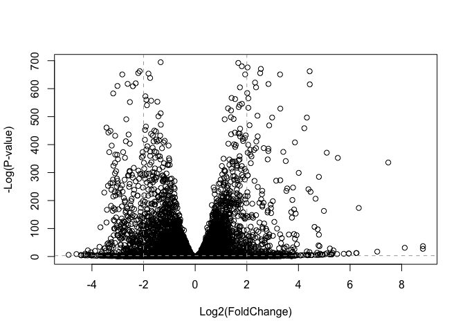

20191115\_in-class\_work
================
Emily Armbruster

# Introduction

##### Pathway analysis (gene set anaysis and over-representation analysis) maps lists of genes collected from differential expression analysis to different known pathways, processes and functions.

##### While there are many packages to do pathway analysis in R, we’re going to look at the GAGE package and do KEGG pathway analysis on the RNA-Seq based differential expression results obtained last class.

##### The data we will use comes from GEO entry:GSE237704.

# Section 1: Differential Expression Analysis

##### The first step is to load our data files:

``` r
library(DESeq2)
```

    ## Loading required package: S4Vectors

    ## Loading required package: stats4

    ## Loading required package: BiocGenerics

    ## Loading required package: parallel

    ## 
    ## Attaching package: 'BiocGenerics'

    ## The following objects are masked from 'package:parallel':
    ## 
    ##     clusterApply, clusterApplyLB, clusterCall, clusterEvalQ,
    ##     clusterExport, clusterMap, parApply, parCapply, parLapply,
    ##     parLapplyLB, parRapply, parSapply, parSapplyLB

    ## The following objects are masked from 'package:stats':
    ## 
    ##     IQR, mad, sd, var, xtabs

    ## The following objects are masked from 'package:base':
    ## 
    ##     anyDuplicated, append, as.data.frame, basename, cbind,
    ##     colnames, dirname, do.call, duplicated, eval, evalq, Filter,
    ##     Find, get, grep, grepl, intersect, is.unsorted, lapply, Map,
    ##     mapply, match, mget, order, paste, pmax, pmax.int, pmin,
    ##     pmin.int, Position, rank, rbind, Reduce, rownames, sapply,
    ##     setdiff, sort, table, tapply, union, unique, unsplit, which,
    ##     which.max, which.min

    ## 
    ## Attaching package: 'S4Vectors'

    ## The following object is masked from 'package:base':
    ## 
    ##     expand.grid

    ## Loading required package: IRanges

    ## Loading required package: GenomicRanges

    ## Loading required package: GenomeInfoDb

    ## Loading required package: SummarizedExperiment

    ## Loading required package: Biobase

    ## Welcome to Bioconductor
    ## 
    ##     Vignettes contain introductory material; view with
    ##     'browseVignettes()'. To cite Bioconductor, see
    ##     'citation("Biobase")', and for packages 'citation("pkgname")'.

    ## Loading required package: DelayedArray

    ## Loading required package: matrixStats

    ## 
    ## Attaching package: 'matrixStats'

    ## The following objects are masked from 'package:Biobase':
    ## 
    ##     anyMissing, rowMedians

    ## Loading required package: BiocParallel

    ## 
    ## Attaching package: 'DelayedArray'

    ## The following objects are masked from 'package:matrixStats':
    ## 
    ##     colMaxs, colMins, colRanges, rowMaxs, rowMins, rowRanges

    ## The following objects are masked from 'package:base':
    ## 
    ##     aperm, apply, rowsum

###### Rename the files upoaded and take a look.

``` r
metaFile <- "~/Desktop/Bioinformatics/bggn213_github/20191115_inclass_work/GSE37704_metadata.csv"
countFile <- "~/Desktop/Bioinformatics/bggn213_github/20191115_inclass_work/GSE37704_featurecounts.csv"

colData <- read.csv(metaFile, row.names=1)
head(colData)
```

    ##               condition
    ## SRR493366 control_sirna
    ## SRR493367 control_sirna
    ## SRR493368 control_sirna
    ## SRR493369      hoxa1_kd
    ## SRR493370      hoxa1_kd
    ## SRR493371      hoxa1_kd

``` r
countData = read.csv(countFile, row.names=1)
head(countData)
```

    ##                 length SRR493366 SRR493367 SRR493368 SRR493369 SRR493370
    ## ENSG00000186092    918         0         0         0         0         0
    ## ENSG00000279928    718         0         0         0         0         0
    ## ENSG00000279457   1982        23        28        29        29        28
    ## ENSG00000278566    939         0         0         0         0         0
    ## ENSG00000273547    939         0         0         0         0         0
    ## ENSG00000187634   3214       124       123       205       207       212
    ##                 SRR493371
    ## ENSG00000186092         0
    ## ENSG00000279928         0
    ## ENSG00000279457        46
    ## ENSG00000278566         0
    ## ENSG00000273547         0
    ## ENSG00000187634       258

##### In order for our analysis to be successful, we need the column number from the countsData to be the same as the number of rows in the colData. So we need to remove the “length” column from the countsData. Make new countData matrix by saying “as matrix” without the first column.

``` r
fixed_countData <- as.matrix(countData[,-1])
head(fixed_countData)
```

    ##                 SRR493366 SRR493367 SRR493368 SRR493369 SRR493370
    ## ENSG00000186092         0         0         0         0         0
    ## ENSG00000279928         0         0         0         0         0
    ## ENSG00000279457        23        28        29        29        28
    ## ENSG00000278566         0         0         0         0         0
    ## ENSG00000273547         0         0         0         0         0
    ## ENSG00000187634       124       123       205       207       212
    ##                 SRR493371
    ## ENSG00000186092         0
    ## ENSG00000279928         0
    ## ENSG00000279457        46
    ## ENSG00000278566         0
    ## ENSG00000273547         0
    ## ENSG00000187634       258

##### This data has a lot of zeroes… Let’s remove them.

``` r
rowSums(fixed_countData)
```

    ## ENSG00000186092 ENSG00000279928 ENSG00000279457 ENSG00000278566 
    ##               0               0             183               0 
    ## ENSG00000273547 ENSG00000187634 ENSG00000188976 ENSG00000187961 
    ##               0            1129            9907            1301 
    ## ENSG00000187583 ENSG00000187642 ENSG00000188290 ENSG00000187608 
    ##             293              75             689            2144 
    ## ENSG00000188157 ENSG00000237330 ENSG00000131591 ENSG00000162571 
    ##           56045               1             961               0 
    ## ENSG00000186891 ENSG00000186827 ENSG00000078808 ENSG00000176022 
    ##               4               5           28209            5572 
    ## ENSG00000184163 ENSG00000160087 ENSG00000162572 ENSG00000131584 
    ##              27            7559             198            6592 
    ## ENSG00000169972 ENSG00000127054 ENSG00000224051 ENSG00000169962 
    ##            1379            5574            1825              37 
    ## ENSG00000107404 ENSG00000162576 ENSG00000175756 ENSG00000221978 
    ##            6063           33482            6520            8382 
    ## ENSG00000242485 ENSG00000235098 ENSG00000205116 ENSG00000179403 
    ##            4033               8               0             660 
    ## ENSG00000215915 ENSG00000160072 ENSG00000197785 ENSG00000205090 
    ##               3            2557            4280             245 
    ## ENSG00000160075 ENSG00000279244 ENSG00000228594 ENSG00000197530 
    ##           11346               0            1079            4602 
    ## ENSG00000189409 ENSG00000248333 ENSG00000189339 ENSG00000008128 
    ##              15            2901           10840              78 
    ## ENSG00000215790 ENSG00000008130 ENSG00000078369 ENSG00000169885 
    ##             279            5827           60694               9 
    ## ENSG00000178821 ENSG00000142609 ENSG00000187730 ENSG00000067606 
    ##              16               0               0             212 
    ## ENSG00000162585 ENSG00000157933 ENSG00000116151 ENSG00000157916 
    ##            4005           10718             284           13099 
    ## ENSG00000157911 ENSG00000149527 ENSG00000157881 ENSG00000197921 
    ##            1263             183            2648               0 
    ## ENSG00000157873 ENSG00000157870 ENSG00000142606 ENSG00000215912 
    ##             151            2325               2              15 
    ## ENSG00000169717 ENSG00000142611 ENSG00000130762 ENSG00000162591 
    ##               0              24               5             741 
    ## ENSG00000158109 ENSG00000116213 ENSG00000078900 ENSG00000162592 
    ##           11234            1203               6               4 
    ## ENSG00000235169 ENSG00000130764 ENSG00000116198 ENSG00000169598 
    ##              49            3910            5316             598 
    ## ENSG00000198912 ENSG00000196581 ENSG00000131697 ENSG00000069424 
    ##            1669              16            1398             848 
    ## ENSG00000116254 ENSG00000116251 ENSG00000158286 ENSG00000116237 
    ##              30           19132             101           14067 
    ## ENSG00000173673 ENSG00000158292 ENSG00000097021 ENSG00000069812 
    ##               0            1139            7661              20 
    ## ENSG00000187017 ENSG00000215788 ENSG00000171680 ENSG00000162408 
    ##               4             331            2657            2185 
    ## ENSG00000173662 ENSG00000204859 ENSG00000162413 ENSG00000116273 
    ##               1             745           12770            2918 
    ## ENSG00000041988 ENSG00000007923 ENSG00000171735 ENSG00000049245 
    ##             772            4034            1843           11842 
    ## ENSG00000049246 ENSG00000049247 ENSG00000049249 ENSG00000116288 
    ##             892               2              14           13626 
    ## ENSG00000116285 ENSG00000162426 ENSG00000142599 ENSG00000074800 
    ##           14356             403            8669          109127 
    ## ENSG00000131686 ENSG00000197241 ENSG00000142583 ENSG00000180758 
    ##               1               0               5             786 
    ## ENSG00000049239 ENSG00000171621 ENSG00000171612 ENSG00000188807 
    ##            9650            3728            1041            2088 
    ## ENSG00000171608 ENSG00000171603 ENSG00000280113 ENSG00000178585 
    ##            3557           25190               0            2231 
    ## ENSG00000162441 ENSG00000173614 ENSG00000162444 ENSG00000130939 
    ##            1757            1340               2           12382 
    ## ENSG00000054523 ENSG00000142657 ENSG00000251503 ENSG00000175279 
    ##           10261           24354              16              93 
    ## ENSG00000241563 ENSG00000160049 ENSG00000142655 ENSG00000130940 
    ##              17            5518            1818              25 
    ## ENSG00000175262 ENSG00000120948 ENSG00000277726 ENSG00000009724 
    ##               0            7368               1              94 
    ## ENSG00000116649 ENSG00000171824 ENSG00000198793 ENSG00000171819 
    ##           12270            4976           10076               4 
    ## ENSG00000120942 ENSG00000204624 ENSG00000116661 ENSG00000132879 
    ##            1563              16             288            1307 
    ## ENSG00000116663 ENSG00000116670 ENSG00000162490 ENSG00000177674 
    ##             397            1847              82            2586 
    ## ENSG00000215910 ENSG00000177000 ENSG00000011021 ENSG00000175206 
    ##               0            1749            2267               5 
    ## ENSG00000120937 ENSG00000116685 ENSG00000083444 ENSG00000116688 
    ##               7            8310           61863           14257 
    ## ENSG00000116691 ENSG00000120949 ENSG00000028137 ENSG00000048707 
    ##             856              17            1719            7163 
    ## ENSG00000162496 ENSG00000204518 ENSG00000188984 ENSG00000157330 
    ##            1493               0               0               0 
    ## ENSG00000116726 ENSG00000116721 ENSG00000239810 ENSG00000179172 
    ##               0               0               0               7 
    ## ENSG00000120952 ENSG00000243073 ENSG00000187545 ENSG00000204510 
    ##               1               0               0               0 
    ## ENSG00000232423 ENSG00000280267 ENSG00000274764 ENSG00000229571 
    ##               0               0               0               0 
    ## ENSG00000277058 ENSG00000275774 ENSG00000179412 ENSG00000204505 
    ##               1               1               8               0 
    ## ENSG00000279804 ENSG00000270601 ENSG00000182330 ENSG00000204501 
    ##               0               0               0               0 
    ## ENSG00000204481 ENSG00000204480 ENSG00000204479 ENSG00000204478 
    ##               0               0               0               0 
    ## ENSG00000162494 ENSG00000162493 ENSG00000116731 ENSG00000189337 
    ##               0             286            3011            1460 
    ## ENSG00000171729 ENSG00000142621 ENSG00000142634 ENSG00000162438 
    ##            3227               5            6349               1 
    ## ENSG00000142615 ENSG00000215704 ENSG00000132906 ENSG00000116138 
    ##               0               0             580            4245 
    ## ENSG00000116771 ENSG00000197312 ENSG00000215695 ENSG00000116786 
    ##              79            3912               0           10049 
    ## ENSG00000162461 ENSG00000162460 ENSG00000162458 ENSG00000233954 
    ##              14               0           17501             737 
    ## ENSG00000065526 ENSG00000116809 ENSG00000183888 ENSG00000173641 
    ##            5786            2607               0             215 
    ## ENSG00000186510 ENSG00000184908 ENSG00000185519 ENSG00000142627 
    ##               1               3              68           14212 
    ## ENSG00000142632 ENSG00000132881 ENSG00000037637 ENSG00000055070 
    ##             680             456            3004           20263 
    ## ENSG00000187144 ENSG00000157191 ENSG00000268991 ENSG00000219481 
    ##               1            8332               0            2178 
    ## ENSG00000237847 ENSG00000279132 ENSG00000058453 ENSG00000117122 
    ##               0               0            1798            2014 
    ## ENSG00000159363 ENSG00000117118 ENSG00000117115 ENSG00000142623 
    ##            5235            4154               0              12 
    ## ENSG00000142619 ENSG00000159339 ENSG00000280226 ENSG00000276747 
    ##               0               0               0               0 
    ## ENSG00000179051 ENSG00000074964 ENSG00000117148 ENSG00000117154 
    ##           11599            1408               3               0 
    ## ENSG00000179023 ENSG00000009709 ENSG00000179002 ENSG00000255275 
    ##               0               0               0               0 
    ## ENSG00000159423 ENSG00000169991 ENSG00000127481 ENSG00000127463 
    ##            1315            2024           34627           15722 
    ## ENSG00000053372 ENSG00000162482 ENSG00000053371 ENSG00000040487 
    ##            4173              20            3621            2115 
    ## ENSG00000077549 ENSG00000173436 ENSG00000270136 ENSG00000158747 
    ##           32066            1143               0            1123 
    ## ENSG00000158748 ENSG00000162542 ENSG00000178828 ENSG00000169914 
    ##               1             830               0            1439 
    ## ENSG00000188784 ENSG00000188257 ENSG00000127472 ENSG00000117215 
    ##               0               0               8               0 
    ## ENSG00000158786 ENSG00000187980 ENSG00000162543 ENSG00000158816 
    ##               0               0               1               1 
    ## ENSG00000162545 ENSG00000090432 ENSG00000183114 ENSG00000158825 
    ##           12317            3784              20              79 
    ## ENSG00000158828 ENSG00000244038 ENSG00000117245 ENSG00000189410 
    ##            2431           28854             494            1978 
    ## ENSG00000127483 ENSG00000075151 ENSG00000117298 ENSG00000142794 
    ##           17772           24288           55713            1210 
    ## ENSG00000162551 ENSG00000076864 ENSG00000090686 ENSG00000187942 
    ##             223              40            7057              16 
    ## ENSG00000142798 ENSG00000219073 ENSG00000142789 ENSG00000070831 
    ##           62080               0               0           28866 
    ## ENSG00000162552 ENSG00000184677 ENSG00000070886 ENSG00000173372 
    ##              21            3317               1               0 
    ## ENSG00000159189 ENSG00000173369 ENSG00000133216 ENSG00000215906 
    ##               0               0           19587               0 
    ## ENSG00000227868 ENSG00000004487 ENSG00000169641 ENSG00000179546 
    ##               0           11798           11246              37 
    ## ENSG00000125944 ENSG00000125945 ENSG00000204219 ENSG00000088280 
    ##           11720            1512             220            2069 
    ## ENSG00000007968 ENSG00000117318 ENSG00000197880 ENSG00000142676 
    ##              64            6389               5           39389 
    ## ENSG00000011007 ENSG00000057757 ENSG00000011009 ENSG00000117308 
    ##            7252            2569            8900            1620 
    ## ENSG00000117305 ENSG00000179163 ENSG00000188822 ENSG00000189266 
    ##            1598             744               1            3777 
    ## ENSG00000188529 ENSG00000142661 ENSG00000142677 ENSG00000185436 
    ##            8841               6               0               0 
    ## ENSG00000158055 ENSG00000001460 ENSG00000001461 ENSG00000117602 
    ##               3             837           13159            1193 
    ## ENSG00000184454 ENSG00000133226 ENSG00000169504 ENSG00000020633 
    ##               0            6637           81889              56 
    ## ENSG00000117614 ENSG00000117616 ENSG00000187010 ENSG00000183726 
    ##            3257            1783              30           11676 
    ## ENSG00000188672 ENSG00000204178 ENSG00000157978 ENSG00000117643 
    ##              22            3589            2123            2400 
    ## ENSG00000162430 ENSG00000255054 ENSG00000117640 ENSG00000127423 
    ##           21367               0            3877             125 
    ## ENSG00000182749 ENSG00000117632 ENSG00000158006 ENSG00000158008 
    ##            2362           16976            1688             488 
    ## ENSG00000158014 ENSG00000158022 ENSG00000175087 ENSG00000197245 
    ##               2               0             379               0 
    ## ENSG00000142684 ENSG00000142675 ENSG00000188782 ENSG00000130695 
    ##               7              14               0             803 
    ## ENSG00000142669 ENSG00000158062 ENSG00000169442 ENSG00000176092 
    ##           43909             671               4               2 
    ## ENSG00000176083 ENSG00000131914 ENSG00000117682 ENSG00000198830 
    ##               0               1            4127           11331 
    ## ENSG00000117676 ENSG00000117713 ENSG00000060642 ENSG00000204160 
    ##             442           11317             811            4229 
    ## ENSG00000175793 ENSG00000142751 ENSG00000198746 ENSG00000090273 
    ##               0            3155            1001            9471 
    ## ENSG00000131910 ENSG00000175707 ENSG00000253368 ENSG00000158246 
    ##               2               2           17510             328 
    ## ENSG00000280403 ENSG00000090020 ENSG00000142784 ENSG00000186501 
    ##               2            9963            4361            3668 
    ## ENSG00000142765 ENSG00000142733 ENSG00000142748 ENSG00000174950 
    ##              12            2069               8               0 
    ## ENSG00000181773 ENSG00000158195 ENSG00000126705 ENSG00000000938 
    ##             460           13525            3564               0 
    ## ENSG00000126709 ENSG00000009780 ENSG00000117758 ENSG00000117751 
    ##             842             540            8080            3067 
    ## ENSG00000278868 ENSG00000130775 ENSG00000117748 ENSG00000130768 
    ##               0             310            2391               0 
    ## ENSG00000158156 ENSG00000158161 ENSG00000169403 ENSG00000126698 
    ##            1877            3295              11            8692 
    ## ENSG00000130770 ENSG00000130766 ENSG00000130772 ENSG00000204138 
    ##            4836            5008            1565            3463 
    ## ENSG00000180198 ENSG00000180098 ENSG00000120656 ENSG00000188060 
    ##            3498            1020            2079              22 
    ## ENSG00000162419 ENSG00000198492 ENSG00000116329 ENSG00000159023 
    ##            2084            9800               4             808 
    ## ENSG00000253304 ENSG00000116350 ENSG00000116353 ENSG00000060656 
    ##             423            5779            1191            2863 
    ## ENSG00000162510 ENSG00000162511 ENSG00000162512 ENSG00000134644 
    ##              20               7           34649           11108 
    ## ENSG00000084628 ENSG00000060688 ENSG00000121766 ENSG00000121769 
    ##              18            2470            3436             272 
    ## ENSG00000168528 ENSG00000142910 ENSG00000121764 ENSG00000162517 
    ##           11169              30               5            3969 
    ## ENSG00000084636 ENSG00000121753 ENSG00000134668 ENSG00000184007 
    ##           14543            2413            6560           29241 
    ## ENSG00000121774 ENSG00000121775 ENSG00000025800 ENSG00000084652 
    ##           14255            1097           16196           16371 
    ## ENSG00000160050 ENSG00000160051 ENSG00000222046 ENSG00000160055 
    ##             721              98               7             832 
    ## ENSG00000084623 ENSG00000183615 ENSG00000182866 ENSG00000116478 
    ##           16239              49               1           10008 
    ## ENSG00000175130 ENSG00000162526 ENSG00000225828 ENSG00000160058 
    ##           23820              12              93            9598 
    ## ENSG00000254553 ENSG00000273274 ENSG00000160062 ENSG00000176261 
    ##               0               0             659            1492 
    ## ENSG00000162521 ENSG00000162520 ENSG00000162522 ENSG00000134684 
    ##           11025            1442            1083           14747 
    ## ENSG00000116497 ENSG00000160097 ENSG00000121905 ENSG00000121900 
    ##            2437              36               7            1147 
    ## ENSG00000116514 ENSG00000004455 ENSG00000142920 ENSG00000116525 
    ##            1623            6821             495            1893 
    ## ENSG00000160094 ENSG00000184389 ENSG00000134686 ENSG00000121903 
    ##            2070               4           15832             707 
    ## ENSG00000121904 ENSG00000176256 ENSG00000142698 ENSG00000163866 
    ##             255               0               0            2975 
    ## ENSG00000189280 ENSG00000189433 ENSG00000188910 ENSG00000187513 
    ##              16               0               1               1 
    ## ENSG00000116544 ENSG00000271741 ENSG00000243749 ENSG00000163867 
    ##               7               1              25             929 
    ## ENSG00000197056 ENSG00000116560 ENSG00000146463 ENSG00000142687 
    ##            1154           24754            8453           10634 
    ## ENSG00000020129 ENSG00000116819 ENSG00000126067 ENSG00000142686 
    ##            9378              17           12287            3175 
    ## ENSG00000092853 ENSG00000134698 ENSG00000092847 ENSG00000126070 
    ##             719            1392            5679            2080 
    ## ENSG00000092850 ENSG00000116863 ENSG00000171812 ENSG00000054116 
    ##               4            2495             132            5465 
    ## ENSG00000116871 ENSG00000054118 ENSG00000214193 ENSG00000142694 
    ##           28035           16484             247            4916 
    ## ENSG00000196182 ENSG00000181817 ENSG00000116885 ENSG00000116898 
    ##            3440            2481             563            4504 
    ## ENSG00000119535 ENSG00000163873 ENSG00000163874 ENSG00000163875 
    ##               0               0            1340            4829 
    ## ENSG00000163877 ENSG00000163879 ENSG00000134697 ENSG00000169218 
    ##            1726             913            6816               0 
    ## ENSG00000116922 ENSG00000134690 ENSG00000183317 ENSG00000185090 
    ##            1335            1801               0              58 
    ## ENSG00000196449 ENSG00000197982 ENSG00000188786 ENSG00000204084 
    ##            2679            3998            4096            1291 
    ## ENSG00000183431 ENSG00000183386 ENSG00000183520 ENSG00000185668 
    ##            7783            3166            3105              16 
    ## ENSG00000116954 ENSG00000214114 ENSG00000274944 ENSG00000131233 
    ##            1706            1013               1               2 
    ## ENSG00000158315 ENSG00000174574 ENSG00000168653 ENSG00000127603 
    ##              73            8315           13436           60804 
    ## ENSG00000183682 ENSG00000090621 ENSG00000163909 ENSG00000116981 
    ##               8           17519              43               0 
    ## ENSG00000116983 ENSG00000084072 ENSG00000116985 ENSG00000198754 
    ##               0            2527              12               0 
    ## ENSG00000043514 ENSG00000116990 ENSG00000168389 ENSG00000131236 
    ##            1333              61             663           67898 
    ## ENSG00000131238 ENSG00000117000 ENSG00000188800 ENSG00000084073 
    ##            4160            2581               0           11169 
    ## ENSG00000049089 ENSG00000084070 ENSG00000187801 ENSG00000187815 
    ##             151            6337            1055             290 
    ## ENSG00000164002 ENSG00000117010 ENSG00000117016 ENSG00000066136 
    ##             494             182              45            2451 
    ## ENSG00000117013 ENSG00000179862 ENSG00000171793 ENSG00000171790 
    ##               4             763            6807              51 
    ## ENSG00000010803 ENSG00000204060 ENSG00000127129 ENSG00000127124 
    ##            2459               1               1             925 
    ## ENSG00000044012 ENSG00000197273 ENSG00000198815 ENSG00000177181 
    ##               0               0            4292               1 
    ## ENSG00000066185 ENSG00000127125 ENSG00000186409 ENSG00000171960 
    ##               4            1619              24             976 
    ## ENSG00000065978 ENSG00000164007 ENSG00000117385 ENSG00000164008 
    ##           63076               0           30082             603 
    ## ENSG00000177868 ENSG00000164010 ENSG00000164011 ENSG00000117394 
    ##             994             998             418           24133 
    ## ENSG00000186973 ENSG00000117395 ENSG00000243710 ENSG00000179178 
    ##               4            6083              19               0 
    ## ENSG00000253313 ENSG00000066056 ENSG00000117400 ENSG00000117399 
    ##               1             248               0            3215 
    ## ENSG00000066322 ENSG00000159479 ENSG00000198198 ENSG00000178922 
    ##           11153            4479            3380             639 
    ## ENSG00000142949 ENSG00000066135 ENSG00000126091 ENSG00000117407 
    ##           19200            5752            1089              10 
    ## ENSG00000117408 ENSG00000132768 ENSG00000117410 ENSG00000117411 
    ##            4861            1907            9698            7784 
    ## ENSG00000159214 ENSG00000196517 ENSG00000171872 ENSG00000178028 
    ##             176            1649              15            1694 
    ## ENSG00000117419 ENSG00000187147 ENSG00000126106 ENSG00000198520 
    ##            3768            2836             267              16 
    ## ENSG00000142945 ENSG00000142937 ENSG00000142959 ENSG00000173846 
    ##            1753           47937               5            3964 
    ## ENSG00000188396 ENSG00000222009 ENSG00000117425 ENSG00000070785 
    ##              82            1328             224            4144 
    ## ENSG00000126107 ENSG00000126088 ENSG00000162415 ENSG00000186603 
    ##            4923            6403             136              43 
    ## ENSG00000132781 ENSG00000132773 ENSG00000070759 ENSG00000280670 
    ##             350             673             365              82 
    ## ENSG00000132763 ENSG00000117450 ENSG00000117448 ENSG00000132780 
    ##             519           29657            4672            5759 
    ## ENSG00000159588 ENSG00000159592 ENSG00000159596 ENSG00000197429 
    ##              20            5132            1709            1341 
    ## ENSG00000086015 ENSG00000117461 ENSG00000278139 ENSG00000117472 
    ##            5749            2057               0              20 
    ## ENSG00000250719 ENSG00000085998 ENSG00000171357 ENSG00000085999 
    ##               0            7642              38             292 
    ## ENSG00000132128 ENSG00000173660 ENSG00000117481 ENSG00000117480 
    ##           12776            8657            1781              10 
    ## ENSG00000197587 ENSG00000162456 ENSG00000079277 ENSG00000142961 
    ##               0               0            1827             908 
    ## ENSG00000123472 ENSG00000186118 ENSG00000159658 ENSG00000142973 
    ##            3396               3            9822               0 
    ## ENSG00000187048 ENSG00000186377 ENSG00000186160 ENSG00000162365 
    ##               0               0               0               0 
    ## ENSG00000162366 ENSG00000162367 ENSG00000123473 ENSG00000162368 
    ##               0               0            1069           18215 
    ## ENSG00000186790 ENSG00000186564 ENSG00000269113 ENSG00000279096 
    ##               5              81               4               0 
    ## ENSG00000117834 ENSG00000132122 ENSG00000186094 ENSG00000162373 
    ##               5             477               0              29 
    ## ENSG00000162374 ENSG00000142700 ENSG00000185104 ENSG00000123080 
    ##               0               1            3717             780 
    ## ENSG00000204006 ENSG00000123091 ENSG00000085831 ENSG00000085832 
    ##               0           16739              69            3555 
    ## ENSG00000117859 ENSG00000078618 ENSG00000169213 ENSG00000117862 
    ##            5120           22374           46449            6253 
    ## ENSG00000198841 ENSG00000134717 ENSG00000157077 ENSG00000154222 
    ##            1305            4408            4820            3987 
    ## ENSG00000085840 ENSG00000134748 ENSG00000134744 ENSG00000116157 
    ##             368            3304            3030             214 
    ## ENSG00000182183 ENSG00000162377 ENSG00000162378 ENSG00000203995 
    ##               0            1739            6198              64 
    ## ENSG00000121310 ENSG00000116171 ENSG00000279054 ENSG00000174348 
    ##             533           10050               0            1179 
    ## ENSG00000162383 ENSG00000157184 ENSG00000162384 ENSG00000162385 
    ##              56             733            1580            1494 
    ## ENSG00000157193 ENSG00000143006 ENSG00000174332 ENSG00000058804 
    ##            1310               0             334            2746 
    ## ENSG00000058799 ENSG00000211452 ENSG00000081870 ENSG00000116212 
    ##            2360               4            1206            3076 
    ## ENSG00000203985 ENSG00000116209 ENSG00000116205 ENSG00000157211 
    ##               0           21060            1056               0 
    ## ENSG00000256407 ENSG00000215883 ENSG00000116221 ENSG00000157216 
    ##               0             148            7200            5704 
    ## ENSG00000162390 ENSG00000162391 ENSG00000184313 ENSG00000271723 
    ##             151              11               0               0 
    ## ENSG00000243725 ENSG00000162396 ENSG00000006555 ENSG00000162398 
    ##             160             270               0               0 
    ## ENSG00000116133 ENSG00000143001 ENSG00000162399 ENSG00000169174 
    ##           16414               0               0              70 
    ## ENSG00000162402 ENSG00000162407 ENSG00000162409 ENSG00000187889 
    ##            8319            4467             375               3 
    ## ENSG00000157131 ENSG00000021852 ENSG00000173406 ENSG00000162600 
    ##               0               0             539             430 
    ## ENSG00000184292 ENSG00000162601 ENSG00000177606 ENSG00000172456 
    ##               9            3454           14408             468 
    ## ENSG00000134709 ENSG00000134716 ENSG00000162598 ENSG00000162599 
    ##               1               5               0             179 
    ## ENSG00000162604 ENSG00000132849 ENSG00000240563 ENSG00000132854 
    ##            2087             319               0               0 
    ## ENSG00000162607 ENSG00000116641 ENSG00000132855 ENSG00000125703 
    ##            2284           14645               6             761 
    ## ENSG00000187140 ENSG00000088035 ENSG00000142856 ENSG00000203965 
    ##               0             903             318             193 
    ## ENSG00000079739 ENSG00000185483 ENSG00000177414 ENSG00000158966 
    ##            4017            1585               1             968 
    ## ENSG00000162437 ENSG00000162434 ENSG00000162433 ENSG00000116675 
    ##             691           29672             424              51 
    ## ENSG00000213625 ENSG00000116678 ENSG00000184588 ENSG00000118473 
    ##           11830             980            1459            7417 
    ## ENSG00000152760 ENSG00000172410 ENSG00000152763 ENSG00000198160 
    ##              18               0             260            4711 
    ## ENSG00000116704 ENSG00000203963 ENSG00000162594 ENSG00000081985 
    ##            3464               0               0               2 
    ## ENSG00000142864 ENSG00000116717 ENSG00000172380 ENSG00000162595 
    ##           30107            5057           30050             444 
    ## ENSG00000116729 ENSG00000116745 ENSG00000024526 ENSG00000033122 
    ##           88201              47            1943              62 
    ## ENSG00000066557 ENSG00000116754 ENSG00000118454 ENSG00000197568 
    ##            2095           12676            3679             652 
    ## ENSG00000279230 ENSG00000116761 ENSG00000050628 ENSG00000132485 
    ##               0             417               3            6768 
    ## ENSG00000172260 ENSG00000162620 ENSG00000254685 ENSG00000259030 
    ##            4228             146            1059              22 
    ## ENSG00000116783 ENSG00000162621 ENSG00000178965 ENSG00000116791 
    ##               1               0               0            3459 
    ## ENSG00000162623 ENSG00000162624 ENSG00000137968 ENSG00000117054 
    ##            3083               0              11            2490 
    ## ENSG00000137955 ENSG00000057468 ENSG00000154007 ENSG00000184005 
    ##            4501               5               0             173 
    ## ENSG00000117069 ENSG00000142892 ENSG00000154027 ENSG00000036549 
    ##             140            4023            8266            5193 
    ## ENSG00000077254 ENSG00000180488 ENSG00000162614 ENSG00000162613 
    ##            6793            4560           11821            8453 
    ## ENSG00000162616 ENSG00000137960 ENSG00000122420 ENSG00000137959 
    ##            6122              56             762              35 
    ## ENSG00000137965 ENSG00000162618 ENSG00000117114 ENSG00000137941 
    ##             114            1169            4278            3367 
    ## ENSG00000142875 ENSG00000203943 ENSG00000137976 ENSG00000117133 
    ##            5387              45               1            3004 
    ## ENSG00000174021 ENSG00000117151 ENSG00000117155 ENSG00000171517 
    ##           11306            1969            6668             489 
    ## ENSG00000153898 ENSG00000162643 ENSG00000055732 ENSG00000097096 
    ##              44             484              12             491 
    ## ENSG00000162642 ENSG00000142867 ENSG00000153904 ENSG00000142871 
    ##            2099            3558           16929           38748 
    ## ENSG00000117174 ENSG00000171502 ENSG00000122417 ENSG00000137975 
    ##            4350             879            2448             214 
    ## ENSG00000016490 ENSG00000016602 ENSG00000097033 ENSG00000183291 
    ##               0               0           13537           11769 
    ## ENSG00000153936 ENSG00000267561 ENSG00000143013 ENSG00000065243 
    ##            5179               0            4653            4695 
    ## ENSG00000137947 ENSG00000137944 ENSG00000213516 ENSG00000117226 
    ##            2288            1841             868            3898 
    ## ENSG00000117228 ENSG00000162645 ENSG00000213512 ENSG00000162654 
    ##            4002             532               1               7 
    ## ENSG00000154451 ENSG00000183347 ENSG00000197147 ENSG00000171488 
    ##               0               0             306            8760 
    ## ENSG00000271949 ENSG00000171492 ENSG00000162664 ENSG00000143032 
    ##               0            3105            2816               0 
    ## ENSG00000122482 ENSG00000162669 ENSG00000097046 ENSG00000069702 
    ##            4574              20             273             744 
    ## ENSG00000137948 ENSG00000172031 ENSG00000230667 ENSG00000189195 
    ##               0             662               8              63 
    ## ENSG00000069712 ENSG00000203910 ENSG00000174842 ENSG00000122484 
    ##             398               2             883            2195 
    ## ENSG00000162676 ENSG00000067208 ENSG00000122406 ENSG00000154511 
    ##              24            4030           52088            2439 
    ## ENSG00000143033 ENSG00000117500 ENSG00000122483 ENSG00000117505 
    ##            2161           10495             707            8378 
    ## ENSG00000137942 ENSG00000137936 ENSG00000067334 ENSG00000023909 
    ##            2896            4545            4479            2447 
    ## ENSG00000198691 ENSG00000137962 ENSG00000117528 ENSG00000117525 
    ##              11            4409            6069           29732 
    ## ENSG00000143036 ENSG00000117519 ENSG00000172339 ENSG00000152078 
    ##             137           26248             735             406 
    ## ENSG00000271092 ENSG00000122481 ENSG00000117569 ENSG00000188641 
    ##              29             192            1192            1587 
    ## ENSG00000162627 ENSG00000117598 ENSG00000117600 ENSG00000099260 
    ##            2624               9             692              18 
    ## ENSG00000156869 ENSG00000162688 ENSG00000117620 ENSG00000156875 
    ##             294            2262            2222            5762 
    ## ENSG00000156876 ENSG00000122435 ENSG00000122477 ENSG00000137992 
    ##             391             625              22            2699 
    ## ENSG00000137996 ENSG00000079335 ENSG00000181656 ENSG00000162692 
    ##            5546             411              10            2498 
    ## ENSG00000162694 ENSG00000162695 ENSG00000117543 ENSG00000170989 
    ##            4410            4703            1525             918 
    ## ENSG00000118733 ENSG00000060718 ENSG00000185946 ENSG00000240038 
    ##               0            4083             523              57 
    ## ENSG00000243480 ENSG00000237763 ENSG00000174876 ENSG00000187733 
    ##               0               0               0               0 
    ## ENSG00000198890 ENSG00000162631 ENSG00000134215 ENSG00000085491 
    ##            2480             310              48            7448 
    ## ENSG00000196427 ENSG00000186086 ENSG00000162636 ENSG00000162639 
    ##               0               0            1499              67 
    ## ENSG00000134186 ENSG00000143107 ENSG00000116266 ENSG00000162641 
    ##            4641               6            3878              13 
    ## ENSG00000274068 ENSG00000121957 ENSG00000121940 ENSG00000085433 
    ##               0             965            2442            4262 
    ## ENSG00000197780 ENSG00000215717 ENSG00000179902 ENSG00000116299 
    ##            6527            6733               5             141 
    ## ENSG00000031698 ENSG00000143126 ENSG00000134222 ENSG00000221986 
    ##           19168            1657            1291               5 
    ## ENSG00000134243 ENSG00000143106 ENSG00000143028 ENSG00000162650 
    ##           10130            9001             414             343 
    ## ENSG00000174151 ENSG00000181754 ENSG00000156097 ENSG00000065135 
    ##            2146             352               9           14567 
    ## ENSG00000134183 ENSG00000116337 ENSG00000168765 ENSG00000213366 
    ##               0           10005            1181            1588 
    ## ENSG00000134184 ENSG00000134201 ENSG00000134202 ENSG00000198758 
    ##               1              62            2684               0 
    ## ENSG00000184371 ENSG00000168710 ENSG00000143093 ENSG00000156150 
    ##            5380           15520            4320               0 
    ## ENSG00000186150 ENSG00000197106 ENSG00000116396 ENSG00000162775 
    ##               0             283             734            1085 
    ## ENSG00000168679 ENSG00000134248 ENSG00000143125 ENSG00000143105 
    ##            1970            4340               2               0 
    ## ENSG00000177301 ENSG00000177272 ENSG00000143119 ENSG00000121931 
    ##               9              41               0            1232 
    ## ENSG00000156171 ENSG00000134255 ENSG00000162777 ENSG00000064886 
    ##            1908            1418              39              37 
    ## ENSG00000134216 ENSG00000173947 ENSG00000085465 ENSG00000116455 
    ##               0              14              94            2494 
    ## ENSG00000116459 ENSG00000143110 ENSG00000121933 ENSG00000282608 
    ##           11622               8               3               0 
    ## ENSG00000116473 ENSG00000197852 ENSG00000064703 ENSG00000171385 
    ##            7104            1750            2152              31 
    ## ENSG00000143079 ENSG00000134245 ENSG00000007341 ENSG00000116489 
    ##            5965              93             845           22170 
    ## ENSG00000155363 ENSG00000155366 ENSG00000271810 ENSG00000155367 
    ##            3317           19212               0              38 
    ## ENSG00000184599 ENSG00000155380 ENSG00000198799 ENSG00000081026 
    ##              29            8922            1302            1227 
    ## ENSG00000116793 ENSG00000081019 ENSG00000134242 ENSG00000188761 
    ##            3654            1707              11               6 
    ## ENSG00000134262 ENSG00000118655 ENSG00000163349 ENSG00000116774 
    ##             743             807            6844            5362 
    ## ENSG00000134207 ENSG00000197323 ENSG00000116752 ENSG00000175984 
    ##               0            4579            2196             213 
    ## ENSG00000116748 ENSG00000213281 ENSG00000009307 ENSG00000052723 
    ##               0           13433           73004            4418 
    ## ENSG00000198765 ENSG00000134200 ENSG00000134198 ENSG00000134259 
    ##               0               0             121             153 
    ## ENSG00000173218 ENSG00000118729 ENSG00000177551 ENSG00000163393 
    ##            2102               0               2              15 
    ## ENSG00000173212 ENSG00000163399 ENSG00000116815 ENSG00000143061 
    ##               0           34501             237               4 
    ## ENSG00000116824 ENSG00000134247 ENSG00000134256 ENSG00000116830 
    ##               0             433               1            1371 
    ## ENSG00000134253 ENSG00000134258 ENSG00000198162 ENSG00000183508 
    ##             204               0           13451           13061 
    ## ENSG00000196505 ENSG00000065183 ENSG00000155761 ENSG00000092607 
    ##            2673            4908               9               0 
    ## ENSG00000116874 ENSG00000116882 ENSG00000203859 ENSG00000203857 
    ##             880               0               0               0 
    ## ENSG00000143067 ENSG00000092621 ENSG00000134240 ENSG00000134193 
    ##            6231            7464               0               0 
    ## ENSG00000134249 ENSG00000134250 ENSG00000265808 ENSG00000278882 
    ##               0           23607           15949              99 
    ## ENSG00000273136 ENSG00000263353 ENSG00000281741 ENSG00000198019 
    ##             485               2               5               0 
    ## ENSG00000188610 ENSG00000171943 ENSG00000203818 ENSG00000263513 
    ##              96             766               0              34 
    ## ENSG00000271567 ENSG00000266338 ENSG00000279782 ENSG00000196369 
    ##               1            3414               0             470 
    ## ENSG00000215784 ENSG00000281571 ENSG00000256374 ENSG00000162825 
    ##              35              14               0             355 
    ## ENSG00000117262 ENSG00000174827 ENSG00000117281 ENSG00000265491 
    ##             470             122              66            8717 
    ## ENSG00000186141 ENSG00000186364 ENSG00000131788 ENSG00000198483 
    ##            4228              63            5704             278 
    ## ENSG00000143127 ENSG00000131779 ENSG00000265241 ENSG00000280778 
    ##             458            2549            5223               0 
    ## ENSG00000271601 ENSG00000272031 ENSG00000121851 ENSG00000265972 
    ##            5615             512             851            9981 
    ## ENSG00000168509 ENSG00000271425 ENSG00000213240 ENSG00000264343 
    ##               0             173               0              67 
    ## ENSG00000270339 ENSG00000268043 ENSG00000131791 ENSG00000131781 
    ##               0             761            4313             112 
    ## ENSG00000131778 ENSG00000116128 ENSG00000162836 ENSG00000265107 
    ##            3930            2899             678               1 
    ## ENSG00000121634 ENSG00000188092 ENSG00000263956 ENSG00000280649 
    ##               0             191             605              39 
    ## ENSG00000236334 ENSG00000270629 ENSG00000178104 ENSG00000269713 
    ##               0             534            5513            2986 
    ## ENSG00000271383 ENSG00000263464 ENSG00000272058 ENSG00000150337 
    ##             631               1               0              31 
    ## ENSG00000203814 ENSG00000183598 ENSG00000270882 ENSG00000203811 
    ##              82               7              35               2 
    ## ENSG00000203812 ENSG00000184678 ENSG00000272196 ENSG00000203852 
    ##              14            4576               8               1 
    ## ENSG00000270276 ENSG00000184260 ENSG00000184270 ENSG00000178096 
    ##               4              10              11             323 
    ## ENSG00000159164 ENSG00000143368 ENSG00000014914 ENSG00000264522 
    ##            4528            7539             972            4524 
    ## ENSG00000136631 ENSG00000023902 ENSG00000143401 ENSG00000118298 
    ##            3202            8552            6556              19 
    ## ENSG00000117362 ENSG00000118292 ENSG00000159208 ENSG00000266472 
    ##           10445            1361             381            3519 
    ## ENSG00000278939 ENSG00000117360 ENSG00000163125 ENSG00000143374 
    ##               2            3518            4448            1690 
    ## ENSG00000143369 ENSG00000143382 ENSG00000143384 ENSG00000143420 
    ##           17532            1169           40335            7329 
    ## ENSG00000143457 ENSG00000143452 ENSG00000163131 ENSG00000143387 
    ##            2177               1             213            1164 
    ## ENSG00000143437 ENSG00000143379 ENSG00000143418 ENSG00000143412 
    ##            3846            1661           10717             113 
    ## ENSG00000143409 ENSG00000143363 ENSG00000163141 ENSG00000143443 
    ##             719            1099               8             210 
    ## ENSG00000197622 ENSG00000213190 ENSG00000143458 ENSG00000143434 
    ##            9987           12227            1027             515 
    ## ENSG00000163154 ENSG00000163156 ENSG00000163155 ENSG00000163157 
    ##               7            2185             925               0 
    ## ENSG00000163159 ENSG00000143398 ENSG00000159352 ENSG00000143373 
    ##            2977            9314           10544            2422 
    ## ENSG00000143393 ENSG00000143390 ENSG00000143416 ENSG00000159377 
    ##            9732            2377             833           15802 
    ## ENSG00000143442 ENSG00000143375 ENSG00000143367 ENSG00000143376 
    ##            4321              52            2170            4497 
    ## ENSG00000159409 ENSG00000178796 ENSG00000143436 ENSG00000143450 
    ##               1               0            1725              38 
    ## ENSG00000182134 ENSG00000213171 ENSG00000143365 ENSG00000225556 
    ##             114               0               0              15 
    ## ENSG00000196407 ENSG00000159445 ENSG00000197747 ENSG00000163191 
    ##              29             859           12275           32362 
    ## ENSG00000182898 ENSG00000159450 ENSG00000215853 ENSG00000197915 
    ##               0               7               0               6 
    ## ENSG00000143631 ENSG00000143520 ENSG00000143536 ENSG00000186207 
    ##             103               1               0               0 
    ## ENSG00000244057 ENSG00000279850 ENSG00000169509 ENSG00000185966 
    ##               0               0               0               0 
    ## ENSG00000163202 ENSG00000187238 ENSG00000185962 ENSG00000187223 
    ##               0               0               0               0 
    ## ENSG00000187180 ENSG00000159455 ENSG00000187173 ENSG00000187170 
    ##               2               1              45               2 
    ## ENSG00000198854 ENSG00000196734 ENSG00000203786 ENSG00000240386 
    ##               0               0               1               1 
    ## ENSG00000186226 ENSG00000172155 ENSG00000197084 ENSG00000186844 
    ##               0               0               0               0 
    ## ENSG00000235942 ENSG00000163206 ENSG00000163207 ENSG00000184148 
    ##               0               0               0               0 
    ## ENSG00000169474 ENSG00000163209 ENSG00000169469 ENSG00000163216 
    ##               0               0               0               0 
    ## ENSG00000241794 ENSG00000196805 ENSG00000203785 ENSG00000244094 
    ##               0               0               0               0 
    ## ENSG00000159516 ENSG00000203784 ENSG00000203783 ENSG00000203782 
    ##               0               0               0               0 
    ## ENSG00000159527 ENSG00000163218 ENSG00000163220 ENSG00000163221 
    ##               0               0               0               0 
    ## ENSG00000143546 ENSG00000184330 ENSG00000197364 ENSG00000143556 
    ##               0               0               0               0 
    ## ENSG00000197956 ENSG00000196420 ENSG00000196154 ENSG00000188015 
    ##           49128               8             318              76 
    ## ENSG00000196754 ENSG00000188643 ENSG00000189334 ENSG00000189171 
    ##             192           23858               6            5016 
    ## ENSG00000160678 ENSG00000160679 ENSG00000143553 ENSG00000143621 
    ##              24            4228            2105           16331 
    ## ENSG00000169418 ENSG00000143624 ENSG00000279767 ENSG00000143554 
    ##               1            4398               0             451 
    ## ENSG00000143614 ENSG00000198837 ENSG00000160741 ENSG00000143570 
    ##            2481            3279            3439           11114 
    ## ENSG00000143578 ENSG00000143543 ENSG00000143545 ENSG00000177954 
    ##             211            8403           18252           25923 
    ## ENSG00000143552 ENSG00000143549 ENSG00000163263 ENSG00000143612 
    ##              11           46082               0           12217 
    ## ENSG00000143569 ENSG00000143575 ENSG00000143595 ENSG00000143515 
    ##           22962            5424               1           12349 
    ## ENSG00000160712 ENSG00000169291 ENSG00000163239 ENSG00000160714 
    ##             754               2               1            8895 
    ## ENSG00000160716 ENSG00000160710 ENSG00000143603 ENSG00000163344 
    ##              12           28840               2            1418 
    ## ENSG00000163346 ENSG00000163348 ENSG00000160691 ENSG00000173207 
    ##           18291            2743           55033            1171 
    ## ENSG00000160688 ENSG00000163352 ENSG00000160685 ENSG00000163354 
    ##            2890               2            2436               6 
    ## ENSG00000163357 ENSG00000143537 ENSG00000243364 ENSG00000251246 
    ##               2            7215             615               0 
    ## ENSG00000143590 ENSG00000169242 ENSG00000169241 ENSG00000179085 
    ##              18              14            1084             767 
    ## ENSG00000163463 ENSG00000273088 ENSG00000163462 ENSG00000185499 
    ##             148               0             748             218 
    ## ENSG00000279986 ENSG00000279487 ENSG00000169231 ENSG00000173171 
    ##               0               2            1384            1180 
    ## ENSG00000177628 ENSG00000160767 ENSG00000116521 ENSG00000176444 
    ##            6484            6667            9939            1440 
    ## ENSG00000143630 ENSG00000143627 ENSG00000160752 ENSG00000160753 
    ##             264               0            5377            3551 
    ## ENSG00000116539 ENSG00000125459 ENSG00000163374 ENSG00000132676 
    ##            9322            1114            2755            8278 
    ## ENSG00000116580 ENSG00000132718 ENSG00000143622 ENSG00000132680 
    ##            5000            8997            5162            2431 
    ## ENSG00000173080 ENSG00000116584 ENSG00000163479 ENSG00000160803 
    ##               1           11055           25675            5194 
    ## ENSG00000116586 ENSG00000132698 ENSG00000254726 ENSG00000160789 
    ##            2337               1            6078           70054 
    ## ENSG00000196189 ENSG00000160785 ENSG00000260238 ENSG00000160783 
    ##              18            3569               1             589 
    ## ENSG00000242252 ENSG00000160781 ENSG00000198952 ENSG00000163472 
    ##               1              49           14562             282 
    ## ENSG00000198715 ENSG00000189030 ENSG00000163468 ENSG00000163467 
    ##            3923               1           30363              13 
    ## ENSG00000132677 ENSG00000125462 ENSG00000116604 ENSG00000183856 
    ##               0               1            9459            1900 
    ## ENSG00000187862 ENSG00000163382 ENSG00000160818 ENSG00000280316 
    ##               0            2576            2530               3 
    ## ENSG00000132702 ENSG00000132692 ENSG00000132688 ENSG00000143320 
    ##               2              11           36103             537 
    ## ENSG00000143319 ENSG00000143303 ENSG00000143314 ENSG00000143321 
    ##            3172             720            2540           22184 
    ## ENSG00000143294 ENSG00000027869 ENSG00000198400 ENSG00000027644 
    ##            5597               3               1               0 
    ## ENSG00000187800 ENSG00000160838 ENSG00000132694 ENSG00000253831 
    ##            3663               4            5109               1 
    ## ENSG00000117036 ENSG00000143297 ENSG00000163518 ENSG00000160856 
    ##            2849               0               0               0 
    ## ENSG00000132704 ENSG00000163534 ENSG00000073754 ENSG00000183853 
    ##               0               0               0           34031 
    ## ENSG00000158473 ENSG00000158477 ENSG00000158481 ENSG00000158485 
    ##              25               0               0               0 
    ## ENSG00000158488 ENSG00000186306 ENSG00000180708 ENSG00000173285 
    ##               0               0               0               0 
    ## ENSG00000198965 ENSG00000197532 ENSG00000186440 ENSG00000186400 
    ##               0               0               0               0 
    ## ENSG00000198967 ENSG00000163554 ENSG00000196171 ENSG00000203757 
    ##               0               0               0               0 
    ## ENSG00000180433 ENSG00000197403 ENSG00000188340 ENSG00000163563 
    ##               0               0               0               0 
    ## ENSG00000163564 ENSG00000163565 ENSG00000163568 ENSG00000162706 
    ##               3            6116               1               0 
    ## ENSG00000213088 ENSG00000179639 ENSG00000196266 ENSG00000196184 
    ##               0               0               0               0 
    ## ENSG00000184155 ENSG00000132703 ENSG00000132693 ENSG00000158716 
    ##               0               0               0             342 
    ## ENSG00000181036 ENSG00000158714 ENSG00000188004 ENSG00000243284 
    ##               0               5              12              10 
    ## ENSG00000256029 ENSG00000213085 ENSG00000158710 ENSG00000085552 
    ##               0              69           29578               1 
    ## ENSG00000162723 ENSG00000143315 ENSG00000177807 ENSG00000162728 
    ##               2            1319               1               0 
    ## ENSG00000162729 ENSG00000018625 ENSG00000132681 ENSG00000143318 
    ##            3450               0               0               7 
    ## ENSG00000162734 ENSG00000132716 ENSG00000258465 ENSG00000162735 
    ##           41534            3434               4            4457 
    ## ENSG00000122218 ENSG00000162736 ENSG00000171786 ENSG00000162738 
    ##           41681           20043               8             994 
    ## ENSG00000162739 ENSG00000066294 ENSG00000117090 ENSG00000117091 
    ##               0               0               0               0 
    ## ENSG00000026751 ENSG00000122224 ENSG00000122223 ENSG00000179914 
    ##               0               0               0               0 
    ## ENSG00000158764 ENSG00000158769 ENSG00000270149 ENSG00000215845 
    ##               0              95               0               5 
    ## ENSG00000158773 ENSG00000186517 ENSG00000278883 ENSG00000143217 
    ##            2818              24               0              14 
    ## ENSG00000162755 ENSG00000143256 ENSG00000158793 ENSG00000158796 
    ##              26            4804            1196            1996 
    ## ENSG00000143222 ENSG00000143258 ENSG00000143224 ENSG00000158850 
    ##            5373             940             637            4019 
    ## ENSG00000158859 ENSG00000158864 ENSG00000158869 ENSG00000158874 
    ##             166            7421              19               0 
    ## ENSG00000158882 ENSG00000143257 ENSG00000248485 ENSG00000158887 
    ##            1026              24               3              96 
    ## ENSG00000143252 ENSG00000188931 ENSG00000143226 ENSG00000173110 
    ##            7951               0              10              25 
    ## ENSG00000203747 ENSG00000072694 ENSG00000162747 ENSG00000132185 
    ##               0               0               0              68 
    ## ENSG00000162746 ENSG00000081721 ENSG00000118217 ENSG00000162745 
    ##             186            1354            6060             296 
    ## ENSG00000198929 ENSG00000254706 ENSG00000239887 ENSG00000171722 
    ##              69               0             159               2 
    ## ENSG00000198574 ENSG00000152332 ENSG00000117143 ENSG00000162733 
    ##               3           33786            9589           28750 
    ## ENSG00000132196 ENSG00000185860 ENSG00000117152 ENSG00000143248 
    ##             510              10           26725            4273 
    ## ENSG00000143228 ENSG00000185630 ENSG00000162761 ENSG00000143171 
    ##             776            3132               0               0 
    ## ENSG00000162763 ENSG00000143198 ENSG00000143149 ENSG00000143183 
    ##               0            5206            5966            9028 
    ## ENSG00000143179 ENSG00000188859 ENSG00000143157 ENSG00000152382 
    ##            5002               9            4202             488 
    ## ENSG00000143195 ENSG00000143194 ENSG00000143167 ENSG00000198842 
    ##              14               1               0               0 
    ## ENSG00000143190 ENSG00000198821 ENSG00000143162 ENSG00000198771 
    ##             742               0            1656               1 
    ## ENSG00000197965 ENSG00000143199 ENSG00000143158 ENSG00000143164 
    ##           17391              28            4589            9195 
    ## ENSG00000143147 ENSG00000143155 ENSG00000213064 ENSG00000143178 
    ##            3698            4133            2301              68 
    ## ENSG00000143185 ENSG00000143184 ENSG00000143196 ENSG00000143153 
    ##               0               0               0            2526 
    ## ENSG00000143156 ENSG00000117475 ENSG00000117477 ENSG00000117479 
    ##            1452            2749              17            1426 
    ## ENSG00000198734 ENSG00000174175 ENSG00000000460 ENSG00000188404 
    ##               1               0             382               0 
    ## ENSG00000007908 ENSG00000171806 ENSG00000000457 ENSG00000075945 
    ##               0             270             505            2445 
    ## ENSG00000203740 ENSG00000120370 ENSG00000116132 ENSG00000117501 
    ##               0            1054            8991               0 
    ## ENSG00000007933 ENSG00000094963 ENSG00000010932 ENSG00000076258 
    ##              12               6               5              18 
    ## ENSG00000117523 ENSG00000034971 ENSG00000117533 ENSG00000010165 
    ##           30960               0            1943            3498 
    ## ENSG00000197959 ENSG00000135845 ENSG00000180999 ENSG00000094975 
    ##              84            1286               1           13698 
    ## ENSG00000117560 ENSG00000120337 ENSG00000117586 ENSG00000117592 
    ##               5             569            5362           64321 
    ## ENSG00000162753 ENSG00000183831 ENSG00000076321 ENSG00000120334 
    ##               0               3            3091             957 
    ## ENSG00000117593 ENSG00000185278 ENSG00000117601 ENSG00000135870 
    ##            2463            1138               8            4421 
    ## ENSG00000152061 ENSG00000203737 ENSG00000116161 ENSG00000120333 
    ##            2015               1            4770            1292 
    ## ENSG00000120332 ENSG00000235750 ENSG00000116147 ENSG00000143207 
    ##               0               2               0            4895 
    ## ENSG00000116183 ENSG00000152092 ENSG00000198797 ENSG00000120341 
    ##              89              19               5               9 
    ## ENSG00000075391 ENSG00000240021 ENSG00000116191 ENSG00000116194 
    ##            3330               0            5592               5 
    ## ENSG00000116199 ENSG00000186283 ENSG00000143322 ENSG00000057252 
    ##            7635            1837            9404            7688 
    ## ENSG00000162779 ENSG00000116218 ENSG00000162782 ENSG00000143340 
    ##               3               0               0               0 
    ## ENSG00000169905 ENSG00000143337 ENSG00000135837 ENSG00000116260 
    ##            8801            6822            5563          152309 
    ## ENSG00000121454 ENSG00000230124 ENSG00000143324 ENSG00000135835 
    ##             118            2955            6369             384 
    ## ENSG00000135823 ENSG00000153029 ENSG00000162783 ENSG00000198216 
    ##            7036             402            5454               1 
    ## ENSG00000179930 ENSG00000135821 ENSG00000203730 ENSG00000121446 
    ##               0            7656               0               0 
    ## ENSG00000135828 ENSG00000143333 ENSG00000135824 ENSG00000135838 
    ##             862              36               0              39 
    ## ENSG00000135829 ENSG00000157060 ENSG00000135862 ENSG00000058085 
    ##           19074               1           96518            1812 
    ## ENSG00000157064 ENSG00000116698 ENSG00000116701 ENSG00000162704 
    ##             194            7982             153           20747 
    ## ENSG00000143344 ENSG00000173627 ENSG00000198756 ENSG00000198860 
    ##            4244               1             497            2209 
    ## ENSG00000116667 ENSG00000116406 ENSG00000135842 ENSG00000121481 
    ##            1159           10767            3556            2471 
    ## ENSG00000121486 ENSG00000116668 ENSG00000116679 ENSG00000143341 
    ##            1980             493            5422           14307 
    ## ENSG00000116690 ENSG00000047410 ENSG00000157181 ENSG00000279374 
    ##              51           16493            1902               2 
    ## ENSG00000262180 ENSG00000116703 ENSG00000073756 ENSG00000116711 
    ##              16               0            8879            1615 
    ## ENSG00000162670 ENSG00000150681 ENSG00000253148 ENSG00000090104 
    ##              32             101               0               2 
    ## ENSG00000127074 ENSG00000116741 ENSG00000116750 ENSG00000116747 
    ##               0             910            2515            5385 
    ## ENSG00000023572 ENSG00000134371 ENSG00000162630 ENSG00000162687 
    ##            1214            4511             212              95 
    ## ENSG00000000971 ENSG00000116785 ENSG00000276911 ENSG00000244414 
    ##            2417               0               0               0 
    ## ENSG00000134365 ENSG00000080910 ENSG00000134389 ENSG00000143278 
    ##               0               0               0               0 
    ## ENSG00000066279 ENSG00000177888 ENSG00000134376 ENSG00000213047 
    ##            3452            2302               5            1025 
    ## ENSG00000203724 ENSG00000143355 ENSG00000151414 ENSG00000151418 
    ##             166              20           14698               0 
    ## ENSG00000081237 ENSG00000116833 ENSG00000162702 ENSG00000118193 
    ##               3             100            7697            1249 
    ## ENSG00000118197 ENSG00000118200 ENSG00000170128 ENSG00000163362 
    ##             988           14532               0               8 
    ## ENSG00000116852 ENSG00000081248 ENSG00000232237 ENSG00000116857 
    ##             319               0               2            4917 
    ## ENSG00000163395 ENSG00000081277 ENSG00000118194 ENSG00000159166 
    ##               3              17              13               1 
    ## ENSG00000159173 ENSG00000174307 ENSG00000159176 ENSG00000134369 
    ##               0           12698           33388           33133 
    ## ENSG00000198700 ENSG00000198892 ENSG00000163431 ENSG00000134375 
    ##            9844            2182            3756            9176 
    ## ENSG00000176393 ENSG00000163435 ENSG00000170075 ENSG00000143862 
    ##            7851               1               0            4158 
    ## ENSG00000143851 ENSG00000133067 ENSG00000077152 ENSG00000077157 
    ##               1               0             775            1513 
    ## ENSG00000143858 ENSG00000117139 ENSG00000183155 ENSG00000117153 
    ##               8           13507            1665            2611 
    ## ENSG00000159346 ENSG00000159348 ENSG00000163444 ENSG00000143847 
    ##            7821            5160            4244              70 
    ## ENSG00000122180 ENSG00000163485 ENSG00000133055 ENSG00000133048 
    ##               0             233               1              79 
    ## ENSG00000133063 ENSG00000159388 ENSG00000122176 ENSG00000188783 
    ##               5            4188            1205              59 
    ## ENSG00000188770 ENSG00000058668 ENSG00000122188 ENSG00000058673 
    ##               3           65371               0           14866 
    ## ENSG00000257315 ENSG00000182004 ENSG00000143842 ENSG00000143845 
    ##            2272            3710             415            1033 
    ## ENSG00000143839 ENSG00000170498 ENSG00000174567 ENSG00000143850 
    ##              17             220               5            2124 
    ## ENSG00000158615 ENSG00000133056 ENSG00000198625 ENSG00000170382 
    ##            7233             398            1325               3 
    ## ENSG00000163531 ENSG00000184144 ENSG00000174529 ENSG00000117222 
    ##             335               3             123            2541 
    ## ENSG00000133059 ENSG00000133069 ENSG00000163545 ENSG00000162873 
    ##            6182             578            1757               2 
    ## ENSG00000186007 ENSG00000117266 ENSG00000174514 ENSG00000158711 
    ##               0              16              33            4924 
    ## ENSG00000158715 ENSG00000069275 ENSG00000117280 ENSG00000133065 
    ##             879           29766            1667            5122 
    ## ENSG00000162877 ENSG00000174502 ENSG00000276600 ENSG00000196188 
    ##               0               0             866               0 
    ## ENSG00000263961 ENSG00000198049 ENSG00000196550 ENSG00000266028 
    ##               0               0              52            4184 
    ## ENSG00000263528 ENSG00000266094 ENSG00000143486 ENSG00000143479 
    ##            2135             175            2512            2141 
    ## ENSG00000162889 ENSG00000136634 ENSG00000142224 ENSG00000162891 
    ##           16097               0               0              10 
    ## ENSG00000162892 ENSG00000162894 ENSG00000162896 ENSG00000162897 
    ##             165              39               1               0 
    ## ENSG00000182795 ENSG00000123836 ENSG00000180667 ENSG00000123843 
    ##               2             383            1324               1 
    ## ENSG00000123838 ENSG00000196352 ENSG00000117322 ENSG00000203710 
    ##               0            2345               0               0 
    ## ENSG00000197721 ENSG00000117335 ENSG00000174059 ENSG00000076356 
    ##               1           18285               6             676 
    ## ENSG00000008118 ENSG00000196878 ENSG00000123689 ENSG00000117594 
    ##             336             273             139             872 
    ## ENSG00000009790 ENSG00000162757 ENSG00000117595 ENSG00000117597 
    ##               3             189              35            4978 
    ## ENSG00000143469 ENSG00000082497 ENSG00000054392 ENSG00000143473 
    ##             972              56             848             140 
    ## ENSG00000117625 ENSG00000082512 ENSG00000198570 ENSG00000170385 
    ##            2170            1107               1            5755 
    ## ENSG00000117650 ENSG00000123684 ENSG00000143493 ENSG00000143476 
    ##             733            5954            1406             889 
    ## ENSG00000066027 ENSG00000065600 ENSG00000117691 ENSG00000162772 
    ##            2822            1802            2478            1184 
    ## ENSG00000162771 ENSG00000123685 ENSG00000117697 ENSG00000203705 
    ##               0             112            1904             779 
    ## ENSG00000185523 ENSG00000162769 ENSG00000143494 ENSG00000174606 
    ##               5             495             794            2422 
    ## ENSG00000136643 ENSG00000117707 ENSG00000143499 ENSG00000152104 
    ##            4184              55            2090           19736 
    ## ENSG00000117724 ENSG00000082482 ENSG00000136636 ENSG00000042781 
    ##            7725            2515            5331              15 
    ## ENSG00000196482 ENSG00000092978 ENSG00000162814 ENSG00000067533 
    ##              40            1440              41            2049 
    ## ENSG00000092969 ENSG00000143353 ENSG00000196660 ENSG00000136628 
    ##            2378             764               1           26444 
    ## ENSG00000162813 ENSG00000067704 ENSG00000118873 ENSG00000116141 
    ##            2647           12533            5348               1 
    ## ENSG00000162817 ENSG00000117791 ENSG00000186205 ENSG00000136630 
    ##              13             118              28             552 
    ## ENSG00000143507 ENSG00000143512 ENSG00000143498 ENSG00000154305 
    ##            3595               7             301            7250 
    ## ENSG00000186063 ENSG00000162819 ENSG00000197520 ENSG00000154309 
    ##            7162            5289               1             785 
    ## ENSG00000187554 ENSG00000143502 ENSG00000178395 ENSG00000203697 
    ##              16              56               0               0 
    ## ENSG00000162909 ENSG00000143514 ENSG00000143756 ENSG00000143753 
    ##           80793            5778            4408           14321 
    ## ENSG00000143748 ENSG00000143771 ENSG00000162923 ENSG00000143786 
    ##            1390            2405           20686            2676 
    ## ENSG00000185842 ENSG00000143815 ENSG00000154380 ENSG00000143742 
    ##             309            3653           16601           14522 
    ## ENSG00000143819 ENSG00000196187 ENSG00000243709 ENSG00000255835 
    ##            3821            2860               0               0 
    ## ENSG00000143811 ENSG00000143768 ENSG00000143751 ENSG00000163041 
    ##            1727               0            2993            5557 
    ## ENSG00000182827 ENSG00000185155 ENSG00000183814 ENSG00000143799 
    ##           11088               4             357            6092 
    ## ENSG00000203685 ENSG00000143772 ENSG00000143801 ENSG00000163050 
    ##               0            1121            1393             597 
    ## ENSG00000143776 ENSG00000181450 ENSG00000143740 ENSG00000081692 
    ##            8439             516            3098             701 
    ## ENSG00000185888 ENSG00000143816 ENSG00000154342 ENSG00000143761 
    ##               0             146               0           43624 
    ## ENSG00000143793 ENSG00000162910 ENSG00000143774 ENSG00000198835 
    ##             900            1482           14187             196 
    ## ENSG00000181873 ENSG00000162913 ENSG00000154358 ENSG00000154370 
    ##            1176              94            3583            2581 
    ## ENSG00000162931 ENSG00000168148 ENSG00000181218 ENSG00000196890 
    ##              47               2             310              14 
    ## ENSG00000168159 ENSG00000116574 ENSG00000177800 ENSG00000168118 
    ##           11236             321               0            3711 
    ## ENSG00000213029 ENSG00000154429 ENSG00000143632 ENSG00000069248 
    ##               0            1399              13            5202 
    ## ENSG00000135776 ENSG00000135801 ENSG00000135763 ENSG00000143641 
    ##            1349            2201            1992           32150 
    ## ENSG00000177614 ENSG00000135775 ENSG00000135744 ENSG00000135773 
    ##              71            1810             193               4 
    ## ENSG00000119280 ENSG00000143643 ENSG00000173409 ENSG00000182118 
    ##            7934            1810            1162             990 
    ## ENSG00000119283 ENSG00000143633 ENSG00000116906 ENSG00000116903 
    ##               7             730            4048            1984 
    ## ENSG00000010072 ENSG00000135766 ENSG00000270106 ENSG00000116918 
    ##            1598            4829               0            3332 
    ## ENSG00000162946 ENSG00000116991 ENSG00000212916 ENSG00000135778 
    ##             478            5356             226            1709 
    ## ENSG00000135749 ENSG00000143674 ENSG00000135750 ENSG00000183780 
    ##            3213              36             171              74 
    ## ENSG00000168275 ENSG00000059588 ENSG00000168264 ENSG00000279261 
    ##            1240             941            5828               0 
    ## ENSG00000173726 ENSG00000188739 ENSG00000054267 ENSG00000152904 
    ##           22715              91            4397            2398 
    ## ENSG00000116957 ENSG00000162885 ENSG00000168243 ENSG00000143669 
    ##            1874            1222              35            2019 
    ## ENSG00000116962 ENSG00000077585 ENSG00000086619 ENSG00000186197 
    ##           28057            2602             639               1 
    ## ENSG00000116977 ENSG00000119285 ENSG00000077522 ENSG00000116984 
    ##            4468            6629               3            4596 
    ## ENSG00000244020 ENSG00000198626 ENSG00000116996 ENSG00000270188 
    ##               0               1               0               0 
    ## ENSG00000133019 ENSG00000155816 ENSG00000180875 ENSG00000182901 
    ##               4            3446            2809              55 
    ## ENSG00000091483 ENSG00000117009 ENSG00000054277 ENSG00000203668 
    ##            5557               3             981            2228 
    ## ENSG00000162843 ENSG00000174371 ENSG00000196289 ENSG00000197769 
    ##               4             484               0               2 
    ## ENSG00000180287 ENSG00000143702 ENSG00000054282 ENSG00000117020 
    ##               1           17220            3282            7787 
    ## ENSG00000179456 ENSG00000173728 ENSG00000035687 ENSG00000179397 
    ##            1450               7            9659              30 
    ## ENSG00000121644 ENSG00000203667 ENSG00000277877 ENSG00000153187 
    ##            6614              89              25           37296 
    ## ENSG00000203666 ENSG00000162849 ENSG00000185420 ENSG00000162851 
    ##             311            1267            1296            1887 
    ## ENSG00000162852 ENSG00000143653 ENSG00000153207 ENSG00000197472 
    ##            4375            3870            7226              20 
    ## ENSG00000135747 ENSG00000277462 ENSG00000188295 ENSG00000196418 
    ##               1             272             703             601 
    ## ENSG00000162714 ENSG00000162711 ENSG00000177535 ENSG00000169224 
    ##            3505              12               0               1 
    ## ENSG00000196242 ENSG00000177489 ENSG00000177476 ENSG00000197437 
    ##               0               0               0               0 
    ## ENSG00000169214 ENSG00000241128 ENSG00000153230 ENSG00000221888 
    ##               0               0               0               0 
    ## ENSG00000196772 ENSG00000197591 ENSG00000162722 ENSG00000238243 
    ##               0               0             262              21 
    ## ENSG00000177462 ENSG00000177275 ENSG00000196071 ENSG00000196936 
    ##               1               0               0               0 
    ## ENSG00000187080 ENSG00000197454 ENSG00000203663 ENSG00000198128 
    ##               0               0               0               0 
    ## ENSG00000162727 ENSG00000198601 ENSG00000228198 ENSG00000171180 
    ##               0               0               0               0 
    ## ENSG00000177212 ENSG00000177201 ENSG00000177186 ENSG00000177174 
    ##               0               0               0               0 
    ## ENSG00000196944 ENSG00000198104 ENSG00000175143 ENSG00000196240 
    ##               0               0               0               0 
    ## ENSG00000196539 ENSG00000203661 ENSG00000188558 ENSG00000182783 
    ##               0               0               0               0 
    ## ENSG00000183310 ENSG00000184022 ENSG00000183130 ENSG00000177151 
    ##               0               0               0               0 
    ## ENSG00000187701 ENSG00000189181 ENSG00000259823 ENSG00000175137 
    ##               0               0               0            8775 
    ## ENSG00000171161 ENSG00000171163 ENSG00000185220 ENSG00000184731 
    ##            1667             677             340               0 
    ## ENSG00000035115 ENSG00000143727 ENSG00000189292 ENSG00000151353 
    ##            1126            5677               6            1360 
    ## ENSG00000280360 ENSG00000172554 ENSG00000115705 ENSG00000130508 
    ##               0              15               7          216358 
    ## ENSG00000186487 ENSG00000032389 ENSG00000171853 ENSG00000182551 
    ##               0            2071            4055            7210 
    ## ENSG00000255767 ENSG00000171865 ENSG00000171863 ENSG00000118004 
    ##               0            3444           38408               4 
    ## ENSG00000151360 ENSG00000214866 ENSG00000176887 ENSG00000134326 
    ##               0               0            2667              11 
    ## ENSG00000134321 ENSG00000151692 ENSG00000115738 ENSG00000134313 
    ##               4              50            4881           14747 
    ## ENSG00000143797 ENSG00000151693 ENSG00000119185 ENSG00000119203 
    ##            4098            5460            6619            3835 
    ## ENSG00000134330 ENSG00000151694 ENSG00000134308 ENSG00000115750 
    ##            2632            3194           41694            1823 
    ## ENSG00000134317 ENSG00000172059 ENSG00000205795 ENSG00000171848 
    ##              18             599              95            4836 
    ## ENSG00000115756 ENSG00000115758 ENSG00000115761 ENSG00000143882 
    ##            5037           20351            2893              67 
    ## ENSG00000143870 ENSG00000162975 ENSG00000150873 ENSG00000162976 
    ##           34523            1681               5             951 
    ## ENSG00000134318 ENSG00000169016 ENSG00000196208 ENSG00000169006 
    ##           12111            1750              64               0 
    ## ENSG00000134324 ENSG00000071575 ENSG00000162981 ENSG00000151779 
    ##            6049            3357             506            8128 
    ## ENSG00000079785 ENSG00000134323 ENSG00000197872 ENSG00000214842 
    ##           11895               0             703               0 
    ## ENSG00000163032 ENSG00000163029 ENSG00000178295 ENSG00000151379 
    ##              39            2850            1179               0 
    ## ENSG00000170745 ENSG00000240857 ENSG00000250741 ENSG00000185013 
    ##             391             911               0               7 
    ## ENSG00000143867 ENSG00000183891 ENSG00000118965 ENSG00000132031 
    ##            1686             155            1844             702 
    ## ENSG00000068697 ENSG00000115884 ENSG00000055917 ENSG00000143878 
    ##           40642            4141           10969           11519 
    ## ENSG00000118960 ENSG00000143869 ENSG00000118961 ENSG00000084674 
    ##            2385              28            1738               1 
    ## ENSG00000218819 ENSG00000119771 ENSG00000119778 ENSG00000173960 
    ##               0            2223            1347            2900 
    ## ENSG00000205639 ENSG00000163026 ENSG00000119782 ENSG00000115128 
    ##              24            1418             217            3346 
    ## ENSG00000219626 ENSG00000115129 ENSG00000176732 ENSG00000276087 
    ##             203            3937              14               0 
    ## ENSG00000186453 ENSG00000198399 ENSG00000084676 ENSG00000184924 
    ##               2            3218            2783             801 
    ## ENSG00000138092 ENSG00000138031 ENSG00000115137 ENSG00000084710 
    ##            1635            4556             444             280 
    ## ENSG00000115138 ENSG00000119772 ENSG00000138101 ENSG00000143970 
    ##              15            2088             373            3714 
    ## ENSG00000084731 ENSG00000084733 ENSG00000157833 ENSG00000084754 
    ##            6725           14365             348           14634 
    ## ENSG00000138029 ENSG00000173567 ENSG00000138018 ENSG00000157856 
    ##           12796              17            5419              12 
    ## ENSG00000115155 ENSG00000173557 ENSG00000157884 ENSG00000171303 
    ##               2               0               0              12 
    ## ENSG00000213699 ENSG00000115163 ENSG00000157851 ENSG00000084764 
    ##            7283             441               0            2663 
    ## ENSG00000119777 ENSG00000084693 ENSG00000228474 ENSG00000138080 
    ##           13464            2001            8222           41922 
    ## ENSG00000138030 ENSG00000138028 ENSG00000143994 ENSG00000138073 
    ##              26              90              20            5974 
    ## ENSG00000186143 ENSG00000163792 ENSG00000138074 ENSG00000138085 
    ##               0               0            3039            4822 
    ## ENSG00000084774 ENSG00000115194 ENSG00000163793 ENSG00000138100 
    ##            8415              16               0               5 
    ## ENSG00000163794 ENSG00000115204 ENSG00000115207 ENSG00000115211 
    ##              23            3454            4427            3433 
    ## ENSG00000115234 ENSG00000163795 ENSG00000115241 ENSG00000115216 
    ##           13162            1471           10427           17797 
    ## ENSG00000157992 ENSG00000138002 ENSG00000115226 ENSG00000084734 
    ##               3            1522            1896               6 
    ## ENSG00000233438 ENSG00000280034 ENSG00000221843 ENSG00000243943 
    ##               7               1             225            1397 
    ## ENSG00000176714 ENSG00000198522 ENSG00000119760 ENSG00000163798 
    ##              72            2201            3091            3442 
    ## ENSG00000243147 ENSG00000171174 ENSG00000158019 ENSG00000075426 
    ##            2315              93            1327            7281 
    ## ENSG00000163803 ENSG00000213639 ENSG00000163806 ENSG00000171103 
    ##              93           13398              29             578 
    ## ENSG00000163811 ENSG00000189350 ENSG00000179270 ENSG00000115295 
    ##            6634               1               0            6525 
    ## ENSG00000171094 ENSG00000119801 ENSG00000213626 ENSG00000172954 
    ##               6           10666           12959            1746 
    ## ENSG00000162949 ENSG00000158089 ENSG00000214711 ENSG00000013016 
    ##               0               4              17            8938 
    ## ENSG00000158125 ENSG00000277893 ENSG00000162959 ENSG00000162961 
    ##             235               0             293            2106 
    ## ENSG00000021574 ENSG00000152683 ENSG00000091106 ENSG00000119820 
    ##            1910            2992              44            6808 
    ## ENSG00000115760 ENSG00000018699 ENSG00000049323 ENSG00000152689 
    ##           14384            1769           82558            1775 
    ## ENSG00000119812 ENSG00000150938 ENSG00000171055 ENSG00000205221 
    ##           13855           43758            3995               1 
    ## ENSG00000115808 ENSG00000008869 ENSG00000152133 ENSG00000055332 
    ##            3528            2944            1899            9217 
    ## ENSG00000138068 ENSG00000218739 ENSG00000115816 ENSG00000003509 
    ##               0            4211            3136             843 
    ## ENSG00000115825 ENSG00000115828 ENSG00000163171 ENSG00000115841 
    ##            5515             309           26907             608 
    ## ENSG00000138061 ENSG00000119787 ENSG00000143889 ENSG00000143891 
    ##             873            2385            5101            1623 
    ## ENSG00000115875 ENSG00000152147 ENSG00000163214 ENSG00000188010 
    ##            6269             742            2679             681 
    ## ENSG00000214694 ENSG00000115904 ENSG00000205111 ENSG00000011566 
    ##              30            6180               4            7418 
    ## ENSG00000152154 ENSG00000138050 ENSG00000183023 ENSG00000205086 
    ##              30             721            3231               0 
    ## ENSG00000162878 ENSG00000143924 ENSG00000115944 ENSG00000171126 
    ##            1244            4851            9216               2 
    ## ENSG00000057935 ENSG00000162881 ENSG00000162882 ENSG00000152518 
    ##            1641               0               9            5179 
    ## ENSG00000115970 ENSG00000152527 ENSG00000138036 ENSG00000138075 
    ##            2716            1165             855               0 
    ## ENSG00000143921 ENSG00000138095 ENSG00000138032 ENSG00000138079 
    ##               0           14430            3476               3 
    ## ENSG00000138078 ENSG00000143919 ENSG00000138083 ENSG00000170577 
    ##            5138             381               0               1 
    ## ENSG00000068784 ENSG00000171132 ENSG00000116016 ENSG00000187600 
    ##             939            1697           25987               0 
    ## ENSG00000250565 ENSG00000119729 ENSG00000151665 ENSG00000119878 
    ##             261            7891             848            1328 
    ## ENSG00000171150 ENSG00000180398 ENSG00000068724 ENSG00000239605 
    ##           12239           37669            1850               6 
    ## ENSG00000273269 ENSG00000143933 ENSG00000119888 ENSG00000095002 
    ##               0           73037              24            2110 
    ## ENSG00000184261 ENSG00000116062 ENSG00000138081 ENSG00000170802 
    ##              23            4429            2782            1362 
    ## ENSG00000162869 ENSG00000243244 ENSG00000068781 ENSG00000242441 
    ##            1676             883               0               0 
    ## ENSG00000279956 ENSG00000138039 ENSG00000170820 ENSG00000179915 
    ##               0               2               0              13 
    ## ENSG00000115239 ENSG00000270898 ENSG00000143942 ENSG00000068912 
    ##              85              10             174           12923 
    ## ENSG00000119737 ENSG00000068878 ENSG00000170634 ENSG00000178021 
    ##             155           17258             656               1 
    ## ENSG00000177994 ENSG00000115306 ENSG00000214595 ENSG00000115310 
    ##               0           35333              53          112752 
    ## ENSG00000162994 ENSG00000143947 ENSG00000085760 ENSG00000115355 
    ##             241           32489            2542            5815 
    ## ENSG00000163001 ENSG00000275052 ENSG00000138035 ENSG00000115380 
    ##            3284            7149            2814           14748 
    ## ENSG00000055813 ENSG00000028116 ENSG00000115392 ENSG00000119866 
    ##              41            1698             536              78 
    ## ENSG00000115421 ENSG00000162924 ENSG00000162927 ENSG00000162928 
    ##            1355             227             422            3060 
    ## ENSG00000162929 ENSG00000237651 ENSG00000173209 ENSG00000115464 
    ##             726              67             926           11467 
    ## ENSG00000082898 ENSG00000170264 ENSG00000115484 ENSG00000173163 
    ##           14096             214           18441            1493 
    ## ENSG00000280544 ENSG00000170340 ENSG00000186889 ENSG00000115504 
    ##               0            1562             230            6260 
    ## ENSG00000115507 ENSG00000143951 ENSG00000014641 ENSG00000281071 
    ##               4             367           10444               0 
    ## ENSG00000169764 ENSG00000143952 ENSG00000197329 ENSG00000119862 
    ##            7268            2291             801             165 
    ## ENSG00000119844 ENSG00000279644 ENSG00000179833 ENSG00000115902 
    ##            1277               0            3031            3068 
    ## ENSG00000011523 ENSG00000138069 ENSG00000138071 ENSG00000198369 
    ##             969           22331           50177            3837 
    ## ENSG00000143995 ENSG00000143971 ENSG00000197223 ENSG00000243667 
    ##            6760            1088            1960              95 
    ## ENSG00000273398 ENSG00000115946 ENSG00000221823 ENSG00000119865 
    ##               0            2972            4871            1463 
    ## ENSG00000115956 ENSG00000204923 ENSG00000169621 ENSG00000169618 
    ##               5             133             405               2 
    ## ENSG00000163219 ENSG00000163217 ENSG00000183607 ENSG00000169605 
    ##              46               1               0               1 
    ## ENSG00000169604 ENSG00000198380 ENSG00000169599 ENSG00000115977 
    ##           24980           21250            2266            7202 
    ## ENSG00000196975 ENSG00000087338 ENSG00000124380 ENSG00000059728 
    ##            6367            2140            2971            1403 
    ## ENSG00000279229 ENSG00000244617 ENSG00000169564 ENSG00000115998 
    ##               2              19            8758             891 
    ## ENSG00000116001 ENSG00000116005 ENSG00000143977 ENSG00000035141 
    ##            6683           13217            2706            2378 
    ## ENSG00000163235 ENSG00000075340 ENSG00000183733 ENSG00000152672 
    ##               3               0               0               0 
    ## ENSG00000116031 ENSG00000116035 ENSG00000116039 ENSG00000258881 
    ##               0             125              19              10 
    ## ENSG00000144031 ENSG00000144043 ENSG00000124357 ENSG00000124370 
    ##              53           13151            4985             433 
    ## ENSG00000124383 ENSG00000124374 ENSG00000075292 ENSG00000135636 
    ##            3812              30            8921             254 
    ## ENSG00000003137 ENSG00000144036 ENSG00000116096 ENSG00000135638 
    ##              56            5831            1402               1 
    ## ENSG00000144040 ENSG00000135631 ENSG00000214513 ENSG00000135632 
    ##            1673            8547               0            2314 
    ## ENSG00000135617 ENSG00000135624 ENSG00000163013 ENSG00000135625 
    ##            1680           22638            1199               9 
    ## ENSG00000116127 ENSG00000144035 ENSG00000144034 ENSG00000144048 
    ##            1958               1            1063            2043 
    ## ENSG00000187833 ENSG00000124356 ENSG00000163017 ENSG00000114956 
    ##               0            3056           28812            3275 
    ## ENSG00000187605 ENSG00000163170 ENSG00000114978 ENSG00000065911 
    ##            1831             955           13573            9141 
    ## ENSG00000264324 ENSG00000188687 ENSG00000204843 ENSG00000159239 
    ##               2              10           26782              92 
    ## ENSG00000005448 ENSG00000114993 ENSG00000115274 ENSG00000274049 
    ##            1008            1496              33               1 
    ## ENSG00000239779 ENSG00000115275 ENSG00000204822 ENSG00000135637 
    ##             383            8914             115             546 
    ## ENSG00000115282 ENSG00000179528 ENSG00000115289 ENSG00000115297 
    ##            1513              26             834               0 
    ## ENSG00000144045 ENSG00000115307 ENSG00000115317 ENSG00000115318 
    ##               3            6901            1274            2199 
    ## ENSG00000115325 ENSG00000159374 ENSG00000135622 ENSG00000159399 
    ##            1144               6            1315           10385 
    ## ENSG00000115350 ENSG00000115353 ENSG00000115363 ENSG00000115364 
    ##            2304             321            2177            3722 
    ## ENSG00000005436 ENSG00000176204 ENSG00000143954 ENSG00000172023 
    ##            1040               0               0               0 
    ## ENSG00000115386 ENSG00000172016 ENSG00000066032 ENSG00000162951 
    ##               0               0               7               0 
    ## ENSG00000163541 ENSG00000115423 ENSG00000186854 ENSG00000279992 
    ##            4864               8            1615               0 
    ## ENSG00000034510 ENSG00000176407 ENSG00000152284 ENSG00000152291 
    ##          104240            5893            2006           51226 
    ## ENSG00000042445 ENSG00000115459 ENSG00000042493 ENSG00000152292 
    ##            4757            1266            2100               5 
    ## ENSG00000168906 ENSG00000115486 ENSG00000118640 ENSG00000281331 
    ##           13735            6767              27               0 
    ## ENSG00000168899 ENSG00000168894 ENSG00000168890 ENSG00000168883 
    ##            1217            4174            1403            5061 
    ## ENSG00000168887 ENSG00000168878 ENSG00000115523 ENSG00000168874 
    ##            1333               2               2            1628 
    ## ENSG00000115525 ENSG00000068654 ENSG00000132300 ENSG00000132305 
    ##            2151            9726            3857            8244 
    ## ENSG00000132313 ENSG00000068615 ENSG00000115548 ENSG00000115561 
    ##            3207               5            3483            5642 
    ## ENSG00000249884 ENSG00000239305 ENSG00000153561 ENSG00000153563 
    ##              10            1433            4264               0 
    ## ENSG00000172116 ENSG00000187627 ENSG00000183281 ENSG00000125551 
    ##               0               7               0               9 
    ## ENSG00000185304 ENSG00000172086 ENSG00000115593 ENSG00000163586 
    ##              17            2392               0               0 
    ## ENSG00000144115 ENSG00000214336 ENSG00000172073 ENSG00000172071 
    ##               3               1               0            1493 
    ## ENSG00000153574 ENSG00000259916 ENSG00000163060 ENSG00000172005 
    ##            1217               0               0               2 
    ## ENSG00000144029 ENSG00000144026 ENSG00000275111 ENSG00000233757 
    ##            3551             677             455             133 
    ## ENSG00000155066 ENSG00000115041 ENSG00000115042 ENSG00000144015 
    ##              13             311            1401               0 
    ## ENSG00000174501 ENSG00000186281 ENSG00000274286 ENSG00000188886 
    ##             238              12               0               1 
    ## ENSG00000158050 ENSG00000084090 ENSG00000135956 ENSG00000144021 
    ##             163           14282           14991            6575 
    ## ENSG00000144028 ENSG00000198885 ENSG00000121152 ENSG00000163121 
    ##           25015              43             895               0 
    ## ENSG00000196843 ENSG00000114982 ENSG00000249715 ENSG00000114988 
    ##             817            5033              38            2831 
    ## ENSG00000158158 ENSG00000168763 ENSG00000163126 ENSG00000213337 
    ##             888            1382              18             358 
    ## ENSG00000168758 ENSG00000168754 ENSG00000144199 ENSG00000135976 
    ##            4830               0              77             288 
    ## ENSG00000196912 ENSG00000135940 ENSG00000115073 ENSG00000115085 
    ##             134            4654            4444               4 
    ## ENSG00000075568 ENSG00000168658 ENSG00000144191 ENSG00000040933 
    ##           11564               0               8            3259 
    ## ENSG00000183513 ENSG00000115446 ENSG00000071073 ENSG00000196872 
    ##             929            2373              22               0 
    ## ENSG00000135951 ENSG00000273045 ENSG00000241962 ENSG00000144182 
    ##              76               5              14             152 
    ## ENSG00000273155 ENSG00000158411 ENSG00000185414 ENSG00000185674 
    ##               0             938            2551               5 
    ## ENSG00000144214 ENSG00000115514 ENSG00000158417 ENSG00000135945 
    ##              36            4014           19604            1952 
    ## ENSG00000144218 ENSG00000170500 ENSG00000115526 ENSG00000204640 
    ##            5449             140             874               0 
    ## ENSG00000115539 ENSG00000170485 ENSG00000071082 ENSG00000204634 
    ##            1845            1793           31608             664 
    ## ENSG00000158435 ENSG00000163162 ENSG00000175874 ENSG00000196460 
    ##            4694            3263              41             400 
    ## ENSG00000071054 ENSG00000115590 ENSG00000115594 ENSG00000115598 
    ##           78527               7           14618              38 
    ## ENSG00000115602 ENSG00000115604 ENSG00000115607 ENSG00000180251 
    ##              42             400               4               2 
    ## ENSG00000115616 ENSG00000135953 ENSG00000170417 ENSG00000198914 
    ##               6             909             109               0 
    ## ENSG00000135972 ENSG00000135973 ENSG00000135966 ENSG00000135974 
    ##            1282               0            3073            1766 
    ## ENSG00000115641 ENSG00000071051 ENSG00000119147 ENSG00000115652 
    ##           16119            3448               0            6269 
    ## ENSG00000153165 ENSG00000144057 ENSG00000196862 ENSG00000115665 
    ##              16              17               2               0 
    ## ENSG00000196228 ENSG00000198203 ENSG00000198075 ENSG00000135968 
    ##               0               3              39            6460 
    ## ENSG00000169756 ENSG00000153201 ENSG00000163006 ENSG00000135960 
    ##           16728           19577             262               0 
    ## ENSG00000172985 ENSG00000279515 ENSG00000186522 ENSG00000198142 
    ##            5592               1            6756            1335 
    ## ENSG00000015568 ENSG00000256977 ENSG00000144063 ENSG00000144061 
    ##              13               4              29             175 
    ## ENSG00000175701 ENSG00000257207 ENSG00000256671 ENSG00000183054 
    ##             454               0               1               2 
    ## ENSG00000169679 ENSG00000153093 ENSG00000153094 ENSG00000153107 
    ##            1968               2             286            3367 
    ## ENSG00000153208 ENSG00000153214 ENSG00000144152 ENSG00000144161 
    ##             103            6812              52             273 
    ## ENSG00000188177 ENSG00000169629 ENSG00000114999 ENSG00000125630 
    ##             536              78            7762            2130 
    ## ENSG00000125611 ENSG00000144136 ENSG00000144130 ENSG00000169607 
    ##             727           39263               1            1299 
    ## ENSG00000115008 ENSG00000125538 ENSG00000125571 ENSG00000136688 
    ##             176            1854               0               1 
    ## ENSG00000136694 ENSG00000136696 ENSG00000136695 ENSG00000136697 
    ##               0               0               0               0 
    ## ENSG00000136689 ENSG00000125637 ENSG00000125618 ENSG00000136682 
    ##               0             107             168            1042 
    ## ENSG00000184492 ENSG00000144134 ENSG00000115084 ENSG00000115091 
    ##               4             377           11875           49188 
    ## ENSG00000175497 ENSG00000088205 ENSG00000125633 ENSG00000125629 
    ##               0            7185            3852            1549 
    ## ENSG00000163064 ENSG00000019169 ENSG00000144119 ENSG00000115107 
    ##               1               0               1            5454 
    ## ENSG00000186132 ENSG00000155368 ENSG00000171227 ENSG00000080293 
    ##             327            6223               9               0 
    ## ENSG00000163075 ENSG00000144120 ENSG00000088179 ENSG00000115109 
    ##               1             409            1126            6859 
    ## ENSG00000226479 ENSG00000144118 ENSG00000281676 ENSG00000163083 
    ##            3085            7979               1              18 
    ## ENSG00000074047 ENSG00000115112 ENSG00000074054 ENSG00000155438 
    ##            4044               0           10301            2876 
    ## ENSG00000211460 ENSG00000155052 ENSG00000136732 ENSG00000136717 
    ##            6568               0            3887            2994 
    ## ENSG00000186684 ENSG00000163161 ENSG00000169967 ENSG00000115718 
    ##               9            4804            6104              14 
    ## ENSG00000163166 ENSG00000169994 ENSG00000072163 ENSG00000144230 
    ##            6375              31            1695               7 
    ## ENSG00000136709 ENSG00000173349 ENSG00000144231 ENSG00000144233 
    ##            4656               0            3391            4212 
    ## ENSG00000136715 ENSG00000136731 ENSG00000136720 ENSG00000222014 
    ##            3057           18556            8843              14 
    ## ENSG00000196604 ENSG00000152076 ENSG00000136699 ENSG00000152082 
    ##              36              86            5675            2284 
    ## ENSG00000152086 ENSG00000136710 ENSG00000136718 ENSG00000072135 
    ##               5            1687            5096            1826 
    ## ENSG00000196834 ENSG00000152093 ENSG00000184761 ENSG00000183292 
    ##              18               0               0               0 
    ## ENSG00000136698 ENSG00000222038 ENSG00000173302 ENSG00000178171 
    ##               0              11               0               0 
    ## ENSG00000136002 ENSG00000152102 ENSG00000115762 ENSG00000188219 
    ##             193           21618           19795              59 
    ## ENSG00000173272 ENSG00000075886 ENSG00000163040 ENSG00000163046 
    ##            1771              15             263               0 
    ## ENSG00000183840 ENSG00000150551 ENSG00000176771 ENSG00000152127 
    ##             157            4289            3762           33665 
    ## ENSG00000152128 ENSG00000153086 ENSG00000082258 ENSG00000176601 
    ##               3               6            3679               2 
    ## ENSG00000115839 ENSG00000121988 ENSG00000048991 ENSG00000144224 
    ##            8275             339            4076           14883 
    ## ENSG00000115850 ENSG00000076003 ENSG00000115866 ENSG00000121966 
    ##               4            2226            4314               2 
    ## ENSG00000144229 ENSG00000150540 ENSG00000144228 ENSG00000144227 
    ##               0             413            2457               0 
    ## ENSG00000168702 ENSG00000115919 ENSG00000075884 ENSG00000121964 
    ##             220            2084               3            1141 
    ## ENSG00000169554 ENSG00000121989 ENSG00000115947 ENSG00000204406 
    ##            6741             677            1827            2471 
    ## ENSG00000135999 ENSG00000168280 ENSG00000150556 ENSG00000187123 
    ##            2339              51               6              58 
    ## ENSG00000168288 ENSG00000115963 ENSG00000184898 ENSG00000123609 
    ##           12245           83403             902             493 
    ## ENSG00000123610 ENSG00000080345 ENSG00000183091 ENSG00000162980 
    ##            1776            8249              37            5853 
    ## ENSG00000182389 ENSG00000115145 ENSG00000157827 ENSG00000196504 
    ##              39            4215            4774           12551 
    ## ENSG00000177917 ENSG00000177519 ENSG00000144278 ENSG00000162989 
    ##            1225               4               4               0 
    ## ENSG00000153234 ENSG00000115159 ENSG00000136542 ENSG00000136541 
    ##            4105            4455           28763              13 
    ## ENSG00000115165 ENSG00000123612 ENSG00000115170 ENSG00000007001 
    ##               0              40            8040               2 
    ## ENSG00000153237 ENSG00000144283 ENSG00000281472 ENSG00000163331 
    ##              14            2933               0               0 
    ## ENSG00000115183 ENSG00000196151 ENSG00000123636 ENSG00000136536 
    ##            4711             409            3130           10116 
    ## ENSG00000241399 ENSG00000248672 ENSG00000054219 ENSG00000153246 
    ##             217               0               1             261 
    ## ENSG00000115221 ENSG00000153250 ENSG00000136560 ENSG00000115233 
    ##              19            9467            3278            8253 
    ## ENSG00000136535 ENSG00000144290 ENSG00000197635 ENSG00000115263 
    ##               3               0            8553               0 
    ## ENSG00000078098 ENSG00000115267 ENSG00000115271 ENSG00000184611 
    ##            8931             177              85               0 
    ## ENSG00000182263 ENSG00000115290 ENSG00000082438 ENSG00000169507 
    ##             400               1             254              25 
    ## ENSG00000153253 ENSG00000136531 ENSG00000178662 ENSG00000115339 
    ##              94             657              29             347 
    ## ENSG00000123607 ENSG00000144285 ENSG00000169432 ENSG00000136546 
    ##            1514               0           13397              91 
    ## ENSG00000163092 ENSG00000172318 ENSG00000198648 ENSG00000172292 
    ##             123             623            7037            1181 
    ## ENSG00000163072 ENSG00000152253 ENSG00000152254 ENSG00000073734 
    ##              30             335               0               0 
    ## ENSG00000073737 ENSG00000081479 ENSG00000163093 ENSG00000251569 
    ##               0               0             573               0 
    ## ENSG00000239474 ENSG00000138399 ENSG00000138398 ENSG00000154479 
    ##              11            1214            5229               6 
    ## ENSG00000144362 ENSG00000213160 ENSG00000138385 ENSG00000138382 
    ##              36             297            9654            1394 
    ## ENSG00000144357 ENSG00000071909 ENSG00000204335 ENSG00000204334 
    ##            7608               6               0               1 
    ## ENSG00000128683 ENSG00000115806 ENSG00000198586 ENSG00000123600 
    ##               9           13802            4575            1267 
    ## ENSG00000115827 ENSG00000071967 ENSG00000077380 ENSG00000115840 
    ##            1457           14371           15351            1705 
    ## ENSG00000128708 ENSG00000172878 ENSG00000144355 ENSG00000115844 
    ##            3173             367             144             122 
    ## ENSG00000091409 ENSG00000152256 ENSG00000091428 ENSG00000091436 
    ##           15547            3813            1132           17614 
    ## ENSG00000144354 ENSG00000172845 ENSG00000138430 ENSG00000217236 
    ##             470            5996            5417               0 
    ## ENSG00000138433 ENSG00000144306 ENSG00000163328 ENSG00000115935 
    ##            3049            1172             997            2410 
    ## ENSG00000138435 ENSG00000128656 ENSG00000115966 ENSG00000154518 
    ##             283           10520            5073           12900 
    ## ENSG00000144320 ENSG00000174279 ENSG00000128714 ENSG00000170178 
    ##            4369               0               0               0 
    ## ENSG00000128713 ENSG00000128710 ENSG00000128709 ENSG00000175879 
    ##               0               2               0               1 
    ## ENSG00000128652 ENSG00000278500 ENSG00000170166 ENSG00000128645 
    ##               0               0               0               0 
    ## ENSG00000128654 ENSG00000170144 ENSG00000116044 ENSG00000018510 
    ##            2160           28324           11681            6076 
    ## ENSG00000196659 ENSG00000197557 ENSG00000128655 ENSG00000155636 
    ##             352             568              75            1032 
    ## ENSG00000079156 ENSG00000180228 ENSG00000204311 ENSG00000079150 
    ##            1684            3416              53            6018 
    ## ENSG00000116095 ENSG00000155657 ENSG00000163492 ENSG00000187231 
    ##            2923             466               0            2858 
    ## ENSG00000144331 ENSG00000163510 ENSG00000170035 ENSG00000115232 
    ##               2            2230           12287            3619 
    ## ENSG00000188452 ENSG00000162992 ENSG00000138434 ENSG00000150722 
    ##             692               0           35100              25 
    ## ENSG00000115252 ENSG00000077232 ENSG00000162998 ENSG00000061676 
    ##              55           17298             490           30217 
    ## ENSG00000162999 ENSG00000163002 ENSG00000170396 ENSG00000188738 
    ##             115             741            1535               8 
    ## ENSG00000065548 ENSG00000281192 ENSG00000138448 ENSG00000144369 
    ##            7359               1           40504            2676 
    ## ENSG00000163012 ENSG00000064989 ENSG00000003436 ENSG00000144366 
    ##               2              60           24195            3932 
    ## ENSG00000174325 ENSG00000168542 ENSG00000204262 ENSG00000115368 
    ##               7          392435          143688            3105 
    ## ENSG00000138449 ENSG00000138381 ENSG00000151687 ENSG00000128694 
    ##             342            3678              79             433 
    ## ENSG00000128699 ENSG00000064933 ENSG00000187699 ENSG00000138379 
    ##            2875            1172              30               4 
    ## ENSG00000198130 ENSG00000151689 ENSG00000151690 ENSG00000189362 
    ##            1577            2386            1494             236 
    ## ENSG00000138386 ENSG00000115419 ENSG00000115415 ENSG00000138378 
    ##            2736           17696           27682              32 
    ## ENSG00000128641 ENSG00000173559 ENSG00000168497 ENSG00000144339 
    ##           18703           13656             885             402 
    ## ENSG00000196950 ENSG00000118997 ENSG00000081320 ENSG00000138411 
    ##            4122              40            5718             613 
    ## ENSG00000144395 ENSG00000119041 ENSG00000187944 ENSG00000197121 
    ##             107            2784              21            1243 
    ## ENSG00000065413 ENSG00000115524 ENSG00000115520 ENSG00000144381 
    ##            1460           29017            6859           30143 
    ## ENSG00000115541 ENSG00000270757 ENSG00000115540 ENSG00000162944 
    ##            2564               0            1946             934 
    ## ENSG00000247626 ENSG00000152430 ENSG00000115896 ENSG00000119042 
    ##            1052               1              74            1423 
    ## ENSG00000226124 ENSG00000178074 ENSG00000162971 ENSG00000162972 
    ##               8            2761             687            1105 
    ## ENSG00000196141 ENSG00000155729 ENSG00000163535 ENSG00000138356 
    ##           25660            1272            1634            1924 
    ## ENSG00000280298 ENSG00000082153 ENSG00000013441 ENSG00000240344 
    ##               0           28538            2368             871 
    ## ENSG00000196290 ENSG00000115942 ENSG00000155744 ENSG00000119013 
    ##            1266            1617            1782            2558 
    ## ENSG00000003402 ENSG00000003400 ENSG00000064012 ENSG00000155749 
    ##            5923               9            1014              47 
    ## ENSG00000115993 ENSG00000082146 ENSG00000155754 ENSG00000155755 
    ##           13979            2408              29            2983 
    ## ENSG00000082126 ENSG00000003393 ENSG00000138395 ENSG00000155760 
    ##             584            4892             954           17597 
    ## ENSG00000182329 ENSG00000116030 ENSG00000055044 ENSG00000204217 
    ##              25           10361            5194           14205 
    ## ENSG00000138439 ENSG00000163596 ENSG00000138442 ENSG00000138380 
    ##            2207             367            3365             367 
    ## ENSG00000144426 ENSG00000119004 ENSG00000138443 ENSG00000173166 
    ##            4132            2652            6149             806 
    ## ENSG00000178562 ENSG00000163599 ENSG00000163600 ENSG00000116117 
    ##               0               0               0            1869 
    ## ENSG00000118257 ENSG00000114933 ENSG00000023228 ENSG00000114942 
    ##            8811            1345           12347           29389 
    ## ENSG00000183671 ENSG00000204186 ENSG00000279921 ENSG00000114948 
    ##              83            1370               0            3322 
    ## ENSG00000232125 ENSG00000138400 ENSG00000118246 ENSG00000144410 
    ##               0              26            2855               1 
    ## ENSG00000118263 ENSG00000118260 ENSG00000144401 ENSG00000163249 
    ##            6064            3498             544            2289 
    ## ENSG00000163251 ENSG00000178385 ENSG00000118231 ENSG00000163254 
    ##              66             552               0               0 
    ## ENSG00000182187 ENSG00000168582 ENSG00000188674 ENSG00000138413 
    ##               0               0               0            7669 
    ## ENSG00000115020 ENSG00000144407 ENSG00000078018 ENSG00000144406 
    ##            6303               0             133               2 
    ## ENSG00000197713 ENSG00000144445 ENSG00000115361 ENSG00000279317 
    ##            4254             825               0               0 
    ## ENSG00000168530 ENSG00000115365 ENSG00000021826 ENSG00000178568 
    ##               0            3125             845               9 
    ## ENSG00000030419 ENSG00000144451 ENSG00000174453 ENSG00000138376 
    ##             633             731               0             442 
    ## ENSG00000144452 ENSG00000138363 ENSG00000115414 ENSG00000118242 
    ##              38            7697         2394853             281 
    ## ENSG00000115425 ENSG00000163449 ENSG00000079246 ENSG00000144583 
    ##             232              89           35835            4936 
    ## ENSG00000138375 ENSG00000197756 ENSG00000115457 ENSG00000115461 
    ##            2838           36125           10703         1250461 
    ## ENSG00000118245 ENSG00000278951 ENSG00000231672 ENSG00000079308 
    ##               0               0             299           22340 
    ## ENSG00000188282 ENSG00000180871 ENSG00000163464 ENSG00000163466 
    ##               0               0               0           38688 
    ## ENSG00000179921 ENSG00000127837 ENSG00000127838 ENSG00000135926 
    ##              14            9130            2518            7364 
    ## ENSG00000158428 ENSG00000018280 ENSG00000144579 ENSG00000127831 
    ##               0               8            3724               1 
    ## ENSG00000135913 ENSG00000144580 ENSG00000115556 ENSG00000115568 
    ##             803            4330             304            2165 
    ## ENSG00000074582 ENSG00000163481 ENSG00000163482 ENSG00000135912 
    ##            1349            2593            2273            1958 
    ## ENSG00000135929 ENSG00000115592 ENSG00000115596 ENSG00000135925 
    ##             672               0               0               1 
    ## ENSG00000171450 ENSG00000163497 ENSG00000163499 ENSG00000181378 
    ##              10               0               0               0 
    ## ENSG00000163501 ENSG00000187736 ENSG00000280537 ENSG00000213901 
    ##               0              14              11               6 
    ## ENSG00000115649 ENSG00000144567 ENSG00000158552 ENSG00000115657 
    ##            3239            8606            1319             126 
    ## ENSG00000198925 ENSG00000163516 ENSG00000163521 ENSG00000115661 
    ##           11407            1507             512            1593 
    ## ENSG00000127824 ENSG00000243910 ENSG00000135924 ENSG00000054356 
    ##            1009               2            5919            5110 
    ## ENSG00000182698 ENSG00000123992 ENSG00000175084 ENSG00000072195 
    ##               0            4087              31            3760 
    ## ENSG00000144591 ENSG00000072182 ENSG00000123989 ENSG00000188760 
    ##            4865               2           14915             197 
    ## ENSG00000124006 ENSG00000123999 ENSG00000144589 ENSG00000114923 
    ##            4587              20            1587             559 
    ## ENSG00000116106 ENSG00000135903 ENSG00000163081 ENSG00000163082 
    ##            5663               1               0              34 
    ## ENSG00000116120 ENSG00000124003 ENSG00000123983 ENSG00000152049 
    ##            4607               0           11747            2109 
    ## ENSG00000171951 ENSG00000152056 ENSG00000085449 ENSG00000135900 
    ##            5037             289           10653            2281 
    ## ENSG00000135919 ENSG00000124019 ENSG00000036257 ENSG00000135905 
    ##           62764               2            7878            9088 
    ## ENSG00000144460 ENSG00000169047 ENSG00000144468 ENSG00000081052 
    ##               1           22129            2567               7 
    ## ENSG00000169031 ENSG00000168958 ENSG00000168955 ENSG00000173744 
    ##               7            5110               4            8379 
    ## ENSG00000042304 ENSG00000135917 ENSG00000115009 ENSG00000123977 
    ##               0               0               5              46 
    ## ENSG00000153820 ENSG00000153823 ENSG00000187957 ENSG00000153827 
    ##               4             388             234           33245 
    ## ENSG00000153832 ENSG00000163053 ENSG00000135899 ENSG00000280755 
    ##             210             494             325               0 
    ## ENSG00000079263 ENSG00000185404 ENSG00000067066 ENSG00000135932 
    ##             169            1604            6630            9242 
    ## ENSG00000135916 ENSG00000135898 ENSG00000173699 ENSG00000204128 
    ##           25467              11               0               3 
    ## ENSG00000173692 ENSG00000135914 ENSG00000135931 ENSG00000156966 
    ##           18766              77            6756               7 
    ## ENSG00000115053 ENSG00000171596 ENSG00000177673 ENSG00000187514 
    ##           55300               0               0           47477 
    ## ENSG00000156973 ENSG00000144524 ENSG00000163273 ENSG00000144535 
    ##            1359            3016             259            1796 
    ## ENSG00000163283 ENSG00000163286 ENSG00000163295 ENSG00000171551 
    ##               0               0               0               5 
    ## ENSG00000237412 ENSG00000135902 ENSG00000196811 ENSG00000221944 
    ##               0               0               3             260 
    ## ENSG00000135930 ENSG00000115468 ENSG00000204120 ENSG00000115474 
    ##            6154              47            7979               2 
    ## ENSG00000182600 ENSG00000066248 ENSG00000115488 ENSG00000168918 
    ##              43              75               0             138 
    ## ENSG00000085978 ENSG00000130561 ENSG00000077044 ENSG00000085982 
    ##            2828               0            2328            3909 
    ## ENSG00000242366 ENSG00000242515 ENSG00000241119 ENSG00000244122 
    ##               0               0               0               0 
    ## ENSG00000167165 ENSG00000240224 ENSG00000244474 ENSG00000243135 
    ##               0               0               0               0 
    ## ENSG00000241635 ENSG00000185038 ENSG00000123485 ENSG00000144481 
    ##               0               1            1526               3 
    ## ENSG00000072080 ENSG00000188042 ENSG00000130147 ENSG00000157985 
    ##               0            6543           29211            5864 
    ## ENSG00000168505 ENSG00000182177 ENSG00000132321 ENSG00000144476 
    ##               2               0               0               3 
    ## ENSG00000198612 ENSG00000163359 ENSG00000115648 ENSG00000071677 
    ##            5535          871187            2969               0 
    ## ENSG00000124839 ENSG00000124831 ENSG00000177483 ENSG00000132329 
    ##               8           11315              25             943 
    ## ENSG00000184182 ENSG00000258984 ENSG00000132330 ENSG00000144488 
    ##            1329               3             146             332 
    ## ENSG00000168427 ENSG00000178752 ENSG00000132323 ENSG00000144485 
    ##               5             268            1685             223 
    ## ENSG00000132326 ENSG00000204104 ENSG00000065802 ENSG00000233608 
    ##             553            2516            9035            1838 
    ## ENSG00000068024 ENSG00000280260 ENSG00000130414 ENSG00000182083 
    ##             986               0            6493               0 
    ## ENSG00000221961 ENSG00000178586 ENSG00000172428 ENSG00000178602 
    ##               0               0            2616               1 
    ## ENSG00000063660 ENSG00000144504 ENSG00000188542 ENSG00000142327 
    ##           60548             339             202            5527 
    ## ENSG00000142330 ENSG00000178623 ENSG00000185176 ENSG00000184945 
    ##            2060              27               0               0 
    ## ENSG00000130294 ENSG00000172482 ENSG00000172478 ENSG00000226321 
    ##              34               0               1               2 
    ## ENSG00000162804 ENSG00000122085 ENSG00000115687 ENSG00000115685 
    ##            2103            1954             553            6149 
    ## ENSG00000146205 ENSG00000115677 ENSG00000168385 ENSG00000006607 
    ##             324          138327           60490            4343 
    ## ENSG00000115694 ENSG00000176720 ENSG00000176946 ENSG00000168397 
    ##            9148            4094            3547            5063 
    ## ENSG00000168393 ENSG00000168395 ENSG00000180902 ENSG00000154252 
    ##            2380            1103            1111               5 
    ## ENSG00000204099 ENSG00000188389 ENSG00000188011 ENSG00000134121 
    ##               2               0               0            1010 
    ## ENSG00000134115 ENSG00000144619 ENSG00000091181 ENSG00000072756 
    ##               0              98               0            1858 
    ## ENSG00000281584 ENSG00000113851 ENSG00000144455 ENSG00000175928 
    ##               7            1668            3359             135 
    ## ENSG00000170364 ENSG00000150995 ENSG00000134107 ENSG00000134108 
    ##             614             774            3127           10566 
    ## ENSG00000134109 ENSG00000196277 ENSG00000071282 ENSG00000125046 
    ##           12149               0             988               2 
    ## ENSG00000182533 ENSG00000180914 ENSG00000070950 ENSG00000196220 
    ##               2            3635            1254              83 
    ## ENSG00000134077 ENSG00000168137 ENSG00000156959 ENSG00000163719 
    ##            2380           10305               4            2877 
    ## ENSG00000144550 ENSG00000156983 ENSG00000114026 ENSG00000134072 
    ##               1            2563            1143             456 
    ## ENSG00000171148 ENSG00000241553 ENSG00000250151 ENSG00000214021 
    ##            8566            8523               0             538 
    ## ENSG00000156990 ENSG00000187288 ENSG00000171135 ENSG00000163701 
    ##            1846               0            2328             149 
    ## ENSG00000163702 ENSG00000163703 ENSG00000163704 ENSG00000125037 
    ##            2200            2101             797            5738 
    ## ENSG00000144554 ENSG00000163705 ENSG00000254999 ENSG00000134086 
    ##             884               0           15108            5218 
    ## ENSG00000134070 ENSG00000157014 ENSG00000272410 ENSG00000157017 
    ##            1681            2284               0              10 
    ## ENSG00000157020 ENSG00000157087 ENSG00000132164 ENSG00000157103 
    ##           18893               4               0               0 
    ## ENSG00000196639 ENSG00000197548 ENSG00000144560 ENSG00000144559 
    ##            1490            2608            2066             690 
    ## ENSG00000157152 ENSG00000157150 ENSG00000132170 ENSG00000154743 
    ##              23              33            1921             460 
    ## ENSG00000225526 ENSG00000075975 ENSG00000132155 ENSG00000088726 
    ##               3            3505           10924               2 
    ## ENSG00000144712 ENSG00000144713 ENSG00000144711 ENSG00000132182 
    ##             551           37485            3588              66 
    ## ENSG00000163517 ENSG00000163520 ENSG00000154764 ENSG00000180438 
    ##            1014            4407               0               0 
    ## ENSG00000163528 ENSG00000170876 ENSG00000268279 ENSG00000154767 
    ##             682            9753              30            3096 
    ## ENSG00000170860 ENSG00000131389 ENSG00000144596 ENSG00000154781 
    ##            1849            6629              17            1308 
    ## ENSG00000131379 ENSG00000154783 ENSG00000177463 ENSG00000131368 
    ##               6               0            4883            2278 
    ## ENSG00000131381 ENSG00000131375 ENSG00000131370 ENSG00000206562 
    ##            3777            3458             682            1148 
    ## ENSG00000144597 ENSG00000206561 ENSG00000131373 ENSG00000169814 
    ##            2680              24            1212            1262 
    ## ENSG00000206560 ENSG00000131386 ENSG00000154813 ENSG00000154814 
    ##            8678            1335            6591             485 
    ## ENSG00000131378 ENSG00000092345 ENSG00000154822 ENSG00000131374 
    ##           10501               0             310            5229 
    ## ENSG00000182568 ENSG00000183960 ENSG00000163576 ENSG00000144566 
    ##            1840               1              18            7837 
    ## ENSG00000183977 ENSG00000114166 ENSG00000129810 ENSG00000151789 
    ##              20             818             227             251 
    ## ENSG00000182247 ENSG00000170142 ENSG00000197885 ENSG00000174748 
    ##            1706            7631            1102           57906 
    ## ENSG00000174738 ENSG00000151090 ENSG00000077092 ENSG00000077097 
    ##            6859               4              24           16131 
    ## ENSG00000151092 ENSG00000151093 ENSG00000179796 ENSG00000163491 
    ##            1862             398               0             905 
    ## ENSG00000033867 ENSG00000163508 ENSG00000187118 ENSG00000163512 
    ##           19928               2             815            2511 
    ## ENSG00000206559 ENSG00000144642 ENSG00000163513 ENSG00000144644 
    ##              51            2709           40849               0 
    ## ENSG00000163527 ENSG00000144645 ENSG00000197385 ENSG00000152642 
    ##           19307            1365              23             941 
    ## ENSG00000170293 ENSG00000153551 ENSG00000091317 ENSG00000144635 
    ##              14            2298           18064            6877 
    ## ENSG00000182973 ENSG00000206557 ENSG00000183813 ENSG00000170266 
    ##            1254               1               1            9827 
    ## ENSG00000188167 ENSG00000170275 ENSG00000173705 ENSG00000153558 
    ##             317           19332            1258             937 
    ## ENSG00000153560 ENSG00000163539 ENSG00000170248 ENSG00000172995 
    ##           12208            3436           18069               2 
    ## ENSG00000144681 ENSG00000163673 ENSG00000168016 ENSG00000178567 
    ##              26               0            1449            4603 
    ## ENSG00000076242 ENSG00000093167 ENSG00000144674 ENSG00000144668 
    ##            2643            4874           28390              62 
    ## ENSG00000144677 ENSG00000136059 ENSG00000187091 ENSG00000008226 
    ##            4202             225            1432               8 
    ## ENSG00000060971 ENSG00000172936 ENSG00000172939 ENSG00000172940 
    ##            2611            5398            7865               2 
    ## ENSG00000144671 ENSG00000093217 ENSG00000114739 ENSG00000157036 
    ##               5             362            1859            1416 
    ## ENSG00000183873 ENSG00000185313 ENSG00000168356 ENSG00000114742 
    ##             838               2               0            3632 
    ## ENSG00000114745 ENSG00000168026 ENSG00000144655 ENSG00000168334 
    ##            4423             127            3188              22 
    ## ENSG00000168329 ENSG00000179934 ENSG00000144659 ENSG00000168028 
    ##               1               0            3178           62381 
    ## ENSG00000168314 ENSG00000170011 ENSG00000114784 ENSG00000168032 
    ##               0               0            3169               4 
    ## ENSG00000188846 ENSG00000177873 ENSG00000177842 ENSG00000172888 
    ##           40444             254              36            3263 
    ## ENSG00000168036 ENSG00000168038 ENSG00000182606 ENSG00000187094 
    ##           25162             250            7425              40 
    ## ENSG00000157093 ENSG00000114812 ENSG00000093183 ENSG00000008324 
    ##               0               0            3697             682 
    ## ENSG00000114857 ENSG00000114853 ENSG00000157119 ENSG00000244607 
    ##            5147            3526               1              18 
    ## ENSG00000010282 ENSG00000280571 ENSG00000181061 ENSG00000144648 
    ##               0               0            3982               5 
    ## ENSG00000273291 ENSG00000240747 ENSG00000180432 ENSG00000182983 
    ##               3              21               1              46 
    ## ENSG00000144649 ENSG00000144647 ENSG00000163788 ENSG00000160746 
    ##               5            1075            2283            8093 
    ## ENSG00000011198 ENSG00000173769 ENSG00000179152 ENSG00000185219 
    ##            2793               0            1637            2600 
    ## ENSG00000178917 ENSG00000196345 ENSG00000144792 ENSG00000186448 
    ##             139             397             272            1662 
    ## ENSG00000169981 ENSG00000196653 ENSG00000186446 ENSG00000163807 
    ##             831             337             208            2342 
    ## ENSG00000163808 ENSG00000169964 ENSG00000163810 ENSG00000163812 
    ##             644             564               1            5842 
    ## ENSG00000075914 ENSG00000163815 ENSG00000163814 ENSG00000249992 
    ##            1689              88            4091           24109 
    ## ENSG00000011376 ENSG00000144791 ENSG00000211456 ENSG00000163817 
    ##            4176            7555            5530               0 
    ## ENSG00000163818 ENSG00000173585 ENSG00000163820 ENSG00000172215 
    ##            1447               0           10186              24 
    ## ENSG00000173578 ENSG00000183625 ENSG00000163823 ENSG00000121807 
    ##               1               0              10               0 
    ## ENSG00000160791 ENSG00000121797 ENSG00000012223 ENSG00000163825 
    ##               0              11               1               1 
    ## ENSG00000163827 ENSG00000241186 ENSG00000178038 ENSG00000181585 
    ##             818               1             280              14 
    ## ENSG00000206549 ENSG00000261603 ENSG00000188086 ENSG00000178055 
    ##               0               0               0               0 
    ## ENSG00000160808 ENSG00000160801 ENSG00000160799 ENSG00000160796 
    ##               0               7            1384             778 
    ## ENSG00000181555 ENSG00000088727 ENSG00000114648 ENSG00000076201 
    ##            6639             231            3740            6994 
    ## ENSG00000114650 ENSG00000163832 ENSG00000114646 ENSG00000173473 
    ##            9212            1651              17           19693 
    ## ENSG00000132153 ENSG00000047849 ENSG00000164045 ENSG00000164047 
    ##            8747           70304             768               0 
    ## ENSG00000164048 ENSG00000172113 ENSG00000229453 ENSG00000164049 
    ##             612            1037               0               7 
    ## ENSG00000164050 ENSG00000164051 ENSG00000232112 ENSG00000164053 
    ##            8025             898            2891             742 
    ## ENSG00000213689 ENSG00000164054 ENSG00000114268 ENSG00000145040 
    ##             508           16331             815              95 
    ## ENSG00000114270 ENSG00000010256 ENSG00000183396 ENSG00000225697 
    ##            6310           15001               0            2267 
    ## ENSG00000008300 ENSG00000213672 ENSG00000068745 ENSG00000114302 
    ##             544            2064            6815           14578 
    ## ENSG00000178537 ENSG00000221883 ENSG00000177479 ENSG00000178467 
    ##            1900              56            7025            1869 
    ## ENSG00000178252 ENSG00000178149 ENSG00000178057 ENSG00000178035 
    ##           12132            1239            3104            8817 
    ## ENSG00000198218 ENSG00000172053 ENSG00000172046 ENSG00000172037 
    ##            7055           15179            5200           37353 
    ## ENSG00000177352 ENSG00000185909 ENSG00000236980 ENSG00000173421 
    ##            1556            2674               0              11 
    ## ENSG00000188315 ENSG00000114316 ENSG00000233276 ENSG00000067560 
    ##             558            4904           16228           59936 
    ## ENSG00000145022 ENSG00000145020 ENSG00000145029 ENSG00000173402 
    ##            3310              92             940           11832 
    ## ENSG00000164061 ENSG00000164062 ENSG00000173531 ENSG00000164068 
    ##              55            7577             172            4426 
    ## ENSG00000176020 ENSG00000173540 ENSG00000176095 ENSG00000187492 
    ##               0            2672            6891               1 
    ## ENSG00000185614 ENSG00000182179 ENSG00000183763 ENSG00000164076 
    ##             129            1201             268               0 
    ## ENSG00000164078 ENSG00000164077 ENSG00000004534 ENSG00000003756 
    ##               2            1304            5266            5341 
    ## ENSG00000001617 ENSG00000114349 ENSG00000188338 ENSG00000114353 
    ##            8186               0              11           53910 
    ## ENSG00000012171 ENSG00000179564 ENSG00000214706 ENSG00000186792 
    ##             599               1            4115             567 
    ## ENSG00000243477 ENSG00000114378 ENSG00000068001 ENSG00000114383 
    ##             352              22            4717            2155 
    ## ENSG00000068028 ENSG00000004838 ENSG00000114388 ENSG00000114395 
    ##            2650              19             843            1013 
    ## ENSG00000272104 ENSG00000126062 ENSG00000007402 ENSG00000088543 
    ##               1            6847              40             688 
    ## ENSG00000114735 ENSG00000114737 ENSG00000114738 ENSG00000088538 
    ##            1359             254            2981              49 
    ## ENSG00000145050 ENSG00000259956 ENSG00000145041 ENSG00000164080 
    ##           10107            8290            3316            3684 
    ## ENSG00000164081 ENSG00000164082 ENSG00000214686 ENSG00000229972 
    ##            3171               7               0               0 
    ## ENSG00000184345 ENSG00000214681 ENSG00000173389 ENSG00000114767 
    ##               0               0               0            2386 
    ## ENSG00000041880 ENSG00000180929 ENSG00000090097 ENSG00000114779 
    ##             934               2            5853             986 
    ## ENSG00000248487 ENSG00000114786 ENSG00000243989 ENSG00000162244 
    ##             375               3              23           28941 
    ## ENSG00000164086 ENSG00000164087 ENSG00000023330 ENSG00000239732 
    ##            2329             713            5077               1 
    ## ENSG00000173366 ENSG00000247596 ENSG00000164088 ENSG00000164091 
    ##               0            4657            1082           12591 
    ## ENSG00000168237 ENSG00000114841 ENSG00000163930 ENSG00000010318 
    ##             290             472            4799             151 
    ## ENSG00000010319 ENSG00000114854 ENSG00000010322 ENSG00000010327 
    ##               1              10           11624               0 
    ## ENSG00000168268 ENSG00000168273 ENSG00000163939 ENSG00000163938 
    ##           17188             620           11466            7212 
    ## ENSG00000016864 ENSG00000114902 ENSG00000114904 ENSG00000055957 
    ##            5671            6157            1414               0 
    ## ENSG00000162267 ENSG00000055955 ENSG00000243696 ENSG00000272573 
    ##              35               1               8               0 
    ## ENSG00000248592 ENSG00000213533 ENSG00000163935 ENSG00000272305 
    ##               4             204             168              11 
    ## ENSG00000163933 ENSG00000163932 ENSG00000163931 ENSG00000272886 
    ##            1485            1494           30497            3715 
    ## ENSG00000157388 ENSG00000016391 ENSG00000056736 ENSG00000113812 
    ##               2              24             197            2659 
    ## ENSG00000113811 ENSG00000157445 ENSG00000144771 ENSG00000114251 
    ##            2308             207               0           85353 
    ## ENSG00000187672 ENSG00000180376 ENSG00000163946 ENSG00000163947 
    ##              18             598            5055            1064 
    ## ENSG00000186451 ENSG00000144730 ENSG00000163666 ENSG00000157500 
    ##               1             667              13            3265 
    ## ENSG00000239388 ENSG00000174844 ENSG00000174840 ENSG00000168374 
    ##              19               4            3474           55113 
    ## ENSG00000174839 ENSG00000163681 ENSG00000136068 ENSG00000163687 
    ##            1763            6716           22430               0 
    ## ENSG00000163686 ENSG00000163684 ENSG00000255154 ENSG00000168297 
    ##             792            1461               3            2868 
    ## ENSG00000168291 ENSG00000168301 ENSG00000168306 ENSG00000168309 
    ##            5061             432             316               2 
    ## ENSG00000198643 ENSG00000163689 ENSG00000189283 ENSG00000144724 
    ##               0             162               5           10343 
    ## ENSG00000114405 ENSG00000153266 ENSG00000163618 ENSG00000163630 
    ##             401               0               6               0 
    ## ENSG00000188817 ENSG00000163632 ENSG00000163634 ENSG00000163635 
    ##               0              12            3364            2053 
    ## ENSG00000163636 ENSG00000163637 ENSG00000163638 ENSG00000151276 
    ##            7637            2177             679            4055 
    ## ENSG00000144741 ENSG00000144749 ENSG00000163376 ENSG00000172340 
    ##             940            7257             824            4905 
    ## ENSG00000183662 ENSG00000163377 ENSG00000163378 ENSG00000144747 
    ##               0               2            2352            7544 
    ## ENSG00000144744 ENSG00000144746 ENSG00000163380 ENSG00000114541 
    ##            4470           11032               2              33 
    ## ENSG00000187098 ENSG00000114861 ENSG00000163412 ENSG00000170837 
    ##            1528            8913             370               4 
    ## ENSG00000163421 ENSG00000163602 ENSG00000144736 ENSG00000172986 
    ##               0            4276            1631             812 
    ## ENSG00000163605 ENSG00000255423 ENSG00000121440 ENSG00000113805 
    ##            6730              65            1388            1465 
    ## ENSG00000172969 ENSG00000227124 ENSG00000185008 ENSG00000169855 
    ##               2             404            2347           14813 
    ## ENSG00000114480 ENSG00000175161 ENSG00000206538 ENSG00000083937 
    ##            8139               5            7498            2811 
    ## ENSG00000064835 ENSG00000179097 ENSG00000163320 ENSG00000175105 
    ##               1               0            9565            2067 
    ## ENSG00000179021 ENSG00000044524 ENSG00000184500 ENSG00000169379 
    ##            1585              23            2081            1249 
    ## ENSG00000178750 ENSG00000178700 ENSG00000178694 ENSG00000269028 
    ##               0             828             804             402 
    ## ENSG00000080224 ENSG00000113966 ENSG00000080200 ENSG00000170854 
    ##               0             621            2935            1826 
    ## ENSG00000183185 ENSG00000196578 ENSG00000231192 ENSG00000236032 
    ##               0               0               0               0 
    ## ENSG00000233412 ENSG00000230301 ENSG00000197938 ENSG00000196098 
    ##               0               0               0               0 
    ## ENSG00000206536 ENSG00000232382 ENSG00000231861 ENSG00000080822 
    ##               0               0               0            4332 
    ## ENSG00000080819 ENSG00000154165 ENSG00000064225 ENSG00000057019 
    ##            3170               0             229          112311 
    ## ENSG00000144810 ENSG00000184220 ENSG00000168386 ENSG00000235156 
    ##           31387            1089           12921               1 
    ## ENSG00000036054 ENSG00000114021 ENSG00000154174 ENSG00000206535 
    ##            7122            1883            8306             125 
    ## ENSG00000181458 ENSG00000144820 ENSG00000114354 ENSG00000154175 
    ##            2277               0           13145             315 
    ## ENSG00000081148 ENSG00000138468 ENSG00000174173 ENSG00000081154 
    ##              70            1018            2436           12117 
    ## ENSG00000066422 ENSG00000114391 ENSG00000182504 ENSG00000144815 
    ##            2808           26189            1635            5983 
    ## ENSG00000144802 ENSG00000170044 ENSG00000170017 ENSG00000114423 
    ##            4181              48           32711            3642 
    ## ENSG00000138483 ENSG00000114439 ENSG00000196776 ENSG00000114446 
    ##               4            6197           10058            3746 
    ## ENSG00000114455 ENSG00000144821 ENSG00000163507 ENSG00000280684 
    ##               0              73            1344               2 
    ## ENSG00000198919 ENSG00000163515 ENSG00000163519 ENSG00000138472 
    ##            1345               0               0               0 
    ## ENSG00000114487 ENSG00000163530 ENSG00000121570 ENSG00000177707 
    ##               0               1              13           10282 
    ## ENSG00000153283 ENSG00000177494 ENSG00000240891 ENSG00000144824 
    ##              21              21              43            2360 
    ## ENSG00000144827 ENSG00000144834 ENSG00000176040 ENSG00000114529 
    ##            2030             144               2             576 
    ## ENSG00000174500 ENSG00000172139 ENSG00000091972 ENSG00000186265 
    ##              63               4              40               6 
    ## ENSG00000144848 ENSG00000138459 ENSG00000091986 ENSG00000206531 
    ##            3510            2792           60790               2 
    ## ENSG00000163606 ENSG00000163607 ENSG00000163608 ENSG00000144857 
    ##               2             794            3278            1377 
    ## ENSG00000206530 ENSG00000163611 ENSG00000072858 ENSG00000176542 
    ##             400             968               4            1679 
    ## ENSG00000121579 ENSG00000114573 ENSG00000178075 ENSG00000184307 
    ##           17452            7769             494             159 
    ## ENSG00000163617 ENSG00000151576 ENSG00000151577 ENSG00000174255 
    ##             152            1546               0               0 
    ## ENSG00000181847 ENSG00000181722 ENSG00000279131 ENSG00000279380 
    ##               0             159               0               0 
    ## ENSG00000172020 ENSG00000185565 ENSG00000144847 ENSG00000163424 
    ##             205            2284               3               0 
    ## ENSG00000251012 ENSG00000114638 ENSG00000121578 ENSG00000031081 
    ##               0             104            3338            5724 
    ## ENSG00000176142 ENSG00000163389 ENSG00000113845 ENSG00000121594 
    ##            4111            2495            4176               0 
    ## ENSG00000144843 ENSG00000144837 ENSG00000121577 ENSG00000138495 
    ##              23               1              18            1366 
    ## ENSG00000183833 ENSG00000144852 ENSG00000082701 ENSG00000175697 
    ##               0               0           10070              15 
    ## ENSG00000163428 ENSG00000163430 ENSG00000065518 ENSG00000113924 
    ##            4289          175579            5315               4 
    ## ENSG00000144840 ENSG00000153767 ENSG00000145087 ENSG00000051341 
    ##            1261            1322               3             697 
    ## ENSG00000186103 ENSG00000163833 ENSG00000180353 ENSG00000173230 
    ##               0               0              22           16118 
    ## ENSG00000173226 ENSG00000145088 ENSG00000163406 ENSG00000145103 
    ##            1220              64              25               1 
    ## ENSG00000114013 ENSG00000036828 ENSG00000121552 ENSG00000160124 
    ##               0               0               6             680 
    ## ENSG00000114023 ENSG00000196981 ENSG00000114030 ENSG00000138496 
    ##            1238             669            4790             622 
    ## ENSG00000163840 ENSG00000173200 ENSG00000173193 ENSG00000169087 
    ##            1946               6            4366             341 
    ## ENSG00000138463 ENSG00000082684 ENSG00000065485 ENSG00000121542 
    ##            1883               0            4378             998 
    ## ENSG00000173175 ENSG00000206527 ENSG00000065534 ENSG00000175455 
    ##              67            4316           87657            8545 
    ## ENSG00000065371 ENSG00000160145 ENSG00000114491 ENSG00000082781 
    ##               2            2932            2186           39286 
    ## ENSG00000173702 ENSG00000173706 ENSG00000221955 ENSG00000163848 
    ##               2           12886             238            4656 
    ## ENSG00000114520 ENSG00000144909 ENSG00000189366 ENSG00000114547 
    ##            3129            2266               1               0 
    ## ENSG00000114544 ENSG00000144908 ENSG00000163884 ENSG00000163885 
    ##            3042               0              33               0 
    ## ENSG00000070476 ENSG00000159650 ENSG00000180767 ENSG00000180697 
    ##            1301               0               1               0 
    ## ENSG00000197763 ENSG00000206483 ENSG00000159685 ENSG00000114554 
    ##             593               0             877           21211 
    ## ENSG00000163870 ENSG00000073111 ENSG00000114631 ENSG00000114626 
    ##            3846            2099             467            1111 
    ## ENSG00000074416 ENSG00000187715 ENSG00000058262 ENSG00000175792 
    ##           14086               0           96636            4280 
    ## ENSG00000132394 ENSG00000179407 ENSG00000179348 ENSG00000163902 
    ##             707               0             995           36060 
    ## ENSG00000075785 ENSG00000177646 ENSG00000114656 ENSG00000187695 
    ##           35936            2650               7               5 
    ## ENSG00000114654 ENSG00000169704 ENSG00000172780 ENSG00000261796 
    ##              22               0             969               0 
    ## ENSG00000240682 ENSG00000169714 ENSG00000181789 ENSG00000183624 
    ##            1080           16401           25131            2332 
    ## ENSG00000184897 ENSG00000172771 ENSG00000129071 ENSG00000163913 
    ##            2963              27            2921            1946 
    ## ENSG00000163914 ENSG00000178804 ENSG00000004399 ENSG00000172765 
    ##               1               0           14300            1686 
    ## ENSG00000170893 ENSG00000251287 ENSG00000172752 ENSG00000206384 
    ##               1              10               0               3 
    ## ENSG00000196455 ENSG00000017260 ENSG00000280127 ENSG00000034533 
    ##            2882           13970               0             321 
    ## ENSG00000114670 ENSG00000198585 ENSG00000114686 ENSG00000196353 
    ##             226            4172            7384               3 
    ## ENSG00000014257 ENSG00000138246 ENSG00000240303 ENSG00000274810 
    ##             143           14823              20              14 
    ## ENSG00000129048 ENSG00000081307 ENSG00000113971 ENSG00000144868 
    ##              44            7562             647             110 
    ## ENSG00000170819 ENSG00000091527 ENSG00000163781 ENSG00000091513 
    ##               0           16551            3590               4 
    ## ENSG00000144867 ENSG00000154917 ENSG00000221972 ENSG00000174640 
    ##            8705             288               4             276 
    ## ENSG00000163785 ENSG00000114019 ENSG00000129055 ENSG00000182923 
    ##            7900           22365            4273            1995 
    ## ENSG00000154928 ENSG00000174611 ENSG00000073711 ENSG00000174579 
    ##             114               5            4221            1290 
    ## ENSG00000114054 ENSG00000118007 ENSG00000168917 ENSG00000158092 
    ##            2382            6560            1074            2631 
    ## ENSG00000174564 ENSG00000168875 ENSG00000066405 ENSG00000158163 
    ##              43               0              26             539 
    ## ENSG00000118017 ENSG00000138231 ENSG00000114098 ENSG00000181322 
    ##               4            1033            3061               9 
    ## ENSG00000158186 ENSG00000158220 ENSG00000114107 ENSG00000158234 
    ##            6007              22             801             394 
    ## ENSG00000051382 ENSG00000183770 ENSG00000206262 ENSG00000206260 
    ##            4626             132              30               0 
    ## ENSG00000175110 ENSG00000184814 ENSG00000233701 ENSG00000184432 
    ##            2417               0               0           37931 
    ## ENSG00000114113 ENSG00000114115 ENSG00000163864 ENSG00000158258 
    ##               2            1239               4              23 
    ## ENSG00000155890 ENSG00000114120 ENSG00000175093 ENSG00000155893 
    ##               0            5628               5            2299 
    ## ENSG00000177311 ENSG00000155903 ENSG00000280530 ENSG00000114125 
    ##           22150            6464               0            7897 
    ## ENSG00000114124 ENSG00000069849 ENSG00000114126 ENSG00000175066 
    ##               3           22867            3678            1914 
    ## ENSG00000114127 ENSG00000175054 ENSG00000120756 ENSG00000144935 
    ##            6702            3376              61            1004 
    ## ENSG00000163710 ENSG00000188582 ENSG00000163714 ENSG00000175040 
    ##              52               6            7104            3705 
    ## ENSG00000181804 ENSG00000181744 ENSG00000152952 ENSG00000114698 
    ##             255            2185           40543             905 
    ## ENSG00000163746 ENSG00000188313 ENSG00000231213 ENSG00000174963 
    ##               0            1343               0               0 
    ## ENSG00000152977 ENSG00000144891 ENSG00000153002 ENSG00000163751 
    ##               0             104               0               3 
    ## ENSG00000163754 ENSG00000071794 ENSG00000163755 ENSG00000047457 
    ##            7513            3114            2202               3 
    ## ENSG00000163762 ENSG00000169908 ENSG00000169903 ENSG00000018408 
    ##              17           17604              35           15539 
    ## ENSG00000114744 ENSG00000206199 ENSG00000082996 ENSG00000070087 
    ##            2103               0            2767           22749 
    ## ENSG00000196428 ENSG00000120742 ENSG00000144895 ENSG00000198843 
    ##            6369           19468            6393           11826 
    ## ENSG00000163645 ENSG00000181788 ENSG00000280141 ENSG00000260234 
    ##               4            2147               0               0 
    ## ENSG00000163646 ENSG00000144893 ENSG00000174946 ENSG00000174944 
    ##               0             121               0               6 
    ## ENSG00000138271 ENSG00000181631 ENSG00000169313 ENSG00000152580 
    ##               8               0               1              32 
    ## ENSG00000197953 ENSG00000114771 ENSG00000198829 ENSG00000152601 
    ##               0              57              29           20969 
    ## ENSG00000221962 ENSG00000169860 ENSG00000181467 ENSG00000114790 
    ##               0              19            4955             247 
    ## ENSG00000174953 ENSG00000174948 ENSG00000196549 ENSG00000114805 
    ##            7187               0            9715               8 
    ## ENSG00000174928 ENSG00000169359 ENSG00000163655 ENSG00000169282 
    ##             179            3795            5506             121 
    ## ENSG00000114850 ENSG00000163659 ENSG00000197980 ENSG00000163660 
    ##           39063            7526              11            5127 
    ## ENSG00000197415 ENSG00000163661 ENSG00000174899 ENSG00000168779 
    ##            1922           11224              58             200 
    ## ENSG00000174891 ENSG00000178053 ENSG00000168827 ENSG00000079257 
    ##            1439             404            4825            2299 
    ## ENSG00000118849 ENSG00000118855 ENSG00000250588 ENSG00000214216 
    ##             213            9162             593               0 
    ## ENSG00000151967 ENSG00000168811 ENSG00000180044 ENSG00000248710 
    ##             106             516              41               0 
    ## ENSG00000068885 ENSG00000113810 ENSG00000213186 ENSG00000186432 
    ##             975            5420            1103           14913 
    ## ENSG00000179674 ENSG00000163590 ENSG00000169255 ENSG00000169251 
    ##               2             289            1010            8205 
    ## ENSG00000196542 ENSG00000182447 ENSG00000090402 ENSG00000121871 
    ##               0               0               0               0 
    ## ENSG00000114200 ENSG00000169064 ENSG00000114204 ENSG00000174776 
    ##              95               0               0               0 
    ## ENSG00000114209 ENSG00000163536 ENSG00000173905 ENSG00000085276 
    ##            3501             256           14501            1816 
    ## ENSG00000281137 ENSG00000184378 ENSG00000085274 ENSG00000171757 
    ##               0             284            1312              53 
    ## ENSG00000188306 ENSG00000114248 ENSG00000187033 ENSG00000008952 
    ##               1               0               0           18128 
    ## ENSG00000173890 ENSG00000173889 ENSG00000163558 ENSG00000136603 
    ##              15            3761            9290            6543 
    ## ENSG00000013297 ENSG00000013293 ENSG00000163584 ENSG00000163577 
    ##           22592            1077            2753            1586 
    ## ENSG00000163581 ENSG00000154310 ENSG00000075651 ENSG00000186329 
    ##               0            2056            1453               0 
    ## ENSG00000075420 ENSG00000121853 ENSG00000121858 ENSG00000144959 
    ##           26926               0              12            4979 
    ## ENSG00000114346 ENSG00000144962 ENSG00000169760 ENSG00000177694 
    ##            4633               0             509            1634 
    ## ENSG00000177565 ENSG00000197584 ENSG00000275163 ENSG00000172667 
    ##            6869               1               0           27396 
    ## ENSG00000121879 ENSG00000171121 ENSG00000121864 ENSG00000171109 
    ##            6257              41            1805            4673 
    ## ENSG00000114450 ENSG00000136518 ENSG00000136522 ENSG00000136521 
    ##            7591            2631            3001            3211 
    ## ENSG00000058056 ENSG00000114757 ENSG00000163728 ENSG00000145075 
    ##            2462              12            2993             199 
    ## ENSG00000114416 ENSG00000205981 ENSG00000181449 ENSG00000058063 
    ##           13353             835               1            6156 
    ## ENSG00000043093 ENSG00000078070 ENSG00000078081 ENSG00000053524 
    ##            3778            1758               4               3 
    ## ENSG00000176597 ENSG00000172578 ENSG00000114796 ENSG00000163872 
    ##             467               1            3720            6251 
    ## ENSG00000180834 ENSG00000175193 ENSG00000114770 ENSG00000186090 
    ##             294            3210            5430               0 
    ## ENSG00000178084 ENSG00000186038 ENSG00000145191 ENSG00000161202 
    ##               0               0            3531           11375 
    ## ENSG00000161203 ENSG00000161204 ENSG00000145198 ENSG00000214160 
    ##           67628            5360               8            4865 
    ## ENSG00000145194 ENSG00000163888 ENSG00000175166 ENSG00000114867 
    ##             661              64           66442           68137 
    ## ENSG00000175182 ENSG00000114859 ENSG00000163882 ENSG00000090534 
    ##             845             475            2378               0 
    ## ENSG00000090539 ENSG00000182580 ENSG00000177383 ENSG00000156931 
    ##               9             415            2618            4781 
    ## ENSG00000187068 ENSG00000113790 ENSG00000073803 ENSG00000163900 
    ##             204             219            1460            1770 
    ## ENSG00000163898 ENSG00000163904 ENSG00000073792 ENSG00000136527 
    ##             113            3539           12580            9464 
    ## ENSG00000244405 ENSG00000058866 ENSG00000213139 ENSG00000113838 
    ##            4167             142              33             677 
    ## ENSG00000090520 ENSG00000145192 ENSG00000090512 ENSG00000113905 
    ##           11883               1               0               0 
    ## ENSG00000113889 ENSG00000156976 ENSG00000163918 ENSG00000181092 
    ##               0           21343             790               1 
    ## ENSG00000073849 ENSG00000163923 ENSG00000175077 ENSG00000127241 
    ##             941             479               0            1448 
    ## ENSG00000136514 ENSG00000157005 ENSG00000198471 ENSG00000113916 
    ##               2               0               0            2467 
    ## ENSG00000145012 ENSG00000188001 ENSG00000073282 ENSG00000090530 
    ##           16710               3               0           15138 
    ## ENSG00000163347 ENSG00000113946 ENSG00000198398 ENSG00000196083 
    ##           12240              50               0            1907 
    ## ENSG00000205835 ENSG00000188729 ENSG00000188958 ENSG00000152492 
    ##              45               9              56           24126 
    ## ENSG00000253548 ENSG00000114279 ENSG00000180611 ENSG00000127252 
    ##               0               2            1129              16 
    ## ENSG00000187527 ENSG00000127249 ENSG00000198836 ENSG00000114315 
    ##               0               3            6901             783 
    ## ENSG00000178772 ENSG00000172061 ENSG00000178732 ENSG00000133657 
    ##               7            2414              15           47276 
    ## ENSG00000145014 ENSG00000041802 ENSG00000185112 ENSG00000173950 
    ##            2475            4452            4767            3464 
    ## ENSG00000114331 ENSG00000184203 ENSG00000189058 ENSG00000176945 
    ##           10193            4924              19               5 
    ## ENSG00000145113 ENSG00000061938 ENSG00000072274 ENSG00000163958 
    ##               0            2550           34244               0 
    ## ENSG00000163959 ENSG00000161217 ENSG00000272741 ENSG00000213123 
    ##             343           12468               0              62 
    ## ENSG00000273331 ENSG00000145107 ENSG00000163960 ENSG00000163961 
    ##               0               1            5756            2680 
    ## ENSG00000214097 ENSG00000185798 ENSG00000174013 ENSG00000174004 
    ##               2             553            1716             176 
    ## ENSG00000163964 ENSG00000174007 ENSG00000180370 ENSG00000119231 
    ##            1333             419           16662            5700 
    ## ENSG00000114503 ENSG00000270170 ENSG00000119227 ENSG00000163975 
    ##           10484            1286              79              84 
    ## ENSG00000075711 ENSG00000161267 ENSG00000145016 ENSG00000122068 
    ##            5764             212            3129            8093 
    ## ENSG00000186001 ENSG00000114473 ENSG00000182899 ENSG00000185621 
    ##            4569             411           24482            1073 
    ## ENSG00000272602 ENSG00000250312 ENSG00000186777 ENSG00000131127 
    ##             294             303               5             314 
    ## ENSG00000182903 ENSG00000174227 ENSG00000133256 ENSG00000169020 
    ##            1071            5211               4            1869 
    ## ENSG00000215375 ENSG00000169026 ENSG00000185619 ENSG00000168993 
    ##             440              44            8252              23 
    ## ENSG00000178950 ENSG00000127419 ENSG00000145214 ENSG00000145217 
    ##            9760            1564            4049             260 
    ## ENSG00000127415 ENSG00000127418 ENSG00000178222 ENSG00000159674 
    ##            1694           10625              19           31924 
    ## ENSG00000159692 ENSG00000090316 ENSG00000163945 ENSG00000179979 
    ##            8889            6771             772             525 
    ## ENSG00000235608 ENSG00000174137 ENSG00000163950 ENSG00000168936 
    ##               0             156            4921            5687 
    ## ENSG00000013810 ENSG00000068078 ENSG00000168924 ENSG00000109685 
    ##            3259              85            7603            7467 
    ## ENSG00000185049 ENSG00000243449 ENSG00000185818 ENSG00000130997 
    ##            1382            2042              87             135 
    ## ENSG00000214367 ENSG00000123933 ENSG00000159733 ENSG00000249428 
    ##             914           13591             207               0 
    ## ENSG00000063978 ENSG00000125386 ENSG00000168884 ENSG00000087266 
    ##            8089            3287            3713            3960 
    ## ENSG00000087274 ENSG00000109736 ENSG00000087269 ENSG00000125388 
    ##           30675            6815            5285             578 
    ## ENSG00000197386 ENSG00000188981 ENSG00000159788 ENSG00000109758 
    ##           13846               9            2337               3 
    ## ENSG00000175920 ENSG00000163956 ENSG00000280230 ENSG00000184160 
    ##               5           13745               0              31 
    ## ENSG00000163982 ENSG00000132406 ENSG00000145220 ENSG00000168826 
    ##               0            1232            1175             336 
    ## ENSG00000168824 ENSG00000168818 ENSG00000163132 ENSG00000170891 
    ##             630            2862             538             209 
    ## ENSG00000152953 ENSG00000173040 ENSG00000072840 ENSG00000072832 
    ##            1796             715            7964            3072 
    ## ENSG00000181215 ENSG00000152969 ENSG00000109501 ENSG00000074211 
    ##               0               2           10764              14 
    ## ENSG00000013288 ENSG00000179010 ENSG00000163993 ENSG00000178988 
    ##           13867           32524               0            4491 
    ## ENSG00000186222 ENSG00000170871 ENSG00000132405 ENSG00000173013 
    ##            1616            7440            2647             160 
    ## ENSG00000173011 ENSG00000109519 ENSG00000184985 ENSG00000178597 
    ##            3046            3597             360               0 
    ## ENSG00000196526 ENSG00000163995 ENSG00000125089 ENSG00000281359 
    ##           28866               7             205               0 
    ## ENSG00000170801 ENSG00000087008 ENSG00000155275 ENSG00000155269 
    ##            1227            2107             731               5 
    ## ENSG00000109625 ENSG00000215612 ENSG00000229924 ENSG00000231396 
    ##              41               2               0               0 
    ## ENSG00000233136 ENSG00000227551 ENSG00000232399 ENSG00000223569 
    ##               0               0               0               0 
    ## ENSG00000249104 ENSG00000250844 ENSG00000248920 ENSG00000250745 
    ##               0               0               0               0 
    ## ENSG00000249811 ENSG00000248933 ENSG00000250913 ENSG00000232264 
    ##               0               0               0               0 
    ## ENSG00000230430 ENSG00000229579 ENSG00000227140 ENSG00000235780 
    ##               0               0               0               0 
    ## ENSG00000231051 ENSG00000231637 ENSG00000228856 ENSG00000186146 
    ##               0               0               0               0 
    ## ENSG00000109667 ENSG00000169676 ENSG00000071127 ENSG00000178163 
    ##              72               0           65716            3236 
    ## ENSG00000109684 ENSG00000002587 ENSG00000157869 ENSG00000109705 
    ##               1              10            1006              24 
    ## ENSG00000038219 ENSG00000281620 ENSG00000137449 ENSG00000163145 
    ##           10979               0            3993              45 
    ## ENSG00000048342 ENSG00000118564 ENSG00000237765 ENSG00000109743 
    ##            2511            3310            1998             634 
    ## ENSG00000004468 ENSG00000137440 ENSG00000137441 ENSG00000007062 
    ##               0               1               1               0 
    ## ENSG00000169762 ENSG00000169744 ENSG00000151552 ENSG00000249581 
    ##            1080            1480            1416               0 
    ## ENSG00000002549 ENSG00000118579 ENSG00000047662 ENSG00000163257 
    ##            7033            5263              34            2191 
    ## ENSG00000109805 ENSG00000178177 ENSG00000145147 ENSG00000163138 
    ##            1991            1165            3502             563 
    ## ENSG00000185774 ENSG00000152990 ENSG00000109819 ENSG00000109606 
    ##              63           11004              59           14789 
    ## ENSG00000109610 ENSG00000181982 ENSG00000153012 ENSG00000109618 
    ##             473            1313               0             513 
    ## ENSG00000281028 ENSG00000038210 ENSG00000168228 ENSG00000053900 
    ##               0            1499             569            1739 
    ## ENSG00000157765 ENSG00000091490 ENSG00000250317 ENSG00000168214 
    ##               0            6347            1035           19582 
    ## ENSG00000163394 ENSG00000109680 ENSG00000109689 ENSG00000169851 
    ##               2            1749            3242            5908 
    ## ENSG00000047365 ENSG00000197057 ENSG00000174145 ENSG00000154274 
    ##              90               0               0               2 
    ## ENSG00000181826 ENSG00000169299 ENSG00000279386 ENSG00000065882 
    ##             891            2085               6            4386 
    ## ENSG00000250254 ENSG00000109787 ENSG00000174123 ENSG00000174125 
    ##               0            5425               0              42 
    ## ENSG00000174130 ENSG00000197712 ENSG00000121895 ENSG00000109790 
    ##             460           22721             617           22550 
    ## ENSG00000157796 ENSG00000035928 ENSG00000134962 ENSG00000163682 
    ##            2074            3883              11           33335 
    ## ENSG00000121897 ENSG00000109814 ENSG00000163683 ENSG00000078140 
    ##             400           10287            6252            7712 
    ## ENSG00000121892 ENSG00000078177 ENSG00000168421 ENSG00000174343 
    ##           10227             525               0               3 
    ## ENSG00000163694 ENSG00000179299 ENSG00000163697 ENSG00000154277 
    ##             121               3            4793           59407 
    ## ENSG00000064042 ENSG00000109132 ENSG00000109133 ENSG00000182308 
    ##             367               0            6315              17 
    ## ENSG00000014824 ENSG00000188848 ENSG00000178343 ENSG00000124406 
    ##           10042              12             318             373 
    ## ENSG00000215203 ENSG00000183783 ENSG00000177752 ENSG00000151806 
    ##               0              60               1            2729 
    ## ENSG00000163281 ENSG00000163285 ENSG00000151834 ENSG00000170516 
    ##            2410               0            3733               0 
    ## ENSG00000109158 ENSG00000163288 ENSG00000169019 ENSG00000145246 
    ##             205             670            2693            9780 
    ## ENSG00000145244 ENSG00000170448 ENSG00000163293 ENSG00000198515 
    ##             837            1195             127               4 
    ## ENSG00000074966 ENSG00000135605 ENSG00000109171 ENSG00000145248 
    ##               3              88            7224               3 
    ## ENSG00000182223 ENSG00000075539 ENSG00000109180 ENSG00000145247 
    ##               0            6484           10145             945 
    ## ENSG00000109182 ENSG00000109184 ENSG00000188993 ENSG00000163069 
    ##               0            4499              45           11524 
    ## ENSG00000163071 ENSG00000109189 ENSG00000226887 ENSG00000128045 
    ##            1983           13104              77             577 
    ## ENSG00000184178 ENSG00000145216 ENSG00000282278 ENSG00000072201 
    ##            3509            2778               0             249 
    ## ENSG00000109220 ENSG00000180613 ENSG00000134853 ENSG00000157404 
    ##            3908               4           32072            1286 
    ## ENSG00000128052 ENSG00000128039 ENSG00000134851 ENSG00000134852 
    ##            1023             985            7214            5402 
    ## ENSG00000163440 ENSG00000109255 ENSG00000090989 ENSG00000174799 
    ##               0               1            3945            1253 
    ## ENSG00000109265 ENSG00000157426 ENSG00000128059 ENSG00000128050 
    ##             352             774            1791           11311 
    ## ENSG00000174780 ENSG00000196503 ENSG00000249693 ENSG00000171476 
    ##           12522              33              28              68 
    ## ENSG00000128040 ENSG00000084093 ENSG00000084092 ENSG00000047315 
    ##               0            6164            2879           15398 
    ## ENSG00000163453 ENSG00000150471 ENSG00000205678 ENSG00000145242 
    ##           31522            2337               0             175 
    ## ENSG00000145241 ENSG00000035720 ENSG00000033178 ENSG00000109163 
    ##             935               0            6911               6 
    ## ENSG00000153802 ENSG00000187054 ENSG00000198092 ENSG00000185873 
    ##               2               0               0               0 
    ## ENSG00000083896 ENSG00000087128 ENSG00000197888 ENSG00000196620 
    ##            5275               1               0               0 
    ## ENSG00000109181 ENSG00000135220 ENSG00000213759 ENSG00000171234 
    ##               0               0               0               9 
    ## ENSG00000135226 ENSG00000156096 ENSG00000173610 ENSG00000270386 
    ##               0               1               0               0 
    ## ENSG00000271271 ENSG00000173597 ENSG00000109193 ENSG00000126545 
    ##               0              23               0               0 
    ## ENSG00000135222 ENSG00000126549 ENSG00000279857 ENSG00000205649 
    ##               0               0               0               0 
    ## ENSG00000126550 ENSG00000187533 ENSG00000109205 ENSG00000181617 
    ##               0               0               0               0 
    ## ENSG00000171209 ENSG00000145309 ENSG00000109208 ENSG00000171201 
    ##               1               0               0               0 
    ## ENSG00000171199 ENSG00000171195 ENSG00000187689 ENSG00000178522 
    ##               0               1               0               0 
    ## ENSG00000132464 ENSG00000132465 ENSG00000132467 ENSG00000018189 
    ##              13              20            4974            2652 
    ## ENSG00000132463 ENSG00000173542 ENSG00000156136 ENSG00000080493 
    ##           14051            7297            1809            5041 
    ## ENSG00000145321 ENSG00000056291 ENSG00000156140 ENSG00000163626 
    ##               0               1             454            1318 
    ## ENSG00000132466 ENSG00000163631 ENSG00000081051 ENSG00000079557 
    ##           18029               0              34               0 
    ## ENSG00000169435 ENSG00000169429 ENSG00000124875 ENSG00000109272 
    ##               2            3062             101               8 
    ## ENSG00000163739 ENSG00000163737 ENSG00000163736 ENSG00000163735 
    ##             588               1               0             172 
    ## ENSG00000163734 ENSG00000081041 ENSG00000163738 ENSG00000182585 
    ##             217              65             340               0 
    ## ENSG00000124882 ENSG00000109321 ENSG00000174808 ENSG00000169116 
    ##            3082           25377               3             193 
    ## ENSG00000163743 ENSG00000174796 ENSG00000174792 ENSG00000138769 
    ##            1483            1164               7              10 
    ## ENSG00000138757 ENSG00000138768 ENSG00000156194 ENSG00000138744 
    ##           30059           16727               0            1512 
    ## ENSG00000198301 ENSG00000279909 ENSG00000280671 ENSG00000138755 
    ##            3811               0               0               0 
    ## ENSG00000156219 ENSG00000169245 ENSG00000169248 ENSG00000138750 
    ##              11              42               4            2321 
    ## ENSG00000138760 ENSG00000189157 ENSG00000272414 ENSG00000118804 
    ##           35568               5               0             111 
    ## ENSG00000163749 ENSG00000138771 ENSG00000186212 ENSG00000138758 
    ##               5            7655              15          101470 
    ## ENSG00000118816 ENSG00000138764 ENSG00000156234 ENSG00000138767 
    ##           21246            5785               0            1193 
    ## ENSG00000169288 ENSG00000138759 ENSG00000138772 ENSG00000138756 
    ##            1285              35             156            1595 
    ## ENSG00000163291 ENSG00000156269 ENSG00000196475 ENSG00000163297 
    ##            3386               0               0           22506 
    ## ENSG00000152784 ENSG00000138675 ENSG00000197826 ENSG00000152785 
    ##            2313           11199              41              30 
    ## ENSG00000138669 ENSG00000138670 ENSG00000138668 ENSG00000152795 
    ##             648               7           13194           13408 
    ## ENSG00000145293 ENSG00000249242 ENSG00000145284 ENSG00000138674 
    ##            3824              33            2377           54253 
    ## ENSG00000168152 ENSG00000189308 ENSG00000138663 ENSG00000145287 
    ##             168            1589            3876               2 
    ## ENSG00000173085 ENSG00000173083 ENSG00000163312 ENSG00000163319 
    ##             633              21             799             757 
    ## ENSG00000163322 ENSG00000138678 ENSG00000163623 ENSG00000163624 
    ##             721             710              47              13 
    ## ENSG00000163625 ENSG00000138639 ENSG00000109339 ENSG00000163629 
    ##            9260            3051             489            9955 
    ## ENSG00000145283 ENSG00000163633 ENSG00000172493 ENSG00000145332 
    ##               8             164            4206            1932 
    ## ENSG00000170509 ENSG00000198189 ENSG00000170502 ENSG00000152583 
    ##               6            2063            2677               2 
    ## ENSG00000152591 ENSG00000152592 ENSG00000029559 ENSG00000152595 
    ##               0               0               0               2 
    ## ENSG00000118785 ENSG00000118762 ENSG00000118777 ENSG00000163644 
    ##             146            9870            1221            1176 
    ## ENSG00000138642 ENSG00000138646 ENSG00000145337 ENSG00000138641 
    ##             244              38               0            5058 
    ## ENSG00000255072 ENSG00000177432 ENSG00000138640 ENSG00000180346 
    ##               0            1339            2111            1038 
    ## ENSG00000185477 ENSG00000145335 ENSG00000138722 ENSG00000184305 
    ##              16             314               0               0 
    ## ENSG00000152208 ENSG00000172238 ENSG00000163104 ENSG00000163106 
    ##               1               0            5453               0 
    ## ENSG00000163110 ENSG00000138696 ENSG00000182168 ENSG00000163114 
    ##            9951             224              40               0 
    ## ENSG00000163116 ENSG00000138698 ENSG00000168785 ENSG00000151247 
    ##               6            6035           13571            4322 
    ## ENSG00000164024 ENSG00000197894 ENSG00000198099 ENSG00000172955 
    ##            4825           17014               1              11 
    ## ENSG00000187758 ENSG00000196616 ENSG00000248144 ENSG00000196344 
    ##               0               6               1               0 
    ## ENSG00000138813 ENSG00000145331 ENSG00000138823 ENSG00000248713 
    ##               0             545               3               0 
    ## ENSG00000070190 ENSG00000109270 ENSG00000164031 ENSG00000164032 
    ##               0            2993            6289           14688 
    ## ENSG00000145358 ENSG00000164035 ENSG00000138814 ENSG00000153064 
    ##             946               0            8405              28 
    ## ENSG00000138821 ENSG00000109320 ENSG00000109323 ENSG00000109332 
    ##              76            3711            7664           33112 
    ## ENSG00000145354 ENSG00000164037 ENSG00000164038 ENSG00000164039 
    ##            1766              32            2197            1581 
    ## ENSG00000138778 ENSG00000169836 ENSG00000168772 ENSG00000168769 
    ##            2642               0               7            3361 
    ## ENSG00000138777 ENSG00000236699 ENSG00000138785 ENSG00000138780 
    ##            2971              12            1206            1046 
    ## ENSG00000168743 ENSG00000145348 ENSG00000164022 ENSG00000155011 
    ##               1            2435            3641              45 
    ## ENSG00000138801 ENSG00000164023 ENSG00000155016 ENSG00000138796 
    ##            7111            2884            1546            1284 
    ## ENSG00000138795 ENSG00000109475 ENSG00000198856 ENSG00000164089 
    ##            1036           17360           10477               0 
    ## ENSG00000188517 ENSG00000138802 ENSG00000005059 ENSG00000138794 
    ##              19            5633             722            1018 
    ## ENSG00000123739 ENSG00000205403 ENSG00000109534 ENSG00000180245 
    ##            2498              10            1659               4 
    ## ENSG00000183423 ENSG00000138798 ENSG00000170522 ENSG00000138792 
    ##               5             147            4060              15 
    ## ENSG00000164093 ENSG00000174749 ENSG00000138660 ENSG00000145365 
    ##             273             187            1491             299 
    ## ENSG00000073331 ENSG00000178403 ENSG00000138658 ENSG00000174720 
    ##             509               0             331            2528 
    ## ENSG00000145362 ENSG00000145349 ENSG00000180801 ENSG00000174607 
    ##             286           11090           10349               0 
    ## ENSG00000138653 ENSG00000270394 ENSG00000174599 ENSG00000164100 
    ##               0               0             342              39 
    ## ENSG00000164099 ENSG00000145388 ENSG00000150961 ENSG00000172403 
    ##           12311            1668           29889             385 
    ## ENSG00000172399 ENSG00000145390 ENSG00000164096 ENSG00000145384 
    ##              21            3130           11811               0 
    ## ENSG00000138735 ENSG00000164109 ENSG00000138738 ENSG00000173376 
    ##           55782            1859             517              12 
    ## ENSG00000050730 ENSG00000186867 ENSG00000164111 ENSG00000164112 
    ##              24               0          133665             108 
    ## ENSG00000123737 ENSG00000145386 ENSG00000138686 ENSG00000138741 
    ##            1854            2638            2076             186 
    ## ENSG00000138688 ENSG00000164113 ENSG00000109471 ENSG00000138684 
    ##           13117               0               1               0 
    ## ENSG00000181004 ENSG00000138685 ENSG00000170917 ENSG00000145375 
    ##             554           19076             138             847 
    ## ENSG00000164056 ENSG00000151458 ENSG00000196159 ENSG00000164066 
    ##             495            7559            5737             907 
    ## ENSG00000151475 ENSG00000164070 ENSG00000142731 ENSG00000164073 
    ##               1            1168             656            1179 
    ## ENSG00000164074 ENSG00000138709 ENSG00000164040 ENSG00000077684 
    ##             512            1860           12257            2590 
    ## ENSG00000151466 ENSG00000151470 ENSG00000138650 ENSG00000254535 
    ##             801             240            1307              61 
    ## ENSG00000189184 ENSG00000151012 ENSG00000151014 ENSG00000109381 
    ##           14273           25136            1157            2051 
    ## ENSG00000137463 ENSG00000109390 ENSG00000164134 ENSG00000172007 
    ##             455            2042            7186             955 
    ## ENSG00000145391 ENSG00000085871 ENSG00000196782 ENSG00000153130 
    ##           16276             511            1469            7264 
    ## ENSG00000153132 ENSG00000205301 ENSG00000179387 ENSG00000109424 
    ##             344               0            3146               0 
    ## ENSG00000109436 ENSG00000170153 ENSG00000109445 ENSG00000164136 
    ##            5239            1860            1921             355 
    ## ENSG00000109452 ENSG00000170185 ENSG00000109458 ENSG00000153147 
    ##            1534            4319            2076           14469 
    ## ENSG00000183090 ENSG00000197465 ENSG00000250361 ENSG00000170180 
    ##               2              43               0               0 
    ## ENSG00000164161 ENSG00000164162 ENSG00000164163 ENSG00000164164 
    ##             991             417            8615            6164 
    ## ENSG00000170365 ENSG00000151611 ENSG00000237136 ENSG00000151612 
    ##             852             782               0            2979 
    ## ENSG00000164167 ENSG00000120519 ENSG00000151615 ENSG00000137473 
    ##             642             713               0              18 
    ## ENSG00000151617 ENSG00000164168 ENSG00000164169 ENSG00000071205 
    ##            4479            4321             889            4205 
    ## ENSG00000151623 ENSG00000170390 ENSG00000198589 ENSG00000181541 
    ##             546            1143            3985             656 
    ## ENSG00000145425 ENSG00000109686 ENSG00000189099 ENSG00000164142 
    ##           23086            3175               0               5 
    ## ENSG00000059691 ENSG00000109670 ENSG00000170006 ENSG00000164144 
    ##            1140            1657             364            4088 
    ## ENSG00000169989 ENSG00000137460 ENSG00000109654 ENSG00000121211 
    ##               6              87            7115              89 
    ## ENSG00000121210 ENSG00000137462 ENSG00000145428 ENSG00000145423 
    ##            2117               5               0               1 
    ## ENSG00000197410 ENSG00000171566 ENSG00000171564 ENSG00000171560 
    ##               5            6215               0               0 
    ## ENSG00000171557 ENSG00000121207 ENSG00000151962 ENSG00000185149 
    ##               0               1               0               0 
    ## ENSG00000164114 ENSG00000164116 ENSG00000061918 ENSG00000256394 
    ##            1974               7             129               1 
    ## ENSG00000151790 ENSG00000256043 ENSG00000145431 ENSG00000109738 
    ##              18            1284            8895             711 
    ## ENSG00000120251 ENSG00000164125 ENSG00000164124 ENSG00000171509 
    ##               0            1423              59              10 
    ## ENSG00000205208 ENSG00000171503 ENSG00000171497 ENSG00000052795 
    ##            1401            1683            2033            2006 
    ## ENSG00000164123 ENSG00000109756 ENSG00000168843 ENSG00000145414 
    ##               0            7866               1            1114 
    ## ENSG00000164128 ENSG00000164129 ENSG00000151005 ENSG00000198498 
    ##               2               0               2            1915 
    ## ENSG00000145416 ENSG00000248329 ENSG00000183439 ENSG00000250486 
    ##              94               0              99              34 
    ## ENSG00000176979 ENSG00000170088 ENSG00000109466 ENSG00000052802 
    ##               0            1871            1844            7995 
    ## ENSG00000109472 ENSG00000038295 ENSG00000196104 ENSG00000109511 
    ##            2053               0              19              80 
    ## ENSG00000137628 ENSG00000181381 ENSG00000129116 ENSG00000145439 
    ##            1034            1345           46357             889 
    ## ENSG00000154447 ENSG00000137601 ENSG00000109572 ENSG00000056050 
    ##            4925            2055           11880            1072 
    ## ENSG00000198948 ENSG00000109576 ENSG00000174473 ENSG00000109586 
    ##              86             925              10            4179 
    ## ENSG00000164104 ENSG00000164105 ENSG00000164106 ENSG00000164107 
    ##            4149             680               9              35 
    ## ENSG00000164117 ENSG00000164118 ENSG00000164120 ENSG00000145451 
    ##             960             860               0               0 
    ## ENSG00000168594 ENSG00000150625 ENSG00000150627 ENSG00000150628 
    ##               0               0              55              22 
    ## ENSG00000164122 ENSG00000129128 ENSG00000150630 ENSG00000109674 
    ##              20           17712           10439             209 
    ## ENSG00000038002 ENSG00000218336 ENSG00000129187 ENSG00000151718 
    ##            1167           13037            9260            7773 
    ## ENSG00000177300 ENSG00000185758 ENSG00000168564 ENSG00000168556 
    ##               0               1            1895             594 
    ## ENSG00000182552 ENSG00000168538 ENSG00000173320 ENSG00000164303 
    ##            1583            3537             871               4 
    ## ENSG00000168310 ENSG00000164305 ENSG00000164306 ENSG00000151725 
    ##            1515            3805             417             773 
    ## ENSG00000151726 ENSG00000187821 ENSG00000151729 ENSG00000164323 
    ##            3890               0            1208            3985 
    ## ENSG00000109762 ENSG00000109771 ENSG00000186352 ENSG00000109775 
    ##            2803             105             116            1637 
    ## ENSG00000205129 ENSG00000168491 ENSG00000154553 ENSG00000154556 
    ##              12              54             486               4 
    ## ENSG00000164342 ENSG00000109794 ENSG00000145476 ENSG00000164344 
    ##              20              60             862               8 
    ## ENSG00000088926 ENSG00000272297 ENSG00000168412 ENSG00000083857 
    ##               1               0               2           63318 
    ## ENSG00000179059 ENSG00000179046 ENSG00000184108 ENSG00000109536 
    ##               0              55               0            1577 
    ## ENSG00000205097 ENSG00000260596 ENSG00000153404 ENSG00000185028 
    ##               1               0             509               1 
    ## ENSG00000164366 ENSG00000073578 ENSG00000249915 ENSG00000063438 
    ##            2102           11595            6759            7229 
    ## ENSG00000180104 ENSG00000066230 ENSG00000112877 ENSG00000171368 
    ##            5308             407             182              27 
    ## ENSG00000206077 ENSG00000188818 ENSG00000028310 ENSG00000071539 
    ##               2              76            3993            1597 
    ## ENSG00000145506 ENSG00000113504 ENSG00000174358 ENSG00000164363 
    ##              25            3882               2               0 
    ## ENSG00000164362 ENSG00000049656 ENSG00000142319 ENSG00000153395 
    ##               0           12716               2            8159 
    ## ENSG00000171421 ENSG00000145494 ENSG00000113430 ENSG00000170561 
    ##            3578            4052              19             101 
    ## ENSG00000186493 ENSG00000170549 ENSG00000145536 ENSG00000164151 
    ##              56               0               7            5737 
    ## ENSG00000133398 ENSG00000215218 ENSG00000037474 ENSG00000145545 
    ##            2780               3            6243            3372 
    ## ENSG00000112941 ENSG00000282558 ENSG00000078295 ENSG00000215217 
    ##            1415               0               0               3 
    ## ENSG00000124275 ENSG00000124279 ENSG00000112902 ENSG00000169777 
    ##            2886             519           18707               6 
    ## ENSG00000150756 ENSG00000150753 ENSG00000164237 ENSG00000145495 
    ##             823           18854            3028           11425 
    ## ENSG00000145491 ENSG00000164236 ENSG00000112977 ENSG00000169862 
    ##              13             901           42946               0 
    ## ENSG00000039139 ENSG00000038382 ENSG00000281325 ENSG00000145569 
    ##            3629           45612               1             432 
    ## ENSG00000154124 ENSG00000154122 ENSG00000183580 ENSG00000183654 
    ##            2326            5049            2184               0 
    ## ENSG00000173545 ENSG00000154153 ENSG00000145555 ENSG00000176788 
    ##            5001               4           46759           21369 
    ## ENSG00000145526 ENSG00000154162 ENSG00000164256 ENSG00000040731 
    ##              31               4               0              53 
    ## ENSG00000113100 ENSG00000113361 ENSG00000113360 ENSG00000082213 
    ##               1           40905            4865            2409 
    ## ENSG00000133401 ENSG00000113384 ENSG00000150712 ENSG00000056097 
    ##              86           10960            3808           14199 
    ## ENSG00000113387 ENSG00000113389 ENSG00000113407 ENSG00000151388 
    ##            6849            2066           16517           17047 
    ## ENSG00000182631 ENSG00000164175 ENSG00000242110 ENSG00000273294 
    ##              12               3             160               1 
    ## ENSG00000082196 ENSG00000039560 ENSG00000205838 ENSG00000113456 
    ##              10           66377              21            2735 
    ## ENSG00000113460 ENSG00000168724 ENSG00000113492 ENSG00000113494 
    ##            2351            5890               0              69 
    ## ENSG00000152582 ENSG00000168685 ENSG00000152611 ENSG00000145626 
    ##             113           10795               2               0 
    ## ENSG00000168671 ENSG00000164187 ENSG00000145604 ENSG00000152620 
    ##               0            1973            1735            1920 
    ## ENSG00000164188 ENSG00000079215 ENSG00000164190 ENSG00000197603 
    ##               6              38            8547            2160 
    ## ENSG00000113569 ENSG00000082068 ENSG00000168621 ENSG00000164318 
    ##            3168            2072            1904              47 
    ## ENSG00000113594 ENSG00000145623 ENSG00000164327 ENSG00000082074 
    ##            3601           28752            6603               1 
    ## ENSG00000113600 ENSG00000153071 ENSG00000171522 ENSG00000113638 
    ##               4           23644            1116            1007 
    ## ENSG00000132356 ENSG00000279126 ENSG00000145592 ENSG00000132357 
    ##           12145               0           32890             829 
    ## ENSG00000112936 ENSG00000171495 ENSG00000039537 ENSG00000182836 
    ##             141               0               7              30 
    ## ENSG00000083720 ENSG00000205765 ENSG00000151876 ENSG00000112964 
    ##            3186            2948             317             154 
    ## ENSG00000198865 ENSG00000250722 ENSG00000177721 ENSG00000172262 
    ##              51              12              68            2487 
    ## ENSG00000177453 ENSG00000112972 ENSG00000151882 ENSG00000151881 
    ##              44            4830               4            1068 
    ## ENSG00000172244 ENSG00000172239 ENSG00000112992 ENSG00000070193 
    ##             227            7400            7930               6 
    ## ENSG00000112996 ENSG00000164588 ENSG00000170571 ENSG00000151883 
    ##            2157               0             593            1328 
    ## ENSG00000016082 ENSG00000213949 ENSG00000152684 ENSG00000164171 
    ##               1           22222            8436           95832 
    ## ENSG00000164172 ENSG00000134363 ENSG00000164258 ENSG00000185305 
    ##            3530           25637            3047            1813 
    ## ENSG00000169271 ENSG00000178996 ENSG00000164283 ENSG00000113088 
    ##              12           11327             231               0 
    ## ENSG00000145649 ENSG00000164287 ENSG00000164294 ENSG00000234602 
    ##               0               1           18190               0 
    ## ENSG00000152669 ENSG00000067248 ENSG00000039123 ENSG00000067113 
    ##              21            9482            7638             813 
    ## ENSG00000177058 ENSG00000152670 ENSG00000164509 ENSG00000279768 
    ##            1917               0             199               0 
    ## ENSG00000134352 ENSG00000164512 ENSG00000225940 ENSG00000095015 
    ##           81407              62               0            1153 
    ## ENSG00000155542 ENSG00000155545 ENSG00000062194 ENSG00000169067 
    ##             252            2489            5500             123 
    ## ENSG00000145632 ENSG00000175857 ENSG00000152932 ENSG00000113448 
    ##           20435               0               0             499 
    ## ENSG00000280447 ENSG00000035499 ENSG00000164181 ENSG00000049167 
    ##               1             315               6             679 
    ## ENSG00000164182 ENSG00000188725 ENSG00000130449 ENSG00000068796 
    ##            1867            6335            3432            3956 
    ## ENSG00000086189 ENSG00000086200 ENSG00000186105 ENSG00000178394 
    ##            2996            1619               0               0 
    ## ENSG00000164197 ENSG00000186479 ENSG00000145642 ENSG00000153006 
    ##               8               0               4            2999 
    ## ENSG00000153015 ENSG00000049192 ENSG00000123219 ENSG00000113593 
    ##            2741            1549             626            1479 
    ## ENSG00000113595 ENSG00000113597 ENSG00000253251 ENSG00000197860 
    ##            2601            1380             127            3694 
    ## ENSG00000123213 ENSG00000112851 ENSG00000153914 ENSG00000069020 
    ##            4252           12247            5609            2539 
    ## ENSG00000134061 ENSG00000145675 ENSG00000145740 ENSG00000134057 
    ##               1            2158            6571            4568 
    ## ENSG00000153044 ENSG00000134056 ENSG00000134058 ENSG00000183323 
    ##             393            1440            4516             250 
    ## ENSG00000085231 ENSG00000273841 ENSG00000152942 ENSG00000152939 
    ##            1292            4710            1856              78 
    ## ENSG00000197822 ENSG00000183474 ENSG00000205572 ENSG00000205571 
    ##              20             614              17             298 
    ## ENSG00000172058 ENSG00000172062 ENSG00000249437 ENSG00000145736 
    ##              14             894              12             816 
    ## ENSG00000145734 ENSG00000131844 ENSG00000164326 ENSG00000131711 
    ##            6186            2707               0           63740 
    ## ENSG00000113048 ENSG00000049883 ENSG00000178175 ENSG00000083312 
    ##            3481             824               0           30312 
    ## ENSG00000157107 ENSG00000157111 ENSG00000164325 ENSG00000251493 
    ##            3842             540               0            6572 
    ## ENSG00000145741 ENSG00000164331 ENSG00000164338 ENSG00000214944 
    ##           28597            2102            1567            5577 
    ## ENSG00000171617 ENSG00000049860 ENSG00000164347 ENSG00000164346 
    ##           19954           18544            3455            4760 
    ## ENSG00000198780 ENSG00000176928 ENSG00000145700 ENSG00000113161 
    ##              23             271               3            8441 
    ## ENSG00000113163 ENSG00000122008 ENSG00000189045 ENSG00000152359 
    ##            3795            2405              12             426 
    ## ENSG00000122012 ENSG00000254893 ENSG00000145703 ENSG00000164220 
    ##               1             114             391           10603 
    ## ENSG00000181104 ENSG00000164251 ENSG00000171643 ENSG00000145708 
    ##           93794           15008               0              36 
    ## ENSG00000164252 ENSG00000132846 ENSG00000113231 ENSG00000164253 
    ##            3092             263             139            5149 
    ## ENSG00000171540 ENSG00000171530 ENSG00000132842 ENSG00000085365 
    ##               0            7323           11423            5657 
    ## ENSG00000145685 ENSG00000113273 ENSG00000132837 ENSG00000132840 
    ##            5447            7968              18              33 
    ## ENSG00000145692 ENSG00000152409 ENSG00000152413 ENSG00000164329 
    ##               1            2717            1616            4098 
    ## ENSG00000164309 ENSG00000177034 ENSG00000113296 ENSG00000164300 
    ##              43            1949              31            4435 
    ## ENSG00000164299 ENSG00000039319 ENSG00000152380 ENSG00000189127 
    ##               0            4905             215               0 
    ## ENSG00000228716 ENSG00000113318 ENSG00000113319 ENSG00000131730 
    ##            1621            1837            8657              44 
    ## ENSG00000131732 ENSG00000172497 ENSG00000145687 ENSG00000152348 
    ##            2002               8            1550             470 
    ## ENSG00000186468 ENSG00000205464 ENSG00000174695 ENSG00000152422 
    ##           17320             120           14477            1075 
    ## ENSG00000038427 ENSG00000145681 ENSG00000164176 ENSG00000127184 
    ##           85562              26           25711            8555 
    ## ENSG00000145715 ENSG00000134480 ENSG00000164180 ENSG00000081189 
    ##           13034            2496            1062             479 
    ## ENSG00000153140 ENSG00000176055 ENSG00000113356 ENSG00000176018 
    ##             603             585             534            4674 
    ## ENSG00000164199 ENSG00000113369 ENSG00000175745 ENSG00000113391 
    ##              29            5923           11675            3107 
    ## ENSG00000248483 ENSG00000185261 ENSG00000133302 ENSG00000175471 
    ##               0             201             540             568 
    ## ENSG00000153347 ENSG00000198677 ENSG00000164291 ENSG00000178015 
    ##               0           18341            2836              30 
    ## ENSG00000175449 ENSG00000145757 ENSG00000164292 ENSG00000173221 
    ##              27              41           20004            6980 
    ## ENSG00000118985 ENSG00000175426 ENSG00000153113 ENSG00000164307 
    ##           16500               4           17289            3973 
    ## ENSG00000164308 ENSG00000113441 ENSG00000145721 ENSG00000058729 
    ##            2531            4054               1            2666 
    ## ENSG00000174136 ENSG00000279232 ENSG00000153922 ENSG00000174132 
    ##           12686              24            3935            1568 
    ## ENSG00000113532 ENSG00000173930 ENSG00000205359 ENSG00000145730 
    ##              32               0               0           18566 
    ## ENSG00000145723 ENSG00000145725 ENSG00000181751 ENSG00000112874 
    ##             380            7197            1267             638 
    ## ENSG00000184349 ENSG00000145743 ENSG00000151422 ENSG00000198961 
    ##             715            2756            4136           14222 
    ## ENSG00000112893 ENSG00000186952 ENSG00000164209 ENSG00000145777 
    ##           31005              22            7773            1032 
    ## ENSG00000134987 ENSG00000152495 ENSG00000164211 ENSG00000134986 
    ##            9728            1214            4322           18271 
    ## ENSG00000129595 ENSG00000134982 ENSG00000258864 ENSG00000272869 
    ##              12            6626               0               3 
    ## ENSG00000153037 ENSG00000129625 ENSG00000212643 ENSG00000172795 
    ##            1126           15109               2            5378 
    ## ENSG00000171444 ENSG00000212122 ENSG00000047188 ENSG00000080709 
    ##            8075               0            3266            1539 
    ## ENSG00000152503 ENSG00000164219 ENSG00000164221 ENSG00000145780 
    ##              41            1656             947            3310 
    ## ENSG00000251201 ENSG00000243414 ENSG00000134970 ENSG00000129596 
    ##              13              22           13875             476 
    ## ENSG00000145782 ENSG00000177879 ENSG00000280329 ENSG00000172901 
    ##            7418            8141               0              22 
    ## ENSG00000268714 ENSG00000268223 ENSG00000145781 ENSG00000092421 
    ##               0               0            1433             540 
    ## ENSG00000169570 ENSG00000172869 ENSG00000145779 ENSG00000133835 
    ##             340            4353            1311            6848 
    ## ENSG00000164334 ENSG00000184838 ENSG00000181867 ENSG00000151304 
    ##               0            6662               0            1262 
    ## ENSG00000113083 ENSG00000164185 ENSG00000064692 ENSG00000205302 
    ##          101676              26            1023            3725 
    ## ENSG00000064652 ENSG00000168938 ENSG00000061455 ENSG00000168944 
    ##            1185            3284             197            2966 
    ## ENSG00000151292 ENSG00000168916 ENSG00000155324 ENSG00000164904 
    ##            5218            3692            1298            3845 
    ## ENSG00000164902 ENSG00000196900 ENSG00000113368 ENSG00000173926 
    ##            6070               2            2687             571 
    ## ENSG00000164241 ENSG00000145794 ENSG00000164244 ENSG00000205279 
    ##              47               1           16229               0 
    ## ENSG00000064651 ENSG00000138829 ENSG00000113396 ENSG00000066583 
    ##            3968           23842              37             944 
    ## ENSG00000145808 ENSG00000186367 ENSG00000198108 ENSG00000169567 
    ##             772               1             403           12635 
    ## ENSG00000186687 ENSG00000158985 ENSG00000158987 ENSG00000273217 
    ##            1784            4058             657               0 
    ## ENSG00000217128 ENSG00000239642 ENSG00000281938 ENSG00000164398 
    ##            5434               1               0               2 
    ## ENSG00000164399 ENSG00000164400 ENSG00000072682 ENSG00000131435 
    ##               0              13           17874            7281 
    ## ENSG00000197208 ENSG00000197375 ENSG00000197536 ENSG00000125347 
    ##            1303             394             298            4221 
    ## ENSG00000113525 ENSG00000113522 ENSG00000169194 ENSG00000113520 
    ##               0            5229               0               1 
    ## ENSG00000131437 ENSG00000205089 ENSG00000164402 ENSG00000198944 
    ##            2483               1            9132               1 
    ## ENSG00000164403 ENSG00000164404 ENSG00000164405 ENSG00000164406 
    ##             987              11            4926              36 
    ## ENSG00000072364 ENSG00000155329 ENSG00000170606 ENSG00000053108 
    ##           22962            1116           22630               7 
    ## ENSG00000113583 ENSG00000213585 ENSG00000081059 ENSG00000113558 
    ##           11612           26424             883           18755 
    ## ENSG00000272772 ENSG00000113575 ENSG00000006837 ENSG00000119048 
    ##               0            9846              55            6380 
    ## ENSG00000237190 ENSG00000043143 ENSG00000152700 ENSG00000113615 
    ##            1322            4346            5565            9651 
    ## ENSG00000164615 ENSG00000145833 ENSG00000181904 ENSG00000113621 
    ##            3565            7053           11808            7424 
    ## ENSG00000132570 ENSG00000152705 ENSG00000069011 ENSG00000113648 
    ##             410              13           11962           12676 
    ## ENSG00000251380 ENSG00000255833 ENSG00000181965 ENSG00000145824 
    ##               0               0               0               7 
    ## ENSG00000145832 ENSG00000145839 ENSG00000145826 ENSG00000120708 
    ##               0               0               1          419262 
    ## ENSG00000113658 ENSG00000069018 ENSG00000152377 ENSG00000146021 
    ##            8504               0            8047             211 
    ## ENSG00000177733 ENSG00000120729 ENSG00000078795 ENSG00000031003 
    ##           14842               7               2            5365 
    ## ENSG00000061492 ENSG00000112981 ENSG00000112983 ENSG00000112984 
    ##               1              34            4184            3428 
    ## ENSG00000094880 ENSG00000146013 ENSG00000158402 ENSG00000120709 
    ##            2866               2             315            5335 
    ## ENSG00000120733 ENSG00000132563 ENSG00000120738 ENSG00000120705 
    ##            6768            2293           17063           17837 
    ## ENSG00000113013 ENSG00000044115 ENSG00000146006 ENSG00000120725 
    ##           23828           51843             126            4274 
    ## ENSG00000280987 ENSG00000015479 ENSG00000120727 ENSG00000170482 
    ##             144             139            3719              30 
    ## ENSG00000170476 ENSG00000228672 ENSG00000170469 ENSG00000170464 
    ##               0             239             149            2387 
    ## ENSG00000279686 ENSG00000249751 ENSG00000184584 ENSG00000131508 
    ##               0               5            3225            8124 
    ## ENSG00000171604 ENSG00000146005 ENSG00000158458 ENSG00000185129 
    ##            4035               7              12            3054 
    ## ENSG00000182700 ENSG00000120306 ENSG00000113068 ENSG00000281227 
    ##             461            1615            6408               1 
    ## ENSG00000113070 ENSG00000113073 ENSG00000131503 ENSG00000254996 
    ##            2546               0              78              87 
    ## ENSG00000213523 ENSG00000243056 ENSG00000113108 ENSG00000176087 
    ##            4676               6             408            5093 
    ## ENSG00000170458 ENSG00000131495 ENSG00000113119 ENSG00000113141 
    ##              32            1840             202            7678 
    ## ENSG00000120314 ENSG00000256453 ENSG00000170445 ENSG00000112855 
    ##            2971               0            9105            2412 
    ## ENSG00000146007 ENSG00000204970 ENSG00000204969 ENSG00000255408 
    ##            4870              13               8              29 
    ## ENSG00000204967 ENSG00000204965 ENSG00000081842 ENSG00000204963 
    ##              24               1              14              71 
    ## ENSG00000204962 ENSG00000204961 ENSG00000250120 ENSG00000249158 
    ##               4               2              41               0 
    ## ENSG00000251664 ENSG00000239389 ENSG00000248383 ENSG00000243232 
    ##               1               0               3               0 
    ## ENSG00000171815 ENSG00000112852 ENSG00000113205 ENSG00000081818 
    ##               0             321              62              17 
    ## ENSG00000113209 ENSG00000113211 ENSG00000113212 ENSG00000120322 
    ##             161             108             289              75 
    ## ENSG00000272674 ENSG00000279068 ENSG00000177839 ENSG00000120324 
    ##             347               2             140             260 
    ## ENSG00000197479 ENSG00000120328 ENSG00000187372 ENSG00000120327 
    ##              78              78             409             414 
    ## ENSG00000279983 ENSG00000113248 ENSG00000178913 ENSG00000120329 
    ##               0             301           12599               1 
    ## ENSG00000204956 ENSG00000081853 ENSG00000254245 ENSG00000254221 
    ##             402            1253             562             604 
    ## ENSG00000262576 ENSG00000253910 ENSG00000253485 ENSG00000262209 
    ##            1672             847             576             695 
    ## ENSG00000253731 ENSG00000253537 ENSG00000253953 ENSG00000253767 
    ##            1181            1134            1542             117 
    ## ENSG00000276547 ENSG00000261934 ENSG00000253305 ENSG00000253846 
    ##            6108             370             361            1168 
    ## ENSG00000254122 ENSG00000253873 ENSG00000253159 ENSG00000240184 
    ##            1629            1467            1557            6434 
    ## ENSG00000242419 ENSG00000240764 ENSG00000131504 ENSG00000171720 
    ##              41             440           11721            4252 
    ## ENSG00000164620 ENSG00000197948 ENSG00000120318 ENSG00000156453 
    ##             253            2377            1971             252 
    ## ENSG00000081791 ENSG00000113555 ENSG00000013561 ENSG00000113552 
    ##            3552              37            5430            3794 
    ## ENSG00000131507 ENSG00000187678 ENSG00000113578 ENSG00000145819 
    ##            9424           14817            1272             303 
    ## ENSG00000113580 ENSG00000158497 ENSG00000145817 ENSG00000183775 
    ##           11859               0           13059             143 
    ## ENSG00000186314 ENSG00000204928 ENSG00000156463 ENSG00000173261 
    ##             179               0             172              16 
    ## ENSG00000133706 ENSG00000275740 ENSG00000091009 ENSG00000091010 
    ##           10616               1            1611               1 
    ## ENSG00000113649 ENSG00000173250 ENSG00000156475 ENSG00000169302 
    ##            5294               2               5              10 
    ## ENSG00000113657 ENSG00000176049 ENSG00000164266 ENSG00000164265 
    ##           14936               5               0               0 
    ## ENSG00000178776 ENSG00000133710 ENSG00000196800 ENSG00000178172 
    ##              15               0               0               0 
    ## ENSG00000214510 ENSG00000145879 ENSG00000204909 ENSG00000145868 
    ##               0               0               2            3921 
    ## ENSG00000164270 ENSG00000169252 ENSG00000169247 ENSG00000173210 
    ##               0             193             345           20376 
    ## ENSG00000157510 ENSG00000164284 ENSG00000145882 ENSG00000127743 
    ##             903            1316            1102              26 
    ## ENSG00000113712 ENSG00000183111 ENSG00000155846 ENSG00000132915 
    ##           15007             155             184               1 
    ## ENSG00000155850 ENSG00000164296 ENSG00000113716 ENSG00000182578 
    ##            5555             583            8631              53 
    ## ENSG00000113721 ENSG00000113722 ENSG00000011083 ENSG00000070808 
    ##           69537               8               0              41 
    ## ENSG00000183876 ENSG00000070814 ENSG00000019582 ENSG00000164587 
    ##            1125            6125              26           36597 
    ## ENSG00000070614 ENSG00000171992 ENSG00000164591 ENSG00000086589 
    ##           34347            6841              12            2785 
    ## ENSG00000132912 ENSG00000256235 ENSG00000237693 ENSG00000145908 
    ##           11129            7408               3             632 
    ## ENSG00000279109 ENSG00000211445 ENSG00000145901 ENSG00000197043 
    ##               1             464           11259           55298 
    ## ENSG00000198624 ENSG00000196743 ENSG00000186334 ENSG00000186335 
    ##             326            3517               0               1 
    ## ENSG00000123643 ENSG00000086570 ENSG00000113140 ENSG00000177556 
    ##            5768              25          464582            3078 
    ## ENSG00000275765 ENSG00000145907 ENSG00000145888 ENSG00000132911 
    ##              84           20913               1               0 
    ## ENSG00000155511 ENSG00000055147 ENSG00000037749 ENSG00000164574 
    ##              51            2208            3035           28098 
    ## ENSG00000164576 ENSG00000113196 ENSG00000155506 ENSG00000170271 
    ##            3791               3           30421            1045 
    ## ENSG00000155508 ENSG00000082516 ENSG00000082515 ENSG00000226650 
    ##            5787            2843            1492               6 
    ## ENSG00000170624 ENSG00000279646 ENSG00000145850 ENSG00000113249 
    ##            3954               0               0               0 
    ## ENSG00000135077 ENSG00000155868 ENSG00000113263 ENSG00000170613 
    ##              12             925               0               0 
    ## ENSG00000055163 ENSG00000172568 ENSG00000135074 ENSG00000172548 
    ##            2010               2           83132              40 
    ## ENSG00000039600 ENSG00000187658 ENSG00000113272 ENSG00000155858 
    ##               8               0             900            1105 
    ## ENSG00000113282 ENSG00000164330 ENSG00000145860 ENSG00000164332 
    ##           10236             877           14457            4626 
    ## ENSG00000113302 ENSG00000170214 ENSG00000113312 ENSG00000170234 
    ##               1              97            4222            2201 
    ## ENSG00000170231 ENSG00000135083 ENSG00000145861 ENSG00000221886 
    ##               0            1158             110             350 
    ## ENSG00000164609 ENSG00000164611 ENSG00000118322 ENSG00000145864 
    ##            4179            1642               0               0 
    ## ENSG00000145863 ENSG00000022355 ENSG00000113327 ENSG00000113328 
    ##               0               0               0           21296 
    ## ENSG00000170584 ENSG00000072571 ENSG00000038274 ENSG00000145934 
    ##            1447            1201            7331              22 
    ## ENSG00000113645 ENSG00000113643 ENSG00000188573 ENSG00000120137 
    ##             818           12341              12           12271 
    ## ENSG00000184347 ENSG00000040275 ENSG00000134516 ENSG00000204767 
    ##             161            4217             121            1111 
    ## ENSG00000168269 ENSG00000043462 ENSG00000182132 ENSG00000145936 
    ##               0               0               1               0 
    ## ENSG00000094755 ENSG00000204764 ENSG00000275038 ENSG00000164438 
    ##               0            1008               0               0 
    ## ENSG00000181163 ENSG00000156427 ENSG00000185662 ENSG00000072803 
    ##           72155              24               0            9950 
    ## ENSG00000072786 ENSG00000214360 ENSG00000168246 ENSG00000174705 
    ##            6277               3            3320            9863 
    ## ENSG00000214357 ENSG00000120129 ENSG00000113719 ENSG00000037241 
    ##             568           13521           30881            2115 
    ## ENSG00000113732 ENSG00000164463 ENSG00000113734 ENSG00000183072 
    ##           16998            2431             970               0 
    ## ENSG00000113739 ENSG00000145919 ENSG00000113742 ENSG00000185056 
    ##           45187            6306            5548               0 
    ## ENSG00000170091 ENSG00000120149 ENSG00000184845 ENSG00000164466 
    ##               2             717             188            9577 
    ## ENSG00000113749 ENSG00000145920 ENSG00000051596 ENSG00000182230 
    ##               1               0             748               0 
    ## ENSG00000170085 ENSG00000122203 ENSG00000175414 ENSG00000048162 
    ##             901           15675            3678            1459 
    ## ENSG00000146066 ENSG00000175416 ENSG00000113194 ENSG00000146083 
    ##            2257            8442            7634            2132 
    ## ENSG00000074276 ENSG00000169258 ENSG00000074317 ENSG00000175766 
    ##             117            1906             146               0 
    ## ENSG00000048140 ENSG00000113763 ENSG00000160883 ENSG00000087206 
    ##            8135               5               2            2794 
    ## ENSG00000113761 ENSG00000160867 ENSG00000165671 ENSG00000169228 
    ##            1344             124            7324             579 
    ## ENSG00000213347 ENSG00000169230 ENSG00000169223 ENSG00000169220 
    ##             253            5371           14302              74 
    ## ENSG00000131183 ENSG00000196570 ENSG00000131187 ENSG00000198055 
    ##               0               0              70            4080 
    ## ENSG00000131188 ENSG00000113758 ENSG00000196923 ENSG00000146094 
    ##             722           43800           18571             260 
    ## ENSG00000183258 ENSG00000146067 ENSG00000184840 ENSG00000027847 
    ##            5424            1952           24857            3163 
    ## ENSG00000170074 ENSG00000175325 ENSG00000204677 ENSG00000145911 
    ##               1               0               1              32 
    ## ENSG00000145916 ENSG00000145912 ENSG00000197451 ENSG00000175309 
    ##            1452            2922           11924             947 
    ## ENSG00000050767 ENSG00000113240 ENSG00000169131 ENSG00000178338 
    ##               0             893             865             482 
    ## ENSG00000198939 ENSG00000178187 ENSG00000113262 ENSG00000234284 
    ##              17              52               6             159 
    ## ENSG00000177932 ENSG00000087116 ENSG00000176783 ENSG00000169045 
    ##            1179           21383            3081           18907 
    ## ENSG00000204659 ENSG00000127022 ENSG00000161021 ENSG00000213316 
    ##               2          109635            4862               0 
    ## ENSG00000161013 ENSG00000161011 ENSG00000161010 ENSG00000197226 
    ##           29324           38675             927           14816 
    ## ENSG00000113269 ENSG00000146090 ENSG00000050748 ENSG00000131459 
    ##            2513               4            4607            6493 
    ## ENSG00000113300 ENSG00000161055 ENSG00000037280 ENSG00000174339 
    ##            3150               2              20               0 
    ## ENSG00000131446 ENSG00000196670 ENSG00000113303 ENSG00000168903 
    ##           21774             932               0               0 
    ## ENSG00000165810 ENSG00000185372 ENSG00000182613 ENSG00000146054 
    ##               0               0               0              42 
    ## ENSG00000146063 ENSG00000204628 ENSG00000183718 ENSG00000230178 
    ##            2818           76484             589               0 
    ## ENSG00000112679 ENSG00000137265 ENSG00000112685 ENSG00000188996 
    ##            1054               3            4623              13 
    ## ENSG00000164379 ENSG00000137273 ENSG00000054598 ENSG00000112699 
    ##             111            2537            2711            1205 
    ## ENSG00000145949 ENSG00000124535 ENSG00000021355 ENSG00000170542 
    ##              57            5879            1265             400 
    ## ENSG00000124570 ENSG00000124588 ENSG00000137275 ENSG00000137274 
    ##            8136            2141            3531             524 
    ## ENSG00000137267 ENSG00000137285 ENSG00000180822 ENSG00000137266 
    ##            5914             622             785             871 
    ## ENSG00000168994 ENSG00000145945 ENSG00000112739 ENSG00000145975 
    ##            4651             465            7297               8 
    ## ENSG00000185689 ENSG00000198721 ENSG00000153046 ENSG00000124787 
    ##              22            3809            3700             619 
    ## ENSG00000219607 ENSG00000214113 ENSG00000145982 ENSG00000124785 
    ##              65            1301             701               8 
    ## ENSG00000124491 ENSG00000112799 ENSG00000124782 ENSG00000124783 
    ##               0               0            2960           28132 
    ## ENSG00000164304 ENSG00000124784 ENSG00000096696 ENSG00000168566 
    ##               1            1933           22582            2068 
    ## ENSG00000153162 ENSG00000259040 ENSG00000239264 ENSG00000188428 
    ##             137               1             878             874 
    ## ENSG00000265818 ENSG00000124802 ENSG00000124786 ENSG00000181355 
    ##               0             885            4039               1 
    ## ENSG00000137203 ENSG00000111846 ENSG00000137434 ENSG00000111845 
    ##             422             522               7            1993 
    ## ENSG00000111843 ENSG00000137210 ENSG00000272162 ENSG00000111837 
    ##            7471            1827               0              23 
    ## ENSG00000124827 ENSG00000153157 ENSG00000197977 ENSG00000224531 
    ##               0               1             800            4105 
    ## ENSG00000244476 ENSG00000111859 ENSG00000205269 ENSG00000111863 
    ##               0            2189             232             119 
    ## ENSG00000095951 ENSG00000078401 ENSG00000112137 ENSG00000145979 
    ##            3548            1145              12            1317 
    ## ENSG00000145990 ENSG00000124523 ENSG00000225921 ENSG00000010017 
    ##             533             490            4589            6390 
    ## ENSG00000050393 ENSG00000180537 ENSG00000112149 ENSG00000008083 
    ##            2372             653             150            4461 
    ## ENSG00000047579 ENSG00000007944 ENSG00000137198 ENSG00000124788 
    ##             890             270             546            3850 
    ## ENSG00000230873 ENSG00000112183 ENSG00000112186 ENSG00000137414 
    ##               0            1555            3468            3435 
    ## ENSG00000124789 ENSG00000137177 ENSG00000187566 ENSG00000137364 
    ##            7164           10740              95            2056 
    ## ENSG00000165097 ENSG00000124795 ENSG00000137393 ENSG00000172201 
    ##            1788            8120             191             638 
    ## ENSG00000172197 ENSG00000112242 ENSG00000145996 ENSG00000124766 
    ##              87            3260             781           16324 
    ## ENSG00000172179 ENSG00000112273 ENSG00000152954 ENSG00000146038 
    ##               2               0               0               3 
    ## ENSG00000146049 ENSG00000124532 ENSG00000112293 ENSG00000112294 
    ##               0            1881              21             159 
    ## ENSG00000137261 ENSG00000111802 ENSG00000112304 ENSG00000112308 
    ##              28            4039            1198           12442 
    ## ENSG00000112312 ENSG00000260286 ENSG00000282804 ENSG00000111913 
    ##             884               0               0             554 
    ## ENSG00000079691 ENSG00000079689 ENSG00000164508 ENSG00000146047 
    ##             547               0               0               0 
    ## ENSG00000146039 ENSG00000124568 ENSG00000124564 ENSG00000112337 
    ##               0               0               0               0 
    ## ENSG00000112343 ENSG00000124610 ENSG00000275714 ENSG00000278637 
    ##            2811               0               7               0 
    ## ENSG00000278705 ENSG00000274267 ENSG00000278463 ENSG00000276410 
    ##               1              12               0               3 
    ## ENSG00000278272 ENSG00000187837 ENSG00000010704 ENSG00000197061 
    ##               6            1838            1032               9 
    ## ENSG00000187475 ENSG00000180596 ENSG00000180573 ENSG00000168298 
    ##               3             581            6796               5 
    ## ENSG00000158373 ENSG00000274290 ENSG00000277157 ENSG00000197409 
    ##            1179               6               9             135 
    ## ENSG00000196866 ENSG00000277224 ENSG00000276966 ENSG00000273802 
    ##              51               8              37             257 
    ## ENSG00000277075 ENSG00000274750 ENSG00000124575 ENSG00000274618 
    ##              44              55               5               0 
    ## ENSG00000275663 ENSG00000277775 ENSG00000275713 ENSG00000273983 
    ##               0               5              22               9 
    ## ENSG00000278588 ENSG00000158406 ENSG00000186470 ENSG00000124508 
    ##               5             363            2237            1793 
    ## ENSG00000026950 ENSG00000111801 ENSG00000112763 ENSG00000124557 
    ##            1717            1539            8774               1 
    ## ENSG00000182952 ENSG00000146109 ENSG00000181315 ENSG00000124635 
    ##            4941            1924             992             362 
    ## ENSG00000196787 ENSG00000276180 ENSG00000197903 ENSG00000274997 
    ##             221            1351            3486               1 
    ## ENSG00000112812 ENSG00000158553 ENSG00000124613 ENSG00000096654 
    ##               4               1             142             736 
    ## ENSG00000185130 ENSG00000196747 ENSG00000278828 ENSG00000276368 
    ##               3              48             190               0 
    ## ENSG00000273703 ENSG00000197238 ENSG00000273542 ENSG00000233822 
    ##               1               3              25             122 
    ## ENSG00000275221 ENSG00000276903 ENSG00000184357 ENSG00000275379 
    ##               0               2               7               5 
    ## ENSG00000275126 ENSG00000197153 ENSG00000278677 ENSG00000274641 
    ##               1               3               0               9 
    ## ENSG00000168131 ENSG00000124657 ENSG00000197279 ENSG00000196812 
    ##               0               6              28             122 
    ## ENSG00000198315 ENSG00000137185 ENSG00000187626 ENSG00000189134 
    ##            3677             962             381              93 
    ## ENSG00000197062 ENSG00000276302 ENSG00000137338 ENSG00000235109 
    ##             755               3             581             139 
    ## ENSG00000189298 ENSG00000158691 ENSG00000187987 ENSG00000198704 
    ##             460             610             143               0 
    ## ENSG00000224586 ENSG00000232040 ENSG00000204713 ENSG00000197935 
    ##               0              22            6670              34 
    ## ENSG00000204704 ENSG00000204703 ENSG00000204701 ENSG00000204700 
    ##               0               0               0               0 
    ## ENSG00000204695 ENSG00000243729 ENSG00000112462 ENSG00000168787 
    ##               0               0               0               0 
    ## ENSG00000204694 ENSG00000279941 ENSG00000204688 ENSG00000204687 
    ##               0               0               0               0 
    ## ENSG00000213886 ENSG00000204681 ENSG00000204657 ENSG00000204655 
    ##               0            1217               1               0 
    ## ENSG00000204644 ENSG00000204642 ENSG00000204632 ENSG00000206503 
    ##               0              39              65           33046 
    ## ENSG00000066379 ENSG00000204619 ENSG00000204618 ENSG00000204616 
    ##             445            5117              93               2 
    ## ENSG00000204614 ENSG00000204613 ENSG00000204610 ENSG00000234127 
    ##               0               0               0            4155 
    ## ENSG00000204599 ENSG00000248167 ENSG00000241370 ENSG00000204592 
    ##             734               0              40           21267 
    ## ENSG00000204590 ENSG00000204576 ENSG00000204574 ENSG00000204569 
    ##            8046            1114           12226            7988 
    ## ENSG00000204568 ENSG00000137343 ENSG00000204564 ENSG00000204560 
    ##            2923             831             716            5340 
    ## ENSG00000146112 ENSG00000137404 ENSG00000137337 ENSG00000196230 
    ##           23446            1038            2685          106824 
    ## ENSG00000137312 ENSG00000137331 ENSG00000204580 ENSG00000213780 
    ##           10478           15481           10212              21 
    ## ENSG00000137411 ENSG00000196260 ENSG00000168631 ENSG00000204544 
    ##            1364               0               0               0 
    ## ENSG00000261272 ENSG00000204542 ENSG00000204540 ENSG00000204539 
    ##               0               0              20               1 
    ## ENSG00000204538 ENSG00000204536 ENSG00000137310 ENSG00000204531 
    ##               0             843            1480              11 
    ## ENSG00000206344 ENSG00000204525 ENSG00000234745 ENSG00000204520 
    ##              22           21704           20259            7084 
    ## ENSG00000204516 ENSG00000204511 ENSG00000198563 ENSG00000254870 
    ##            1505               0            4020               0 
    ## ENSG00000213760 ENSG00000204498 ENSG00000226979 ENSG00000232810 
    ##             125             919               1               1 
    ## ENSG00000227507 ENSG00000204482 ENSG00000204475 ENSG00000204472 
    ##               1               2               1               0 
    ## ENSG00000204469 ENSG00000204463 ENSG00000204444 ENSG00000204439 
    ##           34470           25074              84            1953 
    ## ENSG00000204438 ENSG00000204435 ENSG00000263020 ENSG00000240053 
    ##            1663            2968               3              79 
    ## ENSG00000204428 ENSG00000204427 ENSG00000204422 ENSG00000204424 
    ##             148             210               0               0 
    ## ENSG00000250641 ENSG00000255552 ENSG00000244355 ENSG00000204420 
    ##               0               0               0               3 
    ## ENSG00000204421 ENSG00000213722 ENSG00000213719 ENSG00000204410 
    ##               0            5308           38026              47 
    ## ENSG00000255152 ENSG00000228727 ENSG00000204396 ENSG00000204394 
    ##               0               4              55           12106 
    ## ENSG00000204392 ENSG00000204390 ENSG00000204389 ENSG00000204388 
    ##            1368             134            1877            2004 
    ## ENSG00000204387 ENSG00000204386 ENSG00000204385 ENSG00000204371 
    ##           10781            7976               2            4275 
    ## ENSG00000166278 ENSG00000204366 ENSG00000244255 ENSG00000243649 
    ##              11             590               0              32 
    ## ENSG00000204356 ENSG00000204351 ENSG00000204348 ENSG00000204344 
    ##            4111            5472             750             826 
    ## ENSG00000244731 ENSG00000279546 ENSG00000224389 ENSG00000231852 
    ##              28               0              14               2 
    ## ENSG00000168477 ENSG00000213676 ENSG00000204315 ENSG00000204314 
    ##              51            8206             343             107 
    ## ENSG00000221988 ENSG00000258388 ENSG00000241404 ENSG00000204310 
    ##             981              20              34            7336 
    ## ENSG00000204308 ENSG00000204305 ENSG00000204304 ENSG00000213654 
    ##            3181             116            5093             897 
    ## ENSG00000204301 ENSG00000204296 ENSG00000204290 ENSG00000204287 
    ##              55               0               0               1 
    ## ENSG00000198502 ENSG00000196126 ENSG00000196735 ENSG00000179344 
    ##               0               0               0               0 
    ## ENSG00000237541 ENSG00000232629 ENSG00000241106 ENSG00000250264 
    ##               0               0              31               1 
    ## ENSG00000204267 ENSG00000204264 ENSG00000240065 ENSG00000168394 
    ##            2757            1974             300            3051 
    ## ENSG00000242574 ENSG00000248993 ENSG00000204257 ENSG00000204256 
    ##              78               0             315           17288 
    ## ENSG00000204252 ENSG00000231389 ENSG00000223865 ENSG00000204248 
    ##               2               1             310              75 
    ## ENSG00000204231 ENSG00000112473 ENSG00000204228 ENSG00000204227 
    ##            3308           35550              22            3514 
    ## ENSG00000223501 ENSG00000231500 ENSG00000235863 ENSG00000227057 
    ##            2855           71951              68            6196 
    ## ENSG00000204220 ENSG00000237441 ENSG00000231925 ENSG00000236104 
    ##            2096            3247           19239            2018 
    ## ENSG00000204209 ENSG00000237649 ENSG00000112511 ENSG00000112514 
    ##            8204            2039            4231           11507 
    ## ENSG00000197283 ENSG00000213588 ENSG00000030110 ENSG00000096433 
    ##            2123               0            3715            1569 
    ## ENSG00000137288 ENSG00000161896 ENSG00000161904 ENSG00000096395 
    ##            1598              19            5472               2 
    ## ENSG00000124493 ENSG00000137309 ENSG00000186577 ENSG00000272325 
    ##              43          108827            2091            2387 
    ## ENSG00000270800 ENSG00000124614 ENSG00000124507 ENSG00000124664 
    ##               1             344               3               3 
    ## ENSG00000196821 ENSG00000124562 ENSG00000065060 ENSG00000064995 
    ##           13882            5543            1376            2296 
    ## ENSG00000064999 ENSG00000124678 ENSG00000146197 ENSG00000065029 
    ##            3315              14           10654            1666 
    ## ENSG00000023892 ENSG00000112033 ENSG00000112039 ENSG00000198755 
    ##              77           10102             491           35033 
    ## ENSG00000007866 ENSG00000112041 ENSG00000096060 ENSG00000157343 
    ##            4732               5            1337              13 
    ## ENSG00000196748 ENSG00000204140 ENSG00000137392 ENSG00000197753 
    ##               0               0               0               1 
    ## ENSG00000096063 ENSG00000112053 ENSG00000112062 ENSG00000156711 
    ##            8457              11            6474            1180 
    ## ENSG00000096070 ENSG00000180316 ENSG00000189325 ENSG00000010030 
    ##            6529               1               0              31 
    ## ENSG00000179165 ENSG00000112078 ENSG00000112079 ENSG00000112081 
    ##               0           13067            6118           15747 
    ## ENSG00000124762 ENSG00000255587 ENSG00000124772 ENSG00000137168 
    ##          176349               3               9            2363 
    ## ENSG00000198663 ENSG00000164530 ENSG00000137409 ENSG00000146192 
    ##           12552              42           31236               3 
    ## ENSG00000137193 ENSG00000172738 ENSG00000065491 ENSG00000112130 
    ##             887             297            1253            2264 
    ## ENSG00000137200 ENSG00000198937 ENSG00000112139 ENSG00000156639 
    ##            4700             746            3255           10446 
    ## ENSG00000183826 ENSG00000124767 ENSG00000124721 ENSG00000112164 
    ##            4123            8991               1               0 
    ## ENSG00000112167 ENSG00000164626 ENSG00000124780 ENSG00000095981 
    ##             966               1               0               0 
    ## ENSG00000164627 ENSG00000146122 ENSG00000124615 ENSG00000156564 
    ##              23            1552            1109               0 
    ## ENSG00000124602 ENSG00000124596 ENSG00000112212 ENSG00000124701 
    ##               2             930               0               1 
    ## ENSG00000001167 ENSG00000161911 ENSG00000095970 ENSG00000112195 
    ##            4137               0               0               0 
    ## ENSG00000188056 ENSG00000124731 ENSG00000096264 ENSG00000137166 
    ##               0              17               0            3714 
    ## ENSG00000112559 ENSG00000112561 ENSG00000096088 ENSG00000137218 
    ##              21             452               0             193 
    ## ENSG00000124593 ENSG00000278224 ENSG00000214736 ENSG00000164663 
    ##             132               2               0             570 
    ## ENSG00000124641 ENSG00000112578 ENSG00000112576 ENSG00000137413 
    ##            2416            2953            9718            1531 
    ## ENSG00000188112 ENSG00000048545 ENSG00000214732 ENSG00000112599 
    ##             949               8               0              51 
    ## ENSG00000048544 ENSG00000124496 ENSG00000024048 ENSG00000112619 
    ##            4996            3533            5218             107 
    ## ENSG00000124659 ENSG00000112624 ENSG00000146223 ENSG00000221821 
    ##            2239            1376           16979             221 
    ## ENSG00000171611 ENSG00000137161 ENSG00000124713 ENSG00000124587 
    ##               1            3607              23            2769 
    ## ENSG00000112640 ENSG00000124733 ENSG00000124702 ENSG00000124541 
    ##            6396            4774            8781            5496 
    ## ENSG00000044090 ENSG00000137171 ENSG00000112651 ENSG00000112655 
    ##            8971            1034            1433           23401 
    ## ENSG00000112658 ENSG00000112659 ENSG00000112667 ENSG00000146216 
    ##            7954            2390             956              33 
    ## ENSG00000137204 ENSG00000146215 ENSG00000171467 ENSG00000124574 
    ##               0               1            2939            4306 
    ## ENSG00000171462 ENSG00000137221 ENSG00000204052 ENSG00000171453 
    ##             102            2236             139            1513 
    ## ENSG00000137207 ENSG00000124571 ENSG00000170734 ENSG00000172432 
    ##           20700            5261            3626            5055 
    ## ENSG00000124688 ENSG00000172426 ENSG00000096080 ENSG00000112715 
    ##            1689              24             739            7161 
    ## ENSG00000181577 ENSG00000180992 ENSG00000137216 ENSG00000137225 
    ##               1            2685            8079               1 
    ## ENSG00000112759 ENSG00000096384 ENSG00000157593 ENSG00000146232 
    ##            1115          102930           14373            1620 
    ## ENSG00000178233 ENSG00000272442 ENSG00000146221 ENSG00000124608 
    ##               9               4              41            1450 
    ## ENSG00000249481 ENSG00000096401 ENSG00000196284 ENSG00000124813 
    ##               0            5585             485            2483 
    ## ENSG00000112782 ENSG00000001561 ENSG00000112796 ENSG00000172348 
    ##               1              91               1             221 
    ## ENSG00000146233 ENSG00000153291 ENSG00000180113 ENSG00000146070 
    ##               5              27               3               0 
    ## ENSG00000230062 ENSG00000112818 ENSG00000069122 ENSG00000153292 
    ##               0               0               0               0 
    ## ENSG00000146072 ENSG00000198087 ENSG00000164393 ENSG00000153294 
    ##           11108            5120               0              16 
    ## ENSG00000124818 ENSG00000244694 ENSG00000146085 ENSG00000031691 
    ##               0             991            2946             312 
    ## ENSG00000203972 ENSG00000197261 ENSG00000112077 ENSG00000124490 
    ##               0               0               0               0 
    ## ENSG00000096006 ENSG00000170950 ENSG00000124812 ENSG00000214643 
    ##               0               1               0               0 
    ## ENSG00000177684 ENSG00000214642 ENSG00000203970 ENSG00000180872 
    ##               0               0               0               0 
    ## ENSG00000008197 ENSG00000008196 ENSG00000170927 ENSG00000112115 
    ##               0               0               0               0 
    ## ENSG00000112116 ENSG00000112118 ENSG00000170915 ENSG00000096093 
    ##               0            3414             499            1057 
    ## ENSG00000065308 ENSG00000096092 ENSG00000244067 ENSG00000243955 
    ##           25020             970               0               2 
    ## ENSG00000182793 ENSG00000174156 ENSG00000170899 ENSG00000112144 
    ##               0               0            1390            2061 
    ## ENSG00000112146 ENSG00000137270 ENSG00000012660 ENSG00000001084 
    ##            6244               0            9373            5568 
    ## ENSG00000124743 ENSG00000137269 ENSG00000146147 ENSG00000137251 
    ##              17            1061               0               0 
    ## ENSG00000168143 ENSG00000137252 ENSG00000187871 ENSG00000146151 
    ##               1               2               0               2 
    ## ENSG00000112175 ENSG00000124749 ENSG00000151914 ENSG00000151917 
    ##               2              18           55221             997 
    ## ENSG00000168116 ENSG00000112200 ENSG00000112208 ENSG00000112210 
    ##            1145            3389            4357            3029 
    ## ENSG00000146143 ENSG00000279892 ENSG00000112232 ENSG00000198225 
    ##            1372               0               0             199 
    ## ENSG00000146166 ENSG00000112245 ENSG00000118482 ENSG00000188107 
    ##               3           38224            5822              57 
    ## ENSG00000135298 ENSG00000168216 ENSG00000082293 ENSG00000112280 
    ##               9            1742               5               2 
    ## ENSG00000082269 ENSG00000154079 ENSG00000112305 ENSG00000112309 
    ##            1076             338             866              18 
    ## ENSG00000119900 ENSG00000079841 ENSG00000185760 ENSG00000243501 
    ##            8977             202             475               1 
    ## ENSG00000256980 ENSG00000135314 ENSG00000203909 ENSG00000203908 
    ##               1             220               0               0 
    ## ENSG00000203907 ENSG00000080007 ENSG00000164430 ENSG00000135297 
    ##               0              11             367            1693 
    ## ENSG00000156508 ENSG00000119899 ENSG00000156535 ENSG00000111799 
    ##          674646            9429            6319          239533 
    ## ENSG00000112695 ENSG00000112697 ENSG00000118407 ENSG00000112701 
    ##            6115           55287              20            6847 
    ## ENSG00000196586 ENSG00000112706 ENSG00000135312 ENSG00000269964 
    ##            7985              19              19               6 
    ## ENSG00000146243 ENSG00000146247 ENSG00000118418 ENSG00000135338 
    ##             187            6732            1187             759 
    ## ENSG00000198478 ENSG00000118402 ENSG00000281602 ENSG00000112742 
    ##            1450            1997               0            1125 
    ## ENSG00000083123 ENSG00000112773 ENSG00000005700 ENSG00000146242 
    ##             961            4002            9248           25290 
    ## ENSG00000118420 ENSG00000083097 ENSG00000281446 ENSG00000013375 
    ##             364            1725               0           12196 
    ## ENSG00000013392 ENSG00000065833 ENSG00000146250 ENSG00000065609 
    ##             859            8962            1249               4 
    ## ENSG00000203877 ENSG00000065615 ENSG00000135324 ENSG00000135315 
    ##               2            1488               3             460 
    ## ENSG00000112837 ENSG00000135318 ENSG00000135317 ENSG00000271793 
    ##              64           62001            6186               0 
    ## ENSG00000135316 ENSG00000168830 ENSG00000135346 ENSG00000188994 
    ##           21821               0               8            3464 
    ## ENSG00000164411 ENSG00000111850 ENSG00000203872 ENSG00000272514 
    ##               2             280              20               1 
    ## ENSG00000213204 ENSG00000164414 ENSG00000146282 ENSG00000135336 
    ##              22             482            4447            2350 
    ## ENSG00000135334 ENSG00000118434 ENSG00000118432 ENSG00000111880 
    ##            3204               0               1            2613 
    ## ENSG00000146278 ENSG00000154548 ENSG00000146281 ENSG00000146276 
    ##            3641              67            1285               0 
    ## ENSG00000111886 ENSG00000198833 ENSG00000025039 ENSG00000135299 
    ##              10            7780              37              22 
    ## ENSG00000083099 ENSG00000112159 ENSG00000118412 ENSG00000135355 
    ##            3629            6511            1602               0 
    ## ENSG00000112182 ENSG00000135341 ENSG00000135333 ENSG00000172469 
    ##             246            6966              77            1860 
    ## ENSG00000172461 ENSG00000014123 ENSG00000112214 ENSG00000112218 
    ##               0            3347               0             278 
    ## ENSG00000123545 ENSG00000186231 ENSG00000146263 ENSG00000184486 
    ##            1445               1             817               2 
    ## ENSG00000112234 ENSG00000146267 ENSG00000132423 ENSG00000132424 
    ##            1791             173             394            5292 
    ## ENSG00000123552 ENSG00000112237 ENSG00000112238 ENSG00000152034 
    ##            1443            4208               2               1 
    ## ENSG00000112246 ENSG00000112249 ENSG00000164418 ENSG00000085382 
    ##               1           21024            1833            2249 
    ## ENSG00000187772 ENSG00000112276 ENSG00000132429 ENSG00000085377 
    ##               1            3319            1994            4429 
    ## ENSG00000057657 ENSG00000057663 ENSG00000112297 ENSG00000130347 
    ##            4414            2824             954             524 
    ## ENSG00000130348 ENSG00000272398 ENSG00000130349 ENSG00000178409 
    ##            1252              22             972             587 
    ## ENSG00000164494 ENSG00000112320 ENSG00000146285 ENSG00000025796 
    ##            1833             661               0           13711 
    ## ENSG00000081087 ENSG00000112333 ENSG00000112335 ENSG00000135537 
    ##            7300               0           12717             230 
    ## ENSG00000118689 ENSG00000118690 ENSG00000080546 ENSG00000183137 
    ##            5439             180            2326             833 
    ## ENSG00000135535 ENSG00000185250 ENSG00000135587 ENSG00000135596 
    ##           36607              21             303            6781 
    ## ENSG00000112365 ENSG00000155085 ENSG00000112367 ENSG00000146360 
    ##             963             313            1275               0 
    ## ENSG00000112290 ENSG00000168438 ENSG00000053328 ENSG00000203797 
    ##            1723            2737               0               6 
    ## ENSG00000004809 ENSG00000155111 ENSG00000123505 ENSG00000155115 
    ##               1            3600            8693            5081 
    ## ENSG00000197498 ENSG00000112394 ENSG00000173214 ENSG00000009413 
    ##            2375               0            1224            4873 
    ## ENSG00000056972 ENSG00000010810 ENSG00000112761 ENSG00000074935 
    ##            1116            2623               3             635 
    ## ENSG00000203778 ENSG00000112769 ENSG00000281613 ENSG00000251258 
    ##             894           18625               0               0 
    ## ENSG00000277443 ENSG00000196591 ENSG00000249853 ENSG00000111816 
    ##           16684           15572              31              29 
    ## ENSG00000178425 ENSG00000123500 ENSG00000187189 ENSG00000111817 
    ##            1603              32            4954           10872 
    ## ENSG00000189241 ENSG00000188820 ENSG00000173626 ENSG00000178033 
    ##            8328              19               2            4737 
    ## ENSG00000164451 ENSG00000111832 ENSG00000111834 ENSG00000153975 
    ##               0            4693              31            1015 
    ## ENSG00000196911 ENSG00000183807 ENSG00000173612 ENSG00000185002 
    ##            1197             144               0               0 
    ## ENSG00000170162 ENSG00000047936 ENSG00000282218 ENSG00000164465 
    ##               0              18               0           18471 
    ## ENSG00000047932 ENSG00000153989 ENSG00000196376 ENSG00000111860 
    ##            7607            6491              24            1212 
    ## ENSG00000198523 ENSG00000111877 ENSG00000111875 ENSG00000111879 
    ##              82             517            1448              12 
    ## ENSG00000111885 ENSG00000146350 ENSG00000152661 ENSG00000025156 
    ##            6516             329           52612            1275 
    ## ENSG00000111897 ENSG00000135549 ENSG00000164434 ENSG00000172594 
    ##           36512             283               0            2209 
    ## ENSG00000146352 ENSG00000186439 ENSG00000188580 ENSG00000146373 
    ##               0               0               9            2326 
    ## ENSG00000111907 ENSG00000111906 ENSG00000135547 ENSG00000111912 
    ##             251            2026               0            3373 
    ## ENSG00000111911 ENSG00000066651 ENSG00000203760 ENSG00000146374 
    ##            3148             865             650              14 
    ## ENSG00000118518 ENSG00000093144 ENSG00000255330 ENSG00000189367 
    ##            2503            4362               7              13 
    ## ENSG00000214338 ENSG00000184530 ENSG00000172673 ENSG00000152894 
    ##               4               9               6           30829 
    ## ENSG00000196569 ENSG00000146376 ENSG00000203756 ENSG00000198945 
    ##            7105            3816              11            2647 
    ## ENSG00000164483 ENSG00000164484 ENSG00000256162 ENSG00000079819 
    ##             113           10425              11           16871 
    ## ENSG00000118507 ENSG00000118520 ENSG00000112282 ENSG00000154269 
    ##             222               4            4671               3 
    ## ENSG00000180658 ENSG00000236761 ENSG00000197594 ENSG00000118523 
    ##               0               0            2220           66646 
    ## ENSG00000079931 ENSG00000079950 ENSG00000237110 ENSG00000146385 
    ##            2197            4903               0               0 
    ## ENSG00000146383 ENSG00000135569 ENSG00000146378 ENSG00000146399 
    ##               0               0               0               0 
    ## ENSG00000112299 ENSG00000093134 ENSG00000112303 ENSG00000146409 
    ##              17               0               6             772 
    ## ENSG00000112306 ENSG00000112319 ENSG00000118526 ENSG00000028839 
    ##           39150            3632            1764            2407 
    ## ENSG00000146411 ENSG00000118515 ENSG00000118514 ENSG00000112339 
    ##             475            9285              22            6893 
    ## ENSG00000118513 ENSG00000135541 ENSG00000171408 ENSG00000146410 
    ##              14            3192             621             183 
    ## ENSG00000029363 ENSG00000135525 ENSG00000197442 ENSG00000112357 
    ##           13480             201            6559             444 
    ## ENSG00000182747 ENSG00000016402 ENSG00000164485 ENSG00000027697 
    ##               1               3               0            2480 
    ## ENSG00000177468 ENSG00000118503 ENSG00000112378 ENSG00000112379 
    ##               0            1190           20810              12 
    ## ENSG00000254440 ENSG00000051620 ENSG00000135540 ENSG00000279968 
    ##               0            3888            1145              28 
    ## ENSG00000024862 ENSG00000203734 ENSG00000135597 ENSG00000146386 
    ##             645               9            2843            2674 
    ## ENSG00000112406 ENSG00000164440 ENSG00000164442 ENSG00000135577 
    ##            2805              41           22601               0 
    ## ENSG00000203733 ENSG00000009844 ENSG00000112414 ENSG00000010818 
    ##               0            6309            2434            5009 
    ## ENSG00000146416 ENSG00000189007 ENSG00000034693 ENSG00000001036 
    ##            1035             389             902            6616 
    ## ENSG00000112419 ENSG00000257065 ENSG00000135521 ENSG00000280148 
    ##           10379               1            1808               0 
    ## ENSG00000118491 ENSG00000118495 ENSG00000169976 ENSG00000135604 
    ##               0            3242            4716              41 
    ## ENSG00000152818 ENSG00000112425 ENSG00000280184 ENSG00000118496 
    ##            8052             401              27            3128 
    ## ENSG00000146414 ENSG00000152822 ENSG00000118508 ENSG00000118492 
    ##            1589               0            5013               0 
    ## ENSG00000164506 ENSG00000203727 ENSG00000111961 ENSG00000111962 
    ##            6074             680            7927            3647 
    ## ENSG00000055208 ENSG00000177688 ENSG00000178199 ENSG00000131013 
    ##            7713               3               8            2982 
    ## ENSG00000055211 ENSG00000186625 ENSG00000131023 ENSG00000278899 
    ##            5123            1218            3214              11 
    ## ENSG00000120253 ENSG00000120265 ENSG00000120256 ENSG00000164520 
    ##            2564            5612           10346              11 
    ## ENSG00000203722 ENSG00000131015 ENSG00000111981 ENSG00000155918 
    ##             354            1279             496               3 
    ## ENSG00000131019 ENSG00000198729 ENSG00000009765 ENSG00000120278 
    ##             606               8               0             177 
    ## ENSG00000120254 ENSG00000131016 ENSG00000181472 ENSG00000155906 
    ##            7107           24056            3218            1328 
    ## ENSG00000146476 ENSG00000120262 ENSG00000091831 ENSG00000131018 
    ##            3557              99              17           10203 
    ## ENSG00000120279 ENSG00000146469 ENSG00000112029 ENSG00000112031 
    ##              36               2             890            2923 
    ## ENSG00000091844 ENSG00000112038 ENSG00000074706 ENSG00000153721 
    ##            3142               0               6            1771 
    ## ENSG00000213079 ENSG00000146426 ENSG00000029639 ENSG00000171217 
    ##            4072             466            1630              23 
    ## ENSG00000074771 ENSG00000049618 ENSG00000215712 ENSG00000175048 
    ##               1            7839            1416             812 
    ## ENSG00000130340 ENSG00000078269 ENSG00000122335 ENSG00000272047 
    ##           17746           14945             962            2244 
    ## ENSG00000130338 ENSG00000146433 ENSG00000146425 ENSG00000164674 
    ##            3114            6885            5948             263 
    ## ENSG00000092820 ENSG00000130363 ENSG00000164691 ENSG00000164694 
    ##            8702            1311               2             183 
    ## ENSG00000112096 ENSG00000146457 ENSG00000120437 ENSG00000120438 
    ##           12074            4615            1850           21859 
    ## ENSG00000112110 ENSG00000146453 ENSG00000130368 ENSG00000197081 
    ##            3327               3               0           66511 
    ## ENSG00000175003 ENSG00000112499 ENSG00000146477 ENSG00000198670 
    ##              18               0               0               0 
    ## ENSG00000122194 ENSG00000085511 ENSG00000026652 ENSG00000185345 
    ##               0            3247            1466              10 
    ## ENSG00000112530 ENSG00000112531 ENSG00000112539 ENSG00000112541 
    ##               1           14239               1            1244 
    ## ENSG00000164458 ENSG00000176381 ENSG00000198818 ENSG00000060762 
    ##               0               5            3404            1359 
    ## ENSG00000071242 ENSG00000249141 ENSG00000026297 ENSG00000213066 
    ##           14452               0             584             697 
    ## ENSG00000112486 ENSG00000166984 ENSG00000120436 ENSG00000112494 
    ##               0               0               0               0 
    ## ENSG00000120440 ENSG00000203690 ENSG00000130396 ENSG00000125337 
    ##               0               0            2876               2 
    ## ENSG00000153303 ENSG00000164488 ENSG00000112562 ENSG00000186340 
    ##               0               0               0           14022 
    ## ENSG00000184465 ENSG00000185127 ENSG00000130024 ENSG00000184786 
    ##             726            7498            3303              66 
    ## ENSG00000130023 ENSG00000198719 ENSG00000112584 ENSG00000008018 
    ##             758              70            4550           12553 
    ## ENSG00000112592 ENSG00000071994 ENSG00000177706 ENSG00000197461 
    ##            1258            4379            8581             395 
    ## ENSG00000188191 ENSG00000164818 ENSG00000164828 ENSG00000239857 
    ##            1281            3097           10403             255 
    ## ENSG00000105963 ENSG00000240230 ENSG00000073067 ENSG00000146540 
    ##             210            1331               0            5274 
    ## ENSG00000164849 ENSG00000164850 ENSG00000178381 ENSG00000164853 
    ##              19             404            1010               0 
    ## ENSG00000164877 ENSG00000164880 ENSG00000198517 ENSG00000164855 
    ##            2615           16333            6783              52 
    ## ENSG00000157778 ENSG00000225968 ENSG00000002822 ENSG00000122687 
    ##            1476            1822            3409            2508 
    ## ENSG00000106268 ENSG00000106266 ENSG00000106263 ENSG00000136213 
    ##             948            6308           23537            3422 
    ## ENSG00000275572 ENSG00000106003 ENSG00000106009 ENSG00000106012 
    ##               0             192            3371            2492 
    ## ENSG00000136295 ENSG00000174945 ENSG00000146535 ENSG00000198286 
    ##           58195             366           13063              77 
    ## ENSG00000146555 ENSG00000164916 ENSG00000242802 ENSG00000157927 
    ##             484            9770            5558              17 
    ## ENSG00000218823 ENSG00000136297 ENSG00000272968 ENSG00000146587 
    ##               0               0               0            2049 
    ## ENSG00000157954 ENSG00000164638 ENSG00000182095 ENSG00000155034 
    ##            9973            1995           14599            2432 
    ## ENSG00000075624 ENSG00000075618 ENSG00000011275 ENSG00000122543 
    ##          537043           47302            7943               0 
    ## ENSG00000122674 ENSG00000155026 ENSG00000122512 ENSG00000106305 
    ##             531               2             773            1565 
    ## ENSG00000086232 ENSG00000157999 ENSG00000106346 ENSG00000008256 
    ##           10492              45            1600            4087 
    ## ENSG00000178397 ENSG00000136238 ENSG00000164535 ENSG00000136240 
    ##            1632           28169            3361           52623 
    ## ENSG00000215045 ENSG00000136247 ENSG00000146576 ENSG00000236609 
    ##               0            1805            2046            1150 
    ## ENSG00000205903 ENSG00000164631 ENSG00000169402 ENSG00000146574 
    ##            3385            2779               0            1254 
    ## ENSG00000106392 ENSG00000215018 ENSG00000164654 ENSG00000106399 
    ##            2753              12            1428             565 
    ## ENSG00000106415 ENSG00000003147 ENSG00000122584 ENSG00000189043 
    ##            1830               2               0            9331 
    ## ENSG00000106443 ENSG00000005108 ENSG00000106460 ENSG00000146530 
    ##            2682             286            8075               3 
    ## ENSG00000006747 ENSG00000122644 ENSG00000006468 ENSG00000136267 
    ##               5             842            6786               4 
    ## ENSG00000187546 ENSG00000106511 ENSG00000214960 ENSG00000171243 
    ##               1               1             275               1 
    ## ENSG00000205858 ENSG00000106524 ENSG00000136261 ENSG00000106537 
    ##               0            2007            6269            2656 
    ## ENSG00000280130 ENSG00000106541 ENSG00000173467 ENSG00000106546 
    ##               0               0               0            9800 
    ## ENSG00000071189 ENSG00000229937 ENSG00000048052 ENSG00000122691 
    ##            4470               1             900            1586 
    ## ENSG00000146618 ENSG00000105849 ENSG00000173452 ENSG00000183742 
    ##               0            2252               0               2 
    ## ENSG00000105855 ENSG00000004846 ENSG00000164651 ENSG00000105866 
    ##             943               0               0             425 
    ## ENSG00000105877 ENSG00000164649 ENSG00000136237 ENSG00000105889 
    ##              28             962              11             321 
    ## ENSG00000136244 ENSG00000281889 ENSG00000196683 ENSG00000122591 
    ##            1743               1            6553           11283 
    ## ENSG00000122550 ENSG00000136243 ENSG00000136235 ENSG00000156928 
    ##            5187            1388             183            2383 
    ## ENSG00000136231 ENSG00000164548 ENSG00000169193 ENSG00000279448 
    ##           12902            4729             569               2 
    ## ENSG00000188732 ENSG00000196335 ENSG00000122585 ENSG00000105926 
    ##              55               1               0            1473 
    ## ENSG00000105928 ENSG00000070882 ENSG00000172115 ENSG00000153790 
    ##            4159            6571           11691             177 
    ## ENSG00000105954 ENSG00000050344 ENSG00000122566 ENSG00000122565 
    ##               0            4359           53765           13197 
    ## ENSG00000086300 ENSG00000005020 ENSG00000105991 ENSG00000105996 
    ##               0            4744              85             123 
    ## ENSG00000105997 ENSG00000197576 ENSG00000106004 ENSG00000106006 
    ##             534              67             779              22 
    ## ENSG00000122592 ENSG00000078399 ENSG00000257184 ENSG00000253293 
    ##              50              18               0              15 
    ## ENSG00000005073 ENSG00000106031 ENSG00000106038 ENSG00000106049 
    ##               6               2               0            3106 
    ## ENSG00000106052 ENSG00000153814 ENSG00000146592 ENSG00000255690 
    ##           14460            1508             811              13 
    ## ENSG00000106066 ENSG00000106069 ENSG00000176532 ENSG00000122574 
    ##               0               1               0               1 
    ## ENSG00000136193 ENSG00000106080 ENSG00000106086 ENSG00000180354 
    ##           23498           10464            2551            1668 
    ## ENSG00000180233 ENSG00000281593 ENSG00000106100 ENSG00000006625 
    ##             111               0             211             997 
    ## ENSG00000281039 ENSG00000106105 ENSG00000106113 ENSG00000241644 
    ##               0           31673               9             130 
    ## ENSG00000254959 ENSG00000106125 ENSG00000250424 ENSG00000240583 
    ##               0              58               0              41 
    ## ENSG00000106128 ENSG00000078549 ENSG00000164600 ENSG00000180347 
    ##               0               0               0               0 
    ## ENSG00000106341 ENSG00000154678 ENSG00000106355 ENSG00000105778 
    ##               0            4082            1493            5512 
    ## ENSG00000170852 ENSG00000122642 ENSG00000122643 ENSG00000164610 
    ##            3953           20477            1868             919 
    ## ENSG00000122507 ENSG00000164619 ENSG00000187258 ENSG00000173852 
    ##            2193            1508               0            5260 
    ## ENSG00000164532 ENSG00000122557 ENSG00000122545 ENSG00000122547 
    ##              17            2604           20947             733 
    ## ENSG00000164542 ENSG00000011426 ENSG00000136250 ENSG00000155849 
    ##              37            9346               0               6 
    ## ENSG00000187037 ENSG00000086289 ENSG00000086288 ENSG00000106483 
    ##               0              25               0               0 
    ## ENSG00000010270 ENSG00000078053 ENSG00000006715 ENSG00000106536 
    ##            6148             469            8529               0 
    ## ENSG00000241127 ENSG00000006451 ENSG00000065883 ENSG00000168303 
    ##             901            9207            6034            1874 
    ## ENSG00000175600 ENSG00000122641 ENSG00000106571 ENSG00000136197 
    ##             687           52772            1922              45 
    ## ENSG00000256646 ENSG00000106588 ENSG00000106591 ENSG00000002746 
    ##               0             333            2848             131 
    ## ENSG00000164543 ENSG00000106603 ENSG00000106605 ENSG00000270617 
    ##           13664            2585            1931               0 
    ## ENSG00000062582 ENSG00000106608 ENSG00000078967 ENSG00000136206 
    ##             141            3423             820              11 
    ## ENSG00000136279 ENSG00000164708 ENSG00000122678 ENSG00000106624 
    ##            8400               0             546            1073 
    ## ENSG00000106628 ENSG00000106631 ENSG00000106633 ENSG00000106636 
    ##            6019               1              13           22694 
    ## ENSG00000058404 ENSG00000015676 ENSG00000015520 ENSG00000136271 
    ##              37            8184              24            3871 
    ## ENSG00000158604 ENSG00000105953 ENSG00000122515 ENSG00000196262 
    ##            8254            8739            6226           59765 
    ## ENSG00000105968 ENSG00000146676 ENSG00000136286 ENSG00000136280 
    ##            7782           10947               2            5934 
    ## ENSG00000136274 ENSG00000136270 ENSG00000122679 ENSG00000164742 
    ##            1060            4786               0              67 
    ## ENSG00000146678 ENSG00000146674 ENSG00000136205 ENSG00000136273 
    ##              11           18691           22344            1353 
    ## ENSG00000158683 ENSG00000164744 ENSG00000164746 ENSG00000183696 
    ##              53               0               1            1874 
    ## ENSG00000179869 ENSG00000188730 ENSG00000042813 ENSG00000164500 
    ##              42               0               0               0 
    ## ENSG00000185811 ENSG00000132436 ENSG00000132437 ENSG00000106070 
    ##               3             943               0            3506 
    ## ENSG00000106078 ENSG00000221900 ENSG00000170419 ENSG00000132432 
    ##               0               0               0            7215 
    ## ENSG00000146648 ENSG00000132434 ENSG00000154978 ENSG00000154997 
    ##           36669            1784            8002               0 
    ## ENSG00000249773 ENSG00000178665 ENSG00000146729 ENSG00000239789 
    ##               2             139            2917             286 
    ## ENSG00000146733 ENSG00000146731 ENSG00000129103 ENSG00000164776 
    ##            1846           20145            5524              24 
    ## ENSG00000106153 ENSG00000185290 ENSG00000268187 ENSG00000185177 
    ##           16026               0               0               0 
    ## ENSG00000182111 ENSG00000275217 ENSG00000214652 ENSG00000223614 
    ##               0               0               0               0 
    ## ENSG00000197123 ENSG00000234444 ENSG00000173041 ENSG00000196247 
    ##               0            1006             472             556 
    ## ENSG00000197008 ENSG00000198039 ENSG00000152926 ENSG00000213462 
    ##             268             168             755             689 
    ## ENSG00000280410 ENSG00000146757 ENSG00000280427 ENSG00000196715 
    ##               0             820               0            6620 
    ## ENSG00000169919 ENSG00000126522 ENSG00000249319 ENSG00000241258 
    ##            1937            1855               3            3155 
    ## ENSG00000169902 ENSG00000243335 ENSG00000154710 ENSG00000106609 
    ##            5396            1870             329           11931 
    ## ENSG00000126524 ENSG00000198874 ENSG00000158321 ENSG00000185274 
    ##            8800            1864             719               0 
    ## ENSG00000183166 ENSG00000277149 ENSG00000196313 ENSG00000155428 
    ##               0              83            4201               2 
    ## ENSG00000130305 ENSG00000146755 ENSG00000077800 ENSG00000188763 
    ##            1317               0               2             247 
    ## ENSG00000009954 ENSG00000106635 ENSG00000106638 ENSG00000009950 
    ##           11614            3874            5099               0 
    ## ENSG00000176428 ENSG00000176410 ENSG00000071462 ENSG00000106089 
    ##             412            1146            4831             954 
    ## ENSG00000106077 ENSG00000165215 ENSG00000189143 ENSG00000165171 
    ##             663               4             108             104 
    ## ENSG00000175877 ENSG00000049540 ENSG00000106683 ENSG00000106682 
    ##               0            8091           10733           34133 
    ## ENSG00000086730 ENSG00000049541 ENSG00000106665 ENSG00000006704 
    ##              93            1261           20152            2293 
    ## ENSG00000263001 ENSG00000158517 ENSG00000196275 ENSG00000274070 
    ##            3695               1             104             379 
    ## ENSG00000274523 ENSG00000174428 ENSG00000178809 ENSG00000272391 
    ##            5289             359              12            4144 
    ## ENSG00000170092 ENSG00000127946 ENSG00000006606 ENSG00000106178 
    ##              72            8008              43               2 
    ## ENSG00000005486 ENSG00000127948 ENSG00000189077 ENSG00000127952 
    ##            6628            5589            2176            1699 
    ## ENSG00000146701 ENSG00000177679 ENSG00000106211 ENSG00000170027 
    ##           17358             657           39927           46515 
    ## ENSG00000146700 ENSG00000188372 ENSG00000091073 ENSG00000243566 
    ##              28              26            1051               1 
    ## ENSG00000185040 ENSG00000146707 ENSG00000135205 ENSG00000127951 
    ##               1             271             175            2393 
    ## ENSG00000186088 ENSG00000127947 ENSG00000187257 ENSG00000135211 
    ##             275           11691            1905            1081 
    ## ENSG00000006576 ENSG00000187391 ENSG00000127955 ENSG00000135218 
    ##           10390            1159            7773             207 
    ## ENSG00000214415 ENSG00000075223 ENSG00000019991 ENSG00000153956 
    ##               0            6442           15082            9770 
    ## ENSG00000186472 ENSG00000170381 ENSG00000075213 ENSG00000153993 
    ##              15             210           34924             756 
    ## ENSG00000198822 ENSG00000164659 ENSG00000135164 ENSG00000135185 
    ##               0              94            3817            1537 
    ## ENSG00000005469 ENSG00000005471 ENSG00000085563 ENSG00000105784 
    ##            2569               4             252              33 
    ## ENSG00000075303 ENSG00000006634 ENSG00000008277 ENSG00000075142 
    ##             624            1160              59            4790 
    ## ENSG00000127954 ENSG00000182348 ENSG00000164645 ENSG00000164647 
    ##               0               0               0             265 
    ## ENSG00000157214 ENSG00000105792 ENSG00000105793 ENSG00000157224 
    ##             325             115            1613            4299 
    ## ENSG00000058091 ENSG00000157240 ENSG00000127989 ENSG00000127914 
    ##            5006            4950             784            8820 
    ## ENSG00000001630 ENSG00000240720 ENSG00000001631 ENSG00000001629 
    ##             508               2            2114            8680 
    ## ENSG00000157259 ENSG00000242950 ENSG00000127980 ENSG00000127993 
    ##            2948               7            1278             729 
    ## ENSG00000234545 ENSG00000105810 ENSG00000205413 ENSG00000177409 
    ##            1226           27677            1912            1800 
    ## ENSG00000188175 ENSG00000004766 ENSG00000004948 ENSG00000127928 
    ##               2            1566               0               0 
    ## ENSG00000105825 ENSG00000127920 ENSG00000105829 ENSG00000164692 
    ##           53542           14893            3347         1424173 
    ## ENSG00000127995 ENSG00000127990 ENSG00000242265 ENSG00000158528 
    ##             881            1803            6795               2 
    ## ENSG00000005421 ENSG00000105852 ENSG00000105854 ENSG00000005981 
    ##               0               0            5207               0 
    ## ENSG00000004799 ENSG00000158560 ENSG00000004864 ENSG00000127922 
    ##             636              66            2538            5349 
    ## ENSG00000006377 ENSG00000105880 ENSG00000196636 ENSG00000006128 
    ##               0               0             446               0 
    ## ENSG00000070669 ENSG00000135175 ENSG00000164715 ENSG00000180535 
    ##            5591               0            2789              20 
    ## ENSG00000205356 ENSG00000164713 ENSG00000006453 ENSG00000106236 
    ##            3933            7496             807               4 
    ## ENSG00000166448 ENSG00000196367 ENSG00000198742 ENSG00000185467 
    ##             813           10102            8435               2 
    ## ENSG00000241685 ENSG00000130429 ENSG00000106244 ENSG00000106245 
    ##           16937           10561           11993            3271 
    ## ENSG00000106246 ENSG00000248919 ENSG00000160917 ENSG00000241468 
    ##             249               0            2182            3164 
    ## ENSG00000198556 ENSG00000160908 ENSG00000196652 ENSG00000221909 
    ##             435            1370            2662             713 
    ## ENSG00000197343 ENSG00000272647 ENSG00000197037 ENSG00000106258 
    ##            5113               0            1267              33 
    ## ENSG00000282301 ENSG00000160870 ENSG00000160868 ENSG00000021461 
    ##               0               4               1               1 
    ## ENSG00000244623 ENSG00000146833 ENSG00000176402 ENSG00000160862 
    ##               2            2381               6               0 
    ## ENSG00000106261 ENSG00000166529 ENSG00000166526 ENSG00000168090 
    ##           10839             372            2569           10838 
    ## ENSG00000166508 ENSG00000221838 ENSG00000106290 ENSG00000166997 
    ##            6660            1819            3767            1868 
    ## ENSG00000214309 ENSG00000188186 ENSG00000146826 ENSG00000197093 
    ##             224            2733            2343             722 
    ## ENSG00000213420 ENSG00000066923 ENSG00000239521 ENSG00000213413 
    ##             418             149             616              14 
    ## ENSG00000214300 ENSG00000272752 ENSG00000121716 ENSG00000085514 
    ##             378               3              40               2 
    ## ENSG00000078487 ENSG00000146834 ENSG00000160813 ENSG00000185955 
    ##              95            4061             392              21 
    ## ENSG00000166925 ENSG00000166924 ENSG00000106351 ENSG00000205307 
    ##            9162              52             922               0 
    ## ENSG00000077454 ENSG00000106336 ENSG00000106333 ENSG00000106330 
    ##            1514              25           16443            1453 
    ## ENSG00000106327 ENSG00000077080 ENSG00000172354 ENSG00000146830 
    ##              17               1           20767            4975 
    ## ENSG00000172336 ENSG00000130427 ENSG00000146839 ENSG00000196411 
    ##            1785               0               2            7869 
    ## ENSG00000146828 ENSG00000087077 ENSG00000087087 ENSG00000176125 
    ##            3655            7068            8935             104 
    ## ENSG00000087085 ENSG00000169894 ENSG00000205277 ENSG00000169876 
    ##              78               0             110               0 
    ## ENSG00000169871 ENSG00000106366 ENSG00000106367 ENSG00000128564 
    ##            8179          257527           10132             420 
    ## ENSG00000167011 ENSG00000106384 ENSG00000106397 ENSG00000106400 
    ##               5               0           26290            5956 
    ## ENSG00000106404 ENSG00000214253 ENSG00000128581 ENSG00000160963 
    ##             282            5739            1427              10 
    ## ENSG00000106436 ENSG00000279538 ENSG00000257923 ENSG00000160999 
    ##               1               0           11781             246 
    ## ENSG00000260097 ENSG00000128563 ENSG00000160991 ENSG00000160993 
    ##              40            1858           12873             921 
    ## ENSG00000161036 ENSG00000005075 ENSG00000170667 ENSG00000168255 
    ##            3924            2917               5             216 
    ## ENSG00000270249 ENSG00000205238 ENSG00000105808 ENSG00000205236 
    ##               0              27              60               0 
    ## ENSG00000267368 ENSG00000267645 ENSG00000173678 ENSG00000228049 
    ##               0               0               3              18 
    ## ENSG00000279168 ENSG00000222011 ENSG00000161040 ENSG00000128606 
    ##               0             193              46           33291 
    ## ENSG00000170632 ENSG00000161048 ENSG00000105819 ENSG00000105821 
    ##            1973             698            4242            2666 
    ## ENSG00000161057 ENSG00000170615 ENSG00000189056 ENSG00000164815 
    ##           10493               5            9386            1145 
    ## ENSG00000187416 ENSG00000005483 ENSG00000135250 ENSG00000091127 
    ##               1            7424            4773            1537 
    ## ENSG00000135249 ENSG00000185055 ENSG00000146776 ENSG00000128536 
    ##            2465              41             764             176 
    ## ENSG00000008282 ENSG00000105835 ENSG00000253276 ENSG00000105851 
    ##            9090            9456            5910              11 
    ## ENSG00000005249 ENSG00000105856 ENSG00000164597 ENSG00000172209 
    ##            2609            5213            3565               1 
    ## ENSG00000105865 ENSG00000075790 ENSG00000091137 ENSG00000105879 
    ##             385            5483              28            2851 
    ## ENSG00000091138 ENSG00000091140 ENSG00000091136 ENSG00000091128 
    ##               0            8435           85232              58 
    ## ENSG00000091129 ENSG00000135241 ENSG00000177683 ENSG00000128590 
    ##              94            3550            1822            4915 
    ## ENSG00000184903 ENSG00000173114 ENSG00000128512 ENSG00000198839 
    ##             239            5701            5398            1656 
    ## ENSG00000006652 ENSG00000181016 ENSG00000146802 ENSG00000164603 
    ##            4234              46            2691            2102 
    ## ENSG00000164604 ENSG00000154415 ENSG00000128573 ENSG00000135272 
    ##             233               0             290            9138 
    ## ENSG00000105967 ENSG00000135269 ENSG00000281656 ENSG00000105971 
    ##              35            5445               1           21690 
    ## ENSG00000105974 ENSG00000105976 ENSG00000198898 ENSG00000004866 
    ##           98929            5765           13073            1970 
    ## ENSG00000105989 ENSG00000154438 ENSG00000001626 ENSG00000077063 
    ##             127               0              52            1233 
    ## ENSG00000128534 ENSG00000106013 ENSG00000184408 ENSG00000106025 
    ##            1682               7             548             645 
    ## ENSG00000071243 ENSG00000106034 ENSG00000002745 ENSG00000196937 
    ##             876            8156            2216            7656 
    ## ENSG00000106278 ENSG00000008311 ENSG00000128610 ENSG00000081803 
    ##               2            1048               0              75 
    ## ENSG00000188050 ENSG00000235631 ENSG00000128519 ENSG00000081800 
    ##               0               0               0               0 
    ## ENSG00000164675 ENSG00000128609 ENSG00000146809 ENSG00000170807 
    ##              37            3713               0               0 
    ## ENSG00000106299 ENSG00000106302 ENSG00000106304 ENSG00000234224 
    ##            6434               0               0               0 
    ## ENSG00000170775 ENSG00000275356 ENSG00000128513 ENSG00000179603 
    ##            4537               0             856               3 
    ## ENSG00000048405 ENSG00000179562 ENSG00000004059 ENSG00000106328 
    ##            2073            3227            6390               1 
    ## ENSG00000106331 ENSG00000197157 ENSG00000128594 ENSG00000174697 
    ##               0           42416             122               0 
    ## ENSG00000106344 ENSG00000224940 ENSG00000106348 ENSG00000279916 
    ##            2939               2            9553               0 
    ## ENSG00000135245 ENSG00000165055 ENSG00000205085 ENSG00000135248 
    ##             649            1954             118               7 
    ## ENSG00000128595 ENSG00000128617 ENSG00000128596 ENSG00000128591 
    ##          131410             442            1274          139915 
    ## ENSG00000135253 ENSG00000128524 ENSG00000128604 ENSG00000064419 
    ##              14            7553               7            8186 
    ## ENSG00000158457 ENSG00000128602 ENSG00000158467 ENSG00000128578 
    ##               9            5020            1287             345 
    ## ENSG00000240204 ENSG00000106459 ENSG00000186591 ENSG00000091732 
    ##               0            1092           19604            1337 
    ## ENSG00000128607 ENSG00000146842 ENSG00000165120 ENSG00000158516 
    ##            6107            1347               2               3 
    ## ENSG00000128510 ENSG00000158525 ENSG00000091704 ENSG00000106477 
    ##            6851               8               0            1534 
    ## ENSG00000106484 ENSG00000158623 ENSG00000213265 ENSG00000266265 
    ##           12187            2927               0              13 
    ## ENSG00000128585 ENSG00000128567 ENSG00000221866 ENSG00000106554 
    ##            7123            1152              26            4648 
    ## ENSG00000131558 ENSG00000155530 ENSG00000205060 ENSG00000085662 
    ##            5698               7            2768           16255 
    ## ENSG00000198074 ENSG00000227471 ENSG00000172331 ENSG00000122786 
    ##             209               1            7228           94498 
    ## ENSG00000146856 ENSG00000122783 ENSG00000146859 ENSG00000105875 
    ##              51            1185             719             863 
    ## ENSG00000146857 ENSG00000080802 ENSG00000155561 ENSG00000243317 
    ##               0            2826            6655            7682 
    ## ENSG00000164707 ENSG00000189320 ENSG00000105887 ENSG00000267697 
    ##              39             218           30246               0 
    ## ENSG00000181072 ENSG00000105894 ENSG00000157680 ENSG00000279483 
    ##           32998           15319            8603             233 
    ## ENSG00000182158 ENSG00000122787 ENSG00000122779 ENSG00000157703 
    ##           21837               2            2247               0 
    ## ENSG00000105929 ENSG00000214128 ENSG00000122778 ENSG00000146858 
    ##               7               0            2529             550 
    ## ENSG00000105939 ENSG00000105948 ENSG00000157741 ENSG00000164898 
    ##            4787             576            1577              50 
    ## ENSG00000146963 ENSG00000269955 ENSG00000188883 ENSG00000236279 
    ##            2241               0               4               8 
    ## ENSG00000064393 ENSG00000059377 ENSG00000059378 ENSG00000006459 
    ##           41881            4095             584            1591 
    ## ENSG00000157800 ENSG00000146955 ENSG00000133606 ENSG00000146966 
    ##            5074               0            8961            2170 
    ## ENSG00000133597 ENSG00000090266 ENSG00000157764 ENSG00000090263 
    ##             634            3102            2674            1345 
    ## ENSG00000261115 ENSG00000006530 ENSG00000257093 ENSG00000214102 
    ##             254            2013             998               1 
    ## ENSG00000106028 ENSG00000127362 ENSG00000127364 ENSG00000127366 
    ##            4784               2               6              14 
    ## ENSG00000165076 ENSG00000257335 ENSG00000258083 ENSG00000258227 
    ##               0               3               0               0 
    ## ENSG00000257138 ENSG00000257743 ENSG00000258223 ENSG00000270672 
    ##               0               0               0               8 
    ## ENSG00000275896 ENSG00000204983 ENSG00000106123 ENSG00000165125 
    ##               0               0              53               0 
    ## ENSG00000127412 ENSG00000165131 ENSG00000197993 ENSG00000179468 
    ##               0               0               1               0 
    ## ENSG00000225781 ENSG00000159763 ENSG00000236398 ENSG00000221937 
    ##               0               0               0               0 
    ## ENSG00000197448 ENSG00000178826 ENSG00000106144 ENSG00000188037 
    ##            4322               7            3316               0 
    ## ENSG00000159784 ENSG00000159840 ENSG00000146904 ENSG00000185899 
    ##            1239           45552              34               0 
    ## ENSG00000221855 ENSG00000271079 ENSG00000170379 ENSG00000271321 
    ##               0               0             164               0 
    ## ENSG00000198420 ENSG00000221910 ENSG00000279723 ENSG00000221813 
    ##            6001               0               0               0 
    ## ENSG00000221836 ENSG00000221933 ENSG00000221858 ENSG00000221989 
    ##               0               0               0               0 
    ## ENSG00000221938 ENSG00000225932 ENSG00000213214 ENSG00000212807 
    ##               0               0               5               0 
    ## ENSG00000243896 ENSG00000244693 ENSG00000221970 ENSG00000050327 
    ##               0               0               0              27 
    ## ENSG00000106410 ENSG00000196511 ENSG00000174469 ENSG00000170279 
    ##               0              69               5               0 
    ## ENSG00000055130 ENSG00000106462 ENSG00000155660 ENSG00000197362 
    ##            7337            1172           34920             416 
    ## ENSG00000204947 ENSG00000197024 ENSG00000170265 ENSG00000170260 
    ##             309            1861            3474             897 
    ## ENSG00000204946 ENSG00000196453 ENSG00000181220 ENSG00000133619 
    ##             751            1787            2416             840 
    ## ENSG00000181444 ENSG00000197558 ENSG00000106479 ENSG00000171130 
    ##              64              21            1011            1073 
    ## ENSG00000106526 ENSG00000127399 ENSG00000188707 ENSG00000106538 
    ##               1               2               6              86 
    ## ENSG00000214022 ENSG00000196456 ENSG00000171115 ENSG00000179144 
    ##            6183             577               1               0 
    ## ENSG00000133574 ENSG00000133561 ENSG00000106560 ENSG00000281887 
    ##               0               0               9               0 
    ## ENSG00000213203 ENSG00000196329 ENSG00000106565 ENSG00000002933 
    ##               0               0              17              10 
    ## ENSG00000002726 ENSG00000055118 ENSG00000164867 ENSG00000181652 
    ##               0             196               4               3 
    ## ENSG00000197150 ENSG00000213199 ENSG00000164885 ENSG00000164889 
    ##            2165              42            1476           18757 
    ## ENSG00000164896 ENSG00000164897 ENSG00000133612 ENSG00000164900 
    ##            5642            2907            8012               0 
    ## ENSG00000146926 ENSG00000278685 ENSG00000033050 ENSG00000033100 
    ##               0               0            9423           31547 
    ## ENSG00000082014 ENSG00000013374 ENSG00000187260 ENSG00000127377 
    ##            2707            3772               3               2 
    ## ENSG00000106615 ENSG00000106617 ENSG00000106648 ENSG00000178234 
    ##            7210            2100               0            3483 
    ## ENSG00000055609 ENSG00000196584 ENSG00000133627 ENSG00000130226 
    ##            4767             297             307               0 
    ## ENSG00000157212 ENSG00000157219 ENSG00000186480 ENSG00000204960 
    ##            1050               0           13211               0 
    ## ENSG00000164778 ENSG00000146910 ENSG00000184863 ENSG00000164690 
    ##              12               0            3978              49 
    ## ENSG00000105982 ENSG00000105983 ENSG00000146909 ENSG00000130675 
    ##              56            4223            2758               9 
    ## ENSG00000009335 ENSG00000105993 ENSG00000155093 ENSG00000146918 
    ##           15083           15672              43            2419 
    ## ENSG00000117868 ENSG00000126870 ENSG00000106018 ENSG00000182378 
    ##            8032            1660               0            1804 
    ## ENSG00000178605 ENSG00000167393 ENSG00000185960 ENSG00000205755 
    ##            3635             875               1               0 
    ## ENSG00000198223 ENSG00000185291 ENSG00000169100 ENSG00000169093 
    ##               1             112           44257            2543 
    ## ENSG00000182162 ENSG00000197976 ENSG00000196433 ENSG00000169084 
    ##               0            3285               1            2877 
    ## ENSG00000214717 ENSG00000002586 ENSG00000124343 ENSG00000056998 
    ##            5136           25587               6            1071 
    ## ENSG00000006756 ENSG00000157399 ENSG00000205667 ENSG00000062096 
    ##             986             198               0               0 
    ## ENSG00000101825 ENSG00000183943 ENSG00000146938 ENSG00000169059 
    ##            6512            3208               0               0 
    ## ENSG00000130021 ENSG00000101846 ENSG00000182583 ENSG00000006757 
    ##            3082            3198               0             370 
    ## ENSG00000177504 ENSG00000205642 ENSG00000011201 ENSG00000183304 
    ##               0               0             112               0 
    ## ENSG00000177138 ENSG00000101849 ENSG00000101850 ENSG00000146950 
    ##               0            5230               6            2475 
    ## ENSG00000234469 ENSG00000047644 ENSG00000073464 ENSG00000101871 
    ##               2            5610             475            3896 
    ## ENSG00000004961 ENSG00000047648 ENSG00000125363 ENSG00000005302 
    ##            2784             401               0            2259 
    ## ENSG00000169933 ENSG00000101911 ENSG00000196664 ENSG00000101916 
    ##             226            1738               0               0 
    ## ENSG00000205542 ENSG00000187268 ENSG00000123594 ENSG00000198759 
    ##           63561               0               0               2 
    ## ENSG00000176896 ENSG00000123595 ENSG00000196459 ENSG00000046651 
    ##             114            1742            1332            1213 
    ## ENSG00000046653 ENSG00000046647 ENSG00000101958 ENSG00000181544 
    ##             530             850               0             215 
    ## ENSG00000130150 ENSG00000102048 ENSG00000165192 ENSG00000165195 
    ##            1684               3               0             618 
    ## ENSG00000165197 ENSG00000087842 ENSG00000102010 ENSG00000130234 
    ##               2             678               0               1 
    ## ENSG00000147003 ENSG00000169239 ENSG00000169249 ENSG00000182287 
    ##              14             286            1086            8625 
    ## ENSG00000126010 ENSG00000182798 ENSG00000047230 ENSG00000169906 
    ##             449               4            1798               1 
    ## ENSG00000169895 ENSG00000086712 ENSG00000102054 ENSG00000169891 
    ##           13616            2111            7336              30 
    ## ENSG00000188158 ENSG00000047634 ENSG00000131831 ENSG00000177324 
    ##             471             987              67               0 
    ## ENSG00000102098 ENSG00000008086 ENSG00000102104 ENSG00000086717 
    ##             128            1582               0               2 
    ## ENSG00000044446 ENSG00000173698 ENSG00000131828 ENSG00000180815 
    ##            1041              30            4216              13 
    ## ENSG00000147010 ENSG00000173681 ENSG00000184368 ENSG00000173674 
    ##           11329             720              39            7845 
    ## ENSG00000177189 ENSG00000149970 ENSG00000185915 ENSG00000091482 
    ##            9120              51               0               0 
    ## ENSG00000012174 ENSG00000230797 ENSG00000102172 ENSG00000102174 
    ##            4930             160           24508             115 
    ## ENSG00000175809 ENSG00000184735 ENSG00000165186 ENSG00000123131 
    ##               0               0               9           10460 
    ## ENSG00000123130 ENSG00000130066 ENSG00000184831 ENSG00000165182 
    ##            4474            4992             425               0 
    ## ENSG00000174010 ENSG00000130741 ENSG00000005889 ENSG00000067992 
    ##            1035           15293            4713             116 
    ## ENSG00000102230 ENSG00000101868 ENSG00000004848 ENSG00000176774 
    ##              17             862               0               0 
    ## ENSG00000232030 ENSG00000176746 ENSG00000188408 ENSG00000189186 
    ##               0               0               0               0 
    ## ENSG00000177689 ENSG00000226372 ENSG00000169306 ENSG00000099399 
    ##               0               0             496               0 
    ## ENSG00000198798 ENSG00000120289 ENSG00000214107 ENSG00000169297 
    ##               0               0               0              13 
    ## ENSG00000120280 ENSG00000198814 ENSG00000157625 ENSG00000132446 
    ##               0            3591            2361               0 
    ## ENSG00000198947 ENSG00000185448 ENSG00000147027 ENSG00000189132 
    ##            1470               0           19641               0 
    ## ENSG00000189023 ENSG00000165164 ENSG00000198173 ENSG00000130962 
    ##               0               0               0            5046 
    ## ENSG00000250349 ENSG00000147036 ENSG00000047597 ENSG00000165168 
    ##               0               1              11               2 
    ## ENSG00000165169 ENSG00000187516 ENSG00000147041 ENSG00000101955 
    ##            6596               0             700            7867 
    ## ENSG00000156313 ENSG00000036473 ENSG00000156298 ENSG00000165175 
    ##             924               0               2            2960 
    ## ENSG00000183337 ENSG00000182220 ENSG00000185753 ENSG00000180182 
    ##            1058           18340            1178            4588 
    ## ENSG00000124486 ENSG00000215301 ENSG00000188937 ENSG00000147044 
    ##           21777           44586               0            4185 
    ## ENSG00000171659 ENSG00000171657 ENSG00000279849 ENSG00000189221 
    ##               2               0               1              34 
    ## ENSG00000069535 ENSG00000124479 ENSG00000183690 ENSG00000069509 
    ##              29              52              50             546 
    ## ENSG00000189037 ENSG00000147050 ENSG00000147113 ENSG00000147121 
    ##               0            2631               1             923 
    ## ENSG00000251192 ENSG00000147119 ENSG00000065923 ENSG00000102218 
    ##             387            1099            6815            4009 
    ## ENSG00000102221 ENSG00000130988 ENSG00000147123 ENSG00000182872 
    ##            1226               1            4365            5259 
    ## ENSG00000130985 ENSG00000102225 ENSG00000102226 ENSG00000147117 
    ##           50496            7929            8232               0 
    ## ENSG00000147124 ENSG00000078061 ENSG00000008056 ENSG00000102265 
    ##             887            5104             256          169977 
    ## ENSG00000126759 ENSG00000126767 ENSG00000126756 ENSG00000279988 
    ##              17            5676            2196               0 
    ## ENSG00000197779 ENSG00000147118 ENSG00000221994 ENSG00000171489 
    ##             837             416             105               0 
    ## ENSG00000171478 ENSG00000165583 ENSG00000126752 ENSG00000165584 
    ##               0               1               0               0 
    ## ENSG00000268009 ENSG00000269791 ENSG00000017483 ENSG00000068438 
    ##               0               0             782            3285 
    ## ENSG00000102312 ENSG00000147155 ENSG00000068354 ENSG00000102317 
    ##             820            1343            1650           21835 
    ## ENSG00000101940 ENSG00000015285 ENSG00000101945 ENSG00000171433 
    ##            4400              10             442               0 
    ## ENSG00000102145 ENSG00000094631 ENSG00000187682 ENSG00000102109 
    ##               0            1519               0              23 
    ## ENSG00000126768 ENSG00000102103 ENSG00000102100 ENSG00000102096 
    ##            2233            2877            3903             619 
    ## ENSG00000068308 ENSG00000102057 ENSG00000068400 ENSG00000068323 
    ##            8181             244            3227           14061 
    ## ENSG00000147144 ENSG00000243279 ENSG00000250232 ENSG00000196998 
    ##             434            5963               0            1814 
    ## ENSG00000068394 ENSG00000280116 ENSG00000269313 ENSG00000102007 
    ##            1586               0              67            5947 
    ## ENSG00000012211 ENSG00000102003 ENSG00000102001 ENSG00000101997 
    ##             534              20               0            1396 
    ## ENSG00000049768 ENSG00000049769 ENSG00000215274 ENSG00000224659 
    ##               7             670               0               0 
    ## ENSG00000274274 ENSG00000275113 ENSG00000236737 ENSG00000237671 
    ##               0               0               0               0 
    ## ENSG00000227488 ENSG00000216649 ENSG00000236362 ENSG00000215269 
    ##               0               0               0               0 
    ## ENSG00000224902 ENSG00000205777 ENSG00000189064 ENSG00000068985 
    ##               0               0               0               0 
    ## ENSG00000101951 ENSG00000273820 ENSG00000171365 ENSG00000147081 
    ##               0             395            2567               0 
    ## ENSG00000147082 ENSG00000274588 ENSG00000158352 ENSG00000130385 
    ##               9               0             311               0 
    ## ENSG00000122824 ENSG00000187690 ENSG00000196368 ENSG00000189369 
    ##              90               0            1414            2266 
    ## ENSG00000179222 ENSG00000187243 ENSG00000154545 ENSG00000155622 
    ##           70478             149             129               0 
    ## ENSG00000204379 ENSG00000204382 ENSG00000187754 ENSG00000241476 
    ##               0               0               0               0 
    ## ENSG00000268447 ENSG00000204363 ENSG00000171405 ENSG00000171402 
    ##               0               0               0               0 
    ## ENSG00000179304 ENSG00000268350 ENSG00000184194 ENSG00000184205 
    ##              16              55             803            3044 
    ## ENSG00000126012 ENSG00000124313 ENSG00000072501 ENSG00000158423 
    ##           18624            2090           10766              11 
    ## ENSG00000072506 ENSG00000086758 ENSG00000172943 ENSG00000184083 
    ##            4025           41650            2648             813 
    ## ENSG00000196632 ENSG00000158526 ENSG00000102302 ENSG00000130119 
    ##             194            3180            3880            2056 
    ## ENSG00000102313 ENSG00000102316 ENSG00000067445 ENSG00000158571 
    ##               0           30242            3852               5 
    ## ENSG00000169188 ENSG00000158578 ENSG00000238269 ENSG00000234068 
    ##            1481               1               1               0 
    ## ENSG00000158639 ENSG00000182518 ENSG00000256045 ENSG00000204279 
    ##               0             372              17               0 
    ## ENSG00000187601 ENSG00000247746 ENSG00000189299 ENSG00000083750 
    ##            2724             122               0            1244 
    ## ENSG00000102349 ENSG00000188021 ENSG00000204271 ENSG00000186787 
    ##              22            9151             239             148 
    ## ENSG00000147059 ENSG00000165591 ENSG00000198455 ENSG00000198205 
    ##              11               5            1749             367 
    ## ENSG00000186767 ENSG00000131089 ENSG00000184675 ENSG00000198881 
    ##             553            1235             747               0 
    ## ENSG00000102043 ENSG00000126970 ENSG00000102053 ENSG00000001497 
    ##               0            1105              93            2748 
    ## ENSG00000147065 ENSG00000155659 ENSG00000089472 ENSG00000131080 
    ##          106511               0            6004            4538 
    ## ENSG00000169083 ENSG00000079482 ENSG00000181704 ENSG00000130052 
    ##             842            1281            4722             243 
    ## ENSG00000090776 ENSG00000181191 ENSG00000130054 ENSG00000158813 
    ##            4558            2345               3              12 
    ## ENSG00000147160 ENSG00000189401 ENSG00000089289 ENSG00000184210 
    ##               2               0            3985               0 
    ## ENSG00000204195 ENSG00000186912 ENSG00000120500 ENSG00000147127 
    ##               0               2              11              23 
    ## ENSG00000120509 ENSG00000090889 ENSG00000130055 ENSG00000082458 
    ##            3023            1783              19            1608 
    ## ENSG00000120498 ENSG00000165349 ENSG00000147164 ENSG00000184481 
    ##               0               2            6553             915 
    ## ENSG00000204165 ENSG00000147168 ENSG00000184634 ENSG00000196338 
    ##               0               0            5784              42 
    ## ENSG00000169562 ENSG00000147130 ENSG00000147140 ENSG00000147166 
    ##               0            3492           40260              26 
    ## ENSG00000147133 ENSG00000147162 ENSG00000147174 ENSG00000186810 
    ##            3201           10900              89               0 
    ## ENSG00000215115 ENSG00000215113 ENSG00000204131 ENSG00000242732 
    ##               0               0             183             947 
    ## ENSG00000102309 ENSG00000186871 ENSG00000198034 ENSG00000125931 
    ##            1794             551           65079               9 
    ## ENSG00000147099 ENSG00000067177 ENSG00000184911 ENSG00000269502 
    ##            1228            1027               0               0 
    ## ENSG00000184388 ENSG00000186288 ENSG00000204118 ENSG00000186462 
    ##               0               0               0              20 
    ## ENSG00000131264 ENSG00000204116 ENSG00000187969 ENSG00000147100 
    ##               0            1723               0           12227 
    ## ENSG00000131263 ENSG00000050030 ENSG00000131269 ENSG00000094841 
    ##            7900               1            1110            1319 
    ## ENSG00000102383 ENSG00000186675 ENSG00000102390 ENSG00000198934 
    ##               2               0            1956             319 
    ## ENSG00000196468 ENSG00000085224 ENSG00000102158 ENSG00000131174 
    ##               0           14667           10282            4072 
    ## ENSG00000165240 ENSG00000226784 ENSG00000102144 ENSG00000187325 
    ##            6586              16           33696            2016 
    ## ENSG00000173198 ENSG00000179300 ENSG00000147145 ENSG00000078589 
    ##               0              27               2               0 
    ## ENSG00000147138 ENSG00000078596 ENSG00000122145 ENSG00000174016 
    ##               0               1               0               0 
    ## ENSG00000165288 ENSG00000198157 ENSG00000131171 ENSG00000196767 
    ##            2336             294           10433               0 
    ## ENSG00000183035 ENSG00000072133 ENSG00000165259 ENSG00000155008 
    ##               0            1927             576            2009 
    ## ENSG00000184788 ENSG00000147180 ENSG00000124429 ENSG00000188419 
    ##               0             415               0            3521 
    ## ENSG00000126733 ENSG00000102271 ENSG00000147183 ENSG00000153779 
    ##             397             164               0               0 
    ## ENSG00000174740 ENSG00000102290 ENSG00000186310 ENSG00000179083 
    ##             142               2             834               3 
    ## ENSG00000147202 ENSG00000204086 ENSG00000165194 ENSG00000000005 
    ##            2886              11              65               0 
    ## ENSG00000000003 ENSG00000102359 ENSG00000102362 ENSG00000101811 
    ##            4674            6498            1109            1642 
    ## ENSG00000007952 ENSG00000182489 ENSG00000174225 ENSG00000188917 
    ##              32             163              16            1415 
    ## ENSG00000126950 ENSG00000102384 ENSG00000102385 ENSG00000102387 
    ##            3674             740            2316              47 
    ## ENSG00000126953 ENSG00000010671 ENSG00000241343 ENSG00000257529 
    ##             710               2             263               0 
    ## ENSG00000102393 ENSG00000126945 ENSG00000196440 ENSG00000126947 
    ##            4219            7851            2138            4770 
    ## ENSG00000198960 ENSG00000102401 ENSG00000184867 ENSG00000126952 
    ##            1163           10354            6523               0 
    ## ENSG00000166432 ENSG00000184905 ENSG00000204071 ENSG00000184515 
    ##               4               1               7               0 
    ## ENSG00000269405 ENSG00000269437 ENSG00000215029 ENSG00000158164 
    ##               0               0               0             234 
    ## ENSG00000125962 ENSG00000198932 ENSG00000158301 ENSG00000198908 
    ##             675             382            1657             725 
    ## ENSG00000102128 ENSG00000133169 ENSG00000147206 ENSG00000102409 
    ##               4              27               0             388 
    ## ENSG00000180964 ENSG00000204065 ENSG00000133134 ENSG00000182916 
    ##            3271               1              11             992 
    ## ENSG00000185222 ENSG00000166681 ENSG00000172476 ENSG00000133142 
    ##           15442           20511              90            5699 
    ## ENSG00000196507 ENSG00000172465 ENSG00000123562 ENSG00000188828 
    ##            2320             941           29203               1 
    ## ENSG00000179363 ENSG00000123560 ENSG00000123570 ENSG00000158427 
    ##               0              16             149              53 
    ## ENSG00000123569 ENSG00000101812 ENSG00000269226 ENSG00000269743 
    ##               0               0              28             272 
    ## ENSG00000166707 ENSG00000123575 ENSG00000123576 ENSG00000189108 
    ##             133            4160               1               0 
    ## ENSG00000268629 ENSG00000123572 ENSG00000123561 ENSG00000157502 
    ##               0            1399               0              35 
    ## ENSG00000147231 ENSG00000133135 ENSG00000133138 ENSG00000133131 
    ##             124            1672            3398            4575 
    ## ENSG00000147223 ENSG00000165376 ENSG00000089682 ENSG00000198088 
    ##               1              12            1084               1 
    ## ENSG00000080572 ENSG00000147234 ENSG00000147224 ENSG00000157514 
    ##               0              30            7781            1704 
    ## ENSG00000170935 ENSG00000080561 ENSG00000170925 ENSG00000101842 
    ##               0             194               0              12 
    ## ENSG00000101843 ENSG00000101844 ENSG00000197565 ENSG00000188153 
    ##            2997            1855            3609           18610 
    ## ENSG00000260548 ENSG00000133124 ENSG00000101890 ENSG00000101888 
    ##               0               4               1             448 
    ## ENSG00000176076 ENSG00000068366 ENSG00000157600 ENSG00000101935 
    ##              19           32925            5402            4555 
    ## ENSG00000243978 ENSG00000101938 ENSG00000077264 ENSG00000077274 
    ##              96              99             126               0 
    ## ENSG00000077279 ENSG00000101901 ENSG00000072315 ENSG00000187823 
    ##               0            1780             100               6 
    ## ENSG00000182508 ENSG00000126016 ENSG00000147246 ENSG00000123496 
    ##              22            1352               0             165 
    ## ENSG00000130224 ENSG00000175718 ENSG00000102021 ENSG00000102024 
    ##            2303               0               0           21150 
    ## ENSG00000180772 ENSG00000268104 ENSG00000204019 ENSG00000003096 
    ##               0               0               0             563 
    ## ENSG00000131725 ENSG00000147251 ENSG00000131724 ENSG00000174460 
    ##            3404            2454           11723              42 
    ## ENSG00000175556 ENSG00000250423 ENSG00000101856 ENSG00000077713 
    ##               6               0            8403            1707 
    ## ENSG00000005022 ENSG00000018610 ENSG00000077721 ENSG00000186416 
    ##           10614            1786            7851             961 
    ## ENSG00000125354 ENSG00000187808 ENSG00000198918 ENSG00000125351 
    ##            2067               9            9109            1496 
    ## ENSG00000125352 ENSG00000125356 ENSG00000186471 ENSG00000101882 
    ##             780            4278               0            2002 
    ## ENSG00000203989 ENSG00000101883 ENSG00000131721 ENSG00000177485 
    ##               0               0               0            3546 
    ## ENSG00000125355 ENSG00000101892 ENSG00000005893 ENSG00000158290 
    ##               3               0           23123           10577 
    ## ENSG00000232119 ENSG00000171155 ENSG00000236446 ENSG00000230347 
    ##            2543            1844               0               0 
    ## ENSG00000278646 ENSG00000226685 ENSG00000226929 ENSG00000224089 
    ##               0               0               0               0 
    ## ENSG00000226600 ENSG00000226023 ENSG00000228517 ENSG00000237957 
    ##               0               0               0               0 
    ## ENSG00000230594 ENSG00000236126 ENSG00000242362 ENSG00000236371 
    ##               0               0               0               0 
    ## ENSG00000182890 ENSG00000125675 ENSG00000125676 ENSG00000101966 
    ##              77               4            7244            8530 
    ## ENSG00000101972 ENSG00000282419 ENSG00000183918 ENSG00000009694 
    ##           11764               0               1              49 
    ## ENSG00000282815 ENSG00000198354 ENSG00000198889 ENSG00000183631 
    ##               0               0               0               0 
    ## ENSG00000123165 ENSG00000102038 ENSG00000122126 ENSG00000171388 
    ##               0           15675            6645              40 
    ## ENSG00000122121 ENSG00000122122 ENSG00000188706 ENSG00000156697 
    ##               0               0            6606            2399 
    ## ENSG00000085185 ENSG00000102034 ENSG00000156709 ENSG00000134594 
    ##            1278            3070            3432              63 
    ## ENSG00000056277 ENSG00000102078 ENSG00000147262 ENSG00000134597 
    ##             526             844               0            1290 
    ## ENSG00000165675 ENSG00000147256 ENSG00000147255 ENSG00000171054 
    ##            1076               0               1               0 
    ## ENSG00000134602 ENSG00000165694 ENSG00000123728 ENSG00000076770 
    ##              26               0            6009             188 
    ## ENSG00000171004 ENSG00000134588 ENSG00000183434 ENSG00000076716 
    ##               2               0               0            1671 
    ## ENSG00000147257 ENSG00000203952 ENSG00000156531 ENSG00000165704 
    ##               1               7            2967            1342 
    ## ENSG00000170965 ENSG00000156504 ENSG00000156500 ENSG00000101928 
    ##               2            1901             226            4095 
    ## ENSG00000184785 ENSG00000212747 ENSG00000134590 ENSG00000203950 
    ##            1130            3770           23264            4188 
    ## ENSG00000196972 ENSG00000169551 ENSG00000186376 ENSG00000173275 
    ##             109               0            1213             752 
    ## ENSG00000178947 ENSG00000165359 ENSG00000268940 ENSG00000269096 
    ##              19             533               0               0 
    ## ENSG00000228836 ENSG00000278289 ENSG00000271449 ENSG00000273696 
    ##               0               0               0               0 
    ## ENSG00000278085 ENSG00000270946 ENSG00000269586 ENSG00000181433 
    ##               0               0               0               0 
    ## ENSG00000169446 ENSG00000198689 ENSG00000022267 ENSG00000129680 
    ##            4195            2650            8129            2611 
    ## ENSG00000156920 ENSG00000102239 ENSG00000102241 ENSG00000102243 
    ##               0               0            5435               0 
    ## ENSG00000102245 ENSG00000129675 ENSG00000147274 ENSG00000165370 
    ##               0             686           11449               0 
    ## ENSG00000156925 ENSG00000129682 ENSG00000101981 ENSG00000101977 
    ##               0              20               0               5 
    ## ENSG00000101974 ENSG00000203933 ENSG00000134595 ENSG00000184258 
    ##            5473               0               0              54 
    ## ENSG00000227234 ENSG00000182195 ENSG00000198573 ENSG00000198021 
    ##               1            6827               0               0 
    ## ENSG00000203926 ENSG00000196406 ENSG00000165509 ENSG00000155495 
    ##               0               0               0               0 
    ## ENSG00000046774 ENSG00000189326 ENSG00000189252 ENSG00000179542 
    ##               0               0               0               0 
    ## ENSG00000268988 ENSG00000203923 ENSG00000185985 ENSG00000221870 
    ##               0               0               0               0 
    ## ENSG00000102081 ENSG00000176988 ENSG00000155966 ENSG00000010404 
    ##            2583               0             117            7670 
    ## ENSG00000241489 ENSG00000197620 ENSG00000267978 ENSG00000268738 
    ##              26             704               1               2 
    ## ENSG00000269556 ENSG00000185247 ENSG00000171116 ENSG00000123584 
    ##             992               0               1               1 
    ## ENSG00000156009 ENSG00000197021 ENSG00000013619 ENSG00000171100 
    ##               1            1788            1032            1108 
    ## ENSG00000063601 ENSG00000102181 ENSG00000029993 ENSG00000102195 
    ##            3087            9332            3208               0 
    ## ENSG00000160131 ENSG00000166049 ENSG00000130032 ENSG00000147378 
    ##            4953               0               0               0 
    ## ENSG00000183862 ENSG00000147381 ENSG00000102287 ENSG00000124260 
    ##               0               0              44               0 
    ## ENSG00000011677 ENSG00000268089 ENSG00000221867 ENSG00000183305 
    ##               0               2               0               0 
    ## ENSG00000198930 ENSG00000213401 ENSG00000268606 ENSG00000197172 
    ##               0               0               0               0 
    ## ENSG00000147400 ENSG00000147383 ENSG00000147394 ENSG00000198883 
    ##            4195            2937             234               0 
    ## ENSG00000183837 ENSG00000235961 ENSG00000198681 ENSG00000225110 
    ##               1              23               0               0 
    ## ENSG00000063587 ENSG00000214897 ENSG00000189420 ENSG00000183479 
    ##            3383               0              34              35 
    ## ENSG00000213397 ENSG00000182492 ENSG00000067842 ENSG00000262919 
    ##              12           37342              10            1708 
    ## ENSG00000130829 ENSG00000130822 ENSG00000130821 ENSG00000185825 
    ##               1              10            7809           18321 
    ## ENSG00000101986 ENSG00000198753 ENSG00000184343 ENSG00000067829 
    ##            2911            1031              12            4501 
    ## ENSG00000180879 ENSG00000067840 ENSG00000198910 ENSG00000126895 
    ##            9697              38             921               0 
    ## ENSG00000089820 ENSG00000102030 ENSG00000102032 ENSG00000172534 
    ##              18            2611              53           13148 
    ## ENSG00000177854 ENSG00000184216 ENSG00000169057 ENSG00000102076 
    ##             488           17451            5936               0 
    ## ENSG00000268221 ENSG00000166160 ENSG00000269433 ENSG00000278057 
    ##               0               0               0               0 
    ## ENSG00000007350 ENSG00000196924 ENSG00000102119 ENSG00000147403 
    ##               0          420304            5872           62272 
    ## ENSG00000013563 ENSG00000102125 ENSG00000071553 ENSG00000203879 
    ##            2495             919           18398           21884 
    ## ENSG00000071859 ENSG00000130827 ENSG00000196976 ENSG00000102178 
    ##            7666           20532             470            3149 
    ## ENSG00000126903 ENSG00000071889 ENSG00000160211 ENSG00000269335 
    ##            2328            3590           26019            1058 
    ## ENSG00000268651 ENSG00000184033 ENSG00000126890 ENSG00000160219 
    ##               6               4            1533             168 
    ## ENSG00000130826 ENSG00000130830 ENSG00000203870 ENSG00000185010 
    ##            5744            2500               1             255 
    ## ENSG00000274183 ENSG00000277203 ENSG00000165775 ENSG00000182712 
    ##               0             683            2994               0 
    ## ENSG00000214827 ENSG00000185515 ENSG00000155959 ENSG00000155961 
    ##              45            2103            4905              88 
    ## ENSG00000155962 ENSG00000277858 ENSG00000274791 ENSG00000277150 
    ##              21               0               5              19 
    ## ENSG00000277745 ENSG00000185973 ENSG00000168939 ENSG00000124333 
    ##               0             578             229            6923 
    ## ENSG00000124334 ENSG00000176269 ENSG00000172748 ENSG00000147364 
    ##               0               0             178            2011 
    ## ENSG00000180190 ENSG00000104714 ENSG00000198010 ENSG00000182372 
    ##            1250            1228               2            5852 
    ## ENSG00000104728 ENSG00000176595 ENSG00000036448 ENSG00000183117 
    ##            5920              86              24              22 
    ## ENSG00000147316 ENSG00000091879 ENSG00000155189 ENSG00000275591 
    ##            1736             261            1845              53 
    ## ENSG00000164825 ENSG00000164822 ENSG00000164821 ENSG00000206047 
    ##               0               0               0               0 
    ## ENSG00000240247 ENSG00000239839 ENSG00000164816 ENSG00000230549 
    ##               0               0               0               0 
    ## ENSG00000236125 ENSG00000215372 ENSG00000177257 ENSG00000177243 
    ##               0               0               0               0 
    ## ENSG00000164871 ENSG00000177023 ENSG00000187082 ENSG00000186599 
    ##               0               0               0               0 
    ## ENSG00000198129 ENSG00000255251 ENSG00000255378 ENSG00000186572 
    ##               0               0               0               0 
    ## ENSG00000186562 ENSG00000186579 ENSG00000176782 ENSG00000178287 
    ##               0               0               0               0 
    ## ENSG00000176797 ENSG00000171711 ENSG00000215356 ENSG00000237038 
    ##               0               0               0               0 
    ## ENSG00000225327 ENSG00000275342 ENSG00000253958 ENSG00000147324 
    ##               0            6237             231            4543 
    ## ENSG00000104626 ENSG00000173281 ENSG00000173273 ENSG00000175806 
    ##            1727             966            6011            1499 
    ## ENSG00000184647 ENSG00000183638 ENSG00000171060 ENSG00000171056 
    ##               0               4               0               6 
    ## ENSG00000258724 ENSG00000254093 ENSG00000171044 ENSG00000280273 
    ##               0             391             199              13 
    ## ENSG00000104643 ENSG00000177710 ENSG00000154319 ENSG00000136573 
    ##            2395              11             405               3 
    ## ENSG00000136574 ENSG00000154328 ENSG00000079459 ENSG00000164733 
    ##               3            1360           11564          153025 
    ## ENSG00000205884 ENSG00000205883 ENSG00000205882 ENSG00000233050 
    ##               0               0               0               0 
    ## ENSG00000215343 ENSG00000226430 ENSG00000223443 ENSG00000186523 
    ##               0               0               1              44 
    ## ENSG00000232948 ENSG00000145002 ENSG00000154359 ENSG00000250305 
    ##               0               9             837             210 
    ## ENSG00000164741 ENSG00000164743 ENSG00000185053 ENSG00000104723 
    ##           34955             176              75           15187 
    ## ENSG00000038945 ENSG00000078579 ENSG00000155970 ENSG00000104219 
    ##              67              14            2842            4835 
    ## ENSG00000198791 ENSG00000155975 ENSG00000003987 ENSG00000003989 
    ##            8305            6066             141            5380 
    ## ENSG00000104213 ENSG00000129422 ENSG00000104760 ENSG00000078674 
    ##            2002             909               0           12250 
    ## ENSG00000104763 ENSG00000171428 ENSG00000156006 ENSG00000156011 
    ##            7049             313               2           11676 
    ## ENSG00000104611 ENSG00000147408 ENSG00000104613 ENSG00000175445 
    ##            2017            3320            4679               2 
    ## ENSG00000036565 ENSG00000147416 ENSG00000061337 ENSG00000168546 
    ##               0            7924            2101               1 
    ## ENSG00000147443 ENSG00000130227 ENSG00000158806 ENSG00000158815 
    ##               7            6617              24               4 
    ## ENSG00000158856 ENSG00000158863 ENSG00000275074 ENSG00000168453 
    ##             114            6761             710             451 
    ## ENSG00000168476 ENSG00000168481 ENSG00000168484 ENSG00000168487 
    ##            2828              11               2           15923 
    ## ENSG00000168490 ENSG00000168495 ENSG00000197181 ENSG00000104635 
    ##              63            6174               3           13605 
    ## ENSG00000120910 ENSG00000120896 ENSG00000120913 ENSG00000248235 
    ##            1773            8734            3291               1 
    ## ENSG00000241852 ENSG00000158941 ENSG00000147439 ENSG00000179388 
    ##            1249            7425            1601             630 
    ## ENSG00000134020 ENSG00000008853 ENSG00000120889 ENSG00000173535 
    ##               2            2531           26500             359 
    ## ENSG00000173530 ENSG00000104689 ENSG00000147457 ENSG00000104679 
    ##           47197             488            5809            2250 
    ## ENSG00000134013 ENSG00000197217 ENSG00000147454 ENSG00000167034 
    ##          112108           14722            4425            1179 
    ## ENSG00000180053 ENSG00000159167 ENSG00000042980 ENSG00000134028 
    ##              24          100423              16               0 
    ## ENSG00000069206 ENSG00000104722 ENSG00000277586 ENSG00000147459 
    ##               0             253              71            5197 
    ## ENSG00000147437 ENSG00000104756 ENSG00000184661 ENSG00000221818 
    ##             112            7746            1201               0 
    ## ENSG00000221914 ENSG00000104765 ENSG00000240694 ENSG00000092964 
    ##            6423           16741               8            8708 
    ## ENSG00000120907 ENSG00000015592 ENSG00000104228 ENSG00000120899 
    ##               0               1            2543              99 
    ## ENSG00000120903 ENSG00000120915 ENSG00000120885 ENSG00000168077 
    ##               0               7           49716           21810 
    ## ENSG00000147419 ENSG00000171320 ENSG00000168078 ENSG00000168079 
    ##            2738             287            1161               0 
    ## ENSG00000189233 ENSG00000134014 ENSG00000168081 ENSG00000186918 
    ##               1            2387               0             598 
    ## ENSG00000214050 ENSG00000104290 ENSG00000012232 ENSG00000104299 
    ##               1              36            7700            1176 
    ## ENSG00000147421 ENSG00000197892 ENSG00000120875 ENSG00000133872 
    ##            1155            2947             564           15266 
    ## ENSG00000104660 ENSG00000177669 ENSG00000104671 ENSG00000157110 
    ##            5132               7            1693           12094 
    ## ENSG00000197265 ENSG00000253457 ENSG00000104687 ENSG00000104691 
    ##            4048               4            8964             937 
    ## ENSG00000104695 ENSG00000133863 ENSG00000172733 ENSG00000165392 
    ##            7853              13             125            1826 
    ## ENSG00000157168 ENSG00000172728 ENSG00000129696 ENSG00000198042 
    ##           12121             817             792            2707 
    ## ENSG00000133874 ENSG00000133878 ENSG00000156687 ENSG00000215262 
    ##             594               3               0              13 
    ## ENSG00000183779 ENSG00000147475 ENSG00000147471 ENSG00000020181 
    ##            7042            8830            2729           16464 
    ## ENSG00000104221 ENSG00000156675 ENSG00000169154 ENSG00000188778 
    ##             761            1184               0               1 
    ## ENSG00000187840 ENSG00000129691 ENSG00000147465 ENSG00000175324 
    ##            3506            3450              22            1785 
    ## ENSG00000156735 ENSG00000085788 ENSG00000147535 ENSG00000147548 
    ##            3158            4551            2765            9905 
    ## ENSG00000165046 ENSG00000077782 ENSG00000196166 ENSG00000147526 
    ##             386           28855               1           15346 
    ## ENSG00000169499 ENSG00000169495 ENSG00000169490 ENSG00000168615 
    ##            2346               3            6876           63380 
    ## ENSG00000197140 ENSG00000168619 ENSG00000104755 ENSG00000131203 
    ##              70               0               0               2 
    ## ENSG00000188676 ENSG00000176907 ENSG00000165061 ENSG00000104332 
    ##               0             554              32           97499 
    ## ENSG00000147533 ENSG00000147536 ENSG00000158669 ENSG00000165066 
    ##            6123            1229           11541               0 
    ## ENSG00000029534 ENSG00000083168 ENSG00000070718 ENSG00000104368 
    ##             195            6383            3413           83388 
    ## ENSG00000104365 ENSG00000070501 ENSG00000104371 ENSG00000078668 
    ##            5879            1867               1            6434 
    ## ENSG00000168575 ENSG00000176209 ENSG00000147432 ENSG00000147434 
    ##            4685             377               0               0 
    ## ENSG00000131931 ENSG00000120925 ENSG00000168172 ENSG00000254673 
    ##            1197            1884            7851               0 
    ## ENSG00000168522 ENSG00000185900 ENSG00000165102 ENSG00000164808 
    ##            3076             566           13542            2422 
    ## ENSG00000221869 ENSG00000253729 ENSG00000104738 ENSG00000169139 
    ##            2463           29509            4906            5256 
    ## ENSG00000034239 ENSG00000019549 ENSG00000168333 ENSG00000147481 
    ##               4            4940               0              50 
    ## ENSG00000147485 ENSG00000168300 ENSG00000147488 ENSG00000196711 
    ##              25            5268              20              95 
    ## ENSG00000023287 ENSG00000183729 ENSG00000082556 ENSG00000047249 
    ##           13498               0               0            7130 
    ## ENSG00000147509 ENSG00000187735 ENSG00000280473 ENSG00000120992 
    ##             952            6517               0            6704 
    ## ENSG00000137547 ENSG00000164736 ENSG00000104237 ENSG00000206579 
    ##            3652               0               1               0 
    ## ENSG00000167904 ENSG00000137574 ENSG00000254087 ENSG00000008988 
    ##            1260            2045             811           33025 
    ## ENSG00000172680 ENSG00000181690 ENSG00000170791 ENSG00000170786 
    ##               0            1556            1931               0 
    ## ENSG00000181195 ENSG00000104331 ENSG00000169122 ENSG00000215114 
    ##             166           16940             231            1586 
    ## ENSG00000167910 ENSG00000137575 ENSG00000035681 ENSG00000198846 
    ##               0           21264            4948             386 
    ## ENSG00000178538 ENSG00000104388 ENSG00000171316 ENSG00000177182 
    ##               2           15391             172              13 
    ## ENSG00000198363 ENSG00000185942 ENSG00000137563 ENSG00000137561 
    ##          112383               0            1784               0 
    ## ENSG00000185728 ENSG00000180828 ENSG00000172817 ENSG00000104442 
    ##           11707               0               1            4337 
    ## ENSG00000066855 ENSG00000205268 ENSG00000147570 ENSG00000147573 
    ##            3444             868              13            1339 
    ## ENSG00000147571 ENSG00000179041 ENSG00000147576 ENSG00000169085 
    ##              99            3771             157              23 
    ## ENSG00000185697 ENSG00000175073 ENSG00000270024 ENSG00000213865 
    ##            2884            3788               0              94 
    ## ENSG00000278888 ENSG00000104205 ENSG00000178460 ENSG00000261787 
    ##              15             382              28               1 
    ## ENSG00000178125 ENSG00000121022 ENSG00000104218 ENSG00000066777 
    ##               3            3905            2037            8042 
    ## ENSG00000165078 ENSG00000046889 ENSG00000165084 ENSG00000137573 
    ##              31               3              36            2782 
    ## ENSG00000137571 ENSG00000147596 ENSG00000140396 ENSG00000067167 
    ##              35               0            2865           42140 
    ## ENSG00000147592 ENSG00000221947 ENSG00000104313 ENSG00000178860 
    ##             620               9               0            2284 
    ## ENSG00000104321 ENSG00000182674 ENSG00000147601 ENSG00000164764 
    ##           48520               0            2549              27 
    ## ENSG00000274443 ENSG00000147604 ENSG00000121039 ENSG00000040341 
    ##               0           47657            6427            2234 
    ## ENSG00000258677 ENSG00000104343 ENSG00000154582 ENSG00000175606 
    ##               0            2596            6462            1513 
    ## ENSG00000154589 ENSG00000104369 ENSG00000104381 ENSG00000137558 
    ##             624               4             232               0 
    ## ENSG00000121005 ENSG00000164749 ENSG00000091656 ENSG00000164751 
    ##             143               0            3481            1980 
    ## ENSG00000171033 ENSG00000104427 ENSG00000104432 ENSG00000104435 
    ##            2361            1520              28               8 
    ## ENSG00000164683 ENSG00000147586 ENSG00000276418 ENSG00000076554 
    ##             926             302               0               1 
    ## ENSG00000205189 ENSG00000164684 ENSG00000076641 ENSG00000164687 
    ##            1696               5            6027            1027 
    ## ENSG00000147588 ENSG00000205186 ENSG00000170323 ENSG00000197416 
    ##               0               0             120               0 
    ## ENSG00000133731 ENSG00000253598 ENSG00000104231 ENSG00000164695 
    ##            2536              17            1270               5 
    ## ENSG00000104497 ENSG00000184672 ENSG00000133739 ENSG00000133740 
    ##            1079               0             434             433 
    ## ENSG00000176731 ENSG00000185015 ENSG00000133742 ENSG00000164879 
    ##             956             115               0               0 
    ## ENSG00000104267 ENSG00000147614 ENSG00000147613 ENSG00000164893 
    ##               2              23               0               0 
    ## ENSG00000123124 ENSG00000176623 ENSG00000085719 ENSG00000170289 
    ##            3843            3177           10829               0 
    ## ENSG00000176571 ENSG00000176566 ENSG00000156103 ENSG00000104312 
    ##               0               0            6521            5452 
    ## ENSG00000164823 ENSG00000104320 ENSG00000104325 ENSG00000104327 
    ##            2224            5895            5263               3 
    ## ENSG00000180694 ENSG00000123119 ENSG00000253250 ENSG00000155099 
    ##            1803             141             164            1856 
    ## ENSG00000155100 ENSG00000214954 ENSG00000147606 ENSG00000079102 
    ##            1110              21               1             515 
    ## ENSG00000205133 ENSG00000188343 ENSG00000183808 ENSG00000164953 
    ##            1838            1644            1506             785 
    ## ENSG00000164951 ENSG00000079112 ENSG00000164949 ENSG00000197275 
    ##            3454               6            4470             115 
    ## ENSG00000265817 ENSG00000164944 ENSG00000104413 ENSG00000156162 
    ##               0            7598               0            2991 
    ## ENSG00000164941 ENSG00000175305 ENSG00000156170 ENSG00000164938 
    ##            2633             136             563            8845 
    ## ENSG00000175895 ENSG00000156172 ENSG00000156466 ENSG00000156467 
    ##            1477             163            1163           10188 
    ## ENSG00000156469 ENSG00000156471 ENSG00000169439 ENSG00000104324 
    ##             814           14470           14882            2896 
    ## ENSG00000180543 ENSG00000147649 ENSG00000104341 ENSG00000132561 
    ##            3627           18551           11810            2204 
    ## ENSG00000156482 ENSG00000177459 ENSG00000132541 ENSG00000104356 
    ##           16232              64             956            3134 
    ## ENSG00000104361 ENSG00000104375 ENSG00000156486 ENSG00000164920 
    ##             984            1662              36             520 
    ## ENSG00000132549 ENSG00000164919 ENSG00000132554 ENSG00000156509 
    ##            8489            4755               0              31 
    ## ENSG00000147669 ENSG00000104450 ENSG00000034677 ENSG00000186106 
    ##            1739             253            3203            1415 
    ## ENSG00000174226 ENSG00000070756 ENSG00000164924 ENSG00000120963 
    ##               1           66415           56891            2908 
    ## ENSG00000083307 ENSG00000104490 ENSG00000048392 ENSG00000104517 
    ##               0               6            6764           17182 
    ## ENSG00000155087 ENSG00000155090 ENSG00000155096 ENSG00000155097 
    ##               0            5928           16753            9656 
    ## ENSG00000164929 ENSG00000164930 ENSG00000164932 ENSG00000164933 
    ##            2575           15746           14550            4593 
    ## ENSG00000164934 ENSG00000176406 ENSG00000147647 ENSG00000164935 
    ##            5972              29               1              29 
    ## ENSG00000147650 ENSG00000169946 ENSG00000164830 ENSG00000174429 
    ##            6110            2295            4349               0 
    ## ENSG00000154188 ENSG00000147655 ENSG00000104408 ENSG00000104412 
    ##            3201              18           17175            2054 
    ## ENSG00000164841 ENSG00000174417 ENSG00000120526 ENSG00000120533 
    ##               0               0            3125            4857 
    ## ENSG00000205038 ENSG00000147654 ENSG00000147642 ENSG00000164794 
    ##               0             517              50               0 
    ## ENSG00000164796 ENSG00000104447 ENSG00000147677 ENSG00000147679 
    ##              13            2129           13838            1262 
    ## ENSG00000164754 ENSG00000281527 ENSG00000205002 ENSG00000164756 
    ##           12418               9               2               0 
    ## ENSG00000164758 ENSG00000182197 ENSG00000177570 ENSG00000164761 
    ##             295           44740             334           33063 
    ## ENSG00000184374 ENSG00000147676 ENSG00000136999 ENSG00000136960 
    ##            2584              32            1309             756 
    ## ENSG00000064313 ENSG00000136982 ENSG00000155792 ENSG00000187955 
    ##            5388             412             110            1242 
    ## ENSG00000172172 ENSG00000172167 ENSG00000172164 ENSG00000170961 
    ##            2062             254            1324            4621 
    ## ENSG00000178764 ENSG00000136986 ENSG00000156787 ENSG00000147689 
    ##             677            5900             448               0 
    ## ENSG00000189376 ENSG00000259305 ENSG00000165156 ENSG00000156802 
    ##             304              15            3527            2254 
    ## ENSG00000156795 ENSG00000156804 ENSG00000175946 ENSG00000104537 
    ##             566            2234              39               0 
    ## ENSG00000176853 ENSG00000214814 ENSG00000164983 ENSG00000183665 
    ##           10654              74            3593            1017 
    ## ENSG00000170881 ENSG00000147687 ENSG00000147684 ENSG00000170873 
    ##            3484            1127            4315             520 
    ## ENSG00000180938 ENSG00000104549 ENSG00000164961 ENSG00000156831 
    ##              18            8074            6066            1306 
    ## ENSG00000173334 ENSG00000168672 ENSG00000212993 ENSG00000279524 
    ##            6789              67               1               0 
    ## ENSG00000136997 ENSG00000280151 ENSG00000147697 ENSG00000153310 
    ##            5399               0               0            3138 
    ## ENSG00000153317 ENSG00000155897 ENSG00000132294 ENSG00000253117 
    ##           17314               9           15049               0 
    ## ENSG00000258417 ENSG00000132297 ENSG00000184156 ENSG00000129295 
    ##               0               0              16              16 
    ## ENSG00000165071 ENSG00000129292 ENSG00000042832 ENSG00000155926 
    ##              28            6859              73              16 
    ## ENSG00000104415 ENSG00000104419 ENSG00000008513 ENSG00000066827 
    ##             402            5082           14335            1230 
    ## ENSG00000131773 ENSG00000147724 ENSG00000169436 ENSG00000169427 
    ##            1185               0              30               2 
    ## ENSG00000167632 ENSG00000104472 ENSG00000123908 ENSG00000169398 
    ##            1392            1959           15910            8683 
    ## ENSG00000281855 ENSG00000105339 ENSG00000022567 ENSG00000204882 
    ##               0            5112            1075              61 
    ## ENSG00000184489 ENSG00000171045 ENSG00000181790 ENSG00000198576 
    ##              43             338              10              68 
    ## ENSG00000234616 ENSG00000167653 ENSG00000160886 ENSG00000130193 
    ##            2195               5             148             373 
    ## ENSG00000126233 ENSG00000197353 ENSG00000180155 ENSG00000167656 
    ##               0               0             903               0 
    ## ENSG00000104499 ENSG00000160882 ENSG00000179142 ENSG00000160932 
    ##               0               0               0           13646 
    ## ENSG00000261667 ENSG00000176956 ENSG00000277494 ENSG00000181638 
    ##               0               0               0             927 
    ## ENSG00000264668 ENSG00000250571 ENSG00000185730 ENSG00000184428 
    ##               0             506             496            1005 
    ## ENSG00000158106 ENSG00000182759 ENSG00000014164 ENSG00000104518 
    ##              12               5            1897             907 
    ## ENSG00000204839 ENSG00000147813 ENSG00000104529 ENSG00000179886 
    ##             277             743            7064            1209 
    ## ENSG00000104524 ENSG00000104522 ENSG00000183309 ENSG00000181135 
    ##            1361            5038            2789            1184 
    ## ENSG00000255181 ENSG00000181085 ENSG00000180921 ENSG00000180900 
    ##               0               4             288            8275 
    ## ENSG00000179950 ENSG00000185189 ENSG00000261150 ENSG00000178209 
    ##           11818            3194              37          108413 
    ## ENSG00000178685 ENSG00000178719 ENSG00000186583 ENSG00000178814 
    ##             722           24333               0             224 
    ## ENSG00000178896 ENSG00000197858 ENSG00000179091 ENSG00000179526 
    ##            1310            9837            8174            3700 
    ## ENSG00000179632 ENSG00000179698 ENSG00000235173 ENSG00000179832 
    ##            9270              15            2016            3544 
    ## ENSG00000261236 ENSG00000260428 ENSG00000185122 ENSG00000185000 
    ##            6421              67            6777            2161 
    ## ENSG00000261678 ENSG00000261587 ENSG00000271698 ENSG00000185803 
    ##               9               3               6            8061 
    ## ENSG00000182325 ENSG00000173137 ENSG00000071894 ENSG00000147804 
    ##             634             570           11931             242 
    ## ENSG00000160948 ENSG00000160949 ENSG00000187954 ENSG00000167702 
    ##            4794            1321            3694             579 
    ## ENSG00000160973 ENSG00000160972 ENSG00000167701 ENSG00000167700 
    ##               3            1001              38             927 
    ## ENSG00000160957 ENSG00000160959 ENSG00000254402 ENSG00000213563 
    ##            1106            2131               1            1470 
    ## ENSG00000147799 ENSG00000198169 ENSG00000196378 ENSG00000161016 
    ##             797            1791             226           67229 
    ## ENSG00000197363 ENSG00000147789 ENSG00000170619 ENSG00000196150 
    ##             658            1077            2868             524 
    ## ENSG00000170631 ENSG00000182307 ENSG00000181404 ENSG00000170122 
    ##             648            4490             442              20 
    ## ENSG00000172785 ENSG00000183784 ENSG00000107099 ENSG00000107104 
    ##             975               1              17            3110 
    ## ENSG00000137090 ENSG00000064218 ENSG00000173253 ENSG00000080503 
    ##               4               6               0            4918 
    ## ENSG00000147852 ENSG00000168263 ENSG00000080608 ENSG00000080298 
    ##             943               7            4519             398 
    ## ENSG00000279745 ENSG00000107249 ENSG00000106688 ENSG00000106686 
    ##               0            2466             459              23 
    ## ENSG00000205808 ENSG00000106993 ENSG00000147853 ENSG00000120158 
    ##             688            2053            7583            1129 
    ## ENSG00000096968 ENSG00000120210 ENSG00000120211 ENSG00000107014 
    ##            1908               0               5               0 
    ## ENSG00000107018 ENSG00000107020 ENSG00000120217 ENSG00000197646 
    ##               0             750             781            2194 
    ## ENSG00000107036 ENSG00000099219 ENSG00000183354 ENSG00000120215 
    ##           10431            2052            2795              32 
    ## ENSG00000137040 ENSG00000137033 ENSG00000170777 ENSG00000147854 
    ##            4475              55               0            4509 
    ## ENSG00000178445 ENSG00000274527 ENSG00000107077 ENSG00000137038 
    ##              53               0             645            2124 
    ## ENSG00000153707 ENSG00000107165 ENSG00000153714 ENSG00000107186 
    ##             102             480            2372            6423 
    ## ENSG00000147862 ENSG00000175893 ENSG00000147869 ENSG00000164946 
    ##             176            1370               0               5 
    ## ENSG00000155158 ENSG00000164975 ENSG00000164985 ENSG00000164989 
    ##            1327            6213            3771             209 
    ## ENSG00000205549 ENSG00000173068 ENSG00000044459 ENSG00000107295 
    ##               1            3431            1028               5 
    ## ENSG00000178031 ENSG00000155875 ENSG00000155876 ENSG00000147874 
    ##            2693               2           11788            2438 
    ## ENSG00000147872 ENSG00000137145 ENSG00000137154 ENSG00000177076 
    ##            6952            4220           73646             615 
    ## ENSG00000155886 ENSG00000171843 ENSG00000188352 ENSG00000188921 
    ##               0            2182            5536             344 
    ## ENSG00000171855 ENSG00000177047 ENSG00000137080 ENSG00000236637 
    ##               0               0               0               0 
    ## ENSG00000214042 ENSG00000186803 ENSG00000234829 ENSG00000147885 
    ##               0               0               0               0 
    ## ENSG00000228083 ENSG00000147873 ENSG00000198642 ENSG00000120235 
    ##               0               0            8176               0 
    ## ENSG00000233816 ENSG00000188379 ENSG00000120242 ENSG00000197919 
    ##               0               0               0               8 
    ## ENSG00000184995 ENSG00000099810 ENSG00000264545 ENSG00000147889 
    ##             165            5267               0            3131 
    ## ENSG00000147883 ENSG00000176399 ENSG00000107105 ENSG00000205442 
    ##            6894              48               1               0 
    ## ENSG00000198680 ENSG00000120159 ENSG00000137055 ENSG00000096872 
    ##             860            1287            6375            1144 
    ## ENSG00000184434 ENSG00000120156 ENSG00000120160 ENSG00000120162 
    ##               2            3880               0              20 
    ## ENSG00000147896 ENSG00000147894 ENSG00000174482 ENSG00000122729 
    ##               0             501               0           16319 
    ## ENSG00000107201 ENSG00000197579 ENSG00000165264 ENSG00000241043 
    ##            3135            3402            2986              93 
    ## ENSG00000122728 ENSG00000188133 ENSG00000137074 ENSG00000086061 
    ##               3               2            2410           22638 
    ## ENSG00000122692 ENSG00000086062 ENSG00000122711 ENSG00000107262 
    ##            7183           11286               2            1927 
    ## ENSG00000086065 ENSG00000086102 ENSG00000165269 ENSG00000165272 
    ##            8049            3787               1             501 
    ## ENSG00000165271 ENSG00000230453 ENSG00000010438 ENSG00000107341 
    ##           10757             399             609           11126 
    ## ENSG00000137073 ENSG00000198876 ENSG00000165006 ENSG00000186638 
    ##            4318            3227            5574             300 
    ## ENSG00000164978 ENSG00000164976 ENSG00000164972 ENSG00000164970 
    ##            1345             463               4            4458 
    ## ENSG00000122735 ENSG00000168913 ENSG00000122756 ENSG00000164967 
    ##               0               3               4             544 
    ## ENSG00000137100 ENSG00000205143 ENSG00000147955 ENSG00000213930 
    ##            4159               9            7781             457 
    ## ENSG00000258728 ENSG00000137070 ENSG00000213927 ENSG00000187186 
    ##               0             693               0              27 
    ## ENSG00000172724 ENSG00000137077 ENSG00000205108 ENSG00000122733 
    ##               0               0              10               4 
    ## ENSG00000137094 ENSG00000174038 ENSG00000165280 ENSG00000221829 
    ##            2368               0           61557             844 
    ## ENSG00000165282 ENSG00000165283 ENSG00000005238 ENSG00000198722 
    ##            2777            6615            4583            4495 
    ## ENSG00000198853 ENSG00000215187 ENSG00000107140 ENSG00000137101 
    ##           10336               3            1841              16 
    ## ENSG00000137078 ENSG00000159884 ENSG00000137135 ENSG00000107159 
    ##               0             370             123              32 
    ## ENSG00000198467 ENSG00000137076 ENSG00000107175 ENSG00000070610 
    ##          151651          127265            9991            5789 
    ## ENSG00000107185 ENSG00000215183 ENSG00000159899 ENSG00000137098 
    ##            6590               0            3132              15 
    ## ENSG00000137133 ENSG00000137103 ENSG00000204930 ENSG00000168828 
    ##             443            1519               0               2 
    ## ENSG00000196196 ENSG00000122718 ENSG00000122707 ENSG00000122694 
    ##              93               0           12739            3535 
    ## ENSG00000185972 ENSG00000122705 ENSG00000159921 ENSG00000137075 
    ##              43           17835            3622            2956 
    ## ENSG00000165304 ENSG00000196092 ENSG00000147905 ENSG00000137106 
    ##            1537               0            2010            6997 
    ## ENSG00000168795 ENSG00000137054 ENSG00000147912 ENSG00000256966 
    ##            1118            2646             829               1 
    ## ENSG00000175768 ENSG00000255872 ENSG00000070601 ENSG00000165275 
    ##             481               0               1             548 
    ## ENSG00000107371 ENSG00000122741 ENSG00000122696 ENSG00000107338 
    ##            1254            4421            1448            1684 
    ## ENSG00000137124 ENSG00000137142 ENSG00000273170 ENSG00000180071 
    ##            2377               5               0               0 
    ## ENSG00000106714 ENSG00000204849 ENSG00000183148 ENSG00000273514 
    ##              89               0               1               1 
    ## ENSG00000215126 ENSG00000154529 ENSG00000185775 ENSG00000277737 
    ##             186             102               0               0 
    ## ENSG00000276581 ENSG00000276040 ENSG00000172014 ENSG00000204779 
    ##               0               0               0               0 
    ## ENSG00000147996 ENSG00000184659 ENSG00000276203 ENSG00000274349 
    ##             258               0               0             204 
    ## ENSG00000275969 ENSG00000260691 ENSG00000196873 ENSG00000187559 
    ##               0               2             119               0 
    ## ENSG00000154330 ENSG00000181778 ENSG00000107242 ENSG00000187866 
    ##            1114               6               1            1482 
    ## ENSG00000165059 ENSG00000165060 ENSG00000119139 ENSG00000135063 
    ##               0             812            5524               5 
    ## ENSG00000107282 ENSG00000188647 ENSG00000204711 ENSG00000165072 
    ##            2053            6854               0             804 
    ## ENSG00000198887 ENSG00000119138 ENSG00000083067 ENSG00000135048 
    ##            5433            3114              15           27984 
    ## ENSG00000107362 ENSG00000281760 ENSG00000155621 ENSG00000204669 
    ##            1442               0             755               0 
    ## ENSG00000119125 ENSG00000107372 ENSG00000165091 ENSG00000165092 
    ##               1           25469               0              20 
    ## ENSG00000135046 ENSG00000198963 ENSG00000119121 ENSG00000135045 
    ##           27152               2               6             557 
    ## ENSG00000156017 ENSG00000106733 ENSG00000134996 ENSG00000099139 
    ##            2505             386            2765            1562 
    ## ENSG00000135002 ENSG00000187210 ENSG00000106772 ENSG00000204612 
    ##            4069             609             744               0 
    ## ENSG00000197969 ENSG00000156049 ENSG00000156052 ENSG00000148019 
    ##            6052               8            7111            1973 
    ## ENSG00000135069 ENSG00000106829 ENSG00000196781 ENSG00000189357 
    ##            8342            6188            4106               0 
    ## ENSG00000186788 ENSG00000214929 ENSG00000165105 ENSG00000172159 
    ##               0               0              21               2 
    ## ENSG00000148057 ENSG00000135018 ENSG00000165113 ENSG00000165115 
    ##              48           16856              69             225 
    ## ENSG00000165118 ENSG00000165119 ENSG00000178966 ENSG00000197506 
    ##             360           53029             724             147 
    ## ENSG00000148053 ENSG00000135049 ENSG00000135040 ENSG00000135052 
    ##               3             802            2420            8947 
    ## ENSG00000187753 ENSG00000135070 ENSG00000083223 ENSG00000180447 
    ##               5            2515            6623             200 
    ## ENSG00000196730 ENSG00000135047 ENSG00000177992 ENSG00000156345 
    ##              53           10088              14             549 
    ## ENSG00000106723 ENSG00000130045 ENSG00000186354 ENSG00000213694 
    ##           13323             272              71            8814 
    ## ENSG00000148082 ENSG00000123975 ENSG00000187742 ENSG00000187764 
    ##            7109            2771            4417             668 
    ## ENSG00000130222 ENSG00000165023 ENSG00000165025 ENSG00000148090 
    ##              45               1               0            1039 
    ## ENSG00000165030 ENSG00000169071 ENSG00000090054 ENSG00000196305 
    ##            4545            1034            8468           41220 
    ## ENSG00000279007 ENSG00000198000 ENSG00000188312 ENSG00000106809 
    ##               5            3094             205               2 
    ## ENSG00000127083 ENSG00000106819 ENSG00000106823 ENSG00000127080 
    ##               0              12              18             709 
    ## ENSG00000185963 ENSG00000127081 ENSG00000127084 ENSG00000157303 
    ##            8476             404               0               6 
    ## ENSG00000165233 ENSG00000131669 ENSG00000165238 ENSG00000204352 
    ##            2570            3062               5               5 
    ## ENSG00000188938 ENSG00000048828 ENSG00000197724 ENSG00000131668 
    ##            1971           18609            4015               0 
    ## ENSG00000158079 ENSG00000175787 ENSG00000130950 ENSG00000148110 
    ##             588              86               0            5840 
    ## ENSG00000130957 ENSG00000165140 ENSG00000148120 ENSG00000158169 
    ##               0               0            1661            1124 
    ## ENSG00000185920 ENSG00000182150 ENSG00000275465 ENSG00000130948 
    ##            1163            1868               0               4 
    ## ENSG00000130958 ENSG00000165244 ENSG00000130956 ENSG00000081377 
    ##            1244             270            2272            2024 
    ## ENSG00000158122 ENSG00000081386 ENSG00000196597 ENSG00000196312 
    ##             804             867             190             280 
    ## ENSG00000188152 ENSG00000136943 ENSG00000197816 ENSG00000196116 
    ##              36              19               5            1138 
    ## ENSG00000136842 ENSG00000136925 ENSG00000136937 ENSG00000136936 
    ##            1248            1279            7011             537 
    ## ENSG00000178919 ENSG00000136932 ENSG00000136929 ENSG00000136938 
    ##               5             481               0            8237 
    ## ENSG00000095380 ENSG00000106785 ENSG00000106789 ENSG00000095383 
    ##            4079            1455             450            6136 
    ## ENSG00000136928 ENSG00000165138 ENSG00000119514 ENSG00000204291 
    ##            9424            2624             143            3119 
    ## ENSG00000106799 ENSG00000119523 ENSG00000106803 ENSG00000119508 
    ##            5071            4166            8313             659 
    ## ENSG00000136874 ENSG00000023318 ENSG00000119509 ENSG00000136891 
    ##            1282            8393            1393            4780 
    ## ENSG00000066697 ENSG00000251349 ENSG00000241697 ENSG00000170681 
    ##            6438               4             126             592 
    ## ENSG00000148123 ENSG00000136881 ENSG00000136897 ENSG00000136870 
    ##               1               4            1803            1579 
    ## ENSG00000136872 ENSG00000165152 ENSG00000155827 ENSG00000198785 
    ##               9            2611            5486              22 
    ## ENSG00000188386 ENSG00000155833 ENSG00000136824 ENSG00000186881 
    ##               1               0            2938               0 
    ## ENSG00000148136 ENSG00000204246 ENSG00000186943 ENSG00000277556 
    ##               0               0               0               0 
    ## ENSG00000276119 ENSG00000136839 ENSG00000179055 ENSG00000136783 
    ##               0               0               0            1953 
    ## ENSG00000165028 ENSG00000165029 ENSG00000070214 ENSG00000106701 
    ##              21           17264            4307             520 
    ## ENSG00000106692 ENSG00000186051 ENSG00000095209 ENSG00000148143 
    ##            3916               2            1886            2597 
    ## ENSG00000119318 ENSG00000136826 ENSG00000148156 ENSG00000187003 
    ##           23818            1236               0               0 
    ## ENSG00000070061 ENSG00000119328 ENSG00000119326 ENSG00000106771 
    ##            5733            1483            6218           16391 
    ## ENSG00000260230 ENSG00000095203 ENSG00000070159 ENSG00000243444 
    ##              10             114             459             285 
    ## ENSG00000157654 ENSG00000241978 ENSG00000188959 ENSG00000136810 
    ##              96             327              14           22167 
    ## ENSG00000204193 ENSG00000165124 ENSG00000030304 ENSG00000198121 
    ##               2            5688              33           31845 
    ## ENSG00000171133 ENSG00000136813 ENSG00000173258 ENSG00000106853 
    ##               4           12905              33            6336 
    ## ENSG00000059769 ENSG00000244115 ENSG00000242616 ENSG00000165181 
    ##            1095               0             112              12 
    ## ENSG00000148154 ENSG00000106868 ENSG00000119314 ENSG00000119471 
    ##            9738            1374            4692            3168 
    ## ENSG00000165185 ENSG00000148153 ENSG00000148158 ENSG00000119457 
    ##             133            2044            5351               7 
    ## ENSG00000136866 ENSG00000136867 ENSG00000119321 ENSG00000136868 
    ##             271              42            5542           14105 
    ## ENSG00000176386 ENSG00000136875 ENSG00000165188 ENSG00000148225 
    ##             689            3684               0             126 
    ## ENSG00000119411 ENSG00000119431 ENSG00000148218 ENSG00000148229 
    ##               0             328            2657            4617 
    ## ENSG00000157653 ENSG00000138835 ENSG00000157657 ENSG00000106927 
    ##              37            6144            7800               9 
    ## ENSG00000136883 ENSG00000196739 ENSG00000229314 ENSG00000228278 
    ##               0            3959               1               1 
    ## ENSG00000106948 ENSG00000095397 ENSG00000136888 ENSG00000157693 
    ##            1183             576           12508             929 
    ## ENSG00000181634 ENSG00000106952 ENSG00000041982 ENSG00000173077 
    ##             646               0          129362              11 
    ## ENSG00000182752 ENSG00000148219 ENSG00000119401 ENSG00000136869 
    ##           43535             536            3675              12 
    ## ENSG00000078725 ENSG00000136861 ENSG00000106780 ENSG00000119402 
    ##              15            4574            4254            8205 
    ## ENSG00000095261 ENSG00000119403 ENSG00000056558 ENSG00000106804 
    ##            4603            3022             388             218 
    ## ENSG00000119397 ENSG00000119396 ENSG00000148180 ENSG00000148175 
    ##             838           11532           29597           24300 
    ## ENSG00000136848 ENSG00000175764 ENSG00000119421 ENSG00000185681 
    ##            6325             419            3459               0 
    ## ENSG00000106852 ENSG00000119446 ENSG00000148187 ENSG00000095303 
    ##              11            4023            1388           30961 
    ## ENSG00000136834 ENSG00000197233 ENSG00000239590 ENSG00000171505 
    ##               6              41              48               2 
    ## ENSG00000171501 ENSG00000171496 ENSG00000165202 ENSG00000171484 
    ##               0               4              23               0 
    ## ENSG00000173679 ENSG00000171481 ENSG00000136939 ENSG00000171459 
    ##               0               0               0               0 
    ## ENSG00000148215 ENSG00000136940 ENSG00000165204 ENSG00000056586 
    ##               0            3355               0            7606 
    ## ENSG00000186130 ENSG00000171448 ENSG00000011454 ENSG00000188394 
    ##            1763             809            6240               0 
    ## ENSG00000165209 ENSG00000148204 ENSG00000119522 ENSG00000106689 
    ##             699               2            1860               0 
    ## ENSG00000119408 ENSG00000136930 ENSG00000180264 ENSG00000136931 
    ##           11246           13146               0               0 
    ## ENSG00000148200 ENSG00000185585 ENSG00000136918 ENSG00000136942 
    ##              36            2202               0           20042 
    ## ENSG00000136950 ENSG00000136935 ENSG00000173611 ENSG00000119414 
    ##            4434            2395             936            6460 
    ## ENSG00000136933 ENSG00000044574 ENSG00000165219 ENSG00000119487 
    ##            2426          145398            7475           11830 
    ## ENSG00000167081 ENSG00000196814 ENSG00000136944 ENSG00000169155 
    ##            1638            1127               0            1445 
    ## ENSG00000177125 ENSG00000136828 ENSG00000136859 ENSG00000136895 
    ##            1522             237            8843              87 
    ## ENSG00000136856 ENSG00000196152 ENSG00000197958 ENSG00000148356 
    ##             896             784           30686            1834 
    ## ENSG00000136830 ENSG00000136854 ENSG00000187024 ENSG00000160401 
    ##           70625            7285              17             351 
    ## ENSG00000167094 ENSG00000160404 ENSG00000095370 ENSG00000279363 
    ##               2             841               0               0 
    ## ENSG00000136807 ENSG00000136877 ENSG00000106991 ENSG00000106992 
    ##            4426            4717           23261             959 
    ## ENSG00000160408 ENSG00000136840 ENSG00000167103 ENSG00000136908 
    ##            6790            2857             108            3506 
    ## ENSG00000167106 ENSG00000171169 ENSG00000148339 ENSG00000148334 
    ##            3561            1018            1754            3773 
    ## ENSG00000148346 ENSG00000171159 ENSG00000148337 ENSG00000106976 
    ##               2            3182           10417            2175 
    ## ENSG00000167110 ENSG00000175854 ENSG00000167112 ENSG00000167113 
    ##           14094            1946            3112            1821 
    ## ENSG00000167114 ENSG00000167118 ENSG00000167123 ENSG00000136811 
    ##            4052            5296           15085            4314 
    ## ENSG00000119392 ENSG00000197694 ENSG00000119333 ENSG00000119335 
    ##            2542           52672            1950           31348 
    ## ENSG00000160447 ENSG00000160446 ENSG00000160445 ENSG00000107021 
    ##             386            1531            7362            4773 
    ## ENSG00000167136 ENSG00000198917 ENSG00000171097 ENSG00000136802 
    ##             514            1927             524           17521 
    ## ENSG00000175287 ENSG00000251184 ENSG00000175283 ENSG00000095319 
    ##             163               0            2791           10684 
    ## ENSG00000148341 ENSG00000148343 ENSG00000167130 ENSG00000095321 
    ##            3109            3666            1340            6167 
    ## ENSG00000119383 ENSG00000188483 ENSG00000148335 ENSG00000179058 
    ##           18681            1879            2533              12 
    ## ENSG00000148331 ENSG00000167157 ENSG00000148344 ENSG00000136816 
    ##            3133            3067             262            3540 
    ## ENSG00000136827 ENSG00000136819 ENSG00000136878 ENSG00000187239 
    ##            8053            5297            2929            4127 
    ## ENSG00000148358 ENSG00000107130 ENSG00000148357 ENSG00000130707 
    ##           11485           13603               7            1838 
    ## ENSG00000107164 ENSG00000130711 ENSG00000130713 ENSG00000097007 
    ##            7188              12            1786           17231 
    ## ENSG00000188710 ENSG00000130720 ENSG00000050555 ENSG00000126878 
    ##              33            2639               2              17 
    ## ENSG00000126883 ENSG00000126882 ENSG00000160539 ENSG00000130723 
    ##            5090             148             114           16579 
    ## ENSG00000130714 ENSG00000130717 ENSG00000107263 ENSG00000160563 
    ##            4615            2754           11557            2277 
    ## ENSG00000196358 ENSG00000107290 ENSG00000125482 ENSG00000188523 
    ##             694           14353            1190              14 
    ## ENSG00000125492 ENSG00000125485 ENSG00000125484 ENSG00000165695 
    ##               4            1501            5882              11 
    ## ENSG00000165698 ENSG00000165699 ENSG00000165702 ENSG00000148308 
    ##             298            6203               1            3800 
    ## ENSG00000170835 ENSG00000160271 ENSG00000148288 ENSG00000171102 
    ##              23            4006             176               0 
    ## ENSG00000175164 ENSG00000148296 ENSG00000148297 ENSG00000148303 
    ##               0            3745            3535           67526 
    ## ENSG00000148290 ENSG00000148291 ENSG00000148248 ENSG00000198870 
    ##            1411             630           61588              41 
    ## ENSG00000148300 ENSG00000160323 ENSG00000160325 ENSG00000160326 
    ##            3711             186            1839            1395 
    ## ENSG00000187616 ENSG00000197859 ENSG00000196990 ENSG00000123454 
    ##               0               6               3              25 
    ## ENSG00000123453 ENSG00000160293 ENSG00000169925 ENSG00000196363 
    ##             331            5877            3975            3735 
    ## ENSG00000186350 ENSG00000130635 ENSG00000160339 ENSG00000085265 
    ##            6266          127136               0               0 
    ## ENSG00000130558 ENSG00000196422 ENSG00000160345 ENSG00000122140 
    ##              88            2014             292            2814 
    ## ENSG00000160349 ENSG00000122136 ENSG00000122133 ENSG00000204007 
    ##               0               0               0               0 
    ## ENSG00000148386 ENSG00000165643 ENSG00000107147 ENSG00000130559 
    ##               0               0               1            7654 
    ## ENSG00000130560 ENSG00000148411 ENSG00000238227 ENSG00000107187 
    ##            3093           12062            6598               0 
    ## ENSG00000165661 ENSG00000279813 ENSG00000260220 ENSG00000160360 
    ##            2744               0               0           12115 
    ## ENSG00000213221 ENSG00000187796 ENSG00000165684 ENSG00000165689 
    ##              23             259            2463            3236 
    ## ENSG00000165688 ENSG00000148384 ENSG00000148396 ENSG00000148400 
    ##            7365            1740           20951            7420 
    ## ENSG00000172889 ENSG00000169692 ENSG00000165716 ENSG00000187922 
    ##             694            4009             134               0 
    ## ENSG00000204003 ENSG00000267206 ENSG00000204001 ENSG00000177984 
    ##               0               0               0               0 
    ## ENSG00000244187 ENSG00000272896 ENSG00000213213 ENSG00000196642 
    ##             734               0              61            9308 
    ## ENSG00000232434 ENSG00000054148 ENSG00000177943 ENSG00000107223 
    ##             500            5646             217           14256 
    ## ENSG00000127191 ENSG00000159069 ENSG00000176919 ENSG00000184925 
    ##            1146            9911              12               0 
    ## ENSG00000107317 ENSG00000214402 ENSG00000148362 ENSG00000169583 
    ##             197               8             706              20 
    ## ENSG00000107331 ENSG00000180549 ENSG00000279073 ENSG00000107281 
    ##            7303               1               0            6441 
    ## ENSG00000054179 ENSG00000186193 ENSG00000197355 ENSG00000177239 
    ##               9             474            2205            9586 
    ## ENSG00000176978 ENSG00000176884 ENSG00000184709 ENSG00000261793 
    ##            6223              20               1               0 
    ## ENSG00000185863 ENSG00000176248 ENSG00000176101 ENSG00000176058 
    ##               0            3627            4694            1531 
    ## ENSG00000187713 ENSG00000188566 ENSG00000212864 ENSG00000197191 
    ##            3251            1246             113              81 
    ## ENSG00000233198 ENSG00000198569 ENSG00000188229 ENSG00000188163 
    ##              14              25           26503               8 
    ## ENSG00000197768 ENSG00000188986 ENSG00000198113 ENSG00000198435 
    ##               1            7086           11287              22 
    ## ENSG00000187609 ENSG00000188747 ENSG00000188833 ENSG00000165802 
    ##             636              10               2            7804 
    ## ENSG00000130653 ENSG00000182154 ENSG00000148399 ENSG00000165724 
    ##             221            3299            1330            1828 
    ## ENSG00000197070 ENSG00000181090 ENSG00000148408 ENSG00000250210 
    ##            1588            6024              14               0 
    ## ENSG00000177951 ENSG00000188076 ENSG00000177947 ENSG00000177963 
    ##            6576               0               0           15061 
    ## ENSG00000142082 ENSG00000185627 ENSG00000174885 ENSG00000142102 
    ##             852           11903               2             465 
    ## ENSG00000206013 ENSG00000185201 ENSG00000185885 ENSG00000142089 
    ##               0            6115            1125           19505 
    ## ENSG00000182272 ENSG00000184363 ENSG00000185187 ENSG00000185101 
    ##            2607              82             593              15 
    ## ENSG00000174915 ENSG00000023191 ENSG00000174775 ENSG00000161328 
    ##            4201           16437            4260             309 
    ## ENSG00000185522 ENSG00000099849 ENSG00000070047 ENSG00000185507 
    ##              34             511            6817             360 
    ## ENSG00000099834 ENSG00000070031 ENSG00000069696 ENSG00000177030 
    ##               9               4              14            2877 
    ## ENSG00000177106 ENSG00000177042 ENSG00000177156 ENSG00000177225 
    ##            1426            1476           18284            5293 
    ## ENSG00000184524 ENSG00000177542 ENSG00000274897 ENSG00000177595 
    ##             761            2986              90            1811 
    ## ENSG00000177600 ENSG00000177666 ENSG00000177685 ENSG00000177697 
    ##           30583            7962              40           49851 
    ## ENSG00000177700 ENSG00000214063 ENSG00000177830 ENSG00000183020 
    ##           13137           14357            7965           10837 
    ## ENSG00000184956 ENSG00000215182 ENSG00000117983 ENSG00000078902 
    ##               3              21               0            6086 
    ## ENSG00000174672 ENSG00000182208 ENSG00000184545 ENSG00000278919 
    ##             132            2006             467               1 
    ## ENSG00000205869 ENSG00000205867 ENSG00000196224 ENSG00000241598 
    ##               0               0               0               0 
    ## ENSG00000185940 ENSG00000205864 ENSG00000244242 ENSG00000250644 
    ##               0               0             331               3 
    ## ENSG00000117984 ENSG00000149043 ENSG00000130598 ENSG00000130592 
    ##           18818               0               0               4 
    ## ENSG00000184682 ENSG00000130595 ENSG00000214026 ENSG00000167244 
    ##               0               0             499            4530 
    ## ENSG00000129965 ENSG00000254647 ENSG00000180176 ENSG00000183734 
    ##               0               0               1               0 
    ## ENSG00000110665 ENSG00000064201 ENSG00000110651 ENSG00000184281 
    ##               0              18           42732            3459 
    ## ENSG00000070985 ENSG00000053918 ENSG00000129757 ENSG00000254827 
    ##               0               0             323              14 
    ## ENSG00000110628 ENSG00000181649 ENSG00000205531 ENSG00000110619 
    ##            1325            8667           11572            9307 
    ## ENSG00000021762 ENSG00000182170 ENSG00000184350 ENSG00000005801 
    ##            4193               0               0            1471 
    ## ENSG00000167311 ENSG00000129744 ENSG00000129749 ENSG00000110713 
    ##               6               0              42           13448 
    ## ENSG00000148985 ENSG00000177105 ENSG00000167323 ENSG00000167325 
    ##            1103            3372            4945            7132 
    ## ENSG00000280253 ENSG00000132109 ENSG00000181963 ENSG00000196778 
    ##               0            1466               0               0 
    ## ENSG00000197790 ENSG00000171987 ENSG00000226288 ENSG00000232268 
    ##               0               0               0               0 
    ## ENSG00000167333 ENSG00000197428 ENSG00000180785 ENSG00000167332 
    ##             871               0               0              53 
    ## ENSG00000167346 ENSG00000188069 ENSG00000176937 ENSG00000176925 
    ##               2               0               0               0 
    ## ENSG00000176922 ENSG00000176904 ENSG00000176900 ENSG00000176895 
    ##               0               0               0               0 
    ## ENSG00000176893 ENSG00000176879 ENSG00000205497 ENSG00000205496 
    ##               0               0               0               0 
    ## ENSG00000176798 ENSG00000205495 ENSG00000176787 ENSG00000171944 
    ##               0               0               0               0 
    ## ENSG00000182070 ENSG00000176742 ENSG00000244734 ENSG00000223609 
    ##               0               0               0              32 
    ## ENSG00000213934 ENSG00000196565 ENSG00000279824 ENSG00000279346 
    ##               0               3               0               0 
    ## ENSG00000213931 ENSG00000183251 ENSG00000184881 ENSG00000242180 
    ##               5               0               0               0 
    ## ENSG00000176239 ENSG00000184698 ENSG00000184321 ENSG00000167360 
    ##               0               1               0               0 
    ## ENSG00000167359 ENSG00000187918 ENSG00000181609 ENSG00000175520 
    ##               0               0               0               0 
    ## ENSG00000175518 ENSG00000181616 ENSG00000187747 ENSG00000121236 
    ##              17               0               0             205 
    ## ENSG00000258588 ENSG00000258659 ENSG00000132256 ENSG00000132274 
    ##               0               2            4477            7260 
    ## ENSG00000181023 ENSG00000181074 ENSG00000181009 ENSG00000181001 
    ##               0               0               0               0 
    ## ENSG00000180988 ENSG00000205409 ENSG00000183269 ENSG00000180974 
    ##               0               0               0               0 
    ## ENSG00000277932 ENSG00000184478 ENSG00000188691 ENSG00000183313 
    ##               0               0               0               0 
    ## ENSG00000183389 ENSG00000180934 ENSG00000180919 ENSG00000255307 
    ##               0               0               1               0 
    ## ENSG00000175485 ENSG00000180878 ENSG00000051009 ENSG00000132259 
    ##               0               8            1624               4 
    ## ENSG00000110148 ENSG00000170955 ENSG00000166311 ENSG00000166313 
    ##               0            7088           14919            4896 
    ## ENSG00000110169 ENSG00000110171 ENSG00000132254 ENSG00000132286 
    ##              61            1926            5970            2365 
    ## ENSG00000265264 ENSG00000179532 ENSG00000132275 ENSG00000166333 
    ##               1             396            1345             402 
    ## ENSG00000166337 ENSG00000166340 ENSG00000166341 ENSG00000158042 
    ##            3397           16212            3978            5014 
    ## ENSG00000188124 ENSG00000170803 ENSG00000184933 ENSG00000166363 
    ##               3               0               4               0 
    ## ENSG00000170790 ENSG00000170782 ENSG00000166368 ENSG00000178358 
    ##               1               1               0               0 
    ## ENSG00000149054 ENSG00000149050 ENSG00000158077 ENSG00000170748 
    ##             416             118               3               0 
    ## ENSG00000170743 ENSG00000183801 ENSG00000166387 ENSG00000166394 
    ##               0               4             264             186 
    ## ENSG00000183378 ENSG00000183303 ENSG00000182334 ENSG00000175393 
    ##               2               0               0               0 
    ## ENSG00000170683 ENSG00000182261 ENSG00000175390 ENSG00000166402 
    ##               1             250           16624            1395 
    ## ENSG00000166405 ENSG00000166407 ENSG00000130413 ENSG00000166436 
    ##               1               1             226             891 
    ## ENSG00000166441 ENSG00000166444 ENSG00000166452 ENSG00000176029 
    ##           47196            5979            1943              11 
    ## ENSG00000176009 ENSG00000175348 ENSG00000175352 ENSG00000175356 
    ##               0            4384            2812             150 
    ## ENSG00000184014 ENSG00000166471 ENSG00000205339 ENSG00000166478 
    ##           12220            2878           26790            1835 
    ## ENSG00000166483 ENSG00000133789 ENSG00000133812 ENSG00000148926 
    ##            3206            5719            5898            7941 
    ## ENSG00000133805 ENSG00000255823 ENSG00000110315 ENSG00000133800 
    ##            3331             151            3320               1 
    ## ENSG00000072952 ENSG00000198730 ENSG00000110321 ENSG00000236287 
    ##            4514            8507          152185            2837 
    ## ENSG00000110328 ENSG00000254598 ENSG00000170242 ENSG00000050165 
    ##            1268              60           12666          120894 
    ## ENSG00000133816 ENSG00000133808 ENSG00000197702 ENSG00000187079 
    ##           62423             246           24228           30680 
    ## ENSG00000189431 ENSG00000133794 ENSG00000148925 ENSG00000152266 
    ##               0            1396            4492               0 
    ## ENSG00000197601 ENSG00000262655 ENSG00000133818 ENSG00000129083 
    ##            4781             349            5358           29223 
    ## ENSG00000256206 ENSG00000129084 ENSG00000152270 ENSG00000186104 
    ##               0            1978             379             389 
    ## ENSG00000175868 ENSG00000110680 ENSG00000188487 ENSG00000110693 
    ##              39               6            1824            1360 
    ## ENSG00000110696 ENSG00000166689 ENSG00000110700 ENSG00000011405 
    ##           13600               6           20282            8680 
    ## ENSG00000070081 ENSG00000188211 ENSG00000187486 ENSG00000006071 
    ##            7756            1100               0               0 
    ## ENSG00000006611 ENSG00000188162 ENSG00000129152 ENSG00000129159 
    ##               1               0               0              67 
    ## ENSG00000129158 ENSG00000129167 ENSG00000166788 ENSG00000148965 
    ##             363               4             780               0 
    ## ENSG00000179826 ENSG00000179817 ENSG00000255071 ENSG00000134339 
    ##               6               1               0               0 
    ## ENSG00000173432 ENSG00000110756 ENSG00000110768 ENSG00000134333 
    ##               1            2926            5771           59043 
    ## ENSG00000166796 ENSG00000166800 ENSG00000074319 ENSG00000151116 
    ##               0               5            6439            2584 
    ## ENSG00000179119 ENSG00000151117 ENSG00000179057 ENSG00000110786 
    ##            4789             376              11               1 
    ## ENSG00000170255 ENSG00000183695 ENSG00000177054 ENSG00000129170 
    ##               0               0            1075               0 
    ## ENSG00000129173 ENSG00000166833 ENSG00000109851 ENSG00000109854 
    ##             142            3250               0            1901 
    ## ENSG00000185238 ENSG00000165970 ENSG00000165973 ENSG00000171714 
    ##            1128               0               0               0 
    ## ENSG00000091664 ENSG00000183161 ENSG00000148935 ENSG00000198168 
    ##               0             963              43            1514 
    ## ENSG00000255359 ENSG00000187398 ENSG00000134343 ENSG00000169550 
    ##               1             588              20               0 
    ## ENSG00000148942 ENSG00000176971 ENSG00000129151 ENSG00000109881 
    ##               1            2358               0             576 
    ## ENSG00000205213 ENSG00000148943 ENSG00000176697 ENSG00000121621 
    ##            2282            3891           16078             945 
    ## ENSG00000169519 ENSG00000182255 ENSG00000131808 ENSG00000152219 
    ##            1375               0               0            1801 
    ## ENSG00000066382 ENSG00000170959 ENSG00000170946 ENSG00000148950 
    ##              24               3            1103             406 
    ## ENSG00000109911 ENSG00000007372 ENSG00000049449 ENSG00000184937 
    ##             474              26           36616               0 
    ## ENSG00000149100 ENSG00000186714 ENSG00000135378 ENSG00000060749 
    ##           10257               2               4            5227 
    ## ENSG00000121690 ENSG00000176148 ENSG00000280550 ENSG00000176102 
    ##             428            1892              93            2846 
    ## ENSG00000110422 ENSG00000110427 ENSG00000205177 ENSG00000085063 
    ##           10960            2762              20           81816 
    ## ENSG00000110429 ENSG00000135363 ENSG00000135387 ENSG00000135372 
    ##            2842              39           46650            4501 
    ## ENSG00000166016 ENSG00000121691 ENSG00000135374 ENSG00000135373 
    ##             966            4021               0              47 
    ## ENSG00000149089 ENSG00000110435 ENSG00000026508 ENSG00000110436 
    ##            2149            5203          235232             151 
    ## ENSG00000149090 ENSG00000179431 ENSG00000166326 ENSG00000179241 
    ##           16238            5282           10536            1148 
    ## ENSG00000110442 ENSG00000135362 ENSG00000175104 ENSG00000166349 
    ##            2716             325            1048              90 
    ## ENSG00000175097 ENSG00000166352 ENSG00000148948 ENSG00000166181 
    ##               2             639               3            9078 
    ## ENSG00000052841 ENSG00000149084 ENSG00000166199 ENSG00000187479 
    ##            7154            7503            1280            1399 
    ## ENSG00000205126 ENSG00000110455 ENSG00000151348 ENSG00000052850 
    ##               0             226           16358               1 
    ## ENSG00000085117 ENSG00000157570 ENSG00000175274 ENSG00000019485 
    ##           19463              88           10498             672 
    ## ENSG00000019505 ENSG00000175264 ENSG00000181830 ENSG00000121671 
    ##               0              57            7670            2234 
    ## ENSG00000121653 ENSG00000234776 ENSG00000121680 ENSG00000165905 
    ##            1543              29            1303               5 
    ## ENSG00000135365 ENSG00000157613 ENSG00000149091 ENSG00000110492 
    ##            4035           30884            7776            7865 
    ## ENSG00000180720 ENSG00000110497 ENSG00000180423 ENSG00000175224 
    ##               9            3733             399           11463 
    ## ENSG00000175220 ENSG00000175213 ENSG00000180210 ENSG00000175216 
    ##           17629            1502               4           14126 
    ## ENSG00000134569 ENSG00000149179 ENSG00000149182 ENSG00000165912 
    ##            3800            1755            4879            1153 
    ## ENSG00000134574 ENSG00000134575 ENSG00000025434 ENSG00000110514 
    ##            2548            3456             403            4293 
    ## ENSG00000134571 ENSG00000066336 ENSG00000165915 ENSG00000165916 
    ##               0               1           13421           11558 
    ## ENSG00000165917 ENSG00000149187 ENSG00000213619 ENSG00000110536 
    ##               8           11365            3626             577 
    ## ENSG00000123444 ENSG00000196666 ENSG00000172247 ENSG00000109919 
    ##             609               1               3            9443 
    ## ENSG00000165923 ENSG00000109920 ENSG00000030066 ENSG00000149177 
    ##              20            4316            4786            3482 
    ## ENSG00000175619 ENSG00000279556 ENSG00000176567 ENSG00000176555 
    ##               0               0               0               0 
    ## ENSG00000176547 ENSG00000176540 ENSG00000237388 ENSG00000182053 
    ##               0               0               0               0 
    ## ENSG00000214891 ENSG00000086205 ENSG00000258817 ENSG00000221954 
    ##               0               0               0               0 
    ## ENSG00000185926 ENSG00000221840 ENSG00000150244 ENSG00000181961 
    ##               0               0               0               0 
    ## ENSG00000181958 ENSG00000181939 ENSG00000181935 ENSG00000172188 
    ##               0               0               0               0 
    ## ENSG00000181927 ENSG00000174982 ENSG00000181903 ENSG00000198877 
    ##               0               0               0               0 
    ## ENSG00000186113 ENSG00000186117 ENSG00000186119 ENSG00000205030 
    ##               0               0               0               0 
    ## ENSG00000205029 ENSG00000124900 ENSG00000187612 ENSG00000167825 
    ##               0               0               0               0 
    ## ENSG00000174970 ENSG00000149133 ENSG00000181785 ENSG00000172154 
    ##               0               0               0               0 
    ## ENSG00000181767 ENSG00000181761 ENSG00000167822 ENSG00000181752 
    ##               0               0               0               0 
    ## ENSG00000174957 ENSG00000181718 ENSG00000172489 ENSG00000181698 
    ##               0               0               0               0 
    ## ENSG00000181693 ENSG00000181689 ENSG00000150261 ENSG00000172487 
    ##               0               0               0               0 
    ## ENSG00000172199 ENSG00000174942 ENSG00000150269 ENSG00000174937 
    ##               0               0               0               0 
    ## ENSG00000181371 ENSG00000255223 ENSG00000254834 ENSG00000255012 
    ##               0               0               0               0 
    ## ENSG00000172464 ENSG00000279911 ENSG00000174914 ENSG00000172457 
    ##               0               0               0               0 
    ## ENSG00000181273 ENSG00000183908 ENSG00000134817 ENSG00000149115 
    ##               0               0               1           22520 
    ## ENSG00000149136 ENSG00000109991 ENSG00000156575 ENSG00000186652 
    ##           12246               0               0               0 
    ## ENSG00000254979 ENSG00000134802 ENSG00000186907 ENSG00000149150 
    ##               0             608              54            2306 
    ## ENSG00000134809 ENSG00000214872 ENSG00000156587 ENSG00000149131 
    ##            1478               2            1955            1727 
    ## ENSG00000166793 ENSG00000172409 ENSG00000156599 ENSG00000156603 
    ##              75            1425           18127            1280 
    ## ENSG00000213593 ENSG00000254462 ENSG00000211450 ENSG00000254732 
    ##            6439               1            2836               4 
    ## ENSG00000233436 ENSG00000198561 ENSG00000186509 ENSG00000172381 
    ##               7           29733               1               0 
    ## ENSG00000172377 ENSG00000186513 ENSG00000197887 ENSG00000172774 
    ##               0               0               0               0 
    ## ENSG00000180475 ENSG00000172772 ENSG00000197786 ENSG00000172769 
    ##               0               0               0               0 
    ## ENSG00000172365 ENSG00000172362 ENSG00000198283 ENSG00000110031 
    ##               2               0               0            2647 
    ## ENSG00000186660 ENSG00000255073 ENSG00000242689 ENSG00000149124 
    ##           12479               0              64               0 
    ## ENSG00000156689 ENSG00000166840 ENSG00000189057 ENSG00000166801 
    ##              21              14             344            1777 
    ## ENSG00000110042 ENSG00000197629 ENSG00000176495 ENSG00000172324 
    ##            4270               0               0               0 
    ## ENSG00000172320 ENSG00000166884 ENSG00000254466 ENSG00000176200 
    ##               0               0               0               0 
    ## ENSG00000172742 ENSG00000110048 ENSG00000166889 ENSG00000172289 
    ##               0            8568            3708               0 
    ## ENSG00000166900 ENSG00000166902 ENSG00000134812 ENSG00000134827 
    ##            2658            2259               0               0 
    ## ENSG00000149507 ENSG00000149516 ENSG00000149534 ENSG00000110077 
    ##               0               0               0               0 
    ## ENSG00000214787 ENSG00000110079 ENSG00000166926 ENSG00000166927 
    ##               1               0               0               0 
    ## ENSG00000166928 ENSG00000166930 ENSG00000156738 ENSG00000071203 
    ##               0               0               1               0 
    ## ENSG00000204979 ENSG00000166959 ENSG00000214782 ENSG00000166961 
    ##               0               0               0               0 
    ## ENSG00000172689 ENSG00000110104 ENSG00000183134 ENSG00000149506 
    ##               0            3595              39              35 
    ## ENSG00000110107 ENSG00000110108 ENSG00000006118 ENSG00000110446 
    ##            8097            6943           19233             404 
    ## ENSG00000013725 ENSG00000110448 ENSG00000167987 ENSG00000229859 
    ##               0               1            2461               0 
    ## ENSG00000229183 ENSG00000256713 ENSG00000167992 ENSG00000167986 
    ##               0               5             352           43026 
    ## ENSG00000149476 ENSG00000162144 ENSG00000149483 ENSG00000187049 
    ##             989            3420            2017             405 
    ## ENSG00000149532 ENSG00000256591 ENSG00000167985 ENSG00000162148 
    ##            6887              26             793              31 
    ## ENSG00000204950 ENSG00000011347 ENSG00000134780 ENSG00000124920 
    ##               3             335             690             631 
    ## ENSG00000134825 ENSG00000168496 ENSG00000134824 ENSG00000149485 
    ##            3975            2044           16944            7895 
    ## ENSG00000221968 ENSG00000167994 ENSG00000167995 ENSG00000167996 
    ##            3850             398             205           64287 
    ## ENSG00000149503 ENSG00000168515 ENSG00000124939 ENSG00000124935 
    ##            2726               0               0               0 
    ## ENSG00000110484 ENSG00000197745 ENSG00000162174 ENSG00000149021 
    ##               0               0              17               0 
    ## ENSG00000124942 ENSG00000254772 ENSG00000255508 ENSG00000149016 
    ##          216878               0             249             634 
    ## ENSG00000149480 ENSG00000149499 ENSG00000149489 ENSG00000149541 
    ##           11188            3081             134            5353 
    ## ENSG00000089597 ENSG00000185085 ENSG00000255432 ENSG00000278615 
    ##           65891            2964               0              19 
    ## ENSG00000162194 ENSG00000214756 ENSG00000204922 ENSG00000162191 
    ##             122             223             424            6427 
    ## ENSG00000177363 ENSG00000234857 ENSG00000168000 ENSG00000162188 
    ##              70              60             184               9 
    ## ENSG00000214753 ENSG00000162222 ENSG00000185670 ENSG00000168002 
    ##            3912            2431             334            3494 
    ## ENSG00000162227 ENSG00000168569 ENSG00000185475 ENSG00000162231 
    ##             756             686            2026            6031 
    ## ENSG00000162236 ENSG00000133316 ENSG00000168003 ENSG00000168539 
    ##            4368            1267           18531               0 
    ## ENSG00000197901 ENSG00000149452 ENSG00000197658 ENSG00000184999 
    ##               0               0               0               0 
    ## ENSG00000196600 ENSG00000149742 ENSG00000168004 ENSG00000133317 
    ##               0               0               0               0 
    ## ENSG00000133321 ENSG00000133328 ENSG00000176485 ENSG00000184743 
    ##              10               1             199            9254 
    ## ENSG00000133318 ENSG00000188070 ENSG00000168005 ENSG00000072518 
    ##            8764            7671            3550            4087 
    ## ENSG00000167771 ENSG00000110583 ENSG00000176340 ENSG00000256100 
    ##             145            2672            5877               0 
    ## ENSG00000167770 ENSG00000133315 ENSG00000126500 ENSG00000168439 
    ##            7076             252              24           21573 
    ## ENSG00000149781 ENSG00000149743 ENSG00000149761 ENSG00000110011 
    ##             101            1487            1607            1498 
    ## ENSG00000173511 ENSG00000173486 ENSG00000173457 ENSG00000149782 
    ##            4033            2943           14756            6325 
    ## ENSG00000002330 ENSG00000173264 ENSG00000182450 ENSG00000219435 
    ##            1779            3232               0               1 
    ## ENSG00000173153 ENSG00000173113 ENSG00000126432 ENSG00000168071 
    ##            2020            6330           12552              66 
    ## ENSG00000162302 ENSG00000168065 ENSG00000197891 ENSG00000110076 
    ##            4635               0               0               6 
    ## ENSG00000068831 ENSG00000068976 ENSG00000168066 ENSG00000168067 
    ##              10               3           16006            1707 
    ## ENSG00000133895 ENSG00000171219 ENSG00000110047 ENSG00000110046 
    ##            2226              64           17952            4432 
    ## ENSG00000068971 ENSG00000149735 ENSG00000168070 ENSG00000168062 
    ##            3675               0               0              58 
    ## ENSG00000213465 ENSG00000273003 ENSG00000110025 ENSG00000168061 
    ##            1833               1              23            1055 
    ## ENSG00000168060 ENSG00000146670 ENSG00000162300 ENSG00000187066 
    ##              37            1383             547              36 
    ## ENSG00000149823 ENSG00000149809 ENSG00000174276 ENSG00000149806 
    ##            4305             415             565           13055 
    ## ENSG00000162298 ENSG00000149792 ENSG00000204710 ENSG00000014216 
    ##            5859            4795               1           22042 
    ## ENSG00000014138 ENSG00000149798 ENSG00000133884 ENSG00000173825 
    ##            1634            2476            5433              11 
    ## ENSG00000162241 ENSG00000126391 ENSG00000279576 ENSG00000142186 
    ##             299            6983               0           14738 
    ## ENSG00000168056 ENSG00000173465 ENSG00000176973 ENSG00000173442 
    ##           15856            1754             910            6216 
    ## ENSG00000213445 ENSG00000173338 ENSG00000173327 ENSG00000197136 
    ##            4086              11            7981           11722 
    ## ENSG00000173039 ENSG00000172977 ENSG00000172922 ENSG00000254470 
    ##            6036            1542            1497            2178 
    ## ENSG00000172818 ENSG00000172757 ENSG00000172803 ENSG00000172732 
    ##               0           79739              89            2638 
    ## ENSG00000172638 ENSG00000172543 ENSG00000172500 ENSG00000175602 
    ##           27894              19            4502            9901 
    ## ENSG00000175592 ENSG00000175573 ENSG00000175550 ENSG00000175513 
    ##           17060            4934           20367              11 
    ## ENSG00000175467 ENSG00000175376 ENSG00000175334 ENSG00000175315 
    ##            6501            2648            6277              20 
    ## ENSG00000175294 ENSG00000175229 ENSG00000087365 ENSG00000175115 
    ##              36               2           22491            7651 
    ## ENSG00000174996 ENSG00000174903 ENSG00000174871 ENSG00000174851 
    ##            6920           12427             387            7241 
    ## ENSG00000179292 ENSG00000174807 ENSG00000174791 ENSG00000174744 
    ##              18           47976            3401            4909 
    ## ENSG00000174684 ENSG00000174669 ENSG00000174576 ENSG00000174547 
    ##            3214              93              13            2164 
    ## ENSG00000174516 ENSG00000254986 ENSG00000256349 ENSG00000174483 
    ##             852            5900               0              25 
    ## ENSG00000174165 ENSG00000248746 ENSG00000174080 ENSG00000182791 
    ##            1906               3            2189              47 
    ## ENSG00000173992 ENSG00000239306 ENSG00000248643 ENSG00000173933 
    ##            1503            3446              28             389 
    ## ENSG00000173914 ENSG00000173898 ENSG00000173715 ENSG00000173653 
    ##            2059             285             474            1103 
    ## ENSG00000173599 ENSG00000173621 ENSG00000173237 ENSG00000173227 
    ##            2374            2569               1             157 
    ## ENSG00000173156 ENSG00000173120 ENSG00000173020 ENSG00000172932 
    ##             511           10615            5982            3261 
    ## ENSG00000172830 ENSG00000172613 ENSG00000175482 ENSG00000256514 
    ##            2154             471            1288               1 
    ## ENSG00000175505 ENSG00000172531 ENSG00000175463 ENSG00000172508 
    ##            1999           13428              35              29 
    ## ENSG00000175634 ENSG00000172725 ENSG00000213402 ENSG00000175514 
    ##            2594           10867               0               0 
    ## ENSG00000175544 ENSG00000172663 ENSG00000110711 ENSG00000110697 
    ##               2            1531            2653            6891 
    ## ENSG00000167797 ENSG00000167791 ENSG00000084207 ENSG00000167792 
    ##            2151               0           23298            7363 
    ## ENSG00000167799 ENSG00000167800 ENSG00000132744 ENSG00000132746 
    ##             126               0               0               3 
    ## ENSG00000110057 ENSG00000006534 ENSG00000110717 ENSG00000110719 
    ##            1962            1169            4759            6901 
    ## ENSG00000110721 ENSG00000110066 ENSG00000171067 ENSG00000162337 
    ##             925            3389            9057            5211 
    ## ENSG00000110075 ENSG00000069482 ENSG00000132749 ENSG00000110090 
    ##            7228            1640              85            7294 
    ## ENSG00000197345 ENSG00000132740 ENSG00000172938 ENSG00000172935 
    ##            1570            2017               0            2687 
    ## ENSG00000162341 ENSG00000172927 ENSG00000110092 ENSG00000149716 
    ##            1371             472          165015            1480 
    ## ENSG00000281781 ENSG00000162344 ENSG00000075388 ENSG00000186895 
    ##               0               0               0               0 
    ## ENSG00000131620 ENSG00000168040 ENSG00000131626 ENSG00000085733 
    ##            1045            1120            6053           41120 
    ## ENSG00000162105 ENSG00000172893 ENSG00000172890 ENSG00000204572 
    ##            1709            8785            4439               0 
    ## ENSG00000244411 ENSG00000241233 ENSG00000254997 ENSG00000204571 
    ##               0               0               3               1 
    ## ENSG00000158483 ENSG00000184276 ENSG00000254469 ENSG00000225805 
    ##             369               0              62               4 
    ## ENSG00000137522 ENSG00000137496 ENSG00000137497 ENSG00000184154 
    ##            2253             219           12714             283 
    ## ENSG00000149357 ENSG00000110200 ENSG00000110203 ENSG00000110195 
    ##            8493             574              14               3 
    ## ENSG00000165457 ENSG00000165458 ENSG00000165462 ENSG00000162129 
    ##               0           20463               0            1629 
    ## ENSG00000186642 ENSG00000186635 ENSG00000214530 ENSG00000168010 
    ##               8            8460            1140             392 
    ## ENSG00000137478 ENSG00000175591 ENSG00000171631 ENSG00000110237 
    ##            3398              20              10           16571 
    ## ENSG00000054967 ENSG00000054965 ENSG00000021300 ENSG00000175582 
    ##             625            7839              27           17321 
    ## ENSG00000175581 ENSG00000181924 ENSG00000175575 ENSG00000187726 
    ##             995            2929            1079               0 
    ## ENSG00000175567 ENSG00000175564 ENSG00000168014 ENSG00000214517 
    ##             204              43            3441            7336 
    ## ENSG00000149380 ENSG00000165434 ENSG00000175538 ENSG00000175536 
    ##            2424            7882               8              44 
    ## ENSG00000077514 ENSG00000054938 ENSG00000166439 ENSG00000166435 
    ##            1054             209            2117             480 
    ## ENSG00000118363 ENSG00000162139 ENSG00000171561 ENSG00000137491 
    ##            3884            1134               0               6 
    ## ENSG00000261594 ENSG00000137486 ENSG00000149273 ENSG00000149243 
    ##               8            1233           54307             134 
    ## ENSG00000158555 ENSG00000149257 ENSG00000171533 ENSG00000166391 
    ##             917          104769             512               0 
    ## ENSG00000062282 ENSG00000198382 ENSG00000085741 ENSG00000137492 
    ##             190            1942               6            3208 
    ## ENSG00000179240 ENSG00000158636 ENSG00000137507 ENSG00000182704 
    ##              73            2428            2011            2517 
    ## ENSG00000078124 ENSG00000198488 ENSG00000149260 ENSG00000254550 
    ##            1300               0            4069               7 
    ## ENSG00000137474 ENSG00000178795 ENSG00000149269 ENSG00000074201 
    ##               9               0            3491            5289 
    ## ENSG00000178301 ENSG00000048649 ENSG00000087884 ENSG00000149262 
    ##             204            8887             925            2132 
    ## ENSG00000151364 ENSG00000259112 ENSG00000151365 ENSG00000151366 
    ##              13               0               2            1845 
    ## ENSG00000159063 ENSG00000188997 ENSG00000118369 ENSG00000033327 
    ##            2858            1313            1374            2232 
    ## ENSG00000137513 ENSG00000149256 ENSG00000182103 ENSG00000137509 
    ##            1001            4314               1            7637 
    ## ENSG00000165490 ENSG00000137502 ENSG00000165494 ENSG00000137494 
    ##             529            2145            2744            2338 
    ## ENSG00000137500 ENSG00000150672 ENSG00000171204 ENSG00000171202 
    ##            3679              38            1716            1251 
    ## ENSG00000137504 ENSG00000179071 ENSG00000137501 ENSG00000150676 
    ##            2865              95            2445               0 
    ## ENSG00000073921 ENSG00000074266 ENSG00000149196 ENSG00000149201 
    ##           29987            1090            2298             168 
    ## ENSG00000151376 ENSG00000150687 ENSG00000174804 ENSG00000166575 
    ##             524           21752            1318            1318 
    ## ENSG00000123892 ENSG00000109861 ENSG00000168959 ENSG00000077498 
    ##             188           35066               0               1 
    ## ENSG00000086991 ENSG00000214414 ENSG00000168930 ENSG00000189253 
    ##             938               0               0               0 
    ## ENSG00000223417 ENSG00000233802 ENSG00000204450 ENSG00000204449 
    ##               0               0               0               0 
    ## ENSG00000255009 ENSG00000077616 ENSG00000110172 ENSG00000165323 
    ##               0              51            3720             303 
    ## ENSG00000134640 ENSG00000180773 ENSG00000165325 ENSG00000166002 
    ##              15            2462               0             232 
    ## ENSG00000166004 ENSG00000166012 ENSG00000182919 ENSG00000042429 
    ##            1029            4007            1509            4007 
    ## ENSG00000214376 ENSG00000181333 ENSG00000110218 ENSG00000183560 
    ##              17              29            7729               0 
    ## ENSG00000123901 ENSG00000020922 ENSG00000168876 ENSG00000134627 
    ##              10            1357             676              41 
    ## ENSG00000196371 ENSG00000166025 ENSG00000150316 ENSG00000186280 
    ##             731           12927            3516              59 
    ## ENSG00000235268 ENSG00000263465 ENSG00000149218 ENSG00000149212 
    ##               0            2745            2263            1142 
    ## ENSG00000077458 ENSG00000166037 ENSG00000087053 ENSG00000184384 
    ##            1092            2705            9293            4789 
    ## ENSG00000149231 ENSG00000183340 ENSG00000149972 ENSG00000165895 
    ##            2760            1518               0            1232 
    ## ENSG00000170647 ENSG00000082175 ENSG00000137672 ENSG00000187151 
    ##             313               3             613               2 
    ## ENSG00000110318 ENSG00000137691 ENSG00000137693 ENSG00000023445 
    ##             706              90           24749             472 
    ## ENSG00000110330 ENSG00000152558 ENSG00000137673 ENSG00000137674 
    ##           12792           19331               5               0 
    ## ENSG00000137675 ENSG00000118113 ENSG00000166670 ENSG00000196611 
    ##               0               9             397           73841 
    ## ENSG00000149968 ENSG00000262406 ENSG00000137745 ENSG00000137692 
    ##            3947              51              16            3410 
    ## ENSG00000187240 ENSG00000170962 ENSG00000170967 ENSG00000196954 
    ##            3619            2817               0           10314 
    ## ENSG00000137757 ENSG00000137752 ENSG00000204397 ENSG00000255221 
    ##               2            1876             907               0 
    ## ENSG00000255501 ENSG00000152578 ENSG00000170903 ENSG00000182359 
    ##               1            2058            3488             172 
    ## ENSG00000149313 ENSG00000152402 ENSG00000152404 ENSG00000137760 
    ##            4777              26             968             919 
    ## ENSG00000110675 ENSG00000170290 ENSG00000110660 ENSG00000179331 
    ##             105               1            1121               0 
    ## ENSG00000166266 ENSG00000075239 ENSG00000149308 ENSG00000149311 
    ##            4879            3804            2107            7483 
    ## ENSG00000166323 ENSG00000178202 ENSG00000110723 ENSG00000178105 
    ##              32            6352              68            6300 
    ## ENSG00000185742 ENSG00000149289 ENSG00000137710 ENSG00000137714 
    ##              65            1562           12531            1811 
    ## ENSG00000137727 ENSG00000150750 ENSG00000214290 ENSG00000110777 
    ##             544               0               2               1 
    ## ENSG00000137707 ENSG00000183644 ENSG00000204381 ENSG00000170145 
    ##               2              42            6689            6244 
    ## ENSG00000137713 ENSG00000086848 ENSG00000258529 ENSG00000255561 
    ##            3280             779               0             111 
    ## ENSG00000137720 ENSG00000109846 ENSG00000170276 ENSG00000254445 
    ##             283             525               4               0 
    ## ENSG00000149300 ENSG00000150764 ENSG00000150768 ENSG00000150773 
    ##               0            1806            6019              29 
    ## ENSG00000150776 ENSG00000150779 ENSG00000204370 ENSG00000255292 
    ##            3004            2153            3574               1 
    ## ENSG00000150782 ENSG00000150783 ENSG00000197580 ENSG00000150787 
    ##              34               2              17            2291 
    ## ENSG00000188771 ENSG00000149294 ENSG00000149292 ENSG00000170209 
    ##               2               4             352               0 
    ## ENSG00000149295 ENSG00000166682 ENSG00000086827 ENSG00000228607 
    ##               1               6            2446               0 
    ## ENSG00000048028 ENSG00000149305 ENSG00000166736 ENSG00000109906 
    ##            1071               0               0               0 
    ## ENSG00000166741 ENSG00000180425 ENSG00000282682 ENSG00000076053 
    ##            1624             102               0            2747 
    ## ENSG00000255663 ENSG00000076043 ENSG00000095110 ENSG00000137634 
    ##               1            7572               2               1 
    ## ENSG00000204361 ENSG00000182985 ENSG00000137656 ENSG00000109917 
    ##               3           23484             964            5066 
    ## ENSG00000110243 ENSG00000110244 ENSG00000110245 ENSG00000118137 
    ##               0               0               0              11 
    ## ENSG00000160584 ENSG00000168092 ENSG00000149577 ENSG00000149591 
    ##            4472           10770            5615           56771 
    ## ENSG00000160613 ENSG00000167257 ENSG00000186318 ENSG00000110274 
    ##            5706            1664           11128            3687 
    ## ENSG00000177103 ENSG00000137731 ENSG00000137726 ENSG00000255245 
    ##               0               0              14               0 
    ## ENSG00000137747 ENSG00000110324 ENSG00000279906 ENSG00000137648 
    ##               0               1               0               0 
    ## ENSG00000177098 ENSG00000149575 ENSG00000160593 ENSG00000160588 
    ##             520              48               0              84 
    ## ENSG00000149573 ENSG00000198851 ENSG00000167286 ENSG00000160654 
    ##               0               0               0               0 
    ## ENSG00000110344 ENSG00000167283 ENSG00000118058 ENSG00000172425 
    ##            6458            7458            5488              20 
    ## ENSG00000149582 ENSG00000118096 ENSG00000095139 ENSG00000019144 
    ##            1957            1554           40783           22872 
    ## ENSG00000118094 ENSG00000110367 ENSG00000160683 ENSG00000186174 
    ##              82           18317               0           13496 
    ## ENSG00000110375 ENSG00000176302 ENSG00000186166 ENSG00000118181 
    ##              15               1             677           23148 
    ## ENSG00000196655 ENSG00000137700 ENSG00000149428 ENSG00000160695 
    ##            3233             470           34059            3304 
    ## ENSG00000256269 ENSG00000188486 ENSG00000172269 ENSG00000172375 
    ##            2162            4176            4432            1970 
    ## ENSG00000172273 ENSG00000172350 ENSG00000160703 ENSG00000172367 
    ##            1013              36             825               0 
    ## ENSG00000248712 ENSG00000110395 ENSG00000076706 ENSG00000173456 
    ##              26            6095           10175            4584 
    ## ENSG00000259159 ENSG00000223953 ENSG00000235718 ENSG00000036672 
    ##               2               0               0              49 
    ## ENSG00000154096 ENSG00000110400 ENSG00000137699 ENSG00000184232 
    ##           52485            1877               9            8326 
    ## ENSG00000137709 ENSG00000181264 ENSG00000196914 ENSG00000149403 
    ##               1            1278           36570             263 
    ## ENSG00000154114 ENSG00000109927 ENSG00000109929 ENSG00000137642 
    ##            4028              39            5088             815 
    ## ENSG00000259571 ENSG00000154127 ENSG00000109943 ENSG00000109944 
    ##               5           13723               2             159 
    ## ENSG00000188909 ENSG00000109971 ENSG00000166250 ENSG00000023171 
    ##               0          167026           21591             779 
    ## ENSG00000166257 ENSG00000166261 ENSG00000221931 ENSG00000196099 
    ##              38             965               0               0 
    ## ENSG00000204300 ENSG00000181518 ENSG00000171014 ENSG00000181499 
    ##               0               0               0               0 
    ## ENSG00000196248 ENSG00000198674 ENSG00000254737 ENSG00000236981 
    ##               0               0               0               0 
    ## ENSG00000234560 ENSG00000182634 ENSG00000110002 ENSG00000197309 
    ##               0               0            5779               0 
    ## ENSG00000197849 ENSG00000255298 ENSG00000196341 ENSG00000197263 
    ##               0               0               5               0 
    ## ENSG00000204293 ENSG00000196661 ENSG00000198657 ENSG00000197125 
    ##               0               0               0               0 
    ## ENSG00000170953 ENSG00000196119 ENSG00000154143 ENSG00000154144 
    ##               0               0               2            2886 
    ## ENSG00000110013 ENSG00000064199 ENSG00000154146 ENSG00000019102 
    ##            1717             317            1044              23 
    ## ENSG00000149564 ENSG00000120458 ENSG00000279342 ENSG00000154134 
    ##              45             809              15             958 
    ## ENSG00000154133 ENSG00000165478 ENSG00000221932 ENSG00000149548 
    ##             168               2               0             195 
    ## ENSG00000134955 ENSG00000150433 ENSG00000165495 ENSG00000149557 
    ##             132             960             307            2946 
    ## ENSG00000149547 ENSG00000134910 ENSG00000149554 ENSG00000134940 
    ##           15442           32831            1656              13 
    ## ENSG00000171053 ENSG00000196844 ENSG00000236027 ENSG00000237353 
    ##               0               0               0               0 
    ## ENSG00000198331 ENSG00000110060 ENSG00000109832 ENSG00000064309 
    ##             434             871               0             220 
    ## ENSG00000165526 ENSG00000197798 ENSG00000182934 ENSG00000110074 
    ##            1712            1642           25832             953 
    ## ENSG00000150455 ENSG00000110063 ENSG00000110080 ENSG00000149571 
    ##             485             821            1279            1103 
    ## ENSG00000134954 ENSG00000151702 ENSG00000151704 ENSG00000120457 
    ##           13712            1424               0              13 
    ## ENSG00000174370 ENSG00000120471 ENSG00000134909 ENSG00000043039 
    ##              39               2            1918               0 
    ## ENSG00000151715 ENSG00000170322 ENSG00000170325 ENSG00000084234 
    ##               7            2724            1275           43604 
    ## ENSG00000149418 ENSG00000196323 ENSG00000134917 ENSG00000166106 
    ##               1            1717             303             890 
    ## ENSG00000120451 ENSG00000182667 ENSG00000183715 ENSG00000166118 
    ##           15984            4380              87               0 
    ## ENSG00000080854 ENSG00000166086 ENSG00000151503 ENSG00000151502 
    ##               6            6307            2798            6510 
    ## ENSG00000151500 ENSG00000151498 ENSG00000166105 ENSG00000149328 
    ##            1389            2356               1               9 
    ## ENSG00000109956 ENSG00000261456 ENSG00000015171 ENSG00000151240 
    ##               3               6            9109            8827 
    ## ENSG00000180525 ENSG00000107929 ENSG00000107937 ENSG00000148377 
    ##             115            5702            7940               2 
    ## ENSG00000067064 ENSG00000047056 ENSG00000185736 ENSG00000067057 
    ##            6456            6035               2           25021 
    ## ENSG00000107959 ENSG00000067082 ENSG00000165568 ENSG00000151632 
    ##           12664           15777              64             307 
    ## ENSG00000187134 ENSG00000196139 ENSG00000198610 ENSG00000178473 
    ##            2484              66               0               0 
    ## ENSG00000178462 ENSG00000173848 ENSG00000178372 ENSG00000178363 
    ##               0            2083               0               0 
    ## ENSG00000196372 ENSG00000108021 ENSG00000057608 ENSG00000134461 
    ##             907            8126           22372             361 
    ## ENSG00000134452 ENSG00000134470 ENSG00000134460 ENSG00000134453 
    ##            7264            1042               0            5469 
    ## ENSG00000170525 ENSG00000065675 ENSG00000198879 ENSG00000123243 
    ##           12147              11             465              75 
    ## ENSG00000151655 ENSG00000151657 ENSG00000165629 ENSG00000165632 
    ##               8            1130           10780            1490 
    ## ENSG00000107485 ENSG00000048740 ENSG00000148429 ENSG00000134463 
    ##              50            1869            1715             105 
    ## ENSG00000148426 ENSG00000151461 ENSG00000181192 ENSG00000065665 
    ##             348            5138            2313             891 
    ## ENSG00000165609 ENSG00000151465 ENSG00000183049 ENSG00000151468 
    ##            3692            4828            1835             142 
    ## ENSG00000123240 ENSG00000065328 ENSG00000165623 ENSG00000107537 
    ##           11969             616               0            1364 
    ## ENSG00000086475 ENSG00000165626 ENSG00000165630 ENSG00000282246 
    ##            4532             501             683               1 
    ## ENSG00000151474 ENSG00000065809 ENSG00000185267 ENSG00000187522 
    ##           10383            6012              45            2785 
    ## ENSG00000152455 ENSG00000152457 ENSG00000197889 ENSG00000152463 
    ##             647             754               7              18 
    ## ENSG00000176244 ENSG00000152464 ENSG00000152465 ENSG00000148468 
    ##              21             553            2138            5866 
    ## ENSG00000077943 ENSG00000148481 ENSG00000165983 ENSG00000165985 
    ##            1028            3395             204               9 
    ## ENSG00000148484 ENSG00000107611 ENSG00000107614 ENSG00000026025 
    ##           14336              94             465          162011 
    ## ENSG00000148488 ENSG00000165996 ENSG00000136738 ENSG00000148483 
    ##              22            1261            3275               9 
    ## ENSG00000260314 ENSG00000148482 ENSG00000165995 ENSG00000241058 
    ##               0               1              84             421 
    ## ENSG00000165997 ENSG00000204740 ENSG00000120594 ENSG00000078114 
    ##            6939              25            4468               1 
    ## ENSG00000204683 ENSG00000204682 ENSG00000180592 ENSG00000078403 
    ##               0             348              66            2309 
    ## ENSG00000136770 ENSG00000223601 ENSG00000148444 ENSG00000269897 
    ##            2573               0             794               0 
    ## ENSG00000168283 ENSG00000077327 ENSG00000150867 ENSG00000165309 
    ##            2609               1            3973               0 
    ## ENSG00000148450 ENSG00000168267 ENSG00000179133 ENSG00000165312 
    ##             920               0              13             560 
    ## ENSG00000120549 ENSG00000107863 ENSG00000099256 ENSG00000151023 
    ##            1459           15445             883              11 
    ## ENSG00000185875 ENSG00000151025 ENSG00000095777 ENSG00000136750 
    ##             360               2               0               0 
    ## ENSG00000077420 ENSG00000148459 ENSG00000136754 ENSG00000107890 
    ##               8             439            5478            1681 
    ## ENSG00000136758 ENSG00000120539 ENSG00000107897 ENSG00000182077 
    ##           22430            1076            2752               0 
    ## ENSG00000099246 ENSG00000150051 ENSG00000169126 ENSG00000150054 
    ##           12186              35              39              79 
    ## ENSG00000095787 ENSG00000095739 ENSG00000120563 ENSG00000197321 
    ##           10415            1645               0           26388 
    ## ENSG00000165757 ENSG00000107951 ENSG00000107968 ENSG00000151033 
    ##           20183            1707             133               0 
    ## ENSG00000183621 ENSG00000148516 ENSG00000165322 ENSG00000170759 
    ##             436           22357            3146           25769 
    ## ENSG00000120616 ENSG00000216937 ENSG00000150076 ENSG00000150093 
    ##            1648              63              13          261832 
    ## ENSG00000099250 ENSG00000148498 ENSG00000108094 ENSG00000095794 
    ##           33899            4416            4797            1883 
    ## ENSG00000108100 ENSG00000177291 ENSG00000177283 ENSG00000148513 
    ##            8585               6            4580               0 
    ## ENSG00000256892 ENSG00000198105 ENSG00000175395 ENSG00000189180 
    ##               0             849            1620            1786 
    ## ENSG00000075407 ENSG00000196693 ENSG00000165733 ENSG00000165731 
    ##            2739            1157            7174              60 
    ## ENSG00000169826 ENSG00000198915 ENSG00000150201 ENSG00000169813 
    ##           12269              14               0           15498 
    ## ENSG00000243660 ENSG00000196793 ENSG00000198298 ENSG00000169740 
    ##             166             363             136            1186 
    ## ENSG00000277288 ENSG00000107562 ENSG00000187783 ENSG00000107551 
    ##               0            1363               0             512 
    ## ENSG00000165507 ENSG00000165512 ENSG00000256574 ENSG00000012779 
    ##             602             949               0               0 
    ## ENSG00000165406 ENSG00000172671 ENSG00000172661 ENSG00000188234 
    ##            3078             233            5529             158 
    ## ENSG00000265354 ENSG00000266412 ENSG00000263639 ENSG00000274209 
    ##            5816           22806               1               3 
    ## ENSG00000279058 ENSG00000264230 ENSG00000204174 ENSG00000204175 
    ##               8             222               2               1 
    ## ENSG00000204176 ENSG00000204179 ENSG00000266524 ENSG00000263761 
    ##              48               2              62               3 
    ## ENSG00000265203 ENSG00000265763 ENSG00000265190 ENSG00000189090 
    ##               0              18               9               0 
    ## ENSG00000204172 ENSG00000277758 ENSG00000276430 ENSG00000170324 
    ##             168             104               0               2 
    ## ENSG00000107643 ENSG00000128805 ENSG00000128815 ENSG00000165383 
    ##            4070            6837               0               0 
    ## ENSG00000165633 ENSG00000172538 ENSG00000204161 ENSG00000177354 
    ##             909               0               2               0 
    ## ENSG00000165606 ENSG00000225830 ENSG00000243251 ENSG00000258838 
    ##               6             805               1               0 
    ## ENSG00000070748 ENSG00000187714 ENSG00000178645 ENSG00000197444 
    ##               0               0               0              15 
    ## ENSG00000227345 ENSG00000204152 ENSG00000204149 ENSG00000099290 
    ##            2505             909             424            5566 
    ## ENSG00000188611 ENSG00000198964 ENSG00000204147 ENSG00000148584 
    ##             174            2337             454               0 
    ## ENSG00000185532 ENSG00000177613 ENSG00000107984 ENSG00000165471 
    ##            5150            2897            5355               0 
    ## ENSG00000150275 ENSG00000249860 ENSG00000122952 ENSG00000151151 
    ##               0               0            2551            1427 
    ## ENSG00000122873 ENSG00000072401 ENSG00000108064 ENSG00000122870 
    ##            2016            3780            2156            8497 
    ## ENSG00000165443 ENSG00000148541 ENSG00000165449 ENSG00000227877 
    ##               1             139              43               1 
    ## ENSG00000108091 ENSG00000151150 ENSG00000170312 ENSG00000072422 
    ##            9229             116            1511            2418 
    ## ENSG00000196932 ENSG00000183346 ENSG00000150347 ENSG00000182010 
    ##             586              24           27700             274 
    ## ENSG00000138311 ENSG00000181915 ENSG00000122877 ENSG00000148572 
    ##             586            3323             570            3333 
    ## ENSG00000171988 ENSG00000165476 ENSG00000183230 ENSG00000198739 
    ##            7439            9027               3               0 
    ## ENSG00000108176 ENSG00000096717 ENSG00000148634 ENSG00000138347 
    ##             165            2891           14570            1261 
    ## ENSG00000179774 ENSG00000108187 ENSG00000096746 ENSG00000204130 
    ##               3             444            9025            1506 
    ## ENSG00000138346 ENSG00000122912 ENSG00000138336 ENSG00000060339 
    ##             449            1782             424           10329 
    ## ENSG00000165730 ENSG00000107625 ENSG00000165732 ENSG00000198954 
    ##              10            3952           18502            5578 
    ## ENSG00000122862 ENSG00000122958 ENSG00000156502 ENSG00000156510 
    ##             471            7380            1791              14 
    ## ENSG00000156515 ENSG00000075073 ENSG00000099282 ENSG00000122859 
    ##           18427              28               9               0 
    ## ENSG00000171224 ENSG00000197467 ENSG00000099284 ENSG00000042286 
    ##              25            3818            1844            1867 
    ## ENSG00000156521 ENSG00000079332 ENSG00000180817 ENSG00000148734 
    ##             986           16634            6542               0 
    ## ENSG00000172731 ENSG00000148730 ENSG00000156574 ENSG00000107719 
    ##             570           20955               2              63 
    ## ENSG00000180644 ENSG00000138316 ENSG00000166220 ENSG00000166224 
    ##               0             186               0            4374 
    ## ENSG00000166228 ENSG00000107731 ENSG00000198246 ENSG00000107736 
    ##            1159            4671             564               1 
    ## ENSG00000214688 ENSG00000107738 ENSG00000197746 ENSG00000122863 
    ##               0             736          102264            6610 
    ## ENSG00000107742 ENSG00000138303 ENSG00000166295 ENSG00000168209 
    ##               8            1400            3068             829 
    ## ENSG00000148719 ENSG00000107745 ENSG00000156026 ENSG00000138315 
    ##            4729            7746            3702               2 
    ## ENSG00000138308 ENSG00000122884 ENSG00000166321 ENSG00000122882 
    ##               1           21972             117            3517 
    ## ENSG00000138286 ENSG00000213551 ENSG00000182180 ENSG00000156042 
    ##            1755            1330            5300              38 
    ## ENSG00000138279 ENSG00000166343 ENSG00000107758 ENSG00000166348 
    ##            8490              90            9082             749 
    ## ENSG00000177791 ENSG00000166317 ENSG00000172650 ENSG00000176986 
    ##              12             108              12            8468 
    ## ENSG00000196968 ENSG00000172586 ENSG00000214655 ENSG00000272916 
    ##            3678            1686            7642               2 
    ## ENSG00000166507 ENSG00000148660 ENSG00000122861 ENSG00000222047 
    ##              78            4319          177447             290 
    ## ENSG00000035403 ENSG00000185009 ENSG00000156110 ENSG00000156650 
    ##           82761            7812            2560            5149 
    ## ENSG00000188716 ENSG00000079393 ENSG00000156671 ENSG00000165637 
    ##               0               2            8496           15174 
    ## ENSG00000165644 ENSG00000165655 ENSG00000148655 ENSG00000281042 
    ##             330            4103              45               0 
    ## ENSG00000156113 ENSG00000151208 ENSG00000148606 ENSG00000138326 
    ##           13382           12758            5964           42118 
    ## ENSG00000108175 ENSG00000108179 ENSG00000165424 ENSG00000253626 
    ##           20238            8817            8370             203 
    ## ENSG00000185303 ENSG00000122852 ENSG00000188199 ENSG00000228570 
    ##               1               0              12               0 
    ## ENSG00000133661 ENSG00000133678 ENSG00000189129 ENSG00000122359 
    ##               1             581             695           20004 
    ## ENSG00000151224 ENSG00000170788 ENSG00000133665 ENSG00000122378 
    ##               0               0               0             934 
    ## ENSG00000108219 ENSG00000178217 ENSG00000185737 ENSG00000165678 
    ##            8627               0               1           15850 
    ## ENSG00000188373 ENSG00000148600 ENSG00000204033 ENSG00000148602 
    ##               0               2               0               0 
    ## ENSG00000148604 ENSG00000107771 ENSG00000182771 ENSG00000062650 
    ##               0            9165               6            7383 
    ## ENSG00000122375 ENSG00000122367 ENSG00000107779 ENSG00000173269 
    ##               0             105            4787              33 
    ## ENSG00000173267 ENSG00000148671 ENSG00000188100 ENSG00000148672 
    ##             212               0               0           13961 
    ## ENSG00000122376 ENSG00000184923 ENSG00000214562 ENSG00000107789 
    ##            2943              23              39            5253 
    ## ENSG00000198682 ENSG00000138138 ENSG00000227268 ENSG00000171862 
    ##           16505            6696              95           13620 
    ## ENSG00000184719 ENSG00000204022 ENSG00000182333 ENSG00000204021 
    ##             153               1               0               0 
    ## ENSG00000204020 ENSG00000173239 ENSG00000152766 ENSG00000138134 
    ##               0               0               3            4436 
    ## ENSG00000107796 ENSG00000026103 ENSG00000138135 ENSG00000107798 
    ##           21819            5594               8            4944 
    ## ENSG00000119922 ENSG00000119917 ENSG00000204010 ENSG00000185745 
    ##             276             791               2             215 
    ## ENSG00000152778 ENSG00000152779 ENSG00000152782 ENSG00000138182 
    ##            1764             117             531            1874 
    ## ENSG00000148680 ENSG00000148688 ENSG00000148677 ENSG00000180628 
    ##             779            1799             948            2864 
    ## ENSG00000165338 ENSG00000119938 ENSG00000107854 ENSG00000174721 
    ##            1777            3695           16315              78 
    ## ENSG00000095564 ENSG00000107864 ENSG00000198060 ENSG00000119912 
    ##            6230             103            5664            5779 
    ## ENSG00000138160 ENSG00000152804 ENSG00000138190 ENSG00000187553 
    ##            2639             846            1850               6 
    ## ENSG00000095596 ENSG00000138119 ENSG00000138180 ENSG00000186188 
    ##               4           76389            2097               0 
    ## ENSG00000138207 ENSG00000095464 ENSG00000148690 ENSG00000108231 
    ##              11              11            1659               0 
    ## ENSG00000176273 ENSG00000138193 ENSG00000173145 ENSG00000108239 
    ##             558             560            2195            1201 
    ## ENSG00000119969 ENSG00000108242 ENSG00000276490 ENSG00000165841 
    ##             812               0               0               0 
    ## ENSG00000138109 ENSG00000138115 ENSG00000173124 ENSG00000107438 
    ##               0               0               0           17274 
    ## ENSG00000095637 ENSG00000059573 ENSG00000119977 ENSG00000138185 
    ##              54           11802            5052            1112 
    ## ENSG00000270099 ENSG00000173088 ENSG00000188649 ENSG00000107443 
    ##               0              11               0            1047 
    ## ENSG00000177853 ENSG00000095585 ENSG00000107447 ENSG00000197430 
    ##            1138               0               0               0 
    ## ENSG00000095587 ENSG00000077147 ENSG00000155629 ENSG00000196233 
    ##              34           32508              45            2933 
    ## ENSG00000155640 ENSG00000187122 ENSG00000269891 ENSG00000213390 
    ##             842               4               0            1029 
    ## ENSG00000165879 ENSG00000181274 ENSG00000052749 ENSG00000171314 
    ##             266             693            4867           16294 
    ## ENSG00000171311 ENSG00000171307 ENSG00000155229 ENSG00000165886 
    ##            1896            4010            7035            6385 
    ## ENSG00000165887 ENSG00000241935 ENSG00000249967 ENSG00000203942 
    ##              10               3               0               0 
    ## ENSG00000171160 ENSG00000155252 ENSG00000119986 ENSG00000155254 
    ##             882            5682            1986           15553 
    ## ENSG00000155256 ENSG00000120057 ENSG00000155265 ENSG00000095713 
    ##            2939               0               2               0 
    ## ENSG00000166024 ENSG00000138131 ENSG00000119943 ENSG00000107521 
    ##            1661            2078             381            5059 
    ## ENSG00000172987 ENSG00000119946 ENSG00000120053 ENSG00000119919 
    ##               3             170            3537               0 
    ## ENSG00000155287 ENSG00000198018 ENSG00000119929 ENSG00000014919 
    ##            1005            3807             659            2485 
    ## ENSG00000023839 ENSG00000107554 ENSG00000120054 ENSG00000107566 
    ##              50            4858               0            3514 
    ## ENSG00000213341 ENSG00000095485 ENSG00000196072 ENSG00000107593 
    ##            4046            1218            3880               0 
    ## ENSG00000099194 ENSG00000075290 ENSG00000075826 ENSG00000255339 
    ##           25805               0             161               0 
    ## ENSG00000166136 ENSG00000166135 ENSG00000075891 ENSG00000119906 
    ##             850            6423               0            4393 
    ## ENSG00000055950 ENSG00000095539 ENSG00000107815 ENSG00000107816 
    ##            3592             358            1152            8276 
    ## ENSG00000186862 ENSG00000107819 ENSG00000107821 ENSG00000107807 
    ##              40            6400            1069               0 
    ## ENSG00000138136 ENSG00000166167 ENSG00000166171 ENSG00000166169 
    ##               1            5766            1347            1357 
    ## ENSG00000107829 ENSG00000107831 ENSG00000107833 ENSG00000198408 
    ##            1207               1            1704           14765 
    ## ENSG00000120049 ENSG00000120029 ENSG00000166189 ENSG00000198728 
    ##              15            3487            2454            8336 
    ## ENSG00000148840 ENSG00000166197 ENSG00000119915 ENSG00000107859 
    ##            6427            6678              14               6 
    ## ENSG00000107862 ENSG00000077150 ENSG00000059915 ENSG00000107872 
    ##           19207            4479             550             642 
    ## ENSG00000107874 ENSG00000138111 ENSG00000138107 ENSG00000107882 
    ##            4281             135           21730            3693 
    ## ENSG00000171206 ENSG00000138175 ENSG00000156398 ENSG00000166272 
    ##            9828            3399             167            5430 
    ## ENSG00000148795 ENSG00000166275 ENSG00000270316 ENSG00000214435 
    ##               1            1223               0               2 
    ## ENSG00000148842 ENSG00000076685 ENSG00000235376 ENSG00000148798 
    ##            4574            3896               8            1514 
    ## ENSG00000156374 ENSG00000148835 ENSG00000173915 ENSG00000148843 
    ##             823             734            4592            8946 
    ## ENSG00000138172 ENSG00000185933 ENSG00000183128 ENSG00000107954 
    ##             551               1               0              68 
    ## ENSG00000107957 ENSG00000107960 ENSG00000065613 ENSG00000065618 
    ##           32154            1202            9067              27 
    ## ENSG00000156384 ENSG00000197748 ENSG00000148834 ENSG00000065621 
    ##             215               4           15276             637 
    ## ENSG00000148841 ENSG00000120051 ENSG00000156395 ENSG00000108018 
    ##            8959              88               0               3 
    ## ENSG00000108039 ENSG00000148700 ENSG00000119950 ENSG00000119953 
    ##            8354           26591            1032            3357 
    ## ENSG00000138166 ENSG00000108055 ENSG00000203867 ENSG00000150593 
    ##            3541            4889             116            5148 
    ## ENSG00000214413 ENSG00000108061 ENSG00000150594 ENSG00000119927 
    ##             890            6591               2            1241 
    ## ENSG00000119913 ENSG00000197142 ENSG00000023041 ENSG00000151532 
    ##               0             122            2206            2851 
    ## ENSG00000148737 ENSG00000148702 ENSG00000197893 ENSG00000165806 
    ##            1713               0               0            1930 
    ## ENSG00000148735 ENSG00000198924 ENSG00000196865 ENSG00000043591 
    ##               0             541            2438               0 
    ## ENSG00000165813 ENSG00000095627 ENSG00000165816 ENSG00000169129 
    ##            2603               0               0              66 
    ## ENSG00000099204 ENSG00000151553 ENSG00000165832 ENSG00000107518 
    ##            1899            4918            2771             294 
    ## ENSG00000151892 ENSG00000182645 ENSG00000203837 ENSG00000175535 
    ##            1597               0               0               0 
    ## ENSG00000187021 ENSG00000165863 ENSG00000165868 ENSG00000188316 
    ##               0              10            2516               7 
    ## ENSG00000187164 ENSG00000148704 ENSG00000186795 ENSG00000165646 
    ##             732               0               0              18 
    ## ENSG00000165650 ENSG00000170370 ENSG00000107560 ENSG00000165669 
    ##            5051               0            1821            2705 
    ## ENSG00000119973 ENSG00000151893 ENSG00000188613 ENSG00000107581 
    ##               0            4011              29           54441 
    ## ENSG00000119979 ENSG00000183605 ENSG00000165672 ENSG00000198873 
    ##            4090             680           14241            6737 
    ## ENSG00000148908 ENSG00000151923 ENSG00000151929 ENSG00000198825 
    ##            4995            7155           11680            4795 
    ## ENSG00000197771 ENSG00000107651 ENSG00000203805 ENSG00000120008 
    ##            4613           10041             103            6390 
    ## ENSG00000066468 ENSG00000107669 ENSG00000107672 ENSG00000138162 
    ##               0            2859             887            3525 
    ## ENSG00000138152 ENSG00000107679 ENSG00000254636 ENSG00000166033 
    ##               3            1892               0           15732 
    ## ENSG00000187908 ENSG00000183559 ENSG00000138161 ENSG00000213185 
    ##               0               0              25              26 
    ## ENSG00000203795 ENSG00000119965 ENSG00000179988 ENSG00000095574 
    ##               0            1432             226            1205 
    ## ENSG00000196177 ENSG00000188620 ENSG00000188816 ENSG00000154473 
    ##            1620               0               0           10174 
    ## ENSG00000154478 ENSG00000121898 ENSG00000182022 ENSG00000065154 
    ##               0               7              31           11218 
    ## ENSG00000229544 ENSG00000107902 ENSG00000258539 ENSG00000189319 
    ##               0             256               5            1407 
    ## ENSG00000203791 ENSG00000165660 ENSG00000019995 ENSG00000175029 
    ##             600            2118            2878            5524 
    ## ENSG00000175018 ENSG00000107938 ENSG00000154485 ENSG00000188690 
    ##               0            1566               4            4820 
    ## ENSG00000107949 ENSG00000089876 ENSG00000203780 ENSG00000148848 
    ##            3949            3714             257            4731 
    ## ENSG00000154493 ENSG00000150760 ENSG00000188916 ENSG00000214285 
    ##               3           12364             102               0 
    ## ENSG00000186766 ENSG00000180745 ENSG00000132334 ENSG00000148773 
    ##               0               0             820           10677 
    ## ENSG00000170430 ENSG00000108001 ENSG00000108010 ENSG00000176769 
    ##            1185             187            7536               2 
    ## ENSG00000175470 ENSG00000176171 ENSG00000188385 ENSG00000151640 
    ##            2711            7938              31            5651 
    ## ENSG00000165752 ENSG00000148814 ENSG00000171813 ENSG00000068383 
    ##             916             615             930            4035 
    ## ENSG00000148826 ENSG00000171811 ENSG00000197177 ENSG00000171798 
    ##               4             104               0             357 
    ## ENSG00000171794 ENSG00000151650 ENSG00000151651 ENSG00000130640 
    ##               0               6              64            9200 
    ## ENSG00000198546 ENSG00000165828 ENSG00000130643 ENSG00000148803 
    ##             481               6              36             618 
    ## ENSG00000127884 ENSG00000148832 ENSG00000254536 ENSG00000148824 
    ##           10037             345               1             288 
    ## ENSG00000203772 ENSG00000130649 ENSG00000171772 ENSG00000225899 
    ##             657              63               2               0 
    ## ENSG00000120645 ENSG00000111181 ENSG00000010379 ENSG00000073614 
    ##              51              13               5            6819 
    ## ENSG00000120647 ENSG00000139044 ENSG00000171840 ENSG00000060237 
    ##             793              12               0           13949 
    ## ENSG00000002016 ENSG00000082805 ENSG00000111186 ENSG00000171823 
    ##             412           10595            9935             874 
    ## ENSG00000006831 ENSG00000151062 ENSG00000166159 ENSG00000151065 
    ##            8574              33               0            1433 
    ## ENSG00000151067 ENSG00000004478 ENSG00000111203 ENSG00000053702 
    ##            1422            6946            1002             100 
    ## ENSG00000111206 ENSG00000171792 ENSG00000078246 ENSG00000197905 
    ##            2862            1582            4208             738 
    ## ENSG00000011105 ENSG00000111218 ENSG00000130038 ENSG00000111224 
    ##            8295               0              15             932 
    ## ENSG00000118971 ENSG00000078237 ENSG00000118972 ENSG00000111241 
    ##            4394            4135               0               0 
    ## ENSG00000047621 ENSG00000111247 ENSG00000010219 ENSG00000272921 
    ##            1794             478            1110               0 
    ## ENSG00000111254 ENSG00000139180 ENSG00000255639 ENSG00000130035 
    ##              34            1046               0               0 
    ## ENSG00000151079 ENSG00000111262 ENSG00000130037 ENSG00000185652 
    ##               0               0               0             850 
    ## ENSG00000047617 ENSG00000110799 ENSG00000010278 ENSG00000008323 
    ##               8             148            8333              51 
    ## ENSG00000067182 ENSG00000111319 ENSG00000111321 ENSG00000139193 
    ##           11939               7            8432               5 
    ## ENSG00000139192 ENSG00000139190 ENSG00000111639 ENSG00000010292 
    ##             414             460            5791            7661 
    ## ENSG00000111640 ENSG00000010295 ENSG00000111641 ENSG00000111642 
    ##          226979            3123            3919           33561 
    ## ENSG00000184574 ENSG00000111644 ENSG00000111653 ENSG00000126746 
    ##               0               8            1645            2309 
    ## ENSG00000139200 ENSG00000111652 ENSG00000089693 ENSG00000159335 
    ##            1363            7296           26014           28747 
    ## ENSG00000089692 ENSG00000010610 ENSG00000250510 ENSG00000110811 
    ##              16            3597             517           13682 
    ## ENSG00000111664 ENSG00000111665 ENSG00000111667 ENSG00000111669 
    ##             168             995           12323           48694 
    ## ENSG00000111671 ENSG00000010626 ENSG00000111674 ENSG00000111676 
    ##             327             368            3080           24781 
    ## ENSG00000111678 ENSG00000111679 ENSG00000215021 ENSG00000126749 
    ##            1740               6           11706             466 
    ## ENSG00000268439 ENSG00000111684 ENSG00000182326 ENSG00000159403 
    ##              13            1140           16830            7650 
    ## ENSG00000139178 ENSG00000139194 ENSG00000139182 ENSG00000139197 
    ##            1210              99            3141            2539 
    ## ENSG00000215009 ENSG00000177675 ENSG00000177575 ENSG00000111701 
    ##               2             171               0               0 
    ## ENSG00000184344 ENSG00000187569 ENSG00000198178 ENSG00000205857 
    ##               0               0               0               0 
    ## ENSG00000111704 ENSG00000173262 ENSG00000059804 ENSG00000065970 
    ##               1             256           21770            3351 
    ## ENSG00000171860 ENSG00000089818 ENSG00000111729 ENSG00000196946 
    ##              15            3810              15               0 
    ## ENSG00000171847 ENSG00000205846 ENSG00000166527 ENSG00000166523 
    ##              10               0               0               0 
    ## ENSG00000111732 ENSG00000197614 ENSG00000166532 ENSG00000166535 
    ##               0              41             843               3 
    ## ENSG00000111752 ENSG00000003056 ENSG00000139187 ENSG00000175899 
    ##            1415            8845              32            1776 
    ## ENSG00000126838 ENSG00000111796 ENSG00000069493 ENSG00000184293 
    ##               0               0             183               0 
    ## ENSG00000110848 ENSG00000150045 ENSG00000110852 ENSG00000256797 
    ##              94               1             172               0 
    ## ENSG00000188393 ENSG00000172322 ENSG00000165682 ENSG00000256660 
    ##               0               0               0               2 
    ## ENSG00000197992 ENSG00000150048 ENSG00000172243 ENSG00000173391 
    ##               0               6               0            1019 
    ## ENSG00000165685 ENSG00000139112 ENSG00000134539 ENSG00000255819 
    ##             321           16496               8               0 
    ## ENSG00000213809 ENSG00000183542 ENSG00000255641 ENSG00000205810 
    ##               1               0               0               0 
    ## ENSG00000205809 ENSG00000134545 ENSG00000180574 ENSG00000111196 
    ##               0               0              78            1127 
    ## ENSG00000060140 ENSG00000060138 ENSG00000121377 ENSG00000121314 
    ##              64           11778               0               0 
    ## ENSG00000121381 ENSG00000231887 ENSG00000121318 ENSG00000275778 
    ##               0              18               6               0 
    ## ENSG00000111215 ENSG00000212128 ENSG00000134551 ENSG00000212127 
    ##              21               1               3              96 
    ## ENSG00000212126 ENSG00000255837 ENSG00000212124 ENSG00000256436 
    ##               4              16              22              11 
    ## ENSG00000226761 ENSG00000256188 ENSG00000255374 ENSG00000256537 
    ##               0               1               2            3194 
    ## ENSG00000186136 ENSG00000197870 ENSG00000230657 ENSG00000251655 
    ##               0               2               0               0 
    ## ENSG00000121335 ENSG00000139083 ENSG00000121380 ENSG00000070018 
    ##               1            2552              10            8706 
    ## ENSG00000111261 ENSG00000165714 ENSG00000111266 ENSG00000111269 
    ##             654             681            1128            5004 
    ## ENSG00000183150 ENSG00000111276 ENSG00000178878 ENSG00000213782 
    ##               2            2641             461             124 
    ## ENSG00000013588 ENSG00000111291 ENSG00000013583 ENSG00000084444 
    ##            4645               5            3223            1248 
    ## ENSG00000111305 ENSG00000134531 ENSG00000273079 ENSG00000171681 
    ##              96           20882               1            5510 
    ## ENSG00000121316 ENSG00000070019 ENSG00000197837 ENSG00000246705 
    ##              11               0              51            1378 
    ## ENSG00000084463 ENSG00000182993 ENSG00000179256 ENSG00000111339 
    ##            6964              84               6               2 
    ## ENSG00000111341 ENSG00000139055 ENSG00000111348 ENSG00000139053 
    ##             211               3             313               0 
    ## ENSG00000134533 ENSG00000151490 ENSG00000151491 ENSG00000023734 
    ##               6               1            8452           18033 
    ## ENSG00000023697 ENSG00000188991 ENSG00000008394 ENSG00000048540 
    ##            2048               0           17188              26 
    ## ENSG00000111404 ENSG00000139144 ENSG00000139151 ENSG00000177938 
    ##               1               0               0               0 
    ## ENSG00000052126 ENSG00000139154 ENSG00000172572 ENSG00000139155 
    ##            2856            3339             171               0 
    ## ENSG00000111700 ENSG00000257046 ENSG00000205754 ENSG00000257062 
    ##               0               0               0               0 
    ## ENSG00000134538 ENSG00000084453 ENSG00000121351 ENSG00000121350 
    ##               0               0               0            1110 
    ## ENSG00000004700 ENSG00000111711 ENSG00000134548 ENSG00000111713 
    ##            5668           13145              22               3 
    ## ENSG00000111716 ENSG00000121361 ENSG00000069431 ENSG00000111726 
    ##           33533             300             525            2666 
    ## ENSG00000111728 ENSG00000111731 ENSG00000139163 ENSG00000134532 
    ##              43            1861            3896             939 
    ## ENSG00000060982 ENSG00000118308 ENSG00000118307 ENSG00000205707 
    ##           37311               2               4             914 
    ## ENSG00000133703 ENSG00000152936 ENSG00000123094 ENSG00000123095 
    ##            4987              48            8552             454 
    ## ENSG00000123096 ENSG00000123104 ENSG00000064102 ENSG00000111790 
    ##             548            1451            2172            3028 
    ## ENSG00000064115 ENSG00000152944 ENSG00000214700 ENSG00000211455 
    ##            5798            1997               4            2822 
    ## ENSG00000029153 ENSG00000165935 ENSG00000110841 ENSG00000174236 
    ##            4747               3           11543              28 
    ## ENSG00000061794 ENSG00000205693 ENSG00000087448 ENSG00000087494 
    ##            4218               3            3378             573 
    ## ENSG00000123106 ENSG00000064763 ENSG00000087502 ENSG00000187950 
    ##            1814             470            5433              49 
    ## ENSG00000133687 ENSG00000133704 ENSG00000110888 ENSG00000110900 
    ##           24513            7140            1802             571 
    ## ENSG00000013573 ENSG00000177359 ENSG00000139146 ENSG00000170456 
    ##             474               1            2352            1357 
    ## ENSG00000139160 ENSG00000151743 ENSG00000188375 ENSG00000174718 
    ##             154             305              61            2114 
    ## ENSG00000151746 ENSG00000139132 ENSG00000087470 ENSG00000139131 
    ##            3566            1985            8857            1878 
    ## ENSG00000057294 ENSG00000110975 ENSG00000139133 ENSG00000175548 
    ##              46               0             254             760 
    ## ENSG00000139117 ENSG00000139116 ENSG00000173208 ENSG00000180116 
    ##               2              79               3               0 
    ## ENSG00000151229 ENSG00000188906 ENSG00000018236 ENSG00000165966 
    ##            3963             189              40               0 
    ## ENSG00000151233 ENSG00000015153 ENSG00000134283 ENSG00000139168 
    ##            6072            1036            4371            3351 
    ## ENSG00000139174 ENSG00000173157 ENSG00000129317 ENSG00000198001 
    ##            1304               5            2890            1876 
    ## ENSG00000151239 ENSG00000139173 ENSG00000184613 ENSG00000185610 
    ##           12760             790              10               1 
    ## ENSG00000177119 ENSG00000189079 ENSG00000139218 ENSG00000111371 
    ##           16109            2580           11191           25966 
    ## ENSG00000134294 ENSG00000139209 ENSG00000139211 ENSG00000179715 
    ##          133018             865            5154             171 
    ## ENSG00000005175 ENSG00000111405 ENSG00000079337 ENSG00000211584 
    ##            3370               9             271             835 
    ## ENSG00000061273 ENSG00000111424 ENSG00000134291 ENSG00000139219 
    ##           11004            1670            1892              11 
    ## ENSG00000079387 ENSG00000152556 ENSG00000177981 ENSG00000177875 
    ##            1449            7260            2142             127 
    ## ENSG00000172640 ENSG00000187166 ENSG00000167528 ENSG00000139223 
    ##               0               0             716               1 
    ## ENSG00000177627 ENSG00000197376 ENSG00000167531 ENSG00000139620 
    ##               3               1               0            2112 
    ## ENSG00000129315 ENSG00000174233 ENSG00000167535 ENSG00000174243 
    ##            6065            8663            5174            9071 
    ## ENSG00000172602 ENSG00000272822 ENSG00000139537 ENSG00000134285 
    ##               6               5             167            1851 
    ## ENSG00000255863 ENSG00000134287 ENSG00000169884 ENSG00000125084 
    ##               0           16387              18               2 
    ## ENSG00000181418 ENSG00000181929 ENSG00000167548 ENSG00000167550 
    ##              26            5557           11230              57 
    ## ENSG00000139549 ENSG00000139636 ENSG00000123416 ENSG00000167552 
    ##               1            4082           26023           64619 
    ## ENSG00000167553 ENSG00000135406 ENSG00000135451 ENSG00000186897 
    ##           17847               1             653              18 
    ## ENSG00000178401 ENSG00000123352 ENSG00000135519 ENSG00000187778 
    ##             660            7170               7            4659 
    ## ENSG00000110844 ENSG00000135436 ENSG00000161791 ENSG00000139644 
    ##             240              21            6530           65108 
    ## ENSG00000167566 ENSG00000186666 ENSG00000135472 ENSG00000167580 
    ##            4819             221             402               0 
    ## ENSG00000161798 ENSG00000086159 ENSG00000161800 ENSG00000110881 
    ##               0               1            3306             588 
    ## ENSG00000066117 ENSG00000167588 ENSG00000178449 ENSG00000139624 
    ##            5639               6            1870            6961 
    ## ENSG00000050405 ENSG00000185958 ENSG00000161813 ENSG00000066084 
    ##           12574               3            8185            7921 
    ## ENSG00000123268 ENSG00000186452 ENSG00000185432 ENSG00000214511 
    ##            1615               0             498               0 
    ## ENSG00000110911 ENSG00000050426 ENSG00000110925 ENSG00000135457 
    ##            3590            1833            5051            2969 
    ## ENSG00000184271 ENSG00000183283 ENSG00000170545 ENSG00000110934 
    ##             478           15622            1493               0 
    ## ENSG00000139610 ENSG00000139629 ENSG00000050438 ENSG00000196876 
    ##               0            3444             872            1700 
    ## ENSG00000167612 ENSG00000139567 ENSG00000135503 ENSG00000161835 
    ##              13            2777            6131            1859 
    ## ENSG00000123358 ENSG00000123395 ENSG00000167767 ENSG00000135480 
    ##            1109            3303             340              46 
    ## ENSG00000170442 ENSG00000205426 ENSG00000170523 ENSG00000135443 
    ##               0               5               0               0 
    ## ENSG00000161849 ENSG00000161850 ENSG00000170454 ENSG00000185479 
    ##               0               0               0               0 
    ## ENSG00000170465 ENSG00000205420 ENSG00000186081 ENSG00000139648 
    ##               0               0               0               0 
    ## ENSG00000170484 ENSG00000170486 ENSG00000186049 ENSG00000172867 
    ##               0               0               0               0 
    ## ENSG00000167768 ENSG00000189182 ENSG00000185069 ENSG00000186442 
    ##               0               0               0              17 
    ## ENSG00000170477 ENSG00000185640 ENSG00000170423 ENSG00000170421 
    ##               7               8               0            1439 
    ## ENSG00000111057 ENSG00000063046 ENSG00000111077 ENSG00000167778 
    ##            7572           35462            3288            6703 
    ## ENSG00000167779 ENSG00000167780 ENSG00000139631 ENSG00000139651 
    ##            7670              12             644            3020 
    ## ENSG00000139626 ENSG00000172819 ENSG00000182544 ENSG00000135476 
    ##               4            3336            3731             956 
    ## ENSG00000123349 ENSG00000139637 ENSG00000094914 ENSG00000170374 
    ##           12684            1954            2802               0 
    ## ENSG00000185591 ENSG00000135409 ENSG00000205352 ENSG00000197111 
    ##            7919               0            3676           12364 
    ## ENSG00000139625 ENSG00000139546 ENSG00000267281 ENSG00000139574 
    ##            3429            2696              18               0 
    ## ENSG00000170653 ENSG00000135390 ENSG00000012822 ENSG00000123364 
    ##            2350            9918            8920               0 
    ## ENSG00000123407 ENSG00000123388 ENSG00000180818 ENSG00000273049 
    ##               0               1               2               0 
    ## ENSG00000197757 ENSG00000180806 ENSG00000037965 ENSG00000198353 
    ##              54              37             160              34 
    ## ENSG00000172789 ENSG00000123415 ENSG00000094916 ENSG00000135486 
    ##               4            1540           14856           41517 
    ## ENSG00000123405 ENSG00000111481 ENSG00000139572 ENSG00000161642 
    ##              16           14423               1             937 
    ## ENSG00000161638 ENSG00000170627 ENSG00000123338 ENSG00000123360 
    ##           95330               0               0               2 
    ## ENSG00000135447 ENSG00000135413 ENSG00000161634 ENSG00000172551 
    ##               0               0               0               1 
    ## ENSG00000135426 ENSG00000123307 ENSG00000170605 ENSG00000179919 
    ##               0               0               0               0 
    ## ENSG00000197706 ENSG00000188324 ENSG00000205330 ENSG00000205329 
    ##               0               0               0               0 
    ## ENSG00000187857 ENSG00000205328 ENSG00000185821 ENSG00000179695 
    ##               0               0               0               0 
    ## ENSG00000184954 ENSG00000205327 ENSG00000179626 ENSG00000179615 
    ##               0               0               0               0 
    ## ENSG00000175398 ENSG00000170439 ENSG00000135424 ENSG00000258311 
    ##               0              66            2228              44 
    ## ENSG00000135441 ENSG00000135437 ENSG00000135404 ENSG00000135414 
    ##             504              53           88927            5188 
    ## ENSG00000205323 ENSG00000257390 ENSG00000123353 ENSG00000135392 
    ##              13               1            1087            1813 
    ## ENSG00000123342 ENSG00000170473 ENSG00000065357 ENSG00000185664 
    ##            1716            1538            3520             170 
    ## ENSG00000123374 ENSG00000111540 ENSG00000139531 ENSG00000123411 
    ##            4291           16032            1327            1041 
    ## ENSG00000197728 ENSG00000065361 ENSG00000257411 ENSG00000170515 
    ##           12632              29               0            7815 
    ## ENSG00000229117 ENSG00000135482 ENSG00000139641 ENSG00000196465 
    ##           17750             622           23181            5082 
    ## ENSG00000092841 ENSG00000139613 ENSG00000181852 ENSG00000139579 
    ##           68626            6429            7549            3149 
    ## ENSG00000139540 ENSG00000139645 ENSG00000135469 ENSG00000062485 
    ##               1           26264             479           15978 
    ## ENSG00000144785 ENSG00000257727 ENSG00000135473 ENSG00000110944 
    ##               3             891             742              41 
    ## ENSG00000170581 ENSG00000175336 ENSG00000111602 ENSG00000135517 
    ##           10325               1            2070               7 
    ## ENSG00000176422 ENSG00000135423 ENSG00000076067 ENSG00000076108 
    ##             729               2           11812           11719 
    ## ENSG00000110955 ENSG00000110958 ENSG00000196531 ENSG00000198056 
    ##           64887           21049           37716             177 
    ## ENSG00000025423 ENSG00000170426 ENSG00000139547 ENSG00000166856 
    ##              64               0               4               1 
    ## ENSG00000166860 ENSG00000166863 ENSG00000166866 ENSG00000166881 
    ##            1452              29               1            2714 
    ## ENSG00000166886 ENSG00000166888 ENSG00000123384 ENSG00000182379 
    ##            6828           11395          154728             521 
    ## ENSG00000182199 ENSG00000185633 ENSG00000185482 ENSG00000258830 
    ##           12289             118              31               0 
    ## ENSG00000179912 ENSG00000175189 ENSG00000139269 ENSG00000111087 
    ##            1943               2             199             179 
    ## ENSG00000123329 ENSG00000166986 ENSG00000175197 ENSG00000166987 
    ##              22           15976             936            3068 
    ## ENSG00000175203 ENSG00000155980 ENSG00000166908 ENSG00000178498 
    ##           11559              54            3355            1422 
    ## ENSG00000240771 ENSG00000135502 ENSG00000135454 ENSG00000135506 
    ##            1065              22             326           18480 
    ## ENSG00000135439 ENSG00000135452 ENSG00000135446 ENSG00000139266 
    ##              56            1461            7749             820 
    ## ENSG00000111012 ENSG00000037897 ENSG00000123427 ENSG00000257921 
    ##              60             821             714               0 
    ## ENSG00000123297 ENSG00000135407 ENSG00000175215 ENSG00000166896 
    ##            1071             159           19221             161 
    ## ENSG00000139263 ENSG00000118596 ENSG00000198673 ENSG00000135655 
    ##            2034            1906              21            5306 
    ## ENSG00000061987 ENSG00000111110 ENSG00000166148 ENSG00000177990 
    ##            6062             207               1             188 
    ## ENSG00000118600 ENSG00000196935 ENSG00000174206 ENSG00000185306 
    ##             984            9035             398               1 
    ## ENSG00000184575 ENSG00000183735 ENSG00000153179 ENSG00000135677 
    ##           15980            3335            3971           31096 
    ## ENSG00000111490 ENSG00000156076 ENSG00000174106 ENSG00000174099 
    ##              44               1            3799            9566 
    ## ENSG00000149948 ENSG00000139233 ENSG00000228144 ENSG00000155957 
    ##           78755            1329               0             786 
    ## ENSG00000282031 ENSG00000090376 ENSG00000127311 ENSG00000155974 
    ##               0             209             263              21 
    ## ENSG00000111530 ENSG00000127334 ENSG00000111537 ENSG00000111536 
    ##           14867            3248               0               0 
    ## ENSG00000127318 ENSG00000111554 ENSG00000127314 ENSG00000111581 
    ##               0             446            9960            2660 
    ## ENSG00000175782 ENSG00000135679 ENSG00000135678 ENSG00000111605 
    ##            1407            9303             446            7486 
    ## ENSG00000090382 ENSG00000127337 ENSG00000166225 ENSG00000166226 
    ##               1             525            3407           20201 
    ## ENSG00000198812 ENSG00000127325 ENSG00000127328 ENSG00000258052 
    ##               0              13             192               0 
    ## ENSG00000166268 ENSG00000111596 ENSG00000279530 ENSG00000135643 
    ##               0            4349              39             245 
    ## ENSG00000127329 ENSG00000153233 ENSG00000127324 ENSG00000139292 
    ##             492              11               0               0 
    ## ENSG00000133858 ENSG00000173451 ENSG00000258064 ENSG00000139291 
    ##            6938             486               0            1137 
    ## ENSG00000080371 ENSG00000121749 ENSG00000139287 ENSG00000072657 
    ##            6614            3197               3           17679 
    ## ENSG00000253719 ENSG00000166006 ENSG00000180881 ENSG00000173401 
    ##           10938               0              86               4 
    ## ENSG00000180481 ENSG00000139278 ENSG00000111615 ENSG00000139289 
    ##               9           26612            7654           81736 
    ## ENSG00000187109 ENSG00000179941 ENSG00000091039 ENSG00000186908 
    ##           36740            1908           27975            3259 
    ## ENSG00000175183 ENSG00000165891 ENSG00000067798 ENSG00000067715 
    ##            4585            4761            9852            1426 
    ## ENSG00000177425 ENSG00000058272 ENSG00000165899 ENSG00000139304 
    ##            6018           12542              17              66 
    ## ENSG00000111046 ENSG00000111049 ENSG00000111052 ENSG00000111058 
    ##               0               0            1817             170 
    ## ENSG00000139220 ENSG00000133773 ENSG00000127720 ENSG00000179104 
    ##               4            1624             400             583 
    ## ENSG00000072041 ENSG00000231738 ENSG00000133640 ENSG00000180318 
    ##           15282              13              29               1 
    ## ENSG00000198774 ENSG00000133636 ENSG00000182050 ENSG00000165805 
    ##              24               0               1               0 
    ## ENSG00000133641 ENSG00000198707 ENSG00000139324 ENSG00000049130 
    ##            1721            2520           10361           15074 
    ## ENSG00000139318 ENSG00000139323 ENSG00000259075 ENSG00000257594 
    ##            8941            1946               3             151 
    ## ENSG00000070961 ENSG00000197651 ENSG00000083782 ENSG00000139330 
    ##            7991               1               1               0 
    ## ENSG00000139329 ENSG00000011465 ENSG00000257242 ENSG00000279037 
    ##            6563           57554              20               0 
    ## ENSG00000280112 ENSG00000133639 ENSG00000205057 ENSG00000257127 
    ##               0            9255               0               0 
    ## ENSG00000214215 ENSG00000187510 ENSG00000102189 ENSG00000173598 
    ##               0               0            9990            7577 
    ## ENSG00000177889 ENSG00000198015 ENSG00000120833 ENSG00000169372 
    ##            8345            4785            2317             730 
    ## ENSG00000136040 ENSG00000173588 ENSG00000057704 ENSG00000184752 
    ##             120             598              36            1974 
    ## ENSG00000120798 ENSG00000180263 ENSG00000028203 ENSG00000111142 
    ##            1375            1610            6957           10679 
    ## ENSG00000136014 ENSG00000074527 ENSG00000139343 ENSG00000165972 
    ##            1761            4524            2412               2 
    ## ENSG00000139344 ENSG00000084110 ENSG00000111144 ENSG00000111145 
    ##              10               6            4214           12186 
    ## ENSG00000059758 ENSG00000188596 ENSG00000139350 ENSG00000120802 
    ##            7398              59            2067            4830 
    ## ENSG00000075415 ENSG00000166130 ENSG00000120868 ENSG00000185046 
    ##           42327           15469            5094              29 
    ## ENSG00000180219 ENSG00000111647 ENSG00000075089 ENSG00000166153 
    ##               0            4747            1820              40 
    ## ENSG00000136021 ENSG00000179520 ENSG00000012504 ENSG00000139354 
    ##           11033               0               0            1214 
    ## ENSG00000151572 ENSG00000256870 ENSG00000120800 ENSG00000120805 
    ##            2507               0            4433           12185 
    ## ENSG00000166211 ENSG00000196091 ENSG00000111666 ENSG00000139351 
    ##               0               2            1823               5 
    ## ENSG00000111670 ENSG00000136048 ENSG00000120860 ENSG00000075188 
    ##            8322            8280             914            1166 
    ## ENSG00000281370 ENSG00000185480 ENSG00000183395 ENSG00000017427 
    ##               0             600               1              11 
    ## ENSG00000171759 ENSG00000139352 ENSG00000179088 ENSG00000136011 
    ##               0               0               0              10 
    ## ENSG00000111696 ENSG00000166598 ENSG00000204954 ENSG00000139372 
    ##            1593          106351             681            2337 
    ## ENSG00000120820 ENSG00000111727 ENSG00000120837 ENSG00000198431 
    ##            2487            2157            1728           66742 
    ## ENSG00000255150 ENSG00000171310 ENSG00000136052 ENSG00000151131 
    ##              65            1268             674             441 
    ## ENSG00000136010 ENSG00000136051 ENSG00000136044 ENSG00000235162 
    ##            6018            9892            5947           12388 
    ## ENSG00000074590 ENSG00000136026 ENSG00000166046 ENSG00000013503 
    ##            3043           91964             940            1774 
    ## ENSG00000111783 ENSG00000111785 ENSG00000151135 ENSG00000120832 
    ##               1            1399           22181             232 
    ## ENSG00000008405 ENSG00000151136 ENSG00000136045 ENSG00000110851 
    ##            1980             472            6179            4162 
    ## ENSG00000187855 ENSG00000075035 ENSG00000174600 ENSG00000198855 
    ##               0               0               4             737 
    ## ENSG00000075856 ENSG00000136003 ENSG00000183160 ENSG00000110876 
    ##            3704            6307             383             625 
    ## ENSG00000110880 ENSG00000084112 ENSG00000110887 ENSG00000166111 
    ##           39793           21090               0               0 
    ## ENSG00000135093 ENSG00000189046 ENSG00000076248 ENSG00000076555 
    ##             895             492            1673             680 
    ## ENSG00000139445 ENSG00000174527 ENSG00000110906 ENSG00000151148 
    ##               0              31            8862            6282 
    ## ENSG00000139428 ENSG00000110921 ENSG00000139438 ENSG00000111199 
    ##             719            1048             188             799 
    ## ENSG00000139433 ENSG00000139437 ENSG00000139436 ENSG00000076513 
    ##            4858            1441            3527           13860 
    ## ENSG00000174456 ENSG00000122970 ENSG00000174437 ENSG00000196510 
    ##             768            1333           65978            2773 
    ## ENSG00000111229 ENSG00000111231 ENSG00000204856 ENSG00000111237 
    ##           15497            1469            1042            3742 
    ## ENSG00000151164 ENSG00000196850 ENSG00000204852 ENSG00000122986 
    ##              24            2506            1350              32 
    ## ENSG00000186298 ENSG00000173093 ENSG00000111245 ENSG00000111249 
    ##           10970               0               0               0 
    ## ENSG00000198324 ENSG00000111252 ENSG00000204842 ENSG00000089234 
    ##            2527            7583            6097            2665 
    ## ENSG00000111271 ENSG00000257767 ENSG00000111275 ENSG00000089022 
    ##            1465               0            4060            2738 
    ## ENSG00000198270 ENSG00000089248 ENSG00000111300 ENSG00000135148 
    ##             315            9167            4028            5468 
    ## ENSG00000173064 ENSG00000089009 ENSG00000179295 ENSG00000089169 
    ##            7340           55093           30591               0 
    ## ENSG00000089127 ENSG00000111331 ENSG00000111335 ENSG00000135144 
    ##               3             793               8               5 
    ## ENSG00000111344 ENSG00000186710 ENSG00000123064 ENSG00000139405 
    ##               0               2            4399            1239 
    ## ENSG00000166578 ENSG00000186815 ENSG00000089060 ENSG00000151176 
    ##              22            3675            1146           20794 
    ## ENSG00000135094 ENSG00000139410 ENSG00000089116 ENSG00000122965 
    ##               5             326               1            3264 
    ## ENSG00000089225 ENSG00000135111 ENSG00000123066 ENSG00000258102 
    ##            2374           14310            9891              99 
    ## ENSG00000111412 ENSG00000135119 ENSG00000135116 ENSG00000174989 
    ##            6502              99               0            3437 
    ## ENSG00000088992 ENSG00000135108 ENSG00000089250 ENSG00000171435 
    ##              14            4111               1               0 
    ## ENSG00000111445 ENSG00000176871 ENSG00000176834 ENSG00000089220 
    ##             657           11081            1009           17176 
    ## ENSG00000135090 ENSG00000111707 ENSG00000139767 ENSG00000152137 
    ##            6824            4048               2            1954 
    ## ENSG00000183273 ENSG00000224982 ENSG00000111725 ENSG00000122966 
    ##               4               0            2145            1824 
    ## ENSG00000279777 ENSG00000135127 ENSG00000111737 ENSG00000089154 
    ##               0               9            5934           24461 
    ## ENSG00000089157 ENSG00000089159 ENSG00000089163 ENSG00000170890 
    ##          107545           16869              92               1 
    ## ENSG00000135097 ENSG00000111775 ENSG00000111780 ENSG00000170855 
    ##               2            2535               0            4494 
    ## ENSG00000257218 ENSG00000111786 ENSG00000088986 ENSG00000110871 
    ##            1710            7268           17536            1462 
    ## ENSG00000022840 ENSG00000167272 ENSG00000157782 ENSG00000110917 
    ##           10734            1084               7           20345 
    ## ENSG00000175970 ENSG00000122971 ENSG00000157837 ENSG00000135100 
    ##            4526             266            4142               2 
    ## ENSG00000157895 ENSG00000135114 ENSG00000089041 ENSG00000135124 
    ##            1241              15              35             742 
    ## ENSG00000110931 ENSG00000089053 ENSG00000170633 ENSG00000089094 
    ##            4215           11910            2678            2416 
    ## ENSG00000276045 ENSG00000139714 ENSG00000188735 ENSG00000139725 
    ##            2259              21            2592              82 
    ## ENSG00000139718 ENSG00000158104 ENSG00000110801 ENSG00000256950 
    ##            4604               3            1295               0 
    ## ENSG00000158023 ENSG00000110987 ENSG00000175727 ENSG00000158113 
    ##             534            1369            5644              27 
    ## ENSG00000204671 ENSG00000176383 ENSG00000184047 ENSG00000256861 
    ##               0              24             574               0 
    ## ENSG00000139719 ENSG00000130779 ENSG00000033030 ENSG00000111011 
    ##            1593           11180            1075            5412 
    ## ENSG00000184445 ENSG00000182782 ENSG00000255398 ENSG00000196917 
    ##            1332               2               0               0 
    ## ENSG00000139726 ENSG00000130783 ENSG00000130787 ENSG00000139722 
    ##           10077              35            1645            4653 
    ## ENSG00000150967 ENSG00000111325 ENSG00000182196 ENSG00000090975 
    ##            1004              92              20            2792 
    ## ENSG00000051825 ENSG00000130921 ENSG00000111328 ENSG00000139697 
    ##            1558            2157           17890            7430 
    ## ENSG00000183955 ENSG00000150977 ENSG00000184209 ENSG00000188026 
    ##            2689            2243            1004            1323 
    ## ENSG00000086598 ENSG00000111364 ENSG00000111361 ENSG00000111358 
    ##           30241            1218            3962            2250 
    ## ENSG00000168778 ENSG00000185344 ENSG00000197653 ENSG00000119242 
    ##            1150            2384             214            5200 
    ## ENSG00000250091 ENSG00000179195 ENSG00000178882 ENSG00000274874 
    ##             352            9215               0               0 
    ## ENSG00000196498 ENSG00000073060 ENSG00000150991 ENSG00000150990 
    ##           25557            3664           85412            3506 
    ## ENSG00000184992 ENSG00000081760 ENSG00000139364 ENSG00000181234 
    ##             856            5303             849               0 
    ## ENSG00000139370 ENSG00000151948 ENSG00000151952 ENSG00000111432 
    ##            2769               4               0               3 
    ## ENSG00000125207 ENSG00000060709 ENSG00000111450 ENSG00000132341 
    ##               0               0            4680           28116 
    ## ENSG00000111452 ENSG00000061936 ENSG00000198598 ENSG00000177169 
    ##               8            2826             977            5036 
    ## ENSG00000177192 ENSG00000183495 ENSG00000185684 ENSG00000185163 
    ##            1493            8860             783            2321 
    ## ENSG00000184967 ENSG00000182870 ENSG00000112787 ENSG00000204583 
    ##            1693              71            3831              11 
    ## ENSG00000187848 ENSG00000177084 ENSG00000176894 ENSG00000256632 
    ##               0            2948             221               0 
    ## ENSG00000247077 ENSG00000176915 ENSG00000090615 ENSG00000072609 
    ##            3290            8936           23040            3807 
    ## ENSG00000196458 ENSG00000198393 ENSG00000198040 ENSG00000196387 
    ##            3114             957            2699            1094 
    ## ENSG00000214029 ENSG00000256223 ENSG00000256825 ENSG00000090612 
    ##             322             441               0            1742 
    ## ENSG00000227059 ENSG00000279081 ENSG00000198033 ENSG00000132958 
    ##               0               5               0               0 
    ## ENSG00000196199 ENSG00000121390 ENSG00000132950 ENSG00000121741 
    ##            5159            3623             901            5898 
    ## ENSG00000121743 ENSG00000165474 ENSG00000121742 ENSG00000165475 
    ##             742              57               0             710 
    ## ENSG00000032742 ENSG00000172458 ENSG00000150456 ENSG00000132953 
    ##            1183             304             520            3882 
    ## ENSG00000150457 ENSG00000150459 ENSG00000165480 ENSG00000173141 
    ##            9378            8806            1088            2263 
    ## ENSG00000180776 ENSG00000165487 ENSG00000102678 ENSG00000279282 
    ##            9760            3573              40               0 
    ## ENSG00000280175 ENSG00000102683 ENSG00000151835 ENSG00000127863 
    ##               0              14           25772            8357 
    ## ENSG00000027001 ENSG00000205863 ENSG00000273167 ENSG00000182957 
    ##            2344              13               8            3668 
    ## ENSG00000240654 ENSG00000281899 ENSG00000102699 ENSG00000075673 
    ##               4               0           11547               0 
    ## ENSG00000132972 ENSG00000151849 ENSG00000151846 ENSG00000165566 
    ##               3            1225              95               0 
    ## ENSG00000139505 ENSG00000139496 ENSG00000132932 ENSG00000180730 
    ##            6813            6609              18              59 
    ## ENSG00000127870 ENSG00000132964 ENSG00000132970 ENSG00000132975 
    ##            6338            2552            3750               0 
    ## ENSG00000152484 ENSG00000122026 ENSG00000122035 ENSG00000122034 
    ##            5511           27728             425            3952 
    ## ENSG00000122033 ENSG00000139517 ENSG00000186184 ENSG00000169840 
    ##            1898            1335            5538               0 
    ## ENSG00000139515 ENSG00000180389 ENSG00000165556 ENSG00000183463 
    ##               0              21               2               0 
    ## ENSG00000122025 ENSG00000152520 ENSG00000102755 ENSG00000132963 
    ##               0            1942            3942           10383 
    ## ENSG00000139508 ENSG00000132938 ENSG00000139514 ENSG00000122042 
    ##             236               3            9163            6860 
    ## ENSG00000102781 ENSG00000189403 ENSG00000132952 ENSG00000132965 
    ##            4712           18889            1878              18 
    ## ENSG00000102802 ENSG00000175664 ENSG00000120694 ENSG00000187676 
    ##             701               2           24744             946 
    ## ENSG00000133105 ENSG00000073910 ENSG00000189167 ENSG00000139618 
    ##               0            5233               2             610 
    ## ENSG00000139597 ENSG00000244754 ENSG00000083642 ENSG00000133116 
    ##              46            3808            3869               8 
    ## ENSG00000133121 ENSG00000133119 ENSG00000172915 ENSG00000180660 
    ##            7193             772             669              71 
    ## ENSG00000133083 ENSG00000120669 ENSG00000250709 ENSG00000242715 
    ##               8               1               1              63 
    ## ENSG00000133104 ENSG00000133101 ENSG00000180440 ENSG00000133111 
    ##            8175               7               2             227 
    ## ENSG00000120693 ENSG00000120697 ENSG00000120699 ENSG00000102710 
    ##            1099            2080            1375            5009 
    ## ENSG00000279238 ENSG00000180138 ENSG00000133110 ENSG00000133107 
    ##               7               6           55506             538 
    ## ENSG00000120686 ENSG00000150893 ENSG00000133115 ENSG00000120685 
    ##           12386               0               0            4420 
    ## ENSG00000188811 ENSG00000183722 ENSG00000133103 ENSG00000150907 
    ##             499            5669            5095              42 
    ## ENSG00000102738 ENSG00000102743 ENSG00000120690 ENSG00000120688 
    ##             847            1383            6027            2486 
    ## ENSG00000165572 ENSG00000120696 ENSG00000120662 ENSG00000172766 
    ##            2366            1183             503            1042 
    ## ENSG00000102760 ENSG00000102763 ENSG00000102780 ENSG00000023516 
    ##            1435            2707            1936           11234 
    ## ENSG00000120659 ENSG00000179813 ENSG00000133106 ENSG00000120675 
    ##               0               2              82            3213 
    ## ENSG00000120658 ENSG00000151773 ENSG00000179630 ENSG00000281883 
    ##             247             149            1854               4 
    ## ENSG00000139656 ENSG00000151778 ENSG00000102804 ENSG00000083635 
    ##               0             159           11378            1112 
    ## ENSG00000133114 ENSG00000188342 ENSG00000180332 ENSG00000133112 
    ##            2287            4110              53           79000 
    ## ENSG00000174032 ENSG00000136152 ENSG00000165837 ENSG00000174015 
    ##            1473            3570              13               0 
    ## ENSG00000215475 ENSG00000123200 ENSG00000080618 ENSG00000136167 
    ##               0            9907               1               0 
    ## ENSG00000173988 ENSG00000102445 ENSG00000136141 ENSG00000139684 
    ##               0               0            2695            6243 
    ## ENSG00000102468 ENSG00000136143 ENSG00000136159 ENSG00000136146 
    ##               2            3800            1847            1788 
    ## ENSG00000136156 ENSG00000139687 ENSG00000139679 ENSG00000136161 
    ##           22772            6435             483             979 
    ## ENSG00000152207 ENSG00000102531 ENSG00000102539 ENSG00000102543 
    ##               1            9982               6             502 
    ## ENSG00000102547 ENSG00000136169 ENSG00000136147 ENSG00000136144 
    ##            3133            1259            1156            4244 
    ## ENSG00000152213 ENSG00000123179 ENSG00000102753 ENSG00000123178 
    ##               0            1776           12621            2055 
    ## ENSG00000204977 ENSG00000198553 ENSG00000176124 ENSG00000186047 
    ##            2215               4             148               0 
    ## ENSG00000136104 ENSG00000150510 ENSG00000253309 ENSG00000102786 
    ##             798              11              22            3650 
    ## ENSG00000139668 ENSG00000102796 ENSG00000123171 ENSG00000123191 
    ##            2894             109               0            1039 
    ## ENSG00000253710 ENSG00000253797 ENSG00000197168 ENSG00000136098 
    ##            1058            3005              35             423 
    ## ENSG00000136114 ENSG00000136100 ENSG00000136108 ENSG00000139675 
    ##             681            2653            4411             233 
    ## ENSG00000165416 ENSG00000136110 ENSG00000136099 ENSG00000102837 
    ##            7265               0               0               0 
    ## ENSG00000204919 ENSG00000229665 ENSG00000204918 ENSG00000227151 
    ##               0               0               0               0 
    ## ENSG00000234278 ENSG00000118946 ENSG00000139734 ENSG00000083544 
    ##               0               2            2193             839 
    ## ENSG00000280165 ENSG00000197991 ENSG00000184226 ENSG00000150361 
    ##               0               0            3136               0 
    ## ENSG00000276644 ENSG00000204899 ENSG00000136122 ENSG00000083520 
    ##            1474            1786             241            7944 
    ## ENSG00000083535 ENSG00000102554 ENSG00000118922 ENSG00000136111 
    ##            1962             735            5060            2239 
    ## ENSG00000188243 ENSG00000118939 ENSG00000136153 ENSG00000178734 
    ##            3605             330           27344              18 
    ## ENSG00000178695 ENSG00000102794 ENSG00000102805 ENSG00000005812 
    ##            2109               0            1352            3859 
    ## ENSG00000005810 ENSG00000136155 ENSG00000139737 ENSG00000136160 
    ##            9236               0               7             755 
    ## ENSG00000152192 ENSG00000152193 ENSG00000139746 ENSG00000102471 
    ##               1             777            4579            5776 
    ## ENSG00000136158 ENSG00000178235 ENSG00000184564 ENSG00000165300 
    ##            9543               8             646              65 
    ## ENSG00000179399 ENSG00000183098 ENSG00000080166 ENSG00000088451 
    ##              53            6165               0             875 
    ## ENSG00000152749 ENSG00000125285 ENSG00000125257 ENSG00000134873 
    ##            3043               0           38148               1 
    ## ENSG00000134874 ENSG00000102580 ENSG00000102595 ENSG00000185352 
    ##            4644           11429            6684               6 
    ## ENSG00000165621 ENSG00000139793 ENSG00000125249 ENSG00000065150 
    ##               0            9058            4666           26044 
    ## ENSG00000152767 ENSG00000139797 ENSG00000102572 ENSG00000088386 
    ##           17200               3            7245               0 
    ## ENSG00000088387 ENSG00000134882 ENSG00000125245 ENSG00000169508 
    ##             832            3318               3               9 
    ## ENSG00000125304 ENSG00000125246 ENSG00000139800 ENSG00000043355 
    ##           19817              17               0               6 
    ## ENSG00000175198 ENSG00000134864 ENSG00000125247 ENSG00000102452 
    ##            1093             173             828            1548 
    ## ENSG00000198542 ENSG00000102466 ENSG00000134900 ENSG00000139780 
    ##            1956             104           11255               0 
    ## ENSG00000175820 ENSG00000151287 ENSG00000134901 ENSG00000134897 
    ##              17             588            2619            1611 
    ## ENSG00000270181 ENSG00000134899 ENSG00000125255 ENSG00000182346 
    ##               0            1795               0               0 
    ## ENSG00000125266 ENSG00000134884 ENSG00000204442 ENSG00000174405 
    ##            2521            4744            8870            2608 
    ## ENSG00000139826 ENSG00000102524 ENSG00000041515 ENSG00000185950 
    ##            3261             113               8            2470 
    ## ENSG00000187498 ENSG00000134871 ENSG00000139832 ENSG00000213995 
    ##          344418          275866              93            3507 
    ## ENSG00000134905 ENSG00000153487 ENSG00000088448 ENSG00000102606 
    ##            3616            1594            6613            6617 
    ## ENSG00000153495 ENSG00000182968 ENSG00000153498 ENSG00000126216 
    ##              22               1               0            1983 
    ## ENSG00000068650 ENSG00000126217 ENSG00000057593 ENSG00000126218 
    ##            6524               3              14             697 
    ## ENSG00000126231 ENSG00000126226 ENSG00000139842 ENSG00000185896 
    ##              12            3552           12507           52641 
    ## ENSG00000139835 ENSG00000153531 ENSG00000150401 ENSG00000150403 
    ##              66              52             899           11011 
    ## ENSG00000198176 ENSG00000186009 ENSG00000185974 ENSG00000184497 
    ##           11245               2               0             759 
    ## ENSG00000183087 ENSG00000185989 ENSG00000130177 ENSG00000169062 
    ##           43009           11591            6547            3932 
    ## ENSG00000198824 ENSG00000257115 ENSG00000222036 ENSG00000279508 
    ##            4951               0               0               7 
    ## ENSG00000187537 ENSG00000258453 ENSG00000176294 ENSG00000182652 
    ##               7               0               0               0 
    ## ENSG00000176299 ENSG00000165762 ENSG00000176281 ENSG00000155249 
    ##               0               0               0               0 
    ## ENSG00000169488 ENSG00000169484 ENSG00000176253 ENSG00000176246 
    ##               0               0               0               0 
    ## ENSG00000176230 ENSG00000184394 ENSG00000196832 ENSG00000176219 
    ##               0               0               0               0 
    ## ENSG00000176198 ENSG00000136319 ENSG00000100814 ENSG00000129484 
    ##               1            1875            2074            1164 
    ## ENSG00000129566 ENSG00000185271 ENSG00000092094 ENSG00000100823 
    ##            2908               2             911           12325 
    ## ENSG00000165782 ENSG00000198805 ENSG00000182545 ENSG00000188655 
    ##            2497            1725               0               0 
    ## ENSG00000259060 ENSG00000173464 ENSG00000258436 ENSG00000181803 
    ##               0               0               0               0 
    ## ENSG00000258818 ENSG00000214274 ENSG00000259171 ENSG00000181562 
    ##               0              69               0               0 
    ## ENSG00000181552 ENSG00000169413 ENSG00000129538 ENSG00000169397 
    ##               0               0               0               0 
    ## ENSG00000169385 ENSG00000165792 ENSG00000165794 ENSG00000165795 
    ##               0            1317               0              28 
    ## ENSG00000179636 ENSG00000206150 ENSG00000165799 ENSG00000173431 
    ##               0               0               1               0 
    ## ENSG00000165801 ENSG00000165804 ENSG00000232070 ENSG00000169327 
    ##            8709            1967               4               0 
    ## ENSG00000092199 ENSG00000092200 ENSG00000092201 ENSG00000100888 
    ##           36946              13           12012            9706 
    ## ENSG00000129472 ENSG00000092203 ENSG00000165819 ENSG00000165821 
    ##            2765            6377            2760            1294 
    ## ENSG00000169208 ENSG00000255582 ENSG00000221977 ENSG00000129562 
    ##               0               0               0           11544 
    ## ENSG00000100439 ENSG00000255804 ENSG00000279510 ENSG00000155463 
    ##            4468               1               0            8111 
    ## ENSG00000155465 ENSG00000172590 ENSG00000157227 ENSG00000197324 
    ##             310            3918          140797           45324 
    ## ENSG00000139890 ENSG00000100461 ENSG00000100462 ENSG00000092036 
    ##               9            4440            3908             275 
    ## ENSG00000259132 ENSG00000129474 ENSG00000100802 ENSG00000100804 
    ##               0            5988             214           13216 
    ## ENSG00000222028 ENSG00000139880 ENSG00000100813 ENSG00000179933 
    ##               2            1245           15403            7201 
    ## ENSG00000092067 ENSG00000092068 ENSG00000215277 ENSG00000215271 
    ##               0              59               8             680 
    ## ENSG00000235194 ENSG00000129473 ENSG00000258643 ENSG00000100836 
    ##             197            7281              46            4310 
    ## ENSG00000092096 ENSG00000100842 ENSG00000166090 ENSG00000166091 
    ##            4529            2135               0               0 
    ## ENSG00000197616 ENSG00000092054 ENSG00000129460 ENSG00000136367 
    ##               0               0            1394             554 
    ## ENSG00000259431 ENSG00000213983 ENSG00000092051 ENSG00000100867 
    ##             279             214               2              10 
    ## ENSG00000157326 ENSG00000187630 ENSG00000186648 ENSG00000100884 
    ##            1113             731               4               0 
    ## ENSG00000129535 ENSG00000100889 ENSG00000100897 ENSG00000259371 
    ##              49            2161            3108               0 
    ## ENSG00000139914 ENSG00000092010 ENSG00000100908 ENSG00000100911 
    ##               6            3904             532            4623 
    ## ENSG00000092098 ENSG00000259529 ENSG00000213928 ENSG00000100918 
    ##            1523              28              42              89 
    ## ENSG00000196497 ENSG00000259522 ENSG00000100926 ENSG00000254692 
    ##              66               1             888               0 
    ## ENSG00000139908 ENSG00000254505 ENSG00000213920 ENSG00000255526 
    ##              99              69               9               0 
    ## ENSG00000129559 ENSG00000100938 ENSG00000092330 ENSG00000092295 
    ##            3735            4157            3129              40 
    ## ENSG00000100949 ENSG00000157379 ENSG00000196943 ENSG00000136305 
    ##            3489            1122            4397               0 
    ## ENSG00000213906 ENSG00000213903 ENSG00000129467 ENSG00000258973 
    ##              53             164               1               0 
    ## ENSG00000129465 ENSG00000100968 ENSG00000205978 ENSG00000139899 
    ##               2            5385            3286             228 
    ## ENSG00000100441 ENSG00000100445 ENSG00000092009 ENSG00000100448 
    ##            6569             186               1               0 
    ## ENSG00000100450 ENSG00000100453 ENSG00000168952 ENSG00000281282 
    ##               0               1             740               0 
    ## ENSG00000139910 ENSG00000176165 ENSG00000184304 ENSG00000092140 
    ##             281               8            2387            2562 
    ## ENSG00000092108 ENSG00000100473 ENSG00000196792 ENSG00000100478 
    ##            5868              10            4980             673 
    ## ENSG00000092148 ENSG00000129493 ENSG00000203546 ENSG00000129480 
    ##           20916            3521              12            1263 
    ## ENSG00000214943 ENSG00000151413 ENSG00000100852 ENSG00000151320 
    ##               0            1095            6559            1148 
    ## ENSG00000151322 ENSG00000129521 ENSG00000165389 ENSG00000129518 
    ##              48              17            4175            2069 
    ## ENSG00000129515 ENSG00000165410 ENSG00000198604 ENSG00000100883 
    ##           11350           12032            7630            8454 
    ## ENSG00000151327 ENSG00000092020 ENSG00000100890 ENSG00000258790 
    ##            4960            2552             558              10 
    ## ENSG00000100902 ENSG00000100906 ENSG00000168348 ENSG00000174373 
    ##            1273            2816               2            1369 
    ## ENSG00000100916 ENSG00000151332 ENSG00000229415 ENSG00000136352 
    ##             943            1097               0               0 
    ## ENSG00000136327 ENSG00000198807 ENSG00000183032 ENSG00000151338 
    ##               0               3             220             695 
    ## ENSG00000129514 ENSG00000139865 ENSG00000139874 ENSG00000176435 
    ##              26               2            2237             778 
    ## ENSG00000100934 ENSG00000092208 ENSG00000182400 ENSG00000100941 
    ##           37998             352            3563            6325 
    ## ENSG00000150526 ENSG00000258941 ENSG00000150527 ENSG00000165355 
    ##               0               0             205            2968 
    ## ENSG00000165379 ENSG00000189139 ENSG00000179476 ENSG00000179454 
    ##             800               0             511            1917 
    ## ENSG00000198718 ENSG00000185246 ENSG00000100442 ENSG00000187790 
    ##            2064            1804            2483             579 
    ## ENSG00000129534 ENSG00000165496 ENSG00000139915 ENSG00000213741 
    ##            1416               1               6           13644 
    ## ENSG00000165501 ENSG00000165502 ENSG00000168282 ENSG00000165506 
    ##             709            8485             570            1141 
    ## ENSG00000100479 ENSG00000197776 ENSG00000165516 ENSG00000165525 
    ##             217              99            2353            5462 
    ## ENSG00000165527 ENSG00000100483 ENSG00000100485 ENSG00000087299 
    ##           12986             631            3166             399 
    ## ENSG00000125375 ENSG00000100490 ENSG00000012983 ENSG00000198513 
    ##             620              74           11496             964 
    ## ENSG00000151748 ENSG00000100503 ENSG00000100504 ENSG00000131969 
    ##            4798           12751            3570               7 
    ## ENSG00000100505 ENSG00000139921 ENSG00000139926 ENSG00000186469 
    ##              20            5303           53055            6737 
    ## ENSG00000087302 ENSG00000087303 ENSG00000168229 ENSG00000125384 
    ##           10586           57824               2            3276 
    ## ENSG00000087301 ENSG00000180998 ENSG00000197930 ENSG00000100519 
    ##             232             360            5378            6879 
    ## ENSG00000198252 ENSG00000100522 ENSG00000073712 ENSG00000100523 
    ##            4931            5048           13767            2480 
    ## ENSG00000125378 ENSG00000100526 ENSG00000100528 ENSG00000197045 
    ##             847             607           11154            9708 
    ## ENSG00000100532 ENSG00000020577 ENSG00000131979 ENSG00000198554 
    ##             886           10089             131            1117 
    ## ENSG00000180008 ENSG00000168175 ENSG00000131981 ENSG00000126787 
    ##            4175           13787           12333            2165 
    ## ENSG00000279392 ENSG00000178974 ENSG00000126775 ENSG00000182521 
    ##              39            2544            2519               0 
    ## ENSG00000126777 ENSG00000139946 ENSG00000070269 ENSG00000165588 
    ##           36038            1352            1513               0 
    ## ENSG00000070367 ENSG00000053770 ENSG00000139977 ENSG00000100557 
    ##           11591            3038            4493               0 
    ## ENSG00000151812 ENSG00000139971 ENSG00000131966 ENSG00000100567 
    ##               0            1401            6035            6822 
    ## ENSG00000032219 ENSG00000196860 ENSG00000100575 ENSG00000100578 
    ##            1670               9            1350            2237 
    ## ENSG00000165617 ENSG00000100592 ENSG00000181619 ENSG00000126790 
    ##            2767            1451             393            1341 
    ## ENSG00000050130 ENSG00000151838 ENSG00000139970 ENSG00000131951 
    ##            6015               0             107               0 
    ## ENSG00000126773 ENSG00000100612 ENSG00000100614 ENSG00000179008 
    ##           10774            6938            4547              76 
    ## ENSG00000184302 ENSG00000126778 ENSG00000100625 ENSG00000020426 
    ##               0            1740            3409            1874 
    ## ENSG00000126814 ENSG00000139974 ENSG00000027075 ENSG00000182107 
    ##            1452            1531              96              19 
    ## ENSG00000258989 ENSG00000100644 ENSG00000023608 ENSG00000139973 
    ##               0           71477            1128             574 
    ## ENSG00000140015 ENSG00000126785 ENSG00000179600 ENSG00000154001 
    ##             172            2294               0            6447 
    ## ENSG00000140006 ENSG00000126821 ENSG00000054654 ENSG00000140009 
    ##             724            2913             760               9 
    ## ENSG00000100714 ENSG00000089775 ENSG00000179841 ENSG00000126804 
    ##            5005             624             114            4052 
    ## ENSG00000126803 ENSG00000165807 ENSG00000126822 ENSG00000070182 
    ##            2943              31             524              32 
    ## ENSG00000279654 ENSG00000258289 ENSG00000125954 ENSG00000176153 
    ##               0            3022               0              10 
    ## ENSG00000139998 ENSG00000257365 ENSG00000125952 ENSG00000033170 
    ##            1568             623            4041            3777 
    ## ENSG00000171723 ENSG00000172717 ENSG00000072415 ENSG00000100554 
    ##             741              11            6214            8822 
    ## ENSG00000134001 ENSG00000100558 ENSG00000198133 ENSG00000054690 
    ##            9195             160              39              36 
    ## ENSG00000100564 ENSG00000081181 ENSG00000100568 ENSG00000258466 
    ##             539             181            5744               5 
    ## ENSG00000072042 ENSG00000139988 ENSG00000072121 ENSG00000182185 
    ##            9204               2            3673             174 
    ## ENSG00000185650 ENSG00000072110 ENSG00000139990 ENSG00000081177 
    ##            9003          116245            4478            1835 
    ## ENSG00000100626 ENSG00000100632 ENSG00000029364 ENSG00000175985 
    ##             316            6486           11951               3 
    ## ENSG00000267909 ENSG00000100647 ENSG00000100650 ENSG00000100652 
    ##               0            8774            9713               2 
    ## ENSG00000198732 ENSG00000100678 ENSG00000133983 ENSG00000258644 
    ##            1115              12             271               1 
    ## ENSG00000213463 ENSG00000139985 ENSG00000134007 ENSG00000133997 
    ##            3951              17               4            1218 
    ## ENSG00000133985 ENSG00000006432 ENSG00000100731 ENSG00000197555 
    ##              27             200           12125            6915 
    ## ENSG00000182732 ENSG00000280188 ENSG00000205683 ENSG00000119599 
    ##               1               0            1854            1035 
    ## ENSG00000165861 ENSG00000119707 ENSG00000080815 ENSG00000100767 
    ##            4756           11633            9746             112 
    ## ENSG00000133961 ENSG00000187105 ENSG00000170468 ENSG00000184227 
    ##           12111              21            1171             400 
    ## ENSG00000119673 ENSG00000177465 ENSG00000205669 ENSG00000119661 
    ##            1526              54               0            1555 
    ## ENSG00000176903 ENSG00000156030 ENSG00000140043 ENSG00000258653 
    ##           10778            3371             239               0 
    ## ENSG00000119725 ENSG00000156050 ENSG00000119723 ENSG00000187097 
    ##              51             539             557            2428 
    ## ENSG00000279461 ENSG00000119636 ENSG00000119711 ENSG00000205659 
    ##               1             226            1154             690 
    ## ENSG00000119614 ENSG00000119688 ENSG00000133980 ENSG00000183379 
    ##               0            1453               0               0 
    ## ENSG00000119655 ENSG00000165898 ENSG00000119681 ENSG00000119682 
    ##            9081             918           60698            8613 
    ## ENSG00000119616 ENSG00000119596 ENSG00000119608 ENSG00000119689 
    ##            4376           10537              13           10707 
    ## ENSG00000198208 ENSG00000119630 ENSG00000119718 ENSG00000119684 
    ##              40              80            2409            1020 
    ## ENSG00000119640 ENSG00000119703 ENSG00000119638 ENSG00000170348 
    ##             333              58            7586           28871 
    ## ENSG00000170345 ENSG00000140044 ENSG00000156127 ENSG00000119686 
    ##             334            2715               0             122 
    ## ENSG00000119685 ENSG00000133935 ENSG00000119650 ENSG00000119699 
    ##            1682            1783            1001             385 
    ## ENSG00000089916 ENSG00000119715 ENSG00000071246 ENSG00000013523 
    ##            7627               3            3263            1386 
    ## ENSG00000100565 ENSG00000119669 ENSG00000198894 ENSG00000259164 
    ##               0           10114            1485               0 
    ## ENSG00000165548 ENSG00000177108 ENSG00000165553 ENSG00000009830 
    ##               1               2               0            4559 
    ## ENSG00000100577 ENSG00000100580 ENSG00000100583 ENSG00000165555 
    ##             583            1510              99              32 
    ## ENSG00000280308 ENSG00000151445 ENSG00000100591 ENSG00000100593 
    ##               1            2399            8523               8 
    ## ENSG00000100596 ENSG00000100601 ENSG00000119705 ENSG00000100603 
    ##            9326             937            2268            4883 
    ## ENSG00000197734 ENSG00000063761 ENSG00000021645 ENSG00000211448 
    ##               1             380            1695           11952 
    ## ENSG00000100629 ENSG00000165409 ENSG00000165417 ENSG00000140022 
    ##             543               1            5056               2 
    ## ENSG00000071537 ENSG00000185070 ENSG00000054983 ENSG00000140030 
    ##           21483            5846            2729               9 
    ## ENSG00000100433 ENSG00000042317 ENSG00000070778 ENSG00000100722 
    ##               2            1257            4965            4834 
    ## ENSG00000165521 ENSG00000165533 ENSG00000053254 ENSG00000140025 
    ##             718            2837            6708             287 
    ## ENSG00000042088 ENSG00000152315 ENSG00000100764 ENSG00000119720 
    ##            1829               2            4935            1047 
    ## ENSG00000198668 ENSG00000165914 ENSG00000100784 ENSG00000133943 
    ##           24394            2358              85             856 
    ## ENSG00000119714 ENSG00000015133 ENSG00000100796 ENSG00000133962 
    ##             305              20            4791               0 
    ## ENSG00000165929 ENSG00000140092 ENSG00000100815 ENSG00000066427 
    ##              12           20523            5522            1724 
    ## ENSG00000279963 ENSG00000183648 ENSG00000165934 ENSG00000140090 
    ##               2            1847            6973               7 
    ## ENSG00000100599 ENSG00000100600 ENSG00000066455 ENSG00000100604 
    ##            3707            2757            5769               0 
    ## ENSG00000100605 ENSG00000165943 ENSG00000153485 ENSG00000259066 
    ##            2131            2302             394               5 
    ## ENSG00000170270 ENSG00000012963 ENSG00000011114 ENSG00000133958 
    ##             616            2422            6317              93 
    ## ENSG00000187581 ENSG00000175785 ENSG00000140067 ENSG00000100628 
    ##               2               0               0              30 
    ## ENSG00000089723 ENSG00000089737 ENSG00000165948 ENSG00000165949 
    ##             467           14341             828              35 
    ## ENSG00000119632 ENSG00000119698 ENSG00000140093 ENSG00000170099 
    ##            2882              30               0               1 
    ## ENSG00000197249 ENSG00000186910 ENSG00000170054 ENSG00000165953 
    ##             107               0              15               0 
    ## ENSG00000100665 ENSG00000188488 ENSG00000273259 ENSG00000196136 
    ##               0               2               0               2 
    ## ENSG00000133937 ENSG00000100697 ENSG00000165959 ENSG00000176438 
    ##               1            9521              11            1520 
    ## ENSG00000182512 ENSG00000213231 ENSG00000100721 ENSG00000168398 
    ##            4650               0               0           12873 
    ## ENSG00000258691 ENSG00000100739 ENSG00000066739 ENSG00000100744 
    ##               3            5007            6767            2922 
    ## ENSG00000140057 ENSG00000090060 ENSG00000100749 ENSG00000176605 
    ##               2           15820             921               0 
    ## ENSG00000127152 ENSG00000183576 ENSG00000090061 ENSG00000205476 
    ##               7            3732            1392            2221 
    ## ENSG00000182218 ENSG00000036530 ENSG00000066629 ENSG00000196405 
    ##             253              52            6257            2563 
    ## ENSG00000168350 ENSG00000100811 ENSG00000197119 ENSG00000140107 
    ##               0           11294            3070               1 
    ## ENSG00000140105 ENSG00000176473 ENSG00000183092 ENSG00000185559 
    ##           18489            1041              84             550 
    ## ENSG00000254656 ENSG00000197406 ENSG00000078304 ENSG00000197102 
    ##              15              28            8813          111010 
    ## ENSG00000080824 ENSG00000140153 ENSG00000080823 ENSG00000022976 
    ##          112800            2122             929             516 
    ## ENSG00000100865 ENSG00000196663 ENSG00000156381 ENSG00000089902 
    ##            2518            6163            2014            4293 
    ## ENSG00000131323 ENSG00000166126 ENSG00000198752 ENSG00000205436 
    ##            6180              22           20835               0 
    ## ENSG00000185215 ENSG00000100664 ENSG00000075413 ENSG00000166165 
    ##             683           26103           10326            2711 
    ## ENSG00000166166 ENSG00000166170 ENSG00000126214 ENSG00000256053 
    ##            2203            3992            4662            1161 
    ## ENSG00000256500 ENSG00000126215 ENSG00000100711 ENSG00000088808 
    ##               0             486            2994             430 
    ## ENSG00000156411 ENSG00000156414 ENSG00000227729 ENSG00000166183 
    ##            4474               1               0               0 
    ## ENSG00000066735 ENSG00000258986 ENSG00000184601 ENSG00000203485 
    ##               3               8               0           13694 
    ## ENSG00000185100 ENSG00000184990 ENSG00000142208 ENSG00000179627 
    ##             147            2988           16990             384 
    ## ENSG00000099814 ENSG00000166428 ENSG00000185567 ENSG00000140104 
    ##           10301               4            2668             609 
    ## ENSG00000170779 ENSG00000183484 ENSG00000184916 ENSG00000183828 
    ##            1141              15             115             757 
    ## ENSG00000185024 ENSG00000184887 ENSG00000179364 ENSG00000226174 
    ##            3000            3301            5217              45 
    ## ENSG00000182979 ENSG00000182809 ENSG00000213145 ENSG00000257341 
    ##            4369            5327               1               0 
    ## ENSG00000185347 ENSG00000184986 ENSG00000277322 ENSG00000230031 
    ##             330             207               0               0 
    ## ENSG00000278522 ENSG00000182974 ENSG00000279408 ENSG00000233917 
    ##               0               0               0               0 
    ## ENSG00000274102 ENSG00000183706 ENSG00000277865 ENSG00000170113 
    ##               0               0               0            2188 
    ## ENSG00000140157 ENSG00000273749 ENSG00000275835 ENSG00000273976 
    ##            6589           17916            1741               0 
    ## ENSG00000261739 ENSG00000174450 ENSG00000179455 ENSG00000281873 
    ##               1               0               8               0 
    ## ENSG00000254585 ENSG00000182636 ENSG00000185823 ENSG00000128739 
    ##             286            5055               2            1448 
    ## ENSG00000273173 ENSG00000214265 ENSG00000279735 ENSG00000114062 
    ##              27               0               3           10384 
    ## ENSG00000206190 ENSG00000166206 ENSG00000186297 ENSG00000182256 
    ##            3545              62             130               0 
    ## ENSG00000104044 ENSG00000128731 ENSG00000153684 ENSG00000183629 
    ##               0           11593               0               0 
    ## ENSG00000188626 ENSG00000034053 ENSG00000104059 ENSG00000185115 
    ##               6            4836               9            1871 
    ## ENSG00000104067 ENSG00000179938 ENSG00000261247 ENSG00000166664 
    ##           14487               0               1               0 
    ## ENSG00000186399 ENSG00000178115 ENSG00000261794 ENSG00000187951 
    ##              14               3               4             326 
    ## ENSG00000198690 ENSG00000166912 ENSG00000134160 ENSG00000169926 
    ##            1642            1953               1            7038 
    ## ENSG00000169918 ENSG00000175344 ENSG00000249931 ENSG00000206127 
    ##              10               9               1               6 
    ## ENSG00000232653 ENSG00000198826 ENSG00000166922 ENSG00000166923 
    ##              38            3576            1179          214485 
    ## ENSG00000248905 ENSG00000198838 ENSG00000169857 ENSG00000184984 
    ##            7342             106            2033               7 
    ## ENSG00000134153 ENSG00000182405 ENSG00000134152 ENSG00000128463 
    ##            5918             540            3367            5381 
    ## ENSG00000140199 ENSG00000182117 ENSG00000184507 ENSG00000176454 
    ##            3631            6447               1            1865 
    ## ENSG00000175265 ENSG00000215252 ENSG00000159248 ENSG00000159251 
    ##             827             487               3             131 
    ## ENSG00000021776 ENSG00000198146 ENSG00000255192 ENSG00000134146 
    ##            5842            2606               1             353 
    ## ENSG00000186073 ENSG00000134138 ENSG00000166069 ENSG00000166068 
    ##            1057            2536               0           10707 
    ## ENSG00000171262 ENSG00000172575 ENSG00000175779 ENSG00000137801 
    ##            3140              81               1          580542 
    ## ENSG00000150667 ENSG00000166073 ENSG00000128829 ENSG00000140319 
    ##              68           13285           18521           19445 
    ## ENSG00000104081 ENSG00000156970 ENSG00000259288 ENSG00000137843 
    ##            5157            1570               0               1 
    ## ENSG00000137841 ENSG00000230778 ENSG00000188549 ENSG00000233041 
    ##              22               0            6868               1 
    ## ENSG00000140323 ENSG00000128944 ENSG00000128928 ENSG00000140320 
    ##             568            2512            4612            3051 
    ## ENSG00000169105 ENSG00000128891 ENSG00000166133 ENSG00000137812 
    ##            4150            1086             739            1747 
    ## ENSG00000279084 ENSG00000051180 ENSG00000137824 ENSG00000137880 
    ##               0             520            3999               5 
    ## ENSG00000104129 ENSG00000188277 ENSG00000166140 ENSG00000166143 
    ##             692              72            1309               0 
    ## ENSG00000166145 ENSG00000104140 ENSG00000104142 ENSG00000128917 
    ##             255              22            7124            8374 
    ## ENSG00000128965 ENSG00000128908 ENSG00000178997 ENSG00000187446 
    ##           13236            3318               2           13775 
    ## ENSG00000104147 ENSG00000137804 ENSG00000137806 ENSG00000137815 
    ##             114            1828            1745            9513 
    ## ENSG00000137825 ENSG00000062524 ENSG00000103932 ENSG00000092445 
    ##             386              65            4000            2298 
    ## ENSG00000174197 ENSG00000137802 ENSG00000279937 ENSG00000243789 
    ##            4322            3714               7               6 
    ## ENSG00000168970 ENSG00000243708 ENSG00000137877 ENSG00000103966 
    ##              63               9              89            5315 
    ## ENSG00000188089 ENSG00000159337 ENSG00000168907 ENSG00000166887 
    ##               0               1               0            7278 
    ## ENSG00000103978 ENSG00000214013 ENSG00000092529 ENSG00000103994 
    ##            5778            1150               6           14319 
    ## ENSG00000092531 ENSG00000180979 ENSG00000137814 ENSG00000159433 
    ##            4892            2342            1739             871 
    ## ENSG00000140326 ENSG00000128881 ENSG00000159459 ENSG00000166947 
    ##            1475            1235            6234               2 
    ## ENSG00000137842 ENSG00000166946 ENSG00000104055 ENSG00000159495 
    ##             698            3271               0               0 
    ## ENSG00000168806 ENSG00000168803 ENSG00000140265 ENSG00000137822 
    ##             891             526            1913            1078 
    ## ENSG00000067369 ENSG00000166963 ENSG00000168781 ENSG00000237289 
    ##           10252           63998             654               0 
    ## ENSG00000242866 ENSG00000166762 ENSG00000223572 ENSG00000167004 
    ##               0              20               1           57659 
    ## ENSG00000128886 ENSG00000262560 ENSG00000140264 ENSG00000279808 
    ##               9               0           23227               0 
    ## ENSG00000184716 ENSG00000242028 ENSG00000140259 ENSG00000092470 
    ##               0              54            3469             492 
    ## ENSG00000171877 ENSG00000166734 ENSG00000137770 ENSG00000104131 
    ##             898           14957            2155            8008 
    ## ENSG00000104133 ENSG00000229474 ENSG00000166710 ENSG00000185880 
    ##            4523               9           59900             748 
    ## ENSG00000167014 ENSG00000140263 ENSG00000140279 ENSG00000140274 
    ##               0            1161               2               0 
    ## ENSG00000140254 ENSG00000137857 ENSG00000138606 ENSG00000137860 
    ##               2              66             409               5 
    ## ENSG00000171766 ENSG00000171763 ENSG00000166920 ENSG00000104154 
    ##               9            1091              24            1184 
    ## ENSG00000104164 ENSG00000260170 ENSG00000137767 ENSG00000259752 
    ##           12036               2            1263               0 
    ## ENSG00000137872 ENSG00000188467 ENSG00000104177 ENSG00000233932 
    ##            7881               0            1163               0 
    ## ENSG00000074803 ENSG00000128951 ENSG00000166147 ENSG00000103995 
    ##               1            2367          112712             630 
    ## ENSG00000185634 ENSG00000255302 ENSG00000138593 ENSG00000166200 
    ##             557           35918           13317           10042 
    ## ENSG00000156958 ENSG00000166262 ENSG00000140285 ENSG00000104047 
    ##            1124             195           10385            2309 
    ## ENSG00000104043 ENSG00000140284 ENSG00000140287 ENSG00000104064 
    ##             220               3               0            2943 
    ## ENSG00000138592 ENSG00000170236 ENSG00000092439 ENSG00000138600 
    ##            5536               1            6748            5981 
    ## ENSG00000081014 ENSG00000183578 ENSG00000137869 ENSG00000186417 
    ##            2320             144               9               6 
    ## ENSG00000104093 ENSG00000104112 ENSG00000140280 ENSG00000128872 
    ##            3344               3             516            4514 
    ## ENSG00000138594 ENSG00000166477 ENSG00000069956 ENSG00000137875 
    ##            9506            3040           14108               2 
    ## ENSG00000069966 ENSG00000128833 ENSG00000197535 ENSG00000280817 
    ##            1380               2           11646               0 
    ## ENSG00000128989 ENSG00000047346 ENSG00000169856 ENSG00000166415 
    ##           11870            2819               2               0 
    ## ENSG00000137766 ENSG00000137876 ENSG00000069974 ENSG00000225973 
    ##              25            6450            1799             303 
    ## ENSG00000069943 ENSG00000260916 ENSG00000261652 ENSG00000256061 
    ##             734            1153              49              10 
    ## ENSG00000171016 ENSG00000166450 ENSG00000069869 ENSG00000181827 
    ##             890             116           11635            2840 
    ## ENSG00000151575 ENSG00000138587 ENSG00000137871 ENSG00000140262 
    ##              96              63            1937           11613 
    ## ENSG00000128849 ENSG00000137878 ENSG00000263155 ENSG00000255529 
    ##              50               0               0            1928 
    ## ENSG00000128918 ENSG00000103569 ENSG00000166035 ENSG00000137845 
    ##              22               1               3           26930 
    ## ENSG00000128923 ENSG00000157450 ENSG00000137776 ENSG00000157456 
    ##            4711            3541            6745            1700 
    ## ENSG00000157483 ENSG00000171989 ENSG00000157470 ENSG00000140297 
    ##            4204               1               5               3 
    ## ENSG00000140307 ENSG00000140299 ENSG00000171956 ENSG00000182718 
    ##            3971            9444               0          168954 
    ## ENSG00000128915 ENSG00000069667 ENSG00000129003 ENSG00000198535 
    ##            2341            1471            9297               3 
    ## ENSG00000205502 ENSG00000171914 ENSG00000140416 ENSG00000103642 
    ##               1            5626           77929            4442 
    ## ENSG00000185088 ENSG00000166128 ENSG00000138613 ENSG00000074410 
    ##           13464            4142            1955            1675 
    ## ENSG00000140455 ENSG00000197361 ENSG00000103657 ENSG00000035664 
    ##            1568              35            8920              93 
    ## ENSG00000166797 ENSG00000028528 ENSG00000157734 ENSG00000166794 
    ##            1240            7972              92           27042 
    ## ENSG00000169118 ENSG00000259316 ENSG00000166803 ENSG00000103671 
    ##            2676               1             851            2076 
    ## ENSG00000180357 ENSG00000180304 ENSG00000166831 ENSG00000140451 
    ##            7447           10790             335             437 
    ## ENSG00000241839 ENSG00000249240 ENSG00000166839 ENSG00000090487 
    ##            4024               0             256            7249 
    ## ENSG00000103707 ENSG00000186198 ENSG00000103710 ENSG00000234438 
    ##             996               6              41               0 
    ## ENSG00000246922 ENSG00000090470 ENSG00000166855 ENSG00000138615 
    ##             112            1717            4387              17 
    ## ENSG00000138617 ENSG00000174498 ENSG00000103742 ENSG00000074603 
    ##             354              12            1446            5403 
    ## ENSG00000074696 ENSG00000138614 ENSG00000074621 ENSG00000174485 
    ##           12497            2201             771            2902 
    ## ENSG00000103769 ENSG00000157890 ENSG00000166938 ENSG00000075131 
    ##           11584               8             757             384 
    ## ENSG00000169032 ENSG00000174446 ENSG00000174444 ENSG00000174442 
    ##            6031             647          100362            2165 
    ## ENSG00000188501 ENSG00000137834 ENSG00000166949 ENSG00000103591 
    ##             280             978           36431            4237 
    ## ENSG00000103599 ENSG00000189227 ENSG00000137764 ENSG00000188779 
    ##             104             307            1410              10 
    ## ENSG00000033800 ENSG00000129007 ENSG00000260007 ENSG00000128973 
    ##            2726              30               0            1873 
    ## ENSG00000169018 ENSG00000137809 ENSG00000103647 ENSG00000140350 
    ##            8415           14283           10068            4853 
    ## ENSG00000258484 ENSG00000255346 ENSG00000138604 ENSG00000137819 
    ##             175               5            6552            1962 
    ## ENSG00000137807 ENSG00000137818 ENSG00000140332 ENSG00000137831 
    ##            3357           52443            2523          109969 
    ## ENSG00000166173 ENSG00000137821 ENSG00000129028 ENSG00000187720 
    ##            8047             941             377            9182 
    ## ENSG00000225362 ENSG00000278570 ENSG00000066933 ENSG00000166192 
    ##              26               7            4460             235 
    ## ENSG00000175318 ENSG00000067225 ENSG00000137817 ENSG00000273025 
    ##               3          269934            1163               0 
    ## ENSG00000260729 ENSG00000140488 ENSG00000213614 ENSG00000187806 
    ##               3               0            3852               0 
    ## ENSG00000166233 ENSG00000215186 ENSG00000175202 ENSG00000140463 
    ##            7239               0               2            1650 
    ## ENSG00000159322 ENSG00000067141 ENSG00000138622 ENSG00000183324 
    ##            5912           18799               2               1 
    ## ENSG00000156642 ENSG00000103855 ENSG00000205363 ENSG00000167139 
    ##           24437           23867              75               0 
    ## ENSG00000129038 ENSG00000067221 ENSG00000140464 ENSG00000159289 
    ##           13867            1598            5529               0 
    ## ENSG00000167178 ENSG00000129009 ENSG00000137868 ENSG00000140481 
    ##               3              33               4               0 
    ## ENSG00000140459 ENSG00000138623 ENSG00000138629 ENSG00000179361 
    ##              13           16778            3276             598 
    ## ENSG00000179335 ENSG00000179151 ENSG00000140465 ENSG00000140505 
    ##            2934            2963              20               0 
    ## ENSG00000103653 ENSG00000140506 ENSG00000213578 ENSG00000140474 
    ##            6558               0               0            1845 
    ## ENSG00000140497 ENSG00000178802 ENSG00000178761 ENSG00000178741 
    ##            7096            1868            1232            6074 
    ## ENSG00000178718 ENSG00000198794 ENSG00000138621 ENSG00000167173 
    ##             103             232             528            1434 
    ## ENSG00000140478 ENSG00000167195 ENSG00000140365 ENSG00000140398 
    ##               0               0            3048             134 
    ## ENSG00000140400 ENSG00000169375 ENSG00000169410 ENSG00000169371 
    ##            1839            4654            6867             784 
    ## ENSG00000177971 ENSG00000173548 ENSG00000173546 ENSG00000182950 
    ##            1886            5699           16480              14 
    ## ENSG00000140367 ENSG00000167196 ENSG00000169752 ENSG00000169758 
    ##            7415            5454              13              31 
    ## ENSG00000140374 ENSG00000159556 ENSG00000140386 ENSG00000117906 
    ##            8419              82             922            7672 
    ## ENSG00000140368 ENSG00000140391 ENSG00000173517 ENSG00000140382 
    ##               8           17231           14169            2268 
    ## ENSG00000169783 ENSG00000167202 ENSG00000183476 ENSG00000136425 
    ##               5            6786               2             160 
    ## ENSG00000166411 ENSG00000103740 ENSG00000140403 ENSG00000140395 
    ##            2180               3              54            2809 
    ## ENSG00000166426 ENSG00000136381 ENSG00000188266 ENSG00000041357 
    ##               0            8474              86           10051 
    ## ENSG00000169684 ENSG00000080644 ENSG00000117971 ENSG00000136378 
    ##              28               1               0            7530 
    ## ENSG00000185787 ENSG00000103811 ENSG00000058335 ENSG00000235711 
    ##           37922             302              35               0 
    ## ENSG00000166557 ENSG00000169330 ENSG00000136371 ENSG00000259332 
    ##           14163             334              23               2 
    ## ENSG00000180953 ENSG00000140379 ENSG00000086666 ENSG00000103876 
    ##             125              61            5980            3245 
    ## ENSG00000172379 ENSG00000136379 ENSG00000103888 ENSG00000117899 
    ##            3224            1975           17129            6210 
    ## ENSG00000140406 ENSG00000156206 ENSG00000172349 ENSG00000172345 
    ##            3558               2             118             135 
    ## ENSG00000188869 ENSG00000183496 ENSG00000140598 ENSG00000188659 
    ##               9            1707            2902              29 
    ## ENSG00000278662 ENSG00000197978 ENSG00000182774 ENSG00000260836 
    ##              62             199           24408               1 
    ## ENSG00000214575 ENSG00000103723 ENSG00000186628 ENSG00000156232 
    ##             483              22               4            1178 
    ## ENSG00000103942 ENSG00000169612 ENSG00000169609 ENSG00000064726 
    ##              87             760             944           11683 
    ## ENSG00000136404 ENSG00000166503 ENSG00000169594 ENSG00000140600 
    ##             140            6810             162               4 
    ## ENSG00000156218 ENSG00000259511 ENSG00000184206 ENSG00000176371 
    ##               4              16              36             682 
    ## ENSG00000177082 ENSG00000197696 ENSG00000140612 ENSG00000166716 
    ##             476             334           10567            4058 
    ## ENSG00000136383 ENSG00000156222 ENSG00000073417 ENSG00000170776 
    ##              31               0            5547            6189 
    ## ENSG00000183655 ENSG00000166748 ENSG00000140538 ENSG00000259494 
    ##             764               0               2             389 
    ## ENSG00000181991 ENSG00000140543 ENSG00000181026 ENSG00000172183 
    ##            1963             590           10990             105 
    ## ENSG00000157766 ENSG00000140511 ENSG00000140545 ENSG00000140526 
    ##             192            1874           99800           16437 
    ## ENSG00000140522 ENSG00000140525 ENSG00000140521 ENSG00000140519 
    ##               0            2154            5658               2 
    ## ENSG00000140534 ENSG00000166813 ENSG00000166819 ENSG00000166821 
    ##             446            1907               2             217 
    ## ENSG00000140527 ENSG00000166823 ENSG00000188095 ENSG00000166825 
    ##               7              13               6           10594 
    ## ENSG00000157823 ENSG00000250021 ENSG00000242498 ENSG00000140548 
    ##            1707               1            1334            1415 
    ## ENSG00000182054 ENSG00000185033 ENSG00000185043 ENSG00000183208 
    ##            5680            3514            5589             119 
    ## ENSG00000261147 ENSG00000182768 ENSG00000275674 ENSG00000196391 
    ##               2            3902               3             135 
    ## ENSG00000140575 ENSG00000140577 ENSG00000197299 ENSG00000140564 
    ##           45866            3094             383           27538 
    ## ENSG00000182511 ENSG00000196547 ENSG00000184508 ENSG00000140553 
    ##             324            5114             184            8833 
    ## ENSG00000166965 ENSG00000198901 ENSG00000184056 ENSG00000185518 
    ##             569            4341            1286               0 
    ## ENSG00000176463 ENSG00000140557 ENSG00000185442 ENSG00000279765 
    ##            1176               1              33               5 
    ## ENSG00000173575 ENSG00000182175 ENSG00000140563 ENSG00000185551 
    ##            8214              16            1656           19360 
    ## ENSG00000185594 ENSG00000140450 ENSG00000185087 ENSG00000140443 
    ##               0            3279               0            6622 
    ## ENSG00000183571 ENSG00000182253 ENSG00000103852 ENSG00000168904 
    ##               1            1601            1906             759 
    ## ENSG00000281635 ENSG00000068305 ENSG00000183060 ENSG00000140470 
    ##               0            3055             442              13 
    ## ENSG00000154227 ENSG00000140471 ENSG00000183475 ENSG00000279588 
    ##               0             580            1429               0 
    ## ENSG00000184254 ENSG00000154237 ENSG00000131873 ENSG00000131871 
    ##             673            1881            9683            6663 
    ## ENSG00000131876 ENSG00000140479 ENSG00000184277 ENSG00000185418 
    ##            3364              15            2292            1894 
    ## ENSG00000184140 ENSG00000182854 ENSG00000177693 ENSG00000161980 
    ##               0               0               0            1085 
    ## ENSG00000161981 ENSG00000007384 ENSG00000103152 ENSG00000103148 
    ##            2378            8901            3987            4119 
    ## ENSG00000130656 ENSG00000206177 ENSG00000188536 ENSG00000206172 
    ##               0               0               0               0 
    ## ENSG00000086506 ENSG00000007392 ENSG00000167930 ENSG00000269881 
    ##              12            2800            5470               4 
    ## ENSG00000076344 ENSG00000242173 ENSG00000185615 ENSG00000103126 
    ##              40              16               2            2837 
    ## ENSG00000086504 ENSG00000129925 ENSG00000103202 ENSG00000242612 
    ##            5791           14346           13172             802 
    ## ENSG00000090565 ENSG00000103326 ENSG00000161992 ENSG00000007541 
    ##            7437            6174               0            2936 
    ## ENSG00000257108 ENSG00000197562 ENSG00000127578 ENSG00000130731 
    ##             143            2030              42            3268 
    ## ENSG00000172366 ENSG00000102854 ENSG00000161996 ENSG00000140983 
    ##             892               3             876            6324 
    ## ENSG00000103269 ENSG00000103266 ENSG00000161999 ENSG00000127580 
    ##             120            5658            1506            1050 
    ## ENSG00000127585 ENSG00000103260 ENSG00000103254 ENSG00000162004 
    ##             516            2483            1068             101 
    ## ENSG00000103253 ENSG00000103245 ENSG00000162006 ENSG00000007376 
    ##             665            1657               0            3178 
    ## ENSG00000127586 ENSG00000127588 ENSG00000167945 ENSG00000103227 
    ##             600               1               1            1628 
    ## ENSG00000005513 ENSG00000162009 ENSG00000184471 ENSG00000196557 
    ##              59               0               0            3572 
    ## ENSG00000116176 ENSG00000197253 ENSG00000172236 ENSG00000095917 
    ##               7               2               0               0 
    ## ENSG00000103275 ENSG00000007516 ENSG00000007520 ENSG00000090581 
    ##            8172              79            4051            3589 
    ## ENSG00000059145 ENSG00000174109 ENSG00000197599 ENSG00000103249 
    ##            2434             749              15            8285 
    ## ENSG00000251692 ENSG00000100726 ENSG00000187535 ENSG00000131634 
    ##               3            2956            1798            1445 
    ## ENSG00000007545 ENSG00000261732 ENSG00000206053 ENSG00000138834 
    ##            1182               4            6292            4941 
    ## ENSG00000103024 ENSG00000074071 ENSG00000197774 ENSG00000162032 
    ##            1620            4844            1018              23 
    ## ENSG00000095906 ENSG00000099769 ENSG00000063854 ENSG00000180185 
    ##            3558               5            2302            3356 
    ## ENSG00000162039 ENSG00000162040 ENSG00000198736 ENSG00000140986 
    ##              10               0            1737               9 
    ## ENSG00000140990 ENSG00000140988 ENSG00000179580 ENSG00000183751 
    ##            5359           87655               2            3545 
    ## ENSG00000196408 ENSG00000127554 ENSG00000127561 ENSG00000167962 
    ##              10            1572             226            3475 
    ## ENSG00000183971 ENSG00000065054 ENSG00000065057 ENSG00000103197 
    ##             103            6032             569            9943 
    ## ENSG00000008710 ENSG00000167964 ENSG00000131653 ENSG00000167971 
    ##           21337              99            9658              22 
    ## ENSG00000167965 ENSG00000182685 ENSG00000184207 ENSG00000167967 
    ##            2550              85            1840            1791 
    ## ENSG00000167968 ENSG00000167969 ENSG00000205937 ENSG00000279473 
    ##              38            1431            8147               0 
    ## ENSG00000167972 ENSG00000162063 ENSG00000162062 ENSG00000162068 
    ##             247            1718             338              27 
    ## ENSG00000162065 ENSG00000260272 ENSG00000185883 ENSG00000259784 
    ##            2401               0             443               0 
    ## ENSG00000162066 ENSG00000205923 ENSG00000140992 ENSG00000167977 
    ##             895               0            4294            5663 
    ## ENSG00000172382 ENSG00000167978 ENSG00000103363 ENSG00000103355 
    ##              23           46645           10650               1 
    ## ENSG00000007038 ENSG00000162078 ENSG00000005001 ENSG00000162076 
    ##               4              35              71            2063 
    ## ENSG00000059122 ENSG00000131650 ENSG00000127564 ENSG00000162073 
    ##            6487              16             564             340 
    ## ENSG00000270168 ENSG00000213937 ENSG00000184697 ENSG00000006327 
    ##               0               1              21           20921 
    ## ENSG00000103145 ENSG00000131652 ENSG00000162069 ENSG00000008516 
    ##            1603             673               2              18 
    ## ENSG00000008517 ENSG00000130182 ENSG00000122386 ENSG00000085644 
    ##             906               1             829            1963 
    ## ENSG00000228146 ENSG00000168124 ENSG00000010539 ENSG00000103313 
    ##              14              11             720               1 
    ## ENSG00000006194 ENSG00000140993 ENSG00000162086 ENSG00000168158 
    ##            3205             148            1182               0 
    ## ENSG00000262621 ENSG00000232196 ENSG00000140987 ENSG00000103343 
    ##               5              17              68             800 
    ## ENSG00000167981 ENSG00000122390 ENSG00000215131 ENSG00000103351 
    ##             557            4199               0            1056 
    ## ENSG00000167984 ENSG00000188827 ENSG00000213918 ENSG00000126602 
    ##              56            1736            1008            3529 
    ## ENSG00000005339 ENSG00000162104 ENSG00000185739 ENSG00000090447 
    ##            8948            6056               4             446 
    ## ENSG00000126603 ENSG00000217930 ENSG00000103426 ENSG00000262246 
    ##            2230              89               0             181 
    ## ENSG00000168140 ENSG00000103423 ENSG00000153406 ENSG00000103415 
    ##           29552            4002            1455            4296 
    ## ENSG00000089486 ENSG00000205832 ENSG00000153443 ENSG00000102858 
    ##            2920               2            2500           11663 
    ## ENSG00000168101 ENSG00000168096 ENSG00000166246 ENSG00000103199 
    ##            2486            1518             106            1071 
    ## ENSG00000140623 ENSG00000267795 ENSG00000067836 ENSG00000140632 
    ##               0               0             928           11671 
    ## ENSG00000118900 ENSG00000118898 ENSG00000103184 ENSG00000103174 
    ##            9252             128               2            1541 
    ## ENSG00000033011 ENSG00000153446 ENSG00000118894 ENSG00000078328 
    ##            2736              33             670               0 
    ## ENSG00000232258 ENSG00000067365 ENSG00000183044 ENSG00000184857 
    ##               0            2500            1274             446 
    ## ENSG00000140650 ENSG00000153048 ENSG00000187555 ENSG00000182831 
    ##            1816            2924           10911            8940 
    ## ENSG00000183454 ENSG00000166669 ENSG00000213853 ENSG00000153060 
    ##              24             112            2021               5 
    ## ENSG00000103274 ENSG00000166676 ENSG00000179583 ENSG00000182108 
    ##             658              17              63              88 
    ## ENSG00000038532 ENSG00000175643 ENSG00000185338 ENSG00000178279 
    ##            4488             305             342               0 
    ## ENSG00000178257 ENSG00000122304 ENSG00000175646 ENSG00000280717 
    ##               0               0               0               0 
    ## ENSG00000188897 ENSG00000189067 ENSG00000184602 ENSG00000153066 
    ##              42           11891            2172            3430 
    ## ENSG00000122299 ENSG00000171490 ENSG00000103342 ENSG00000234719 
    ##            7087           10786           21625             107 
    ## ENSG00000048462 ENSG00000048471 ENSG00000103381 ENSG00000237515 
    ##               5            6238            2116               0 
    ## ENSG00000175595 ENSG00000186260 ENSG00000140694 ENSG00000103429 
    ##            1370            2308            2778            8263 
    ## ENSG00000069764 ENSG00000224712 ENSG00000254852 ENSG00000183426 
    ##              15               1               0             231 
    ## ENSG00000103512 ENSG00000179889 ENSG00000157045 ENSG00000085721 
    ##           13235           14753            3226            5238 
    ## ENSG00000183793 ENSG00000261130 ENSG00000156968 ENSG00000166780 
    ##              10               0              16            4159 
    ## ENSG00000166783 ENSG00000072864 ENSG00000133392 ENSG00000133393 
    ##            5074            1451              96            3844 
    ## ENSG00000103222 ENSG00000091262 ENSG00000103226 ENSG00000183889 
    ##           29897             194            2599              24 
    ## ENSG00000214967 ENSG00000103489 ENSG00000214940 ENSG00000233024 
    ##               2            8383               0               2 
    ## ENSG00000185164 ENSG00000134419 ENSG00000260342 ENSG00000170540 
    ##            6568            8106               3           11278 
    ## ENSG00000157106 ENSG00000170537 ENSG00000167186 ENSG00000205730 
    ##           11473              76             893           11624 
    ## ENSG00000261427 ENSG00000103528 ENSG00000261210 ENSG00000103534 
    ##               3               8               0               9 
    ## ENSG00000006007 ENSG00000103540 ENSG00000103544 ENSG00000103550 
    ##           10859            1946            5146            1407 
    ## ENSG00000174628 ENSG00000167191 ENSG00000180269 ENSG00000169347 
    ##             171            1172               0               0 
    ## ENSG00000169344 ENSG00000169340 ENSG00000183549 ENSG00000183747 
    ##               0               0               0               0 
    ## ENSG00000066813 ENSG00000005187 ENSG00000166743 ENSG00000066654 
    ##               0              10               0            3263 
    ## ENSG00000196678 ENSG00000005189 ENSG00000188215 ENSG00000102897 
    ##             802             170            2623            1069 
    ## ENSG00000158486 ENSG00000011638 ENSG00000103310 ENSG00000175311 
    ##               8            3754               0               0 
    ## ENSG00000103316 ENSG00000169246 ENSG00000197006 ENSG00000140749 
    ##              13             113           10412              10 
    ## ENSG00000155719 ENSG00000185864 ENSG00000140740 ENSG00000155714 
    ##               2             156           10326               0 
    ## ENSG00000185716 ENSG00000175267 ENSG00000183921 ENSG00000103319 
    ##            3402               0               3            2717 
    ## ENSG00000058600 ENSG00000140743 ENSG00000243716 ENSG00000122254 
    ##            2580            4749             172               4 
    ## ENSG00000103404 ENSG00000166828 ENSG00000168447 ENSG00000168434 
    ##             820               0               0            1727 
    ## ENSG00000103365 ENSG00000103356 ENSG00000103353 ENSG00000004779 
    ##            2561            2667           18239            3927 
    ## ENSG00000083093 ENSG00000166847 ENSG00000166851 ENSG00000134398 
    ##            1109           14063            2951               1 
    ## ENSG00000166869 ENSG00000166501 ENSG00000006116 ENSG00000122257 
    ##               0               3               0            6411 
    ## ENSG00000090905 ENSG00000158865 ENSG00000140750 ENSG00000205629 
    ##           10432               6            7472            2516 
    ## ENSG00000103375 ENSG00000155592 ENSG00000182601 ENSG00000155666 
    ##               3            1336               0             326 
    ## ENSG00000169189 ENSG00000077238 ENSG00000103522 ENSG00000077235 
    ##            2416            9423             428           17759 
    ## ENSG00000047578 ENSG00000169181 ENSG00000169180 ENSG00000188322 
    ##            2450               0           16432              33 
    ## ENSG00000198156 ENSG00000205609 ENSG00000233232 ENSG00000261832 
    ##              10             161               1               0 
    ## ENSG00000188603 ENSG00000184730 ENSG00000197272 ENSG00000176046 
    ##             169               7               0            4182 
    ## ENSG00000176476 ENSG00000197165 ENSG00000196502 ENSG00000255524 
    ##             297               0              36               4 
    ## ENSG00000184110 ENSG00000196993 ENSG00000168488 ENSG00000178952 
    ##            1308               3           11405           14169 
    ## ENSG00000178188 ENSG00000196296 ENSG00000177548 ENSG00000177455 
    ##            3492              43            2942               0 
    ## ENSG00000176953 ENSG00000169682 ENSG00000213658 ENSG00000254206 
    ##            3502              38               4              86 
    ## ENSG00000261740 ENSG00000183336 ENSG00000181625 ENSG00000213648 
    ##              89               0               9               0 
    ## ENSG00000258150 ENSG00000169203 ENSG00000197471 ENSG00000277669 
    ##               0              14               0               0 
    ## ENSG00000103485 ENSG00000185905 ENSG00000174992 ENSG00000079616 
    ##            1505               0               0            1667 
    ## ENSG00000103495 ENSG00000167371 ENSG00000280893 ENSG00000280789 
    ##            3202             200               0             241 
    ## ENSG00000281348 ENSG00000013364 ENSG00000103502 ENSG00000174938 
    ##               3           28818            9723            3897 
    ## ENSG00000174939 ENSG00000174943 ENSG00000149932 ENSG00000149930 
    ##            1108            2286            4632           13239 
    ## ENSG00000149929 ENSG00000169592 ENSG00000149927 ENSG00000167194 
    ##             540            2256               2               0 
    ## ENSG00000149926 ENSG00000149925 ENSG00000149923 ENSG00000149922 
    ##              12          105078           12478               3 
    ## ENSG00000090238 ENSG00000102886 ENSG00000102882 ENSG00000102879 
    ##            1088              28            5999             322 
    ## ENSG00000169627 ENSG00000132207 ENSG00000213599 ENSG00000261052 
    ##              28               0               0               3 
    ## ENSG00000258130 ENSG00000198064 ENSG00000169217 ENSG00000169221 
    ##              19               7            7273            8142 
    ## ENSG00000180209 ENSG00000180035 ENSG00000180096 ENSG00000179965 
    ##               8            1190             107            1024 
    ## ENSG00000179958 ENSG00000179918 ENSG00000005844 ENSG00000169957 
    ##            1449            5319               4            2177 
    ## ENSG00000261459 ENSG00000169955 ENSG00000260869 ENSG00000169951 
    ##               0             260               0             686 
    ## ENSG00000229809 ENSG00000197162 ENSG00000156853 ENSG00000156858 
    ##             413             635             773            2115 
    ## ENSG00000156860 ENSG00000080603 ENSG00000282034 ENSG00000281991 
    ##            8733             770              23               0 
    ## ENSG00000156873 ENSG00000196118 ENSG00000103549 ENSG00000102870 
    ##            1444              84            6004            5303 
    ## ENSG00000099385 ENSG00000150281 ENSG00000099364 ENSG00000175938 
    ##            3169             482            6419             897 
    ## ENSG00000099381 ENSG00000099377 ENSG00000099365 ENSG00000103496 
    ##            2949             259             570            4483 
    ## ENSG00000167394 ENSG00000167395 ENSG00000151006 ENSG00000255439 
    ##             911            3280              43               0 
    ## ENSG00000167397 ENSG00000103507 ENSG00000103510 ENSG00000052344 
    ##            2247            5671            1298               1 
    ## ENSG00000178226 ENSG00000089280 ENSG00000103490 ENSG00000177238 
    ##              27           18217             397               0 
    ## ENSG00000169900 ENSG00000169896 ENSG00000140678 ENSG00000156886 
    ##               0               3              26               0 
    ## ENSG00000156885 ENSG00000176723 ENSG00000140691 ENSG00000140682 
    ##               0              65            1574           10928 
    ## ENSG00000140675 ENSG00000140688 ENSG00000169877 ENSG00000197302 
    ##              17            3431               0            1500 
    ## ENSG00000185947 ENSG00000205456 ENSG00000183632 ENSG00000205457 
    ##            1487               3               0               0 
    ## ENSG00000275034 ENSG00000261509 ENSG00000278848 ENSG00000259680 
    ##               0               0               0               0 
    ## ENSG00000171241 ENSG00000069329 ENSG00000091651 ENSG00000140795 
    ##            2378           15900             807              19 
    ## ENSG00000155330 ENSG00000166123 ENSG00000069345 ENSG00000171208 
    ##            3644            3931            8437            6906 
    ## ENSG00000129636 ENSG00000102893 ENSG00000140798 ENSG00000121270 
    ##            9416            5918               1               9 
    ## ENSG00000102910 ENSG00000196470 ENSG00000102921 ENSG00000102924 
    ##           10508             601            4239               1 
    ## ENSG00000166152 ENSG00000102935 ENSG00000205423 ENSG00000155393 
    ##               0              61            2112            1983 
    ## ENSG00000121274 ENSG00000121281 ENSG00000166164 ENSG00000140807 
    ##            2170            1014            4538              24 
    ## ENSG00000167208 ENSG00000167207 ENSG00000083799 ENSG00000103449 
    ##               0               0            6212            6680 
    ## ENSG00000103460 ENSG00000177200 ENSG00000279018 ENSG00000103479 
    ##               0            8581               0            3863 
    ## ENSG00000166971 ENSG00000103494 ENSG00000140718 ENSG00000177508 
    ##            1194            2199            4731               0 
    ## ENSG00000176842 ENSG00000159387 ENSG00000087245 ENSG00000087253 
    ##               5               0           83866            2828 
    ## ENSG00000256812 ENSG00000103546 ENSG00000198848 ENSG00000159398 
    ##               2               0              14               0 
    ## ENSG00000087258 ENSG00000159461 ENSG00000167005 ENSG00000087263 
    ##              15           12334            8514            6474 
    ## ENSG00000125124 ENSG00000102891 ENSG00000087250 ENSG00000125148 
    ##            2458               0               3           94824 
    ## ENSG00000169715 ENSG00000205364 ENSG00000205362 ENSG00000169688 
    ##           10508               4               6               0 
    ## ENSG00000198417 ENSG00000125144 ENSG00000205358 ENSG00000275691 
    ##              55              16               0               0 
    ## ENSG00000187193 ENSG00000102900 ENSG00000070915 ENSG00000051108 
    ##            1032            4903               0            9029 
    ## ENSG00000087237 ENSG00000140853 ENSG00000140848 ENSG00000172775 
    ##               2            1658            2134            4844 
    ## ENSG00000159579 ENSG00000102931 ENSG00000102934 ENSG00000102962 
    ##            5704             302             108               0 
    ## ENSG00000006210 ENSG00000102970 ENSG00000005194 ENSG00000088682 
    ##              49               1            4526            2135 
    ## ENSG00000102978 ENSG00000125170 ENSG00000135736 ENSG00000159618 
    ##            7830            2389             940               0 
    ## ENSG00000205336 ENSG00000182885 ENSG00000159625 ENSG00000140854 
    ##            1013               0               0            2405 
    ## ENSG00000140859 ENSG00000070729 ENSG00000159648 ENSG00000166188 
    ##            7342               1               0            1482 
    ## ENSG00000103005 ENSG00000102996 ENSG00000070761 ENSG00000070770 
    ##            7744            2334            2284            5401 
    ## ENSG00000103021 ENSG00000103023 ENSG00000181938 ENSG00000103034 
    ##             229               0             233            2109 
    ## ENSG00000103037 ENSG00000125107 ENSG00000279816 ENSG00000103042 
    ##             322           19967               2            6203 
    ## ENSG00000125166 ENSG00000278499 ENSG00000150394 ENSG00000140937 
    ##           10447               0               0           18493 
    ## ENSG00000179776 ENSG00000166546 ENSG00000260851 ENSG00000166548 
    ##               0               6               0            2944 
    ## ENSG00000217555 ENSG00000254788 ENSG00000089505 ENSG00000140932 
    ##              41              33             177               2 
    ## ENSG00000140931 ENSG00000183723 ENSG00000135720 ENSG00000249961 
    ##            7586            2055           15970               4 
    ## ENSG00000159593 ENSG00000168748 ENSG00000172840 ENSG00000166589 
    ##            3367               6            3014               0 
    ## ENSG00000166592 ENSG00000166595 ENSG00000172831 ENSG00000172828 
    ##             262            4965            4900              17 
    ## ENSG00000172824 ENSG00000067955 ENSG00000125149 ENSG00000237172 
    ##              57            7640            1795            2518 
    ## ENSG00000102871 ENSG00000135722 ENSG00000102878 ENSG00000265690 
    ##            1574             371              24               0 
    ## ENSG00000140939 ENSG00000196123 ENSG00000179044 ENSG00000205250 
    ##             631            1945              45            5376 
    ## ENSG00000102890 ENSG00000125122 ENSG00000168701 ENSG00000135723 
    ##              74             183            2918            6265 
    ## ENSG00000135740 ENSG00000196155 ENSG00000168676 ENSG00000159708 
    ##             753             997               4               4 
    ## ENSG00000159713 ENSG00000159714 ENSG00000176387 ENSG00000159720 
    ##              45            1041               8           10026 
    ## ENSG00000159723 ENSG00000039523 ENSG00000102974 ENSG00000159753 
    ##               1            7288            3807             129 
    ## ENSG00000102977 ENSG00000102981 ENSG00000124074 ENSG00000159761 
    ##            1271              23             434              23 
    ## ENSG00000141098 ENSG00000141084 ENSG00000102904 ENSG00000102901 
    ##            3415            1981              81            3150 
    ## ENSG00000168286 ENSG00000102898 ENSG00000038358 ENSG00000188038 
    ##            1433            9884            5174               0 
    ## ENSG00000159792 ENSG00000141086 ENSG00000261884 ENSG00000205220 
    ##            6407               2              57             857 
    ## ENSG00000213398 ENSG00000124067 ENSG00000141096 ENSG00000167261 
    ##             487           14332               0               3 
    ## ENSG00000167264 ENSG00000182810 ENSG00000072736 ENSG00000103067 
    ##             969             669            2347               7 
    ## ENSG00000103066 ENSG00000103064 ENSG00000103061 ENSG00000132600 
    ##            4933            2129             538            1967 
    ## ENSG00000103056 ENSG00000184939 ENSG00000062038 ENSG00000039068 
    ##              30            2574               0               3 
    ## ENSG00000103047 ENSG00000103044 ENSG00000168802 ENSG00000141076 
    ##            1778             118            7541            4726 
    ## ENSG00000168807 ENSG00000260914 ENSG00000132612 ENSG00000213380 
    ##            9120               1            5095            1801 
    ## ENSG00000258429 ENSG00000272617 ENSG00000260371 ENSG00000259900 
    ##             301               0               0               0 
    ## ENSG00000132603 ENSG00000157315 ENSG00000132604 ENSG00000103018 
    ##            2573              38            2268            7485 
    ## ENSG00000102908 ENSG00000181019 ENSG00000141101 ENSG00000198373 
    ##            9576           19411            2704            3809 
    ## ENSG00000157322 ENSG00000279533 ENSG00000090857 ENSG00000157335 
    ##               4               0            4604               1 
    ## ENSG00000280006 ENSG00000280252 ENSG00000223496 ENSG00000090861 
    ##               0               1            2532           13254 
    ## ENSG00000157349 ENSG00000260537 ENSG00000168872 ENSG00000157350 
    ##             821               1            5116            7814 
    ## ENSG00000157353 ENSG00000103051 ENSG00000189091 ENSG00000157368 
    ##             623            4293           19075              31 
    ## ENSG00000132613 ENSG00000103043 ENSG00000157423 ENSG00000180917 
    ##            4601            4670               5            3147 
    ## ENSG00000172137 ENSG00000167377 ENSG00000261611 ENSG00000157429 
    ##             188             134               0              93 
    ## ENSG00000140835 ENSG00000198650 ENSG00000140832 ENSG00000040199 
    ##               1               0               0            3063 
    ## ENSG00000166747 ENSG00000224470 ENSG00000182149 ENSG00000102984 
    ##           12838            5517            8854             229 
    ## ENSG00000277481 ENSG00000102967 ENSG00000140830 ENSG00000257017 
    ##               4             300             777               0 
    ## ENSG00000261701 ENSG00000140829 ENSG00000118557 ENSG00000280264 
    ##               0            6978               4               1 
    ## ENSG00000140836 ENSG00000103035 ENSG00000196436 ENSG00000140839 
    ##            2475            5163             131               7 
    ## ENSG00000090863 ENSG00000168411 ENSG00000168404 ENSG00000103089 
    ##           34890            2774             647               1 
    ## ENSG00000103091 ENSG00000186187 ENSG00000166816 ENSG00000184517 
    ##            2777            2641              10             920 
    ## ENSG00000168928 ENSG00000168925 ENSG00000050820 ENSG00000153774 
    ##               8               3           20609            3006 
    ## ENSG00000261717 ENSG00000166822 ENSG00000183196 ENSG00000260092 
    ##               0            1086              53               0 
    ## ENSG00000135702 ENSG00000205084 ENSG00000034713 ENSG00000065457 
    ##               1             898            6096            2475 
    ## ENSG00000065427 ENSG00000166848 ENSG00000152910 ENSG00000261833 
    ##           12356            7235               0               0 
    ## ENSG00000103111 ENSG00000205078 ENSG00000140873 ENSG00000140876 
    ##            3033              13               2              64 
    ## ENSG00000171724 ENSG00000166509 ENSG00000186153 ENSG00000178573 
    ##            7288               0             195              22 
    ## ENSG00000168589 ENSG00000166446 ENSG00000103121 ENSG00000166451 
    ##               1            1904            1599            1213 
    ## ENSG00000166454 ENSG00000166455 ENSG00000140905 ENSG00000279362 
    ##            6444              60             454               0 
    ## ENSG00000135697 ENSG00000261609 ENSG00000153815 ENSG00000197943 
    ##               0            1269            3738              29 
    ## ENSG00000184860 ENSG00000086696 ENSG00000135698 ENSG00000140945 
    ##              33             747            4392            7438 
    ## ENSG00000230989 ENSG00000103150 ENSG00000260300 ENSG00000140961 
    ##           11060             797              23            1340 
    ## ENSG00000103154 ENSG00000166558 ENSG00000140943 ENSG00000103160 
    ##              26               0           10854            2880 
    ## ENSG00000154099 ENSG00000103168 ENSG00000140955 ENSG00000168418 
    ##              15            1561               0               1 
    ## ENSG00000103175 ENSG00000064270 ENSG00000140950 ENSG00000103187 
    ##            1940              34            5774           53558 
    ## ENSG00000135686 ENSG00000103194 ENSG00000103196 ENSG00000153786 
    ##            5706            7397            4243            9090 
    ## ENSG00000135709 ENSG00000153789 ENSG00000131149 ENSG00000131153 
    ##            2935               9            4569             630 
    ## ENSG00000154102 ENSG00000131148 ENSG00000131143 ENSG00000140968 
    ##             362            3147           15049               0 
    ## ENSG00000103241 ENSG00000103248 ENSG00000176692 ENSG00000176678 
    ##           22598            1022            1312           13477 
    ## ENSG00000260456 ENSG00000131152 ENSG00000103264 ENSG00000140941 
    ##              67               0            2309           17113 
    ## ENSG00000140948 ENSG00000154118 ENSG00000104731 ENSG00000103257 
    ##            4876              13            1321           21954 
    ## ENSG00000174990 ENSG00000172530 ENSG00000225614 ENSG00000179588 
    ##               0            1261           20846            1078 
    ## ENSG00000158545 ENSG00000124391 ENSG00000051523 ENSG00000167508 
    ##            4646               7            6482            3876 
    ## ENSG00000185669 ENSG00000280603 ENSG00000158717 ENSG00000174177 
    ##             141               0            1576            2067 
    ## ENSG00000103335 ENSG00000167513 ENSG00000198931 ENSG00000141012 
    ##           28995             800            5927            4484 
    ## ENSG00000280675 ENSG00000167515 ENSG00000205022 ENSG00000129993 
    ##               0            2529               0               1 
    ## ENSG00000176715 ENSG00000129910 ENSG00000259803 ENSG00000170100 
    ##            1452              85              94             828 
    ## ENSG00000167522 ENSG00000197912 ENSG00000167526 ENSG00000178773 
    ##           24628            7679           57605             844 
    ## ENSG00000015413 ENSG00000131165 ENSG00000167523 ENSG00000185324 
    ##               0            9679             537            2064 
    ## ENSG00000158792 ENSG00000075399 ENSG00000158805 ENSG00000187741 
    ##            1082            1508             803             765 
    ## ENSG00000204991 ENSG00000141002 ENSG00000258839 ENSG00000198211 
    ##             210           11201             315               0 
    ## ENSG00000258947 ENSG00000140995 ENSG00000177946 ENSG00000003249 
    ##             836            5216             520            2261 
    ## ENSG00000141013 ENSG00000126856 ENSG00000268320 ENSG00000272636 
    ##             833               1               0               6 
    ## ENSG00000181031 ENSG00000187624 ENSG00000183688 ENSG00000141252 
    ##              67             126            7417            7360 
    ## ENSG00000167695 ENSG00000179409 ENSG00000167699 ENSG00000281182 
    ##            1991            2596            3225               0 
    ## ENSG00000171861 ENSG00000167693 ENSG00000177370 ENSG00000159842 
    ##             686           10418            3191           14995 
    ## ENSG00000205899 ENSG00000184811 ENSG00000108953 ENSG00000167193 
    ##               2               0           52020           13809 
    ## ENSG00000197879 ENSG00000132376 ENSG00000174238 ENSG00000167703 
    ##           37190            3603            9299            1852 
    ## ENSG00000074660 ENSG00000167705 ENSG00000174231 ENSG00000185561 
    ##              30             146           39442             662 
    ## ENSG00000167716 ENSG00000167711 ENSG00000132386 ENSG00000186532 
    ##            3532               2            3146             985 
    ## ENSG00000132383 ENSG00000185924 ENSG00000108963 ENSG00000262664 
    ##            5822               8            2049               0 
    ## ENSG00000177374 ENSG00000070366 ENSG00000167720 ENSG00000167721 
    ##            8084            5347             533            5531 
    ## ENSG00000141258 ENSG00000070444 ENSG00000127804 ENSG00000007168 
    ##            2688            3183            3433           18638 
    ## ENSG00000132361 ENSG00000132359 ENSG00000262628 ENSG00000184166 
    ##            8873             995               0               0 
    ## ENSG00000183024 ENSG00000172150 ENSG00000172146 ENSG00000221882 
    ##               0               0               0               0 
    ## ENSG00000180090 ENSG00000180016 ENSG00000159961 ENSG00000127780 
    ##               1               0               0               0 
    ## ENSG00000141255 ENSG00000108381 ENSG00000167723 ENSG00000262304 
    ##              23               1              17               1 
    ## ENSG00000196689 ENSG00000197417 ENSG00000040531 ENSG00000213977 
    ##               5             213            1948            1300 
    ## ENSG00000257950 ENSG00000127774 ENSG00000083454 ENSG00000083457 
    ##              50             214             195            1619 
    ## ENSG00000177602 ENSG00000074356 ENSG00000004660 ENSG00000108405 
    ##             251            5112             749               1 
    ## ENSG00000074370 ENSG00000074755 ENSG00000167740 ENSG00000185722 
    ##             556            8230            1432           10762 
    ## ENSG00000132388 ENSG00000182557 ENSG00000183018 ENSG00000132382 
    ##            7267               2              38            8292 
    ## ENSG00000167741 ENSG00000188176 ENSG00000161905 ENSG00000141456 
    ##               1               0               0            4390 
    ## ENSG00000141480 ENSG00000161920 ENSG00000161921 ENSG00000141497 
    ##             382             380              59               2 
    ## ENSG00000142484 ENSG00000182853 ENSG00000182327 ENSG00000142507 
    ##               0               8              53            8029 
    ## ENSG00000129219 ENSG00000141503 ENSG00000108556 ENSG00000205710 
    ##            2226           13027               7              37 
    ## ENSG00000185245 ENSG00000108528 ENSG00000108523 ENSG00000108518 
    ##             108            4401            6596           81239 
    ## ENSG00000108515 ENSG00000091640 ENSG00000108509 ENSG00000196388 
    ##             120            4061            4243             193 
    ## ENSG00000129250 ENSG00000132517 ENSG00000180787 ENSG00000167840 
    ##           23221               3             267             508 
    ## ENSG00000129204 ENSG00000180626 ENSG00000161929 ENSG00000029725 
    ##              58             522               3            7568 
    ## ENSG00000108559 ENSG00000129197 ENSG00000108561 ENSG00000005100 
    ##            4069            1997            9132            4100 
    ## ENSG00000072849 ENSG00000167842 ENSG00000091592 ENSG00000179314 
    ##            4152            1514           23058              35 
    ## ENSG00000129221 ENSG00000129195 ENSG00000091622 ENSG00000198920 
    ##               0            1209            1690            2527 
    ## ENSG00000129235 ENSG00000108590 ENSG00000279257 ENSG00000141485 
    ##            4245             569               0               0 
    ## ENSG00000132530 ENSG00000177294 ENSG00000167858 ENSG00000108839 
    ##              28               0               0             115 
    ## ENSG00000219200 ENSG00000161939 ENSG00000258315 ENSG00000161940 
    ##             190               0              12               2 
    ## ENSG00000174327 ENSG00000174326 ENSG00000132514 ENSG00000161944 
    ##             294              22               0               0 
    ## ENSG00000141505 ENSG00000132535 ENSG00000072778 ENSG00000004975 
    ##             148            5269           17480            4236 
    ## ENSG00000040633 ENSG00000170296 ENSG00000262526 ENSG00000175826 
    ##            6516             408               0            5793 
    ## ENSG00000262302 ENSG00000170291 ENSG00000181885 ENSG00000181856 
    ##               0            2077              14              14 
    ## ENSG00000006047 ENSG00000132507 ENSG00000132522 ENSG00000261915 
    ##               3           41444              72               0 
    ## ENSG00000215041 ENSG00000072818 ENSG00000213859 ENSG00000182896 
    ##            2415              77            2415               1 
    ## ENSG00000174292 ENSG00000187838 ENSG00000262481 ENSG00000205544 
    ##              98              24              12             483 
    ## ENSG00000169992 ENSG00000181323 ENSG00000184560 ENSG00000181284 
    ##           12196               0               0             175 
    ## ENSG00000161958 ENSG00000170175 ENSG00000174282 ENSG00000259224 
    ##               6             263           11456              24 
    ## ENSG00000181222 ENSG00000239697 ENSG00000248871 ENSG00000161955 
    ##           20101             516               0              70 
    ## ENSG00000161956 ENSG00000277957 ENSG00000161960 ENSG00000129226 
    ##            1925               5             219               2 
    ## ENSG00000129255 ENSG00000129194 ENSG00000129245 ENSG00000129214 
    ##            3971              86            7455              51 
    ## ENSG00000141504 ENSG00000129244 ENSG00000141510 ENSG00000141499 
    ##            3326              38            4816            1080 
    ## ENSG00000108947 ENSG00000183914 ENSG00000132510 ENSG00000167874 
    ##             459               5            7047              42 
    ## ENSG00000183011 ENSG00000182224 ENSG00000170004 ENSG00000281523 
    ##            1957              75           23863               1 
    ## ENSG00000170049 ENSG00000262730 ENSG00000170043 ENSG00000170037 
    ##             135               0            7739            3055 
    ## ENSG00000132518 ENSG00000179593 ENSG00000179477 ENSG00000179148 
    ##               0               1               0              13 
    ## ENSG00000179111 ENSG00000179094 ENSG00000263620 ENSG00000220205 
    ##             162            1548               0            3292 
    ## ENSG00000179029 ENSG00000196544 ENSG00000279152 ENSG00000178999 
    ##             319             513               0             985 
    ## ENSG00000178971 ENSG00000178921 ENSG00000125434 ENSG00000108961 
    ##             568            3034             172             152 
    ## ENSG00000198844 ENSG00000184650 ENSG00000184619 ENSG00000263809 
    ##               0               0              39              13 
    ## ENSG00000161970 ENSG00000189051 ENSG00000166579 ENSG00000133026 
    ##            7394               0            8049           13894 
    ## ENSG00000161973 ENSG00000183318 ENSG00000185156 ENSG00000276231 
    ##               0               0               0               0 
    ## ENSG00000141506 ENSG00000065320 ENSG00000170310 ENSG00000166596 
    ##               0             125            1297               2 
    ## ENSG00000154914 ENSG00000184544 ENSG00000214978 ENSG00000065325 
    ##               0               0               0              30 
    ## ENSG00000109047 ENSG00000007237 ENSG00000006788 ENSG00000133020 
    ##               8            2252               0               0 
    ## ENSG00000264424 ENSG00000109061 ENSG00000125414 ENSG00000109063 
    ##               2               0               1              56 
    ## ENSG00000133028 ENSG00000170222 ENSG00000187824 ENSG00000233670 
    ##            3246             661             160               0 
    ## ENSG00000188803 ENSG00000007174 ENSG00000154957 ENSG00000065559 
    ##               0               0             502            5307 
    ## ENSG00000141052 ENSG00000006740 ENSG00000006744 ENSG00000153976 
    ##            1955             312            5897            1176 
    ## ENSG00000006695 ENSG00000223510 ENSG00000125430 ENSG00000109099 
    ##            1283               2            1330            2421 
    ## ENSG00000125409 ENSG00000239704 ENSG00000259024 ENSG00000175106 
    ##               8              12               5             261 
    ## ENSG00000241322 ENSG00000251537 ENSG00000221926 ENSG00000187607 
    ##               2               2            1140            1137 
    ## ENSG00000255104 ENSG00000214946 ENSG00000170425 ENSG00000214941 
    ##               0               0             662             626 
    ## ENSG00000011295 ENSG00000141027 ENSG00000108474 ENSG00000166582 
    ##            2861           15767             397             784 
    ## ENSG00000170315 ENSG00000187688 ENSG00000181350 ENSG00000141040 
    ##           28974            6109              62             570 
    ## ENSG00000197566 ENSG00000170160 ENSG00000266302 ENSG00000240505 
    ##             290              90              39               0 
    ## ENSG00000133030 ENSG00000179598 ENSG00000264187 ENSG00000154803 
    ##           36565             143               4            3243 
    ## ENSG00000141030 ENSG00000205309 ENSG00000141026 ENSG00000108551 
    ##            5030              19             972             235 
    ## ENSG00000133027 ENSG00000108557 ENSG00000072310 ENSG00000175662 
    ##            1110            8551            4413            8224 
    ## ENSG00000171962 ENSG00000171953 ENSG00000141034 ENSG00000108591 
    ##             144             789            2024            2323 
    ## ENSG00000091536 ENSG00000091542 ENSG00000131899 ENSG00000177731 
    ##              11            6845            6872           18950 
    ## ENSG00000177427 ENSG00000177302 ENSG00000176994 ENSG00000176974 
    ##            1224            2675            6292             339 
    ## ENSG00000214860 ENSG00000171916 ENSG00000213077 ENSG00000189375 
    ##               0               0               7               1 
    ## ENSG00000249459 ENSG00000108448 ENSG00000171931 ENSG00000171928 
    ##             389             356               1            4164 
    ## ENSG00000141127 ENSG00000154025 ENSG00000188522 ENSG00000154016 
    ##            1436               3            4486               1 
    ## ENSG00000189152 ENSG00000072134 ENSG00000108641 ENSG00000166484 
    ##               0            4363             433            2942 
    ## ENSG00000166482 ENSG00000128482 ENSG00000142494 ENSG00000072210 
    ##            8246             257               1             385 
    ## ENSG00000180638 ENSG00000108602 ENSG00000083290 ENSG00000108599 
    ##               0               0            1540            3226 
    ## ENSG00000128487 ENSG00000170298 ENSG00000214819 ENSG00000205212 
    ##            5307               0               0               0 
    ## ENSG00000124422 ENSG00000109016 ENSG00000178307 ENSG00000274180 
    ##           23124            1099            2059            1419 
    ## ENSG00000034152 ENSG00000184185 ENSG00000212719 ENSG00000260458 
    ##           11359              56            2889               0 
    ## ENSG00000256618 ENSG00000109046 ENSG00000141068 ENSG00000266728 
    ##               6            5785            3341               0 
    ## ENSG00000168961 ENSG00000007171 ENSG00000266202 ENSG00000232859 
    ##             310               0               0              92 
    ## ENSG00000087095 ENSG00000109084 ENSG00000109083 ENSG00000109079 
    ##            2374            1302            2391           11971 
    ## ENSG00000004142 ENSG00000244045 ENSG00000274529 ENSG00000273171 
    ##            9653             850               0               0 
    ## ENSG00000004139 ENSG00000109072 ENSG00000076351 ENSG00000258472 
    ##             993              42             326              63 
    ## ENSG00000007216 ENSG00000109101 ENSG00000109103 ENSG00000087111 
    ##               0               0            1719            9499 
    ## ENSG00000109107 ENSG00000076382 ENSG00000167524 ENSG00000007202 
    ##             765            2372              72           21950 
    ## ENSG00000132581 ENSG00000109111 ENSG00000167525 ENSG00000109113 
    ##            5008           25626              78           16146 
    ## ENSG00000198242 ENSG00000160606 ENSG00000160602 ENSG00000076604 
    ##           12125             258             198            7882 
    ## ENSG00000173065 ENSG00000132591 ENSG00000132589 ENSG00000167536 
    ##            4701            3319            6846              97 
    ## ENSG00000109118 ENSG00000179761 ENSG00000063015 ENSG00000196535 
    ##            3467              12               6            5981 
    ## ENSG00000221995 ENSG00000108255 ENSG00000108256 ENSG00000160551 
    ##              65               1           13027           17010 
    ## ENSG00000168792 ENSG00000167543 ENSG00000108262 ENSG00000198720 
    ##            1222            3057            5107             763 
    ## ENSG00000167549 ENSG00000141298 ENSG00000176927 ENSG00000126653 
    ##             141            2406              30            3566 
    ## ENSG00000108576 ENSG00000108578 ENSG00000182271 ENSG00000108582 
    ##              12            3578               0           25140 
    ## ENSG00000108587 ENSG00000266733 ENSG00000176390 ENSG00000176208 
    ##            4922               0            1144             340 
    ## ENSG00000172171 ENSG00000184060 ENSG00000181481 ENSG00000196712 
    ##             416             192            1154           12220 
    ## ENSG00000126861 ENSG00000185862 ENSG00000265118 ENSG00000126860 
    ##               8              15               0              25 
    ## ENSG00000131242 ENSG00000172301 ENSG00000108651 ENSG00000178691 
    ##              83            3843            4217            4215 
    ## ENSG00000185158 ENSG00000126858 ENSG00000141314 ENSG00000108666 
    ##             293            2282              40            1211 
    ## ENSG00000010244 ENSG00000108671 ENSG00000176749 ENSG00000176658 
    ##            9775            8951             262             573 
    ## ENSG00000006042 ENSG00000141316 ENSG00000108684 ENSG00000108691 
    ##            7931               0              31            5349 
    ## ENSG00000108688 ENSG00000172156 ENSG00000108700 ENSG00000181374 
    ##             116               2               0               1 
    ## ENSG00000108702 ENSG00000181291 ENSG00000132141 ENSG00000198783 
    ##               0               6             114            1028 
    ## ENSG00000005156 ENSG00000092871 ENSG00000267618 ENSG00000185379 
    ##            2539             851               0             948 
    ## ENSG00000073598 ENSG00000073536 ENSG00000141161 ENSG00000164729 
    ##              12            1417               0               0 
    ## ENSG00000166750 ENSG00000172716 ENSG00000172123 ENSG00000154760 
    ##           14849            2462            1952              81 
    ## ENSG00000205045 ENSG00000236320 ENSG00000108733 ENSG00000006125 
    ##              12               0             509           32215 
    ## ENSG00000270647 ENSG00000270885 ENSG00000270765 ENSG00000271447 
    ##           12043            1262               0              21 
    ## ENSG00000270806 ENSG00000270379 ENSG00000271503 ENSG00000278023 
    ##               1               1               0               2 
    ## ENSG00000275722 ENSG00000275152 ENSG00000276409 ENSG00000275688 
    ##               0               0               0               0 
    ## ENSG00000275718 ENSG00000274736 ENSG00000275385 ENSG00000277632 
    ##               0               0               0               0 
    ## ENSG00000275302 ENSG00000274808 ENSG00000276085 ENSG00000276070 
    ##               0               2               0               0 
    ## ENSG00000274933 ENSG00000260287 ENSG00000274226 ENSG00000275954 
    ##               0               0               0               0 
    ## ENSG00000273611 ENSG00000278259 ENSG00000277161 ENSG00000278311 
    ##            1587            2519            1009            6118 
    ## ENSG00000278535 ENSG00000278619 ENSG00000273706 ENSG00000275700 
    ##             364             380               0            4046 
    ## ENSG00000278540 ENSG00000278505 ENSG00000276234 ENSG00000276023 
    ##            6688               2            1230            5731 
    ## ENSG00000275066 ENSG00000278053 ENSG00000275410 ENSG00000273513 
    ##            5462            4837               4               0 
    ## ENSG00000274419 ENSG00000274512 ENSG00000278299 ENSG00000278599 
    ##               0               3               0               2 
    ## ENSG00000274611 ENSG00000278845 ENSG00000277399 ENSG00000274211 
    ##               0            2796               3            2806 
    ## ENSG00000275832 ENSG00000277363 ENSG00000273604 ENSG00000275023 
    ##           18196               1             241            3485 
    ## ENSG00000279119 ENSG00000277972 ENSG00000277258 ENSG00000277791 
    ##               0            1305            3806            7129 
    ## ENSG00000276293 ENSG00000273559 ENSG00000275489 ENSG00000125691 
    ##           12403            1657               1           38072 
    ## ENSG00000002834 ENSG00000204952 ENSG00000161381 ENSG00000141748 
    ##           62638               1              36               0 
    ## ENSG00000067191 ENSG00000108298 ENSG00000141750 ENSG00000108306 
    ##             396           53358               6            2704 
    ## ENSG00000125686 ENSG00000167258 ENSG00000171532 ENSG00000131771 
    ##            6729            9762               0               4 
    ## ENSG00000131748 ENSG00000173991 ENSG00000141744 ENSG00000161395 
    ##            4992              22               0             825 
    ## ENSG00000141736 ENSG00000141741 ENSG00000141738 ENSG00000161405 
    ##            6710            1993               2               1 
    ## ENSG00000186075 ENSG00000073605 ENSG00000172057 ENSG00000204913 
    ##               0             445            6760               0 
    ## ENSG00000167914 ENSG00000108344 ENSG00000108342 ENSG00000008838 
    ##               3           15771              29            5643 
    ## ENSG00000126351 ENSG00000126368 ENSG00000188895 ENSG00000108349 
    ##            3835            1546            8344            7002 
    ## ENSG00000108352 ENSG00000171475 ENSG00000094804 ENSG00000131759 
    ##             237            5315             899            2975 
    ## ENSG00000183153 ENSG00000131747 ENSG00000141753 ENSG00000131746 
    ##              22           10186          222730              10 
    ## ENSG00000126353 ENSG00000073584 ENSG00000264058 ENSG00000213424 
    ##              40            7150               0               0 
    ## ENSG00000167916 ENSG00000204897 ENSG00000186393 ENSG00000171446 
    ##               0               0               0               0 
    ## ENSG00000173908 ENSG00000186395 ENSG00000167920 ENSG00000187242 
    ##               0            3430            1219               8 
    ## ENSG00000171431 ENSG00000108244 ENSG00000196859 ENSG00000204889 
    ##               1               0               0               2 
    ## ENSG00000212899 ENSG00000212900 ENSG00000212901 ENSG00000221852 
    ##               0               0               0            1743 
    ## ENSG00000204887 ENSG00000221880 ENSG00000188581 ENSG00000212725 
    ##               0               0              11               0 
    ## ENSG00000214518 ENSG00000212724 ENSG00000213417 ENSG00000240871 
    ##               2             834               4               2 
    ## ENSG00000204880 ENSG00000241241 ENSG00000212722 ENSG00000212721 
    ##               3               0               4               2 
    ## ENSG00000213416 ENSG00000198090 ENSG00000198271 ENSG00000171396 
    ##              52               0               0               0 
    ## ENSG00000196156 ENSG00000244537 ENSG00000198443 ENSG00000239886 
    ##               0               0               0               0 
    ## ENSG00000240542 ENSG00000198083 ENSG00000204873 ENSG00000187272 
    ##               0               0               0               0 
    ## ENSG00000241595 ENSG00000212659 ENSG00000180386 ENSG00000212658 
    ##               0               0               0               0 
    ## ENSG00000212657 ENSG00000186860 ENSG00000006059 ENSG00000131738 
    ##               0               0               1               9 
    ## ENSG00000131737 ENSG00000094796 ENSG00000108417 ENSG00000171360 
    ##             117               0               1               0 
    ## ENSG00000108759 ENSG00000197079 ENSG00000126337 ENSG00000171401 
    ##               1               0               3               3 
    ## ENSG00000171346 ENSG00000171345 ENSG00000171403 ENSG00000186847 
    ##             204             146               0               1 
    ## ENSG00000186832 ENSG00000128422 ENSG00000173812 ENSG00000184502 
    ##               0              76           36728               1 
    ## ENSG00000173805 ENSG00000173801 ENSG00000141696 ENSG00000141756 
    ##             130           17859            9609           57072 
    ## ENSG00000141698 ENSG00000161594 ENSG00000178502 ENSG00000131473 
    ##            3413               4             382           48034 
    ## ENSG00000204815 ENSG00000173786 ENSG00000168259 ENSG00000168256 
    ##              40           10451            6005            7907 
    ## ENSG00000187595 ENSG00000108771 ENSG00000108773 ENSG00000267261 
    ##               5              69            2040               0 
    ## ENSG00000260325 ENSG00000108774 ENSG00000089558 ENSG00000161610 
    ##              15            6791               8               1 
    ## ENSG00000167925 ENSG00000173757 ENSG00000126561 ENSG00000168610 
    ##             783            3169             455           22069 
    ## ENSG00000177469 ENSG00000033627 ENSG00000108784 ENSG00000108786 
    ##          138067            6187            3979             335 
    ## ENSG00000068120 ENSG00000108788 ENSG00000131470 ENSG00000141699 
    ##            4569            4297             420            6479 
    ## ENSG00000131462 ENSG00000037042 ENSG00000068137 ENSG00000184451 
    ##            3163             692            1661              37 
    ## ENSG00000108797 ENSG00000108799 ENSG00000131477 ENSG00000131475 
    ##            7642            1979              29            3904 
    ## ENSG00000126562 ENSG00000183978 ENSG00000176563 ENSG00000126581 
    ##            1237            1594              32            5836 
    ## ENSG00000131467 ENSG00000131480 ENSG00000131471 ENSG00000131482 
    ##           13576             154              17               0 
    ## ENSG00000108825 ENSG00000266967 ENSG00000267060 ENSG00000198863 
    ##               3              40              46            1590 
    ## ENSG00000281079 ENSG00000131469 ENSG00000068079 ENSG00000108828 
    ##               2           30888             364           38912 
    ## ENSG00000108830 ENSG00000012048 ENSG00000188554 ENSG00000184988 
    ##             101             991           18488             842 
    ## ENSG00000175906 ENSG00000067596 ENSG00000175832 ENSG00000005102 
    ##             806            5714            2885               9 
    ## ENSG00000167941 ENSG00000108861 ENSG00000231256 ENSG00000161647 
    ##               0           12920               6             370 
    ## ENSG00000161649 ENSG00000108852 ENSG00000108849 ENSG00000131096 
    ##               1             375               0               4 
    ## ENSG00000161653 ENSG00000091947 ENSG00000161654 ENSG00000141349 
    ##              83            2256            2345            8280 
    ## ENSG00000108840 ENSG00000125319 ENSG00000161664 ENSG00000168591 
    ##            8009             275             125            3218 
    ## ENSG00000087152 ENSG00000108312 ENSG00000004939 ENSG00000108309 
    ##           10810            7777               0              20 
    ## ENSG00000013306 ENSG00000030582 ENSG00000161682 ENSG00000005961 
    ##            6439           27039            2686              11 
    ## ENSG00000186566 ENSG00000180340 ENSG00000180336 ENSG00000180329 
    ##            6121            5244             111            2132 
    ## ENSG00000161692 ENSG00000073670 ENSG00000182963 ENSG00000131097 
    ##             642              83            5207               6 
    ## ENSG00000108883 ENSG00000167131 ENSG00000214447 ENSG00000131095 
    ##           11922               0               0               4 
    ## ENSG00000186185 ENSG00000131094 ENSG00000172992 ENSG00000136448 
    ##             887              52            1891           12980 
    ## ENSG00000161714 ENSG00000181513 ENSG00000186834 ENSG00000168517 
    ##            4728             182            4302              62 
    ## ENSG00000184922 ENSG00000184361 ENSG00000006062 ENSG00000159314 
    ##             455               3             557             101 
    ## ENSG00000225190 ENSG00000120088 ENSG00000185294 ENSG00000186868 
    ##            3761               0               0              40 
    ## ENSG00000256762 ENSG00000120071 ENSG00000228696 ENSG00000176681 
    ##               0            3374              41              89 
    ## ENSG00000238083 ENSG00000185829 ENSG00000073969 ENSG00000108379 
    ##             210              86            6160             141 
    ## ENSG00000158955 ENSG00000108433 ENSG00000262633 ENSG00000179673 
    ##               0            2313               0               1 
    ## ENSG00000004897 ENSG00000198336 ENSG00000259207 ENSG00000259753 
    ##           11702               4            2053               0 
    ## ENSG00000178852 ENSG00000141279 ENSG00000108424 ENSG00000198933 
    ##              99           13088           36524            1395 
    ## ENSG00000073861 ENSG00000006025 ENSG00000159111 ENSG00000141294 
    ##               2             325            2950              67 
    ## ENSG00000141295 ENSG00000189120 ENSG00000167182 ENSG00000108439 
    ##             706              23            1589             916 
    ## ENSG00000167183 ENSG00000108465 ENSG00000005243 ENSG00000082641 
    ##               7            2578            3114           35762 
    ## ENSG00000108468 ENSG00000002919 ENSG00000141293 ENSG00000120094 
    ##            8252            2638               0               0 
    ## ENSG00000173917 ENSG00000120093 ENSG00000182742 ENSG00000120075 
    ##            3917            4004            1138            3892 
    ## ENSG00000108511 ENSG00000260027 ENSG00000120068 ENSG00000170689 
    ##            2409            1328             423              14 
    ## ENSG00000159182 ENSG00000229637 ENSG00000159184 ENSG00000170703 
    ##               0               0               0               1 
    ## ENSG00000136436 ENSG00000159199 ENSG00000159202 ENSG00000159210 
    ##            5610            3357           19158            4950 
    ## ENSG00000159224 ENSG00000159217 ENSG00000167080 ENSG00000167083 
    ##              10           10055              34               4 
    ## ENSG00000108798 ENSG00000173868 ENSG00000198740 ENSG00000167085 
    ##              38              65            1175            7005 
    ## ENSG00000281126 ENSG00000064300 ENSG00000182575 ENSG00000121067 
    ##               5              32              16            3935 
    ## ENSG00000121073 ENSG00000121104 ENSG00000136504 ENSG00000176358 
    ##            4985             252            3429               5 
    ## ENSG00000108813 ENSG00000064195 ENSG00000005884 ENSG00000005882 
    ##               1               2           42521            2032 
    ## ENSG00000167100 ENSG00000108819 ENSG00000108823 ENSG00000108821 
    ##            3529           12099              20         2406759 
    ## ENSG00000167105 ENSG00000015532 ENSG00000108826 ENSG00000154920 
    ##             132            8687            3055             187 
    ## ENSG00000108829 ENSG00000167107 ENSG00000136457 ENSG00000136444 
    ##           22854             966               9            2377 
    ## ENSG00000136449 ENSG00000049283 ENSG00000006282 ENSG00000006283 
    ##              14               1            3134              50 
    ## ENSG00000108846 ENSG00000154945 ENSG00000108848 ENSG00000173714 
    ##            1322            4657            7076               0 
    ## ENSG00000141232 ENSG00000008294 ENSG00000239672 ENSG00000011052 
    ##            2151           11504            3507               6 
    ## ENSG00000243678 ENSG00000011258 ENSG00000011260 ENSG00000154975 
    ##             242             946            3324               0 
    ## ENSG00000141200 ENSG00000141198 ENSG00000166260 ENSG00000166263 
    ##               0             468            2972            1257 
    ## ENSG00000108924 ENSG00000108960 ENSG00000166292 ENSG00000141179 
    ##               0            2130              49             925 
    ## ENSG00000153930 ENSG00000183691 ENSG00000214226 ENSG00000153933 
    ##               1             443             191             835 
    ## ENSG00000121060 ENSG00000121058 ENSG00000121064 ENSG00000121057 
    ##            4956            1684            3919            1162 
    ## ENSG00000153944 ENSG00000166329 ENSG00000181610 ENSG00000180891 
    ##            3582               0            3075            3838 
    ## ENSG00000136451 ENSG00000266086 ENSG00000136450 ENSG00000264364 
    ##            4359               0           12954            9410 
    ## ENSG00000141194 ENSG00000255713 ENSG00000121053 ENSG00000011143 
    ##               0               0               1             429 
    ## ENSG00000167419 ENSG00000005381 ENSG00000005379 ENSG00000213246 
    ##               2               1              36            3595 
    ## ENSG00000108375 ENSG00000176160 ENSG00000108389 ENSG00000108387 
    ##               0               0            3063               6 
    ## ENSG00000181013 ENSG00000121101 ENSG00000108384 ENSG00000175175 
    ##               0               5             986              26 
    ## ENSG00000108395 ENSG00000182628 ENSG00000068489 ENSG00000265303 
    ##            4451            2969            3072               0 
    ## ENSG00000167447 ENSG00000153982 ENSG00000175155 ENSG00000108406 
    ##            2132             306            1141            3647 
    ## ENSG00000141367 ENSG00000141378 ENSG00000062716 ENSG00000108423 
    ##           96288            1748           14188             269 
    ## ENSG00000108443 ENSG00000267318 ENSG00000189050 ENSG00000068097 
    ##            3101               0             736            1864 
    ## ENSG00000280852 ENSG00000167434 ENSG00000170832 ENSG00000141371 
    ##             108               2            5753               0 
    ## ENSG00000062725 ENSG00000170836 ENSG00000281267 ENSG00000141376 
    ##            5471            1860               3            1897 
    ## ENSG00000121068 ENSG00000121075 ENSG00000253506 ENSG00000136492 
    ##           28614               5              23             947 
    ## ENSG00000108506 ENSG00000108510 ENSG00000270033 ENSG00000172421 
    ##            1233            9202               0               0 
    ## ENSG00000087995 ENSG00000146872 ENSG00000011028 ENSG00000173838 
    ##            1396            5041           70244              17 
    ## ENSG00000170921 ENSG00000008283 ENSG00000159640 ENSG00000264813 
    ##            7714            1007             342               0 
    ## ENSG00000173826 ENSG00000136485 ENSG00000136463 ENSG00000198909 
    ##             159           22562            1531            4594 
    ## ENSG00000136490 ENSG00000266173 ENSG00000125695 ENSG00000108588 
    ##            1049             340               0            9819 
    ## ENSG00000198231 ENSG00000108592 ENSG00000087191 ENSG00000108604 
    ##           12027            7880            9365            5449 
    ## ENSG00000213218 ENSG00000136487 ENSG00000136488 ENSG00000204414 
    ##               0               0               0               0 
    ## ENSG00000259384 ENSG00000007312 ENSG00000007314 ENSG00000224383 
    ##               0               1               1              16 
    ## ENSG00000108622 ENSG00000178607 ENSG00000136478 ENSG00000261371 
    ##               9            1607            4679               7 
    ## ENSG00000271605 ENSG00000256525 ENSG00000108654 ENSG00000258890 
    ##              12             376           48814            1113 
    ## ENSG00000108854 ENSG00000176809 ENSG00000120063 ENSG00000108370 
    ##           36850             349            9723             141 
    ## ENSG00000168646 ENSG00000266076 ENSG00000154240 ENSG00000091583 
    ##              65               0             717               1 
    ## ENSG00000154229 ENSG00000075429 ENSG00000075461 ENSG00000108878 
    ##           14396               0              40               0 
    ## ENSG00000198265 ENSG00000197170 ENSG00000154217 ENSG00000130935 
    ##            4160            8120            2754            4020 
    ## ENSG00000171634 ENSG00000186665 ENSG00000182481 ENSG00000196704 
    ##            9225             606           15220            4738 
    ## ENSG00000141337 ENSG00000108932 ENSG00000070540 ENSG00000108946 
    ##            1075            3807            5117           19804 
    ## ENSG00000108950 ENSG00000141338 ENSG00000154258 ENSG00000154262 
    ##               7             391               8              41 
    ## ENSG00000154263 ENSG00000154265 ENSG00000108984 ENSG00000153822 
    ##              16             152              64               0 
    ## ENSG00000123700 ENSG00000125398 ENSG00000133195 ENSG00000180616 
    ##            1382            9813            1355              31 
    ## ENSG00000166685 ENSG00000133193 ENSG00000141219 ENSG00000187959 
    ##            3562            1713            1779               0 
    ## ENSG00000179604 ENSG00000069188 ENSG00000172809 ENSG00000141540 
    ##            3049              27           15151              98 
    ## ENSG00000171595 ENSG00000196169 ENSG00000204347 ENSG00000257008 
    ##               0               0               1               1 
    ## ENSG00000170412 ENSG00000167851 ENSG00000178789 ENSG00000167850 
    ##              17               0               2               1 
    ## ENSG00000204345 ENSG00000186407 ENSG00000172794 ENSG00000186074 
    ##               0               1               6               0 
    ## ENSG00000109062 ENSG00000109065 ENSG00000109066 ENSG00000161509 
    ##            1068            3054            5882              12 
    ## ENSG00000161513 ENSG00000172782 ENSG00000182040 ENSG00000183034 
    ##            2244               0               1               0 
    ## ENSG00000281273 ENSG00000182938 ENSG00000167861 ENSG00000109089 
    ##               0               0              76            6389 
    ## ENSG00000167862 ENSG00000180901 ENSG00000281674 ENSG00000167863 
    ##            1319            3984               0            8107 
    ## ENSG00000170190 ENSG00000125449 ENSG00000125458 ENSG00000189159 
    ##             177             854             754           10422 
    ## ENSG00000188612 ENSG00000125450 ENSG00000125447 ENSG00000125445 
    ##           12923            2104            2493            3434 
    ## ENSG00000125457 ENSG00000125454 ENSG00000177885 ENSG00000177728 
    ##             316             289           15693            4928 
    ## ENSG00000177303 ENSG00000182173 ENSG00000073350 ENSG00000266714 
    ##            1999             769              34              32 
    ## ENSG00000108469 ENSG00000204323 ENSG00000259120 ENSG00000161526 
    ##            1122              14               1            4612 
    ## ENSG00000132470 ENSG00000108479 ENSG00000132475 ENSG00000132478 
    ##              13            1297           36203            1618 
    ## ENSG00000092929 ENSG00000132471 ENSG00000132481 ENSG00000141569 
    ##              26            9893             389            2154 
    ## ENSG00000204316 ENSG00000267426 ENSG00000188878 ENSG00000281844 
    ##              91               5             145               0 
    ## ENSG00000161533 ENSG00000257949 ENSG00000261408 ENSG00000250506 
    ##            4276               1              20              11 
    ## ENSG00000167880 ENSG00000167881 ENSG00000186919 ENSG00000182687 
    ##               1            8947              35              36 
    ## ENSG00000182473 ENSG00000129654 ENSG00000141576 ENSG00000185262 
    ##           10118               0             394            2181 
    ## ENSG00000129646 ENSG00000161542 ENSG00000176170 ENSG00000175931 
    ##             322            2581            4475            4131 
    ## ENSG00000129673 ENSG00000129667 ENSG00000161544 ENSG00000214140 
    ##               3             733            1662              39 
    ## ENSG00000070731 ENSG00000070526 ENSG00000182534 ENSG00000070495 
    ##              22               0           19813            3377 
    ## ENSG00000181038 ENSG00000267168 ENSG00000161547 ENSG00000092931 
    ##            1121               0            7441            2226 
    ## ENSG00000167889 ENSG00000129657 ENSG00000184640 ENSG00000278938 
    ##             287           13714           62277               0 
    ## ENSG00000078687 ENSG00000141524 ENSG00000167895 ENSG00000187997 
    ##            1924              20               0               0 
    ## ENSG00000108639 ENSG00000167900 ENSG00000183077 ENSG00000089685 
    ##            4389            3144             774            2979 
    ## ENSG00000204278 ENSG00000184557 ENSG00000087157 ENSG00000187775 
    ##               0            3585            2442              82 
    ## ENSG00000108669 ENSG00000055483 ENSG00000035862 ENSG00000178404 
    ##            2087            6207           85534              33 
    ## ENSG00000108679 ENSG00000171302 ENSG00000173918 ENSG00000167280 
    ##           17757           10746            1692            1176 
    ## ENSG00000167281 ENSG00000182156 ENSG00000173894 ENSG00000141570 
    ##               4               0             495             519 
    ## ENSG00000141582 ENSG00000167291 ENSG00000141519 ENSG00000171298 
    ##            2024           15407             373            5599 
    ## ENSG00000141543 ENSG00000141527 ENSG00000181523 ENSG00000181045 
    ##            6007              16            6320            3173 
    ## ENSG00000173821 ENSG00000173818 ENSG00000171246 ENSG00000141564 
    ##           14272            1292           71219            7152 
    ## ENSG00000176108 ENSG00000175866 ENSG00000181409 ENSG00000141577 
    ##            1940            2642              24            1295 
    ## ENSG00000167302 ENSG00000224877 ENSG00000157637 ENSG00000185332 
    ##             495            2492           12296               1 
    ## ENSG00000266074 ENSG00000184009 ENSG00000186765 ENSG00000185504 
    ##            2073          475235              68            4267 
    ## ENSG00000182446 ENSG00000182612 ENSG00000185527 ENSG00000204237 
    ##           17719             388              19             781 
    ## ENSG00000185298 ENSG00000214087 ENSG00000185359 ENSG00000262814 
    ##            3234            2766            9470            1029 
    ## ENSG00000262660 ENSG00000183048 ENSG00000215644 ENSG00000225663 
    ##               0             210               0            8614 
    ## ENSG00000182676 ENSG00000185624 ENSG00000141522 ENSG00000183684 
    ##               2          113200           28250            4929 
    ## ENSG00000141552 ENSG00000183979 ENSG00000185813 ENSG00000187531 
    ##            3916               0            4448            1184 
    ## ENSG00000197063 ENSG00000183010 ENSG00000185105 ENSG00000185269 
    ##            8324            7184              15              23 
    ## ENSG00000169696 ENSG00000169689 ENSG00000169683 ENSG00000169750 
    ##            1713            1921             949             930 
    ## ENSG00000169738 ENSG00000169733 ENSG00000169727 ENSG00000169718 
    ##            1805            2795            9563            4670 
    ## ENSG00000169710 ENSG00000176155 ENSG00000141526 ENSG00000141551 
    ##           29589            1572           33810           12046 
    ## ENSG00000173762 ENSG00000141574 ENSG00000182459 ENSG00000181408 
    ##               7             172               1               0 
    ## ENSG00000181396 ENSG00000169660 ENSG00000178927 ENSG00000141562 
    ##            3111             510            4186            4815 
    ## ENSG00000141568 ENSG00000141580 ENSG00000141542 ENSG00000141560 
    ##            5265            9589            1302            1496 
    ## ENSG00000280575 ENSG00000167363 ENSG00000141556 ENSG00000141579 
    ##               0             331            7083               1 
    ## ENSG00000175711 ENSG00000176845 ENSG00000173213 ENSG00000101557 
    ##             346            4375               7           10694 
    ## ENSG00000079134 ENSG00000158270 ENSG00000177143 ENSG00000079101 
    ##             880             534               0               1 
    ## ENSG00000176890 ENSG00000132199 ENSG00000176105 ENSG00000141433 
    ##            1896             623            7989               0 
    ## ENSG00000101574 ENSG00000080986 ENSG00000101596 ENSG00000132205 
    ##             996             864           11970              77 
    ## ENSG00000101577 ENSG00000101605 ENSG00000101608 ENSG00000118680 
    ##            9076              11           27781           32625 
    ## ENSG00000177426 ENSG00000170579 ENSG00000231824 ENSG00000198081 
    ##            4645              19               0             710 
    ## ENSG00000082397 ENSG00000206432 ENSG00000154655 ENSG00000088756 
    ##            3865            1472               4            1397 
    ## ENSG00000101680 ENSG00000206422 ENSG00000173482 ENSG00000206418 
    ##            9072               0            5640            3491 
    ## ENSG00000168502 ENSG00000178127 ENSG00000101745 ENSG00000128791 
    ##            7185              54            5710           20431 
    ## ENSG00000017797 ENSG00000154845 ENSG00000168461 ENSG00000168454 
    ##           12660            8596            5965               3 
    ## ENSG00000101558 ENSG00000154856 ENSG00000134265 ENSG00000154864 
    ##           11748             194            2219            8676 
    ## ENSG00000141404 ENSG00000255112 ENSG00000154889 ENSG00000141401 
    ##              71            5055             814             403 
    ## ENSG00000181626 ENSG00000176194 ENSG00000176014 ENSG00000141385 
    ##               0               0           30018            4357 
    ## ENSG00000141391 ENSG00000134278 ENSG00000128789 ENSG00000101624 
    ##             183            4487            2871             577 
    ## ENSG00000175354 ENSG00000085415 ENSG00000101639 ENSG00000168675 
    ##            1369            2830            2076              14 
    ## ENSG00000177150 ENSG00000101654 ENSG00000176136 ENSG00000185231 
    ##            1487            5081               0               1 
    ## ENSG00000175322 ENSG00000183206 ENSG00000180777 ENSG00000278923 
    ##             112               0               0               0 
    ## ENSG00000067900 ENSG00000141449 ENSG00000141446 ENSG00000167088 
    ##           13041               8            1313            4047 
    ## ENSG00000158201 ENSG00000101752 ENSG00000141448 ENSG00000212710 
    ##             443           12124             864               6 
    ## ENSG00000101773 ENSG00000134508 ENSG00000134490 ENSG00000101782 
    ##            1800            3997            1119            7162 
    ## ENSG00000141452 ENSG00000141458 ENSG00000154065 ENSG00000053747 
    ##            1737           10762             148             354 
    ## ENSG00000168234 ENSG00000154040 ENSG00000141447 ENSG00000154059 
    ##            1334             256            5735            3065 
    ## ENSG00000134489 ENSG00000198795 ENSG00000141380 ENSG00000154611 
    ##               4            4194           10891               0 
    ## ENSG00000141384 ENSG00000134504 ENSG00000171885 ENSG00000154080 
    ##             167             622               0               0 
    ## ENSG00000170558 ENSG00000134762 ENSG00000134755 ENSG00000134765 
    ##           15970              23               1               0 
    ## ENSG00000134760 ENSG00000175065 ENSG00000134757 ENSG00000046604 
    ##               0               0               0             609 
    ## ENSG00000118271 ENSG00000118276 ENSG00000141437 ENSG00000153339 
    ##               0             263               2            4709 
    ## ENSG00000101695 ENSG00000134758 ENSG00000141441 ENSG00000141434 
    ##              73             955            1192               2 
    ## ENSG00000197705 ENSG00000166960 ENSG00000141431 ENSG00000101746 
    ##               0              13             119               1 
    ## ENSG00000134769 ENSG00000166974 ENSG00000186812 ENSG00000186814 
    ##            1158            3533            1513            1498 
    ## ENSG00000172466 ENSG00000186496 ENSG00000267140 ENSG00000153391 
    ##            9072              43               0             582 
    ## ENSG00000141429 ENSG00000141428 ENSG00000141425 ENSG00000141424 
    ##           22534             817            6570           19780 
    ## ENSG00000134759 ENSG00000075643 ENSG00000134775 ENSG00000134779 
    ##            9274             342            1113            9364 
    ## ENSG00000150477 ENSG00000101489 ENSG00000078142 ENSG00000152214 
    ##             302               1            5042               0 
    ## ENSG00000132872 ENSG00000152217 ENSG00000132874 ENSG00000141469 
    ##               0             126               5            3038 
    ## ENSG00000197046 ENSG00000152223 ENSG00000152229 ENSG00000152234 
    ##             261           15863            2391           43629 
    ## ENSG00000152240 ENSG00000152242 ENSG00000141622 ENSG00000167210 
    ##            1361            3476               5               0 
    ## ENSG00000101638 ENSG00000078043 ENSG00000167216 ENSG00000274744 
    ##              23            2180             121               0 
    ## ENSG00000275553 ENSG00000278674 ENSG00000183791 ENSG00000206181 
    ##               0               0               0               1 
    ## ENSG00000167220 ENSG00000267228 ENSG00000134049 ENSG00000215474 
    ##            1276               0            3937               0 
    ## ENSG00000175387 ENSG00000184828 ENSG00000134030 ENSG00000101665 
    ##            6320               0            7873            3151 
    ## ENSG00000141627 ENSG00000177576 ENSG00000215472 ENSG00000265681 
    ##            3586             485               0            1169 
    ## ENSG00000101670 ENSG00000167315 ENSG00000266997 ENSG00000167306 
    ##             210            1941               0              14 
    ## ENSG00000172361 ENSG00000141644 ENSG00000154832 ENSG00000154839 
    ##              29            5572            3172             515 
    ## ENSG00000141639 ENSG00000134042 ENSG00000082212 ENSG00000141642 
    ##               0               0            3104             316 
    ## ENSG00000267699 ENSG00000141646 ENSG00000176624 ENSG00000187323 
    ##               1            4311            5067             544 
    ## ENSG00000280098 ENSG00000134046 ENSG00000101751 ENSG00000174448 
    ##               0            3651            1066               3 
    ## ENSG00000166845 ENSG00000178690 ENSG00000041353 ENSG00000166510 
    ##             729               0            1366            3613 
    ## ENSG00000196628 ENSG00000091164 ENSG00000091157 ENSG00000228075 
    ##            5728            5628            2477               0 
    ## ENSG00000177511 ENSG00000119547 ENSG00000066926 ENSG00000134440 
    ##               0              12            2569           18485 
    ## ENSG00000081923 ENSG00000049759 ENSG00000198796 ENSG00000172175 
    ##            9034            1191            3936            2602 
    ## ENSG00000074657 ENSG00000166562 ENSG00000134443 ENSG00000134438 
    ##            7564            1347               0               0 
    ## ENSG00000166569 ENSG00000074695 ENSG00000183287 ENSG00000141682 
    ##               0           32710            3501            6688 
    ## ENSG00000166603 ENSG00000101542 ENSG00000176641 ENSG00000197563 
    ##               3              27            4646            3077 
    ## ENSG00000134444 ENSG00000141655 ENSG00000141664 ENSG00000081913 
    ##            3794               1             633            1151 
    ## ENSG00000171791 ENSG00000119537 ENSG00000119541 ENSG00000206075 
    ##             122           10514            7038               0 
    ## ENSG00000166634 ENSG00000197641 ENSG00000206073 ENSG00000057149 
    ##               0               0               0               0 
    ## ENSG00000206072 ENSG00000166396 ENSG00000197632 ENSG00000242550 
    ##               0            1835            1419               2 
    ## ENSG00000221887 ENSG00000166401 ENSG00000081138 ENSG00000071991 
    ##              16            3824               0               0 
    ## ENSG00000171451 ENSG00000166479 ENSG00000150636 ENSG00000206052 
    ##           10930           16026            2183            1052 
    ## ENSG00000150637 ENSG00000176225 ENSG00000170677 ENSG00000141668 
    ##              43            1817            5238             286 
    ## ENSG00000166342 ENSG00000141665 ENSG00000075336 ENSG00000166347 
    ##             172              53            1807            1434 
    ## ENSG00000206043 ENSG00000187773 ENSG00000133313 ENSG00000150656 
    ##               0               0            6567               5 
    ## ENSG00000215421 ENSG00000180011 ENSG00000179981 ENSG00000206026 
    ##            2176            2922            1788               0 
    ## ENSG00000101493 ENSG00000130856 ENSG00000197971 ENSG00000166573 
    ##            5760            1032             188               1 
    ## ENSG00000256463 ENSG00000166377 ENSG00000131196 ENSG00000060069 
    ##               1            1471             600            3523 
    ## ENSG00000178342 ENSG00000122490 ENSG00000226742 ENSG00000141759 
    ##              45            5419            1297            5945 
    ## ENSG00000267127 ENSG00000101546 ENSG00000101544 ENSG00000178184 
    ##              12             684            2577            2090 
    ## ENSG00000178591 ENSG00000125788 ENSG00000088782 ENSG00000185982 
    ##               0               0               0               0 
    ## ENSG00000125903 ENSG00000186458 ENSG00000196476 ENSG00000247315 
    ##               0               0             528            3388 
    ## ENSG00000177732 ENSG00000125841 ENSG00000101255 ENSG00000125826 
    ##            3679            3949            2746            7556 
    ## ENSG00000125875 ENSG00000101266 ENSG00000125878 ENSG00000271303 
    ##            8536           12976               0             291 
    ## ENSG00000270299 ENSG00000215397 ENSG00000101276 ENSG00000125898 
    ##               8               0               0             289 
    ## ENSG00000101280 ENSG00000101282 ENSG00000125818 ENSG00000125895 
    ##               4               0            8151               0 
    ## ENSG00000215595 ENSG00000244588 ENSG00000101298 ENSG00000125775 
    ##               0              10            2119              54 
    ## ENSG00000274322 ENSG00000088832 ENSG00000088833 ENSG00000196209 
    ##               2           24787            6103               0 
    ## ENSG00000125900 ENSG00000260861 ENSG00000101307 ENSG00000089012 
    ##               0               0             184               0 
    ## ENSG00000198053 ENSG00000101327 ENSG00000125834 ENSG00000125780 
    ##           10927               0            4408               0 
    ## ENSG00000166948 ENSG00000125835 ENSG00000256566 ENSG00000088876 
    ##               0            6931               2             854 
    ## ENSG00000149488 ENSG00000101361 ENSG00000101365 ENSG00000088881 
    ##               2            9045            4658              82 
    ## ENSG00000088882 ENSG00000241690 ENSG00000258713 ENSG00000198326 
    ##             337               0               2               1 
    ## ENSG00000132635 ENSG00000215305 ENSG00000132670 ENSG00000125787 
    ##            1161            2595            6818               3 
    ## ENSG00000125901 ENSG00000101405 ENSG00000101200 ENSG00000185019 
    ##            1817               0               0             905 
    ## ENSG00000215251 ENSG00000088899 ENSG00000198171 ENSG00000125877 
    ##            2336             716            3432            3545 
    ## ENSG00000088836 ENSG00000088854 ENSG00000088812 ENSG00000125861 
    ##             461            5294           10429               0 
    ## ENSG00000149451 ENSG00000088827 ENSG00000132622 ENSG00000101220 
    ##              64               1              16            3144 
    ## ENSG00000101222 ENSG00000125817 ENSG00000101224 ENSG00000125843 
    ##               6           11769            6881            1528 
    ## ENSG00000088888 ENSG00000125779 ENSG00000101236 ENSG00000088826 
    ##           14475            3622           10063            4546 
    ## ENSG00000171873 ENSG00000171867 ENSG00000171864 ENSG00000180259 
    ##              54           17994               0               0 
    ## ENSG00000101265 ENSG00000089057 ENSG00000089063 ENSG00000132646 
    ##            1115            5198            8840            7777 
    ## ENSG00000101290 ENSG00000101292 ENSG00000125772 ENSG00000171984 
    ##           11016               0            3045             169 
    ## ENSG00000089199 ENSG00000089195 ENSG00000125885 ENSG00000088766 
    ##              76            1706            1315            3422 
    ## ENSG00000125872 ENSG00000101311 ENSG00000125845 ENSG00000101323 
    ##              14             413            7586               0 
    ## ENSG00000125827 ENSG00000182621 ENSG00000101333 ENSG00000125869 
    ##            4678            3535            6189               3 
    ## ENSG00000101349 ENSG00000132623 ENSG00000132639 ENSG00000125863 
    ##               0             127             146            2767 
    ## ENSG00000149346 ENSG00000101384 ENSG00000132640 ENSG00000172296 
    ##             565            5215            8201              81 
    ## ENSG00000101230 ENSG00000089123 ENSG00000089048 ENSG00000101247 
    ##              16             371            2121             811 
    ## ENSG00000101251 ENSG00000172264 ENSG00000125848 ENSG00000089177 
    ##               0               1            1252            1587 
    ## ENSG00000280240 ENSG00000125870 ENSG00000125879 ENSG00000125851 
    ##               0            4907               0               0 
    ## ENSG00000125864 ENSG00000125868 ENSG00000125844 ENSG00000125888 
    ##             283           38852           72692               0 
    ## ENSG00000089006 ENSG00000125850 ENSG00000125871 ENSG00000232838 
    ##            4717               0            1664             173 
    ## ENSG00000149474 ENSG00000125846 ENSG00000089091 ENSG00000132664 
    ##            1123             954             206            1404 
    ## ENSG00000089050 ENSG00000101310 ENSG00000232388 ENSG00000125821 
    ##            1928            6429             853            3620 
    ## ENSG00000132631 ENSG00000185052 ENSG00000132669 ENSG00000173418 
    ##               0               3           11020            3676 
    ## ENSG00000101343 ENSG00000089101 ENSG00000173404 ENSG00000188559 
    ##            3567               8               5             904 
    ## ENSG00000088970 ENSG00000088930 ENSG00000125816 ENSG00000125820 
    ##             821           13696               0               0 
    ## ENSG00000125813 ENSG00000125798 ENSG00000132671 ENSG00000178726 
    ##               0               0               0              47 
    ## ENSG00000125810 ENSG00000132661 ENSG00000125812 ENSG00000125814 
    ##               3             805            1806             983 
    ## ENSG00000125823 ENSG00000125831 ENSG00000125815 ENSG00000101435 
    ##               0               0               0               0 
    ## ENSG00000173335 ENSG00000101439 ENSG00000101441 ENSG00000170373 
    ##               0           12520               1               2 
    ## ENSG00000170369 ENSG00000170367 ENSG00000149435 ENSG00000101463 
    ##               0               0               1               2 
    ## ENSG00000077984 ENSG00000101474 ENSG00000154930 ENSG00000100987 
    ##               1           15647             121               0 
    ## ENSG00000197586 ENSG00000100994 ENSG00000100997 ENSG00000101003 
    ##            5064           27098           10635             496 
    ## ENSG00000101004 ENSG00000170191 ENSG00000130684 ENSG00000175170 
    ##            1234            1345             150               0 
    ## ENSG00000149531 ENSG00000215547 ENSG00000215545 ENSG00000131068 
    ##            1177               0               0               0 
    ## ENSG00000180483 ENSG00000204548 ENSG00000180424 ENSG00000180383 
    ##               0               0               0               0 
    ## ENSG00000088320 ENSG00000101294 ENSG00000125968 ENSG00000131055 
    ##               0           24410            5082               0 
    ## ENSG00000171552 ENSG00000088325 ENSG00000101306 ENSG00000179772 
    ##            7816            6152              10               3 
    ## ENSG00000149599 ENSG00000131044 ENSG00000088356 ENSG00000260903 
    ##               3               2            1832               1 
    ## ENSG00000101331 ENSG00000101336 ENSG00000101337 ENSG00000126003 
    ##               0               0            9004            2720 
    ## ENSG00000101346 ENSG00000101350 ENSG00000171456 ENSG00000197183 
    ##           11630           12151            6949            2989 
    ## ENSG00000149600 ENSG00000088305 ENSG00000101367 ENSG00000215529 
    ##            4887             297           17197               3 
    ## ENSG00000167098 ENSG00000078898 ENSG00000167104 ENSG00000186190 
    ##               0               0               0               0 
    ## ENSG00000186191 ENSG00000131050 ENSG00000131059 ENSG00000198183 
    ##               0               0               0               0 
    ## ENSG00000125999 ENSG00000101391 ENSG00000101400 ENSG00000078699 
    ##               0            1320            1085            3193 
    ## ENSG00000125967 ENSG00000149609 ENSG00000182584 ENSG00000101412 
    ##            1057              21              65             749 
    ## ENSG00000101417 ENSG00000131061 ENSG00000101421 ENSG00000125970 
    ##             600             509           10538           13428 
    ## ENSG00000125977 ENSG00000101440 ENSG00000101444 ENSG00000078747 
    ##           13148               4            7455            9698 
    ## ENSG00000125971 ENSG00000101460 ENSG00000101464 ENSG00000198646 
    ##            8931            1943            1951            4476 
    ## ENSG00000078804 ENSG00000131067 ENSG00000131069 ENSG00000100983 
    ##            7781            2535            2632            4328 
    ## ENSG00000078814 ENSG00000100991 ENSG00000088298 ENSG00000101000 
    ##              57           14464            3553            2692 
    ## ENSG00000125966 ENSG00000242372 ENSG00000125998 ENSG00000101019 
    ##             222            7165               2            3276 
    ## ENSG00000204183 ENSG00000125965 ENSG00000126001 ENSG00000125975 
    ##               9             886            5814               0 
    ## ENSG00000125991 ENSG00000061656 ENSG00000214078 ENSG00000272897 
    ##           18385              65            7588               0 
    ## ENSG00000244462 ENSG00000244005 ENSG00000125995 ENSG00000131051 
    ##            8215            1461            2196           15416 
    ## ENSG00000025293 ENSG00000171222 ENSG00000149646 ENSG00000088367 
    ##            6265            4042               0            5217 
    ## ENSG00000131043 ENSG00000080845 ENSG00000101335 ENSG00000118707 
    ##            3678           14785           71629            1006 
    ## ENSG00000259399 ENSG00000101084 ENSG00000101082 ENSG00000101079 
    ##               0            2586               2            3981 
    ## ENSG00000149636 ENSG00000149639 ENSG00000101342 ENSG00000101347 
    ##             944            9903              16            3093 
    ## ENSG00000080839 ENSG00000101353 ENSG00000118705 ENSG00000118702 
    ##             727              47           41337               0 
    ## ENSG00000101363 ENSG00000197122 ENSG00000166619 ENSG00000053438 
    ##            4806            4590            6462             475 
    ## ENSG00000132792 ENSG00000132821 ENSG00000101407 ENSG00000101413 
    ##            3148              68            1759            1806 
    ## ENSG00000198959 ENSG00000149633 ENSG00000101425 ENSG00000129988 
    ##           30172            1447              16               4 
    ## ENSG00000170471 ENSG00000182035 ENSG00000124143 ENSG00000101438 
    ##            9531               0               0               0 
    ## ENSG00000101442 ENSG00000101445 ENSG00000101447 ENSG00000101452 
    ##             464               0            1295             786 
    ## ENSG00000204103 ENSG00000198900 ENSG00000124181 ENSG00000174306 
    ##              56           25396           10876            7585 
    ## ENSG00000132793 ENSG00000183798 ENSG00000124177 ENSG00000196090 
    ##             208               9            6147               0 
    ## ENSG00000124193 ENSG00000185513 ENSG00000277611 ENSG00000101049 
    ##           12826             130               0               2 
    ## ENSG00000101052 ENSG00000101057 ENSG00000124196 ENSG00000124191 
    ##            2733            1604               0            3159 
    ## ENSG00000149596 ENSG00000132823 ENSG00000124194 ENSG00000197296 
    ##              96            2222               6            1933 
    ## ENSG00000101074 ENSG00000101076 ENSG00000168746 ENSG00000124120 
    ##               0               0               0            4386 
    ## ENSG00000132824 ENSG00000168734 ENSG00000196839 ENSG00000064205 
    ##           31591            5790             490               8 
    ## ENSG00000124249 ENSG00000101098 ENSG00000166913 ENSG00000101104 
    ##               0               0           35624             725 
    ## ENSG00000025772 ENSG00000101109 ENSG00000124134 ENSG00000175121 
    ##            8135            5443              22               0 
    ## ENSG00000168703 ENSG00000124102 ENSG00000124233 ENSG00000124157 
    ##               0               0               0               0 
    ## ENSG00000124107 ENSG00000124159 ENSG00000124232 ENSG00000124145 
    ##               0               5               3           19548 
    ## ENSG00000204070 ENSG00000254806 ENSG00000124251 ENSG00000244274 
    ##            3168               1              91              20 
    ## ENSG00000124155 ENSG00000101443 ENSG00000101446 ENSG00000243543 
    ##           13154               0               0               0 
    ## ENSG00000249139 ENSG00000101448 ENSG00000158901 ENSG00000180205 
    ##               0               0               0               0 
    ## ENSG00000180305 ENSG00000180083 ENSG00000182931 ENSG00000168634 
    ##               0               0               1               1 
    ## ENSG00000149651 ENSG00000124116 ENSG00000101457 ENSG00000175063 
    ##               0              32            1673            1504 
    ## ENSG00000101470 ENSG00000124104 ENSG00000101473 ENSG00000132801 
    ##               8            1540            1501             302 
    ## ENSG00000168612 ENSG00000149634 ENSG00000124257 ENSG00000064601 
    ##             974              52              31           23419 
    ## ENSG00000100979 ENSG00000100982 ENSG00000198026 ENSG00000100985 
    ##            4227            2000            2156              19 
    ## ENSG00000124140 ENSG00000124160 ENSG00000101017 ENSG00000149654 
    ##              21            3554              31               0 
    ## ENSG00000080189 ENSG00000062598 ENSG00000198185 ENSG00000149635 
    ##            4614            4378             230               0 
    ## ENSG00000158296 ENSG00000172315 ENSG00000197496 ENSG00000064655 
    ##             346            3501            6003             429 
    ## ENSG00000101040 ENSG00000124151 ENSG00000196562 ENSG00000124126 
    ##            5807            9465            1628             461 
    ## ENSG00000124198 ENSG00000124207 ENSG00000124214 ENSG00000124228 
    ##            9612            9744           14920            4211 
    ## ENSG00000124201 ENSG00000158445 ENSG00000124212 ENSG00000158470 
    ##           13520               3             208            6973 
    ## ENSG00000197818 ENSG00000158480 ENSG00000124226 ENSG00000124216 
    ##            1941            1149            9625            2037 
    ## ENSG00000244687 ENSG00000124208 ENSG00000240849 ENSG00000172216 
    ##             189               0            5283           10368 
    ## ENSG00000196396 ENSG00000042062 ENSG00000124171 ENSG00000124243 
    ##           13045            3395             213            1998 
    ## ENSG00000101126 ENSG00000000419 ENSG00000124217 ENSG00000026559 
    ##            8634            3176            1259            3702 
    ## ENSG00000101096 ENSG00000054793 ENSG00000101115 ENSG00000020256 
    ##            1251           11801               7            1431 
    ## ENSG00000182463 ENSG00000171940 ENSG00000064787 ENSG00000019186 
    ##              44            5171               0               0 
    ## ENSG00000101132 ENSG00000280041 ENSG00000101134 ENSG00000054803 
    ##            1826               0             331               0 
    ## ENSG00000124089 ENSG00000124098 ENSG00000087586 ENSG00000101138 
    ##               0            9553            3336            2700 
    ## ENSG00000087589 ENSG00000022277 ENSG00000124091 ENSG00000124103 
    ##            1559            8614              18               3 
    ## ENSG00000213714 ENSG00000087510 ENSG00000101144 ENSG00000054796 
    ##               7              93               9               0 
    ## ENSG00000101146 ENSG00000256222 ENSG00000132819 ENSG00000124092 
    ##            3041               0            1063               0 
    ## ENSG00000124253 ENSG00000124256 ENSG00000124225 ENSG00000124237 
    ##               0               0            4049               0 
    ## ENSG00000124227 ENSG00000124209 ENSG00000124164 ENSG00000198768 
    ##               0            6489            6444            9223 
    ## ENSG00000124222 ENSG00000254995 ENSG00000215440 ENSG00000087460 
    ##            5650               4             270           95204 
    ## ENSG00000101158 ENSG00000101160 ENSG00000101162 ENSG00000124172 
    ##            3676            6101              22           11865 
    ## ENSG00000101166 ENSG00000124203 ENSG00000124205 ENSG00000087495 
    ##            2767               0               0               3 
    ## ENSG00000196074 ENSG00000196227 ENSG00000132825 ENSG00000124215 
    ##              61            1741             673              12 
    ## ENSG00000179242 ENSG00000130699 ENSG00000149657 ENSG00000101182 
    ##            1004            1167            3272           17704 
    ## ENSG00000184402 ENSG00000101181 ENSG00000101180 ENSG00000130703 
    ##            2475            2091               1            4023 
    ## ENSG00000130706 ENSG00000130702 ENSG00000171858 ENSG00000149679 
    ##            8413            7088           14028             739 
    ## ENSG00000130701 ENSG00000130700 ENSG00000101187 ENSG00000101188 
    ##               0               0             309            1875 
    ## ENSG00000101189 ENSG00000060491 ENSG00000092758 ENSG00000101190 
    ##            2600            4952              61             885 
    ## ENSG00000101191 ENSG00000101193 ENSG00000101194 ENSG00000125533 
    ##            7772            4124             674               0 
    ## ENSG00000149658 ENSG00000101197 ENSG00000101198 ENSG00000101199 
    ##            5274               1               4           13259 
    ## ENSG00000101203 ENSG00000101204 ENSG00000075043 ENSG00000101210 
    ##               0               0               0             756 
    ## ENSG00000125534 ENSG00000101213 ENSG00000125508 ENSG00000125531 
    ##           11772              26               5              38 
    ## ENSG00000130589 ENSG00000101216 ENSG00000197457 ENSG00000258366 
    ##            3595            2143            3829              87 
    ## ENSG00000026036 ENSG00000243509 ENSG00000101246 ENSG00000197114 
    ##              77               0            3417             433 
    ## ENSG00000273154 ENSG00000203896 ENSG00000273047 ENSG00000125520 
    ##               5              89               0            5137 
    ## ENSG00000130584 ENSG00000183260 ENSG00000101150 ENSG00000101152 
    ##            1619               0           25619           19411 
    ## ENSG00000198276 ENSG00000196700 ENSG00000130590 ENSG00000101161 
    ##            2360            6669             195            8840 
    ## ENSG00000203883 ENSG00000171703 ENSG00000171700 ENSG00000125510 
    ##               4            2041            1018             108 
    ## ENSG00000171695 ENSG00000125522 ENSG00000196132 ENSG00000203880 
    ##               5               0               0            2600 
    ## ENSG00000176695 ENSG00000141934 ENSG00000105556 ENSG00000105549 
    ##               0             453            3828               0 
    ## ENSG00000183186 ENSG00000129946 ENSG00000181781 ENSG00000099866 
    ##              14             310               3              42 
    ## ENSG00000141933 ENSG00000099804 ENSG00000197540 ENSG00000172270 
    ##             617            6683               5           56088 
    ## ENSG00000099822 ENSG00000099821 ENSG00000070388 ENSG00000070423 
    ##            1093            3595              41            3595 
    ## ENSG00000070404 ENSG00000185198 ENSG00000099864 ENSG00000099812 
    ##            7205               1            3991               4 
    ## ENSG00000011304 ENSG00000129951 ENSG00000172232 ENSG00000196415 
    ##           26147             578               4               0 
    ## ENSG00000197561 ENSG00000197766 ENSG00000175221 ENSG00000198858 
    ##               2              31            4207            5375 
    ## ENSG00000116014 ENSG00000116017 ENSG00000065268 ENSG00000116032 
    ##               0            7772            3013             247 
    ## ENSG00000182087 ENSG00000064666 ENSG00000064687 ENSG00000180448 
    ##           11561           33250             584             756 
    ## ENSG00000099817 ENSG00000167468 ENSG00000064932 ENSG00000118046 
    ##           15207           18732            7823            5933 
    ## ENSG00000099625 ENSG00000099624 ENSG00000167470 ENSG00000099622 
    ##            1162            5696           11231            7981 
    ## ENSG00000228300 ENSG00000160953 ENSG00000099617 ENSG00000115286 
    ##            3264            3560               9            1558 
    ## ENSG00000130005 ENSG00000071626 ENSG00000115268 ENSG00000115266 
    ##            2568           10210           20290             502 
    ## ENSG00000119559 ENSG00000115257 ENSG00000115255 ENSG00000185761 
    ##            3214              59             244             812 
    ## ENSG00000185988 ENSG00000181588 ENSG00000071655 ENSG00000267059 
    ##               4            4709            6156               0 
    ## ENSG00000127540 ENSG00000071564 ENSG00000205922 ENSG00000130270 
    ##            2030           11885               0             303 
    ## ENSG00000079313 ENSG00000129911 ENSG00000129968 ENSG00000227500 
    ##            3259            3104            5365            8560 
    ## ENSG00000213638 ENSG00000133275 ENSG00000133243 ENSG00000099875 
    ##             305            8675            8634            3582 
    ## ENSG00000172081 ENSG00000099840 ENSG00000065000 ENSG00000104885 
    ##            4509              36           23758            5181 
    ## ENSG00000104886 ENSG00000104897 ENSG00000104899 ENSG00000167476 
    ##            4551            3983              15              13 
    ## ENSG00000104904 ENSG00000273734 ENSG00000188305 ENSG00000220008 
    ##           33456               0              36               2 
    ## ENSG00000130332 ENSG00000005206 ENSG00000178297 ENSG00000099800 
    ##            2743            2358              58            4946 
    ## ENSG00000176619 ENSG00000099860 ENSG00000176533 ENSG00000176490 
    ##           13432            1910              57            1607 
    ## ENSG00000267001 ENSG00000141873 ENSG00000104969 ENSG00000172009 
    ##               0            1962            8468            4613 
    ## ENSG00000172006 ENSG00000186300 ENSG00000172000 ENSG00000171970 
    ##             293             501               0             170 
    ## ENSG00000175691 ENSG00000104953 ENSG00000065717 ENSG00000104964 
    ##             236               3              49           18460 
    ## ENSG00000088256 ENSG00000060558 ENSG00000125910 ENSG00000125912 
    ##            8274               6               0           15865 
    ## ENSG00000161082 ENSG00000141905 ENSG00000095932 ENSG00000129932 
    ##              18           17532               2            1618 
    ## ENSG00000105325 ENSG00000161091 ENSG00000183397 ENSG00000064961 
    ##            4954            6611             334            4987 
    ## ENSG00000179855 ENSG00000006638 ENSG00000105298 ENSG00000186111 
    ##              22             249            2075           16101 
    ## ENSG00000105289 ENSG00000011132 ENSG00000183617 ENSG00000173976 
    ##              10            1172            1865               0 
    ## ENSG00000007264 ENSG00000105278 ENSG00000167654 ENSG00000077009 
    ##               0               8             116               1 
    ## ENSG00000167657 ENSG00000167658 ENSG00000105229 ENSG00000178951 
    ##           12254          274110            2972            6667 
    ## ENSG00000126934 ENSG00000060566 ENSG00000077463 ENSG00000089847 
    ##           16973               0            1234              44 
    ## ENSG00000105246 ENSG00000105248 ENSG00000105251 ENSG00000167664 
    ##              61             948               1               0 
    ## ENSG00000105255 ENSG00000178078 ENSG00000008382 ENSG00000141985 
    ##            1042              36             499           16291 
    ## ENSG00000167670 ENSG00000167671 ENSG00000167674 ENSG00000167676 
    ##            1605            8797            8819              56 
    ## ENSG00000214456 ENSG00000267385 ENSG00000171236 ENSG00000167680 
    ##               0               0               0              54 
    ## ENSG00000185361 ENSG00000074842 ENSG00000142002 ENSG00000141965 
    ##            1039           17849            7722             575 
    ## ENSG00000127666 ENSG00000105355 ENSG00000205784 ENSG00000276043 
    ##            1960           23843               0            3216 
    ## ENSG00000127663 ENSG00000105426 ENSG00000105428 ENSG00000130254 
    ##            6518           16937               1            3592 
    ## ENSG00000160633 ENSG00000130255 ENSG00000174917 ENSG00000167733 
    ##            6232           17562            2482             521 
    ## ENSG00000196365 ENSG00000174898 ENSG00000212123 ENSG00000267157 
    ##            8859               5              54               1 
    ## ENSG00000141994 ENSG00000171119 ENSG00000156413 ENSG00000171124 
    ##             852               5               0               1 
    ## ENSG00000130383 ENSG00000267740 ENSG00000174886 ENSG00000267314 
    ##               0               0            1630               1 
    ## ENSG00000187650 ENSG00000105519 ENSG00000031823 ENSG00000087903 
    ##             186             260            5317             274 
    ## ENSG00000130377 ENSG00000130382 ENSG00000167769 ENSG00000125656 
    ##               4            9583               2            4514 
    ## ENSG00000125652 ENSG00000125650 ENSG00000125651 ENSG00000088247 
    ##            1364             365            9420           18664 
    ## ENSG00000181240 ENSG00000125648 ENSG00000130545 ENSG00000205744 
    ##               4            3235               2               0 
    ## ENSG00000104833 ENSG00000125657 ENSG00000125726 ENSG00000125735 
    ##               9             111               0               0 
    ## ENSG00000125730 ENSG00000125734 ENSG00000125733 ENSG00000125731 
    ##             102            4267            4547              52 
    ## ENSG00000141968 ENSG00000174837 ENSG00000237247 ENSG00000205718 
    ##               0               0               0               0 
    ## ENSG00000230522 ENSG00000182315 ENSG00000130544 ENSG00000171105 
    ##               0               0            1064             810 
    ## ENSG00000263264 ENSG00000268861 ENSG00000104880 ENSG00000104883 
    ##               2               0             486              50 
    ## ENSG00000198723 ENSG00000267952 ENSG00000198816 ENSG00000090674 
    ##               2               1            2795            3651 
    ## ENSG00000268614 ENSG00000032444 ENSG00000076826 ENSG00000076924 
    ##               0           13553               5            3690 
    ## ENSG00000229833 ENSG00000268400 ENSG00000174788 ENSG00000076944 
    ##             296               0               0             129 
    ## ENSG00000104918 ENSG00000183019 ENSG00000269711 ENSG00000181029 
    ##               0               0               0             336 
    ## ENSG00000104921 ENSG00000182566 ENSG00000090659 ENSG00000104938 
    ##               0               0               0               0 
    ## ENSG00000142459 ENSG00000183248 ENSG00000171017 ENSG00000076984 
    ##            4286              10              71            2887 
    ## ENSG00000260001 ENSG00000104976 ENSG00000178531 ENSG00000104980 
    ##              70            2320            2171            2806 
    ## ENSG00000066044 ENSG00000131142 ENSG00000142449 ENSG00000090661 
    ##            7967               3               0             464 
    ## ENSG00000167775 ENSG00000167774 ENSG00000267855 ENSG00000233927 
    ##            3053               0              29           15905 
    ## ENSG00000186994 ENSG00000167772 ENSG00000185236 ENSG00000099785 
    ##              14            4962            7687            1620 
    ## ENSG00000099783 ENSG00000133246 ENSG00000133250 ENSG00000142347 
    ##           20273               5             884             131 
    ## ENSG00000142303 ENSG00000181786 ENSG00000181733 ENSG00000167785 
    ##             710               0               0            1460 
    ## ENSG00000170948 ENSG00000181143 ENSG00000170929 ENSG00000170923 
    ##               0               0               0               0 
    ## ENSG00000161807 ENSG00000170920 ENSG00000130803 ENSG00000188000 
    ##               0               0            3256               1 
    ## ENSG00000174667 ENSG00000237521 ENSG00000196110 ENSG00000188321 
    ##               0               0             413             765 
    ## ENSG00000270011 ENSG00000188629 ENSG00000174652 ENSG00000198028 
    ##              25               2            1205             100 
    ## ENSG00000130818 ENSG00000197961 ENSG00000171469 ENSG00000279471 
    ##            2898            2497            4400               2 
    ## ENSG00000171466 ENSG00000224689 ENSG00000196605 ENSG00000127452 
    ##            3371              21             377            2245 
    ## ENSG00000198258 ENSG00000127445 ENSG00000105088 ENSG00000080573 
    ##            7613            4653            5063            9928 
    ## ENSG00000080511 ENSG00000130813 ENSG00000130812 ENSG00000243207 
    ##               2            1430              14               0 
    ## ENSG00000130810 ENSG00000244165 ENSG00000130811 ENSG00000130816 
    ##             269             309           11114           10352 
    ## ENSG00000267534 ENSG00000105364 ENSG00000090339 ENSG00000105371 
    ##            2310            2519            1566               0 
    ## ENSG00000105376 ENSG00000220201 ENSG00000167807 ENSG00000267673 
    ##            2045              45               8              22 
    ## ENSG00000267303 ENSG00000161847 ENSG00000076662 ENSG00000105397 
    ##               1            3139               1            6068 
    ## ENSG00000105401 ENSG00000065989 ENSG00000079999 ENSG00000180739 
    ##           22893            1748            6291              87 
    ## ENSG00000130734 ENSG00000129347 ENSG00000129355 ENSG00000129354 
    ##            1210            2075             599               7 
    ## ENSG00000129353 ENSG00000129351 ENSG00000213339 ENSG00000079805 
    ##           16113           25720            1382           15206 
    ## ENSG00000099203 ENSG00000214212 ENSG00000142453 ENSG00000130733 
    ##            1315              30            8393            4314 
    ## ENSG00000142444 ENSG00000127616 ENSG00000130164 ENSG00000161888 
    ##            1751           20396           11236             638 
    ## ENSG00000197256 ENSG00000130158 ENSG00000130173 ENSG00000130167 
    ##           18623            4804               4               1 
    ## ENSG00000105514 ENSG00000105518 ENSG00000183401 ENSG00000105520 
    ##             356            1092             283           11347 
    ## ENSG00000173928 ENSG00000187266 ENSG00000205517 ENSG00000198003 
    ##             101             412              27              18 
    ## ENSG00000130175 ENSG00000196361 ENSG00000267477 ENSG00000161914 
    ##           34139               1               0             286 
    ## ENSG00000130159 ENSG00000130176 ENSG00000130165 ENSG00000198551 
    ##            1503            5473            4402            1442 
    ## ENSG00000102575 ENSG00000197933 ENSG00000197044 ENSG00000177599 
    ##             212             290             685             219 
    ## ENSG00000171295 ENSG00000171291 ENSG00000198429 ENSG00000196757 
    ##             906             551             726             563 
    ## ENSG00000267179 ENSG00000197054 ENSG00000197647 ENSG00000257355 
    ##               7              72             289               0 
    ## ENSG00000257446 ENSG00000223547 ENSG00000214189 ENSG00000132010 
    ##              23            1774             832              32 
    ## ENSG00000213297 ENSG00000257591 ENSG00000196646 ENSG00000197857 
    ##               1              40             925             546 
    ## ENSG00000188868 ENSG00000198342 ENSG00000268744 ENSG00000196466 
    ##             109             150               0             103 
    ## ENSG00000268870 ENSG00000180855 ENSG00000269755 ENSG00000242852 
    ##               0             132               2              15 
    ## ENSG00000196826 ENSG00000249709 ENSG00000269693 ENSG00000188033 
    ##               0              24              45              92 
    ## ENSG00000173875 ENSG00000269242 ENSG00000104774 ENSG00000269590 
    ##            2842               3            6340               0 
    ## ENSG00000123154 ENSG00000105583 ENSG00000095059 ENSG00000132004 
    ##             345            3006            3274             771 
    ## ENSG00000105576 ENSG00000123144 ENSG00000198356 ENSG00000039987 
    ##           13169            8927            6696               2 
    ## ENSG00000095066 ENSG00000171223 ENSG00000167815 ENSG00000104889 
    ##             858            5225           11963            1051 
    ## ENSG00000132026 ENSG00000105613 ENSG00000105612 ENSG00000105610 
    ##               3              45            3619               0 
    ## ENSG00000105607 ENSG00000161860 ENSG00000179115 ENSG00000179218 
    ##            1099              15            6941          178402 
    ## ENSG00000179262 ENSG00000179271 ENSG00000179284 ENSG00000008441 
    ##            5521            5132               0           15219 
    ## ENSG00000104903 ENSG00000104907 ENSG00000160877 ENSG00000104915 
    ##              36            2824           17893            3117 
    ## ENSG00000160888 ENSG00000141837 ENSG00000104957 ENSG00000037757 
    ##            3923            1696            1530            1572 
    ## ENSG00000104979 ENSG00000280221 ENSG00000132003 ENSG00000187556 
    ##            6875              11            3030              44 
    ## ENSG00000132016 ENSG00000132024 ENSG00000132000 ENSG00000132017 
    ##              15            2045             249            1300 
    ## ENSG00000132005 ENSG00000171136 ENSG00000104998 ENSG00000187867 
    ##            1498               0             849              80 
    ## ENSG00000141854 ENSG00000188032 ENSG00000141858 ENSG00000072062 
    ##              44               1            1686            9622 
    ## ENSG00000105011 ENSG00000072071 ENSG00000123146 ENSG00000123136 
    ##             511             721            4007            3231 
    ## ENSG00000123143 ENSG00000160951 ENSG00000123159 ENSG00000132002 
    ##            9370             121           11497           10651 
    ## ENSG00000099797 ENSG00000099795 ENSG00000187912 ENSG00000131355 
    ##            4722            3710               0               0 
    ## ENSG00000160961 ENSG00000127507 ENSG00000188269 ENSG00000127530 
    ##             879              50               2               0 
    ## ENSG00000127515 ENSG00000185385 ENSG00000127529 ENSG00000105143 
    ##               0               0               0               1 
    ## ENSG00000160994 ENSG00000105141 ENSG00000094661 ENSG00000105137 
    ##               0               0               0           12889 
    ## ENSG00000105135 ENSG00000074181 ENSG00000105131 ENSG00000141867 
    ##            4511           20679               7            8737 
    ## ENSG00000105127 ENSG00000011243 ENSG00000011451 ENSG00000105122 
    ##            2530            2502            9816               2 
    ## ENSG00000161031 ENSG00000171954 ENSG00000186526 ENSG00000186529 
    ##               0               0               0               1 
    ## ENSG00000186204 ENSG00000171942 ENSG00000171936 ENSG00000172519 
    ##               0               0               0               0 
    ## ENSG00000186723 ENSG00000186115 ENSG00000171903 ENSG00000176231 
    ##               0               1               1               0 
    ## ENSG00000167460 ENSG00000167461 ENSG00000196684 ENSG00000141977 
    ##          153013            2692               1               0 
    ## ENSG00000105058 ENSG00000072958 ENSG00000127528 ENSG00000127527 
    ##            7588            9759            1577            3429 
    ## ENSG00000269058 ENSG00000141979 ENSG00000105072 ENSG00000085872 
    ##               0               0             339            3702 
    ## ENSG00000127526 ENSG00000105085 ENSG00000268790 ENSG00000214046 
    ##            7514             442               1            1809 
    ## ENSG00000072954 ENSG00000188039 ENSG00000127511 ENSG00000127533 
    ##             159               0            7156              17 
    ## ENSG00000160111 ENSG00000131351 ENSG00000099331 ENSG00000053501 
    ##              45             482           23035             969 
    ## ENSG00000099330 ENSG00000160113 ENSG00000269095 ENSG00000130307 
    ##             573            3978               0              14 
    ## ENSG00000105393 ENSG00000269307 ENSG00000160117 ENSG00000127220 
    ##            1596               0              40             689 
    ## ENSG00000130312 ENSG00000130311 ENSG00000074855 ENSG00000130299 
    ##            2212            6763            1501             788 
    ## ENSG00000130300 ENSG00000130303 ENSG00000141971 ENSG00000188051 
    ##               0              13            2136              24 
    ## ENSG00000269035 ENSG00000171773 ENSG00000130304 ENSG00000130313 
    ##               0               0            1299            4015 
    ## ENSG00000167483 ENSG00000130309 ENSG00000130477 ENSG00000130479 
    ##              39           27473             171            4258 
    ## ENSG00000130475 ENSG00000179913 ENSG00000248099 ENSG00000105639 
    ##              20               0               2             127 
    ## ENSG00000105640 ENSG00000105641 ENSG00000007080 ENSG00000105642 
    ##           25426               1            4196               8 
    ## ENSG00000105643 ENSG00000096996 ENSG00000099308 ENSG00000105647 
    ##             598               7            1252               4 
    ## ENSG00000268173 ENSG00000216490 ENSG00000254858 ENSG00000105649 
    ##               1               2            1320             956 
    ## ENSG00000105650 ENSG00000130518 ENSG00000130522 ENSG00000130520 
    ##              69              89            7084            5794 
    ## ENSG00000130517 ENSG00000130513 ENSG00000175489 ENSG00000130511 
    ##            6228           29822               7            4280 
    ## ENSG00000105655 ENSG00000105656 ENSG00000105701 ENSG00000105700 
    ##            1355            2467           23132            5451 
    ## ENSG00000221983 ENSG00000006016 ENSG00000006015 ENSG00000105696 
    ##           27524            2237            1676            1103 
    ## ENSG00000167487 ENSG00000105662 ENSG00000105664 ENSG00000005007 
    ##             834            1861             155           12885 
    ## ENSG00000130283 ENSG00000223802 ENSG00000105669 ENSG00000268193 
    ##               0             259            9675               0 
    ## ENSG00000105671 ENSG00000051128 ENSG00000064607 ENSG00000105676 
    ##            4394            4187            9121            3320 
    ## ENSG00000181035 ENSG00000064545 ENSG00000064489 ENSG00000213999 
    ##            1156            2229              12               3 
    ## ENSG00000254901 ENSG00000064490 ENSG00000184162 ENSG00000130287 
    ##             770            2944             313               3 
    ## ENSG00000187664 ENSG00000213996 ENSG00000105705 ENSG00000129933 
    ##               0              36            2751            5698 
    ## ENSG00000167491 ENSG00000178093 ENSG00000186010 ENSG00000258674 
    ##           11352              69              72               8 
    ## ENSG00000250067 ENSG00000160161 ENSG00000105717 ENSG00000064547 
    ##              57             190              28             289 
    ## ENSG00000089639 ENSG00000105726 ENSG00000181896 ENSG00000105708 
    ##            1853            8582             656             330 
    ## ENSG00000081665 ENSG00000256771 ENSG00000184635 ENSG00000197124 
    ##             406             473             292             219 
    ## ENSG00000213988 ENSG00000256229 ENSG00000237440 ENSG00000188171 
    ##              29             718             242             240 
    ## ENSG00000160229 ENSG00000105750 ENSG00000118620 ENSG00000160352 
    ##              48             298             596             697 
    ## ENSG00000196705 ENSG00000182141 ENSG00000172687 ENSG00000196268 
    ##             848             714             521             301 
    ## ENSG00000269237 ENSG00000197013 ENSG00000197020 ENSG00000198521 
    ##               0             319             450             785 
    ## ENSG00000160321 ENSG00000197134 ENSG00000196109 ENSG00000196350 
    ##              11              35               0               0 
    ## ENSG00000197360 ENSG00000229676 ENSG00000213973 ENSG00000269067 
    ##               0              32               0               1 
    ## ENSG00000183850 ENSG00000196081 ENSG00000167232 ENSG00000197372 
    ##              44             122            1091             419 
    ## ENSG00000196172 ENSG00000213967 ENSG00000213096 ENSG00000169021 
    ##             149              40            1078            7525 
    ## ENSG00000187135 ENSG00000105171 ENSG00000166289 ENSG00000131943 
    ##               0            1603             494            3942 
    ## ENSG00000105173 ENSG00000105176 ENSG00000198597 ENSG00000121297 
    ##             696            5213               0            3835 
    ## ENSG00000168813 ENSG00000178904 ENSG00000105185 ENSG00000105186 
    ##            2239            4957            4876            2700 
    ## ENSG00000186326 ENSG00000213965 ENSG00000173809 ENSG00000021488 
    ##              12            1369               7               1 
    ## ENSG00000121289 ENSG00000131944 ENSG00000131941 ENSG00000076650 
    ##            3300             207             249             651 
    ## ENSG00000166359 ENSG00000130881 ENSG00000130876 ENSG00000245848 
    ##              77            4290               0              10 
    ## ENSG00000153879 ENSG00000124299 ENSG00000124302 ENSG00000153885 
    ##            2903            6078               3            2071 
    ## ENSG00000257103 ENSG00000166398 ENSG00000105220 ENSG00000266953 
    ##            9622            4753           17839               0 
    ## ENSG00000126249 ENSG00000126261 ENSG00000142279 ENSG00000205209 
    ##             183            9269            2907               5 
    ## ENSG00000089335 ENSG00000197841 ENSG00000153896 ENSG00000168661 
    ##            1409             632             482             298 
    ## ENSG00000180884 ENSG00000089351 ENSG00000105711 ENSG00000105707 
    ##             506            6744             953               0 
    ## ENSG00000089356 ENSG00000153902 ENSG00000266964 ENSG00000221946 
    ##               1               6               1               3 
    ## ENSG00000089327 ENSG00000177558 ENSG00000105699 ENSG00000105698 
    ##           10226               0             160            7399 
    ## ENSG00000105697 ENSG00000105695 ENSG00000012124 ENSG00000126266 
    ##               0               2              30               0 
    ## ENSG00000185897 ENSG00000126251 ENSG00000126262 ENSG00000188508 
    ##               0               0               0               0 
    ## ENSG00000161249 ENSG00000189001 ENSG00000105679 ENSG00000105677 
    ##              70             339               1            4572 
    ## ENSG00000105675 ENSG00000249115 ENSG00000126254 ENSG00000105672 
    ##               2             501            6449              61 
    ## ENSG00000126267 ENSG00000105668 ENSG00000011590 ENSG00000272333 
    ##            7271               0              11            4441 
    ## ENSG00000126246 ENSG00000267120 ENSG00000161265 ENSG00000205155 
    ##               6               0              99            1638 
    ## ENSG00000188223 ENSG00000267796 ENSG00000004776 ENSG00000167595 
    ##               1             234            7806            1272 
    ## ENSG00000004777 ENSG00000250799 ENSG00000161270 ENSG00000126259 
    ##             265               0               0               2 
    ## ENSG00000105290 ENSG00000167604 ENSG00000126264 ENSG00000011600 
    ##            1964             165              17               0 
    ## ENSG00000126243 ENSG00000205138 ENSG00000181392 ENSG00000239382 
    ##            1512             528               5              86 
    ## ENSG00000105270 ENSG00000161277 ENSG00000075702 ENSG00000105261 
    ##           12549             388             857               1 
    ## ENSG00000105258 ENSG00000105254 ENSG00000126247 ENSG00000161281 
    ##             310            6302           25582             219 
    ## ENSG00000196357 ENSG00000167635 ENSG00000142065 ENSG00000181007 
    ##             327           11133             406             573 
    ## ENSG00000186017 ENSG00000254004 ENSG00000186020 ENSG00000161298 
    ##             668            3674             816             218 
    ## ENSG00000197808 ENSG00000189042 ENSG00000267041 ENSG00000197863 
    ##             326             404             406             410 
    ## ENSG00000251247 ENSG00000185869 ENSG00000198453 ENSG00000197050 
    ##             165             411             997             433 
    ## ENSG00000267360 ENSG00000196967 ENSG00000245680 ENSG00000188283 
    ##               2             572            1143             573 
    ## ENSG00000181666 ENSG00000189164 ENSG00000196437 ENSG00000171827 
    ##            1870             353             785            1005 
    ## ENSG00000188227 ENSG00000171817 ENSG00000180479 ENSG00000120784 
    ##             376              54             113            1036 
    ## ENSG00000196381 ENSG00000267552 ENSG00000198182 ENSG00000189144 
    ##              45               0             312             189 
    ## ENSG00000171804 ENSG00000105738 ENSG00000011332 ENSG00000167642 
    ##               0            6357             332              77 
    ## ENSG00000167641 ENSG00000267748 ENSG00000167644 ENSG00000167645 
    ##              76               0               9            4790 
    ## ENSG00000099337 ENSG00000099338 ENSG00000099341 ENSG00000179168 
    ##            2751               9           13780             139 
    ## ENSG00000188766 ENSG00000130244 ENSG00000171777 ENSG00000196218 
    ##            2792             813               1               4 
    ## ENSG00000104814 ENSG00000178982 ENSG00000130402 ENSG00000182472 
    ##              10            7736           59743               1 
    ## ENSG00000205076 ENSG00000178934 ENSG00000171747 ENSG00000104823 
    ##               0               0               1            1074 
    ## ENSG00000268083 ENSG00000104824 ENSG00000187994 ENSG00000068903 
    ##               0           13608              91            3662 
    ## ENSG00000104825 ENSG00000262484 ENSG00000104835 ENSG00000269547 
    ##            2181               1              81               0 
    ## ENSG00000128626 ENSG00000269190 ENSG00000161243 ENSG00000183760 
    ##            2412            1033              98               7 
    ## ENSG00000130669 ENSG00000188505 ENSG00000179751 ENSG00000197110 
    ##            4044               1               0               0 
    ## ENSG00000183709 ENSG00000182393 ENSG00000128011 ENSG00000130755 
    ##               0               0              58              60 
    ## ENSG00000179134 ENSG00000006712 ENSG00000063322 ENSG00000128016 
    ##           10031            6245            4964            2011 
    ## ENSG00000090924 ENSG00000105193 ENSG00000196235 ENSG00000105197 
    ##            8208           25761           19368            5432 
    ## ENSG00000090932 ENSG00000186838 ENSG00000176401 ENSG00000176396 
    ##              74               0             209            1714 
    ## ENSG00000105198 ENSG00000249861 ENSG00000006659 ENSG00000105205 
    ##               0               0               0               0 
    ## ENSG00000213921 ENSG00000105204 ENSG00000105202 ENSG00000275395 
    ##               0            3079            5013              26 
    ## ENSG00000013275 ENSG00000187187 ENSG00000128000 ENSG00000197782 
    ##            9667             202            1090            1078 
    ## ENSG00000130758 ENSG00000174521 ENSG00000105219 ENSG00000105221 
    ##            2167              27              14           10897 
    ## ENSG00000160392 ENSG00000105223 ENSG00000160396 ENSG00000105227 
    ##            1224           43808              51             455 
    ## ENSG00000197019 ENSG00000167565 ENSG00000090013 ENSG00000160460 
    ##            2968            2452            1672             102 
    ## ENSG00000160410 ENSG00000090006 ENSG00000279183 ENSG00000105245 
    ##            6585            8783               0            5280 
    ## ENSG00000123815 ENSG00000086544 ENSG00000188493 ENSG00000077312 
    ##            1198            2626             757            3039 
    ## ENSG00000261857 ENSG00000268975 ENSG00000167578 ENSG00000171570 
    ##               0               0             536               0 
    ## ENSG00000269858 ENSG00000268797 ENSG00000255974 ENSG00000198077 
    ##            1201               0               7               1 
    ## ENSG00000197408 ENSG00000197838 ENSG00000197446 ENSG00000167600 
    ##               0               0               0            2879 
    ## ENSG00000167601 ENSG00000105323 ENSG00000105329 ENSG00000142039 
    ##           48390           19159           30135            2741 
    ## ENSG00000255730 ENSG00000142046 ENSG00000123810 ENSG00000077348 
    ##               0             130             406             745 
    ## ENSG00000248098 ENSG00000177191 ENSG00000105341 ENSG00000204978 
    ##              64              34            3808               0 
    ## ENSG00000007129 ENSG00000105388 ENSG00000105352 ENSG00000007306 
    ##               0               0               0               0 
    ## ENSG00000267881 ENSG00000086548 ENSG00000170956 ENSG00000273111 
    ##               0               0               0               0 
    ## ENSG00000142025 ENSG00000105372 ENSG00000105369 ENSG00000076928 
    ##               0           53897              10            6973 
    ## ENSG00000105404 ENSG00000105409 ENSG00000105737 ENSG00000105732 
    ##           10919              52               8            1155 
    ## ENSG00000028277 ENSG00000160570 ENSG00000167625 ENSG00000105723 
    ##            1792            2385            1893            4228 
    ## ENSG00000268643 ENSG00000105722 ENSG00000079432 ENSG00000079462 
    ##               0            5175           10542            1624 
    ## ENSG00000188368 ENSG00000167619 ENSG00000105429 ENSG00000105427 
    ##             134              10           15314              21 
    ## ENSG00000079435 ENSG00000189377 ENSG00000079385 ENSG00000124469 
    ##             202               0               7               0 
    ## ENSG00000221826 ENSG00000124467 ENSG00000231924 ENSG00000170848 
    ##               1               1             108               0 
    ## ENSG00000221878 ENSG00000243130 ENSG00000242221 ENSG00000204941 
    ##               3               2               5            1096 
    ## ENSG00000243137 ENSG00000183668 ENSG00000204936 ENSG00000131126 
    ##            4434              63               5               0 
    ## ENSG00000124466 ENSG00000176531 ENSG00000105755 ENSG00000176472 
    ##             166            1475            3260             141 
    ## ENSG00000073050 ENSG00000268361 ENSG00000234465 ENSG00000167378 
    ##            1851               0              43            7058 
    ## ENSG00000124444 ENSG00000226763 ENSG00000131116 ENSG00000105767 
    ##            1400              25            1726             615 
    ## ENSG00000011422 ENSG00000124449 ENSG00000105771 ENSG00000104783 
    ##           13366               0            3091              81 
    ## ENSG00000159871 ENSG00000167637 ENSG00000176222 ENSG00000124459 
    ##              29             758             314            1886 
    ## ENSG00000159905 ENSG00000204920 ENSG00000159882 ENSG00000159885 
    ##             251             298             261             325 
    ## ENSG00000267022 ENSG00000178386 ENSG00000186026 ENSG00000267680 
    ##               0              57             179             546 
    ## ENSG00000256294 ENSG00000263002 ENSG00000167380 ENSG00000131115 
    ##             691            1158            1555            1050 
    ## ENSG00000159917 ENSG00000159915 ENSG00000062370 ENSG00000267173 
    ##             242              58             513               0 
    ## ENSG00000267508 ENSG00000278318 ENSG00000167384 ENSG00000273777 
    ##             225            2002             803               0 
    ## ENSG00000216588 ENSG00000073008 ENSG00000186567 ENSG00000213892 
    ##              25           12681             428               0 
    ## ENSG00000069399 ENSG00000142273 ENSG00000187244 ENSG00000130202 
    ##            2040               0            3608           14135 
    ## ENSG00000130204 ENSG00000130203 ENSG00000130208 ENSG00000224916 
    ##            6392             291              14               0 
    ## ENSG00000267467 ENSG00000234906 ENSG00000104853 ENSG00000104856 
    ##               0               0           18646            1775 
    ## ENSG00000104859 ENSG00000170684 ENSG00000142252 ENSG00000007047 
    ##            1379              15             754            6316 
    ## ENSG00000104866 ENSG00000179846 ENSG00000007255 ENSG00000189114 
    ##            4688              16             200            1293 
    ## ENSG00000267545 ENSG00000130201 ENSG00000104879 ENSG00000104892 
    ##               2              10               8               0 
    ## ENSG00000104884 ENSG00000104881 ENSG00000117877 ENSG00000012061 
    ##            6675             346             434            6008 
    ## ENSG00000125740 ENSG00000125744 ENSG00000213889 ENSG00000125753 
    ##             271            1040              27           15219 
    ## ENSG00000125741 ENSG00000177464 ENSG00000125746 ENSG00000010310 
    ##            4387               2            1434              46 
    ## ENSG00000125743 ENSG00000011478 ENSG00000177051 ENSG00000237452 
    ##            9281            1643             737               1 
    ## ENSG00000177045 ENSG00000104936 ENSG00000268434 ENSG00000185800 
    ##             666            3078               1            3353 
    ## ENSG00000104941 ENSG00000125755 ENSG00000170608 ENSG00000170604 
    ##               1            8475               1            2306 
    ## ENSG00000176182 ENSG00000188425 ENSG00000104967 ENSG00000104983 
    ##             891               0              25             285 
    ## ENSG00000008438 ENSG00000204869 ENSG00000188624 ENSG00000204866 
    ##               1               0               0               1 
    ## ENSG00000188293 ENSG00000124440 ENSG00000011485 ENSG00000169515 
    ##               0               0            4802            1367 
    ## ENSG00000182013 ENSG00000230510 ENSG00000204851 ENSG00000160014 
    ##             181              29              28           25024 
    ## ENSG00000160013 ENSG00000167414 ENSG00000197380 ENSG00000105287 
    ##             376               0            2056            3601 
    ## ENSG00000090372 ENSG00000181027 ENSG00000105281 ENSG00000280050 
    ##            8595            4399           23715               0 
    ## ENSG00000042753 ENSG00000160007 ENSG00000130751 ENSG00000130748 
    ##           13587           15352             645             871 
    ## ENSG00000130749 ENSG00000142230 ENSG00000105327 ENSG00000105321 
    ##            3542           14268            2022            2212 
    ## ENSG00000257704 ENSG00000197405 ENSG00000134830 ENSG00000134815 
    ##            1297              85              15            2389 
    ## ENSG00000105419 ENSG00000118160 ENSG00000118162 ENSG00000105402 
    ##            5499               3             560            3584 
    ## ENSG00000118156 ENSG00000063169 ENSG00000024422 ENSG00000105373 
    ##               1            1416           61024            6742 
    ## ENSG00000178980 ENSG00000178928 ENSG00000105392 ENSG00000105398 
    ##            6478               0               0               0 
    ## ENSG00000188334 ENSG00000169393 ENSG00000105507 ENSG00000105499 
    ##               0               0               0             559 
    ## ENSG00000105486 ENSG00000185453 ENSG00000178150 ENSG00000105483 
    ##            1792            1155              27            1719 
    ## ENSG00000105479 ENSG00000142227 ENSG00000161558 ENSG00000105467 
    ##              10           14535             349               0 
    ## ENSG00000105438 ENSG00000105464 ENSG00000105447 ENSG00000182324 
    ##           30975              67            4216             119 
    ## ENSG00000268465 ENSG00000105443 ENSG00000142235 ENSG00000088002 
    ##               0            7420             100               2 
    ## ENSG00000105523 ENSG00000177202 ENSG00000063177 ENSG00000063176 
    ##               3               1           31212            1475 
    ## ENSG00000105516 ENSG00000063180 ENSG00000142233 ENSG00000176920 
    ##             272             413              18              90 
    ## ENSG00000176909 ENSG00000105538 ENSG00000182264 ENSG00000174951 
    ##             117              27               0              13 
    ## ENSG00000105550 ENSG00000105552 ENSG00000087076 ENSG00000105559 
    ##               0            1506             271            3520 
    ## ENSG00000087074 ENSG00000104804 ENSG00000104805 ENSG00000104808 
    ##           11678              11           24200              16 
    ## ENSG00000087088 ENSG00000087086 ENSG00000104812 ENSG00000183207 
    ##           13589          236007            8655            6916 
    ## ENSG00000104826 ENSG00000104827 ENSG00000267335 ENSG00000104818 
    ##               3               0               0               0 
    ## ENSG00000267631 ENSG00000189052 ENSG00000213030 ENSG00000196337 
    ##               0               1               6              16 
    ## ENSG00000225950 ENSG00000104848 ENSG00000104852 ENSG00000104863 
    ##               3               7           12851             362 
    ## ENSG00000221916 ENSG00000177380 ENSG00000130528 ENSG00000130529 
    ##              16             204               3            3420 
    ## ENSG00000063127 ENSG00000104894 ENSG00000074219 ENSG00000104901 
    ##             313             339            5791              30 
    ## ENSG00000161609 ENSG00000142538 ENSG00000261949 ENSG00000104888 
    ##               0               0               1               8 
    ## ENSG00000104872 ENSG00000161618 ENSG00000269469 ENSG00000090554 
    ##            2664            1264               0               9 
    ## ENSG00000142541 ENSG00000142534 ENSG00000104870 ENSG00000142552 
    ##          100493           49668            6005           10629 
    ## ENSG00000142546 ENSG00000126460 ENSG00000126464 ENSG00000126458 
    ##            3868              23            4027            6136 
    ## ENSG00000126461 ENSG00000126456 ENSG00000126453 ENSG00000126457 
    ##           11037            3999            1207           14141 
    ## ENSG00000224420 ENSG00000169169 ENSG00000126467 ENSG00000196961 
    ##              11            2979               1           21903 
    ## ENSG00000010361 ENSG00000104973 ENSG00000104960 ENSG00000039650 
    ##             566            2533            5862            2077 
    ## ENSG00000204673 ENSG00000104946 ENSG00000104951 ENSG00000213024 
    ##           11482            4867              21            4223 
    ## ENSG00000269179 ENSG00000169136 ENSG00000161640 ENSG00000105053 
    ##               0            2357               0            2436 
    ## ENSG00000142528 ENSG00000161652 ENSG00000105357 ENSG00000131398 
    ##             755               0              19              49 
    ## ENSG00000131408 ENSG00000131400 ENSG00000062822 ENSG00000142539 
    ##            7740               9            1080               0 
    ## ENSG00000269404 ENSG00000086967 ENSG00000142530 ENSG00000161671 
    ##               1               1              21            9496 
    ## ENSG00000161677 ENSG00000204653 ENSG00000131409 ENSG00000213023 
    ##            2211              10              16              37 
    ## ENSG00000235034 ENSG00000161681 ENSG00000105472 ENSG00000142511 
    ##              23            1705            8672               0 
    ## ENSG00000142513 ENSG00000167747 ENSG00000167748 ENSG00000174562 
    ##               4            1996               0               0 
    ## ENSG00000142515 ENSG00000167751 ENSG00000167749 ENSG00000167754 
    ##               0               0               0               0 
    ## ENSG00000167755 ENSG00000169035 ENSG00000129455 ENSG00000269741 
    ##               1               0               0               0 
    ## ENSG00000213022 ENSG00000129451 ENSG00000167757 ENSG00000186474 
    ##               0               0               0               0 
    ## ENSG00000167759 ENSG00000129437 ENSG00000142544 ENSG00000129450 
    ##               1               1             481               2 
    ## ENSG00000168995 ENSG00000105383 ENSG00000179213 ENSG00000142549 
    ##               0               0               0               2 
    ## ENSG00000186806 ENSG00000105379 ENSG00000269403 ENSG00000160318 
    ##             280            1341               1              22 
    ## ENSG00000105374 ENSG00000105370 ENSG00000262874 ENSG00000142512 
    ##               0               0               0               0 
    ## ENSG00000105366 ENSG00000213822 ENSG00000254521 ENSG00000105492 
    ##               0               0               0               0 
    ## ENSG00000105497 ENSG00000105501 ENSG00000268500 ENSG00000254415 
    ##            1361               0               0               2 
    ## ENSG00000105509 ENSG00000171051 ENSG00000171049 ENSG00000187474 
    ##               4               0               0               0 
    ## ENSG00000161551 ENSG00000176024 ENSG00000198093 ENSG00000256683 
    ##             373             345             518             590 
    ## ENSG00000197619 ENSG00000142556 ENSG00000256087 ENSG00000197608 
    ##             636            1661            1356            1469 
    ## ENSG00000204611 ENSG00000196267 ENSG00000105568 ENSG00000196214 
    ##            1188             404           34865             755 
    ## ENSG00000198464 ENSG00000167554 ENSG00000221923 ENSG00000167555 
    ##            1494             546            1150            2158 
    ## ENSG00000198633 ENSG00000258405 ENSG00000198482 ENSG00000167562 
    ##               1             145             535             593 
    ## ENSG00000167766 ENSG00000213020 ENSG00000189190 ENSG00000198538 
    ##            1830             905             442            1058 
    ## ENSG00000204604 ENSG00000182986 ENSG00000221874 ENSG00000180257 
    ##            1491            1590               0             489 
    ## ENSG00000269526 ENSG00000268964 ENSG00000170949 ENSG00000170954 
    ##               2               1            2122             503 
    ## ENSG00000197937 ENSG00000197497 ENSG00000197928 ENSG00000196131 
    ##            1186             120            1215               0 
    ## ENSG00000228567 ENSG00000163098 ENSG00000213799 ENSG00000203326 
    ##               0               0             545             277 
    ## ENSG00000196417 ENSG00000160336 ENSG00000198346 ENSG00000130844 
    ##             860             989             475             848 
    ## ENSG00000204595 ENSG00000142405 ENSG00000179820 ENSG00000126583 
    ##               0               0           17470               3 
    ## ENSG00000105605 ENSG00000142408 ENSG00000130433 ENSG00000189068 
    ##            1105             127               6               0 
    ## ENSG00000248385 ENSG00000170909 ENSG00000170906 ENSG00000105619 
    ##               0              44            1838            1207 
    ## ENSG00000105618 ENSG00000088038 ENSG00000105617 ENSG00000167608 
    ##            2600            4268             659              64 
    ## ENSG00000125505 ENSG00000170892 ENSG00000170889 ENSG00000204577 
    ##           24832            5163           30979               5 
    ## ENSG00000244482 ENSG00000131042 ENSG00000105609 ENSG00000187116 
    ##               6               0               0               0 
    ## ENSG00000239961 ENSG00000167613 ENSG00000167614 ENSG00000167615 
    ##               0               0              32            5819 
    ## ENSG00000275183 ENSG00000167617 ENSG00000167618 ENSG00000104970 
    ##             155            1625               0               0 
    ## ENSG00000239998 ENSG00000104974 ENSG00000104972 ENSG00000186818 
    ##               0               0               0               0 
    ## ENSG00000243772 ENSG00000242019 ENSG00000167633 ENSG00000125498 
    ##               0               0               0               0 
    ## ENSG00000189013 ENSG00000240403 ENSG00000186431 ENSG00000189430 
    ##               0               0               0               0 
    ## ENSG00000167634 ENSG00000022556 ENSG00000088053 ENSG00000160439 
    ##               0              10               0             543 
    ## ENSG00000131037 ENSG00000125503 ENSG00000105048 ENSG00000129991 
    ##             146           11138              18               1 
    ## ENSG00000267110 ENSG00000167646 ENSG00000129990 ENSG00000080031 
    ##               0              12              17              30 
    ## ENSG00000180089 ENSG00000105063 ENSG00000133265 ENSG00000160469 
    ##              35           14354            3226            2033 
    ## ENSG00000180061 ENSG00000133247 ENSG00000160471 ENSG00000267706 
    ##               0             407               7               0 
    ## ENSG00000180043 ENSG00000095752 ENSG00000160472 ENSG00000233493 
    ##               1           12136               7              19 
    ## ENSG00000108107 ENSG00000108106 ENSG00000187902 ENSG00000063241 
    ##           45263            9496              20            4537 
    ## ENSG00000197483 ENSG00000090971 ENSG00000179954 ENSG00000187550 
    ##             827            3489            6929               3 
    ## ENSG00000231274 ENSG00000218891 ENSG00000179943 ENSG00000171443 
    ##               6            2467            1097             759 
    ## ENSG00000261221 ENSG00000179922 ENSG00000213015 ENSG00000171425 
    ##            2422             461            2884            1597 
    ## ENSG00000173581 ENSG00000063244 ENSG00000063245 ENSG00000185792 
    ##            1752           16972           18202               1 
    ## ENSG00000223638 ENSG00000229292 ENSG00000179873 ENSG00000160505 
    ##               1               0               0               1 
    ## ENSG00000173572 ENSG00000179709 ENSG00000171487 ENSG00000142409 
    ##               0               0               0            2077 
    ## ENSG00000167685 ENSG00000197487 ENSG00000197213 ENSG00000204532 
    ##            2686               0               1               3 
    ## ENSG00000131848 ENSG00000018869 ENSG00000198440 ENSG00000198046 
    ##             137             367             782             790 
    ## ENSG00000196263 ENSG00000196867 ENSG00000197016 ENSG00000197951 
    ##             754             808            1035            1462 
    ## ENSG00000268182 ENSG00000127903 ENSG00000269699 ENSG00000198300 
    ##              17               3               0              24 
    ## ENSG00000131864 ENSG00000141946 ENSG00000258873 ENSG00000083844 
    ##               0               0               0            1943 
    ## ENSG00000105146 ENSG00000204524 ENSG00000197714 ENSG00000178229 
    ##              49             437             136             311 
    ## ENSG00000131845 ENSG00000152433 ENSG00000256060 ENSG00000268133 
    ##            1172             180             360               0 
    ## ENSG00000188785 ENSG00000269533 ENSG00000268533 ENSG00000186272 
    ##             628              16               0             298 
    ## ENSG00000186230 ENSG00000268163 ENSG00000178201 ENSG00000197128 
    ##             349               5              81             678 
    ## ENSG00000105136 ENSG00000268107 ENSG00000152439 ENSG00000121406 
    ##             763               2             860             809 
    ## ENSG00000251369 ENSG00000083817 ENSG00000171649 ENSG00000183647 
    ##             741             457            1033             278 
    ## ENSG00000213762 ENSG00000121417 ENSG00000180532 ENSG00000204519 
    ##            2956             935               8             651 
    ## ENSG00000269026 ENSG00000179909 ENSG00000083814 ENSG00000152443 
    ##               0             938             517            1569 
    ## ENSG00000083828 ENSG00000178935 ENSG00000268750 ENSG00000269343 
    ##             479             255               5             917 
    ## ENSG00000204514 ENSG00000198466 ENSG00000269476 ENSG00000173480 
    ##            1053            2023               0             815 
    ## ENSG00000196724 ENSG00000152454 ENSG00000177025 ENSG00000166704 
    ##             159             344              72             672 
    ## ENSG00000152467 ENSG00000176293 ENSG00000121413 ENSG00000181894 
    ##              10             345            1083            1506 
    ## ENSG00000171606 ENSG00000198131 ENSG00000269545 ENSG00000278129 
    ##            1418            1154               0             902 
    ## ENSG00000267216 ENSG00000182318 ENSG00000121410 ENSG00000174586 
    ##              76             687              34             230 
    ## ENSG00000152475 ENSG00000083845 ENSG00000269855 ENSG00000171574 
    ##             164           30808               0            1264 
    ## ENSG00000131849 ENSG00000249471 ENSG00000083812 ENSG00000083838 
    ##             589             352             971             323 
    ## ENSG00000083807 ENSG00000119574 ENSG00000130726 ENSG00000130724 
    ##             131            1328           29900            5232 
    ## ENSG00000130725 ENSG00000099326 ENSG00000184895 ENSG00000129824 
    ##            6503            1106               0               8 
    ## ENSG00000067646 ENSG00000176679 ENSG00000099715 ENSG00000168757 
    ##               2               0               0               0 
    ## ENSG00000099721 ENSG00000092377 ENSG00000279435 ENSG00000279664 
    ##               0               1               0               0 
    ## ENSG00000279547 ENSG00000233803 ENSG00000229549 ENSG00000228927 
    ##               0               0               0               0 
    ## ENSG00000258992 ENSG00000238074 ENSG00000236424 ENSG00000114374 
    ##               0               0               0               5 
    ## ENSG00000067048 ENSG00000183878 ENSG00000154620 ENSG00000129864 
    ##               5               0               1               0 
    ## ENSG00000129862 ENSG00000165246 ENSG00000129873 ENSG00000182415 
    ##               0               0               0               0 
    ## ENSG00000172468 ENSG00000169953 ENSG00000279335 ENSG00000012817 
    ##               0               0               0               2 
    ## ENSG00000198692 ENSG00000280969 ENSG00000183146 ENSG00000242875 
    ##               2               0               0               0 
    ## ENSG00000234414 ENSG00000244395 ENSG00000242389 ENSG00000169807 
    ##               0               0               0               0 
    ## ENSG00000169800 ENSG00000226941 ENSG00000169789 ENSG00000183753 
    ##               0               0               0               0 
    ## ENSG00000188120 ENSG00000205944 ENSG00000172352 ENSG00000279287 
    ##               0               0               0               0 
    ## ENSG00000279274 ENSG00000183795 ENSG00000187191 ENSG00000205916 
    ##               9               0               0               0 
    ## ENSG00000185894 ENSG00000279115 ENSG00000280301 ENSG00000172288 
    ##               0               1               0               0 
    ## ENSG00000280363 ENSG00000279973 ENSG00000130538 ENSG00000198062 
    ##               0               0               0               0 
    ## ENSG00000198445 ENSG00000172967 ENSG00000215568 ENSG00000177663 
    ##               0               0               0            6345 
    ## ENSG00000183307 ENSG00000069998 ENSG00000093072 ENSG00000099954 
    ##             178            1768              10               0 
    ## ENSG00000182902 ENSG00000131100 ENSG00000099968 ENSG00000015475 
    ##             114           14891            7416            6429 
    ## ENSG00000243156 ENSG00000215193 ENSG00000183785 ENSG00000184979 
    ##            2814            7014               4            1397 
    ## ENSG00000274252 ENSG00000278558 ENSG00000275793 ENSG00000183628 
    ##               0               4              55              11 
    ## ENSG00000100033 ENSG00000279560 ENSG00000070413 ENSG00000100056 
    ##               0               0           10287            1538 
    ## ENSG00000206203 ENSG00000063515 ENSG00000100075 ENSG00000070371 
    ##               0               0            7645             895 
    ## ENSG00000100084 ENSG00000242259 ENSG00000185608 ENSG00000070010 
    ##            1083             964            1710            6236 
    ## ENSG00000093009 ENSG00000184113 ENSG00000184702 ENSG00000203618 
    ##             588              10            1636               0 
    ## ENSG00000184058 ENSG00000185838 ENSG00000215012 ENSG00000184470 
    ##               5             410            3483            1986 
    ## ENSG00000093010 ENSG00000099889 ENSG00000183597 ENSG00000128191 
    ##            9804            1537            1987            3522 
    ## ENSG00000099899 ENSG00000099901 ENSG00000099904 ENSG00000234409 
    ##            1787            7654            6955              16 
    ## ENSG00000040608 ENSG00000128185 ENSG00000161133 ENSG00000185252 
    ##              68            3735              39            2080 
    ## ENSG00000244486 ENSG00000277971 ENSG00000099910 ENSG00000099917 
    ##            9969               0            1571           10326 
    ## ENSG00000241973 ENSG00000099937 ENSG00000099940 ENSG00000099942 
    ##           11046              36            4116            5443 
    ## ENSG00000183773 ENSG00000099949 ENSG00000184436 ENSG00000099957 
    ##               7            6833             982              93 
    ## ENSG00000099960 ENSG00000187905 ENSG00000239511 ENSG00000133475 
    ##               1               0               0               0 
    ## ENSG00000274600 ENSG00000169635 ENSG00000183246 ENSG00000185651 
    ##              11             925               5           11419 
    ## ENSG00000161179 ENSG00000161180 ENSG00000128228 ENSG00000100023 
    ##            1163              14            2209            3716 
    ## ENSG00000100027 ENSG00000100030 ENSG00000100034 ENSG00000100038 
    ##             179           17555            6616              27 
    ## ENSG00000169575 ENSG00000275004 ENSG00000169548 ENSG00000185686 
    ##               0             180               0               0 
    ## ENSG00000100121 ENSG00000254709 ENSG00000100218 ENSG00000128266 
    ##               0               0               3              79 
    ## ENSG00000100228 ENSG00000186716 ENSG00000128322 ENSG00000189269 
    ##             932            8681               1               6 
    ## ENSG00000159496 ENSG00000187792 ENSG00000128218 ENSG00000169314 
    ##              51             842               1              24 
    ## ENSG00000250479 ENSG00000099953 ENSG00000280178 ENSG00000099956 
    ##             389             531               0            7489 
    ## ENSG00000099958 ENSG00000133460 ENSG00000251357 ENSG00000240972 
    ##              28             521               0              10 
    ## ENSG00000133433 ENSG00000099974 ENSG00000099977 ENSG00000099991 
    ##             606              77             585            8822 
    ## ENSG00000099994 ENSG00000099998 ENSG00000100014 ENSG00000258555 
    ##             366             429            4337               0 
    ## ENSG00000128271 ENSG00000100024 ENSG00000138867 ENSG00000100028 
    ##              11              15            7852            6639 
    ## ENSG00000100031 ENSG00000178026 ENSG00000184571 ENSG00000167037 
    ##             236             238               0               0 
    ## ENSG00000206069 ENSG00000197077 ENSG00000100053 ENSG00000244752 
    ##               0              34               0               2 
    ## ENSG00000100068 ENSG00000100077 ENSG00000133454 ENSG00000100095 
    ##             247             690               0               0 
    ## ENSG00000128203 ENSG00000100099 ENSG00000100104 ENSG00000100109 
    ##             248            1493            1200            2587 
    ## ENSG00000128294 ENSG00000100122 ENSG00000196431 ENSG00000169184 
    ##            3369               1               1             551 
    ## ENSG00000180957 ENSG00000100154 ENSG00000183765 ENSG00000100209 
    ##            8428            2852             525             570 
    ## ENSG00000159873 ENSG00000100219 ENSG00000183579 ENSG00000100249 
    ##            2525            7592             739               0 
    ## ENSG00000183762 ENSG00000186998 ENSG00000100263 ENSG00000182944 
    ##            1904             179            1699           19395 
    ## ENSG00000185340 ENSG00000100276 ENSG00000100280 ENSG00000128250 
    ##            4392               5           12888               0 
    ## ENSG00000100285 ENSG00000100296 ENSG00000184117 ENSG00000186575 
    ##             375            4526            3528           11660 
    ## ENSG00000100314 ENSG00000100319 ENSG00000184076 ENSG00000100325 
    ##              21             765            4906            7260 
    ## ENSG00000100330 ENSG00000176635 ENSG00000128342 ENSG00000099985 
    ##             684               2           14240               1 
    ## ENSG00000239282 ENSG00000248751 ENSG00000099992 ENSG00000099995 
    ##              94               0            1283           11269 
    ## ENSG00000187860 ENSG00000099999 ENSG00000100003 ENSG00000249590 
    ##             267            1914            1860               0 
    ## ENSG00000242114 ENSG00000100012 ENSG00000133488 ENSG00000214491 
    ##              94               0               0               2 
    ## ENSG00000128242 ENSG00000100029 ENSG00000185339 ENSG00000100036 
    ##               2            8652             524            1481 
    ## ENSG00000167065 ENSG00000184792 ENSG00000133422 ENSG00000183963 
    ##             906             344            6302           13465 
    ## ENSG00000198832 ENSG00000185133 ENSG00000100078 ENSG00000138942 
    ##            8212             101              22            4870 
    ## ENSG00000182541 ENSG00000100100 ENSG00000100105 ENSG00000185721 
    ##            2750            3150            1461            5119 
    ## ENSG00000184708 ENSG00000198089 ENSG00000241878 ENSG00000183530 
    ##            2262             884            4754            6610 
    ## ENSG00000100150 ENSG00000128245 ENSG00000100170 ENSG00000205856 
    ##             926            9696               0               0 
    ## ENSG00000128253 ENSG00000279219 ENSG00000100191 ENSG00000128276 
    ##               1               0               0               0 
    ## ENSG00000205853 ENSG00000100220 ENSG00000184459 ENSG00000100225 
    ##               6            8805               0            8413 
    ## ENSG00000185666 ENSG00000100234 ENSG00000133424 ENSG00000175329 
    ##               2           72742            2905               0 
    ## ENSG00000100281 ENSG00000100284 ENSG00000100292 ENSG00000100297 
    ##            3002            4967            1365            2350 
    ## ENSG00000100302 ENSG00000198125 ENSG00000221963 ENSG00000128313 
    ##             196               0            2109              27 
    ## ENSG00000100320 ENSG00000128284 ENSG00000100336 ENSG00000128335 
    ##           33130              99               0            2992 
    ## ENSG00000100342 ENSG00000100345 ENSG00000100348 ENSG00000100350 
    ##             159          248369            5574            1596 
    ## ENSG00000100353 ENSG00000166862 ENSG00000100360 ENSG00000100362 
    ##           15195               0            2355               0 
    ## ENSG00000100365 ENSG00000100368 ENSG00000185264 ENSG00000128311 
    ##               0               2               0            2566 
    ## ENSG00000128309 ENSG00000100379 ENSG00000187045 ENSG00000100385 
    ##            4470            3322              14              51 
    ## ENSG00000133466 ENSG00000278195 ENSG00000128340 ENSG00000100055 
    ##            1297               6            3492              98 
    ## ENSG00000166897 ENSG00000100060 ENSG00000100065 ENSG00000128283 
    ##            7050               2            2094            9515 
    ## ENSG00000100079 ENSG00000100083 ENSG00000100092 ENSG00000241360 
    ##              38            4716            2306             205 
    ## ENSG00000100097 ENSG00000273899 ENSG00000100101 ENSG00000100106 
    ##          112788             193               0            9168 
    ## ENSG00000189060 ENSG00000100116 ENSG00000128310 ENSG00000100124 
    ##            4774            1519               1            2127 
    ## ENSG00000100129 ENSG00000100139 ENSG00000128346 ENSG00000100142 
    ##           12389            6654             290               2 
    ## ENSG00000100146 ENSG00000100151 ENSG00000100156 ENSG00000128298 
    ##               0             973              12              74 
    ## ENSG00000184381 ENSG00000185022 ENSG00000198792 ENSG00000213923 
    ##             205            7015           14204           22822 
    ## ENSG00000168135 ENSG00000100196 ENSG00000100201 ENSG00000100206 
    ##               9           12639           33312              17 
    ## ENSG00000184949 ENSG00000100211 ENSG00000100216 ENSG00000100221 
    ##             327            1112            5652            6537 
    ## ENSG00000100226 ENSG00000100242 ENSG00000100246 ENSG00000221890 
    ##            4494            7955            1059            2032 
    ## ENSG00000183741 ENSG00000128383 ENSG00000179750 ENSG00000244509 
    ##           16592               1             404            7762 
    ## ENSG00000243811 ENSG00000128394 ENSG00000239713 ENSG00000100298 
    ##              52             306             164               3 
    ## ENSG00000100307 ENSG00000100311 ENSG00000100316 ENSG00000100321 
    ##             263             240          102578            2008 
    ## ENSG00000100324 ENSG00000128268 ENSG00000100335 ENSG00000128272 
    ##            2483             236            6816           23152 
    ## ENSG00000187051 ENSG00000100346 ENSG00000176177 ENSG00000100351 
    ##            5229               1               0               8 
    ## ENSG00000133477 ENSG00000100354 ENSG00000239900 ENSG00000279624 
    ##               0            4931            5776               0 
    ## ENSG00000100359 ENSG00000196588 ENSG00000128285 ENSG00000100372 
    ##            4531            6577              36            2111 
    ## ENSG00000100380 ENSG00000196236 ENSG00000172404 ENSG00000100387 
    ##           28833            1956              10            2682 
    ## ENSG00000100393 ENSG00000100395 ENSG00000100399 ENSG00000100401 
    ##           10982            2571              39           24405 
    ## ENSG00000100403 ENSG00000167074 ENSG00000183864 ENSG00000100410 
    ##           33527            1907            5000            1829 
    ## ENSG00000100412 ENSG00000100413 ENSG00000172346 ENSG00000100417 
    ##            6393            7302            1625            4337 
    ## ENSG00000100418 ENSG00000196419 ENSG00000100138 ENSG00000184208 
    ##            7949           29629            8212            1268 
    ## ENSG00000167077 ENSG00000100147 ENSG00000198911 ENSG00000234965 
    ##              41             283           13662               0 
    ## ENSG00000159958 ENSG00000100162 ENSG00000100167 ENSG00000183066 
    ##               9             333              27               6 
    ## ENSG00000198951 ENSG00000177096 ENSG00000183172 ENSG00000184983 
    ##            3279            1414            1241            3933 
    ## ENSG00000100197 ENSG00000100207 ENSG00000235568 ENSG00000189306 
    ##              13            3669               4            3462 
    ## ENSG00000183569 ENSG00000100227 ENSG00000100243 ENSG00000249222 
    ##             109            6709           37983               2 
    ## ENSG00000128274 ENSG00000242247 ENSG00000100266 ENSG00000100271 
    ##            1982            7362            6770             641 
    ## ENSG00000100290 ENSG00000100294 ENSG00000100300 ENSG00000100304 
    ##               8             974           10676            4224 
    ## ENSG00000159307 ENSG00000186732 ENSG00000186976 ENSG00000130540 
    ##               0               0              92             220 
    ## ENSG00000100341 ENSG00000100344 ENSG00000100347 ENSG00000188677 
    ##               5             911            4539            2092 
    ## ENSG00000138964 ENSG00000138944 ENSG00000188636 ENSG00000186654 
    ##               0             782            7091            1022 
    ## ENSG00000248405 ENSG00000241484 ENSG00000056487 ENSG00000093000 
    ##               0               0               3            8583 
    ## ENSG00000100364 ENSG00000100373 ENSG00000100376 ENSG00000077935 
    ##           12061               0            1734               0 
    ## ENSG00000128408 ENSG00000077942 ENSG00000130638 ENSG00000188064 
    ##               6           10424           12812             179 
    ## ENSG00000182257 ENSG00000186951 ENSG00000205643 ENSG00000130943 
    ##              13            2571             552              15 
    ## ENSG00000075234 ENSG00000075218 ENSG00000100416 ENSG00000075275 
    ##            5102            1229            2239             810 
    ## ENSG00000075240 ENSG00000100422 ENSG00000054611 ENSG00000280080 
    ##            1377           11952            3261               0 
    ## ENSG00000278881 ENSG00000219438 ENSG00000100425 ENSG00000100426 
    ##               2               8            3411            5275 
    ## ENSG00000182858 ENSG00000184164 ENSG00000198355 ENSG00000188263 
    ##            1241            4561            3291               1 
    ## ENSG00000138892 ENSG00000100427 ENSG00000073146 ENSG00000073150 
    ##               0              64             106             579 
    ## ENSG00000170638 ENSG00000073169 ENSG00000128159 ENSG00000100429 
    ##            2603            1624            3351              65 
    ## ENSG00000188130 ENSG00000185386 ENSG00000196576 ENSG00000205593 
    ##            3966            1639           75474             297 
    ## ENSG00000100239 ENSG00000100241 ENSG00000128165 ENSG00000100253 
    ##            8359           14649            1264               0 
    ## ENSG00000100258 ENSG00000025770 ENSG00000130489 ENSG00000025708 
    ##            9217            2305             860             140 
    ## ENSG00000177989 ENSG00000130487 ENSG00000217442 ENSG00000205560 
    ##              12               4               1               3 
    ## ENSG00000254413 ENSG00000100288 ENSG00000008735 ENSG00000100299 
    ##               2              19              58            3233 
    ## ENSG00000100312 ENSG00000079974 ENSG00000279493 ENSG00000277117 
    ##               1            1087               0              77 
    ## ENSG00000280071 ENSG00000276612 ENSG00000275464 ENSG00000280433 
    ##             299               0             582             136 
    ## ENSG00000275993 ENSG00000274276 ENSG00000275895 ENSG00000276076 
    ##               7               8              45               0 
    ## ENSG00000273590 ENSG00000276289 ENSG00000274391 ENSG00000280108 
    ##               0               3               0               0 
    ## ENSG00000166351 ENSG00000188992 ENSG00000185272 ENSG00000155304 
    ##               0               3               1            8863 
    ## ENSG00000155307 ENSG00000243440 ENSG00000180530 ENSG00000155313 
    ##               1               0            4467            3753 
    ## ENSG00000154639 ENSG00000154640 ENSG00000154642 ENSG00000154645 
    ##             656            3232            2243               3 
    ## ENSG00000154646 ENSG00000154654 ENSG00000154719 ENSG00000154721 
    ##               0             764            1509            1047 
    ## ENSG00000154723 ENSG00000154727 ENSG00000142192 ENSG00000166265 
    ##            3933            4135           94799               0 
    ## ENSG00000154734 ENSG00000154736 ENSG00000156239 ENSG00000198862 
    ##           59299            2273            1010            4382 
    ## ENSG00000156253 ENSG00000156256 ENSG00000156261 ENSG00000156265 
    ##            1946            4560           21344            2005 
    ## ENSG00000156273 ENSG00000171189 ENSG00000156282 ENSG00000156284 
    ##           12899              50               0               0 
    ## ENSG00000188694 ENSG00000232263 ENSG00000197683 ENSG00000206107 
    ##               0               0               0               0 
    ## ENSG00000182816 ENSG00000186980 ENSG00000198390 ENSG00000240432 
    ##               0               0               0               0 
    ## ENSG00000186971 ENSG00000186970 ENSG00000184351 ENSG00000244025 
    ##               0               0               0               0 
    ## ENSG00000186965 ENSG00000186967 ENSG00000186977 ENSG00000186925 
    ##               0               0               0               0 
    ## ENSG00000244362 ENSG00000206106 ENSG00000212938 ENSG00000186930 
    ##               0               0               0               0 
    ## ENSG00000186924 ENSG00000184724 ENSG00000244624 ENSG00000206105 
    ##               0               0               0               0 
    ## ENSG00000184032 ENSG00000206104 ENSG00000231068 ENSG00000187026 
    ##               0               0               0               0 
    ## ENSG00000187005 ENSG00000183640 ENSG00000274749 ENSG00000182591 
    ##               0               0               0               0 
    ## ENSG00000206102 ENSG00000156299 ENSG00000142168 ENSG00000156304 
    ##               0            1249           11997            3777 
    ## ENSG00000142149 ENSG00000159055 ENSG00000170262 ENSG00000142207 
    ##             402             703               0            8054 
    ## ENSG00000166979 ENSG00000242220 ENSG00000265590 ENSG00000159079 
    ##              61               8               0             727 
    ## ENSG00000159082 ENSG00000159086 ENSG00000205929 ENSG00000205927 
    ##            2494            2464               1               0 
    ## ENSG00000184221 ENSG00000159110 ENSG00000249624 ENSG00000243646 
    ##               0             841               0            1532 
    ## ENSG00000142166 ENSG00000159128 ENSG00000142188 ENSG00000177692 
    ##            7276            4623            2794              70 
    ## ENSG00000159131 ENSG00000159140 ENSG00000159147 ENSG00000249209 
    ##            6095           28501            1012               0 
    ## ENSG00000205758 ENSG00000205726 ENSG00000241837 ENSG00000243927 
    ##            1286            6093            2277            2379 
    ## ENSG00000198743 ENSG00000159197 ENSG00000205670 ENSG00000222018 
    ##           12639               1               0               0 
    ## ENSG00000243627 ENSG00000180509 ENSG00000159200 ENSG00000159212 
    ##               0              10           11290              10 
    ## ENSG00000159216 ENSG00000280170 ENSG00000185917 ENSG00000159228 
    ##           10631               2             761            4024 
    ## ENSG00000159231 ENSG00000142197 ENSG00000159256 ENSG00000159259 
    ##             234            3237            3022             477 
    ## ENSG00000159261 ENSG00000159263 ENSG00000159267 ENSG00000183145 
    ##               9             863            2543               7 
    ## ENSG00000185808 ENSG00000182670 ENSG00000157538 ENSG00000157540 
    ##             410           39228            3977            4876 
    ## ENSG00000157542 ENSG00000184029 ENSG00000198054 ENSG00000157551 
    ##             118               0               0             162 
    ## ENSG00000157554 ENSG00000157557 ENSG00000183527 ENSG00000185658 
    ##               1           13431            2336            4821 
    ## ENSG00000205581 ENSG00000182093 ENSG00000157578 ENSG00000185437 
    ##           15402            3350              52             173 
    ## ENSG00000183778 ENSG00000183067 ENSG00000183036 ENSG00000171587 
    ##              10               2               0              15 
    ## ENSG00000182240 ENSG00000183844 ENSG00000183486 ENSG00000157601 
    ##            3838               0              43              89 
    ## ENSG00000184012 ENSG00000183421 ENSG00000141956 ENSG00000157617 
    ##               3               1             942            7568 
    ## ENSG00000173276 ENSG00000177398 ENSG00000160179 ENSG00000160180 
    ##            4620              12             504               0 
    ## ENSG00000160181 ENSG00000160182 ENSG00000160183 ENSG00000160185 
    ##               0               0               0               0 
    ## ENSG00000160188 ENSG00000160190 ENSG00000160191 ENSG00000160193 
    ##               3             171             319            1465 
    ## ENSG00000160194 ENSG00000160199 ENSG00000160200 ENSG00000160201 
    ##            4632            3641             440              96 
    ## ENSG00000160202 ENSG00000142178 ENSG00000160207 ENSG00000234289 
    ##               0             220              59              10 
    ## ENSG00000160208 ENSG00000160209 ENSG00000160213 ENSG00000160214 
    ##            6635           17419            7597            2830 
    ## ENSG00000160216 ENSG00000160218 ENSG00000241945 ENSG00000160221 
    ##           14261            3555              28              16 
    ## ENSG00000160223 ENSG00000142182 ENSG00000160224 ENSG00000141959 
    ##               8               2               9           12350 
    ## ENSG00000160226 ENSG00000142185 ENSG00000160233 ENSG00000175894 
    ##             710               3             321               8 
    ## ENSG00000215455 ENSG00000205445 ENSG00000212935 ENSG00000215454 
    ##               0               0               0               0 
    ## ENSG00000241123 ENSG00000188155 ENSG00000272804 ENSG00000187766 
    ##               0               0               0               0 
    ## ENSG00000221837 ENSG00000221859 ENSG00000243489 ENSG00000205439 
    ##               0               0               0               0 
    ## ENSG00000212933 ENSG00000221864 ENSG00000187175 ENSG00000189169 
    ##               0               0               0               0 
    ## ENSG00000184787 ENSG00000184900 ENSG00000183255 ENSG00000160255 
    ##            6889            7688           36882               8 
    ## ENSG00000160256 ENSG00000197381 ENSG00000186866 ENSG00000182871 
    ##            1104            3067           12499           43293 
    ## ENSG00000173638 ENSG00000183570 ENSG00000142156 ENSG00000142173 
    ##            1829             482          311275          310920 
    ## ENSG00000160282 ENSG00000160284 ENSG00000160285 ENSG00000160294 
    ##              34            1046            9362           10775 
    ## ENSG00000182362 ENSG00000160298 ENSG00000160299 ENSG00000160305 
    ##             718             316            4358            3808 
    ## ENSG00000160307 ENSG00000160310 ENSG00000198888 ENSG00000198763 
    ##               0            7754          148984          139615 
    ## ENSG00000198804 ENSG00000198712 ENSG00000228253 ENSG00000198899 
    ##          907247          403200           51515          312082 
    ## ENSG00000198938 ENSG00000198840 ENSG00000212907 ENSG00000198886 
    ##          400678           33202           71330          610441 
    ## ENSG00000198786 ENSG00000198695 ENSG00000198727 ENSG00000274175 
    ##          293037           93767          208079               0 
    ## ENSG00000275869 ENSG00000273554 ENSG00000278782 ENSG00000277761 
    ##               0               6               0               0 
    ## ENSG00000277836 ENSG00000277666 ENSG00000276760 ENSG00000275249 
    ##               0               0               0               0 
    ## ENSG00000274792 ENSG00000278704 ENSG00000277400 ENSG00000274847 
    ##               0               1               1               0 
    ## ENSG00000273496 ENSG00000276256 ENSG00000278198 ENSG00000273748 
    ##               0             567               5             216 
    ## ENSG00000276017 ENSG00000278817 ENSG00000277196 ENSG00000277630 
    ##               0              15               0               0 
    ## ENSG00000278384 ENSG00000278633 ENSG00000276345 ENSG00000277856 
    ##               7               0             445               0 
    ## ENSG00000275063 ENSG00000271254 ENSG00000277475 ENSG00000268674 
    ##               0            1080               0               0

``` r
which(rowSums(fixed_countData) == 0)
```

    ## ENSG00000186092 ENSG00000279928 ENSG00000278566 ENSG00000273547 
    ##               1               2               4               5 
    ## ENSG00000162571 ENSG00000205116 ENSG00000279244 ENSG00000142609 
    ##              16              35              42              54 
    ## ENSG00000187730 ENSG00000197921 ENSG00000169717 ENSG00000173673 
    ##              55              64              69              89 
    ## ENSG00000197241 ENSG00000280113 ENSG00000175262 ENSG00000215910 
    ##             114             123             137             153 
    ## ENSG00000204518 ENSG00000188984 ENSG00000157330 ENSG00000116726 
    ##             166             167             168             169 
    ## ENSG00000116721 ENSG00000239810 ENSG00000243073 ENSG00000187545 
    ##             170             171             174             175 
    ## ENSG00000204510 ENSG00000232423 ENSG00000280267 ENSG00000274764 
    ##             176             177             178             179 
    ## ENSG00000229571 ENSG00000204505 ENSG00000279804 ENSG00000270601 
    ##             180             184             185             186 
    ## ENSG00000182330 ENSG00000204501 ENSG00000204481 ENSG00000204480 
    ##             187             188             189             190 
    ## ENSG00000204479 ENSG00000204478 ENSG00000162494 ENSG00000142615 
    ##             191             192             193             201 
    ## ENSG00000215704 ENSG00000215695 ENSG00000162460 ENSG00000183888 
    ##             202             207             210             215 
    ## ENSG00000268991 ENSG00000237847 ENSG00000279132 ENSG00000117115 
    ##             227             229             230             235 
    ## ENSG00000142619 ENSG00000159339 ENSG00000280226 ENSG00000276747 
    ##             237             238             239             240 
    ## ENSG00000117154 ENSG00000179023 ENSG00000009709 ENSG00000179002 
    ##             244             245             246             247 
    ## ENSG00000255275 ENSG00000270136 ENSG00000178828 ENSG00000188784 
    ##             248             259             263             265 
    ## ENSG00000188257 ENSG00000117215 ENSG00000158786 ENSG00000187980 
    ##             266             268             269             270 
    ## ENSG00000219073 ENSG00000142789 ENSG00000173372 ENSG00000159189 
    ##             290             291             296             297 
    ## ENSG00000173369 ENSG00000215906 ENSG00000227868 ENSG00000142677 
    ##             298             300             301             323 
    ## ENSG00000185436 ENSG00000184454 ENSG00000255054 ENSG00000158022 
    ##             324             329             342             350 
    ## ENSG00000197245 ENSG00000188782 ENSG00000176083 ENSG00000175793 
    ##             352             355             361             369 
    ## ENSG00000174950 ENSG00000000938 ENSG00000278868 ENSG00000130768 
    ##             384             388             393             396 
    ## ENSG00000254553 ENSG00000273274 ENSG00000176256 ENSG00000142698 
    ##             449             450             470             471 
    ## ENSG00000189433 ENSG00000119535 ENSG00000163873 ENSG00000169218 
    ##             474             505             506             512 
    ## ENSG00000183317 ENSG00000116981 ENSG00000116983 ENSG00000198754 
    ##             515             536             537             540 
    ## ENSG00000188800 ENSG00000044012 ENSG00000197273 ENSG00000164007 
    ##             547             565             566             574 
    ## ENSG00000179178 ENSG00000117400 ENSG00000278139 ENSG00000250719 
    ##             584             587             635             637 
    ## ENSG00000197587 ENSG00000162456 ENSG00000142973 ENSG00000187048 
    ##             645             646             652             653 
    ## ENSG00000186377 ENSG00000186160 ENSG00000162365 ENSG00000162366 
    ##             654             655             656             657 
    ## ENSG00000162367 ENSG00000279096 ENSG00000186094 ENSG00000162374 
    ##             658             664             667             669 
    ## ENSG00000204006 ENSG00000182183 ENSG00000279054 ENSG00000143006 
    ##             673             689             695             702 
    ## ENSG00000203985 ENSG00000157211 ENSG00000256407 ENSG00000184313 
    ##             709             712             713             719 
    ## ENSG00000271723 ENSG00000006555 ENSG00000162398 ENSG00000143001 
    ##             720             723             724             726 
    ## ENSG00000162399 ENSG00000157131 ENSG00000021852 ENSG00000162598 
    ##             727             733             734             743 
    ## ENSG00000240563 ENSG00000132854 ENSG00000187140 ENSG00000172410 
    ##             747             748             753             770 
    ## ENSG00000203963 ENSG00000162594 ENSG00000279230 ENSG00000162621 
    ##             774             775             789             798 
    ## ENSG00000178965 ENSG00000162624 ENSG00000154007 ENSG00000016490 
    ##             799             802             807             845 
    ## ENSG00000016602 ENSG00000267561 ENSG00000154451 ENSG00000183347 
    ##             846             850             861             862 
    ## ENSG00000271949 ENSG00000143032 ENSG00000137948 ENSG00000118733 
    ##             865             868             873             925 
    ## ENSG00000243480 ENSG00000237763 ENSG00000174876 ENSG00000187733 
    ##             929             930             931             932 
    ## ENSG00000196427 ENSG00000186086 ENSG00000274068 ENSG00000134183 
    ##             937             938             945             965 
    ## ENSG00000198758 ENSG00000156150 ENSG00000186150 ENSG00000143105 
    ##             972             976             977             984 
    ## ENSG00000143119 ENSG00000134216 ENSG00000282608 ENSG00000271810 
    ##             987             993            1000            1011 
    ## ENSG00000134207 ENSG00000116748 ENSG00000198765 ENSG00000134200 
    ##            1025            1029            1033            1034 
    ## ENSG00000118729 ENSG00000173212 ENSG00000116824 ENSG00000134258 
    ##            1038            1041            1045            1050 
    ## ENSG00000092607 ENSG00000116882 ENSG00000203859 ENSG00000203857 
    ##            1056            1058            1059            1060 
    ## ENSG00000134240 ENSG00000134193 ENSG00000134249 ENSG00000198019 
    ##            1063            1064            1065            1072 
    ## ENSG00000203818 ENSG00000279782 ENSG00000256374 ENSG00000280778 
    ##            1075            1079            1083            1096 
    ## ENSG00000168509 ENSG00000213240 ENSG00000270339 ENSG00000121634 
    ##            1101            1103            1105            1113 
    ## ENSG00000236334 ENSG00000272058 ENSG00000163157 ENSG00000178796 
    ##            1117            1123            1176            1190 
    ## ENSG00000213171 ENSG00000143365 ENSG00000182898 ENSG00000215853 
    ##            1194            1195            1201            1203 
    ## ENSG00000143536 ENSG00000186207 ENSG00000244057 ENSG00000279850 
    ##            1207            1208            1209            1210 
    ## ENSG00000169509 ENSG00000185966 ENSG00000163202 ENSG00000187238 
    ##            1211            1212            1213            1214 
    ## ENSG00000185962 ENSG00000187223 ENSG00000198854 ENSG00000196734 
    ##            1215            1216            1221            1222 
    ## ENSG00000186226 ENSG00000172155 ENSG00000197084 ENSG00000186844 
    ##            1225            1226            1227            1228 
    ## ENSG00000235942 ENSG00000163206 ENSG00000163207 ENSG00000184148 
    ##            1229            1230            1231            1232 
    ## ENSG00000169474 ENSG00000163209 ENSG00000169469 ENSG00000163216 
    ##            1233            1234            1235            1236 
    ## ENSG00000241794 ENSG00000196805 ENSG00000203785 ENSG00000244094 
    ##            1237            1238            1239            1240 
    ## ENSG00000159516 ENSG00000203784 ENSG00000203783 ENSG00000203782 
    ##            1241            1242            1243            1244 
    ## ENSG00000159527 ENSG00000163218 ENSG00000163220 ENSG00000163221 
    ##            1245            1246            1247            1248 
    ## ENSG00000143546 ENSG00000184330 ENSG00000197364 ENSG00000143556 
    ##            1249            1250            1251            1252 
    ## ENSG00000279767 ENSG00000163263 ENSG00000251246 ENSG00000273088 
    ##            1267            1279            1304            1310 
    ## ENSG00000279986 ENSG00000143627 ENSG00000132677 ENSG00000187862 
    ##            1313            1322            1353            1357 
    ## ENSG00000027644 ENSG00000143297 ENSG00000163518 ENSG00000160856 
    ##            1372            1378            1379            1380 
    ## ENSG00000132704 ENSG00000163534 ENSG00000073754 ENSG00000158477 
    ##            1381            1382            1383            1386 
    ## ENSG00000158481 ENSG00000158485 ENSG00000158488 ENSG00000186306 
    ##            1387            1388            1389            1390 
    ## ENSG00000180708 ENSG00000173285 ENSG00000198965 ENSG00000197532 
    ##            1391            1392            1393            1394 
    ## ENSG00000186440 ENSG00000186400 ENSG00000198967 ENSG00000163554 
    ##            1395            1396            1397            1398 
    ## ENSG00000196171 ENSG00000203757 ENSG00000180433 ENSG00000197403 
    ##            1399            1400            1401            1402 
    ## ENSG00000188340 ENSG00000163563 ENSG00000162706 ENSG00000213088 
    ##            1403            1404            1408            1409 
    ## ENSG00000179639 ENSG00000196266 ENSG00000196184 ENSG00000184155 
    ##            1410            1411            1412            1413 
    ## ENSG00000132703 ENSG00000132693 ENSG00000181036 ENSG00000256029 
    ##            1414            1415            1417            1421 
    ## ENSG00000162728 ENSG00000018625 ENSG00000132681 ENSG00000162739 
    ##            1428            1430            1431            1441 
    ## ENSG00000066294 ENSG00000117090 ENSG00000117091 ENSG00000026751 
    ##            1442            1443            1444            1445 
    ## ENSG00000122224 ENSG00000122223 ENSG00000179914 ENSG00000158764 
    ##            1446            1447            1448            1449 
    ## ENSG00000270149 ENSG00000278883 ENSG00000158874 ENSG00000188931 
    ##            1451            1455            1468            1474 
    ## ENSG00000203747 ENSG00000072694 ENSG00000162747 ENSG00000254706 
    ##            1477            1478            1479            1486 
    ## ENSG00000162761 ENSG00000143171 ENSG00000162763 ENSG00000143167 
    ##            1499            1500            1501            1511 
    ## ENSG00000198842 ENSG00000198821 ENSG00000143185 ENSG00000143184 
    ##            1512            1514            1525            1526 
    ## ENSG00000143196 ENSG00000174175 ENSG00000188404 ENSG00000007908 
    ##            1527            1534            1536            1537 
    ## ENSG00000203740 ENSG00000117501 ENSG00000034971 ENSG00000162753 
    ##            1541            1544            1550            1561 
    ## ENSG00000120332 ENSG00000116147 ENSG00000240021 ENSG00000116218 
    ##            1573            1575            1582            1590 
    ## ENSG00000162782 ENSG00000143340 ENSG00000179930 ENSG00000203730 
    ##            1591            1592            1605            1607 
    ## ENSG00000121446 ENSG00000135824 ENSG00000116703 ENSG00000253148 
    ##            1608            1611            1638            1643 
    ## ENSG00000127074 ENSG00000116785 ENSG00000276911 ENSG00000244414 
    ##            1645            1654            1655            1656 
    ## ENSG00000134365 ENSG00000080910 ENSG00000134389 ENSG00000143278 
    ##            1657            1658            1659            1660 
    ## ENSG00000151418 ENSG00000170128 ENSG00000081248 ENSG00000159173 
    ##            1668            1675            1678            1685 
    ## ENSG00000170075 ENSG00000133067 ENSG00000122180 ENSG00000122188 
    ##            1695            1698            1709            1719 
    ## ENSG00000186007 ENSG00000162877 ENSG00000174502 ENSG00000196188 
    ##            1741            1749            1750            1752 
    ## ENSG00000263961 ENSG00000198049 ENSG00000136634 ENSG00000142224 
    ##            1753            1754            1762            1763 
    ## ENSG00000162897 ENSG00000123838 ENSG00000117322 ENSG00000203710 
    ##            1768            1773            1775            1776 
    ## ENSG00000162771 ENSG00000178395 ENSG00000203697 ENSG00000243709 
    ##            1805            1847            1848            1863 
    ## ENSG00000255835 ENSG00000143768 ENSG00000203685 ENSG00000185888 
    ##            1864            1866            1873            1881 
    ## ENSG00000154342 ENSG00000177800 ENSG00000213029 ENSG00000270106 
    ##            1883            1899            1901            1923 
    ## ENSG00000279261 ENSG00000244020 ENSG00000116996 ENSG00000270188 
    ##            1936            1953            1955            1956 
    ## ENSG00000196289 ENSG00000177535 ENSG00000196242 ENSG00000177489 
    ##            1967            1995            1997            1998 
    ## ENSG00000177476 ENSG00000197437 ENSG00000169214 ENSG00000241128 
    ##            1999            2000            2001            2002 
    ## ENSG00000153230 ENSG00000221888 ENSG00000196772 ENSG00000197591 
    ##            2003            2004            2005            2006 
    ## ENSG00000177275 ENSG00000196071 ENSG00000196936 ENSG00000187080 
    ##            2010            2011            2012            2013 
    ## ENSG00000197454 ENSG00000203663 ENSG00000198128 ENSG00000162727 
    ##            2014            2015            2016            2017 
    ## ENSG00000198601 ENSG00000228198 ENSG00000171180 ENSG00000177212 
    ##            2018            2019            2020            2021 
    ## ENSG00000177201 ENSG00000177186 ENSG00000177174 ENSG00000196944 
    ##            2022            2023            2024            2025 
    ## ENSG00000198104 ENSG00000175143 ENSG00000196240 ENSG00000196539 
    ##            2026            2027            2028            2029 
    ## ENSG00000203661 ENSG00000188558 ENSG00000182783 ENSG00000183310 
    ##            2030            2031            2032            2033 
    ## ENSG00000184022 ENSG00000183130 ENSG00000177151 ENSG00000187701 
    ##            2034            2035            2036            2037 
    ## ENSG00000189181 ENSG00000259823 ENSG00000184731 ENSG00000280360 
    ##            2038            2039            2044            2049 
    ## ENSG00000186487 ENSG00000255767 ENSG00000151360 ENSG00000214866 
    ##            2053            2057            2061            2062 
    ## ENSG00000169006 ENSG00000134323 ENSG00000214842 ENSG00000151379 
    ##            2092            2098            2100            2104 
    ## ENSG00000250741 ENSG00000218819 ENSG00000276087 ENSG00000173557 
    ##            2107            2121            2132            2154 
    ## ENSG00000157884 ENSG00000157851 ENSG00000186143 ENSG00000163792 
    ##            2155            2159            2169            2170 
    ## ENSG00000163793 ENSG00000179270 ENSG00000162949 ENSG00000277893 
    ##            2175            2207            2213            2218 
    ## ENSG00000138068 ENSG00000205086 ENSG00000162881 ENSG00000138075 
    ##            2237            2260            2266            2272 
    ## ENSG00000143921 ENSG00000138083 ENSG00000187600 ENSG00000273269 
    ##            2273            2279            2284            2293 
    ## ENSG00000068781 ENSG00000242441 ENSG00000279956 ENSG00000170820 
    ##            2303            2304            2305            2307 
    ## ENSG00000177994 ENSG00000280544 ENSG00000281071 ENSG00000279644 
    ##            2317            2345            2352            2358 
    ## ENSG00000273398 ENSG00000183607 ENSG00000075340 ENSG00000183733 
    ##            2369            2379            2398            2399 
    ## ENSG00000152672 ENSG00000116031 ENSG00000214513 ENSG00000187833 
    ##            2400            2401            2419            2429 
    ## ENSG00000115297 ENSG00000176204 ENSG00000143954 ENSG00000172023 
    ##            2452            2466            2467            2468 
    ## ENSG00000115386 ENSG00000172016 ENSG00000162951 ENSG00000279992 
    ##            2469            2470            2472            2476 
    ## ENSG00000281331 ENSG00000153563 ENSG00000172116 ENSG00000183281 
    ##            2488            2508            2509            2511 
    ## ENSG00000115593 ENSG00000163586 ENSG00000172073 ENSG00000259916 
    ##            2515            2516            2519            2522 
    ## ENSG00000163060 ENSG00000144015 ENSG00000274286 ENSG00000163121 
    ##            2523            2532            2535            2544 
    ## ENSG00000168754 ENSG00000168658 ENSG00000196872 ENSG00000273155 
    ##            2554            2562            2568            2573 
    ## ENSG00000204640 ENSG00000198914 ENSG00000135973 ENSG00000119147 
    ##            2584            2604            2606            2611 
    ## ENSG00000115665 ENSG00000196228 ENSG00000135960 ENSG00000257207 
    ##            2616            2617            2624            2634 
    ## ENSG00000125571 ENSG00000136694 ENSG00000136696 ENSG00000136695 
    ##            2655            2657            2658            2659 
    ## ENSG00000136697 ENSG00000136689 ENSG00000175497 ENSG00000019169 
    ##            2660            2661            2669            2674 
    ## ENSG00000080293 ENSG00000115112 ENSG00000155052 ENSG00000173349 
    ##            2680            2690            2694            2706 
    ## ENSG00000152093 ENSG00000184761 ENSG00000183292 ENSG00000136698 
    ##            2722            2723            2724            2725 
    ## ENSG00000173302 ENSG00000178171 ENSG00000163046 ENSG00000144229 
    ##            2727            2728            2736            2753 
    ## ENSG00000144227 ENSG00000162989 ENSG00000115165 ENSG00000281472 
    ##            2756            2784            2789            2795 
    ## ENSG00000163331 ENSG00000248672 ENSG00000144290 ENSG00000115263 
    ##            2796            2802            2810            2812 
    ## ENSG00000184611 ENSG00000144285 ENSG00000152254 ENSG00000073734 
    ##            2816            2826            2835            2836 
    ## ENSG00000073737 ENSG00000081479 ENSG00000251569 ENSG00000204335 
    ##            2837            2838            2840            2851 
    ## ENSG00000217236 ENSG00000174279 ENSG00000128714 ENSG00000170178 
    ##            2872            2882            2883            2884 
    ## ENSG00000128713 ENSG00000128709 ENSG00000128652 ENSG00000278500 
    ##            2885            2887            2889            2890 
    ## ENSG00000170166 ENSG00000128645 ENSG00000163492 ENSG00000162992 
    ##            2891            2892            2907            2914 
    ## ENSG00000270757 ENSG00000280298 ENSG00000178562 ENSG00000163599 
    ##            2970            2985            3017            3018 
    ## ENSG00000163600 ENSG00000279921 ENSG00000232125 ENSG00000118231 
    ##            3019            3027            3029            3039 
    ## ENSG00000163254 ENSG00000182187 ENSG00000168582 ENSG00000188674 
    ##            3040            3041            3042            3043 
    ## ENSG00000144407 ENSG00000115361 ENSG00000279317 ENSG00000168530 
    ##            3046            3051            3052            3053 
    ## ENSG00000174453 ENSG00000118245 ENSG00000278951 ENSG00000188282 
    ##            3059            3073            3074            3077 
    ## ENSG00000180871 ENSG00000163464 ENSG00000158428 ENSG00000115592 
    ##            3078            3079            3085            3098 
    ## ENSG00000115596 ENSG00000163497 ENSG00000163499 ENSG00000181378 
    ##            3099            3102            3103            3104 
    ## ENSG00000163501 ENSG00000182698 ENSG00000163081 ENSG00000124003 
    ##            3105            3121            3135            3138 
    ## ENSG00000042304 ENSG00000135917 ENSG00000280755 ENSG00000173699 
    ##            3157            3158            3168            3175 
    ## ENSG00000171596 ENSG00000177673 ENSG00000163283 ENSG00000163286 
    ##            3182            3183            3189            3190 
    ## ENSG00000163295 ENSG00000237412 ENSG00000135902 ENSG00000115488 
    ##            3191            3193            3194            3203 
    ## ENSG00000130561 ENSG00000242366 ENSG00000242515 ENSG00000241119 
    ##            3206            3209            3210            3211 
    ## ENSG00000244122 ENSG00000167165 ENSG00000240224 ENSG00000244474 
    ##            3212            3213            3214            3215 
    ## ENSG00000243135 ENSG00000241635 ENSG00000072080 ENSG00000182177 
    ##            3216            3217            3221            3226 
    ## ENSG00000132321 ENSG00000071677 ENSG00000280260 ENSG00000182083 
    ##            3227            3232            3250            3252 
    ## ENSG00000221961 ENSG00000178586 ENSG00000185176 ENSG00000184945 
    ##            3253            3254            3263            3264 
    ## ENSG00000172482 ENSG00000188389 ENSG00000188011 ENSG00000134115 
    ##            3266            3286            3287            3289 
    ## ENSG00000091181 ENSG00000196277 ENSG00000250151 ENSG00000187288 
    ##            3291            3302            3319            3322 
    ## ENSG00000163705 ENSG00000272410 ENSG00000132164 ENSG00000157103 
    ##            3330            3335            3339            3340 
    ## ENSG00000154764 ENSG00000180438 ENSG00000154783 ENSG00000092345 
    ##            3359            3360            3370            3386 
    ## ENSG00000179796 ENSG00000144644 ENSG00000163673 ENSG00000168356 
    ##            3407            3416            3438            3459 
    ## ENSG00000179934 ENSG00000168314 ENSG00000170011 ENSG00000157093 
    ##            3466            3469            3470            3481 
    ## ENSG00000114812 ENSG00000010282 ENSG00000280571 ENSG00000173769 
    ##            3482            3489            3490            3502 
    ## ENSG00000163817 ENSG00000173585 ENSG00000183625 ENSG00000121807 
    ##            3524            3526            3530            3532 
    ## ENSG00000160791 ENSG00000206549 ENSG00000261603 ENSG00000188086 
    ##            3533            3541            3542            3543 
    ## ENSG00000178055 ENSG00000160808 ENSG00000164047 ENSG00000229453 
    ##            3544            3545            3560            3563 
    ## ENSG00000183396 ENSG00000236980 ENSG00000176020 ENSG00000164076 
    ##            3575            3595            3609            3616 
    ## ENSG00000114349 ENSG00000214686 ENSG00000229972 ENSG00000184345 
    ##            3622            3651            3652            3653 
    ## ENSG00000214681 ENSG00000173389 ENSG00000173366 ENSG00000010327 
    ##            3654            3655            3669            3680 
    ## ENSG00000055957 ENSG00000272573 ENSG00000144771 ENSG00000163687 
    ##            3688            3692            3707            3724 
    ## ENSG00000198643 ENSG00000153266 ENSG00000163630 ENSG00000188817 
    ##            3733            3738            3740            3741 
    ## ENSG00000183662 ENSG00000163421 ENSG00000179097 ENSG00000178750 
    ##            3753            3765            3782            3789 
    ## ENSG00000080224 ENSG00000183185 ENSG00000196578 ENSG00000231192 
    ##            3793            3797            3798            3799 
    ## ENSG00000236032 ENSG00000233412 ENSG00000230301 ENSG00000197938 
    ##            3800            3801            3802            3803 
    ## ENSG00000196098 ENSG00000206536 ENSG00000232382 ENSG00000231861 
    ##            3804            3805            3806            3807 
    ## ENSG00000154165 ENSG00000144820 ENSG00000114455 ENSG00000163515 
    ##            3810            3822            3841            3846 
    ## ENSG00000163519 ENSG00000138472 ENSG00000114487 ENSG00000151577 
    ##            3847            3848            3849            3883 
    ## ENSG00000174255 ENSG00000181847 ENSG00000279131 ENSG00000279380 
    ##            3884            3885            3887            3888 
    ## ENSG00000163424 ENSG00000251012 ENSG00000121594 ENSG00000183833 
    ##            3892            3893            3900            3905 
    ## ENSG00000144852 ENSG00000186103 ENSG00000163833 ENSG00000114013 
    ##            3906            3917            3918            3925 
    ## ENSG00000036828 ENSG00000082684 ENSG00000114547 ENSG00000144908 
    ##            3926            3938            3956            3958 
    ## ENSG00000163885 ENSG00000159650 ENSG00000180697 ENSG00000206483 
    ##            3960            3962            3964            3966 
    ## ENSG00000187715 ENSG00000179407 ENSG00000169704 ENSG00000261796 
    ##            3974            3978            3986            3988 
    ## ENSG00000178804 ENSG00000172752 ENSG00000280127 ENSG00000170819 
    ##            3998            4003            4007            4021 
    ## ENSG00000168875 ENSG00000206260 ENSG00000184814 ENSG00000233701 
    ##            4042            4056            4058            4059 
    ## ENSG00000155890 ENSG00000280530 ENSG00000163746 ENSG00000231213 
    ##            4065            4071            4089            4091 
    ## ENSG00000174963 ENSG00000152977 ENSG00000153002 ENSG00000206199 
    ##            4092            4093            4095            4106 
    ## ENSG00000280141 ENSG00000260234 ENSG00000163646 ENSG00000174946 
    ##            4115            4116            4117            4119 
    ## ENSG00000181631 ENSG00000197953 ENSG00000221962 ENSG00000174948 
    ##            4122            4125            4129            4134 
    ## ENSG00000214216 ENSG00000248710 ENSG00000196542 ENSG00000182447 
    ##            4156            4160            4169            4170 
    ## ENSG00000090402 ENSG00000121871 ENSG00000169064 ENSG00000114204 
    ##            4171            4172            4174            4175 
    ## ENSG00000174776 ENSG00000281137 ENSG00000114248 ENSG00000187033 
    ##            4176            4181            4186            4187 
    ## ENSG00000163581 ENSG00000186329 ENSG00000121853 ENSG00000144962 
    ##            4197            4200            4202            4206 
    ## ENSG00000275163 ENSG00000186090 ENSG00000178084 ENSG00000186038 
    ##            4211            4240            4241            4242 
    ## ENSG00000090534 ENSG00000090512 ENSG00000113905 ENSG00000113889 
    ##            4256            4275            4276            4277 
    ## ENSG00000175077 ENSG00000157005 ENSG00000198471 ENSG00000073282 
    ##            4283            4286            4287            4291 
    ## ENSG00000198398 ENSG00000253548 ENSG00000187527 ENSG00000145113 
    ##            4295            4301            4305            4321 
    ## ENSG00000163958 ENSG00000272741 ENSG00000273331 ENSG00000235608 
    ##            4324            4327            4329            4377 
    ## ENSG00000249428 ENSG00000280230 ENSG00000163982 ENSG00000181215 
    ##            4392            4407            4409            4421 
    ## ENSG00000163993 ENSG00000178597 ENSG00000281359 ENSG00000229924 
    ##            4427            4436            4440            4447 
    ## ENSG00000231396 ENSG00000233136 ENSG00000227551 ENSG00000232399 
    ##            4448            4449            4450            4451 
    ## ENSG00000223569 ENSG00000249104 ENSG00000250844 ENSG00000248920 
    ##            4452            4453            4454            4455 
    ## ENSG00000250745 ENSG00000249811 ENSG00000248933 ENSG00000250913 
    ##            4456            4457            4458            4459 
    ## ENSG00000232264 ENSG00000230430 ENSG00000229579 ENSG00000227140 
    ##            4460            4461            4462            4463 
    ## ENSG00000235780 ENSG00000231051 ENSG00000231637 ENSG00000228856 
    ##            4464            4465            4466            4467 
    ## ENSG00000186146 ENSG00000169676 ENSG00000281620 ENSG00000004468 
    ##            4468            4470            4478            4485 
    ## ENSG00000007062 ENSG00000249581 ENSG00000153012 ENSG00000281028 
    ##            4488            4492            4507            4509 
    ## ENSG00000157765 ENSG00000197057 ENSG00000174145 ENSG00000250254 
    ##            4513            4522            4523            4529 
    ## ENSG00000174123 ENSG00000168421 ENSG00000109132 ENSG00000215203 
    ##            4531            4547            4554            4561 
    ## ENSG00000163285 ENSG00000170516 ENSG00000182223 ENSG00000109182 
    ##            4566            4568            4581            4585 
    ## ENSG00000282278 ENSG00000163440 ENSG00000128040 ENSG00000205678 
    ##            4595            4605            4617            4623 
    ## ENSG00000035720 ENSG00000187054 ENSG00000198092 ENSG00000185873 
    ##            4626            4630            4631            4632 
    ## ENSG00000197888 ENSG00000196620 ENSG00000109181 ENSG00000135220 
    ##            4635            4636            4637            4638 
    ## ENSG00000213759 ENSG00000135226 ENSG00000173610 ENSG00000270386 
    ##            4639            4641            4643            4644 
    ## ENSG00000271271 ENSG00000109193 ENSG00000126545 ENSG00000135222 
    ##            4645            4647            4648            4649 
    ## ENSG00000126549 ENSG00000279857 ENSG00000205649 ENSG00000126550 
    ##            4650            4651            4652            4653 
    ## ENSG00000187533 ENSG00000109205 ENSG00000181617 ENSG00000145309 
    ##            4654            4655            4656            4658 
    ## ENSG00000109208 ENSG00000171201 ENSG00000171199 ENSG00000187689 
    ##            4659            4660            4661            4663 
    ## ENSG00000178522 ENSG00000145321 ENSG00000163631 ENSG00000079557 
    ##            4664            4673            4678            4680 
    ## ENSG00000163736 ENSG00000182585 ENSG00000156194 ENSG00000279909 
    ##            4687            4692            4703            4706 
    ## ENSG00000280671 ENSG00000138755 ENSG00000272414 ENSG00000156234 
    ##            4707            4708            4715            4723 
    ## ENSG00000156269 ENSG00000196475 ENSG00000152591 ENSG00000152592 
    ##            4730            4731            4769            4770 
    ## ENSG00000029559 ENSG00000145337 ENSG00000255072 ENSG00000138722 
    ##            4771            4779            4781            4787 
    ## ENSG00000184305 ENSG00000172238 ENSG00000163106 ENSG00000163114 
    ##            4788            4790            4792            4796 
    ## ENSG00000187758 ENSG00000196344 ENSG00000138813 ENSG00000248713 
    ##            4805            4808            4809            4812 
    ## ENSG00000070190 ENSG00000164035 ENSG00000169836 ENSG00000164089 
    ##            4813            4818            4830            4848 
    ## ENSG00000178403 ENSG00000174607 ENSG00000138653 ENSG00000270394 
    ##            4866            4872            4873            4874 
    ## ENSG00000145384 ENSG00000186867 ENSG00000164113 ENSG00000138684 
    ##            4884            4890            4898            4900 
    ## ENSG00000205301 ENSG00000109424 ENSG00000250361 ENSG00000170180 
    ##            4934            4936            4947            4948 
    ## ENSG00000237136 ENSG00000151615 ENSG00000189099 ENSG00000145428 
    ##            4955            4959            4971            4983 
    ## ENSG00000171564 ENSG00000171560 ENSG00000171557 ENSG00000151962 
    ##            4987            4988            4989            4991 
    ## ENSG00000185149 ENSG00000120251 ENSG00000164123 ENSG00000164129 
    ##            4992            5001            5009            5014 
    ## ENSG00000248329 ENSG00000176979 ENSG00000038295 ENSG00000164120 
    ##            5018            5021            5026            5047 
    ## ENSG00000145451 ENSG00000168594 ENSG00000150625 ENSG00000177300 
    ##            5048            5049            5050            5061 
    ## ENSG00000187821 ENSG00000272297 ENSG00000179059 ENSG00000184108 
    ##            5074            5090            5093            5095 
    ## ENSG00000260596 ENSG00000164363 ENSG00000164362 ENSG00000170549 
    ##            5098            5116            5117            5126 
    ## ENSG00000282558 ENSG00000078295 ENSG00000169862 ENSG00000183654 
    ##            5134            5135            5148            5156 
    ## ENSG00000164256 ENSG00000113492 ENSG00000145626 ENSG00000168671 
    ##            5163            5187            5192            5193 
    ## ENSG00000279126 ENSG00000171495 ENSG00000164588 ENSG00000113088 
    ##            5214            5218            5238            5252 
    ## ENSG00000145649 ENSG00000234602 ENSG00000152670 ENSG00000279768 
    ##            5253            5256            5262            5264 
    ## ENSG00000225940 ENSG00000175857 ENSG00000152932 ENSG00000186105 
    ##            5267            5274            5275            5287 
    ## ENSG00000178394 ENSG00000186479 ENSG00000164326 ENSG00000178175 
    ##            5288            5290            5327            5331 
    ## ENSG00000164325 ENSG00000171643 ENSG00000171540 ENSG00000164299 
    ##            5335            5359            5365            5381 
    ## ENSG00000189127 ENSG00000248483 ENSG00000153347 ENSG00000173930 
    ##            5384            5413            5417            5438 
    ## ENSG00000205359 ENSG00000258864 ENSG00000212122 ENSG00000280329 
    ##            5439            5459            5466            5479 
    ## ENSG00000268714 ENSG00000268223 ENSG00000164334 ENSG00000181867 
    ##            5481            5482            5489            5491 
    ## ENSG00000205279 ENSG00000273217 ENSG00000281938 ENSG00000164399 
    ##            5512            5524            5527            5529 
    ## ENSG00000113525 ENSG00000169194 ENSG00000272772 ENSG00000251380 
    ##            5537            5539            5557            5573 
    ## ENSG00000255833 ENSG00000181965 ENSG00000145832 ENSG00000145839 
    ##            5574            5575            5577            5578 
    ## ENSG00000069018 ENSG00000170476 ENSG00000279686 ENSG00000113073 
    ##            5582            5609            5613            5626 
    ## ENSG00000256453 ENSG00000249158 ENSG00000239389 ENSG00000243232 
    ##            5638            5652            5654            5656 
    ## ENSG00000171815 ENSG00000279983 ENSG00000158497 ENSG00000204928 
    ##            5657            5673            5714            5718 
    ## ENSG00000164266 ENSG00000164265 ENSG00000133710 ENSG00000196800 
    ##            5731            5732            5734            5735 
    ## ENSG00000178172 ENSG00000214510 ENSG00000145879 ENSG00000164270 
    ##            5736            5737            5738            5741 
    ## ENSG00000011083 ENSG00000186334 ENSG00000132911 ENSG00000279646 
    ##            5759            5779            5788            5802 
    ## ENSG00000145850 ENSG00000113249 ENSG00000113263 ENSG00000170613 
    ##            5803            5804            5807            5808 
    ## ENSG00000187658 ENSG00000170231 ENSG00000118322 ENSG00000145864 
    ##            5814            5825            5831            5832 
    ## ENSG00000145863 ENSG00000022355 ENSG00000113327 ENSG00000168269 
    ##            5833            5834            5835            5849 
    ## ENSG00000043462 ENSG00000145936 ENSG00000094755 ENSG00000275038 
    ##            5850            5852            5853            5855 
    ## ENSG00000164438 ENSG00000185662 ENSG00000183072 ENSG00000185056 
    ##            5856            5859            5872            5876 
    ## ENSG00000145920 ENSG00000182230 ENSG00000175766 ENSG00000131183 
    ##            5882            5884            5896            5909 
    ## ENSG00000196570 ENSG00000175325 ENSG00000050767 ENSG00000213316 
    ##            5910            5922            5929            5944 
    ## ENSG00000174339 ENSG00000113303 ENSG00000168903 ENSG00000165810 
    ##            5956            5959            5960            5961 
    ## ENSG00000185372 ENSG00000182613 ENSG00000230178 ENSG00000124491 
    ##            5962            5963            5968            6001 
    ## ENSG00000112799 ENSG00000265818 ENSG00000272162 ENSG00000124827 
    ##            6002            6013            6023            6025 
    ## ENSG00000244476 ENSG00000230873 ENSG00000112273 ENSG00000152954 
    ##            6029            6049            6066            6067 
    ## ENSG00000146049 ENSG00000260286 ENSG00000282804 ENSG00000079689 
    ##            6069            6078            6079            6082 
    ## ENSG00000164508 ENSG00000146047 ENSG00000146039 ENSG00000124568 
    ##            6083            6084            6085            6086 
    ## ENSG00000124564 ENSG00000112337 ENSG00000124610 ENSG00000278637 
    ##            6087            6088            6090            6092 
    ## ENSG00000278463 ENSG00000274618 ENSG00000275663 ENSG00000276368 
    ##            6095            6116            6117            6144 
    ## ENSG00000275221 ENSG00000278677 ENSG00000168131 ENSG00000198704 
    ##            6149            6155            6157            6172 
    ## ENSG00000224586 ENSG00000204704 ENSG00000204703 ENSG00000204701 
    ##            6173            6177            6178            6179 
    ## ENSG00000204700 ENSG00000204695 ENSG00000243729 ENSG00000112462 
    ##            6180            6181            6182            6183 
    ## ENSG00000168787 ENSG00000204694 ENSG00000279941 ENSG00000204688 
    ##            6184            6185            6186            6187 
    ## ENSG00000204687 ENSG00000213886 ENSG00000204655 ENSG00000204644 
    ##            6188            6189            6192            6193 
    ## ENSG00000204614 ENSG00000204613 ENSG00000204610 ENSG00000248167 
    ##            6201            6202            6203            6206 
    ## ENSG00000196260 ENSG00000168631 ENSG00000204544 ENSG00000261272 
    ##            6226            6227            6228            6229 
    ## ENSG00000204542 ENSG00000204538 ENSG00000204511 ENSG00000254870 
    ##            6230            6233            6242            6244 
    ## ENSG00000204472 ENSG00000204422 ENSG00000204424 ENSG00000250641 
    ##            6252            6263            6264            6265 
    ## ENSG00000255552 ENSG00000244355 ENSG00000204421 ENSG00000255152 
    ##            6266            6267            6269            6273 
    ## ENSG00000244255 ENSG00000279546 ENSG00000204296 ENSG00000204290 
    ##            6287            6294            6310            6311 
    ## ENSG00000198502 ENSG00000196126 ENSG00000196735 ENSG00000179344 
    ##            6313            6314            6315            6316 
    ## ENSG00000237541 ENSG00000232629 ENSG00000248993 ENSG00000213588 
    ##            6317            6318            6326            6350 
    ## ENSG00000196748 ENSG00000204140 ENSG00000137392 ENSG00000189325 
    ##            6381            6382            6383            6391 
    ## ENSG00000179165 ENSG00000112164 ENSG00000124780 ENSG00000095981 
    ##            6393            6416            6419            6420 
    ## ENSG00000156564 ENSG00000112212 ENSG00000161911 ENSG00000095970 
    ##            6424            6427            6430            6431 
    ## ENSG00000112195 ENSG00000188056 ENSG00000096264 ENSG00000096088 
    ##            6432            6433            6435            6439 
    ## ENSG00000214736 ENSG00000214732 ENSG00000137204 ENSG00000249481 
    ##            6443            6451            6477            6505 
    ## ENSG00000146070 ENSG00000230062 ENSG00000112818 ENSG00000069122 
    ##            6516            6517            6518            6519 
    ## ENSG00000153292 ENSG00000164393 ENSG00000124818 ENSG00000203972 
    ##            6520            6523            6525            6529 
    ## ENSG00000197261 ENSG00000112077 ENSG00000124490 ENSG00000096006 
    ##            6530            6531            6532            6533 
    ## ENSG00000124812 ENSG00000214643 ENSG00000177684 ENSG00000214642 
    ##            6535            6536            6537            6538 
    ## ENSG00000203970 ENSG00000180872 ENSG00000008197 ENSG00000008196 
    ##            6539            6540            6541            6542 
    ## ENSG00000170927 ENSG00000112115 ENSG00000112116 ENSG00000244067 
    ##            6543            6544            6545            6551 
    ## ENSG00000182793 ENSG00000174156 ENSG00000137270 ENSG00000146147 
    ##            6553            6554            6558            6563 
    ## ENSG00000137251 ENSG00000187871 ENSG00000279892 ENSG00000112232 
    ##            6564            6567            6578            6579 
    ## ENSG00000203909 ENSG00000203908 ENSG00000203907 ENSG00000281602 
    ##            6599            6600            6601            6623 
    ## ENSG00000281446 ENSG00000271793 ENSG00000168830 ENSG00000118434 
    ##            6631            6644            6646            6658 
    ## ENSG00000146276 ENSG00000135355 ENSG00000172461 ENSG00000112214 
    ##            6664            6672            6677            6679 
    ## ENSG00000146285 ENSG00000112333 ENSG00000146360 ENSG00000053328 
    ##            6711            6714            6728            6731 
    ## ENSG00000112394 ENSG00000281613 ENSG00000251258 ENSG00000164451 
    ##            6738            6747            6748            6761 
    ## ENSG00000173612 ENSG00000185002 ENSG00000170162 ENSG00000282218 
    ##            6767            6768            6769            6771 
    ## ENSG00000164434 ENSG00000146352 ENSG00000186439 ENSG00000135547 
    ##            6787            6789            6790            6795 
    ## ENSG00000180658 ENSG00000236761 ENSG00000237110 ENSG00000146385 
    ##            6821            6822            6827            6828 
    ## ENSG00000146383 ENSG00000135569 ENSG00000146378 ENSG00000146399 
    ##            6829            6830            6831            6832 
    ## ENSG00000093134 ENSG00000164485 ENSG00000177468 ENSG00000254440 
    ##            6834            6855            6857            6861 
    ## ENSG00000135577 ENSG00000203733 ENSG00000280148 ENSG00000118491 
    ##            6872            6873            6884            6885 
    ## ENSG00000152822 ENSG00000118492 ENSG00000009765 ENSG00000112038 
    ##            6894            6896            6919            6934 
    ## ENSG00000130368 ENSG00000112499 ENSG00000146477 ENSG00000198670 
    ##            6963            6966            6967            6968 
    ## ENSG00000122194 ENSG00000164458 ENSG00000249141 ENSG00000112486 
    ##            6969            6977            6982            6985 
    ## ENSG00000166984 ENSG00000120436 ENSG00000112494 ENSG00000120440 
    ##            6986            6987            6988            6989 
    ## ENSG00000203690 ENSG00000153303 ENSG00000164488 ENSG00000112562 
    ##            6990            6993            6994            6995 
    ## ENSG00000073067 ENSG00000164853 ENSG00000275572 ENSG00000218823 
    ##            7015            7020            7033            7045 
    ## ENSG00000136297 ENSG00000272968 ENSG00000122543 ENSG00000215045 
    ##            7046            7047            7056            7069 
    ## ENSG00000169402 ENSG00000122584 ENSG00000205858 ENSG00000280130 
    ##            7075            7083            7097            7101 
    ## ENSG00000106541 ENSG00000173467 ENSG00000146618 ENSG00000173452 
    ##            7102            7103            7109            7111 
    ## ENSG00000004846 ENSG00000164651 ENSG00000122585 ENSG00000105954 
    ##            7114            7115            7135            7141 
    ## ENSG00000086300 ENSG00000257184 ENSG00000106038 ENSG00000106066 
    ##            7145            7155            7159            7165 
    ## ENSG00000176532 ENSG00000281593 ENSG00000281039 ENSG00000254959 
    ##            7167            7174            7177            7181 
    ## ENSG00000250424 ENSG00000106128 ENSG00000078549 ENSG00000164600 
    ##            7183            7185            7186            7187 
    ## ENSG00000180347 ENSG00000106341 ENSG00000187258 ENSG00000136250 
    ##            7188            7189            7199            7207 
    ## ENSG00000187037 ENSG00000086288 ENSG00000106483 ENSG00000106536 
    ##            7209            7211            7212            7216 
    ## ENSG00000256646 ENSG00000270617 ENSG00000164708 ENSG00000122679 
    ##            7225            7232            7238            7259 
    ## ENSG00000164744 ENSG00000188730 ENSG00000042813 ENSG00000164500 
    ##            7266            7270            7271            7272 
    ## ENSG00000132437 ENSG00000106078 ENSG00000221900 ENSG00000170419 
    ##            7275            7277            7278            7279 
    ## ENSG00000154997 ENSG00000185290 ENSG00000268187 ENSG00000185177 
    ##            7284            7294            7295            7296 
    ## ENSG00000182111 ENSG00000275217 ENSG00000214652 ENSG00000223614 
    ##            7297            7298            7299            7300 
    ## ENSG00000197123 ENSG00000280410 ENSG00000280427 ENSG00000185274 
    ##            7301            7309            7311            7324 
    ## ENSG00000183166 ENSG00000146755 ENSG00000009950 ENSG00000175877 
    ##            7325            7330            7336            7345 
    ## ENSG00000214415 ENSG00000198822 ENSG00000127954 ENSG00000182348 
    ##            7389            7397            7409            7410 
    ## ENSG00000164645 ENSG00000004948 ENSG00000127928 ENSG00000005421 
    ##            7411            7435            7436            7445 
    ## ENSG00000105852 ENSG00000005981 ENSG00000006377 ENSG00000105880 
    ##            7446            7448            7453            7454 
    ## ENSG00000006128 ENSG00000135175 ENSG00000248919 ENSG00000272647 
    ##            7456            7458            7474            7482 
    ## ENSG00000282301 ENSG00000160862 ENSG00000205307 ENSG00000130427 
    ##            7485            7492            7520            7530 
    ## ENSG00000169894 ENSG00000169876 ENSG00000106384 ENSG00000279538 
    ##            7538            7540            7546            7554 
    ## ENSG00000270249 ENSG00000205236 ENSG00000267368 ENSG00000267645 
    ##            7565            7568            7569            7570 
    ## ENSG00000279168 ENSG00000091138 ENSG00000154415 ENSG00000154438 
    ##            7573            7605            7622            7634 
    ## ENSG00000128610 ENSG00000188050 ENSG00000235631 ENSG00000128519 
    ##            7647            7649            7650            7651 
    ## ENSG00000081800 ENSG00000146809 ENSG00000170807 ENSG00000106302 
    ##            7652            7655            7656            7658 
    ## ENSG00000106304 ENSG00000234224 ENSG00000275356 ENSG00000106331 
    ##            7659            7660            7662            7669 
    ## ENSG00000174697 ENSG00000279916 ENSG00000240204 ENSG00000091704 
    ##            7672            7676            7693            7703 
    ## ENSG00000213265 ENSG00000146857 ENSG00000267697 ENSG00000157703 
    ##            7707            7725            7732            7740 
    ## ENSG00000214128 ENSG00000269955 ENSG00000146955 ENSG00000165076 
    ##            7742            7750            7758            7773 
    ## ENSG00000258083 ENSG00000258227 ENSG00000257138 ENSG00000257743 
    ##            7775            7776            7777            7778 
    ## ENSG00000258223 ENSG00000275896 ENSG00000204983 ENSG00000165125 
    ##            7779            7781            7782            7784 
    ## ENSG00000127412 ENSG00000165131 ENSG00000179468 ENSG00000225781 
    ##            7785            7786            7788            7789 
    ## ENSG00000159763 ENSG00000236398 ENSG00000221937 ENSG00000188037 
    ##            7790            7791            7792            7796 
    ## ENSG00000185899 ENSG00000221855 ENSG00000271079 ENSG00000271321 
    ##            7800            7801            7802            7804 
    ## ENSG00000221910 ENSG00000279723 ENSG00000221813 ENSG00000221836 
    ##            7806            7807            7808            7809 
    ## ENSG00000221933 ENSG00000221858 ENSG00000221989 ENSG00000221938 
    ##            7810            7811            7812            7813 
    ## ENSG00000225932 ENSG00000212807 ENSG00000243896 ENSG00000244693 
    ##            7814            7816            7817            7818 
    ## ENSG00000221970 ENSG00000106410 ENSG00000170279 ENSG00000179144 
    ##            7819            7821            7824            7848 
    ## ENSG00000133574 ENSG00000133561 ENSG00000281887 ENSG00000213203 
    ##            7849            7850            7852            7853 
    ## ENSG00000196329 ENSG00000002726 ENSG00000164900 ENSG00000146926 
    ##            7854            7857            7868            7869 
    ## ENSG00000278685 ENSG00000106648 ENSG00000130226 ENSG00000157219 
    ##            7870            7879            7884            7886 
    ## ENSG00000204960 ENSG00000146910 ENSG00000106018 ENSG00000205755 
    ##            7888            7890            7903            7908 
    ## ENSG00000182162 ENSG00000205667 ENSG00000062096 ENSG00000146938 
    ##            7913            7923            7924            7927 
    ## ENSG00000169059 ENSG00000182583 ENSG00000177504 ENSG00000205642 
    ##            7928            7931            7933            7934 
    ## ENSG00000183304 ENSG00000177138 ENSG00000125363 ENSG00000196664 
    ##            7936            7937            7947            7951 
    ## ENSG00000101916 ENSG00000187268 ENSG00000123594 ENSG00000101958 
    ##            7952            7954            7955            7963 
    ## ENSG00000165192 ENSG00000102010 ENSG00000177324 ENSG00000102104 
    ##            7967            7971            7988            7991 
    ## ENSG00000185915 ENSG00000091482 ENSG00000175809 ENSG00000184735 
    ##            8003            8004            8009            8010 
    ## ENSG00000165182 ENSG00000004848 ENSG00000176774 ENSG00000232030 
    ##            8016            8023            8024            8025 
    ## ENSG00000176746 ENSG00000188408 ENSG00000189186 ENSG00000177689 
    ##            8026            8027            8028            8029 
    ## ENSG00000226372 ENSG00000099399 ENSG00000198798 ENSG00000120289 
    ##            8030            8032            8033            8034 
    ## ENSG00000214107 ENSG00000120280 ENSG00000132446 ENSG00000185448 
    ##            8035            8037            8040            8042 
    ## ENSG00000189132 ENSG00000189023 ENSG00000165164 ENSG00000198173 
    ##            8044            8045            8046            8047 
    ## ENSG00000250349 ENSG00000187516 ENSG00000036473 ENSG00000188937 
    ##            8049            8054            8058            8067 
    ## ENSG00000171657 ENSG00000189037 ENSG00000147117 ENSG00000279988 
    ##            8070            8077            8092            8100 
    ## ENSG00000171489 ENSG00000171478 ENSG00000126752 ENSG00000165584 
    ##            8104            8105            8107            8108 
    ## ENSG00000268009 ENSG00000269791 ENSG00000171433 ENSG00000102145 
    ##            8109            8110            8120            8121 
    ## ENSG00000187682 ENSG00000250232 ENSG00000280116 ENSG00000102001 
    ##            8123            8135            8138            8143 
    ## ENSG00000215274 ENSG00000224659 ENSG00000274274 ENSG00000275113 
    ##            8147            8148            8149            8150 
    ## ENSG00000236737 ENSG00000237671 ENSG00000227488 ENSG00000216649 
    ##            8151            8152            8153            8154 
    ## ENSG00000236362 ENSG00000215269 ENSG00000224902 ENSG00000205777 
    ##            8155            8156            8157            8158 
    ## ENSG00000189064 ENSG00000068985 ENSG00000101951 ENSG00000147081 
    ##            8159            8160            8161            8164 
    ## ENSG00000274588 ENSG00000130385 ENSG00000187690 ENSG00000155622 
    ##            8166            8168            8170            8176 
    ## ENSG00000204379 ENSG00000204382 ENSG00000187754 ENSG00000241476 
    ##            8177            8178            8179            8180 
    ## ENSG00000268447 ENSG00000204363 ENSG00000171405 ENSG00000171402 
    ##            8181            8182            8183            8184 
    ## ENSG00000102313 ENSG00000234068 ENSG00000158639 ENSG00000204279 
    ##            8201            8208            8209            8212 
    ## ENSG00000189299 ENSG00000198881 ENSG00000102043 ENSG00000155659 
    ##            8215            8228            8229            8234 
    ## ENSG00000189401 ENSG00000184210 ENSG00000204195 ENSG00000120498 
    ##            8246            8248            8249            8257 
    ## ENSG00000204165 ENSG00000147168 ENSG00000169562 ENSG00000186810 
    ##            8261            8262            8265            8272 
    ## ENSG00000215115 ENSG00000215113 ENSG00000184911 ENSG00000269502 
    ##            8273            8274            8283            8284 
    ## ENSG00000184388 ENSG00000186288 ENSG00000204118 ENSG00000131264 
    ##            8285            8286            8287            8289 
    ## ENSG00000187969 ENSG00000186675 ENSG00000196468 ENSG00000173198 
    ##            8291            8298            8301            8309 
    ## ENSG00000078589 ENSG00000147138 ENSG00000122145 ENSG00000174016 
    ##            8312            8313            8315            8316 
    ## ENSG00000196767 ENSG00000183035 ENSG00000184788 ENSG00000124429 
    ##            8320            8321            8325            8327 
    ## ENSG00000147183 ENSG00000153779 ENSG00000000005 ENSG00000257529 
    ##            8331            8332            8340            8356 
    ## ENSG00000126952 ENSG00000184515 ENSG00000269405 ENSG00000269437 
    ##            8364            8368            8369            8370 
    ## ENSG00000215029 ENSG00000147206 ENSG00000179363 ENSG00000123569 
    ##            8371            8379            8393            8397 
    ## ENSG00000101812 ENSG00000189108 ENSG00000268629 ENSG00000123561 
    ##            8398            8404            8405            8407 
    ## ENSG00000080572 ENSG00000170935 ENSG00000170925 ENSG00000260548 
    ##            8417            8421            8423            8429 
    ## ENSG00000077274 ENSG00000077279 ENSG00000147246 ENSG00000175718 
    ##            8440            8441            8447            8450 
    ## ENSG00000102021 ENSG00000180772 ENSG00000268104 ENSG00000204019 
    ##            8451            8453            8454            8455 
    ## ENSG00000250423 ENSG00000186471 ENSG00000203989 ENSG00000101883 
    ##            8462            8475            8477            8478 
    ## ENSG00000131721 ENSG00000101892 ENSG00000236446 ENSG00000230347 
    ##            8479            8482            8487            8488 
    ## ENSG00000278646 ENSG00000226685 ENSG00000226929 ENSG00000224089 
    ##            8489            8490            8491            8492 
    ## ENSG00000226600 ENSG00000226023 ENSG00000228517 ENSG00000237957 
    ##            8493            8494            8495            8496 
    ## ENSG00000230594 ENSG00000236126 ENSG00000242362 ENSG00000236371 
    ##            8497            8498            8499            8500 
    ## ENSG00000282419 ENSG00000282815 ENSG00000198354 ENSG00000198889 
    ##            8506            8509            8510            8511 
    ## ENSG00000183631 ENSG00000123165 ENSG00000122121 ENSG00000122122 
    ##            8512            8513            8517            8518 
    ## ENSG00000147262 ENSG00000147256 ENSG00000171054 ENSG00000165694 
    ##            8527            8530            8532            8534 
    ## ENSG00000134588 ENSG00000183434 ENSG00000169551 ENSG00000268940 
    ##            8538            8539            8554            8559 
    ## ENSG00000269096 ENSG00000228836 ENSG00000278289 ENSG00000271449 
    ##            8560            8561            8562            8563 
    ## ENSG00000273696 ENSG00000278085 ENSG00000270946 ENSG00000269586 
    ##            8564            8565            8566            8567 
    ## ENSG00000181433 ENSG00000156920 ENSG00000102239 ENSG00000102243 
    ##            8568            8573            8574            8576 
    ## ENSG00000102245 ENSG00000165370 ENSG00000156925 ENSG00000101981 
    ##            8577            8580            8581            8583 
    ## ENSG00000203933 ENSG00000134595 ENSG00000198573 ENSG00000198021 
    ##            8586            8587            8591            8592 
    ## ENSG00000203926 ENSG00000196406 ENSG00000165509 ENSG00000155495 
    ##            8593            8594            8595            8596 
    ## ENSG00000046774 ENSG00000189326 ENSG00000189252 ENSG00000179542 
    ##            8597            8598            8599            8600 
    ## ENSG00000268988 ENSG00000203923 ENSG00000185985 ENSG00000221870 
    ##            8601            8602            8603            8604 
    ## ENSG00000176988 ENSG00000185247 ENSG00000102195 ENSG00000166049 
    ##            8606            8614            8624            8626 
    ## ENSG00000130032 ENSG00000147378 ENSG00000183862 ENSG00000147381 
    ##            8627            8628            8629            8630 
    ## ENSG00000124260 ENSG00000011677 ENSG00000221867 ENSG00000183305 
    ##            8632            8633            8635            8636 
    ## ENSG00000198930 ENSG00000213401 ENSG00000268606 ENSG00000197172 
    ##            8637            8638            8639            8640 
    ## ENSG00000198883 ENSG00000198681 ENSG00000225110 ENSG00000214897 
    ##            8644            8647            8648            8650 
    ## ENSG00000126895 ENSG00000102076 ENSG00000268221 ENSG00000166160 
    ##            8668            8676            8677            8678 
    ## ENSG00000269433 ENSG00000278057 ENSG00000007350 ENSG00000274183 
    ##            8679            8680            8681            8705 
    ## ENSG00000182712 ENSG00000277858 ENSG00000277745 ENSG00000124334 
    ##            8708            8714            8717            8721 
    ## ENSG00000176269 ENSG00000164825 ENSG00000164822 ENSG00000164821 
    ##            8722            8737            8738            8739 
    ## ENSG00000206047 ENSG00000240247 ENSG00000239839 ENSG00000164816 
    ##            8740            8741            8742            8743 
    ## ENSG00000230549 ENSG00000236125 ENSG00000215372 ENSG00000177257 
    ##            8744            8745            8746            8747 
    ## ENSG00000177243 ENSG00000164871 ENSG00000177023 ENSG00000187082 
    ##            8748            8749            8750            8751 
    ## ENSG00000186599 ENSG00000198129 ENSG00000255251 ENSG00000255378 
    ##            8752            8753            8754            8755 
    ## ENSG00000186572 ENSG00000186562 ENSG00000186579 ENSG00000176782 
    ##            8756            8757            8758            8759 
    ## ENSG00000178287 ENSG00000176797 ENSG00000171711 ENSG00000215356 
    ##            8760            8761            8762            8763 
    ## ENSG00000237038 ENSG00000225327 ENSG00000184647 ENSG00000171060 
    ##            8764            8765            8773            8775 
    ## ENSG00000258724 ENSG00000205884 ENSG00000205883 ENSG00000205882 
    ##            8777            8789            8790            8791 
    ## ENSG00000233050 ENSG00000215343 ENSG00000226430 ENSG00000232948 
    ##            8792            8793            8794            8797 
    ## ENSG00000104760 ENSG00000036565 ENSG00000134028 ENSG00000069206 
    ##            8815            8825            8868            8869 
    ## ENSG00000221818 ENSG00000120907 ENSG00000120903 ENSG00000168079 
    ##            8876            8881            8885            8892 
    ## ENSG00000168081 ENSG00000156687 ENSG00000169154 ENSG00000168619 
    ##            8895            8923            8931            8950 
    ## ENSG00000104755 ENSG00000188676 ENSG00000165066 ENSG00000147432 
    ##            8951            8953            8960            8971 
    ## ENSG00000147434 ENSG00000254673 ENSG00000168333 ENSG00000183729 
    ##            8972            8976            8987            8994 
    ## ENSG00000082556 ENSG00000280473 ENSG00000164736 ENSG00000206579 
    ##            8995            8999            9002            9004 
    ## ENSG00000172680 ENSG00000170786 ENSG00000167910 ENSG00000185942 
    ##            9009            9012            9017            9026 
    ## ENSG00000137561 ENSG00000180828 ENSG00000270024 ENSG00000147596 
    ##            9028            9030            9043            9058 
    ## ENSG00000104313 ENSG00000182674 ENSG00000274443 ENSG00000258677 
    ##            9063            9066            9069            9073 
    ## ENSG00000137558 ENSG00000164749 ENSG00000276418 ENSG00000147588 
    ##            9080            9082            9091            9097 
    ## ENSG00000205186 ENSG00000197416 ENSG00000184672 ENSG00000133742 
    ##            9098            9100            9106            9111 
    ## ENSG00000164879 ENSG00000147613 ENSG00000164893 ENSG00000170289 
    ##            9112            9115            9116            9120 
    ## ENSG00000176571 ENSG00000176566 ENSG00000265817 ENSG00000104413 
    ##            9121            9122            9145            9147 
    ## ENSG00000132554 ENSG00000083307 ENSG00000155087 ENSG00000174429 
    ##            9175            9185            9189            9204 
    ## ENSG00000164841 ENSG00000174417 ENSG00000205038 ENSG00000164794 
    ##            9209            9210            9213            9216 
    ## ENSG00000164756 ENSG00000147689 ENSG00000104537 ENSG00000279524 
    ##            9224            9244            9252            9268 
    ## ENSG00000280151 ENSG00000147697 ENSG00000253117 ENSG00000258417 
    ##            9270            9271            9276            9277 
    ## ENSG00000132297 ENSG00000147724 ENSG00000281855 ENSG00000126233 
    ##            9278            9290            9297            9309 
    ## ENSG00000197353 ENSG00000167656 ENSG00000104499 ENSG00000160882 
    ##            9310            9312            9313            9314 
    ## ENSG00000179142 ENSG00000261667 ENSG00000176956 ENSG00000277494 
    ##            9315            9317            9318            9319 
    ## ENSG00000264668 ENSG00000255181 ENSG00000186583 ENSG00000173253 
    ##            9321            9337            9347            9399 
    ## ENSG00000279745 ENSG00000120210 ENSG00000107014 ENSG00000107018 
    ##            9405            9414            9416            9417 
    ## ENSG00000170777 ENSG00000274527 ENSG00000147869 ENSG00000155886 
    ##            9427            9430            9439            9457 
    ## ENSG00000171855 ENSG00000177047 ENSG00000137080 ENSG00000236637 
    ##            9461            9462            9463            9464 
    ## ENSG00000214042 ENSG00000186803 ENSG00000234829 ENSG00000147885 
    ##            9465            9466            9467            9468 
    ## ENSG00000228083 ENSG00000147873 ENSG00000120235 ENSG00000233816 
    ##            9469            9470            9472            9473 
    ## ENSG00000188379 ENSG00000120242 ENSG00000264545 ENSG00000205442 
    ##            9474            9475            9479            9484 
    ## ENSG00000120160 ENSG00000147896 ENSG00000174482 ENSG00000122735 
    ##            9491            9493            9495            9525 
    ## ENSG00000258728 ENSG00000213927 ENSG00000172724 ENSG00000137077 
    ##            9533            9535            9537            9538 
    ## ENSG00000174038 ENSG00000137078 ENSG00000215183 ENSG00000204930 
    ##            9542            9553            9562            9567 
    ## ENSG00000122718 ENSG00000196092 ENSG00000255872 ENSG00000273170 
    ##            9570            9578            9586            9595 
    ## ENSG00000180071 ENSG00000204849 ENSG00000185775 ENSG00000277737 
    ##            9596            9598            9603            9604 
    ## ENSG00000276581 ENSG00000276040 ENSG00000172014 ENSG00000204779 
    ##            9605            9606            9607            9608 
    ## ENSG00000184659 ENSG00000276203 ENSG00000275969 ENSG00000187559 
    ##            9610            9611            9613            9616 
    ## ENSG00000165059 ENSG00000204711 ENSG00000281760 ENSG00000204669 
    ##            9621            9627            9634            9636 
    ## ENSG00000165091 ENSG00000204612 ENSG00000189357 ENSG00000186788 
    ##            9639            9652            9660            9661 
    ## ENSG00000214929 ENSG00000165025 ENSG00000127083 ENSG00000127084 
    ##            9662            9695            9705            9711 
    ## ENSG00000131668 ENSG00000130950 ENSG00000130957 ENSG00000165140 
    ##            9720            9723            9725            9726 
    ## ENSG00000275465 ENSG00000136929 ENSG00000155833 ENSG00000186881 
    ##            9731            9751            9782            9784 
    ## ENSG00000148136 ENSG00000204246 ENSG00000186943 ENSG00000277556 
    ##            9785            9786            9787            9788 
    ## ENSG00000276119 ENSG00000136839 ENSG00000179055 ENSG00000148156 
    ##            9789            9790            9791            9803 
    ## ENSG00000187003 ENSG00000244115 ENSG00000165188 ENSG00000119411 
    ##            9804            9826            9843            9845 
    ## ENSG00000136883 ENSG00000106952 ENSG00000185681 ENSG00000171501 
    ##            9853            9862            9884            9893 
    ## ENSG00000171484 ENSG00000173679 ENSG00000171481 ENSG00000136939 
    ##            9896            9897            9898            9899 
    ## ENSG00000171459 ENSG00000148215 ENSG00000165204 ENSG00000188394 
    ##            9900            9901            9903            9908 
    ## ENSG00000106689 ENSG00000180264 ENSG00000136931 ENSG00000136918 
    ##            9912            9915            9916            9919 
    ## ENSG00000136944 ENSG00000095370 ENSG00000279363 ENSG00000251184 
    ##            9931            9947            9948            9986 
    ## ENSG00000171102 ENSG00000175164 ENSG00000187616 ENSG00000160339 
    ##           10040           10041           10053           10063 
    ## ENSG00000085265 ENSG00000160349 ENSG00000122136 ENSG00000122133 
    ##           10064           10069           10070           10071 
    ## ENSG00000204007 ENSG00000148386 ENSG00000165643 ENSG00000107187 
    ##           10072           10073           10074           10080 
    ## ENSG00000279813 ENSG00000260220 ENSG00000187922 ENSG00000204003 
    ##           10082           10083           10096           10097 
    ## ENSG00000267206 ENSG00000204001 ENSG00000177984 ENSG00000272896 
    ##           10098           10099           10100           10102 
    ## ENSG00000184925 ENSG00000279073 ENSG00000261793 ENSG00000185863 
    ##           10112           10119           10128           10129 
    ## ENSG00000250210 ENSG00000188076 ENSG00000177947 ENSG00000206013 
    ##           10156           10158           10159           10165 
    ## ENSG00000117983 ENSG00000205869 ENSG00000205867 ENSG00000196224 
    ##           10203           10209           10210           10211 
    ## ENSG00000241598 ENSG00000185940 ENSG00000205864 ENSG00000149043 
    ##           10212           10213           10214           10218 
    ## ENSG00000130598 ENSG00000184682 ENSG00000130595 ENSG00000129965 
    ##           10219           10221           10222           10225 
    ## ENSG00000254647 ENSG00000183734 ENSG00000110665 ENSG00000070985 
    ##           10226           10228           10229           10233 
    ## ENSG00000053918 ENSG00000182170 ENSG00000184350 ENSG00000129744 
    ##           10234           10242           10243           10246 
    ## ENSG00000280253 ENSG00000181963 ENSG00000196778 ENSG00000197790 
    ##           10253           10255           10256           10257 
    ## ENSG00000171987 ENSG00000226288 ENSG00000232268 ENSG00000197428 
    ##           10258           10259           10260           10262 
    ## ENSG00000180785 ENSG00000188069 ENSG00000176937 ENSG00000176925 
    ##           10263           10266           10267           10268 
    ## ENSG00000176922 ENSG00000176904 ENSG00000176900 ENSG00000176895 
    ##           10269           10270           10271           10272 
    ## ENSG00000176893 ENSG00000176879 ENSG00000205497 ENSG00000205496 
    ##           10273           10274           10275           10276 
    ## ENSG00000176798 ENSG00000205495 ENSG00000176787 ENSG00000171944 
    ##           10277           10278           10279           10280 
    ## ENSG00000182070 ENSG00000176742 ENSG00000244734 ENSG00000213934 
    ##           10281           10282           10283           10285 
    ## ENSG00000279824 ENSG00000279346 ENSG00000183251 ENSG00000184881 
    ##           10287           10288           10290           10291 
    ## ENSG00000242180 ENSG00000176239 ENSG00000184321 ENSG00000167360 
    ##           10292           10293           10295           10296 
    ## ENSG00000167359 ENSG00000187918 ENSG00000181609 ENSG00000175520 
    ##           10297           10298           10299           10300 
    ## ENSG00000181616 ENSG00000187747 ENSG00000258588 ENSG00000181023 
    ##           10302           10303           10305           10309 
    ## ENSG00000181074 ENSG00000181009 ENSG00000181001 ENSG00000180988 
    ##           10310           10311           10312           10313 
    ## ENSG00000205409 ENSG00000183269 ENSG00000180974 ENSG00000277932 
    ##           10314           10315           10316           10317 
    ## ENSG00000184478 ENSG00000188691 ENSG00000183313 ENSG00000183389 
    ##           10318           10319           10320           10321 
    ## ENSG00000180934 ENSG00000255307 ENSG00000175485 ENSG00000110148 
    ##           10322           10324           10325           10329 
    ## ENSG00000170803 ENSG00000166363 ENSG00000166368 ENSG00000178358 
    ##           10346           10348           10351           10352 
    ## ENSG00000170748 ENSG00000170743 ENSG00000183303 ENSG00000182334 
    ##           10356           10357           10362           10363 
    ## ENSG00000175393 ENSG00000176009 ENSG00000189431 ENSG00000152266 
    ##           10364           10377           10405           10408 
    ## ENSG00000256206 ENSG00000187486 ENSG00000006071 ENSG00000188162 
    ##           10413           10427           10428           10430 
    ## ENSG00000129152 ENSG00000148965 ENSG00000255071 ENSG00000134339 
    ##           10431           10436           10439           10440 
    ## ENSG00000166796 ENSG00000170255 ENSG00000183695 ENSG00000129170 
    ##           10445           10453           10454           10456 
    ## ENSG00000109851 ENSG00000165970 ENSG00000165973 ENSG00000171714 
    ##           10459           10462           10463           10464 
    ## ENSG00000091664 ENSG00000169550 ENSG00000129151 ENSG00000182255 
    ##           10465           10472           10475           10482 
    ## ENSG00000131808 ENSG00000184937 ENSG00000135374 ENSG00000205126 
    ##           10483           10492           10511           10533 
    ## ENSG00000019505 ENSG00000134571 ENSG00000175619 ENSG00000279556 
    ##           10541           10569           10585           10586 
    ## ENSG00000176567 ENSG00000176555 ENSG00000176547 ENSG00000176540 
    ##           10587           10588           10589           10590 
    ## ENSG00000237388 ENSG00000182053 ENSG00000214891 ENSG00000086205 
    ##           10591           10592           10593           10594 
    ## ENSG00000258817 ENSG00000221954 ENSG00000185926 ENSG00000221840 
    ##           10595           10596           10597           10598 
    ## ENSG00000150244 ENSG00000181961 ENSG00000181958 ENSG00000181939 
    ##           10599           10600           10601           10602 
    ## ENSG00000181935 ENSG00000172188 ENSG00000181927 ENSG00000174982 
    ##           10603           10604           10605           10606 
    ## ENSG00000181903 ENSG00000198877 ENSG00000186113 ENSG00000186117 
    ##           10607           10608           10609           10610 
    ## ENSG00000186119 ENSG00000205030 ENSG00000205029 ENSG00000124900 
    ##           10611           10612           10613           10614 
    ## ENSG00000187612 ENSG00000167825 ENSG00000174970 ENSG00000149133 
    ##           10615           10616           10617           10618 
    ## ENSG00000181785 ENSG00000172154 ENSG00000181767 ENSG00000181761 
    ##           10619           10620           10621           10622 
    ## ENSG00000167822 ENSG00000181752 ENSG00000174957 ENSG00000181718 
    ##           10623           10624           10625           10626 
    ## ENSG00000172489 ENSG00000181698 ENSG00000181693 ENSG00000181689 
    ##           10627           10628           10629           10630 
    ## ENSG00000150261 ENSG00000172487 ENSG00000172199 ENSG00000174942 
    ##           10631           10632           10633           10634 
    ## ENSG00000150269 ENSG00000174937 ENSG00000181371 ENSG00000255223 
    ##           10635           10636           10637           10638 
    ## ENSG00000254834 ENSG00000255012 ENSG00000172464 ENSG00000279911 
    ##           10639           10640           10641           10642 
    ## ENSG00000174914 ENSG00000172457 ENSG00000181273 ENSG00000183908 
    ##           10643           10644           10645           10646 
    ## ENSG00000109991 ENSG00000156575 ENSG00000186652 ENSG00000254979 
    ##           10650           10651           10652           10653 
    ## ENSG00000172381 ENSG00000172377 ENSG00000186513 ENSG00000197887 
    ##           10672           10673           10674           10675 
    ## ENSG00000172774 ENSG00000180475 ENSG00000172772 ENSG00000197786 
    ##           10676           10677           10678           10679 
    ## ENSG00000172769 ENSG00000172362 ENSG00000198283 ENSG00000255073 
    ##           10680           10682           10683           10686 
    ## ENSG00000149124 ENSG00000197629 ENSG00000176495 ENSG00000172324 
    ##           10688           10694           10695           10696 
    ## ENSG00000172320 ENSG00000166884 ENSG00000254466 ENSG00000176200 
    ##           10697           10698           10699           10700 
    ## ENSG00000172742 ENSG00000172289 ENSG00000134812 ENSG00000134827 
    ##           10701           10704           10707           10708 
    ## ENSG00000149507 ENSG00000149516 ENSG00000149534 ENSG00000110077 
    ##           10709           10710           10711           10712 
    ## ENSG00000110079 ENSG00000166926 ENSG00000166927 ENSG00000166928 
    ##           10714           10715           10716           10717 
    ## ENSG00000166930 ENSG00000071203 ENSG00000204979 ENSG00000166959 
    ##           10718           10720           10721           10722 
    ## ENSG00000214782 ENSG00000166961 ENSG00000172689 ENSG00000013725 
    ##           10723           10724           10725           10733 
    ## ENSG00000229859 ENSG00000229183 ENSG00000168515 ENSG00000124939 
    ##           10736           10737           10762           10763 
    ## ENSG00000124935 ENSG00000110484 ENSG00000197745 ENSG00000149021 
    ##           10764           10765           10766           10768 
    ## ENSG00000254772 ENSG00000255432 ENSG00000168539 ENSG00000197901 
    ##           10770           10779           10800           10801 
    ## ENSG00000149452 ENSG00000197658 ENSG00000184999 ENSG00000196600 
    ##           10802           10803           10804           10805 
    ## ENSG00000149742 ENSG00000168004 ENSG00000133317 ENSG00000256100 
    ##           10806           10807           10808           10820 
    ## ENSG00000182450 ENSG00000168065 ENSG00000197891 ENSG00000149735 
    ##           10835           10842           10843           10854 
    ## ENSG00000168070 ENSG00000279576 ENSG00000172818 ENSG00000256349 
    ##           10855           10879           10893           10927 
    ## ENSG00000213402 ENSG00000175514 ENSG00000167791 ENSG00000167800 
    ##           10959           10960           10966           10970 
    ## ENSG00000132744 ENSG00000172938 ENSG00000281781 ENSG00000162344 
    ##           10971           10987           10993           10994 
    ## ENSG00000075388 ENSG00000186895 ENSG00000204572 ENSG00000244411 
    ##           10995           10996           11004           11005 
    ## ENSG00000241233 ENSG00000184276 ENSG00000165457 ENSG00000165462 
    ##           11006           11010           11021           11023 
    ## ENSG00000187726 ENSG00000171561 ENSG00000166391 ENSG00000198488 
    ##           11040           11055           11064           11074 
    ## ENSG00000178795 ENSG00000259112 ENSG00000150676 ENSG00000168959 
    ##           11078           11086           11108           11119 
    ## ENSG00000214414 ENSG00000168930 ENSG00000189253 ENSG00000223417 
    ##           11122           11123           11124           11125 
    ## ENSG00000233802 ENSG00000204450 ENSG00000204449 ENSG00000255009 
    ##           11126           11127           11128           11129 
    ## ENSG00000165325 ENSG00000183560 ENSG00000235268 ENSG00000149972 
    ##           11135           11144           11153           11163 
    ## ENSG00000137674 ENSG00000137675 ENSG00000170967 ENSG00000255221 
    ##           11176           11177           11187           11192 
    ## ENSG00000179331 ENSG00000150750 ENSG00000258529 ENSG00000254445 
    ##           11204           11218           11227           11232 
    ## ENSG00000149300 ENSG00000170209 ENSG00000228607 ENSG00000149305 
    ##           11233           11248           11252           11254 
    ## ENSG00000166736 ENSG00000109906 ENSG00000282682 ENSG00000110243 
    ##           11255           11256           11259           11269 
    ## ENSG00000110244 ENSG00000110245 ENSG00000177103 ENSG00000137731 
    ##           11270           11271           11281           11282 
    ## ENSG00000255245 ENSG00000137747 ENSG00000279906 ENSG00000137648 
    ##           11284           11285           11287           11288 
    ## ENSG00000160593 ENSG00000149573 ENSG00000198851 ENSG00000167286 
    ##           11291           11293           11294           11295 
    ## ENSG00000160654 ENSG00000160683 ENSG00000172367 ENSG00000223953 
    ##           11296           11307           11324           11330 
    ## ENSG00000235718 ENSG00000188909 ENSG00000221931 ENSG00000196099 
    ##           11331           11349           11355           11356 
    ## ENSG00000204300 ENSG00000181518 ENSG00000171014 ENSG00000181499 
    ##           11357           11358           11359           11360 
    ## ENSG00000196248 ENSG00000198674 ENSG00000254737 ENSG00000236981 
    ##           11361           11362           11363           11364 
    ## ENSG00000234560 ENSG00000182634 ENSG00000197309 ENSG00000197849 
    ##           11365           11366           11368           11369 
    ## ENSG00000255298 ENSG00000197263 ENSG00000204293 ENSG00000196661 
    ##           11370           11372           11373           11374 
    ## ENSG00000198657 ENSG00000197125 ENSG00000170953 ENSG00000196119 
    ##           11375           11376           11377           11378 
    ## ENSG00000221932 ENSG00000171053 ENSG00000196844 ENSG00000236027 
    ##           11391           11401           11402           11403 
    ## ENSG00000237353 ENSG00000109832 ENSG00000151704 ENSG00000043039 
    ##           11404           11407           11419           11424 
    ## ENSG00000166118 ENSG00000198610 ENSG00000178473 ENSG00000178462 
    ##           11436           11463           11464           11465 
    ## ENSG00000178372 ENSG00000178363 ENSG00000134460 ENSG00000165623 
    ##           11467           11468           11475           11499 
    ## ENSG00000260314 ENSG00000204683 ENSG00000223601 ENSG00000269897 
    ##           11529           11537           11542           11544 
    ## ENSG00000165309 ENSG00000168267 ENSG00000095777 ENSG00000136750 
    ##           11548           11550           11559           11560 
    ## ENSG00000182077 ENSG00000120563 ENSG00000151033 ENSG00000148513 
    ##           11568           11575           11580           11596 
    ## ENSG00000256892 ENSG00000150201 ENSG00000277288 ENSG00000187783 
    ##           11597           11607           11613           11615 
    ## ENSG00000256574 ENSG00000012779 ENSG00000265203 ENSG00000189090 
    ##           11619           11620           11637           11640 
    ## ENSG00000276430 ENSG00000128815 ENSG00000165383 ENSG00000172538 
    ##           11643           11647           11648           11650 
    ## ENSG00000177354 ENSG00000258838 ENSG00000070748 ENSG00000187714 
    ##           11652           11656           11657           11658 
    ## ENSG00000178645 ENSG00000148584 ENSG00000165471 ENSG00000150275 
    ##           11659           11668           11672           11673 
    ## ENSG00000249860 ENSG00000198739 ENSG00000122859 ENSG00000148734 
    ##           11674           11700           11724           11732 
    ## ENSG00000180644 ENSG00000166220 ENSG00000214688 ENSG00000188716 
    ##           11737           11739           11745           11785 
    ## ENSG00000281042 ENSG00000122852 ENSG00000228570 ENSG00000151224 
    ##           11792           11802           11804           11809 
    ## ENSG00000170788 ENSG00000133665 ENSG00000178217 ENSG00000188373 
    ##           11810           11811           11814           11817 
    ## ENSG00000204033 ENSG00000148602 ENSG00000148604 ENSG00000122375 
    ##           11819           11820           11821           11825 
    ## ENSG00000148671 ENSG00000188100 ENSG00000182333 ENSG00000204021 
    ##           11830           11831           11843           11844 
    ## ENSG00000204020 ENSG00000173239 ENSG00000186188 ENSG00000108231 
    ##           11845           11846           11880           11884 
    ## ENSG00000108242 ENSG00000276490 ENSG00000165841 ENSG00000138109 
    ##           11890           11891           11892           11893 
    ## ENSG00000138115 ENSG00000173124 ENSG00000270099 ENSG00000188649 
    ##           11894           11895           11901           11903 
    ## ENSG00000095585 ENSG00000107447 ENSG00000197430 ENSG00000269891 
    ##           11906           11907           11908           11915 
    ## ENSG00000249967 ENSG00000203942 ENSG00000120057 ENSG00000095713 
    ##           11927           11928           11934           11936 
    ## ENSG00000119919 ENSG00000120054 ENSG00000107593 ENSG00000075290 
    ##           11944           11951           11956           11958 
    ## ENSG00000255339 ENSG00000075891 ENSG00000107807 ENSG00000270316 
    ##           11960           11963           11972           12003 
    ## ENSG00000183128 ENSG00000156395 ENSG00000119913 ENSG00000148702 
    ##           12015           12027           12041           12046 
    ## ENSG00000197893 ENSG00000148735 ENSG00000043591 ENSG00000095627 
    ##           12047           12049           12052           12054 
    ## ENSG00000165816 ENSG00000182645 ENSG00000203837 ENSG00000175535 
    ##           12055           12062           12063           12064 
    ## ENSG00000187021 ENSG00000148704 ENSG00000186795 ENSG00000170370 
    ##           12065           12070           12071           12074 
    ## ENSG00000119973 ENSG00000066468 ENSG00000254636 ENSG00000187908 
    ##           12077           12093           12099           12101 
    ## ENSG00000183559 ENSG00000203795 ENSG00000188620 ENSG00000188816 
    ##           12102           12105           12110           12111 
    ## ENSG00000154478 ENSG00000229544 ENSG00000175018 ENSG00000214285 
    ##           12113           12117           12125           12136 
    ## ENSG00000186766 ENSG00000180745 ENSG00000197177 ENSG00000171794 
    ##           12137           12138           12155           12157 
    ## ENSG00000225899 ENSG00000171840 ENSG00000166159 ENSG00000111218 
    ##           12172           12179           12187           12198 
    ## ENSG00000118972 ENSG00000111241 ENSG00000272921 ENSG00000255639 
    ##           12203           12204           12208           12211 
    ## ENSG00000130035 ENSG00000151079 ENSG00000111262 ENSG00000130037 
    ##           12212           12213           12214           12215 
    ## ENSG00000184574 ENSG00000177575 ENSG00000111701 ENSG00000184344 
    ##           12233           12267           12268           12269 
    ## ENSG00000187569 ENSG00000198178 ENSG00000205857 ENSG00000196946 
    ##           12270           12271           12272           12280 
    ## ENSG00000205846 ENSG00000166527 ENSG00000166523 ENSG00000111732 
    ##           12282           12283           12284           12285 
    ## ENSG00000126838 ENSG00000111796 ENSG00000184293 ENSG00000256797 
    ##           12293           12294           12296           12300 
    ## ENSG00000188393 ENSG00000172322 ENSG00000165682 ENSG00000197992 
    ##           12301           12302           12303           12305 
    ## ENSG00000172243 ENSG00000255819 ENSG00000183542 ENSG00000255641 
    ##           12307           12312           12314           12315 
    ## ENSG00000205810 ENSG00000205809 ENSG00000134545 ENSG00000121377 
    ##           12316           12317           12318           12323 
    ## ENSG00000121314 ENSG00000121381 ENSG00000275778 ENSG00000226761 
    ##           12324           12325           12328           12337 
    ## ENSG00000186136 ENSG00000230657 ENSG00000251655 ENSG00000070019 
    ##           12341           12343           12344           12366 
    ## ENSG00000139053 ENSG00000188991 ENSG00000139144 ENSG00000139151 
    ##           12376           12382           12386           12387 
    ## ENSG00000177938 ENSG00000139155 ENSG00000111700 ENSG00000257046 
    ##           12388           12392           12393           12394 
    ## ENSG00000205754 ENSG00000257062 ENSG00000134538 ENSG00000084453 
    ##           12395           12396           12397           12398 
    ## ENSG00000121351 ENSG00000110975 ENSG00000180116 ENSG00000165966 
    ##           12399           12458           12464           12468 
    ## ENSG00000172640 ENSG00000187166 ENSG00000167531 ENSG00000255863 
    ##           12501           12502           12507           12517 
    ## ENSG00000167580 ENSG00000161798 ENSG00000186452 ENSG00000214511 
    ##           12544           12545           12558           12560 
    ## ENSG00000110934 ENSG00000139610 ENSG00000170442 ENSG00000170523 
    ##           12568           12569           12581           12583 
    ## ENSG00000135443 ENSG00000161849 ENSG00000161850 ENSG00000170454 
    ##           12584           12585           12586           12587 
    ## ENSG00000185479 ENSG00000170465 ENSG00000205420 ENSG00000186081 
    ##           12588           12589           12590           12591 
    ## ENSG00000139648 ENSG00000170484 ENSG00000170486 ENSG00000186049 
    ##           12592           12593           12594           12595 
    ## ENSG00000172867 ENSG00000167768 ENSG00000189182 ENSG00000185069 
    ##           12596           12597           12598           12599 
    ## ENSG00000170423 ENSG00000170374 ENSG00000135409 ENSG00000139574 
    ##           12603           12620           12622           12628 
    ## ENSG00000123364 ENSG00000123407 ENSG00000273049 ENSG00000170627 
    ##           12632           12633           12636           12650 
    ## ENSG00000123338 ENSG00000135447 ENSG00000135413 ENSG00000161634 
    ##           12651           12653           12654           12655 
    ## ENSG00000135426 ENSG00000123307 ENSG00000170605 ENSG00000179919 
    ##           12657           12658           12659           12660 
    ## ENSG00000197706 ENSG00000188324 ENSG00000205330 ENSG00000205329 
    ##           12661           12662           12663           12664 
    ## ENSG00000187857 ENSG00000205328 ENSG00000185821 ENSG00000179695 
    ##           12665           12666           12667           12668 
    ## ENSG00000184954 ENSG00000205327 ENSG00000179626 ENSG00000179615 
    ##           12669           12670           12671           12672 
    ## ENSG00000175398 ENSG00000257411 ENSG00000170426 ENSG00000258830 
    ##           12673           12695           12726           12740 
    ## ENSG00000257921 ENSG00000228144 ENSG00000282031 ENSG00000111537 
    ##           12764           12791           12793           12799 
    ## ENSG00000111536 ENSG00000127318 ENSG00000198812 ENSG00000258052 
    ##           12800           12801           12813           12816 
    ## ENSG00000166268 ENSG00000127324 ENSG00000139292 ENSG00000258064 
    ##           12817           12823           12824           12827 
    ## ENSG00000166006 ENSG00000111046 ENSG00000111049 ENSG00000133636 
    ##           12834           12853           12854           12866 
    ## ENSG00000165805 ENSG00000139330 ENSG00000279037 ENSG00000280112 
    ##           12868           12880           12884           12885 
    ## ENSG00000205057 ENSG00000257127 ENSG00000214215 ENSG00000187510 
    ##           12887           12888           12889           12890 
    ## ENSG00000180219 ENSG00000179520 ENSG00000012504 ENSG00000256870 
    ##           12921           12926           12927           12930 
    ## ENSG00000166211 ENSG00000281370 ENSG00000171759 ENSG00000139352 
    ##           12933           12941           12945           12946 
    ## ENSG00000179088 ENSG00000187855 ENSG00000075035 ENSG00000110887 
    ##           12947           12977           12978           12987 
    ## ENSG00000166111 ENSG00000139445 ENSG00000173093 ENSG00000111245 
    ##           12988           12993           13018           13019 
    ## ENSG00000111249 ENSG00000257767 ENSG00000089169 ENSG00000111344 
    ##           13020           13026           13036           13041 
    ## ENSG00000135116 ENSG00000171435 ENSG00000224982 ENSG00000279777 
    ##           13059           13064           13074           13077 
    ## ENSG00000111780 ENSG00000256950 ENSG00000204671 ENSG00000256861 
    ##           13087           13116           13121           13124 
    ## ENSG00000255398 ENSG00000196917 ENSG00000178882 ENSG00000274874 
    ##           13131           13132           13159           13160 
    ## ENSG00000181234 ENSG00000151952 ENSG00000125207 ENSG00000060709 
    ##           13168           13171           13173           13174 
    ## ENSG00000187848 ENSG00000256632 ENSG00000256825 ENSG00000227059 
    ##           13189           13192           13203           13205 
    ## ENSG00000198033 ENSG00000132958 ENSG00000121742 ENSG00000279282 
    ##           13207           13208           13215           13228 
    ## ENSG00000280175 ENSG00000281899 ENSG00000075673 ENSG00000165566 
    ##           13229           13238           13240           13244 
    ## ENSG00000132975 ENSG00000169840 ENSG00000139515 ENSG00000183463 
    ##           13252           13260           13261           13264 
    ## ENSG00000122025 ENSG00000133105 ENSG00000150893 ENSG00000133115 
    ##           13265           13281           13310           13311 
    ## ENSG00000120659 ENSG00000139656 ENSG00000174015 ENSG00000215475 
    ##           13329           13337           13348           13349 
    ## ENSG00000136167 ENSG00000173988 ENSG00000102445 ENSG00000152213 
    ##           13352           13353           13354           13373 
    ## ENSG00000186047 ENSG00000123171 ENSG00000136110 ENSG00000136099 
    ##           13380           13387           13398           13399 
    ## ENSG00000102837 ENSG00000204919 ENSG00000229665 ENSG00000204918 
    ##           13400           13401           13402           13403 
    ## ENSG00000227151 ENSG00000234278 ENSG00000280165 ENSG00000197991 
    ##           13404           13405           13409           13410 
    ## ENSG00000150361 ENSG00000102794 ENSG00000136155 ENSG00000080166 
    ##           13412           13426           13430           13443 
    ## ENSG00000125285 ENSG00000165621 ENSG00000088386 ENSG00000139800 
    ##           13446           13453           13460           13467 
    ## ENSG00000139780 ENSG00000270181 ENSG00000125255 ENSG00000182346 
    ##           13476           13481           13483           13484 
    ## ENSG00000153498 ENSG00000185974 ENSG00000257115 ENSG00000222036 
    ##           13503           13519           13526           13527 
    ## ENSG00000258453 ENSG00000176294 ENSG00000182652 ENSG00000176299 
    ##           13530           13531           13532           13533 
    ## ENSG00000165762 ENSG00000176281 ENSG00000155249 ENSG00000169488 
    ##           13534           13535           13536           13537 
    ## ENSG00000169484 ENSG00000176253 ENSG00000176246 ENSG00000176230 
    ##           13538           13539           13540           13541 
    ## ENSG00000184394 ENSG00000196832 ENSG00000176219 ENSG00000182545 
    ##           13542           13543           13544           13555 
    ## ENSG00000188655 ENSG00000259060 ENSG00000173464 ENSG00000258436 
    ##           13556           13557           13558           13559 
    ## ENSG00000181803 ENSG00000258818 ENSG00000259171 ENSG00000181562 
    ##           13560           13561           13563           13564 
    ## ENSG00000181552 ENSG00000169413 ENSG00000129538 ENSG00000169397 
    ##           13565           13566           13567           13568 
    ## ENSG00000169385 ENSG00000165794 ENSG00000179636 ENSG00000206150 
    ##           13569           13571           13573           13574 
    ## ENSG00000173431 ENSG00000169327 ENSG00000169208 ENSG00000255582 
    ##           13576           13580           13589           13590 
    ## ENSG00000221977 ENSG00000279510 ENSG00000259132 ENSG00000092067 
    ##           13591           13595           13605           13613 
    ## ENSG00000166090 ENSG00000166091 ENSG00000197616 ENSG00000092054 
    ##           13623           13624           13625           13626 
    ## ENSG00000100884 ENSG00000259371 ENSG00000254692 ENSG00000255526 
    ##           13636           13640           13652           13656 
    ## ENSG00000136305 ENSG00000258973 ENSG00000100448 ENSG00000100450 
    ##           13664           13668           13676           13677 
    ## ENSG00000281282 ENSG00000214943 ENSG00000229415 ENSG00000136352 
    ##           13680           13693           13715           13716 
    ## ENSG00000136327 ENSG00000150526 ENSG00000258941 ENSG00000189139 
    ##           13717           13729           13730           13734 
    ## ENSG00000182521 ENSG00000165588 ENSG00000100557 ENSG00000151812 
    ##           13796           13800           13804           13805 
    ## ENSG00000151838 ENSG00000131951 ENSG00000184302 ENSG00000258989 
    ##           13818           13820           13825           13833 
    ## ENSG00000179600 ENSG00000279654 ENSG00000125954 ENSG00000267909 
    ##           13839           13853           13855           13885 
    ## ENSG00000280188 ENSG00000205669 ENSG00000258653 ENSG00000119614 
    ##           13902           13915           13920           13929 
    ## ENSG00000133980 ENSG00000183379 ENSG00000156127 ENSG00000100565 
    ##           13931           13932           13951           13961 
    ## ENSG00000259164 ENSG00000165553 ENSG00000133962 ENSG00000100604 
    ##           13964           13967           14012           14024 
    ## ENSG00000175785 ENSG00000140067 ENSG00000140093 ENSG00000186910 
    ##           14034           14035           14043           14046 
    ## ENSG00000165953 ENSG00000100665 ENSG00000273259 ENSG00000213231 
    ##           14048           14049           14051           14058 
    ## ENSG00000100721 ENSG00000176605 ENSG00000168350 ENSG00000205436 
    ##           14059           14068           14077           14100 
    ## ENSG00000256500 ENSG00000227729 ENSG00000166183 ENSG00000184601 
    ##           14109           14115           14116           14119 
    ## ENSG00000257341 ENSG00000277322 ENSG00000230031 ENSG00000278522 
    ##           14140           14143           14144           14145 
    ## ENSG00000182974 ENSG00000279408 ENSG00000233917 ENSG00000274102 
    ##           14146           14147           14148           14149 
    ## ENSG00000183706 ENSG00000277865 ENSG00000273976 ENSG00000174450 
    ##           14150           14151           14156           14158 
    ## ENSG00000281873 ENSG00000214265 ENSG00000182256 ENSG00000104044 
    ##           14160           14166           14172           14173 
    ## ENSG00000153684 ENSG00000183629 ENSG00000179938 ENSG00000166664 
    ##           14175           14176           14182           14184 
    ## ENSG00000166069 ENSG00000259288 ENSG00000230778 ENSG00000279084 
    ##           14223           14235           14238           14249 
    ## ENSG00000166143 ENSG00000188089 ENSG00000168907 ENSG00000104055 
    ##           14256           14281           14283           14299 
    ## ENSG00000159495 ENSG00000237289 ENSG00000242866 ENSG00000262560 
    ##           14300           14308           14309           14314 
    ## ENSG00000279808 ENSG00000184716 ENSG00000167014 ENSG00000140274 
    ##           14316           14317           14329           14332 
    ## ENSG00000259752 ENSG00000188467 ENSG00000233932 ENSG00000140287 
    ##           14344           14346           14348           14363 
    ## ENSG00000280817 ENSG00000166415 ENSG00000137878 ENSG00000263155 
    ##           14384           14388           14406           14407 
    ## ENSG00000171956 ENSG00000249240 ENSG00000234438 ENSG00000260007 
    ##           14423           14454           14460           14491 
    ## ENSG00000273025 ENSG00000140488 ENSG00000187806 ENSG00000215186 
    ##           14516           14518           14520           14522 
    ## ENSG00000167139 ENSG00000159289 ENSG00000140481 ENSG00000140505 
    ##           14532           14536           14540           14548 
    ## ENSG00000140506 ENSG00000213578 ENSG00000140478 ENSG00000167195 
    ##           14550           14551           14561           14562 
    ## ENSG00000166426 ENSG00000117971 ENSG00000235711 ENSG00000156222 
    ##           14593           14599           14604           14650 
    ## ENSG00000166748 ENSG00000140522 ENSG00000185518 ENSG00000185594 
    ##           14654           14665           14700           14709 
    ## ENSG00000185087 ENSG00000281635 ENSG00000154227 ENSG00000279588 
    ##           14711           14717           14721           14724 
    ## ENSG00000184140 ENSG00000182854 ENSG00000177693 ENSG00000130656 
    ##           14733           14734           14735           14741 
    ## ENSG00000206177 ENSG00000188536 ENSG00000206172 ENSG00000161992 
    ##           14742           14743           14744           14759 
    ## ENSG00000162006 ENSG00000162009 ENSG00000184471 ENSG00000172236 
    ##           14779           14786           14787           14791 
    ## ENSG00000095917 ENSG00000162040 ENSG00000279473 ENSG00000260272 
    ##           14792           14818           14844           14850 
    ## ENSG00000259784 ENSG00000205923 ENSG00000270168 ENSG00000168158 
    ##           14852           14854           14869           14888 
    ## ENSG00000215131 ENSG00000103426 ENSG00000140623 ENSG00000267795 
    ##           14895           14907           14921           14922 
    ## ENSG00000078328 ENSG00000232258 ENSG00000178279 ENSG00000178257 
    ##           14932           14933           14952           14953 
    ## ENSG00000122304 ENSG00000175646 ENSG00000280717 ENSG00000237515 
    ##           14954           14955           14956           14968 
    ## ENSG00000254852 ENSG00000261130 ENSG00000214940 ENSG00000261210 
    ##           14975           14982           14995           15007 
    ## ENSG00000180269 ENSG00000169347 ENSG00000169344 ENSG00000169340 
    ##           15015           15016           15017           15018 
    ## ENSG00000183549 ENSG00000183747 ENSG00000066813 ENSG00000166743 
    ##           15019           15020           15021           15023 
    ## ENSG00000103310 ENSG00000175311 ENSG00000155714 ENSG00000175267 
    ##           15031           15032           15040           15042 
    ## ENSG00000166828 ENSG00000168447 ENSG00000166869 ENSG00000006116 
    ##           15050           15051           15061           15063 
    ## ENSG00000182601 ENSG00000169181 ENSG00000261832 ENSG00000197272 
    ##           15071           15078           15084           15087 
    ## ENSG00000197165 ENSG00000177455 ENSG00000183336 ENSG00000213648 
    ##           15090           15100           15106           15108 
    ## ENSG00000258150 ENSG00000197471 ENSG00000277669 ENSG00000185905 
    ##           15109           15111           15112           15114 
    ## ENSG00000174992 ENSG00000280893 ENSG00000167194 ENSG00000132207 
    ##           15115           15119           15132           15142 
    ## ENSG00000213599 ENSG00000261459 ENSG00000260869 ENSG00000281991 
    ##           15143           15157           15159           15168 
    ## ENSG00000255439 ENSG00000177238 ENSG00000169900 ENSG00000156886 
    ##           15184           15192           15193           15196 
    ## ENSG00000156885 ENSG00000169877 ENSG00000183632 ENSG00000205457 
    ##           15197           15203           15207           15208 
    ## ENSG00000275034 ENSG00000261509 ENSG00000278848 ENSG00000259680 
    ##           15209           15210           15211           15212 
    ## ENSG00000166152 ENSG00000167208 ENSG00000167207 ENSG00000103460 
    ##           15229           15237           15238           15241 
    ## ENSG00000279018 ENSG00000177508 ENSG00000159387 ENSG00000103546 
    ##           15243           15248           15250           15254 
    ## ENSG00000159398 ENSG00000102891 ENSG00000169688 ENSG00000205358 
    ##           15256           15262           15268           15271 
    ## ENSG00000275691 ENSG00000070915 ENSG00000102962 ENSG00000159618 
    ##           15272           15275           15284           15292 
    ## ENSG00000182885 ENSG00000159625 ENSG00000159648 ENSG00000103023 
    ##           15294           15295           15299           15306 
    ## ENSG00000278499 ENSG00000150394 ENSG00000179776 ENSG00000260851 
    ##           15314           15315           15317           15319 
    ## ENSG00000166589 ENSG00000265690 ENSG00000188038 ENSG00000141096 
    ##           15332           15344           15376           15383 
    ## ENSG00000062038 ENSG00000272617 ENSG00000260371 ENSG00000259900 
    ##           15395           15406           15407           15408 
    ## ENSG00000279533 ENSG00000280006 ENSG00000261611 ENSG00000198650 
    ##           15418           15421           15439           15442 
    ## ENSG00000140832 ENSG00000257017 ENSG00000261701 ENSG00000261717 
    ##           15443           15452           15453           15473 
    ## ENSG00000260092 ENSG00000152910 ENSG00000261833 ENSG00000166509 
    ##           15476           15483           15484           15490 
    ## ENSG00000279362 ENSG00000135697 ENSG00000166558 ENSG00000140955 
    ##           15500           15501           15514           15519 
    ## ENSG00000140968 ENSG00000131152 ENSG00000174990 ENSG00000280603 
    ##           15536           15542           15549           15558 
    ## ENSG00000280675 ENSG00000205022 ENSG00000015413 ENSG00000198211 
    ##           15565           15567           15577           15588 
    ## ENSG00000268320 ENSG00000281182 ENSG00000184811 ENSG00000262664 
    ##           15595           15604           15610           15628 
    ## ENSG00000262628 ENSG00000184166 ENSG00000183024 ENSG00000172150 
    ##           15639           15640           15641           15642 
    ## ENSG00000172146 ENSG00000221882 ENSG00000180016 ENSG00000159961 
    ##           15643           15644           15646           15647 
    ## ENSG00000127780 ENSG00000188176 ENSG00000161905 ENSG00000142484 
    ##           15648           15674           15675           15681 
    ## ENSG00000129221 ENSG00000279257 ENSG00000141485 ENSG00000177294 
    ##           15713           15719           15720           15722 
    ## ENSG00000167858 ENSG00000161939 ENSG00000132514 ENSG00000161944 
    ##           15723           15726           15731           15732 
    ## ENSG00000262526 ENSG00000262302 ENSG00000261915 ENSG00000181323 
    ##           15739           15741           15748           15758 
    ## ENSG00000184560 ENSG00000248871 ENSG00000262730 ENSG00000132518 
    ##           15759           15767           15790           15793 
    ## ENSG00000179477 ENSG00000263620 ENSG00000279152 ENSG00000198844 
    ##           15795           15799           15803           15809 
    ## ENSG00000184650 ENSG00000189051 ENSG00000161973 ENSG00000183318 
    ##           15810           15814           15817           15818 
    ## ENSG00000185156 ENSG00000276231 ENSG00000141506 ENSG00000154914 
    ##           15819           15820           15821           15825 
    ## ENSG00000184544 ENSG00000214978 ENSG00000006788 ENSG00000133020 
    ##           15826           15827           15831           15832 
    ## ENSG00000109061 ENSG00000233670 ENSG00000188803 ENSG00000007174 
    ##           15834           15840           15841           15842 
    ## ENSG00000255104 ENSG00000214946 ENSG00000240505 ENSG00000214860 
    ##           15861           15862           15876           15901 
    ## ENSG00000171916 ENSG00000189152 ENSG00000180638 ENSG00000108602 
    ##           15902           15913           15921           15922 
    ## ENSG00000170298 ENSG00000214819 ENSG00000205212 ENSG00000260458 
    ##           15926           15927           15928           15936 
    ## ENSG00000266728 ENSG00000007171 ENSG00000266202 ENSG00000274529 
    ##           15940           15942           15943           15951 
    ## ENSG00000273171 ENSG00000007216 ENSG00000109101 ENSG00000182271 
    ##           15952           15957           15958           15995 
    ## ENSG00000266733 ENSG00000265118 ENSG00000141316 ENSG00000108700 
    ##           15998           16007           16022           16027 
    ## ENSG00000108702 ENSG00000267618 ENSG00000141161 ENSG00000164729 
    ##           16029           16035           16039           16040 
    ## ENSG00000236320 ENSG00000270765 ENSG00000271503 ENSG00000275722 
    ##           16046           16051           16055           16057 
    ## ENSG00000275152 ENSG00000276409 ENSG00000275688 ENSG00000275718 
    ##           16058           16059           16060           16061 
    ## ENSG00000274736 ENSG00000275385 ENSG00000277632 ENSG00000275302 
    ##           16062           16063           16064           16065 
    ## ENSG00000276085 ENSG00000276070 ENSG00000274933 ENSG00000260287 
    ##           16067           16068           16069           16070 
    ## ENSG00000274226 ENSG00000275954 ENSG00000273706 ENSG00000273513 
    ##           16071           16072           16079           16088 
    ## ENSG00000274419 ENSG00000278299 ENSG00000274611 ENSG00000279119 
    ##           16089           16091           16093           16101 
    ## ENSG00000141748 ENSG00000171532 ENSG00000141744 ENSG00000186075 
    ##           16112           16119           16123           16129 
    ## ENSG00000204913 ENSG00000264058 ENSG00000213424 ENSG00000167916 
    ##           16132           16151           16152           16153 
    ## ENSG00000204897 ENSG00000186393 ENSG00000171446 ENSG00000173908 
    ##           16154           16155           16156           16157 
    ## ENSG00000108244 ENSG00000196859 ENSG00000212899 ENSG00000212900 
    ##           16162           16163           16165           16166 
    ## ENSG00000212901 ENSG00000204887 ENSG00000221880 ENSG00000212725 
    ##           16167           16169           16170           16172 
    ## ENSG00000241241 ENSG00000198090 ENSG00000198271 ENSG00000171396 
    ##           16178           16182           16183           16184 
    ## ENSG00000196156 ENSG00000244537 ENSG00000198443 ENSG00000239886 
    ##           16185           16186           16187           16188 
    ## ENSG00000240542 ENSG00000198083 ENSG00000204873 ENSG00000187272 
    ##           16189           16190           16191           16192 
    ## ENSG00000241595 ENSG00000212659 ENSG00000180386 ENSG00000212658 
    ##           16193           16194           16195           16196 
    ## ENSG00000212657 ENSG00000186860 ENSG00000094796 ENSG00000171360 
    ##           16197           16198           16202           16204 
    ## ENSG00000197079 ENSG00000171403 ENSG00000186832 ENSG00000267261 
    ##           16206           16211           16213           16232 
    ## ENSG00000131482 ENSG00000167941 ENSG00000108849 ENSG00000004939 
    ##           16264           16281           16287           16299 
    ## ENSG00000167131 ENSG00000214447 ENSG00000120088 ENSG00000185294 
    ##           16314           16315           16330           16331 
    ## ENSG00000256762 ENSG00000158955 ENSG00000262633 ENSG00000259753 
    ##           16333           16341           16343           16348 
    ## ENSG00000141293 ENSG00000120094 ENSG00000159182 ENSG00000229637 
    ##           16367           16368           16377           16378 
    ## ENSG00000159184 ENSG00000173714 ENSG00000154975 ENSG00000141200 
    ##           16379           16424           16432           16433 
    ## ENSG00000108924 ENSG00000166329 ENSG00000266086 ENSG00000141194 
    ##           16437           16450           16454           16457 
    ## ENSG00000255713 ENSG00000108375 ENSG00000176160 ENSG00000181013 
    ##           16458           16465           16466           16469 
    ## ENSG00000265303 ENSG00000267318 ENSG00000141371 ENSG00000270033 
    ##           16476           16486           16492           16503 
    ## ENSG00000172421 ENSG00000264813 ENSG00000125695 ENSG00000213218 
    ##           16504           16512           16519           16525 
    ## ENSG00000136487 ENSG00000136488 ENSG00000204414 ENSG00000259384 
    ##           16526           16527           16528           16529 
    ## ENSG00000266076 ENSG00000075429 ENSG00000108878 ENSG00000153822 
    ##           16546           16550           16552           16572 
    ## ENSG00000187959 ENSG00000171595 ENSG00000196169 ENSG00000167851 
    ##           16580           16585           16586           16590 
    ## ENSG00000204345 ENSG00000186074 ENSG00000172782 ENSG00000183034 
    ##           16593           16596           16602           16604 
    ## ENSG00000281273 ENSG00000182938 ENSG00000281674 ENSG00000281844 
    ##           16605           16606           16611           16644 
    ## ENSG00000129654 ENSG00000070526 ENSG00000267168 ENSG00000278938 
    ##           16654           16666           16670           16676 
    ## ENSG00000167895 ENSG00000187997 ENSG00000204278 ENSG00000182156 
    ##           16679           16680           16685           16698 
    ## ENSG00000262660 ENSG00000215644 ENSG00000183979 ENSG00000181408 
    ##           16733           16735           16742           16764 
    ## ENSG00000280575 ENSG00000177143 ENSG00000141433 ENSG00000231824 
    ##           16773           16783           16788           16799 
    ## ENSG00000206422 ENSG00000181626 ENSG00000176194 ENSG00000176136 
    ##           16806           16825           16826           16839 
    ## ENSG00000183206 ENSG00000180777 ENSG00000278923 ENSG00000154611 
    ##           16842           16843           16844           16868 
    ## ENSG00000171885 ENSG00000154080 ENSG00000134765 ENSG00000134760 
    ##           16871           16872           16876           16877 
    ## ENSG00000175065 ENSG00000134757 ENSG00000118271 ENSG00000197705 
    ##           16878           16879           16881           16889 
    ## ENSG00000267140 ENSG00000152214 ENSG00000132872 ENSG00000167210 
    ##           16899           16912           16913           16924 
    ## ENSG00000274744 ENSG00000275553 ENSG00000278674 ENSG00000183791 
    ##           16928           16929           16930           16931 
    ## ENSG00000267228 ENSG00000215474 ENSG00000184828 ENSG00000215472 
    ##           16934           16936           16938           16943 
    ## ENSG00000266997 ENSG00000141639 ENSG00000134042 ENSG00000280098 
    ##           16947           16953           16954           16961 
    ## ENSG00000178690 ENSG00000228075 ENSG00000177511 ENSG00000134443 
    ##           16966           16972           16973           16983 
    ## ENSG00000134438 ENSG00000166569 ENSG00000206075 ENSG00000166634 
    ##           16984           16985           17000           17001 
    ## ENSG00000197641 ENSG00000206073 ENSG00000057149 ENSG00000206072 
    ##           17002           17003           17004           17005 
    ## ENSG00000081138 ENSG00000071991 ENSG00000206043 ENSG00000187773 
    ##           17011           17012           17025           17026 
    ## ENSG00000206026 ENSG00000178591 ENSG00000125788 ENSG00000088782 
    ##           17032           17049           17050           17051 
    ## ENSG00000185982 ENSG00000125903 ENSG00000186458 ENSG00000125878 
    ##           17052           17053           17054           17063 
    ## ENSG00000215397 ENSG00000101276 ENSG00000101282 ENSG00000125895 
    ##           17066           17067           17070           17072 
    ## ENSG00000215595 ENSG00000196209 ENSG00000125900 ENSG00000260861 
    ##           17073           17080           17081           17082 
    ## ENSG00000089012 ENSG00000101327 ENSG00000125780 ENSG00000166948 
    ##           17084           17086           17088           17089 
    ## ENSG00000241690 ENSG00000101405 ENSG00000101200 ENSG00000125861 
    ##           17098           17106           17107           17116 
    ## ENSG00000171864 ENSG00000180259 ENSG00000101292 ENSG00000101323 
    ##           17131           17132           17138           17148 
    ## ENSG00000101349 ENSG00000101251 ENSG00000280240 ENSG00000125879 
    ##           17153           17165           17169           17171 
    ## ENSG00000125851 ENSG00000125888 ENSG00000125850 ENSG00000132631 
    ##           17172           17176           17178           17189 
    ## ENSG00000125816 ENSG00000125820 ENSG00000125813 ENSG00000125798 
    ##           17199           17200           17201           17202 
    ## ENSG00000132671 ENSG00000125823 ENSG00000125831 ENSG00000125815 
    ##           17203           17209           17210           17211 
    ## ENSG00000101435 ENSG00000173335 ENSG00000170369 ENSG00000170367 
    ##           17212           17213           17217           17218 
    ## ENSG00000100987 ENSG00000175170 ENSG00000215547 ENSG00000215545 
    ##           17224           17232           17234           17235 
    ## ENSG00000131068 ENSG00000180483 ENSG00000204548 ENSG00000180424 
    ##           17236           17237           17238           17239 
    ## ENSG00000180383 ENSG00000088320 ENSG00000131055 ENSG00000101331 
    ##           17240           17241           17244           17253 
    ## ENSG00000101336 ENSG00000167098 ENSG00000078898 ENSG00000167104 
    ##           17254           17265           17266           17267 
    ## ENSG00000186190 ENSG00000186191 ENSG00000131050 ENSG00000131059 
    ##           17268           17269           17270           17271 
    ## ENSG00000198183 ENSG00000125999 ENSG00000125975 ENSG00000272897 
    ##           17272           17273           17308           17312 
    ## ENSG00000149646 ENSG00000259399 ENSG00000118702 ENSG00000182035 
    ##           17319           17325           17336           17350 
    ## ENSG00000124143 ENSG00000101438 ENSG00000101445 ENSG00000196090 
    ##           17351           17352           17354           17364 
    ## ENSG00000277611 ENSG00000124196 ENSG00000101074 ENSG00000101076 
    ##           17367           17371           17377           17378 
    ## ENSG00000168746 ENSG00000124249 ENSG00000101098 ENSG00000175121 
    ##           17379           17385           17386           17392 
    ## ENSG00000168703 ENSG00000124102 ENSG00000124233 ENSG00000124157 
    ##           17393           17394           17395           17396 
    ## ENSG00000124107 ENSG00000101443 ENSG00000101446 ENSG00000243543 
    ##           17397           17406           17407           17408 
    ## ENSG00000249139 ENSG00000101448 ENSG00000158901 ENSG00000180205 
    ##           17409           17410           17411           17412 
    ## ENSG00000180305 ENSG00000180083 ENSG00000149651 ENSG00000149654 
    ##           17413           17414           17417           17436 
    ## ENSG00000149635 ENSG00000124208 ENSG00000064787 ENSG00000019186 
    ##           17440           17462           17479           17480 
    ## ENSG00000280041 ENSG00000054803 ENSG00000124089 ENSG00000054796 
    ##           17482           17484           17485           17496 
    ## ENSG00000256222 ENSG00000124092 ENSG00000124253 ENSG00000124256 
    ##           17498           17500           17501           17502 
    ## ENSG00000124237 ENSG00000124227 ENSG00000124203 ENSG00000124205 
    ##           17504           17505           17518           17519 
    ## ENSG00000130701 ENSG00000130700 ENSG00000125533 ENSG00000101203 
    ##           17537           17538           17548           17553 
    ## ENSG00000101204 ENSG00000075043 ENSG00000243509 ENSG00000273047 
    ##           17554           17555           17566           17571 
    ## ENSG00000183260 ENSG00000125522 ENSG00000196132 ENSG00000176695 
    ##           17574           17586           17587           17589 
    ## ENSG00000105549 ENSG00000196415 ENSG00000116014 ENSG00000267059 
    ##           17592           17612           17617           17648 
    ## ENSG00000205922 ENSG00000273734 ENSG00000267001 ENSG00000172000 
    ##           17651           17670           17681           17687 
    ## ENSG00000125910 ENSG00000173976 ENSG00000007264 ENSG00000060566 
    ##           17695           17712           17713           17722 
    ## ENSG00000167664 ENSG00000214456 ENSG00000267385 ENSG00000171236 
    ##           17728           17737           17738           17739 
    ## ENSG00000205784 ENSG00000156413 ENSG00000130383 ENSG00000267740 
    ##           17747           17763           17765           17766 
    ## ENSG00000205744 ENSG00000125726 ENSG00000125735 ENSG00000141968 
    ##           17784           17787           17788           17793 
    ## ENSG00000174837 ENSG00000237247 ENSG00000205718 ENSG00000230522 
    ##           17794           17795           17796           17797 
    ## ENSG00000182315 ENSG00000268861 ENSG00000268614 ENSG00000268400 
    ##           17798           17802           17809           17814 
    ## ENSG00000174788 ENSG00000104918 ENSG00000183019 ENSG00000269711 
    ##           17815           17817           17818           17819 
    ## ENSG00000104921 ENSG00000182566 ENSG00000090659 ENSG00000104938 
    ##           17821           17822           17823           17824 
    ## ENSG00000142449 ENSG00000167774 ENSG00000181786 ENSG00000181733 
    ##           17835           17838           17850           17851 
    ## ENSG00000170948 ENSG00000181143 ENSG00000170929 ENSG00000170923 
    ##           17853           17854           17855           17856 
    ## ENSG00000161807 ENSG00000170920 ENSG00000174667 ENSG00000237521 
    ##           17857           17858           17861           17862 
    ## ENSG00000243207 ENSG00000105371 ENSG00000267477 ENSG00000257355 
    ##           17884           17892           17935           17952 
    ## ENSG00000268744 ENSG00000268870 ENSG00000196826 ENSG00000269590 
    ##           17963           17965           17969           17976 
    ## ENSG00000105610 ENSG00000179284 ENSG00000171136 ENSG00000187912 
    ##           17992           17999           18018           18035 
    ## ENSG00000131355 ENSG00000127530 ENSG00000127515 ENSG00000185385 
    ##           18036           18040           18041           18042 
    ## ENSG00000127529 ENSG00000160994 ENSG00000105141 ENSG00000094661 
    ##           18043           18045           18046           18047 
    ## ENSG00000161031 ENSG00000171954 ENSG00000186526 ENSG00000186204 
    ##           18057           18058           18059           18061 
    ## ENSG00000171942 ENSG00000171936 ENSG00000172519 ENSG00000186723 
    ##           18062           18063           18064           18065 
    ## ENSG00000176231 ENSG00000141977 ENSG00000269058 ENSG00000141979 
    ##           18068           18072           18077           18078 
    ## ENSG00000188039 ENSG00000269095 ENSG00000269307 ENSG00000130300 
    ##           18086           18095           18098           18105 
    ## ENSG00000269035 ENSG00000171773 ENSG00000179913 ENSG00000130283 
    ##           18109           18110           18118           18153 
    ## ENSG00000268193 ENSG00000187664 ENSG00000269237 ENSG00000196109 
    ##           18156           18169           18201           18207 
    ## ENSG00000196350 ENSG00000197360 ENSG00000213973 ENSG00000187135 
    ##           18208           18209           18211           18221 
    ## ENSG00000198597 ENSG00000130876 ENSG00000266953 ENSG00000105707 
    ##           18227           18243           18252           18264 
    ## ENSG00000177558 ENSG00000105697 ENSG00000126266 ENSG00000185897 
    ##           18270           18273           18276           18277 
    ## ENSG00000126251 ENSG00000126262 ENSG00000188508 ENSG00000105668 
    ##           18278           18279           18280           18290 
    ## ENSG00000267120 ENSG00000250799 ENSG00000161270 ENSG00000011600 
    ##           18294           18302           18303           18308 
    ## ENSG00000267552 ENSG00000171804 ENSG00000267748 ENSG00000205076 
    ##           18350           18353           18358           18373 
    ## ENSG00000178934 ENSG00000268083 ENSG00000269547 ENSG00000179751 
    ##           18374           18377           18384           18391 
    ## ENSG00000197110 ENSG00000183709 ENSG00000182393 ENSG00000186838 
    ##           18392           18393           18394           18406 
    ## ENSG00000105198 ENSG00000249861 ENSG00000006659 ENSG00000105205 
    ##           18409           18410           18411           18412 
    ## ENSG00000213921 ENSG00000279183 ENSG00000261857 ENSG00000268975 
    ##           18413           18435           18441           18442 
    ## ENSG00000171570 ENSG00000268797 ENSG00000197408 ENSG00000197838 
    ##           18444           18446           18449           18450 
    ## ENSG00000197446 ENSG00000255730 ENSG00000204978 ENSG00000007129 
    ##           18451           18457           18464           18465 
    ## ENSG00000105388 ENSG00000105352 ENSG00000007306 ENSG00000267881 
    ##           18466           18467           18468           18469 
    ## ENSG00000086548 ENSG00000170956 ENSG00000273111 ENSG00000142025 
    ##           18470           18471           18472           18473 
    ## ENSG00000268643 ENSG00000189377 ENSG00000124469 ENSG00000170848 
    ##           18485           18494           18496           18500 
    ## ENSG00000131126 ENSG00000268361 ENSG00000124449 ENSG00000267022 
    ##           18508           18514           18522           18533 
    ## ENSG00000267173 ENSG00000273777 ENSG00000213892 ENSG00000142273 
    ##           18544           18548           18552           18554 
    ## ENSG00000224916 ENSG00000267467 ENSG00000234906 ENSG00000104892 
    ##           18560           18561           18562           18576 
    ## ENSG00000188425 ENSG00000204869 ENSG00000188624 ENSG00000188293 
    ##           18602           18606           18607           18609 
    ## ENSG00000124440 ENSG00000167414 ENSG00000280050 ENSG00000178928 
    ##           18610           18618           18624           18646 
    ## ENSG00000105392 ENSG00000105398 ENSG00000188334 ENSG00000169393 
    ##           18647           18648           18649           18650 
    ## ENSG00000105507 ENSG00000105467 ENSG00000268465 ENSG00000182264 
    ##           18651           18660           18665           18679 
    ## ENSG00000105550 ENSG00000104827 ENSG00000267335 ENSG00000104818 
    ##           18681           18694           18695           18696 
    ## ENSG00000267631 ENSG00000161609 ENSG00000142538 ENSG00000269469 
    ##           18697           18713           18714           18719 
    ## ENSG00000269179 ENSG00000161640 ENSG00000161652 ENSG00000142539 
    ##           18745           18747           18750           18756 
    ## ENSG00000142511 ENSG00000167748 ENSG00000174562 ENSG00000142515 
    ##           18768           18771           18772           18773 
    ## ENSG00000167751 ENSG00000167749 ENSG00000167754 ENSG00000169035 
    ##           18774           18775           18776           18778 
    ## ENSG00000129455 ENSG00000269741 ENSG00000213022 ENSG00000129451 
    ##           18779           18780           18781           18782 
    ## ENSG00000167757 ENSG00000186474 ENSG00000168995 ENSG00000105383 
    ##           18783           18784           18789           18790 
    ## ENSG00000179213 ENSG00000105374 ENSG00000105370 ENSG00000262874 
    ##           18791           18797           18798           18799 
    ## ENSG00000142512 ENSG00000105366 ENSG00000213822 ENSG00000254521 
    ##           18800           18801           18802           18803 
    ## ENSG00000105492 ENSG00000105501 ENSG00000268500 ENSG00000171051 
    ##           18804           18806           18807           18810 
    ## ENSG00000171049 ENSG00000187474 ENSG00000221874 ENSG00000196131 
    ##           18811           18812           18839           18848 
    ## ENSG00000228567 ENSG00000163098 ENSG00000204595 ENSG00000142405 
    ##           18849           18850           18857           18858 
    ## ENSG00000189068 ENSG00000248385 ENSG00000131042 ENSG00000105609 
    ##           18864           18865           18878           18879 
    ## ENSG00000187116 ENSG00000239961 ENSG00000167613 ENSG00000167618 
    ##           18880           18881           18882           18887 
    ## ENSG00000104970 ENSG00000239998 ENSG00000104974 ENSG00000104972 
    ##           18888           18889           18890           18891 
    ## ENSG00000186818 ENSG00000243772 ENSG00000242019 ENSG00000167633 
    ##           18892           18893           18894           18895 
    ## ENSG00000125498 ENSG00000189013 ENSG00000240403 ENSG00000186431 
    ##           18896           18897           18898           18899 
    ## ENSG00000189430 ENSG00000167634 ENSG00000088053 ENSG00000267110 
    ##           18900           18901           18903           18909 
    ## ENSG00000180061 ENSG00000267706 ENSG00000229292 ENSG00000179873 
    ##           18917           18920           18946           18947 
    ## ENSG00000173572 ENSG00000179709 ENSG00000171487 ENSG00000197487 
    ##           18949           18950           18951           18954 
    ## ENSG00000269699 ENSG00000131864 ENSG00000141946 ENSG00000258873 
    ##           18967           18969           18970           18971 
    ## ENSG00000268133 ENSG00000268533 ENSG00000269026 ENSG00000269476 
    ##           18980           18983           19001           19011 
    ## ENSG00000269545 ENSG00000269855 ENSG00000184895 ENSG00000176679 
    ##           19023           19031           19043           19046 
    ## ENSG00000099715 ENSG00000168757 ENSG00000099721 ENSG00000279435 
    ##           19047           19048           19049           19051 
    ## ENSG00000279664 ENSG00000279547 ENSG00000233803 ENSG00000229549 
    ##           19052           19053           19054           19055 
    ## ENSG00000228927 ENSG00000258992 ENSG00000238074 ENSG00000236424 
    ##           19056           19057           19058           19059 
    ## ENSG00000183878 ENSG00000129864 ENSG00000129862 ENSG00000165246 
    ##           19062           19064           19065           19066 
    ## ENSG00000129873 ENSG00000182415 ENSG00000172468 ENSG00000169953 
    ##           19067           19068           19069           19070 
    ## ENSG00000279335 ENSG00000280969 ENSG00000183146 ENSG00000242875 
    ##           19071           19074           19075           19076 
    ## ENSG00000234414 ENSG00000244395 ENSG00000242389 ENSG00000169807 
    ##           19077           19078           19079           19080 
    ## ENSG00000169800 ENSG00000226941 ENSG00000169789 ENSG00000183753 
    ##           19081           19082           19083           19084 
    ## ENSG00000188120 ENSG00000205944 ENSG00000172352 ENSG00000279287 
    ##           19085           19086           19087           19088 
    ## ENSG00000183795 ENSG00000187191 ENSG00000205916 ENSG00000185894 
    ##           19090           19091           19092           19093 
    ## ENSG00000280301 ENSG00000172288 ENSG00000280363 ENSG00000279973 
    ##           19095           19096           19097           19098 
    ## ENSG00000130538 ENSG00000198062 ENSG00000198445 ENSG00000172967 
    ##           19099           19100           19101           19102 
    ## ENSG00000215568 ENSG00000099954 ENSG00000274252 ENSG00000100033 
    ##           19103           19108           19117           19121 
    ## ENSG00000279560 ENSG00000206203 ENSG00000063515 ENSG00000203618 
    ##           19122           19125           19126           19136 
    ## ENSG00000277971 ENSG00000187905 ENSG00000239511 ENSG00000133475 
    ##           19154           19166           19167           19168 
    ## ENSG00000169575 ENSG00000169548 ENSG00000185686 ENSG00000100121 
    ##           19181           19183           19184           19185 
    ## ENSG00000254709 ENSG00000280178 ENSG00000251357 ENSG00000258555 
    ##           19186           19199           19203           19212 
    ## ENSG00000184571 ENSG00000167037 ENSG00000206069 ENSG00000100053 
    ##           19219           19220           19221           19223 
    ## ENSG00000133454 ENSG00000100095 ENSG00000100249 ENSG00000128250 
    ##           19227           19228           19244           19252 
    ## ENSG00000248751 ENSG00000249590 ENSG00000100012 ENSG00000133488 
    ##           19266           19272           19274           19275 
    ## ENSG00000100170 ENSG00000205856 ENSG00000279219 ENSG00000100191 
    ##           19299           19300           19302           19303 
    ## ENSG00000128276 ENSG00000184459 ENSG00000175329 ENSG00000198125 
    ##           19304           19307           19312           19318 
    ## ENSG00000100336 ENSG00000166862 ENSG00000100362 ENSG00000100365 
    ##           19323           19330           19332           19333 
    ## ENSG00000185264 ENSG00000100101 ENSG00000100146 ENSG00000176177 
    ##           19335           19355           19365           19403 
    ## ENSG00000133477 ENSG00000279624 ENSG00000234965 ENSG00000159307 
    ##           19405           19408           19436           19461 
    ## ENSG00000186732 ENSG00000138964 ENSG00000248405 ENSG00000241484 
    ##           19462           19469           19473           19474 
    ## ENSG00000100373 ENSG00000077935 ENSG00000280080 ENSG00000138892 
    ##           19478           19480           19496           19505 
    ## ENSG00000100253 ENSG00000279493 ENSG00000276612 ENSG00000276076 
    ##           19520           19535           19538           19544 
    ## ENSG00000273590 ENSG00000274391 ENSG00000280108 ENSG00000166351 
    ##           19545           19547           19548           19549 
    ## ENSG00000243440 ENSG00000154646 ENSG00000166265 ENSG00000156282 
    ##           19554           19561           19568           19579 
    ## ENSG00000156284 ENSG00000188694 ENSG00000232263 ENSG00000197683 
    ##           19580           19581           19582           19583 
    ## ENSG00000206107 ENSG00000182816 ENSG00000186980 ENSG00000198390 
    ##           19584           19585           19586           19587 
    ## ENSG00000240432 ENSG00000186971 ENSG00000186970 ENSG00000184351 
    ##           19588           19589           19590           19591 
    ## ENSG00000244025 ENSG00000186965 ENSG00000186967 ENSG00000186977 
    ##           19592           19593           19594           19595 
    ## ENSG00000186925 ENSG00000244362 ENSG00000206106 ENSG00000212938 
    ##           19596           19597           19598           19599 
    ## ENSG00000186930 ENSG00000186924 ENSG00000184724 ENSG00000244624 
    ##           19600           19601           19602           19603 
    ## ENSG00000206105 ENSG00000184032 ENSG00000206104 ENSG00000231068 
    ##           19604           19605           19606           19607 
    ## ENSG00000187026 ENSG00000187005 ENSG00000183640 ENSG00000274749 
    ##           19608           19609           19610           19611 
    ## ENSG00000182591 ENSG00000206102 ENSG00000170262 ENSG00000265590 
    ##           19612           19613           19619           19623 
    ## ENSG00000205927 ENSG00000184221 ENSG00000249624 ENSG00000249209 
    ##           19628           19629           19631           19640 
    ## ENSG00000205670 ENSG00000222018 ENSG00000243627 ENSG00000184029 
    ##           19647           19648           19649           19670 
    ## ENSG00000198054 ENSG00000183036 ENSG00000183844 ENSG00000160180 
    ##           19671           19683           19686           19696 
    ## ENSG00000160181 ENSG00000160182 ENSG00000160183 ENSG00000160185 
    ##           19697           19698           19699           19700 
    ## ENSG00000160202 ENSG00000215455 ENSG00000205445 ENSG00000212935 
    ##           19709           19729           19730           19731 
    ## ENSG00000215454 ENSG00000241123 ENSG00000188155 ENSG00000272804 
    ##           19732           19733           19734           19735 
    ## ENSG00000187766 ENSG00000221837 ENSG00000221859 ENSG00000243489 
    ##           19736           19737           19738           19739 
    ## ENSG00000205439 ENSG00000212933 ENSG00000221864 ENSG00000187175 
    ##           19740           19741           19742           19743 
    ## ENSG00000189169 ENSG00000160307 ENSG00000274175 ENSG00000275869 
    ##           19744           19765           19780           19781 
    ## ENSG00000278782 ENSG00000277761 ENSG00000277836 ENSG00000277666 
    ##           19783           19784           19785           19786 
    ## ENSG00000276760 ENSG00000275249 ENSG00000274792 ENSG00000274847 
    ##           19787           19788           19789           19792 
    ## ENSG00000273496 ENSG00000276017 ENSG00000277196 ENSG00000277630 
    ##           19793           19797           19799           19800 
    ## ENSG00000278633 ENSG00000277856 ENSG00000275063 ENSG00000277475 
    ##           19802           19804           19805           19807 
    ## ENSG00000268674 
    ##           19808

``` r
fixed_countData_nozeroes <- fixed_countData[rowSums(fixed_countData) > 0, ]
nrow(fixed_countData_nozeroes)
```

    ## [1] 15975

##### First thing to do in analysis: plot it\! But we have 15 thousand genes.

##### Use PCA to analyze all these genes.

``` r
PC <- prcomp(t(fixed_countData_nozeroes))
plot(PC)
```

<!-- -->

``` r
summary(PC)
```

    ## Importance of components:
    ##                              PC1       PC2       PC3       PC4      PC5
    ## Standard deviation     1.852e+05 1.001e+05 1.998e+04 6.886e+03 5.15e+03
    ## Proportion of Variance 7.659e-01 2.235e-01 8.920e-03 1.060e-03 5.90e-04
    ## Cumulative Proportion  7.659e-01 9.894e-01 9.983e-01 9.994e-01 1.00e+00
    ##                              PC6
    ## Standard deviation     9.558e-10
    ## Proportion of Variance 0.000e+00
    ## Cumulative Proportion  1.000e+00

##### Now make PC1 vs PC2 plot…

``` r
plot(PC$x[,1:2])
```

<!-- -->

##### Next, color columns to tell which points belong to which gene…

##### The first three genes are the controls and the second set of 3 are the knockdowns. So therefore, make the “mycols” vector to consider that.

``` r
mycols <- c(rep("blue", 3), rep("red", 3))
mycols
```

    ## [1] "blue" "blue" "blue" "red"  "red"  "red"

``` r
plot(PC$x[,1:2], col=mycols)
```

<!-- -->

##### Now compare controls to the knockdowns with a volcano plot

``` r
dds <- DESeqDataSetFromMatrix(countData = fixed_countData_nozeroes, 
                              colData=colData, 
                              design=~condition)
dds <- DESeq(dds)
```

    ## estimating size factors

    ## estimating dispersions

    ## gene-wise dispersion estimates

    ## mean-dispersion relationship

    ## final dispersion estimates

    ## fitting model and testing

``` r
res <- results(dds)
res
```

    ## log2 fold change (MLE): condition hoxa1 kd vs control sirna 
    ## Wald test p-value: condition hoxa1 kd vs control sirna 
    ## DataFrame with 15975 rows and 6 columns
    ##                         baseMean     log2FoldChange              lfcSE
    ##                        <numeric>          <numeric>          <numeric>
    ## ENSG00000279457 29.9135794276176  0.179257083672691  0.324821565250144
    ## ENSG00000187634 183.229649921658  0.426457118403307  0.140265820376891
    ## ENSG00000188976 1651.18807619944 -0.692720464846367 0.0548465415913881
    ## ENSG00000187961 209.637938486147  0.729755610585227  0.131859899969346
    ## ENSG00000187583 47.2551232589398 0.0405765278756319  0.271892808601774
    ## ...                          ...                ...                ...
    ## ENSG00000273748 35.3026523877463  0.674387102558604  0.303666187454138
    ## ENSG00000278817 2.42302393023632 -0.388988266500022   1.13039377720312
    ## ENSG00000278384 1.10179649846993  0.332990658240633    1.6602614216556
    ## ENSG00000276345 73.6449563127136 -0.356180759105171  0.207715658398249
    ## ENSG00000271254 181.595902546813 -0.609666545167282   0.14132048280351
    ##                               stat               pvalue
    ##                          <numeric>            <numeric>
    ## ENSG00000279457  0.551863246932653    0.581042050747029
    ## ENSG00000187634   3.04034951107424  0.00236303749730971
    ## ENSG00000188976  -12.6301576133496 1.43989540153787e-36
    ## ENSG00000187961   5.53432552849561 3.12428248077716e-08
    ## ENSG00000187583   0.14923722361139    0.881366448669145
    ## ...                            ...                  ...
    ## ENSG00000273748   2.22081723425482   0.0263633428047818
    ## ENSG00000278817 -0.344117487502873    0.730757932009184
    ## ENSG00000278384  0.200565196478864    0.841038574220432
    ## ENSG00000276345  -1.71475160732598   0.0863907773559442
    ## ENSG00000271254  -4.31407063627822 1.60275699407023e-05
    ##                                 padj
    ##                            <numeric>
    ## ENSG00000279457    0.686554777832896
    ## ENSG00000187634  0.00515718149494307
    ## ENSG00000188976 1.76548905389893e-35
    ## ENSG00000187961  1.1341299310762e-07
    ## ENSG00000187583    0.919030615571379
    ## ...                              ...
    ## ENSG00000273748   0.0479091179108353
    ## ENSG00000278817    0.809772069001613
    ## ENSG00000278384    0.892653531513564
    ## ENSG00000276345    0.139761501281219
    ## ENSG00000271254 4.53647639304918e-05

``` r
plot( res$log2FoldChange,  -log(res$padj), 
      xlab="Log2(FoldChange)",
      ylab="-Log(P-value)")

# Add some cut-off lines
abline(v=c(-2,2), col="darkgray", lty=2)
abline(h=-log(0.05), col="darkgray", lty=2)
```

<!-- -->

``` r
# Setup our custom point color vector 
mycols <- rep("gray", nrow(res))
mycols[ abs(res$log2FoldChange) > 2 ]  <- "red" 

inds <- (res$padj < 0.01) & (abs(res$log2FoldChange) > 2 )
mycols[ inds ] <- "blue"

# Volcano plot with custom colors 
plot( res$log2FoldChange,  -log(res$padj), 
 col=mycols, ylab="-Log(P-value)", xlab="Log2(FoldChange)" )

# Cut-off lines
abline(v=c(-2,2), col="gray", lty=2)
abline(h=-log(0.1), col="gray", lty=2)
```

<!-- -->

``` r
library("AnnotationDbi")
library("org.Hs.eg.db")
```

    ## 

``` r
x <- as.data.frame(res)
x$symbol <- mapIds(org.Hs.eg.db, 
                   keys=row.names(x),
                   keytype="ENSEMBL",
                   column="SYMBOL",
                   multiVals="first")
```

    ## 'select()' returned 1:many mapping between keys and columns

``` r
library(EnhancedVolcano)
```

    ## Loading required package: ggplot2

    ## Loading required package: ggrepel

``` r
EnhancedVolcano(x,
    lab = x$symbol,
    x = 'log2FoldChange',
    y = 'pvalue')
```

    ## Warning: One or more p-values is 0. Converting to 10^-1 * current lowest
    ## non-zero p-value...

<!-- -->

##### Since we mapped and counted against the Ensembl annotation, our results only have information about Ensembl gene IDs. However, our pathway analysis downstream will use KEGG pathways, and genes in KEGG pathways are annotated with Entrez gene IDs. So lets add them as we did the last day.

``` r
library("AnnotationDbi")
library("org.Hs.eg.db")

columns(org.Hs.eg.db)
```

    ##  [1] "ACCNUM"       "ALIAS"        "ENSEMBL"      "ENSEMBLPROT" 
    ##  [5] "ENSEMBLTRANS" "ENTREZID"     "ENZYME"       "EVIDENCE"    
    ##  [9] "EVIDENCEALL"  "GENENAME"     "GO"           "GOALL"       
    ## [13] "IPI"          "MAP"          "OMIM"         "ONTOLOGY"    
    ## [17] "ONTOLOGYALL"  "PATH"         "PFAM"         "PMID"        
    ## [21] "PROSITE"      "REFSEQ"       "SYMBOL"       "UCSCKG"      
    ## [25] "UNIGENE"      "UNIPROT"

``` r
res$symbol = mapIds(org.Hs.eg.db,
                    keys=row.names(res), #Where are your gene IDs? 
                    keytype="ENSEMBL", #What format are your current IDs?
                    column="SYMBOL", #What do you want your new IDs to be? Picking from the org.Hs.eg.db columns.
                    multiVals="first")
```

    ## 'select()' returned 1:many mapping between keys and columns

``` r
res$entrez = mapIds(org.Hs.eg.db,
                    keys=row.names(res),
                    keytype="ENSEMBL",
                    column="ENTREZID",
                    multiVals="first")
```

    ## 'select()' returned 1:many mapping between keys and columns

``` r
res$name =   mapIds(org.Hs.eg.db,
                    keys=row.names(res),
                    keytype="ENSEMBL",
                    column="GENENAME",
                    multiVals="first")
```

    ## 'select()' returned 1:many mapping between keys and columns

``` r
head(res, 10)
```

    ## log2 fold change (MLE): condition hoxa1 kd vs control sirna 
    ## Wald test p-value: condition hoxa1 kd vs control sirna 
    ## DataFrame with 10 rows and 9 columns
    ##                          baseMean     log2FoldChange              lfcSE
    ##                         <numeric>          <numeric>          <numeric>
    ## ENSG00000279457  29.9135794276176  0.179257083672691  0.324821565250144
    ## ENSG00000187634  183.229649921658  0.426457118403307  0.140265820376891
    ## ENSG00000188976  1651.18807619944 -0.692720464846367 0.0548465415913881
    ## ENSG00000187961  209.637938486147  0.729755610585227  0.131859899969346
    ## ENSG00000187583  47.2551232589398 0.0405765278756319  0.271892808601774
    ## ENSG00000187642  11.9797501642461  0.542810491577361  0.521559849534146
    ## ENSG00000188290  108.922127976716    2.0570638345631  0.196905312993835
    ## ENSG00000187608   350.71686801731  0.257383686481772  0.102726560033547
    ## ENSG00000188157    9128.439421961  0.389908792022771 0.0467163395511497
    ## ENSG00000237330 0.158192358990472  0.785955208142751    4.0804728567969
    ##                              stat               pvalue
    ##                         <numeric>            <numeric>
    ## ENSG00000279457 0.551863246932653    0.581042050747029
    ## ENSG00000187634  3.04034951107424  0.00236303749730971
    ## ENSG00000188976 -12.6301576133496 1.43989540153787e-36
    ## ENSG00000187961  5.53432552849561 3.12428248077716e-08
    ## ENSG00000187583  0.14923722361139    0.881366448669145
    ## ENSG00000187642  1.04074439790984    0.297994191720984
    ## ENSG00000188290   10.446969679419   1.512818754073e-25
    ## ENSG00000187608  2.50552229528292     0.01222706894099
    ## ENSG00000188157  8.34630443585718  7.0432114877135e-17
    ## ENSG00000237330 0.192613757210411    0.847261469988086
    ##                                 padj      symbol      entrez
    ##                            <numeric> <character> <character>
    ## ENSG00000279457    0.686554777832896          NA          NA
    ## ENSG00000187634  0.00515718149494307      SAMD11      148398
    ## ENSG00000188976 1.76548905389893e-35       NOC2L       26155
    ## ENSG00000187961  1.1341299310762e-07      KLHL17      339451
    ## ENSG00000187583    0.919030615571379     PLEKHN1       84069
    ## ENSG00000187642    0.403379309754101       PERM1       84808
    ## ENSG00000188290 1.30538189681077e-24        HES4       57801
    ## ENSG00000187608   0.0237452288908038       ISG15        9636
    ## ENSG00000188157 4.21962808560657e-16        AGRN      375790
    ## ENSG00000237330                   NA      RNF223      401934
    ##                                                                     name
    ##                                                              <character>
    ## ENSG00000279457                                                       NA
    ## ENSG00000187634                 sterile alpha motif domain containing 11
    ## ENSG00000188976 NOC2 like nucleolar associated transcriptional repressor
    ## ENSG00000187961                              kelch like family member 17
    ## ENSG00000187583                 pleckstrin homology domain containing N1
    ## ENSG00000187642             PPARGC1 and ESRR induced regulator, muscle 1
    ## ENSG00000188290                   hes family bHLH transcription factor 4
    ## ENSG00000187608                            ISG15 ubiquitin like modifier
    ## ENSG00000188157                                                    agrin
    ## ENSG00000237330                                  ring finger protein 223

\#Section 2. Pathway
Analysis

##### Here we are going to use the gage package for pathway analysis. Once we have a list of enriched pathways, we’re going to use the pathview package to draw pathway diagrams, shading the molecules in the pathway by their degree of up/down-regulation.

##### First, install BioConductor packages “pathview”, “gage” and “gageData”. Then load them…

``` r
library(pathview)
```

    ## ##############################################################################
    ## Pathview is an open source software package distributed under GNU General
    ## Public License version 3 (GPLv3). Details of GPLv3 is available at
    ## http://www.gnu.org/licenses/gpl-3.0.html. Particullary, users are required to
    ## formally cite the original Pathview paper (not just mention it) in publications
    ## or products. For details, do citation("pathview") within R.
    ## 
    ## The pathview downloads and uses KEGG data. Non-academic uses may require a KEGG
    ## license agreement (details at http://www.kegg.jp/kegg/legal.html).
    ## ##############################################################################

``` r
library(gage)
library(gageData)
```

##### Load up KEGGS dataset on metabilism and signaling.

``` r
data(kegg.sets.hs)
data(sigmet.idx.hs)
kegg.sets.hs = kegg.sets.hs[sigmet.idx.hs]
```

##### Examine first three pathways:

``` r
head(kegg.sets.hs, 3)
```

    ## $`hsa00232 Caffeine metabolism`
    ## [1] "10"   "1544" "1548" "1549" "1553" "7498" "9"   
    ## 
    ## $`hsa00983 Drug metabolism - other enzymes`
    ##  [1] "10"     "1066"   "10720"  "10941"  "151531" "1548"   "1549"  
    ##  [8] "1551"   "1553"   "1576"   "1577"   "1806"   "1807"   "1890"  
    ## [15] "221223" "2990"   "3251"   "3614"   "3615"   "3704"   "51733" 
    ## [22] "54490"  "54575"  "54576"  "54577"  "54578"  "54579"  "54600" 
    ## [29] "54657"  "54658"  "54659"  "54963"  "574537" "64816"  "7083"  
    ## [36] "7084"   "7172"   "7363"   "7364"   "7365"   "7366"   "7367"  
    ## [43] "7371"   "7372"   "7378"   "7498"   "79799"  "83549"  "8824"  
    ## [50] "8833"   "9"      "978"   
    ## 
    ## $`hsa00230 Purine metabolism`
    ##   [1] "100"    "10201"  "10606"  "10621"  "10622"  "10623"  "107"   
    ##   [8] "10714"  "108"    "10846"  "109"    "111"    "11128"  "11164" 
    ##  [15] "112"    "113"    "114"    "115"    "122481" "122622" "124583"
    ##  [22] "132"    "158"    "159"    "1633"   "171568" "1716"   "196883"
    ##  [29] "203"    "204"    "205"    "221823" "2272"   "22978"  "23649" 
    ##  [36] "246721" "25885"  "2618"   "26289"  "270"    "271"    "27115" 
    ##  [43] "272"    "2766"   "2977"   "2982"   "2983"   "2984"   "2986"  
    ##  [50] "2987"   "29922"  "3000"   "30833"  "30834"  "318"    "3251"  
    ##  [57] "353"    "3614"   "3615"   "3704"   "377841" "471"    "4830"  
    ##  [64] "4831"   "4832"   "4833"   "4860"   "4881"   "4882"   "4907"  
    ##  [71] "50484"  "50940"  "51082"  "51251"  "51292"  "5136"   "5137"  
    ##  [78] "5138"   "5139"   "5140"   "5141"   "5142"   "5143"   "5144"  
    ##  [85] "5145"   "5146"   "5147"   "5148"   "5149"   "5150"   "5151"  
    ##  [92] "5152"   "5153"   "5158"   "5167"   "5169"   "51728"  "5198"  
    ##  [99] "5236"   "5313"   "5315"   "53343"  "54107"  "5422"   "5424"  
    ## [106] "5425"   "5426"   "5427"   "5430"   "5431"   "5432"   "5433"  
    ## [113] "5434"   "5435"   "5436"   "5437"   "5438"   "5439"   "5440"  
    ## [120] "5441"   "5471"   "548644" "55276"  "5557"   "5558"   "55703" 
    ## [127] "55811"  "55821"  "5631"   "5634"   "56655"  "56953"  "56985" 
    ## [134] "57804"  "58497"  "6240"   "6241"   "64425"  "646625" "654364"
    ## [141] "661"    "7498"   "8382"   "84172"  "84265"  "84284"  "84618" 
    ## [148] "8622"   "8654"   "87178"  "8833"   "9060"   "9061"   "93034" 
    ## [155] "953"    "9533"   "954"    "955"    "956"    "957"    "9583"  
    ## [162] "9615"

##### The main gage() function requires a named vector of fold changes, where the names of the values are the Entrez gene IDs.

##### Note that we used the mapIDs() function above to obtain Entrez gene IDs (stored in ’res\(entrez') and we have the fold change results from DESeq2 analysis (stored in res\)log2FoldChange).

``` r
foldchanges = res$log2FoldChange
names(foldchanges) = res$entrez
head(foldchanges)
```

    ##        <NA>      148398       26155      339451       84069       84808 
    ##  0.17925708  0.42645712 -0.69272046  0.72975561  0.04057653  0.54281049

##### Now, let’s run the gage pathway analysis.

``` r
keggres = gage(foldchanges, gsets=kegg.sets.hs)
attributes(keggres)
```

    ## $names
    ## [1] "greater" "less"    "stats"

##### Want to look at downregulated genes specifically…

``` r
head(keggres$less)
```

    ##                                          p.geomean stat.mean        p.val
    ## hsa04110 Cell cycle                   8.995727e-06 -4.378644 8.995727e-06
    ## hsa03030 DNA replication              9.424076e-05 -3.951803 9.424076e-05
    ## hsa03013 RNA transport                1.246882e-03 -3.059466 1.246882e-03
    ## hsa03440 Homologous recombination     3.066756e-03 -2.852899 3.066756e-03
    ## hsa04114 Oocyte meiosis               3.784520e-03 -2.698128 3.784520e-03
    ## hsa00010 Glycolysis / Gluconeogenesis 8.961413e-03 -2.405398 8.961413e-03
    ##                                             q.val set.size         exp1
    ## hsa04110 Cell cycle                   0.001448312      121 8.995727e-06
    ## hsa03030 DNA replication              0.007586381       36 9.424076e-05
    ## hsa03013 RNA transport                0.066915974      144 1.246882e-03
    ## hsa03440 Homologous recombination     0.121861535       28 3.066756e-03
    ## hsa04114 Oocyte meiosis               0.121861535      102 3.784520e-03
    ## hsa00010 Glycolysis / Gluconeogenesis 0.212222694       53 8.961413e-03

##### “hsa04110” is the KEGG acession for the Cell cycle pathway. We can use this to retrieve this pathway.

``` r
pathview(gene.data=foldchanges, pathway.id="hsa04110")
```

    ## 'select()' returned 1:1 mapping between keys and columns

    ## Info: Working in directory /Users/emgrace7/Desktop/Bioinformatics/bggn213_github/20191115_inclass_work

    ## Info: Writing image file hsa04110.pathview.png

##### The image appears under “files” in the right hand side of R studio.

##### To include it in files uploaded to Git… Use \[\] (“name\_of\_file”)


