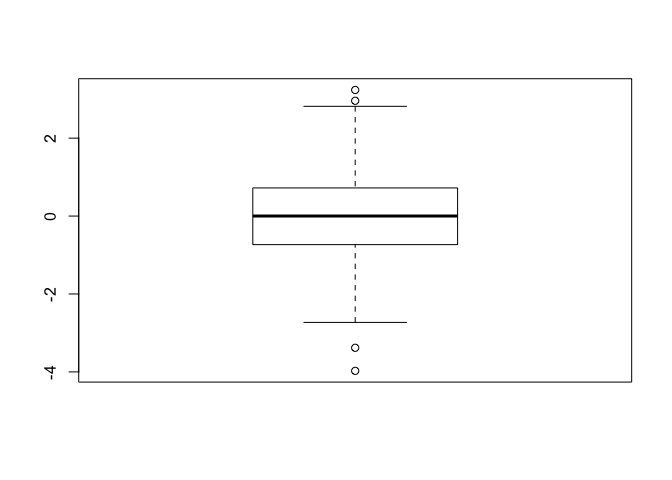

Class\_Rstudio\_Session1\_GITHUB\_Markdown
================

``` r
#Class 5 Data Visualization

x <- rnorm(1000)
#How many things are in x?
length(x)
```

    ## [1] 1000

``` r
mean(x)
```

    ## [1] -0.02735098

``` r
#Expected mean = 0

sd(x)
```

    ## [1] 1.031802

``` r
#Expected standard deviation = 1

#Summary function gives statistical summary of vector
summary(x)
```

    ##      Min.   1st Qu.    Median      Mean   3rd Qu.      Max. 
    ## -3.973157 -0.732392  0.001114 -0.027351  0.721968  3.237238

``` r
#boxplot of data
boxplot(x)
```

<!-- -->

``` r
hist(x)
rug(x)
```

<!-- -->

``` r
hist(x, breaks = 3)
```

<!-- -->

``` r
hist(x, breaks = 200)
```

<!-- -->

``` r
#Section2A
read.table(file="bimm143_05_rstats/weight_chart.txt")
```

    ##     V1     V2
    ## 1  Age Weight
    ## 2    0    3.6
    ## 3    1    4.4
    ## 4    2    5.2
    ## 5    3      6
    ## 6    4    6.6
    ## 7    5    7.2
    ## 8    6    7.8
    ## 9    7    8.4
    ## 10   8    8.8
    ## 11   9    9.2

``` r
#Want to change header to TRUE so that variable names in header, first line of table is the values.
weight <- read.table("bimm143_05_rstats/weight_chart.txt", header = TRUE)
#Print fixed table
weight
```

    ##    Age Weight
    ## 1    0    3.6
    ## 2    1    4.4
    ## 3    2    5.2
    ## 4    3    6.0
    ## 5    4    6.6
    ## 6    5    7.2
    ## 7    6    7.8
    ## 8    7    8.4
    ## 9    8    8.8
    ## 10   9    9.2

``` r
#Make scatter plot of data:
plot(weight$Age, weight$Weight)
```

<!-- -->

``` r
#Make it a line plot
plot(weight$Age, weight$Weight, type = "l")
```

<!-- -->

``` r
#Change the points to filled squares:
plot(weight$Age, weight$Weight, type = "o", pch = 15)
```

<!-- -->

``` r
#Now make the squares 1.5x times normal size:
plot(weight$Age, weight$Weight, type = "o", pch = 15, cex = 1.5)
```

<!-- -->

``` r
#Now make the line thickness 2x normal size:
plot(weight$Age, weight$Weight, type = "o", pch = 15, cex = 1.5, lwd = 2)
```

<!-- -->

``` r
#Now change the axis limits between 2 and 10kg
plot(weight$Age, weight$Weight, type ="o", pch = 15, cex = 1.5, lwd = 2, ylim=c(2,10))
```

<!-- -->

``` r
#Now label axes:
plot(weight$Age, weight$Weight, type = "o", pch = 15, cex = 1.5, lwd = 2, ylim=c(2,10), xlab = "Age (months)", ylab = "Weight (kg)")
```

<!-- -->

``` r
#Now name the whole chart:
plot(weight$Age, weight$Weight, type = "o", pch = 15, cex = 1.5, lwd = 2, ylim=c(2,10), xlab = "Age (months)", ylab = "Weight (kg)", main = "Baby Weight with Age")
```

<!-- -->

``` r
#Section 2B:
read.table(file ="bimm143_05_rstats/feature_counts.txt", header = TRUE, sep = "\t")
```

    ##                    Feature Count
    ## 1            Messenger RNA 79049
    ## 2         Coding Sequences 50770
    ## 3                    Genes 32029
    ## 4            Transfer RNAs 26248
    ## 5              CpG islands 13840
    ## 6              Pseudogenes  5195
    ## 7               Micro-RNAs  1638
    ## 8     Small nucleolar RNAs  1602
    ## 9       Small nuclear RNAs  1431
    ## 10       Miscellaneous RNA   491
    ## 11 Immunoglobulin Segments   474
    ## 12          Ribosomal RNAs   341

``` r
#OR...

read.delim(file = "bimm143_05_rstats/feature_counts.txt")
```

    ##                    Feature Count
    ## 1            Messenger RNA 79049
    ## 2         Coding Sequences 50770
    ## 3                    Genes 32029
    ## 4            Transfer RNAs 26248
    ## 5              CpG islands 13840
    ## 6              Pseudogenes  5195
    ## 7               Micro-RNAs  1638
    ## 8     Small nucleolar RNAs  1602
    ## 9       Small nuclear RNAs  1431
    ## 10       Miscellaneous RNA   491
    ## 11 Immunoglobulin Segments   474
    ## 12          Ribosomal RNAs   341

``` r
#Name this data "mouse"

mouse <- read.table(file= "bimm143_05_rstats/feature_counts.txt", header = TRUE, sep = "\t")

barplot(mouse$Count, names.arg=mouse$Feature, horiz = TRUE)
```

<!-- -->

``` r
#Flip horizontal and vertical axis

barplot(mouse$Count, names.arg=mouse$Feature, horiz = FALSE)
```

<!-- -->

``` r
par(mar=c(2.1, 11.1, 4.1, 1))
barplot(mouse$Count, names.arg=mouse$Feature, horiz = TRUE, las = 1, ylab = "Count", main = "Number of Features in the Mouse GRCm38 Genome")
```

<!-- -->

``` r
#Section 3A: Add color

read.delim("bimm143_05_rstats/male_female_counts.txt")
```

    ##       Sample Count
    ## 1    D1 Male     2
    ## 2  D1 Female     1
    ## 3    D2 Male     2
    ## 4  D2 Female     3
    ## 5    D3 Male     3
    ## 6  D3 Female     6
    ## 7    D4 Male     5
    ## 8  D4 Female    10
    ## 9    D5 Male     9
    ## 10 D5 Female    18

``` r
mousemf <- read.delim("bimm143_05_rstats/male_female_counts.txt")

barplot(mousemf$Count, names.arg=mouse$Sample)
```

<!-- -->

``` r
#Color it

barplot(mousemf$Count, names.arg=mouse$Sample, col = rainbow(10))
```

<!-- -->

``` r
#Make male bars different color from female:

barplot(mousemf$Count, names.arg=mousemf$Sample, col = c("blue2", "red2", "green", "black", "orange"), las = 2)
```

<!-- -->

``` r
barplot(mousemf$Count, names.arg=mousemf$Sample, col =rainbow(nrow(mousemf)), las = 2)
```

<!-- -->

``` r
par(mar=c(2.1, 11.1, 4.1, 1))      
par(mar=c(6, 2, 4, 6))     
```
