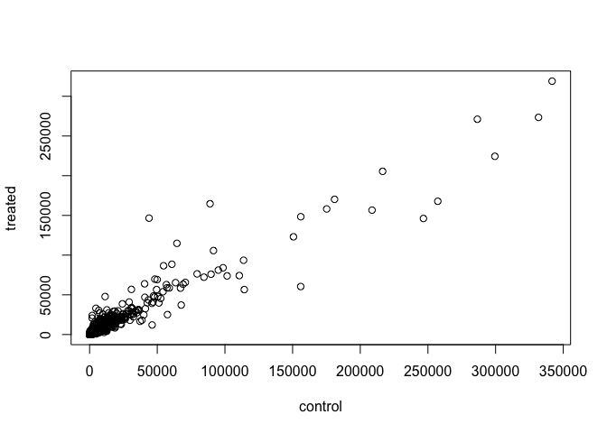
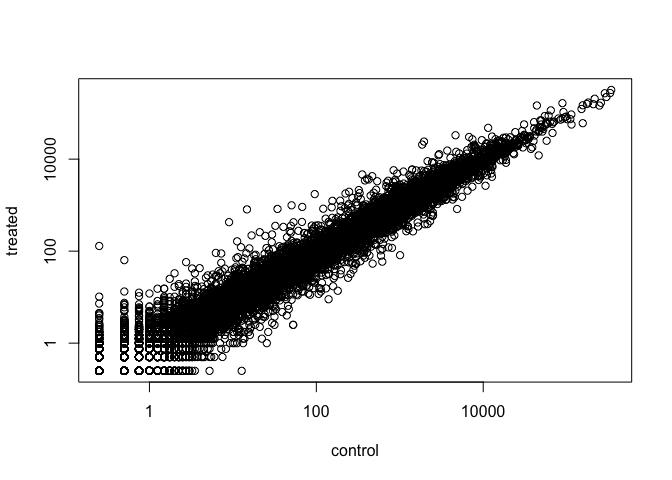
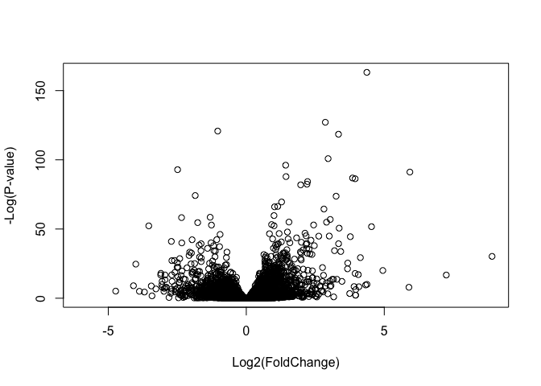

Introduction to DESeq2
================
Emily Armbruster

``` r
install.packages("BiocManager")
BiocManager::install()
# For this class, you'll also need DESeq2:
BiocManager::install("DESeq2")
```

# Section 2

##### We have already downloaded the data for our introduction to DESeq2. These files are named “airway\_scaledcounts.csv” and “airway\_metadata.csv”.

##### Use “read.csv()” to read the count and metadata

``` r
counts <- read.csv("airway_scaledcounts.csv", stringsAsFactors = FALSE)
metadata <- read.csv("airway_metadata.csv", stringsAsFactors = FALSE)
```

##### Now take a look in each file:

``` r
head(counts)
```

    ##           ensgene SRR1039508 SRR1039509 SRR1039512 SRR1039513 SRR1039516
    ## 1 ENSG00000000003        723        486        904        445       1170
    ## 2 ENSG00000000005          0          0          0          0          0
    ## 3 ENSG00000000419        467        523        616        371        582
    ## 4 ENSG00000000457        347        258        364        237        318
    ## 5 ENSG00000000460         96         81         73         66        118
    ## 6 ENSG00000000938          0          0          1          0          2
    ##   SRR1039517 SRR1039520 SRR1039521
    ## 1       1097        806        604
    ## 2          0          0          0
    ## 3        781        417        509
    ## 4        447        330        324
    ## 5         94        102         74
    ## 6          0          0          0

``` r
head(metadata)
```

    ##           id     dex celltype     geo_id
    ## 1 SRR1039508 control   N61311 GSM1275862
    ## 2 SRR1039509 treated   N61311 GSM1275863
    ## 3 SRR1039512 control  N052611 GSM1275866
    ## 4 SRR1039513 treated  N052611 GSM1275867
    ## 5 SRR1039516 control  N080611 GSM1275870
    ## 6 SRR1039517 treated  N080611 GSM1275871

##### How many genes are in this dataset?

``` r
nrow(counts)
```

    ## [1] 38694

##### 38694 genes\!

##### How many experiments do we have?

``` r
ncol(counts) - 1
```

    ## [1] 8

##### 8 experiments total…

##### We can check the metadata to find out which ones are control experiments and which are experimental conditions. Click on it’s name in the “environment” panel. The “dex” column tells you which experiments are controls.

##### Let’s make sure that the metadata id col matches the colnames of counts

``` r
colnames(counts)[-1]
```

    ## [1] "SRR1039508" "SRR1039509" "SRR1039512" "SRR1039513" "SRR1039516"
    ## [6] "SRR1039517" "SRR1039520" "SRR1039521"

``` r
metadata$id
```

    ## [1] "SRR1039508" "SRR1039509" "SRR1039512" "SRR1039513" "SRR1039516"
    ## [6] "SRR1039517" "SRR1039520" "SRR1039521"

``` r
(colnames(counts)[-1] == metadata$id)
```

    ## [1] TRUE TRUE TRUE TRUE TRUE TRUE TRUE TRUE

##### So these two lists are identical\! The experiment names for the two tables match.

##### The all() function is useful for looking across a vector of logicals.

``` r
all(c(T, T, T))
```

    ## [1] TRUE

# Section 3: Toy with Differential Gene Expression

## NOTE: This analysis is for demonstration only. Never do differential expression analysis this way\!

##### So now our goal is to find out what effect the anti-asthma drug has on these cells.

#### First step: condense the data in the control settings into one set of values. Take the mean of the 4 control experiments’ data.

``` r
# First select the columns in the metadata file that are controls
control <- metadata[metadata[,"dex"]=="control",]
#Then take the average of the counts for each of the experiments selected in the previous step.
control.mean <- rowSums( counts[ ,control$id] )/4 
names(control.mean) <- counts$ensgene
```

##### Print out the different steps of this code to see what it’s making:

``` r
control
```

    ##           id     dex celltype     geo_id
    ## 1 SRR1039508 control   N61311 GSM1275862
    ## 3 SRR1039512 control  N052611 GSM1275866
    ## 5 SRR1039516 control  N080611 GSM1275870
    ## 7 SRR1039520 control  N061011 GSM1275874

``` r
head(counts[,control$id])
```

    ##   SRR1039508 SRR1039512 SRR1039516 SRR1039520
    ## 1        723        904       1170        806
    ## 2          0          0          0          0
    ## 3        467        616        582        417
    ## 4        347        364        318        330
    ## 5         96         73        118        102
    ## 6          0          1          2          0

##### Note that using 4 instead of number of columns means that if you did more experiments it would be very difficult to use this code. Instead, lets’s use the number of columns:

``` r
control <- metadata[metadata[,"dex"]=="control",]
#Then take the average of the counts for each of the experiments selected in the previous step.
control.mean <- rowSums( counts[ ,control$id] )/length(control$id) 
names(control.mean) <- counts$ensgene
```

##### Do the same for controls:

``` r
treated <- metadata[metadata[,"dex"]=="treated",]
treated.mean <- rowSums( counts[ ,treated$id] )/length(treated$id) 
names(treated.mean) <- counts$ensgene
```

##### Combine for bookkeeping purposes…

``` r
meancounts <- data.frame(control.mean, treated.mean)
```

##### Find out the sums of all the means…

``` r
colSums(meancounts)
```

    ## control.mean treated.mean 
    ##     23005324     22196524

##### Now make a scatter plot to show mean treated vs mean controls.

``` r
plot(meancounts, xlab="control", ylab="treated")
```

<!-- -->

##### This looks pretty weird though doesn’t it? There are thousands of genes in this dataset but it doesn’t look like that many points as so many are clumped near the origin. Try to separate out the data via a log scale\! This is because most of the genes have a relatively low number of counts.

``` r
plot(meancounts, xlab="control", ylab="treated", log = "xy")
```

    ## Warning in xy.coords(x, y, xlabel, ylabel, log): 15032 x values <= 0
    ## omitted from logarithmic plot

    ## Warning in xy.coords(x, y, xlabel, ylabel, log): 15281 y values <= 0
    ## omitted from logarithmic plot

<!-- -->
\#\#\#\#\# Can find genes that might be affected by the drug by looking
at genes farther away from the m =1 line. Normally, we like to look for
a log2
change.

##### Calculate the log2 changes, add it to the metadata file and inspect as follows. If the gene expression decreases with treatment, the log2fc value will be negative. If the gene expression increases with treatment, the log2fc value will be positive.

``` r
meancounts$log2fc <- log2(meancounts[,"treated.mean"]/meancounts[,"control.mean"])
head(meancounts)
```

    ##                 control.mean treated.mean      log2fc
    ## ENSG00000000003       900.75       658.00 -0.45303916
    ## ENSG00000000005         0.00         0.00         NaN
    ## ENSG00000000419       520.50       546.00  0.06900279
    ## ENSG00000000457       339.75       316.50 -0.10226805
    ## ENSG00000000460        97.25        78.75 -0.30441833
    ## ENSG00000000938         0.75         0.00        -Inf

##### NaN = “not a number”. Means the value is undefined in some way. Either a number divided by zero.

##### \-Inf = “negative infinity”.

##### Let’s remove these weird results.

##### The which() function tells you indices of the logical objects = TRUE. The arr.ind argument tells whether the incices should be returned when x is an array.

##### The unique() function selects the unique elements. Duplicates are removed.

``` r
zero.vals <- which(meancounts[,1:2]==0, arr.ind=TRUE)
to.rm <- unique(zero.vals[,1])
mycounts <- meancounts[-to.rm,]
head(mycounts)
```

    ##                 control.mean treated.mean      log2fc
    ## ENSG00000000003       900.75       658.00 -0.45303916
    ## ENSG00000000419       520.50       546.00  0.06900279
    ## ENSG00000000457       339.75       316.50 -0.10226805
    ## ENSG00000000460        97.25        78.75 -0.30441833
    ## ENSG00000000971      5219.00      6687.50  0.35769358
    ## ENSG00000001036      2327.00      1785.75 -0.38194109

##### How many genes do we actually have data for?

``` r
nrow(mycounts)
```

    ## [1] 21817

# In-class addition: Test for finding zero entries:

### With a vector

``` r
x <- c(5, 8, 0, 5)
x == 0
```

    ## [1] FALSE FALSE  TRUE FALSE

``` r
which(x==0)
```

    ## [1] 3

### With a dataframe

``` r
x <- data.frame(happy = c(5, 6, 0, 0), sad = c(0, 5 ,5, 0))
x == 0
```

    ##      happy   sad
    ## [1,] FALSE  TRUE
    ## [2,] FALSE FALSE
    ## [3,]  TRUE FALSE
    ## [4,]  TRUE  TRUE

``` r
which(x==0)
```

    ## [1] 3 4 5 8

``` r
which(x==0, arr.ind = TRUE)
```

    ##      row col
    ## [1,]   3   1
    ## [2,]   4   1
    ## [3,]   1   2
    ## [4,]   4   2

##### Tells you that the first TRUE element is in row 3, column 1, etc.

##### Focus only on the rows that have zero entries:

``` r
which(x==0, arr.ind = TRUE)[,1]
```

    ## [1] 3 4 1 4

``` r
#Tell it to use unique to only return unique elements in the first column of the which() array.
unique(which(x==0, arr.ind = TRUE)[,1])
```

    ## [1] 3 4 1

##### One more example:

``` r
x <- data.frame(happy = c(0, 2, 6, 0, 12, 0), sad = c(0, 3, 0, 0, 0, 4))
```

``` r
which(x==0, arr.ind = TRUE)
```

    ##      row col
    ## [1,]   1   1
    ## [2,]   4   1
    ## [3,]   6   1
    ## [4,]   1   2
    ## [5,]   3   2
    ## [6,]   4   2
    ## [7,]   5   2

# End in-class tangent.

##### Common threshold for “differential expression” is a fold change of 2: greater than 2 or less than -2.

##### Let’s filter the data so that we only have genes above that change threshold.

##### First make a logical vector of genes. A change greater than 2 fold = TRUE.

``` r
up.ind <- mycounts$log2fc > 2
down.ind <- mycounts$log2fc < (-2)
sum(up.ind)
```

    ## [1] 250

``` r
sum(down.ind)
```

    ## [1] 367

##### So a total of 617 genes are differentially expressed.

# Section 4: Adding Annotation Data

##### First install packages for analysis:

``` r
library("AnnotationDbi")
```

    ## Loading required package: stats4

    ## Loading required package: BiocGenerics

    ## Loading required package: parallel

    ## 
    ## Attaching package: 'BiocGenerics'

    ## The following objects are masked from 'package:parallel':
    ## 
    ##     clusterApply, clusterApplyLB, clusterCall, clusterEvalQ,
    ##     clusterExport, clusterMap, parApply, parCapply, parLapply,
    ##     parLapplyLB, parRapply, parSapply, parSapplyLB

    ## The following objects are masked from 'package:stats':
    ## 
    ##     IQR, mad, sd, var, xtabs

    ## The following objects are masked from 'package:base':
    ## 
    ##     anyDuplicated, append, as.data.frame, basename, cbind,
    ##     colnames, dirname, do.call, duplicated, eval, evalq, Filter,
    ##     Find, get, grep, grepl, intersect, is.unsorted, lapply, Map,
    ##     mapply, match, mget, order, paste, pmax, pmax.int, pmin,
    ##     pmin.int, Position, rank, rbind, Reduce, rownames, sapply,
    ##     setdiff, sort, table, tapply, union, unique, unsplit, which,
    ##     which.max, which.min

    ## Loading required package: Biobase

    ## Welcome to Bioconductor
    ## 
    ##     Vignettes contain introductory material; view with
    ##     'browseVignettes()'. To cite Bioconductor, see
    ##     'citation("Biobase")', and for packages 'citation("pkgname")'.

    ## Loading required package: IRanges

    ## Loading required package: S4Vectors

    ## 
    ## Attaching package: 'S4Vectors'

    ## The following object is masked from 'package:base':
    ## 
    ##     expand.grid

``` r
library("org.Hs.eg.db")
```

    ## 

##### To see all things available in the “org.Hs.eg.db” package:

``` r
columns(org.Hs.eg.db)
```

    ##  [1] "ACCNUM"       "ALIAS"        "ENSEMBL"      "ENSEMBLPROT" 
    ##  [5] "ENSEMBLTRANS" "ENTREZID"     "ENZYME"       "EVIDENCE"    
    ##  [9] "EVIDENCEALL"  "GENENAME"     "GO"           "GOALL"       
    ## [13] "IPI"          "MAP"          "OMIM"         "ONTOLOGY"    
    ## [17] "ONTOLOGYALL"  "PATH"         "PFAM"         "PMID"        
    ## [21] "PROSITE"      "REFSEQ"       "SYMBOL"       "UCSCKG"      
    ## [25] "UNIGENE"      "UNIPROT"

##### We can use the maplds() function to add individual columns to the results table. Provide row names as a key and specify that keytype = ENSEMBL. column argument tells maplds() function what information we want and the multiVals argument tells the function what to do if there are multiple possible values for single input value.

``` r
mycounts$symbol <- mapIds(org.Hs.eg.db, keys=row.names(mycounts), 
# Our genenames 
keytype="ENSEMBL",
# The format of our genenames
column="SYMBOL",
# The new format we want to add
multiVals="first")
```

    ## 'select()' returned 1:many mapping between keys and columns

``` r
head(mycounts)
```

    ##                 control.mean treated.mean      log2fc   symbol
    ## ENSG00000000003       900.75       658.00 -0.45303916   TSPAN6
    ## ENSG00000000419       520.50       546.00  0.06900279     DPM1
    ## ENSG00000000457       339.75       316.50 -0.10226805    SCYL3
    ## ENSG00000000460        97.25        78.75 -0.30441833 C1orf112
    ## ENSG00000000971      5219.00      6687.50  0.35769358      CFH
    ## ENSG00000001036      2327.00      1785.75 -0.38194109    FUCA2

# DESeq2 analysis

##### Load DESeq2 with library(). We will use the DESeqDataSetFromMatrix() function to build the required DESeqDataSet object and call it dds, short for our DESeqDataSet.

``` r
library(DESeq2)
```

    ## Loading required package: GenomicRanges

    ## Loading required package: GenomeInfoDb

    ## Loading required package: SummarizedExperiment

    ## Loading required package: DelayedArray

    ## Loading required package: matrixStats

    ## 
    ## Attaching package: 'matrixStats'

    ## The following objects are masked from 'package:Biobase':
    ## 
    ##     anyMissing, rowMedians

    ## Loading required package: BiocParallel

    ## 
    ## Attaching package: 'DelayedArray'

    ## The following objects are masked from 'package:matrixStats':
    ## 
    ##     colMaxs, colMins, colRanges, rowMaxs, rowMins, rowRanges

    ## The following objects are masked from 'package:base':
    ## 
    ##     aperm, apply, rowsum

``` r
citation("DESeq2")
```

    ## 
    ##   Love, M.I., Huber, W., Anders, S. Moderated estimation of fold
    ##   change and dispersion for RNA-seq data with DESeq2 Genome
    ##   Biology 15(12):550 (2014)
    ## 
    ## A BibTeX entry for LaTeX users is
    ## 
    ##   @Article{,
    ##     title = {Moderated estimation of fold change and dispersion for RNA-seq data with DESeq2},
    ##     author = {Michael I. Love and Wolfgang Huber and Simon Anders},
    ##     year = {2014},
    ##     journal = {Genome Biology},
    ##     doi = {10.1186/s13059-014-0550-8},
    ##     volume = {15},
    ##     issue = {12},
    ##     pages = {550},
    ##   }

``` r
dds <- DESeqDataSetFromMatrix(countData=counts, 
                              colData=metadata, 
                              design=~dex, 
                              tidy=TRUE)
```

    ## converting counts to integer mode

    ## Warning in DESeqDataSet(se, design = design, ignoreRank): some variables in
    ## design formula are characters, converting to factors

``` r
dds
```

    ## class: DESeqDataSet 
    ## dim: 38694 8 
    ## metadata(1): version
    ## assays(1): counts
    ## rownames(38694): ENSG00000000003 ENSG00000000005 ...
    ##   ENSG00000283120 ENSG00000283123
    ## rowData names(0):
    ## colnames(8): SRR1039508 SRR1039509 ... SRR1039520 SRR1039521
    ## colData names(4): id dex celltype geo_id

``` r
sizeFactors(dds)
```

    ## NULL

``` r
dispersions(dds)
```

    ## NULL

``` r
dds <- DESeq(dds)
```

    ## estimating size factors

    ## estimating dispersions

    ## gene-wise dispersion estimates

    ## mean-dispersion relationship

    ## final dispersion estimates

    ## fitting model and testing

``` r
res <- results(dds)
res
```

    ## log2 fold change (MLE): dex treated vs control 
    ## Wald test p-value: dex treated vs control 
    ## DataFrame with 38694 rows and 6 columns
    ##                          baseMean     log2FoldChange             lfcSE
    ##                         <numeric>          <numeric>         <numeric>
    ## ENSG00000000003  747.194195359907 -0.350703020686579 0.168245681332529
    ## ENSG00000000005                 0                 NA                NA
    ## ENSG00000000419  520.134160051965  0.206107766417861 0.101059218008052
    ## ENSG00000000457  322.664843927049 0.0245269479387471 0.145145067649248
    ## ENSG00000000460   87.682625164828  -0.14714204922212 0.257007253994673
    ## ...                           ...                ...               ...
    ## ENSG00000283115                 0                 NA                NA
    ## ENSG00000283116                 0                 NA                NA
    ## ENSG00000283119                 0                 NA                NA
    ## ENSG00000283120 0.974916032393564  -0.66825846051647  1.69456285241871
    ## ENSG00000283123                 0                 NA                NA
    ##                               stat             pvalue              padj
    ##                          <numeric>          <numeric>         <numeric>
    ## ENSG00000000003   -2.0844696749953 0.0371174658432827 0.163034808641681
    ## ENSG00000000005                 NA                 NA                NA
    ## ENSG00000000419    2.0394751758463 0.0414026263001167 0.176031664879168
    ## ENSG00000000457  0.168982303952746  0.865810560623561 0.961694238404388
    ## ENSG00000000460  -0.57252099672319  0.566969065257939 0.815848587637724
    ## ...                            ...                ...               ...
    ## ENSG00000283115                 NA                 NA                NA
    ## ENSG00000283116                 NA                 NA                NA
    ## ENSG00000283119                 NA                 NA                NA
    ## ENSG00000283120 -0.394354484734893  0.693319342566817                NA
    ## ENSG00000283123                 NA                 NA                NA

``` r
summary(res)
```

    ## 
    ## out of 25258 with nonzero total read count
    ## adjusted p-value < 0.1
    ## LFC > 0 (up)       : 1563, 6.2%
    ## LFC < 0 (down)     : 1188, 4.7%
    ## outliers [1]       : 142, 0.56%
    ## low counts [2]     : 9971, 39%
    ## (mean count < 10)
    ## [1] see 'cooksCutoff' argument of ?results
    ## [2] see 'independentFiltering' argument of ?results

#### SKIPPED IN CLASS\!\! COME BACK AND FIX\!

# Section 6: Data Visualization

##### Make a volcano plot

``` r
plot( res$log2FoldChange,  -log(res$padj), 
      xlab="Log2(FoldChange)",
      ylab="-Log(P-value)")
```

<!-- -->
\#\#\#\#\# Add some cut-off lines

``` r
plot( res$log2FoldChange,  -log(res$padj), 
      xlab="Log2(FoldChange)",
      ylab="-Log(P-value)")

abline(v=c(-2,2), col="darkgray", lty=2)
abline(h=-log(0.05), col="darkgray", lty=2)
```

<!-- -->
\#\#\#\#\# Time to color
it\!

``` r
# Setup our custom point color vector. The values in brackets are the indices of the values.
mycols <- rep("gray", nrow(res))
mycols[ abs(res$log2FoldChange) > 2 ]  <- "red" 

inds <- (res$padj < 0.01) & (abs(res$log2FoldChange) > 2 )
mycols[ inds ] <- "blue"

# Volcano plot with custom colors 
plot( res$log2FoldChange,  -log(res$padj), 
 col=mycols, ylab="-Log(P-value)", xlab="Log2(FoldChange)" )

# Cut-off lines
abline(v=c(-2,2), col="gray", lty=2)
abline(h=-log(0.1), col="gray", lty=2)
```

<!-- -->
