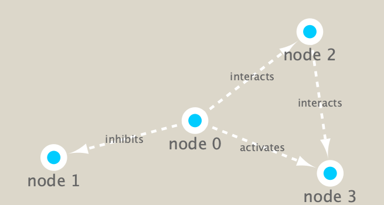

# We are going to do a little bit of network analysis with cytoscape!

##### First load RCy3, igraph and RColorBrewer

```{r}
library(RCy3)
library(igraph)
library(RColorBrewer)
```
##### These functions are a convenient way to verify a connection to Cytoscape and for logging the versions of RCy3 and Cytoscape in your scripts.

```{r}
# Test the connection to Cytoscape.
cytoscapePing()
```
```{r}
# Check the version
cytoscapeVersionInfo()
```
##### We can test things further by making a small network (here in igraph format as used by the R igraph package) and sending it to Cytoscape:

```{r}
g <- makeSimpleIgraph()
createNetworkFromIgraph(g,"myGraph")
```
##### If you turn to your Cytoscape window you should now see a simple 4 vertex and 4 edge network displayed (see below). We can include this Cytoscape rendered network image in our report with the following code:

```{r}
fig <- exportImage(filename="demo", type="png", height=350)
knitr::include_graphics("./demo.png")
```

## Switch Styles

##### Cytoscape provides a number of canned visual styles. The code below explores some of these styles. For example check out the marquee style!

```{r}
setVisualStyle("Marquee")
```

```{r}
fig <- exportImage(filename="demo_marquee", type="png", height=350)


```

##### You can find out what other styles are available and try a couple:

```{r}
styles <- getVisualStyleNames()
styles
```

##### Now we know that out connection between R and Cytoscape is running we can get to work with our real metagenomics data. Our first step is to read our data into R itself.

## Read our metagenomics data
##### We will read in a species co-occurrence matrix that was calculated using Spearman Rank coefficient. (see reference Lima-Mendez et al. (2015) for details).

```{r}
## scripts for processing located in "inst/data-raw/"
prok_vir_cor <- read.delim("virus_prok_cor_abundant.tsv", stringsAsFactors = FALSE)

## Have a peak at the first 6 rows
head(prok_vir_cor)
```

##### Here we will use the igraph package to convert the co-occurrence dataframe into a network that we can send to Cytoscape. In this case our graph is undirected (so we will set directed = FALSE) since we do not have any information about the direction of the interactions from this type of data.

```{r}
g <- graph.data.frame(prok_vir_cor, directed = FALSE)
```

