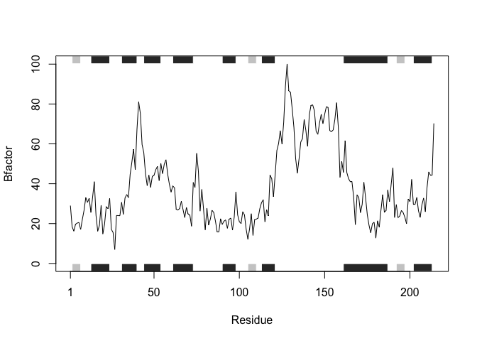

Class06\_homework\_Rmarkdown\_final
================

## Before we can work with read.pdb, we have to load the package bio3d.

``` r
library(bio3d)
```

## Function:

``` r
plot_protein <- function (x) {
  your_protein <- read.pdb(x) #Read the pdb file for protein x, making information from that file available for manipulation.
  
  your_protein.chainA <- trim.pdb(your_protein, chain= "A", elety="CA") #Selects a subset of atoms from the pdb file for protein x (designated 'your_protein'). In this case, selects chain A.
  
  your_protein.b <- your_protein.chainA$atom$b #Extracts vector 'b' from the data frame 'atoms' in the trimmed pdb file your_protein.chainA.
  
  plotb3(your_protein.b, sse=your_protein.chainA, typ="l", ylab="Bfactor") #Draws a scatter plot of the protein sequence (designated 'your_protein.b') where the Y axis is the Bfactor (a measure of atomic displacement in a crystal structure) and the X axis is the residue sequence of the peptide chain. The sse argument tells plotb3 to also display protein secondary structure information on the plot.
}
```

### Here, we use the function on a protein with pdb designation “4AKE”. We could use this function to do the same for any protein pdb file.

``` r
plot_protein("4AKE")
```

    ##   Note: Accessing on-line PDB file

<!-- -->

### Success\!

# Notes on the function:

#### Input:

#### The input of the function is a pdb coordinate file, which is represented by a four letter code in this case. This file contains the total number of atoms in the protein, coordinate data concerning where these atoms are in the protein, the types of atoms, the protein sequence, the chains in the protein, etc. Information about each atom is stored in a data frame.

#### What does it do and what is its output?:

#### This function takes a pdb.file, extracts atom displacement data for a specific part of that pdb.file, and plots the degree of displacement for each residue.
