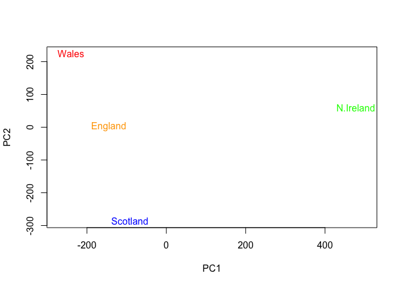
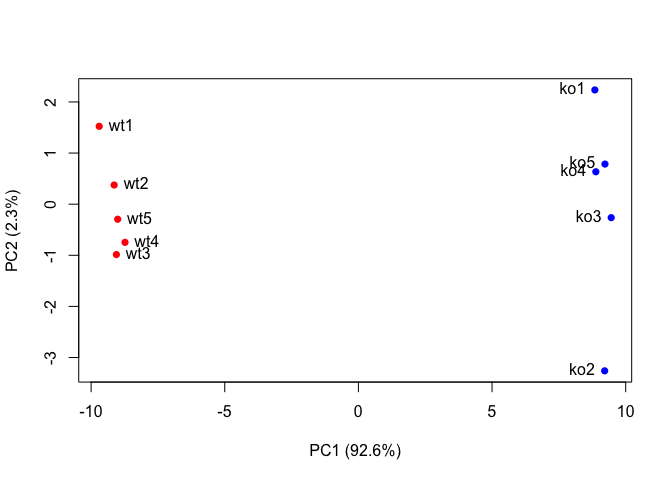

Hands on with Principal Component Analysis (PCA)
================
Emily Armbruster

# Background

##### In this worksheet, we learn about PCA and how it is used to analyse data with many variables.

# Section 1. PCA of UK food data

##### Let’s take a look at some data from the UK’s ‘Department for Environment, Food and Rural Affairs’ (DEFRA). It shows grams consumed (per person, per week) of 17 different types of foodstuff measured and averaged in the four countries of the United Kingdom in 1997.

##### Food types = “variables”

##### Countries = “observations”

##### Let’s read in the data\!

``` r
x <- read.csv("UK_foods.csv")
```

##### Use the nrow() and ncol() functions to determine the number of rows and columns in the dataframe. You could also use the structure function str() or dimensions function dim() to do this:

``` r
nrow(x)
```

    ## [1] 17

``` r
ncol(x)
```

    ## [1] 5

``` r
str(x)
```

    ## 'data.frame':    17 obs. of  5 variables:
    ##  $ X        : Factor w/ 17 levels "Alcoholic_drinks ",..: 5 3 12 8 7 17 10 11 13 14 ...
    ##  $ England  : int  105 245 685 147 193 156 720 253 488 198 ...
    ##  $ Wales    : int  103 227 803 160 235 175 874 265 570 203 ...
    ##  $ Scotland : int  103 242 750 122 184 147 566 171 418 220 ...
    ##  $ N.Ireland: int  66 267 586 93 209 139 1033 143 355 187 ...

``` r
dim(x)
```

    ## [1] 17  5

##### The first step of our analysis is to examine the imported data to make sure it looks the way you would expect. We can use the view(), head() or tail() functions to investigate this. However, since we’re going to knit this document, we will use head() and tail() but not view() as this will stop the document from knitting.

``` r
head(x)
```

    ##                X England Wales Scotland N.Ireland
    ## 1         Cheese     105   103      103        66
    ## 2  Carcass_meat      245   227      242       267
    ## 3    Other_meat      685   803      750       586
    ## 4           Fish     147   160      122        93
    ## 5 Fats_and_oils      193   235      184       209
    ## 6         Sugars     156   175      147       139

``` r
tail(x)
```

    ##                    X England Wales Scotland N.Ireland
    ## 12      Fresh_fruit     1102  1137      957       674
    ## 13          Cereals     1472  1582     1462      1494
    ## 14         Beverages      57    73       53        47
    ## 15      Soft_drinks     1374  1256     1572      1506
    ## 16 Alcoholic_drinks      375   475      458       135
    ## 17    Confectionery       54    64       62        41

##### Hm, it appears that the columns were set up incorrectly. The rownames are being considered part of the data. We can fix this by reading the file again and set row.names ot read.csv() to the first column. Do NOT use the rownames() function and then remove the first column of x. Everytime you run this code, it will remove the new first column of x.

``` r
x <- read.csv("UK_foods.csv", row.names=1)
head(x)
```

    ##                England Wales Scotland N.Ireland
    ## Cheese             105   103      103        66
    ## Carcass_meat       245   227      242       267
    ## Other_meat         685   803      750       586
    ## Fish               147   160      122        93
    ## Fats_and_oils      193   235      184       209
    ## Sugars             156   175      147       139

##### Much better\!

## Spotting major differences and trends:

##### Our first instinct might be to make a bar plot…

``` r
barplot(as.matrix(x), beside=T, col=rainbow(nrow(x)))
```

<!-- -->

``` r
par( mar=c (6, 10, 6, 6))
```

##### But this is also not particularly meaningful to look at.

##### Try making the barplot stack elements for each “observation” by setting the beside argument to FALSE.

``` r
barplot(as.matrix(x), col=rainbow(nrow(x)), beside = FALSE)
```

<!-- -->
\#\#\#\#\# This is also not particularly
helpful.

##### Next, let’s try pairwise comparisons:

``` r
pairs(x, col=rainbow(10), pch=16)
```

<!-- -->

##### Nope, still not so helpful.

## PCA to the rescue

##### Lots of functions and packages are available to perform PCA in R, but we’ll start with basic R functions. prcomp()function expects the observations to be rows and the variables to be columns therefore we need to first transpose our data.frame matrix (switch rows and columns) with the t() transpose function.

``` r
pca <- prcomp( t(x) )
summary(pca)
```

    ## Importance of components:
    ##                             PC1      PC2      PC3       PC4
    ## Standard deviation     324.1502 212.7478 73.87622 4.189e-14
    ## Proportion of Variance   0.6744   0.2905  0.03503 0.000e+00
    ## Cumulative Proportion    0.6744   0.9650  1.00000 1.000e+00

##### Step 1: Identify principal axes. In other words, find the directions of maximal variance through the coordinates in the n dimensional space (n representing the number of variables in the data set). We call this new axis the first principal component (or PC1) of the data. The second best axis PC2. The first two new principal axis (PC1 and PC2) represent useful ways to view and further investigate our data set. Plot the data in the PC1 column against the PC2 column.

``` r
pca
```

    ## Standard deviations (1, .., p=4):
    ## [1] 3.241502e+02 2.127478e+02 7.387622e+01 4.188568e-14
    ## 
    ## Rotation (n x k) = (17 x 4):
    ##                              PC1          PC2         PC3          PC4
    ## Cheese              -0.056955380 -0.016012850 -0.02394295 -0.691718038
    ## Carcass_meat         0.047927628 -0.013915823 -0.06367111  0.635384915
    ## Other_meat          -0.258916658  0.015331138  0.55384854  0.198175921
    ## Fish                -0.084414983  0.050754947 -0.03906481 -0.015824630
    ## Fats_and_oils       -0.005193623  0.095388656  0.12522257  0.052347444
    ## Sugars              -0.037620983  0.043021699  0.03605745  0.014481347
    ## Fresh_potatoes       0.401402060  0.715017078  0.20668248 -0.151706089
    ## Fresh_Veg           -0.151849942  0.144900268 -0.21382237  0.056182433
    ## Other_Veg           -0.243593729  0.225450923  0.05332841 -0.080722623
    ## Processed_potatoes  -0.026886233 -0.042850761  0.07364902 -0.022618707
    ## Processed_Veg       -0.036488269  0.045451802 -0.05289191  0.009235001
    ## Fresh_fruit         -0.632640898  0.177740743 -0.40012865 -0.021899087
    ## Cereals             -0.047702858  0.212599678  0.35884921  0.084667257
    ## Beverages           -0.026187756  0.030560542  0.04135860 -0.011880823
    ## Soft_drinks          0.232244140 -0.555124311  0.16942648 -0.144367046
    ## Alcoholic_drinks    -0.463968168 -0.113536523  0.49858320 -0.115797605
    ## Confectionery       -0.029650201 -0.005949921  0.05232164 -0.003695024

``` r
plot(pca$x[,1], pca$x[,2], xlab="PC1", ylab="PC2", xlim=c(-270,500), col = c("white"))
text(pca$x[,1], pca$x[,2], colnames(x), col = c("orange", "red", "blue", "green"))
```

<!-- -->

##### Now we can use the PCA to determine relationships between the different countries’ eating habits. Conveniently, in this case, PC1 and PC2 make up a total of ~97% of the total variation in the data set. Normally, we plot as many PCs to account for at least 70% of the variation.

##### We can use the square of PCA standard deviation to calculate how much variation the original data in each PC accounted for. Or you can look in the second row of the summary:

``` r
v <- round( pca$sdev^2/sum(pca$sdev^2) * 100 )
v
```

    ## [1] 67 29  4  0

``` r
z <- summary(pca)
z$importance
```

    ##                              PC1       PC2      PC3          PC4
    ## Standard deviation     324.15019 212.74780 73.87622 4.188568e-14
    ## Proportion of Variance   0.67444   0.29052  0.03503 0.000000e+00
    ## Cumulative Proportion    0.67444   0.96497  1.00000 1.000000e+00

##### These proportions of total variance is summarized in variances (epigenvalues) with respect to the principal component number:

``` r
barplot(v, xlab="Principal Component", ylab="Percent Variation")
```

<!-- -->

## Digging deeper (variable loadings)

##### Loading scores tell us about the influence of each of the original variables upon the principal components with the prcomp() returned $rotation component.

``` r
par(mar=c(10, 3, 0.35, 0))
barplot( pca$rotation[,1], las=2 )
```

<!-- -->
\#\#\#\#\# So we can see that fresh potatoes, soft drinks, fresh fruit
and alcoholic drinks have the greatest influence on North Irelands PCA
scores.

##### Variable influence can also be summarized with a call to biplot(), see below:

``` r
biplot(pca)
```

<!-- -->

# Section 2. PCA of RNA-seq data

##### RNA-seq results often contain a PCA, which can be used to verify that the control samples cluster together. But there is much more to be learned from these plots.

##### In this example, let’s use PCA on a small RNA-seq count data set.

``` r
rna.data <- read.csv("expression (1).csv", row.names=1)
head(rna.data)
```

    ##        wt1 wt2  wt3  wt4 wt5 ko1 ko2 ko3 ko4 ko5
    ## gene1  439 458  408  429 420  90  88  86  90  93
    ## gene2  219 200  204  210 187 427 423 434 433 426
    ## gene3 1006 989 1030 1017 973 252 237 238 226 210
    ## gene4  783 792  829  856 760 849 856 835 885 894
    ## gene5  181 249  204  244 225 277 305 272 270 279
    ## gene6  460 502  491  491 493 612 594 577 618 638

##### Transpose the data and then use PCA and plot:

``` r
pca <- prcomp(t(rna.data), scale=TRUE)
plot(pca$x[,1], pca$x[,2])
```

<!-- -->

##### Note that there are two obvious clusters of points.

##### Now use the square of pca$sdev to calculate how much variation in the original data each PC accounts for:

``` r
pca.var <- pca$sdev^2
pca.var.per <- round(pca.var/sum(pca.var)*100, 1)
pca.var.per
```

    ##  [1] 92.6  2.3  1.1  1.1  0.8  0.7  0.6  0.4  0.4  0.0

##### Use this data to generate a scree plot of these epigenvalues.

``` r
barplot(pca.var.per, main="Scree Plot", 
        xlab="Principal Component", ylab="Percent Variation")
```

<!-- -->
\#\#\#\#\# PC1 makes up the vast majority of the variation in the data
set
then.

##### The following code makes the original PCA plot more visually appealing, coloring the different experimental conditions and labeling the data:

``` r
colvec <- colnames(rna.data)
colvec[grep("wt", colvec)] <- "red"
colvec[grep("ko", colvec)] <- "blue"

plot(pca$x[,1], pca$x[,2], col=colvec, pch=16,
     xlab=paste0("PC1 (", pca.var.per[1], "%)"),
     ylab=paste0("PC2 (", pca.var.per[2], "%)"))

text(pca$x[,1], pca$x[,2], labels = colnames(rna.data), pos=c(rep(4,5), rep(2,5)))
```

<!-- -->

##### Use loading scores to identify the top ten genes that contribute to the variation in PC1. These genes would be good candidates for further investigation if we were looking at effects of some treatment or comparing gene expression in different cell types by looking at transcription.

``` r
loading_scores <- pca$rotation[,1]
gene_scores <- abs(loading_scores) 
gene_score_ranked <- sort(gene_scores, decreasing=TRUE)
top_10_genes <- names(gene_score_ranked[1:10])
top_10_genes 
```

    ##  [1] "gene100" "gene66"  "gene45"  "gene68"  "gene98"  "gene60"  "gene21" 
    ##  [8] "gene56"  "gene10"  "gene90"

``` r
sessionInfo()
```

    ## R version 3.6.1 (2019-07-05)
    ## Platform: x86_64-apple-darwin15.6.0 (64-bit)
    ## Running under: macOS Mojave 10.14.6
    ## 
    ## Matrix products: default
    ## BLAS:   /Library/Frameworks/R.framework/Versions/3.6/Resources/lib/libRblas.0.dylib
    ## LAPACK: /Library/Frameworks/R.framework/Versions/3.6/Resources/lib/libRlapack.dylib
    ## 
    ## locale:
    ## [1] en_US.UTF-8/en_US.UTF-8/en_US.UTF-8/C/en_US.UTF-8/en_US.UTF-8
    ## 
    ## attached base packages:
    ## [1] stats     graphics  grDevices utils     datasets  methods   base     
    ## 
    ## loaded via a namespace (and not attached):
    ##  [1] compiler_3.6.1  magrittr_1.5    tools_3.6.1     htmltools_0.4.0
    ##  [5] yaml_2.2.0      Rcpp_1.0.2      stringi_1.4.3   rmarkdown_1.16 
    ##  [9] knitr_1.25      stringr_1.4.0   xfun_0.10       digest_0.6.21  
    ## [13] rlang_0.4.1     evaluate_0.14
